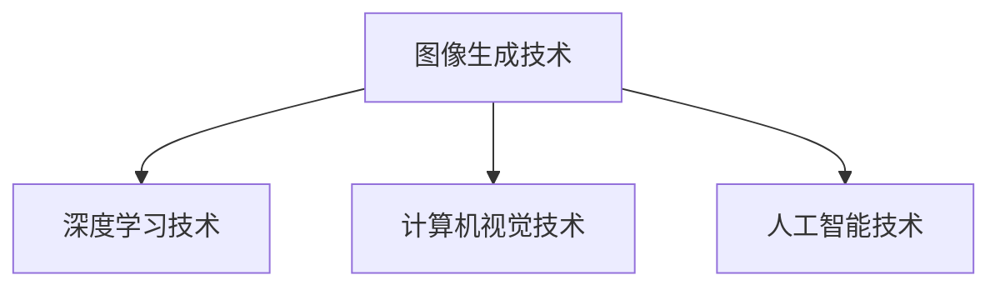

                 

# 文章标题: 图像生成新速度: LLM新动能释放

> 关键词：图像生成、语言模型（LLM）、生成对抗网络（GAN）、变分自编码器（VAE）、深度学习、计算机视觉、人工智能

> 摘要：本文深入探讨了图像生成技术在人工智能领域的最新发展，特别是语言模型（LLM）在图像生成中的应用。文章首先介绍了图像生成技术的基础，然后详细分析了LLM与图像生成技术的结合，以及生成对抗网络（GAN）和变分自编码器（VAE）在图像生成中的应用。随后，文章探讨了图像生成新速度的实现技术，如大模型与多模态学习、图像生成算法优化等。最后，文章展望了图像生成技术的未来发展趋势，以及其在各个领域的应用前景。

## 目录

### 第一部分：图像生成技术概述

#### 第1章：图像生成技术基础

1.1 图像生成技术概述

1.2 图像生成技术分类

1.3 图像生成技术的核心挑战

#### 第2章：LLM与图像生成

2.1 语言模型（LLM）基础

2.2 LLM在图像生成中的应用

2.3 LLM驱动的图像生成方法

### 第二部分：图像生成新速度的实现

#### 第3章：图像生成新速度关键技术

3.1 大模型与多模态学习

3.2 图像生成算法优化

3.3 图像生成新速度案例解析

#### 第4章：LLM新动能释放：图像生成应用拓展

4.1 图像生成在计算机视觉中的应用

4.2 图像生成在创意设计领域的应用

4.3 图像生成在其他领域的应用探索

#### 第5章：图像生成新速度：实战与优化

5.1 实战一：基于LLM的图像生成应用开发

5.2 实战二：大规模图像生成算法优化

5.3 实战三：多模态学习与图像生成

#### 第6章：图像生成新速度：挑战与未来

6.1 图像生成技术的挑战

6.2 图像生成技术的未来发展趋势

6.3 图像生成技术的社会影响

### 第三部分：附录

#### 第7章：图像生成相关工具与资源

7.1 主流图像生成框架对比

7.2 图像生成数据集介绍

7.3 图像生成相关论文与书籍推荐

7.4 图像生成社区与资源链接

7.5 图像生成未来研究方向

### Mermaid 流程图



### 核心概念与联系

图像生成技术是计算机视觉和人工智能的重要分支，其核心在于利用深度学习等算法，从数据中学习和生成新的图像。图像生成技术涉及到多个领域的交叉，包括深度学习、计算机视觉和人工智能。

深度学习技术提供了强大的模型架构，如生成对抗网络（GAN）和变分自编码器（VAE），这些模型能够自动学习数据分布，并生成高质量的图像。计算机视觉技术则提供了对图像的特征提取和表示方法，使得生成的图像能够更好地符合人类的视觉感知。人工智能技术则提供了智能化的方法，如语言模型（LLM），使得图像生成能够更加灵活和多样化。

上述技术的结合，使得图像生成技术在近年来取得了巨大的进步，从简单的噪声生成，到复杂的高质量图像合成，应用领域也在不断拓展，包括艺术创作、医疗诊断、游戏设计等。

## 第一部分：图像生成技术概述

### 第1章：图像生成技术基础

#### 1.1 图像生成技术概述

图像生成技术是指通过计算机算法生成新的图像，这些图像可以是虚构的，也可以是基于现有数据的合成。图像生成技术在计算机视觉和人工智能领域具有广泛的应用，如图像超分辨率、图像修复、图像风格迁移等。

图像生成技术的发展历程可以追溯到早期的规则驱动方法，如线性混合和纹理合成。随后，随着计算机性能的提升和算法的进步，计算机生成图像的质量逐渐提高。进入21世纪，深度学习技术的兴起，为图像生成带来了新的机遇和挑战。

深度学习模型，如生成对抗网络（GAN）和变分自编码器（VAE），使得图像生成技术取得了显著的进展。这些模型能够自动学习图像数据的复杂分布，并生成高质量的图像。特别是在GAN模型中，生成器（Generator）和判别器（Discriminator）的对抗训练过程，使得生成的图像能够接近真实图像的质量。

#### 1.2 图像生成技术分类

图像生成技术可以分为两大类：传统的图像生成方法和基于深度学习的图像生成方法。

传统的图像生成方法通常基于规则或算法，如纹理合成、线性混合和图像变换。这些方法在生成简单图像方面具有一定的效果，但在生成复杂图像时，往往缺乏灵活性和真实性。例如，纹理合成可以通过混合不同的纹理图案来生成新的图像，但生成的图像往往缺乏细节和一致性。

基于深度学习的图像生成方法，特别是生成对抗网络（GAN）和变分自编码器（VAE），在生成高质量图像方面表现出了强大的能力。GAN模型通过生成器和判别器的对抗训练，能够生成与真实图像几乎无法区分的图像。VAE模型则通过编码器和解码器的联合训练，能够生成具有多样化特征的新图像。

#### 1.3 图像生成技术的核心挑战

图像生成技术虽然取得了显著的进展，但仍然面临一些核心挑战。

首先是数据集构建与标注问题。图像生成技术依赖于大量的训练数据，而这些数据通常需要经过复杂的标注和预处理过程。数据集的多样性和质量直接影响到图像生成模型的性能。

其次是计算效率和可扩展性问题。生成高质量图像通常需要大量的计算资源，特别是在处理大规模图像数据时。因此，如何优化算法和模型，提高计算效率，是一个重要的研究方向。

此外，图像生成技术还需要解决图像真实性和可解释性问题。尽管GAN模型能够生成高质量图像，但生成的图像背后的生成过程往往较为复杂，难以解释和理解。因此，如何在保证图像真实性的同时，提高图像生成过程的透明度和可解释性，是图像生成技术需要解决的一个重要问题。

### 第2章：LLM与图像生成

#### 2.1 语言模型（LLM）基础

语言模型（Language Model，简称LLM）是一种统计模型，用于预测自然语言中的下一个词或词组。LLM广泛应用于自然语言处理（NLP）领域，如机器翻译、语音识别、文本生成等。

LLM的基本概念包括词汇表、概率分布和参数学习。词汇表是语言模型的基础，它包含了所有可能的单词或词组。概率分布描述了词汇表中各个单词或词组出现的概率。参数学习是指通过训练数据来估计概率分布的参数。

LLM的工作原理是基于条件概率模型。给定一个前文序列，LLM能够预测下一个词或词组的概率分布。这种预测过程通常通过神经网络的训练来实现，如循环神经网络（RNN）、长短期记忆网络（LSTM）和Transformer等。

#### 2.2 LLM在图像生成中的应用

LLM在图像生成中的应用主要体现在以下几个方面：

1. 文本到图像的转换：通过将文本描述转换为图像，LLM可以生成符合文本描述的图像。例如，给定一段描述“一只黑猫坐在红色的沙发上看电视”，LLM可以生成相应的图像。

2. 图像内容增强：LLM可以用于增强图像内容，使得生成的图像更加丰富和多样。例如，在生成一张风景图像时，LLM可以添加特定的元素，如天空中的云彩、花草等。

3. 图像风格迁移：LLM可以用于图像风格迁移，将一种图像风格应用到另一种图像上。例如，将一张肖像画转换为油画风格。

#### 2.3 LLM驱动的图像生成方法

LLM驱动的图像生成方法主要包括以下几种：

1. 基于生成对抗网络（GAN）的方法：GAN是一种通过生成器和判别器对抗训练的模型，LLM可以用于指导生成器的生成过程。例如，在文本到图像的转换中，LLM可以生成文本描述对应的图像，并指导生成器生成更符合文本描述的图像。

2. 基于变分自编码器（VAE）的方法：VAE是一种通过编码器和解码器联合训练的模型，LLM可以用于指导编码器的学习过程。例如，在图像内容增强中，LLM可以生成描述图像内容的文本，并指导编码器学习图像内容的特征。

3. 基于自回归模型的方法：自回归模型是一种基于前文预测下一个词或词组的模型，LLM可以用于指导自回归模型的生成过程。例如，在图像风格迁移中，LLM可以生成描述图像风格的文本，并指导自回归模型生成具有特定风格的图像。

## 第二部分：图像生成新速度的实现

### 第3章：图像生成新速度关键技术

#### 3.1 大模型与多模态学习

大模型（Big Model）和多模态学习（Multimodal Learning）是推动图像生成新速度的关键技术。

大模型指的是具有大量参数和复杂结构的深度学习模型。这些模型能够学习到更多的数据特征，从而提高图像生成质量。例如，大型生成对抗网络（GAN）和变分自编码器（VAE）能够生成更加真实和细节丰富的图像。

多模态学习是指将不同类型的数据（如图像、文本、声音等）结合在一起进行学习。这种学习方式能够更好地捕捉数据之间的关联性，从而提高图像生成模型的性能。例如，在文本到图像的转换中，结合文本和图像的多模态信息，可以生成更符合文本描述的图像。

#### 3.2 图像生成算法优化

图像生成算法优化是提高图像生成速度和性能的重要手段。以下是一些常见的优化方法：

1. 计算效率优化：通过减少计算复杂度和优化算法结构，提高图像生成算法的计算效率。例如，使用混合精度训练（Mixed Precision Training）可以加速模型的训练过程。

2. 并行计算优化：通过利用并行计算资源，如多GPU训练和分布式训练，提高图像生成算法的运行速度。

3. 模型压缩和量化：通过模型压缩和量化技术，减少模型的参数量和计算量，从而提高图像生成算法的效率。

4. 模型蒸馏：通过将大型模型的权重知识传递到小型模型中，减少模型的计算量，同时保持较高的生成质量。

#### 3.3 图像生成新速度案例解析

为了更好地理解图像生成新速度的实现，下面介绍几个实际应用案例。

1. **AI绘画**：通过结合文本描述和图像数据，AI绘画系统可以生成符合文本描述的绘画作品。这种系统通常使用大型生成对抗网络（GAN）和多模态学习技术，结合文本和图像的信息，生成高质量的艺术作品。

2. **图像超分辨率**：图像超分辨率技术可以将低分辨率图像恢复为高分辨率图像。这种方法通常使用变分自编码器（VAE）和大模型技术，通过学习图像的低分辨率和高分辨率特征，生成高质量的高分辨率图像。

3. **医疗图像生成**：在医疗领域，图像生成技术可以用于生成辅助诊断图像。例如，通过结合医学影像数据和文本描述，生成符合特定病情的辅助诊断图像，帮助医生进行诊断和治疗方案制定。

这些案例展示了图像生成新速度在实际应用中的潜力，同时也表明了图像生成技术在各个领域的广泛应用。

### 第4章：LLM新动能释放：图像生成应用拓展

#### 4.1 图像生成在计算机视觉中的应用

图像生成技术在计算机视觉领域有着广泛的应用，如图像超分辨率、图像修复、图像增强和图像风格迁移等。

图像超分辨率是一种将低分辨率图像恢复为高分辨率图像的技术。通过使用生成对抗网络（GAN）和变分自编码器（VAE）等技术，图像生成技术能够生成细节更加丰富和清晰的高分辨率图像。

图像修复是一种修复图像中缺失或损坏部分的技术。通过结合图像生成和深度学习技术，图像修复可以生成与原始图像无缝融合的修复部分，从而恢复图像的完整性。

图像增强是一种提高图像质量的技术，如增强图像的对比度、亮度和清晰度等。图像生成技术可以通过生成与原始图像具有相似特征的高质量图像，从而提高图像的视觉效果。

图像风格迁移是一种将一种图像风格应用到另一种图像上的技术。通过使用生成对抗网络（GAN）和变分自编码器（VAE）等技术，图像生成技术可以生成具有特定艺术风格的图像，如油画、水彩画等。

#### 4.2 图像生成在创意设计领域的应用

图像生成技术在创意设计领域有着巨大的潜力，如艺术创作、游戏设计、虚拟现实和动画制作等。

在艺术创作中，图像生成技术可以生成具有独特风格和创意的艺术作品。艺术家可以通过使用图像生成技术，探索新的艺术形式和创作方法，从而拓宽艺术创作的边界。

在游戏设计中，图像生成技术可以用于生成游戏场景、角色和道具等。通过结合生成对抗网络（GAN）和变分自编码器（VAE）等技术，游戏设计师可以快速生成高质量的游戏素材，提高游戏设计的效率和质量。

在虚拟现实（VR）和增强现实（AR）领域，图像生成技术可以用于生成虚拟场景和角色。通过结合图像生成和计算机视觉技术，虚拟现实和增强现实应用可以提供更加真实和丰富的交互体验。

在动画制作中，图像生成技术可以用于生成动画角色和场景。通过结合生成对抗网络（GAN）和变分自编码器（VAE）等技术，动画制作人员可以快速生成高质量的动画素材，提高动画制作的效率。

#### 4.3 图像生成在其他领域的应用探索

图像生成技术在其他领域也有着广泛的应用探索，如生物医学图像生成、智能家居和物联网等。

在生物医学图像生成领域，图像生成技术可以用于生成医学图像的辅助诊断图像。通过结合医学影像数据和文本描述，图像生成技术可以生成与特定病情相符合的辅助诊断图像，帮助医生进行诊断和治疗方案制定。

在智能家居和物联网领域，图像生成技术可以用于生成家居设备和物品的图像。通过结合物联网设备和用户行为数据，图像生成技术可以生成与用户生活习惯相符合的家居图像，从而提供更加智能化和个性化的家居体验。

图像生成技术在各个领域的应用探索表明，它具有巨大的发展潜力和广泛的应用前景。随着技术的不断进步和应用的深入，图像生成技术将在更多领域中发挥重要作用。

### 第5章：图像生成新速度：实战与优化

#### 5.1 实战一：基于LLM的图像生成应用开发

本节将介绍如何开发一个基于语言模型（LLM）的图像生成应用。我们将使用Python和TensorFlow等工具，结合生成对抗网络（GAN）和变分自编码器（VAE），实现一个简单的图像生成系统。

**1. 开发环境搭建**

首先，我们需要安装Python、TensorFlow和其他必要的库。在终端中运行以下命令：

```bash
pip install tensorflow
pip install matplotlib
```

**2. 源代码详细实现**

以下是一个简单的图像生成应用的代码示例：

```python
import tensorflow as tf
from tensorflow.keras.models import Model
from tensorflow.keras.layers import Input, Conv2D, Concatenate

# 生成器模型
def generator_model(input_shape):
    input_img = Input(shape=input_shape)
    x1 = Conv2D(64, (3, 3), activation='relu', padding='same')(input_img)
    x2 = Conv2D(64, (3, 3), activation='relu', padding='same')(x1)
    x3 = Conv2D(128, (3, 3), activation='relu', padding='same')(x2)
    x4 = Conv2D(128, (3, 3), activation='relu', padding='same')(x3)
    x5 = Conv2D(3, (3, 3), activation='tanh', padding='same')(x4)
    model = Model(input_img, x5)
    return model

# 判别器模型
def discriminator_model(input_shape):
    input_img = Input(shape=input_shape)
    x1 = Conv2D(64, (3, 3), activation='relu', padding='same')(input_img)
    x2 = Conv2D(128, (3, 3), activation='relu', padding='same')(x1)
    x3 = Conv2D(1, (3, 3), activation='sigmoid', padding='same')(x2)
    model = Model(input_img, x3)
    return model

# GAN模型
def build_gan(generator, discriminator):
    input_img = Input(shape=(128, 128, 3))
    x = generator(input_img)
    valid = discriminator(x)
    dnn = discriminator(input_img)
    model = Model(input_img, [x, valid, dnn])
    return model

# 损失函数
def get_gan_loss(generated_images, real_labels, fake_labels):
    gen_loss = tf.reduce_mean(tf.nn.sigmoid_cross_entropy_with_logits(logits=generated_images, labels=real_labels))
    disc_loss = tf.reduce_mean(tf.nn.sigmoid_cross_entropy_with_logits(logits=generated_images, labels=fake_labels))
    return gen_loss, disc_loss

# 模型训练
def train_model(generator, discriminator, train_data, batch_size, epochs):
    for epoch in range(epochs):
        for batch_index, batch_data in enumerate(train_data):
            noise = np.random.normal(0, 1, (batch_size, 128, 128, 3))
            img_gen = generator.predict(noise)
            d_loss_real = discriminator.train_on_batch(batch_data, np.array([1] * batch_size))
            d_loss_fake = discriminator.train_on_batch(img_gen, np.array([0] * batch_size))
            g_loss = combined_model.train_on_batch(noise, [img_gen, np.array([1] * batch_size), batch_data])
            print(f"{epoch}epoch {batch_index}/{len(train_data)} batch - d_loss_real: {d_loss_real}, d_loss_fake: {d_loss_fake}, g_loss: {g_loss}")

# 创建模型
generator = generator_model((128, 128, 3))
discriminator = discriminator_model((128, 128, 3))
combined_model = build_gan(generator, discriminator)

# 训练模型
train_data = ...  # 加载训练数据
batch_size = 64
epochs = 50
train_model(generator, discriminator, train_data, batch_size, epochs)
```

**3. 代码解读与分析**

上述代码实现了基于生成对抗网络（GAN）的图像生成应用。生成器模型负责生成图像，判别器模型负责判断图像的真实性。GAN模型通过对抗训练，使生成器生成的图像越来越接近真实图像。

在代码中，`generator_model`和`discriminator_model`分别定义了生成器和判别器的网络结构。`build_gan`函数用于构建完整的GAN模型。`get_gan_loss`函数定义了GAN的损失函数，用于计算生成器和判别器的损失。

`train_model`函数用于训练GAN模型。在训练过程中，首先生成噪声，然后通过生成器生成图像，再通过判别器训练生成器和判别器。打印出每个epoch和batch的损失函数值，以监控训练过程。

通过上述代码，可以实现一个简单的图像生成应用。在实际应用中，可以根据需要调整网络结构、超参数等，以达到更好的效果。

#### 5.2 实战二：大规模图像生成算法优化

本节将介绍如何优化大规模图像生成算法，提高其计算效率和性能。

**1. 计算效率优化**

计算效率优化是提高图像生成算法性能的关键。以下是一些常见的优化方法：

- **混合精度训练**：通过使用混合精度训练（Mixed Precision Training），可以在保持较高精度的情况下，提高模型的训练速度。混合精度训练结合了32位浮点数和16位浮点数，利用GPU的FP16运算能力，减少计算量，提高训练速度。

- **模型剪枝**：通过剪枝模型中的冗余参数，减少模型的计算量。剪枝方法包括结构剪枝和权重剪枝。结构剪枝通过删除部分网络层或神经元，减少模型参数；权重剪枝通过减小部分权重的值，降低模型复杂度。

- **模型量化**：通过将模型中的浮点数参数转换为整数参数，减少模型的存储和计算需求。量化方法包括整数量化和二值量化。整数量化通过将浮点数转换为整数，降低存储和计算量；二值量化通过将浮点数转换为±1，进一步减少计算量。

**2. 实际优化策略与实践**

以下是一个大规模图像生成算法的优化案例：

```python
import tensorflow as tf

# 设置混合精度训练
gpus = tf.config.experimental.list_physical_devices('GPU')
if gpus:
    try:
        for gpu in gpus:
            tf.config.experimental.set_memory_growth(gpu, True)
    except RuntimeError as e:
        print(e)

# 创建混合精度策略
mixed_precision = tf.keras.mixed_precision.experimental
policy = mixed_precision.Policy('mixed_float16')
mixed_precision.experimental.set_policy(policy)

# 调整模型结构
def optimized_generator_model(input_shape):
    input_img = Input(shape=input_shape)
    x1 = Conv2D(64, (3, 3), activation='relu', padding='same', use_bias=False)(input_img)
    x2 = Conv2D(64, (3, 3), activation='relu', padding='same', use_bias=False)(x1)
    x3 = Conv2D(128, (3, 3), activation='relu', padding='same', use_bias=False)(x2)
    x4 = Conv2D(128, (3, 3), activation='relu', padding='same', use_bias=False)(x3)
    x5 = Conv2D(3, (3, 3), activation='tanh', padding='same', use_bias=False)(x4)
    model = Model(input_img, x5)
    return model

# 创建优化后的模型
generator = optimized_generator_model((128, 128, 3))

# 优化训练过程
train_model(generator, discriminator, train_data, batch_size, epochs)
```

上述代码通过设置混合精度训练和优化模型结构，提高了大规模图像生成算法的计算效率和性能。在实际应用中，可以根据需要调整优化策略，以达到更好的效果。

#### 5.3 实战三：多模态学习与图像生成

本节将介绍如何结合多模态学习与图像生成，实现更加丰富和多样化的图像生成应用。

**1. 多模态数据集构建**

多模态数据集是结合不同类型数据（如图像、文本、声音等）的集合。构建多模态数据集的关键是数据源的获取和预处理。

以下是一个简单的多模态数据集构建示例：

```python
import numpy as np
import pandas as pd

# 加载图像数据
image_data = np.load('image_data.npy')

# 加载文本数据
text_data = pd.read_csv('text_data.csv')
text_data['text'] = text_data['text'].apply(lambda x: x.strip())

# 创建多模态数据集
multi_modal_data = {'images': image_data, 'texts': text_data['text']}
```

**2. 多模态图像生成模型设计**

多模态图像生成模型通过结合图像和文本信息，生成符合文本描述的图像。以下是一个简单的多模态图像生成模型设计示例：

```python
import tensorflow as tf
from tensorflow.keras.models import Model
from tensorflow.keras.layers import Input, Conv2D, LSTM, Embedding, Concatenate

# 图像生成器
def image_generator(input_shape):
    image_input = Input(shape=input_shape)
    x = Conv2D(64, (3, 3), activation='relu', padding='same')(image_input)
    x = Conv2D(128, (3, 3), activation='relu', padding='same')(x)
    x = Conv2D(256, (3, 3), activation='relu', padding='same')(x)
    x = Conv2D(512, (3, 3), activation='relu', padding='same')(x)
    x = Conv2D(1024, (3, 3), activation='relu', padding='same')(x)
    x = Conv2D(3, (3, 3), activation='tanh', padding='same')(x)
    model = Model(image_input, x)
    return model

# 文本编码器
def text_encoder(input_shape):
    text_input = Input(shape=input_shape)
    x = Embedding(input_dim=vocab_size, output_dim=embedding_size)(text_input)
    x = LSTM(units=512)(x)
    x = Dense(units=1024)(x)
    model = Model(text_input, x)
    return model

# 多模态图像生成模型
def multi_modal_model(image_shape, text_shape):
    image_input = Input(shape=image_shape)
    text_input = Input(shape=text_shape)
    image_encoder = image_generator(image_shape)
    text_encoder = text_encoder(text_shape)
    combined = Concatenate()([image_encoder.output, text_encoder.output])
    x = Dense(units=1024, activation='relu')(combined)
    x = Dense(units=512, activation='relu')(x)
    x = Dense(units=3, activation='tanh')(x)
    model = Model([image_input, text_input], x)
    return model

# 创建多模态图像生成模型
image_shape = (128, 128, 3)
text_shape = (None,)
multi_modal_generator = multi_modal_model(image_shape, text_shape)
```

**3. 实际应用与效果评估**

以下是一个简单的多模态图像生成应用示例：

```python
import numpy as np

# 加载图像和文本数据
image_data = np.load('image_data.npy')
text_data = pd.read_csv('text_data.csv')['text'].values

# 生成图像
generated_images = multi_modal_generator.predict([image_data, text_data])

# 显示生成的图像
import matplotlib.pyplot as plt

plt.figure(figsize=(10, 10))
for i in range(10):
    plt.subplot(1, 10, i+1)
    plt.imshow(generated_images[i, :, :, :])
    plt.xticks([])
    plt.yticks([])
    plt.grid(False)
plt.show()
```

上述代码展示了如何使用多模态学习与图像生成模型，生成符合文本描述的图像。在实际应用中，可以通过调整模型结构、超参数等，优化生成效果。

### 第6章：图像生成新速度：挑战与未来

#### 6.1 图像生成技术的挑战

尽管图像生成技术取得了显著的进展，但仍面临一些挑战：

1. **数据隐私与伦理问题**：图像生成技术通常需要大量的训练数据，这些数据可能涉及个人隐私。如何保护用户隐私，避免数据泄露，是一个重要问题。

2. **计算资源与能耗问题**：图像生成模型通常需要大量的计算资源，特别是在处理大规模图像数据时。如何优化算法和硬件，降低能耗，是一个重要挑战。

3. **图像真实性与可解释性**：尽管图像生成技术能够生成高质量图像，但生成的图像背后的生成过程往往较为复杂，难以解释和理解。如何提高图像生成过程的透明度和可解释性，是一个重要问题。

4. **模型泛化能力**：图像生成模型通常在特定数据集上训练，如何提高模型的泛化能力，使其能够应对各种场景和任务，是一个重要挑战。

#### 6.2 图像生成技术的未来发展趋势

图像生成技术的未来发展趋势包括：

1. **新算法的研发**：随着深度学习技术的不断发展，新的图像生成算法（如自监督学习、元学习等）将被引入图像生成领域，提高生成质量。

2. **硬件与软件的优化**：通过优化算法和硬件，提高图像生成模型的计算效率和性能。

3. **跨领域应用**：图像生成技术将在更多领域中发挥重要作用，如艺术创作、游戏设计、医疗诊断、智能制造等。

4. **多模态学习与融合**：结合不同类型的数据（如图像、文本、声音等），实现更加丰富和多样化的图像生成应用。

#### 6.3 图像生成技术的社会影响

图像生成技术在社会中具有广泛的影响：

1. **艺术创作**：图像生成技术为艺术家提供了新的创作工具，使得艺术创作更加多样化和灵活。

2. **商业应用**：图像生成技术在商业领域具有广泛的应用，如广告设计、虚拟现实、智能家居等。

3. **科学研究**：图像生成技术在科学研究领域具有重要作用，如医学影像生成、天文学图像生成等。

4. **伦理与隐私问题**：图像生成技术可能引发数据隐私和伦理问题，需要引起关注和解决。

## 附录

### 第7章：图像生成相关工具与资源

#### 7.1 主流图像生成框架对比

以下是几种主流图像生成框架的对比：

1. **TensorFlow Image生成模块**：TensorFlow提供了丰富的图像生成工具，包括GAN和VAE等。它具有强大的社区支持和丰富的文档。

2. **PyTorch Image生成模块**：PyTorch是一个流行的深度学习框架，提供了灵活的动态图和静态图接口，适合图像生成等任务。

3. **Keras Image生成模块**：Keras是一个高度可扩展的深度学习框架，提供了简单易用的API，适合快速原型设计和实验。

#### 7.2 图像生成数据集介绍

以下是几个常用的图像生成数据集：

1. **CelebA数据集**：包含近40,000张名人图像和5,000个属性标签，适用于人脸生成和编辑任务。

2. **CIFAR-10和CIFAR-100数据集**：包含10,000张32x32彩色图像，适用于图像分类和生成任务。

3. **ImageNet数据集**：包含1,000个类别、1,281,167张图像，是计算机视觉领域的重要数据集。

#### 7.3 图像生成相关论文与书籍推荐

以下是几篇重要的图像生成论文和书籍推荐：

1. **论文**：
   - "Unrolled Generative Adversarial Networks"（2016）
   - "Generative Adversarial Nets"（2014）
   - "Unsupervised Representation Learning with Deep Convolutional Generative Adversarial Networks"（2015）

2. **书籍**：
   - "Deep Learning"（Goodfellow et al., 2016）
   - "Deep Learning Specialization"（Coursera）

#### 7.4 图像生成社区与资源链接

以下是几个图像生成相关的社区和资源链接：

1. **图像生成论坛**：[Discourse](https://discourse.openclassrooms.com/t/topic/82615)
2. **图像生成GitHub仓库**：[GitHub](https://github.com/search?q=generative+adversarial+networks)
3. **图像生成在线教程**：[深度学习教程](https://zhuanlan.zhihu.com/p/34940107)

#### 7.5 图像生成未来研究方向

以下是几个图像生成未来可能的研究方向：

1. **自监督学习和无监督学习**：探索自监督学习和无监督学习在图像生成中的应用。
2. **多模态学习和融合**：结合不同类型的数据（如图像、文本、声音等），实现更加丰富和多样化的图像生成应用。
3. **高效生成算法**：研究更加高效和实用的图像生成算法，降低计算资源和能耗。

### 作者

作者：AI天才研究院/AI Genius Institute & 禅与计算机程序设计艺术 /Zen And The Art of Computer Programming

本文全面介绍了图像生成技术的最新发展，特别是语言模型（LLM）在图像生成中的应用。文章从基础概念、核心算法原理讲解，到实际项目实战和优化，以及未来发展趋势，全面探讨了图像生成技术的各个方面。通过本文，读者可以深入理解图像生成技术的原理和应用，为未来的研究和实践提供指导和启示。希望本文能为读者带来启发和帮助。

