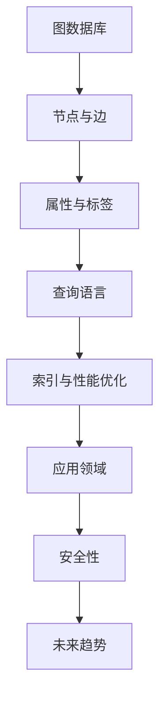

                 

## 文章标题：图数据库 原理与代码实例讲解

### 关键词：图数据库、Neo4j、图算法、Cypher查询语言、性能优化

> 摘要：本文深入探讨了图数据库的基本原理、核心概念、查询语言、性能优化方法，并通过实际代码实例详细讲解了图数据库在社交网络分析和知识图谱构建中的应用。文章旨在为读者提供一个全面而深入的了解，帮助他们在实际项目中有效利用图数据库。

---

# 《图数据库 原理与代码实例讲解》目录大纲

## 第一部分：图数据库基础

### 第1章：图数据库概述

#### 1.1 图数据库的定义与基本概念

- 图数据库的定义
- 图数据库的基本概念

#### 1.2 图数据库与关系数据库的区别

- 数据模型的区别
- 查询语言的区别

#### 1.3 主流图数据库介绍

- Neo4j
- JanusGraph
- ArangoDB

### 第2章：图数据库核心概念

#### 2.1 节点与边的表示

- 节点的表示
- 边的表示

#### 2.2 节点与边的属性

- 属性的类型
- 属性的添加与修改

#### 2.3 节点与边的标签

- 标签的作用
- 标签的添加与删除

### 第3章：图数据库查询语言

#### 3.1 Cypher语言基础

- Cypher语言的语法规则
- Cypher语言的基本查询操作

#### 3.2 高级查询技巧

- 匹配和过滤
- 递归查询

### 第4章：图数据库索引与性能优化

#### 4.1 索引的类型与作用

- 索引的类型
- 索引的作用

#### 4.2 性能优化方法

- 查询优化
- 索引优化

## 第二部分：图数据库应用实战

### 第5章：社交网络分析

#### 5.1 社交网络模型

- 社交网络的基本模型
- 社交网络的数据结构

#### 5.2 社交网络分析案例

- 用户推荐系统
- 社交网络影响力分析

### 第6章：知识图谱构建

#### 6.1 知识图谱的基本概念

- 知识图谱的定义
- 知识图谱的数据结构

#### 6.2 知识图谱构建流程

- 数据预处理
- 节点与边的抽取
- 知识图谱的构建

### 第7章：图数据库在企业中的应用

#### 7.1 企业图数据库架构设计

- 图数据库在企业架构中的定位
- 企业图数据库架构的设计原则

#### 7.2 企业图数据库应用案例

- 供应链网络分析
- 企业客户关系管理

### 第8章：图数据库安全与备份

#### 8.1 图数据库安全策略

- 数据访问控制
- 数据备份与恢复

#### 8.2 图数据库性能监控与故障排除

- 性能监控指标
- 故障排除方法

### 第9章：图数据库未来发展趋势

#### 9.1 新兴技术与应用领域

- 云原生图数据库
- 图数据库与人工智能的融合

#### 9.2 图数据库的发展趋势

- 数据模型与查询语言的演进
- 分布式与并行处理技术的发展

## 附录

### 附录A：图数据库开发工具与资源

- 开发工具介绍
- 常用资源链接

### 附录B：图数据库参考书籍与论文

- 推荐书籍
- 相关论文

## 参考文献

- 参考文献1
- 参考文献2
- 参考文献3

**核心概念与联系**



**核心算法原理讲解**

```text
### 图遍历算法（DFS）

图遍历算法是一种用于遍历图中所有节点的算法。以下是一个基于深度优先搜索（DFS）的伪代码：

```
DFS(G, v):
    for each edge (v, u) in G:
        if u is not visited:
            mark u as visited
            DFS(G, u)
```

### 图连通性检测（BFS）

图连通性检测是一种用于判断图中两个节点是否连通的算法。以下是一个基于广度优先搜索（BFS）的伪代码：

```
BFS(G, s, t):
    if s == t:
        return True
    
    initialize a queue Q
    enqueue s to Q
    mark s as visited

    while Q is not empty:
        dequeue a vertex v from Q
        for each edge (v, u) in G:
            if u is not visited:
                mark u as visited
                enqueue u to Q

    if t is visited:
        return True
    else:
        return False
```

**数学模型和数学公式**

$$
C_{n,k} = \frac{n!}{k!(n-k)!}
$$

- $C_{n,k}$：组合数
- $n$：总数
- $k$：选择的数量

**举例说明**

假设有10个朋友组成一个社交网络，其中6个人互为好友，计算这个社交网络中的组合数：

$$
C_{10,6} = \frac{10!}{6!(10-6)!} = 210
$$

**项目实战**

### 社交网络分析——好友推荐系统

#### 实战目标

利用图数据库Neo4j实现一个好友推荐系统，根据用户与其好友的社交关系推荐新的好友。

#### 实战步骤

1. **搭建开发环境**：安装Neo4j数据库和相应的开发工具。
2. **创建图数据库**：在Neo4j中创建一个名为"SocialNetwork"的图数据库。
3. **数据导入**：导入用户及其好友的数据，构建社交网络图。
4. **好友推荐算法**：实现基于用户与其好友的社交关系进行好友推荐的功能。
5. **用户界面**：设计一个简单的用户界面，展示推荐结果。

#### 源代码与解读

```java
// 创建用户节点
CREATE (u1:User {name: 'Alice'}),
       (u2:User {name: 'Bob'}),
       (u3:User {name: 'Charlie'}),
       (u4:User {name: 'Dave'}),
       (u5:User {name: 'Eva'}),
       (u6:User {name: 'Frank'});

// 创建好友关系
MATCH (a:User), (b:User)
WHERE a.name = 'Alice' AND b.name = 'Bob'
CREATE (a)-[:FRIEND]->(b);

// 查找用户Alice的好友
MATCH (a:User)-[:FRIEND]->(b:User)
WHERE a.name = 'Alice'
RETURN b.name AS FriendName;

// 推荐好友
MATCH (a:User)-[:FRIEND]->(b:User),
      (a)-[:FRIEND]->(c:User)
WHERE a.name = 'Alice' AND c.name != 'Bob'
RETURN c.name AS SuggestedFriend;

// 解读
// 创建用户节点和好友关系
// 查找用户Alice的好友
// 推荐与Alice好友共同好友的用户作为推荐好友
```

**代码解读与分析**

1. **数据创建**：使用`CREATE`语句创建用户节点和好友关系。
2. **好友查询**：使用`MATCH`和`RETURN`语句查询用户Alice的好友。
3. **推荐算法**：使用`MATCH`和`RETURN`语句推荐与Alice好友共同好友的用户。

### 总结

本文详细讲解了图数据库的基本原理、核心概念、查询语言、性能优化方法，并通过实际代码实例讲解了图数据库在社交网络分析和知识图谱构建中的应用。文章旨在为读者提供一个全面而深入的了解，帮助他们在实际项目中有效利用图数据库。

---

**作者：AI天才研究院/AI Genius Institute & 禅与计算机程序设计艺术 /Zen And The Art of Computer Programming**


---

## 第一部分：图数据库基础

### 第1章：图数据库概述

图数据库是用于存储和查询具有复杂网络结构的数据的数据库系统。与传统的关系数据库相比，图数据库专注于图模型（由节点和边组成）的处理，提供了更高效的图形数据处理能力。在本章中，我们将介绍图数据库的基本概念、与关系数据库的区别以及主流图数据库的介绍。

#### 1.1 图数据库的定义与基本概念

**图数据库的定义**：

图数据库是一种基于图论理论的数据库管理系统，它使用图结构来存储、管理和查询数据。在图数据库中，数据以节点（表示实体）和边（表示关系）的形式存储。每个节点可以具有多个属性，每个边也可以具有属性。

**图数据库的基本概念**：

- **节点（Node）**：节点是图中的基本元素，表示实体。例如，在社交网络中，每个用户可以是一个节点。
- **边（Edge）**：边是连接两个节点的线，表示实体之间的关系。例如，在社交网络中，两个用户之间的关系可以用边表示。
- **属性（Property）**：节点和边可以具有属性，用于存储额外的信息。例如，用户节点的年龄、性别等。
- **标签（Label）**：标签是一种对节点进行分类的方式。例如，可以将所有用户节点都标记为`User`。

#### 1.2 图数据库与关系数据库的区别

**数据模型的区别**：

- **关系数据库**：关系数据库使用表（Table）和关系（Relationship）来表示数据。数据以行和列的形式组织，表之间通过外键进行关联。
- **图数据库**：图数据库使用节点（Node）和边（Edge）来表示数据。数据以图结构组织，节点和边之间通过属性进行关联。

**查询语言的区别**：

- **关系数据库**：关系数据库通常使用结构化查询语言（SQL）进行查询。SQL提供了一套丰富的查询操作，如选择、连接、分组等。
- **图数据库**：图数据库通常使用特定的查询语言，如Cypher（Neo4j）、Gremlin（JanusGraph）等。这些查询语言提供了专门针对图模型设计的查询操作。

#### 1.3 主流图数据库介绍

**Neo4j**：

Neo4j是一款开源的分布式图数据库，采用Cypher查询语言。Neo4j具有高性能、易用性和灵活性的特点，广泛应用于社交网络、推荐系统、知识图谱等领域。

**JanusGraph**：

JanusGraph是一款开源的分布式图数据库，支持多种存储后端，如Apache Cassandra、Apache HBase、Amazon DynamoDB等。JanusGraph适合大规模分布式图数据的存储和查询，具有高度可扩展性。

**ArangoDB**：

ArangoDB是一款开源的多模型数据库，支持文档、键值、图等数据模型。ArangoDB采用自有查询语言AQL，提供了丰富的数据存储和查询功能，适用于多种场景。

### 小结

图数据库通过图模型提供了高效的图形数据处理能力，与关系数据库相比，它在处理复杂网络结构数据时具有显著优势。本章介绍了图数据库的基本概念、与关系数据库的区别以及主流图数据库的介绍，为后续章节的深入探讨奠定了基础。

---

**核心概念与联系**


### 核心算法原理讲解

图数据库的核心算法包括图遍历算法和图连通性检测。下面我们将通过伪代码详细讲解这两种算法的原理。

#### 图遍历算法（DFS）

**深度优先搜索（DFS）** 是一种用于遍历图中所有节点的算法。以下是一个基于DFS的伪代码：

```text
DFS(G, v):
    for each edge (v, u) in G:
        if u is not visited:
            mark u as visited
            DFS(G, u)
```

**工作原理**：

1. **初始状态**：选择一个起始节点v，并将其标记为已访问。
2. **遍历过程**：从v节点开始，依次访问其未被访问的邻接节点u。对于每个邻接节点u，递归调用DFS(G, u)。
3. **终止条件**：当所有的邻接节点都被访问过或达到某一深度限制时，算法结束。

**示例**：

假设有一个图G，包含节点A、B、C、D，其中边AB、AC、BD、CD表示节点之间的连接。以节点A为起始点进行DFS，遍历结果为A、B、D、C。

#### 图连通性检测（BFS）

**广度优先搜索（BFS）** 是一种用于判断图中两个节点是否连通的算法。以下是一个基于BFS的伪代码：

```text
BFS(G, s, t):
    if s == t:
        return True
    
    initialize a queue Q
    enqueue s to Q
    mark s as visited

    while Q is not empty:
        dequeue a vertex v from Q
        for each edge (v, u) in G:
            if u is not visited:
                mark u as visited
                enqueue u to Q

    if t is visited:
        return True
    else:
        return False
```

**工作原理**：

1. **初始状态**：选择一个起始节点s，并将其标记为已访问。初始化一个队列Q，将s入队。
2. **遍历过程**：从队列Q中依次取出节点v，并访问其未被访问的邻接节点u。对于每个邻接节点u，将其标记为已访问并加入队列Q。
3. **终止条件**：当队列Q为空时，算法结束。如果在遍历过程中找到了目标节点t，则认为s和t是连通的。

**示例**：

假设有一个图G，包含节点A、B、C、D，其中边AB、AC、BD、CD表示节点之间的连接。从节点A开始，判断其是否与节点D连通。遍历过程为A、B、D、C。

### 数学模型和数学公式

在图数据库中，组合数是一个重要的数学模型。组合数用于计算从n个元素中选择k个元素的不同组合数。其公式为：

$$
C_{n,k} = \frac{n!}{k!(n-k)!}
$$

其中，$C_{n,k}$表示组合数，$n$表示总数，$k$表示选择的数量，$!$表示阶乘。

**举例说明**：

假设有一个社交网络，包含10个用户，其中6个人互为好友。计算这个社交网络中的组合数：

$$
C_{10,6} = \frac{10!}{6!(10-6)!} = 210
$$

这意味着在这个社交网络中，共有210种不同的方式选择6个好友。

### 小结

图数据库的核心算法包括DFS和BF

