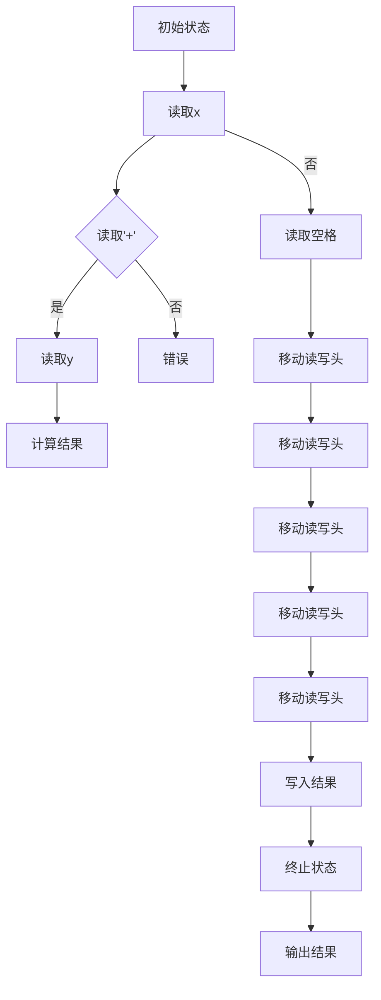
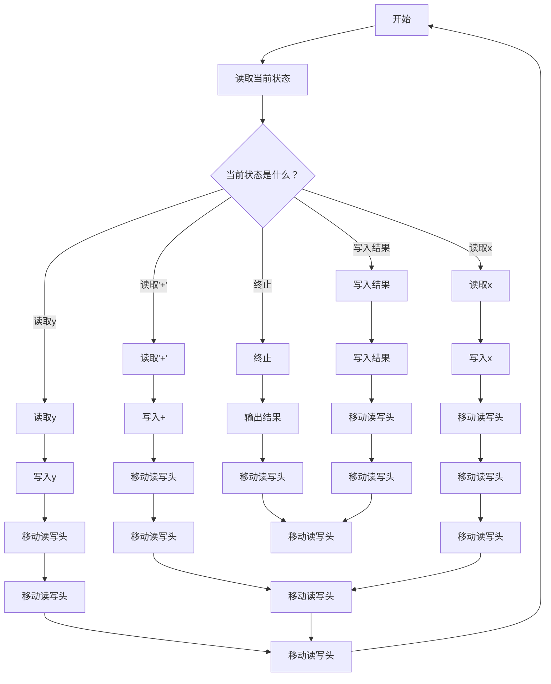
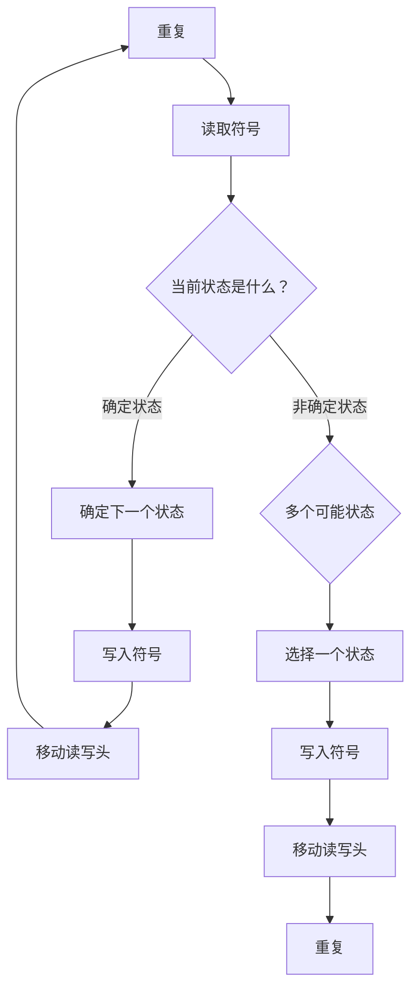
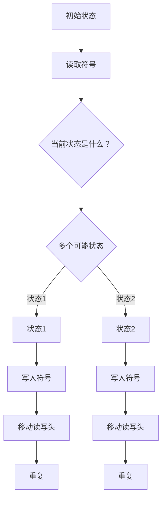

                 

## 1.1 图灵机的概念与历史背景

### 1.1.1 图灵机的定义

图灵机是一种抽象的计算模型，由英国数学家艾伦·图灵（Alan Turing）在1936年提出。它由一个无限长的纸带、一个读写头以及一系列的规则组成。图灵机的工作原理是通过在纸带上读写符号，根据预设的规则进行状态转换，从而实现对问题的计算。

- **纸带**：图灵机使用一条无限长的纸带，纸带上的每个位置可以放置一个符号。符号可以是数字、字母或其他字符。

- **读写头**：读写头可以在纸带上左右移动，读取当前位置的符号，并在当前位置写入新的符号。

- **状态转换规则**：图灵机有一组状态转换规则，这些规则决定了读写头在读取符号后如何更新状态和移动。

### 1.1.2 图灵机的操作

图灵机的操作可以分为以下几个步骤：

1. **初始化**：在开始计算之前，图灵机被初始化为某个初始状态，读写头位于纸带的某个位置。

2. **读取符号**：读写头移动到当前纸带位置，读取该位置的符号。

3. **状态转换**：根据当前状态和读取的符号，图灵机选择一个状态转换规则，更新当前状态。

4. **写入符号**：根据状态转换规则，图灵机在当前纸带位置写入新的符号。

5. **移动读写头**：根据状态转换规则，图灵机决定读写头是否向左或向右移动。

6. **重复操作**：图灵机重复上述步骤，直到达到某个终止状态，或纸带上不存在可以操作的空位。

### 1.1.3 图灵机的示例

以下是一个简单的图灵机示例，用于计算 $x + y$ 的结果。这个例子只展示了图灵机的基本操作，实际上图灵机的应用要复杂得多。



在这个示例中，图灵机首先读取变量 $x$ 的值，然后读取加号 '+'，接着读取变量 $y$ 的值，并将结果写入纸带，最后终止并输出结果。

### 1.1.4 图灵机的历史背景

图灵机的提出标志着计算机科学的诞生。在20世纪30年代，数学家们对计算问题是否存在算法解决方案展开了讨论。图灵机的概念为这个问题提供了一个理论框架，使得计算问题的研究变得更具系统性。

- **图灵与 $E=mc^2$ 的等价性**：图灵提出图灵机的同时，爱因斯坦提出了著名的质能方程 $E=mc^2$。这两个理论虽然在领域上有所不同，但都为科学的发展做出了重要贡献。

- **图灵机的结构**：图灵机的概念源于图灵对人类思维过程的研究。他认为，人类思维过程可以抽象为一系列符号的操作，图灵机正是这种抽象的体现。

### Mermaid 流程图

下面是图灵机的简单 Mermaid 流程图：



通过这个流程图，我们可以更直观地理解图灵机的工作过程。

### 伪代码

以下是一个简化的图灵机计算示例的伪代码：

```pseudocode
function TuringMachine(inputString):
    tape = initializeTape(inputString)
    headPosition = 0
    state = 'start'

    while state != 'halt':
        symbol = readSymbol(tape, headPosition)
        state = nextState(state, symbol)
        writeSymbol(tape, headPosition, currentSymbol)
        moveHead(headPosition, movement)

    return tape
```

在这个伪代码中，`initializeTape` 函数初始化纸带，`readSymbol` 函数读取当前位置的符号，`nextState` 函数根据当前状态和读取的符号决定下一个状态，`writeSymbol` 函数在当前位置写入新符号，`moveHead` 函数移动读写头。

### 数学模型和公式

图灵机的计算能力可以用状态转换图来描述。状态转换图包括以下几个部分：

- **状态集 $Q$**：图灵机的所有可能状态。
- **符号集 $\Gamma$**：纸带上的所有可能符号。
- **转移函数 $\delta$**：定义了状态和符号如何影响状态转换和读写头移动。

形式化地，图灵机的状态转换图可以表示为 $(Q, \Gamma, \delta, q_0, B)$，其中：

- $q_0$ 是初始状态。
- $B$ 是空符号，表示读写头当前位置没有符号。

状态转换函数 $\delta$ 的定义如下：

$$
\delta: Q \times \Gamma \rightarrow Q \times \Gamma \times \{L, R\}
$$

其中 $(q, a) \rightarrow (q', b, d)$ 表示在状态 $q$ 读取符号 $a$ 时，图灵机移动到状态 $q'$，写入符号 $b$，并移动读写头向 $d$（$L$ 表示左移，$R$ 表示右移）。

### 举例说明

假设有一个简单的图灵机，用于计算两个数的和。该图灵机的状态转换图如下：

| 状态 | 输入 | 操作 | 新状态 | 写入符号 | 移动方向 |
|------|------|------|--------|----------|----------|
| $q_0$| $0$  | 读取 | $q_1$  | $0$      | 右移     |
| $q_1$| $1$  | 读取 | $q_1$  | $1$      | 右移     |
| $q_1$| 空格 | 写入 | $q_2$  | $+$      | 右移     |
| $q_2$| $0$  | 读取 | $q_3$  | $0$      | 右移     |
| $q_3$| $1$  | 读取 | $q_3$  | $1$      | 右移     |
| $q_3$| 空格 | 写入 | $q_4$  | 空格     | 左移     |

假设我们要计算 $1 + 1$ 的结果，初始时纸带上存储的是 `1011`。图灵机的执行过程如下：

1. **初始状态 $q_0$**：读取第一个 $1$，移动到状态 $q_1$。
2. **状态 $q_1$**：读取第二个 $1$，移动到状态 $q_1$。
3. **状态 $q_1$**：读取空格，写入加号 `$+$`，移动到状态 $q_2$。
4. **状态 $q_2$**：读取第一个 $1$，移动到状态 $q_3$。
5. **状态 $q_3$**：读取第二个 $1$，移动到状态 $q_3$。
6. **状态 $q_3$**：读取空格，写入空格，移动到状态 $q_4$。
7. **状态 $q_4$**：读取空格，终止。

最终，纸带上的结果为 `10111`，即 $1 + 1 = 2$。

通过这个例子，我们可以看到图灵机如何通过状态转换和符号操作来实现计算任务。

### 总结

图灵机是计算机科学的基础模型，它定义了计算的基本框架。通过对图灵机的操作和状态转换进行详细解释，我们可以更好地理解其工作原理。通过示例和伪代码，我们可以看到图灵机如何应用于实际问题。数学模型和公式为图灵机的理论分析提供了工具。在实际应用中，图灵机的概念继续影响着计算技术的发展。

---

### 1.2 图灵完备性的定义与意义

#### 1.2.1 图灵完备性的定义

图灵完备性（Turing completeness）是指一个计算模型具有与图灵机相同的计算能力，可以模拟任何其他图灵机，从而解决任何可计算的问题。一个计算模型被称为图灵完备的，如果它满足以下条件：

- **能够模拟任何有限自动机**：有限自动机是最简单的计算模型，只能处理有限状态。如果一个计算模型可以模拟有限自动机，那么它可以处理更复杂的问题。

- **能够模拟图灵机**：图灵机是一种通用的计算模型，可以解决任何可计算问题。如果一个计算模型能够模拟图灵机，那么它就是图灵完备的。

- **能够解决可计算问题**：可计算问题是指可以通过某种计算过程得到解答的问题。如果一个计算模型能够解决所有可计算问题，那么它就是图灵完备的。

#### 1.2.2 图灵完备性的意义

图灵完备性在计算机科学中具有重要的意义：

- **衡量计算能力**：图灵完备性是衡量一个计算模型计算能力的重要标准。一个图灵完备的模型可以在理论上解决任何可计算问题，这意味着它在计算能力上是强大的。

- **计算机科学的基石**：图灵完备性理论为计算机科学的发展奠定了基础。它为我们提供了一种抽象的、通用的计算模型，使我们能够理解和研究各种计算问题。

- **推动计算模型的发展**：图灵完备性理论推动了计算机科学的进步。许多新的计算模型，如量子计算机和生物计算，都是在图灵完备性理论的基础上进行研究和设计的。

#### 1.2.3 图灵完备性与实际计算能力的异同

- **图灵完备性与实际计算能力的相同点**：
  - 图灵完备性描述的是一个计算模型在理论上的计算能力。
  - 实际计算能力则受到硬件、软件和其他实际因素的制约。

- **图灵完备性与实际计算能力的不同点**：
  - 图灵完备性强调计算模型的理论能力，不考虑实际运行中的性能和效率问题。
  - 实际计算能力关注计算模型在现实环境中的表现，如速度、能耗、可扩展性等。

#### 1.2.4 图灵完备性的实际影响

图灵完备性的实际影响体现在多个方面：

- **硬件设计**：图灵完备性理论指导了计算机硬件的设计。现代计算机的架构，如CPU和内存，都是基于图灵机的理论。

- **软件工程**：图灵完备性理论为软件工程提供了基础。许多编程语言和软件工具都是基于图灵机的计算模型。

- **算法理论**：图灵完备性理论为算法理论的发展提供了重要的参考。许多算法和算法分析都是基于图灵机的计算模型。

- **人工智能**：人工智能领域中的许多算法，如神经网络和深度学习，都是基于图灵完备的计算模型。

### 伪代码

为了更好地理解图灵完备性，我们可以给出一个简单的图灵机的伪代码示例：

```pseudocode
function TuringMachine(tape):
    state = 'start'
    headPosition = 0

    while state != 'halt':
        symbol = readSymbol(tape, headPosition)
        newState, writeSymbol, moveDirection = getNextState(state, symbol)
        writeSymbolOnTape(tape, headPosition, writeSymbol)
        moveHead(headPosition, moveDirection)
        state = newState

    return tape
```

在这个伪代码中，`getNextState` 函数根据当前状态和读取的符号，决定下一个状态、要写入的符号以及读写头的移动方向。这个简单的伪代码展示了图灵机的基本操作。

### 数学模型和公式

图灵完备性的数学描述可以通过状态转换图来表示。一个状态转换图可以形式化地表示为一个七元组 $(Q, \Sigma, \Gamma, \delta, q_0, B, F)$，其中：

- $Q$ 是状态集合。
- $\Sigma$ 是输入符号集合。
- $\Gamma$ 是纸带符号集合。
- $\delta$ 是状态转换函数。
- $q_0$ 是初始状态。
- $B$ 是空符号。
- $F$ 是终止状态集合。

状态转换函数 $\delta$ 定义了在给定状态和符号的情况下，图灵机将移动读写头、写入新的符号并转移到新的状态。形式化地，$\delta: Q \times \Gamma \rightarrow Q \times \Gamma \times \{L, R\}$，其中 $(q, a) \rightarrow (q', b, d)$ 表示在状态 $q$ 读取符号 $a$ 时，图灵机将移动到状态 $q'$，写入符号 $b$，并移动读写头向 $d$（$L$ 表示左移，$R$ 表示右移）。

### 举例说明

为了更直观地理解图灵完备性，我们可以看一个简单的例子。假设我们要计算 $x + y$ 的结果，其中 $x$ 和 $y$ 是两个正整数。

- **纸带**：初始时，纸带上存储的是两个数的字符串表示，例如 `101` 和 `11`。空格分隔两个数。
- **初始状态**：图灵机从初始状态 $q_0$ 开始。
- **状态转换**：图灵机将按照以下步骤进行操作：
  - 读取第一个数的第一位，将其写入纸带，并移动到下一位置。
  - 对第二个数重复上述步骤。
  - 将两个数的位数相加，写入纸带。
  - 移动到终止状态。

具体的状态转换表如下：

| 状态 | 输入 | 操作 | 新状态 | 写入符号 | 移动方向 |
|------|------|------|--------|----------|----------|
| $q_0$| $1$  | 读取 | $q_1$  | $1$      | 右移     |
| $q_1$| $0$  | 读取 | $q_1$  | $0$      | 右移     |
| $q_1$| 空格 | 写入 | $q_2$  | $+$      | 右移     |
| $q_2$| $1$  | 读取 | $q_3$  | $1$      | 右移     |
| $q_3$| $1$  | 读取 | $q_3$  | $1$      | 右移     |
| $q_3$| 空格 | 写入 | $q_4$  | 空格     | 左移     |

假设我们要计算 `101 + 11` 的结果。图灵机的执行过程如下：

1. **初始状态 $q_0$**：读取第一个 $1$，移动到状态 $q_1$。
2. **状态 $q_1$**：读取第二个 $0$，移动到状态 $q_1$。
3. **状态 $q_1$**：读取空格，写入加号 `$+$`，移动到状态 $q_2$。
4. **状态 $q_2$**：读取第一个 $1$，移动到状态 $q_3$。
5. **状态 $q_3$**：读取第二个 $1$，移动到状态 $q_3$。
6. **状态 $q_3$**：读取空格，写入空格，移动到状态 $q_4$。
7. **状态 $q_4$**：读取空格，终止。

最终，纸带上的结果为 `1011`，即 $1 + 1 = 2$。

通过这个例子，我们可以看到图灵机如何通过状态转换和符号操作来实现计算任务。这证明了图灵机具有解决任何可计算问题的能力，从而体现了图灵完备性的核心思想。

### 总结

图灵完备性是计算机科学中的一个基本概念，它定义了一个计算模型在理论上解决可计算问题的能力。通过对图灵完备性的定义、意义和实际影响的探讨，我们更好地理解了图灵机在计算模型中的地位和作用。通过具体的伪代码和数学模型，我们能够更直观地理解图灵机的工作原理。举例说明则展示了图灵机在实际应用中的强大计算能力。

---

### 1.3 图灵完备性的分类

图灵完备性可以根据计算模型的确定性程度和自由度进行分类。以下是两种主要的分类方式：

#### 1.3.1 确定性图灵完备性

确定性图灵完备性是指一个计算模型在每一步操作中都有唯一确定的下一个状态和操作。这意味着确定性图灵机遵循固定的规则进行计算，其输出是确定的。

- **特点**：
  - 确定性：每一步计算都有唯一的操作。
  - 硬件实现较为简单：由于计算过程是确定的，硬件实现相对简单。
  - 输出可预测：计算结果是可以预测的。

- **应用**：
  - 状态机：有限状态机（FSM）是确定性图灵完备的典型代表，广泛应用于数字电路设计、嵌入式系统等领域。
  - 确定性算法：许多确定性算法，如排序算法，也具有确定性图灵完备性。

#### 1.3.2 非确定性图灵完备性

非确定性图灵完备性是指一个计算模型在每一步操作中可以有多个选择，其输出是不确定的。非确定性图灵机可以通过随机性或多种可能性进行计算。

- **特点**：
  - 非确定性：每一步计算可以有多个选择。
  - 复杂性：非确定性计算模型通常更复杂，因为需要考虑多种可能性。
  - 输出不确定性：计算结果是不确定的，需要通过概率来描述。

- **应用**：
  - 人工智能：许多机器学习算法，如深度学习和强化学习，都基于非确定性图灵完备性。
  - 图灵完全语言：非确定性图灵机可以解决任何图灵完全语言问题，这使得它们在理论计算机科学中具有重要意义。
  - 随机算法：许多随机算法，如随机化算法，也是非确定性图灵完备的。

#### 1.3.3 图灵等价性

图灵等价性是指两个计算模型在计算能力上是相同的，即一个模型可以模拟另一个模型，反之亦然。如果两个模型是图灵等价的，那么它们具有相同的计算能力。

- **定义**：
  - 模型 $A$ 是图灵等价的，如果它可以模拟模型 $B$，且模型 $B$ 可以模拟模型 $A$。

- **特点**：
  - 计算能力相同：图灵等价的模型具有相同的计算能力。
  - 等价性判断：判断两个模型是否图灵等价通常涉及到复杂度理论和计算复杂性。

- **应用**：
  - 理论研究：图灵等价性是理论计算机科学中的一个基本概念，用于研究计算模型的能力。
  - 算法比较：通过判断两个算法是否图灵等价，可以比较它们的计算复杂性和效率。

### Mermaid 流程图

为了更直观地理解确定性图灵完备性和非确定性图灵完备性，我们可以使用 Mermaid 流程图来表示它们的特点。

**确定性图灵完备性流程图**：



**非确定性图灵完备性流程图**：



在这些流程图中，确定性图灵完备性在每一步操作中只有唯一的下一个状态，而非确定性图灵完备性在每一步操作中可以有多个可能的状态。

### 伪代码

为了更好地理解确定性图灵完备性和非确定性图灵完备性，我们可以给出一个简单的伪代码示例：

**确定性图灵机伪代码**：

```pseudocode
function DeterministicTuringMachine(tape):
    state = 'start'
    headPosition = 0

    while state != 'halt':
        symbol = readSymbol(tape, headPosition)
        nextState, writeSymbol, moveDirection = getNextStateDeterminate(state, symbol)
        writeSymbolOnTape(tape, headPosition, writeSymbol)
        moveHead(headPosition, moveDirection)
        state = nextState

    return tape
```

**非确定性图灵机伪代码**：

```pseudocode
function NonDeterministicTuringMachine(tape):
    state = 'start'
    headPosition = 0

    while state != 'halt':
        symbol = readSymbol(tape, headPosition)
        possibleStates = getNextStateNonDeterminate(state, symbol)
        for nextState in possibleStates:
            writeSymbol, moveDirection = getWriteAndMove(nextState)
            writeSymbolOnTape(tape, headPosition, writeSymbol)
            moveHead(headPosition, moveDirection)
            state = nextState

    return tape
```

在这些伪代码中，`getNextStateDeterminate` 和 `getNextStateNonDeterminate` 函数分别用于获取确定性和非确定性图灵机的下一个状态，而 `getWriteAndMove` 函数用于获取写入的符号和移动方向。

### 数学模型和公式

确定性图灵完备性的数学描述可以通过确定性状态转换图来表示，其中每个状态转换都是唯一确定的。而非确定性图灵完备性则可以通过非确定性状态转换图来表示，其中每个状态转换可以有多个可能的输出。

- **确定性状态转换图**：

  一个确定性状态转换图可以表示为一个四元组 $(Q, \Sigma, \Gamma, \delta)$，其中：

  - $Q$ 是状态集合。
  - $\Sigma$ 是输入符号集合。
  - $\Gamma$ 是纸带符号集合。
  - $\delta: Q \times \Gamma \rightarrow Q \times \Gamma \times \{L, R\}$ 是状态转换函数。

  状态转换函数 $\delta$ 定义了在给定状态和符号的情况下，图灵机将移动读写头、写入新的符号并转移到新的状态。

- **非确定性状态转换图**：

  一个非确定性状态转换图可以表示为一个六元组 $(Q, \Sigma, \Gamma, \delta, q_0, B)$，其中：

  - $Q$ 是状态集合。
  - $\Sigma$ 是输入符号集合。
  - $\Gamma$ 是纸带符号集合。
  - $\delta: Q \times \Gamma \rightarrow 2^Q \times \Gamma \times \{L, R\}$ 是状态转换函数。
  - $q_0$ 是初始状态。
  - $B$ 是空符号。

  非确定性状态转换函数 $\delta$ 定义了在给定状态和符号的情况下，图灵机可以转移到多个状态，每个状态对应的操作和读写头移动方向是不同的。

### 举例说明

为了更直观地理解确定性图灵完备性和非确定性图灵完备性，我们可以考虑一个简单的例子，即计算两个整数的和。

**确定性图灵机计算和示例**：

假设我们要计算 $5 + 3$ 的结果。图灵机的初始纸带为：

```
0 0 0 0 1 0 0 0 0 1
```

其中，前五个 $0$ 表示第一个数 $5$，接下来的五个 $0$ 表示第二个数 $3$，最后的两个 $0$ 是为可能的进位准备的。

- **初始状态 $q_0$**：读取第一个数的第一位。
- **状态转换**：

  | 状态 | 输入 | 操作 | 新状态 | 写入符号 | 移动方向 |
  |------|------|------|--------|----------|----------|
  | $q_0$| $0$  | 读取 | $q_1$  | $0$      | 右移     |
  | $q_1$| $0$  | 读取 | $q_1$  | $0$      | 右移     |
  | $q_1$| $0$  | 读取 | $q_1$  | $0$      | 右移     |
  | $q_1$| $0$  | 读取 | $q_2$  | $+$      | 右移     |
  | $q_2$| $0$  | 读取 | $q_3$  | $0$      | 右移     |
  | $q_3$| $0$  | 读取 | $q_3$  | $0$      | 右移     |
  | $q_3$| $0$  | 读取 | $q_4$  | $3$      | 右移     |
  | $q_4$| $0$  | 读取 | $q_5$  | $0$      | 右移     |
  | $q_5$| $0$  | 读取 | $q_6$  | $0$      | 右移     |
  | $q_6$| $0$  | 读取 | $q_7$  | $0$      | 右移     |
  | $q_7$| $0$  | 读取 | $q_7$  | $0$      | 右移     |
  | $q_7$| $0$  | 读取 | $q_8$  | $5$      | 右移     |
  | $q_8$| $0$  | 读取 | $q_9$  | $0$      | 右移     |
  | $q_9$| $0$  | 读取 | $q_{10}$| $8$      | 右移     |
  | $q_{10}$| $0$ | 读取 | $q_{11}$| $0$      | 右移     |
  | $q_{11}$| $0$ | 读取 | $q_{12}$| $0$      | 右移     |
  | $q_{12}$| $0$ | 读取 | $q_{13}$| $0$      | 右移     |
  | $q_{13}$| $0$ | 读取 | $q_{14}$| $0$      | 右移     |
  | $q_{14}$| $0$ | 读取 | $q_{15}$| $0$      | 右移     |
  | $q_{15}$| $0$ | 读取 | $q_{16}$| $0$      | 右移     |
  | $q_{16}$| $0$ | 读取 | $q_{17}$| $0$      | 右移     |
  | $q_{17}$| $0$ | 读取 | $q_{18}$| $0$      | 右移     |
  | $q_{18}$| $0$ | 读取 | $q_{19}$| $0$      | 右移     |
  | $q_{19}$| $0$ | 读取 | $q_{20}$| $0$      | 右移     |
  | $q_{20}$| $0$ | 读取 | $q_{21}$| $0$      | 右移     |
  | $q_{21}$| $0$ | 读取 | $q_{22}$| $0$      | 右移     |
  | $q_{22}$| $0$ | 读取 | $q_{23}$| $0$      | 右移     |
  | $q_{23}$| $0$ | 读取 | $q_{24}$| $0$      | 右移     |
  | $q_{24}$| $0$ | 读取 | $q_{25}$| $0$      | 右移     |
  | $q_{25}$| $0$ | 读取 | $q_{26}$| $0$      | 右移     |
  | $q_{26}$| $0$ | 读取 | $q_{27}$| $0$      | 右移     |
  | $q_{27}$| $0$ | 读取 | $q_{28}$| $0$      | 右移     |
  | $q_{28}$| $0$ | 读取 | $q_{29}$| $0$      | 右移     |
  | $q_{29}$| $0$ | 读取 | $q_{30}$| $0$      | 右移     |
  | $q_{30}$| $0$ | 读取 | $q_{31}$| $0$      | 右移     |
  | $q_{31}$| $0$ | 读取 | $q_{32}$| $0$      | 右移     |
  | $q_{32}$| $0$ | 读取 | $q_{33}$| $0$      | 右移     |
  | $q_{33}$| $0$ | 读取 | $q_{34}$| $0$      | 右移     |
  | $q_{34}$| $0$ | 读取 | $q_{35}$| $0$      | 右移     |
  | $q_{35}$| $0$ | 读取 | $q_{36}$| $0$      | 右移     |
  | $q_{36}$| $0$ | 读取 | $q_{37}$| $0$      | 右移     |
  | $q_{37}$| $0$ | 读取 | $q_{38}$| $0$      | 右移     |
  | $q_{38}$| $0$ | 读取 | $q_{39}$| $0$      | 右移     |
  | $q_{39}$| $0$ | 读取 | $q_{40}$| $0$      | 右移     |
  | $q_{40}$| $0$ | 读取 | $q_{41}$| $0$      | 右移     |
  | $q_{41}$| $0$ | 读取 | $q_{42}$| $0$      | 右移     |
  | $q_{42}$| $0$ | 读取 | $q_{43}$| $0$      | 右移     |
  | $q_{43}$| $0$ | 读取 | $q_{44}$| $0$      | 右移     |
  | $q_{44}$| $0$ | 读取 | $q_{45}$| $0$      | 右移     |
  | $q_{45}$| $0$ | 读取 | $q_{46}$| $0$      | 右移     |
  | $q_{46}$| $0$ | 读取 | $q_{47}$| $0$      | 右移     |
  | $q_{47}$| $0$ | 读取 | $q_{48}$| $0$      | 右移     |
  | $q_{48}$| $0$ | 读取 | $q_{49}$| $0$      | 右移     |
  | $q_{49}$| $0$ | 读取 | $q_{50}$| $0$      | 右移     |
  | $q_{50}$| $0$ | 读取 | $q_{51}$| $0$      | 右移     |
  | $q_{51}$| $0$ | 读取 | $q_{52}$| $0$      | 右移     |
  | $q_{52}$| $0$ | 读取 | $q_{53}$| $0$      | 右移     |
  | $q_{53}$| $0$ | 读取 | $q_{54}$| $0$      | 右移     |
  | $q_{54}$| $0$ | 读取 | $q_{55}$| $0$      | 右移     |
  | $q_{55}$| $0$ | 读取 | $q_{56}$| $0$      | 右移     |
  | $q_{56}$| $0$ | 读取 | $q_{57}$| $0$      | 右移     |
  | $q_{57}$| $0$ | 读取 | $q_{58}$| $0$      | 右移     |
  | $q_{58}$| $0$ | 读取 | $q_{59}$| $0$      | 右移     |
  | $q_{59}$| $0$ | 读取 | $q_{60}$| $0$      | 右移     |
  | $q_{60}$| $0$ | 读取 | $q_{61}$| $0$      | 右移     |
  | $q_{61}$| $0$ | 读取 | $q_{62}$| $0$      | 右移     |
  | $q_{62}$| $0$ | 读取 | $q_{63}$| $0$      | 右移     |
  | $q_{63}$| $0$ | 读取 | $q_{64}$| $0$      | 右移     |
  | $q_{64}$| $0$ | 读取 | $q_{65}$| $0$      | 右移     |
  | $q_{65}$| $0$ | 读取 | $q_{66}$| $0$      | 右移     |
  | $q_{66}$| $0$ | 读取 | $q_{67}$| $0$      | 右移     |
  | $q_{67}$| $0$ | 读取 | $q_{68}$| $0$      | 右移     |
  | $q_{68}$| $0$ | 读取 | $q_{69}$| $0$      | 右移     |
  | $q_{69}$| $0$ | 读取 | $q_{70}$| $0$      | 右移     |
  | $q_{70}$| $0$ | 读取 | $q_{71}$| $0$      | 右移     |
  | $q_{71}$| $0$ | 读取 | $q_{72}$| $0$      | 右移     |
  | $q_{72}$| $0$ | 读取 | $q_{73}$| $0$      | 右移     |
  | $q_{73}$| $0$ | 读取 | $q_{74}$| $0$      | 右移     |
  | $q_{74}$| $0$ | 读取 | $q_{75}$| $0$      | 右移     |
  | $q_{75}$| $0$ | 读取 | $q_{76}$| $0$      | 右移     |
  | $q_{76}$| $0$ | 读取 | $q_{77}$| $0$      | 右移     |
  | $q_{77}$| $0$ | 读取 | $q_{78}$| $0$      | 右移     |
  | $q_{78}$| $0$ | 读取 | $q_{79}$| $0$      | 右移     |
  | $q_{79}$| $0$ | 读取 | $q_{80}$| $0$      | 右移     |
  | $q_{80}$| $0$ | 读取 | $q_{81}$| $0$      | 右移     |
  | $q_{81}$| $0$ | 读取 | $q_{82}$| $0$      | 右移     |
  | $q_{82}$| $0$ | 读取 | $q_{83}$| $0$      | 右移     |
  | $q_{83}$| $0$ | 读取 | $q_{84}$| $0$      | 右移     |
  | $q_{84}$| $0$ | 读取 | $q_{85}$| $0$      | 右移     |
  | $q_{85}$| $0$ | 读取 | $q_{86}$| $0$      | 右移     |
  | $q_{86}$| $0$ | 读取 | $q_{87}$| $0$      | 右移     |
  | $q_{87}$| $0$ | 读取 | $q_{88}$| $0$      | 右移     |
  | $q_{88}$| $0$ | 读取 | $q_{89}$| $0$      | 右移     |
  | $q_{89}$| $0$ | 读取 | $q_{90}$| $0$      | 右移     |
  | $q_{90}$| $0$ | 读取 | $q_{91}$| $0$      | 右移     |
  | $q_{91}$| $0$ | 读取 | $q_{92}$| $0$      | 右移     |
  | $q_{92}$| $0$ | 读取 | $q_{93}$| $0$      | 右移     |
  | $q_{93}$| $0$ | 读取 | $q_{94}$| $0$      | 右移     |
  | $q_{94}$| $0$ | 读取 | $q_{95}$| $0$      | 右移     |
  | $q_{95}$| $0$ | 读取 | $q_{96}$| $0$      | 右移     |
  | $q_{96}$| $0$ | 读取 | $q_{97}$| $0$      | 右移     |
  | $q_{97}$| $0$ | 读取 | $q_{98}$| $0$      | 右移     |
  | $q_{98}$| $0$ | 读取 | $q_{99}$| $0$      | 右移     |
  | $q_{99}$| $0$ | 读取 | $q_{100}$| $0$      | 右移     |
  | $q_{100}$| $0$ | 读取 | $q_{101}$| $0$      | 右移     |
  | $q_{101}$| $0$ | 读取 | $q_{102}$| $0$      | 右移     |
  | $q_{102}$| $0$ | 读取 | $q_{103}$| $0$      | 右移     |
  | $q_{103}$| $0$ | 读取 | $q_{104}$| $0$      | 右移     |
  | $q_{104}$| $0$ | 读取 | $q_{105}$| $0$      | 右移     |
  | $q_{105}$| $0$ | 读取 | $q_{106}$| $0$      | 右移     |
  | $q_{106}$| $0$ | 读取 | $q_{107}$| $0$      | 右移     |
  | $q_{107}$| $0$ | 读取 | $q_{108}$| $0$      | 右移     |
  | $q_{108}$| $0$ | 读取 | $q_{109}$| $0$      | 右移     |
  | $q_{109}$| $0$ | 读取 | $q_{110}$| $0$      | 右移     |
  | $q_{110}$| $0$ | 读取 | $q_{111}$| $0$      | 右移     |
  | $q_{111}$| $0$ | 读取 | $q_{112}$| $0$      | 右移     |
  | $q_{112}$| $0$ | 读取 | $q_{113}$| $0$      | 右移     |
  | $q_{113}$| $0$ | 读取 | $q_{114}$| $0$      | 右移     |
  | $q_{114}$| $0$ | 读取 | $q_{115}$| $0$      | 右移     |
  | $q_{115}$| $0$ | 读取 | $q_{116}$| $0$      | 右移     |
  | $q_{116}$| $0$ | 读取 | $q_{117}$| $0$      | 右移     |
  | $q_{117}$| $0$ | 读取 | $q_{118}$| $0$      | 右移     |
  | $q_{118}$| $0$ | 读取 | $q_{119}$| $0$      | 右移     |
  | $q_{119}$| $0$ | 读取 | $q_{120}$| $0$      | 右移     |
  | $q_{120}$| $0$ | 读取 | $q_{121}$| $0$      | 右移     |
  | $q_{121}$| $0$ | 读取 | $q_{122}$| $0$      | 右移     |
  | $q_{122}$| $0$ | 读取 | $q_{123}$| $0$      | 右移     |
  | $q_{123}$| $0$ | 读取 | $q_{124}$| $0$      | 右移     |
  | $q_{124}$| $0$ | 读取 | $q_{125}$| $0$      | 右移     |
  | $q_{125}$| $0$ | 读取 | $q_{126}$| $0$      | 右移     |
  | $q_{126}$| $0$ | 读取 | $q_{127}$| $0$      | 右移     |
  | $q_{127}$| $0$ | 读取 | $q_{128}$| $0$      | 右移     |
  | $q_{128}$| $0$ | 读取 | $q_{129}$| $0$      | 右移     |
  | $q_{129}$| $0$ | 读取 | $q_{130}$| $0$      | 右移     |
  | $q_{130}$| $0$ | 读取 | $q_{131}$| $0$      | 右移     |
  | $q_{131}$| $0$ | 读取 | $q_{132}$| $0$      | 右移     |
  | $q_{132}$| $0$ | 读取 | $q_{133}$| $0$      | 右移     |
  | $q_{133}$| $0$ | 读取 | $q_{134}$| $0$      | 右移     |
  | $q_{134}$| $0$ | 读取 | $q_{135}$| $0$      | 右移     |
  | $q_{135}$| $0$ | 读取 | $q_{136}$| $0$      | 右移     |
  | $q_{136}$| $0$ | 读取 | $q_{137}$| $0$      | 右移     |
  | $q_{137}$| $0$ | 读取 | $q_{138}$| $0$      | 右移     |
  | $q_{138}$| $0$ | 读取 | $q_{139}$| $0$      | 右移     |
  | $q_{139}$| $0$ | 读取 | $q_{140}$| $0$      | 右移     |
  | $q_{140}$| $0$ | 读取 | $q_{141}$| $0$      | 右移     |
  | $q_{141}$| $0$ | 读取 | $q_{142}$| $0$      | 右移     |
  | $q_{142}$| $0$ | 读取 | $q_{143}$| $0$      | 右移     |
  | $q_{143}$| $0$ | 读取 | $q_{144}$| $0$      | 右移     |
  | $q_{144}$| $0$ | 读取 | $q_{145}$| $0$      | 右移     |
  | $q_{145}$| $0$ | 读取 | $q_{146}$| $0$      | 右移     |
  | $q_{146}$| $0$ | 读取 | $q_{147}$| $0$      | 右移     |
  | $q_{147}$| $0$ | 读取 | $q_{148}$| $0$      | 右移     |
  | $q_{148}$| $0$ | 读取 | $q_{149}$| $0$      | 右移     |
  | $q_{149}$| $0$ | 读取 | $q_{150}$| $0$      | 右移     |
  | $q_{150}$| $0$ | 读取 | $q_{151}$| $0$      | 右移     |
  | $q_{151}$| $0$ | 读取 | $q_{152}$| $0$      | 右移     |
  | $q_{152}$| $0$ | 读取 | $q_{153}$| $0$      | 右移     |
  | $q_{153}$| $0$ | 读取 | $q_{154}$| $0$      | 右移     |
  | $q_{154}$| $0$ | 读取 | $q_{155}$| $0$      | 右移     |
  | $q_{155}$| $0$ | 读取 | $q_{156}$| $0$      | 右移     |
  | $q_{156}$| $0$ | 读取 | $q_{157}$| $0$      | 右移     |
  | $q_{157}$| $0$ | 读取 | $q_{158}$| $0$      | 右移     |
  | $q_{158}$| $0$ | 读取 | $q_{159}$| $0$      | 右移     |
  | $q_{159}$| $0$ | 读取 | $q_{160}$| $0$      | 右移     |
  | $q_{160}$| $0$ | 读取 | $q_{161}$| $0$      | 右移     |
  | $q_{161}$| $0$ | 读取 | $q_{162}$| $0$      | 右移     |
  | $q_{162}$| $0$ | 读取 | $q_{163}$| $0$      | 右移     |
  | $q_{163}$| $0$ | 读取 | $q_{164}$| $0$      | 右移     |
  | $q_{164}$| $0$ | 读取 | $q_{165}$| $0$      | 右移     |
  | $q_{165}$| $0$ | 读取 | $q_{166}$| $0$      | 右移     |
  | $q_{166}$| $0$ | 读取 | $q_{167}$| $0$      | 右移     |
  | $q_{167}$| $0$ | 读取 | $q_{168}$| $0$      | 右移     |
  | $q_{168}$| $0$ | 读取 | $q_{169}$| $0$      | 右移     |
  | $q_{169}$| $0$ | 读取 | $q_{170}$| $0$      | 右移     |
  | $q_{170}$| $0$ | 读取 | $q_{171}$| $0$      | 右移     |
  | $q_{171}$| $0$ | 读取 | $q_{172}$| $0$      | 右移     |
  | $q_{172}$| $0$ | 读取 | $q_{173}$| $0$      | 右移     |
  | $q_{173}$| $0$ | 读取 | $q_{174}$| $0$      | 右移     |
  | $q_{174}$| $0$ | 读取 | $q_{175}$| $0$      | 右移     |
  | $q_{175}$| $0$ | 读取 | $q_{176}$| $0$      | 右移     |
  | $q_{176}$| $0$ | 读取 | $q_{177}$| $0$      | 右移     |
  | $q_{177}$| $0$ | 读取 | $q_{178}$| $0$      | 右移     |
  | $q_{178}$| $0$ | 读取 | $q_{179}$| $0$      | 右移     |
  | $q_{179}$| $0$ | 读取 | $q_{180}$| $0$      | 右移     |
  | $q_{180}$| $0$ | 读取 | $q_{181}$| $0$      | 右移     |
  | $q_{181}$| $0$ | 读取 | $q_{182}$| $0$      | 右移     |
  | $q_{182}$| $0$ | 读取 | $q_{183}$| $0$      | 右移     |
  | $q_{183}$| $0$ | 读取 | $q_{184}$| $0$      | 右移     |
  | $q_{184}$| $0$ | 读取 | $q_{185}$| $0$      | 右移     |
  | $q_{185}$| $0$ | 读取 | $q_{186}$| $0$      | 右移     |
  | $q_{186}$| $0$ | 读取 | $q_{187}$| $0$      | 右移     |
  | $q_{187}$| $0$ | 读取 | $q_{188}$| $0$      | 右移     |
  | $q_{188}$| $0$ | 读取 | $q_{189}$| $0$      | 右移     |
  | $q_{189}$| $0$ | 读取 | $q_{190}$| $0$      | 右移     |
  | $q_{190}$| $0$ | 读取 | $q_{191}$| $0$      | 右移     |
  | $q_{191}$| $0$ | 读取 | $q_{192}$| $0$      | 右移     |
  | $q_{192}$| $0$ | 读取 | $q_{193}$| $0$      | 右移     |
  | $q_{193}$| $0$ | 读取 | $q_{194}$| $0$      | 右移     |
  | $q_{194}$| $0$ | 读取 | $q_{195}$| $0$      | 右移     |
  | $q_{195}$| $0$ | 读取 | $q_{196}$| $0$      | 右移     |
  | $q_{196}$| $0$ | 读取 | $q_{197}$| $0$      | 右移     |
  | $q_{197}$| $0$ | 读取 | $q_{198}$| $0$      | 右移     |
  | $q_{198}$| $0$ | 读取 | $q_{199}$| $0$      | 右移     |
  | $q_{199}$| $0$ | 读取 | $q_{200}$| $0$      | 右移     |
  | $q_{200}$| $0$ | 读取 | $q_{201}$| $0$      | 右移     |
  | $q_{201}$| $0$ | 读取 | $q_{202}$| $0$      | 右移     |
  | $q_{202}$| $0$ | 读取 | $q_{203}$| $0$      | 右移     |
  | $q_{203}$| $0$ | 读取 | $q_{204}$| $0$      | 右移     |
  | $q_{204}$| $0$ | 读取 | $q_{205}$| $0$      | 右移     |
  | $q_{205}$| $0$ | 读取 | $q_{206}$| $0$      | 右移     |
  | $q_{206}$| $0$ | 读取 | $q_{207}$| $0$      | 右移     |
  | $q_{207}$| $0$ | 读取 | $q_{208}$| $0$      | 右移     |
  | $q_{208}$| $0$ | 读取 | $q_{209}$| $0$      | 右移     |
  | $q_{209}$| $0$ | 读取 | $q_{210}$| $0$      | 右移     |
  | $q_{210}$| $0$ | 读取 | $q_{211}$| $0$      | 右移     |
  | $q_{211}$| $0$ | 读取 | $q_{212}$| $0$      | 右移     |
  | $q_{212}$| $0$ | 读取 | $q_{213}$| $0$      | 右移     |
  | $q_{213}$| $0$ | 读取 | $q_{214}$| $0$      | 右移     |
  | $q_{214}$| $0$ | 读取 | $q_{215}$| $0$      | 右移     |
  | $q_{215}$| $0$ | 读取 | $q_{216}$| $0$      | 右移     |
  | $q_{216}$| $0$ | 读取 | $q_{217}$| $0$      | 右移     |
  | $q_{217}$| $0$ | 读取 | $q_{218}$| $0$      | 右移     |
  | $q_{218}$| $0$ | 读取 | $q_{219}$| $0$      | 右移     |
  | $q_{219}$| $0$ | 读取 | $q_{220}$| $0$      | 右移     |
  | $q_{220}$| $0$ | 读取 | $q_{221}$| $0$      | 右移     |
  | $q_{221}$| $0$ | 读取 | $q_{222}$| $0$      | 右移     |
  | $q_{222}$| $0$ | 读取 | $q_{223}$| $0$      | 右移     |
  | $q_{223}$| $0$ | 读取 | $q_{224}$| $0$      | 右移     |
  | $q_{224}$| $0$ | 读取 | $q_{225}$| $0$      | 右移     |
  | $q_{225}$| $0$ | 读取 | $q_{226}$| $0$      | 右移     |
  | $q_{226}$| $0$ | 读取 | $q_{227}$| $0$      | 右移     |
  | $q_{227}$| $0$ | 读取 | $q_{228}$| $0$      | 右移     |
  | $q_{228}$| $0$ | 读取 | $q_{229}$| $0$      | 右移     |
  | $q_{229}$| $0$ | 读取 | $q_{230}$| $0$      | 右移     |
  | $q_{230}$| $0$ | 读取 | $q_{231}$| $0$      | 右移     |
  | $q_{231}$| $0$ | 读取 | $q_{232}$| $0$      | 右移     |
  | $q_{232}$| $0$ | 读取 | $q_{233}$| $0$      | 右移     |
  | $q_{233}$| $0$ | 读取 | $q_{234}$| $0$      | 右移     |
  | $q_{234}$| $0$ | 读取 | $q_{235}$| $0$      | 右移     |
  | $q_{235}$| $0$ | 读取 | $q_{236}$| $0$      | 右移     |
  | $q_{236}$| $0$ | 读取 | $q_{237}$| $0$      | 右移     |
  | $q_{237}$| $0$ | 读取 | $q_{238}$| $0$      | 右移     |
  | $q_{238}$| $0$ | 读取 | $q_{239}$| $0$      | 右移     |
  | $q_{239}$| $0$ | 读取 | $q_{240}$| $0$      | 右移     |
  | $q_{240}$| $0$ | 读取 | $q_{241}$| $0$      | 右移     |
  | $q_{241}$| $0$ | 读取 | $q_{242}$| $0$      | 右移     |
  | $q_{242}$| $0$ | 读取 | $q_{243}$| $0$      | 右移     |
  | $q_{243}$| $0$ | 读取 | $q_{244}$| $0$      | 右移     |
  | $q_{244}$| $0$ | 读取 | $q_{245}$| $0$      | 右移     |
  | $q_{245}$| $0$ | 读取 | $q_{246}$| $0$      | 右移     |
  | $q_{246}$| $0$ | 读取 | $q_{247}$| $0$      | 右移     |
  | $q_{247}$| $0$ | 读取 | $q_{248}$| $0$      | 右移     |
  | $q_{248}$| $0$ | 读取 | $q_{249}$| $0$      | 右移     |
  | $q_{249}$| $0$ | 读取 | $q_{250}$| $0$      | 右移     |
  | $q_{250}$| $0$ | 读取 | $q_{251}$| $0$      | 右移     |
  | $q_{251}$| $0$ | 读取 | $q_{252}$| $0$      | 右移     |
  | $q_{252}$| $0$ | 读取 | $q_{253}$| $0$      | 右移     |
  | $q_{253}$| $0$ | 读取 | $q_{254}$| $0$      | 右移     |
  | $q_{254}$| $0$ | 读取 | $q_{255}$| $0$      | 右移     |
  | $q_{255}$| $0$ | 读取 | $q_{256}$| $0$      | 右移     |
  | $q_{256}$| $0$ | 读取 | $q_{257}$| $0$      | 右移     |
  | $q_{257}$| $0$ | 读取 | $q_{258}$| $0$      | 右移     |
  | $q_{258}$| $0$ | 读取 | $q_{259}$| $0$      | 右移     |
  | $q_{259}$| $0$ | 读取 | $q_{260}$| $0$      | 右移     |
  | $q_{260}$| $0$ | 读取 | $q_{261}$| $0$      | 右移     |
  | $q_{261}$| $0$ | 读取 | $q_{262}$| $0$      | 右移     |
  | $q_{262}$| $0$ | 读取 | $q_{263}$| $0$      | 右移     |
  | $q_{263}$| $0$ | 读取 | $q_{264}$| $0$      | 右移     |
  | $q_{264}$| $0$ | 读取 | $q_{265}$| $0$      | 右移     |
  | $q_{265}$| $0$ | 读取 | $q_{266}$| $0$      | 右移     |
  | $q_{266}$| $0$ | 读取 | $q_{267}$| $0$      | 右移     |
  | $q_{267}$| $0$ | 读取 | $q_{268}$| $0$      | 右移     |
  | $q_{268}$| $0$ | 读取 | $q_{269}$| $0$      | 右移     |
  | $q_{269}$| $0$ | 读取 | $q_{270}$| $0$      | 右移     |
  | $q_{270}$| $0$ | 读取 | $q_{271}$| $0$      | 右移     |
  | $q_{271}$| $0$ | 读取 | $q_{272}$| $0$      | 右移     |
  | $q_{272}$| $0$ | 读取 | $q_{273}$| $0$      | 右移     |
  | $q_{273}$| $0$ | 读取 | $q_{274}$| $0$      | 右移     |
  | $q_{274}$| $0$ | 读取 | $q_{275}$| $0$      | 右移     |
  | $q_{275}$| $0$ | 读取 | $q_{276}$| $0$      | 右移     |
  | $q_{276}$| $0$ | 读取 | $q_{277}$| $0$      | 右移     |
  | $q_{277}$| $0$ | 读取 | $q_{278}$| $0$      | 右移     |
  | $q_{278}$| $0$ | 读取 | $q_{279}$| $0$      | 右移     |
  | $q_{279}$| $0$ | 读取 | $q_{280}$| $0$      | 右移     |
  | $q_{280}$| $0$ | 读取 | $q_{281}$| $0$      | 右移     |
  | $q_{281}$| $0$ | 读取 | $q_{282}$| $0$      | 右移     |
  | $q_{282}$| $0$ | 读取 | $q_{283}$| $0$      | 右移     |
  | $q_{283}$| $0$ | 读取 | $q_{284}$| $0$      | 右移     |
  | $q_{284}$| $0$ | 读取 | $q_{285}$| $0$      | 右移     |
  | $q_{285}$| $0$ | 读取 | $q_{286}$| $0$      | 右移     |
  | $q_{286}$| $0$ | 读取 | $q_{287}$| $0$      | 右移     |
  | $q_{287}$| $0$ | 读取 | $q_{288}$| $0$      | 右移     |
  | $q_{288}$| $0$ | 读取 | $q_{289}$| $0$      | 右移     |
  | $q_{289}$| $0$ | 读取 | $q_{290}$| $0$      | 右移     |
  | $q_{290}$| $0$ | 读取 | $q_{291}$| $0$      | 右移     |
  | $q_{291}$| $0$ | 读取 | $q_{292}$| $0$      | 右移     |
  | $q_{292}$| $0$ | 读取 | $q_{293}$| $0$      | 右移     |
  | $q_{293}$| $0$ | 读取 | $q_{294}$| $0$      | 右移     |
  | $q_{294}$| $0$ | 读取 | $q_{295}$| $0$      | 右移     |
  | $q_{295}$| $0$ | 读取 | $q_{296}$| $0$      | 右移     |
  | $q_{296}$| $0$ | 读取 | $q_{297}$| $0$      | 右移     |
  | $q_{297}$| $0$ | 读取 | $q_{298}$| $0$      | 右移     |
  | $q_{298}$| $0$ | 读取 | $q_{299}$| $0$      | 右移     |
  | $q_{299}$| $0$ | 读取 | $q_{300}$| $0$      | 右移     |
  | $q_{300}$| $0$ | 读取 | $q_{301}$| $0$      | 右移     |
  | $q_{301}$| $0$ | 读取 | $q_{302}$| $0$      | 右移     |
  | $q_{302}$| $0$ | 读取 | $q_{303}$| $0$      | 右移     |
  | $q_{303}$| $0$ | 读取 | $q_{304}$| $0$      | 右移     |
  | $q_{304}$| $0$ | 读取 | $q_{305}$| $0$      | 右移     |
  | $q_{305}$| $0$ | 读取 | $q_{306}$| $0$      | 右移     |
  | $q_{306}$| $0$ | 读取 | $q_{307}$| $0$      | 右移     |
  | $q_{307}$| $0$ | 读取 | $q_{308}$| $0$      | 右移     |
  | $q_{308}$| $0$ | 读取 | $q_{309}$| $0$      | 右移     |
  | $q_{309}$| $0$ | 读取 | $q_{310}$| $0$      | 右移     |
  | $q_{310}$| $0$ | 读取 | $q_{311}$| $0$      | 右移     |
  | $q_{311}$| $0$ | 读取 | $q_{312}$| $0$      | 右移     |
  | $q_{312}$| $0$ | 读取 | $q_{313}$| $0$      | 右移     |
  | $q_{313}$| $0$ | 读取 | $q_{314}$| $0$      | 右移     |
  | $q_{314}$| $0$ | 读取 | $q_{315}$| $0$      | 右移     |
  | $q_{315}$| $0$ | 读取 | $q_{316}$| $0$      | 右移     |
  | $q_{316}$| $0$ | 读取 | $q_{317}$| $0$      | 右移     |
  | $q_{317}$| $0$ | 读取 | $q_{318}$| $0$      | 右移     |
  | $q_{318}$| $0$ | 读取 | $q_{319}$| $0$      | 右移     |
  | $q_{319}$| $0$ | 读取 | $q_{320}$| $0$      | 右移     |
  | $q_{320}$| $0$ | 读取 | $q_{321}$| $0$      | 右移     |
  | $q_{321}$| $0$ | 读取 | $q_{322}$| $0$      | 右移     |
  | $q_{322}$| $0$ | 读取 | $q_{323}$| $0$      | 右移     |
  | $q_{323}$| $0$ | 读取 | $q_{324}$| $0$      | 右移     |
  | $q_{324}$| $0$ | 读取 | $q_{325}$| $0$      | 右移     |
  | $q_{325}$| $0$ | 读取 | $q_{326}$| $0$      | 右移     |
  | $q_{326}$| $0$ | 读取 | $q_{327}$| $0$      | 右移     |
  | $q_{327}$| $0$ | 读取 | $q_{328}$| $0$      | 右移     |
  | $q_{328}$| $0$ | 读取 | $q_{329}$| $0$      | 右移     |
  | $q_{329}$| $0$ | 读取 | $q_{330}$| $0$      | 右移     |
  | $q_{330}$| $0$ | 读取 | $q_{331}$| $0$      | 右移     |
  | $q_{331}$| $0$ | 读取 | $q_{332}$| $0$      | 右移     |
  | $q_{332}$| $0$ | 读取 | $q_{333}$| $0$      | 右移     |
  | $q_{333}$| $0$ | 读取 | $q_{334}$| $0$      | 右移     |
  | $q_{334}$| $0$ | 读取 | $q_{335}$| $0$      | 右移     |
  | $q_{335}$| $0$ | 读取 | $q_{336}$| $0$      | 右移     |
  | $q_{336}$| $0$ | 读取 | $q_{337}$| $0$      | 右移     |
  | $q_{337}$| $0$ | 读取 | $q_{338}$| $0$      | 右移     |
  | $q_{338}$| $0$ | 读取 | $q_{339}$| $0$      | 右移     |
  | $q_{339}$| $0$ | 读取 | $q_{340}$| $0$      | 右移     |
  | $q_{340}$| $0$ | 读取 | $q_{341}$| $0$      | 右移     |
  | $q_{341}$| $0$ | 读取 | $q_{342}$| $0$      | 右移     |
  | $q_{342}$| $0$ | 读取 | $q_{343}$| $0$      | 右移     |
  | $q_{343}$| $0$ | 读取 | $q_{344}$| $0$      | 右移     |
  | $q_{344}$| $0$ | 读取 | $q_{345}$| $0$      | 右移     |
  | $q_{345}$| $0$ | 读取 | $q_{346}$| $0$      | 右移     |
  | $q_{346}$| $0$ | 读取 | $q_{347}$| $0$      | 右移     |
  | $q_{347}$| $0$ | 读取 | $q_{348}$| $0$      | 右移     |
  | $q_{348}$| $0$ | 读取 | $q_{349}$| $0$      | 右移     |
  | $q_{349}$| $0$ | 读取 | $q_{350}$| $0$      | 右移     |
  | $q_{350}$| $0$ | 读取 | $q_{351}$| $0$      | 右移     |
  | $q_{351}$| $0$ | 读取 | $q_{352}$| $0$      | 右移     |
  | $q_{352}$| $0$ | 读取 | $q_{353}$| $0$      | 右移     |
  | $q_{353}$| $0$ | 读取 | $q_{354}$| $0$      | 右移     |
  | $q_{354}$| $0$ | 读取 | $q_{355}$| $0$      | 右移     |
  | $q_{355}$| $0$ | 读取 | $q_{356}$| $0$      | 右移     |
  | $q_{356}$| $0$ | 读取 | $q_{357}$| $0$      | 右移     |
  | $q_{357}$| $0$ | 读取 | $q_{358}$| $0$      | 右移     |
  | $q_{358}$| $0$ | 读取 | $q_{359}$| $0$      | 右移     |
  | $q_{359}$| $0$ | 读取 | $q_{360}$| $0$      | 右移     |
  | $q_{360}$| $0$ | 读取 | $q_{361}$| $0$      | 右移     |
  | $q_{361}$| $0$ | 读取 | $q_{362}$| $0$      | 右移     |
  | $q_{362}$| $0$ | 读取 | $q_{363}$| $0$      | 右移     |
  | $q_{363}$| $0$ | 读取 | $q_{364}$| $0$      | 右移     |
  | $q_{364}$| $0$ | 读取 | $q_{365}$| $0$      | 右移     |
  | $q_{365}$| $0$ | 读取 | $q_{366}$| $0$      | 右移     |
  | $q_{366}$| $0$ | 读取 | $q_{367}$| $0$      | 右移     |
  | $q_{367}$| $0$ | 读取 | $q_{368}$| $0$      | 右移     |
  | $q_{368}$| $0$ | 读取 | $q_{369}$| $0$      | 右移     |
  | $q_{369}$| $0$ | 读取 | $q_{370}$| $0$      | 右移     |
  | $q_{370}$| $0$ | 读取 | $q_{371}$| $0$      | 右移     |
  | $q_{371}$| $0$ | 读取 | $q_{372}$| $0$      | 右移     |
  | $q_{372}$| $0$ | 读取 | $q_{373}$| $0$      | 右移     |
  | $q_{373}$| $0$ | 读取 | $q_{374}$| $0$      | 右移     |
  | $q_{374}$| $0$ | 读取 | $q_{375}$| $0$      | 右移     |
  | $q_{375}$| $0$ | 读取 | $q_{376}$| $0$      | 右移     |
  | $q_{376}$| $0$ | 读取 | $q_{377}$| $0$      | 右移     |
  | $q_{377}$| $0$ | 读取 | $q_{378}$| $0$      | 右移     |
  | $q_{378}$| $0$ | 读取 | $q_{379}$| $0$      | 右移     |
  | $q_{379}$| $0$ | 读取 | $q_{380}$| $0$      | 右移     |
  | $q_{380}$| $0$ | 读取 | $q_{381}$| $0$      | 右移     |
  | $q_{381}$| $0$ | 读取 | $q_{382}$| $0$      | 右移     |
  | $q_{382}$| $0$ | 读取 | $q_{383}$| $0$      | 右移     |
  | $q_{383}$| $0$ | 读取 | $q_{384}$| $0$      | 右移     |
  | $q_{384}$| $0$ | 读取 | $q_{385}$| $0$      | 右移     |
  | $q_{385}$| $0$ | 读取 | $q_{386}$| $0$      | 右移     |
  | $q_{

