                 

# 在线学习

> 关键词：在线学习、教育技术、学习平台、自主学习、社交学习、混合学习、学习评价、企业培训、个人学习、未来趋势

> 摘要：本文深入探讨了在线学习的基本理论、平台工具、策略方法、评价反馈以及其在教育领域、企业培训和个体学习中的应用，最后展望了在线学习的未来发展趋势。通过本文，读者将全面了解在线学习的核心概念、优势与挑战，掌握有效的在线学习策略，并了解在线学习在各个领域的实际应用。

## 第一部分：在线学习基础理论

### 第1章：在线学习的概念与优势

#### 1.1 在线学习的定义与特点

在线学习，指的是通过互联网进行的学习活动，它打破了传统学习的时间和空间限制，使学习者能够随时随地获取知识和技能。其定义可以概括为：利用互联网技术，实现教学资源、学习过程和学习管理的在线化。

在线学习的特点包括：

- **灵活性**：学习者可以根据自己的时间和节奏进行学习，不受时间和地点的限制。
- **个性化**：通过学习数据分析，可以提供个性化的学习路径和资源。
- **互动性**：学习者可以与教师、同学进行实时或非实时的交流和互动。
- **资源共享**：大量优质的课程和学习资源可以在互联网上共享。

与传统学习相比，在线学习具有明显的优势：

- **资源共享**：学习者可以轻松地获取全球范围内的优质教育资源。
- **降低成本**：在线学习可以减少交通、住宿等费用，降低学习成本。
- **灵活性**：学习者可以根据自己的时间和节奏进行学习，满足个性化的学习需求。
- **提升效率**：在线学习可以节省时间，提高学习效率。

#### 1.2 在线学习的发展历程

在线学习的发展历程可以大致分为以下几个阶段：

1. **早期在线学习平台的发展**：20世纪90年代，随着互联网的普及，一些在线学习平台开始出现，如WebCT、Blackboard等。
2. **主要阶段**：21世纪初，大规模在线开放课程（MOOC）的出现，如Coursera、EdX、Udacity等，使得在线学习进入了快速发展的阶段。
3. **当前趋势**：随着人工智能、大数据等新技术的应用，在线学习平台开始提供个性化推荐、智能评价等更多功能，进一步提升了学习体验。

#### 1.3 在在线学习的优势与挑战

在线学习的优势已经在前面进行了详细阐述。然而，在线学习也面临一些挑战：

- **学习动机不足**：由于缺乏面对面互动，一些学习者可能会感到缺乏学习动力。
- **技术障碍**：部分学习者可能缺乏使用互联网和在线学习工具的基本技能。
- **教学质量**：在线学习平台的质量参差不齐，有些课程可能无法保证高质量的教学效果。

为了应对这些挑战，可以采取以下措施：

- **提供个性化推荐**：通过学习数据分析，为学习者提供个性化的学习资源和建议。
- **加强技术支持**：为学习者提供技术培训和支持，帮助他们更好地使用在线学习工具。
- **提高课程质量**：加强在线学习课程的设计和教学，确保课程质量。

### 第2章：在线学习平台与工具

#### 2.1 常见在线学习平台介绍

当前，市面上有许多流行的在线学习平台，以下是一些主要平台：

1. **Coursera**：提供全球知名大学和机构的在线课程，包括计算机科学、商业管理、数据科学等众多领域。
2. **EdX**：由哈佛大学和麻省理工学院共同创立，提供高质量的在线课程，包括基础课程和专业课程。
3. **Udemy**：提供广泛的课程，包括编程、设计、营销等，用户可以通过付费购买课程。
4. **Khan Academy**：提供免费的教育资源，包括数学、科学、计算机科学等。

这些平台各有特点，用户可以根据自己的需求选择合适的平台。

#### 2.2 在线学习工具的使用

在线学习工具是进行在线学习的重要辅助，以下是一些常用的工具：

1. **学习管理系统（LMS）**：如Moodle、Canvas等，用于课程管理、学生管理、作业提交等。
2. **学习资源获取与整合**：如搜索引擎、学术数据库、电子书等，用于获取和整合学习资源。
3. **在线学习工具**：如Quizlet、Quizworks等，用于学习评估和练习。

合理使用这些工具，可以显著提高学习效率。

#### 2.3 在线学习平台的个性化推荐

个性化推荐是当前在线学习平台的一个重要功能。以下是其基础原理：

1. **协同过滤**：基于用户的历史行为，为用户推荐相似的课程或资源。
2. **基于内容的推荐**：根据课程或资源的内容，为用户推荐相关的课程或资源。

个性化推荐可以显著提高学习体验，使学习者能够更快速地找到自己需要的知识和资源。

## 第二部分：在线学习策略与方法

### 第3章：在线学习策略与方法

在线学习策略是指在学习过程中，学习者根据自身的特点和需求，选择和采用的学习方法。以下是一些常见的在线学习策略：

#### 3.1 自主学习策略

自主学习是指学习者独立地完成学习任务，掌握知识和技能。以下是自主学习的一些优点：

- **灵活性**：学习者可以根据自己的时间和节奏进行学习，不受外界干扰。
- **自主性**：学习者可以根据自己的兴趣和需求选择学习内容和进度。
- **责任感**：自主学习要求学习者对自己的学习负责，有助于培养自我管理和学习能力。

实施自主学习的方法包括：

- **设定学习目标**：明确学习目标和计划，有助于提高学习效率和效果。
- **制定学习计划**：合理安排学习时间，确保学习任务的完成。
- **自我评估**：定期进行学习评估，检查学习成果，调整学习策略。

#### 3.2 社交学习策略

社交学习是指学习者通过与教师、同学或其他学习者的互动，进行知识分享和技能交流。以下是社交学习的一些优点：

- **互动性**：通过互动，学习者可以更好地理解和掌握知识。
- **协作性**：多人合作完成任务，可以提高学习效果和效率。
- **多样化**：不同的人可以从不同的角度理解和解决问题，有助于深化学习。

社交学习的实施方法包括：

- **参与讨论**：积极参与线上或线下的讨论，与教师和同学交流学习心得。
- **合作学习**：与同学合作完成项目或作业，共同解决问题。
- **分享经验**：分享自己的学习经验和方法，帮助他人提高学习效果。

#### 3.3 混合学习策略

混合学习是将在线学习和传统学习相结合的一种学习方式。以下是混合学习的一些优点：

- **灵活性**：结合在线学习和传统学习的优势，满足不同学习者的需求。
- **互补性**：在线学习可以提供丰富的学习资源，传统学习可以提供深入的教学和互动。
- **高效性**：结合两种学习方式，可以提高学习效率和效果。

实施混合学习的方法包括：

- **线上线下结合**：将在线学习和传统学习相结合，实现教学过程的互补。
- **任务驱动**：通过设定任务，使学习者在在线学习和传统学习之间进行切换，提高学习效果。
- **反馈与评价**：结合在线学习和传统学习的反馈机制，对学习效果进行全面的评价和反馈。

### 第4章：在线学习评价与反馈

在线学习评价与反馈是确保学习效果的重要环节。以下是一些常见的评价方法：

#### 4.1 在线学习评价方法

1. **形成性评价**：在学习过程中进行的评价，用于了解学习者的学习进展和存在的问题，及时调整学习策略。
2. **总结性评价**：在学习结束后进行的评价，用于评估学习成果和学习效果。
3. **过程性评价**：对学习过程的各个环节进行评价，包括学习态度、学习行为、学习成果等。

#### 4.2 在线学习反馈机制

1. **学生反馈**：通过在线问卷、讨论区等方式，收集学生对课程和学习过程的反馈，用于改进教学。
2. **教师反馈**：教师根据学生的学习情况，提供个性化的指导和反馈，帮助学生更好地理解和掌握知识。
3. **平台反馈**：在线学习平台通过数据分析和智能推荐，为学习者提供个性化的学习建议和资源。

#### 4.3 提高在线学习效果的评价与反馈

1. **评价与反馈的关系**：评价和反馈是相互依存的，评价可以提供反馈的信息，反馈可以指导评价的改进。
2. **评价与反馈的循环**：通过持续的评价和反馈，形成闭环系统，不断优化学习过程和学习效果。

### 第5章：在线学习在教育领域的应用

在线学习在教育领域的应用已经非常广泛，以下是一些主要模式：

#### 5.1 在线教育的发展与现状

1. **在线教育的发展历程**：从早期的网络课程、视频教学，到现在的MOOC、SPOC等，在线教育经历了快速的发展。
2. **在线教育的现状**：随着互联网和智能技术的应用，在线教育已经成为教育领域的重要组成部分。
3. **在线教育的趋势**：随着人工智能、大数据等新技术的应用，在线教育将朝着个性化、智能化、终身化的方向发展。

#### 5.2 在线教育的主要模式

1. **MOOC（大规模在线开放课程）**：面向广大学习者，提供免费或收费的在线课程。
2. **SPOC（小规模限制性在线课程）**：针对特定学习者群体，提供限定性的在线课程。
3. **O2O（线上到线下）**：将在线学习和线下教学相结合，实现教学资源的共享和互动。

#### 5.3 在线教育案例分析

1. **国内外知名在线教育平台**：如Coursera、EdX、Udemy、网易云课堂等，提供丰富多样的在线教育课程。
2. **不同类型在线教育的成功案例**：如Coursera的计算机科学课程、网易云课堂的编程课程等，取得了良好的教学效果和社会影响力。

### 第6章：在线学习在企业培训中的应用

#### 6.1 企业培训的需求分析

1. **企业培训的现状**：随着企业对员工培训需求的增加，在线学习成为企业培训的重要方式。
2. **企业培训的需求**：企业希望在线学习能够提供高效、灵活、个性化的培训服务，满足员工多样化的学习需求。
3. **企业培训的目标**：通过在线学习，提高员工的专业技能和综合素质，提升企业的竞争力。

#### 6.2 在线学习平台的选择与搭建

1. **在线学习平台的选择标准**：如课程资源、技术支持、用户评价、价格等。
2. **在线学习平台的搭建流程**：如需求分析、平台选择、平台搭建、课程开发、上线运营等。
3. **平台功能的优化**：如课程推荐、学习记录、作业提交、考核评价等。

#### 6.3 企业培训案例研究

1. **不同类型企业的在线培训案例**：如制造业、服务业、互联网企业等，根据自身特点和需求，选择合适的在线学习平台和培训模式。
2. **企业培训的难点与解决方法**：如员工参与度低、培训效果不显著等，通过合理设计课程、提供技术支持、加强考核激励等方法，解决培训难点。

### 第7章：在线学习在个人学习中的应用

#### 7.1 个人学习的需求分析

1. **个人学习的现状**：随着社会的发展和个人需求的增加，在线学习成为个人提升自身素质的重要途径。
2. **个人学习的需求**：个人希望通过在线学习，掌握新的知识和技能，提升自己的职业竞争力。
3. **个人学习的目标**：通过在线学习，实现个人成长、职业发展、兴趣爱好等方面的提升。

#### 7.2 个人在线学习策略

1. **个人在线学习计划**：根据个人目标和需求，制定合理的学习计划，合理安排学习时间和任务。
2. **个人在线学习资源获取**：通过搜索引擎、学术数据库、在线课程平台等，获取高质量的学习资源。
3. **个人在线学习效果评估**：通过学习进度、学习成果、自我评估等方式，评估学习效果，调整学习策略。

#### 7.3 个人在线学习案例

1. **成功的个人在线学习案例**：如通过在线学习，成功掌握新技能、提升职业竞争力等。
2. **个人在线学习的难点与解决方法**：如学习动力不足、学习效果不显著等，通过设定学习目标、合理安排学习时间、积极参与互动等方法，解决学习难点。

### 第8章：未来在线学习的发展趋势

#### 8.1 新技术对在线学习的影响

1. **人工智能**：通过人工智能技术，可以提供智能推荐、智能评价等更多功能，提升学习体验。
2. **大数据**：通过大数据技术，可以分析学习者的学习行为和需求，提供个性化的学习服务。
3. **虚拟现实**：通过虚拟现实技术，可以提供沉浸式的学习体验，增强学习的趣味性和互动性。

#### 8.2 在线学习的新模式

1. **混合式学习**：将在线学习和传统学习相结合，实现教学资源的共享和互动。
2. **个性化学习**：根据学习者的特点和需求，提供个性化的学习路径和资源。
3. **社交学习**：通过社交互动，实现知识分享和技能交流。

#### 8.3 未来在线学习的发展趋势

1. **在线学习的普及**：随着互联网和智能技术的普及，在线学习将更加普及，成为学习的重要方式。
2. **在线学习的深度发展**：随着新技术的应用，在线学习将朝着个性化、智能化、终身化的方向发展。
3. **在线学习的创新应用**：在线学习将不断创新，应用于更多的领域和场景，如远程医疗、在线教育等。

## 总结

在线学习作为现代教育的重要组成部分，具有明显的优势和应用前景。通过本文的介绍，读者可以全面了解在线学习的核心概念、优势与挑战，掌握有效的在线学习策略，并了解在线学习在各个领域的实际应用。未来，随着新技术的应用，在线学习将不断发展和创新，为学习者提供更加优质和高效的学习体验。

> 作者：AI天才研究院/AI Genius Institute & 禅与计算机程序设计艺术 /Zen And The Art of Computer Programming

## 附录：核心概念与联系

为了更好地理解在线学习的基本理论和应用，下面给出在线学习核心概念和联系的Mermaid流程图。

```mermaid
graph TD
    A[在线学习] --> B[定义与特点]
    B --> C[灵活性]
    B --> D[个性化]
    B --> E[互动性]
    B --> F[资源共享]
    A --> G[发展历程]
    G --> H[早期在线学习平台]
    G --> I[主要阶段]
    G --> J[当前趋势]
    A --> K[优势与挑战]
    K --> L[资源共享]
    K --> M[降低成本]
    K --> N[灵活性]
    K --> O[教学质量]
    K --> P[学习动机不足]
    K --> Q[技术障碍]
    A --> R[平台与工具]
    R --> S[在线学习平台]
    R --> T[在线学习工具]
    R --> U[个性化推荐]
    S --> V[Coursera]
    S --> W[EdX]
    S --> X[Udemy]
    S --> Y[Khan Academy]
    T --> Z[学习管理系统]
    T --> AA[学习资源获取与整合]
    T --> AB[在线学习工具]
    U --> AC[协同过滤]
    U --> AD[基于内容的推荐]
    R --> AE[学习策略]
    AE --> AF[自主学习]
    AE --> AG[社交学习]
    AE --> AH[混合学习]
    AF --> AI[设定学习目标]
    AF --> AJ[制定学习计划]
    AF --> AK[自我评估]
    AG --> AL[参与讨论]
    AG --> AM[合作学习]
    AG --> AN[分享经验]
    AH --> AO[线上线下结合]
    AH --> AP[任务驱动]
    AH --> AQ[反馈与评价]
    S --> AR[评价与反馈]
    AR --> AS[形成性评价]
    AR --> AT[总结性评价]
    AR --> AU[过程性评价]
    AR --> AV[学生反馈]
    AR --> AW[教师反馈]
    AR --> AX[平台反馈]
    AR --> AY[评价与反馈的关系]
    A --> AZ[教育领域应用]
    A --> BA[企业培训应用]
    A --> BB[个人学习应用]
    A --> BC[未来发展趋势]
    BC --> BD[新技术影响]
    BC --> BE[新模式]
    BC --> BF[发展趋势]
```

以上流程图展示了在线学习的核心概念及其相互联系，为读者提供了一个直观的理解框架。通过这个流程图，读者可以更加清晰地把握在线学习的基本理论和应用。

## 第3章：在线学习策略与方法

### 第3.1节：自主学习策略

自主学习是一种以学习者为中心的学习方法，强调学习者独立地设定学习目标、制定学习计划并自我评估学习效果。自主学习策略的核心在于培养学习者的自主学习能力和批判性思维，使其能够终身学习。

#### 自主学习的概念

自主学习（Autonomous Learning）是指在学习过程中，学习者作为学习的主体，自主地制定学习目标、选择学习内容、安排学习时间和方法，并通过自我监控、自我评估和自我调整来达到学习目标。

#### 自主学习的优点

1. **灵活性**：自主学习允许学习者根据自己的兴趣和需求，选择学习的内容和进度，不受时间和地点的限制。
2. **自主性**：自主学习强调学习者的主体地位，有助于培养学习者的自我决策和自我管理能力。
3. **责任感**：自主学习要求学习者对自己的学习负责，有助于培养学习者的责任感。
4. **批判性思维**：自主学习过程中，学习者需要独立思考和分析，有助于培养批判性思维能力。

#### 自主学习的实施方法

1. **设定学习目标**：明确学习目标，有助于提高学习效率和效果。学习者可以通过反思自己的兴趣、需求和能力，设定短期和长期的学习目标。
2. **制定学习计划**：合理安排学习时间，确保学习任务的完成。学习者可以制定详细的学习计划，包括每天的学习时间、学习内容和学习方法。
3. **自我监控**：在学习过程中，学习者需要自我监控学习进度和学习效果，及时发现和解决问题。
4. **自我评估**：定期进行学习评估，检查学习成果，调整学习策略。学习者可以通过自我测试、学习日志等方式，对自己的学习效果进行评估。
5. **求助与反馈**：在遇到困难时，学习者可以寻求他人的帮助，并接受他人的反馈，以提高学习效果。

### 第3.2节：社交学习策略

社交学习（Social Learning）是指通过与他人互动，分享知识和经验，进行学习的过程。社交学习强调学习者在学习过程中的互动性和协作性，有助于提高学习的深度和广度。

#### 社交学习的概念

社交学习是指在学习过程中，学习者通过与教师、同学或其他学习者的互动，进行知识分享和技能交流。社交学习不仅包括面对面的互动，还包括线上线下的交流和协作。

#### 社交学习的优点

1. **互动性**：社交学习通过互动，使学习者能够更好地理解和掌握知识。
2. **协作性**：多人合作完成任务，可以提高学习效果和效率。
3. **多样化**：不同的人可以从不同的角度理解和解决问题，有助于深化学习。
4. **支持与鼓励**：通过社交学习，学习者可以获得他人的支持和鼓励，增强学习动力。

#### 社交学习的实施方法

1. **参与讨论**：积极参与线上或线下的讨论，与教师和同学交流学习心得。
2. **合作学习**：与同学合作完成项目或作业，共同解决问题。
3. **分享经验**：分享自己的学习经验和方法，帮助他人提高学习效果。
4. **建立学习小组**：组建学习小组，共同学习和讨论，提高学习效果。

### 第3.3节：混合学习策略

混合学习（Blended Learning）是将在线学习和传统学习相结合的一种学习方式。混合学习策略强调在线学习和传统学习的互补性，通过结合两种学习方式的优势，提高学习效果。

#### 混合学习的概念

混合学习是指在学习过程中，结合在线学习和传统学习的特点，实现教学资源的共享和互动。混合学习不仅包括在线课程、视频教学等在线学习方式，还包括课堂教学、实验室教学等传统学习方式。

#### 混合学习的优点

1. **灵活性**：混合学习可以结合在线学习和传统学习的优势，满足不同学习者的需求。
2. **互补性**：在线学习可以提供丰富的学习资源，传统学习可以提供深入的教学和互动。
3. **高效性**：通过结合两种学习方式，可以提高学习效率和效果。

#### 混合学习的实施方法

1. **线上线下结合**：将在线学习和传统学习相结合，实现教学资源的共享和互动。
2. **任务驱动**：通过设定任务，使学习者在在线学习和传统学习之间进行切换，提高学习效果。
3. **反馈与评价**：结合在线学习和传统学习的反馈机制，对学习效果进行全面的评价和反馈。

## 第4章：在线学习评价与反馈

### 第4.1节：在线学习评价方法

在线学习评价方法是指对在线学习过程和学习成果进行评估的方法。有效的评价方法可以帮助学习者了解自己的学习进展，指导教师改进教学，提高学习效果。

#### 形成性评价

形成性评价是指在在线学习过程中进行的评价，旨在了解学习者的学习进展和存在的问题，及时调整学习策略。形成性评价通常包括：

1. **学习进度评估**：通过检查学习进度，了解学习者对课程内容的掌握情况。
2. **学习行为评估**：通过观察学习者的学习行为，如参与讨论、完成作业等，评估学习者的学习态度和投入程度。
3. **自我评估**：学习者通过自我测试、学习日志等方式，对自己的学习成果进行评估。

#### 总结性评价

总结性评价是指在在线学习结束后进行的评价，旨在评估学习者的学习成果和学习效果。总结性评价通常包括：

1. **知识掌握度评估**：通过考试、作业等，评估学习者对课程知识的掌握程度。
2. **技能应用能力评估**：通过实际操作、项目完成等，评估学习者将所学知识应用于实际问题的能力。
3. **学习成果评估**：通过学习报告、展示等，评估学习者的学习成果。

#### 过程性评价

过程性评价是指在在线学习过程中，对学习者的学习过程进行评价，旨在了解学习者在学习过程中的表现。过程性评价通常包括：

1. **学习态度评估**：通过观察学习者的学习态度，如出勤率、参与度等，评估学习者的学习积极性。
2. **学习行为评估**：通过检查学习者的学习行为，如参与讨论、提交作业等，评估学习者的学习投入程度。
3. **学习反馈评估**：通过收集学习者的反馈，了解学习者在学习过程中的需求和问题。

### 第4.2节：在线学习反馈机制

在线学习反馈机制是指在学习过程中，通过多种方式收集学习者的反馈，并将其用于指导教学和学习改进。有效的反馈机制可以促进学习者的学习效果，提高学习满意度。

#### 学生反馈

学生反馈是指学习者通过问卷、讨论区、调查等方式，对课程和学习过程进行评价。学生反馈通常包括：

1. **课程内容反馈**：评估课程内容的难度、实用性、有趣性等。
2. **教学方式反馈**：评估教师的教学方法、讲解清晰度、互动程度等。
3. **学习工具反馈**：评估在线学习平台的功能、易用性、技术支持等。

#### 教师反馈

教师反馈是指教师通过观察学习者的学习表现，收集学习者的反馈，并对其进行评价。教师反馈通常包括：

1. **学习进度反馈**：评估学习者的学习进度和学习成果。
2. **学习态度反馈**：评估学习者的学习态度和学习投入程度。
3. **学习困难反馈**：了解学习者在学习过程中遇到的困难和问题。

#### 平台反馈

平台反馈是指在线学习平台通过数据分析，收集学习者的学习行为和学习效果，并对其进行评价。平台反馈通常包括：

1. **学习行为分析**：通过分析学习者的学习行为，如学习时间、参与度、作业提交情况等，评估学习者的学习投入程度。
2. **学习效果分析**：通过分析学习者的考试成绩、项目完成情况等，评估学习者的学习成果。
3. **学习满意度分析**：通过调查学习者的满意度，了解学习者的学习体验。

### 第4.3节：提高在线学习效果的评价与反馈

有效的评价与反馈机制对于提高在线学习效果至关重要。以下是一些方法和策略：

#### 评价与反馈的关系

1. **评价指导反馈**：评价结果可以为反馈提供依据，指导教师改进教学和学习者调整学习策略。
2. **反馈促进评价**：反馈信息可以用于评估评价的有效性，促进评价机制的完善。

#### 如何有效地利用评价与反馈

1. **定期评价**：定期进行形成性评价和总结性评价，及时了解学习进展和学习成果。
2. **个性化反馈**：针对不同学习者的特点，提供个性化的反馈，指导学习者的学习改进。
3. **多渠道反馈**：通过学生反馈、教师反馈和平台反馈等多种渠道，全面了解学习者的学习情况和需求。
4. **持续改进**：根据评价和反馈结果，不断改进教学和学习过程，提高在线学习效果。

## 第5章：在线学习在教育领域的应用

### 第5.1节：在线教育的发展与现状

在线教育作为一种新型的教育模式，随着互联网技术的发展和普及，逐渐成为教育领域的重要部分。以下是关于在线教育发展的简要概述。

#### 在线教育的发展历程

1. **早期在线教育**：20世纪90年代，随着互联网的兴起，远程教育和在线教育开始受到关注。这一时期的在线教育主要以电子课堂、网络课程为主，学习资源相对有限。
2. **大规模在线开放课程（MOOC）**：2008年，美国大学MOOC（Massive Open Online Courses）的兴起，标志着在线教育进入了一个新的阶段。Coursera、EdX、Udacity等平台相继推出，为全球学习者提供了大量免费或收费的在线课程。
3. **教育技术整合**：近年来，随着人工智能、大数据、虚拟现实等新技术的应用，在线教育平台逐渐整合多种教学手段，提供个性化、智能化的学习体验。

#### 在线教育的现状

1. **普及程度**：随着在线教育平台和资源的不断丰富，越来越多的学生和教育机构选择在线学习。在线教育已经成为一种重要的教育补充形式。
2. **课程种类**：在线教育涵盖了从基础教育到高等教育，从职业培训到兴趣爱好的各个领域，课程种类丰富多样。
3. **教学质量**：在线教育平台通过引进优质教育资源，采用先进的教学方法和评价体系，不断提升教学质量。
4. **学习体验**：随着技术的进步，在线教育平台提供了更多的互动和协作功能，使得学习体验更加丰富和有趣。

#### 在线教育的趋势

1. **个性化学习**：随着大数据和人工智能技术的发展，在线教育平台能够根据学习者的兴趣、需求和进度，提供个性化的学习资源和路径。
2. **智能化教学**：通过智能算法和数据分析，在线教育平台可以实时监测学习者的学习状态，提供个性化的学习建议和反馈。
3. **混合式学习**：在线教育与传统教育相结合，实现线上线下教学的优势互补，提高教学效果。
4. **终身学习**：在线教育为学习者提供了终身学习的机会，使得学习不再受时间和地点的限制，有助于培养学习者的终身学习能力和素质。

### 第5.2节：在线教育的主要模式

在线教育的主要模式包括MOOC、SPOC和O2O等，每种模式都有其独特的特点和适用场景。

#### MOOC（大规模在线开放课程）

MOOC是指面向广大学习者的开放性在线课程，具有以下特点：

1. **大规模**：MOOC通常面向大量的学习者，没有人数限制，学员来自世界各地。
2. **开放性**：MOOC是免费或部分收费的，学习者可以自由选择课程，不受入学限制。
3. **灵活性**：MOOC的学习时间、地点和学习进度由学习者自主安排，适合自主学习型学习者。
4. **资源共享**：MOOC提供了丰富的学习资源和教学视频，学习者可以共享全球范围内的优质教育资源。

#### SPOC（小规模限制性在线课程）

SPOC是指为特定学习者群体设计的在线课程，具有以下特点：

1. **小规模**：SPOC通常面向特定的学习者群体，如高校学生、企业员工等，人数相对较少。
2. **限制性**：SPOC对学习者的入学条件有一定要求，如学历、工作经验等。
3. **针对性**：SPOC根据特定学习群体的需求和特点，设计个性化的课程内容和教学方式。
4. **互动性**：SPOC强调师生互动和同伴学习，提供更多的学习支持和交流机会。

#### O2O（线上到线下）

O2O是指将在线学习和线下教学相结合的教育模式，具有以下特点：

1. **线上线下结合**：O2O模式将在线课程与线下课堂、实验室教学等相结合，实现教学资源的共享和互动。
2. **互补性**：在线课程提供了丰富的学习资源，线下教学提供了深入的教学和互动，两者互补，提高教学效果。
3. **灵活性**：O2O模式允许学习者根据实际情况，灵活选择在线学习和线下学习的方式。
4. **个性化**：O2O模式可以根据学习者的需求和进度，提供个性化的学习资源和教学服务。

### 第5.3节：在线教育案例分析

#### 国内知名在线教育平台案例分析

1. **网易云课堂**：网易云课堂是网易旗下的在线教育平台，提供丰富的课程资源，包括编程、设计、数据分析等。网易云课堂通过直播、录播、作业、讨论等多种教学方式，为学习者提供个性化的学习体验。
2. **腾讯课堂**：腾讯课堂是腾讯推出的在线教育平台，提供从基础课程到专业技能的各类课程。腾讯课堂通过直播互动、学习社区、课程推荐等功能，提高了学习者的学习效果和满意度。

#### 国外知名在线教育平台案例分析

1. **Coursera**：Coursera是由美国大学发起的在线教育平台，提供全球顶尖大学和机构的在线课程。Coursera通过视频课程、作业、考试、讨论区等多种教学方式，为学习者提供了丰富的学习资源。
2. **EdX**：EdX是由哈佛大学和麻省理工学院共同创立的在线教育平台，提供高质量的在线课程。EdX的课程涵盖多个学科领域，包括计算机科学、数据科学、商业管理等。

#### 不同类型在线教育的成功案例

1. **职业培训**：一些在线教育平台专门针对职业培训，提供职业技能提升课程。例如，Udemy提供了广泛的编程、设计、营销等课程，帮助学习者提升职业竞争力。
2. **兴趣学习**：在线教育平台还提供了大量的兴趣课程，如音乐、绘画、烹饪等，满足学习者的兴趣爱好。例如，Khan Academy提供了丰富的数学、科学、计算机科学等课程，适合各个年龄段的学习者。

## 第6章：在线学习在企业培训中的应用

### 第6.1节：企业培训的需求分析

企业培训是提高员工专业技能和综合素质的重要手段。随着企业竞争的加剧，企业对培训的需求越来越迫切。以下是关于企业培训需求的简要分析。

#### 企业培训的现状

1. **需求增加**：随着企业对员工技能和素质的要求不断提高，企业培训需求不断增加。企业希望通过培训，提高员工的工作能力和工作效率。
2. **多元化**：企业培训内容逐渐多元化，不仅包括专业技能培训，还包括管理技能、团队建设、领导力培养等。
3. **线上培训普及**：随着在线教育的普及，越来越多的企业选择在线培训作为员工培训的主要方式。在线培训具有灵活、高效、成本低等优势，受到企业的青睐。

#### 企业培训的需求

1. **提升技能**：企业希望通过培训，提升员工的专业技能，提高工作效率和业绩。
2. **团队建设**：企业希望通过培训，增强团队凝聚力，提高团队协作能力。
3. **领导力培养**：企业希望通过培训，培养员工的领导力，提升企业的管理水平。
4. **适应变化**：企业需要不断适应市场和技术的发展，培训有助于员工适应变化，提升企业的竞争力。

#### 企业培训的目标

1. **提高员工技能**：通过培训，使员工掌握新的知识和技能，提高工作效率和业绩。
2. **提升团队协作能力**：通过培训，增强员工之间的沟通和协作，提高团队整体执行力。
3. **培养领导力**：通过培训，提升员工的领导力，为企业培养未来的管理者。
4. **适应变化**：通过培训，使员工能够适应市场和技术的发展，提升企业的竞争力。

### 第6.2节：在线学习平台的选择与搭建

为了满足企业培训的需求，企业需要选择合适的在线学习平台，并搭建相应的培训系统。以下是关于在线学习平台选择和搭建的简要分析。

#### 在线学习平台的选择标准

1. **课程资源丰富**：企业需要选择拥有丰富课程资源的在线学习平台，以满足员工的多元化培训需求。
2. **技术支持完善**：平台需要提供完善的技术支持，确保培训系统的稳定运行。
3. **个性化推荐**：平台需要具备个性化推荐功能，根据员工的学习需求和进度，提供个性化的学习资源。
4. **互动性**：平台需要提供良好的互动功能，如讨论区、问答、在线直播等，增强员工之间的交流和协作。
5. **安全性**：平台需要确保数据安全，保护员工的学习记录和隐私。

#### 在线学习平台的搭建流程

1. **需求分析**：根据企业的培训需求，分析员工的技能水平和学习习惯，确定培训目标和内容。
2. **平台选择**：根据需求分析结果，选择合适的在线学习平台，对比不同平台的特点和优势，进行选择。
3. **平台搭建**：与平台提供商进行沟通，确定平台搭建方案，包括课程导入、用户管理、权限设置等。
4. **课程开发**：根据培训需求，开发适合企业员工的课程内容，包括视频、文档、互动练习等。
5. **上线运营**：将搭建好的培训系统上线，进行员工培训，并根据培训效果进行持续优化。

#### 平台功能的优化

1. **学习路径优化**：根据员工的技能水平和学习进度，优化学习路径，提供个性化的学习建议。
2. **互动功能增强**：增强平台互动功能，如讨论区、问答、在线直播等，提高员工之间的交流和协作。
3. **数据分析**：通过数据分析，了解员工的学习行为和效果，为培训决策提供依据。
4. **培训管理**：提供完善的培训管理功能，如培训计划制定、培训效果评估、员工学习记录管理等。
5. **技术支持**：提供及时的技术支持，解决员工在学习过程中遇到的问题，确保培训系统的稳定运行。

### 第6.3节：企业培训案例研究

#### 不同类型企业的在线培训案例

1. **制造业企业**：制造业企业通常需要大量技术工人，培训重点在于提升员工的技能和操作能力。例如，某大型制造业企业通过在线学习平台，为员工提供操作技能培训、质量检测培训等，提高了员工的工作效率和质量。
2. **服务业企业**：服务业企业通常需要提供优质的服务，培训重点在于提升员工的服务技能和客户沟通能力。例如，某大型酒店集团通过在线学习平台，为员工提供服务礼仪培训、客户沟通技巧培训等，提升了客户满意度和服务质量。
3. **互联网企业**：互联网企业通常需要具备较强的技术能力和创新能力，培训重点在于提升员工的专业技能和创新能力。例如，某知名互联网企业通过在线学习平台，为员工提供编程技能培训、项目管理培训等，提高了员工的技术能力和项目执行力。

#### 企业培训的难点与解决方法

1. **员工参与度低**：解决方法：通过奖励机制、培训激励等方式，提高员工的参与度。例如，某大型企业通过设立学习积分制度，鼓励员工积极参与培训，并根据积分奖励提供额外的福利。
2. **培训效果不显著**：解决方法：通过科学的培训评估体系，了解员工的培训效果，并根据评估结果进行培训调整。例如，某互联网企业通过定期开展培训效果评估，收集员工的反馈和建议，持续优化培训内容和方式。
3. **技术支持不足**：解决方法：提供完善的技术支持，确保培训系统的稳定运行。例如，某大型制造业企业专门设立了技术支持团队，为员工提供在线技术支持，解决培训过程中遇到的技术问题。
4. **课程内容过时**：解决方法：及时更新课程内容，确保课程内容与实际工作需求相符。例如，某知名互联网企业定期对培训课程进行评估和更新，确保课程内容与时俱进。

## 第7章：在线学习在个人学习中的应用

### 第7.1节：个人学习的需求分析

个人学习是指个体为了满足自身兴趣、提升职业技能或实现职业发展而进行的学习活动。随着社会的发展和个人需求的增加，个人学习已经成为一种重要的学习方式。以下是关于个人学习需求的简要分析。

#### 个人学习的现状

1. **需求增加**：随着社会对人才素质的要求不断提高，越来越多的个人意识到学习的重要性，希望通过学习提升自己的能力和竞争力。
2. **多元化**：个人学习内容涵盖了从基础知识到专业技能，从兴趣爱好到职业发展等多个方面，需求更加多元化。
3. **在线学习普及**：随着在线教育平台的兴起，个人学习更加便捷和灵活，越来越多的人选择通过在线学习满足自己的学习需求。

#### 个人学习的需求

1. **技能提升**：个人希望通过学习提升自己的专业技能，提高职业竞争力。
2. **知识拓展**：个人希望通过学习拓展自己的知识领域，满足好奇心和求知欲。
3. **兴趣爱好**：个人希望通过学习培养自己的兴趣爱好，丰富业余生活。
4. **职业发展**：个人希望通过学习实现职业发展，提升自己的职业地位和收入水平。

#### 个人学习的目标

1. **提高职业技能**：通过学习提升自己的专业技能，提高工作效率和业绩。
2. **拓展知识领域**：通过学习拓宽知识视野，提升自己的综合素质。
3. **培养兴趣爱好**：通过学习培养自己的兴趣爱好，提高生活品质。
4. **实现职业发展**：通过学习实现职业晋升，提升职业地位和收入水平。

### 第7.2节：个人在线学习策略

个人在线学习策略是指个人在在线学习过程中，为了提高学习效果和效率而采用的一系列方法和措施。以下是一些常见的个人在线学习策略。

#### 个人在线学习计划

制定个人在线学习计划是确保学习效果的重要步骤。以下是一些建议：

1. **明确学习目标**：根据个人学习需求，明确短期和长期的学习目标。
2. **合理安排时间**：根据个人时间安排，制定合理的学习计划，确保学习任务的完成。
3. **设定学习期限**：为每个学习任务设定完成期限，提高学习效率。
4. **定期评估**：定期评估学习进度和效果，及时调整学习计划。

#### 个人在线学习资源获取

个人在线学习资源的获取是确保学习内容和质量的关键。以下是一些建议：

1. **选择优质平台**：选择具有丰富课程资源和良好口碑的在线学习平台，如Coursera、EdX、Udemy等。
2. **利用搜索引擎**：通过搜索引擎查找相关学习资源，如学术论文、专业书籍、教学视频等。
3. **加入学习社区**：加入在线学习社区，与他人交流学习心得，分享学习资源。
4. **利用学术数据库**：利用学术数据库，查找相关的研究论文和资料，提升学习深度。

#### 个人在线学习效果评估

个人在线学习效果评估是检验学习成果的重要环节。以下是一些建议：

1. **自我评估**：通过自我测试、学习日志等方式，对自己的学习效果进行评估。
2. **同伴评估**：与学习伙伴进行交流，互相评估学习成果，提高学习效果。
3. **专家评估**：向专家请教，获取专业的评估意见和建议。
4. **持续改进**：根据评估结果，调整学习策略，持续提升学习效果。

### 第7.3节：个人在线学习案例

#### 成功的个人在线学习案例

1. **编程技能提升**：一位程序员通过在线学习平台学习编程语言，如Python、Java等，不断提升自己的编程技能。通过在线学习，他成功完成了多个项目，并获得了公司的晋升。
2. **职业技能培训**：一位市场营销人员通过在线学习平台学习市场营销知识，如数字营销、数据分析等。通过在线学习，他掌握了新的营销技能，提高了工作效率和业绩。
3. **职业资格证书**：一位学生通过在线学习平台学习相关课程，如财务会计、项目管理等，并成功通过了职业资格证书考试，提升了职业竞争力。

#### 个人在线学习的难点与解决方法

1. **学习动力不足**：解决方法：设定明确的学习目标，制定激励措施，如奖励自己、与他人分享学习成果等，提高学习动力。
2. **学习效果不显著**：解决方法：制定合理的学习计划，定期进行自我评估和反馈，调整学习策略，持续提升学习效果。
3. **时间管理困难**：解决方法：合理安排时间，制定学习计划，确保学习时间的充分利用。
4. **技术支持不足**：解决方法：选择具有良好技术支持的在线学习平台，如提供在线客服、学习社区等，解决学习过程中遇到的技术问题。

## 第8章：未来在线学习的发展趋势

### 第8.1节：新技术对在线学习的影响

未来在线学习的发展将受到新技术的深刻影响，这些技术包括人工智能、大数据、虚拟现实等。以下是这些新技术对在线学习的影响分析。

#### 人工智能

1. **个性化推荐**：人工智能可以通过分析学习者的学习行为和偏好，提供个性化的学习资源和建议，提高学习效果。
2. **智能评估**：人工智能可以自动化评估学习者的学习成果，提供即时的反馈，帮助学习者及时调整学习策略。
3. **智能辅导**：人工智能可以模拟教师角色，提供个性化的辅导，帮助学习者解决学习中遇到的问题。

#### 大数据

1. **学习行为分析**：大数据可以收集和分析学习者的学习行为数据，为教育者提供宝贵的反馈，优化教学设计和学习策略。
2. **学习效果预测**：通过大数据分析，可以预测学习者的学习效果，提前识别可能的学习困难，提供针对性的支持。
3. **课程优化**：大数据可以帮助教育者了解课程的学习效果，优化课程内容和方法，提高教学质量和学习体验。

#### 虚拟现实

1. **沉浸式学习体验**：虚拟现实技术可以创造沉浸式的学习环境，提供丰富的感官体验，增强学习的趣味性和互动性。
2. **实践操作能力提升**：虚拟现实技术可以模拟实际操作场景，帮助学习者实践操作技能，提高学习效果。
3. **远程协作学习**：虚拟现实技术可以支持远程协作学习，学习者可以在虚拟环境中与教师和同学进行互动，提高学习效果。

### 第8.2节：在线学习的新模式

未来在线学习将涌现出更多的新模式，以满足不同学习者的需求。以下是几种可能的新模式。

#### 混合式学习

混合式学习是将在线学习和传统学习相结合的一种新模式，它结合了在线学习的灵活性和传统学习的互动性，能够更好地满足学习者的需求。

1. **线上线下结合**：通过在线课程和线下课堂的有机结合，实现教学资源的共享和互动。
2. **翻转课堂**：先在线学习课程内容，然后在课堂上进行讨论和解答问题，提高学习效果。
3. **任务驱动**：通过设定学习任务，引导学习者主动参与学习，提高学习动力和效果。

#### 个性化学习

个性化学习是一种根据学习者的兴趣、需求和进度，提供个性化学习路径和学习资源的新模式。

1. **自适应学习**：根据学习者的学习进度和能力，自动调整学习内容和难度，提供个性化的学习体验。
2. **定制化课程**：根据学习者的需求和兴趣，设计定制化的课程内容和学习路径。
3. **个性化辅导**：通过人工智能等技术，提供个性化的辅导服务，帮助学习者解决学习中的问题。

#### 社交学习

社交学习是一种通过学习社区和互动平台，促进学习者之间交流和协作的新模式。

1. **学习社区**：通过在线学习社区，学习者可以交流学习心得，分享学习资源，共同进步。
2. **互动平台**：通过互动平台，学习者可以与教师和同学进行实时或非实时的交流和讨论，提高学习效果。
3. **协作学习**：通过协作学习，学习者可以共同完成任务，提高学习效果和团队协作能力。

### 第8.3节：未来在线学习的发展趋势

未来在线学习将朝着更加智能化、个性化、社交化和普及化的方向发展。

1. **智能化**：随着人工智能技术的应用，在线学习将更加智能化，能够提供个性化的学习资源和辅导服务。
2. **个性化**：随着大数据和个性化推荐技术的发展，在线学习将更加个性化，能够根据学习者的需求提供定制化的学习体验。
3. **社交化**：随着社交网络和协作平台的发展，在线学习将更加社交化，学习者可以通过互动和协作提高学习效果。
4. **普及化**：随着互联网的普及和在线学习平台的丰富，在线学习将更加普及化，成为学习的主要方式。

总之，未来在线学习将不断创新和进步，为学习者提供更加优质和高效的学习体验。通过本文的介绍，读者可以更好地了解在线学习的现状和未来发展趋势，为自己的学习提供指导和参考。

