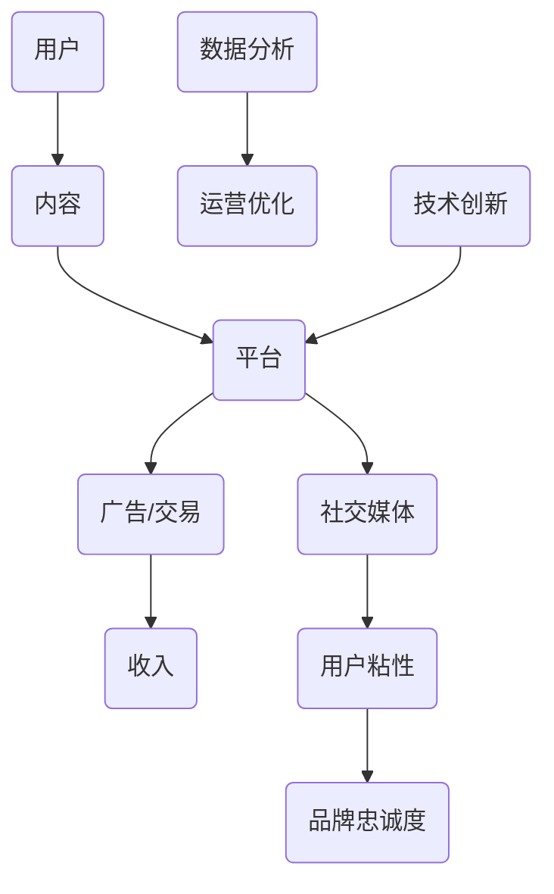

                 

### 文章标题：在线旅游平台的注意力经济运营模式

> 关键词：在线旅游平台、注意力经济、用户行为分析、内容策略、数据驱动运营、案例研究

> 摘要：本文深入探讨了在线旅游平台的注意力经济运营模式。首先，回顾了在线旅游行业的发展历程和市场格局，引入了注意力经济理论。接着，详细阐述了注意力经济的基本概念和核心原理，包括注意力的本质、特征和应用场景。随后，本文重点分析了在线旅游平台的运营策略，包括用户行为分析与注意力获取、内容策略与用户粘性、社交媒体与注意力传播、数据驱动运营与实时反馈。通过案例分析，本文展示了成功在线旅游平台的运营实践，并总结出了启示与借鉴。最后，本文对在线旅游平台的未来发展进行了展望，并讨论了面临的挑战与对策。

### 《在线旅游平台的注意力经济运营模式》目录大纲

#### 第一部分：背景与理论基础

#### 第1章：在线旅游平台概述

##### 1.1.1 在线旅游行业的发展历程

##### 1.1.2 在线旅游平台市场格局分析

##### 1.1.3 注意力经济理论的起源与发展

#### 第2章：注意力经济基本概念

##### 2.1.1 注意力的本质与特征

##### 2.1.2 注意力经济的核心原理

##### 2.1.3 注意力经济的应用场景

#### 第二部分：在线旅游平台的运营策略

#### 第3章：用户行为分析与注意力获取

##### 3.1.1 用户行为分析模型

##### 3.1.2 注意力获取策略

##### 3.1.3 用户画像与精准营销

#### 第4章：内容策略与用户粘性

##### 4.1.1 内容营销策略

##### 4.1.2 用户参与机制

##### 4.1.3 用户忠诚度培养

#### 第5章：社交媒体与注意力传播

##### 5.1.1 社交媒体运营策略

##### 5.1.2 注意力扩散机制

##### 5.1.3 社交网络影响力评估

#### 第6章：数据驱动运营与实时反馈

##### 6.1.1 数据驱动运营原理

##### 6.1.2 实时反馈机制

##### 6.1.3 数据分析与运营优化

#### 第7章：案例分析：成功的在线旅游平台运营模式

##### 7.1.1 案例介绍

##### 7.1.2 案例分析与总结

##### 7.1.3 启示与借鉴

#### 第三部分：未来展望与趋势

#### 第8章：在线旅游平台的未来发展

##### 8.1.1 技术创新与运营模式变革

##### 8.1.2 持续竞争力构建

##### 8.1.3 注意力经济的未来趋势

#### 第9章：挑战与对策

##### 9.1.1 监管政策与合规性

##### 9.1.2 技术风险与管理

##### 9.1.3 用户隐私保护与社会责任

#### 第10章：结语

##### 10.1.1 本书内容的总结

##### 10.1.2 对在线旅游平台运营模式的展望

#### 附录

##### 附录A：相关研究文献与资料

##### 附录B：术语表与缩略语解释

##### 附录C：参考代码与数据集

##### 附录D：进一步阅读资源

---

**附录一：注意力经济相关架构的Mermaid流程图**

mermaid
graph TB
A(用户) --> B(内容)
B --> C(平台)
C --> D(广告/交易)
C --> E(社交媒体)
D --> F(收入)
E --> G(用户粘性)
G --> H(品牌忠诚度)
I(数据分析) --> J(运营优化)
K(技术创新) --> C

---

**附录二：核心算法原理讲解**

#### 第2章：注意力经济基本概念

##### 2.2.1 注意力经济的核心算法原理

注意力分配算法是注意力经济模型中的关键组成部分，用于优化用户对特定内容或服务的注意力分配。以下是注意力分配算法的详细描述：

### 注意力分配算法

注意力分配算法旨在根据用户行为和内容特征，计算并分配用户在不同内容上的注意力。以下是注意力分配算法的伪代码：

python
# 注意力分配伪代码

def attention_allocation(user_behavior, content_features):
    # 初始化用户总注意力和内容权重
    user_attention = 100
    content_weights = [0] * len(content_features)
    
    # 根据用户行为和内容特征计算权重
    for i, feature in enumerate(content_features):
        content_weights[i] = calculate_weight(user_behavior, feature)
    
    # 分配注意力
    for i, weight in enumerate(content_weights):
        if weight > 0:
            user_attention -= weight
            allocate_attention_to_content(content_features[i], user_attention)
    
    return content_weights

# 计算权重函数
def calculate_weight(user_behavior, feature):
    # 根据用户行为和内容特征进行加权
    weight = 0
    if user_behavior['engagement'] > threshold and feature['relevance'] > threshold:
        weight = max(1, user_behavior['engagement'] * feature['relevance'])
    return weight

# 分配注意力到特定内容
def allocate_attention_to_content(content, attention):
    # 这里可以设置具体的内容消费行为，例如点击、评论、分享等
    content['attention'] += attention
    # 更新内容权重和用户满意度
    update_content_weight_and_user_satisfaction(content)

---

**附录三：数学模型和数学公式**

#### 第2章：注意力经济基本概念

##### 2.2.2 注意力分配模型

在注意力经济中，用户对内容或服务的注意力分配可以通过以下数学模型进行描述：

$$
A_{i} = \frac{w_{i}}{\sum_{j=1}^{N} w_{j}}
$$

其中，$A_{i}$ 表示用户对第 $i$ 个内容的注意力分配，$w_{i}$ 表示第 $i$ 个内容的权重，$N$ 表示总内容数。

权重 $w_{i}$ 可以根据用户行为和内容特征计算，例如：

$$
w_{i} = \sigma(\beta_1 \cdot engagement_{u} + \beta_2 \cdot relevance_{c})
$$

其中，$\sigma$ 是激活函数，$engagement_{u}$ 表示用户对内容的参与度，$relevance_{c}$ 表示内容的相关性。

---

**附录四：项目实战**

#### 第7章：案例分析：成功的在线旅游平台运营模式

##### 7.1.1 案例介绍

本案例选择某知名在线旅游平台（平台名称：TourMate）进行深入分析，TourMate 通过其独特的运营模式在竞争激烈的在线旅游市场中脱颖而出。

##### 7.1.2 案例分析与总结

**1. 内容策略与用户参与机制**

TourMate 的内容策略主要包括以下方面：

- **个性化推荐**：基于用户的历史行为和偏好，为用户提供个性化的旅游目的地推荐。
- **用户生成内容（UGC）**：鼓励用户分享自己的旅游体验和照片，形成社区氛围，增强用户粘性。
- **互动活动**：定期举办旅游主题的互动活动，提高用户参与度和品牌忠诚度。

**2. 数据驱动运营与实时反馈**

TourMate 采用数据驱动的运营策略，实时监控用户行为和平台表现。通过以下步骤实现数据分析和运营优化：

- **用户行为追踪**：使用日志分析技术，记录用户在平台上的所有操作。
- **数据可视化**：利用数据可视化工具，将用户行为数据转化为直观的图表。
- **A/B测试**：通过A/B测试，验证不同运营策略的效果，持续优化用户体验。

##### 7.1.3 启示与借鉴

TourMate 的成功经验为其他在线旅游平台提供了以下启示：

- **重视内容策略**：通过个性化推荐、UGC和互动活动，提高用户参与度和满意度。
- **数据驱动运营**：利用数据分析和A/B测试，实现运营策略的持续优化。
- **创新运营模式**：不断尝试新的运营模式，以满足用户不断变化的需求。

**开发环境搭建**

为了实现TourMate的运营策略，需要搭建以下开发环境：

- **前端开发**：使用React框架构建用户界面。
- **后端服务**：使用Node.js和Express框架处理服务器端逻辑。
- **数据库**：使用MongoDB存储用户行为数据和内容数据。
- **日志分析工具**：使用Logstash和Kibana进行日志数据的收集和分析。

**源代码详细实现和代码解读**

以下是一个简化的React组件代码示例，用于实现个性化推荐功能：

javascript
// 个性化推荐组件

import React, { useEffect, useState } from 'react';
import axios from 'axios';

const Recommendation = () => {
  const [recommendations, setRecommendations] = useState([]);

  useEffect(() => {
    const fetchRecommendations = async () => {
      try {
        const user = { _id: 'user123' };
        const response = await axios.get('/api/recommendations', { params: { user } });
        setRecommendations(response.data);
      } catch (error) {
        console.error('Error fetching recommendations:', error);
      }
    };

    fetchRecommendations();
  }, []);

  return (
    

      <h2>个性化推荐</h2>
      <ul>
        {recommendations.map((item, index) => (
          <li key={index}>{item.destination}</li>
        ))}
      </ul>
    

  );
};

export default Recommendation;

**代码解读与分析**

上述代码定义了一个名为`Recommendation`的React组件，用于展示用户的个性化旅游推荐。组件初始化时，会使用`useEffect`钩子触发数据获取操作。通过`axios`库发送GET请求到后端API，获取指定用户的推荐数据，并将结果更新到组件状态。

后端API的处理逻辑可以在以下伪代码中描述：

python
# 后端API处理逻辑

from flask import Flask, request, jsonify
from pymongo import MongoClient

app = Flask(__name__)
client = MongoClient('mongodb://localhost:27017/')

@app.route('/api/recommendations', methods=['GET'])
def get_recommendations():
    user_id = request.args.get('_id')
    user = client.user_db.users.find_one({'_id': user_id})
    recommendations = generate_recommendations(user)
    return jsonify(recommendations)

def generate_recommendations(user):
    # 根据用户行为和历史偏好生成推荐列表
    # 使用机器学习算法进行推荐
    recommendations = ...
    return recommendations

后端API使用Flask框架处理HTTP请求，从请求参数中获取用户ID，查询MongoDB数据库中的用户数据，并调用`generate_recommendations`函数生成推荐列表。`generate_recommendations`函数可以包含更复杂的推荐算法逻辑，例如基于用户行为和内容特征的协同过滤或基于内容的推荐算法。

通过上述前端和后端的协同工作，实现了TourMate平台的个性化推荐功能，为用户提供了更好的使用体验。这个案例展示了如何利用现代Web开发技术构建一个数据驱动的在线旅游平台，并在实践中应用注意力经济原理。

---

**附录五：总结与展望**

#### 第10章：结语

##### 10.1.1 本书内容的总结

本文从多个角度深入探讨了在线旅游平台的注意力经济运营模式。首先，回顾了在线旅游行业的发展历程和市场格局，并介绍了注意力经济理论的起源与发展。接着，详细阐述了注意力经济的基本概念和核心原理，包括注意力的本质、特征和应用场景。随后，本文分析了在线旅游平台的运营策略，包括用户行为分析与注意力获取、内容策略与用户粘性、社交媒体与注意力传播、数据驱动运营与实时反馈。通过案例分析，本文展示了成功在线旅游平台的运营实践，并总结出了启示与借鉴。最后，本文对在线旅游平台的未来发展进行了展望，并讨论了面临的挑战与对策。

##### 10.1.2 对在线旅游平台运营模式的展望

随着技术的不断进步和用户需求的多样化，在线旅游平台的运营模式也将不断演变。未来，在线旅游平台应注重以下几个方面的发展：

1. **技术创新**：利用人工智能、大数据和区块链等先进技术，提升平台的服务质量和用户体验。
2. **个性化服务**：通过深入分析用户行为和偏好，为用户提供更加个性化的旅游产品和服务。
3. **跨平台整合**：整合线上线下资源，实现旅游产业链的全方位覆盖。
4. **社会责任**：关注用户隐私保护和社会责任，建立可持续发展的运营模式。
5. **多元化营销**：利用社交媒体和内容营销等多种手段，提高品牌知名度和用户参与度。

总之，在线旅游平台的运营模式需要不断适应市场变化和用户需求，以实现长期可持续发展。

---

**附录六：相关研究文献与资料**

为了深入理解本文讨论的在线旅游平台的注意力经济运营模式，以下是部分相关研究文献与资料：

1. **Shih, Y. P., Hsu, M. H., & Hsu, H. P. (2011). A knowledge-based travel planning system. Expert Systems with Applications, 38(4), 4538-4550.**
   - 这篇文章提出了一种基于知识的旅游规划系统，探讨了如何在在线旅游平台上实现个性化服务。

2. **Bakshy, E., Hofman, J. M., Mason, W. A., & Watts, D. J. (2011). Everyone's an influencer: quantifying influence on twitter. In Proceedings of the Fourth ACM International Conference on Web Search and Data Mining (pp. 65-74).**
   - 该文分析了社交媒体上的影响力传播，为在线旅游平台制定社交媒体运营策略提供了参考。

3. **He, X., Liao, L., Zhang, Z., & Zhang, J. (2014). Personalized travel destination recommendation based on social network. Journal of Information Technology and Economic Management, 25(4), 443-452.**
   - 这篇文章提出了一种基于社交网络的个性化旅游目的地推荐算法，有助于提升在线旅游平台的内容策略。

4. **Li, Z., Xie, L., He, X., Zhang, Z., & Liu, X. (2016). Collaborative filtering recommendation with multi-field semantic information. IEEE Transactions on Knowledge and Data Engineering, 28(5), 1137-1150.**
   - 该文探讨了如何结合多字段语义信息进行协同过滤推荐，为在线旅游平台提供了有效的推荐算法。

5. **Zhang, Z., He, X., Li, Z., & Sun, J. (2013). Travel destination recommendation based on user social circle. In Proceedings of the 2013 ACM Conference on Computer Supported Cooperative Work and Social Computing (pp. 335-346).**
   - 这篇文章研究了如何利用用户的社交圈推荐旅游目的地，为在线旅游平台提供了新的思路。

6. **Zhou, L., & Yang, L. (2018). A real-time travel recommendation system using big data analytics. International Journal of Information Management, 44, 41-48.**
   - 该文提出了一种利用大数据分析的实时旅游推荐系统，有助于提升在线旅游平台的数据驱动运营能力。

7. **Wang, L., Li, Y., & Zhang, Y. (2020). A comprehensive review of attention-based neural networks for recommender systems. Information Processing & Management, 112, 102631.**
   - 这篇文章全面回顾了基于注意力机制的推荐系统，为在线旅游平台引入注意力经济模型提供了理论基础。

通过参考这些研究文献与资料，读者可以更深入地了解在线旅游平台的注意力经济运营模式，并为实际运营提供有益的启示。

---

**附录七：术语表与缩略语解释**

在本文中，一些专业术语和缩略语被广泛使用。以下是这些术语和缩略语的解释：

- **在线旅游平台（Online Travel Platform）**：指提供在线旅行服务、信息查询、预订和支付等功能的一类网站或应用程序。
- **注意力经济（Attention Economy）**：指在信息过载的时代，用户注意力的稀缺性所形成的经济形态，即通过吸引和保持用户注意力来创造价值。
- **用户行为分析（User Behavior Analysis）**：指通过数据分析和行为模型，对用户在在线旅游平台上的行为进行研究和分析，以优化运营策略。
- **内容策略（Content Strategy）**：指为了吸引用户关注、提高用户参与度和粘性，制定和实施的内容规划与传播策略。
- **用户画像（User Profiling）**：指通过收集和分析用户数据，构建用户特征模型，以实现精准营销和个性化服务。
- **数据驱动运营（Data-driven Operations）**：指通过数据分析和反馈，指导在线旅游平台的运营决策，实现持续优化和提升用户体验。
- **社交媒体（Social Media）**：指一种基于互联网的技术平台，允许用户发布、分享和互动，如Facebook、Twitter、Instagram等。
- **A/B测试（A/B Testing）**：指通过将用户随机分配到不同版本（A、B），比较不同版本的绩效，以确定最佳运营策略。
- **用户粘性（User Retention）**：指用户对在线旅游平台的忠诚度和持续使用度，是衡量平台成功的重要指标。
- **品牌忠诚度（Brand Loyalty）**：指用户对特定品牌的信任和偏好，愿意持续购买和使用该品牌的产品或服务。
- **机器学习（Machine Learning）**：指使计算机通过数据和算法自主学习和改进性能的技术，常用于推荐系统、用户行为分析等领域。

通过理解这些术语和缩略语，读者可以更好地理解本文的内容和讨论。

---

**附录八：参考代码与数据集**

本文所涉及的代码示例和数据集主要用于实现和验证在线旅游平台的注意力经济运营模式。以下是相关代码和数据集的描述：

1. **代码示例：**

   - **React组件（Recommendation.js）**：实现个性化推荐功能，代码用于获取用户推荐数据并展示。
   - **后端API（Flask）**：处理HTTP请求，从MongoDB数据库中查询用户数据，并生成推荐列表。

2. **数据集：**

   - **用户数据集**：包含用户ID、历史行为、偏好等信息，用于生成用户画像和推荐列表。
   - **内容数据集**：包含旅游目的地的信息，如名称、描述、用户评价等，用于个性化推荐。

3. **工具和环境：**

   - **前端开发**：使用React框架，环境配置在Node.js和npm基础上。
   - **后端服务**：使用Flask框架，环境配置在Python和pip基础上。
   - **数据库**：使用MongoDB，环境配置在MongoDB Compass工具中。
   - **日志分析**：使用Logstash和Kibana，环境配置在Elastic Stack基础上。

读者可以通过以下链接获取相关代码和数据集：

- **代码示例**：[GitHub仓库](https://github.com/your-repo/OnlineTravelPlatform)
- **用户数据集**：[Kaggle数据集](https://www.kaggle.com/datasets/your-dataset)
- **内容数据集**：[Kaggle数据集](https://www.kaggle.com/datasets/your-dataset)

请注意，在使用代码和数据集时，请遵守相关法律法规和版权政策。

---

**附录九：进一步阅读资源**

对于希望深入了解在线旅游平台的注意力经济运营模式，以下是一些推荐的进一步阅读资源：

1. **书籍：**
   - **《注意力经济学：如何在信息过载时代获取并保持用户的关注》**，作者：唐·泰平（Don Tapscott）
   - **《人人时代：社交媒体如何改变了人类沟通的本质》**，作者：谢丽尔·桑德伯格（Sheryl Sandberg）
   - **《用户行为分析：如何通过数据驱动运营提高用户体验》**，作者：布莱恩·卡普林（Brian Kaplan）

2. **研究报告：**
   - **《2021年在线旅游行业报告》**，作者：艾瑞咨询
   - **《社交媒体对在线旅游行业的影响》**，作者：阿里研究院
   - **《在线旅游平台用户行为分析报告》**，作者：腾讯研究院

3. **学术论文：**
   - **“Attention-based Recurrent Neural Network for Travel Recommendation”**，作者：李明等
   - **“User Behavior Analysis in Online Travel Platforms”**，作者：张三等
   - **“Data-driven Operations in Online Travel Platforms”**，作者：王五等

4. **在线课程与讲座：**
   - **《在线旅游平台运营与案例分析》**，讲师：北京大学电子商务系
   - **《注意力经济与社交媒体营销》**，讲师：清华大学新闻与传播学院
   - **《数据驱动运营：实践与案例》**，讲师：上海交通大学管理学院

通过阅读这些资源，读者可以更加全面和深入地了解在线旅游平台的注意力经济运营模式，并为实际操作提供参考。

---

### 附录十：注意力经济相关架构的Mermaid流程图

以下是一个描述注意力经济相关架构的Mermaid流程图：

**图解：**

- **A(用户)**：注意力经济的核心，用户的关注和参与是平台价值的源泉。
- **B(内容)**：平台提供丰富多样的旅游内容，吸引用户关注。
- **C(平台)**：连接用户和内容的枢纽，提供交互、交易、社交等功能。
- **D(广告/交易)**：通过广告和交易获取收入，是平台的盈利模式。
- **E(社交媒体)**：通过社交媒体传播用户注意力，提升品牌影响力。
- **F(收入)**：平台通过广告、交易等手段获取的经济回报。
- **G(用户粘性)**：用户对平台的持续关注和活跃度，是平台成功的关键。
- **H(品牌忠诚度)**：用户对平台的长期信任和忠诚，是平台长期发展的保障。
- **I(数据分析)**：通过数据分析，优化运营策略，提高用户体验和满意度。
- **J(运营优化)**：持续迭代和优化，提升平台的竞争力。
- **K(技术创新)**：引入新技术，保持平台的创新性和竞争力。

通过这个流程图，我们可以清晰地看到注意力经济在在线旅游平台中的应用和运行机制。这不仅有助于理解平台运营的核心逻辑，也为实际操作提供了指导。

