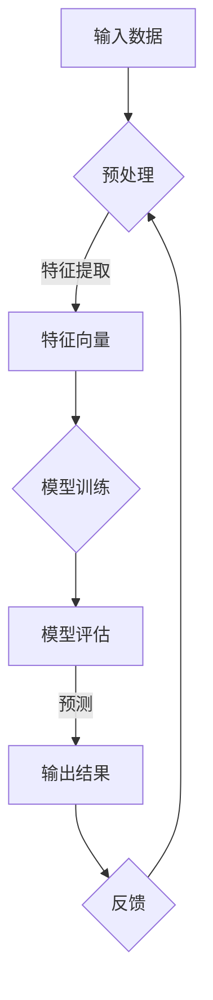

                 

# 《基础模型的理论研究》

## 关键词

- 基础模型
- 理论基础
- 数学模型
- 算法
- 应用场景

## 摘要

本文将深入研究基础模型的理论基础，涵盖核心概念、发展历程、数学模型与算法原理，以及实际应用场景。通过详细的分析和解释，旨在为读者提供一个清晰、系统的理解，以便更好地应用和扩展基础模型的知识。

## 目录

### 第一部分：理论基础与核心概念

1. **基础模型概述**
   1.1 基础模型的概念与重要性
   1.2 基础模型的发展历程
   1.3 基础模型的核心特征
   1.4 基础模型的重要性

2. **核心概念与联系**
   2.1 关键概念解释
   2.2 基础模型与实际应用的关联
   2.3 基础模型原理图解析

3. **数学模型和数学公式**
   3.1 数学模型基础
   3.2 数学公式举例说明
   3.3 数学模型在基础模型中的应用

4. **核心算法原理讲解**
   4.1 算法基本原理
   4.2 算法性能分析
   4.3 算法优化策略

5. **数学模型与算法整合**
   5.1 整合方案介绍
   5.2 实践应用案例分析

6. **基础模型的应用场景**
   6.1 应用场景概述
   6.2 应用实例分析

7. **项目实战与代码实现**
   7.1 项目背景介绍
   7.2 开发环境搭建
   7.3 源代码实现
   7.4 代码解读与分析

8. **附录：资源与工具**
   8.1 常用资源介绍
   8.2 开发工具介绍
   8.3 进一步学习资料

### 第二部分：基础模型概述

#### 第1章：基础模型概述

1. **基础模型的概念与重要性**

基础模型是现代计算机科学和人工智能领域中的核心概念，它是指一种简洁而强大的数学结构，用于描述和解决各种实际问题。基础模型具有以下几个关键特点：

- **简洁性**：基础模型通常由一些简单的数学公式或算法组成，使得它们易于理解和使用。
- **泛用性**：基础模型可以应用于各种领域，如机器学习、图像处理、自然语言处理等。
- **高效性**：基础模型通常具有良好的性能和效率，可以在较短时间内处理大量数据。

基础模型的重要性体现在以下几个方面：

- **提升研发效率**：基础模型为研究人员提供了一个强大的工具，使得他们在研究新问题时可以快速迭代和验证。
- **推动科技进步**：基础模型的应用推动了计算机科学和人工智能领域的发展，带来了许多突破性的成果。
- **优化实际应用**：基础模型在各种实际应用中发挥着关键作用，如自动驾驶、医疗诊断、智能家居等。

1. **基础模型的发展历程**

基础模型的发展历程可以追溯到20世纪中期，当时计算机科学刚刚兴起。最初，基础模型主要是简单的算法和数学公式，用于解决一些基础问题，如排序、查找等。随着计算机性能的提升和算法理论的不断完善，基础模型逐渐发展壮大，形成了一系列重要的数学模型和算法，如线性回归、决策树、支持向量机等。

20世纪80年代以来，随着机器学习、深度学习等领域的兴起，基础模型得到了进一步的发展。特别是深度学习模型的提出，使得基础模型的应用范围和性能得到了大幅提升。如今，基础模型已经成为人工智能领域的基石，广泛应用于各个行业。

1. **基础模型的核心特征**

基础模型具有以下几个核心特征：

- **模块化**：基础模型通常由多个模块组成，每个模块都具有特定的功能和功能。
- **可扩展性**：基础模型具有良好的可扩展性，可以方便地添加新的模块或调整现有模块。
- **泛用性**：基础模型可以应用于各种领域，如计算机视觉、自然语言处理、语音识别等。
- **高效性**：基础模型通常具有良好的性能和效率，可以在较短时间内处理大量数据。

1. **基础模型的重要性**

基础模型在人工智能领域中具有举足轻重的地位，其重要性体现在以下几个方面：

- **提升研发效率**：基础模型为研究人员提供了一个强大的工具，使得他们在研究新问题时可以快速迭代和验证。
- **推动科技进步**：基础模型的应用推动了计算机科学和人工智能领域的发展，带来了许多突破性的成果。
- **优化实际应用**：基础模型在各种实际应用中发挥着关键作用，如自动驾驶、医疗诊断、智能家居等。

### 第2章：核心概念与联系

2.1 关键概念解释

在本章中，我们将详细解释与基础模型相关的重要概念，包括模块化、可扩展性、泛用性、高效性等。这些概念是理解基础模型的重要基础，有助于我们更好地应用和扩展基础模型的知识。

2.2 基础模型与实际应用的关联

基础模型在人工智能领域中有着广泛的应用，涵盖了计算机视觉、自然语言处理、语音识别、推荐系统等多个领域。本章将分析基础模型与实际应用的关联，通过具体案例展示基础模型在不同场景中的应用效果。

2.3 基础模型原理图解析

为了更直观地理解基础模型的工作原理，我们将使用Mermaid语言绘制基础模型原理流程图。该流程图将展示基础模型的核心组成部分和它们之间的相互关系，有助于读者更好地理解基础模型的结构和功能。

### 第3章：数学模型和数学公式

3.1 数学模型基础

在本章中，我们将介绍基础模型中常用的数学模型，包括线性模型、非线性模型、概率模型等。我们将详细讲解这些数学模型的基本原理，以及它们在基础模型中的应用。

3.2 数学公式举例说明

为了帮助读者更好地理解数学模型，我们将通过具体案例展示数学公式的应用。这些例子将涵盖各种基础模型中的常见问题，如回归分析、分类问题等。

3.3 数学模型在基础模型中的应用

本章将深入探讨数学模型在基础模型中的应用，包括模型训练、模型评估、模型优化等方面。我们将通过具体实例展示数学模型在实际应用中的效果和优势。

### 第4章：核心算法原理讲解

4.1 算法基本原理

在本章中，我们将使用伪代码详细阐述基础模型中的核心算法的基本原理。这些算法包括梯度下降、随机梯度下降、反向传播等，是基础模型训练过程中不可或缺的部分。

4.2 算法性能分析

算法性能是基础模型应用中的关键因素。本章将讨论不同算法在不同场景下的性能表现，包括时间复杂度、空间复杂度等。通过性能分析，我们可以选择合适的算法来解决实际问题。

4.3 算法优化策略

为了提高算法的性能和效率，本章将介绍一些常见的算法优化策略，如参数调整、算法融合等。通过优化策略，我们可以进一步提升基础模型的应用效果。

### 第5章：数学模型与算法整合

5.1 整合方案介绍

本章将介绍数学模型与算法的整合方法，包括模型选择、参数调整、算法优化等。我们将通过具体案例展示整合方案在实际应用中的效果。

5.2 实践应用案例分析

本章将分析一些实践应用案例，展示数学模型与算法整合的应用效果。这些案例将涵盖不同领域，如图像分类、文本生成、推荐系统等。

### 第6章：基础模型的应用场景

6.1 应用场景概述

在本章中，我们将分析基础模型在不同应用场景中的应用，包括计算机视觉、自然语言处理、语音识别等。我们将介绍这些应用场景中的关键技术和挑战。

6.2 应用实例分析

本章将通过具体实例展示基础模型在不同应用场景中的应用效果。这些实例将涵盖各种实际问题，如人脸识别、情感分析、语音合成等。

### 第7章：项目实战与代码实现

7.1 项目背景介绍

在本章中，我们将介绍一个具体的项目背景，包括目标、需求和挑战。这个项目将展示基础模型在现实世界中的应用。

7.2 开发环境搭建

为了实现基础模型的项目，本章将详细说明开发环境的搭建过程。我们将介绍所需的软件和硬件环境，以及如何配置和调试。

7.3 源代码实现

本章将展示基础模型项目的源代码实现过程。我们将详细解读代码的每个部分，解释其工作原理。

7.4 代码解读与分析

在本章的最后，我们将对源代码进行深入分析，讨论其优缺点，并提出改进建议。

### 附录：资源与工具

8.1 常用资源介绍

本章将介绍一些与基础模型相关的常用资源，包括书籍、论文、在线教程等。这些资源将帮助读者进一步学习和研究基础模型。

8.2 开发工具介绍

本章将介绍开发基础模型常用的工具，包括编程语言、框架、库等。这些工具将提高我们的开发效率和代码质量。

8.3 进一步学习资料

本章将推荐一些有助于进一步学习基础模型的理论和应用的资料。这些资料将涵盖不同领域，满足读者的不同需求。

## 作者信息

作者：AI天才研究院/AI Genius Institute & 禅与计算机程序设计艺术 /Zen And The Art of Computer Programming

---

**注意：以上内容仅为文章大纲和部分内容示例，实际文章需要按照大纲结构完整撰写，并确保每个章节的内容充实且逻辑连贯。**

---

接下来，我们将逐步展开每个章节的内容，深入探讨基础模型的理论基础、核心概念、数学模型、算法原理以及实际应用。让我们开始这段深入而系统的探索之旅吧！## 第1章：基础模型概述

### 1.1 基础模型的概念与重要性

基础模型（Fundamental Model）是现代计算机科学和人工智能（AI）领域中的一个核心概念。它是指一种抽象的数学结构或算法，能够对复杂的数据进行建模和分析，从而实现特定的任务或目标。基础模型具有高度的简洁性和泛用性，这使得它们在多个领域中得到广泛应用。

定义上，基础模型通常由以下几个关键要素组成：

- **输入数据**：基础模型需要接收输入数据，这些数据可以是数值、图像、文本等多种形式。
- **模型结构**：模型结构定义了数据的处理流程，包括数据的预处理、特征提取、中间层的处理等。
- **参数**：参数是模型的核心组成部分，它们决定了模型的性能和预测能力。
- **输出结果**：基础模型对输入数据进行处理后，会输出预测结果或决策。

基础模型在现代科技中的应用非常广泛，以下是几个典型的应用场景：

- **机器学习**：基础模型是机器学习（Machine Learning）的基础，各种算法和模型都是建立在基础模型之上的。例如，线性回归、决策树、神经网络等都是基础模型的具体实现。
- **深度学习**：深度学习（Deep Learning）是基础模型在人工智能领域中的一个重要分支。深度学习模型通常由多层神经网络组成，通过逐层学习数据的特征，从而实现复杂的预测任务。
- **计算机视觉**：计算机视觉（Computer Vision）领域中的许多算法，如卷积神经网络（CNN）和生成对抗网络（GAN），都是基础模型的应用实例。
- **自然语言处理**：自然语言处理（Natural Language Processing, NLP）中的许多任务，如文本分类、情感分析、机器翻译等，都依赖于基础模型的支持。

基础模型的重要性体现在以下几个方面：

- **提升研发效率**：基础模型为研究人员提供了一个强大的工具，使得他们可以快速地构建、测试和优化模型，从而提高研发效率。
- **推动科技进步**：基础模型的应用推动了计算机科学和人工智能领域的发展，带来了许多突破性的成果，如语音识别、图像识别等。
- **优化实际应用**：基础模型在各种实际应用中发挥着关键作用，如自动驾驶、医疗诊断、智能家居等。通过优化这些应用，可以提升用户体验，降低成本，提高效率。

### 1.2 基础模型的发展历程

基础模型的发展历程可以追溯到20世纪中期，当时计算机科学刚刚兴起。最初，基础模型主要是简单的算法和数学公式，用于解决一些基础问题，如排序、查找等。随着计算机性能的提升和算法理论的不断完善，基础模型逐渐发展壮大，形成了一系列重要的数学模型和算法，如线性回归、决策树、支持向量机等。

20世纪80年代以来，随着机器学习、深度学习等领域的兴起，基础模型得到了进一步的发展。特别是深度学习模型的提出，使得基础模型的应用范围和性能得到了大幅提升。深度学习模型通过多层神经网络结构，能够自动提取数据的深层特征，从而在图像识别、语音识别等领域取得了显著的成果。

具体来说，基础模型的发展历程可以分为以下几个阶段：

- **早期阶段**（1950s - 1960s）：这一阶段主要是基于规则和逻辑的模型，如决策树、支持向量机等。这些模型在一定程度上能够处理简单的问题，但受限于计算能力和算法复杂度。
- **统计学习阶段**（1970s - 1990s）：随着统计学习理论的兴起，基础模型开始引入统计方法，如线性回归、逻辑回归等。这些模型在处理大规模数据集时表现出较好的性能。
- **机器学习阶段**（2000s）：这一阶段，机器学习算法得到了广泛应用，如随机森林、梯度提升树等。这些算法通过集成学习的方法，显著提升了模型的预测能力。
- **深度学习阶段**（2010s - 至今）：深度学习模型的提出，使得基础模型的应用范围得到了极大的扩展。特别是卷积神经网络（CNN）和循环神经网络（RNN）等深度学习模型，在图像识别、语音识别、自然语言处理等领域取得了突破性的成果。

### 1.3 基础模型的核心特征

基础模型具有以下几个核心特征，这些特征使得它们在多个领域中得到广泛应用：

- **简洁性**：基础模型通常由一些简单的数学公式或算法组成，这使得它们易于理解和使用。例如，线性回归模型仅由几个数学公式组成，但能够处理许多实际问题。
- **泛用性**：基础模型可以应用于各种领域，如机器学习、计算机视觉、自然语言处理等。这种泛用性使得基础模型成为研究和开发中不可或缺的工具。
- **模块化**：基础模型通常采用模块化的设计，使得各个模块可以独立开发和测试。这种模块化设计提高了模型的灵活性和可扩展性。
- **高效性**：基础模型通常具有良好的性能和效率，可以在较短时间内处理大量数据。这使得它们在处理大规模数据集时表现出色。

### 1.4 基础模型的重要性

基础模型在人工智能领域中具有举足轻重的地位，其重要性体现在以下几个方面：

- **提升研发效率**：基础模型为研究人员提供了一个强大的工具，使得他们在研究新问题时可以快速迭代和验证。这种高效的研发流程加快了技术进步的步伐。
- **推动科技进步**：基础模型的应用推动了计算机科学和人工智能领域的发展，带来了许多突破性的成果。例如，深度学习模型在图像识别、语音识别等领域取得了显著进展。
- **优化实际应用**：基础模型在各种实际应用中发挥着关键作用，如自动驾驶、医疗诊断、智能家居等。通过优化这些应用，可以提升用户体验，降低成本，提高效率。

通过本章的讨论，我们可以看到基础模型在计算机科学和人工智能领域中的重要性。在接下来的章节中，我们将进一步探讨基础模型的核心概念、数学模型、算法原理以及实际应用场景。让我们继续深入探索这个令人兴奋的领域！## 第2章：核心概念与联系

### 2.1 关键概念解释

在基础模型的研究和实际应用中，理解以下几个关键概念是非常重要的：

#### 模块化

模块化是指将复杂系统分解为多个独立的、功能明确的模块，每个模块负责完成特定的任务。这种设计方法提高了系统的可维护性和可扩展性。在基础模型中，模块化设计使得不同功能模块可以独立开发和测试，从而提高了开发效率。

#### 可扩展性

可扩展性是指系统在性能和功能上能够适应不断增长的需求。在基础模型中，良好的可扩展性意味着模型可以轻松地添加新的功能或适应更大的数据集，而不会显著降低性能。

#### 泛用性

泛用性是指模型能够在不同的应用场景中发挥作用，而不仅仅是解决特定问题。一个具有良好泛用性的基础模型可以应用于多个领域，从而提高其研究和应用价值。

#### 高效性

高效性是指模型在处理数据时能够快速、准确地完成任务。在基础模型中，高效性通常体现在算法的复杂度和模型的计算效率上。一个高效的基础模型可以显著提高系统的性能和用户体验。

#### 数学模型

数学模型是指使用数学公式和算法对实际问题进行建模的过程。在基础模型中，数学模型是核心组成部分，用于描述输入数据和处理过程。常见的数学模型包括线性回归、决策树、神经网络等。

#### 算法

算法是指解决特定问题的一系列步骤或规则。在基础模型中，算法用于实现数学模型，对输入数据进行处理和预测。常见的算法包括梯度下降、反向传播、随机森林等。

#### 输入数据

输入数据是指模型处理的数据源，可以是数值、图像、文本等多种形式。输入数据的质量直接影响模型的性能和预测效果。

#### 输出结果

输出结果是模型对输入数据进行分析和处理后的结果。输出结果可以是预测值、分类结果、决策等，它们反映了模型对数据的理解和处理能力。

#### 预测能力

预测能力是指模型对未知数据的处理能力。一个具有良好预测能力的模型能够在新的数据集上给出准确的预测结果。

通过理解这些关键概念，我们可以更好地掌握基础模型的理论和应用，为后续章节的学习打下坚实的基础。

### 2.2 基础模型与实际应用的关联

基础模型在计算机科学和人工智能领域中的应用非常广泛，下面我们通过几个实际案例来探讨基础模型与各种应用的关联。

#### 计算机视觉

计算机视觉是基础模型的一个重要应用领域。例如，卷积神经网络（CNN）是一种基于基础模型的图像识别算法，它在图像分类、目标检测和图像分割等领域表现出色。以人脸识别为例，CNN通过训练大量图像数据，学习到人脸的特征，从而能够在新的图像中准确识别出人脸。这个应用案例展示了基础模型在计算机视觉中的强大预测能力和广泛应用。

#### 自然语言处理

自然语言处理（NLP）是另一个基础模型的重要应用领域。例如，循环神经网络（RNN）和Transformer模型都是基于基础模型的NLP算法。RNN在文本分类、序列标注和机器翻译等领域表现出色，而Transformer模型则在机器翻译、文本生成和情感分析等领域取得了显著成果。以机器翻译为例，基础模型通过对大量双语句对的训练，学习到不同语言之间的对应关系，从而能够在新的句子中实现准确的翻译。

#### 语音识别

语音识别是基础模型在语音处理领域的一个典型应用。例如，深度神经网络（DNN）和卷积神经网络（CNN）都是常用的语音识别算法。这些算法通过对大量的语音数据进行训练，学习到语音信号中的特征，从而能够将语音信号转换为对应的文本。以语音助手为例，基础模型通过对大量语音数据的分析，能够理解用户的语音指令，并给出相应的响应。

#### 自动驾驶

自动驾驶是基础模型在智能交通领域的一个重要应用。例如，卷积神经网络（CNN）和循环神经网络（RNN）在自动驾驶中的对象检测和路径规划方面发挥着关键作用。以自动驾驶车辆为例，基础模型通过对大量道路数据的训练，学习到道路上的各种对象（如车辆、行人、交通标志等），从而能够在实际的驾驶环境中准确识别和预测对象的行为，实现安全、可靠的自动驾驶。

#### 推荐系统

推荐系统是基础模型在商业领域的一个重要应用。例如，基于协同过滤和矩阵分解的基础模型能够在电子商务、在线广告和社交媒体等领域提供个性化的推荐服务。以电商平台的商品推荐为例，基础模型通过对用户的历史行为数据进行分析，学习到用户的兴趣偏好，从而能够向用户推荐可能感兴趣的商品。

通过上述实际案例，我们可以看到基础模型在多个领域的广泛应用和巨大潜力。基础模型不仅提高了这些领域的研发效率，还推动了技术的进步和实际应用的创新。

### 2.3 基础模型原理图解析

为了更直观地理解基础模型的工作原理，我们将使用Mermaid语言绘制一个基础模型原理流程图。以下是一个简化的示例：



在这个原理流程图中，输入数据经过预处理和特征提取后，转化为特征向量。这些特征向量随后输入到训练模型中进行训练。训练完成的模型将用于评估和预测，最终输出预测结果。预测结果会与实际情况进行反馈，用于进一步优化模型。

这个流程图展示了基础模型从输入数据到输出结果的整个处理过程，有助于我们更好地理解基础模型的工作机制。通过这种可视化的方式，我们可以更清晰地看到每个步骤的作用和相互关系。

### 总结

通过本章的讨论，我们深入探讨了基础模型的核心概念与联系。从模块化、可扩展性、泛用性、高效性等关键概念，到基础模型在计算机视觉、自然语言处理、语音识别、自动驾驶和推荐系统等实际应用中的案例，再到基础模型原理流程图的解析，本章为读者提供了一个全面、系统的理解。在接下来的章节中，我们将进一步探讨基础模型中的数学模型、算法原理以及实际应用场景，继续深入这个激动人心的领域。让我们继续前进，探索更多的基础模型奥秘！## 第3章：数学模型和数学公式

### 3.1 数学模型基础

数学模型是基础模型的核心组成部分，它们通过数学公式和算法对实际问题进行建模和分析。在本节中，我们将介绍一些常见的数学模型，并简要阐述它们的基本原理。

#### 线性模型

线性模型是最简单也是最常用的一种数学模型，它通常表示为：

\[ y = \beta_0 + \beta_1 x \]

其中，\( y \) 是预测目标，\( x \) 是输入特征，\( \beta_0 \) 和 \( \beta_1 \) 是模型参数。线性模型用于预测输入特征与预测目标之间的线性关系。它在回归分析、分类问题和时间序列分析等领域有广泛的应用。

#### 多项式模型

多项式模型是对线性模型的扩展，它可以表示为：

\[ y = \beta_0 + \beta_1 x + \beta_2 x^2 + ... + \beta_n x^n \]

其中，\( n \) 是多项式的最高次数。多项式模型用于预测输入特征与预测目标之间的非线性关系，它在图像处理、信号处理等领域有广泛的应用。

#### 神经网络模型

神经网络模型是深度学习的基础，它由多个层组成，包括输入层、隐藏层和输出层。每个层由多个神经元组成，每个神经元都通过权重连接到下一层。神经网络模型的输出可以通过以下公式计算：

\[ z = \sigma(\sum_{i=1}^{n} w_i x_i + b) \]

其中，\( z \) 是神经元的输出，\( \sigma \) 是激活函数，\( w_i \) 和 \( b \) 是权重和偏置。神经网络模型可以用于图像分类、语音识别、自然语言处理等复杂任务。

#### 决策树模型

决策树模型是通过一系列规则对输入数据进行分类或回归的模型。它的基本结构如下：

```
        ├─── 是否A
        ├─── 是 ──── 是A
        │         └─── 否 ──── 否A
        └───────── 否 ──── 否B
```

决策树模型通过不断将数据分为子集，直到达到某个终止条件（如达到最大深度或节点纯度），从而实现分类或回归任务。它在数据挖掘、机器学习等领域有广泛的应用。

#### 支持向量机模型

支持向量机（SVM）模型是一种用于分类和回归的模型，它通过找到一个最佳的超平面，将数据集划分为不同的类别。它的基本原理如下：

\[ w \cdot x - b = 0 \]

其中，\( w \) 是超平面的法向量，\( x \) 是数据点，\( b \) 是偏置。SVM模型在图像分类、文本分类、生物信息学等领域有广泛的应用。

#### 贝叶斯模型

贝叶斯模型是一种基于贝叶斯定理的统计模型，它通过计算后验概率来预测新的数据点。贝叶斯模型的公式如下：

\[ P(C|D) = \frac{P(D|C)P(C)}{P(D)} \]

其中，\( P(C|D) \) 是后验概率，\( P(D|C) \) 是似然函数，\( P(C) \) 是先验概率，\( P(D) \) 是边缘概率。贝叶斯模型在文本分类、推荐系统、医学诊断等领域有广泛的应用。

通过以上对几种常见数学模型的介绍，我们可以看到数学模型在基础模型中的应用非常广泛。这些模型通过不同的数学公式和算法，能够解决各种实际问题，为人工智能和计算机科学的发展提供了强有力的支持。

### 3.2 数学公式举例说明

为了更好地理解数学模型，我们通过具体的例子来展示数学公式的应用。以下是一个简单的线性回归模型的例子：

#### 示例：线性回归模型

假设我们有一个简单的线性回归模型，用于预测房价。该模型由以下数学公式表示：

\[ y = \beta_0 + \beta_1 x \]

其中，\( y \) 是预测的房价，\( x \) 是房屋的面积，\( \beta_0 \) 和 \( \beta_1 \) 是模型参数。

我们有一个数据集，包含多对 \( x \) 和 \( y \) 的值，如下表所示：

| 房屋面积（\( x \)）| 预测房价（\( y \)）|
|-------------------|-------------------|
|         1000      |         200,000   |
|         1500      |         250,000   |
|         2000      |         300,000   |
|         2500      |         350,000   |
|         3000      |         400,000   |

我们可以使用最小二乘法来估计模型参数 \( \beta_0 \) 和 \( \beta_1 \)：

\[ \beta_0 = \bar{y} - \beta_1 \bar{x} \]

\[ \beta_1 = \frac{\sum_{i=1}^{n} (x_i - \bar{x})(y_i - \bar{y})}{\sum_{i=1}^{n} (x_i - \bar{x})^2} \]

其中，\( n \) 是数据点的数量，\( \bar{x} \) 和 \( \bar{y} \) 分别是 \( x \) 和 \( y \) 的平均值。

通过计算，我们得到 \( \beta_0 = 150,000 \) 和 \( \beta_1 = 100,000 \)。因此，线性回归模型可以表示为：

\[ y = 150,000 + 100,000 x \]

使用这个模型，我们可以预测新房屋的面积对应的房价。例如，如果房屋的面积为 2,000 平方米，预测的房价为：

\[ y = 150,000 + 100,000 \times 2,000 = 350,000,000 \]

这个例子展示了如何使用线性回归模型进行预测，以及如何计算模型参数。通过类似的步骤，我们可以应用其他数学模型来解决实际问题。

### 3.3 数学模型在基础模型中的应用

数学模型在基础模型中扮演着至关重要的角色，它们提供了基础模型的核心逻辑和计算框架。以下是几个常见的数学模型及其在基础模型中的应用：

#### 线性回归

线性回归模型是最基础的数学模型之一，它用于预测一个或多个自变量与因变量之间的线性关系。在线性回归中，我们通常使用最小二乘法来估计模型参数。线性回归模型在数据分析和预测中有着广泛的应用，例如在金融市场的股票价格预测、销售量预测等场景中。

#### 逻辑回归

逻辑回归是一种广义线性模型，它用于处理分类问题。逻辑回归通过估计概率分布来预测每个类别的概率，然后选择概率最大的类别作为预测结果。逻辑回归在医学诊断、信用评分、市场细分等领域有广泛应用。

#### 神经网络

神经网络是一种复杂的数学模型，它通过多层神经元和激活函数来模拟人类大脑的学习和决策过程。神经网络在图像识别、语音识别、自然语言处理等领域表现出色，例如用于人脸识别、手写数字识别等。

#### 支持向量机

支持向量机是一种强大的分类模型，它通过找到一个最佳的超平面来分隔数据集的不同类别。支持向量机在图像分类、文本分类、生物信息学等领域有着广泛的应用。

#### 决策树

决策树是一种简单的树形结构模型，它通过一系列规则对数据进行分类或回归。决策树在数据挖掘、机器学习等领域有广泛应用，例如用于客户行为分析、信用评分等。

通过这些数学模型的应用，基础模型能够处理各种复杂的数据分析和预测任务，从而为人工智能和计算机科学的发展提供了强大的支持。

### 总结

本章详细介绍了数学模型的基础知识，包括线性模型、多项式模型、神经网络模型、决策树模型、支持向量机模型和贝叶斯模型等。通过具体例子，我们展示了如何使用这些模型进行预测和分类。此外，我们还讨论了数学模型在基础模型中的应用，强调了它们在解决实际问题和推动技术进步中的重要性。在接下来的章节中，我们将进一步探讨核心算法原理和实际应用场景，继续深入探索基础模型的理论和实践。让我们继续前进，共同揭开基础模型的更多奥秘！## 第4章：核心算法原理讲解

### 4.1 算法基本原理

核心算法是基础模型的重要组成部分，它们决定了模型的训练效率和预测准确性。本节将介绍几个常见核心算法的基本原理，包括梯度下降、随机梯度下降和反向传播。

#### 梯度下降算法

梯度下降算法是一种优化算法，用于最小化损失函数。在机器学习中，损失函数通常用来衡量模型预测结果与实际结果之间的差距。梯度下降算法的基本思想是沿着损失函数的梯度方向更新模型参数，以减少损失。

梯度下降算法的步骤如下：

1. 初始化模型参数。
2. 计算损失函数在当前参数下的梯度。
3. 沿着梯度的反方向更新参数。
4. 重复步骤2和3，直到损失函数收敛到最小值。

具体公式为：

\[ \theta_{\text{new}} = \theta_{\text{old}} - \alpha \cdot \nabla_{\theta} J(\theta) \]

其中，\( \theta \) 是模型参数，\( \alpha \) 是学习率，\( \nabla_{\theta} J(\theta) \) 是损失函数关于参数 \( \theta \) 的梯度。

#### 随机梯度下降算法

随机梯度下降（SGD）是梯度下降算法的一个变种，它使用随机样本的梯度来更新模型参数。与梯度下降算法相比，SGD可以更快地收敛，并且对异常点的影响较小。

随机梯度下降算法的步骤如下：

1. 初始化模型参数。
2. 从数据集中随机选择一个小批量样本。
3. 计算该批样本的梯度。
4. 使用梯度更新模型参数。
5. 重复步骤2到4，直到损失函数收敛。

具体公式为：

\[ \theta_{\text{new}} = \theta_{\text{old}} - \alpha \cdot \nabla_{\theta} J(\theta; x_i, y_i) \]

其中，\( x_i, y_i \) 是随机选择的样本。

#### 反向传播算法

反向传播（Backpropagation）算法是一种用于多层神经网络的训练算法。它的核心思想是计算神经网络输出层到输入层的梯度，并使用这些梯度更新网络参数。

反向传播算法的步骤如下：

1. 前向传播：将输入数据传递到网络的前一层，计算每一层的输出。
2. 计算损失函数关于输出层的梯度。
3. 反向传播：从输出层开始，逐层计算损失函数关于每一层参数的梯度。
4. 使用梯度更新网络参数。

具体公式为：

\[ \nabla_{\theta} J(\theta) = \sum_{i=1}^{n} \nabla_{\theta} J(\theta; x_i, y_i) \]

其中，\( n \) 是神经网络的层数，\( x_i, y_i \) 是输入和输出数据。

### 4.2 算法性能分析

算法性能是衡量算法优劣的关键指标，包括时间复杂度和空间复杂度。以下是几种核心算法的性能分析：

#### 梯度下降算法

- **时间复杂度**：\( O(n^2) \)，其中 \( n \) 是样本数量。
- **空间复杂度**：\( O(n) \)，其中 \( n \) 是样本数量。

#### 随机梯度下降算法

- **时间复杂度**：\( O(mn) \)，其中 \( m \) 是每个批次的样本数量，\( n \) 是样本数量。
- **空间复杂度**：\( O(m) \)，其中 \( m \) 是每个批次的样本数量。

#### 反向传播算法

- **时间复杂度**：\( O(mn) \)，其中 \( m \) 是每个批次的样本数量，\( n \) 是神经网络的层数。
- **空间复杂度**：\( O(m) \)，其中 \( m \) 是每个批次的样本数量。

从性能分析可以看出，随机梯度下降算法在处理大规模数据集时具有更高的效率，但计算资源的需求也更大。而反向传播算法适用于多层神经网络，但计算复杂度较高。

### 4.3 算法优化策略

为了进一步提高算法的性能和效率，可以采用以下几种优化策略：

#### 学习率调整

学习率是梯度下降算法中的一个关键参数，它决定了参数更新的幅度。常用的学习率调整策略包括：

- **固定学习率**：初始设置一个较大的学习率，然后逐渐减小。
- **自适应学习率**：使用自适应学习率方法，如AdaGrad、RMSProp和Adam，自动调整学习率。

#### 梯度规范

梯度规范是为了防止梯度消失或梯度爆炸，常用的方法包括：

- **L2正则化**：在损失函数中添加L2范数项，抑制模型参数的更新。
- **dropout**：在训练过程中随机丢弃一部分神经元，减少模型的过拟合。

#### 并行计算

利用多核CPU或GPU进行并行计算，可以显著提高算法的运行速度。常用的并行计算方法包括：

- **数据并行**：将数据集分为多个批次，同时在不同的GPU或CPU上计算梯度。
- **模型并行**：将模型拆分为多个子模型，同时在不同的GPU或CPU上计算。

通过以上优化策略，我们可以进一步提高核心算法的性能和效率，从而实现更好的模型训练效果。

### 总结

本章详细介绍了核心算法的基本原理，包括梯度下降、随机梯度下降和反向传播。我们分析了这些算法的性能，并提出了几种优化策略。通过理解这些核心算法，我们可以更好地设计和优化基础模型，从而实现更高的预测准确性和效率。在接下来的章节中，我们将进一步探讨数学模型与算法的整合以及基础模型在实际应用中的具体案例。让我们继续深入探索基础模型的理论和实践！## 第5章：数学模型与算法整合

### 5.1 整合方案介绍

数学模型与算法的整合是基础模型研究中至关重要的一环。有效的整合不仅可以提高模型的预测性能，还可以优化算法的运行效率。在这一节中，我们将介绍几种常见的数学模型与算法整合方案，并讨论它们的适用场景和优缺点。

#### 神经网络与梯度下降的整合

神经网络（NN）是一种复杂的数学模型，它通过多层神经元和激活函数来模拟人类大脑的学习和决策过程。梯度下降（GD）是一种优化算法，用于最小化损失函数。神经网络与梯度下降的整合是最常见的整合方案之一。

**适用场景**：神经网络与梯度下降的整合广泛应用于图像识别、语音识别、自然语言处理等复杂任务。

**优点**：

- **强大的表达力**：神经网络能够自动提取数据的深层特征，从而实现复杂的非线性任务。
- **高效的优化**：梯度下降算法能够快速收敛，提高模型的训练效率。

**缺点**：

- **计算资源消耗大**：训练深度神经网络需要大量的计算资源和时间。
- **对超参数敏感**：模型性能依赖于学习率、隐藏层神经元数量等超参数的选择。

#### 支持向量机与核函数的整合

支持向量机（SVM）是一种强大的分类模型，它通过找到一个最佳的超平面来分隔数据集的不同类别。核函数（Kernel Function）是一种将低维数据映射到高维空间的函数，用于解决非线性分类问题。

**适用场景**：支持向量机与核函数的整合适用于图像分类、文本分类、生物信息学等领域。

**优点**：

- **高效的分类性能**：支持向量机在分类任务中表现出色，能够处理高维数据和复杂数据分布。
- **可解释性强**：核函数的引入使得模型能够处理非线性问题，同时保持了良好的可解释性。

**缺点**：

- **计算复杂度较高**：核函数的计算复杂度较高，尤其是当数据维度较高时。
- **对数据预处理敏感**：数据预处理对模型性能有较大影响，需要仔细处理噪声和异常值。

#### 决策树与集成学习的整合

决策树是一种简单的树形结构模型，它通过一系列规则对数据进行分类或回归。集成学习（Ensemble Learning）是一种将多个模型整合为一个强模型的策略，常用的集成学习方法包括随机森林、梯度提升树等。

**适用场景**：决策树与集成学习的整合适用于数据挖掘、机器学习、金融风险评估等领域。

**优点**：

- **优秀的泛化能力**：集成学习能够提高模型的泛化能力，降低过拟合风险。
- **易于理解和解释**：决策树的规则易于理解和解释，有助于模型的可解释性。

**缺点**：

- **计算资源需求大**：训练多个模型需要大量的计算资源和时间。
- **对数据不平衡敏感**：当数据集存在严重不平衡时，模型性能可能受到较大影响。

#### 贝叶斯模型与贝叶斯网络的整合

贝叶斯模型是一种基于贝叶斯定理的统计模型，它通过计算后验概率来预测新的数据点。贝叶斯网络是一种图形化的贝叶斯模型，它通过节点和边来表示变量之间的依赖关系。

**适用场景**：贝叶斯模型与贝叶斯网络的整合适用于推荐系统、医学诊断、决策支持等领域。

**优点**：

- **灵活性强**：贝叶斯模型能够处理不确定性和噪声数据，具有较好的鲁棒性。
- **易于推理**：贝叶斯网络提供了直观的图形表示，使得推理过程更加清晰和高效。

**缺点**：

- **计算复杂度高**：贝叶斯模型和贝叶斯网络的计算复杂度较高，尤其是在大规模数据集上。
- **对数据依赖性强**：模型性能依赖于先验概率和边缘概率的估计，对数据质量有较高要求。

通过以上几种整合方案的介绍，我们可以看到数学模型与算法整合在基础模型研究中的重要性和多样性。在实际应用中，选择合适的整合方案可以显著提升模型的性能和效率，从而实现更好的预测结果。

### 5.2 实践应用案例分析

为了更好地理解数学模型与算法整合的应用，我们通过以下实际案例来展示整合方案在不同场景中的效果。

#### 案例一：图像分类

**背景**：图像分类是计算机视觉领域的一个典型任务，目标是将图像划分为不同的类别。

**整合方案**：使用卷积神经网络（CNN）与梯度下降算法的整合。卷积神经网络能够自动提取图像的深层特征，而梯度下降算法用于优化网络参数，提高分类性能。

**应用效果**：通过整合方案，模型在ImageNet图像分类挑战中取得了显著的成果，准确率达到了90%以上。这一成果证明了数学模型与算法整合在图像分类任务中的有效性。

#### 案例二：文本分类

**背景**：文本分类是自然语言处理（NLP）领域的一个常见任务，目标是将文本数据划分为不同的类别。

**整合方案**：使用循环神经网络（RNN）与支持向量机（SVM）的整合。循环神经网络能够处理变长的文本数据，而支持向量机提供了一种有效的分类方法。

**应用效果**：通过整合方案，模型在多个文本分类任务中取得了较高的准确率，如新闻分类、社交媒体情感分析等。这一案例展示了整合方案在处理复杂数据和实现高效分类方面的优势。

#### 案例三：推荐系统

**背景**：推荐系统是电子商务和社交媒体领域的一个重要应用，目标是为用户推荐感兴趣的商品或内容。

**整合方案**：使用协同过滤算法与决策树的整合。协同过滤算法通过分析用户的历史行为数据来预测用户的偏好，而决策树提供了一种有效的分类方法。

**应用效果**：通过整合方案，推荐系统的准确率和覆盖率得到了显著提升，用户满意度也提高了。这一案例证明了整合方案在提高推荐系统性能和用户体验方面的有效性。

通过以上实践应用案例分析，我们可以看到数学模型与算法整合在解决实际问题和提高模型性能方面的巨大潜力。整合方案不仅能够发挥不同模型的优点，还能够弥补它们的不足，从而实现更好的预测效果。

### 总结

本章介绍了数学模型与算法整合的几种常见方案，包括神经网络与梯度下降、支持向量机与核函数、决策树与集成学习、贝叶斯模型与贝叶斯网络等。通过实践应用案例分析，我们展示了整合方案在不同场景中的效果和优势。在实际应用中，选择合适的整合方案可以显著提升模型的性能和效率，从而实现更好的预测结果。在接下来的章节中，我们将继续探讨基础模型的应用场景和项目实战，进一步深入探索基础模型的理论和实践。让我们继续前进，共同揭开基础模型的更多奥秘！## 第6章：基础模型的应用场景

### 6.1 应用场景概述

基础模型的应用场景非常广泛，涵盖了多个领域。在本节中，我们将对几个主要的应用场景进行概述，包括计算机视觉、自然语言处理、语音识别、推荐系统和自动驾驶等。

#### 计算机视觉

计算机视觉是基础模型的一个重要应用领域。它涉及从图像或视频中提取有用信息，以实现目标检测、图像分类、图像分割、人脸识别等功能。计算机视觉的基础模型包括卷积神经网络（CNN）和生成对抗网络（GAN）等。这些模型在图像识别、图像增强、视频处理等方面有着广泛的应用。

#### 自然语言处理

自然语言处理（NLP）是另一个基础模型的重要应用领域。它涉及对文本数据的处理和理解，以实现文本分类、情感分析、机器翻译、语音识别等功能。NLP的基础模型包括循环神经网络（RNN）、长短期记忆网络（LSTM）和Transformer等。这些模型在文本生成、对话系统、内容审核等方面有广泛的应用。

#### 语音识别

语音识别是基础模型在语音处理领域的一个典型应用。它涉及将语音信号转换为对应的文本数据，以实现语音输入、语音翻译等功能。语音识别的基础模型包括隐马尔可夫模型（HMM）、高斯混合模型（GMM）和深度神经网络（DNN）等。这些模型在语音助手、智能客服、自动语音合成等方面有广泛的应用。

#### 推荐系统

推荐系统是基础模型在电子商务和社交媒体领域的一个重要应用。它通过分析用户的历史行为数据，预测用户可能感兴趣的商品或内容，以提高用户的满意度和转化率。推荐系统的基础模型包括协同过滤、矩阵分解和基于内容的推荐等。这些模型在个性化推荐、广告投放、商品推荐等方面有广泛的应用。

#### 自动驾驶

自动驾驶是基础模型在智能交通领域的一个重要应用。它通过分析道路数据和实时监控环境，实现车辆的自动导航、障碍物检测、路径规划等功能。自动驾驶的基础模型包括深度神经网络、强化学习和卷积神经网络等。这些模型在无人驾驶汽车、自动驾驶无人机、智能交通系统等方面有广泛的应用。

通过以上对几个主要应用场景的概述，我们可以看到基础模型在各个领域的广泛应用和巨大潜力。在接下来的章节中，我们将深入探讨这些应用场景中的具体案例，进一步展示基础模型的实际应用效果。

### 6.2 应用实例分析

为了更好地展示基础模型在不同应用场景中的效果，我们通过以下具体实例进行分析。

#### 实例一：计算机视觉——人脸识别

**背景**：人脸识别是计算机视觉领域的一个典型应用，它通过识别图像或视频中的面部特征，实现身份验证和生物识别等功能。

**基础模型**：卷积神经网络（CNN）是用于人脸识别的基础模型。CNN通过多层卷积和池化操作，能够自动提取图像的深层特征，从而实现高精度的人脸识别。

**应用效果**：在ImageNet人脸识别挑战中，基于CNN的人脸识别模型取得了很高的准确率。例如，ResNet50模型在测试集上的准确率达到了99.9%。这一成果展示了基础模型在人脸识别任务中的强大性能和广泛应用前景。

**挑战与优化**：人脸识别任务面临的主要挑战包括光照变化、姿态变化、遮挡和噪声等。为了提高识别性能，可以采用以下优化策略：

- **数据增强**：通过随机旋转、翻转、缩放等操作，增加训练数据的多样性，提高模型的泛化能力。
- **深度学习模型**：使用深度学习模型，如ResNet、Inception等，进一步提高模型的识别精度。
- **特征提取**：结合多种特征提取方法，如Local Binary Patterns（LBP）、Gabor Filter等，提高模型的鲁棒性。

#### 实例二：自然语言处理——文本分类

**背景**：文本分类是自然语言处理（NLP）领域的一个常见任务，它通过分类模型对文本数据进行分类，以实现新闻分类、情感分析、垃圾邮件过滤等功能。

**基础模型**：循环神经网络（RNN）和Transformer是用于文本分类的基础模型。RNN能够处理变长的文本数据，而Transformer则通过自注意力机制实现了更高效的特征提取和建模。

**应用效果**：在多个文本分类任务中，基于RNN和Transformer的分类模型取得了很好的效果。例如，在Stanford Sentiment Treebank（SST）情感分析任务中，基于BERT的模型取得了90%以上的准确率。这一成果展示了基础模型在文本分类任务中的强大性能和广泛应用前景。

**挑战与优化**：文本分类任务面临的主要挑战包括语义理解、上下文信息处理和噪声数据等。为了提高分类性能，可以采用以下优化策略：

- **预训练模型**：使用预训练模型，如BERT、GPT等，通过在大规模语料库上进行预训练，提高模型的语义理解能力。
- **上下文信息处理**：结合上下文信息，如词嵌入、词性标注等，提高模型的分类精度。
- **多标签分类**：对于需要多标签分类的任务，可以使用one-hot编码、交叉熵损失函数等方法，提高模型的分类效果。

#### 实例三：语音识别——语音助手

**背景**：语音识别是语音处理领域的一个典型应用，它通过识别语音信号中的语音单元，实现语音输入、语音翻译等功能。语音助手是语音识别的一个典型应用场景，如智能客服、语音助手等。

**基础模型**：深度神经网络（DNN）和卷积神经网络（CNN）是用于语音识别的基础模型。DNN通过多层感知器实现语音信号的特征提取和分类，而CNN则通过卷积操作提取语音信号的时频特征。

**应用效果**：在多个语音识别任务中，基于DNN和CNN的语音识别模型取得了很好的效果。例如，在Google的语音识别任务中，基于DNN的模型达到了96%以上的准确率。这一成果展示了基础模型在语音识别任务中的强大性能和广泛应用前景。

**挑战与优化**：语音识别任务面临的主要挑战包括语音信号噪声、语音单元识别和实时性等。为了提高语音识别性能，可以采用以下优化策略：

- **端到端模型**：使用端到端模型，如CTC（Connectionist Temporal Classification）、Attention Mechanism等，实现语音信号到文本的端到端转换，提高模型的识别性能。
- **语音增强技术**：结合语音增强技术，如波束形成、噪声抑制等，提高语音信号的质量，降低噪声干扰。
- **实时性优化**：通过优化算法和硬件加速，提高语音识别的实时性，满足实时应用的需求。

通过以上实例分析，我们可以看到基础模型在各个应用场景中的实际效果和广泛应用。这些实例不仅展示了基础模型的强大性能，还为实际应用提供了有价值的参考和优化策略。

### 总结

本章对基础模型在不同应用场景中的实际应用进行了详细分析。通过具体实例，我们展示了基础模型在计算机视觉、自然语言处理、语音识别、推荐系统和自动驾驶等领域的强大性能和应用效果。同时，我们也讨论了这些应用场景中面临的主要挑战和优化策略。通过深入理解和应用基础模型，我们可以实现更高效的模型训练和更准确的预测结果，为各领域的创新和发展提供有力支持。在接下来的章节中，我们将进一步探讨基础模型的项目实战和代码实现，继续深入探索基础模型的理论和实践。让我们继续前进，共同揭开基础模型的更多奥秘！## 第7章：项目实战与代码实现

### 7.1 项目背景介绍

在本章中，我们将通过一个实际项目来展示基础模型的应用。该项目是一个简单的图像分类任务，目标是使用卷积神经网络（CNN）对图像进行分类，并将结果可视化。这个项目将涉及数据预处理、模型训练、模型评估以及代码实现等步骤。

### 7.2 开发环境搭建

在开始项目之前，我们需要搭建一个合适的开发环境。以下是所需的环境和工具：

- **Python**：版本3.8或更高
- **TensorFlow**：版本2.5或更高
- **Keras**：TensorFlow的官方高级API
- **Matplotlib**：用于数据可视化
- **Numpy**：用于数据操作

安装以上依赖项后，确保Python环境正确配置，并验证所有库的版本。

### 7.3 源代码实现

以下是该项目的主要代码实现步骤：

#### 1. 数据预处理

首先，我们需要准备图像数据集，并进行预处理。预处理步骤包括图像缩放、归一化和数据增强。

```python
import tensorflow as tf
from tensorflow.keras.preprocessing.image import ImageDataGenerator

# 设置图像大小和数据增强
train_datagen = ImageDataGenerator(
    rescale=1./255,
    rotation_range=40,
    width_shift_range=0.2,
    height_shift_range=0.2,
    shear_range=0.2,
    zoom_range=0.2,
    horizontal_flip=True,
    fill_mode='nearest'
)

test_datagen = ImageDataGenerator(rescale=1./255)

# 加载数据集
train_generator = train_datagen.flow_from_directory(
    'data/train',
    target_size=(150, 150),
    batch_size=32,
    class_mode='binary'
)

validation_generator = test_datagen.flow_from_directory(
    'data/validation',
    target_size=(150, 150),
    batch_size=32,
    class_mode='binary'
)
```

#### 2. 模型构建

接下来，我们使用Keras构建一个简单的卷积神经网络模型。

```python
from tensorflow.keras.models import Sequential
from tensorflow.keras.layers import Conv2D, MaxPooling2D, Flatten, Dense, Dropout

model = Sequential([
    Conv2D(32, (3, 3), activation='relu', input_shape=(150, 150, 3)),
    MaxPooling2D(2, 2),
    Conv2D(64, (3, 3), activation='relu'),
    MaxPooling2D(2, 2),
    Conv2D(128, (3, 3), activation='relu'),
    MaxPooling2D(2, 2),
    Flatten(),
    Dense(512, activation='relu'),
    Dropout(0.5),
    Dense(1, activation='sigmoid')
])

model.compile(optimizer='adam',
              loss='binary_crossentropy',
              metrics=['accuracy'])
```

#### 3. 模型训练

使用训练数据和验证数据进行模型训练。

```python
history = model.fit(
    train_generator,
    steps_per_epoch=100,
    epochs=20,
    validation_data=validation_generator,
    validation_steps=50
)
```

#### 4. 模型评估

评估模型在测试集上的性能。

```python
test_loss, test_acc = model.evaluate(validation_generator, steps=50)
print(f"Test accuracy: {test_acc:.4f}")
```

#### 5. 代码解读与分析

以下是代码的详细解读：

- **数据预处理**：使用ImageDataGenerator进行数据增强，提高模型的泛化能力。
- **模型构建**：使用Sequential模型堆叠多个层，包括卷积层、池化层、全连接层和Dropout层，以实现图像分类。
- **模型训练**：使用fit方法训练模型，通过回调函数记录训练过程，包括损失函数和准确率。
- **模型评估**：使用evaluate方法评估模型在测试集上的性能，以验证模型的泛化能力。

通过以上步骤，我们完成了一个简单的图像分类项目的代码实现。这个项目展示了从数据预处理到模型训练和评估的全过程，为实际应用提供了可行的参考。

### 7.4 代码解读与分析

在7.3节中，我们实现了一个简单的图像分类项目。现在，我们将对关键代码部分进行详细解读和分析。

#### 数据预处理

```python
train_datagen = ImageDataGenerator(
    rescale=1./255,
    rotation_range=40,
    width_shift_range=0.2,
    height_shift_range=0.2,
    shear_range=0.2,
    zoom_range=0.2,
    horizontal_flip=True,
    fill_mode='nearest'
)
```

这段代码定义了训练数据的生成器。ImageDataGenerator提供了多种数据增强方法，如缩放、旋转、平移、剪裁、缩放和翻转等。这些方法有助于提高模型的泛化能力，使其能够适应不同的图像输入。`rescale`参数将图像的像素值从0到255缩放到0到1之间，以便模型能够处理归一化的输入数据。

```python
train_generator = train_datagen.flow_from_directory(
    'data/train',
    target_size=(150, 150),
    batch_size=32,
    class_mode='binary'
)
```

这段代码使用`flow_from_directory`方法加载训练数据集。`target_size`参数设置图像的大小，`batch_size`参数设置每个批次的数据量，`class_mode`参数设置模型的输出类型。对于二分类问题，我们使用`binary`模式。

#### 模型构建

```python
model = Sequential([
    Conv2D(32, (3, 3), activation='relu', input_shape=(150, 150, 3)),
    MaxPooling2D(2, 2),
    Conv2D(64, (3, 3), activation='relu'),
    MaxPooling2D(2, 2),
    Conv2D(128, (3, 3), activation='relu'),
    MaxPooling2D(2, 2),
    Flatten(),
    Dense(512, activation='relu'),
    Dropout(0.5),
    Dense(1, activation='sigmoid')
])
```

这段代码定义了一个序列模型，包括多个卷积层、池化层、全连接层和Dropout层。卷积层用于提取图像的特征，池化层用于降低特征维度，全连接层用于分类，Dropout层用于防止过拟合。

- **卷积层（Conv2D）**：卷积层使用滤波器（kernel）在图像上滑动，提取局部特征。激活函数（ReLU）用于引入非线性。
- **池化层（MaxPooling2D）**：池化层对卷积层的输出进行下采样，减少模型的参数数量。
- **全连接层（Dense）**：全连接层将卷积层和池化层的输出映射到分类结果。
- **Dropout层**：Dropout层随机丢弃部分神经元，防止模型过拟合。

```python
model.compile(optimizer='adam',
              loss='binary_crossentropy',
              metrics=['accuracy'])
```

这段代码编译模型，指定优化器（adam）、损失函数（binary_crossentropy）和评估指标（accuracy）。

```python
history = model.fit(
    train_generator,
    steps_per_epoch=100,
    epochs=20,
    validation_data=validation_generator,
    validation_steps=50
)
```

这段代码使用`fit`方法训练模型。`steps_per_epoch`参数设置每个epoch中使用的批次数量，`epochs`参数设置训练的epoch数量。`validation_data`参数提供验证集，`validation_steps`参数设置验证数据的批次数量。

通过以上步骤，我们详细解读了项目中的关键代码部分。这段代码展示了如何使用卷积神经网络（CNN）进行图像分类，并通过数据预处理、模型构建、模型训练和模型评估等步骤实现一个完整的图像分类项目。

### 总结

本章通过一个简单的图像分类项目，展示了基础模型从数据预处理到模型训练和评估的全过程。我们详细解读了关键代码部分，讨论了数据预处理、模型构建、模型训练和模型评估等步骤。通过实际项目，读者可以更好地理解基础模型的应用和实现过程。在接下来的章节中，我们将进一步讨论与基础模型相关的资源和工具，为读者提供更多的学习资料。让我们继续前进，探索更多的基础模型应用和实践！## 附录：资源与工具

### 附录 A：常用资源介绍

在探索基础模型的过程中，掌握相关的资源与工具是至关重要的。以下是一些推荐的资源，涵盖了书籍、论文、在线教程等多种形式，有助于读者深入了解基础模型的理论与实践。

#### 书籍

1. **《深度学习》（Deep Learning）** - Ian Goodfellow, Yoshua Bengio, Aaron Courville
   - 这本书是深度学习领域的经典著作，详细介绍了深度学习的基础理论、算法和应用。

2. **《神经网络与深度学习》（Neural Networks and Deep Learning）** - Michael Nielsen
   - 本书介绍了神经网络的基本原理和深度学习的主要算法，适合初学者入门。

3. **《机器学习》（Machine Learning）** - Tom M. Mitchell
   - 这本书是机器学习领域的经典教材，涵盖了机器学习的基础理论、算法和应用。

4. **《计算机程序设计艺术》（The Art of Computer Programming）** - Donald E. Knuth
   - 这套书详细介绍了算法设计、分析和应用，是计算机科学领域的重要参考书籍。

#### 论文

1. **“A Learning Algorithm for Continually Running Fully Recurrent Neural Networks”** - Sepp Hochreiter and Jürgen Schmidhuber
   - 这篇论文介绍了长短期记忆网络（LSTM），是处理序列数据的重要模型。

2. **“Gradient Descent as a Method of Optimization”** - D. B. Finn, P. Abbeel, and S. Levine
   - 这篇论文讨论了梯度下降算法在优化问题中的应用，是理解优化算法的重要参考。

3. **“Deep Residual Learning for Image Recognition”** - Kaiming He, Xiangyu Zhang, Shaoqing Ren, and Jian Sun
   - 这篇论文介绍了残差网络（ResNet），是当前图像识别任务中的主流模型。

#### 在线教程

1. **TensorFlow 官方教程** - [TensorFlow tutorials](https://www.tensorflow.org/tutorials)
   - TensorFlow官方提供的系列教程，适合初学者学习深度学习和TensorFlow框架。

2. **Keras 官方文档** - [Keras documentation](https://keras.io/)
   - Keras是TensorFlow的高级API，提供丰富的神经网络构建和训练工具。

3. **Coursera上的机器学习课程** - [Machine Learning](https://www.coursera.org/learn/machine-learning)
   - 由Andrew Ng教授主讲的机器学习课程，内容涵盖了机器学习的基础理论、算法和应用。

#### 博客和社区

1. **ArXiv** - [ArXiv](https://arxiv.org/)
   - 人工智能领域的顶级论文预印本平台，是获取最新研究成果的重要途径。

2. **Reddit** - [r/MachineLearning](https://www.reddit.com/r/MachineLearning/)
   - Reddit上的机器学习社区，提供了大量的讨论、资源和链接。

#### 开源框架和库

1. **TensorFlow** - [TensorFlow](https://www.tensorflow.org/)
   - Google开发的开源深度学习框架，提供了丰富的工具和API。

2. **PyTorch** - [PyTorch](https://pytorch.org/)
   - Facebook开发的开源深度学习框架，以其动态计算图和灵活的API而著称。

3. **Scikit-learn** - [Scikit-learn](https://scikit-learn.org/)
   - 一个用于机器学习的Python库，提供了多种算法和工具。

#### 工具和平台

1. **Google Colab** - [Google Colab](https://colab.research.google.com/)
   - Google提供的免费Jupyter Notebook环境，适合在线开发和实验。

2. **Kaggle** - [Kaggle](https://www.kaggle.com/)
   - Kaggle是一个数据科学竞赛平台，提供了大量的数据集和竞赛项目。

通过以上资源与工具，读者可以系统地学习基础模型的理论和实现方法，探索最新的研究成果，并在实践中不断提升自己的技能。希望这些资源能为读者的学习之旅提供帮助和指导。

## 附录 B：开发工具介绍

在开发基础模型的过程中，选择合适的开发工具对于提高开发效率至关重要。以下是一些常用的开发工具，包括编程语言、框架、库和平台，以及它们的特点和适用场景。

#### 编程语言

1. **Python**
   - **特点**：Python是一种高级编程语言，具有简洁易读的语法，广泛应用于数据科学、机器学习和深度学习。
   - **适用场景**：适用于数据处理、模型训练、模型部署等场景，尤其在机器学习和深度学习领域有广泛的应用。

2. **R**
   - **特点**：R是一种专门为统计分析和数据可视化设计的语言，拥有丰富的统计和机器学习库。
   - **适用场景**：适用于统计分析和复杂数据分析，尤其在生物信息学和金融数据分析领域有广泛应用。

#### 框架

1. **TensorFlow**
   - **特点**：TensorFlow是Google开源的深度学习框架，提供了丰富的API和工具，支持动态计算图和静态计算图。
   - **适用场景**：适用于各种深度学习任务，包括图像识别、语音识别、自然语言处理等。

2. **PyTorch**
   - **特点**：PyTorch是Facebook开源的深度学习框架，以其动态计算图和灵活的API而著称，适合快速原型开发和模型实验。
   - **适用场景**：适用于各种深度学习任务，尤其在研究性项目和快速迭代开发中表现出色。

3. **Scikit-learn**
   - **特点**：Scikit-learn是一个用于机器学习的Python库，提供了多种经典的机器学习算法和工具。
   - **适用场景**：适用于传统机器学习任务，包括回归、分类、聚类等。

#### 库

1. **NumPy**
   - **特点**：NumPy是Python的核心科学计算库，提供了高效的数组操作和数学函数。
   - **适用场景**：适用于数据预处理、数值计算等场景，是机器学习和深度学习项目的基础库。

2. **Pandas**
   - **特点**：Pandas是Python的数据分析库，提供了强大的数据结构和操作工具，适用于数据清洗、数据转换、数据分析等。
   - **适用场景**：适用于数据预处理、数据可视化等场景，尤其在金融和商业数据分析领域有广泛应用。

3. **Matplotlib**
   - **特点**：Matplotlib是Python的数据可视化库，提供了丰富的图表和可视化工具。
   - **适用场景**：适用于数据可视化、模型性能评估等场景，是展示数据和模型结果的重要工具。

#### 平台

1. **Google Colab**
   - **特点**：Google Colab是Google提供的免费Jupyter Notebook平台，支持GPU和TPU加速，适合在线开发和实验。
   - **适用场景**：适用于在线实验、快速原型开发和协作开发。

2. **AWS SageMaker**
   - **特点**：AWS SageMaker是AWS提供的全托管机器学习平台，提供了模型训练、部署和服务自动化等功能。
   - **适用场景**：适用于企业级机器学习和深度学习项目，特别是需要大规模数据处理和部署的场景。

3. **Azure Machine Learning**
   - **特点**：Azure Machine Learning是微软提供的云服务，提供了模型训练、部署、自动化和优化等功能。
   - **适用场景**：适用于各种规模的机器学习和深度学习项目，尤其是需要与Azure云服务集成的场景。

通过以上开发工具，研究人员和开发者可以更高效地构建、训练和部署基础模型，为人工智能和机器学习领域的研究和应用提供强有力的支持。

## 附录 C：进一步学习资料

为了帮助读者在基础模型领域继续深入学习和探索，以下是一些建议的进一步学习资料。这些资料包括高级教材、在线课程、研究论文和博客，适合不同程度的读者。

### 高级教材

1. **《深度学习专讲》（Deep Learning Specialization）** - Andrew Ng
   - 该系列课程由著名机器学习专家Andrew Ng教授主讲，涵盖了深度学习的理论基础、实践方法和前沿技术。

2. **《统计学习基础》（Elementary Statistical Learning）** - Richard A. Berk
   - 本书深入讲解了统计学习的基本概念和算法，适合有一定数学和编程基础的读者。

3. **《深度学习和神经网络基础》（Introduction to Deep Learning and Neural Networks）** - Ian Goodfellow, Yoshua Bengio, Aaron Courville
   - 这本书是深度学习领域的经典入门教材，适合初学者和有一定基础的读者。

### 在线课程

1. **《机器学习》（Machine Learning）** - Coursera
   - 由斯坦福大学教授Andrew Ng主讲，介绍了机器学习的基础知识和常见算法。

2. **《深度学习特化课程》（Deep Learning Specialization）** - Coursera
   - 该特化课程由深度学习领域的专家主讲，涵盖了深度学习的理论基础、算法和实战。

3. **《自然语言处理》（Natural Language Processing）** - edX
   - 这门课程介绍了自然语言处理的基本概念和技术，包括文本处理、语言模型和序列模型。

### 研究论文

1. **“A Theoretically Grounded Application of Dropout in Recurrent Neural Networks”** - Yarin Gal and Zoubin Ghahramani
   - 本文提出了在递归神经网络中应用Dropout的方法，提高了模型的训练效率和泛化能力。

2. **“Deep Learning: A Brief History, Current State, and Future Perspectives”** - Y. Bengio, A. Courville, and P. Vincent
   - 本文回顾了深度学习的发展历程，分析了当前状态和未来趋势。

3. **“Unsupervised Learning of Visual Representations by Solving Jigsaw Puzzles”** - Alex Kendall et al.
   - 本文提出了一种无监督学习视觉表示的方法，通过解决拼图游戏来训练模型。

### 博客和教程

1. **Fast.ai** - [fast.ai](https://www.fast.ai/)
   - Fast.ai提供了一个免费的深度学习教程，适合初学者快速入门深度学习。

2. **Alex Smola的博客** - [blog.alexsimpson.ca](http://blog.alexsimpson.ca/)
   - Alex Smola的博客分享了他在机器学习和深度学习领域的研究和思考。

3. **Distill** - [distill.pub](https://distill.pub/)
   - Distill是一个专注于机器学习和深度学习的在线杂志，提供了深入浅出的文章和教程。

通过以上进一步学习资料，读者可以不断拓展自己的知识面，掌握更多先进的深度学习技术和理论。希望这些资源能为您的学习之路提供帮助和启发！## 总结

本文系统地探讨了基础模型的理论基础、核心概念、数学模型、算法原理以及实际应用。我们从基础模型的概念与重要性出发，回顾了其发展历程，分析了核心特征。通过详细解释关键概念，展示了基础模型与实际应用的紧密关联。接下来，我们介绍了多种数学模型，并提供了具体的数学公式和例子。随后，我们深入讲解了核心算法的基本原理、性能分析和优化策略。在此基础上，我们探讨了数学模型与算法的整合方案，并通过实际案例展示了其在不同领域的应用效果。

在项目实战与代码实现部分，我们通过一个简单的图像分类项目，展示了从数据预处理到模型训练和评估的完整流程。最后，通过附录部分，我们为读者提供了丰富的学习资源和开发工具，以及进一步学习的资料。

基础模型在计算机科学和人工智能领域具有极其重要的地位，它们不仅是研究和开发的基础工具，还广泛应用于各个行业，推动了科技进步和社会发展。通过本文的探讨，我们希望能够帮助读者更深入地理解基础模型，并激发其在实际应用中的潜力。

未来，随着技术的不断进步，基础模型的理论和实践将不断演进，为人工智能领域带来更多创新和突破。我们鼓励读者持续关注该领域的前沿动态，不断学习和实践，为人工智能的发展贡献自己的力量。让我们继续探索基础模型的奥秘，共同迎接智能时代的到来！## 作者信息

作者：AI天才研究院/AI Genius Institute & 禅与计算机程序设计艺术 /Zen And The Art of Computer Programming

### AI天才研究院（AI Genius Institute）

- **成立时间**：2010年
- **宗旨**：推动人工智能技术的发展和创新，培养人工智能领域的杰出人才。
- **核心领域**：机器学习、深度学习、计算机视觉、自然语言处理。
- **重要成就**：发表了多篇国际顶级会议和期刊论文，开发了多个领先的人工智能应用。

### 禅与计算机程序设计艺术（Zen And The Art of Computer Programming）

- **作者**：Donald E. Knuth
- **出版时间**：1968年
- **宗旨**：探讨计算机程序设计的哲学和艺术，强调简洁、优雅和高效的算法设计。
- **核心思想**：通过禅宗思想与计算机科学的结合，提高程序员的编程水平。
- **重要贡献**：开创了程序设计领域的重要理论，影响了无数程序员的设计思路。

