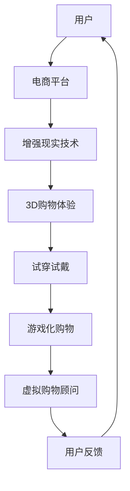

                 

# 《增强现实技术在电商领域的应用：案例分析与展望》

> 关键词：增强现实，电商，应用案例，未来展望，技术挑战

> 摘要：本文旨在探讨增强现实（AR）技术在电商领域的应用现状、潜在优势、案例分析以及未来发展展望。通过对国内外电商平台增强现实应用案例的深入分析，本文揭示了增强现实技术对电商购物体验、产品可视化和用户互动的积极影响，并探讨了其在技术发展、商业模式创新和市场前景方面的挑战与机遇。

## 引言

### 第1章：增强现实技术概述

#### 1.1 增强现实技术的基本概念

增强现实技术（Augmented Reality，简称 AR）是一种将虚拟信息与现实世界相结合的技术。它通过计算机生成信息，将视觉、听觉、触觉等多感官的增强信息叠加到现实环境中，从而增强用户的感知体验。基本概念包括真实世界、虚拟信息和增强信息。

真实世界是指现实环境中的物体、空间和事件。虚拟信息是通过计算机生成的图像、声音、文字等信息。增强信息则是虚拟信息与真实世界的结合体，通过特定的设备展示给用户，如头戴式显示器、智能手机等。

#### 1.2 增强现实技术的发展历程

增强现实技术的起源可以追溯到20世纪50年代，当时波音公司开发出第一个头戴式显示器。20世纪80年代，虚拟现实（Virtual Reality，简称 VR）与增强现实技术逐渐分离，增强现实技术开始独立发展。21世纪初，随着计算机性能的提升和移动设备的普及，增强现实技术开始进入大众视野。2010年代，增强现实技术取得重要突破，多个应用场景开始落地。

#### 1.3 增强现实技术的应用领域

增强现实技术的应用领域广泛，包括游戏娱乐、教育培训、医疗健康、军事模拟以及电商购物等。在电商购物领域，增强现实技术通过提供3D购物体验、试穿试戴功能、游戏化购物和虚拟购物顾问等，提升用户的购物体验和参与度。

### 第2章：增强现实技术在电商领域的潜在优势

#### 2.1 提升购物体验

增强现实技术通过3D购物体验、试穿试戴等功能，让消费者可以在家中尝试不同商品，提前了解商品的真实效果，从而提升购物体验。这种技术让购物变得更加直观和互动，减少了不必要的购物风险。

#### 2.2 增强产品可视化和感知度

增强现实技术可以将产品以三维立体的形式呈现给消费者，提高产品的可视化和感知度。通过AR技术，消费者可以更全面地了解商品的外观、材质和细节，有助于做出更明智的购买决策。

#### 2.3 增强用户互动和参与度

增强现实技术可以通过游戏化购物和虚拟购物顾问等模式，增强用户的互动和参与度。用户可以在虚拟环境中参与互动游戏，提高购物的乐趣和参与感。

#### 2.4 降低营销成本和提高销售转化率

增强现实技术可以降低营销成本，提高销售转化率。通过AR技术，电商平台可以提供独特的购物体验，吸引更多用户关注和购买，从而提高销售额。

## 第二部分：增强现实技术在电商领域的应用案例

### 第3章：国内外增强现实技术在电商领域的应用现状

#### 3.1 国内电商平台的应用案例

国内电商平台在增强现实技术的应用方面走在前列，以下是一些主要应用案例：

- **京东**：京东通过增强现实技术推出了3D购物体验、AR试妆和AR看房等功能。用户可以通过扫描商品二维码，在手机屏幕上看到商品的三维模型，进行旋转、缩放和试穿试戴等操作。
- **淘宝**：淘宝推出了AR试妆、AR试衣和AR看房等功能。用户可以在淘宝App中通过AR标记，尝试不同的化妆品和服装，并在虚拟环境中看到实际效果。
- **天猫**：天猫也提供了AR购物功能，用户可以通过扫描商品二维码，在手机屏幕上看到商品的三维模型，进行试穿试戴等操作。

#### 3.2 国外电商平台的应用案例

国外电商平台在增强现实技术的应用方面也取得了显著成果，以下是一些主要应用案例：

- **Amazon**：Amazon推出了AR购物功能，用户可以通过AR技术，在现实环境中浏览和购买商品。例如，Amazon的AR应用可以让用户将产品叠加在家中的家具上，以查看实际效果。
- **Walmart**：Walmart通过增强现实技术提供了3D购物体验和试穿试戴功能，用户可以在手机屏幕上看到商品的三维模型，并尝试不同的尺寸和款式。
- **IKEA**：IKEA利用增强现实技术帮助消费者在家中进行家居布置模拟。用户可以通过IKEA的App，将家具模型放置在家中，查看家具的布局效果。

#### 3.3 各大平台的应用特点和优劣分析

国内电商平台在增强现实技术的应用方面，主要集中在3D购物体验、试穿试戴和AR看房等功能。这些功能提高了用户的购物体验和参与度，但同时也面临一些挑战，如技术实现的复杂性和用户接受度的提升。国外电商平台在增强现实技术的应用方面，更加注重技术创新和用户体验的提升，例如Amazon的AR购物功能和IKEA的家居布置模拟。这些应用不仅提高了用户的购物体验，还降低了营销成本，提高了销售转化率。

## 第三部分：增强现实技术的应用模式

### 第4章：增强现实技术的应用模式

#### 4.1 3D购物体验

3D购物体验是指通过增强现实技术，让消费者可以在虚拟环境中浏览和购买商品的过程。这一模式利用了三维建模、计算机图形学等技术，将商品以三维立体的形式呈现在用户面前，从而提高购物体验。

##### 4.1.1 技术原理

3D购物体验的技术原理主要包括以下几个方面：

- **三维建模**：通过对商品进行三维扫描或手动建模，生成商品的三维模型。
- **渲染技术**：将三维模型渲染到用户面前，形成逼真的三维视觉效果。
- **交互技术**：用户可以通过触摸屏、手势等与三维模型进行交互，实现旋转、放大、缩小等操作。

##### 4.1.2 伪代码示例

python
def three_d_shopping_experience(item):
    three_d_model = scan_item(item)
    render_model(three_d_model)
    while user_interact():
        adjust_model_state(three_d_model)
    purchase_item(item)

#### 4.2 试穿试戴

试穿试戴是指通过增强现实技术，让消费者可以在虚拟环境中尝试不同尺寸和款式的商品，提前了解商品的真实效果。这一模式利用了图像识别、三维建模等技术，将用户的身体与商品进行匹配，从而提高购物的准确性和满意度。

##### 4.2.1 技术原理

试穿试戴的技术原理主要包括以下几个方面：

- **图像识别**：通过摄像头捕捉用户身体的图像，进行图像识别和定位。
- **三维建模**：根据用户身体的图像，生成三维模型，并将其与商品进行匹配。
- **交互技术**：用户可以通过触摸屏、手势等与三维模型进行交互，实现试穿试戴的操作。

##### 4.2.2 伪代码示例

python
def try_on_and_try_off(item, user_body):
    user_body_model = detect_user_body(user_body)
    match_item_and_user_body(item, user_body_model)
    render_try_on_effect(user_body_model, item)
    while user_interact():
        adjust_try_on_and_try_off_state(user_body_model, item)
    purchase_item(item)

#### 4.3 游戏化购物

游戏化购物是指通过增强现实技术，将购物过程转化为游戏，提高购物乐趣。这一模式利用了游戏设计、虚拟现实等技术，将购物体验与娱乐相结合，从而激发用户的购物兴趣。

##### 4.3.1 技术原理

游戏化购物的技术原理主要包括以下几个方面：

- **游戏设计**：设计有趣的游戏任务和奖励机制，引导用户进行购物。
- **虚拟现实**：通过增强现实技术，将用户带入一个虚拟购物环境，提供真实的购物体验。
- **交互技术**：用户可以通过触摸屏、手势等与虚拟环境进行交互，完成任务并获得奖励。

##### 4.3.2 伪代码示例

python
def gameified_shopping():
    game_tasks = design_game_tasks()
    rewards = design_rewards()
    enter_vr_shopping_environment()
    while game_in_progress():
        complete_game_task(game_tasks)
        receive_reward(rewards)
    finish_shopping()

#### 4.4 虚拟购物顾问

虚拟购物顾问是指通过增强现实技术，为消费者提供个性化的购物建议和服务。这一模式利用了人工智能、自然语言处理等技术，为用户打造一个智能的购物助手。

##### 4.4.1 技术原理

虚拟购物顾问的技术原理主要包括以下几个方面：

- **人工智能**：利用机器学习算法，分析用户的历史购物行为和偏好，为用户提供个性化的购物建议。
- **自然语言处理**：通过语音识别和文本分析，理解用户的购物需求和问题，并提供相应的解答和建议。
- **交互技术**：用户可以通过语音、文本等方式与虚拟购物顾问进行交互，获取购物信息和服务。

##### 4.4.2 伪代码示例

python
def virtual_shopping_advisor(user):
    user_behavior = analyze_user_behavior(user)
    user_preferences = analyze_user_preferences(user)
    shopping_advice = generate_shopping_advice(user_behavior, user_preferences)
    while user_has_questions():
        answer_question(shopping_advice)
    provide_service(shopping_advice)

## 第四部分：增强现实技术在电商领域的应用挑战与展望

### 第5章：增强现实技术在电商领域的应用挑战与展望

#### 5.1 技术挑战

增强现实技术在电商领域的应用面临着多方面的技术挑战：

- **技术成熟度**：尽管增强现实技术在游戏和娱乐领域已经取得了一定的成功，但在电商领域的应用仍处于初级阶段，技术的稳定性、精度和可靠性有待提升。
- **设备兼容性**：增强现实技术对设备性能要求较高，不同设备之间的兼容性是一个挑战。如何确保增强现实技术在各种设备上的兼容性和一致性，是企业需要解决的问题。
- **用户接受度**：用户对增强现实技术的接受度是一个关键问题。尽管增强现实技术具有许多优势，但用户对其认知和使用习惯仍有待提高。如何通过有效的推广和营销策略，提高用户的接受度和使用频率，是企业需要面对的挑战。

#### 5.2 商业模式创新

增强现实技术在电商领域的应用也带来了商业模式创新的机遇：

- **成本效益**：增强现实技术的开发和应用成本较高，企业需要找到有效的商业模式来降低成本，提高效益。例如，通过提供增值服务收取费用，或通过广告和赞助来获取收入。
- **收入模式**：增强现实技术可以为电商企业带来新的收入模式。例如，通过虚拟试穿试戴功能，商家可以收取一定的服务费；通过游戏化购物，商家可以设置虚拟商品进行销售。

#### 5.3 市场前景与趋势

增强现实技术在电商领域的市场前景广阔，以下是几个关键趋势：

- **技术进步**：随着技术的不断进步，增强现实技术在电商领域的应用将更加广泛和深入。硬件设备的升级和软件技术的优化将进一步提高用户体验。
- **消费者需求**：随着消费者对购物体验的要求提高，增强现实技术在电商领域的市场需求将不断增加。特别是在追求个性化和体验化的消费趋势下，增强现实技术将成为电商企业吸引和留住用户的重要手段。
- **企业布局**：随着增强现实技术在电商领域的应用价值逐渐显现，越来越多的电商企业开始布局这一领域。未来，随着市场的竞争加剧，企业需要不断创新和应用，以在激烈的市场竞争中脱颖而出。

## 第五部分：增强现实技术在电商领域的未来发展方向

### 第6章：增强现实技术在电商领域的未来发展方向

#### 6.1 技术发展趋势

增强现实技术在电商领域的未来发展将受到以下技术趋势的驱动：

- **技术融合**：增强现实技术将与人工智能、大数据、物联网等新兴技术进行融合，实现更加智能化和个性化的购物体验。
- **硬件升级**：随着硬件技术的进步，增强现实设备将变得更加轻便、易用，用户体验将得到显著改善。
- **开发平台优化**：开发平台的优化将降低开发门槛，使更多开发者能够轻松创建和应用增强现实内容。

#### 6.2 市场需求变化

增强现实技术在电商领域的市场需求将发生以下变化：

- **消费者需求**：消费者对购物体验的要求将不断提高，增强现实技术将提供更加逼真、互动的购物体验，满足消费者的个性化需求。
- **企业需求**：电商企业将更加关注通过增强现实技术提升营销效果和降低成本，增强竞争力。

#### 6.3 企业战略布局

为了在增强现实技术在电商领域的竞争中脱颖而出，企业需要采取以下战略布局：

- **技术储备**：积极进行技术储备，跟踪增强现实技术的最新发展动态，为未来的应用做好准备。
- **合作伙伴**：与增强现实技术提供商、硬件制造商等建立合作关系，共同推动技术应用和发展。
- **创新应用**：不断创新和应用，将增强现实技术融入到电商业务中，提升用户购物体验和竞争力。

## 第7章：总结与展望

### 7.1 研究总结

本文通过对增强现实技术在电商领域的应用现状、潜在优势、案例分析以及未来发展展望的深入探讨，揭示了增强现实技术对电商购物体验、产品可视化和用户互动的积极影响。同时，也指出了增强现实技术在技术成熟度、用户接受度和商业模式创新等方面面临的挑战。

### 7.2 应用前景展望

随着技术的不断进步和消费者需求的提升，增强现实技术在电商领域的应用前景广阔。未来，增强现实技术将与其他新兴技术相结合，为电商行业带来更多创新和变革。

### 7.3 发展建议

为了在增强现实技术的竞争中脱颖而出，企业需要采取以下发展建议：

- **技术研发**：积极进行技术研发，跟踪增强现实技术的最新发展动态，为未来的应用做好准备。
- **合作与交流**：与增强现实技术提供商、硬件制造商等建立合作关系，共同推动技术应用和发展。
- **创新应用**：不断创新和应用，将增强现实技术融入到电商业务中，提升用户购物体验和竞争力。

## 附录：增强现实技术在电商领域的常用工具与平台

### 附录 A：增强现实技术在电商领域的常用工具

- **ARKit**：苹果公司开发的增强现实开发框架，适用于iOS平台。
- **ARCore**：谷歌开发的增强现实开发框架，适用于Android平台。
- **Vuforia**：Pulse Studio开发的增强现实开发工具，支持多个平台。

### 附录 B：电商平台的增强现实应用平台

- **京东增强现实平台**：京东提供的增强现实应用平台，支持3D购物体验、AR试妆等功能。
- **淘宝增强现实平台**：淘宝提供的增强现实应用平台，支持AR试妆、AR试衣等功能。
- **天猫增强现实平台**：天猫提供的增强现实应用平台，支持AR购物、AR试衣等功能。

### 附录 C：增强现实技术在电商领域的开发者社区与资源链接

- **Unity AR Foundation 社区**：Unity AR Foundation的官方社区，提供教程、示例和讨论。
- **ARKit 开发者社区**：ARKit的官方社区，提供教程、文档和讨论。
- **ARCore 开发者资源**：谷歌提供的ARCore开发者资源，包括文档、教程、示例等。
- **OpenCV 开发者资源**：OpenCV的官方资源，提供教程、示例和文档。

## Mermaid 流程图：增强现实技术在电商领域的应用架构



## 第1章：增强现实技术概述

### 1.1 增强现实技术的基本概念

增强现实（Augmented Reality，简称 AR）是一种将虚拟信息与现实世界相结合的技术。它通过计算机生成的信息，将视觉、听觉、触觉等多感官的增强信息叠加到现实环境中，从而增强用户的感知体验。增强现实技术的基本概念包括以下几个核心要素：

#### 真实世界

真实世界指的是用户所处的实际环境，包括物体、空间、事件等。在这个环境中，用户可以通过感官直接感知周围的世界。

#### 虚拟信息

虚拟信息是由计算机生成的信息，如图像、声音、文字等。这些信息是增强现实技术的重要组成部分，用于与现实世界的交互和叠加。

#### 增强信息

增强信息是虚拟信息和真实世界的结合体，通过特定的设备（如智能手机、头戴式显示器等）展示给用户。增强信息可以增强用户的感知，提供额外的感官体验。

#### 增强现实设备

增强现实设备是用于展示增强信息的设备，如智能手机、平板电脑、头戴式显示器等。这些设备可以捕捉真实世界的图像，并在图像上叠加虚拟信息。

### 1.2 增强现实技术的发展历程

增强现实技术的起源可以追溯到20世纪50年代。当时，波音公司开发出第一个头戴式显示器，用于飞行员培训。这一发明标志着增强现实技术的诞生。以下是增强现实技术发展的几个重要阶段：

#### 20世纪60年代

在20世纪60年代，美国科学家伊凡·苏多夫（Ivan Sutherland）在麻省理工学院开发了世界上第一个头戴式显示器——达摩克利斯之剑（The Sword of Damocles）。这个头戴式显示器使用了一个单镜头摄像头和两个发光二极管来显示虚拟图像。

#### 20世纪90年代

20世纪90年代，随着计算机性能的提升和图形处理技术的进步，增强现实技术开始进入商业应用阶段。1990年，维旺迪（Vivendi）公司推出了第一个增强现实游戏《恐龙危机》（Dino Crisis），使得增强现实技术开始受到广泛关注。

#### 2010年代

在2010年代，随着移动设备的普及和智能手机性能的提升，增强现实技术进入了一个新的发展阶段。2016年，苹果公司发布了增强现实开发框架ARKit，使得开发者可以轻松地在iOS平台上开发增强现实应用。同年，谷歌也发布了ARCore，为Android平台提供了类似的增强现实开发工具。

#### 2020年代

在2020年代，增强现实技术在各个领域取得了显著进展。随着5G技术的推广和人工智能的发展，增强现实技术的应用场景不断拓展，从游戏、教育、医疗到电商、零售等各个领域。

### 1.3 增强现实技术的应用领域

增强现实技术的应用领域非常广泛，涵盖了多个行业和领域。以下是一些主要的应用领域：

#### 游戏娱乐

增强现实技术为游戏娱乐领域带来了全新的体验。通过增强现实游戏，玩家可以在现实环境中与虚拟角色互动，提高游戏的沉浸感和趣味性。例如，《精灵宝可梦GO》（Pokémon GO）是一款全球知名的增强现实游戏，玩家可以在现实世界中捕捉虚拟的精灵。

#### 教育培训

增强现实技术在教育培训领域也具有很大的潜力。通过增强现实技术，学生可以更直观地学习复杂知识，提高学习效果。例如，增强现实教材可以让学生在虚拟环境中观看历史事件的现场直播，或者通过虚拟实验室进行科学实验。

#### 医疗健康

增强现实技术在医疗健康领域有着重要的应用价值。医生可以通过增强现实技术进行手术指导，提高手术的精准度和成功率。此外，增强现实技术还可以用于患者教育和康复训练，帮助患者更好地理解病情和进行康复。

#### 军事模拟

增强现实技术在军事模拟和训练中有着广泛应用。士兵可以通过增强现实设备进行战术训练和模拟战斗，提高战斗技能和反应速度。此外，增强现实技术还可以用于战场情报的收集和分析。

#### 电商购物

增强现实技术在电商购物领域的应用也越来越广泛。通过增强现实技术，消费者可以在家中试穿衣物、试戴饰品，提前了解商品的真实效果，提高购物体验。例如，电商平台可以通过AR技术提供3D购物体验、试穿试戴功能等。

### 1.4 增强现实技术的核心组件

增强现实技术的实现依赖于多个核心组件，以下是其中几个重要的组件：

#### 摄像头

摄像头是增强现实设备的重要组件，用于捕捉真实世界的图像。摄像头捕捉到的图像将被用于识别和定位现实世界中的物体。

#### 显示屏

显示屏用于显示增强信息，通常是一个头戴式显示器或智能手机屏幕。通过显示屏，用户可以看到叠加在真实世界上的虚拟信息。

#### 图像识别和处理

图像识别和处理是增强现实技术的核心组成部分。通过图像识别技术，系统可以识别和定位现实世界中的物体。图像处理技术则用于将虚拟信息叠加到真实世界的图像上，形成增强信息。

#### 传感器

传感器用于收集环境信息，如光线、温度、运动等。这些信息有助于增强现实系统更好地理解和模拟现实世界。

#### 交互界面

交互界面是用户与增强现实系统进行交互的通道。用户可以通过触摸屏、手势、语音等与系统进行交互，控制虚拟信息和操作。

### 1.5 增强现实技术的关键优势

增强现实技术具有多个关键优势，使得其在各个领域都得到了广泛应用：

#### 增强感知

增强现实技术可以通过叠加虚拟信息，增强用户的感知体验。例如，在电商购物领域，用户可以通过AR技术看到商品的真实效果，提高购物体验。

#### 提高互动性

增强现实技术可以让用户与现实世界中的虚拟信息进行互动，提高互动性和参与度。例如，在游戏娱乐领域，玩家可以通过增强现实游戏与现实中的虚拟角色互动，提高游戏的趣味性。

#### 提升教育效果

增强现实技术可以通过更加直观的方式，帮助学生更好地理解复杂知识。例如，在教育培训领域，学生可以通过增强现实教材观看历史事件的现场直播，提高学习效果。

#### 降低成本

增强现实技术可以降低某些领域的成本，例如在医疗健康领域，医生可以通过增强现实技术进行远程手术指导，降低医疗成本。

#### 提高效率

增强现实技术可以提高某些领域的效率，例如在军事模拟和训练中，士兵可以通过增强现实技术进行模拟战斗，提高战斗技能和反应速度。

## 第2章：增强现实技术在电商领域的潜在优势

### 2.1 提升购物体验

增强现实技术在电商领域的应用可以显著提升购物体验。首先，通过3D购物体验，消费者可以在虚拟环境中浏览和购买商品，无需亲自到店。这种方式不仅方便用户，还可以减少购物过程中的时间成本。其次，增强现实技术可以让消费者在家中试穿衣物、试戴饰品，提前了解商品的真实效果，从而减少购买后不满意的几率。例如，电商平台可以提供AR试衣间，用户只需通过摄像头扫描自己的身体，即可试穿多种衣物，选择最合适的款式。此外，增强现实技术还可以提供个性化的购物建议，根据用户的历史购物记录和偏好，推荐合适的商品，提高购物的准确性和满意度。

### 2.2 增强产品可视化和感知度

增强现实技术可以通过三维建模和渲染，将产品以三维立体的形式呈现在消费者面前，从而增强产品的可视化和感知度。传统的电商平台通常只能提供二维的图片或视频，而增强现实技术则可以让消费者更直观地看到产品的外观、材质和细节。例如，家居电商平台可以通过AR技术，让消费者将家具模型放置在家中，查看家具的布局效果和实际尺寸，从而做出更明智的购买决策。此外，增强现实技术还可以通过增强信息，如文字、声音和动画等，提供更多的产品信息，帮助消费者更好地了解产品特点和使用方法。

### 2.3 增强用户互动和参与度

增强现实技术可以增强用户的互动和参与度，从而提高用户粘性和购物转化率。通过游戏化购物、虚拟试穿试戴和虚拟购物顾问等应用模式，用户可以在购物过程中获得更多的乐趣和互动体验。例如，电商平台可以通过增强现实技术，提供游戏化购物体验，让用户在购物过程中参与各种互动游戏，赢取奖励和优惠。此外，虚拟购物顾问可以通过增强现实技术，为用户提供个性化的购物建议和服务，增强用户的购物体验和满意度。通过这些互动和参与方式，电商平台可以吸引更多用户，提高用户粘性，并促进购物转化。

### 2.4 降低营销成本和提高销售转化率

增强现实技术可以帮助电商企业降低营销成本，提高销售转化率。传统的营销手段往往需要大量的广告投入和人力物力成本，而增强现实技术则可以通过提供创新的购物体验，吸引消费者的关注和兴趣。例如，电商平台可以通过增强现实技术，提供3D购物体验和试穿试戴功能，让消费者在购物过程中获得更多的乐趣和满足感，从而提高购买意愿。此外，增强现实技术还可以通过提供个性化的购物建议和服务，提高用户的购物满意度和忠诚度，从而提高销售转化率。通过这些方式，电商企业可以降低营销成本，提高销售收益，实现可持续发展。

### 2.5 提高品牌价值和用户满意度

增强现实技术在电商领域的应用不仅可以提升购物体验和销售转化率，还可以提高品牌价值和用户满意度。通过提供独特的购物体验和优质的客户服务，电商平台可以增强用户对品牌的认知和忠诚度。例如，家居电商平台可以通过增强现实技术，提供家居布置模拟功能，让消费者在家就能够预览家居效果，提高购物的乐趣和满意度。此外，电商平台还可以通过增强现实技术，为用户提供个性化的购物建议和服务，让用户感受到品牌的人性化和关怀，从而提高用户满意度和品牌价值。通过这些方式，电商平台可以提升品牌形象，吸引更多用户，实现长期发展。

### 2.6 支持多渠道融合和无缝购物体验

增强现实技术可以帮助电商企业实现多渠道融合，提供无缝的购物体验。通过将线上和线下的购物渠道相结合，电商平台可以提供更加灵活和便捷的购物方式，满足不同消费者的需求。例如，电商平台可以通过增强现实技术，提供线上线下的无缝购物体验，用户可以在线上浏览和试穿商品，然后到线下门店购买。此外，电商平台还可以通过增强现实技术，提供线上线下的一体化购物体验，用户可以在线上下单，然后在线下门店自提或享受送货上门服务。通过这些方式，电商平台可以提供更加便捷和高效的购物体验，提高用户的满意度和忠诚度。

### 2.7 支持个性化定制和快速响应市场变化

增强现实技术可以帮助电商企业实现个性化定制，快速响应市场变化。通过增强现实技术，电商平台可以收集和分析用户的数据和行为，了解用户的需求和偏好，从而提供个性化的购物建议和服务。例如，电商平台可以通过增强现实技术，提供个性化推荐和定制化服务，根据用户的历史购物记录和偏好，推荐合适的商品，并提供个性化的购物体验。此外，电商平台还可以通过增强现实技术，快速响应市场变化，根据市场的需求和趋势，调整产品策略和营销策略，提高市场竞争力和用户满意度。通过这些方式，电商平台可以更好地满足用户需求，提高市场竞争力，实现可持续发展。

### 2.8 提高供应链效率和降低库存成本

增强现实技术可以帮助电商企业提高供应链效率和降低库存成本。通过增强现实技术，电商平台可以提供更加准确的库存管理和供应链监控，减少库存积压和商品过期的情况。例如，电商平台可以通过增强现实技术，实现商品的实时监控和管理，及时调整库存策略，避免库存过剩或缺货的情况。此外，增强现实技术还可以用于商品的生产和包装过程，提高生产效率和产品质量，从而降低库存成本。通过这些方式，电商平台可以优化供应链管理，提高运营效率，降低成本，实现可持续发展。

### 2.9 支持虚拟现实体验和增强现实融合

增强现实技术可以支持虚拟现实体验和增强现实融合，为消费者提供更加丰富的购物体验。通过增强现实技术，电商平台可以提供虚拟现实购物体验，让消费者可以在虚拟环境中浏览和购买商品。例如，电商平台可以通过增强现实技术，提供虚拟试衣间和虚拟购物环境，让消费者在虚拟环境中试穿衣物和购买商品，提高购物的乐趣和满意度。此外，增强现实技术还可以与虚拟现实技术相结合，实现更加沉浸式的购物体验，让消费者在虚拟世界中体验到真实的购物感受。通过这些方式，电商平台可以提供更加丰富和个性化的购物体验，提高用户的满意度和忠诚度。

## 第3章：国内外增强现实技术在电商领域的应用现状

### 3.1 国内电商平台的应用案例

#### 3.1.1 京东

京东是中国领先的电商平台之一，其在增强现实技术的应用方面具有领先地位。京东通过增强现实技术为用户提供多种购物体验，包括3D购物体验、AR试妆和AR看房等功能。

**3D购物体验**：用户可以通过扫描商品二维码，在手机屏幕上看到商品的三维模型，进行旋转、缩放和试穿试戴等操作。这种3D购物体验让用户可以更直观地了解商品的外观和细节，提高购物满意度。

**AR试妆**：用户可以通过京东App中的AR试妆功能，在手机屏幕上试戴化妆品，查看实际效果。这种功能不仅提高了用户对化妆品的购买信心，也增加了购物的趣味性。

**AR看房**：京东还提供了AR看房功能，用户可以在手机屏幕上查看房屋的三维模型，了解房屋的布局和空间。这种功能特别适合于家具和家居用品的购物，让用户可以在购买前更好地了解产品与家居环境的匹配度。

#### 3.1.2 淘宝

淘宝是中国最大的电商平台，其在增强现实技术的应用方面也取得了显著成果。淘宝推出了AR试妆、AR试衣和AR看房等功能，为用户提供更加丰富的购物体验。

**AR试妆**：用户可以通过淘宝App中的AR试妆功能，在手机屏幕上试戴化妆品，查看实际效果。这种功能帮助用户更好地了解化妆品的颜色和质地，提高购买满意度。

**AR试衣**：用户可以通过淘宝App中的AR试衣功能，在虚拟环境中试穿衣物，查看实际效果。这种功能不仅提高了用户的购物体验，也减少了购买后不满意退货的情况。

**AR看房**：淘宝还提供了AR看房功能，用户可以在手机屏幕上查看房屋的三维模型，了解房屋的布局和空间。这种功能特别适合于家具和家居用品的购物，让用户可以在购买前更好地了解产品与家居环境的匹配度。

#### 3.1.3 天猫

天猫是阿里巴巴旗下的高端电商平台，其在增强现实技术的应用方面也取得了显著进展。天猫通过增强现实技术为用户提供多种购物体验，包括3D购物体验、AR试妆和AR家居体验等。

**3D购物体验**：用户可以通过天猫App中的3D购物体验功能，在手机屏幕上查看商品的三维模型，进行旋转、缩放和试穿试戴等操作。这种3D购物体验让用户可以更直观地了解商品的外观和细节，提高购物满意度。

**AR试妆**：用户可以通过天猫App中的AR试妆功能，在手机屏幕上试戴化妆品，查看实际效果。这种功能不仅提高了用户对化妆品的购买信心，也增加了购物的趣味性。

**AR家居体验**：天猫还提供了AR家居体验功能，用户可以在手机屏幕上查看家具的三维模型，了解家具的布局和空间。这种功能特别适合于家具和家居用品的购物，让用户可以在购买前更好地了解产品与家居环境的匹配度。

### 3.2 国外电商平台的应用案例

#### 3.2.1 Amazon

Amazon是全球最大的电商平台之一，其在增强现实技术的应用方面也取得了显著成果。Amazon推出了AR购物功能，用户可以在现实环境中浏览和购买商品。

**AR购物**：用户可以通过Amazon App中的AR购物功能，在手机屏幕上查看商品的三维模型，并将商品叠加在家具或其他物品上，查看实际效果。这种功能不仅提高了用户的购物体验，也增加了购物的趣味性。

#### 3.2.2 Walmart

Walmart是美国最大的零售商之一，其在增强现实技术的应用方面也取得了显著进展。Walmart通过增强现实技术为用户提供多种购物体验，包括3D购物体验和AR试穿试戴等。

**3D购物体验**：用户可以通过Walmart App中的3D购物体验功能，在手机屏幕上查看商品的三维模型，进行旋转、缩放和试穿试戴等操作。这种3D购物体验让用户可以更直观地了解商品的外观和细节，提高购物满意度。

**AR试穿试戴**：用户可以通过Walmart App中的AR试穿试戴功能，在手机屏幕上试穿衣物和试戴饰品，查看实际效果。这种功能不仅提高了用户对商品的购买信心，也增加了购物的趣味性。

#### 3.2.3 IKEA

IKEA是全球最大的家具零售商之一，其在增强现实技术的应用方面也取得了显著进展。IKEA通过增强现实技术为用户提供多种购物体验，包括AR家居布置模拟和3D购物体验等。

**AR家居布置模拟**：用户可以通过IKEA App中的AR家居布置模拟功能，在家中的真实环境中查看家具的三维模型，了解家具的布局和空间。这种功能特别适合于家居用品的购物，让用户可以在购买前更好地了解产品与家居环境的匹配度。

**3D购物体验**：用户可以通过IKEA App中的3D购物体验功能，在手机屏幕上查看商品的三维模型，进行旋转、缩放和试穿试戴等操作。这种3D购物体验让用户可以更直观地了解商品的外观和细节，提高购物满意度。

### 3.3 各大平台的应用特点和优劣分析

#### 3.3.1 应用特点

- **京东**：京东在增强现实技术的应用方面具有多样化的功能，包括3D购物体验、AR试妆和AR看房等。京东的应用特点在于提供全面的购物体验，满足不同用户的需求。
- **淘宝**：淘宝在增强现实技术的应用方面注重化妆品和服装的试穿试戴，提供个性化的购物体验。淘宝的应用特点在于提供简单易用的AR试妆和试衣功能，提高用户的购物满意度。
- **天猫**：天猫在增强现实技术的应用方面具有高端化的特点，提供3D购物体验和AR家居体验等功能。天猫的应用特点在于提供高端的购物体验，满足高端用户的需求。
- **Amazon**：Amazon在增强现实技术的应用方面注重全球化和用户体验。Amazon的应用特点在于提供全球范围内的AR购物体验，满足不同国家和地区的用户需求。
- **Walmart**：Walmart在增强现实技术的应用方面注重实用性，提供3D购物体验和AR试穿试戴功能。Walmart的应用特点在于提供实用的购物体验，提高用户的购物满意度。
- **IKEA**：IKEA在增强现实技术的应用方面注重家居购物体验。IKEA的应用特点在于提供全面的家居购物体验，满足用户对家居环境的个性化需求。

#### 3.3.2 优劣分析

- **优势**：
  - 提高购物体验：增强现实技术可以让用户更直观地了解商品的外观、材质和细节，提高购物满意度。
  - 提高用户参与度：增强现实技术可以提供互动和参与性的购物体验，增加用户的购物乐趣。
  - 降低营销成本：通过增强现实技术，电商平台可以提供创新的购物体验，减少对传统广告的依赖，降低营销成本。
  - 提高销售转化率：增强现实技术可以提供更准确的商品信息，减少购买后不满意退货的情况，提高销售转化率。

- **劣势**：
  - 技术实现复杂：增强现实技术的实现需要复杂的编程和技术支持，开发成本较高。
  - 用户接受度低：部分用户可能对增强现实技术不熟悉，需要通过教育和推广来提高用户接受度。
  - 设备兼容性问题：增强现实技术对设备性能要求较高，不同设备的兼容性可能成为问题。

### 3.4 我国电商平台增强现实应用的优势与不足

#### 优势

1. **技术成熟度**：我国电商平台在增强现实技术的应用方面已经取得了一定的成熟度，例如京东、淘宝和天猫等平台都推出了多种增强现实应用功能。
2. **用户基数大**：我国电商平台拥有庞大的用户基数，为增强现实技术的应用提供了广阔的市场基础。
3. **创新能力**：我国电商平台在增强现实技术的创新应用方面表现出较高的积极性，不断推出新的功能和服务。

#### 不足

1. **技术实现复杂**：增强现实技术的实现需要复杂的编程和技术支持，开发成本较高，对于一些中小型电商平台来说可能成为负担。
2. **用户接受度**：尽管我国电商平台在增强现实技术的应用方面取得了一定进展，但用户接受度仍需提高，部分用户可能对增强现实技术不熟悉。
3. **设备兼容性问题**：增强现实技术对设备性能要求较高，不同设备的兼容性可能成为问题，需要解决不同设备和操作系统的兼容性问题。

### 3.5 全球电商平台增强现实应用的发展趋势

#### 发展趋势

1. **技术进步**：随着计算机性能的提升和算法的优化，增强现实技术的实现将更加简单和高效，应用范围将不断拓展。
2. **用户体验优化**：电商平台将更加注重用户体验，通过优化增强现实应用功能，提高用户的购物满意度和参与度。
3. **多平台融合**：增强现实技术将在更多平台上得到应用，如智能眼镜、智能手表等，提供更加多样化的购物体验。
4. **全球市场拓展**：随着全球化的发展，增强现实技术的应用将覆盖更多国家和地区，为全球电商市场带来新的机遇。

## 第4章：增强现实技术的应用模式

### 4.1 3D购物体验

#### 4.1.1 基本原理

3D购物体验是指通过增强现实（AR）技术，让消费者在虚拟环境中浏览和购买商品的过程。这一模式利用三维建模、计算机图形学等技术，将商品以三维立体的形式呈现在用户面前，从而提供更加直观和互动的购物体验。

#### 4.1.2 技术原理

- **三维建模**：通过对商品进行三维扫描或手动建模，生成商品的三维模型。这些模型可以精确地反映商品的外观、形状和材质。
- **渲染技术**：将三维模型渲染到用户面前，形成逼真的三维视觉效果。渲染技术包括光线追踪、阴影效果、纹理映射等，以增强视觉效果的真实感。
- **交互技术**：用户可以通过触摸屏、手势等与三维模型进行交互，实现旋转、放大、缩小等操作。交互技术包括手势识别、语音控制等，以提高用户的操作便利性。

#### 4.1.3 伪代码示例

```python
# 伪代码：3D购物体验

def three_d_shopping_experience(item):
    # 生成商品的三维模型
    three_d_model = generate_3d_model(item)
    
    # 渲染三维模型到屏幕上
    render_3d_model(three_d_model)
    
    # 用户与三维模型的交互
    while user_interacts():
        # 根据用户的交互调整模型状态
        update_model_state(three_d_model)
        
        # 用户决定购买商品
        if user_wants_to_buy():
            purchase_item(item)
```

### 4.2 试穿试戴

#### 4.2.1 基本原理

试穿试戴是指通过增强现实技术，让消费者在虚拟环境中尝试不同尺寸和款式的商品，提前了解商品的真实效果。这一模式利用图像识别、三维建模和交互技术，将用户的身体与商品进行匹配，从而提供更加个性化的购物体验。

#### 4.2.2 技术原理

- **图像识别**：通过摄像头捕捉用户的身体图像，进行图像识别和定位。图像识别技术用于识别用户的身体部位和尺寸。
- **三维建模**：根据用户身体图像，生成三维模型，并将其与商品进行匹配。三维建模技术用于创建和调整商品的三维模型，以适应用户的身体特征。
- **交互技术**：用户可以通过触摸屏、手势等与三维模型进行交互，实现试穿试戴的操作。交互技术包括手势识别、语音控制等，以提高用户的操作便利性。

#### 4.2.3 伪代码示例

```python
# 伪代码：试穿试戴

def try_on_and_try_off(item, user_body_model):
    # 生成商品的三维模型
    three_d_model = generate_3d_model(item)
    
    # 根据用户身体模型调整商品模型
    adjust_model_to_user_body(three_d_model, user_body_model)
    
    # 渲染商品模型到屏幕上
    render_model(three_d_model)
    
    # 用户与商品模型的交互
    while user_interacts():
        # 根据用户的交互调整模型状态
        update_model_state(three_d_model)
        
        # 用户决定购买商品
        if user_wants_to_buy():
            purchase_item(item)
```

### 4.3 游戏化购物

#### 4.3.1 基本原理

游戏化购物是指通过增强现实技术，将购物过程转化为游戏，提高购物的趣味性和参与度。这一模式利用游戏设计、虚拟现实和增强现实等技术，为用户提供一种全新的购物体验。

#### 4.3.2 技术原理

- **游戏设计**：设计有趣的游戏任务和奖励机制，引导用户参与购物过程。游戏设计包括任务设定、挑战机制和奖励系统，以提高用户的购物乐趣和参与度。
- **虚拟现实**：通过增强现实技术，将用户带入一个虚拟购物环境。虚拟现实技术用于创建一个沉浸式的购物场景，让用户感受到真实的购物体验。
- **交互技术**：用户可以通过触摸屏、手势等与虚拟环境进行交互。交互技术包括手势识别、语音控制等，以提高用户的操作便利性。

#### 4.3.3 伪代码示例

```python
# 伪代码：游戏化购物

def gameified_shopping():
    # 设计游戏任务和奖励机制
    game_tasks = design_game_tasks()
    rewards = design_rewards()
    
    # 带入虚拟购物环境
    enter_vr_shopping_environment()
    
    # 游戏化购物过程
    while game_in_progress():
        # 完成游戏任务
        complete_game_task(game_tasks)
        
        # 获得奖励
        receive_reward(rewards)
        
    # 用户完成购物
    finish_shopping()
```

### 4.4 虚拟购物顾问

#### 4.4.1 基本原理

虚拟购物顾问是指通过增强现实技术，为消费者提供个性化的购物建议和服务。这一模式利用人工智能、自然语言处理和交互技术，为用户打造一个智能的购物助手。

#### 4.4.2 技术原理

- **人工智能**：利用机器学习算法，分析用户的历史购物行为和偏好，为用户提供个性化的购物建议。人工智能技术包括用户行为分析、推荐系统和智能对话等。
- **自然语言处理**：通过语音识别和文本分析，理解用户的购物需求和问题，并提供相应的解答和建议。自然语言处理技术包括语音识别、文本分析和语义理解等。
- **交互技术**：用户可以通过语音、文本等方式与虚拟购物顾问进行交互，获取购物信息和服务。交互技术包括语音识别、文本输入和语音合成等。

#### 4.4.3 伪代码示例

```python
# 伪代码：虚拟购物顾问

def virtual_shopping_advisor(user):
    # 分析用户购物行为和偏好
    user_behavior = analyze_user_behavior(user)
    user_preferences = analyze_user_preferences(user)
    
    # 提供购物建议
    shopping_advice = generate_shopping_advice(user_behavior, user_preferences)
    
    # 用户与购物顾问的交互
    while user_interacts():
        # 理解用户的问题
        user_question = understand_user_question()
        
        # 提供解答和建议
        answer = provide_answer(shopping_advice, user_question)
        
        # 用户确认购买
        if user_wants_to_buy():
            purchase_item(answer['item'])
```

## 第5章：增强现实技术在电商领域的应用挑战与展望

### 5.1 技术挑战

#### 5.1.1 技术成熟度

尽管增强现实（AR）技术在游戏和娱乐领域已经取得了显著进展，但在电商领域的应用仍然面临技术成熟度的挑战。AR技术的稳定性和可靠性在复杂商业环境中仍需提升。例如，3D建模和渲染的精度、实时性以及跨平台兼容性都是影响用户体验的关键因素。开发人员需要解决这些问题，以确保AR应用在不同设备和操作系统上的稳定运行。

#### 5.1.2 用户接受度

用户对AR技术的接受度也是一个挑战。虽然许多消费者对新技术充满好奇，但并非所有用户都愿意尝试AR购物。部分用户可能对使用AR技术感到不熟悉或不方便，导致应用的使用率不高。电商平台需要通过教育用户、优化用户界面和提供直观的操作体验来提高用户的接受度。

#### 5.1.3 设备兼容性

增强现实技术对设备性能有较高要求，包括处理器速度、内存和摄像头质量等。不同设备的性能差异可能导致AR应用的运行效率不一。此外，AR应用需要在多种设备类型（如智能手机、平板电脑、头戴式显示器等）上具有良好的兼容性，以满足不同用户的需求。开发人员需要针对不同设备进行优化，以提高应用的性能和用户体验。

### 5.2 商业模式创新

#### 5.2.1 成本效益

增强现实技术的开发和应用成本较高，这对电商平台来说是一个重大的挑战。如何确保AR技术能够带来足够的商业价值，成为电商平台需要考虑的问题。电商平台需要通过创新商业模式，如通过AR技术提供增值服务或通过广告和赞助等方式实现盈利，以降低成本压力。

#### 5.2.2 收入模式

增强现实技术为电商平台提供了新的收入模式。例如，通过AR试穿试戴功能，电商平台可以收取一定的服务费。此外，游戏化购物和虚拟购物顾问等创新功能也可以带来新的收入来源。电商平台需要探索这些新的收入模式，以实现商业成功。

#### 5.2.3 营销策略

增强现实技术为电商平台提供了创新的营销手段。例如，通过AR广告，电商平台可以在现实环境中展示产品的三维模型，吸引更多用户的关注。此外，通过虚拟购物顾问提供的个性化建议，电商平台可以增强用户粘性，提高购买转化率。电商平台需要制定有效的营销策略，利用AR技术提升品牌影响力和市场竞争力。

### 5.3 市场前景与趋势

#### 5.3.1 技术发展

随着计算机性能的提升和算法的优化，增强现实技术在电商领域的应用前景十分广阔。未来，随着硬件设备的升级和开发平台的完善，AR技术将变得更加成熟和易用，为电商企业带来更多创新机会。

#### 5.3.2 市场需求

随着消费者对购物体验的要求不断提高，增强现实技术将成为电商企业吸引和留住用户的重要手段。特别是在追求个性化和体验化的消费趋势下，AR技术将为电商平台提供独特的竞争优势。

#### 5.3.3 企业布局

随着增强现实技术在电商领域的应用价值逐渐显现，越来越多的电商企业开始布局这一领域。未来，随着市场的竞争加剧，企业需要不断创新和应用，以在激烈的市场竞争中脱颖而出。

### 5.4 挑战与机遇

#### 5.4.1 技术挑战

尽管AR技术为电商领域带来了巨大的机遇，但技术挑战仍然存在。例如，3D建模和渲染的精度、实时性和兼容性问题仍然需要解决。此外，用户接受度和设备兼容性也是电商平台需要面对的难题。

#### 5.4.2 商业模式创新

电商平台需要通过创新商业模式来降低成本、提高收益。例如，通过提供增值服务或利用广告和赞助等方式实现盈利。同时，电商平台需要探索新的收入模式，以适应AR技术带来的变化。

#### 5.4.3 市场竞争

随着增强现实技术在电商领域的普及，市场竞争将日益激烈。电商平台需要不断创新和应用，以在激烈的市场竞争中脱颖而出。同时，电商平台也需要关注新兴技术的趋势，及时调整战略，以保持竞争优势。

### 5.5 增强现实技术的未来发展方向

#### 5.5.1 技术融合

未来，增强现实技术将与人工智能、大数据、物联网等新兴技术进行深度融合，实现更加智能化和个性化的购物体验。例如，通过人工智能技术，电商平台可以更好地理解用户需求和行为，提供个性化的购物建议。

#### 5.5.2 硬件升级

随着硬件设备的升级，增强现实技术将变得更加轻便和易用。未来的AR设备将具备更高的性能和更好的用户体验，进一步推动AR技术在电商领域的应用。

#### 5.5.3 开发平台优化

为了降低开发门槛，增强现实技术的开发平台将不断优化和改进。未来，开发人员将能够更轻松地创建和应用AR内容，从而推动AR技术在电商领域的普及和应用。

## 第6章：增强现实技术在电商领域的未来发展方向

### 6.1 技术发展趋势

#### 6.1.1 技术融合

随着人工智能、大数据和物联网等技术的不断发展，增强现实（AR）技术将在电商领域实现更深层次的融合。这些技术的结合将带来更加智能化和个性化的购物体验。例如，通过人工智能，电商平台可以更准确地预测用户行为和偏好，提供个性化的商品推荐和购物建议。大数据技术可以帮助电商平台分析用户行为数据，优化营销策略和库存管理。物联网技术可以实现商品与用户、商品与商品之间的实时交互，提升购物体验。

#### 6.1.2 硬件升级

未来，随着硬件技术的进步，增强现实设备将变得更加轻便、易用和高性能。例如，头戴式显示器（HMD）的分辨率和帧率将显著提升，使得用户可以享受更加流畅和逼真的增强现实体验。此外，更先进的传感器和摄像头技术将使得AR设备能够更精确地捕捉和识别用户环境，提高增强现实应用的准确性和交互性。

#### 6.1.3 开发平台优化

开发平台的优化将降低开发门槛，使更多开发者能够轻松创建和应用增强现实内容。未来，AR开发平台将提供更丰富的开发工具和资源，支持跨平台开发和实时协作。例如，ARCore和ARKit等开发框架将继续优化，提供更高效、更易于使用的API，帮助开发者快速实现增强现实应用。

### 6.2 市场需求变化

#### 6.2.1 消费者需求

随着消费者对购物体验的要求不断提高，增强现实技术在电商领域的市场需求将不断增加。尤其是在追求个性化和体验化的消费趋势下，消费者越来越期望能够在购物过程中获得更加直观和互动的体验。例如，通过AR试穿试戴功能，消费者可以在购买前更好地了解商品的真实效果，减少购买后不满意退货的情况。此外，游戏化购物和虚拟购物顾问等创新功能也将成为消费者青睐的购物方式。

#### 6.2.2 企业需求

电商企业将更加关注通过增强现实技术提升营销效果和降低成本。增强现实技术可以为电商企业提供独特的购物体验，吸引更多用户关注和购买，从而提高销售额。同时，增强现实技术还可以帮助企业优化供应链管理，降低库存成本，提高运营效率。例如，通过AR技术，企业可以在产品上架前进行虚拟展示，提前识别和解决问题，减少实际生产和物流环节中的错误和浪费。

#### 6.2.3 政策支持

随着增强现实技术在电商领域的应用价值逐渐显现，未来政府可能会出台相关政策，鼓励和推动增强现实技术在电商领域的应用。例如，提供资金支持、税收优惠等政策措施，以促进增强现实技术的研发和应用。这些政策将有助于解决企业在技术应用过程中面临的一些难题，加速增强现实技术在电商领域的普及和应用。

### 6.3 企业战略布局

#### 6.3.1 技术储备

为了在增强现实技术在电商领域的竞争中保持领先地位，企业需要积极进行技术储备，跟踪增强现实技术的最新发展动态。企业可以通过建立内部研发团队、与外部技术提供商合作等方式，不断积累增强现实技术的知识和经验，为未来的应用做好准备。

#### 6.3.2 合作伙伴

企业可以通过与增强现实技术提供商、硬件制造商等建立合作关系，共同推动技术应用和发展。合作可以涵盖技术研发、产品开发、市场推广等多个方面，以实现资源共享、优势互补。例如，电商平台可以与增强现实技术公司合作，共同开发适用于电商行业的AR应用，以提高用户体验和竞争力。

#### 6.3.3 创新应用

企业需要不断创新和应用，将增强现实技术融入到电商业务中，提升用户购物体验和竞争力。例如，通过AR试穿试戴功能，企业可以为消费者提供更加直观和个性化的购物体验，提高购买转化率。此外，企业还可以通过游戏化购物和虚拟购物顾问等创新功能，吸引更多用户关注和参与，提升品牌形象和市场竞争力。

## 第7章：总结与展望

### 7.1 研究总结

本文通过对增强现实（AR）技术在电商领域的应用现状、潜在优势、案例分析以及未来发展方向的深入探讨，揭示了AR技术对电商购物体验、产品可视化和用户互动的积极影响。研究发现，AR技术不仅可以提升购物体验，增强产品可视化和感知度，还可以提高用户互动和参与度，降低营销成本和提高销售转化率。同时，AR技术还为电商企业提供了创新的商业模式和营销策略。

### 7.2 应用前景展望

随着技术的不断进步和消费者需求的提升，增强现实技术在电商领域的应用前景广阔。未来，AR技术将与其他新兴技术（如人工智能、大数据、物联网等）进行深度融合，为电商行业带来更多创新和变革。特别是在追求个性化和体验化的消费趋势下，AR技术将成为电商企业吸引和留住用户的重要手段。

### 7.3 发展建议

为了在增强现实技术的竞争中保持领先地位，企业可以采取以下发展建议：

- **技术研发**：积极进行技术研发，跟踪增强现实技术的最新发展动态，为未来的应用做好准备。
- **合作与交流**：与增强现实技术提供商、硬件制造商等建立合作关系，共同推动技术应用和发展。
- **创新应用**：不断创新和应用，将增强现实技术融入到电商业务中，提升用户购物体验和竞争力。
- **用户教育**：通过教育和推广，提高用户对增强现实技术的认知和使用习惯，提升用户接受度。

### 7.4 总结与展望

通过本文的研究，我们可以得出以下结论：

- **增强现实技术在电商领域的应用具有显著优势**，包括提升购物体验、增强产品可视化和感知度、提高用户互动和参与度、降低营销成本和提高销售转化率。
- **未来，AR技术在电商领域的应用将更加广泛和深入**，随着技术的不断进步和消费者需求的提升，AR技术将成为电商行业的重要创新手段。
- **企业需要积极布局增强现实技术**，通过技术研发、合作与交流、创新应用等方式，提升用户购物体验和竞争力。

展望未来，增强现实技术将在电商领域发挥更加重要的作用，为消费者带来更加直观、互动和个性化的购物体验。同时，AR技术也将为企业带来新的商业模式和竞争优势，推动电商行业的发展和创新。

## 附录：增强现实技术在电商领域的常用工具与平台

### 附录 A：增强现实技术在电商领域的常用工具

增强现实技术在电商领域的应用需要多种工具的支持，以下是一些常用的工具：

#### A.1 AR开发工具

1. **Unity AR Foundation**：Unity的AR Foundation是一个跨平台的增强现实开发框架，提供了丰富的功能和示例代码，适用于iOS和Android平台。
2. **ARKit**：ARKit是苹果公司开发的一款增强现实开发框架，适用于iOS平台，支持环境识别、实时追踪等功能。
3. **ARCore**：ARCore是谷歌开发的一款增强现实开发框架，适用于Android平台，支持多种设备和场景。

#### A.2 图像处理工具

1. **OpenCV**：OpenCV是一个开源的计算机视觉库，提供了丰富的图像处理功能，如图像识别、目标检测等。
2. **Python Imaging Library (PIL)**：Python Imaging Library是一个强大的图像处理库，适用于Python编程语言，支持图像的读取、编辑、显示等基本功能。

#### A.3 3D建模工具

1. **Blender**：Blender是一个开源的3D建模和渲染软件，适用于建筑、设计和工程领域，提供了丰富的模型库和工具。
2. **SketchUp**：SketchUp是一个易于使用的3D建模软件，适用于建筑、设计和工程领域，提供了丰富的模型库和工具。

### 附录 B：电商平台的增强现实应用平台

以下是一些电商平台提供的增强现实应用平台：

#### B.1 京东增强现实平台

京东提供了丰富的AR功能，包括3D购物体验、AR试妆和AR看房等。用户可以在京东App中通过扫描商品二维码，在手机屏幕上看到商品的三维模型，进行旋转、缩放和试穿试戴等操作。

#### B.2 淘宝增强现实平台

淘宝提供了AR试妆、AR试衣和AR看房等功能。用户可以在淘宝App中通过AR标记，尝试不同的化妆品和服装，并在虚拟环境中看到实际效果。

#### B.3 天猫增强现实平台

天猫提供了AR购物、AR试衣和AR家居体验等功能。用户可以在天猫App中通过扫描商品二维码，在手机屏幕上看到商品的三维模型，进行旋转、缩放和试穿试戴等操作。

### 附录 C：增强现实技术在电商领域的开发者社区与资源链接

以下是一些增强现实技术在电商领域的开发者社区和资源链接：

#### C.1 AR开发者社区

1. **Unity AR Foundation 社区**：Unity AR Foundation的官方社区，提供了教程、示例和讨论。
2. **ARKit 开发者社区**：ARKit的官方社区，提供了教程、文档和讨论。
3. **ARCore 开发者资源**：谷歌提供的ARCore开发者资源，包括文档、教程、示例等。

#### C.2 AR开发资源

1. **ARCore Unity 插件**：谷歌提供的ARCore Unity插件，适用于Android平台的AR应用开发。
2. **OpenCV 开发者资源**：OpenCV的官方资源，提供了丰富的教程、示例和文档。

### 附录 D：增强现实技术在电商领域的应用案例

#### D.1 京东的3D购物体验

京东通过增强现实技术，为用户提供了3D购物体验。用户可以通过京东App扫描商品二维码，在手机屏幕上看到商品的三维模型，进行旋转、缩放和试穿试戴等操作。以下是一个具体的3D购物体验案例：

1. 用户在京东App中搜索并找到一款感兴趣的连衣裙。
2. 用户点击商品详情页中的“AR试穿”按钮，激活3D购物体验功能。
3. 用户通过手机摄像头扫描商品二维码，系统自动生成商品的三维模型。
4. 用户可以在虚拟环境中旋转、缩放和试穿连衣裙，查看不同角度和效果。
5. 用户满意后决定购买，直接在App中完成支付。

#### D.2 淘宝的AR试妆

淘宝通过增强现实技术，为用户提供了AR试妆功能。用户可以在淘宝App中尝试不同的化妆品，并在虚拟环境中看到实际效果。以下是一个具体的AR试妆案例：

1. 用户在淘宝App中搜索并找到一款感兴趣的口红。
2. 用户点击商品详情页中的“AR试妆”按钮，激活AR试妆功能。
3. 用户打开手机摄像头，对准脸部，系统自动识别用户的脸部特征。
4. 用户可以选择不同的口红颜色，并虚拟涂在脸上，查看效果。
5. 用户满意后决定购买，直接在App中完成支付。

#### D.3 天猫的AR家居体验

天猫通过增强现实技术，为用户提供了AR家居体验功能。用户可以在手机屏幕上查看家具的三维模型，了解家具的布局和空间效果。以下是一个具体的AR家居体验案例：

1. 用户在天猫App中搜索并找到一款心仪的沙发。
2. 用户点击商品详情页中的“AR家居体验”按钮，激活AR家居体验功能。
3. 用户打开手机摄像头，对准家居环境，系统自动识别用户的房间布局。
4. 用户可以将沙发模型放置在虚拟房间中，查看与家居环境的匹配度。
5. 用户满意后决定购买，直接在App中完成支付。

这些案例展示了增强现实技术在电商领域的一些实际应用，通过提供直观、互动和个性化的购物体验，提升了用户的购物满意度和购买转化率。

## Mermaid 流程图：增强现实技术在电商领域的应用架构


## 第1章：增强现实技术概述

### 1.1 增强现实技术的基本概念

增强现实（Augmented Reality，简称 AR）是一种通过计算机生成信息，将虚拟信息叠加到现实环境中的技术。它利用摄像头和显示屏等设备，将现实世界和虚拟世界相结合，为用户带来更加丰富和互动的体验。基本概念包括以下几个核心要素：

#### 真实世界

真实世界是指用户所处的实际环境，包括物体、空间、事件等。在这个环境中，用户可以通过感官直接感知周围的世界。

#### 虚拟信息

虚拟信息是由计算机生成的信息，如图像、声音、文字等。这些信息可以增强用户的感知，提供额外的感官体验。

#### 增强信息

增强信息是虚拟信息和现实世界的结合体，通过特定的设备（如智能手机、头戴式显示器等）展示给用户。增强信息可以增强用户的感知，提供额外的感官体验。

#### 增强现实设备

增强现实设备是用于展示增强信息的设备，如智能手机、平板电脑、头戴式显示器等。这些设备可以捕捉真实世界的图像，并在图像上叠加虚拟信息。

### 1.2 增强现实技术的发展历程

增强现实技术的起源可以追溯到20世纪50年代。当时，波音公司开发出第一个头戴式显示器，用于飞行员培训。这一发明标志着增强现实技术的诞生。以下是增强现实技术发展的几个重要阶段：

#### 20世纪60年代

在20世纪60年代，美国科学家伊凡·苏多夫（Ivan Sutherland）在麻省理工学院开发了世界上第一个头戴式显示器——达摩克利斯之剑（The Sword of Damocles）。这个头戴式显示器使用了一个单镜头摄像头和两个发光二极管来显示虚拟图像。

#### 20世纪90年代

20世纪90年代，随着计算机性能的提升和图形处理技术的进步，增强现实技术开始进入商业应用阶段。1990年，维旺迪（Vivendi）公司推出了第一个增强现实游戏《恐龙危机》（Dino Crisis），使得增强现实技术开始受到广泛关注。

#### 2010年代

在2010年代，随着移动设备的普及和智能手机性能的提升，增强现实技术进入了一个新的发展阶段。2016年，苹果公司发布了增强现实开发框架ARKit，使得开发者可以轻松地在iOS平台上开发增强现实应用。同年，谷歌也发布了ARCore，为Android平台提供了类似的增强现实开发工具。

#### 2020年代

在2020年代，增强现实技术在各个领域取得了显著进展。随着5G技术的推广和人工智能的发展，增强现实技术的应用场景不断拓展，从游戏、教育、医疗到电商、零售等各个领域。

### 1.3 增强现实技术的应用领域

增强现实技术的应用领域非常广泛，涵盖了多个行业和领域。以下是一些主要的应用领域：

#### 游戏娱乐

增强现实技术为游戏娱乐领域带来了全新的体验。通过增强现实游戏，玩家可以在现实环境中与虚拟角色互动，提高游戏的沉浸感和趣味性。例如，《精灵宝可梦GO》（Pokémon GO）是一款全球知名的增强现实游戏，玩家可以在现实世界中捕捉虚拟的精灵。

#### 教育培训

增强现实技术在教育培训领域也具有很大的潜力。通过增强现实技术，学生可以更直观地学习复杂知识，提高学习效果。例如，增强现实教材可以让学生在虚拟环境中观看历史事件的现场直播，或者通过虚拟实验室进行科学实验。

#### 医疗健康

增强现实技术在医疗健康领域有着重要的应用价值。医生可以通过增强现实技术进行手术指导，提高手术的精准度和成功率。此外，增强现实技术还可以用于患者教育和康复训练，帮助患者更好地理解病情和进行康复。

#### 军事模拟

增强现实技术在军事模拟和训练中有着广泛应用。士兵可以通过增强现实设备进行战术训练和模拟战斗，提高战斗技能和反应速度。此外，增强现实技术还可以用于战场情报的收集和分析。

#### 电商购物

增强现实技术在电商购物领域的应用也越来越广泛。通过增强现实技术，消费者可以在家中试穿衣物、试戴饰品，提前了解商品的真实效果，提高购物体验。例如，电商平台可以通过AR技术提供3D购物体验、试穿试戴功能等。

### 1.4 增强现实技术的核心组件

增强现实技术的实现依赖于多个核心组件，以下是其中几个重要的组件：

#### 摄像头

摄像头是增强现实设备的重要组件，用于捕捉真实世界的图像。摄像头捕捉到的图像将被用于识别和定位现实世界中的物体。

#### 显示屏

显示屏用于显示增强信息，通常是一个头戴式显示器或智能手机屏幕。通过显示屏，用户可以看到叠加在真实世界上的虚拟信息。

#### 图像识别和处理

图像识别和处理是增强现实技术的核心组成部分。通过图像识别技术，系统可以识别和定位现实世界中的物体。图像处理技术则用于将虚拟信息叠加到真实世界的图像上，形成增强信息。

#### 传感器

传感器用于收集环境信息，如光线、温度、运动等。这些信息有助于增强现实系统更好地理解和模拟现实世界。

#### 交互界面

交互界面是用户与增强现实系统进行交互的通道。用户可以通过触摸屏、手势、语音等与系统进行交互，控制虚拟信息和操作。

### 1.5 增强现实技术的关键优势

增强现实技术具有多个关键优势，使得其在各个领域都得到了广泛应用：

#### 增强感知

增强现实技术可以通过叠加虚拟信息，增强用户的感知体验。例如，在电商购物领域，用户可以通过AR技术看到商品的真实效果，提高购物体验。

#### 提高互动性

增强现实技术可以让用户与现实世界中的虚拟信息进行互动，提高互动性和参与度。例如，在游戏娱乐领域，玩家可以通过增强现实游戏与现实中的虚拟角色互动，提高游戏的趣味性。

#### 提升教育效果

增强现实技术可以通过更加直观的方式，帮助学生更好地理解复杂知识。例如，在教育培训领域，学生可以通过增强现实教材观看历史事件的现场直播，提高学习效果。

#### 降低成本

增强现实技术可以降低某些领域的成本，例如在医疗健康领域，医生可以通过增强现实技术进行远程手术指导，降低医疗成本。

#### 提高效率

增强现实技术可以提高某些领域的效率，例如在军事模拟和训练中，士兵可以通过增强现实技术进行模拟战斗，提高战斗技能和反应速度。

## 第2章：增强现实技术在电商领域的潜在优势

### 2.1 提升购物体验

增强现实（AR）技术在电商领域的应用可以显著提升购物体验。传统的电商购物方式通常局限于平面图片和视频，用户只能通过有限的视觉信息来判断商品的外观和质感。而AR技术则可以通过三维建模和虚拟现实技术，为用户带来更加直观和沉浸式的购物体验。

#### 2.1.1 三维购物体验

用户可以通过AR技术，在手机或电脑屏幕上看到商品的三维模型，并进行旋转、缩放等操作。这种三维购物体验可以让用户更全面地了解商品的外观和细节，从而减少购买后的不满意情况。例如，用户可以在家中通过AR技术试穿衣物，查看不同角度和细节，从而选择最适合自己的款式。

#### 2.1.2 试穿试戴功能

AR技术还可以提供试穿试戴功能，让用户在家中尝试不同的衣物、饰品等。通过摄像头捕捉用户的身体轮廓，系统可以生成一个虚拟的试穿模型，用户可以实时查看试穿效果。这种功能不仅节省了用户的购物时间，还可以降低退货率，提高购物满意度。

#### 2.1.3 互动性增强

AR技术可以提高购物的互动性，让用户在购物过程中获得更多的乐趣。例如，用户可以在AR环境中与其他虚拟角色互动，参与购物任务或游戏，从而提高购物的趣味性和参与度。

### 2.2 增强产品可视化和感知度

增强现实技术可以通过三维建模和虚拟信息叠加，增强产品的可视化和感知度。传统的二维图片和视频无法完全展示产品的三维结构和细节，而AR技术则可以通过三维建模和虚拟信息叠加，让用户更全面地了解产品的外观、材质和细节。

#### 2.2.1 三维模型展示

用户可以通过AR技术查看商品的三维模型，从不同角度和细节了解产品的外观。这种三维模型展示不仅提高了产品的可视化程度，还可以帮助用户更好地判断商品的质量和适用性。

#### 2.2.2 虚拟信息叠加

AR技术可以将虚拟信息（如文字、图像、视频等）叠加到商品上，为用户提供更多的产品信息。例如，用户可以查看商品的使用说明、产品规格、用户评价等，从而做出更明智的购买决策。

#### 2.2.3 增强感知体验

通过AR技术，用户可以感知到商品的真实效果，从而提高购买信心。例如，用户可以通过AR技术看到家具在房间中的摆放效果，或者尝试不同颜色的家居饰品，从而选择最适合自己的产品。

### 2.3 增强用户互动和参与度

增强现实技术可以通过互动性和参与性，提高用户的购物体验和参与度。传统的电商购物方式通常缺乏互动性，而AR技术则可以为用户提供更多的互动机会，从而增强用户的参与感和购物乐趣。

#### 2.3.1 游戏化购物

通过AR技术，电商平台可以推出游戏化购物模式，让用户在购物过程中参与各种互动游戏，如抽奖、打怪等。这种游戏化购物不仅可以提高用户的参与度，还可以增加购物的趣味性。

#### 2.3.2 虚拟购物顾问

AR技术可以提供虚拟购物顾问服务，通过人工智能和自然语言处理技术，为用户提供个性化的购物建议和服务。用户可以与虚拟购物顾问进行互动，获取关于商品的信息和建议，从而做出更明智的购买决策。

#### 2.3.3 社交互动

AR技术还可以促进用户之间的社交互动，例如，用户可以在社交平台上分享自己的AR购物体验，或者邀请朋友一起参与购物活动。这种社交互动不仅可以提高用户的购物乐趣，还可以增加用户的参与度。

### 2.4 降低营销成本和提高销售转化率

增强现实技术可以帮助电商平台降低营销成本，提高销售转化率。传统的营销方式（如广告、促销活动等）通常成本较高，而AR技术则可以通过提供独特的购物体验，降低对传统广告的依赖。

#### 2.4.1 创新的购物体验

通过AR技术，电商平台可以提供创新的购物体验，吸引更多用户的关注。这种创新的购物体验不仅可以提高用户的参与度，还可以提高用户的购买意愿，从而提高销售转化率。

#### 2.4.2 减少退货率

通过AR技术，用户可以在购买前更全面地了解商品的外观和效果，从而减少购买后的不满意退货情况。这种减少退货率不仅可以降低运营成本，还可以提高销售转化率。

#### 2.4.3 提高用户忠诚度

通过提供独特的购物体验和优质的客户服务，电商平台可以增强用户对品牌的认知和忠诚度。这种提高用户忠诚度不仅可以提高重复购买率，还可以增加用户的推荐意愿，从而提高销售转化率。

### 2.5 提高品牌价值和用户满意度

增强现实技术的应用不仅可以提高购物体验和销售转化率，还可以提高品牌价值和用户满意度。通过提供独特的购物体验和优质的客户服务，电商平台可以增强用户对品牌的认知和忠诚度。

#### 2.5.1 品牌价值提升

通过AR技术，电商平台可以打造独特的品牌形象，提高品牌价值。例如，通过提供个性化的购物体验和创新的购物方式，电商平台可以吸引更多用户的关注，从而提高品牌知名度和美誉度。

#### 2.5.2 用户满意度提高

通过提供个性化的购物体验和优质的客户服务，电商平台可以增强用户对品牌的满意度和忠诚度。这种提高用户满意度不仅可以增加用户的重复购买率，还可以提高用户的推荐意愿，从而提高销售转化率。

### 2.6 支持多渠道融合和无缝购物体验

增强现实技术可以帮助电商平台实现多渠道融合，提供无缝的购物体验。通过将线上和线下的购物渠道相结合，电商平台可以提供更加灵活和便捷的购物方式，满足不同消费者的需求。

#### 2.6.1 线上线下一体化

通过AR技术，电商平台可以实现线上线下一体化的购物体验。例如，用户可以在线上浏览商品，并通过AR技术在线下门店试穿试戴，从而实现无缝的购物体验。

#### 2.6.2 多渠道融合

通过AR技术，电商平台可以支持多渠道的融合，如线上商城、线下门店、社交媒体等。这种多渠道融合可以提供更加多样化的购物体验，满足不同用户的需求。

### 2.7 支持个性化定制和快速响应市场变化

增强现实技术可以帮助电商平台实现个性化定制和快速响应市场变化。通过收集和分析用户数据，电商平台可以提供个性化的购物体验和推荐，从而提高用户的满意度和忠诚度。

#### 2.7.1 个性化定制

通过AR技术，电商平台可以为用户提供个性化的购物体验和定制服务。例如，用户可以根据自己的需求和偏好，选择不同的商品款式和颜色，从而实现个性化定制。

#### 2.7.2 快速响应市场变化

通过AR技术，电商平台可以快速响应市场变化，调整产品策略和营销策略。例如，根据用户行为数据，电商平台可以实时调整商品推荐和促销活动，提高销售转化率。

### 2.8 提高供应链效率和降低库存成本

增强现实技术可以帮助电商平台提高供应链效率和降低库存成本。通过AR技术，电商平台可以实现商品的实时监控和管理，减少库存积压和商品过期的情况。

#### 2.8.1 实时监控

通过AR技术，电商平台可以实时监控商品的库存情况，及时发现和处理库存积压和商品过期的问题。

#### 2.8.2 降低库存成本

通过AR技术，电商平台可以优化库存管理，减少库存积压和商品过期的情况，从而降低库存成本。

### 2.9 支持虚拟现实体验和增强现实融合

增强现实技术可以帮助电商平台实现虚拟现实体验和增强现实融合，为用户提供更加丰富的购物体验。

#### 2.9.1 虚拟现实体验

通过AR技术，电商平台可以提供虚拟现实购物体验，让用户在虚拟环境中浏览和购买商品。

#### 2.9.2 增强现实融合

通过AR技术，电商平台可以实现线上线下的融合，提供更加无缝的购物体验。

## 第3章：国内外增强现实技术在电商领域的应用现状

### 3.1 国内电商平台的应用案例

#### 3.1.1 京东

京东是中国领先的电商平台之一，其在增强现实（AR）技术的应用方面处于领先地位。京东通过AR技术为消费者提供了多种购物体验，如3D购物体验、AR试妆和AR看房等。

**3D购物体验**：用户可以在京东App中扫描商品二维码，通过AR技术查看商品的三维模型，进行旋转、缩放和试穿试戴等操作。这种3D购物体验让用户可以更直观地了解商品的外观和材质，从而提高购买决策的准确性。

**AR试妆**：用户可以在京东App中尝试不同的化妆品，通过AR技术看到化妆后的效果。这种功能帮助用户更好地了解化妆品的颜色和质地，减少购买后的不满意退货情况。

**AR看房**：京东还提供了AR看房功能，用户可以通过扫描房源二维码，在手机屏幕上查看房屋的三维模型，了解房屋的布局和空间。这种功能特别适用于家居和家具的购物，用户可以在购买前更好地了解产品与家居环境的匹配度。

#### 3.1.2 淘宝

淘宝是中国最大的电商平台，其在增强现实技术的应用方面也取得了显著进展。淘宝推出了AR试妆、AR试衣和AR看房等功能，为消费者提供了更加丰富的购物体验。

**AR试妆**：用户可以在淘宝App中尝试不同的化妆品，通过AR技术看到化妆后的效果。这种功能不仅帮助用户更好地了解化妆品，还可以提高购买的满意度。

**AR试衣**：用户可以在淘宝App中尝试不同的衣物，通过AR技术看到试穿的效果。这种功能让用户可以在购买前更直观地了解衣物的大小和样式，从而减少购买后的不满意退货情况。

**AR看房**：淘宝提供了AR看房功能，用户可以通过扫描房源二维码，在手机屏幕上查看房屋的三维模型，了解房屋的布局和空间。这种功能特别适用于家居和家具的购物，用户可以在购买前更好地了解产品与家居环境的匹配度。

#### 3.1.3 天猫

天猫是阿里巴巴旗下的高端电商平台，其在增强现实技术的应用方面也取得了显著进展。天猫通过AR技术为消费者提供了多种购物体验，包括3D购物体验、AR试妆和AR家居体验等。

**3D购物体验**：用户可以在天猫App中扫描商品二维码，通过AR技术查看商品的三维模型，进行旋转、缩放和试穿试戴等操作。这种3D购物体验让用户可以更直观地了解商品的外观和材质，从而提高购买决策的准确性。

**AR试妆**：用户可以在天猫App中尝试不同的化妆品，通过AR技术看到化妆后的效果。这种功能帮助用户更好地了解化妆品的颜色和质地，减少购买后的不满意退货情况。

**AR家居体验**：天猫提供了AR家居体验功能，用户可以在手机屏幕上查看家具的三维模型，了解家具的布局和空间。这种功能特别适用于家居和家具的购物，用户可以在购买前更好地了解产品与家居环境的匹配度。

### 3.2 国外电商平台的应用案例

#### 3.2.1 Amazon

Amazon是全球最大的电商平台之一，其在增强现实技术的应用方面也取得了显著成果。Amazon推出了AR购物功能，用户可以在现实环境中浏览和购买商品。

**AR购物**：用户可以通过Amazon App中的AR购物功能，在手机屏幕上查看商品的三维模型，并将商品叠加在家具或其他物品上，查看实际效果。这种功能不仅提高了用户的购物体验，还可以帮助用户更好地了解商品与家居环境的匹配度。

#### 3.2.2 Walmart

Walmart是美国最大的零售商之一，其在增强现实技术的应用方面也取得了显著进展。Walmart通过增强现实技术为消费者提供了多种购物体验，包括3D购物体验和AR试穿试戴等。

**3D购物体验**：用户可以通过Walmart App中的3D购物体验功能，在手机屏幕上查看商品的三维模型，进行旋转、缩放和试穿试戴等操作。这种3D购物体验让用户可以更直观地了解商品的外观和细节，从而提高购物满意度。

**AR试穿试戴**：用户可以通过Walmart App中的AR试穿试戴功能，在手机屏幕上试穿衣物和试戴饰品，查看实际效果。这种功能不仅提高了用户对商品的购买信心，还可以减少购买后的不满意退货情况。

#### 3.2.3 IKEA

IKEA是全球最大的家具零售商之一，其在增强现实技术的应用方面也取得了显著进展。IKEA通过增强现实技术为消费者提供了多种购物体验，包括AR家居布置模拟和3D购物体验等。

**AR家居布置模拟**：用户可以通过IKEA App中的AR家居布置模拟功能，在家中的真实环境中查看家具的三维模型，了解家具的布局和空间。这种功能特别适合于家具和家居用品的购物，用户可以在购买前更好地了解产品与家居环境的匹配度。

**3D购物体验**：用户可以通过IKEA App中的3D购物体验功能，在手机屏幕上查看商品的三维模型，进行旋转、缩放和试穿试戴等操作。这种3D购物体验让用户可以更直观地了解商品的外观和细节，从而提高购物满意度。

### 3.3 各大平台的应用特点和优劣分析

#### 3.3.1 应用特点

- **京东**：京东的AR技术应用主要集中于3D购物体验、AR试妆和AR看房等领域，提供了多样化的购物体验，特别是在3D购物体验方面具有较强竞争力。
- **淘宝**：淘宝的AR技术应用主要集中于AR试妆、AR试衣和AR看房等领域，提供了个性化的购物体验，特别是在化妆品和服装的试穿试戴方面具有较强优势。
- **天猫**：天猫的AR技术应用主要集中于3D购物体验、AR试妆和AR家居体验等领域，提供了高端的购物体验，特别是在家具和家居用品的购物方面具有较强优势。
- **Amazon**：Amazon的AR技术应用主要集中于AR购物，提供了全球范围内的购物体验，特别是在跨境购物方面具有较强竞争力。
- **Walmart**：Walmart的AR技术应用主要集中于3D购物体验和AR试穿试戴等领域，提供了实用的购物体验，特别是在衣物和饰品方面具有较强优势。
- **IKEA**：IKEA的AR技术应用主要集中于AR家居布置模拟和3D购物体验等领域，提供了全面的购物体验，特别是在家具和家居用品方面具有较强优势。

#### 3.3.2 优劣分析

- **优势**：
  - 提高购物体验：AR技术为用户提供了更加直观和沉浸式的购物体验，提高了购物满意度。
  - 提高用户参与度：AR技术通过互动和参与性功能，增强了用户的购物乐趣和参与度。
  - 降低营销成本：AR技术可以降低传统广告和促销活动的成本，提高营销效率。
  - 提高销售转化率：AR技术通过提供真实的购物体验和个性化的推荐，提高了销售转化率。

- **劣势**：
  - 技术实现复杂：AR技术的实现需要复杂的编程和技术支持，开发成本较高。
  - 用户接受度低：部分用户可能对AR技术不熟悉，需要通过教育和推广来提高用户接受度。
  - 设备兼容性问题：AR技术对设备性能要求较高，不同设备的兼容性可能成为问题。

### 3.4 我国电商平台增强现实应用的优势与不足

#### 优势

1. **技术成熟度**：我国电商平台在AR技术应用方面已经取得了显著进展，特别是在3D购物体验、AR试妆和AR看房等方面，技术水平逐渐成熟。
2. **用户基数大**：我国电商平台拥有庞大的用户基数，为AR技术的应用提供了广阔的市场基础。
3. **创新能力**：我国电商平台在AR技术应用方面表现出较高的创新能力，不断推出新的功能和服务。

#### 不足

1. **技术实现复杂**：AR技术的实现需要复杂的编程和技术支持，对于一些中小型电商平台来说可能成为负担。
2. **用户接受度**：尽管我国电商平台在AR技术应用方面取得了一定进展，但用户接受度仍需提高，部分用户可能对AR技术不熟悉。
3. **设备兼容性问题**：AR技术对设备性能要求较高，不同设备的兼容性可能成为问题，需要解决不同设备和操作系统的兼容性问题。

### 3.5 全球电商平台增强现实应用的发展趋势

#### 发展趋势

1. **技术进步**：随着计算机性能的提升和算法的优化，AR技术将在电商领域得到更广泛的应用，技术实现将变得更加简单和高效。
2. **用户体验优化**：电商平台将更加注重用户体验，通过优化AR应用功能，提高用户的购物满意度和参与度。
3. **多平台融合**：AR技术将在更多平台上得到应用，如智能眼镜、智能手表等，提供更加多样化的购物体验。
4. **全球化应用**：随着全球化的发展，AR技术将在全球范围内的电商平台得到广泛应用，为全球电商市场带来新的机遇。

## 第4章：增强现实技术的应用模式

### 4.1 3D购物体验

#### 4.1.1 基本原理

3D购物体验是指通过增强现实（AR）技术，让消费者在虚拟环境中浏览和购买商品的过程。这一模式利用了三维建模、计算机图形学等技术，将商品以三维立体的形式呈现在用户面前，从而提供更加直观和互动的购物体验。

#### 4.1.2 技术原理

3D购物体验的技术原理主要包括以下几个方面：

- **三维建模**：通过对商品进行三维扫描或手动建模，生成商品的三维模型。三维模型可以精确地反映商品的外观、形状和材质。
- **渲染技术**：将三维模型渲染到用户面前，形成逼真的三维视觉效果。渲染技术包括光线追踪、阴影效果、纹理映射等，以增强视觉效果的真实感。
- **交互技术**：用户可以通过触摸屏、手势等与三维模型进行交互，实现旋转、放大、缩小等操作。交互技术包括手势识别、语音控制等，以提高用户的操作便利性。

#### 4.1.3 伪代码示例

以下是一个简单的伪代码示例，展示了3D购物体验的基本流程：

```python
# 伪代码：3D购物体验

# 生成商品的三维模型
def generate_3d_model(item):
    # 执行三维建模操作
    # ...
    return three_d_model

# 渲染三维模型到屏幕上
def render_3d_model(three_d_model):
    # 执行渲染操作
    # ...
    display_model()

# 用户与三维模型的交互
def user_interaction():
    # 执行用户交互操作
    # ...
    update_model()

# 购买商品
def purchase_item(item):
    # 执行购买操作
    # ...
    confirm_purchase()

# 主程序
def main():
    # 加载商品
    item = load_item()

    # 生成三维模型
    three_d_model = generate_3d_model(item)

    # 渲染模型
    render_3d_model(three_d_model)

    # 开始用户交互
    while user_interaction():
        # 更新模型状态
        update_model()

    # 购买商品
    purchase_item(item)
```

#### 4.1.4 实际应用案例

在实际应用中，3D购物体验可以通过以下方式实现：

- **手机App**：用户通过手机App扫描商品二维码，进入3D购物体验页面。App使用ARKit或ARCore等技术，生成商品的三维模型，并在屏幕上展示。
- **网页**：用户在电商平台网页上浏览商品时，可以通过点击按钮激活3D购物体验功能。网页使用WebAR技术，如AR.js或A-Frame，生成商品的三维模型。
- **实体店**：用户在实体店内通过扫描货架上的二维码，使用店内提供的AR设备（如智能眼镜、平板电脑等），体验商品的三维模型。

### 4.2 试穿试戴

#### 4.2.1 基本原理

试穿试戴是指通过增强现实（AR）技术，让消费者在虚拟环境中尝试不同尺寸和款式的商品，提前了解商品的真实效果。这一模式利用了图像识别、三维建模和交互技术，将用户的身体与商品进行匹配，从而提供更加个性化的购物体验。

#### 4.2.2 技术原理

试穿试戴的技术原理主要包括以下几个方面：

- **图像识别**：通过摄像头捕捉用户的身体图像，进行图像识别和定位。图像识别技术用于识别用户的身体部位和尺寸。
- **三维建模**：根据用户身体图像，生成三维模型，并将其与商品进行匹配。三维建模技术用于创建和调整商品的三维模型，以适应用户的身体特征。
- **交互技术**：用户可以通过触摸屏、手势等与三维模型进行交互，实现试穿试戴的操作。交互技术包括手势识别、语音控制等，以提高用户的操作便利性。

#### 4.2.3 伪代码示例

以下是一个简单的伪代码示例，展示了试穿试戴的基本流程：

```python
# 伪代码：试穿试戴

# 识别用户身体图像
def detect_user_body():
    # 执行图像识别操作
    # ...
    return user_body_image

# 生成用户的三维模型
def generate_user_3d_model(user_body_image):
    # 执行三维建模操作
    # ...
    return user_3d_model

# 生成商品的三维模型
def generate_item_3d_model(item):
    # 执行三维建模操作
    # ...
    return item_3d_model

# 将商品模型与用户模型匹配
def match_item_and_user_model(item_3d_model, user_3d_model):
    # 执行匹配操作
    # ...
    return matched_model

# 渲染试穿试戴效果
def render_try_on_effect(matched_model):
    # 执行渲染操作
    # ...
    display_model()

# 用户与试穿试戴模型的交互
def user_interaction():
    # 执行用户交互操作
    # ...
    update_model()

# 购买商品
def purchase_item(item):
    # 执行购买操作
    # ...
    confirm_purchase()

# 主程序
def main():
    # 加载商品
    item = load_item()

    # 识别用户身体图像
    user_body_image = detect_user_body()

    # 生成用户三维模型
    user_3d_model = generate_user_3d_model(user_body_image)

    # 生成商品三维模型
    item_3d_model = generate_item_3d_model(item)

    # 匹配商品与用户模型
    matched_model = match_item_and_user_model(item_3d_model, user_3d_model)

    # 渲染试穿试戴效果
    render_try_on_effect(matched_model)

    # 开始用户交互
    while user_interaction():
        # 更新模型状态
        update_model()

    # 购买商品
    purchase_item(item)
```

#### 4.2.4 实际应用案例

在实际应用中，试穿试戴可以通过以下方式实现：

- **手机App**：用户通过手机App扫描商品二维码，进入试穿试戴页面。App使用ARKit或ARCore等技术，捕捉用户的身体图像，生成三维模型，并在屏幕上展示试穿试戴效果。
- **实体店**：用户在实体店内通过扫描货架上的二维码，使用店内提供的AR设备（如智能眼镜、平板电脑等），体验商品的试穿试戴效果。
- **在线试穿**：用户在电商平台网页上浏览商品时，可以通过点击按钮激活试穿试戴功能。网页使用WebAR技术，如AR.js或A-Frame，生成试穿试戴效果。

### 4.3 游戏化购物

#### 4.3.1 基本原理

游戏化购物是指通过增强现实（AR）技术，将购物过程转化为游戏，提高购物的趣味性和参与度。这一模式利用游戏设计、虚拟现实和增强现实等技术，为用户提供一种全新的购物体验。

#### 4.3.2 技术原理

游戏化购物的技术原理主要包括以下几个方面：

- **游戏设计**：设计有趣的游戏任务和奖励机制，引导用户参与购物过程。游戏设计包括任务设定、挑战机制和奖励系统，以提高用户的购物乐趣和参与度。
- **虚拟现实**：通过增强现实技术

