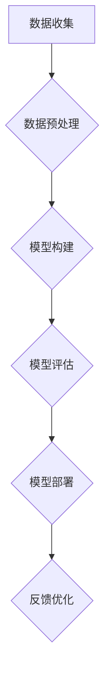

                 

### 文章标题：多元模型思维：提升管理者认知水平

### 关键词：多元模型思维、管理者、认知水平、战略规划、决策分析、团队管理

### 摘要：
本文旨在探讨多元模型思维在提升管理者认知水平方面的应用。通过分析多元模型思维的核心概念、基本框架、构建方法以及在实际管理中的应用，本文为管理者提供了一种系统性的思维方式和方法论，以应对复杂多变的管理环境。文章结合实际案例，详细解读了多元模型思维在战略规划、决策分析和团队管理中的应用，并展望了多元模型思维的未来发展趋势。通过本文的探讨，期望能够为管理者的认知提升和实际管理工作提供有益的参考。

### 目录

#### 第一部分：多元模型思维概述

1. **多元模型思维的概念与重要性**
   - 多元模型思维的定义
   - 多元模型思维的应用领域
   - 多元模型思维的优势与挑战
2. **多元模型思维的核心特征**
   - 交叉学科知识的融合
   - 创新的思维方式
   - 多角度分析问题的能力

#### 第二部分：多元模型的基本框架

3. **多元模型的基本框架**
   - 多元模型的基本结构
   - 多元模型的组成部分及其关联
   - 多元模型的应用场景
4. **多元模型的分类与应用**
   - 经典多元模型介绍
   - 新兴多元模型介绍
   - 不同类型多元模型的应用场景

#### 第三部分：多元模型的构建方法

5. **多元模型的构建原则**
   - 数据驱动的思维方式
   - 模型的组合与整合
   - 持续改进与优化
6. **多元模型的构建流程**
   - 数据收集与预处理
   - 模型选择与训练
   - 模型评估与优化
   - 模型部署与应用
7. **多元模型的构建工具与技术**
   - 常用构建工具与平台的介绍
   - 技术选型与实现方法

#### 第四部分：多元模型在实际管理中的应用

8. **多元模型在战略规划中的应用**
   - 多元模型在战略规划中的角色
   - 多元模型在战略分析中的应用
   - 多元模型在战略决策中的应用
9. **多元模型在决策分析中的应用**
   - 多元模型在决策分析中的作用
   - 多元模型在风险评估中的应用
   - 多元模型在机会识别中的应用
10. **多元模型在团队管理中的应用**
    - 多元模型在团队绩效评估中的应用
    - 多元模型在团队协作中的应用
    - 多元模型在团队建设中的应用

#### 第五部分：多元模型思维案例研究

11. **多元模型思维案例分析**
    - 案例背景介绍
    - 多元模型的应用与构建
    - 案例效果分析
    - 多元模型思维的经验总结

#### 第六部分：多元模型思维的未来发展趋势

12. **新兴多元模型的发展**
    - 深度学习模型的发展
    - 强化学习模型的发展
    - 跨学科多元模型的发展
13. **多元模型思维在新领域的应用**
    - 教育领域的应用
    - 医疗健康领域的应用
    - 金融科技领域的应用
14. **多元模型思维的未来挑战与机遇**
    - 数据隐私与安全的挑战
    - 模型解释性的挑战
    - 跨学科融合的挑战与机遇

#### 第七部分：多元模型思维的实践与反思

15. **多元模型思维的个人实践**
    - 实践方法与技巧
    - 实践中的挑战与解决方案
    - 实践心得与体会
16. **多元模型思维在组织文化中的影响**
    - 多元模型思维与组织文化的关系
    - 多元模型思维在组织文化中的推广与应用
    - 多元模型思维在组织文化中的挑战与机遇
17. **多元模型思维的长期价值**
    - 多元模型思维的可持续发展
    - 多元模型思维在提升管理者认知水平方面的作用
    - 多元模型思维的未来发展趋势

#### 第八部分：多元模型思维的应用方法与技巧

18. **多元模型思维在战略规划中的应用**
    - 市场趋势预测的方法与技巧
    - 竞争对手分析的方法与技巧
19. **多元模型思维在决策分析中的应用**
    - 风险评估的方法与技巧
    - 机会识别的方法与技巧
20. **多元模型思维在团队管理中的应用**
    - 团队绩效评估的方法与技巧
    - 团队协作的方法与技巧

#### 第九部分：附录

21. **多元模型思维工具与资源**
    - 常用多元模型工具与平台的介绍
    - 学习资源与推荐
22. **参考文献**
    - 相关书籍、论文、报告等参考资料列表

---

### 文章标题：多元模型思维：提升管理者认知水平

#### 关键词：
- 多元模型思维
- 管理者
- 认知水平
- 战略规划
- 决策分析
- 团队管理

#### 摘要：
本文旨在探讨多元模型思维在提升管理者认知水平方面的应用。多元模型思维是一种融合多种学科知识和分析方法，以应对复杂管理问题的思维方式。文章首先介绍了多元模型思维的核心概念和重要性，随后详细阐述了多元模型的基本框架、构建方法以及在战略规划、决策分析和团队管理中的应用。通过实际案例研究，本文展示了多元模型思维在提升管理者认知水平、优化管理决策和团队协作方面的显著效果。文章最后展望了多元模型思维的未来发展趋势，为管理者提供了实践与反思的启示。

---

### 第一部分：多元模型思维概述

#### 1. 多元模型思维的概念与重要性

多元模型思维是一种融合多种学科知识和分析方法的思维方式，它强调通过跨学科的知识融合，从多个角度分析和解决问题。这种思维方式在管理领域具有重要意义，因为它能够帮助管理者在面对复杂、多变的管理环境时做出更加科学、准确的决策。

**多元模型思维的定义：**

多元模型思维是指管理者在处理复杂问题时，结合不同学科的知识和方法，构建多个模型，从不同维度对问题进行分析和解决的一种思维方式。这些模型可以是定量的，如统计学模型、经济学模型等，也可以是定性的，如决策树、情景分析等。

**多元模型思维的应用领域：**

多元模型思维广泛应用于管理领域的各个方面，包括战略规划、决策分析、风险管理、团队管理、市场营销等。以下是一些具体的应用场景：

- **战略规划**：通过多元模型思维，管理者可以更好地分析市场趋势、竞争对手、内部资源等，制定更为科学的战略规划。
- **决策分析**：在面对不确定性时，多元模型思维可以帮助管理者从多个角度评估风险和机会，做出更明智的决策。
- **风险管理**：通过多元模型思维，管理者可以识别潜在的风险，评估风险的影响和发生的可能性，制定相应的风险管理策略。
- **团队管理**：多元模型思维可以帮助管理者分析团队绩效、团队成员的能力和协作情况，优化团队结构和管理方式。

**多元模型思维的优势与挑战：**

**优势：**

- **提高决策效率**：通过多元模型思维，管理者可以从多个角度分析问题，减少信息偏差，提高决策的准确性和效率。
- **增强创新能力**：多元模型思维鼓励管理者融合不同学科的知识和方法，激发创新的思维，推动组织创新。
- **提高问题解决能力**：多元模型思维可以帮助管理者从不同维度分析问题，找到问题的本质，提高问题解决能力。

**挑战：**

- **知识融合难度**：多元模型思维需要管理者具备跨学科的知识背景，这对许多管理者来说是一个挑战。
- **跨学科沟通**：在多元模型思维的应用过程中，管理者需要与不同领域的专家进行沟通和合作，这需要良好的沟通能力和团队协作能力。
- **数据质量要求高**：多元模型思维依赖于高质量的数据，数据的质量和完整性对模型的效果有重要影响。

#### 2. 多元模型思维的核心特征

**交叉学科知识的融合：**

多元模型思维的核心特征之一是交叉学科知识的融合。管理者需要具备不同学科的知识，如经济学、心理学、统计学等，以便从多个角度分析问题。这种知识融合使得管理者能够构建更为全面、深入的模型，提高决策的科学性和准确性。

**创新的思维方式：**

多元模型思维鼓励管理者采用创新的思维方式。在面对复杂问题时，管理者不仅需要依赖传统的分析方法，还需要尝试新的思路和方法。这种创新的思维方式有助于发现新的解决方案，推动组织的创新和发展。

**多角度分析问题的能力：**

多元模型思维强调从多个角度分析问题。管理者需要综合考虑各种因素，如内部资源、外部环境、竞争对手等，从不同维度对问题进行深入剖析。这种多角度分析问题的能力有助于管理者更全面地了解问题，找到最佳的解决方案。

#### 3. 多元模型思维的重要性

多元模型思维在管理实践中具有重要意义，主要体现在以下几个方面：

- **提升管理者的认知水平**：通过多元模型思维，管理者能够更好地理解复杂问题的本质，提高认知水平。
- **优化管理决策**：多元模型思维可以帮助管理者从多个角度评估问题和解决方案，做出更明智的决策。
- **增强团队协作**：多元模型思维鼓励管理者与团队成员进行跨学科的沟通和合作，提高团队协作效率。
- **推动组织创新**：多元模型思维激发管理者的创新思维，推动组织的创新和发展。
- **提高组织竞争力**：通过多元模型思维，管理者能够更好地应对市场变化和竞争压力，提高组织的竞争力。

总之，多元模型思维是一种重要的管理思维方式，它能够帮助管理者在面对复杂多变的管理环境时做出更加科学、准确的决策。通过培养多元模型思维，管理者可以提升自身的认知水平，优化管理决策，增强团队协作，推动组织创新，提高组织竞争力。在未来的管理实践中，多元模型思维将成为管理者不可或缺的工具和思维方法。

### 第二部分：多元模型的基本框架

#### 3. 多元模型的基本框架

多元模型思维的核心在于构建多个模型，从不同维度对问题进行分析和解决。为了更好地理解多元模型的基本框架，我们可以使用Mermaid流程图来展示其基本结构。以下是一个简单的Mermaid流程图示例：

**1. 数据收集：**

数据收集是多元模型构建的基础。管理者需要从各种数据源收集数据，包括内部数据（如财务报表、销售数据等）和外部数据（如市场趋势、竞争对手信息等）。数据收集的过程中要注意数据的质量和完整性，确保数据能够真实、准确地反映问题的实际情况。

**2. 数据预处理：**

数据预处理是对收集到的数据进行清洗、转换和归一化等处理，以提高数据的质量和一致性。数据预处理的过程包括以下几个方面：

- **数据清洗**：处理缺失值、异常值和重复值，确保数据的一致性和完整性。
- **数据转换**：将不同类型的数据转换为统一的格式，如将文本数据转换为数值数据。
- **数据归一化**：对数据进行归一化处理，使其具有相似的尺度和范围，以便于后续的分析。

**3. 模型构建：**

模型构建是多元模型思维的核心环节。管理者需要根据问题的特点和需求，选择合适的模型类型，并设计模型的结构。常见的模型类型包括线性模型、非线性模型、时间序列模型、分类模型、回归模型等。在构建模型时，需要考虑以下几个方面：

- **模型选择**：根据问题的特点和需求，选择适合的模型类型。例如，对于时间序列数据，可以选择ARIMA模型；对于分类问题，可以选择决策树、随机森林等模型。
- **模型设计**：设计模型的参数和结构，确保模型能够准确地捕捉问题的特征和规律。例如，在构建线性回归模型时，需要确定自变量和因变量的关系，以及模型的参数。

**4. 模型评估：**

模型评估是对构建好的模型进行评估和优化，以确定其预测性能和应用效果。常见的评估指标包括准确率、召回率、F1值、均方误差等。模型评估的过程包括以下几个方面：

- **交叉验证**：通过交叉验证方法评估模型的预测性能，以避免过拟合和欠拟合问题。
- **指标评估**：根据评估指标评估模型的性能，选择性能较好的模型。
- **模型优化**：根据评估结果对模型进行优化，调整模型的参数和结构，以提高模型的性能。

**5. 模型部署：**

模型部署是将训练好的模型应用到实际场景中，进行实时预测或决策。模型部署的过程包括以下几个方面：

- **模型部署**：将模型部署到生产环境，使其能够实时处理数据和生成预测结果。
- **模型应用**：将模型应用到实际场景中，解决实际问题，如预测市场趋势、评估风险、优化决策等。

**6. 反馈优化：**

反馈优化是对模型应用效果的持续监控和改进。管理者需要根据模型的预测结果和实际反馈，对模型进行调整和优化，以提高模型的预测准确性和应用效果。反馈优化的过程包括以下几个方面：

- **效果监控**：对模型的预测结果进行监控，及时发现和纠正模型的问题。
- **反馈调整**：根据实际反馈调整模型的参数和结构，以提高模型的性能。
- **持续改进**：通过持续改进和优化，不断提高模型的预测准确性和应用效果。

通过上述Mermaid流程图和详细解释，我们可以更好地理解多元模型的基本框架和各个部分之间的关联。在实际应用中，管理者可以根据问题的特点和需求，灵活调整和优化多元模型，以提高模型的预测性能和应用效果。

#### 3. 多元模型的组成部分及其关联

多元模型思维的核心在于构建多个模型，从不同维度对问题进行分析和解决。为了更好地理解多元模型的基本框架，我们需要深入了解其组成部分及其关联。

**数据收集：**

数据收集是多元模型构建的基础。数据的质量和完整性直接影响到模型的效果。因此，管理者需要从各种数据源收集数据，包括内部数据（如财务报表、销售数据等）和外部数据（如市场趋势、竞争对手信息等）。数据收集的过程需要遵循以下原则：

- **全面性**：确保收集到的数据能够全面反映问题的各个方面。
- **准确性**：确保数据的准确性和一致性，避免因数据质量问题导致模型失效。
- **及时性**：尽可能获取最新的数据，以便对问题进行及时分析和决策。

**数据预处理：**

数据预处理是对收集到的数据进行清洗、转换和归一化等处理，以提高数据的质量和一致性。数据预处理的过程包括以下几个方面：

- **数据清洗**：处理缺失值、异常值和重复值，确保数据的一致性和完整性。
- **数据转换**：将不同类型的数据转换为统一的格式，如将文本数据转换为数值数据。
- **数据归一化**：对数据进行归一化处理，使其具有相似的尺度和范围，以便于后续的分析。

**模型构建：**

模型构建是多元模型思维的核心环节。管理者需要根据问题的特点和需求，选择合适的模型类型，并设计模型的结构。常见的模型类型包括线性模型、非线性模型、时间序列模型、分类模型、回归模型等。在构建模型时，需要考虑以下几个方面：

- **模型选择**：根据问题的特点和需求，选择适合的模型类型。例如，对于时间序列数据，可以选择ARIMA模型；对于分类问题，可以选择决策树、随机森林等模型。
- **模型设计**：设计模型的参数和结构，确保模型能够准确地捕捉问题的特征和规律。例如，在构建线性回归模型时，需要确定自变量和因变量的关系，以及模型的参数。

**模型评估：**

模型评估是对构建好的模型进行评估和优化，以确定其预测性能和应用效果。常见的评估指标包括准确率、召回率、F1值、均方误差等。模型评估的过程包括以下几个方面：

- **交叉验证**：通过交叉验证方法评估模型的预测性能，以避免过拟合和欠拟合问题。
- **指标评估**：根据评估指标评估模型的性能，选择性能较好的模型。
- **模型优化**：根据评估结果对模型进行优化，调整模型的参数和结构，以提高模型的性能。

**模型部署：**

模型部署是将训练好的模型应用到实际场景中，进行实时预测或决策。模型部署的过程包括以下几个方面：

- **模型部署**：将模型部署到生产环境，使其能够实时处理数据和生成预测结果。
- **模型应用**：将模型应用到实际场景中，解决实际问题，如预测市场趋势、评估风险、优化决策等。

**反馈优化：**

反馈优化是对模型应用效果的持续监控和改进。管理者需要根据模型的预测结果和实际反馈，对模型进行调整和优化，以提高模型的预测准确性和应用效果。反馈优化的过程包括以下几个方面：

- **效果监控**：对模型的预测结果进行监控，及时发现和纠正模型的问题。
- **反馈调整**：根据实际反馈调整模型的参数和结构，以提高模型的性能。
- **持续改进**：通过持续改进和优化，不断提高模型的预测准确性和应用效果。

**多元模型组成部分之间的关联：**

多元模型的各个组成部分之间存在紧密的关联。数据收集是模型构建的基础，数据预处理是为了提高数据质量，模型构建是为了捕捉问题的特征和规律，模型评估是为了确定模型的性能，模型部署是为了解决实际问题，反馈优化是为了持续改进模型。

- **数据收集与模型构建**：数据收集的质量直接影响到模型构建的效果。高质量的数据有助于构建更准确、更可靠的模型。
- **模型构建与模型评估**：模型构建的目的是为了评估和预测问题，因此模型评估是模型构建的重要环节，通过评估可以确定模型的性能和适用性。
- **模型评估与模型部署**：模型评估的结果决定了模型是否可以被部署应用到实际场景中。只有经过评估并证明有效的模型才能被应用到生产环境中。
- **模型部署与反馈优化**：模型部署到实际场景中后，需要通过反馈优化来监控和改进模型。实际应用中的反馈可以用来调整模型的参数和结构，以提高模型的预测准确性和应用效果。

通过深入了解多元模型的组成部分及其关联，管理者可以更好地理解多元模型思维的核心内容，并在实际应用中灵活运用，提高管理决策的科学性和准确性。

#### 3. 多元模型的应用场景

多元模型思维在管理实践中具有广泛的应用场景，其核心在于通过构建多个模型，从不同维度对问题进行分析和解决。以下是一些常见的多元模型应用场景：

**战略规划**

战略规划是企业管理中的一项关键任务，多元模型思维可以帮助管理者更好地制定和执行战略。具体应用场景包括：

- **市场趋势预测**：通过多元模型分析市场数据，预测未来的市场趋势，帮助管理者制定长期战略。例如，可以使用时间序列模型分析历史市场数据，结合回归分析和机器学习算法预测未来趋势。
- **竞争对手分析**：通过多元模型分析竞争对手的市场行为、策略和绩效，了解竞争对手的弱点和优势，制定相应的竞争策略。例如，可以使用聚类分析识别主要竞争对手，结合决策树和回归分析评估竞争对手的市场表现。
- **内部资源评估**：通过多元模型分析企业的内部资源，如财务状况、人力资源、技术能力等，评估企业的核心竞争力，为战略规划提供数据支持。例如，可以使用回归分析和数据可视化工具评估内部资源的利用情况，识别瓶颈和优化方向。

**决策分析**

在企业管理过程中，决策分析是优化决策过程的重要手段。多元模型思维可以帮助管理者更全面地评估决策方案，提高决策的科学性和准确性。具体应用场景包括：

- **风险评估**：通过多元模型分析项目或业务中的潜在风险，评估风险的概率和影响，帮助管理者制定相应的风险应对策略。例如，可以使用贝叶斯网络分析风险因素之间的关联，结合决策树评估风险的影响和概率。
- **机会识别**：通过多元模型分析市场数据，识别潜在的商业机会，帮助管理者抓住市场机遇。例如，可以使用关联规则分析市场数据，发现不同产品或服务之间的关联，结合机器学习算法预测未来的市场趋势。
- **预算分配**：通过多元模型分析各部门的绩效和需求，优化预算分配，提高资源利用效率。例如，可以使用回归分析评估各部门的绩效，结合决策树和聚类分析优化预算分配方案。

**团队管理**

团队管理是企业管理的重要组成部分，多元模型思维可以帮助管理者更好地构建和优化团队，提高团队绩效。具体应用场景包括：

- **团队绩效评估**：通过多元模型分析团队的工作表现和成果，评估团队的整体绩效，帮助管理者识别团队成员的优势和不足。例如，可以使用回归分析和数据可视化工具评估团队绩效，结合关键绩效指标（KPI）评估团队成员的工作表现。
- **团队协作分析**：通过多元模型分析团队成员的协作情况，识别协作中的瓶颈和改进方向，提高团队协作效率。例如，可以使用网络分析和聚类分析评估团队成员之间的协作关系，结合社会网络分析工具优化团队协作模式。
- **团队能力分析**：通过多元模型分析团队成员的能力和技能，评估团队的整体能力，为团队建设和培训提供数据支持。例如，可以使用回归分析和数据可视化工具评估团队成员的能力水平，结合职业发展模型优化团队能力结构。

**市场营销**

市场营销是企业获取客户、增加销售额的重要手段，多元模型思维可以帮助管理者更精准地进行市场营销策略的制定和执行。具体应用场景包括：

- **目标客户识别**：通过多元模型分析潜在客户的数据，识别目标客户群体，提高营销活动的精准度。例如，可以使用聚类分析识别不同的客户群体，结合回归分析预测客户的购买行为。
- **广告投放优化**：通过多元模型分析广告投放的效果，优化广告预算分配，提高广告投放的ROI。例如，可以使用机器学习算法分析广告投放数据，结合A/B测试优化广告策略。
- **市场细分**：通过多元模型分析市场数据，细分市场，制定针对性的市场营销策略。例如，可以使用聚类分析对市场进行细分，结合回归分析预测不同细分市场的需求。

总之，多元模型思维在战略规划、决策分析、团队管理和市场营销等管理实践中具有广泛的应用场景。通过构建多个模型，从不同维度对问题进行分析和解决，管理者可以更全面、深入地了解问题，制定更科学的决策和策略，提高管理效率和绩效。

#### 3. 多元模型的分类与应用

多元模型思维在管理实践中具有广泛的应用，而不同的模型类型适用于不同的场景和问题。以下是对经典多元模型和新兴多元模型的分类及其应用的介绍：

**经典多元模型**

1. **线性回归模型**：
   - **应用场景**：适用于预测和分析变量之间的线性关系。例如，用于预测销售量、股票价格等。
   - **数学公式**：
     $$
     Y = \beta_0 + \beta_1X_1 + \beta_2X_2 + ... + \beta_nX_n + \epsilon
     $$
   - **优点**：简单易用，解释性强。
   - **缺点**：对于非线性关系和复杂问题的建模效果较差。

2. **逻辑回归模型**：
   - **应用场景**：适用于分类问题，如判断客户是否购买、信用评分等。
   - **数学公式**：
     $$
     P(Y=1) = \frac{1}{1 + e^{-(\beta_0 + \beta_1X_1 + \beta_2X_2 + ... + \beta_nX_n})}
     $$
   - **优点**：能够处理多类别分类问题，易于解释。
   - **缺点**：对于稀疏数据和异常值敏感。

3. **决策树模型**：
   - **应用场景**：适用于分类和回归问题，如客户流失预测、信用风险评估等。
   - **数学公式**：决策树通过一系列条件判断来划分数据，没有固定的数学公式。
   - **优点**：直观易懂，易于解释。
   - **缺点**：容易过拟合，对于大规模数据的处理能力有限。

4. **支持向量机（SVM）**：
   - **应用场景**：适用于分类和回归问题，如图像识别、文本分类等。
   - **数学公式**：
     $$
     w \cdot x - b = 0
     $$
     其中，$w$ 是权重向量，$x$ 是特征向量，$b$ 是偏置。
   - **优点**：强大的分类能力，适用于高维空间。
   - **缺点**：计算复杂度较高，对于大量特征的数据处理效率较低。

**新兴多元模型**

1. **深度学习模型**：
   - **应用场景**：适用于处理复杂数据和复杂任务，如图像识别、自然语言处理、推荐系统等。
   - **数学公式**：深度学习模型通常基于多层神经网络，包括激活函数、反向传播算法等。
   - **优点**：强大的特征提取和模式识别能力，能够处理大规模数据和高维特征。
   - **缺点**：模型复杂度高，计算资源需求大，需要大量数据训练。

2. **强化学习模型**：
   - **应用场景**：适用于决策问题，如自动控制、游戏玩法、推荐系统等。
   - **数学公式**：强化学习模型通过策略迭代和值函数估计进行学习，包括Q学习、SARSA等。
   - **优点**：能够处理动态环境和长期决策问题，适用于复杂场景。
   - **缺点**：需要大量数据和计算资源，训练时间较长。

3. **集成模型**：
   - **应用场景**：适用于提高模型预测准确性和泛化能力，如XGBoost、随机森林等。
   - **数学公式**：集成模型通过结合多个基础模型，如决策树、线性回归等，提高预测性能。
   - **优点**：能够处理不同类型的数据和任务，提高模型稳定性和预测准确性。
   - **缺点**：模型复杂度较高，需要较多的计算资源。

通过了解这些经典多元模型和新兴多元模型的特点和应用，管理者可以根据实际问题和数据特点选择合适的模型，进行有效的分析和决策。多元模型思维的应用不仅能够提高管理决策的科学性和准确性，还能够推动组织的创新和发展。

### 第三部分：多元模型的构建方法

#### 5. 多元模型的构建原则

构建多元模型是一个系统性的过程，需要遵循一系列的原则，以确保模型的有效性和可靠性。以下是多元模型构建的几个关键原则：

**数据驱动的思维方式**

数据驱动的思维方式是构建多元模型的核心原则之一。在构建模型时，管理者必须依赖数据来指导模型的设计和参数调整。以下是数据驱动思维方式的几个关键点：

- **数据质量**：数据是模型的基础，数据的质量直接影响模型的预测性能。因此，在构建模型之前，必须对数据进行严格的清洗和预处理，包括处理缺失值、异常值和重复值。
- **数据量**：大量的数据有助于提高模型的泛化能力和预测准确性。管理者应该尽可能收集更多的数据，以便为模型提供充足的信息。
- **数据多样性**：数据多样性有助于模型捕捉问题的多个维度。管理者应该收集来自不同数据源的数据，包括内部数据和外部数据，以构建更加全面和准确的模型。

**模型的组合与整合**

模型的组合与整合是多元模型构建的重要原则之一。通过将多个模型组合起来，可以弥补单个模型的局限性，提高模型的预测性能和应用效果。以下是模型组合与整合的几个关键点：

- **模型选择**：根据问题的特点和需求，选择适合的模型类型。不同的模型适用于不同类型的问题，如线性回归、决策树、神经网络等。
- **模型融合**：通过将多个模型的结果进行融合，可以降低模型的预测误差，提高模型的可靠性。常见的模型融合方法包括集成学习、贝叶斯模型、混合模型等。
- **参数调整**：在模型组合与整合过程中，需要对模型参数进行优化和调整，以提高模型的预测性能。可以通过交叉验证、网格搜索等方法进行参数调整。

**持续改进与优化**

多元模型构建不是一次性的过程，而是一个持续改进和优化的过程。以下是持续改进与优化的几个关键点：

- **反馈机制**：在模型部署后，需要建立反馈机制，收集实际应用中的反馈数据，对模型进行评估和改进。通过持续收集反馈，可以及时发现模型的问题和不足，进行相应的调整。
- **数据更新**：随着时间的推移，数据会发生变化，管理者需要定期更新数据，以保持模型的有效性和准确性。
- **模型迭代**：通过不断的模型迭代和优化，可以提高模型的预测性能和应用效果。可以通过机器学习算法的改进、模型参数的调整、数据预处理方法的优化等方式进行模型迭代。

**通用构建原则**

除了上述具体原则，以下是一些通用的构建原则，有助于提高多元模型的构建效果：

- **简单性**：尽量选择简单易懂的模型，避免过度复杂化。复杂的模型不仅难以理解，而且可能增加过拟合的风险。
- **可解释性**：模型的可解释性对于管理者和决策者来说非常重要。尽量选择可解释性强的模型，以便更好地理解和信任模型的预测结果。
- **鲁棒性**：模型应具有较强的鲁棒性，能够应对数据变化和噪声干扰。通过引入正则化项、使用稳健的估计方法等方式，可以提高模型的鲁棒性。

通过遵循这些构建原则，管理者可以构建出有效的多元模型，提高管理决策的科学性和准确性。同时，这些原则也为模型的持续改进和优化提供了指导，有助于管理者不断提升模型的效果和应用价值。

#### 5. 多元模型的构建流程

构建多元模型是一个系统性的过程，需要经过多个阶段，包括数据收集、模型选择、模型训练、模型评估和模型部署等。以下是一个详细的多元模型构建流程：

**1. 数据收集：**

数据收集是多元模型构建的基础。在这一阶段，管理者需要从各种数据源收集相关的数据，包括内部数据（如财务报表、销售数据、客户数据等）和外部数据（如市场趋势、竞争对手信息、宏观经济数据等）。数据收集的过程中要注意以下几点：

- **数据来源的多样性**：尽可能从多个数据源收集数据，以确保数据的全面性和准确性。
- **数据质量**：确保数据的质量，包括数据的完整性、一致性、准确性和时效性。
- **数据预处理**：对收集到的数据进行预处理，包括处理缺失值、异常值和重复值，以及进行数据清洗和转换。

**2. 数据预处理：**

数据预处理是确保数据质量的重要步骤。在这一阶段，管理者需要对数据进行以下处理：

- **数据清洗**：处理缺失值、异常值和重复值，确保数据的一致性和完整性。
- **数据转换**：将不同类型的数据转换为统一的格式，如将文本数据转换为数值数据。
- **数据归一化**：对数据进行归一化处理，使其具有相似的尺度和范围，以便于后续的分析。

**3. 模型选择：**

模型选择是构建多元模型的关键步骤。在这一阶段，管理者需要根据问题的特点和需求，选择适合的模型类型。以下是一些常见的模型类型及其适用场景：

- **线性模型**：适用于变量之间存在线性关系的场景，如线性回归、逻辑回归等。
- **非线性模型**：适用于变量之间存在非线性关系的场景，如多项式回归、神经网络等。
- **时间序列模型**：适用于分析时间序列数据的场景，如ARIMA、LSTM等。
- **分类模型**：适用于分类问题的场景，如决策树、随机森林、支持向量机等。
- **集成模型**：适用于提高模型预测准确性和稳定性的场景，如随机森林、XGBoost等。

**4. 模型训练：**

模型训练是将数据输入到模型中，通过调整模型参数，使其能够准确预测目标变量。在这一阶段，管理者需要进行以下步骤：

- **数据分割**：将数据集分为训练集和测试集，通常使用70%-80%的数据作为训练集，剩余的数据作为测试集。
- **模型训练**：使用训练集数据训练模型，通过调整模型参数，使其达到最优状态。常用的训练方法包括梯度下降、随机梯度下降、批量梯度下降等。
- **模型验证**：使用验证集数据验证模型的性能，调整模型参数，以提高模型的预测准确性和稳定性。

**5. 模型评估：**

模型评估是确定模型是否能够有效预测目标变量的过程。在这一阶段，管理者需要使用以下方法评估模型：

- **交叉验证**：使用交叉验证方法评估模型的泛化能力，避免过拟合和欠拟合问题。
- **评估指标**：根据问题的类型选择合适的评估指标，如准确率、召回率、F1值、均方误差等。
- **模型优化**：根据评估结果调整模型参数和结构，以提高模型的性能。

**6. 模型部署：**

模型部署是将训练好的模型应用到实际场景中，进行实时预测或决策。在这一阶段，管理者需要进行以下步骤：

- **模型部署**：将模型部署到生产环境，如服务器、云平台等，确保模型能够实时处理数据和生成预测结果。
- **模型应用**：将模型应用到实际场景中，解决实际问题，如预测市场趋势、评估风险、优化决策等。

**7. 持续改进与优化：**

多元模型构建是一个持续的过程，管理者需要根据实际应用中的反馈，对模型进行持续改进和优化。以下是一些持续改进与优化的方法：

- **反馈机制**：建立反馈机制，收集实际应用中的反馈数据，对模型进行评估和改进。
- **数据更新**：定期更新数据，以保持模型的有效性和准确性。
- **模型迭代**：通过不断的模型迭代和优化，提高模型的预测性能和应用效果。

通过遵循上述构建流程，管理者可以构建出有效的多元模型，提高管理决策的科学性和准确性。同时，这些流程也为模型的持续改进和优化提供了指导，有助于管理者不断提升模型的效果和应用价值。

#### 5. 多元模型的构建工具与技术

在构建多元模型时，选择合适的工具和技术至关重要。以下是一些常用的多元模型构建工具和技术，以及它们的特点和适用场景。

**1. Python库：**

- **Pandas**：用于数据加载、清洗、转换和分析。Pandas提供了强大的数据操作功能，方便进行数据预处理。
- **NumPy**：用于数值计算和矩阵操作。NumPy提供了高效的数学运算库，为数据分析和模型构建提供了基础。
- **Scikit-learn**：用于机器学习模型的构建和评估。Scikit-learn提供了丰富的机器学习算法和工具，适用于各种分类、回归和聚类任务。
- **TensorFlow**：用于深度学习模型的构建和训练。TensorFlow是一个开源的深度学习框架，提供了丰富的神经网络和模型训练工具。
- **PyTorch**：用于深度学习模型的构建和训练。PyTorch是一个流行的深度学习框架，提供了灵活的动态计算图和丰富的模型构建工具。

**2. R语言包：**

- **caret**：用于机器学习模型的构建、评估和优化。caret提供了一个统一的接口，方便进行模型选择、参数调整和交叉验证。
- **mlr**：用于机器学习模型的全生命周期管理。mlr提供了一个全面的机器学习框架，支持多种机器学习算法和评估方法。
- **ggplot2**：用于数据可视化和图形展示。ggplot2是一个强大的数据可视化工具，提供了丰富的图形和图表类型。

**3. 数据预处理工具：**

- **OpenCV**：用于图像处理。OpenCV提供了丰富的图像处理算法和工具，适用于图像预处理和特征提取。
- **Scrapy**：用于网络爬虫和数据抓取。Scrapy是一个高性能的网络爬虫框架，适用于从网站抓取数据。
- **BeautifulSoup**：用于网页数据解析。BeautifulSoup提供了方便的网页数据解析功能，方便提取有用的信息。

**4. 模型评估工具：**

- **Matplotlib**：用于数据可视化和图形展示。Matplotlib是一个强大的数据可视化库，提供了丰富的图形和图表类型。
- **Seaborn**：用于高级数据可视化和统计图形。Seaborn基于Matplotlib，提供了更美观和高级的图形和图表类型。
- **LightGBM**：用于模型评估和优化。LightGBM是一个高效的梯度提升树库，提供了丰富的评估和优化工具。

**5. 模型部署工具：**

- **Flask**：用于Web应用开发。Flask是一个轻量级的Web应用框架，适用于构建简单的Web服务和API。
- **Django**：用于Web应用开发。Django是一个全功能的Web应用框架，提供了丰富的功能和工具，适用于构建复杂的Web应用。
- **TensorFlow Serving**：用于模型部署和 Serving。TensorFlow Serving是一个高性能的模型部署工具，适用于在服务器上部署TensorFlow模型。

通过选择合适的工具和技术，管理者可以高效地构建和部署多元模型，提高管理决策的科学性和准确性。不同的工具和技术适用于不同的任务和场景，管理者可以根据实际需求选择合适的工具，以便更好地实现多元模型的应用。

### 第四部分：多元模型在实际管理中的应用

#### 8. 多元模型在战略规划中的应用

战略规划是企业管理中的重要环节，多元模型思维可以为战略规划提供有力的支持，帮助管理者从多个角度分析市场、竞争对手和内部资源，制定出更加科学和有效的战略。以下将详细探讨多元模型在战略规划中的应用。

**8.1 多元模型在战略规划中的角色**

多元模型在战略规划中扮演着多重角色，包括市场趋势预测、竞争对手分析和内部资源评估等。通过多元模型，管理者可以更全面、深入地了解企业所处的市场环境和内部状况，从而为战略制定提供有力的数据支持。

- **市场趋势预测**：通过多元模型分析市场数据，如销售额、消费者行为等，可以预测市场的未来发展趋势，为企业的战略规划提供方向。
- **竞争对手分析**：通过多元模型分析竞争对手的动态，如市场份额、产品策略等，可以识别竞争对手的优势和劣势，为企业的战略定位提供参考。
- **内部资源评估**：通过多元模型分析企业的内部资源，如财务状况、人力资源、技术能力等，可以评估企业的核心竞争力，为战略规划提供依据。

**8.2 多元模型在战略分析中的应用**

多元模型在战略分析中的应用主要体现在市场趋势预测、竞争对手分析和内部资源评估等方面。

- **市场趋势预测**：管理者可以使用多元模型分析市场数据，如销售额、消费者行为等，预测市场的未来发展趋势。例如，可以使用时间序列模型分析历史市场数据，结合回归分析和机器学习算法预测未来趋势。通过市场趋势预测，管理者可以提前识别市场机会和风险，为企业的战略规划提供方向。

- **竞争对手分析**：管理者可以使用多元模型分析竞争对手的动态，如市场份额、产品策略等，识别竞争对手的优势和劣势。例如，可以使用聚类分析识别主要竞争对手，结合决策树和回归分析评估竞争对手的市场表现。通过竞争对手分析，管理者可以了解市场格局，为企业的战略定位和竞争策略提供参考。

- **内部资源评估**：管理者可以使用多元模型分析企业的内部资源，如财务状况、人力资源、技术能力等，评估企业的核心竞争力。例如，可以使用回归分析评估各部门的绩效，结合关键绩效指标（KPI）评估内部资源的利用情况。通过内部资源评估，管理者可以了解企业的优势和劣势，为战略规划提供依据。

**8.3 多元模型在战略决策中的应用**

在战略决策过程中，多元模型可以提供有力的支持，帮助管理者从多个角度评估不同的战略方案，选择最优的战略。

- **风险评估**：通过多元模型分析不同战略方案的风险，如市场风险、技术风险、财务风险等，可以帮助管理者全面了解战略方案的风险和潜在影响。例如，可以使用贝叶斯网络分析战略方案的风险因素，结合决策树评估战略方案的风险水平。

- **机会识别**：通过多元模型分析市场数据和内部资源，可以帮助管理者识别潜在的市场机会和商业机会。例如，可以使用关联规则分析市场数据，发现不同产品或服务之间的关联，结合机器学习算法预测未来的市场趋势。通过机会识别，管理者可以抓住市场机遇，制定有针对性的战略方案。

- **决策优化**：通过多元模型分析不同战略方案的效果，如市场份额、利润率、客户满意度等，可以帮助管理者选择最优的战略方案。例如，可以使用回归分析评估战略方案的效果，结合决策树和A/B测试优化战略决策。通过决策优化，管理者可以制定出更加科学和有效的战略。

通过多元模型在战略规划、战略分析和战略决策中的应用，管理者可以更全面、深入地了解企业所处的市场环境和内部状况，从而制定出更加科学和有效的战略。多元模型思维为管理者提供了一种系统性的思维方式和方法论，帮助他们在复杂多变的管理环境中做出更加明智的决策。

#### 8. 多元模型在决策分析中的应用

在企业管理中，决策分析是一个至关重要的环节，涉及到风险识别、机会评估和策略制定等。多元模型思维提供了一种系统性的方法，帮助管理者从多个角度分析和评估决策问题，提高决策的科学性和准确性。以下将详细探讨多元模型在决策分析中的应用。

**8.1 多元模型在决策分析中的作用**

多元模型在决策分析中扮演了多个关键角色，包括：

- **风险评估**：通过多元模型，管理者可以识别和分析决策过程中的潜在风险，评估风险的概率和影响，为风险管理提供依据。例如，可以使用贝叶斯网络分析不同风险因素之间的关联，结合决策树评估风险的概率和影响程度。

- **机会识别**：多元模型可以帮助管理者识别潜在的市场机会和商业机会。通过分析市场数据和内部资源，管理者可以发现新的业务模式、产品创新或市场扩展机会。例如，可以使用关联规则分析市场数据，识别产品之间的潜在关联，结合机器学习算法预测未来的市场趋势。

- **决策优化**：多元模型为管理者提供了一种优化决策的工具。通过评估不同决策方案的效果和风险，管理者可以选择最优的方案。例如，可以使用回归分析评估不同决策方案的效果，结合决策树和A/B测试优化决策过程。

**8.2 多元模型在风险评估中的应用**

风险评估是决策分析的重要组成部分，多元模型思维在这一环节中的应用主要体现在以下几个方面：

- **风险因素识别**：管理者可以使用多元模型分析数据，识别决策过程中可能出现的风险因素。例如，可以使用回归分析识别影响项目成功的关键因素，结合聚类分析对风险因素进行分类。

- **风险概率评估**：通过多元模型，管理者可以评估不同风险因素发生的概率。例如，可以使用贝叶斯网络结合历史数据，估计不同风险因素的概率分布。

- **风险影响分析**：多元模型可以帮助管理者评估风险因素对决策结果的潜在影响。例如，可以使用决策树分析不同风险因素对项目成功概率的影响，结合敏感性分析评估风险因素的变化对决策结果的影响。

- **风险管理策略**：基于风险评估的结果，管理者可以制定相应的风险管理策略。例如，针对高概率和高影响的风险因素，可以制定应急预案或风险规避措施；对于低概率但影响较大的风险因素，可以采取风险转移或风险接受策略。

**8.3 多元模型在机会识别中的应用**

机会识别是决策分析中的关键步骤，多元模型思维在这一环节中的应用主要体现在以下几个方面：

- **市场机会分析**：通过多元模型分析市场数据，管理者可以识别潜在的市场机会。例如，可以使用

