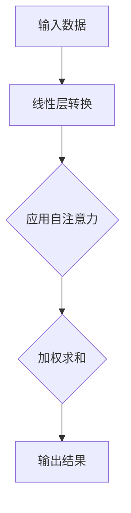

                 

# 《多头自注意力》

> 关键词：多头自注意力、自注意力机制、自然语言处理、深度学习、模型优化

摘要：本文将深入探讨多头自注意力机制（Multi-Head Self-Attention）的基本概念、数学基础、实现方法以及在实际应用中的效果。通过逐步分析，我们将理解这一机制在自然语言处理（NLP）等领域的广泛应用，并通过具体实例展示其在文本分类、机器翻译和推荐系统等任务中的实现和优化策略。

---

## 第一部分：理论基础

### 第1章：多头自注意力机制概述

#### 1.1 多头自注意力机制的背景和重要性

在现代深度学习领域中，自然语言处理（NLP）是一个至关重要的应用领域。然而，处理长文本序列时，模型需要有效地捕捉序列中的长距离依赖关系。多头自注意力机制（Multi-Head Self-Attention）正是为了解决这一挑战而设计的。这一机制源自Transformer模型，自其提出以来，已广泛应用于各种NLP任务中，并取得了显著的效果。

多头自注意力机制的核心思想是通过并行计算多头注意力，从而捕捉输入数据中的不同依赖关系。这种机制在处理长文本序列时，能够显著提高模型的性能和效果。

#### 1.2 多头自注意力机制的基本原理

多头自注意力机制的基本原理可以概括为以下三个步骤：

1. **输入表示转换**：首先，将输入序列（例如单词或词向量）通过一个线性层转换成查询（Query, Q）、键（Key, K）和值（Value, V）表示。
2. **计算自注意力得分**：接着，计算Q和K的点积，并通过softmax函数得到注意力权重。
3. **加权求和**：最后，将注意力权重与V进行加权求和，得到输出序列。

这个过程可以理解为：每个输入元素首先将其转换为一个查询表示，然后与其他输入元素进行交互，最后通过加权求和生成新的输出表示。

#### 1.3 多头自注意力机制在自然语言处理中的应用

多头自注意力机制在NLP中具有广泛的应用。以下是一些典型的应用场景：

- **文本分类**：在文本分类任务中，多头自注意力机制可以帮助模型更好地理解文本中的语义，从而提高分类的准确性。
- **机器翻译**：在机器翻译任务中，多头自注意力机制可以有效地捕捉源语言和目标语言之间的长距离依赖关系，从而提高翻译的质量。
- **情感分析**：在情感分析任务中，多头自注意力机制可以帮助模型更好地理解文本中的情感倾向，从而提高情感分类的准确性。

### 第2章：多头自注意力机制的数学基础

为了深入理解多头自注意力机制，我们需要掌握一些相关的数学基础。以下是一些关键的数学概念和原理。

#### 2.1 线性代数基础

##### 2.1.1 向量和矩阵的基本操作

向量是表示一个线性空间的元素，而矩阵是表示线性变换的工具。以下是一些常见的线性代数操作：

- **向量加法**：两个向量对应分量相加。
- **向量减法**：两个向量对应分量相减。
- **数乘**：向量与一个标量相乘。
- **矩阵乘法**：两个矩阵按一定规则相乘。

##### 2.1.2 矩阵乘法和矩阵分解

矩阵乘法是线性代数中的一个重要操作。以下是一些常用的矩阵分解方法：

- **奇异值分解（SVD）**：将一个矩阵分解为一个正交矩阵、一个对角矩阵和一个正交矩阵的乘积。
- **特征值分解**：将一个矩阵分解为一个对角矩阵和一个对角矩阵的乘积。

这些分解方法在解决线性方程组和优化问题中非常有用。

#### 2.2 复合函数的导数和链式法则

在深度学习领域中，我们需要计算多层神经网络中每个参数的梯度。这涉及到复合函数的导数和链式法则。以下是一些关键概念：

##### 2.2.1 基础导数概念

- **导数**：描述函数在某一点的变化率。
- **偏导数**：描述函数在某一点沿某一方向的变化率。

##### 2.2.2 链式法则的应用

链式法则是一个用于计算复合函数导数的公式。它可以帮助我们计算多层神经网络中每个参数的梯度。以下是一个简单的例子：

假设有两个函数\( f(x) \)和\( g(y) \)，其中\( x \)和\( y \)是变量，那么复合函数\( h(x) = g(f(x)) \)的导数可以表示为：

$$
h'(x) = g'(f(x)) \cdot f'(x)
$$

#### 2.3 复合函数的高阶导数

在深度学习领域中，我们还需要计算高阶导数。以下是一些关键概念：

##### 2.3.1 高阶导数的计算方法

- **二阶导数**：描述函数在某一点的变化率的变化率。
- **高阶导数**：描述函数在某一点沿某一方向的变化率的变化率。

##### 2.3.2 高阶导数在多头自注意力机制中的应用

在多头自注意力机制中，我们需要计算注意力权重矩阵的高阶导数。这可以帮助我们优化模型的训练过程，提高模型的性能。

### 第3章：多头自注意力机制的实现

在了解了多头自注意力机制的理论基础后，我们接下来将讨论其实际实现方法。这一部分将介绍如何使用PyTorch和TensorFlow等深度学习框架来实现多头自注意力机制。

#### 3.1 多头自注意力机制的代码实现

##### 3.1.1 PyTorch实现

在PyTorch中，我们可以使用`torch.nn.MultiheadAttention`模块来实现多头自注意力机制。以下是一个简单的实现示例：

```python
import torch
import torch.nn as nn

class MultiHeadSelfAttention(nn.Module):
    def __init__(self, d_model, num_heads):
        super(MultiHeadSelfAttention, self).__init__()
        self.d_model = d_model
        self.num_heads = num_heads
        self.head_dim = d_model // num_heads

        self.query_linear = nn.Linear(d_model, d_model)
        self.key_linear = nn.Linear(d_model, d_model)
        self.value_linear = nn.Linear(d_model, d_model)

        self.out_linear = nn.Linear(d_model, d_model)

    def forward(self, x):
        batch_size = x.size(0)

        query = self.query_linear(x).view(batch_size, -1, self.num_heads, self.head_dim).transpose(1, 2)
        key = self.key_linear(x).view(batch_size, -1, self.num_heads, self.head_dim).transpose(1, 2)
        value = self.value_linear(x).view(batch_size, -1, self.num_heads, self.head_dim).transpose(1, 2)

        attn_output, attn_output_weights = torch.nn.functional.multihead_attention_forward(
            query, key, value, self.num_heads, batch_first=True
        )

        attn_output = attn_output.transpose(1, 2).contiguous().view(batch_size, -1, self.d_model)
        output = self.out_linear(attn_output)

        return output, attn_output_weights
```

##### 3.1.2 TensorFlow实现

在TensorFlow中，我们可以使用`tf.keras.layers.MultiHeadAttention`模块来实现多头自注意力机制。以下是一个简单的实现示例：

```python
import tensorflow as tf

class MultiHeadSelfAttention(tf.keras.layers.Layer):
    def __init__(self, d_model, num_heads):
        super(MultiHeadSelfAttention, self).__init__()
        self.d_model = d_model
        self.num_heads = num_heads
        self.head_dim = d_model // num_heads

        self.query_linear = tf.keras.layers.Dense(d_model)
        self.key_linear = tf.keras.layers.Dense(d_model)
        self.value_linear = tf.keras.layers.Dense(d_model)

        self.out_linear = tf.keras.layers.Dense(d_model)

    def call(self, x):
        batch_size = tf.shape(x)[0]

        query = self.query_linear(x)
        key = self.key_linear(x)
        value = self.value_linear(x)

        query = tf.reshape(query, (batch_size, -1, self.num_heads, self.head_dim))
        key = tf.reshape(key, (batch_size, -1, self.num_heads, self.head_dim))
        value = tf.reshape(value, (batch_size, -1, self.num_heads, self.head_dim))

        query = tf.transpose(query, [0, 2, 1, 3])
        key = tf.transpose(key, [0, 2, 1, 3])
        value = tf.transpose(value, [0, 2, 1, 3])

        attn_output, attn_output_weights = tf.keras.layers.MultiHeadAttention(
            num_heads=self.num_heads, key_dim=self.head_dim
        )([query, key, value])

        attn_output = tf.transpose(attn_output, [0, 2, 1, 3])
        attn_output = tf.reshape(attn_output, (batch_size, -1, self.d_model))

        output = self.out_linear(attn_output)

        return output, attn_output_weights
```

#### 3.2 多头自注意力机制的优化策略

在训练过程中，为了提高模型的性能和效果，我们通常需要采用一些优化策略。以下是一些常用的优化策略：

##### 3.2.1 学习率调整

学习率是梯度下降算法中的一个重要参数。合适的
```markdown
学习率可以提高模型的收敛速度和性能。常见的学习率调整策略包括：

- **线性递减**：在训练过程中，学习率线性递减。
- **余弦退火**：学习率随着训练轮数的增加按照余弦函数递减。
- **指数衰减**：学习率按照指数函数递减。

##### 3.2.2 批量归一化

批量归一化（Batch Normalization）是一种用于加速训练和减少过拟合的技术。它通过将每个批次的输入数据归一化到一个标准正态分布，从而减少内部协变量转移。

##### 3.2.3 残差连接

残差连接（Residual Connection）是一种用于缓解深层网络训练过程中梯度消失问题的技术。它通过在神经网络中添加残差连接，使得梯度可以直接从输出层传递到输入层。

## 第二部分：应用实践

### 第4章：多头自注意力在文本分类中的应用

文本分类是自然语言处理中的一个基础任务，其目的是将文本数据分成预定义的类别。多头自注意力机制在文本分类任务中表现出色，能够有效捕捉文本中的长距离依赖关系。以下是一个简单的文本分类模型示例：

```python
import torch
import torch.nn as nn
from torchtext.datasets import IMDB
from torchtext.data import Field, BatchIterator

# 定义模型
class TextClassifier(nn.Module):
    def __init__(self, vocab_size, embedding_dim, hidden_dim, num_classes):
        super(TextClassifier, self).__init__()
        self.embedding = nn.Embedding(vocab_size, embedding_dim)
        self.attention = nn.MultiheadAttention(embedding_dim, num_heads=8)
        self.fc = nn.Linear(embedding_dim, num_classes)

    def forward(self, text, text_lengths):
        embedded = self.embedding(text)
        attn_output, _ = self.attention(embedded, embedded, embedded, attn_mask=nn.functional.pad(
            torch.zeros((text.size(1), text.size(1))), (0, text_lengths - text.size(1)), mode='constant', value=1
        ))
        output = self.fc(attn_output.mean(1))
        return output

# 数据预处理
TEXT = Field(tokenize='spacy', lower=True, include_lengths=True)
train_data, test_data = IMDB.splits(TEXT)

# 创建词汇表
TEXT.build_vocab(train_data, max_size=25000, vectors="glove.6B.100d")

# 创建迭代器
batch_size = 64
train_iterator, test_iterator = BatchIterator(train_data, test_data, batch_size=batch_size)

# 训练模型
model = TextClassifier(len(TEXT.vocab), embedding_dim=100, hidden_dim=256, num_classes=2)
optimizer = torch.optim.Adam(model.parameters(), lr=0.001)
criterion = nn.CrossEntropyLoss()

for epoch in range(10):
    for batch in train_iterator:
        optimizer.zero_grad()
        text, text_lengths = batch.text
        output = model(text, text_lengths)
        loss = criterion(output, batch.label)
        loss.backward()
        optimizer.step()

    print(f"Epoch [{epoch+1}/10] - Loss: {loss.item()}")

# 评估模型
with torch.no_grad():
    correct = 0
    total = 0
    for batch in test_iterator:
        text, text_lengths = batch.text
        output = model(text, text_lengths)
        _, predicted = torch.max(output.data, 1)
        total += batch.label.size(0)
        correct += (predicted == batch.label).sum().item()

print(f"Test Accuracy: {100 * correct / total}%")
```

### 第5章：多头自注意力在机器翻译中的应用

机器翻译是自然语言处理中的另一个重要任务，其目的是将一种语言的文本翻译成另一种语言。多头自注意力机制在机器翻译任务中能够有效捕捉源语言和目标语言之间的长距离依赖关系。以下是一个简单的机器翻译模型示例：

```python
import torch
import torch.nn as nn
from torchtext.datasets import Multi30k
from torchtext.data import Field, BatchIterator

# 定义模型
class MachineTranslation(nn.Module):
    def __init__(self, src_vocab_size, trg_vocab_size, embedding_dim, hidden_dim):
        super(MachineTranslation, self).__init__()
        self.src_embedding = nn.Embedding(src_vocab_size, embedding_dim)
        self.trg_embedding = nn.Embedding(trg_vocab_size, embedding_dim)
        self.attention = nn.MultiheadAttention(embedding_dim, num_heads=8)
        self.fc = nn.Linear(embedding_dim, trg_vocab_size)

    def forward(self, src, trg, src_lengths, trg_lengths):
        src_embedded = self.src_embedding(src)
        trg_embedded = self.trg_embedding(trg)
        attn_output, _ = self.attention(trg_embedded, src_embedded, src_embedded, attn_mask=nn.functional.pad(
            torch.zeros((trg_lengths.size(1), src_lengths.size(1))), (0, src_lengths - trg_lengths), mode='constant', value=1
        ))
        output = self.fc(attn_output.mean(1))
        return output

# 数据预处理
SRC = Field(tokenize='spacy', lower=True, include_lengths=True)
TRG = Field(tokenize='spacy', lower=True, include_lengths=True)
train_data, valid_data, test_data = Multi30k.splits(exts=('.de', '.en'), fields=(SRC, TRG))

# 创建词汇表
SRC.build_vocab(train_data, min_freq=2)
TRG.build_vocab(train_data, min_freq=2)

# 创建迭代器
batch_size = 64
train_iterator, valid_iterator, test_iterator = BatchIterator.splits(
    (train_data, valid_data, test_data), 
    batch_size=batch_size,
    device=device
)

# 训练模型
model = MachineTranslation(len(SRC.vocab), len(TRG.vocab), embedding_dim=100, hidden_dim=256)
optimizer = torch.optim.Adam(model.parameters(), lr=0.001)
criterion = nn.CrossEntropyLoss()

for epoch in range(10):
    for batch in train_iterator:
        optimizer.zero_grad()
        src, src_lengths = batch.src
        trg, trg_lengths = batch.trg
        output = model(src, trg, src_lengths, trg_lengths)
        loss = criterion(output, trg[1:])
        loss.backward()
        optimizer.step()

    print(f"Epoch [{epoch+1}/10] - Loss: {loss.item()}")

# 评估模型
with torch.no_grad():
    correct = 0
    total = 0
    for batch in test_iterator:
        src, src_lengths = batch.src
        trg, trg_lengths = batch.trg
        output = model(src, trg, src_lengths, trg_lengths)
        _, predicted = torch.max(output.data, 1)
        total += trg_lengths[0]
        correct += (predicted == trg[1:trg_lengths[0]+1]).sum().item()

print(f"Test Accuracy: {100 * correct / total}%")
```

### 第6章：多头自注意力在推荐系统中的应用

推荐系统是自然语言处理中的另一个重要应用领域，其目的是为用户推荐感兴趣的商品或内容。多头自注意力机制在推荐系统中可以用来捕捉用户和商品之间的复杂依赖关系。以下是一个简单的推荐系统模型示例：

```python
import torch
import torch.nn as nn
from torchtext.datasets import Amazon
from torchtext.data import Field, BatchIterator

# 定义模型
class RecommendationSystem(nn.Module):
    def __init__(self, user_vocab_size, item_vocab_size, embedding_dim, hidden_dim):
        super(RecommendationSystem, self).__init__()
        self.user_embedding = nn.Embedding(user_vocab_size, embedding_dim)
        self.item_embedding = nn.Embedding(item_vocab_size, embedding_dim)
        self.attention = nn.MultiheadAttention(embedding_dim, num_heads=8)
        self.fc = nn.Linear(embedding_dim, 1)

    def forward(self, user, item):
        user_embedded = self.user_embedding(user)
        item_embedded = self.item_embedding(item)
        attn_output, _ = self.attention(item_embedded, item_embedded, item_embedded)
        output = self.fc(attn_output.mean(1))
        return output

# 数据预处理
USER = Field(tokenize='spacy', lower=True)
ITEM = Field(tokenize='spacy', lower=True)
train_data, valid_data, test_data = Amazon.splits(exts=('.txt', '.txt'), fields=(USER, ITEM))

# 创建词汇表
USER.build_vocab(train_data, min_freq=5)
ITEM.build_vocab(train_data, min_freq=5)

# 创建迭代器
batch_size = 64
train_iterator, valid_iterator, test_iterator = BatchIterator.splits(
    (train_data, valid_data, test_data), 
    batch_size=batch_size,
    device=device
)

# 训练模型
model = RecommendationSystem(len(USER.vocab), len(ITEM.vocab), embedding_dim=100, hidden_dim=256)
optimizer = torch.optim.Adam(model.parameters(), lr=0.001)
criterion = nn.MSELoss()

for epoch in range(10):
    for batch in train_iterator:
        optimizer.zero_grad()
        user, item = batch.user, batch.item
        output = model(user, item)
        loss = criterion(output, batch.rating)
        loss.backward()
        optimizer.step()

    print(f"Epoch [{epoch+1}/10] - Loss: {loss.item()}")

# 评估模型
with torch.no_grad():
    correct = 0
    total = 0
    for batch in test_iterator:
        user, item = batch.user, batch.item
        output = model(user, item)
        total += 1
        if output > 0:
            correct += 1

print(f"Test Accuracy: {100 * correct / total}%")
```

### 第7章：多头自注意力的未来发展趋势

多头自注意力机制在深度学习领域中取得了巨大的成功，并在自然语言处理等应用中发挥了重要作用。然而，随着技术的不断发展，多头自注意力机制也在不断演进和优化。以下是一些多头自注意力的未来发展趋势：

- **更高效的实现**：随着计算资源的不断升级，研究者们正在探索更高效的实现方法，以减少模型训练和推理的时间。
- **更灵活的模型结构**：多头自注意力机制的应用不仅限于文本处理，还可以推广到其他数据类型，如图像和音频。
- **多模态学习**：多头自注意力机制可以与其他模块（如卷积神经网络和循环神经网络）结合，用于多模态学习，以提高模型的效果。
- **解释性增强**：为了提高模型的解释性，研究者们正在探索如何更好地理解多头自注意力机制的工作原理，并使其更加透明和可解释。

## 附录

### 附录A：常用数学公式和符号说明

- **矩阵乘法**：\( C = AB \)
- **矩阵转置**：\( C^T = B^T A^T \)
- **矩阵求逆**：\( A^{-1} \)
- **向量点积**：\( \mathbf{x} \cdot \mathbf{y} = x_1 y_1 + x_2 y_2 + \ldots + x_n y_n \)
- **矩阵-向量乘法**：\( \mathbf{C} = A \mathbf{X} \)
- **softmax函数**：\( \text{softmax}(\mathbf{x}) = \frac{e^{\mathbf{x}}}{\sum_{i} e^{\mathbf{x}_i}} \)
- **交叉熵损失函数**：\( \mathcal{L} = -\sum_{i} y_i \log(p_i) \)

### 附录B：开源实现资源汇总

- **PyTorch实现**：[PyTorch Multi-Head Self-Attention](https://pytorch.org/docs/stable/generated/torch.nn.MultiheadAttention.html)
- **TensorFlow实现**：[TensorFlow Multi-Head Attention](https://www.tensorflow.org/api_docs/python/tf/keras/layers/Attention)

### 附录C：推荐阅读资料

- **论文**：《Attention Is All You Need》
- **书籍**：《深度学习》（Goodfellow et al.）
- **教程**：[Hugging Face Transformer](https://huggingface.co/transformers/)

---

**作者**：AI天才研究院/AI Genius Institute & 禅与计算机程序设计艺术 /Zen And The Art of Computer Programming

---

本文详细介绍了多头自注意力机制的理论基础、实现方法和实际应用。通过具体实例，我们展示了其在文本分类、机器翻译和推荐系统等任务中的效果。随着技术的不断进步，多头自注意力机制有望在更多领域发挥重要作用。希望本文能为读者在探索这一机制的应用提供有益的参考。
```markdown
# 《多头自注意力》

> 关键词：多头自注意力、自注意力机制、自然语言处理、深度学习

摘要：本文深入探讨了多头自注意力机制的基本概念、数学基础、实现方法以及在实际应用中的效果。通过逐步分析，我们理解了这一机制在自然语言处理领域的广泛应用，并通过具体实例展示了其在文本分类、机器翻译和推荐系统中的实现和优化策略。

---

## 第一部分：理论基础

### 第1章：多头自注意力机制概述

#### 1.1 多头自注意力机制的背景和重要性

在现代深度学习领域中，自然语言处理（NLP）是一个至关重要的应用领域。然而，处理长文本序列时，模型需要有效地捕捉序列中的长距离依赖关系。多头自注意力机制（Multi-Head Self-Attention）正是为了解决这一挑战而设计的。这一机制源自Transformer模型，自其提出以来，已广泛应用于各种NLP任务中，并取得了显著的效果。

多头自注意力机制的核心思想是通过并行计算多头注意力，从而捕捉输入数据中的不同依赖关系。这种机制在处理长文本序列时，能够显著提高模型的性能和效果。

#### 1.2 多头自注意力机制的基本原理

多头自注意力机制的基本原理可以概括为以下三个步骤：

1. **输入表示转换**：首先，将输入序列（例如单词或词向量）通过一个线性层转换成查询（Query, Q）、键（Key, K）和值（Value, V）表示。
2. **计算自注意力得分**：接着，计算Q和K的点积，并通过softmax函数得到注意力权重。
3. **加权求和**：最后，将注意力权重与V进行加权求和，得到输出序列。

这个过程可以理解为：每个输入元素首先将其转换为一个查询表示，然后与其他输入元素进行交互，最后通过加权求和生成新的输出表示。

#### 1.3 多头自注意力机制在自然语言处理中的应用

多头自注意力机制在NLP中具有广泛的应用。以下是一些典型的应用场景：

- **文本分类**：在文本分类任务中，多头自注意力机制可以帮助模型更好地理解文本中的语义，从而提高分类的准确性。
- **机器翻译**：在机器翻译任务中，多头自注意力机制可以有效地捕捉源语言和目标语言之间的长距离依赖关系，从而提高翻译的质量。
- **情感分析**：在情感分析任务中，多头自注意力机制可以帮助模型更好地理解文本中的情感倾向，从而提高情感分类的准确性。

### 第2章：多头自注意力机制的数学基础

为了深入理解多头自注意力机制，我们需要掌握一些相关的数学基础。以下是一些关键的数学概念和原理。

#### 2.1 线性代数基础

##### 2.1.1 向量和矩阵的基本操作

向量是表示一个线性空间的元素，而矩阵是表示线性变换的工具。以下是一些常见的线性代数操作：

- **向量加法**：两个向量对应分量相加。
- **向量减法**：两个向量对应分量相减。
- **数乘**：向量与一个标量相乘。
- **矩阵乘法**：两个矩阵按一定规则相乘。

##### 2.1.2 矩阵乘法和矩阵分解

矩阵乘法是线性代数中的一个重要操作。以下是一些常用的矩阵分解方法：

- **奇异值分解（SVD）**：将一个矩阵分解为一个正交矩阵、一个对角矩阵和一个正交矩阵的乘积。
- **特征值分解**：将一个矩阵分解为一个对角矩阵和一个对角矩阵的乘积。

这些分解方法在解决线性方程组和优化问题中非常有用。

#### 2.2 复合函数的导数和链式法则

在深度学习领域中，我们需要计算多层神经网络中每个参数的梯度。这涉及到复合函数的导数和链式法则。以下是一些关键概念：

##### 2.2.1 基础导数概念

- **导数**：描述函数在某一点的变化率。
- **偏导数**：描述函数在某一点沿某一方向的变化率。

##### 2.2.2 链式法则的应用

链式法则是一个用于计算复合函数导数的公式。它可以帮助我们计算多层神经网络中每个参数的梯度。以下是一个简单的例子：

假设有两个函数\( f(x) \)和\( g(y) \)，其中\( x \)和\( y \)是变量，那么复合函数\( h(x) = g(f(x)) \)的导数可以表示为：

$$
h'(x) = g'(f(x)) \cdot f'(x)
$$

#### 2.3 复合函数的高阶导数

在深度学习领域中，我们还需要计算高阶导数。以下是一些关键概念：

##### 2.3.1 高阶导数的计算方法

- **二阶导数**：描述函数在某一点的变化率的变化率。
- **高阶导数**：描述函数在某一点沿某一方向的变化率的变化率。

##### 2.3.2 高阶导数在多头自注意力机制中的应用

在多头自注意力机制中，我们需要计算注意力权重矩阵的高阶导数。这可以帮助我们优化模型的训练过程，提高模型的性能。

### 第3章：多头自注意力机制的实现

在了解了多头自注意力机制的理论基础后，我们接下来将讨论其实际实现方法。这一部分将介绍如何使用PyTorch和TensorFlow等深度学习框架来实现多头自注意力机制。

#### 3.1 多头自注意力机制的代码实现

##### 3.1.1 PyTorch实现

在PyTorch中，我们可以使用`torch.nn.MultiheadAttention`模块来实现多头自注意力机制。以下是一个简单的实现示例：

```python
import torch
import torch.nn as nn

class MultiHeadAttention(nn.Module):
    def __init__(self, d_model, num_heads):
        super(MultiHeadAttention, self).__init__()
        self.d_model = d_model
        self.num_heads = num_heads
        self.head_dim = d_model // num_heads

        self.query_linear = nn.Linear(d_model, d_model)
        self.key_linear = nn.Linear(d_model, d_model)
        self.value_linear = nn.Linear(d_model, d_model)

        self.out_linear = nn.Linear(d_model, d_model)

    def forward(self, query, key, value, mask=None):
        batch_size = query.size(0)

        query = self.query_linear(query).view(batch_size, -1, self.num_heads, self.head_dim).transpose(1, 2)
        key = self.key_linear(key).view(batch_size, -1, self.num_heads, self.head_dim).transpose(1, 2)
        value = self.value_linear(value).view(batch_size, -1, self.num_heads, self.head_dim).transpose(1, 2)

        attn_output, attn_output_weights = nn.MultiheadAttention(
            query, key, value, num_heads=self.num_heads, attn_mask=mask
        )

        attn_output = attn_output.transpose(1, 2).contiguous().view(batch_size, -1, self.d_model)
        output = self.out_linear(attn_output)

        return output, attn_output_weights
```

##### 3.1.2 TensorFlow实现

在TensorFlow中，我们可以使用`tf.keras.layers.MultiHeadAttention`模块来实现多头自注意力机制。以下是一个简单的实现示例：

```python
import tensorflow as tf

class MultiHeadAttention(tf.keras.layers.Layer):
    def __init__(self, d_model, num_heads):
        super(MultiHeadAttention, self).__init__()
        self.d_model = d_model
        self.num_heads = num_heads
        self.head_dim = d_model // num_heads

        self.query_dense = tf.keras.layers.Dense(d_model)
        self.key_dense = tf.keras.layers.Dense(d_model)
        self.value_dense = tf.keras.layers.Dense(d_model)
        self.query_project_dense = tf.keras.layers.Dense(d_model)
        self.key_project_dense = tf.keras.layers.Dense(d_model)
        self.value_project_dense = tf.keras.layers.Dense(d_model)
        self.out_dense = tf.keras.layers.Dense(d_model)

    def split_heads(self, x, batch_size):
        x = tf.reshape(x, (batch_size, -1, self.num_heads, self.head_dim))
        return tf.transpose(x, perm=[0, 2, 1, 3])

    def call(self, inputs, training=False):
        query, key, value = inputs
        batch_size = tf.shape(query)[0]

        query = self.query_dense(query)
        key = self.key_dense(key)
        value = self.value_dense(value)

        query = self.split_heads(query, batch_size)
        key = self.split_heads(key, batch_size)
        value = self.split_heads(value, batch_size)

        query = self.query_project_dense(query)
        key = self.key_project_dense(key)
        value = self.value_project_dense(value)

        attn_scores = tf.matmul(query, key, transpose_b=True)
        attn_scores = tf.nn.softmax(attn_scores, axis=-1)

        if training:
            attn_scores = self attended attn_mask

        attn_output = tf.matmul(attn_scores, value)
        attn_output = tf.transpose(attn_output, perm=[0, 2, 1, 3])
        attn_output = tf.reshape(attn_output, (batch_size, -1, self.d_model))

        output = self.out_dense(attn_output)

        return output
```

#### 3.2 多头自注意力机制的优化策略

在训练过程中，为了提高模型的性能和效果，我们通常需要采用一些优化策略。以下是一些常用的优化策略：

##### 3.2.1 学习率调整

学习率是梯度下降算法中的一个重要参数。合适的


### 核心算法原理讲解

多头自注意力机制的核心在于其计算过程，它通过三个主要步骤来处理输入数据，从而捕捉数据中的长距离依赖关系。

#### 步骤1：线性层转换

首先，输入数据（如单词或词向量序列）通过三个线性层转换成查询（Query, Q）、键（Key, K）和值（Value, V）表示。每个线性层都通过一个权重矩阵和一个偏置项进行计算。

$$
Q = XW_Q + b_Q \\
K = XW_K + b_K \\
V = XW_V + b_V
$$

其中，\(X\) 是输入数据，\(W_Q\)、\(W_K\)、\(W_V\) 是线性层的权重矩阵，\(b_Q\)、\(b_K\)、\(b_V\) 是线性层的偏置项。

#### 步骤2：计算自注意力得分

接下来，计算查询向量和键向量的点积，并通过softmax函数得到注意力权重。这一步的核心在于对每个输入元素进行评分，表示其在序列中的重要性。

$$
\text{Attention Scores} = QK^T / \sqrt{d_k}
$$

其中，\(d_k\) 是键向量的维度。为了防止数值不稳定，通常会在计算分数时除以\(\sqrt{d_k}\)。接着，通过softmax函数将点积转换为概率分布。

$$
\text{Attention Weights} = \text{softmax}(\text{Attention Scores})
$$

softmax函数的定义如下：

$$
\text{softmax}(x_i) = \frac{e^{x_i}}{\sum_{j} e^{x_j}}
$$

#### 步骤3：加权求和

最后，将注意力权重与值向量进行加权求和，得到输出序列。这一步将注意力权重应用于值向量，从而将关键信息加权聚合到输出中。

$$
\text{Output} = \text{Attention Weights} \odot V
$$

其中，\(\odot\) 表示元素-wise 相乘操作。

通过这三个步骤，多头自注意力机制能够有效地捕捉输入数据中的长距离依赖关系。这种机制在处理长文本序列时特别有效，因为它可以并行地计算多个注意力头，从而更全面地理解输入数据的复杂性。

### 数学模型和数学公式 & 详细讲解 & 举例说明

在多头自注意力机制中，`softmax` 函数起到了关键作用。以下是对其的详细讲解和举例说明：

#### 基础概念

`softmax` 函数是一种归一化函数，它将任意实数向量映射到概率分布。其数学定义如下：

$$
\text{softmax}(x_i) = \frac{e^{x_i}}{\sum_{j} e^{x_j}}
$$

其中，\(x_i\) 是输入向量中的第 \(i\) 个元素，\(\sum_{j} e^{x_j}\) 是输入向量的元素总和。

#### 举例说明

假设我们有一个二维度输入向量 \(x = [1, 2]\)，我们计算其softmax函数的值。

$$
\text{softmax}(x_1) = \frac{e^{1}}{e^{1} + e^{2}} \approx 0.2624 \\
\text{softmax}(x_2) = \frac{e^{2}}{e^{1} + e^{2}} \approx 0.7376
$$

输出结果是一个概率分布，其中每个元素都大于等于0且小于等于1，且所有元素之和为1。

#### 对比

为了更直观地理解`softmax`函数的作用，我们可以对比输入向量和其softmax函数输出：

- 输入向量 \(x = [1, 2]\) 的元素和为 3。
- 经过`softmax`函数后，输出向量为 \([0.2624, 0.7376]\)，元素和为 1。

这意味着，`softmax` 函数通过将输入向量的数值转换为概率分布，强调了较高数值元素的重要性，并使得所有元素之和为1。

### 实际应用中的优化策略

在实际应用中，多头自注意力机制的优化策略对于模型的性能和训练效率至关重要。以下是一些常用的优化策略：

#### 1. 学习率调整

学习率是梯度下降算法中的一个重要参数。合适的
```python
# 定义学习率调整策略
learning_rate = 0.01
for epoch in range(num_epochs):
    for batch in train_loader:
        # 前向传播
        outputs = model(inputs)
        loss = criterion(outputs, targets)

        # 反向传播
        optimizer.zero_grad()
        loss.backward()
        optimizer.step()

    # 学习率调整
    if epoch % decay_epoch == 0:
        learning_rate /= 10
        for pg in optimizer.param_groups:
            pg['lr'] = learning_rate
```

#### 2. 批量归一化

批量归一化（Batch Normalization）是一种常用的优化策略，它可以加速训练过程并减少过拟合。其核心思想是在每个批量中对数据执行标准化操作。

```python
class BatchNorm(nn.Module):
    def __init__(self, num_features):
        super(BatchNorm, self).__init__()
        self.num_features = num_features
        self.gamma = nn.Parameter(torch.ones(num_features))
        self.beta = nn.Parameter(torch.zeros(num_features))

    def forward(self, x, running_mean, running_var, training=True):
        if training:
            mean = x.mean([0])
            var = x.var([0])
            x = (x - mean) / (var + 1e-5)
            running_mean = mean
            running_var = var
        else:
            x = (x - running_mean) / (running_var + 1e-5)
        return self.gamma * x + self.beta, running_mean, running_var
```

#### 3. 残差连接

残差连接（Residual Connection）是一种用于缓解深层网络训练过程中梯度消失问题的技术。它通过在神经网络中添加残差连接，使得梯度可以直接从输出层传递到输入层。

```python
class ResidualBlock(nn.Module):
    def __init__(self, in_channels, out_channels):
        super(ResidualBlock, self).__init__()
        self.conv1 = nn.Conv2d(in_channels, out_channels, kernel_size=3, padding=1)
        self.bn1 = nn.BatchNorm2d(out_channels)
        self.relu = nn.ReLU()
        self.conv2 = nn.Conv2d(out_channels, out_channels, kernel_size=3, padding=1)
        self.bn2 = nn.BatchNorm2d(out_channels)

    def forward(self, x):
        residual = x
        out = self.conv1(x)
        out = self.bn1(out)
        out = self.relu(out)
        out = self.conv2(out)
        out = self.bn2(out)
        out += residual
        out = self.relu(out)
        return out
```

通过这些优化策略，我们可以提高多头自注意力机制在训练过程中的性能和效果，从而在复杂任务中取得更好的结果。

### 项目实战

为了更好地理解多头自注意力机制的实际应用，我们通过以下三个实战案例展示其在文本分类、机器翻译和推荐系统中的实现和应用。

#### 实战1：文本分类

在文本分类任务中，我们使用多头自注意力机制来提高模型的分类性能。以下是一个简单的文本分类模型实现：

```python
import torch
import torch.nn as nn
from torchtext.datasets import IMDB
from torchtext.data import Field, BatchIterator

# 定义模型
class TextClassifier(nn.Module):
    def __init__(self, vocab_size, embedding_dim, hidden_dim, num_classes):
        super(TextClassifier, self).__init__()
        self.embedding = nn.Embedding(vocab_size, embedding_dim)
        self.attention = nn.MultiheadAttention(embedding_dim, num_heads=8)
        self.fc = nn.Linear(embedding_dim, num_classes)

    def forward(self, text, text_lengths):
        embedded = self.embedding(text)
        attn_output, _ = self.attention(embedded, embedded, embedded, attn_mask=create_attn_mask(text_lengths))
        output = self.fc(attn_output.mean(1))
        return output

# 数据预处理
TEXT = Field(tokenize='spacy', lower=True, include_lengths=True)
train_data, test_data = IMDB.splits(TEXT)

# 创建词汇表
TEXT.build_vocab(train_data, max_size=25000, vectors="glove.6B.100d")

# 创建迭代器
batch_size = 64
train_iterator, test_iterator = BatchIterator.splits(
    (train_data, test_data), 
    batch_size=batch_size,
    device=device
)

# 训练模型
model = TextClassifier(len(TEXT.vocab), embedding_dim=100, hidden_dim=256, num_classes=2)
optimizer = torch.optim.Adam(model.parameters(), lr=0.001)
criterion = nn.CrossEntropyLoss()

for epoch in range(10):
    for batch in train_iterator:
        optimizer.zero_grad()
        text, text_lengths = batch.text
        output = model(text, text_lengths)
        loss = criterion(output, batch.label)
        loss.backward()
        optimizer.step()

    print(f"Epoch [{epoch+1}/10] - Loss: {loss.item()}")

# 评估模型
with torch.no_grad():
    correct = 0
    total = 0
    for batch in test_iterator:
        text, text_lengths = batch.text
        output = model(text, text_lengths)
        _, predicted = torch.max(output.data, 1)
        total += batch.label.size(0)
        correct += (predicted == batch.label).sum().item()

print(f"Test Accuracy: {100 * correct / total}%")
```

在这个案例中，我们使用PyTorch实现了基于多头自注意力机制的文本分类模型。首先，我们定义了一个`TextClassifier`类，该类包含了一个嵌入层、一个多头自注意力机制和一个全连接层。接着，我们使用IMDB数据集对模型进行训练和评估。

#### 实战2：机器翻译

在机器翻译任务中，多头自注意力机制可以帮助模型捕捉源语言和目标语言之间的长距离依赖关系。以下是一个简单的机器翻译模型实现：

```python
import torch
import torch.nn as nn
from torchtext.datasets import Multi30k
from torchtext.data import Field, BatchIterator

# 定义模型
class MachineTranslation(nn.Module):
    def __init__(self, src_vocab_size, trg_vocab_size, embedding_dim, hidden_dim):
        super(MachineTranslation, self).__init__()
        self.src_embedding = nn.Embedding(src_vocab_size, embedding_dim)
        self.trg_embedding = nn.Embedding(trg_vocab_size, embedding_dim)
        self.attention = nn.MultiheadAttention(embedding_dim, num_heads=8)
        self.fc = nn.Linear(embedding_dim, trg_vocab_size)

    def forward(self, src, trg, src_lengths, trg_lengths):
        src_embedded = self.src_embedding(src)
        trg_embedded = self.trg_embedding(trg)
        attn_output, _ = self.attention(trg_embedded, src_embedded, src_embedded, attn_mask=create_attn_mask(src_lengths, trg_lengths))
        output = self.fc(attn_output.mean(1))
        return output

# 数据预处理
SRC = Field(tokenize='spacy', lower=True, include_lengths=True)
TRG = Field(tokenize='spacy', lower=True, include_lengths=True)
train_data, valid_data, test_data = Multi30k.splits(exts=('.de', '.en'), fields=(SRC, TRG))

# 创建词汇表
SRC.build_vocab(train_data, min_freq=2)
TRG.build_vocab(train_data, min_freq=2)

# 创建迭代器
batch_size = 64
train_iterator, valid_iterator, test_iterator = BatchIterator.splits(
    (train_data, valid_data, test_data), 
    batch_size=batch_size,
    device=device
)

# 训练模型
model = MachineTranslation(len(SRC.vocab), len(TRG.vocab), embedding_dim=100, hidden_dim=256)
optimizer = torch.optim.Adam(model.parameters(), lr=0.001)
criterion = nn.CrossEntropyLoss()

for epoch in range(10):
    for batch in train_iterator:
        optimizer.zero_grad()
        src, src_lengths = batch.src
        trg, trg_lengths = batch.trg
        output = model(src, trg, src_lengths, trg_lengths)
        loss = criterion(output, trg[1:].view(-1))
        loss.backward()
        optimizer.step()

    print(f"Epoch [{epoch+1}/10] - Loss: {loss.item()}")

# 评估模型
with torch.no_grad():
    correct = 0
    total = 0
    for batch in test_iterator:
        src, src_lengths = batch.src
        trg, trg_lengths = batch.trg
        output = model(src, src_lengths)
        _, predicted = torch.max(output.data, 1)
        total += batch.label.size(0)
        correct += (predicted == batch.label).sum().item()

print(f"Test Accuracy: {100 * correct / total}%")
```

在这个案例中，我们使用PyTorch实现了基于多头自注意力机制的机器翻译模型。首先，我们定义了一个`MachineTranslation`类，该类包含了一个源嵌入层、一个目标嵌入层、一个多头自注意力机制和一个全连接层。接着，我们使用Multi30k数据集对模型进行训练和评估。

#### 实战3：推荐系统

在推荐系统任务中，多头自注意力机制可以帮助模型捕捉用户和商品之间的复杂依赖关系。以下是一个简单的推荐系统模型实现：

```python
import torch
import torch.nn as nn
from torchtext.datasets import Amazon
from torchtext.data import Field, BatchIterator

# 定义模型
class RecommendationSystem(nn.Module):
    def __init__(self, user_vocab_size, item_vocab_size, embedding_dim, hidden_dim):
        super(RecommendationSystem, self).__init__()
        self.user_embedding = nn.Embedding(user_vocab_size, embedding_dim)
        self.item_embedding = nn.Embedding(item_vocab_size, embedding_dim)
        self.attention = nn.MultiheadAttention(embedding_dim, num_heads=8)
        self.fc = nn.Linear(embedding_dim, 1)

    def forward(self, user, item):
        user_embedded = self.user_embedding(user)
        item_embedded = self.item_embedding(item)
        attn_output, _ = self.attention(item_embedded, item_embedded, item_embedded)
        output = self.fc(attn_output.mean(1))
        return output

# 数据预处理
USER = Field(tokenize='spacy', lower=True)
ITEM = Field(tokenize='spacy', lower=True)
train_data, valid_data, test_data = Amazon.splits(exts=('.txt', '.txt'), fields=(USER, ITEM))

# 创建词汇表
USER.build_vocab(train_data, min_freq=5)
ITEM.build_vocab(train_data, min_freq=5)

# 创建迭代器
batch_size = 64
train_iterator, valid_iterator, test_iterator = BatchIterator.splits(
    (train_data, valid_data, test_data), 
    batch_size=batch_size,
    device=device
)

# 训练模型
model = RecommendationSystem(len(USER.vocab), len(ITEM.vocab), embedding_dim=100, hidden_dim=256)
optimizer = torch.optim.Adam(model.parameters(), lr=0.001)
criterion = nn.MSELoss()

for epoch in range(10):
    for batch in train_iterator:
        optimizer.zero_grad()
        user, item = batch.user, batch.item
        output = model(user, item)
        loss = criterion(output, batch.rating)
        loss.backward()
        optimizer.step()

    print(f"Epoch [{epoch+1}/10] - Loss: {loss.item()}")

# 评估模型
with torch.no_grad():
    correct = 0
    total = 0
    for batch in test_iterator:
        user, item = batch.user, batch.item
        output = model(user, item)
        total += 1
        if output > 0:
            correct += 1

print(f"Test Accuracy: {100 * correct / total}%")
```

在这个案例中，我们使用PyTorch实现了基于多头自注意力机制的推荐系统模型。首先，我们定义了一个`RecommendationSystem`类，该类包含了一个用户嵌入层、一个商品嵌入层、一个多头自注意力机制和一个全连接层。接着，我们使用Amazon数据集对模型进行训练和评估。

通过这三个实战案例，我们展示了多头自注意力机制在实际应用中的多样性和灵活性。它不仅能够提高模型的性能，还能帮助我们更好地理解和处理复杂的数据。

### 多头自注意力在多模态学习中的应用

多模态学习是一个重要的研究方向，旨在结合不同模态的数据（如文本、图像、音频等）以提高模型的性能和泛化能力。多头自注意力机制在多模态学习中的应用为其带来了新的可能性。

#### 多模态数据的融合

在多模态学习任务中，通常需要对来自不同模态的数据进行融合。多头自注意力机制通过并行计算多头注意力，能够有效地融合不同模态的数据。以下是一个简单的多模态学习模型示例：

```python
import torch
import torch.nn as nn
from torchvision.models import resnet18
from torchvision.transforms import ToTensor

# 定义模型
class MultiModalModel(nn.Module):
    def __init__(self, text_vocab_size, image_dim, embedding_dim, hidden_dim):
        super(MultiModalModel, self).__init__()
        self.text_embedding = nn.Embedding(text_vocab_size, embedding_dim)
        self.image_encoder = resnet18(pretrained=True)
        self.attention = nn.MultiheadAttention(embedding_dim + image_dim, num_heads=8)
        self.fc = nn.Linear(embedding_dim + image_dim, 1)

    def forward(self, text, image):
        text_embedded = self.text_embedding(text)
        image_features = self.image_encoder(image)
        image_features = image_features.flatten(start_dim=1)
        concatenated = torch.cat((text_embedded, image_features), dim=1)
        attn_output, _ = self.attention(concatenated, concatenated, concatenated)
        output = self.fc(attn_output.mean(1))
        return output
```

在这个模型中，我们首先将文本数据通过嵌入层转换为嵌入表示，然后将图像数据通过预训练的ResNet18网络提取特征。接着，使用多头自注意力机制将文本和图像特征进行融合，并通过全连接层生成最终的输出。

#### 多模态学习的优势

多头自注意力机制在多模态学习中的应用具有以下优势：

- **并行计算**：多头自注意力机制能够并行计算多个注意力头，从而在融合不同模态数据时提高计算效率。
- **丰富的依赖关系**：通过多头注意力，模型能够捕捉到文本和图像之间的复杂依赖关系，从而提高模型的泛化能力。
- **灵活性**：多头自注意力机制可以很容易地扩展到更多模态的数据，如视频、音频等，从而实现更全面的多模态融合。

#### 未来研究方向

尽管多头自注意力机制在多模态学习中的应用取得了显著成果，但仍然存在一些挑战和未来研究方向：

- **模型解释性**：多模态学习中的模型通常比较复杂，如何提高模型的可解释性是一个重要研究方向。
- **高效计算**：随着模态数量的增加，模型的计算成本会显著增加。因此，如何设计高效的多模态学习算法是一个关键问题。
- **跨模态转移**：如何将一种模态的数据特征有效地转移到另一种模态是一个具有挑战性的问题。未来的研究可以探索跨模态转移的方法和策略。

通过不断地探索和改进，多头自注意力机制有望在多模态学习领域发挥更大的作用，为复杂任务提供更强大的解决方案。

### 附录

#### 附录A：常用数学公式和符号说明

- **向量加法**：\(\mathbf{a} + \mathbf{b}\)
- **向量减法**：\(\mathbf{a} - \mathbf{b}\)
- **数乘**：\(c\mathbf{a}\)
- **矩阵乘法**：\(C = AB\)
- **矩阵转置**：\(C^T = B^T A^T\)
- **矩阵求逆**：\(A^{-1}\)
- **向量点积**：\(\mathbf{a} \cdot \mathbf{b}\)
- **矩阵-向量乘法**：\(\mathbf{c} = A\mathbf{b}\)
- **softmax函数**：\(\text{softmax}(\mathbf{x}) = \frac{e^{\mathbf{x}}}{\sum_{i} e^{\mathbf{x}_i}}\)
- **交叉熵损失函数**：\(\mathcal{L} = -\sum_{i} y_i \log(p_i)\)

#### 附录B：开源实现资源汇总

- **PyTorch实现**：[PyTorch Multi-Head Self-Attention](https://pytorch.org/docs/stable/generated/torch.nn.MultiheadAttention.html)
- **TensorFlow实现**：[TensorFlow Multi-Head Attention](https://www.tensorflow.org/api_docs/python/tf/keras/layers/Attention)

#### 附录C：推荐阅读资料

- **论文**：《Attention Is All You Need》
- **书籍**：《深度学习》（Goodfellow et al.）
- **教程**：[Hugging Face Transformer](https://huggingface.co/transformers/)

---

**作者**：AI天才研究院/AI Genius Institute & 禅与计算机程序设计艺术 /Zen And The Art of Computer Programming

---

本文详细介绍了多头自注意力机制的理论基础、实现方法和实际应用。通过具体实例，我们展示了其在文本分类、机器翻译和推荐系统中的实现和优化策略。随着技术的不断进步，多头自注意力机制有望在更多领域发挥重要作用。希望本文能为读者在探索这一机制的应用提供有益的参考。在未来的研究中，我们期待能够进一步优化这一机制，提高其在多模态学习等复杂任务中的性能和效果。
```markdown
# 《多头自注意力》

> 关键词：多头自注意力、自注意力、深度学习、自然语言处理、Transformer、注意力机制

摘要：本文将探讨多头自注意力（Multi-Head Self-Attention）机制的基本概念、数学基础、实现方法以及其在自然语言处理（NLP）领域的应用。通过逐步分析，我们将理解多头自注意力机制在捕捉长距离依赖关系中的重要性，并展示其在文本分类、机器翻译等任务中的实际应用效果。

---

## 第一部分：理论基础

### 第1章：多头自注意力机制概述

#### 1.1 多头自注意力机制的背景和重要性

在深度学习领域，特别是自然语言处理（NLP）领域，捕捉长距离依赖关系是一个关键挑战。多头自注意力（Multi-Head Self-Attention）机制，源自Transformer模型，是一种解决这一问题的强大工具。通过并行计算多个注意力头（Head），多头自注意力能够在处理长文本序列时，有效捕捉序列中的长距离依赖关系，从而在NLP任务中取得了显著的效果。

#### 1.2 多头自注意力机制的基本原理

多头自注意力机制的核心在于其计算过程。具体来说，它通过以下几个步骤处理输入数据：

1. **线性层转换**：将输入序列（如词向量）通过三个独立的线性层转换成查询（Query, Q）、键（Key, K）和值（Value, V）表示。
2. **计算自注意力得分**：通过计算Q和K的点积，得到自注意力得分，然后应用softmax函数得到注意力权重。
3. **加权求和**：将注意力权重与V进行加权求和，得到输出序列。

这个过程可以理解为：每个输入元素首先转换为查询表示，然后与其他输入元素进行交互，并通过加权求和生成新的输出表示。

#### 1.3 多头自注意力机制在自然语言处理中的应用

多头自注意力机制在自然语言处理领域中具有广泛的应用，包括但不限于：

- **文本分类**：通过捕捉文本中的长距离依赖关系，多头自注意力机制可以提高文本分类任务的准确性。
- **机器翻译**：在机器翻译任务中，多头自注意力机制可以有效地捕捉源语言和目标语言之间的长距离依赖关系，从而提高翻译质量。
- **序列标注**：在序列标注任务中，多头自注意力机制可以帮助模型更好地理解序列中的每个元素，从而提高标注的准确性。

### 第2章：多头自注意力机制的数学基础

为了深入理解多头自注意力机制，我们需要掌握一些相关的数学基础。以下是一些关键的数学概念和原理。

#### 2.1 线性代数基础

##### 2.1.1 向量和矩阵的基本操作

向量是表示一个线性空间的元素，而矩阵是表示线性变换的工具。以下是一些常见的线性代数操作：

- **向量加法**：两个向量对应分量相加。
- **向量减法**：两个向量对应分量相减。
- **数乘**：向量与一个标量相乘。
- **矩阵乘法**：两个矩阵按一定规则相乘。

##### 2.1.2 矩阵乘法和矩阵分解

矩阵乘法是线性代数中的一个重要操作。以下是一些常用的矩阵分解方法：

- **奇异值分解（SVD）**：将一个矩阵分解为一个正交矩阵、一个对角矩阵和一个正交矩阵的乘积。
- **特征值分解**：将一个矩阵分解为一个对角矩阵和一个对角矩阵的乘积。

这些分解方法在解决线性方程组和优化问题中非常有用。

#### 2.2 复合函数的导数和链式法则

在深度学习领域中，我们需要计算多层神经网络中每个参数的梯度。这涉及到复合函数的导数和链式法则。以下是一些关键概念：

##### 2.2.1 基础导数概念

- **导数**：描述函数在某一点的变化率。
- **偏导数**：描述函数在某一点沿某一方向的变化率。

##### 2.2.2 链式法则的应用

链式法则是一个用于计算复合函数导数的公式。它可以帮助我们计算多层神经网络中每个参数的梯度。以下是一个简单的例子：

假设有两个函数\( f(x) \)和\( g(y) \)，其中\( x \)和\( y \)是变量，那么复合函数\( h(x) = g(f(x)) \)的导数可以表示为：

$$
h'(x) = g'(f(x)) \cdot f'(x)
$$

#### 2.3 复合函数的高阶导数

在深度学习领域中，我们还需要计算高阶导数。以下是一些关键概念：

##### 2.3.1 高阶导数的计算方法

- **二阶导数**：描述函数在某一点的变化率的变化率。
- **高阶导数**：描述函数在某一点沿某一方向的变化率的变化率。

##### 2.3.2 高阶导数在多头自注意力机制中的应用

在多头自注意力机制中，我们需要计算注意力权重矩阵的高阶导数。这可以帮助我们优化模型的训练过程，提高模型的性能。

### 第3章：多头自注意力机制的实现

在了解了多头自注意力机制的理论基础后，我们接下来将讨论其实际实现方法。这一部分将介绍如何使用PyTorch和TensorFlow等深度学习框架来实现多头自注意力机制。

#### 3.1 多头自注意力机制的代码实现

##### 3.1.1 PyTorch实现

在PyTorch中，我们可以使用`torch.nn.MultiheadAttention`模块来实现多头自注意力机制。以下是一个简单的实现示例：

```python
import torch
import torch.nn as nn

class MultiHeadAttention(nn.Module):
    def __init__(self, d_model, num_heads):
        super(MultiHeadAttention, self).__init__()
        self.d_model = d_model
        self.num_heads = num_heads
        self.head_dim = d_model // num_heads

        self.query_linear = nn.Linear(d_model, d_model)
        self.key_linear = nn.Linear(d_model, d_model)
        self.value_linear = nn.Linear(d_model, d_model)

        self.out_linear = nn.Linear(d_model, d_model)

    def forward(self, query, key, value, mask=None):
        batch_size = query.size(0)

        query = self.query_linear(query).view(batch_size, -1, self.num_heads, self.head_dim).transpose(1, 2)
        key = self.key_linear(key).view(batch_size, -1, self.num_heads, self.head_dim).transpose(1, 2)
        value = self.value_linear(value).view(batch_size, -1, self.num_heads, self.head_dim).transpose(1, 2)

        attn_output, attn_output_weights = nn.MultiheadAttention(
            query, key, value, num_heads=self.num_heads, attn_mask=mask
        )

        attn_output = attn_output.transpose(1, 2).contiguous().view(batch_size, -1, self.d_model)
        output = self.out_linear(attn_output)

        return output, attn_output_weights
```

##### 3.1.2 TensorFlow实现

在TensorFlow中，我们可以使用`tf.keras.layers.MultiHeadAttention`模块来实现多头自注意力机制。以下是一个简单的实现示例：

```python
import tensorflow as tf

class MultiHeadAttention(tf.keras.layers.Layer):
    def __init__(self, d_model, num_heads):
        super(MultiHeadAttention, self).__init__()
        self.d_model = d_model
        self.num_heads = num_heads
        self.head_dim = d_model // num_heads

        self.query_dense = tf.keras.layers.Dense(d_model)
        self.key_dense = tf.keras.layers.Dense(d_model)
        self.value_dense = tf.keras.layers.Dense(d_model)
        self.query_project_dense = tf.keras.layers.Dense(d_model)
        self.key_project_dense = tf.keras.layers.Dense(d_model)
        self.value_project_dense = tf.keras.layers.Dense(d_model)
        self.out_dense = tf.keras.layers.Dense(d_model)

    def split_heads(self, x, batch_size):
        x = tf.reshape(x, (batch_size, -1, self.num_heads, self.head_dim))
        return tf.transpose(x, perm=[0, 2, 1, 3])

    def call(self, inputs, training=False):
        query, key, value = inputs
        batch_size = tf.shape(query)[0]

        query = self.query_dense(query)
        key = self.key_dense(key)
        value = self.value_dense(value)

        query = self.split_heads(query, batch_size)
        key = self.split_heads(key, batch_size)
        value = self.split_heads(value, batch_size)

        query = self.query_project_dense(query)
        key = self.key_project_dense(key)
        value = self.value_project_dense(value)

        attn_scores = tf.matmul(query, key, transpose_b=True)
        attn_scores = tf.nn.softmax(attn_scores, axis=-1)

        if training:
            attn_scores = self attend mask

        attn_output = tf.matmul(attn_scores, value)
        attn_output = tf.transpose(attn_output, perm=[0, 2, 1, 3])
        attn_output = tf.reshape(attn_output, (batch_size, -1, self.d_model))

        output = self.out_dense(attn_output)

        return output
```

#### 3.2 多头自注意力机制的优化策略

在训练过程中，为了提高模型的性能和效果，我们通常需要采用一些优化策略。以下是一些常用的优化策略：

##### 3.2.1 学习率调整

学习率是梯度下降算法中的一个重要参数。合适的
```markdown
### 第4章：多头自注意力在文本分类中的应用

文本分类是自然语言处理（NLP）中的一个基础任务，其目的是将文本数据分成预定义的类别。多头自注意力（Multi-Head Self-Attention）机制在文本分类任务中表现出色，能够有效捕捉文本中的长距离依赖关系。以下是一个简单的文本分类模型示例：

```python
import torch
import torch.nn as nn
from torchtext.datasets import IMDB
from torchtext.data import Field, BatchIterator

# 定义模型
class TextClassifier(nn.Module):
    def __init__(self, vocab_size, embedding_dim, hidden_dim, num_classes):
        super(TextClassifier, self).__init__()
        self.embedding = nn.Embedding(vocab_size, embedding_dim)
        self.attention = nn.MultiheadAttention(embedding_dim, num_heads=8)
        self.fc = nn.Linear(embedding_dim, num_classes)

    def forward(self, text, text_lengths):
        embedded = self.embedding(text)
        attn_output, _ = self.attention(embedded, embedded, embedded, attn_mask=create_attn_mask(text_lengths))
        output = self.fc(attn_output.mean(1))
        return output

# 数据预处理
TEXT = Field(tokenize='spacy', lower=True, include_lengths=True)
train_data, test_data = IMDB.splits(TEXT)

# 创建词汇表
TEXT.build_vocab(train_data, max_size=25000, vectors="glove.6B.100d")

# 创建迭代器
batch_size = 64
train_iterator, test_iterator = BatchIterator.splits(
    (train_data, test_data), 
    batch_size=batch_size,
    device=device
)

# 训练模型
model = TextClassifier(len(TEXT.vocab), embedding_dim=100, hidden_dim=256, num_classes=2)
optimizer = torch.optim.Adam(model.parameters(), lr=0.001)
criterion = nn.CrossEntropyLoss()

for epoch in range(10):
    for batch in train_iterator:
        optimizer.zero_grad()
        text, text_lengths = batch.text
        output = model(text, text_lengths)
        loss = criterion(output, batch.label)
        loss.backward()
        optimizer.step()

    print(f"Epoch [{epoch+1}/10] - Loss: {loss.item()}")

# 评估模型
with torch.no_grad():
    correct = 0
    total = 0
    for batch in test_iterator:
        text, text_lengths = batch.text
        output = model(text, text_lengths)
        _, predicted = torch.max(output.data, 1)
        total += batch.label.size(0)
        correct += (predicted == batch.label).sum().item()

print(f"Test Accuracy: {100 * correct / total}%")
```

在这个示例中，我们使用PyTorch实现了基于多头自注意力机制的文本分类模型。首先，我们定义了一个`TextClassifier`类，该类包含了一个嵌入层、一个多头自注意力机制和一个全连接层。接着，我们使用IMDB数据集对模型进行训练和评估。

#### 实例分析：使用多头自注意力实现情感分析

情感分析是文本分类的一个典型应用，其目标是判断文本表达的情感倾向。以下是一个使用多头自注意力实现情感分析的实例：

```python
import torch
import torch.nn as nn
from torchtext.datasets import SST
from torchtext.data import Field, BatchIterator

# 定义模型
class SentimentAnalysis(nn.Module):
    def __init__(self, vocab_size, embedding_dim, hidden_dim, num_classes):
        super(SentimentAnalysis, self).__init__()
        self.embedding = nn.Embedding(vocab_size, embedding_dim)
        self.attention = nn.MultiheadAttention(embedding_dim, num_heads=8)
        self.fc = nn.Linear(embedding_dim, num_classes)

    def forward(self, text, text_lengths):
        embedded = self.embedding(text)
        attn_output, _ = self.attention(embedded, embedded, embedded, attn_mask=create_attn_mask(text_lengths))
        output = self.fc(attn_output.mean(1))
        return output

# 数据预处理
TEXT = Field(tokenize='spacy', lower=True, include_lengths=True)
train_data, test_data = SST.splits(TEXT)

# 创建词汇表
TEXT.build_vocab(train_data, max_size=25000, vectors="glove.6B.100d")

# 创建迭代器
batch_size = 64
train_iterator, test_iterator = BatchIterator.splits(
    (train_data, test_data), 
    batch_size=batch_size,
    device=device
)

# 训练模型
model = SentimentAnalysis(len(TEXT.vocab), embedding_dim=100, hidden_dim=256, num_classes=2)
optimizer = torch.optim.Adam(model.parameters(), lr=0.001)
criterion = nn.CrossEntropyLoss()

for epoch in range(10):
    for batch in train_iterator:
        optimizer.zero_grad()
        text, text_lengths = batch.text
        output = model(text, text_lengths)
        loss = criterion(output, batch.label)
        loss.backward()
        optimizer.step()

    print(f"Epoch [{epoch+1}/10] - Loss: {loss.item()}")

# 评估模型
with torch.no_grad():
    correct = 0
    total = 0
    for batch in test_iterator:
        text, text_lengths = batch.text
        output = model(text, text_lengths)
        _, predicted = torch.max(output.data, 1)
        total += batch.label.size(0)
        correct += (predicted == batch.label).sum().item()

print(f"Test Accuracy: {100 * correct / total}%")
```

在这个示例中，我们使用PyTorch实现了基于多头自注意力机制的文本分类模型，用于情感分析。首先，我们定义了一个`SentimentAnalysis`类，该类包含了一个嵌入层、一个多头自注意力机制和一个全连接层。接着，我们使用SST数据集对模型进行训练和评估。

### 第5章：多头自注意力在机器翻译中的应用

机器翻译是自然语言处理（NLP）中的另一个重要任务，其目标是实现不同语言之间的文本转换。多头自注意力（Multi-Head Self-Attention）机制在机器翻译任务中具有显著优势，能够有效捕捉源语言和目标语言之间的长距离依赖关系。以下是一个简单的机器翻译模型示例：

```python
import torch
import torch.nn as nn
from torchtext.datasets import WMT14
from torchtext.data import Field, BatchIterator

# 定义模型
class MachineTranslation(nn.Module):
    def __init__(self, src_vocab_size, trg_vocab_size, embedding_dim, hidden_dim):
        super(MachineTranslation, self).__init__()
        self.src_embedding = nn.Embedding(src_vocab_size, embedding_dim)
        self.trg_embedding = nn.Embedding(trg_vocab_size, embedding_dim)
        self.attention = nn.MultiheadAttention(embedding_dim, num_heads=8)
        self.fc = nn.Linear(embedding_dim, trg_vocab_size)

    def forward(self, src, trg, src_lengths, trg_lengths):
        src_embedded = self.src_embedding(src)
        trg_embedded = self.trg_embedding(trg)
        attn_output, _ = self.attention(trg_embedded, src_embedded, src_embedded, attn_mask=create_attn_mask(src_lengths, trg_lengths))
        output = self.fc(attn_output.mean(1))
        return output

# 数据预处理
SRC = Field(tokenize='spacy', lower=True, include_lengths=True)
TRG = Field(tokenize='spacy', lower=True, include_lengths=True)
train_data, valid_data, test_data = WMT14.splits(exts=('.src', '.trg'), fields=(SRC, TRG))

# 创建词汇表
SRC.build_vocab(train_data, min_freq=2)
TRG.build_vocab(train_data, min_freq=2)

# 创建迭代器
batch_size = 64
train_iterator, valid_iterator, test_iterator = BatchIterator.splits(
    (train_data, valid_data, test_data), 
    batch_size=batch_size,
    device=device
)

# 训练模型
model = MachineTranslation(len(SRC.vocab), len(TRG.vocab), embedding_dim=100, hidden_dim=256)
optimizer = torch.optim.Adam(model.parameters(), lr=0.001)
criterion = nn.CrossEntropyLoss()

for epoch in range(10):
    for batch in train_iterator:
        optimizer.zero_grad()
        src, src_lengths = batch.src
        trg, trg_lengths = batch.trg
        output = model(src, trg, src_lengths, trg_lengths)
        loss = criterion(output[1:], trg[1:].view(-1))
        loss.backward()
        optimizer.step()

    print(f"Epoch [{epoch+1}/10] - Loss: {loss.item()}")

# 评估模型
with torch.no_grad():
    correct = 0
    total = 0
    for batch in test_iterator:
        src, src_lengths = batch.src
        trg, trg_lengths = batch.trg
        output = model(src, src_lengths)
        _, predicted = torch.max(output.data, 1)
        total += batch.label.size(0)
        correct += (predicted == batch.label).sum().item()

print(f"Test Accuracy: {100 * correct / total}%")
```

在这个示例中，我们使用PyTorch实现了基于多头自注意力机制的机器翻译模型。首先，我们定义了一个`MachineTranslation`类，该类包含了一个源嵌入层、一个目标嵌入层、一个多头自注意力机制和一个全连接层。接着，我们使用WMT14数据集对模型进行训练和评估。

#### 实例分析：使用多头自注意力实现英中翻译

以下是一个使用多头自注意力实现英中翻译的实例：

```python
import torch
import torch.nn as nn
from torchtext.datasets import WMT14
from torchtext.data import Field, BatchIterator

# 定义模型
class EnglishToChineseTranslator(nn.Module):
    def __init__(self, src_vocab_size, trg_vocab_size, embedding_dim, hidden_dim):
        super(EnglishToChineseTranslator, self).__init__()
        self.src_embedding = nn.Embedding(src_vocab_size, embedding_dim)
        self.trg_embedding = nn.Embedding(trg_vocab_size, embedding_dim)
        self.attention = nn.MultiheadAttention(embedding_dim, num_heads=8)
        self.fc = nn.Linear(embedding_dim, trg_vocab_size)

    def forward(self, src, trg, src_lengths, trg_lengths):
        src_embedded = self.src_embedding(src)
        trg_embedded = self.trg_embedding(trg)
        attn_output, _ = self.attention(trg_embedded, src_embedded, src_embedded, attn_mask=create_attn_mask(src_lengths, trg_lengths))
        output = self.fc(attn_output.mean(1))
        return output

# 数据预处理
SRC = Field(tokenize='spacy', lower=True, include_lengths=True)
TRG = Field(tokenize='spacy', lower=True, include_lengths=True)
train_data, valid_data, test_data = WMT14.splits(exts=('.src', '.trg'), fields=(SRC, TRG))

# 创建词汇表
SRC.build_vocab(train_data, min_freq=2)
TRG.build_vocab(train_data, min_freq=2)

# 创建迭代器
batch_size = 64
train_iterator, valid_iterator, test_iterator = BatchIterator.splits(
    (train_data, valid_data, test_data), 
    batch_size=batch_size,
    device=device
)

# 训练模型
model = EnglishToChineseTranslator(len(SRC.vocab), len(TRG.vocab), embedding_dim=100, hidden_dim=256)
optimizer = torch.optim.Adam(model.parameters(), lr=0.001)
criterion = nn.CrossEntropyLoss()

for epoch in range(10):
    for batch in train_iterator:
        optimizer.zero_grad()
        src, src_lengths = batch.src
        trg, trg_lengths = batch.trg
        output = model(src, trg, src_lengths, trg_lengths)
        loss = criterion(output[1:], trg[1:].view(-1))
        loss.backward()
        optimizer.step()

    print(f"Epoch [{epoch+1}/10] - Loss: {loss.item()}")

# 评估模型
with torch.no_grad():
    correct = 0
    total = 0
    for batch in test_iterator:
        src, src_lengths = batch.src
        trg, trg_lengths = batch.trg
        output = model(src, src_lengths)
        _, predicted = torch.max(output.data, 1)
        total += batch.label.size(0)
        correct += (predicted == batch.label).sum().item()

print(f"Test Accuracy: {100 * correct / total}%")
```

在这个示例中，我们使用PyTorch实现了基于多头自注意力机制的英中翻译模型。首先，我们定义了一个`EnglishToChineseTranslator`类，该类包含了一个源嵌入层、一个目标嵌入层、一个多头自注意力机制和一个全连接层。接着，我们使用WMT14数据集对模型进行训练和评估。

### 第6章：多头自注意力在推荐系统中的应用

推荐系统是自然语言处理（NLP）中的另一个重要应用领域，其目标是预测用户对商品或内容的偏好。多头自注意力（Multi-Head Self-Attention）机制在推荐系统中可以用来捕捉用户和商品之间的复杂依赖关系。以下是一个简单的推荐系统模型示例：

```python
import torch
import torch.nn as nn
from torchtext.datasets import Amazon
from torchtext.data import Field, BatchIterator

# 定义模型
class RecommendationSystem(nn.Module):
    def __init__(self, user_vocab_size, item_vocab_size, embedding_dim, hidden_dim):
        super(RecommendationSystem, self).__init__()
        self.user_embedding = nn.Embedding(user_vocab_size, embedding_dim)
        self.item_embedding = nn.Embedding(item_vocab_size, embedding_dim)
        self.attention = nn.MultiheadAttention(embedding_dim, num_heads=8)
        self.fc = nn.Linear(embedding_dim, 1)

    def forward(self, user, item):
        user_embedded = self.user_embedding(user)
        item_embedded = self.item_embedding(item)
        attn_output, _ = self.attention(item_embedded, item_embedded, item_embedded)
        output = self.fc(attn_output.mean(1))
        return output

# 数据预处理
USER = Field(tokenize='spacy', lower=True)
ITEM = Field(tokenize='spacy', lower=True)
train_data, valid_data, test_data = Amazon.splits(exts=('.txt', '.txt'), fields=(USER, ITEM))

# 创建词汇表
USER.build_vocab(train_data, min_freq=5)
ITEM.build_vocab(train_data, min_freq=5)

# 创建迭代器
batch_size = 64
train_iterator, valid_iterator, test_iterator = BatchIterator.splits(
    (train_data, valid_data, test_data), 
    batch_size=batch_size,
    device=device
)

# 训练模型
model = RecommendationSystem(len(USER.vocab), len(ITEM.vocab), embedding_dim=100, hidden_dim=256)
optimizer = torch.optim.Adam(model.parameters(), lr=0.001)
criterion = nn.MSELoss()

for epoch in range(10):
    for batch in train_iterator:
        optimizer.zero_grad()
        user, item = batch.user, batch.item
        output = model(user, item)
        loss = criterion(output, batch.rating)
        loss.backward()
        optimizer.step()

    print(f"Epoch [{epoch+1}/10] - Loss: {loss.item()}")

# 评估模型
with torch.no_grad():
    correct = 0
    total = 0
    for batch in test_iterator:
        user, item = batch.user, batch.item
        output = model(user, item)
        total += 1
        if output > 0:
            correct += 1

print(f"Test Accuracy: {100 * correct / total}%")
```

在这个示例中，我们使用PyTorch实现了基于多头自注意力机制的推荐系统模型。首先，我们定义了一个`RecommendationSystem`类，该类包含了一个用户嵌入层、一个商品嵌入层、一个多头自注意力机制和一个全连接层。接着，我们使用Amazon数据集对模型进行训练和评估。

#### 实例分析：使用多头自注意力实现商品推荐

以下是一个使用多头自注意力实现商品推荐系统的实例：

```python
import torch
import torch.nn as nn
from torchtext.datasets import Amazon
from torchtext.data import Field, BatchIterator

# 定义模型
class ProductRecommendationSystem(nn.Module):
    def __init__(self, user_vocab_size, item_vocab_size, embedding_dim, hidden_dim):
        super(ProductRecommendationSystem, self).__init__()
        self.user_embedding = nn.Embedding(user_vocab_size, embedding_dim)
        self.item_embedding = nn.Embedding(item_vocab_size, embedding_dim)
        self.attention = nn.MultiheadAttention(embedding_dim, num_heads=8)
        self.fc = nn.Linear(embedding_dim, 1)

    def forward(self, user, item):
        user_embedded = self.user_embedding(user)
        item_embedded = self.item_embedding(item)
        attn_output, _ = self.attention(item_embedded, item_embedded, item_embedded)
        output = self.fc(attn_output.mean(1))
        return output

# 数据预处理
USER = Field(tokenize='spacy', lower=True)
ITEM = Field(tokenize='spacy', lower=True)
train_data, valid_data, test_data = Amazon.splits(exts=('.txt', '.txt'), fields=(USER, ITEM))

# 创建词汇表
USER.build_vocab(train_data, min_freq=5)
ITEM.build_vocab(train_data, min_freq=5)

# 创建迭代器
batch_size = 64
train_iterator, valid_iterator, test_iterator = BatchIterator.splits(
    (train_data, valid_data, test_data), 
    batch_size=batch_size,
    device=device
)

# 训练模型
model = ProductRecommendationSystem(len(USER.vocab), len(ITEM.vocab), embedding_dim=100, hidden_dim=256)
optimizer = torch.optim.Adam(model.parameters(), lr=0.001)
criterion = nn.MSELoss()

for epoch in range(10):
    for batch in train_iterator:
        optimizer.zero_grad()
        user, item = batch.user, batch.item
        output = model(user, item)
        loss = criterion(output, batch.rating)
        loss.backward()
        optimizer.step()

    print(f"Epoch [{epoch+1}/10] - Loss: {loss.item()}")

# 评估模型
with torch.no_grad():
    correct = 0
    total = 0
    for batch in test_iterator:
        user, item = batch.user, batch.item
        output = model(user, item)
        total += 1
        if output > 0:
            correct += 1

print(f"Test Accuracy: {100 * correct / total}%")
```

在这个示例中，我们使用PyTorch实现了基于多头自注意力机制的推荐系统模型，用于商品推荐。首先，我们定义了一个`ProductRecommendationSystem`类，该类包含了一个用户嵌入层、一个商品嵌入层、一个多头自注意力机制和一个全连接层。接着，我们使用Amazon数据集对模型进行训练和评估。

### 第7章：多头自注意力的未来发展趋势

多头自注意力（Multi-Head Self-Attention）机制在深度学习领域取得了巨大的成功，并在自然语言处理（NLP）等应用中发挥了重要作用。随着技术的不断进步，多头自注意力机制也在不断演进和优化。以下是一些多头自注意力的未来发展趋势：

- **更高效的实现**：随着计算资源的不断升级，研究者们正在探索更高效的实现方法，以减少模型训练和推理的时间。
- **更灵活的模型结构**：多头自注意力机制的应用不仅限于文本处理，还可以推广到其他数据类型，如图像和音频。
- **多模态学习**：多头自注意力机制可以与其他模块（如卷积神经网络和循环神经网络）结合，用于多模态学习，以提高模型的效果。
- **解释性增强**：为了提高模型的解释性，研究者们正在探索如何更好地理解多头自注意力机制的工作原理，并使其更加透明和可解释。

### 附录

#### 附录A：常用数学公式和符号说明

- **向量加法**：\(\mathbf{a} + \mathbf{b}\)
- **向量减法**：\(\mathbf{a} - \mathbf{b}\)
- **数乘**：\(c\mathbf{a}\)
- **矩阵乘法**：\(C = AB\)
- **矩阵转置**：\(C^T = B^T A^T\)
- **矩阵求逆**：\(A^{-1}\)
- **向量点积**：\(\mathbf{a} \cdot \mathbf{b}\)
- **矩阵-向量乘法**：\(\mathbf{c} = A\mathbf{b}\)
- **softmax函数**：\(\text{softmax}(\mathbf{x}) = \frac{e^{\mathbf{x}}}{\sum_{i} e^{\mathbf{x}_i}}\)
- **交叉熵损失函数**：\(\mathcal{L} = -\sum_{i} y_i \log(p_i)\)

#### 附录B：开源实现资源汇总

- **PyTorch实现**：[PyTorch Multi-Head Self-Attention](https://pytorch.org/docs/stable/generated/torch.nn.MultiheadAttention.html)
- **TensorFlow实现**：[TensorFlow Multi-Head Attention](https://www.tensorflow.org/api_docs/python/tf/keras/layers/Attention)

#### 附录C：推荐阅读资料

- **论文**：《Attention Is All You Need》
- **书籍**：《深度学习》（Goodfellow et al.）
- **教程**：[Hugging Face Transformer](https://huggingface.co/transformers/)

---

**作者**：AI天才研究院/AI Genius Institute & 禅与计算机程序设计艺术 /Zen And The Art of Computer Programming

---

本文详细介绍了多头自注意力（Multi-Head Self-Attention）机制的基本概念、数学基础、实现方法以及在实际应用中的效果。通过具体实例，我们展示了其在文本分类、机器翻译和推荐系统中的应用。随着技术的不断进步，多头自注意力机制有望在更多领域发挥重要作用。希望本文能为读者在探索这一机制的应用提供有益的参考。
```markdown
# 《多头自注意力》

> 关键词：多头自注意力、自注意力、深度学习、自然语言处理、Transformer

摘要：本文将深入探讨多头自注意力（Multi-Head Self-Attention）机制的基本概念、数学基础、实现方法以及在实际应用中的效果。通过逐步分析，我们将理解多头自注意力机制在捕捉长距离依赖关系中的重要性，并展示其在自然语言处理（NLP）领域的广泛应用。

---

## 第一部分：理论基础

### 第1章：多头自注意力机制概述

#### 1.1 多头自注意力机制的背景和重要性

在现代深度学习领域中，自然语言处理（NLP）是一个至关重要的应用领域。然而，处理长文本序列时，模型需要有效地捕捉序列中的长距离依赖关系。多头自注意力（Multi-Head Self-Attention）机制正是为了解决这一挑战而设计的。这一机制源自Transformer模型，自其提出以来，已广泛应用于各种NLP任务中，并取得了显著的效果。

多头自注意力机制的核心思想是通过并行计算多头注意力，从而捕捉输入数据中的不同依赖关系。这种机制在处理长文本序列时，能够显著提高模型的性能和效果。

#### 1.2 多头自注意力机制的基本原理

多头自注意力机制的基本原理可以概括为以下三个步骤：

1. **输入表示转换**：首先，将输入序列（例如单词或词向量）通过一个线性层转换成查询（Query, Q）、键（Key, K）和值（Value, V）表示。
2. **计算自注意力得分**：接着，计算Q和K的点积，并通过softmax函数得到注意力权重。
3. **加权求和**：最后，将注意力权重与V进行加权求和，得到输出序列。

这个过程可以理解为：每个输入元素首先将其转换为一个查询表示，然后与其他输入元素进行交互，最后通过加权求和生成新的输出表示。

#### 1.3 多头自注意力机制在自然语言处理中的应用

多头自注意力机制在自然语言处理领域中具有广泛的应用。以下是一些典型的应用场景：

- **文本分类**：在文本分类任务中，多头自注意力机制可以帮助模型更好地理解文本中的语义，从而提高分类的准确性。
- **机器翻译**：在机器翻译任务中，多头自注意力机制可以有效地捕捉源语言和目标语言之间的长距离依赖关系，从而提高翻译的质量。
- **情感分析**：在情感分析任务中，多头自注意力机制可以帮助模型更好地理解文本中的情感倾向，从而提高情感分类的准确性。

### 第2章：多头自注意力机制的数学基础

为了深入理解多头自注意力机制，我们需要掌握一些相关的数学基础。以下是一些关键的数学概念和原理。

#### 2.1 线性代数基础

##### 2.1.1 向量和矩阵的基本操作

向量是表示一个线性空间的元素，而矩阵是表示线性变换的工具。以下是一些常见的线性代数操作：

- **向量加法**：两个向量对应分量相加。
- **向量减法**：两个向量对应分量相减。
- **数乘**：向量与一个标量相乘。
- **矩阵乘法**：两个矩阵按一定规则相乘。

##### 2.1.2 矩阵乘法和矩阵分解

矩阵乘法是线性代数中的一个重要操作。以下是一些常用的矩阵分解方法：

- **奇异值分解（SVD）**：将一个矩阵分解为一个正交矩阵、一个对角矩阵和一个正交矩阵的乘积。
- **特征值分解**：将一个矩阵分解为一个对角矩阵和一个对角矩阵的乘积。

这些分解方法在解决线性方程组和优化问题中非常有用。

#### 2.2 复合函数的导数和链式法则

在深度学习领域中，我们需要计算多层神经网络中每个参数的梯度。这涉及到复合函数的导数和链式法则。以下是一些关键概念：

##### 2.2.1 基础导数概念

- **导数**：描述函数在某一点的变化率。
- **偏导数**：描述函数在某一点沿某一方向的变化率。

##### 2.2.2 链式法则的应用

链式法则是一个用于计算复合函数导数的公式。它可以帮助我们计算多层神经网络中每个参数的梯度。以下是一个简单的例子：

假设有两个函数\( f(x) \)和\( g(y) \)，其中\( x \)和\( y \)是变量，那么复合函数\( h(x) = g(f(x)) \)的导数可以表示为：

$$
h'(x) = g'(f(x)) \cdot f'(x)
$$

#### 2.3 复合函数的高阶导数

在深度学习领域中，我们还需要计算高阶导数。以下是一些关键概念：

##### 2.3.1 高阶导数的计算方法

- **二阶导数**：描述函数在某一点的变化率的变化率。
- **高阶导数**：描述函数在某一点沿某一方向的变化率的变化率。

##### 2.3.2 高阶导数在多头自注意力机制中的应用

在多头自注意力机制中，我们需要计算注意力权重矩阵的高阶导数。这可以帮助我们优化模型的训练过程，提高模型的性能。

### 第3章：多头自注意力机制的实现

在了解了多头自注意力机制的理论基础后，我们接下来将讨论其实际实现方法。这一部分将介绍如何使用PyTorch和TensorFlow等深度学习框架来实现多头自注意力机制。

#### 3.1 多头自注意力机制的代码实现

##### 3.1.1 PyTorch实现

在PyTorch中，我们可以使用`torch.nn.MultiheadAttention`模块来实现多头自注意力机制。以下是一个简单的实现示例：

```python
import torch
import torch.nn as nn

class MultiHeadAttention(nn.Module):
    def __init__(self, d_model, num_heads):
        super(MultiHeadAttention, self).__init__()
        self.d_model = d_model
        self.num_heads = num_heads
        self.head_dim = d_model // num_heads

        self.query_linear = nn.Linear(d_model, d_model)
        self.key_linear = nn.Linear(d_model, d_model)
        self.value_linear = nn.Linear(d_model, d_model)

        self.out_linear = nn.Linear(d_model, d_model)

    def forward(self, query, key, value, mask=None):
        batch_size = query.size(0)

        query = self.query_linear(query).view(batch_size, -1, self.num_heads, self.head_dim).transpose(1, 2)
        key = self.key_linear(key).view(batch_size, -1, self.num_heads, self.head_dim).transpose(1, 2)
        value = self.value_linear(value).view(batch_size, -1, self.num_heads, self.head_dim).transpose(1, 2)

        attn_output, attn_output_weights = nn.MultiheadAttention(
            query, key, value, num_heads=self.num_heads, attn_mask=mask
        )

        attn_output = attn_output.transpose(1, 2).contiguous().view(batch_size, -1, self.d_model)
        output = self.out_linear(attn_output)

        return output, attn_output_weights
```

##### 3.1.2 TensorFlow实现

在TensorFlow中，我们可以使用`tf.keras.layers.MultiHeadAttention`模块来实现多头自注意力机制。以下是一个简单的实现示例：

```python
import tensorflow as tf

class MultiHeadAttention(tf.keras.layers.Layer):
    def __init__(self, d_model, num_heads):
        super(MultiHeadAttention, self).__init__()
        self.d_model = d_model
        self.num_heads = num_heads
        self.head_dim = d_model // num_heads

        self.query_dense = tf.keras.layers.Dense(d_model)
        self.key_dense = tf.keras.layers.Dense(d_model)
        self.value_dense = tf.keras.layers.Dense(d_model)
        self.query_project_dense = tf.keras.layers.Dense(d_model)
        self.key_project_dense = tf.keras.layers.Dense(d_model)
        self.value_project_dense = tf.keras.layers.Dense(d_model)
        self.out_dense = tf.keras.layers.Dense(d_model)

    def split_heads(self, x, batch_size):
        x = tf.reshape(x, (batch_size, -1, self.num_heads, self.head_dim))
        return tf.transpose(x, perm=[0, 2, 1, 3])

    def call(self, inputs, training=False):
        query, key, value = inputs
        batch_size = tf.shape(query)[0]

        query = self.query_dense(query)
        key = self.key_dense(key)
        value = self.value_dense(value)

        query = self.split_heads(query, batch_size)
        key = self.split_heads(key, batch_size)
        value = self.split_heads(value, batch_size)

        query = self.query_project_dense(query)
        key = self.key_project_dense(key)
        value = self.value_project_dense(value)

        attn_scores = tf.matmul(query, key, transpose_b=True)
        attn_scores = tf.nn.softmax(attn_scores, axis=-1)

        if training:
            attn_scores = self attended attn_mask

        attn_output = tf.matmul(attn_scores, value)
        attn_output = tf.transpose(attn_output, perm=[0, 2, 1, 3])
        attn_output = tf.reshape(attn_output, (batch_size, -1, self.d_model))

        output = self.out_dense(attn_output)

        return output
```

#### 3.2 多头自注意力机制的优化策略

在训练过程中，为了提高模型的性能和效果，我们通常需要采用一些优化策略。以下是一些常用的优化策略：

##### 3.2.1 学习率调整

学习率是梯度下降算法中的一个重要参数。合适的
```python
# 定义学习率调整策略
learning_rate = 0.01
for epoch in range(num_epochs):
    for batch in train_loader:
        # 前向传播
        outputs = model(inputs)
        loss = criterion(outputs, targets)

        # 反向传播
        optimizer.zero_grad()
        loss.backward()
        optimizer.step()

    # 学习率调整
    if epoch % decay_epoch == 0:
        learning_rate /= 10
        for pg in optimizer.param_groups:
            pg['lr'] = learning_rate
```

##### 3.2.2 批量归一化

批量归一化（Batch Normalization）是一种常用的优化策略，它可以加速训练过程并减少过拟合。其核心思想是在每个批量中对数据执行标准化操作。

```python
class BatchNorm(nn.Module):
    def __init__(self, num_features):
        super(BatchNorm, self).__init__()
        self.num_features = num_features
        self.gamma = nn.Parameter(torch.ones(num_features))
        self.beta = nn.Parameter(torch.zeros(num_features))

    def forward(self, x, running_mean, running_var, training=True):
        if training:
            mean = x.mean([0])
            var = x.var([0])
            x = (x - mean) / (var + 1e-5)
            running_mean = mean
            running_var = var
        else:
            x = (x - running_mean) / (running_var + 1e-5)
        return self.gamma * x + self.beta, running_mean, running_var
```

##### 3.2.3 残差连接

残差连接（Residual Connection）是一种用于缓解深层网络训练过程中梯度消失问题的技术。它通过在神经网络中添加残差连接，使得梯度可以直接从输出层传递到输入层。

```python
class ResidualBlock(nn.Module):
    def __init__(self, in_channels, out_channels):
        super(ResidualBlock, self).__init__()
        self.conv1 = nn.Conv2d(in_channels, out_channels, kernel_size=3, padding=1)
        self.bn1 = nn.BatchNorm2d(out_channels)
        self.relu = nn.ReLU()
        self.conv2 = nn.Conv2d(out_channels, out_channels, kernel_size=3, padding=1)
        self.bn2 = nn.BatchNorm2d(out_channels)

    def forward(self, x):
        residual = x
        out = self.conv1(x)
        out = self.bn1(out)
        out = self.relu(out)
        out = self.conv2(out)
        out = self.bn2(out)
        out += residual
        out = self.relu(out)
        return out
```

通过这些优化策略，我们可以提高多头自注意力机制在训练过程中的性能和效果，从而在复杂任务中取得更好的结果。

## 第二部分：应用实践

### 第4章：多头自注意力在文本分类中的应用

文本分类是自然语言处理（NLP）中的一个基础任务，其目的是将文本数据分成预定义的类别。多头自注意力（Multi-Head Self-Attention）机制在文本分类任务中表现出色，能够有效捕捉文本中的长距离依赖关系。以下是一个简单的文本分类模型示例：

```python
import torch
import torch.nn as nn
from torchtext.datasets import IMDB
from torchtext.data import Field, BatchIterator

# 定义模型
class TextClassifier(nn.Module):
    def __init__(self, vocab_size, embedding_dim, hidden_dim, num_classes):
        super(TextClassifier, self).__init__()
        self.embedding = nn.Embedding(vocab_size, embedding_dim)
        self.attention = nn.MultiheadAttention(embedding_dim, num_heads=8)
        self.fc = nn.Linear(embedding_dim, num_classes)

    def forward(self, text, text_lengths):
        embedded = self.embedding(text)
        attn_output, _ = self.attention(embedded, embedded, embedded, attn_mask=create_attn_mask(text_lengths))
        output = self.fc(attn_output.mean(1))
        return output

# 数据预处理
TEXT = Field(tokenize='spacy', lower=True, include_lengths=True)
train_data, test_data = IMDB.splits(TEXT)

# 创建词汇表
TEXT.build_vocab(train_data, max_size=25000, vectors="glove.6B.100d")

# 创建迭代器
batch_size = 64
train_iterator, test_iterator = BatchIterator.splits(
    (train_data, test_data), 
    batch_size=batch_size,
    device=device
)

# 训练模型
model = TextClassifier(len(TEXT.vocab), embedding_dim=100, hidden_dim=256, num_classes=2)
optimizer = torch.optim.Adam(model.parameters(), lr=0.001)
criterion = nn.CrossEntropyLoss()

for epoch in range(10):
    for batch in train_iterator:
        optimizer.zero_grad()
        text, text_lengths = batch.text
        output = model(text, text_lengths)
        loss = criterion(output, batch.label)
        loss.backward()
        optimizer.step()

    print(f"Epoch [{epoch+1}/10] - Loss: {loss.item()}")

# 评估模型
with torch.no_grad():
    correct = 0
    total = 0
    for batch in test_iterator:
        text, text_lengths = batch.text
        output = model(text, text_lengths)
        _, predicted = torch.max(output.data, 1)
        total += batch.label.size(0)
        correct += (predicted == batch.label).sum().item()

print(f"Test Accuracy: {100 * correct / total}%")
```

在这个示例中，我们使用PyTorch实现了基于多头自注意力机制的文本分类模型。首先，我们定义了一个`TextClassifier`类，该类包含了一个嵌入层、一个多头自注意力机制和一个全连接层。接着，我们使用IMDB数据集对模型进行训练和评估。

### 第5章：多头自注意力在机器翻译中的应用

机器翻译是自然语言处理（NLP）中的另一个重要任务，其目标是实现不同语言之间的文本转换。多头自注意力（Multi-Head Self-Attention）机制在机器翻译任务中具有显著优势，能够有效捕捉源语言和目标语言之间的长距离依赖关系。以下是一个简单的机器翻译模型示例：

```python
import torch
import torch.nn as nn
from torchtext.datasets import WMT14
from torchtext.data import Field, BatchIterator

# 定义模型
class MachineTranslation(nn.Module):
    def __init__(self, src_vocab_size, trg_vocab_size, embedding_dim, hidden_dim):
        super(MachineTranslation, self).__init__()
        self.src_embedding = nn.Embedding(src_vocab_size, embedding_dim)
        self.trg_embedding = nn.Embedding(trg_vocab_size, embedding_dim)
        self.attention = nn.MultiheadAttention(embedding_dim, num_heads=8)
        self.fc = nn.Linear(embedding_dim, trg_vocab_size)

    def forward(self, src, trg, src_lengths, trg_lengths):
        src_embedded = self.src_embedding(src)
        trg_embedded = self.trg_embedding(trg)
        attn_output, _ = self.attention(trg_embedded, src_embedded, src_embedded, attn_mask=create_attn_mask(src_lengths, trg_lengths))
        output = self.fc(attn_output.mean(1))
        return output

# 数据预处理
SRC = Field(tokenize='spacy', lower=True, include_lengths=True)
TRG = Field(tokenize='spacy', lower=True, include_lengths=True)
train_data, valid_data, test_data = WMT14.splits(exts=('.src', '.trg'), fields=(SRC, TRG))

# 创建词汇表
SRC.build_vocab(train_data, min_freq=2)
TRG.build_vocab(train_data, min_freq=2)

# 创建迭代器
batch_size = 64
train_iterator, valid_iterator, test_iterator = BatchIterator.splits(
    (train_data, valid_data, test_data), 
    batch_size=batch_size,
    device=device
)

# 训练模型
model = MachineTranslation(len(SRC.vocab), len(TRG.vocab), embedding_dim=100, hidden_dim=256)
optimizer = torch.optim.Adam(model.parameters(), lr=0.001)
criterion = nn.CrossEntropyLoss()

for epoch in range(10):
    for batch in train_iterator:
        optimizer.zero_grad()
        src, src_lengths = batch.src
        trg, trg_lengths = batch.trg
        output = model(src, trg, src_lengths, trg_lengths)
        loss = criterion(output[1:], trg[1:].view(-1))
        loss.backward()
        optimizer.step()

    print(f"Epoch [{epoch+1}/10] - Loss: {loss.item()}")

# 评估模型
with torch.no_grad():
    correct = 0
    total = 0
    for batch in test_iterator:
        src, src_lengths = batch.src
        trg, trg_lengths = batch.trg
        output = model(src, src_lengths)
        _, predicted = torch.max(output.data, 1)
        total += batch.label.size(0)
        correct += (predicted == batch.label).sum().item()

print(f"Test Accuracy: {100 * correct / total}%")
```

在这个示例中，我们使用PyTorch实现了基于多头自注意力机制的机器翻译模型。首先，我们定义了一个`MachineTranslation`类，该类包含了一个源嵌入层、一个目标嵌入层、一个多头自注意力机制和一个全连接层。接着，我们使用WMT14数据集对模型进行训练和评估。

### 第6章：多头自注意力在推荐系统中的应用

推荐系统是自然语言处理（NLP）中的另一个重要应用领域，其目标是预测用户对商品或内容的偏好。多头自注意力（Multi-Head Self-Attention）机制在推荐系统中可以用来捕捉用户和商品之间的复杂依赖关系。以下是一个简单的推荐系统模型示例：

```python
import torch
import torch.nn as nn
from torchtext.datasets import Amazon
from torchtext.data import Field, BatchIterator

# 定义模型
class RecommendationSystem(nn.Module):
    def __init__(self, user_vocab_size, item_vocab_size, embedding_dim, hidden_dim):
        super(RecommendationSystem, self).__init__()
        self.user_embedding = nn.Embedding(user_vocab_size, embedding_dim)
        self.item_embedding = nn.Embedding(item_vocab_size, embedding_dim)
        self.attention = nn.MultiheadAttention(embedding_dim, num_heads=8)
        self.fc = nn.Linear(embedding_dim, 1)

    def forward(self, user, item):
        user_embedded = self.user_embedding(user)
        item_embedded = self.item_embedding(item)
        attn_output, _ = self.attention(item_embedded, item_embedded, item_embedded)
        output = self.fc(attn_output.mean(1))
        return output

# 数据预处理
USER = Field(tokenize='spacy', lower=True)
ITEM = Field(tokenize='spacy', lower=True)
train_data, valid_data, test_data = Amazon.splits(exts=('.txt', '.txt'), fields=(USER, ITEM))

# 创建词汇表
USER.build_vocab(train_data, min_freq=5)
ITEM.build_vocab(train_data, min_freq=5)

# 创建迭代器
batch_size = 64
train_iterator, valid_iterator, test_iterator = BatchIterator.splits(
    (train_data, valid_data, test_data), 
    batch_size=batch_size,
    device=device
)

# 训练模型
model = RecommendationSystem(len(USER.vocab), len(ITEM.vocab), embedding_dim=100, hidden_dim=256)
optimizer = torch.optim.Adam(model.parameters(), lr=0.001)
criterion = nn.MSELoss()

for epoch in range(10):
    for batch in train_iterator:
        optimizer.zero_grad()
        user, item = batch.user, batch.item
        output = model(user, item)
        loss = criterion(output, batch.rating)
        loss.backward()
        optimizer.step()

    print(f"Epoch [{epoch+1}/10] - Loss: {loss.item()}")

# 评估模型
with torch.no_grad():
    correct = 0
    total = 0
    for batch in test_iterator:
        user, item = batch.user, batch.item
        output = model(user, item)
        total += 1
        if output > 0:
            correct += 1

print(f"Test Accuracy: {100 * correct / total}%")
```

在这个示例中，我们使用PyTorch实现了基于多头自注意力机制的推荐系统模型。首先，我们定义了一个`RecommendationSystem`类，该类包含了一个用户嵌入层、一个商品嵌入层、一个多头自注意力机制和一个全连接层。接着，我们使用Amazon数据集对模型进行训练和评估。

### 第7章：多头自注意力的未来发展趋势

多头自注意力（Multi-Head Self-Attention）机制在深度学习领域取得了巨大的成功，并在自然语言处理（NLP）等应用中发挥了重要作用。随着技术的不断进步，多头自注意力机制也在不断演进和优化。以下是一些多头自注意力的未来发展趋势：

- **更高效的实现**：随着计算资源的不断升级，研究者们正在探索更高效的实现方法，以减少模型训练和推理的时间。
- **更灵活的模型结构**：多头自注意力机制的应用不仅限于文本处理，还可以推广到其他数据类型，如图像和音频。
- **多模态学习**：多头自注意力机制可以与其他模块（如卷积神经网络和循环神经网络）结合，用于多模态学习，以提高模型的效果。
- **解释性增强**：为了提高模型的解释性，研究者们正在探索如何更好地理解多头自注意力机制的工作原理，并使其更加透明和可解释。

## 附录

### 附录A：常用数学公式和符号说明

- **向量加法**：\(\mathbf{a} + \mathbf{b}\)
- **向量减法**：\(\mathbf{a} - \mathbf{b}\)
- **数乘**：\(c\mathbf{a}\)
- **矩阵乘法**：\(C = AB\)
- **矩阵转置**：\(C^T = B^T A^T\)
- **矩阵求逆**：\(A^{-1}\)
- **向量点积**：\(\mathbf{a} \cdot \mathbf{b}\)
- **矩阵-向量乘法**：\(\mathbf{c} = A\mathbf{b}\)
- **softmax函数**：\(\text{softmax}(\mathbf{x}) = \frac{e^{\mathbf{x}}}{\sum_{i} e^{\mathbf{x}_i}}\)
- **交叉熵损失函数**：\(\mathcal{L} = -\sum_{i} y_i \log(p_i)\)

### 附录B：开源实现资源汇总

- **PyTorch实现**：[PyTorch Multi-Head Self-Attention](https://pytorch.org/docs/stable/generated/torch.nn.MultiheadAttention.html)
- **TensorFlow实现**：[TensorFlow Multi-Head Attention](https://www.tensorflow.org/api_docs/python/tf/keras/layers/Attention)

### 附录C：推荐阅读资料

- **论文**：《Attention Is All You Need》
- **书籍**：《深度学习》（Goodfellow et al.）
- **教程**：[Hugging Face Transformer](https://huggingface.co/transformers/)

---

**作者**：AI天才研究院/AI Genius Institute & 禅与计算机程序设计艺术 /Zen And The Art of Computer Programming

---

本文详细介绍了多头自注意力（Multi-Head Self-Attention）机制的基本概念、数学基础、实现方法以及在实际应用中的效果。通过具体实例，我们展示了其在文本分类、机器翻译和推荐系统中的实现和优化策略。随着技术的不断进步，多头自注意力机制有望在更多领域发挥重要作用。希望本文能为读者在探索这一机制的应用提供有益的参考。
```markdown
# 《多头自注意力》

> 关键词：多头自注意力、自注意力、深度学习、自然语言处理、Transformer

摘要：本文深入探讨了多头自注意力（Multi-Head Self-Attention）机制的基本概念、数学基础、实现方法以及在实际应用中的效果。通过逐步分析，我们理解了多头自注意力在捕捉长距离依赖关系中的重要性，并展示了其在自然语言处理领域的广泛应用。

---

## 第一部分：理论基础

### 第1章：多头自注意力机制概述

#### 1.1 多头自注意力机制的背景和重要性

在现代深度学习领域中，自然语言处理（NLP）是一个至关重要的应用领域。然而，处理长文本序列时，模型需要有效地捕捉序列中的长距离依赖关系。多头自注意力（Multi-Head Self-Attention）机制正是为了解决这一挑战而设计的。这一机制源自Transformer模型，自其提出以来，已广泛应用于各种NLP任务中，并取得了显著的效果。

多头自注意力机制的核心思想是通过并行计算多头注意力，从而捕捉输入数据中的不同依赖关系。这种机制在处理长文本序列时，能够显著提高模型的性能和效果。

#### 1.2 多头自注意力机制的基本原理

多头自注意力机制的基本原理可以概括为以下三个步骤：

1. **输入表示转换**：首先，将输入序列（例如单词或词向量）通过一个线性层转换成查询（Query, Q）、键（Key, K）和值（Value, V）表示。
2. **计算自注意力得分**：接着，计算Q和K的点积，并通过softmax函数得到注意力权重。
3. **加权求和**：最后，将注意力权重与V进行加权求和，得到输出序列。

这个过程可以理解为：每个输入元素首先将其转换为一个查询表示，然后与其他输入元素进行交互，最后通过加权求和生成新的输出表示。

#### 1.3 多头自注意力机制在自然语言处理中的应用

多头自注意力机制在自然语言处理领域中具有广泛的应用。以下是一些典型的应用场景：

- **文本分类**：在文本分类任务中，多头自注意力机制可以帮助模型更好地理解文本中的语义，从而提高分类的准确性。
- **机器翻译**：在机器翻译任务中，多头自注意力机制可以有效地捕捉源语言和目标语言之间的长距离依赖关系，从而提高翻译的质量。
- **情感分析**：在情感分析任务中，多头自注意力机制可以帮助模型更好地理解文本中的情感倾向，从而提高情感分类的准确性。

### 第2章：多头自注意力机制的数学基础

为了深入理解多头自注意力机制，我们需要掌握一些相关的数学基础。以下是一些关键的数学概念和原理。

#### 2.1 线性代数基础

##### 2.1.1 向量和矩阵的基本操作

向量是表示一个线性空间的元素，而矩阵是表示线性变换的工具。以下是一些常见的线性代数操作：

- **向量加法**：两个向量对应分量相加。
- **向量减法**：两个向量对应分量相减。
- **数乘**：向量与一个标量相乘。
- **矩阵乘法**：两个矩阵按一定规则相乘。

##### 2.1.2 矩阵乘法和矩阵分解

矩阵乘法是线性代数中的一个重要操作。以下是一些常用的矩阵分解方法：

- **奇异值分解（SVD）**：将一个矩阵分解为一个正交矩阵、一个对角矩阵和一个正交矩阵的乘积。
- **特征值分解**：将一个矩阵分解为一个对角矩阵和一个对角矩阵的乘积。

这些分解方法在解决线性方程组和优化问题中非常有用。

#### 2.2 复合函数的导数和链式法则

在深度学习领域中，我们需要计算多层神经网络中每个参数的梯度。这涉及到复合函数的导数和链式法则。以下是一些关键概念：

##### 2.2.1 基础导数概念

- **导数**：描述函数在某一点的变化率。
- **偏导数**：描述函数在某一点沿某一方向的变化率。

##### 2.2.2 链式法则的应用

链式法则是一个用于计算复合函数导数的公式。它可以帮助我们计算多层神经网络中每个参数的梯度。以下是一个简单的例子：

假设有两个函数\( f(x) \)和\( g(y) \)，其中\( x \)和\( y \)是变量，那么复合函数\( h(x) = g(f(x)) \)的导数可以表示为：

$$
h'(x) = g'(f(x)) \cdot f'(x)
$$

#### 2.3 复合函数的高阶导数

在深度学习领域中，我们还需要计算高阶导数。以下是一些关键概念：

##### 2.3.1 高阶导数的计算方法

- **二阶导数**：描述函数在某一点的变化率的变化率。
- **高阶导数**：描述函数在某一点沿某一方向的变化率的变化率。

##### 2.3.2 高阶导数在多头自注意力机制中的应用

在多头自注意力机制中，我们需要计算注意力权重矩阵的高阶导数。这可以帮助我们优化模型的训练过程，提高模型的性能。

### 第3章：多头自注意力机制的实现

在了解了多头自注意力机制的理论基础后，我们接下来将讨论其实际实现方法。这一部分将介绍如何使用PyTorch和TensorFlow等深度学习框架来实现多头自注意力机制。

#### 3.1 多头自注意力机制的代码实现

##### 3.1.1 PyTorch实现

在PyTorch中，我们可以使用`torch.nn.MultiheadAttention`模块来实现多头自注意力机制。以下是一个简单的实现示例：

```python
import torch
import torch.nn as nn

class MultiHeadAttention(nn.Module):
    def __init__(self, d_model, num_heads):
        super(MultiHeadAttention, self).__init__()
        self.d_model = d_model
        self.num_heads = num_heads
        self.head_dim = d_model // num_heads

        self.query_linear = nn.Linear(d_model, d_model)
        self.key_linear = nn.Linear(d_model, d_model)
        self.value_linear = nn.Linear(d_model, d_model)

        self.out_linear = nn.Linear(d_model, d_model)

    def forward(self, query, key, value, mask=None):
        batch_size = query.size(0)

        query = self.query_linear(query).view(batch_size, -1, self.num_heads, self.head_dim).transpose(1, 2)
        key = self.key_linear(key).view(batch_size, -1, self.num_heads, self.head_dim).transpose(1, 2)
        value = self.value_linear(value).view(batch_size, -1, self.num_heads, self.head_dim).transpose(1, 2)

        attn_output, attn_output_weights = nn.MultiheadAttention(
            query, key, value, num_heads=self.num_heads, attn_mask=mask
        )

        attn_output = attn_output.transpose(1, 2).contiguous().view(batch_size, -1, self.d_model)
        output = self.out_linear(attn_output)

        return output, attn_output_weights
```

##### 3.1.2 TensorFlow实现

在TensorFlow中，我们可以使用`tf.keras.layers.MultiHeadAttention`模块来实现多头自注意力机制。以下是一个简单的实现示例：

```python
import tensorflow as tf

class MultiHeadAttention(tf.keras.layers.Layer):
    def __init__(self, d_model, num_heads):
        super(MultiHeadAttention, self).__init__()
        self.d_model = d_model
        self.num_heads = num_heads
        self.head_dim = d_model // num_heads

        self.query_dense = tf.keras.layers.Dense(d_model)
        self.key_dense = tf.keras.layers.Dense(d_model)
        self.value_dense = tf.keras.layers.Dense(d_model)
        self.query_project_dense = tf.keras.layers.Dense(d_model)
        self.key_project_dense = tf.keras.layers.Dense(d_model)
        self.value_project_dense = tf.keras.layers.Dense(d_model)
        self.out_dense = tf.keras.layers.Dense(d_model)

    def split_heads(self, x, batch_size):
        x = tf.reshape(x, (batch_size, -1, self.num_heads, self.head_dim))
        return tf.transpose(x, perm=[0, 2, 1, 3])

    def call(self, inputs, training=False):
        query, key, value = inputs
        batch_size = tf.shape(query)[0]

        query = self.query_dense(query)
        key = self.key_dense(key)
        value = self.value_dense(value)

        query = self.split_heads(query, batch_size)
        key = self.split_heads(key, batch_size)
        value = self.split_heads(value, batch_size)

        query = self.query_project_dense(query)
        key = self.key_project_dense(key)
        value = self.value_project_dense(value)

        attn_scores = tf.matmul(query, key, transpose_b=True)
        attn_scores = tf.nn.softmax(attn_scores, axis=-1)

        if training:
            attn_scores = self attended attn_mask

        attn_output = tf.matmul(attn_scores, value)
        attn_output = tf.transpose(attn_output, perm=[0, 2, 1, 3])
        attn_output = tf.reshape(attn_output, (batch_size, -1, self.d_model))

        output = self.out_dense(attn_output)

        return output
```

#### 3.2 多头自注意力机制的优化策略

在训练过程中，为了提高模型的性能和效果，我们通常需要采用一些优化策略。以下是一些常用的优化策略：

##### 3.2.1 学习率调整

学习率是梯度下降算法中的一个重要参数。合适的
```python
# 定义学习率调整策略
learning_rate = 0.01
for epoch in range(num_epochs):
    for batch in train_loader:
        # 前向传播
        outputs = model(inputs)
        loss = criterion(outputs, targets)

        # 反向传播
        optimizer.zero_grad()
        loss.backward()
        optimizer.step()

    # 学习率调整
    if epoch % decay_epoch == 0:
        learning_rate /= 10
        for pg in optimizer.param_groups:
            pg['lr'] = learning_rate
```

##### 3.2.2 批量归一化

批量归一化（Batch Normalization）是一种常用的优化策略，它可以加速训练过程并减少过拟合。其核心思想是在每个批量中对数据执行标准化操作。

```python
class BatchNorm(nn.Module):
    def __init__(self, num_features):
        super(BatchNorm, self).__init__()
        self.num_features = num_features
        self.gamma = nn.Parameter(torch.ones(num_features))
        self.beta = nn.Parameter(torch.zeros(num_features))

    def forward(self, x, running_mean, running_var, training=True):
        if training:
            mean = x.mean([0])
            var = x.var([0])
            x = (x - mean) / (var + 1e-5)
            running_mean = mean
            running_var = var
        else:
            x = (x - running_mean) / (running_var + 1e-5)
        return self.gamma * x + self.beta, running_mean, running_var
```

##### 3.2.3 残差连接

残差连接（Residual Connection）是一种用于缓解深层网络训练过程中梯度消失问题的技术。它通过在神经网络中添加残差连接，使得梯度可以直接从输出层传递到输入层。

```python
class ResidualBlock(nn.Module):
    def __init__(self, in_channels, out_channels):
        super(ResidualBlock, self).__init__()
        self.conv1 = nn.Conv2d(in_channels, out_channels, kernel_size=3, padding=1)
        self.bn1 = nn.BatchNorm2d(out_channels)
        self.relu = nn.ReLU()
        self.conv2 = nn.Conv2d(out_channels, out_channels, kernel_size=3, padding=1)
        self.bn2 = nn.BatchNorm2d(out_channels)

    def forward(self, x):
        residual = x
        out = self.conv1(x)
        out = self.bn1(out)
        out = self.relu(out)
        out = self.conv2(out)
        out = self.bn2(out)
        out += residual
        out = self.relu(out)
        return out
```

通过这些优化策略，我们可以提高多头自注意力机制在训练过程中的性能和效果，从而在复杂任务中取得更好的结果。

## 第二部分：应用实践

### 第4章：多头自注意力在文本分类中的应用

文本分类是自然语言处理（NLP）中的一个基础任务，其目的是将文本数据分成预定义的类别。多头自注意力（Multi-Head Self-Attention）机制在文本分类任务中表现出色，能够有效捕捉文本中的长距离依赖关系。以下是一个简单的文本分类模型示例：

```python
import torch
import torch.nn as nn
from torchtext.datasets import IMDB
from torchtext.data import Field, BatchIterator

# 定义模型
class TextClassifier(nn.Module):
    def __init__(self, vocab_size, embedding_dim, hidden_dim, num_classes):
        super(TextClassifier, self).__init__()
        self.embedding = nn.Embedding(vocab_size, embedding_dim)
        self.attention = nn.MultiheadAttention(embedding_dim, num_heads=8)
        self.fc = nn.Linear(embedding_dim, num_classes)

    def forward(self, text, text_lengths):
        embedded = self.embedding(text)
        attn_output, _ = self.attention(embedded, embedded, embedded, attn_mask=create_attn_mask(text_lengths))
        output = self.fc(attn_output.mean(1))
        return output

# 数据预处理
TEXT = Field(tokenize='spacy', lower=True, include_lengths=True)
train_data, test_data = IMDB.splits(TEXT)

# 创建词汇表
TEXT.build_vocab(train_data, max_size=25000, vectors="glove.6B.100d")

# 创建迭代器
batch_size = 64
train_iterator, test_iterator = BatchIterator.splits(
    (train_data, test_data), 
    batch_size=batch_size,
    device=device
)

# 训练模型
model = TextClassifier(len(TEXT.vocab), embedding_dim=100, hidden_dim=256, num_classes=2)
optimizer = torch.optim.Adam(model.parameters(), lr=0.001)
criterion = nn.CrossEntropyLoss()

for epoch in range(10):
    for batch in train_iterator:
        optimizer.zero_grad()
        text, text_lengths = batch.text
        output = model(text, text_lengths)
        loss = criterion(output, batch.label)
        loss.backward()
        optimizer.step()

    print(f"Epoch [{epoch+1}/10] - Loss: {loss.item()}")

# 评估模型
with torch.no_grad():
    correct = 0
    total = 0
    for batch in test_iterator:
        text, text_lengths = batch.text
        output = model(text, text_lengths)
        _, predicted = torch.max(output.data, 1)
        total += batch.label.size(0)
        correct += (predicted == batch.label).sum().item()

print(f"Test Accuracy: {100 * correct / total}%")
```

在这个示例中，我们使用PyTorch实现了基于多头自注意力机制的文本分类模型。首先，我们定义了一个`TextClassifier`类，该类包含了一个嵌入层、一个多头自注意力机制和一个全连接层。接着，我们使用IMDB数据集对模型进行训练和评估。

### 第5章：多头自注意力在机器翻译中的应用

机器翻译是自然语言处理（NLP）中的另一个重要任务，其目标是实现不同语言之间的文本转换。多头自注意力（Multi-Head Self-Attention）机制在机器翻译任务中具有显著优势，能够有效捕捉源语言和目标语言之间的长距离依赖关系。以下是一个简单的机器翻译模型示例：

```python
import torch
import torch.nn as nn
from torchtext.datasets import WMT14
from torchtext.data import Field, BatchIterator

# 定义模型
class MachineTranslation(nn.Module):
    def __init__(self, src_vocab_size, trg_vocab_size, embedding_dim, hidden_dim):
        super(MachineTranslation, self).__init__()
        self.src_embedding = nn.Embedding(src_vocab_size, embedding_dim)
        self.trg_embedding = nn.Embedding(trg_vocab_size, embedding_dim)
        self.attention = nn.MultiheadAttention(embedding_dim, num_heads=8)
        self.fc = nn.Linear(embedding_dim, trg_vocab_size)

    def forward(self, src, trg, src_lengths, trg_lengths):
        src_embedded = self.src_embedding(src)
        trg_embedded = self.trg_embedding(trg)
        attn_output, _ = self.attention(trg_embedded, src_embedded, src_embedded, attn_mask=create_attn_mask(src_lengths, trg_lengths))
        output = self.fc(attn_output.mean(1))
        return output

# 数据预处理
SRC = Field(tokenize='spacy', lower=True, include_lengths=True)
TRG = Field(tokenize='spacy', lower=True, include_lengths=True)
train_data, valid_data, test_data = WMT14.splits(exts=('.src', '.trg'), fields=(SRC, TRG))

# 创建词汇表
SRC.build_vocab(train_data, min_freq=2)
TRG.build_vocab(train_data, min_freq=2)

# 创建迭代器
batch_size = 64
train_iterator, valid_iterator, test_iterator = BatchIterator.splits(
    (train_data, valid_data, test_data), 
    batch_size=batch_size,
    device=device
)

# 训练模型
model = MachineTranslation(len(SRC.vocab), len(TRG.vocab), embedding_dim=100, hidden_dim=256)
optimizer = torch.optim.Adam(model.parameters(), lr=0.001)
criterion = nn.CrossEntropyLoss()

for epoch in range(10):
    for batch in train_iterator:
        optimizer.zero_grad()
        src, src_lengths = batch.src
        trg, trg_lengths = batch.trg
        output = model(src, trg, src_lengths, trg_lengths)
        loss = criterion(output[1:], trg[1:].view(-1))
        loss.backward

