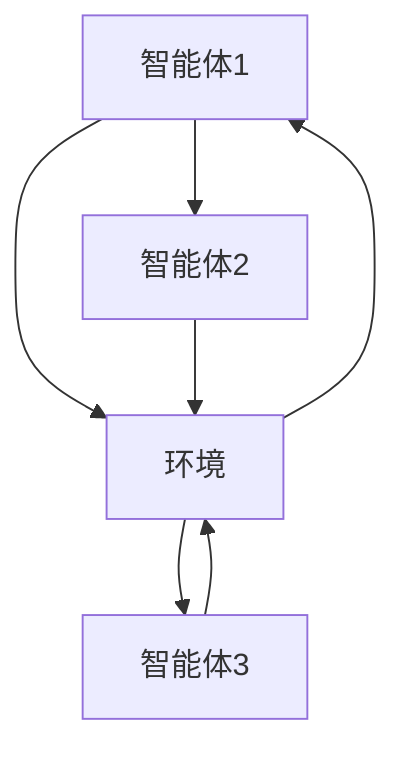
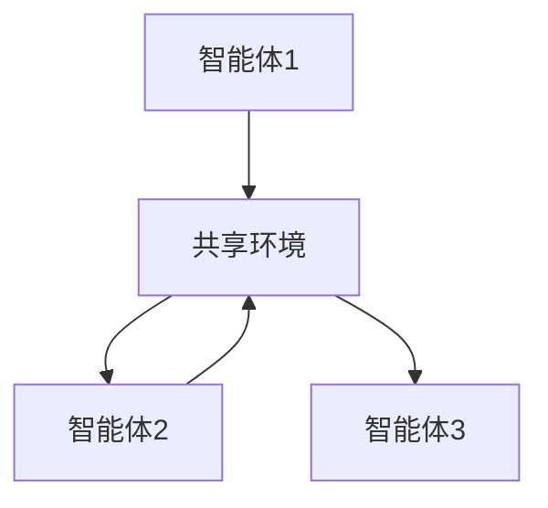
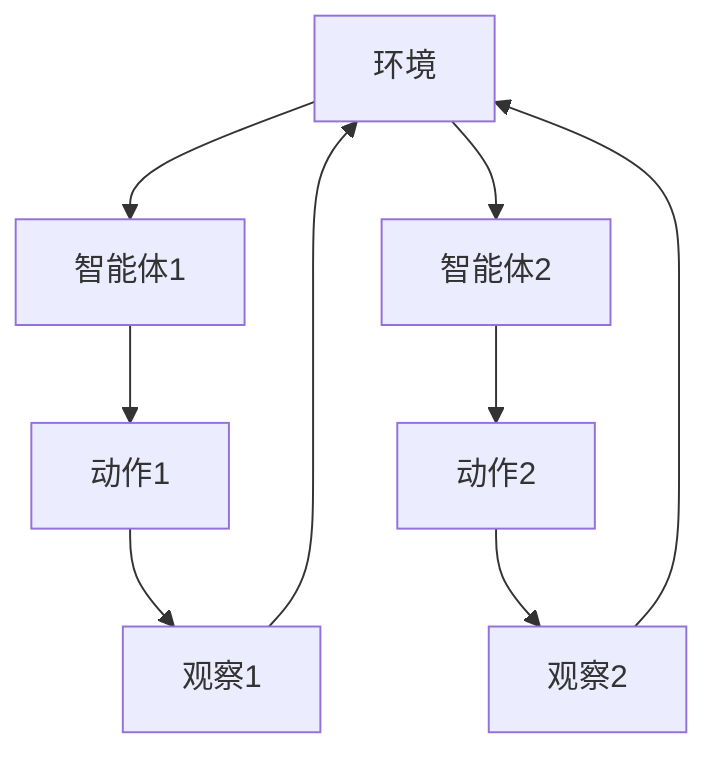

                 

### 文章标题

《多智能体强化学习(Multi-Agent Reinforcement Learning) - 原理与代码实例讲解》

### 文章关键词

多智能体强化学习，Multi-Agent Reinforcement Learning，强化学习，Reinforcement Learning，智能体，Agent，多智能体系统，Multi-Agent System

### 文章摘要

本文深入探讨多智能体强化学习的原理、实现和应用。首先，介绍了多智能体强化学习的核心概念和重要性，以及其发展历程。随后，阐述了多智能体系统的基本概念和通信机制，为后续内容的深入奠定了基础。接着，从强化学习的基础理论出发，逐步引入多智能体强化学习的基本模型和核心算法。本文还详细讲解了多智能体强化学习的数学基础，包括动态规划理论、马尔可夫决策过程和优化理论。随后，通过搭建环境、实现算法和实际案例，展示了多智能体强化学习的实现过程。最后，对多智能体强化学习的未来发展趋势和研究方向进行了展望，并提出了在实际应用中可能遇到的挑战及解决方案。本文旨在为读者提供一个全面而深入的多智能体强化学习教程，帮助读者掌握这一前沿技术。

## 第1章 引言与背景

### 1.1 多智能体强化学习的概念与重要性

多智能体强化学习（Multi-Agent Reinforcement Learning，简称MARL）是一种人工智能技术，旨在研究多个智能体在复杂环境中如何通过相互作用和自主学习，共同实现各自目标。与传统单智能体强化学习不同，MARL关注多个智能体之间的协同作用和策略优化，使得该领域在解决实际问题中具有更大的潜力和应用价值。

多智能体强化学习的核心概念包括智能体、环境和动作。智能体是指具有自主决策能力的个体，可以在环境中采取行动，并从环境中获取反馈。环境是一个包含所有可能状态的集合，智能体的行为和外部因素都会影响环境的状态变化。动作是智能体在特定状态下可选择的行为，其目的是最大化智能体的奖励。奖励是一个度量智能体行为优劣的数值，通常由环境给出。

多智能体强化学习的重要性体现在以下几个方面：

1. **复杂系统优化**：现实世界中的很多问题，如交通管理、物流配送、社交网络管理等，都涉及到多个智能体的协作和交互。通过MARL，我们可以让这些智能体在复杂的动态环境中自主学习和优化策略，从而提高系统的整体效率和性能。

2. **协同决策**：多个智能体共同完成任务时，往往需要协调各自的行动，以达到共同的目标。MARL提供了一种有效的协同决策方法，使得智能体能够在相互依赖和竞争的环境中进行有效的策略学习，实现双赢或多赢的结果。

3. **人工智能发展**：作为强化学习的一个重要分支，MARL在人工智能领域具有广泛的应用前景。通过MARL，我们可以探索更加复杂和真实的人工智能系统，推动人工智能技术的发展和进步。

4. **学术研究价值**：MARL涉及多个学科领域，包括计算机科学、控制理论、经济学、心理学等。对其进行深入研究和探索，不仅可以推动相关领域的发展，还可以为解决实际问题提供新的思路和方法。

### 1.2 多智能体强化学习的发展历程

多智能体强化学习的发展历程可以分为几个阶段，每个阶段都在理论和应用上取得了显著的成果。

1. **早期研究**（1980s - 1990s）：在早期研究阶段，学者们主要关注单个智能体在静态环境中的学习问题。随后，逐步将注意力转向多智能体系统，提出了诸如合作博弈和竞争博弈等基本模型。这一阶段的代表工作包括Lashkari和Iglecias的“多智能体马尔可夫决策过程”和Parisi和Sartorelli的“多智能体强化学习算法”。

2. **集中式策略学习**（2000s）：随着计算能力的提升和算法的进步，研究者开始探索如何通过集中式策略学习来实现多个智能体的协同。这一阶段的代表性工作包括Tesauro的“集中式策略迭代算法”和Barto和Szepesvári的“多智能体强化学习综述”。集中式策略学习将多个智能体的策略学习过程集中在一个统一的框架下，有效提高了策略优化的效率和效果。

3. **分布式策略学习**（2010s - 至今）：分布式策略学习是近年来多智能体强化学习的一个重要研究方向。该方向旨在研究如何在多个智能体之间分布式地学习策略，以适应大规模、实时和多变的复杂环境。代表性工作包括Liu和Mouret的“分布式多智能体强化学习算法”和Schulman等人提出的“分布式策略梯度算法”（DPPG）。分布式策略学习克服了集中式策略学习的计算和通信瓶颈，为MARL在实践中的应用提供了更广阔的前景。

4. **应用扩展**：随着MARL技术的不断成熟，其应用范围也在不断扩大。目前，MARL已应用于自动驾驶、多机器人协作、电子游戏、金融交易等多个领域，取得了显著的效果和成果。

### 1.3 本书的目标与结构

本书的目标是系统性地介绍多智能体强化学习的理论、方法和技术，帮助读者深入了解这一前沿领域，并掌握其基本原理和实践应用。具体目标包括：

1. **理解核心概念**：全面介绍多智能体强化学习的核心概念，包括智能体、环境和动作，以及奖励机制等。
2. **掌握基本模型**：详细讲解多智能体强化学习的基本模型，如合作博弈、竞争博弈、部分可观测性模型等，为后续内容的深入学习打下基础。
3. **学习核心算法**：深入探讨多智能体强化学习的核心算法，包括集中式策略学习算法和分布式策略学习算法，以及各种优化方法和改进策略。
4. **实践应用**：通过实际案例，展示多智能体强化学习在不同领域的应用，帮助读者将理论知识转化为实际应用能力。
5. **展望未来**：分析多智能体强化学习的未来发展趋势和研究方向，为读者提供继续深入研究和探索的指引。

本书的结构如下：

- **第1章 引言与背景**：介绍多智能体强化学习的概念、重要性、发展历程和本书的目标与结构。
- **第2章 多智能体系统基础**：讲解多智能体系统的基本概念、模型和通信机制。
- **第3章 强化学习基础**：介绍强化学习的基本概念、主要算法和评估与优化方法。
- **第4章 多智能体强化学习原理**：详细讲解多智能体强化学习的基本模型、核心算法和数学基础。
- **第5章 多智能体强化学习的实现**：介绍多智能体强化学习环境的搭建、算法实现和代码实例。
- **第6章 多智能体强化学习的应用**：展示多智能体强化学习在不同领域的应用案例。
- **第7章 总结与展望**：总结多智能体强化学习的主要内容和未来发展方向。

通过本书的阅读和学习，读者可以系统地掌握多智能体强化学习的理论、方法和实践应用，为在相关领域的深入研究和工作提供有力的支持。

### 第2章 多智能体系统基础

#### 2.1 多智能体系统的基本概念

多智能体系统（Multi-Agent System，MAS）是由多个智能体（Agent）组成的系统，这些智能体可以独立或协同地完成特定任务。在多智能体系统中，智能体是一个具有自主性、社会性、反应性和主动性的实体，能够感知环境、制定计划并采取行动。智能体的自主性意味着它们可以自主地决策和行动，不受外界直接控制；社会性则体现了智能体之间的相互依赖和协作；反应性指智能体能够实时响应环境变化；主动性则表明智能体具有目标驱动行为，能够主动寻求最佳行动方案。

多智能体系统的基本组成部分包括：

1. **智能体**：是系统的核心组成部分，具备自主决策、协作与交互能力。
2. **环境**：是智能体行动和决策的背景，包括物理环境、信息资源和约束条件。
3. **通信机制**：是智能体之间传递信息和协调行动的渠道，包括直接通信和间接通信。
4. **协同策略**：是智能体共同完成任务时所采用的合作方法与策略。

多智能体系统的基本概念可以通过一个简单的例子来说明。假设一个交通管理系统中的每个交通信号灯都是一个智能体，它们需要根据交通流量和交通规则协调工作，以实现交通流畅。每个信号灯可以感知周围的车流量、行人流量和道路容量，并根据这些信息自主调整信号灯的时长。通过通信机制，信号灯之间可以共享信息，从而实现全局最优的信号灯配时方案，减少交通拥堵。

#### 2.2 多智能体系统模型

多智能体系统模型是描述智能体、环境和通信机制的数学和逻辑框架。常见的多智能体系统模型包括分布式模型和集中式模型。

1. **分布式模型**：在分布式模型中，每个智能体拥有本地信息，通过局部策略实现决策，并通过通信机制与其他智能体交换信息。分布式模型的优点是计算效率和灵活性较高，适合大规模和动态环境。一个典型的分布式模型是马尔可夫决策过程（MDP）的扩展，每个智能体有自己的状态和动作空间，通过局部策略来实现优化。

   **数学模型**：

   - **状态空间 \( S \)**：所有可能状态组成的集合。
   - **动作空间 \( A \)**：每个智能体可采取的动作集合。
   - **局部策略 \( \pi_i(s) \)**：智能体 i 在状态 s 时选择动作的概率分布。
   - **转移概率 \( P(s'|s, a) \)**：智能体在状态 s 下采取动作 a 后转移到状态 s' 的概率。
   - **奖励函数 \( R_i(s, a) \)**：智能体 i 在状态 s 下采取动作 a 所获得的即时奖励。

2. **集中式模型**：在集中式模型中，所有智能体的信息集中在一个中央控制单元进行处理和决策。中央控制单元可以根据全局信息制定统一的策略，然后分发给各个智能体执行。集中式模型适用于信息完全共享和计算资源充足的情况，但可能会导致通信和计算瓶颈。

   **数学模型**：

   - **全局状态空间 \( S^* \)**：包含所有智能体状态的联合空间。
   - **全局动作空间 \( A^* \)**：所有智能体联合动作的集合。
   - **全局策略 \( \pi^*(s^*, a^*) \)**：全局策略，用于决定全局状态 s^* 下采取的联合动作 a^*。
   - **联合转移概率 \( P(s^{'*}|s^*, a^*) \)**：全局状态 s^* 下采取联合动作 a^* 后转移到全局状态 s^’* 的概率。
   - **联合奖励函数 \( R^*(s^*, a^*) \)**：全局状态 s^* 下采取联合动作 a^* 所获得的即时奖励。

**Mermaid流程图示例**：



#### 2.3 多智能体系统的通信机制

通信机制是多智能体系统能够协同工作的重要保障。根据通信的方式，通信机制可以分为以下几种：

1. **直接通信**：直接通信是指智能体通过直接的消息传递进行信息交换。每个智能体维护一个消息队列，可以发送和接收消息。直接通信的优点是实现简单，响应迅速，适合小规模和高度动态的环境。

2. **间接通信**：间接通信是指智能体通过共享环境或共享变量进行信息交换。智能体不需要直接通信，而是通过观察环境的变化来获取其他智能体的信息。间接通信的优点是减少了通信开销，适合大规模和复杂环境。

3. **广播通信**：广播通信是指智能体向系统中的所有其他智能体发送消息。这种通信方式适合信息共享和广播通知。

4. **选择通信**：选择通信是指智能体仅与特定的其他智能体进行通信。这种通信方式可以根据任务需求和智能体之间的协作关系进行灵活配置。

**通信机制的实现**：

- **消息传递**：消息传递是最常见的通信方式，智能体通过发送和接收消息来实现信息交换。消息可以是简单的数据结构，也可以是复杂的事件通知。

- **共享环境**：智能体通过观察环境状态来获取其他智能体的信息。共享环境可以是物理环境，也可以是虚拟环境。

- **共享变量**：智能体通过共享变量来交换信息。共享变量可以是全局变量，也可以是局部变量。

**示例**：



通过上述通信机制，智能体可以在复杂环境中实现高效的协同和交互，从而实现多智能体系统的整体目标。

### 第3章 强化学习基础

#### 3.1 强化学习的基本概念

强化学习（Reinforcement Learning，简称RL）是一种机器学习方法，通过智能体在环境中采取行动，并从环境中获取反馈（奖励或惩罚），逐渐学习到最优策略。与监督学习和无监督学习不同，强化学习关注的是通过试错（Trial and Error）和反馈（Feedback）来优化智能体的行为策略。

**强化学习的核心概念包括**：

1. **智能体（Agent）**：是执行行动并寻求目标的最大化回报的实体。
2. **环境（Environment）**：是智能体进行行动和决策的背景，提供当前状态和奖励。
3. **状态（State）**：是智能体在环境中的当前情况，通常用向量表示。
4. **动作（Action）**：是智能体在特定状态下可以采取的行为。
5. **奖励（Reward）**：是环境对智能体行为的即时反馈，用于评估行动的效果。
6. **策略（Policy）**：是从状态到动作的映射函数，描述智能体如何行动。

**强化学习的目标**是让智能体在给定环境中学习到一个最优策略，使得长期累积奖励最大化。通常，强化学习过程可以用以下数学模型来描述：

$$
Q(s, a) = \sum_{s'} P(s'|s, a) \cdot [R(s', a) + \gamma \cdot \max_{a'} Q(s', a')]
$$

其中，\( Q(s, a) \) 是状态-动作值函数，表示在状态 \( s \) 下采取动作 \( a \) 的期望回报；\( P(s'|s, a) \) 是状态转移概率；\( R(s', a) \) 是在状态 \( s' \) 下采取动作 \( a \) 所获得的即时奖励；\( \gamma \) 是折扣因子，用于平衡短期和长期奖励；\( \max_{a'} Q(s', a') \) 是在状态 \( s' \) 下采取最优动作的期望回报。

**强化学习与人类学习行为的相似性**：

- **目标导向**：智能体在强化学习中设定目标，并不断调整行为以实现目标。
- **试错**：智能体通过尝试不同的动作来探索环境，学习最优策略。
- **反馈**：智能体从环境中获取即时反馈（奖励或惩罚），用于调整行为。

#### 3.2 强化学习的主要算法

强化学习算法可以分为基于模型（Model-Based）和基于模型（Model-Free）两大类。基于模型的算法通过构建环境模型来预测状态转移和奖励，从而优化策略。基于模型的算法包括**策略迭代**和**值迭代**等方法。基于模型的算法的优点是能够更快速地收敛到最优策略，但缺点是需要构建复杂的模型，并且计算复杂度较高。

**策略迭代**算法的核心思想是迭代优化策略。具体步骤如下：

1. **初始化策略**：选择一个初始策略。
2. **评估当前策略**：计算当前策略的期望回报，得到策略的评估值。
3. **策略改进**：在当前策略的基础上，选择一个使期望回报最大化的策略。
4. **重复步骤2和3**，直到策略收敛到最优值。

**值迭代**算法通过逐步优化值函数来改进策略。具体步骤如下：

1. **初始化值函数**：选择一个初始值函数。
2. **迭代更新值函数**：使用贝尔曼方程（Bellman Equation）更新值函数：
   $$
   V(s) = \sum_{a} \pi(a|s) \cdot [R(s, a) + \gamma \cdot V(s')]
   $$
   其中，\( \pi(a|s) \) 是在状态 \( s \) 下采取动作 \( a \) 的概率。
3. **重复步骤2**，直到值函数收敛到最优值。

**模型-free算法**不需要构建环境模型，直接从经验数据中学习策略。常见的模型-free算法包括**Q学习**和**深度Q网络（DQN）**。

**Q学习**算法通过直接估计状态-动作值函数来优化策略。具体步骤如下：

1. **初始化Q值表**：选择一个初始Q值表。
2. **选择动作**：在当前状态下，选择一个使Q值最大的动作。
3. **更新Q值**：根据实际获得的奖励和下一状态，更新Q值：
   $$
   Q(s, a) = Q(s, a) + \alpha \cdot [R(s, a) + \gamma \cdot \max_{a'} Q(s', a') - Q(s, a)]
   $$
   其中，\( \alpha \) 是学习率。

**深度Q网络（DQN）**算法结合了深度学习和Q学习的优点。DQN使用深度神经网络来近似Q值函数，并通过经验回放（Experience Replay）和目标网络（Target Network）来提高训练稳定性和避免策略偏差。

**经验回放**：经验回放将过去的经验和状态-动作值对存储在经验池中，从经验池中随机抽样进行训练，以减少样本相关性和提高训练效果。

**目标网络**：目标网络是一个独立的神经网络，用于评估目标Q值。在每次更新策略时，同时更新当前网络和目标网络的权重，以防止网络过拟合。

**DQN算法步骤**：

1. **初始化**：初始化深度神经网络、经验池、目标网络和策略。
2. **选择动作**：使用当前策略选择动作。
3. **更新经验池**：将新的状态-动作值对加入经验池。
4. **随机抽样**：从经验池中随机抽样一个批次的经验数据。
5. **目标网络更新**：使用当前网络的预测值更新目标网络的权重。
6. **网络训练**：使用经验数据进行网络训练。
7. **策略更新**：使用训练后的网络更新策略。

通过上述算法，强化学习可以在复杂的动态环境中学习到最优策略，实现智能体的自主学习和行为优化。

#### 3.3 强化学习的评估与优化

**强化学习的评估**是判断智能体策略优劣的重要手段。常用的评估方法包括：

1. **累计奖励**：计算智能体在一段时间内获得的累计奖励，用于评估策略的长期效果。
2. **成功概率**：计算智能体完成任务的概率，用于评估策略的成功率。
3. **平均回报**：计算智能体在多次试验中的平均回报，用于评估策略的稳定性。

**强化学习的优化**旨在提高智能体的学习效率和收敛速度。以下是一些常用的优化方法：

1. **学习率调整**：通过动态调整学习率来平衡探索和利用。常用的方法包括线性衰减和指数衰减。
2. **梯度裁剪**：防止梯度爆炸或消失，确保训练的稳定性。梯度裁剪通过限制梯度的范数来实现。
3. **经验回放**：通过存储和重放过去的状态-动作值对，减少样本相关性，提高学习效果。
4. **目标网络**：通过定期更新目标网络的权重，避免策略偏差，提高训练的稳定性和收敛速度。

**总结**：强化学习是一种强大的机器学习方法，通过智能体在环境中的自主学习和策略优化，可以实现复杂任务的自动解决。掌握强化学习的基本概念和主要算法，对理解和应用这一技术至关重要。

### 第4章 多智能体强化学习原理

#### 4.1 多智能体强化学习的挑战与机遇

多智能体强化学习（MARL）作为强化学习的一个重要分支，旨在解决多个智能体在复杂环境中通过协作和交互实现共同目标的问题。然而，与单智能体强化学习相比，MARL面临更多的挑战和机遇。

**挑战**：

1. **复杂性**：多智能体系统中的交互和协作增加了问题的复杂性。每个智能体不仅要学习如何优化自身的行为策略，还要考虑其他智能体的行为和策略，这使得问题的求解变得更加困难。

2. **非平稳性**：多智能体系统中的状态和动作空间通常较大，且环境可能具有高度非平稳性。这意味着智能体需要快速适应环境变化，以保持有效的策略。

3. **通信延迟**：在实际应用中，智能体之间的通信可能存在延迟，这会影响策略的实时性和效果。如何在有限通信下实现高效协作是MARL的一个重要挑战。

4. **不确定性和竞争**：多智能体系统中的智能体可能存在不确定性和竞争关系。智能体在采取行动时，不仅要考虑自身利益，还要考虑其他智能体的行为和影响，这增加了策略优化的复杂性。

**机遇**：

1. **协同优化**：MARL通过多个智能体的协同工作，可以实现整体系统性能的优化。与单智能体系统相比，多智能体系统能够更好地应对复杂环境，实现更高的效率和性能。

2. **分布式计算**：MARL可以利用分布式计算技术，将复杂的计算任务分解到多个智能体上，提高计算效率和扩展性。

3. **多目标优化**：MARL允许智能体同时考虑多个目标，通过协作实现多目标的平衡和优化。这在许多实际应用中具有很大的价值，如资源分配、供应链优化等。

4. **人类行为模拟**：多智能体系统在很多方面与人类社会具有相似性。通过研究MARL，可以更好地模拟和理解人类社会行为，为解决复杂社会问题提供新的思路和方法。

**关键概念**：

1. **状态共享**：状态共享是指多个智能体共享对环境的感知和状态信息。通过状态共享，智能体可以更好地理解彼此的行为和策略，实现高效的协作。

2. **策略协调**：策略协调是指多个智能体通过协调各自的策略，实现共同目标的优化。策略协调可以是静态的，也可以是动态的，根据环境的变化进行调整。

3. **奖励分配**：奖励分配是指智能体之间根据各自的贡献和效果分配奖励。合理的奖励分配机制可以激励智能体的积极性和协作意愿，提高整体系统的效率。

#### 4.2 多智能体强化学习的基本模型

多智能体强化学习的基本模型主要包括合作博弈、竞争博弈和部分可观测性模型等。这些模型为智能体之间的协同和策略优化提供了不同的框架和方法。

1. **合作博弈**：合作博弈是指多个智能体共同协作，实现共同利益最大化的情况。在合作博弈中，智能体的目标是一致的，通过协调和合作，实现整体最优。

   **数学模型**：

   - **状态空间 \( S \)**：所有可能状态组成的集合。
   - **动作空间 \( A \)**：每个智能体可采取的动作集合。
   - **联合策略 \( \pi(s) \)**：所有智能体在状态 s 下采取的联合动作的概率分布。
   - **联合转移概率 \( P(s'|s, \pi) \)**：在状态 s 下采取联合动作 \(\pi\) 后转移到状态 \( s' \) 的概率。
   - **联合奖励函数 \( R(s, \pi) \)**：在状态 s 下采取联合动作 \(\pi\) 所获得的即时奖励。

   **合作博弈的核心思想**是最大化联合奖励。通过协同学习和策略优化，智能体可以找到最优的联合策略，实现共同利益的最大化。

2. **竞争博弈**：竞争博弈是指多个智能体之间存在竞争关系，各自追求自身利益最大化。在竞争博弈中，智能体的目标通常是相互冲突的，需要通过策略优化实现平衡。

   **数学模型**：

   - **状态空间 \( S \)**：所有可能状态组成的集合。
   - **动作空间 \( A \)**：每个智能体可采取的动作集合。
   - **策略 \( \pi_i(s) \)**：智能体 i 在状态 s 下选择动作的概率分布。
   - **转移概率 \( P(s'|s, \pi) \)**：在状态 s 下采取联合动作 \(\pi\) 后转移到状态 \( s' \) 的概率。
   - **奖励函数 \( R_i(s, a_i) \)**：智能体 i 在状态 s 下采取动作 \( a_i \) 所获得的即时奖励。

   **竞争博弈的核心思想**是最小化对手的收益，最大化自身的收益。通过策略优化，智能体可以在竞争环境中找到最优的平衡点。

3. **部分可观测性模型**：部分可观测性模型是指智能体无法完全观察到环境的状态，只能通过部分观测信息进行决策。这种情况下，智能体需要利用观测信息和奖励信号来学习最优策略。

   **数学模型**：

   - **状态空间 \( S \)**：所有可能状态组成的集合。
   - **动作空间 \( A \)**：每个智能体可采取的动作集合。
   - **观测空间 \( O \)**：智能体的观测信息空间。
   - **策略 \( \pi_i(o) \)**：智能体 i 在观测 \( o \) 下选择动作的概率分布。
   - **转移概率 \( P(o'|o, a_i) \)**：在观测 \( o \) 下采取动作 \( a_i \) 后观察到 \( o' \) 的概率。
   - **奖励函数 \( R_i(o, a_i) \)**：智能体 i 在观测 \( o \) 下采取动作 \( a_i \) 所获得的即时奖励。

   **部分可观测性模型的核心思想**是利用部分观测信息进行策略优化。通过观测信息和奖励信号，智能体可以逐渐学习到最优策略，即使在信息不完全的情况下也能实现有效的决策。

**Mermaid流程图示例**：



通过上述基本模型，多智能体强化学习可以针对不同的应用场景和问题进行策略优化和协同决策，实现智能体在复杂环境中的高效学习和合作。

#### 4.3 多智能体强化学习的核心算法

多智能体强化学习（MARL）的核心算法是实现多个智能体在复杂环境中协同决策和策略优化的关键。以下介绍几种常见的MARL算法，包括分布式策略学习算法和集中式策略学习算法，以及它们的工作原理和应用场景。

**分布式策略学习算法**

分布式策略学习算法（Distributed Policy Learning Algorithms）主要针对多个智能体在分布式环境中的协作学习问题。这些算法通常不需要智能体之间完全共享信息，而是通过局部信息交换和策略更新来实现协同学习。

1. **分布式Q-learning（DQ-learning）**：分布式Q-learning算法是Q-learning算法在多智能体环境下的扩展。每个智能体维护自己的Q值表，并通过局部策略选择动作。智能体之间通过通信机制交换Q值更新信息，以实现全局策略的优化。

   **工作原理**：

   - **初始化**：每个智能体初始化自己的Q值表。
   - **动作选择**：智能体根据当前状态和Q值表选择动作。
   - **执行动作**：智能体执行选择的动作，并观察环境的反馈。
   - **Q值更新**：智能体根据接收到的其他智能体的Q值更新自己的Q值表。
   - **重复**：重复上述过程，直到策略收敛。

   **应用场景**：分布式Q-learning算法适用于分布式环境中的协同任务，如多机器人协作、分布式资源分配等。

2. **分布式策略梯度算法（Distributed Policy Gradient Algorithms）**：分布式策略梯度算法通过梯度上升方法优化策略。每个智能体维护自己的策略参数，并通过局部策略梯度更新全局策略。

   **工作原理**：

   - **初始化**：每个智能体初始化自己的策略参数。
   - **动作选择**：智能体根据当前状态和策略参数选择动作。
   - **执行动作**：智能体执行选择的动作，并观察环境的反馈。
   - **策略梯度计算**：智能体根据回报计算局部策略梯度。
   - **策略参数更新**：智能体通过局部策略梯度更新自己的策略参数。
   - **重复**：重复上述过程，直到策略收敛。

   **应用场景**：分布式策略梯度算法适用于需要动态调整策略的应用场景，如自适应控制、动态资源分配等。

**集中式策略学习算法**

集中式策略学习算法（Centralized Policy Learning Algorithms）将多个智能体的策略学习过程集中在一个中央控制单元进行处理，通常需要完全共享智能体的状态信息。

1. **集中式Q-learning（CQ-learning）**：集中式Q-learning算法是Q-learning算法在多智能体环境下的集中式扩展。中央控制单元维护全局Q值表，并根据全局策略选择动作。

   **工作原理**：

   - **初始化**：中央控制单元初始化全局Q值表。
   - **状态选择**：中央控制单元根据当前全局状态选择动作。
   - **执行动作**：中央控制单元执行选择的动作，并观察环境的反馈。
   - **Q值更新**：中央控制单元根据全局状态和回报更新全局Q值表。
   - **策略更新**：中央控制单元根据全局Q值表更新全局策略。
   - **重复**：重复上述过程，直到策略收敛。

   **应用场景**：集中式Q-learning算法适用于信息完全共享和计算资源充足的应用场景，如自动驾驶、智能交通系统等。

2. **集中式策略梯度算法（CPG-learning）**：集中式策略梯度算法通过梯度上升方法优化全局策略。中央控制单元维护全局策略参数，并根据全局策略选择动作。

   **工作原理**：

   - **初始化**：中央控制单元初始化全局策略参数。
   - **动作选择**：中央控制单元根据当前全局状态和策略参数选择动作。
   - **执行动作**：中央控制单元执行选择的动作，并观察环境的反馈。
   - **策略梯度计算**：中央控制单元根据回报计算全局策略梯度。
   - **策略参数更新**：中央控制单元通过全局策略梯度更新全局策略参数。
   - **重复**：重复上述过程，直到策略收敛。

   **应用场景**：集中式策略梯度算法适用于需要全局协调和策略优化的应用场景，如多人游戏、多人合作任务等。

**核心算法比较**

- **计算复杂度**：分布式策略学习算法通常具有较低的通信和计算复杂度，适合大规模、分布式环境。集中式策略学习算法则需要更高的计算资源和通信带宽。
- **信息共享**：分布式策略学习算法不需要完全共享智能体的状态信息，可以减少信息冗余和通信开销。集中式策略学习算法需要完全共享智能体的状态信息，实现全局策略优化。
- **适用场景**：分布式策略学习算法适用于分布式环境中的协同任务，集中式策略学习算法适用于需要全局协调和策略优化的应用场景。

通过上述核心算法，多智能体强化学习可以实现智能体在复杂环境中的协同学习和策略优化，为解决复杂任务提供有效的解决方案。

### 第5章 多智能体强化学习的数学基础

#### 5.1 动态规划理论

动态规划（Dynamic Programming，简称DP）是一种解决序列决策问题的数学方法，其核心思想是将复杂的问题分解为若干个子问题，并通过子问题的最优解推导出原问题的最优解。在多智能体强化学习（MARL）中，动态规划理论提供了有效的策略优化框架。

**定义**：

动态规划将一个序列决策问题表示为一系列的状态、动作和奖励。每个状态表示系统在某个时间点的状态信息，每个动作是系统在当前状态下可以采取的行为，而奖励则是动作执行后系统的即时反馈。

**原理**：

动态规划基于以下原理：

1. **最优子结构**：问题的最优解可以通过子问题的最优解推导出来。
2. **重叠子问题**：不同子问题之间存在重叠，即多个子问题可能具有相同的子状态和子动作。
3. **状态转移方程**：通过状态转移方程描述状态和动作之间的关系。

**动态规划的基本步骤**：

1. **定义状态和状态空间**：确定问题中的状态及其集合。
2. **定义动作和动作空间**：确定在各个状态下可以采取的动作集合。
3. **定义奖励函数**：确定系统在执行动作后获得的即时奖励。
4. **定义状态转移方程**：确定在给定当前状态和动作下，系统转移到下一状态的概率和奖励。
5. **确定最优策略**：通过递归关系和状态转移方程，计算每个状态下的最优动作。

**状态-动作值函数**：

状态-动作值函数（State-Action Value Function）是动态规划中的一个关键概念，表示在特定状态下采取特定动作的长期期望回报。数学表示为：

$$
V^*(s, a) = \sum_{s'} P(s'|s, a) \cdot [R(s', a) + \gamma \cdot V^*(s')]
$$

其中，\( P(s'|s, a) \) 是状态转移概率，\( R(s', a) \) 是即时奖励，\( \gamma \) 是折扣因子。

**贝尔曼方程**：

贝尔曼方程（Bellman Equation）是动态规划的核心方程，用于递归求解状态-动作值函数。其数学表示为：

$$
V^*(s) = \max_{a} [R(s, a) + \gamma \cdot \sum_{s'} P(s'|s, a) \cdot V^*(s')]
$$

通过贝尔曼方程，可以迭代计算每个状态下的最优动作值，从而得到最优策略。

**动态规划在MARL中的应用**：

动态规划在MARL中的应用主要包括以下两个方面：

1. **集中式策略学习**：通过动态规划，中央控制单元可以计算全局状态下的最优策略，实现多个智能体的协同优化。
2. **分布式策略学习**：每个智能体可以根据局部信息更新状态-动作值函数，实现分布式策略学习。

#### 5.2 马尔可夫决策过程

马尔可夫决策过程（Markov Decision Process，简称MDP）是强化学习中的核心模型，用于描述智能体在不确定环境中进行决策的过程。在MDP中，智能体需要通过学习最优策略来最大化长期累积奖励。

**定义**：

马尔可夫决策过程由以下五个元素组成：

1. **状态空间 \( S \)**：系统所有可能状态的集合。
2. **动作空间 \( A \)**：智能体在各个状态下可以采取的动作集合。
3. **状态转移概率 \( P(s'|s, a) \)**：在当前状态 s 下采取动作 a 后，系统转移到下一状态 s' 的概率。
4. **奖励函数 \( R(s, a) \)**：在当前状态 s 下采取动作 a 所获得的即时奖励。
5. **策略 \( \pi(a|s) \)**：智能体在各个状态下采取动作的概率分布。

**MDP的基本方程**：

MDP可以通过以下方程描述：

$$
\sum_{a} \pi(a|s) \cdot P(s'|s, a) \cdot R(s', a) + \gamma \cdot \sum_{a'} \pi(a'|s') \cdot V^*(s')
$$

其中，\( V^*(s) \) 是状态-动作值函数，表示在状态 s 下采取最优动作的长期期望回报。

**贝尔曼方程**：

在MDP中，贝尔曼方程用于递归计算状态-动作值函数：

$$
V^*(s) = \sum_{a} \pi(a|s) \cdot P(s'|s, a) \cdot [R(s', a) + \gamma \cdot V^*(s')]
$$

通过贝尔曼方程，可以逐步计算每个状态下的最优动作值，从而得到最优策略。

**MDP在MARL中的应用**：

在MARL中，MDP可以扩展为多智能体马尔可夫决策过程（Multi-Agent MDP，简称MMDP）。MMDP将多个智能体纳入同一个决策框架，通过联合策略优化实现协同学习。

1. **联合状态和动作空间**：在MMDP中，状态空间和动作空间扩展为多个智能体的联合状态和动作空间。
2. **联合状态转移概率和奖励函数**：在MMDP中，状态转移概率和奖励函数是多个智能体联合决策的结果。
3. **联合策略**：在MMDP中，智能体通过联合策略实现协同决策，最大化整体回报。

#### 5.3 优化理论

优化理论是解决最优化问题的一套数学方法，其在多智能体强化学习（MARL）中具有重要应用。优化理论通过建立目标函数和约束条件，求解最优解，从而实现智能体的协同学习和策略优化。

**定义**：

优化理论中的最优化问题可以表示为：

$$
\min_{x} f(x) \quad \text{或} \quad \max_{x} f(x)
$$

其中，\( f(x) \) 是目标函数，\( x \) 是决策变量，需要求解最优解。

**优化方法**：

1. **梯度下降法**：梯度下降法是一种基于目标函数梯度的优化方法。通过不断更新决策变量，使其沿着目标函数的梯度方向移动，以逐步逼近最优解。

   $$ 
   x_{t+1} = x_t - \alpha \cdot \nabla f(x_t)
   $$

   其中，\( \alpha \) 是学习率，\( \nabla f(x_t) \) 是目标函数在 \( x_t \) 点的梯度。

2. **牛顿法**：牛顿法是一种基于目标函数二阶导数的优化方法。通过求解目标函数的Hessian矩阵的逆矩阵，得到最优解。

   $$ 
   x_{t+1} = x_t - H^{-1} \cdot \nabla^2 f(x_t)
   $$

   其中，\( H \) 是目标函数的Hessian矩阵。

3. **拉格朗日乘数法**：拉格朗日乘数法是一种解决约束优化问题的方法。通过引入拉格朗日乘子，将约束条件转化为无约束问题，然后使用梯度下降法或牛顿法求解。

   $$ 
   L(x, \lambda) = f(x) + \lambda \cdot g(x)
   $$

   其中，\( \lambda \) 是拉格朗日乘子，\( g(x) \) 是约束条件。

**优化理论在MARL中的应用**：

在MARL中，优化理论广泛应用于策略优化和资源分配等问题。

1. **策略优化**：通过建立目标函数，如累积回报或期望回报，使用梯度下降法或牛顿法优化智能体的策略参数，实现最优策略的求解。

2. **资源分配**：通过建立资源分配模型，如线性规划或整数规划，使用拉格朗日乘数法等优化方法，实现资源的最优分配。

3. **多目标优化**：在多智能体系统中，可能存在多个目标需要优化。通过建立多目标优化模型，使用优化算法求解多个目标的平衡解。

通过优化理论的应用，多智能体强化学习可以更有效地实现策略优化和资源分配，提高系统的整体性能和效率。

### 第6章 多智能体强化学习的实现

#### 6.1 多智能体强化学习环境搭建

要实现多智能体强化学习（MARL）项目，首先需要搭建一个合适的多智能体环境。环境是智能体进行学习和决策的场所，它定义了智能体的状态空间、动作空间和奖励机制。以下是搭建MARL环境的基本步骤：

1. **选择环境框架**：首先，选择一个适合的多智能体强化学习环境框架，如`Gym`、`Mujoco`或`PyTorch`。这些框架提供了丰富的预定义环境，支持多种类型的智能体和任务。

2. **定义智能体和状态空间**：根据任务需求，定义智能体的数量和类型。每个智能体需要有一个唯一的标识符和相应的状态空间。状态空间可以是一个离散集合或连续区间，取决于问题的复杂度。

3. **定义动作空间**：为每个智能体定义动作空间，即智能体可以采取的所有合法动作。动作空间可以是离散的或连续的，通常使用一组数值或枚举类型表示。

4. **实现奖励函数**：奖励函数是环境的重要组成部分，它根据智能体的动作和状态，计算即时奖励。奖励函数的设计取决于任务目标，可以是简单的数值，也可以是复杂的函数。

5. **构建交互机制**：智能体之间的交互机制决定了它们如何共享信息和协调行动。在多智能体环境中，可以通过直接通信、间接通信或共享状态来实现交互。

以下是一个简单的Python代码示例，展示了如何使用`Gym`框架搭建一个简单的多智能体环境：

```python
import gym
from gym import spaces

# 创建环境
env = gym.make('MultiAgentGrid-v0')

# 获取智能体数量
num_agents = env.num_agents

# 定义动作空间
action_space = [spaces.Discrete(4) for _ in range(num_agents)]  # 假设每个智能体有4个动作

# 定义状态空间
state_space = [spaces.Box(low=0, high=1, shape=(env.observation_space.n,), dtype=env.observation_space.dtype) for _ in range(num_agents)]

# 实例化智能体
agents = [Agent(state_space[i], action_space[i]) for i in range(num_agents)]

# 运行环境
for episode in range(total_episodes):
    state = env.reset()
    done = False
    
    while not done:
        # 智能体选择动作
        actions = [agent.select_action(state) for agent in agents]

        # 执行动作
        next_state, reward, done, info = env.step(actions)

        # 更新智能体状态
        state = next_state

        # 更新智能体策略
        for i, agent in enumerate(agents):
            agent.update_policy(state, actions, reward, next_state)

    # 打印回合结果
    print(f"Episode {episode}: Total Reward = {env.get_total_reward()}")

# 关闭环境
env.close()
```

通过上述步骤，我们可以搭建一个简单的多智能体强化学习环境。在实际项目中，可以根据任务需求定制环境，实现更复杂的智能体交互和策略优化。

#### 6.2 多智能体强化学习算法实现

在多智能体强化学习（MARL）中，算法实现是关键的一步。本节将介绍如何使用Python实现两种常见的MARL算法：分布式Q-learning和集中式策略学习。这些算法在实现时需要考虑通信机制、策略更新和优化方法。

**分布式Q-learning算法**

分布式Q-learning算法是一种分布式策略学习算法，每个智能体维护自己的Q值表，并通过局部策略选择动作。以下是分布式Q-learning算法的Python实现：

```python
import numpy as np

class DistributedQLearning:
    def __init__(self, state_space, action_space, alpha=0.1, gamma=0.9, epsilon=0.1):
        self.state_space = state_space
        self.action_space = action_space
        self.alpha = alpha
        self.gamma = gamma
        self.epsilon = epsilon
        self.Q = [np.zeros((state_space.n, action_space.n)) for _ in range(len(state_space))]

    def select_action(self, state):
        if np.random.rand() < self.epsilon:
            return self.action_space.sample()  # 探索
        else:
            return np.argmax(self.Q[state])  # 利用

    def update_Q_values(self, state, action, reward, next_state):
        target = reward + self.gamma * np.max(self.Q[next_state])
        self.Q[state][action] += self.alpha * (target - self.Q[state][action])

    def train(self, num_episodes, num_steps):
        for episode in range(num_episodes):
            state = self.env.reset()
            done = False
            
            while not done:
                action = self.select_action(state)
                next_state, reward, done, _ = self.env.step(action)
                self.update_Q_values(state, action, reward, next_state)
                state = next_state

# 示例使用
state_space = spaces.Box(low=0, high=1, shape=(3,), dtype=np.float32)
action_space = spaces.Discrete(2)
agent = DistributedQLearning(state_space, action_space)
agent.train(num_episodes=1000, num_steps=100)
```

**集中式策略学习算法**

集中式策略学习算法（如集中式Q-learning和集中式策略梯度算法）需要将所有智能体的状态信息传递给中央控制单元，进行全局策略优化。以下是集中式策略学习算法的Python实现：

```python
import numpy as np

class CentralizedQLearning:
    def __init__(self, state_space, action_space, alpha=0.1, gamma=0.9):
        self.state_space = state_space
        self.action_space = action_space
        self.alpha = alpha
        self.gamma = gamma
        self.Q = np.zeros((state_space.n, action_space.n))

    def select_action(self, state):
        return np.argmax(self.Q[state])

    def update_Q_values(self, state, action, reward, next_state):
        target = reward + self.gamma * np.max(self.Q[next_state])
        self.Q[state] += self.alpha * (target - self.Q[state][action])

    def train(self, num_episodes, num_steps):
        for episode in range(num_episodes):
            state = self.env.reset()
            done = False
            
            while not done:
                action = self.select_action(state)
                next_state, reward, done, _ = self.env.step(action)
                self.update_Q_values(state, action, reward, next_state)
                state = next_state

# 示例使用
state_space = spaces.Box(low=0, high=1, shape=(3,), dtype=np.float32)
action_space = spaces.Discrete(2)
agent = CentralizedQLearning(state_space, action_space)
agent.train(num_episodes=1000, num_steps=100)
```

通过上述实现，我们可以训练分布式Q-learning和集中式策略学习算法，从而让智能体在环境中学习和优化策略。

#### 6.3 多智能体强化学习代码实例

为了更直观地理解多智能体强化学习的实现过程，以下将通过一个简单的例子来展示如何使用Python和`Gym`框架实现一个简单的多智能体强化学习环境。这个例子是一个“网格世界”环境，其中多个智能体需要在网格中移动，以收集资源并避免障碍物。

**环境搭建**：

首先，我们需要安装`gym`库，并创建一个简单的多智能体环境。

```python
import gym
import numpy as np

# 创建环境
env = gym.make('MultiAgentGrid-v0')

# 获取环境信息
num_agents = env.num_agents
num_states = env.observation_space.n
num_actions = env.action_space.n

print(f"Number of agents: {num_agents}")
print(f"Number of states: {num_states}")
print(f"Number of actions: {num_actions}")

# 初始化智能体
agents = [DQN-Agent(num_states, num_actions) for _ in range(num_agents)]

# 运行环境
for episode in range(1000):
    state = env.reset()
    done = False

    while not done:
        # 智能体选择动作
        actions = [agent.select_action(state) for agent in agents]

        # 执行动作
        next_state, reward, done, _ = env.step(actions)

        # 更新智能体状态和策略
        for i, agent in enumerate(agents):
            agent.update_Q_values(state, actions, reward, next_state)

        state = next_state

    # 打印回合结果
    print(f"Episode {episode}: Total Reward = {env.get_total_reward()}")

# 关闭环境
env.close()
```

**智能体实现**：

接下来，我们实现一个简单的DQN（深度Q网络）智能体，用于学习状态-动作值函数。

```python
import numpy as np
import tensorflow as tf

class DQN_Agent:
    def __init__(self, state_space, action_space, epsilon=0.1, learning_rate=0.01, gamma=0.99):
        self.state_space = state_space
        self.action_space = action_space
        self.epsilon = epsilon
        self.learning_rate = learning_rate
        self.gamma = gamma

        # 创建DQN模型
        self.model = self._build_model()
        self.target_model = self._build_model()
        self.target_model.set_weights(self.model.get_weights())

        # 初始化经验回放
        self.memory = []

    def _build_model(self):
        model = tf.keras.Sequential([
            tf.keras.layers.Dense(64, activation='relu', input_shape=(self.state_space.n,)),
            tf.keras.layers.Dense(64, activation='relu'),
            tf.keras.layers.Dense(self.action_space.n, activation='linear')
        ])
        model.compile(optimizer=tf.keras.optimizers.Adam(learning_rate=self.learning_rate), loss='mse')
        return model

    def select_action(self, state):
        if np.random.rand() < self.epsilon:
            return self.action_space.sample()  # 探索
        else:
            state = np.reshape(state, (1, -1))
            q_values = self.model.predict(state)
            return np.argmax(q_values)

    def update_Q_values(self, state, action, reward, next_state):
        state = np.reshape(state, (1, -1))
        next_state = np.reshape(next_state, (1, -1))
        action = np.reshape(action, (1,))

        target = reward + self.gamma * np.max(self.target_model.predict(next_state))
        target_f = self.model.predict(state)
        target_f[0][action] = target

        self.model.fit(state, target_f, epochs=1, verbose=0)

        # 更新目标网络
        if len(self.memory) % 1000 == 0:
            self.target_model.set_weights(self.model.get_weights())

# 示例使用
state_space = spaces.Box(low=0, high=1, shape=(3,), dtype=np.float32)
action_space = spaces.Discrete(4)
agent = DQN_Agent(state_space, action_space)
```

通过上述代码，我们搭建了一个简单的多智能体强化学习环境，并实现了DQN智能体。智能体通过经验回放和目标网络，不断更新状态-动作值函数，从而学习到最优策略。

**开发环境搭建**：

为了运行上述代码，需要在开发环境中安装以下库：

- `gym`: 用于创建多智能体环境。
- `numpy`: 用于数学运算。
- `tensorflow`: 用于构建和训练深度神经网络。

可以使用以下命令安装这些库：

```bash
pip install gym numpy tensorflow
```

**代码解读与分析**：

在上面的代码中，我们首先创建了一个简单的多智能体环境，并定义了智能体的数量、状态空间和动作空间。接着，我们实例化了多个DQN智能体，并使用这些智能体在环境中进行学习。

- `DQN_Agent`类：实现了DQN算法的核心功能，包括模型构建、动作选择和策略更新。
- `_build_model`方法：定义了DQN模型的架构，使用了两个全连接层，最后一层输出每个动作的Q值。
- `select_action`方法：实现了ε-贪心策略，用于选择动作。当探索概率大于ε时，智能体会随机选择动作；否则，智能体会选择Q值最大的动作。
- `update_Q_values`方法：更新了状态-动作值函数。使用经验回放和目标网络，智能体通过训练模型来优化策略。

通过上述代码和解析，我们可以理解多智能体强化学习环境的搭建过程，以及如何使用DQN算法进行智能体训练。在实际项目中，可以根据具体需求对环境、智能体算法进行定制和优化。

### 第7章 多智能体强化学习的应用案例

#### 7.1 自动驾驶中的多智能体强化学习

自动驾驶领域是多智能体强化学习（MARL）的重要应用场景之一。自动驾驶系统通常由多个智能体组成，如车辆、行人、自行车等，这些智能体在复杂交通环境中需要实时交互和协同，以确保行车安全、效率和环境友好。

**应用场景**：

- **车辆协同控制**：在高速公路和城市道路中，车辆需要协同行驶，避免碰撞，同时保持车距和流量。
- **行人检测与避让**：自动驾驶车辆需要识别行人，并在必要时进行避让，确保行人安全。
- **多车路径规划**：在交通拥堵或突发事件时，自动驾驶车辆需要优化行驶路径，减少延迟和油耗。

**挑战**：

1. **不确定性**：自动驾驶系统面临各种不确定性，如车辆突发故障、行人意外行为等，需要智能体具备强大的适应能力。
2. **计算资源**：在实时环境中，智能体需要快速决策和响应，这要求算法具有高效的计算性能。
3. **通信延迟**：智能体之间的通信延迟会影响决策效果，特别是在高速场景中。

**解决方案**：

1. **分布式策略学习**：通过分布式策略学习算法，如DQN和DDPG，智能体可以在有限通信下实现协同决策，提高系统效率。
2. **经验回放**：使用经验回放技术，智能体可以存储和重放历史交互数据，减少数据相关性和增强学习效果。
3. **多模态传感器融合**：结合多模态传感器数据，如摄像头、雷达和激光雷达，智能体可以更准确地感知环境，提高决策精度。

**案例**：

- **Waymo自动驾驶系统**：谷歌旗下的Waymo采用多智能体强化学习技术，实现了高效的自动驾驶。Waymo系统通过多个传感器收集数据，使用DQN算法训练智能体，实现车辆之间的协同控制和路径规划。
- **NVIDIA Drive平台**：NVIDIA的Drive平台利用多智能体强化学习技术，为自动驾驶车辆提供高效的决策支持。通过分布式策略学习和多模态传感器数据融合，NVIDIA Drive实现了低延迟、高精度的实时决策。

#### 7.2 游戏中的多智能体强化学习

电子游戏是另一个广泛应用的MARL场景。在多人游戏中，多个智能体（玩家或NPC）需要实时交互，制定策略和战术，以实现游戏目标。MARL技术在游戏中可以用于增强人工智能对手的智能度和互动性。

**应用场景**：

- **多人策略游戏**：如《星际争霸》、《魔兽世界》等，多个玩家需要协同或对抗，制定策略和战术。
- **竞技游戏**：如《DOTA2》、《英雄联盟》等，智能体（玩家或AI）需要实时决策，以实现团队协作和对抗。
- **单机游戏**：如《模拟人生》等，游戏中的NPC使用MARL算法进行决策，增强游戏的互动性和趣味性。

**挑战**：

1. **复杂度**：多人游戏中的智能体数量和交互复杂度较高，需要高效的学习算法和策略优化方法。
2. **平衡性**：游戏设计需要确保不同智能体之间的平衡，避免一方过于强大或弱小。
3. **计算资源**：实时交互和决策对计算资源有较高要求，特别是在高分辨率、高帧率的场景中。

**解决方案**：

1. **集中式策略学习**：通过集中式策略学习算法，如CQL和MADDPG，智能体可以在中央控制单元下进行全局策略优化，提高系统效率。
2. **多任务学习**：通过多任务学习技术，智能体可以在同一模型中同时学习多个任务，提高决策精度。
3. **强化学习与博弈论结合**：结合强化学习和博弈论，智能体可以更好地应对复杂策略和战术变化。

**案例**：

- **OpenAI Five**：OpenAI开发的《DOTA2》AI团队OpenAI Five，采用MARL技术，实现了人类级别的游戏水平。通过集中式策略学习和多任务学习，OpenAI Five在多个对战中击败了顶级职业选手。
- **DeepMind的《星际争霸》AI**：DeepMind开发的《星际争霸》AI使用MARL技术，通过分布式策略学习算法和经验回放，实现了高效的决策和战术规划，在多个模拟比赛中表现出色。

#### 7.3 社交网络中的多智能体强化学习

社交网络是一个典型的多智能体系统，用户、内容、平台等多个实体在复杂网络中进行交互，形成了一个动态的社交生态系统。多智能体强化学习技术在社交网络中可以用于优化用户推荐、广告投放、社区管理等。

**应用场景**：

- **用户推荐**：通过多智能体强化学习，平台可以根据用户行为数据，为用户提供个性化的内容推荐。
- **广告投放**：在广告投放中，多智能体强化学习可以优化广告投放策略，提高广告效果和用户满意度。
- **社区管理**：社交网络平台可以使用MARL技术，管理社区中的用户行为和互动，维护社区秩序。

**挑战**：

1. **数据隐私**：社交网络中用户数据隐私保护是一个重要问题，需要平衡用户隐私和数据分析的需求。
2. **动态性**：社交网络环境高度动态，用户行为和内容不断变化，需要智能体具备较强的适应能力。
3. **计算效率**：大规模社交网络中的数据处理和分析对计算资源有较高要求，需要高效的学习算法和优化方法。

**解决方案**：

1. **分布式计算**：通过分布式计算技术，将复杂的计算任务分解到多个智能体上，提高系统效率和扩展性。
2. **联邦学习**：在保护用户隐私的同时，联邦学习技术可以在多个节点上进行联合学习，提高模型的泛化能力。
3. **多任务学习**：通过多任务学习技术，智能体可以同时处理多个任务，提高决策效率和效果。

**案例**：

- **Facebook的广告推荐系统**：Facebook使用多智能体强化学习技术，优化广告投放策略，提高了广告效果和用户满意度。通过分布式策略学习和多任务学习，Facebook的广告推荐系统能够在动态环境中高效运作。
- **Reddit的社区管理**：Reddit使用MARL技术，管理社区中的用户行为和内容互动。通过经验回放和分布式计算，Reddit能够实时识别和管理违规行为，维护社区秩序。

通过上述应用案例，可以看出多智能体强化学习在自动驾驶、游戏和社交网络等多个领域的广泛应用，为这些领域带来了新的技术突破和应用价值。

### 第8章 总结与展望

#### 8.1 多智能体强化学习的未来发展趋势

多智能体强化学习（MARL）作为人工智能领域的一个重要分支，正呈现出快速发展的趋势。未来，MARL将在以下几个方面取得重要突破：

1. **算法优化**：随着计算能力的提升和算法的创新，MARL算法的效率将进一步提高。分布式计算、联邦学习和强化学习与博弈论的结合等新技术将推动MARL算法的优化和发展。

2. **应用拓展**：MARL的应用领域将不断拓展，从传统的自动驾驶、电子游戏扩展到更多的领域，如智能制造、智慧城市和社交网络等，实现更广泛的智能化应用。

3. **多模态感知**：未来的MARL系统将结合多模态感知技术，如计算机视觉、自然语言处理和传感器融合，实现更加精准和高效的环境感知和决策。

4. **强化学习与物理模拟的结合**：通过将强化学习与物理模拟相结合，MARL可以更好地处理复杂动态环境中的物理约束和不确定性问题，提高智能体的适应能力和决策水平。

#### 8.2 多智能体强化学习的研究方向

针对未来的发展，MARL的研究方向可以集中在以下几个方面：

1. **分布式策略学习**：探索更高效的分布式策略学习算法，减少通信开销和计算复杂度，提高智能体之间的协作效率。

2. **联邦学习与隐私保护**：研究如何在保证数据隐私的同时，实现智能体之间的联合学习和策略优化。

3. **动态环境中的鲁棒性**：研究如何使智能体在动态变化和不确定性较高的环境中保持鲁棒性，提高智能体的适应能力和决策稳定性。

4. **多智能体交互机制**：探索更有效的智能体交互机制，如基于博弈论的决策框架和动态联盟形成方法，实现更高效的协同和合作。

5. **多任务学习与多目标优化**：研究如何同时处理多个任务和优化多个目标，实现智能体在复杂环境中的多目标决策。

#### 8.3 多智能体强化学习在实际应用中的挑战与解决方案

尽管MARL在理论研究和应用实践中取得了显著成果，但仍面临一系列挑战：

1. **计算资源与通信开销**：大规模智能体系统需要大量的计算资源和高效的通信机制，如何在保证实时性和高效性的同时优化计算资源分配和通信策略是关键问题。

2. **环境建模与不确定性处理**：动态复杂环境中的不确定性是MARL面临的重要挑战，如何准确建模环境和处理不确定性问题是当前研究的热点。

3. **数据隐私与安全**：在多智能体系统中，用户数据隐私保护和系统安全性至关重要，如何在保证数据隐私的同时实现高效的数据分析和策略优化是一个亟待解决的问题。

4. **理论验证与实验验证**：虽然已有大量关于MARL的理论研究，但在实际应用中，如何验证算法的有效性和可靠性仍需进一步探索。

**解决方案**：

1. **分布式计算与联邦学习**：利用分布式计算和联邦学习技术，将复杂的计算任务分解到多个智能体上，实现高效的资源利用和隐私保护。

2. **多模态感知与不确定性处理**：结合多模态感知技术，如计算机视觉、自然语言处理和传感器融合，提高环境建模和不确定性处理的精度和效率。

3. **安全机制与隐私保护**：引入安全机制，如加密、匿名化和差分隐私，保障用户数据的安全和隐私。

4. **理论与实验相结合**：通过理论验证和实验验证相结合，提高MARL算法在实际应用中的效果和可靠性。

总之，多智能体强化学习作为人工智能领域的重要方向，具有广阔的应用前景和巨大的发展潜力。未来，通过不断的理论研究和技术创新，MARL将在更多领域实现突破，为智能系统的协同优化和高效决策提供强有力的支持。

