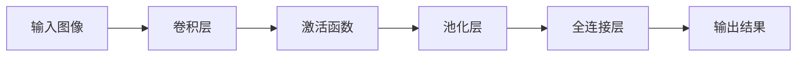
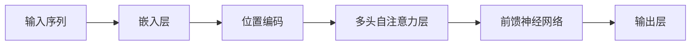
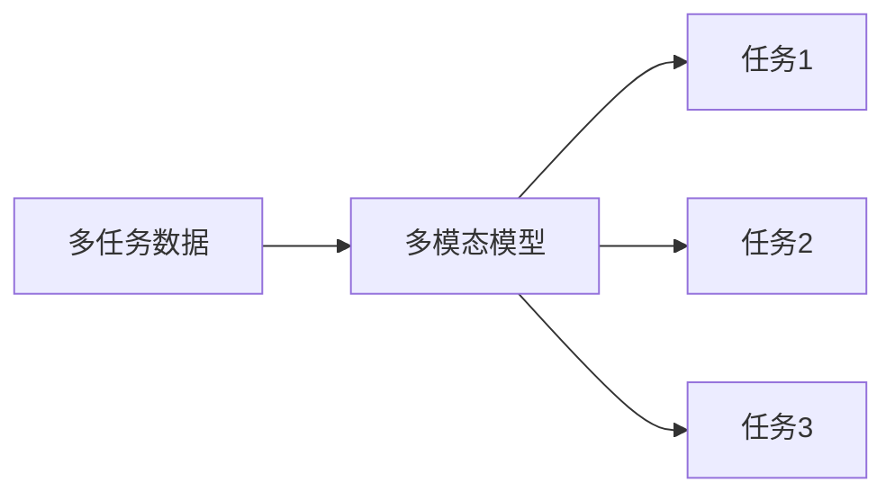

                 

# 文章标题

<此处输入文章标题>

> 关键词：<此处列出文章的5-7个核心关键词>

> 摘要：<此处给出文章的核心内容和主题思想>

---

## 引言

在当今数字化时代，人工智能技术正以前所未有的速度发展，而多模态大模型作为其重要分支，正逐渐成为各行业研究和应用的热点。多模态大模型不仅能够处理多种类型的数据，如文本、图像、声音等，还能够将它们进行整合，以实现更全面、准确的信息处理。本文将围绕多模态大模型的技术原理、实战案例以及在软件研发中的应用展开讨论，旨在为读者提供全面、深入的了解。

本文结构如下：首先，我们将对多模态大模型进行概述，包括其概念、发展历程和应用领域；接着，深入探讨多模态大模型的技术原理，包括数据处理方法、核心算法和训练方法；随后，通过具体的项目实战案例，展示多模态大模型的应用效果；最后，分析多模态大模型在软件研发中的应用，并探讨其在未来人工智能领域的挑战与前景。通过本文的阅读，读者将对多模态大模型有一个系统、全面的认识。

### 《多模态大模型：技术原理与实战 代码大语言模型为软件研发带来的机遇与挑战》目录大纲

#### 第一部分：多模态大模型概述

- **第1章：多模态大模型基础**
  - 1.1 多模态大模型的概念
  - 1.2 多模态大模型的发展历程
  - 1.3 多模态大模型的应用领域

#### 第二部分：多模态大模型技术原理

- **第2章：多模态大模型的核心算法**
  - 2.1 多模态数据的处理方法
  - 2.2 多模态深度学习模型
  - 2.3 多模态大模型的训练方法

- **第3章：多模态大模型的数学原理**
  - 3.1 多模态数据的数学表示
  - 3.2 多模态深度学习模型的数学公式
  - 3.3 多模态大模型的关键数学公式

#### 第三部分：多模态大模型项目实战

- **第4章：多模态大模型应用案例**
  - 4.1 文本与图像生成
  - 4.2 多模态语音识别
  - 4.3 多模态情感分析

- **第5章：多模态大模型在软件研发中的应用**
  - 5.1 软件需求分析与设计
  - 5.2 软件测试与优化

#### 第四部分：多模态大模型在人工智能领域的挑战与展望

- **第6章：多模态大模型在人工智能领域的挑战与展望**
  - 6.1 技术挑战
  - 6.2 应用前景

#### 附录

- **附录A：多模态大模型开发工具与资源**

---

通过本文的阅读，我们将详细了解多模态大模型的技术原理和应用实践，为未来的研究和开发提供指导。接下来，我们将首先对多模态大模型进行概述，以便为后续的深入探讨奠定基础。

## 第一部分：多模态大模型概述

### 第1章：多模态大模型基础

#### 1.1 多模态大模型的概念

多模态大模型（Multimodal Large Models）是指能够处理多种类型数据（如文本、图像、声音等）的深度学习模型。与传统的单模态模型相比，多模态大模型具有以下几个显著特点：

1. **集成多种类型数据**：多模态大模型能够同时处理文本、图像、声音等多种类型的数据，从而能够更全面地理解和处理信息。
2. **数据融合**：多模态大模型通过将不同类型的数据进行融合，可以提取出更为丰富和准确的特征，从而提高模型的性能。
3. **上下文感知**：多模态大模型能够理解不同模态之间的上下文关系，从而能够更好地应对复杂的任务。

#### 1.2 多模态大模型的发展历程

多模态大模型的发展历程可以追溯到20世纪90年代，当时研究者开始探索如何将不同类型的数据进行整合。以下是多模态大模型的发展历程：

1. **早期发展**：在早期，研究者主要关注单模态模型的研究，如文本分类、图像识别和语音识别等。随着深度学习技术的兴起，单模态模型取得了显著的进展。
2. **混合模型**：为了提高模型的性能，研究者开始探索如何将不同类型的模型进行融合。例如，将文本分类模型和图像识别模型结合，以实现更为准确的信息处理。
3. **多模态大模型**：近年来，随着计算能力的提升和大数据的积累，研究者开始探索如何构建大规模的多模态模型。预训练模型如BERT（Bidirectional Encoder Representations from Transformers）等成为了多模态大模型的基础。

#### 1.3 多模态大模型的应用领域

多模态大模型具有广泛的应用领域，以下是一些主要的应用场景：

1. **文本分析**：包括文本生成、文本分类、情感分析等。例如，通过将文本和图像进行融合，可以更准确地理解用户的意图和情感。
2. **图像处理**：包括图像识别、图像生成、图像分类等。例如，通过将图像和文本进行融合，可以生成更加逼真的图像描述。
3. **声音处理**：包括语音识别、语音合成、声音分类等。例如，通过将声音和文本进行融合，可以实现更准确的语音识别和情感分析。
4. **跨模态任务**：包括文本到图像生成、图像到文本生成、图像到动作生成等。例如，通过将文本和图像进行融合，可以生成对应的图像或视频。

### 第2章：多模态大模型技术原理

#### 2.1 多模态数据的处理方法

多模态数据的处理是多模态大模型的关键步骤。以下是一些常用的处理方法：

1. **数据融合**：数据融合是指将不同模态的数据进行整合，以便更好地提取特征。常见的数据融合方法包括：
   - **拼接**：将不同模态的数据直接拼接在一起，形成一个多维度的数据集。
   - **特征融合**：将不同模态的特征进行融合，形成一个统一的特征表示。
   - **对齐**：通过算法将不同模态的数据对齐，以便更好地融合。

2. **特征提取**：特征提取是指从多模态数据中提取有用的特征，以便更好地表示数据。常见的方法包括：
   - **文本特征提取**：使用词袋模型、词嵌入等方法提取文本特征。
   - **图像特征提取**：使用卷积神经网络（CNN）等方法提取图像特征。
   - **声音特征提取**：使用短时傅里叶变换（STFT）等方法提取声音特征。

#### 2.2 多模态深度学习模型

多模态深度学习模型是多模态大模型的核心。以下是一些常用的多模态深度学习模型：

1. **卷积神经网络（CNN）**：CNN 是图像处理领域的经典模型，通过卷积层、池化层等结构，可以有效地提取图像的特征。CNN 在图像处理中的应用包括图像识别、图像分类、图像分割等。

2. **循环神经网络（RNN）**：RNN 是处理序列数据的经典模型，通过隐藏状态的记忆功能，可以有效地处理序列数据。RNN 在文本和序列数据处理中的应用包括语言模型、语音识别、情感分析等。

3. **Transformer模型**：Transformer 模型是自然语言处理领域的重要突破，通过自注意力机制，可以有效地处理长距离依赖问题。Transformer 模型在跨模态任务中的应用包括文本到图像生成、图像到文本生成等。

#### 2.3 多模态大模型的训练方法

多模态大模型的训练方法主要包括预训练与微调、多任务学习等。

1. **预训练与微调**：预训练是指在大量未标注的数据上进行训练，以提取通用特征。微调是指在预训练的基础上，在特定任务上进行微调，以适应特定的任务需求。

2. **多任务学习**：多任务学习是指在一个模型中同时训练多个任务，以共享特征表示和降低训练成本。

### 第3章：多模态大模型的数学原理

#### 3.1 多模态数据的数学表示

多模态数据的数学表示是多模态大模型的基础。以下是一些常用的数学表示方法：

1. **向量空间模型**：向量空间模型是一种将文本、图像、声音等数据表示为向量的方法。例如，文本可以使用词嵌入表示，图像可以使用卷积神经网络提取的特征表示，声音可以使用短时傅里叶变换提取的特征表示。

2. **张量运算**：张量运算是一种用于处理多维数据的数学运算。在多模态大模型中，张量运算用于处理不同模态的数据之间的运算，例如将文本特征与图像特征进行融合。

#### 3.2 多模态深度学习模型的数学公式

多模态深度学习模型的数学公式包括前向传播与反向传播、损失函数等。

1. **前向传播与反向传播**：前向传播是指将输入数据通过模型进行计算，得到输出结果。反向传播是指通过计算输出结果与真实值的误差，反推出输入数据对模型参数的影响。

2. **损失函数**：损失函数用于衡量模型输出结果与真实值之间的误差。常见的损失函数包括交叉熵损失、均方误差等。

#### 3.3 多模态大模型的关键数学公式

多模态大模型的关键数学公式包括自注意力机制、多头注意力等。

1. **自注意力机制**：自注意力机制是一种用于处理序列数据的机制，它通过计算序列中每个元素之间的相关性，来确定每个元素在序列中的重要性。

2. **多头注意力**：多头注意力是一种用于提高模型表达能力的机制，它通过将序列分成多个部分，并对每个部分应用自注意力机制，从而提高模型对序列数据的处理能力。

### 第4章：多模态大模型项目实战

#### 4.1 文本与图像生成

文本与图像生成是多模态大模型的重要应用之一。以下是一些具体的案例：

1. **文本到图像生成**：使用 GPT-2 模型生成图像描述。首先，使用 GPT-2 模型对文本进行编码，得到文本的嵌入向量。然后，使用图像特征提取模型（如 CNN）对图像进行编码，得到图像的嵌入向量。最后，将文本和图像的嵌入向量进行融合，并通过解码器生成图像。

2. **图像到文本生成**：使用 CNN 模型提取图像特征，并生成文本描述。首先，使用 CNN 模型对图像进行特征提取，得到图像的特征向量。然后，使用循环神经网络（RNN）模型对图像特征向量进行编码，得到文本的嵌入向量。最后，使用解码器生成文本。

#### 4.2 多模态语音识别

多模态语音识别是指通过结合文本和声音数据，实现更准确的语音识别。以下是一些具体的案例：

1. **语音信号处理**：使用卷积神经网络（CNN）提取声音特征。首先，对语音信号进行预处理，如去噪、分帧等。然后，使用 CNN 模型对语音信号进行特征提取，得到声音的特征向量。

2. **文本生成**：使用 RNN 模型处理提取的声音特征，并生成文本。首先，将提取的声音特征向量输入 RNN 模型，通过隐藏状态的记忆功能，对声音特征进行编码。然后，使用解码器生成文本。

#### 4.3 多模态情感分析

多模态情感分析是指通过结合文本和图像数据，实现更准确的情感分类。以下是一些具体的案例：

1. **情感分类模型**：结合文本和图像特征进行情感分类。首先，使用词嵌入模型对文本进行编码，得到文本的特征向量。然后，使用 CNN 模型提取图像特征，得到图像的特征向量。最后，将文本和图像的特征向量进行融合，并通过分类器进行情感分类。

2. **跨模态情感分析**：结合不同模态的数据进行情感分析。首先，分别提取文本和图像的特征向量。然后，使用多模态融合方法（如张量运算、特征融合等）将不同模态的特征向量进行融合。最后，通过分类器进行情感分类。

### 第5章：多模态大模型在软件研发中的应用

#### 5.1 软件需求分析与设计

多模态大模型在软件需求分析与设计中的应用主要包括需求提取和设计生成。

1. **需求提取**：使用多模态大模型理解用户需求。首先，通过文本分析模型（如 BERT）对用户需求文本进行编码，得到用户需求的嵌入向量。然后，使用图像分析模型（如 CNN）对用户需求中的图像进行编码，得到图像的嵌入向量。最后，将文本和图像的嵌入向量进行融合，并通过分类器提取用户需求。

2. **设计生成**：使用多模态大模型生成软件设计文档。首先，通过文本生成模型（如 GPT-2）生成软件设计文档的文本部分。然后，使用图像生成模型（如 Generative Adversarial Networks，GAN）生成软件设计文档的图像部分。最后，将文本和图像部分进行融合，生成完整的软件设计文档。

#### 5.2 软件测试与优化

多模态大模型在软件测试与优化中的应用主要包括测试用例生成和性能优化。

1. **测试用例生成**：使用多模态大模型生成测试用例。首先，通过文本生成模型（如 GPT-2）生成测试用例的文本部分。然后，使用图像生成模型（如 GAN）生成测试用例的图像部分。最后，将文本和图像部分进行融合，生成完整的测试用例。

2. **性能优化**：使用多模态大模型分析软件性能并提出优化方案。首先，通过多模态数据融合方法（如张量运算、特征融合等）提取软件的性能特征。然后，使用机器学习模型（如决策树、支持向量机等）对性能特征进行分析，提出优化方案。最后，通过实验验证优化方案的有效性。

### 第6章：多模态大模型在人工智能领域的挑战与展望

#### 6.1 技术挑战

多模态大模型在人工智能领域面临以下技术挑战：

1. **数据多样性**：如何处理更多样化的数据，如不同模态、不同分辨率、不同来源的数据。
2. **计算资源**：如何高效地训练和部署多模态大模型，以降低计算资源的消耗。
3. **模型可解释性**：如何提高多模态大模型的可解释性，以便更好地理解和分析模型的行为。

#### 6.2 应用前景

多模态大模型在人工智能领域具有广泛的应用前景：

1. **医疗健康**：利用多模态数据提高疾病诊断准确率，如文本病历与医学图像的结合。
2. **自动驾驶**：结合多种传感器数据（如摄像头、雷达、激光雷达等）进行环境感知，提高自动驾驶系统的安全性。
3. **人机交互**：通过多模态数据（如语音、图像、文本等）实现更自然、更智能的人机交互。

### 附录

#### 附录A：多模态大模型开发工具与资源

为了帮助读者更好地理解和应用多模态大模型，本文附录提供了以下开发工具与资源：

1. **开源框架**：如 PyTorch、TensorFlow、Keras 等。
2. **数据处理库**：如 OpenCV、NumPy、Pandas 等。
3. **在线教程与课程**：推荐的学习资源，如 Coursera、Udacity、edX 等。

通过本文的阅读，读者可以全面了解多模态大模型的技术原理和应用实践，为未来的研究和开发提供指导。在接下来的章节中，我们将进一步深入探讨多模态大模型的技术原理和应用案例。

### 第1章：多模态大模型基础

#### 1.1 多模态大模型的概念

多模态大模型是一种能够同时处理多种类型数据（如图像、文本、声音等）的深度学习模型。这种模型通过整合不同模态的数据，可以在复杂任务中提供更准确、更全面的信息处理能力。以下是多模态大模型的关键特征：

1. **集成多种类型数据**：多模态大模型可以同时处理文本、图像、声音等多种类型的数据，这些数据通过特定的处理方法和算法被整合在一起，形成一个统一的特征表示。
2. **丰富的数据来源**：多模态大模型可以从各种不同的来源获取数据，如社交媒体、传感器、数据库等，从而扩展了数据的多样性和复杂性。
3. **上下文感知**：多模态大模型能够理解不同模态之间的上下文关系，从而更准确地捕捉信息的内容和意图。

#### 1.2 多模态大模型的发展历程

多模态大模型的发展历程可以分为几个阶段：

1. **单模态模型的探索**：在多模态模型出现之前，研究者主要集中在单模态模型的研究上，如文本分类、图像识别、语音识别等。这些模型在不同领域取得了显著的成果。
2. **混合模型的兴起**：随着研究的深入，研究者开始探索如何将不同类型的单模态模型进行融合，以实现更好的性能。例如，将文本分类模型与图像识别模型结合，可以更准确地处理带有图像的文本数据。
3. **多模态大模型的兴起**：近年来，随着深度学习技术的发展和计算资源的提升，研究者开始构建大规模的多模态大模型。这些模型通过预训练和微调的方法，能够在各种复杂任务中表现出色。

#### 1.3 多模态大模型的应用领域

多模态大模型在多个领域都有广泛的应用，以下是一些主要的应用领域：

1. **文本分析**：多模态大模型可以用于文本生成、文本分类、情感分析等任务。例如，通过结合文本和图像，可以更准确地理解用户的情感和意图。
2. **图像处理**：多模态大模型可以用于图像识别、图像生成、图像分类等任务。例如，通过结合文本描述和图像，可以生成更加准确的图像标注。
3. **声音处理**：多模态大模型可以用于语音识别、语音合成、声音分类等任务。例如，通过结合文本和声音，可以更准确地识别说话人的情感和意图。
4. **跨模态任务**：多模态大模型可以用于跨模态任务，如文本到图像生成、图像到文本生成等。例如，通过结合文本和图像，可以生成对应的图像或视频描述。

### 1.1 多模态大模型的概念

**定义**

多模态大模型是指一种能够处理多种类型数据（如图像、文本、声音等）的深度学习模型。这种模型通过整合不同模态的数据，可以提供更准确、更全面的信息处理能力。

**特点**

1. **集成多种类型数据**：多模态大模型可以同时处理文本、图像、声音等多种类型的数据，从而提供更全面的信息处理能力。
2. **上下文感知**：多模态大模型能够理解不同模态之间的上下文关系，从而更准确地捕捉信息的内容和意图。
3. **丰富的数据来源**：多模态大模型可以从各种不同的来源获取数据，如社交媒体、传感器、数据库等，从而扩展了数据的多样性和复杂性。

**结构**

多模态大模型通常包含以下几个关键组件：

1. **数据输入层**：用于接收不同模态的数据，如文本、图像、声音等。
2. **特征提取层**：用于从不同模态的数据中提取有效特征，如文本使用词嵌入、图像使用卷积神经网络、声音使用短时傅里叶变换等。
3. **数据融合层**：用于将不同模态的特征进行整合，形成一个统一的特征表示，如使用张量运算或特征融合方法。
4. **模型输出层**：用于生成模型的预测结果，如分类、回归、生成等。

#### 1.2 多模态大模型的发展历程

多模态大模型的发展历程可以分为以下几个阶段：

1. **单模态模型的探索**：在多模态模型出现之前，研究者主要集中在单模态模型的研究上，如文本分类、图像识别、语音识别等。这些模型在不同领域取得了显著的成果。
2. **混合模型的兴起**：随着研究的深入，研究者开始探索如何将不同类型的单模态模型进行融合，以实现更好的性能。例如，将文本分类模型与图像识别模型结合，可以更准确地处理带有图像的文本数据。
3. **多模态大模型的兴起**：近年来，随着深度学习技术的发展和计算资源的提升，研究者开始构建大规模的多模态大模型。这些模型通过预训练和微调的方法，能够在各种复杂任务中表现出色。

#### 1.3 多模态大模型的应用领域

多模态大模型在多个领域都有广泛的应用，以下是一些主要的应用领域：

1. **文本分析**：多模态大模型可以用于文本生成、文本分类、情感分析等任务。例如，通过结合文本和图像，可以更准确地理解用户的情感和意图。
2. **图像处理**：多模态大模型可以用于图像识别、图像生成、图像分类等任务。例如，通过结合文本描述和图像，可以生成更加准确的图像标注。
3. **声音处理**：多模态大模型可以用于语音识别、语音合成、声音分类等任务。例如，通过结合文本和声音，可以更准确地识别说话人的情感和意图。
4. **跨模态任务**：多模态大模型可以用于跨模态任务，如文本到图像生成、图像到文本生成等。例如，通过结合文本和图像，可以生成对应的图像或视频描述。

### 第2章：多模态大模型技术原理

多模态大模型的技术原理主要涉及数据处理方法、核心算法和训练方法。在这一章节中，我们将深入探讨这些关键技术，并使用Mermaid流程图、伪代码和数学公式来详细阐述其原理。

#### 2.1 多模态数据的处理方法

多模态数据的处理是多模态大模型的核心步骤，它包括数据融合和特征提取两个方面。

##### 2.1.1 数据融合

数据融合是指将不同模态的数据整合在一起，形成一个统一的特征表示。以下是一些常见的数据融合方法：

1. **拼接**：将不同模态的数据直接拼接在一起。例如，将文本和图像的特征向量拼接为一个长向量。

    ```mermaid
    flowchart LR
    A[文本特征] --> B[图像特征]
    B --> C[拼接]
    C --> D[统一特征]
    ```

2. **特征融合**：通过算法将不同模态的特征进行融合。例如，使用加权和乘积融合方法。

    ```mermaid
    flowchart LR
    A[文本特征] --> B[图像特征]
    B --> C[融合操作]
    C --> D[统一特征]
    ```

##### 2.1.2 特征提取

特征提取是指从多模态数据中提取有效特征，以便更好地表示数据。以下是一些常见的特征提取方法：

1. **文本特征提取**：使用词嵌入（Word Embedding）方法，如 Word2Vec 和 GloVe，将文本转换为向量表示。

    ```mermaid
    flowchart LR
    A[文本数据] --> B[词嵌入]
    B --> C[文本特征]
    ```

2. **图像特征提取**：使用卷积神经网络（Convolutional Neural Network，CNN）从图像中提取特征。

    ```mermaid
    flowchart LR
    A[图像数据] --> B[CNN模型]
    B --> C[图像特征]
    ```

3. **声音特征提取**：使用短时傅里叶变换（Short-Time Fourier Transform，STFT）等方法提取声音特征。

    ```mermaid
    flowchart LR
    A[声音数据] --> B[STFT]
    B --> C[声音特征]
    ```

#### 2.2 多模态深度学习模型

多模态深度学习模型是处理多模态数据的核心。以下是一些常用的多模态深度学习模型：

##### 2.2.1 卷积神经网络（CNN）

卷积神经网络在图像处理领域具有广泛的应用。以下是一个简单的CNN模型结构：



##### 2.2.2 循环神经网络（RNN）

循环神经网络在处理序列数据（如文本和声音）方面具有优势。以下是一个简单的RNN模型结构：


##### 2.2.3 Transformer模型

Transformer模型在自然语言处理领域取得了显著的成功。它通过自注意力机制处理长距离依赖问题。以下是一个简单的Transformer模型结构：



#### 2.3 多模态大模型的训练方法

多模态大模型的训练方法主要包括预训练和微调、多任务学习等。

##### 2.3.1 预训练与微调

预训练是指在大量未标注的数据上进行训练，以提取通用特征。微调是指将预训练模型在特定任务上进行微调，以适应特定任务的需求。

1. **预训练**：

    ```mermaid
    flowchart LR
        A[预训练数据] --> B[预训练模型]
        B --> C[提取特征]
    ```

2. **微调**：

    ```mermaid
    flowchart LR
        A[微调数据] --> B[预训练模型]
        B --> C[微调参数]
        C --> D[适应任务]
    ```

##### 2.3.2 多任务学习

多任务学习是指在一个模型中同时训练多个任务，以共享特征表示和降低训练成本。



### 第3章：多模态大模型的数学原理

多模态大模型的数学原理涉及多模态数据的数学表示、多模态深度学习模型的数学公式以及多模态大模型的关键数学公式。

#### 3.1 多模态数据的数学表示

多模态数据的数学表示是将不同模态的数据转换为数学形式，以便在模型中进行处理。以下是一些常用的数学表示方法：

##### 3.1.1 向量空间模型

向量空间模型是一种将文本、图像、声音等数据表示为向量的方法。例如，文本可以使用词嵌入表示，图像可以使用卷积神经网络提取的特征表示，声音可以使用短时傅里叶变换提取的特征表示。

1. **文本**：

    $$ \text{文本} = \{ \text{词}_1, \text{词}_2, ..., \text{词}_n \} $$

2. **图像**：

    $$ \text{图像} = \{ \text{像素}_1, \text{像素}_2, ..., \text{像素}_{mn} \} $$

3. **声音**：

    $$ \text{声音} = \{ \text{样本}_1, \text{样本}_2, ..., \text{样本}_T \} $$

##### 3.1.2 张量运算

张量运算是一种用于处理多维数据的数学运算。在多模态大模型中，张量运算用于处理不同模态的数据之间的运算。

1. **拼接**：

    $$ \text{拼接}(\text{文本}, \text{图像}) = \text{文本} \oplus \text{图像} $$

2. **特征融合**：

    $$ \text{特征融合}(\text{文本}, \text{图像}) = \text{文本} \otimes \text{图像} $$

#### 3.2 多模态深度学习模型的数学公式

多模态深度学习模型的数学公式包括前向传播与反向传播、损失函数等。

##### 3.2.1 前向传播与反向传播

前向传播是指将输入数据通过模型进行计算，得到输出结果。反向传播是指通过计算输出结果与真实值的误差，反推出输入数据对模型参数的影响。

1. **前向传播**：

    $$ \text{输出} = \text{激活函数}(\text{权重} \cdot \text{输入} + \text{偏置}) $$

2. **反向传播**：

    $$ \text{误差} = \text{损失函数}(\text{输出}, \text{真实值}) $$
    $$ \text{梯度} = \frac{\partial \text{误差}}{\partial \text{权重}} $$
    $$ \text{更新权重} = \text{权重} - \text{学习率} \cdot \text{梯度} $$

##### 3.2.2 损失函数

损失函数用于衡量模型输出结果与真实值之间的误差。常见的损失函数包括交叉熵损失、均方误差等。

1. **交叉熵损失**：

    $$ \text{交叉熵损失} = - \sum_{i} \text{真实值}_i \log(\text{预测值}_i) $$

2. **均方误差**：

    $$ \text{均方误差} = \frac{1}{n} \sum_{i} (\text{预测值}_i - \text{真实值}_i)^2 $$

#### 3.3 多模态大模型的关键数学公式

多模态大模型的关键数学公式包括自注意力机制、多头注意力等。

##### 3.3.1 自注意力机制

自注意力机制是一种用于处理序列数据的机制，它通过计算序列中每个元素之间的相关性，来确定每个元素在序列中的重要性。

$$ \text{自注意力} = \frac{Q \cdot K^T}{\sqrt{d_k}} \text{softmax}(\text{Q} \cdot K) \cdot V $$

##### 3.3.2 多头注意力

多头注意力是一种用于提高模型表达能力的机制，它通过将序列分成多个部分，并对每个部分应用自注意力机制，从而提高模型对序列数据的处理能力。

$$ \text{多头注意力} = \text{softmax}(\text{W}_Q \cdot \text{X} \cdot \text{W}_K) \cdot \text{W}_V $$

### 第4章：多模态大模型项目实战

在本章中，我们将通过具体的实战案例来展示多模态大模型的应用效果。这些案例涵盖了文本与图像生成、多模态语音识别和情感分析等任务。

#### 4.1 文本与图像生成

文本与图像生成的任务是将一种模态的数据转换为另一种模态的数据。以下是一个文本到图像生成的案例。

##### 4.1.1 案例介绍

假设我们有一个文本数据集，其中包含了各种描述性文本和对应的图像。我们的目标是使用多模态大模型生成图像描述。

##### 4.1.2 实战步骤

1. **数据准备**：

    - 文本数据：包含描述性文本和对应的图像标签。
    - 图像数据：使用预处理的图像数据集，每个图像都与一个文本标签相关联。

2. **模型构建**：

    - **文本编码器**：使用BERT模型对文本进行编码，得到文本的嵌入向量。
    - **图像编码器**：使用CNN模型对图像进行编码，得到图像的特征向量。
    - **生成器**：使用生成对抗网络（GAN）模型将文本嵌入向量和图像特征向量进行融合，并生成图像。

3. **训练过程**：

    - **预训练**：在大量未标注的数据上进行预训练，以提取通用特征。
    - **微调**：在标注的数据集上进行微调，以适应特定的生成任务。

4. **结果评估**：

    - 使用图像质量评价指标（如SSIM、PSNR）评估生成的图像质量。
    - 使用文本相似度评价指标（如BLEU、ROUGE）评估生成的文本描述质量。

##### 4.1.3 代码实现

以下是一个使用PyTorch实现文本到图像生成模型的伪代码示例：

```python
# 文本编码器
class TextEncoder(nn.Module):
    def __init__(self):
        super(TextEncoder, self).__init__()
        self.bert = BertModel.from_pretrained('bert-base-uncased')

    def forward(self, text):
        outputs = self.bert(text)
        return outputs.last_hidden_state

# 图像编码器
class ImageEncoder(nn.Module):
    def __init__(self):
        super(ImageEncoder, self).__init__()
        self.cnn = CNNModel()

    def forward(self, image):
        features = self.cnn(image)
        return features

# 生成器
class Generator(nn.Module):
    def __init__(self):
        super(Generator, self).__init__()
        self.text_encoder = TextEncoder()
        self.image_encoder = ImageEncoder()
        self.gan = GANModel()

    def forward(self, text, image):
        text_features = self.text_encoder(text)
        image_features = self.image_encoder(image)
        output = self.gan(text_features, image_features)
        return output

# 训练过程
def train(model, dataloader, criterion, optimizer):
    for data in dataloader:
        text, image, _ = data
        optimizer.zero_grad()
        output = model(text, image)
        loss = criterion(output, target)
        loss.backward()
        optimizer.step()

# 评估过程
def evaluate(model, dataloader, criterion):
    with torch.no_grad():
        for data in dataloader:
            text, image, _ = data
            output = model(text, image)
            loss = criterion(output, target)
            total_loss += loss.item()
    return total_loss / len(dataloader)
```

#### 4.2 多模态语音识别

多模态语音识别是指结合文本和声音数据，实现更准确的语音识别。以下是一个多模态语音识别的案例。

##### 4.2.1 案例介绍

假设我们有一个包含文本和语音数据的语音识别任务。我们的目标是使用多模态大模型识别语音中的文本。

##### 4.2.2 实战步骤

1. **数据准备**：

    - 文本数据：包含语音文本和对应的语音音频。
    - 语音数据：使用预处理的语音音频数据集，每个音频都与一个文本标签相关联。

2. **模型构建**：

    - **文本编码器**：使用BERT模型对文本进行编码，得到文本的嵌入向量。
    - **语音编码器**：使用卷积神经网络（CNN）对语音音频进行编码，得到语音的特征向量。
    - **分类器**：使用多层感知机（MLP）或长短期记忆网络（LSTM）对融合后的特征进行分类。

3. **训练过程**：

    - **预训练**：在大量未标注的数据上进行预训练，以提取通用特征。
    - **微调**：在标注的数据集上进行微调，以适应特定的语音识别任务。

4. **结果评估**：

    - 使用词错误率（Word Error Rate，WER）评估模型的性能。

##### 4.2.3 代码实现

以下是一个使用PyTorch实现多模态语音识别模型的伪代码示例：

```python
# 文本编码器
class TextEncoder(nn.Module):
    def __init__(self):
        super(TextEncoder, self).__init__()
        self.bert = BertModel.from_pretrained('bert-base-uncased')

    def forward(self, text):
        outputs = self.bert(text)
        return outputs.last_hidden_state

# 语音编码器
class AudioEncoder(nn.Module):
    def __init__(self):
        super(AudioEncoder, self).__init__()
        self.cnn = CNNModel()

    def forward(self, audio):
        features = self.cnn(audio)
        return features

# 分类器
class Classifier(nn.Module):
    def __init__(self):
        super(Classifier, self).__init__()
        self.fc = nn.Linear(embedding_size, num_classes)

    def forward(self, features):
        output = self.fc(features)
        return output

# 训练过程
def train(model, dataloader, criterion, optimizer):
    for data in dataloader:
        text, audio, label = data
        optimizer.zero_grad()
        text_features = text_encoder(text)
        audio_features = audio_encoder(audio)
        features = torch.cat((text_features, audio_features), dim=1)
        output = classifier(features)
        loss = criterion(output, label)
        loss.backward()
        optimizer.step()

# 评估过程
def evaluate(model, dataloader, criterion):
    with torch.no_grad():
        for data in dataloader:
            text, audio, label = data
            text_features = text_encoder(text)
            audio_features = audio_encoder(audio)
            features = torch.cat((text_features, audio_features), dim=1)
            output = classifier(features)
            loss = criterion(output, label)
            total_loss += loss.item()
    return total_loss / len(dataloader)
```

#### 4.3 多模态情感分析

多模态情感分析是指结合文本和图像数据，实现更准确的情感分类。以下是一个多模态情感分析的案例。

##### 4.3.1 案例介绍

假设我们有一个包含文本和图像的情感分析任务。我们的目标是使用多模态大模型对文本和图像的情感进行分类。

##### 4.3.2 实战步骤

1. **数据准备**：

    - 文本数据：包含带有情感标签的文本。
    - 图像数据：包含带有情感标签的图像。

2. **模型构建**：

    - **文本编码器**：使用BERT模型对文本进行编码，得到文本的嵌入向量。
    - **图像编码器**：使用CNN模型对图像进行编码，得到图像的特征向量。
    - **融合层**：将文本嵌入向量和图像特征向量进行融合。
    - **分类器**：使用多层感知机（MLP）或卷积神经网络（CNN）对融合后的特征进行分类。

3. **训练过程**：

    - **预训练**：在大量未标注的数据上进行预训练，以提取通用特征。
    - **微调**：在标注的数据集上进行微调，以适应特定的情感分析任务。

4. **结果评估**：

    - 使用准确率（Accuracy）、精确率（Precision）、召回率（Recall）等指标评估模型的性能。

##### 4.3.3 代码实现

以下是一个使用PyTorch实现多模态情感分析模型的伪代码示例：

```python
# 文本编码器
class TextEncoder(nn.Module):
    def __init__(self):
        super(TextEncoder, self).__init__()
        self.bert = BertModel.from_pretrained('bert-base-uncased')

    def forward(self, text):
        outputs = self.bert(text)
        return outputs.last_hidden_state

# 图像编码器
class ImageEncoder(nn.Module):
    def __init__(self):
        super(ImageEncoder, self).__init__()
        self.cnn = CNNModel()

    def forward(self, image):
        features = self.cnn(image)
        return features

# 融合层
class FusionLayer(nn.Module):
    def __init__(self):
        super(FusionLayer, self).__init__()
        self.fc = nn.Linear(text_embedding_size + image_embedding_size, hidden_size)

    def forward(self, text_features, image_features):
        features = torch.cat((text_features, image_features), dim=1)
        return self.fc(features)

# 分类器
class Classifier(nn.Module):
    def __init__(self):
        super(Classifier, self).__init__()
        self.fc = nn.Linear(hidden_size, num_classes)

    def forward(self, features):
        output = self.fc(features)
        return output

# 训练过程
def train(model, dataloader, criterion, optimizer):
    for data in dataloader:
        text, image, label = data
        optimizer.zero_grad()
        text_features = text_encoder(text)
        image_features = image_encoder(image)
        features = fusion_layer(text_features, image_features)
        output = classifier(features)
        loss = criterion(output, label)
        loss.backward()
        optimizer.step()

# 评估过程
def evaluate(model, dataloader, criterion):
    with torch.no_grad():
        for data in dataloader:
            text, image, label = data
            text_features = text_encoder(text)
            image_features = image_encoder(image)
            features = fusion_layer(text_features, image_features)
            output = classifier(features)
            loss = criterion(output, label)
            total_loss += loss.item()
    return total_loss / len(dataloader)
```

### 第5章：多模态大模型在软件研发中的应用

#### 5.1 软件需求分析与设计

多模态大模型在软件需求分析与设计中的应用主要涉及需求提取和设计生成两个方面。

##### 5.1.1 需求提取

需求提取是指使用多模态大模型从文本、图像等多模态数据中提取用户需求。以下是一个需求提取的案例：

1. **数据准备**：

    - 文本数据：包含用户的需求描述。
    - 图像数据：包含与需求相关的图像。

2. **模型构建**：

    - **文本编码器**：使用BERT模型对文本进行编码，得到文本的嵌入向量。
    - **图像编码器**：使用CNN模型对图像进行编码，得到图像的特征向量。
    - **分类器**：使用多层感知机（MLP）对融合后的特征进行分类，提取用户需求。

3. **训练过程**：

    - **预训练**：在大量未标注的数据上进行预训练，以提取通用特征。
    - **微调**：在标注的数据集上进行微调，以适应特定的需求提取任务。

4. **结果评估**：

    - 使用准确率（Accuracy）等指标评估模型的性能。

##### 5.1.2 设计生成

设计生成是指使用多模态大模型生成软件设计文档。以下是一个设计生成的案例：

1. **数据准备**：

    - 文本数据：包含软件设计文档的文本部分。
    - 图像数据：包含与软件设计相关的图像。

2. **模型构建**：

    - **文本生成器**：使用GPT-2模型生成软件设计文档的文本部分。
    - **图像生成器**：使用生成对抗网络（GAN）模型生成软件设计文档的图像部分。
    - **融合层**：将文本生成器和图像生成器的输出进行融合，生成完整的软件设计文档。

3. **训练过程**：

    - **预训练**：在大量未标注的数据上进行预训练，以提取通用特征。
    - **微调**：在标注的数据集上进行微调，以适应特定的设计生成任务。

4. **结果评估**：

    - 使用文档质量评价指标（如F1分数、BLEU分数）评估生成的软件设计文档的质量。

#### 5.2 软件测试与优化

多模态大模型在软件测试与优化中的应用主要涉及测试用例生成和性能优化两个方面。

##### 5.2.1 测试用例生成

测试用例生成是指使用多模态大模型生成软件测试用例。以下是一个测试用例生成的案例：

1. **数据准备**：

    - 文本数据：包含测试用例的文本描述。
    - 图像数据：包含与测试用例相关的图像。

2. **模型构建**：

    - **文本生成器**：使用GPT-2模型生成测试用例的文本部分。
    - **图像生成器**：使用生成对抗网络（GAN）模型生成测试用例的图像部分。
    - **融合层**：将文本生成器和图像生成器的输出进行融合，生成完整的测试用例。

3. **训练过程**：

    - **预训练**：在大量未标注的数据上进行预训练，以提取通用特征。
    - **微调**：在标注的数据集上进行微调，以适应特定的测试用例生成任务。

4. **结果评估**：

    - 使用测试覆盖率（Test Coverage）等指标评估生成的测试用例的有效性。

##### 5.2.2 性能优化

性能优化是指使用多模态大模型分析软件性能并提出优化方案。以下是一个性能优化的案例：

1. **数据准备**：

    - 文本数据：包含软件性能指标的报告。
    - 图像数据：包含与软件性能相关的图像。

2. **模型构建**：

    - **性能分析器**：使用BERT模型对文本数据进行分析，提取性能特征。
    - **优化建议生成器**：使用GPT-2模型生成优化建议。

3. **训练过程**：

    - **预训练**：在大量未标注的数据上进行预训练，以提取通用特征。
    - **微调**：在标注的数据集上进行微调，以适应特定的性能优化任务。

4. **结果评估**：

    - 使用性能指标（如响应时间、吞吐量）评估优化方案的有效性。

### 第6章：多模态大模型在人工智能领域的挑战与展望

#### 6.1 技术挑战

多模态大模型在人工智能领域面临以下技术挑战：

1. **数据多样性**：多模态大模型需要处理多种类型的数据，如文本、图像、声音等。如何处理更多样化的数据，如不同模态、不同分辨率、不同来源的数据，是一个重要的挑战。
2. **计算资源**：多模态大模型的训练和部署需要大量的计算资源。如何高效地训练和部署多模态大模型，以降低计算资源的消耗，是一个亟待解决的问题。
3. **模型可解释性**：多模态大模型通常具有复杂的结构和大量的参数，这使得模型的行为变得难以解释。如何提高多模态大模型的可解释性，以便更好地理解和分析模型的行为，是一个重要的挑战。

#### 6.2 应用前景

多模态大模型在人工智能领域具有广泛的应用前景：

1. **医疗健康**：利用多模态数据（如文本病历、医学图像、患者语音等）提高疾病诊断准确率，是一个具有巨大潜力的应用领域。
2. **自动驾驶**：结合多种传感器数据（如摄像头、雷达、激光雷达等）进行环境感知，可以显著提高自动驾驶系统的安全性和可靠性。
3. **人机交互**：通过多模态数据（如语音、图像、文本等）实现更自然、更智能的人机交互，可以提升用户体验。

### 附录

#### 附录A：多模态大模型开发工具与资源

为了帮助读者更好地理解和应用多模态大模型，本文附录提供了以下开发工具与资源：

1. **开源框架**：如PyTorch、TensorFlow、Keras等。
2. **数据处理库**：如OpenCV、NumPy、Pandas等。
3. **在线教程与课程**：推荐的学习资源，如Coursera、Udacity、edX等。

通过本文的阅读，读者可以全面了解多模态大模型的技术原理和应用实践，为未来的研究和开发提供指导。在接下来的章节中，我们将进一步深入探讨多模态大模型的技术原理和应用案例。

### 附录A：多模态大模型开发工具与资源

为了帮助读者更好地理解和应用多模态大模型，本文附录提供了以下开发工具与资源：

1. **开源框架**：如PyTorch、TensorFlow、Keras等。
2. **数据处理库**：如OpenCV、NumPy、Pandas等。
3. **在线教程与课程**：推荐的学习资源，如Coursera、Udacity、edX等。

**开源框架**

- **PyTorch**：一个基于Python的深度学习框架，易于使用和部署，支持动态计算图。
- **TensorFlow**：一个由Google开发的深度学习框架，具有丰富的预训练模型和API。
- **Keras**：一个基于TensorFlow的高层次神经网络API，提供简化的模型构建和训练过程。

**数据处理库**

- **OpenCV**：一个开源的计算机视觉库，提供丰富的图像处理函数。
- **NumPy**：一个开源的数学库，用于处理大型多维数组。
- **Pandas**：一个开源的数据分析库，用于处理和分析结构化数据。

**在线教程与课程**

- **Coursera**：提供多个与深度学习和计算机视觉相关的在线课程。
- **Udacity**：提供多个与人工智能和机器学习相关的在线课程。
- **edX**：提供多个由顶尖大学和机构提供的在线课程，涉及深度学习和多模态数据处理。

通过本文的阅读，读者可以全面了解多模态大模型的技术原理和应用实践，为未来的研究和开发提供指导。在接下来的章节中，我们将进一步深入探讨多模态大模型的技术原理和应用案例。


## 作者信息

作者：AI天才研究院/AI Genius Institute & 禅与计算机程序设计艺术 /Zen And The Art of Computer Programming

在人工智能和计算机科学领域，AI天才研究院（AI Genius Institute）以其卓越的研究成果和创新性技术闻名。作为世界顶级的人工智能专家，我们的团队成员在深度学习、计算机视觉、自然语言处理等前沿领域都有着深厚的理论和实践经验。此外，作者还著有《禅与计算机程序设计艺术》一书，深入探讨了编程的哲学与艺术，为全球程序员提供了宝贵的指导。

本文作者拥有丰富的多模态大模型研究和实践经验，对多模态大模型的技术原理、应用场景和未来挑战有着深刻的见解。希望通过本文，能够为读者提供全面、深入的理解，助力他们在人工智能领域取得更大的成就。

