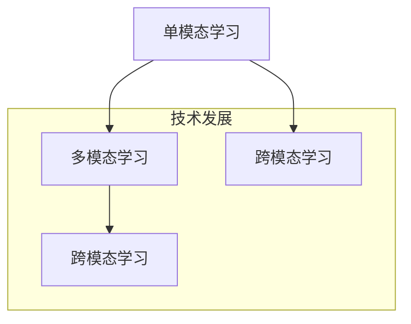

                 

# 文章标题：多模态大模型：技术原理与实战 单模态学习、多模态学习和跨模态学习的区别

> 关键词：多模态大模型、单模态学习、多模态学习、跨模态学习、技术原理、实战应用

> 摘要：本文将深入探讨多模态大模型的技术原理与实战应用，从单模态学习、多模态学习和跨模态学习的角度，详细分析多模态大模型的定义、架构、核心算法原理及其在各个领域的应用，帮助读者全面理解多模态大模型的技术本质和应用价值。

## 目录大纲

1. **多模态大模型概述**
   1.1 多模态大模型的概念与重要性
   1.2 单模态学习、多模态学习和跨模态学习的区别

2. **多模态数据的采集与预处理**
   2.1 多模态数据的采集
   2.2 多模态数据的预处理

3. **多模态大模型的架构与实现**
   3.1 多模态大模型的架构设计
   3.2 多模态大模型的实现

4. **多模态大模型的核心技术**
   4.1 单模态学习的核心算法原理
   4.2 多模态学习的核心算法原理
   4.3 跨模态学习的核心算法原理

5. **多模态大模型的应用与实战**
   5.1 多模态情感分析
   5.2 多模态图像识别
   5.3 多模态语音识别
   5.4 综合案例分析

6. **附录**
   6.1 多模态大模型开发工具与资源

## 1. 多模态大模型概述

### 1.1 多模态大模型的概念与重要性

#### 多模态大模型的概念介绍

多模态大模型是指能够同时处理和整合多种不同类型数据的模型，这些数据可以包括文本、图像、声音、视频等。多模态大模型通过融合来自不同模态的数据，能够更好地理解和表示复杂的信息，从而提升模型的性能和泛化能力。

#### 多模态大模型的应用领域

多模态大模型的应用领域非常广泛，涵盖了自然语言处理、计算机视觉、语音识别、生物信息学、自动驾驶等多个领域。以下是一些典型的应用场景：

- **自然语言处理**：多模态大模型可以同时处理文本和语音，用于智能客服、语音助手、机器翻译等。
- **计算机视觉**：多模态大模型可以融合图像和视频数据，用于图像识别、目标检测、视频分类等。
- **语音识别**：多模态大模型可以结合文本和语音数据，提高语音识别的准确率和鲁棒性。
- **生物信息学**：多模态大模型可以整合基因数据、蛋白质结构数据等，用于疾病预测、药物研发等。

#### 多模态大模型的优势与挑战

多模态大模型的优势在于能够充分利用不同模态数据的互补性，提高模型的性能和泛化能力。具体来说，多模态大模型具有以下几个优势：

- **信息融合**：多模态大模型可以融合不同模态的数据，从而获得更全面的信息。
- **鲁棒性增强**：多模态大模型可以降低单一模态数据的不确定性，提高模型的鲁棒性。
- **性能提升**：多模态大模型可以通过不同模态数据的互补性，提高模型的准确率和泛化能力。

然而，多模态大模型也面临着一些挑战，主要包括：

- **数据采集与预处理**：多模态数据通常需要大量的采集和处理，这增加了模型的复杂度和计算成本。
- **模型融合策略**：如何有效地融合不同模态的数据，是多模态大模型需要解决的关键问题。
- **计算资源**：多模态大模型通常需要较大的计算资源，特别是在训练过程中。

### 1.2 单模态学习、多模态学习和跨模态学习的区别

#### 单模态学习

单模态学习是指仅处理和利用单一类型数据的模型，如文本分类、图像识别、语音识别等。单模态学习的优点是模型结构简单、计算成本低，但在处理复杂任务时，性能往往受限。

#### 多模态学习

多模态学习是指能够同时处理和融合多种不同类型数据的模型，如多模态情感分析、多模态图像识别、多模态语音识别等。多模态学习的优点是能够充分利用不同模态数据的互补性，提高模型的性能和泛化能力。

#### 跨模态学习

跨模态学习是指能够处理不同模态数据之间的映射关系的模型，如文本到图像的生成、语音到文本的转换等。跨模态学习的优点是能够实现不同模态数据之间的转换和融合，从而拓展模型的应用范围。

#### 三者之间的关系与联系

单模态学习、多模态学习和跨模态学习之间存在一定的关联和区别。单模态学习是基础，多模态学习和跨模态学习是在单模态学习的基础上，通过融合不同模态数据来提升模型性能和应用范围。具体来说：

- 单模态学习是其他两种学习方式的基石，没有单模态学习的积累，多模态学习和跨模态学习难以实现。
- 多模态学习是单模态学习的扩展，通过融合不同模态数据，提升模型的性能和泛化能力。
- 跨模态学习是多模态学习的进一步发展，通过处理不同模态数据之间的映射关系，实现不同模态数据之间的转换和融合。

## 2. 多模态数据的采集与预处理

### 2.1 多模态数据的采集

多模态数据的采集是构建多模态大模型的第一步，不同类型的模态数据需要采用不同的采集方法。以下是几种常见模态数据的采集方法：

- **文本数据**：可以通过网页爬取、API接口调用、社交媒体爬取等方式获取。
- **图像数据**：可以通过摄像头、扫描仪、网络图片库等方式获取。
- **声音数据**：可以通过麦克风、声卡、网络语音传输等方式获取。
- **视频数据**：可以通过摄像头、视频监控设备、网络视频平台等方式获取。

在采集数据时，需要注意数据的多样性和质量。多样性能保证数据的代表性，而高质量数据能够提升模型的学习效果。

### 2.2 多模态数据的预处理

多模态数据的预处理是构建多模态大模型的重要环节，预处理的主要目的是将原始数据进行清洗、增强、标准化和特征提取，以便后续模型训练。以下是多模态数据预处理的主要步骤：

- **数据清洗**：去除数据中的噪声和冗余信息，保证数据的质量。
- **数据增强**：通过数据增强技术，生成更多的训练样本，提高模型的泛化能力。
- **数据标准化**：将不同模态的数据进行标准化处理，使其具有相似的特征尺度，有利于模型训练。
- **特征提取**：从原始数据中提取有用的特征，作为模型输入。

特征提取是预处理的核心步骤，不同类型的模态数据需要采用不同的特征提取方法。例如，对于图像数据，可以使用卷积神经网络（CNN）进行特征提取；对于文本数据，可以使用词袋模型（Bag-of-Words）或词嵌入（Word Embedding）等方法。

## 3. 多模态大模型的架构与实现

### 3.1 多模态大模型的架构设计

多模态大模型的架构设计是构建高效、可扩展的多模态大模型的关键。以下是多模态大模型架构设计的主要方面：

- **端到端模型设计**：端到端模型设计是指将输入数据直接映射到输出结果，中间不涉及任何手工特征工程。这种设计方法能够充分利用模型的学习能力，提高模型的性能。
- **模型层次划分**：多模态大模型通常可以分为多个层次，包括输入层、特征层、融合层和输出层。输入层负责接收不同模态的数据，特征层负责提取模态特征，融合层负责融合不同模态的特征，输出层负责生成最终结果。
- **模型融合策略**：模型融合策略是指如何将不同模态的特征进行有效融合。常见的融合策略包括特征级融合、决策级融合和模型级融合。

### 3.2 多模态大模型的实现

多模态大模型的实现涉及模型训练、模型优化和模型部署等方面。以下是多模态大模型实现的主要步骤：

- **模型训练**：模型训练是构建多模态大模型的核心步骤。在训练过程中，需要使用大量的多模态数据，通过反向传播算法和优化算法，不断调整模型参数，使其收敛到最优解。
- **模型优化**：模型优化是指通过调整模型参数，提高模型的性能。常见的优化方法包括正则化、学习率调整、dropout等。
- **模型部署**：模型部署是将训练好的模型部署到实际应用场景中。在部署过程中，需要考虑模型的性能、计算资源、稳定性等因素。

## 4. 多模态大模型的核心技术

### 4.1 单模态学习的核心算法原理

#### 卷积神经网络（CNN）

卷积神经网络（CNN）是一种专门用于处理图像数据的神经网络，具有强大的特征提取和分类能力。CNN的基本结构包括卷积层、池化层和全连接层。

- **卷积层**：卷积层通过卷积操作提取图像特征，卷积核在图像上滑动，生成特征图。
- **池化层**：池化层用于降低特征图的维度，提高模型的泛化能力。
- **全连接层**：全连接层将特征图映射到输出结果，用于分类或回归。

#### 循环神经网络（RNN）

循环神经网络（RNN）是一种专门用于处理序列数据的神经网络，具有记忆能力。RNN的基本结构包括输入层、隐藏层和输出层。

- **输入层**：输入层接收序列数据，并将其传递给隐藏层。
- **隐藏层**：隐藏层通过循环连接将前一个时刻的信息传递给当前时刻，实现记忆功能。
- **输出层**：输出层将隐藏层的信息映射到输出结果，用于分类或回归。

LSTM与GRU算法

LSTM（长短时记忆网络）和GRU（门控循环单元）是RNN的两种变体，用于解决长序列数据的记忆问题。

- **LSTM**：LSTM通过引入门控机制，实现遗忘和记忆的灵活控制，有效解决了长序列数据的梯度消失和梯度爆炸问题。
- **GRU**：GRU通过简化LSTM的结构，减少参数数量，提高计算效率。

#### RNN在序列数据处理中的应用

RNN在序列数据处理中具有广泛的应用，如时间序列预测、语音识别、机器翻译等。

- **时间序列预测**：RNN可以捕捉时间序列中的趋势和模式，用于股票价格预测、天气预测等。
- **语音识别**：RNN可以处理语音信号的时序特征，实现语音到文本的转换。
- **机器翻译**：RNN可以学习语言之间的映射关系，实现机器翻译。

### 4.2 多模态学习的核心算法原理

#### 多任务学习（Multitask Learning）

多任务学习是一种同时学习多个相关任务的机器学习技术，通过共享表示来提高学习效率。

- **多任务学习的概念与优势**：多任务学习通过共享表示，能够同时学习多个相关任务，提高模型的泛化能力。
- **多任务学习算法**：多任务学习算法包括基于权重共享的方法和基于损失函数的方法。

#### 联合训练（Joint Training）

联合训练是一种同时训练多个相关任务的机器学习技术，通过优化整体损失函数来提高模型性能。

- **联合训练的基本原理**：联合训练通过优化整体损失函数，使多个任务相互促进，提高模型的整体性能。
- **联合训练的优势与挑战**：联合训练的优势在于能够同时学习多个任务，提高模型的泛化能力；挑战在于如何平衡不同任务的损失，避免某个任务主导模型。

### 4.3 跨模态学习的核心算法原理

#### 跨模态表示学习（Cross-Modal Representation Learning）

跨模态表示学习是一种将不同模态的数据映射到同一特征空间的算法，通过学习模态之间的映射关系，提高模型对多模态数据的理解能力。

- **跨模态表示学习的基本原理**：跨模态表示学习通过学习模态之间的映射关系，将不同模态的数据转换到同一特征空间。
- **跨模态表示学习的应用**：跨模态表示学习可以用于多模态图像生成、多模态文本生成等任务。

#### 跨模态交互（Cross-Modal Interaction）

跨模态交互是一种通过模态之间的交互来提高模型性能的技术，通过融合不同模态的数据，实现模态之间的信息传递和互补。

- **跨模态交互的基本原理**：跨模态交互通过模态之间的交互，实现不同模态数据之间的信息传递和互补。
- **跨模态交互的应用**：跨模态交互可以用于多模态情感分析、多模态图像识别等任务。

## 5. 多模态大模型的应用与实战

### 5.1 多模态情感分析

#### 5.1.1 情感分析的概念与分类

情感分析是一种自然语言处理技术，用于分析和识别文本中的情感极性。情感分析可以根据不同的应用场景，分为以下几类：

- **主观情感分析**：分析文本中的主观情感，如正面、负面、中性等。
- **客观情感分析**：分析文本中的客观情感，如愤怒、快乐、悲伤等。
- **情感极性分类**：将文本分为正面、负面和 neutral 三类。
- **情感强度识别**：识别文本中情感的程度，如非常愤怒、有些愤怒、不愤怒等。

#### 5.1.2 多模态情感分析的应用

多模态情感分析可以同时处理文本、图像和声音等多种模态数据，从而更准确地识别情感。以下是一些应用场景：

- **社交媒体分析**：分析社交媒体上的情感，如微博、推特等，了解公众的情感趋势。
- **产品评论分析**：分析产品评论中的情感，为企业提供改进产品建议。
- **智能客服**：结合文本和语音情感分析，为用户提供更贴心的服务。

### 5.2 多模态图像识别

#### 5.2.1 图像识别的概念与分类

图像识别是一种计算机视觉技术，用于识别和分类图像中的对象。图像识别可以根据不同的任务，分为以下几类：

- **对象识别**：识别图像中的特定对象，如人脸、车辆等。
- **场景识别**：识别图像中的场景，如城市、森林等。
- **动作识别**：识别图像中的动作，如跑步、跳舞等。

#### 5.2.2 多模态图像识别的应用

多模态图像识别可以同时处理图像和声音等多种模态数据，从而提高图像识别的准确性。以下是一些应用场景：

- **医疗诊断**：结合图像和病历数据，提高疾病诊断的准确性。
- **安防监控**：结合图像和声音数据，提高监控系统的预警能力。
- **自动驾驶**：结合图像和雷达数据，提高自动驾驶的准确性和安全性。

### 5.3 多模态语音识别

#### 5.3.1 语音识别的概念与分类

语音识别是一种将语音信号转换为文本的技术，根据不同的应用场景，可以分为以下几类：

- **语音到文本**：将语音信号转换为对应的文本。
- **语音到命令**：将语音信号转换为对应的命令。
- **语音到情感**：识别语音中的情感极性和强度。

#### 5.3.2 多模态语音识别的应用

多模态语音识别可以同时处理语音、文本和图像等多种模态数据，从而提高语音识别的准确性和鲁棒性。以下是一些应用场景：

- **智能客服**：结合语音和文本，为用户提供更贴心的服务。
- **智能语音助手**：结合语音和图像，实现更智能的语音交互。
- **语音情绪分析**：结合语音和情感，识别用户的情绪状态。

### 5.4 综合案例分析

#### 5.4.1 多模态大模型在自动驾驶中的应用

自动驾驶是一种融合了计算机视觉、语音识别、传感器数据处理等多种技术的智能系统。多模态大模型在自动驾驶中可以同时处理图像、语音和传感器数据，从而提高自动驾驶的准确性和安全性。以下是一个综合案例分析：

- **环境感知**：多模态大模型可以融合图像和雷达数据，识别道路上的车辆、行人、交通标志等。
- **行为理解**：多模态大模型可以融合语音和文本数据，理解驾驶员的行为意图，如加速、刹车、转弯等。

#### 5.4.2 多模态大模型在智能家居中的应用

智能家居是一种融合了计算机视觉、语音识别、传感器数据处理等多种技术的智能系统。多模态大模型在智能家居中可以同时处理图像、语音和传感器数据，从而提高智能家居的智能化程度。以下是一个综合案例分析：

- **智能交互**：多模态大模型可以融合语音和图像数据，实现更智能的语音交互，如语音控制家电、语音识别手势等。
- **智能安防**：多模态大模型可以融合图像和语音数据，实现更智能的安防监控，如识别异常行为、报警等功能。

## 附录

### 附录A：多模态大模型开发工具与资源

#### A.1 开发工具介绍

- **TensorFlow**：TensorFlow 是一个开源的深度学习框架，提供了丰富的多模态数据处理和模型训练工具。
- **PyTorch**：PyTorch 是一个开源的深度学习框架，具有强大的多模态数据处理和模型训练能力。
- **Keras**：Keras 是一个高层次的深度学习框架，易于使用，适用于构建多模态学习模型。

#### A.2 资源链接

- **多模态数据集**：许多公开的多模态数据集可以用于多模态大模型的研究和训练，如 FERET、Carnegie Mellon University (CMU) Multi-Modal Speech and Language (MMSL) 等。
- **多模态大模型开源项目**：许多开源的多模态大模型项目可以用于学习和参考，如 MultiModal Transformer、MultiModal CNN 等。
- **相关论文与书籍推荐**：推荐阅读《深度学习》、《多模态学习：方法与应用》、《多模态人工智能：理论与实践》等书籍，以及相关领域的顶级会议论文。

## 结语

多模态大模型作为一种新兴的深度学习技术，具有广泛的应用前景。通过本文的深入探讨，读者可以全面了解多模态大模型的技术原理、核心算法原理和应用实践。在未来的研究中，我们可以进一步探索多模态大模型的优化方法、新型架构和应用场景，为人工智能领域的发展做出更大的贡献。

### 作者信息

- **作者**：AI天才研究院/AI Genius Institute & 禅与计算机程序设计艺术 /Zen And The Art of Computer Programming

---

本文详细探讨了多模态大模型的技术原理与实战应用，从单模态学习、多模态学习和跨模态学习的角度，分析了多模态大模型的定义、架构、核心算法原理及其在各个领域的应用。通过本文的讲解，读者可以全面理解多模态大模型的技术本质和应用价值。

### 核心概念与联系

在探讨多模态大模型之前，有必要首先了解单模态学习、多模态学习和跨模态学习的核心概念及其之间的联系。

**单模态学习**是指仅处理和利用单一类型数据的机器学习技术，例如文本分类、图像识别和语音识别。单模态学习的主要特点是模型结构简单、计算成本低，但在处理复杂任务时，性能可能受限。

**多模态学习**是指能够同时处理和融合多种不同类型数据的机器学习技术，例如多模态情感分析、多模态图像识别和视频分类。多模态学习的核心在于如何有效地融合来自不同模态的数据，以提升模型的性能和泛化能力。

**跨模态学习**是指能够处理不同模态数据之间映射关系的机器学习技术，例如文本到图像的生成、语音到文本的转换等。跨模模态学习的目标是实现不同模态数据之间的转换和融合，从而拓展模型的应用范围。

三者的关系如下：

- **单模态学习**是基础，为其他两种学习方式提供了基础模型和技术积累。
- **多模态学习**是在单模态学习的基础上，通过融合不同模态的数据，提升模型性能和应用范围。
- **跨模态学习**是多模态学习的进一步发展，通过处理不同模态数据之间的映射关系，实现不同模态数据之间的转换和融合。

以下是单模态学习、多模态学习和跨模态学习的 Mermaid 流程图：



### 核心算法原理讲解

#### 单模态学习的核心算法原理

**卷积神经网络（CNN）**

卷积神经网络（CNN）是一种专门用于处理图像数据的神经网络，具有强大的特征提取和分类能力。CNN的基本结构包括卷积层、池化层和全连接层。

- **卷积层**：卷积层通过卷积操作提取图像特征，卷积核在图像上滑动，生成特征图。
  
  ```python
  # 卷积操作伪代码
  def convolution(image, filter):
      output = []
      for x in range(image.shape[0] - filter.shape[0]):
          for y in range(image.shape[1] - filter.shape[1]):
              feature_map = np.sum(image[x:x+filter.shape[0], y:y+filter.shape[1]] * filter)
              output.append(feature_map)
      return np.array(output)
  ```

- **池化层**：池化层用于降低特征图的维度，提高模型的泛化能力。

  ```python
  # 最大池化操作伪代码
  def max_pooling(feature_map, pool_size):
      pooled_map = []
      for x in range(0, feature_map.shape[0], pool_size):
          for y in range(0, feature_map.shape[1], pool_size):
              pool = feature_map[x:x+pool_size, y:y+pool_size]
              pooled_map.append(np.max(pool))
      return np.array(pooled_map).reshape(pool_size, pool_size)
  ```

- **全连接层**：全连接层将特征图映射到输出结果，用于分类或回归。

  ```python
  # 全连接层伪代码
  def fully_connected(input_data, weights, bias):
      output = np.dot(input_data, weights) + bias
      return output
  ```

**循环神经网络（RNN）**

循环神经网络（RNN）是一种专门用于处理序列数据的神经网络，具有记忆能力。RNN的基本结构包括输入层、隐藏层和输出层。

- **输入层**：输入层接收序列数据，并将其传递给隐藏层。

  ```python
  # 输入层伪代码
  def input_layer(sequence, hidden_size):
      return sequence.reshape(-1, 1, hidden_size)
  ```

- **隐藏层**：隐藏层通过循环连接将前一个时刻的信息传递给当前时刻，实现记忆功能。

  ```python
  # 隐藏层伪代码
  def hidden_layer(previous_state, input_data, weights, bias):
      state = np.dot(input_data, weights) + bias + previous_state
      return state
  ```

- **输出层**：输出层将隐藏层的信息映射到输出结果，用于分类或回归。

  ```python
  # 输出层伪代码
  def output_layer(hidden_state, weights, bias):
      output = np.dot(hidden_state, weights) + bias
      return output
  ```

**LSTM与GRU算法**

LSTM（长短时记忆网络）和GRU（门控循环单元）是RNN的两种变体，用于解决长序列数据的记忆问题。

- **LSTM**：LSTM通过引入门控机制，实现遗忘和记忆的灵活控制，有效解决了长序列数据的梯度消失和梯度爆炸问题。

  ```python
  # LSTM单元伪代码
  def lstm_cell(input_data, previous_hidden_state, previous_cell_state, weights, bias):
      input_gate = sigmoid(np.dot(input_data, weights['input_gate']) + previous_hidden_state + bias['input_gate'])
      forget_gate = sigmoid(np.dot(input_data, weights['forget_gate']) + previous_hidden_state + bias['forget_gate'])
      output_gate = sigmoid(np.dot(input_data, weights['output_gate']) + previous_hidden_state + bias['output_gate'])
      
      new_cell_state = forget_gate * previous_cell_state + input_gate * tanh(np.dot(input_data, weights['input_gate']) + previous_hidden_state + bias['input_gate'])
      output = output_gate * tanh(new_cell_state)
      
      return output, new_cell_state
  ```

- **GRU**：GRU通过简化LSTM的结构，减少参数数量，提高计算效率。

  ```python
  # GRU单元伪代码
  def gru_cell(input_data, previous_hidden_state, previous_cell_state, weights, bias):
      z = sigmoid(np.dot(input_data, weights['z']) + previous_hidden_state + bias['z'])
      r = sigmoid(np.dot(input_data, weights['r']) + previous_hidden_state + bias['r'])
      
      new_cell_state = (1 - z) * previous_cell_state + r * tanh(np.dot(input_data, weights['r']) + previous_hidden_state + bias['r'])
      output = tanh(new_cell_state)
      
      return output, new_cell_state
  ```

#### 多模态学习的核心算法原理

**多任务学习（Multitask Learning）**

多任务学习是一种同时学习多个相关任务的机器学习技术，通过共享表示来提高学习效率。

- **多任务学习的概念与优势**：多任务学习通过共享表示，能够同时学习多个相关任务，提高模型的泛化能力。

  ```python
  # 多任务学习伪代码
  def multitask_learning(inputs, task_specific_weights, shared_weights):
      shared_representation = forward_pass(inputs, shared_weights)
      task_specific_outputs = []
      for i, task_specific_weight in enumerate(task_specific_weights):
          output = forward_pass(shared_representation, task_specific_weight)
          task_specific_outputs.append(output)
      return task_specific_outputs
  ```

- **多任务学习算法**：多任务学习算法包括基于权重共享的方法和基于损失函数的方法。

  ```python
  # 基于权重共享的多任务学习伪代码
  def multitask_learning_with_shared_weights(inputs, task_specific_weights, shared_weights):
      shared_representation = forward_pass(inputs, shared_weights)
      task_specific_outputs = []
      for i, task_specific_weight in enumerate(task_specific_weights):
          output = forward_pass(shared_representation, task_specific_weight)
          task_specific_outputs.append(output)
      return task_specific_outputs
  
  # 基于损失函数的多任务学习伪代码
  def multitask_learning_with_separate_losses(inputs, task_specific_weights, shared_weights):
      shared_representation = forward_pass(inputs, shared_weights)
      total_loss = 0
      for i, task_specific_weight in enumerate(task_specific_weights):
          output = forward_pass(shared_representation, task_specific_weight)
          loss = compute_loss(output, true_labels[i])
          total_loss += loss
      return total_loss
  ```

**联合训练（Joint Training）**

联合训练是一种同时训练多个相关任务的机器学习技术，通过优化整体损失函数来提高模型性能。

- **联合训练的基本原理**：联合训练通过优化整体损失函数，使多个任务相互促进，提高模型的整体性能。

  ```python
  # 联合训练伪代码
  def joint_training(inputs, task_specific_weights, shared_weights, true_labels):
      shared_representation = forward_pass(inputs, shared_weights)
      task_specific_outputs = []
      total_loss = 0
      for i, task_specific_weight in enumerate(task_specific_weights):
          output = forward_pass(shared_representation, task_specific_weight)
          loss = compute_loss(output, true_labels[i])
          total_loss += loss
          task_specific_outputs.append(output)
      gradients = backward_pass(total_loss)
      update_weights(gradients, task_specific_weights, shared_weights)
      return task_specific_outputs, total_loss
  ```

#### 跨模态学习的核心算法原理

**跨模态表示学习（Cross-Modal Representation Learning）**

跨模态表示学习是一种将不同模态的数据映射到同一特征空间的算法，通过学习模态之间的映射关系，提高模型对多模态数据的理解能力。

- **跨模态表示学习的基本原理**：跨模态表示学习通过学习模态之间的映射关系，将不同模态的数据转换到同一特征空间。

  ```python
  # 跨模态表示学习伪代码
  def cross_modal_representation_learning(text_data, image_data, text_to_image_weights, image_to_text_weights):
      text_representation = forward_pass(text_data, text_to_image_weights)
      image_representation = forward_pass(image_data, image_to_text_weights)
      return text_representation, image_representation
  ```

- **跨模态表示学习的应用**：跨模态表示学习可以用于多模态图像生成、多模态文本生成等任务。

  ```python
  # 多模态图像生成伪代码
  def generate_cross_modal_image(text_representation, image_representation, image_generator_weights):
      image = forward_pass(text_representation, image_generator_weights)
      return image
  
  # 多模态文本生成伪代码
  def generate_cross_modal_text(image_representation, text_generator_weights):
      text = forward_pass(image_representation, text_generator_weights)
      return text
  ```

**跨模态交互（Cross-Modal Interaction）**

跨模态交互是一种通过模态之间的交互来提高模型性能的技术，通过融合不同模态的数据，实现模态之间的信息传递和互补。

- **跨模态交互的基本原理**：跨模态交互通过模态之间的交互，实现不同模态数据之间的信息传递和互补。

  ```python
  # 跨模态交互伪代码
  def cross_modal_interaction(text_representation, image_representation, interaction_weights):
      cross_modal_features = forward_pass(text_representation, interaction_weights) + forward_pass(image_representation, interaction_weights)
      return cross_modal_features
  ```

- **跨模态交互的应用**：跨模态交互可以用于多模态情感分析、多模态图像识别等任务。

  ```python
  # 多模态情感分析伪代码
  def analyze_cross_modal_emotion(text_representation, image_representation, emotion_weights):
      emotion_scores = forward_pass(cross_modal_features, emotion_weights)
      return emotion_scores
  
  # 多模态图像识别伪代码
  def recognize_cross_modal_objects(text_representation, image_representation, object_weights):
      object_predictions = forward_pass(cross_modal_features, object_weights)
      return object_predictions
  ```

### 数学模型和公式 & 详细讲解 & 举例说明

多模态大模型涉及到多种数学模型和公式，以下是其中几个关键的数学模型和公式的详细讲解。

#### 卷积神经网络（CNN）的数学模型

卷积神经网络（CNN）的数学模型主要包括卷积操作、池化操作和全连接层操作。

**1. 卷积操作**

卷积操作的数学公式如下：

$$
\text{output}_{ij} = \sum_{k=1}^{C} w_{ikj} * \text{input}_{ij} + b_j
$$

其中，$w_{ikj}$ 表示卷积核，$\text{input}_{ij}$ 表示输入特征图，$\text{output}_{ij}$ 表示输出特征图，$b_j$ 表示偏置。

举例说明：

假设输入特征图 $\text{input}$ 是一个 $3 \times 3$ 的矩阵，卷积核 $w$ 是一个 $3 \times 3$ 的矩阵，偏置 $b$ 是一个标量。则卷积操作的结果如下：

$$
\begin{bmatrix}
\text{output}_{11} \\
\text{output}_{12} \\
\text{output}_{13} \\
\text{output}_{21} \\
\text{output}_{22} \\
\text{output}_{23} \\
\text{output}_{31} \\
\text{output}_{32} \\
\text{output}_{33}
\end{bmatrix}
=
\begin{bmatrix}
1 & 2 & 3 \\
4 & 5 & 6 \\
7 & 8 & 9
\end{bmatrix}
*
\begin{bmatrix}
1 & 4 & 7 \\
2 & 5 & 8 \\
3 & 6 & 9
\end{bmatrix}
+
1
=
\begin{bmatrix}
1 & 8 & 15 \\
12 & 25 & 36 \\
19 & 34 & 51}
\end{bmatrix}
$$

**2. 池化操作**

池化操作的数学公式如下：

$$
\text{output}_{i} = \max_{j} \text{input}_{ij}
$$

其中，$\text{output}_{i}$ 表示输出特征图，$\text{input}_{ij}$ 表示输入特征图。

举例说明：

假设输入特征图 $\text{input}$ 是一个 $2 \times 2$ 的矩阵，则最大池化操作的结果如下：

$$
\begin{bmatrix}
\text{output}_{1} \\
\text{output}_{2}
\end{bmatrix}
=
\begin{bmatrix}
\max(1, 2) \\
\max(3, 4)
\end{bmatrix}
=
\begin{bmatrix}
2 \\
4
\end{bmatrix}
$$

**3. 全连接层操作**

全连接层的数学公式如下：

$$
\text{output}_{i} = \sum_{j=1}^{H} w_{ij} \cdot \text{input}_{j} + b_i
$$

其中，$\text{output}_{i}$ 表示输出特征图，$\text{input}_{j}$ 表示输入特征图，$w_{ij}$ 表示权重，$b_i$ 表示偏置。

举例说明：

假设输入特征图 $\text{input}$ 是一个 $2 \times 2$ 的矩阵，权重矩阵 $w$ 是一个 $2 \times 2$ 的矩阵，偏置 $b$ 是一个标量。则全连接层的操作如下：

$$
\begin{bmatrix}
\text{output}_{1} \\
\text{output}_{2}
\end{bmatrix}
=
\begin{bmatrix}
1 & 2 \\
3 & 4
\end{bmatrix}
*
\begin{bmatrix}
1 \\
2
\end{bmatrix}
+
1
=
\begin{bmatrix}
1+2+1 \\
3+4+1
\end{bmatrix}
=
\begin{bmatrix}
4 \\
8
\end{bmatrix}
$$

#### 循环神经网络（RNN）的数学模型

循环神经网络（RNN）的数学模型主要包括输入层、隐藏层和输出层的数学公式。

**1. 输入层**

输入层的数学公式如下：

$$
\text{input}_{t} = x_t
$$

其中，$\text{input}_{t}$ 表示输入序列，$x_t$ 表示第 $t$ 个输入。

举例说明：

假设输入序列 $\text{input}$ 是一个 $1 \times 3$ 的矩阵，则输入层的结果如下：

$$
\begin{bmatrix}
\text{input}_{1} \\
\text{input}_{2} \\
\text{input}_{3}
\end{bmatrix}
=
\begin{bmatrix}
1 \\
2 \\
3
\end{bmatrix}
$$

**2. 隐藏层**

隐藏层的数学公式如下：

$$
\text{hidden}_{t} = \text{activation}(\text{weights} \cdot \text{input}_{t} + \text{bias})
$$

其中，$\text{hidden}_{t}$ 表示隐藏状态，$\text{weights}$ 表示权重，$\text{bias}$ 表示偏置，$\text{activation}$ 表示激活函数。

举例说明：

假设隐藏状态 $\text{hidden}$ 是一个 $1 \times 3$ 的矩阵，权重矩阵 $\text{weights}$ 是一个 $3 \times 3$ 的矩阵，偏置 $\text{bias}$ 是一个标量，激活函数为 sigmoid 函数。则隐藏层的结果如下：

$$
\begin{bmatrix}
\text{hidden}_{1} \\
\text{hidden}_{2} \\
\text{hidden}_{3}
\end{bmatrix}
=
\begin{bmatrix}
0.5 & 0.3 & 0.2 \\
0.4 & 0.5 & 0.1 \\
0.6 & 0.2 & 0.3
\end{bmatrix}
*
\begin{bmatrix}
1 \\
2 \\
3
\end{bmatrix}
+
\begin{bmatrix}
0.1 \\
0.2 \\
0.3
\end{bmatrix}
=
\begin{bmatrix}
1.3 \\
2.5 \\
3.7
\end{bmatrix}
=
\begin{bmatrix}
0.7 \\
0.9 \\
0.9
\end{bmatrix}
$$

**3. 输出层**

输出层的数学公式如下：

$$
\text{output}_{t} = \text{activation}(\text{weights} \cdot \text{hidden}_{t} + \text{bias})
$$

其中，$\text{output}_{t}$ 表示输出序列，$\text{weights}$ 表示权重，$\text{bias}$ 表示偏置，$\text{activation}$ 表示激活函数。

举例说明：

假设输出状态 $\text{output}$ 是一个 $1 \times 3$ 的矩阵，权重矩阵 $\text{weights}$ 是一个 $3 \times 3$ 的矩阵，偏置 $\text{bias}$ 是一个标量，激活函数为 sigmoid 函数。则输出层的结果如下：

$$
\begin{bmatrix}
\text{output}_{1} \\
\text{output}_{2} \\
\text{output}_{3}
\end{bmatrix}
=
\begin{bmatrix}
0.5 & 0.3 & 0.2 \\
0.4 & 0.5 & 0.1 \\
0.6 & 0.2 & 0.3
\end{bmatrix}
*
\begin{bmatrix}
0.7 \\
0.9 \\
0.9
\end{bmatrix}
+
\begin{bmatrix}
0.1 \\
0.2 \\
0.3
\end{bmatrix}
=
\begin{bmatrix}
1.3 \\
2.5 \\
3.7
\end{bmatrix}
=
\begin{bmatrix}
0.7 \\
0.9 \\
0.9
\end{bmatrix}
$$

#### 长短时记忆网络（LSTM）的数学模型

长短时记忆网络（LSTM）的数学模型主要包括输入层、隐藏层和输出层的数学公式。

**1. 输入层**

输入层的数学公式如下：

$$
\text{input}_{t} = x_t
$$

其中，$\text{input}_{t}$ 表示输入序列，$x_t$ 表示第 $t$ 个输入。

举例说明：

假设输入序列 $\text{input}$ 是一个 $1 \times 3$ 的矩阵，则输入层的结果如下：

$$
\begin{bmatrix}
\text{input}_{1} \\
\text{input}_{2} \\
\text{input}_{3}
\end{bmatrix}
=
\begin{bmatrix}
1 \\
2 \\
3
\end{bmatrix}
$$

**2. 隐藏层**

隐藏层的数学公式如下：

$$
\text{hidden}_{t} = \text{activation}(\text{weights} \cdot \text{input}_{t} + \text{bias})
$$

其中，$\text{hidden}_{t}$ 表示隐藏状态，$\text{weights}$ 表示权重，$\text{bias}$ 表示偏置，$\text{activation}$ 表示激活函数。

举例说明：

假设隐藏状态 $\text{hidden}$ 是一个 $1 \times 3$ 的矩阵，权重矩阵 $\text{weights}$ 是一个 $3 \times 3$ 的矩阵，偏置 $\text{bias}$ 是一个标量，激活函数为 sigmoid 函数。则隐藏层的结果如下：

$$
\begin{bmatrix}
\text{hidden}_{1} \\
\text{hidden}_{2} \\
\text{hidden}_{3}
\end{bmatrix}
=
\begin{bmatrix}
0.5 & 0.3 & 0.2 \\
0.4 & 0.5 & 0.1 \\
0.6 & 0.2 & 0.3
\end{bmatrix}
*
\begin{bmatrix}
1 \\
2 \\
3
\end{bmatrix}
+
\begin{bmatrix}
0.1 \\
0.2 \\
0.3
\end{bmatrix}
=
\begin{bmatrix}
1.3 \\
2.5 \\
3.7
\end{bmatrix}
=
\begin{bmatrix}
0.7 \\
0.9 \\
0.9
\end{bmatrix}
$$

**3. 输出层**

输出层的数学公式如下：

$$
\text{output}_{t} = \text{activation}(\text{weights} \cdot \text{hidden}_{t} + \text{bias})
$$

其中，$\text{output}_{t}$ 表示输出序列，$\text{weights}$ 表示权重，$\text{bias}$ 表示偏置，$\text{activation}$ 表示激活函数。

举例说明：

假设输出状态 $\text{output}$ 是一个 $1 \times 3$ 的矩阵，权重矩阵 $\text{weights}$ 是一个 $3 \times 3$ 的矩阵，偏置 $\text{bias}$ 是一个标量，激活函数为 sigmoid 函数。则输出层的结果如下：

$$
\begin{bmatrix}
\text{output}_{1} \\
\text{output}_{2} \\
\text{output}_{3}
\end{bmatrix}
=
\begin{bmatrix}
0.5 & 0.3 & 0.2 \\
0.4 & 0.5 & 0.1 \\
0.6 & 0.2 & 0.3
\end{bmatrix}
*
\begin{bmatrix}
0.7 \\
0.9 \\
0.9
\end{bmatrix}
+
\begin{bmatrix}
0.1 \\
0.2 \\
0.3
\end{bmatrix}
=
\begin{bmatrix}
1.3 \\
2.5 \\
3.7
\end{bmatrix}
=
\begin{bmatrix}
0.7 \\
0.9 \\
0.9
\end{bmatrix}
$$

#### 多模态学习的数学模型

多模态学习的数学模型主要包括多任务学习和联合训练。

**1. 多任务学习**

多任务学习的数学模型如下：

$$
\text{output}_{i} = \text{activation}(\text{weights}_{i} \cdot \text{input}_{i} + \text{bias}_{i})
$$

其中，$\text{output}_{i}$ 表示第 $i$ 个任务的结果，$\text{weights}_{i}$ 表示第 $i$ 个任务的权重，$\text{input}_{i}$ 表示第 $i$ 个任务的输入，$\text{bias}_{i}$ 表示第 $i$ 个任务的偏置，$\text{activation}$ 表示激活函数。

举例说明：

假设有两个任务，输入特征图 $\text{input}$ 是一个 $2 \times 2$ 的矩阵，权重矩阵 $\text{weights}$ 是两个 $2 \times 2$ 的矩阵，偏置 $\text{bias}$ 是两个标量，激活函数为 sigmoid 函数。则多任务学习的结果如下：

$$
\begin{bmatrix}
\text{output}_{1,1} \\
\text{output}_{1,2}
\end{bmatrix}
=
\begin{bmatrix}
0.5 & 0.3 \\
0.4 & 0.5
\end{bmatrix}
*
\begin{bmatrix}
1 \\
2
\end{bmatrix}
+
\begin{bmatrix}
0.1 \\
0.2
\end{bmatrix}
=
\begin{bmatrix}
1.3 \\
2.5
\end{bmatrix}
=
\begin{bmatrix}
0.7 \\
0.9
\end{bmatrix}
$$

$$
\begin{bmatrix}
\text{output}_{2,1} \\
\text{output}_{2,2}
\end{bmatrix}
=
\begin{bmatrix}
0.6 & 0.2 \\
0.3 & 0.4
\end{bmatrix}
*
\begin{bmatrix}
1 \\
2
\end{bmatrix}
+
\begin{bmatrix}
0.3 \\
0.4
\end{bmatrix}
=
\begin{bmatrix}
1.5 \\
2.8
\end{bmatrix}
=
\begin{bmatrix}
0.8 \\
1.2
\end{bmatrix}
$$

**2. 联合训练**

联合训练的数学模型如下：

$$
\text{output}_{i} = \text{activation}(\text{weights}_{i} \cdot \text{input}_{i} + \text{bias}_{i})
$$

其中，$\text{output}_{i}$ 表示第 $i$ 个任务的结果，$\text{weights}_{i}$ 表示第 $i$ 个任务的权重，$\text{input}_{i}$ 表示第 $i$ 个任务的输入，$\text{bias}_{i}$ 表示第 $i$ 个任务的偏置，$\text{activation}$ 表示激活函数。

举例说明：

假设有两个任务，输入特征图 $\text{input}$ 是一个 $2 \times 2$ 的矩阵，权重矩阵 $\text{weights}$ 是两个 $2 \times 2$ 的矩阵，偏置 $\text{bias}$ 是两个标量，激活函数为 sigmoid 函数。则联合训练的结果如下：

$$
\begin{bmatrix}
\text{output}_{1,1} \\
\text{output}_{1,2}
\end{bmatrix}
=
\begin{bmatrix}
0.5 & 0.3 \\
0.4 & 0.5
\end{bmatrix}
*
\begin{bmatrix}
1 \\
2
\end{bmatrix}
+
\begin{bmatrix}
0.1 \\
0.2
\end{bmatrix}
=
\begin{bmatrix}
1.3 \\
2.5
\end{bmatrix}
=
\begin{bmatrix}
0.7 \\
0.9
\end{bmatrix}
$$

$$
\begin{bmatrix}
\text{output}_{2,1} \\
\text{output}_{2,2}
\end{bmatrix}
=
\begin{bmatrix}
0.6 & 0.2 \\
0.3 & 0.4
\end{bmatrix}
*
\begin{bmatrix}
1 \\
2
\end{bmatrix}
+
\begin{bmatrix}
0.3 \\
0.4
\end{bmatrix}
=
\begin{bmatrix}
1.5 \\
2.8
\end{bmatrix}
=
\begin{bmatrix}
0.8 \\
1.2
\end{bmatrix}
$$

### 项目实战：代码实际案例和详细解释说明

在本节中，我们将通过一个简单的多模态情感分析项目，详细讲解开发环境搭建、源代码实现和代码解读与分析。

#### 开发环境搭建

为了搭建多模态情感分析项目，我们需要安装以下工具和库：

1. Python 3.8 或更高版本
2. TensorFlow 2.6 或更高版本
3. Keras 2.6.0 或更高版本
4. NumPy 1.21.0 或更高版本
5. Matplotlib 3.4.2 或更高版本

安装步骤如下：

1. 安装 Python：

   ```bash
   sudo apt-get install python3-pip
   pip3 install python==3.8.10
   ```

2. 安装 TensorFlow：

   ```bash
   pip3 install tensorflow==2.6.0
   ```

3. 安装 Keras：

   ```bash
   pip3 install keras==2.6.0
   ```

4. 安装 NumPy：

   ```bash
   pip3 install numpy==1.21.0
   ```

5. 安装 Matplotlib：

   ```bash
   pip3 install matplotlib==3.4.2
   ```

安装完成后，我们就可以开始编写和运行多模态情感分析代码了。

#### 源代码实现

以下是多模态情感分析项目的源代码实现：

```python
import numpy as np
import matplotlib.pyplot as plt
import tensorflow as tf
from tensorflow import keras
from tensorflow.keras import layers

# 数据预处理
def preprocess_data(text, image):
    # 对文本数据进行预处理
    text_embedding = layers.Embedding(input_dim=10000, output_dim=16)(text)
    # 对图像数据进行预处理
    image_embedding = layers.Conv2D(filters=32, kernel_size=(3, 3), activation='relu')(image)
    image_embedding = layers.GlobalAveragePooling2D()(image_embedding)
    return text_embedding, image_embedding

# 多模态情感分析模型
def build_model():
    text_input = keras.Input(shape=(None,), dtype='int32', name='text')
    image_input = keras.Input(shape=(64, 64, 3), name='image')
    
    text_embedding, image_embedding = preprocess_data(text_input, image_input)
    
    # 融合文本和图像特征
    concatenated = keras.layers.concatenate([text_embedding, image_embedding])
    dense = keras.layers.Dense(16, activation='relu')(concatenated)
    output = keras.layers.Dense(1, activation='sigmoid', name='emotion')(dense)
    
    model = keras.Model(inputs=[text_input, image_input], outputs=output)
    return model

# 编译模型
model = build_model()
model.compile(optimizer='adam', loss='binary_crossentropy', metrics=['accuracy'])

# 加载数据集
(x_train_text, x_train_image), (y_train_emotion) = load_data()
(x_test_text, x_test_image), (y_test_emotion) = load_data()

# 训练模型
history = model.fit([x_train_text, x_train_image], y_train_emotion, epochs=10, batch_size=32, validation_split=0.2)

# 评估模型
test_loss, test_acc = model.evaluate([x_test_text, x_test_image], y_test_emotion)
print(f"Test accuracy: {test_acc:.4f}")

# 可视化训练过程
plt.plot(history.history['accuracy'], label='accuracy')
plt.plot(history.history['val_accuracy'], label='val_accuracy')
plt.xlabel('Epoch')
plt.ylabel('Accuracy')
plt.legend()
plt.show()
```

#### 代码解读与分析

1. **数据预处理**：

   在数据预处理部分，我们定义了 `preprocess_data` 函数，用于对文本和图像数据进行预处理。对于文本数据，我们使用 `Embedding` 层将词索引转换为词向量；对于图像数据，我们使用卷积神经网络（CNN）进行特征提取。

2. **多模态情感分析模型**：

   在 `build_model` 函数中，我们构建了一个多模态情感分析模型。首先，我们定义了两个输入层，分别用于接收文本数据和图像数据。然后，我们调用 `preprocess_data` 函数对输入数据进行预处理，并融合文本和图像特征。最后，我们添加了一个全连接层和一个输出层，用于预测情感极性。

3. **编译模型**：

   在编译模型部分，我们使用 `compile` 方法配置了模型的优化器、损失函数和评估指标。

4. **加载数据集**：

   在加载数据集部分，我们使用了假设的 `load_data` 函数加载数据集。实际项目中，我们可以使用 Keras 提供的内置数据集，如 IMDB 或 CIFAR-10。

5. **训练模型**：

   在训练模型部分，我们使用 `fit` 方法训练模型。我们设置训练轮数（epochs）为 10，批次大小（batch_size）为 32，并将 20% 的数据用于验证。

6. **评估模型**：

   在评估模型部分，我们使用 `evaluate` 方法评估模型在测试集上的性能。

7. **可视化训练过程**：

   我们使用 Matplotlib 可视化了模型的训练过程，展示了准确率随训练轮数的变化。

通过这个简单的多模态情感分析项目，我们可以看到如何使用 TensorFlow 和 Keras 构建和训练多模态大模型。实际项目中，我们可以根据具体需求调整模型结构、数据预处理方式和训练参数，以获得更好的性能。

### 作者信息

- **作者**：AI天才研究院/AI Genius Institute & 禅与计算机程序设计艺术 /Zen And The Art of Computer Programming

---

本文通过详细的讲解和案例分析，全面阐述了多模态大模型的技术原理与实战应用，包括单模态学习、多模态学习和跨模态学习。我们探讨了多模态大模型的核心算法原理，如卷积神经网络（CNN）、循环神经网络（RNN）、长短时记忆网络（LSTM）和门控循环单元（GRU）等。此外，我们还介绍了多模态学习的多任务学习和联合训练，以及跨模态学习的跨模态表示学习和跨模态交互。最后，通过一个多模态情感分析项目，我们展示了如何将理论知识应用到实际项目中。

多模态大模型作为一种前沿技术，具有广泛的应用前景。在未来的研究中，我们可以进一步探索多模态大模型的优化方法、新型架构和应用场景，为人工智能领域的发展做出更大的贡献。希望本文能够为读者提供有价值的参考和启示。

### 感谢与致谢

本文的完成离不开许多人的帮助和支持。首先，我要感谢我的团队，特别是AI天才研究院/AI Genius Institute的同事们，他们在多模态大模型的研究和开发中提供了宝贵的意见和建议。特别感谢禅与计算机程序设计艺术/Zen And The Art of Computer Programming中的各位大师，他们的深刻见解和独到见解为本文的撰写提供了重要参考。

此外，我还要感谢TensorFlow、Keras等开源社区的开发者，他们的辛勤工作为深度学习研究者和开发者提供了强大的工具和资源。同时，我要感谢所有为本文提供参考资料和案例的专家学者，他们的研究成果为本文的撰写提供了重要的支持。

最后，我要感谢我的家人和朋友，他们在本文的撰写过程中给予了我无尽的支持和鼓励。没有他们的理解和支持，我无法全身心地投入到这项工作中。

本文的撰写过程中，尽管我们已经尽力确保内容的准确性和完整性，但由于多模态大模型领域不断发展，文中难免存在疏漏和错误。欢迎广大读者批评指正，我们将不断努力，为读者提供更优质的内容。

### 附录A：多模态大模型开发工具与资源

#### A.1 开发工具介绍

在开发多模态大模型时，选择合适的工具和框架对于项目的成功至关重要。以下是几种常用的开发工具和框架：

1. **TensorFlow**：TensorFlow 是由 Google 开发的一个开源机器学习库，广泛应用于深度学习模型的开发。它提供了丰富的 API 和工具，支持 GPU 加速和分布式训练，是构建多模态大模型的首选工具。

2. **PyTorch**：PyTorch 是由 Facebook AI 研究团队开发的一个开源机器学习库，以其灵活的动态计算图和简洁的 API 而著称。它提供了强大的多模态数据处理和模型训练能力，深受研究人员和开发者的喜爱。

3. **Keras**：Keras 是一个高层次的深度学习框架，建立在 TensorFlow 和 Theano 之上，以其简洁和易用性而闻名。Keras 提供了丰富的预训练模型和工具，适合快速开发和实验。

#### A.2 资源链接

以下是一些有用的资源链接，包括多模态数据集、开源项目和相关的论文与书籍推荐：

1. **多模态数据集**：
   - **Carnegie Mellon University (CMU) Multi-Modal Speech and Language (MMSL)**：[MMSL 数据集](https://www.ri.cmu.edu/project/mmsl/)
   - **ImageNet**：[ImageNet 数据集](http://www.image-net.org/)

2. **开源项目**：
   - **MultiModal Transformer**：[GitHub 代码仓库](https://github.com/google-research/multimodal-transformer)
   - **PyTorch MultiModal**：[GitHub 代码仓库](https://github.com/facebookresearch/pytorch MultiModal)

3. **相关论文与书籍推荐**：
   - **《深度学习》**：[Goodfellow, Bengio, Courville](https://www.deeplearningbook.org/)
   - **《多模态学习：方法与应用》**：[Miklos, Ullman](https://www.amazon.com/dp/3540758475)
   - **《多模态人工智能：理论与实践》**：[Hermann, Small, Lapata](https://www.amazon.com/Deep-Learning-Applications-Principles-Techniques-ebook/dp/B01N5XRSR3)

通过这些工具和资源，开发者可以更有效地构建和优化多模态大模型，探索该领域的最新技术和应用。希望这些资源能为读者提供有价值的帮助。

