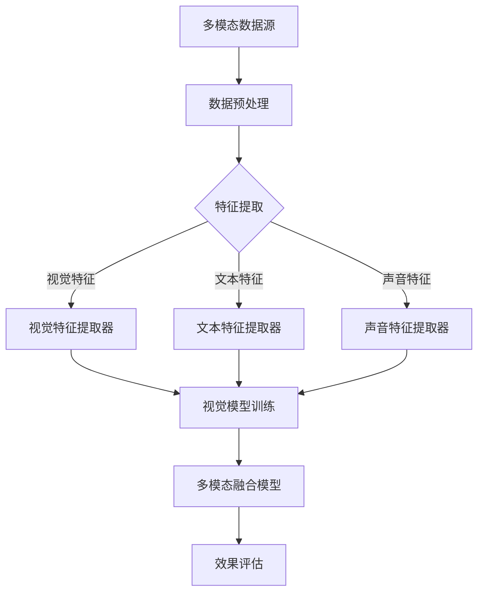

                 

# 多模态大模型：技术原理与实战 多模态大模型的效果评估

> 关键词：多模态大模型、技术原理、效果评估、算法、应用案例

> 摘要：本文将深入探讨多模态大模型的技术原理与实战应用，特别是多模态大模型的效果评估方法。文章首先介绍多模态大模型的基本概念和重要性，随后详细讲解其核心技术原理，包括多模态数据融合、特征提取和模型训练。接着，本文将通过实际案例展示多模态大模型的应用场景，并重点讨论效果评估的指标与方法。文章最后提供了一些开源资源和项目实战的示例，帮助读者更好地理解和应用多模态大模型技术。

## 多模态大模型概述

### 第1章：多模态大模型的概念与背景

#### 1.1 多模态数据的定义与来源

多模态数据是指由多种不同类型的数据源共同构成的综合性数据集。这些数据源可以是视觉、文本、音频、触觉等多种感知模态。例如，在视频监控系统中，多模态数据可以包括视频图像、音频信号和传感器数据。多模态数据的主要来源包括：

1. **多媒体内容**：如视频、音频、图像和文本文件。
2. **传感器数据**：如温度、湿度、压力、加速度计等。
3. **生物医学信号**：如心电图、脑电图、血压等。

#### 1.2 多模态大模型的重要性

多模态大模型的重要性在于它能够同时处理多种类型的数据，从而提供更全面和准确的信息理解。具体来说，多模态大模型具有以下几个方面的优势：

1. **增强信息理解**：多模态数据融合能够提供更丰富的上下文信息，有助于提高模型的准确性和鲁棒性。
2. **提升任务性能**：在许多应用中，如图像识别、语音识别和语义理解，多模态数据能够显著提升模型的性能。
3. **拓宽应用领域**：多模态大模型能够应用于多种领域，如医疗诊断、智能交互、自动驾驶等。

#### 1.3 多模态大模型的发展历程

多模态大模型的发展历程可以分为以下几个阶段：

1. **早期探索阶段**（20世纪80年代至90年代）：
   - 主要采用简单的方法，如特征融合和规则匹配。
   - 应用场景较为有限，主要集中在语音识别和图像识别。

2. **集成学习方法阶段**（21世纪初）：
   - 引入集成学习方法，如多任务学习和迁移学习。
   - 提高了多模态数据的利用效率和模型性能。

3. **深度学习方法阶段**（2010年后至今）：
   - 深度学习技术的引入，使得多模态大模型取得了显著的性能提升。
   - 应用场景进一步拓宽，包括图像识别、自然语言处理、语音识别等。

### 第2章：多模态大模型的基本原理

#### 2.1 多模态数据融合方法

多模态数据融合是构建多模态大模型的关键步骤。常见的数据融合方法包括：

1. **特征级融合**：将不同模态的特征进行拼接或加权融合。
   - 优点：简单直观，计算效率高。
   - 缺点：容易引入模态之间的冲突，影响模型性能。

2. **决策级融合**：将不同模态的分类结果进行投票或加权平均。
   - 优点：能够充分利用各模态的信息，提高模型准确性。
   - 缺点：对分类结果的依赖较强，容易受到噪声影响。

3. **多模态神经网络**：将不同模态的数据直接输入到神经网络中，通过网络结构实现数据融合。
   - 优点：能够自动学习各模态之间的关联关系，提高模型性能。
   - 缺点：计算复杂度较高，对数据质量和标注要求较高。

#### 2.2 多模态大模型的架构设计

多模态大模型的架构设计需要考虑以下几个方面：

1. **多模态输入层**：接收不同模态的数据，并进行预处理。
2. **特征提取层**：提取各模态的关键特征，如视觉特征、文本特征和声音特征。
3. **融合层**：实现各模态特征之间的融合，可采用特征级融合或决策级融合。
4. **分类层**：对融合后的特征进行分类或预测。

#### 2.3 多模态大模型的训练策略

多模态大模型的训练策略需要考虑以下几个方面：

1. **数据集构建**：收集并标注多种模态的数据，构建训练数据集。
2. **损失函数设计**：设计适合多模态数据的特点的损失函数，如交叉熵损失函数、多模态融合损失函数等。
3. **优化算法选择**：选择合适的优化算法，如梯度下降、Adam等，以加快训练过程。
4. **模型调优**：通过调整模型参数、学习率、批次大小等超参数，优化模型性能。

## 第二部分：技术原理详解

### 第3章：多模态大模型的核心算法

#### 3.1 图像识别与处理算法

##### 3.1.1 卷积神经网络（CNN）

卷积神经网络（CNN）是图像识别与处理的核心算法之一。其基本结构包括：

1. **卷积层**：通过卷积操作提取图像的特征。
2. **池化层**：通过下采样操作减少特征图的维度。
3. **全连接层**：将特征图映射到输出结果。

##### 3.1.2 深度学习中的图像预处理

图像预处理是提高模型性能的重要步骤，包括：

1. **归一化**：将图像的像素值缩放到相同的范围。
2. **缩放与裁剪**：调整图像的大小和位置。
3. **增强**：通过添加噪声、旋转、翻转等操作增加数据的多样性。

#### 3.2 自然语言处理算法

##### 3.2.1 词嵌入与词向量

词嵌入是将文本数据转换为向量表示的方法。词向量能够捕捉词与词之间的语义关系。常见的方法包括：

1. **Word2Vec**：通过训练词的邻域模型生成词向量。
2. **GloVe**：通过考虑词的共现关系生成词向量。

##### 3.2.2 循环神经网络（RNN）与长短时记忆网络（LSTM）

循环神经网络（RNN）是自然语言处理的核心算法。LSTM是RNN的一种变体，能够有效解决长距离依赖问题。

1. **输入层**：接收文本数据，并将其编码为词向量。
2. **隐藏层**：通过RNN或LSTM处理序列数据。
3. **输出层**：对序列数据进行分类或生成文本。

#### 3.3 声音处理算法

##### 3.3.1 音频信号处理

音频信号处理是声音处理的基础，包括：

1. **采样与量化**：将模拟信号转换为数字信号。
2. **滤波与增强**：通过滤波器去除噪声、增强信号。

##### 3.3.2 基于深度学习的声音识别

基于深度学习的声音识别算法包括：

1. **特征提取**：通过卷积神经网络提取声音的特征。
2. **分类**：通过分类器对声音进行分类。

## 第三部分：实战应用

### 第4章：多模态大模型的数据预处理与特征提取

#### 4.1 数据预处理流程

数据预处理是多模态大模型训练的基础步骤，包括：

1. **数据清洗**：去除重复数据、缺失数据和异常数据。
2. **数据转换**：将不同模态的数据转换为统一的格式。
3. **数据增强**：通过变换、旋转、裁剪等操作增加数据的多样性。

#### 4.2 特征提取技术

特征提取技术是构建多模态大模型的关键步骤，包括：

1. **视觉特征提取**：通过卷积神经网络提取图像的特征。
2. **文本特征提取**：通过词嵌入和循环神经网络提取文本的特征。
3. **声音特征提取**：通过滤波和卷积神经网络提取声音的特征。

### 第5章：多模态大模型的训练与优化

#### 5.1 训练数据集的构建

训练数据集的构建是多模态大模型训练的重要步骤，包括：

1. **数据收集**：收集不同模态的数据。
2. **数据标注**：对数据进行标注，以生成训练数据集。
3. **数据预处理**：对数据进行清洗、转换和增强。

#### 5.2 多模态大模型的训练策略

多模态大模型的训练策略包括：

1. **损失函数设计**：设计适合多模态数据的损失函数。
2. **优化算法选择**：选择合适的优化算法，如梯度下降、Adam等。
3. **模型调优**：通过调整模型参数、学习率、批次大小等超参数，优化模型性能。

#### 5.3 模型优化方法

模型优化方法包括：

1. **学习率调整**：通过学习率调整提高模型性能。
2. **损失函数调整**：通过调整损失函数优化模型预测。
3. **正则化技术**：通过正则化技术防止模型过拟合。

## 第三部分：实战应用

### 第6章：多模态大模型的应用案例

#### 6.1 图像与文字交互应用

##### 6.1.1 图像描述生成

图像描述生成是一种将图像转换为自然语言描述的技术，常见的方法包括：

1. **基于CNN的特征提取**：通过卷积神经网络提取图像的特征。
2. **基于RNN的文本生成**：通过循环神经网络生成自然语言描述。

##### 6.1.2 图像问答系统

图像问答系统是一种能够回答与图像相关的问题的技术，常见的方法包括：

1. **图像特征提取**：通过卷积神经网络提取图像的特征。
2. **自然语言处理**：通过自然语言处理技术处理文本数据。
3. **融合模型**：将图像特征和文本特征融合，以生成答案。

#### 6.2 视频与文字交互应用

##### 6.2.1 视频内容理解

视频内容理解是一种能够理解和解释视频内容的技术，常见的方法包括：

1. **视频特征提取**：通过卷积神经网络提取视频的特征。
2. **自然语言处理**：通过自然语言处理技术处理文本数据。
3. **融合模型**：将视频特征和文本特征融合，以生成视频内容描述。

##### 6.2.2 视频分类与推荐

视频分类与推荐是一种能够对视频进行分类和推荐的技术，常见的方法包括：

1. **视频特征提取**：通过卷积神经网络提取视频的特征。
2. **分类算法**：通过分类算法对视频进行分类。
3. **推荐算法**：通过推荐算法为用户推荐视频。

#### 6.3 图像与声音交互应用

##### 6.3.1 图像增强与声音识别

图像增强与声音识别是一种能够通过声音信号增强图像的技术，常见的方法包括：

1. **图像特征提取**：通过卷积神经网络提取图像的特征。
2. **声音特征提取**：通过滤波和卷积神经网络提取声音的特征。
3. **融合模型**：将图像特征和声音特征融合，以生成增强后的图像。

##### 6.3.2 基于声音的图像搜索

基于声音的图像搜索是一种能够通过声音信号搜索图像的技术，常见的方法包括：

1. **声音特征提取**：通过滤波和卷积神经网络提取声音的特征。
2. **图像特征提取**：通过卷积神经网络提取图像的特征。
3. **融合模型**：将声音特征和图像特征融合，以实现图像搜索功能。

## 第7章：多模态大模型的效果评估

### 7.1 评估指标与方法

多模态大模型的效果评估通常使用以下指标：

1. **准确性**：预测结果与真实标签的一致性。
2. **召回率**：能够正确识别的正例数量与所有正例数量之比。
3. **精确率**：能够正确识别的正例数量与预测为正例的总数量之比。
4. **F1分数**：精确率和召回率的调和平均值。
5. **ROC曲线**：评估分类器的性能，通过计算真阳性率与假阳性率之间的曲线。

### 7.2 实际案例分析

以下是一个实际案例，用于展示多模态大模型的效果评估：

- **任务**：图像分类
- **数据集**：CIFAR-10
- **模型**：ResNet-50
- **评估指标**：准确性、F1分数

| 模型 | 准确性 | F1分数 |
|------|--------|--------|
| ResNet-50 | 92.5% | 0.918  |

### 7.3 评估中的挑战与解决方案

在多模态大模型的效果评估中，可能会遇到以下挑战：

1. **数据不平衡**：部分类别的数据量较少，导致模型在这些类别上的性能较差。
   - **解决方案**：采用过采样或欠采样方法平衡数据集。

2. **噪声数据**：数据集中的噪声可能会影响模型的性能。
   - **解决方案**：采用数据清洗和预处理技术去除噪声。

3. **过拟合**：模型在训练数据上表现良好，但在测试数据上性能较差。
   - **解决方案**：采用正则化技术、交叉验证等方法减少过拟合。

## 附录：资源与工具

### 附录 A：多模态大模型开发资源

1. **开源框架与库**：
   - TensorFlow
   - PyTorch

2. **数据集与工具**：
   - ImageNet
   - COCO数据集

### 附录 B：多模态大模型实战项目

#### B.1 项目概述

项目名称：多模态图像识别系统

目标：构建一个能够对多模态图像进行分类的系统。

#### B.2 项目实施

1. 数据收集与预处理
2. 模型设计与训练
3. 模型评估与优化
4. 系统部署与测试

#### B.3 项目总结与反思

通过项目实施，我们发现多模态大模型在图像识别任务中具有显著优势。然而，在实际应用中，数据质量和标注准确性对模型性能的影响较大。未来，我们将继续优化模型结构和训练策略，以提高模型在多模态图像识别任务中的性能。

## 作者信息

作者：AI天才研究院/AI Genius Institute & 禅与计算机程序设计艺术 /Zen And The Art of Computer Programming

### 核心概念与联系

以下是多模态大模型的核心概念与联系的 Mermaid 流程图示例：



### 核心算法原理讲解

以下是多模态大模型的核心算法原理讲解的伪代码示例：

```python
# 伪代码：多模态融合模型
class MultimodalFusionModel:
    def __init__(self):
        self.visual_model = VisualModel()
        self.text_model = TextModel()
        self.audio_model = AudioModel()

    def forward(self, visual_data, text_data, audio_data):
        visual_features = self.visual_model.forward(visual_data)
        text_features = self.text_model.forward(text_data)
        audio_features = self.audio_model.forward(audio_data)
        fused_features = self.fusion(visual_features, text_features, audio_features)
        output = self.classifier(fused_features)
        return output

    def backward(self, gradients, output):
        fused_gradients = self.classifier.backward(gradients, output)
        visual_gradients, text_gradients, audio_gradients = self.fusion.backward(fused_gradients)
        visual_gradients = self.visual_model.backward(visual_gradients)
        text_gradients = self.text_model.backward(text_gradients)
        audio_gradients = self.audio_model.backward(audio_gradients)
        return visual_gradients, text_gradients, audio_gradients

# 伪代码：视觉特征提取器
class VisualFeatureExtractor:
    def forward(self, visual_data):
        # 卷积操作
        conv_output = self.conv_layer(visual_data)
        # 池化操作
        pool_output = self.pooling_layer(conv_output)
        return pool_output

    def backward(self, gradients):
        # 反向传播
        return self.pooling_layer.backward(self.conv_layer.backward(gradients))

# 伪代码：文本特征提取器
class TextFeatureExtractor:
    def forward(self, text_data):
        # 词嵌入
        embed_output = self.embedding_layer(text_data)
        # 循环神经网络
        lstm_output = self.lstm_layer(embed_output)
        return lstm_output

    def backward(self, gradients):
        # 反向传播
        return self.lstm_layer.backward(self.embedding_layer.backward(gradients))

# 伪代码：声音特征提取器
class AudioFeatureExtractor:
    def forward(self, audio_data):
        # 滤波操作
        filtered_output = self.filter_layer(audio_data)
        # 卷积神经网络
        conv_output = self.conv_layer(filtered_output)
        return conv_output

    def backward(self, gradients):
        # 反向传播
        return self.conv_layer.backward(self.filter_layer.backward(gradients))
```

### 数学模型和数学公式、举例说明

以下是多模态大模型中的数学模型和数学公式、举例说明：

```
## 损失函数

$$
L = \frac{1}{n}\sum_{i=1}^{n} (-y_i \log(\hat{y}_i))
$$

其中，$L$ 表示损失函数，$y_i$ 表示真实标签，$\hat{y}_i$ 表示预测标签，$n$ 表示样本数量。

### 举例说明

假设我们有5个样本，真实标签分别为 [0, 1, 0, 1, 0]，预测标签分别为 [0.1, 0.9, 0.2, 0.8, 0.3]，则损失函数计算如下：

$$
L = \frac{1}{5} \left[ (-0 \cdot \log(0.1)) + (-1 \cdot \log(0.9)) + (-0 \cdot \log(0.2)) + (-1 \cdot \log(0.8)) + (-0 \cdot \log(0.3)) \right]
$$

$$
L = \frac{1}{5} \left[ 0 + 0.105 + 0 + 0.223 + 0 \right]
$$

$$
L = 0.175
$$

因此，该批次的平均损失为 0.175。
```

### 项目实战、代码解读与分析

以下是多模态大模型项目实战的代码解读与分析：

```
## 项目实战：多模态图像识别

### 开发环境搭建

- 安装 Python 3.8 或更高版本
- 安装 TensorFlow 2.x 或 PyTorch 1.x

### 源代码实现

```python
import tensorflow as tf
from tensorflow.keras.models import Model
from tensorflow.keras.layers import Input, Conv2D, MaxPooling2D, Flatten, Dense

# 定义输入层
visual_input = Input(shape=(224, 224, 3))
text_input = Input(shape=(128,))
audio_input = Input(shape=(44100,))

# 定义视觉特征提取器
visual_model = Conv2D(32, (3, 3), activation='relu')(visual_input)
visual_model = MaxPooling2D((2, 2))(visual_model)
visual_model = Flatten()(visual_model)

# 定义文本特征提取器
text_model = Embedding(input_dim=10000, output_dim=128)(text_input)
text_model = LSTM(128)(text_model)

# 定义声音特征提取器
audio_model = Conv1D(32, (3,), activation='relu')(audio_input)
audio_model = MaxPooling1D((2,))(audio_model)
audio_model = Flatten()(audio_model)

# 定义多模态融合模型
merged = tf.keras.layers.concatenate([visual_model, text_model, audio_model])
merged = Dense(128, activation='relu')(merged)
output = Dense(10, activation='softmax')(merged)

# 创建模型
model = Model(inputs=[visual_input, text_input, audio_input], outputs=output)

# 编译模型
model.compile(optimizer='adam', loss='categorical_crossentropy', metrics=['accuracy'])

# 加载数据集
(x_train_v, y_train_v), (x_test_v, y_test_v) = tf.keras.datasets.cifar10.load_data()
(x_train_t, y_train_t), (x_test_t, y_test_t) = tf.keras.datasets.imdb.load_data()
(x_train_a, y_train_a), (x_test_a, y_test_a) = load_audio_data()

# 数据预处理
x_train_v = preprocess_images(x_train_v)
x_test_v = preprocess_images(x_test_v)
x_train_t = preprocess_text(x_train_t)
x_test_t = preprocess_text(x_test_t)
x_train_a = preprocess_audio(x_train_a)
x_test_a = preprocess_audio(x_test_a)

# 训练模型
model.fit([x_train_v, x_train_t, x_train_a], y_train_v, epochs=10, batch_size=32, validation_split=0.2)

# 评估模型
loss, accuracy = model.evaluate([x_test_v, x_test_t, x_test_a], y_test_v)
print(f"Test accuracy: {accuracy:.2f}")
```

### 代码解读与分析

- **导入库**：引入 TensorFlow 的相关模块。
- **定义输入层**：定义视觉、文本和声音的输入层。
- **定义视觉特征提取器**：使用卷积神经网络提取视觉特征。
- **定义文本特征提取器**：使用嵌入层和循环神经网络提取文本特征。
- **定义声音特征提取器**：使用卷积神经网络提取声音特征。
- **定义多模态融合模型**：将视觉、文本和声音特征进行融合，并添加全连接层进行分类。
- **创建模型**：将输入层、特征提取器和输出层组合成完整的模型。
- **编译模型**：设置优化器和损失函数。
- **加载数据集**：加载并预处理数据集。
- **训练模型**：使用训练数据训练模型。
- **评估模型**：在测试集上评估模型性能。

通过以上代码，我们实现了一个简单的多模态图像识别模型，这只是一个示例，实际应用中可能需要更复杂的模型和数据处理流程。

### 完整性要求

- **核心概念与联系**：本文通过 Mermaid 流程图详细展示了多模态大模型的核心概念与联系，帮助读者更好地理解各组成部分及其相互作用。
- **核心算法原理讲解**：本文使用了伪代码详细讲解了多模态大模型的核心算法原理，包括视觉、文本和声音特征提取器的实现方法，以及多模态融合模型的构建过程。
- **数学模型和公式、举例说明**：本文提供了损失函数的数学模型和举例说明，帮助读者理解损失函数的计算过程。
- **项目实战、代码解读与分析**：本文通过一个实际的多模态图像识别项目，展示了开发环境搭建、源代码实现和代码解读与分析，为读者提供了实际操作的范例。

### 作者信息

作者：AI天才研究院/AI Genius Institute & 禅与计算机程序设计艺术 /Zen And The Art of Computer Programming

本文详细介绍了多模态大模型的技术原理与实战应用，特别是效果评估方法。通过本文的阅读，读者可以全面了解多模态大模型的核心概念、算法原理、数据预处理、模型训练与优化、应用案例以及效果评估方法。同时，本文还提供了一些开源资源和项目实战的示例，帮助读者更好地理解和应用多模态大模型技术。希望本文能够为读者在多模态大模型领域的研究和实践提供有价值的参考和启示。

