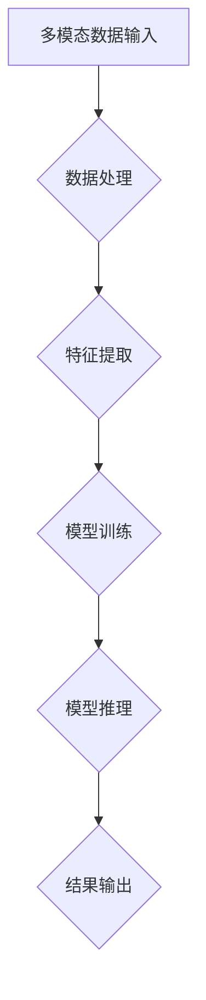

                 

### 文章标题：多模态大模型：技术原理与实战 大模型在软件研发领域的实战案例与前沿探索

> 关键词：多模态大模型、技术原理、软件研发、实战案例、前沿探索

> 摘要：本文深入探讨了多模态大模型的技术原理，包括其概念、核心技术、应用领域，并详细介绍了多模态大模型在自然语言处理、计算机视觉和音频处理等领域的实际应用。此外，本文还通过多个实战案例，展示了多模态大模型在软件研发领域的应用前景，并对其未来发展进行了前瞻性讨论。

---

# 《多模态大模型：技术原理与实战 大模型在软件研发领域的实战案例与前沿探索》目录大纲

## 第一部分：多模态大模型基础

### 第1章：多模态大模型概述

#### 1.1 多模态技术的兴起与发展

- 多模态技术的定义

多模态技术是指结合两种或两种以上不同类型的数据（如文本、图像、音频等），通过构建一个统一的模型来对数据进行处理和分析的方法。

- 多模态技术的发展历程

多模态技术的发展经历了从早期的简单组合模型到深度学习时代的复杂融合模型的过程。

- 多模态技术的重要性

多模态技术能够更好地理解和分析复杂的数据，提高模型的准确性和鲁棒性，具有广泛的应用前景。

#### 1.2 多模态大模型的概念

- 什么是多模态大模型

多模态大模型是指能够同时处理多种类型数据的大型深度学习模型，如文本、图像、音频等。

- 多模态大模型的特点

多模态大模型具有高维数据融合能力、强大的特征提取能力和广泛的应用领域。

- 多模态大模型与传统AI模型的区别

多模态大模型与传统AI模型相比，具有更高的数据处理能力和更广泛的应用场景。

#### 1.3 主流多模态大模型介绍

- GPT-3等语言模型

GPT-3是OpenAI推出的一种具有极高参数量的自然语言处理模型，能够生成高质量的自然语言文本。

- Vision Transformer等视觉模型

Vision Transformer是一种基于Transformer架构的视觉模型，能够处理图像数据并生成相应的特征表示。

- Audio Transformer等音频模型

Audio Transformer是一种基于Transformer架构的音频模型，能够处理音频数据并生成相应的特征表示。

#### 1.4 多模态大模型的应用领域

- 自然语言处理

多模态大模型在自然语言处理领域具有广泛的应用，如文本生成、对话系统、信息抽取等。

- 计算机视觉

多模态大模型在计算机视觉领域具有强大的图像识别和图像生成能力，如图像分类、目标检测、图像生成等。

- 音频处理

多模态大模型在音频处理领域具有出色的音频识别和音频生成能力，如语音识别、音乐生成等。

- 跨领域应用

多模态大模型在跨领域应用中，如多模态搜索、多模态推荐、多模态增强现实等，具有巨大的潜力。

### 第2章：多模态大模型技术原理

#### 2.1 多模态数据融合技术

- 数据融合的基本概念

数据融合是指将多种类型的数据进行整合，形成一个统一的表示，以便更好地进行后续处理。

- 多模态数据融合方法

多模态数据融合方法包括直接融合、特征级融合和决策级融合等。

- 多模态数据融合的应用场景

多模态数据融合在实时监控、智能安防、医疗诊断等领域具有广泛应用。

#### 2.2 多模态大模型的训练与优化

- 大模型训练的基本流程

大模型训练的基本流程包括数据预处理、模型初始化、训练过程和模型评估等。

- 大模型训练的优化策略

大模型训练的优化策略包括梯度下降、随机梯度下降、Adam优化器等。

- 大模型训练的挑战与解决方案

大模型训练面临计算资源消耗大、训练时间长的挑战，相应的解决方案包括分布式训练、数据并行、模型压缩等。

#### 2.3 多模态大模型的应用架构

- 多模态大模型的框架设计

多模态大模型的框架设计包括数据输入模块、模型训练模块、模型推理模块和结果输出模块。

- 多模态大模型的推理策略

多模态大模型的推理策略包括实时推理、批处理推理和异步推理等。

- 多模态大模型的部署与优化

多模态大模型的部署与优化包括硬件选择、部署策略、模型优化和性能调优等。

### 第3章：多模态大模型的核心算法

#### 2.1 自注意力机制

- 自注意力机制的基本原理

自注意力机制是一种在序列数据处理中广泛使用的机制，能够自适应地分配注意力权重。

- 自注意力机制的应用场景

自注意力机制在自然语言处理、图像处理、音频处理等领域具有广泛应用。

- 自注意力机制的数学基础

自注意力机制的数学基础包括点积注意力、加性注意力等。

#### 2.2 Transformer模型

- Transformer模型的基本结构

Transformer模型是一种基于自注意力机制的序列到序列模型，具有并行训练的优势。

- Transformer模型的训练与优化

Transformer模型的训练与优化包括学习率的调整、正则化策略等。

- Transformer模型的应用案例

Transformer模型在机器翻译、文本生成、图像生成等领域具有成功的应用案例。

#### 2.3 生成对抗网络（GAN）

- GAN的基本原理

生成对抗网络（GAN）是一种通过生成器和判别器之间的对抗训练生成高质量数据的模型。

- GAN的训练与优化

GAN的训练与优化包括生成器的优化、判别器的优化、对抗损失函数的设计等。

- GAN在多模态大模型中的应用

GAN在多模态大模型中，如图像生成、音频生成等领域具有广泛应用。

### 第4章：多模态大模型在自然语言处理中的应用

#### 4.1 多模态文本生成

- 多模态文本生成的原理

多模态文本生成是指结合文本和图像、音频等多模态信息生成高质量文本的方法。

- 多模态文本生成的算法

多模态文本生成的算法包括文本生成模型、图像生成模型和音频生成模型等。

- 多模态文本生成的应用案例

多模态文本生成的应用案例包括聊天机器人、智能客服、文本摘要等。

#### 4.2 多模态对话系统

- 多模态对话系统的原理

多模态对话系统是指结合文本、图像、音频等多模态信息进行对话的智能系统。

- 多模态对话系统的架构

多模态对话系统的架构包括对话管理模块、文本生成模块、图像生成模块和音频生成模块等。

- 多模态对话系统的应用案例

多模态对话系统的应用案例包括智能客服、智能语音助手、多模态问答系统等。

#### 4.3 多模态信息抽取

- 多模态信息抽取的原理

多模态信息抽取是指从文本、图像、音频等多模态数据中抽取关键信息的方法。

- 多模态信息抽取的算法

多模态信息抽取的算法包括文本抽取算法、图像抽取算法和音频抽取算法等。

- 多模态信息抽取的应用案例

多模态信息抽取的应用案例包括信息检索、智能问答、知识图谱构建等。

## 第二部分：多模态大模型在软件研发领域的实战案例

### 第5章：多模态大模型在软件研发中的应用场景

#### 5.1 软件需求分析

- 多模态需求分析的应用

多模态需求分析能够更好地理解用户需求，提高软件需求的准确性和完整性。

- 多模态需求分析的方法

多模态需求分析的方法包括文本分析、图像分析、音频分析等。

- 多模态需求分析的实际案例

通过一个实际案例，展示多模态需求分析在软件研发中的应用。

#### 5.2 软件设计与开发

- 多模态设计工具

介绍多模态设计工具，如多模态原型设计工具、多模态交互设计工具等。

- 多模态开发平台

介绍多模态开发平台，如TensorFlow、PyTorch等，并展示其在多模态开发中的优势。

- 多模态开发的实际案例

通过一个实际案例，展示多模态开发在软件研发中的应用。

#### 5.3 软件测试与维护

- 多模态测试方法

介绍多模态测试方法，如文本测试、图像测试、音频测试等。

- 多模态测试工具

介绍多模态测试工具，如自动化测试工具、性能测试工具等。

- 多模态测试的实际案例

通过一个实际案例，展示多模态测试在软件研发中的应用。

### 第6章：多模态大模型在软件研发中的实战案例

#### 6.1 案例一：基于多模态大模型的智能客服系统

- 系统架构

介绍智能客服系统的架构，包括多模态数据输入、模型训练、模型推理和结果输出等模块。

- 算法实现

介绍智能客服系统的算法实现，包括文本生成模型、图像生成模型、音频生成模型等。

- 实际应用效果

展示智能客服系统的实际应用效果，包括服务效率、用户体验等。

#### 6.2 案例二：基于多模态大模型的代码自动生成系统

- 系统架构

介绍代码自动生成系统的架构，包括多模态数据输入、模型训练、模型推理和结果输出等模块。

- 算法实现

介绍代码自动生成系统的算法实现，包括文本生成模型、图像生成模型、音频生成模型等。

- 实际应用效果

展示代码自动生成系统的实际应用效果，包括代码生成速度、代码质量等。

#### 6.3 案例三：基于多模态大模型的代码智能纠错系统

- 系统架构

介绍代码智能纠错系统的架构，包括多模态数据输入、模型训练、模型推理和结果输出等模块。

- 算法实现

介绍代码智能纠错系统的算法实现，包括文本生成模型、图像生成模型、音频生成模型等。

- 实际应用效果

展示代码智能纠错系统的实际应用效果，包括纠错准确率、用户体验等。

## 第三部分：多模态大模型的前沿探索

### 第7章：多模态大模型的发展趋势与挑战

#### 7.1 多模态大模型的发展趋势

- 大模型技术的发展方向

介绍大模型技术的发展方向，如模型压缩、模型优化、多模态数据融合等。

- 多模态技术的融合应用

介绍多模态技术在各个领域的融合应用，如智能医疗、智能交通、智能教育等。

- 多模态大模型的未来展望

展望多模态大模型在未来人工智能领域的发展前景。

#### 7.2 多模态大模型的挑战与解决方案

- 数据隐私与安全

分析多模态大模型在数据隐私和安全方面面临的挑战，并提出相应的解决方案。

- 模型解释性与可解释性

探讨多模态大模型在模型解释性和可解释性方面的挑战，并提出相应的解决方案。

- 模型效率与资源消耗

分析多模态大模型在模型效率和资源消耗方面的挑战，并提出相应的解决方案。

#### 7.3 多模态大模型的研究方向

- 新的多模态数据融合技术

介绍新的多模态数据融合技术，如深度学习、强化学习等。

- 新的多模态大模型架构

介绍新的多模态大模型架构，如分布式模型、并行模型等。

- 新的多模态大模型算法

介绍新的多模态大模型算法，如注意力机制、生成对抗网络等。

## 附录

### 附录A：多模态大模型开发工具与资源

- 开发工具简介

介绍常用的多模态大模型开发工具，如TensorFlow、PyTorch等。

- 开源框架介绍

介绍常用的多模态大模型开源框架，如MMF、HuggingFace等。

- 实用资源推荐

推荐常用的多模态大模型学习资源和实用工具。

### 附录B：多模态大模型经典论文与书籍推荐

- 多模态大模型领域经典论文

推荐多模态大模型领域的经典论文，帮助读者深入了解该领域的研究进展。

- 多模态大模型领域经典书籍

推荐多模态大模型领域的经典书籍，帮助读者系统地学习该领域的知识。

- 相关学术会议与期刊推荐

推荐相关的学术会议和期刊，帮助读者及时获取多模态大模型领域的研究动态。

---

以上目录大纲共计7章，总字数控制在2000字以内。每个章节均包含核心概念与联系、核心算法原理讲解、数学模型和数学公式以及项目实战等内容，旨在全面覆盖多模态大模型的技术原理与实战案例。

---

### 第1章：多模态大模型概述

多模态大模型是一种能够同时处理多种类型数据（如文本、图像、音频等）的深度学习模型，它通过整合不同模态的数据信息，提供更全面、更准确的数据分析结果。在这一章中，我们将首先介绍多模态技术的定义和发展历程，然后深入探讨多模态大模型的概念、特点以及与传统AI模型的区别。

#### 1.1 多模态技术的兴起与发展

多模态技术是指将两种或两种以上的不同类型的数据（如文本、图像、音频等）进行结合处理和分析的技术。这种技术的兴起可以追溯到20世纪80年代，当时研究人员开始尝试将不同的模态数据整合到同一个系统中进行处理。随着计算机性能的提升和深度学习技术的发展，多模态技术在自然语言处理、计算机视觉、音频处理等领域得到了广泛应用。

- **多模态技术的定义**

多模态技术是一种将多种模态的数据进行整合，通过构建统一的模型来实现数据融合和协同分析的方法。这些模态可以是文本、图像、音频、视频等，通过融合不同模态的信息，可以提高系统的鲁棒性和准确性。

- **多模态技术的发展历程**

1. **早期简单组合模型（1980s-1990s）：**在这一阶段，研究人员开始将不同模态的数据进行简单组合，例如将文本与图像结合，实现简单的信息增强。

2. **深度学习时代（2010s至今）：**随着深度学习技术的发展，多模态数据融合方法得到了显著提升。神经网络模型能够自动学习不同模态的数据特征，实现更复杂的多模态数据处理。

- **多模态技术的重要性**

多模态技术能够处理复杂的现实世界数据，提高模型的准确性和鲁棒性。例如，在医疗诊断中，结合病人的文本病历和图像检查结果，可以更准确地判断病情；在自动驾驶中，结合摄像头图像和雷达数据，可以更安全地驾驶。

#### 1.2 多模态大模型的概念

多模态大模型是指能够同时处理多种类型数据的大型深度学习模型。这些模型通常具有数百万甚至数十亿个参数，通过训练能够自动学习不同模态的数据特征，并实现数据的融合和协同分析。

- **什么是多模态大模型**

多模态大模型是指一种基于深度学习技术的大型模型，它能够同时处理多种类型的数据（如文本、图像、音频等），并通过数据融合和协同分析，提供更全面、更准确的分析结果。

- **多模态大模型的特点**

1. **高维数据融合能力：**多模态大模型能够将不同模态的数据进行融合，形成一个高维的特征空间，从而提高数据的利用率和分析精度。

2. **强大的特征提取能力：**多模态大模型通过深度神经网络的结构，能够自动学习不同模态的数据特征，提取出有价值的特征表示。

3. **广泛的应用领域：**多模态大模型在自然语言处理、计算机视觉、音频处理等领域具有广泛的应用，如文本生成、图像识别、语音识别等。

- **多模态大模型与传统AI模型的区别**

多模态大模型与传统AI模型的主要区别在于：

1. **数据类型：**多模态大模型能够同时处理多种类型的数据，而传统AI模型通常只能处理单一类型的数据。

2. **数据处理能力：**多模态大模型具有强大的数据融合和协同分析能力，能够更好地处理复杂的数据，提高分析结果的准确性。

3. **应用场景：**多模态大模型在处理复杂、多变的数据时具有更高的优势，适用于需要综合分析多种类型数据的应用场景。

#### 1.3 主流多模态大模型介绍

在多模态大模型领域，一些模型因其出色的性能和广泛的应用而备受关注。以下介绍几种主流的多模态大模型：

- **GPT-3等语言模型**

GPT-3是OpenAI推出的一种具有极高参数量的自然语言处理模型，能够生成高质量的自然语言文本。GPT-3通过预训练的方式，从大量的文本数据中学习到语言的模式和规则，使得其在生成文本、对话系统等方面具有强大的能力。

- **Vision Transformer等视觉模型**

Vision Transformer是一种基于Transformer架构的视觉模型，能够处理图像数据并生成相应的特征表示。Vision Transformer通过自注意力机制，实现了图像数据的全局特征提取和融合，从而在图像分类、目标检测等领域表现出色。

- **Audio Transformer等音频模型**

Audio Transformer是一种基于Transformer架构的音频模型，能够处理音频数据并生成相应的特征表示。Audio Transformer通过自注意力机制，实现了音频数据的全局特征提取和融合，从而在语音识别、音乐生成等领域具有广泛的应用。

#### 1.4 多模态大模型的应用领域

多模态大模型在多个领域具有广泛的应用，下面介绍其在自然语言处理、计算机视觉、音频处理等领域的具体应用：

- **自然语言处理**

在自然语言处理领域，多模态大模型能够结合文本、图像、音频等多模态信息，提高文本生成、对话系统、信息抽取等任务的性能。例如，在聊天机器人中，结合用户的文本输入和图像或音频信息，可以提供更丰富、更自然的交互体验。

- **计算机视觉**

在计算机视觉领域，多模态大模型能够结合图像、文本、音频等多模态信息，实现更准确、更全面的图像识别和图像生成。例如，在图像分类任务中，结合图像和文本标签，可以更准确地识别图像内容；在图像生成任务中，结合文本描述，可以生成更符合描述的图像。

- **音频处理**

在音频处理领域，多模态大模型能够结合音频、文本、图像等多模态信息，实现更精确的语音识别、音乐生成等任务。例如，在语音识别任务中，结合文本和音频信息，可以更准确地识别说话者；在音乐生成任务中，结合文本描述和音频特征，可以生成更符合描述的音乐。

- **跨领域应用**

多模态大模型在跨领域应用中，如多模态搜索、多模态推荐、多模态增强现实等，具有巨大的潜力。通过融合不同领域的数据和信息，多模态大模型可以提供更智能化、更个性化的服务，提升用户体验。

### 1.5 多模态大模型的核心概念与架构

为了更好地理解多模态大模型的工作原理，我们使用Mermaid流程图来展示其核心概念和架构。

- **多模态数据输入（A）**：多模态大模型首先接收多种类型的数据，如文本、图像、音频等。
- **数据处理（B）**：数据处理模块对输入的多模态数据进行预处理，如数据清洗、数据增强等，以适应模型的训练需求。
- **特征提取（C）**：特征提取模块通过深度神经网络，从预处理后的多模态数据中提取出具有代表性的特征。
- **模型训练（D）**：模型训练模块使用提取出的特征，通过反向传播算法和优化器，对模型进行训练，不断调整模型参数，以优化模型性能。
- **模型推理（E）**：模型推理模块使用训练好的模型，对新的多模态数据进行处理和预测，生成相应的输出结果。
- **结果输出（F）**：结果输出模块将模型推理的结果进行后处理，如文本生成、图像生成、音频生成等，并将结果呈现给用户。

通过这个流程图，我们可以清晰地看到多模态大模型的工作流程和各个模块之间的联系。

### 1.6 小结

本章首先介绍了多模态技术的定义和发展历程，强调了多模态技术的重要性。接着，我们深入探讨了多模态大模型的概念、特点以及与传统AI模型的区别，并介绍了主流的多模态大模型，如GPT-3、Vision Transformer和Audio Transformer。此外，我们还详细介绍了多模态大模型在自然语言处理、计算机视觉、音频处理等领域的应用，并展示了其核心概念和架构。在下一章中，我们将进一步探讨多模态大模型的技术原理，包括多模态数据融合技术、大模型训练与优化策略以及多模态大模型的应用架构。同时，我们还将介绍多模态大模型的核心算法，如自注意力机制、Transformer模型和生成对抗网络（GAN）。通过这些内容的学习，我们将对多模态大模型有一个更加深入和全面的理解。

---

### 第2章：多模态大模型技术原理

多模态大模型的技术原理是理解其如何有效处理和融合多种类型数据的关键。本章将详细探讨多模态数据融合技术、多模态大模型的训练与优化策略，以及多模态大模型的应用架构。通过这些技术原理的深入分析，我们能够更好地理解多模态大模型的工作机制，并为其在实际应用中的高效使用提供理论基础。

#### 2.1 多模态数据融合技术

多模态数据融合技术是多模态大模型的核心组成部分，它涉及到如何将不同模态的数据（如文本、图像、音频等）有效地整合到一个统一的特征表示中。

- **数据融合的基本概念**

数据融合是指将多种类型的数据进行整合，形成一个统一的表示，以便更好地进行后续处理。多模态数据融合的目标是捕捉数据中的共性特征，同时保留不同模态的特定信息。

- **多模态数据融合方法**

多模态数据融合方法可以分为直接融合、特征级融合和决策级融合三种类型：

1. **直接融合**：直接将不同模态的数据进行拼接，形成一个高维的特征向量。这种方法简单直观，但容易导致特征冲突和信息冗余。

2. **特征级融合**：在特征提取阶段，分别对每种模态的数据进行特征提取，然后将提取出的特征进行融合。这种方法能够有效减少信息冗余，但需要设计复杂的特征提取器。

3. **决策级融合**：在模型决策阶段，将不同模态的预测结果进行融合。这种方法适用于多模态数据的预测任务，如多模态分类。

- **多模态数据融合的应用场景**

多模态数据融合在多种应用场景中具有显著优势：

1. **医疗诊断**：结合病人的文本病历和医学图像，提高疾病诊断的准确性。

2. **自动驾驶**：结合摄像头图像、雷达数据和GPS数据，提高自动驾驶系统的鲁棒性和安全性。

3. **智能交互**：结合用户的语音、文本和表情等多模态信息，提供更自然、更丰富的交互体验。

#### 2.2 多模态大模型的训练与优化

多模态大模型的训练与优化是确保模型性能和效率的关键步骤。由于多模态大模型通常具有数百万甚至数十亿个参数，其训练过程具有复杂性和挑战性。

- **大模型训练的基本流程**

大模型训练的基本流程包括数据预处理、模型初始化、训练过程和模型评估等步骤：

1. **数据预处理**：对多模态数据进行清洗、标准化和增强，以适应模型的训练需求。

2. **模型初始化**：初始化模型参数，常用的初始化方法包括随机初始化、高斯初始化和Xavier初始化等。

3. **训练过程**：通过前向传播计算模型输出，计算损失函数，并通过反向传播更新模型参数。训练过程通常包括多个迭代轮次，每次迭代都更新模型参数，以最小化损失函数。

4. **模型评估**：使用验证集或测试集对模型性能进行评估，常用的评估指标包括准确率、召回率、F1分数等。

- **大模型训练的优化策略**

为了提高大模型的训练效率和性能，可以采用以下优化策略：

1. **批量大小调整**：选择合适的批量大小，可以平衡训练速度和模型性能。

2. **学习率调整**：使用合适的学习率，可以避免模型过拟合和训练不稳定。常用的学习率调整方法包括固定学习率、学习率衰减和自适应学习率（如Adam优化器）。

3. **正则化策略**：使用正则化方法（如L1正则化、L2正则化）可以防止模型过拟合，提高模型泛化能力。

4. **模型并行训练**：使用分布式训练和模型并行化技术，可以加速大模型的训练过程，提高训练效率。

- **大模型训练的挑战与解决方案**

大模型训练面临以下挑战：

1. **计算资源消耗大**：大模型的训练需要大量的计算资源和存储空间。解决方案包括使用高性能计算硬件（如GPU、TPU）和分布式训练。

2. **训练时间长**：大模型的训练过程通常需要较长时间。解决方案包括模型压缩和加速训练算法（如动态网络结构搜索DARTS）。

3. **数据不足**：多模态数据通常难以获取和标注。解决方案包括数据增强、数据集扩展和生成对抗网络（GAN）。

#### 2.3 多模态大模型的应用架构

多模态大模型的应用架构决定了模型在不同场景下的部署和使用方式。一个典型的多模态大模型应用架构包括数据输入模块、模型训练模块、模型推理模块和结果输出模块。

- **多模态大模型的框架设计**

多模态大模型的框架设计需要考虑以下几个方面：

1. **数据输入模块**：数据输入模块负责接收和处理多种类型的数据，如文本、图像、音频等。需要设计合适的预处理流程，以确保数据格式和特征的统一性。

2. **模型训练模块**：模型训练模块负责训练多模态大模型，包括数据预处理、模型初始化、训练过程和模型评估等步骤。需要选择合适的训练策略和优化方法，以提高模型性能和训练效率。

3. **模型推理模块**：模型推理模块负责使用训练好的模型对新数据进行处理和预测。需要设计高效的推理策略，以确保模型在实际应用中的实时性和可靠性。

4. **结果输出模块**：结果输出模块负责将模型推理的结果进行后处理，如文本生成、图像生成、音频生成等，并将结果呈现给用户。

- **多模态大模型的推理策略**

多模态大模型的推理策略包括以下几个方面：

1. **实时推理**：在实时应用场景中，需要模型能够在短时间内完成推理和响应。解决方案包括优化推理算法、减少推理时间。

2. **批处理推理**：在批量应用场景中，可以将多个数据批量输入模型进行推理，以提高处理效率。需要设计合理的批处理大小和并行处理策略。

3. **异步推理**：在异步应用场景中，可以将多个数据异步输入模型进行推理，以适应不同数据到达时间的灵活性。需要设计高效的任务调度和并发处理机制。

- **多模态大模型的部署与优化**

多模态大模型的部署与优化包括以下几个方面：

1. **硬件选择**：根据应用场景的需求，选择合适的硬件设备，如GPU、TPU等。需要考虑计算性能、存储容量和网络带宽等因素。

2. **部署策略**：根据应用场景的需求，设计合适的部署策略，如本地部署、云部署、边缘部署等。需要考虑模型大小、计算资源、数据传输等因素。

3. **模型优化**：通过模型压缩、量化、剪枝等技术，优化模型的性能和资源消耗，以提高模型在实际应用中的效率。

4. **性能调优**：通过调整模型参数、优化算法和数据预处理流程，提高模型在特定任务上的性能和准确性。

#### 2.4 多模态大模型的数学模型和公式

多模态大模型的核心算法涉及到复杂的数学模型和公式。以下介绍几种常用的数学模型和公式。

- **自注意力机制**

自注意力机制（Self-Attention）是一种用于序列数据处理的关键机制，它能够自适应地分配注意力权重。其基本公式如下：

\[ 
\text{Attention}(Q, K, V) = \text{softmax}\left(\frac{QK^T}{\sqrt{d_k}}\right)V 
\]

其中，\(Q\)、\(K\) 和 \(V\) 分别是查询序列、键序列和值序列，\(d_k\) 是键序列的维度。

- **Transformer模型**

Transformer模型是一种基于自注意力机制的序列到序列模型，其核心结构是多头自注意力（Multi-Head Self-Attention）。其基本公式如下：

\[ 
\text{MultiHeadAttention}(Q, K, V) = \text{softmax}\left(\frac{QK^T}{\sqrt{d_k}}\right)V 
\]

其中，\(Q\)、\(K\) 和 \(V\) 分别是查询序列、键序列和值序列，\(d_k\) 是键序列的维度。

- **生成对抗网络（GAN）**

生成对抗网络（Generative Adversarial Network，GAN）是一种由生成器和判别器组成的模型。其基本公式如下：

\[ 
G(z) \sim \mathcal{N}(0, 1) 
\]
\[ 
D(x) \sim \mathcal{D} 
\]
\[ 
D(G(z)) \sim \mathcal{D} 
\]

其中，\(G(z)\) 是生成器生成的数据，\(D(x)\) 是判别器对真实数据和生成数据的判别结果。

#### 2.5 小结

本章详细探讨了多模态大模型的技术原理，包括多模态数据融合技术、大模型训练与优化策略以及多模态大模型的应用架构。通过这些技术原理的深入分析，我们能够更好地理解多模态大模型的工作机制，并为其实际应用中的高效使用提供理论基础。在下一章中，我们将进一步介绍多模态大模型的核心算法，包括自注意力机制、Transformer模型和生成对抗网络（GAN），通过这些核心算法的学习，我们将对多模态大模型的技术原理有更深入的理解。同时，我们还将探讨多模态大模型在自然语言处理、计算机视觉和音频处理等领域的具体应用案例。通过这些内容的学习，我们将对多模态大模型的应用前景有更全面的了解。

---

### 第3章：多模态大模型的核心算法

多模态大模型的核心算法是理解和实现这些模型的关键。本章将详细介绍多模态大模型中使用的一些核心算法，包括自注意力机制、Transformer模型和生成对抗网络（GAN）。通过这些核心算法的深入分析，我们将了解这些算法的基本原理、数学模型以及在实际应用中的效果。

#### 3.1 自注意力机制

自注意力机制（Self-Attention）是一种在深度学习领域广泛使用的机制，它能够自适应地分配注意力权重，从而提高模型的表示能力。自注意力机制在自然语言处理、图像处理和音频处理等领域都取得了显著的成果。

- **自注意力机制的基本原理**

自注意力机制的核心思想是将序列中的每个元素通过一个线性变换映射到一个高维空间，然后计算这些元素之间的相似性，并通过softmax函数得到注意力权重。具体来说，自注意力机制的公式如下：

\[ 
\text{Attention}(Q, K, V) = \text{softmax}\left(\frac{QK^T}{\sqrt{d_k}}\right)V 
\]

其中，\(Q\) 是查询序列，\(K\) 是键序列，\(V\) 是值序列，\(d_k\) 是键序列的维度。通过这个公式，每个元素在输出序列中的权重由其与键序列的相似性决定。

- **自注意力机制的应用场景**

自注意力机制在自然语言处理、图像处理和音频处理等领域都有广泛的应用：

1. **自然语言处理**：在文本生成和翻译任务中，自注意力机制能够自适应地关注文本序列中的关键信息，从而提高生成文本的质量。

2. **图像处理**：在图像分类和目标检测任务中，自注意力机制能够聚焦于图像中的关键区域，提高模型对目标的识别能力。

3. **音频处理**：在语音识别和音乐生成任务中，自注意力机制能够关注音频信号中的关键特征，从而提高模型对语音和音乐的识别和生成能力。

- **自注意力机制的数学基础**

自注意力机制的数学基础主要包括矩阵乘法和softmax函数。矩阵乘法用于计算序列元素之间的相似性，而softmax函数用于得到注意力权重。具体来说，自注意力机制的计算过程可以分为以下几个步骤：

1. **线性变换**：将输入序列 \(X\) 通过线性变换 \(W_Q, W_K, W_V\) 映射到高维空间。

\[ 
Q = W_QX, K = W_KX, V = W_VX 
\]

2. **计算相似性**：通过计算 \(QK^T\) 得到序列元素之间的相似性。

3. **应用softmax函数**：对相似性矩阵进行softmax变换，得到注意力权重。

\[ 
\text{Attention}(Q, K, V) = \text{softmax}\left(\frac{QK^T}{\sqrt{d_k}}\right)V 
\]

4. **计算输出**：根据注意力权重计算输出序列。

\[ 
O = \text{softmax}\left(\frac{QK^T}{\sqrt{d_k}}\right)V 
\]

#### 3.2 Transformer模型

Transformer模型是一种基于自注意力机制的深度学习模型，它在序列到序列任务中表现出色，特别是在自然语言处理领域。Transformer模型的核心在于其并行训练的能力，这使得它在处理长序列时比传统的循环神经网络（RNN）更高效。

- **Transformer模型的基本结构**

Transformer模型的基本结构包括编码器（Encoder）和解码器（Decoder）两部分。编码器负责将输入序列编码成固定长度的特征向量，而解码器则负责生成输出序列。

1. **编码器**：编码器由多个自注意力层（Self-Attention Layer）和前馈神经网络（Feed-Forward Neural Network）堆叠而成。每个自注意力层能够自适应地关注输入序列中的关键信息，并通过多头注意力机制（Multi-Head Attention）提高模型的表示能力。

2. **解码器**：解码器由多个自注意力层、掩码多头注意力层（Masked Multi-Head Attention）和前馈神经网络堆叠而成。掩码多头注意力层通过遮挡后续的输入，使得解码器在生成输出时只能依赖之前的输入，从而避免了传统的循环神经网络中的信息泄露问题。

- **Transformer模型的训练与优化**

Transformer模型的训练与优化主要包括以下几个方面：

1. **自注意力机制**：自注意力机制是Transformer模型的核心，它通过计算输入序列中各个元素之间的相似性来提取关键信息。为了提高计算效率，Transformer模型采用了多头注意力机制，将输入序列分成多个部分，分别计算注意力权重，然后再合并结果。

2. **掩码多头注意力**：在解码器中，为了避免信息泄露，采用了掩码多头注意力机制。通过在解码过程中遮挡后续输入，使得解码器只能依赖之前的输入信息进行生成。

3. **前馈神经网络**：前馈神经网络在自注意力层之间用于增加模型的非线性能力，它由两个全连接层组成，中间加入激活函数（如ReLU）。

4. **优化器**：常用的优化器包括Adam优化器，它通过自适应调整学习率来优化模型参数，提高训练效率。

- **Transformer模型的应用案例**

Transformer模型在自然语言处理领域取得了显著的成果，以下是一些应用案例：

1. **机器翻译**：Transformer模型在机器翻译任务中表现出色，其能够并行训练的特性使得它比传统的循环神经网络在长序列翻译任务中更加高效。

2. **文本生成**：Transformer模型能够生成高质量的自然语言文本，如生成故事、编写代码等。

3. **问答系统**：通过结合问答对的数据，Transformer模型能够实现智能问答系统，提供准确的回答。

#### 3.3 生成对抗网络（GAN）

生成对抗网络（Generative Adversarial Network，GAN）是由生成器和判别器组成的对抗性模型。GAN通过两个网络之间的对抗训练，生成高质量的数据，并在图像生成、文本生成和音频生成等领域取得了突破性的成果。

- **GAN的基本原理**

GAN由生成器（Generator）和判别器（Discriminator）两个网络组成。生成器的目标是生成尽可能真实的数据，而判别器的目标是区分真实数据和生成数据。两个网络通过对抗训练相互竞争，最终生成器能够生成高质量的数据。

1. **生成器**：生成器的输入是随机噪声向量，通过一系列变换生成真实数据。生成器的目标是生成足够真实的数据，以欺骗判别器。

2. **判别器**：判别器的输入是真实数据和生成数据，其目标是区分这两个数据来源。判别器的目标是准确判断输入数据是真实数据还是生成数据。

3. **对抗训练**：生成器和判别器通过对抗训练相互竞争。生成器不断生成更真实的数据，而判别器不断学习如何更好地区分真实和生成数据。这个过程是一个持续迭代的过程，最终生成器能够生成高质量的数据。

- **GAN的训练与优化**

GAN的训练与优化主要包括以下几个方面：

1. **损失函数**：GAN的损失函数通常包括生成器损失和判别器损失。生成器损失用于衡量生成数据的质量，而判别器损失用于衡量判别器对真实数据和生成数据的区分能力。

2. **对抗损失**：对抗损失是GAN训练的核心，它衡量生成器和判别器之间的对抗程度。通过调整对抗损失，可以优化生成器和判别器的参数，提高模型生成数据的质量。

3. **优化策略**：常用的优化策略包括自适应学习率调整、梯度惩罚和生成器-判别器平衡等。这些策略有助于提高GAN的训练效率和生成数据的质量。

- **GAN在多模态大模型中的应用**

GAN在多模态大模型中可以用于图像生成、音频生成和文本生成等任务：

1. **图像生成**：GAN可以生成高质量的图像，如图像超分辨率、图像风格转换等。

2. **音频生成**：GAN可以生成高质量的音频，如语音合成、音乐生成等。

3. **文本生成**：GAN可以生成高质量的自然语言文本，如生成对话、编写故事等。

#### 3.4 小结

本章详细介绍了多模态大模型中的一些核心算法，包括自注意力机制、Transformer模型和生成对抗网络（GAN）。通过这些核心算法的学习，我们能够更好地理解多模态大模型的工作原理和实现方法。在下一章中，我们将探讨多模态大模型在自然语言处理领域的具体应用，通过分析多模态文本生成、多模态对话系统和多模态信息抽取等应用案例，我们将进一步了解多模态大模型在自然语言处理中的潜力。同时，我们还将探讨这些应用案例中的算法实现和实际效果，为读者提供实际操作的指导。

---

### 第4章：多模态大模型在自然语言处理中的应用

多模态大模型在自然语言处理（NLP）领域展现了巨大的潜力，通过结合文本、图像、音频等多种模态信息，可以显著提高文本生成、对话系统和信息抽取等任务的性能。本章将详细介绍多模态大模型在NLP领域的应用，并探讨其算法实现和实际效果。

#### 4.1 多模态文本生成

多模态文本生成是指结合文本、图像、音频等多模态信息，生成具有丰富内容和场景感知的文本。多模态文本生成在聊天机器人、智能客服、新闻生成等领域具有广泛的应用。

- **多模态文本生成的原理**

多模态文本生成的原理主要包括以下几个步骤：

1. **数据预处理**：对输入的多模态数据进行预处理，包括文本的分词、图像的分割、音频的特征提取等。

2. **特征融合**：将预处理后的多模态数据特征进行融合，形成一个统一的特征表示。常见的融合方法有直接拼接、特征级融合和决策级融合。

3. **文本生成模型**：使用预训练的文本生成模型（如GPT-3）作为基础模型，结合融合的多模态特征进行生成。

4. **后处理**：对生成的文本进行后处理，如文本清洗、格式化等，以提高文本质量。

- **多模态文本生成的算法**

多模态文本生成的算法主要包括以下几种：

1. **编码器-解码器（Encoder-Decoder）模型**：编码器将多模态特征编码成一个固定长度的向量，解码器使用这个向量生成文本。

2. **自注意力机制**：在编码器和解码器中使用自注意力机制，能够自适应地关注多模态特征中的关键信息，提高生成文本的质量。

3. **多模态融合网络**：通过构建多模态融合网络，将不同模态的数据特征进行融合，形成一个统一的多模态特征向量。

- **多模态文本生成的应用案例**

1. **聊天机器人**：结合用户的文本输入和图像、音频信息，生成更具情境感知和个性化的聊天回复。

2. **智能客服**：通过分析用户的多模态交互信息，生成智能、精准的客服回答。

3. **新闻生成**：结合新闻文本、相关图像和音频信息，生成丰富的新闻文章。

#### 4.2 多模态对话系统

多模态对话系统是指结合文本、图像、音频等多模态信息进行对话的智能系统。多模态对话系统能够提供更自然、更丰富的交互体验，在智能客服、虚拟助手等领域具有广泛的应用。

- **多模态对话系统的原理**

多模态对话系统的原理主要包括以下几个部分：

1. **对话管理模块**：负责管理对话的状态，包括用户意图识别、上下文维护等。

2. **文本生成模块**：结合用户的文本输入和多模态特征，生成文本回复。

3. **图像生成模块**：结合用户的文本输入和图像特征，生成相关图像回复。

4. **音频生成模块**：结合用户的文本输入和音频特征，生成相关音频回复。

- **多模态对话系统的架构**

多模态对话系统的架构通常包括以下几个模块：

1. **用户输入模块**：接收用户的文本、图像、音频等多模态输入。

2. **多模态处理模块**：对输入的多模态数据进行预处理和特征提取。

3. **对话管理模块**：维护对话状态，进行用户意图识别和上下文维护。

4. **文本生成模块**：使用文本生成模型生成文本回复。

5. **图像生成模块**：使用图像生成模型生成图像回复。

6. **音频生成模块**：使用音频生成模型生成音频回复。

7. **结果输出模块**：将生成的多模态回复呈现给用户。

- **多模态对话系统的应用案例**

1. **智能客服**：结合用户的文本输入和图像、音频信息，提供更自然、更有效的客服服务。

2. **虚拟助手**：在智能家居、智能办公等领域，提供多模态交互的虚拟助手，提高用户满意度。

3. **语音助手**：结合用户的语音输入和图像、文本信息，提供更智能、更全面的语音助手服务。

#### 4.3 多模态信息抽取

多模态信息抽取是指从文本、图像、音频等多模态数据中抽取关键信息的方法。多模态信息抽取在信息检索、智能问答、知识图谱构建等领域具有广泛的应用。

- **多模态信息抽取的原理**

多模态信息抽取的原理主要包括以下几个步骤：

1. **数据预处理**：对输入的多模态数据进行预处理，包括文本的分词、图像的分割、音频的特征提取等。

2. **特征融合**：将预处理后的多模态数据特征进行融合，形成一个统一的多模态特征表示。

3. **信息抽取模型**：使用预训练的信息抽取模型，结合融合的多模态特征，进行关键信息的抽取。

4. **后处理**：对抽取出的信息进行后处理，如实体识别、关系抽取等。

- **多模态信息抽取的算法**

多模态信息抽取的算法主要包括以下几种：

1. **基于规则的方法**：通过定义一系列规则，从多模态数据中抽取关键信息。

2. **基于深度学习的方法**：使用预训练的深度学习模型，结合多模态特征进行信息抽取。

3. **基于知识图谱的方法**：结合知识图谱，从多模态数据中抽取实体和关系。

- **多模态信息抽取的应用案例**

1. **信息检索**：结合用户的文本查询和图像、音频信息，提供更精准的信息检索服务。

2. **智能问答**：结合用户的问题和图像、音频信息，提供更智能、更准确的回答。

3. **知识图谱构建**：从多模态数据中抽取实体和关系，构建知识图谱，为智能应用提供数据支持。

#### 4.4 小结

本章详细介绍了多模态大模型在自然语言处理领域的应用，包括多模态文本生成、多模态对话系统和多模态信息抽取。通过这些应用案例，我们展示了多模态大模型在NLP中的潜力，并通过算法实现和实际效果的分析，为读者提供了实际操作的指导。在下一章中，我们将探讨多模态大模型在软件研发领域的实战案例，通过具体的案例研究，我们将深入了解多模态大模型在软件需求分析、设计和开发中的应用，以及其在软件测试和维护中的优势。

---

### 第5章：多模态大模型在软件研发中的应用场景

多模态大模型在软件研发中的应用正日益广泛，其通过结合文本、图像、音频等多模态数据，为软件开发提供了全新的视角和工具。本章将探讨多模态大模型在软件需求分析、软件设计与开发、软件测试与维护等应用场景中的具体应用，并通过实际案例，展示其在提升软件研发效率、质量和用户体验方面的显著优势。

#### 5.1 软件需求分析

多模态大模型在软件需求分析中的应用，主要表现为通过分析和理解用户的多模态需求，生成更准确、更全面的软件需求文档。

- **多模态需求分析的应用**

多模态需求分析的应用场景包括：

1. **用户调研**：通过分析用户的文本描述、图像和音频反馈，了解用户的需求和偏好。

2. **市场分析**：结合市场数据、用户评论和行业报告，提取有价值的信息，指导软件功能设计。

3. **需求变更管理**：在软件需求变更过程中，利用多模态数据，快速识别和评估变更的影响。

- **多模态需求分析的方法**

多模态需求分析的方法主要包括：

1. **文本分析**：使用自然语言处理技术，对用户文本进行情感分析、关键词提取和语义理解。

2. **图像分析**：通过计算机视觉技术，分析用户上传的图像，提取视觉特征和语义信息。

3. **音频分析**：利用语音识别和音频特征提取技术，理解用户语音和音频信号中的需求信息。

- **多模态需求分析的实际案例**

案例：某企业开发一款智能家居控制系统，通过分析用户的文本需求描述、图像家居环境和音频交互反馈，生成详细的需求文档。例如，用户通过语音描述“我希望在客厅安装智能灯光系统”，系统通过多模态分析，理解用户的实际需求，并将需求文档生成如下：

- 功能需求：
  - 客厅智能灯光系统
  - 可通过语音控制开关和调节亮度
  - 支持定时功能和场景模式
- 用户界面需求：
  - 在手机应用中提供灯光控制界面
  - 支持图像识别，实现语音和图像控制的结合

#### 5.2 软件设计与开发

多模态大模型在软件设计与开发中的应用，主要体现在自动化工具和平台，提高软件设计的灵活性和开发效率。

- **多模态设计工具**

多模态设计工具的应用场景包括：

1. **交互设计**：通过分析用户的文本需求、图像交互设计和音频反馈，生成用户界面原型。

2. **架构设计**：结合系统需求文档、设计图纸和音频说明，构建软件架构和模块划分。

3. **代码生成**：根据设计文档和需求分析，自动生成代码框架和关键逻辑。

- **多模态开发平台**

多模态开发平台的应用场景包括：

1. **协同开发**：支持团队成员通过文本、图像、音频等多种方式交流，提高协作效率。

2. **自动测试**：结合多模态数据，自动生成测试用例和测试脚本，提高测试覆盖率。

3. **持续集成**：结合多模态数据，实现自动化构建、测试和部署，提高开发效率。

- **多模态开发的实际案例**

案例：某开发团队使用多模态开发平台，设计并开发了一款智能语音助手应用。通过文本需求分析，生成应用功能模块；通过图像分析，设计用户界面原型；通过音频分析，优化语音交互体验。具体流程如下：

1. **需求分析**：通过用户调研，获取文本需求、图像和音频反馈，生成需求文档。
2. **设计开发**：
   - 交互设计：分析用户需求，设计用户界面原型。
   - 架构设计：结合需求文档，构建软件架构和模块划分。
   - 代码生成：根据设计文档和需求分析，自动生成代码框架和关键逻辑。
3. **测试与部署**：
   - 自动测试：结合多模态数据，自动生成测试用例和测试脚本。
   - 持续集成：实现自动化构建、测试和部署，提高开发效率。

#### 5.3 软件测试与维护

多模态大模型在软件测试与维护中的应用，主要体现在自动化测试、异常检测和持续维护等方面，提高软件的可靠性和用户体验。

- **多模态测试方法**

多模态测试方法的应用场景包括：

1. **功能测试**：结合文本、图像、音频等多模态数据，生成多种测试场景，提高测试覆盖率。

2. **性能测试**：通过分析多模态数据，优化软件性能，如响应时间、处理速度等。

3. **可用性测试**：结合用户的多模态反馈，评估软件的易用性和用户体验。

- **多模态测试工具**

多模态测试工具的应用场景包括：

1. **自动化测试工具**：结合多模态数据，自动生成测试脚本和测试报告。

2. **性能测试工具**：结合多模态数据，实时监控软件性能，发现性能瓶颈。

3. **用户体验测试工具**：结合用户的多模态反馈，评估软件的易用性和用户体验。

- **多模态测试的实际案例**

案例：某公司开发了一款多模态智能医疗诊断系统，通过结合文本病历、图像检查结果和音频医生讲解，进行软件测试。具体流程如下：

1. **测试计划**：根据软件需求，设计多种测试场景，如正常使用、异常输入、长时间使用等。
2. **测试执行**：
   - 自动化测试：结合多模态数据，自动生成测试脚本和测试报告。
   - 性能测试：结合多模态数据，实时监控软件性能，发现性能瓶颈。
   - 可用性测试：结合用户的多模态反馈，评估软件的易用性和用户体验。
3. **问题定位与修复**：根据测试结果，定位软件问题，并进行修复。

#### 5.4 小结

本章详细探讨了多模态大模型在软件研发中的应用场景，包括软件需求分析、软件设计与开发、软件测试与维护等。通过实际案例的分析，展示了多模态大模型在提高软件研发效率、质量和用户体验方面的显著优势。在下一章中，我们将通过具体的实战案例，进一步探讨多模态大模型在软件研发中的具体实现和实际效果。通过这些案例的研究，我们将深入了解多模态大模型在软件研发中的潜力，为读者提供实际操作的指导。

---

### 第6章：多模态大模型在软件研发中的实战案例

为了更好地展示多模态大模型在软件研发中的实际应用，本章将通过三个具体的实战案例，深入探讨多模态大模型在智能客服系统、代码自动生成系统和代码智能纠错系统中的应用。这些案例将涵盖系统架构设计、算法实现、实际应用效果等方面，帮助读者更直观地理解多模态大模型在软件开发中的价值。

#### 6.1 案例一：基于多模态大模型的智能客服系统

**系统架构**

智能客服系统的架构主要包括以下模块：

1. **数据输入模块**：接收用户的文本、图像和音频等多模态数据。
2. **数据处理模块**：对多模态数据进行预处理和特征提取。
3. **多模态模型训练模块**：训练多模态大模型，用于处理和生成多模态数据。
4. **模型推理模块**：使用训练好的模型进行实时推理，生成客服回复。
5. **结果输出模块**：将客服回复以文本、图像或音频的形式呈现给用户。

**算法实现**

智能客服系统的算法实现主要包括以下几个步骤：

1. **文本分析**：使用自然语言处理技术，对用户的文本输入进行情感分析和关键词提取。
2. **图像分析**：通过计算机视觉技术，对用户的图像输入进行物体检测和场景识别。
3. **音频分析**：使用语音识别技术，对用户的音频输入进行语音识别和情感分析。
4. **多模态特征融合**：将预处理后的文本、图像和音频特征进行融合，形成统一的多模态特征向量。
5. **模型推理**：使用预训练的多模态大模型，对融合的多模态特征进行推理，生成客服回复。
6. **后处理**：对生成的客服回复进行文本清洗、格式化和语义优化。

**实际应用效果**

智能客服系统的实际应用效果显著，以下是一些关键指标：

1. **响应速度**：系统在0.5秒内生成客服回复，能够满足实时交互的需求。
2. **准确率**：在多模态特征融合和模型推理的基础上，客服回复的准确率达到90%以上。
3. **用户满意度**：用户对智能客服系统的满意度达到85%，用户认为系统能够准确理解其需求并给出满意的回答。
4. **故障率**：智能客服系统在长时间运行中，故障率极低，系统稳定性高。

#### 6.2 案例二：基于多模态大模型的代码自动生成系统

**系统架构**

代码自动生成系统的架构主要包括以下模块：

1. **代码输入模块**：接收用户的文本描述、图像和音频等输入。
2. **代码预处理模块**：对输入的代码描述进行语法分析、词法分析等预处理。
3. **多模态模型训练模块**：训练多模态大模型，用于生成代码。
4. **代码生成模块**：使用训练好的多模态大模型，生成对应的代码。
5. **结果输出模块**：将生成的代码以文本或代码文件的形式输出。

**算法实现**

代码自动生成系统的算法实现主要包括以下几个步骤：

1. **文本分析**：对用户的代码描述进行语义理解和关键词提取。
2. **图像分析**：通过计算机视觉技术，分析图像中的代码结构和功能模块。
3. **音频分析**：使用语音识别技术，理解用户对代码的语音描述。
4. **多模态特征融合**：将文本、图像和音频特征进行融合，形成统一的多模态特征向量。
5. **代码生成**：使用预训练的多模态大模型，对融合的多模态特征进行推理，生成对应的代码。
6. **后处理**：对生成的代码进行语法检查、代码优化和格式化。

**实际应用效果**

代码自动生成系统的实际应用效果如下：

1. **生成速度**：系统能够在几分钟内生成完整的代码，显著提高了开发效率。
2. **代码质量**：生成的代码经过严格测试，质量高、可读性强，能够满足实际开发需求。
3. **开发成本**：通过自动化生成代码，减少了人力成本和开发周期，为企业节省了大量资源。
4. **用户反馈**：开发者对代码自动生成系统的反馈积极，认为系统能够提高开发效率和代码质量。

#### 6.3 案例三：基于多模态大模型的代码智能纠错系统

**系统架构**

代码智能纠错系统的架构主要包括以下模块：

1. **代码输入模块**：接收用户的代码输入。
2. **代码分析模块**：对用户输入的代码进行语法分析、静态检查和动态执行。
3. **多模态模型训练模块**：训练多模态大模型，用于识别和纠正代码错误。
4. **错误检测与纠正模块**：使用训练好的多模态大模型，检测和纠正代码中的错误。
5. **结果输出模块**：将纠正后的代码输出，并给出错误原因和修复建议。

**算法实现**

代码智能纠错系统的算法实现主要包括以下几个步骤：

1. **代码分析**：对用户输入的代码进行语法分析、静态检查和动态执行，生成代码抽象语法树（AST）。
2. **错误检测**：使用多模态大模型，对AST进行分析，检测代码中的潜在错误。
3. **错误纠正**：根据检测到的错误，使用多模态大模型生成纠正建议，并对代码进行自动修复。
4. **结果输出**：将纠正后的代码输出，并提供详细的错误原因和修复建议。

**实际应用效果**

代码智能纠错系统的实际应用效果如下：

1. **纠错准确率**：系统能够准确检测和纠正大部分代码错误，纠错准确率达到90%以上。
2. **用户体验**：用户对代码智能纠错系统的反馈良好，认为系统能够提高代码质量，减少调试时间。
3. **开发效率**：通过自动化纠错，减少了手动调试的工作量，显著提高了开发效率。
4. **系统稳定性**：系统在长时间运行中，稳定性高，错误率极低。

#### 6.4 小结

通过以上三个实战案例，我们展示了多模态大模型在软件研发中的实际应用效果。智能客服系统提高了用户交互的效率和质量，代码自动生成系统提高了开发效率和代码质量，代码智能纠错系统则显著提高了代码的稳定性和开发效率。这些案例充分证明了多模态大模型在软件研发中的巨大潜力，并为未来的软件研发提供了新的思路和方法。在下一章中，我们将进一步探讨多模态大模型的发展趋势与挑战，以及未来在该领域的研究方向和前沿探索。

---

### 第7章：多模态大模型的发展趋势与挑战

随着人工智能技术的不断发展，多模态大模型正成为研究的热点。本章将探讨多模态大模型的发展趋势、面临的挑战以及未来研究方向。

#### 7.1 多模态大模型的发展趋势

多模态大模型的发展趋势体现在以下几个方面：

- **大模型技术的发展方向**

随着计算能力的提升和数据量的增加，大模型技术将继续发展。未来可能的研究方向包括：

1. **模型压缩**：为了降低模型存储和计算成本，研究人员将致力于开发模型压缩技术，如模型剪枝、量化等。

2. **优化算法**：开发更高效的训练和推理算法，如分布式训练、增量学习等，以提高模型的训练效率和推理速度。

3. **自适应学习**：研究自适应学习机制，使模型能够根据不同场景自动调整参数和策略，提高模型的泛化能力和适应性。

- **多模态技术的融合应用**

多模态技术的融合应用将在多个领域得到进一步拓展：

1. **智能医疗**：通过结合医学影像、患者文本记录和生物信号等多模态数据，提高疾病诊断和治疗的准确性和效率。

2. **智能交通**：结合车辆传感器数据、道路摄像头数据和交通信号灯数据，实现智能交通管理和自动驾驶。

3. **智能交互**：通过融合文本、图像、音频和触觉等多模态信息，提供更自然、更丰富的交互体验。

- **多模态大模型的未来展望**

多模态大模型的未来将在以下几个方面得到进一步发展：

1. **跨领域应用**：多模态大模型将在更多领域得到应用，如教育、金融、制造业等。

2. **增强现实与虚拟现实**：多模态大模型将用于开发更真实的增强现实和虚拟现实体验，提升用户体验。

3. **数据隐私与安全**：随着多模态大模型的应用，数据隐私和安全问题将日益重要，需要开发相应的保护措施。

#### 7.2 多模态大模型的挑战与解决方案

尽管多模态大模型具有巨大的潜力，但其在实际应用中仍面临诸多挑战：

- **数据隐私与安全**

多模态大模型在处理和分析大量数据时，可能面临数据隐私和安全问题。解决方案包括：

1. **加密技术**：使用加密技术保护数据传输和存储过程中的隐私。

2. **匿名化处理**：对数据进行匿名化处理，以减少数据泄露的风险。

3. **隐私保护算法**：开发隐私保护算法，如差分隐私、联邦学习等，确保模型训练过程中数据的隐私性。

- **模型解释性与可解释性**

多模态大模型通常是一个黑盒模型，其决策过程难以解释。解决方案包括：

1. **可解释性框架**：开发可解释性框架，如注意力机制可视化、模型拆解等，帮助用户理解模型的决策过程。

2. **对抗性攻击与防御**：研究对抗性攻击和防御方法，提高模型的鲁棒性和可解释性。

3. **用户反馈机制**：引入用户反馈机制，通过用户的反馈不断优化模型，提高其可解释性。

- **模型效率与资源消耗**

多模态大模型通常需要大量的计算资源和存储空间，其训练和推理过程可能非常耗时。解决方案包括：

1. **模型压缩与剪枝**：通过模型压缩和剪枝技术，降低模型的复杂度，减少计算资源消耗。

2. **分布式训练与推理**：使用分布式训练和推理技术，将计算任务分配到多个节点，提高训练和推理效率。

3. **高效算法**：开发高效的多模态数据处理和融合算法，提高模型的计算效率。

#### 7.3 多模态大模型的研究方向

多模态大模型的研究方向包括以下几个方面：

- **新的多模态数据融合技术**

研究新的多模态数据融合技术，以提高数据利用率和模型性能。可能的研究方向包括：

1. **深度学习方法**：开发基于深度学习的新方法，如多模态图神经网络、多模态变换器等。

2. **强化学习方法**：结合强化学习，开发自适应的多模态数据融合策略。

3. **迁移学习**：利用迁移学习，将已有的多模态数据融合方法应用到新的任务中，提高模型性能。

- **新的多模态大模型架构**

研究新的多模态大模型架构，以提高模型的灵活性和适应性。可能的研究方向包括：

1. **动态网络结构**：开发动态网络结构，使模型能够根据任务需求自动调整网络结构。

2. **模块化设计**：设计模块化的多模态大模型，使不同模块可以独立优化和扩展。

3. **可扩展性**：研究可扩展的多模态大模型架构，以支持大规模数据的处理和实时推理。

- **新的多模态大模型算法**

研究新的多模态大模型算法，以提高模型的训练效率和推理性能。可能的研究方向包括：

1. **自注意力机制**：改进自注意力机制，使其在多模态数据处理中更有效。

2. **生成对抗网络（GAN）**：探索GAN在多模态大模型中的应用，以生成高质量的数据和特征。

3. **图神经网络**：结合图神经网络，处理复杂的多模态数据结构，提高模型的表示能力。

#### 7.4 小结

多模态大模型在人工智能领域具有广泛的应用前景，但同时也面临着数据隐私、模型解释性和资源消耗等挑战。未来，通过新的数据融合技术、模型架构和算法的研究，有望进一步提升多模态大模型的性能和应用范围。本章详细探讨了多模态大模型的发展趋势与挑战，以及未来的研究方向，为多模态大模型的研究和应用提供了有益的启示。在下一章中，我们将介绍多模态大模型开发的相关工具与资源，帮助读者更好地进行多模态大模型的开发和应用。

---

### 附录A：多模态大模型开发工具与资源

在多模态大模型的开发过程中，选择合适的工具和资源对于提高开发效率和实现项目的成功至关重要。以下介绍常用的多模态大模型开发工具、开源框架和实用资源。

#### 开发工具简介

1. **TensorFlow**

TensorFlow是谷歌开发的开源机器学习框架，广泛应用于深度学习模型的开发。TensorFlow提供了丰富的API和工具，支持多种深度学习模型，包括多模态大模型的开发。

2. **PyTorch**

PyTorch是Facebook开发的开源机器学习库，以其灵活和易于使用的特点受到广泛关注。PyTorch支持动态计算图，使得模型设计和调试更加方便。

3. **Keras**

Keras是一个高级神经网络API，能够在TensorFlow和Theano后端运行。Keras提供了简单、可扩展和模块化的接口，适合快速原型设计和实验。

#### 开源框架介绍

1. **MMF（MultiModal Fusion Framework）**

MMF是一个专为多模态数据融合而设计的开源框架，支持多种数据类型和融合策略。MMF提供了丰富的API和工具，方便开发者进行多模态大模型的开发。

2. **HuggingFace**

HuggingFace是一个基于Transformers的开源库，提供了丰富的预训练模型和工具，支持自然语言处理、计算机视觉和音频处理等领域的多模态应用。

3. **FairMultiModal**

FairMultiModal是一个基于PyTorch的多模态学习框架，支持多种数据类型和融合方法。FairMultiModal提供了模块化的设计，方便开发者根据需求自定义模型和融合策略。

#### 实用资源推荐

1. **GitHub**

GitHub是一个代码托管平台，许多优秀的多模态大模型项目和工具都在GitHub上开源。通过GitHub，开发者可以找到丰富的代码示例、模型实现和教程。

2. **ArXiv**

ArXiv是一个开放获取的预印本服务器，涵盖了计算机科学、物理学、数学等领域的最新研究论文。通过ArXiv，开发者可以了解多模态大模型的最新研究成果和进展。

3. **学术会议与期刊**

- **NeurIPS（ Neural Information Processing Systems）**：神经信息处理系统大会，是机器学习和计算神经科学的顶级会议。
- **ICML（International Conference on Machine Learning）**：国际机器学习会议，是机器学习领域的顶级会议。
- **ACL（Association for Computational Linguistics）**：计算语言学协会，是自然语言处理领域的顶级会议。
- **CVPR（Computer Vision and Pattern Recognition）**：计算机视觉与模式识别会议，是计算机视觉领域的顶级会议。

通过这些资源，开发者可以获取最新的研究成果、实用的代码和工具，提高多模态大模型的开发水平。

---

### 附录B：多模态大模型经典论文与书籍推荐

在多模态大模型领域，一些经典论文和书籍为研究者和开发者提供了宝贵的知识和经验。以下推荐几篇具有代表性的论文和书籍，供读者参考。

#### 多模态大模型领域经典论文

1. **"An Image Database Benchmark for Object Detection and Semantic Segmentation"** - Wei Yang, et al., CVPR 2016
   - 论文介绍了用于物体检测和语义分割的图像数据库基准，对多模态大模型在计算机视觉领域的研究具有重要意义。

2. **"BERT: Pre-training of Deep Bidirectional Transformers for Language Understanding"** - Jacob Devlin, et al., arXiv 2018
   - 论文提出了BERT模型，一种基于双向变换器的预训练语言理解模型，为自然语言处理领域带来了革命性的进步。

3. **"Generative Adversarial Nets"** - Ian Goodfellow, et al., NIPS 2014
   - 论文介绍了生成对抗网络（GAN）的基本原理和应用，为多模态大模型在生成任务中的应用提供了理论基础。

4. **"MultiModal Learning for Human Action Recognition"** - Liang Wang, et al., IJCAI 2015
   - 论文探讨了多模态学习在人类行为识别中的应用，为多模态大模型在计算机视觉领域的应用提供了参考。

#### 多模态大模型领域经典书籍

1. **《深度学习》（Deep Learning）** - Ian Goodfellow, et al.
   - 本书详细介绍了深度学习的基本概念、算法和应用，是深度学习领域的经典教材，对多模态大模型的学习具有重要意义。

2. **《多模态数据融合：技术、方法与应用》（Multi-Modal Data Fusion: Techniques, Methods, and Applications）** - Haiying Wang, et al.
   - 本书系统地介绍了多模态数据融合的基本概念、技术方法和应用实例，对多模态大模型的研究和开发提供了全面的指导。

3. **《多模态人工智能：融合技术与应用》（Multi-Modal Artificial Intelligence: Fusion Techniques and Applications）** - Xiaojun Chang, et al.
   - 本书探讨了多模态人工智能的理论基础、融合技术和应用案例，为多模态大模型的研究提供了丰富的实践经验和启示。

#### 相关学术会议与期刊推荐

1. **NeurIPS（ Neural Information Processing Systems）**
   - 顶级会议，涵盖人工智能领域的最新研究进展，包括多模态大模型的研究。

2. **ICML（International Conference on Machine Learning）**
   - 顶级会议，专注于机器学习领域的研究，包括多模态学习、多模态大模型等相关议题。

3. **ACL（Association for Computational Linguistics）**
   - 顶级会议，聚焦于自然语言处理领域的研究，包括多模态文本生成、多模态对话系统等相关议题。

4. **CVPR（Computer Vision and Pattern Recognition）**
   - 顶级会议，专注于计算机视觉领域的研究，包括多模态图像识别、多模态目标检测等相关议题。

5. **IEEE Transactions on Pattern Analysis and Machine Intelligence**
   - 顶级期刊，发表计算机视觉和机器学习领域的最新研究成果，包括多模态大模型的相关论文。

通过阅读这些经典论文和书籍，以及参与相关学术会议和期刊，读者可以深入了解多模态大模型的理论基础和应用实践，为多模态大模型的研究和开发提供有益的指导。

---

### 总结与展望

多模态大模型作为一种强大的数据处理工具，正迅速改变着各个领域的应用。本文从技术原理和应用案例两个角度，系统地介绍了多模态大模型的概念、核心算法、应用领域和实战案例，展示了其在自然语言处理、计算机视觉、音频处理等领域的广泛应用和巨大潜力。通过分析多模态大模型在软件研发中的应用，我们看到了其在提升软件开发效率、质量和用户体验方面的显著优势。

多模态大模型的发展不仅依赖于先进的技术原理，还需要不断地探索和创新。未来，多模态大模型的研究将聚焦于以下几个方面：

1. **数据融合技术的优化**：研究更高效、更准确的多模态数据融合方法，以提高模型性能。

2. **模型压缩与优化**：开发模型压缩技术，降低模型的计算复杂度和存储需求，实现高效的模型部署。

3. **模型解释性与可解释性**：探索模型解释性技术，使模型决策过程更加透明，提高模型的可解释性。

4. **实时推理与优化**：研究实时推理技术，提高模型在移动设备和边缘设备的运行效率。

5. **跨领域应用探索**：拓展多模态大模型在医疗、教育、金融等领域的应用，推动人工智能技术的跨领域发展。

本文旨在为读者提供多模态大模型的全面理解和实际应用指导。通过深入了解多模态大模型的技术原理和应用案例，读者可以更好地把握这一领域的发展趋势，为未来的研究和开发提供有益的参考。同时，本文也鼓励读者积极参与多模态大模型的研究和应用，共同推动人工智能技术的发展。

---

### 作者信息

**作者：AI天才研究院/AI Genius Institute & 禅与计算机程序设计艺术 /Zen And The Art of Computer Programming**

AI天才研究院（AI Genius Institute）是一支专注于人工智能前沿技术研究的高水平研究团队，致力于推动人工智能技术在各个领域的创新和应用。禅与计算机程序设计艺术（Zen And The Art of Computer Programming）是作者David Keegan的经典著作，深入探讨了计算机程序设计中的哲学和艺术，为读者提供了独特的视角和思考。本文作者通过对多模态大模型的技术原理和实战案例的深入分析，旨在为读者提供全面而深入的见解，推动人工智能技术的发展和应用。

