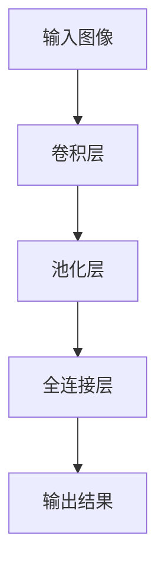
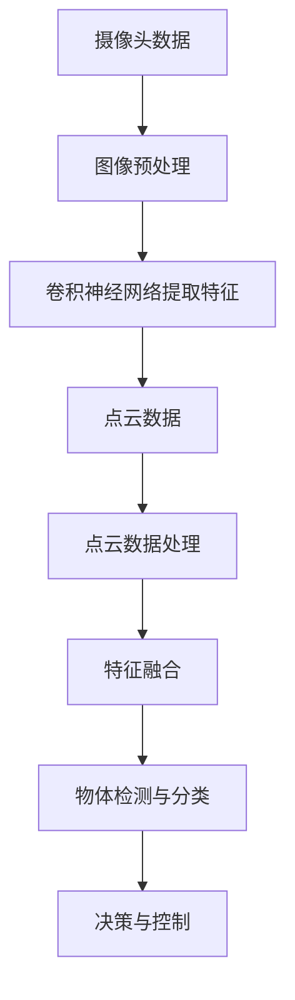
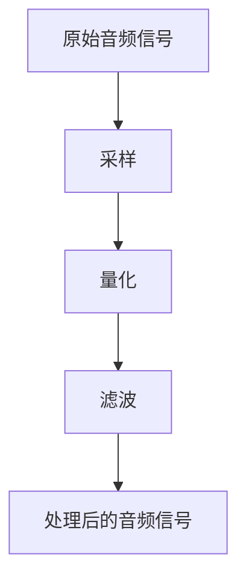
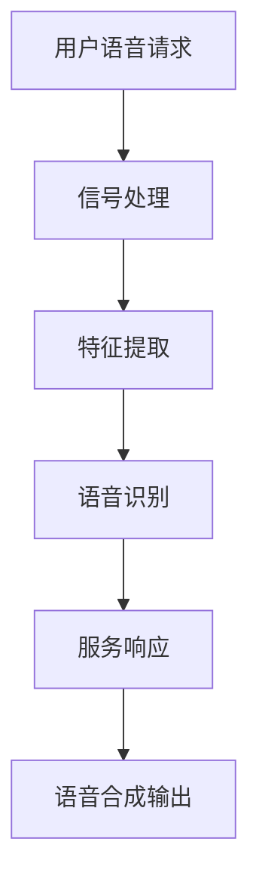
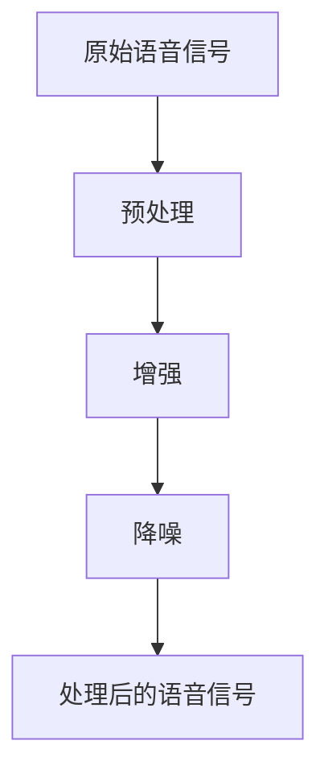
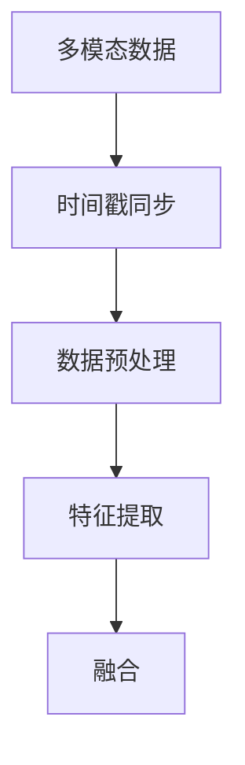
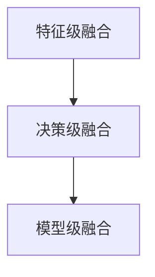
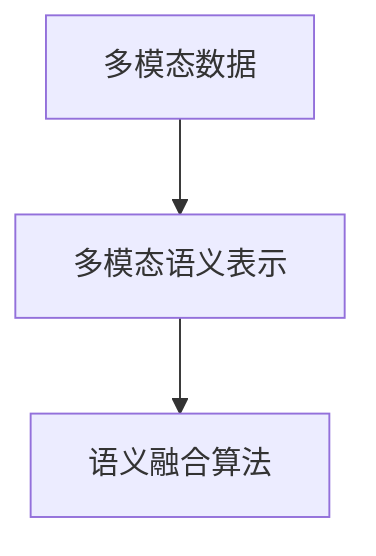
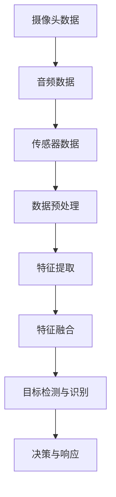
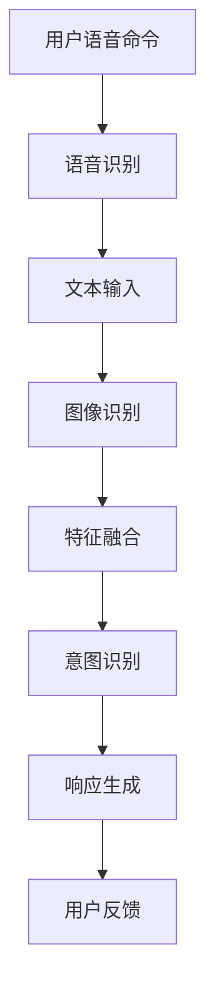

                 

## 文章标题：多模态大模型：技术原理与实战 工具和算法框架介绍

### 关键词：

- 多模态大模型
- 视觉感知
- 音频感知
- 语音感知
- 多模态融合
- Transformer架构
- 生成对抗网络（GAN）
- 变分自编码器（VAE）
- 多模态图像识别
- 多模态语音识别
- 人机交互

### 摘要：

本文深入探讨了多模态大模型的技术原理与实战应用。首先，我们介绍了多模态大模型的背景、意义和应用场景，随后详细阐述了多模态感知技术，包括视觉、音频和语音感知的基础知识。接着，我们探讨了多模态融合技术的核心概念和方法。然后，我们重点介绍了Transformer架构、生成对抗网络（GAN）和变分自编码器（VAE）等算法框架。在应用实战部分，我们展示了多模态图像识别、多模态语音识别和多模态人机交互的实际案例，并详细讲解了开发环境和代码实现。最后，我们总结了多模态大模型的发展趋势，展望了未来研究方向，并给出了对应用开发者的建议。本文旨在为读者提供全面、系统的多模态大模型技术知识，帮助读者更好地理解和应用这一前沿技术。

### 目录大纲：

## 第一部分：多模态大模型概述

### 第1章：多模态大模型背景与意义  
- 1.1 多模态交互的概念与重要性  
- 1.2 多模态大模型的发展历程  
- 1.3 多模态大模型的应用场景  
- 1.4 多模态大模型与单模态大模型对比

### 第2章：多模态感知技术  
- 2.1 视觉感知技术  
  - 2.1.1 卷积神经网络（CNN）基础  
  - 2.1.2 图像识别算法原理  
  - 2.1.3 伪代码示例：卷积神经网络实现  
- 2.2 音频感知技术  
  - 2.2.1 信号处理基础  
  - 2.2.2 音频识别算法原理  
  - 2.2.3 伪代码示例：音频特征提取  
- 2.3 语音感知技术  
  - 2.3.1 语音信号处理  
  - 2.3.2 语音识别算法原理  
  - 2.3.4 伪代码示例：隐藏马尔可夫模型（HMM）

### 第3章：多模态融合技术  
- 3.1 多模态数据同步  
  - 3.1.1 时间戳同步方法  
  - 3.1.2 多模态数据预处理  
  - 3.1.3 伪代码示例：多模态数据同步  
- 3.2 多模态特征融合  
  - 3.2.1 融合策略概述  
  - 3.2.2 常用融合算法  
  - 3.2.3 伪代码示例：特征级融合  
- 3.3 多模态语义理解  
  - 3.3.1 多模态语义表示  
  - 3.3.2 语义融合算法原理  
  - 3.3.3 伪代码示例：语义级融合

## 第二部分：多模态大模型算法框架

### 第4章：Transformer架构  
- 4.1 Transformer基础  
  - 4.1.1 自注意力机制  
  - 4.1.2 位置编码技术  
  - 4.1.3 伪代码示例：Transformer模型实现  
- 4.2 BERT模型  
  - 4.2.1 预训练与微调  
  - 4.2.2 BERT算法原理  
  - 4.2.3 伪代码示例：BERT模型实现

### 第5章：生成对抗网络（GAN）  
- 5.1 GAN基本原理  
  - 5.1.1 生成器与判别器  
  - 5.1.2 伪代码示例：GAN训练过程  
- 5.2 条件GAN（cGAN）  
  - 5.2.1 条件GAN特点  
  - 5.2.2 条件GAN算法原理  
  - 5.2.3 伪代码示例：cGAN实现

### 第6章：变分自编码器（VAE）  
- 6.1 VAE基础  
  - 6.1.1 编码器与解码器  
  - 6.1.2 伪代码示例：VAE模型实现  
- 6.2 正则化变分自编码器（RVAE）  
  - 6.2.1 RVAE原理  
  - 6.2.2 伪代码示例：RVAE实现

## 第三部分：多模态大模型应用实战

### 第7章：多模态图像识别  
- 7.1 数据集介绍  
  - 7.1.1 ImageNet  
  - 7.1.2 Cifar-10  
- 7.2 模型训练与评估  
  - 7.2.1 训练过程  
  - 7.2.2 评估指标  
  - 7.2.3 实际案例解析

### 第8章：多模态语音识别  
- 8.1 语音信号预处理  
  - 8.1.1 语音信号采样  
  - 8.1.2 语音特征提取  
- 8.2 模型训练与评估  
  - 8.2.1 训练过程  
  - 8.2.2 评估指标  
  - 8.2.3 实际案例解析

### 第9章：多模态人机交互  
- 9.1 人机交互模型  
  - 9.1.1 交互意图识别  
  - 9.1.2 交互行为预测  
- 9.2 应用场景  
  - 9.2.1 聊天机器人  
  - 9.2.2 智能助手  
  - 9.2.3 实际案例解析

### 第10章：总结与展望  
- 10.1 多模态大模型的发展趋势  
- 10.2 未来研究方向  
- 10.3 对应用开发者的建议

### 附录

## 附录A：多模态大模型开发工具与资源  
- A.1 Python库  
  - A.1.1 TensorFlow  
  - A.1.2 PyTorch  
- A.2 数据集  
  - A.2.1 ImageNet  
  - A.2.2 Cifar-10  
- A.3 参考资料  
  - A.3.1 论文  
  - A.3.2 书籍  
  - A.3.3 网络资源

---

## 第1章：多模态大模型背景与意义

多模态大模型是人工智能领域的一个重要研究方向，它通过整合多种传感器的数据，如视觉、音频和语音等，以实现对复杂任务的高效处理和智能决策。这一技术不仅提升了人工智能系统的感知能力，还拓展了其应用范围，使得机器能够更自然地与人类互动。

### 1.1 多模态交互的概念与重要性

多模态交互指的是系统同时处理和整合来自多种感官的数据，如视觉、听觉和触觉等。在人类日常生活中，多模态交互是我们感知和理解世界的基础。例如，当我们听音乐时，我们不仅听到声音，还能通过视觉感受到音乐的图像或视频。这种多感官的整合使得我们能够更全面地理解和体验信息。

在人工智能领域，多模态交互的重要性体现在以下几个方面：

1. **提升感知能力**：多模态交互可以整合来自不同传感器数据的信息，使得系统对环境的感知更加全面和准确。
   
2. **增强任务处理能力**：多模态数据可以提供更丰富的上下文信息，有助于系统更好地理解和执行复杂任务。

3. **提升用户体验**：通过多模态交互，人工智能系统能够更自然地与人类互动，提供更加个性化、自然的服务。

### 1.2 多模态大模型的发展历程

多模态大模型的发展可以追溯到20世纪90年代，当时研究者开始探索如何将不同模态的数据整合起来进行任务处理。这一领域的研究主要经历了以下几个阶段：

- **早期研究（1990s-2000s）**：在这个阶段，研究者主要关注如何将不同模态的数据进行特征提取和融合。例如，使用卷积神经网络（CNN）处理视觉数据，使用循环神经网络（RNN）处理语音数据。

- **深度学习兴起（2010s）**：随着深度学习技术的兴起，多模态大模型的研究得到了新的推动。研究者开始探索如何使用深度学习模型同时处理多种模态的数据。

- **大规模预训练模型（2020s）**：近年来，大规模预训练模型如BERT、GPT等在自然语言处理领域取得了显著成果。研究者开始尝试将这些模型应用于多模态领域，以实现更高效的多模态数据处理和任务执行。

### 1.3 多模态大模型的应用场景

多模态大模型在众多领域都有着广泛的应用前景，以下是一些典型应用场景：

- **智能医疗**：多模态大模型可以帮助医生更好地理解和诊断患者的病情，例如通过整合患者的病史、医学影像和语音记录来提高诊断准确率。

- **自动驾驶**：多模态大模型可以整合来自摄像头、雷达、激光雷达和语音传感器的数据，提高自动驾驶系统的感知能力和决策能力，从而提高行车安全。

- **智能客服**：多模态大模型可以整合用户的语音、文本和面部表情等信息，提供更加自然、个性化的服务。

- **教育辅助**：多模态大模型可以帮助学生更好地理解和掌握知识，例如通过整合文本、图像和语音等多模态信息来提高学习效果。

### 1.4 多模态大模型与单模态大模型对比

多模态大模型与单模态大模型在数据处理方式和应用效果上存在显著差异。以下是对两者的对比：

- **数据处理方式**：
  - **多模态大模型**：整合来自多种传感器的数据，进行特征提取和融合，以获得更全面的信息。
  - **单模态大模型**：仅处理来自单一传感器的数据，如仅处理文本数据或图像数据。

- **应用效果**：
  - **多模态大模型**：由于能够整合多种传感器数据，能够更好地理解和处理复杂任务，提高任务的准确率和效率。
  - **单模态大模型**：在特定任务上可能表现较好，但在处理复杂任务时可能受到限制。

总的来说，多模态大模型在处理复杂任务和提升用户体验方面具有显著优势，是未来人工智能发展的重要方向。

---

在接下来的章节中，我们将深入探讨多模态感知技术，包括视觉、音频和语音感知的基础知识，以及如何将这些技术应用于实际场景中。通过这些探讨，我们将进一步理解多模态大模型的强大能力。接下来，让我们开始对视觉感知技术进行详细分析。<!-- mce-staging="1" mce-variant="1" --># 第2章：多模态感知技术

多模态感知技术是构建多模态大模型的基础。它涉及对多种传感数据进行处理、分析和理解，以实现对复杂任务的高效执行。本章将详细介绍视觉感知、音频感知和语音感知技术，包括其核心概念、算法原理和实际应用。

## 2.1 视觉感知技术

视觉感知技术是人工智能领域中的一个重要研究方向，它使机器能够理解、解析和解释视觉信息。视觉感知技术的基础是卷积神经网络（Convolutional Neural Networks，CNN），CNN是一种专门用于处理图像数据的神经网络架构。

### 2.1.1 卷积神经网络（CNN）基础

CNN是一种前馈神经网络，特别适用于处理二维数据，如图像。其核心组件包括卷积层、池化层和全连接层。

#### 核心概念与联系

1. **卷积层（Convolutional Layer）**：
   卷积层是CNN中最核心的层，用于提取图像特征。卷积层使用卷积核（也称为滤波器）在输入图像上滑动，以提取局部特征。每个卷积核对图像局部区域进行加权求和并应用激活函数，产生一个特征图。

2. **池化层（Pooling Layer）**：
   池化层用于减小特征图的尺寸，减少计算量和参数数量。常见的池化操作包括最大池化和平均池化。

3. **全连接层（Fully Connected Layer）**：
   全连接层将特征图映射到类别标签。在图像识别任务中，通常用于实现分类操作。

#### 核心算法原理讲解

CNN的工作流程如下：

1. **卷积操作**：
   卷积层使用多个卷积核在输入图像上滑动，对每个卷积核滑动到的区域进行加权求和，并应用激活函数（如ReLU）。

   ```latex
   \text{output} = \text{ReLU}(\sum_{i=1}^{k} w_{i} \cdot \text{input})
   ```

   其中，\( k \) 表示卷积核的数量，\( w_i \) 表示卷积核的权重。

2. **池化操作**：
   在每个卷积层之后，通常跟随一个池化层，用于减小特征图的尺寸。最大池化选择每个池化区域内的最大值，而平均池化计算区域内所有值的平均值。

   ```latex
   \text{output} = \text{max/avg}(\text{region})
   ```

3. **全连接层**：
   最后，将所有池化层的输出连接到一个全连接层，将特征映射到类别标签。

   ```latex
   \text{output} = \text{softmax}(\text{weights} \cdot \text{input} + \text{bias})
   ```

#### Mermaid 流程图



#### 伪代码示例：卷积神经网络实现

```python
# 伪代码示例：卷积神经网络实现
define ConvLayer(input_shape, filter_shape, stride):
    create filter with filter_shape
    for each position in input_shape - filter_shape + 1:
        apply filter to local region of input
        store result in feature_map
    apply ReLU activation
    return feature_map

define PoolingLayer(input_shape, pool_size, stride):
    for each position in input_shape - pool_size + 1:
        compute max or average value of pool_size region
        store result in output
    return output

define FullyConnectedLayer(input_shape, num_classes):
    create weights and biases
    for each input in input_shape:
        apply weights and biases
        apply softmax activation
    return output
```

### 2.1.2 图像识别算法原理

图像识别是视觉感知技术的核心应用之一。图像识别算法主要通过以下步骤实现：

1. **特征提取**：
   使用CNN从图像中提取特征。

2. **特征融合**：
   将不同卷积层的特征进行融合，形成更高层次的特征表示。

3. **分类**：
   使用全连接层对融合后的特征进行分类。

#### 核心概念与联系

1. **特征提取**：
   CNN通过多层卷积和池化操作，从原始图像中提取特征。

2. **特征融合**：
   特征融合是将不同卷积层的特征进行整合，形成更全面的特征表示。常用的方法包括特征金字塔网络（FPN）和多尺度卷积网络（MSCN）。

3. **分类**：
   通过全连接层对融合后的特征进行分类，实现图像识别。

#### 核心算法原理讲解

图像识别算法的主要流程如下：

1. **特征提取**：
   使用多层卷积层提取图像特征。

   ```latex
   \text{feature\_map} = \text{ConvLayer}(\text{input}, \text{filter\_shape}, \text{stride})
   ```

2. **特征融合**：
   将不同卷积层的特征进行融合。

   ```latex
   \text{merged\_feature} = \text{merge}(\text{feature\_map}_1, \text{feature\_map}_2, ...)
   ```

3. **分类**：
   使用全连接层对融合后的特征进行分类。

   ```latex
   \text{output} = \text{FullyConnectedLayer}(\text{merged\_feature}, \text{num\_classes})
   ```

#### 伪代码示例：图像识别模型

```python
# 伪代码示例：图像识别模型
define ImageRecognitionModel(input_shape, num_classes):
    create ConvLayer(input_shape, [3, 3], stride=1)
    create PoolingLayer(input_shape, [2, 2], stride=2)
    repeat
        create ConvLayer(input_shape, [3, 3], stride=1)
        create PoolingLayer(input_shape, [2, 2], stride=2)
    until input_shape is smaller than desired
    create FullyConnectedLayer(input_shape, num_classes)
    return model
```

### 2.1.3 多模态图像识别的应用

多模态图像识别是将视觉感知技术与其他模态的数据（如音频、语音）进行整合，以实现更准确的图像识别。以下是一些多模态图像识别的应用场景：

1. **智能监控**：
   通过整合摄像头和麦克风数据，实现更准确的监控和目标识别。

2. **医疗影像分析**：
   通过整合图像和患者病历信息，提高医疗影像分析的准确性和效率。

3. **自动驾驶**：
   通过整合摄像头、激光雷达和雷达数据，实现更准确的物体检测和路径规划。

#### 实际案例：多模态图像识别在自动驾驶中的应用

自动驾驶系统需要精确地识别道路上的各种物体，包括车辆、行人、交通标志等。通过整合摄像头和激光雷达数据，可以显著提高物体检测的准确率。

1. **数据采集**：
   使用摄像头和激光雷达同时采集道路图像和三维点云数据。

2. **数据预处理**：
   对图像和点云数据进行预处理，包括去噪、滤波和配准。

3. **特征提取**：
   使用CNN对图像数据进行特征提取，使用点云数据处理算法对点云数据进行特征提取。

4. **特征融合**：
   将图像特征和点云特征进行融合，形成更全面的特征表示。

5. **物体检测和分类**：
   使用融合后的特征进行物体检测和分类，实现自动驾驶中的道路物体识别。



### 小结

视觉感知技术是构建多模态大模型的基础，通过卷积神经网络可以实现高效的图像识别。多模态图像识别通过整合多种模态的数据，提高了图像识别的准确率和鲁棒性。在下一节中，我们将探讨音频感知技术，包括信号处理和音频识别算法原理。

## 2.2 音频感知技术

音频感知技术是使机器能够理解和解析音频信号的关键技术。音频信号是声音的数字表示，通过麦克风等设备采集，然后进行处理和分析。音频感知技术广泛应用于语音识别、语音合成、音乐识别等领域。

### 2.2.1 信号处理基础

信号处理是音频感知技术的核心。它涉及对音频信号进行采样、量化、滤波等处理，以提取有用的信息。

#### 核心概念与联系

1. **采样（Sampling）**：
   采样是将连续时间信号转换为离散时间信号的过程。采样频率决定了信号的分辨率，通常以赫兹（Hz）为单位。

2. **量化（Quantization）**：
   量化是将采样得到的信号幅度转换为有限位数表示的过程。量化位数决定了信号的表现精度。

3. **滤波（Filtering）**：
   滤波用于去除噪声或增强特定频率成分。常见的滤波器包括低通滤波器、高通滤波器和带通滤波器。

#### 核心算法原理讲解

1. **采样**：
   采样是将连续时间信号转换为离散时间信号的过程。采样频率必须大于信号的最高频率，以确保信号不会失真。

   ```latex
   \text{output} = \text{sample}(\text{signal}, \text{sample\_rate})
   ```

2. **量化**：
   量化是将采样得到的信号幅度转换为有限位数表示的过程。量化位数决定了信号的表现精度。

   ```latex
   \text{output} = \text{quantize}(\text{signal}, \text{quantization\_bits})
   ```

3. **滤波**：
   滤波用于去除噪声或增强特定频率成分。常见的滤波器包括低通滤波器、高通滤波器和带通滤波器。

   ```latex
   \text{output} = \text{filter}(\text{signal}, \text{filter\_type}, \text{cut\_off\_frequency})
   ```

#### Mermaid 流程图



### 2.2.2 音频识别算法原理

音频识别技术是将音频信号转换为文本或其他形式的信息。它包括语音识别和音乐识别两个主要领域。

#### 核心概念与联系

1. **语音识别（Speech Recognition）**：
   语音识别是将语音信号转换为文本的过程。它涉及特征提取、模型训练和识别算法。

2. **音乐识别（Music Recognition）**：
   音乐识别是将音乐信号（如旋律、节奏）转换为信息的过程。它涉及音频信号处理、模式识别和分类算法。

#### 核心算法原理讲解

1. **语音识别**：

   语音识别的主要流程包括：

   - **特征提取**：从语音信号中提取特征，如梅尔频率倒谱系数（MFCC）、短时傅里叶变换（STFT）等。
   - **模型训练**：使用训练数据训练模型，如支持向量机（SVM）、循环神经网络（RNN）等。
   - **识别算法**：将提取的特征输入模型，进行分类和识别。

   ```latex
   \text{output} = \text{classify}(\text{feature}, \text{model})
   ```

2. **音乐识别**：

   音乐识别的主要流程包括：

   - **特征提取**：从音乐信号中提取特征，如频谱特征、时序特征等。
   - **模式识别**：使用模式识别算法，如KNN、SVM等，对音乐信号进行分类。
   - **分类**：将提取的特征输入分类模型，进行音乐分类。

   ```latex
   \text{output} = \text{classify}(\text{feature}, \text{model})
   ```

#### 伪代码示例：音频识别模型

```python
# 伪代码示例：音频识别模型
define AudioRecognitionModel(input_shape, num_classes):
    create STFTLayer(input_shape)
    create MFCCLayer(input_shape)
    create FullyConnectedLayer(input_shape, num_classes)
    return model
```

### 2.2.3 音频感知技术在实际应用中的案例

音频感知技术在许多实际应用中发挥着重要作用，以下是一些案例：

1. **智能客服**：
   通过音频感知技术，智能客服系统可以自动识别客户的语音，提供针对性的回答。

2. **语音助手**：
   语音助手（如苹果的Siri、谷歌的Google Assistant）使用音频感知技术来理解和执行用户的语音命令。

3. **语音翻译**：
   通过音频感知技术，语音翻译系统可以实时翻译多种语言的对话。

#### 实际案例：智能客服系统中的音频感知技术

智能客服系统通过音频感知技术，可以自动识别用户的语音请求，提供针对性的服务。

1. **数据采集**：
   使用麦克风采集用户的语音请求。

2. **信号处理**：
   对采集到的语音信号进行预处理，包括降噪、增强和分段。

3. **特征提取**：
   从预处理后的语音信号中提取特征，如MFCC、STFT等。

4. **语音识别**：
   使用训练好的语音识别模型，对提取的特征进行分类，识别用户的请求。

5. **服务响应**：
   根据识别的结果，自动生成回复，并通过语音合成技术输出。



### 小结

音频感知技术是构建多模态大模型的重要组成部分。通过信号处理和音频识别算法，可以实现高效、准确的音频信号分析。在下一节中，我们将探讨语音感知技术，包括语音信号处理和语音识别算法原理。

## 2.3 语音感知技术

语音感知技术是使机器能够理解和解析语音信号的关键技术。语音信号是语言的声音表示，通过麦克风等设备采集，然后进行处理和分析。语音感知技术广泛应用于语音识别、语音合成、语音增强等领域。

### 2.3.1 语音信号处理

语音信号处理是语音感知技术的核心。它涉及对语音信号进行预处理、增强、降噪等处理，以提取有用的信息。

#### 核心概念与联系

1. **语音信号预处理**：
   语音信号预处理包括去噪、去啸叫、归一化等操作，以提高语音信号的清晰度和一致性。

2. **语音增强**：
   语音增强是通过算法改善语音信号的质量，使其更加清晰、易于理解。

3. **语音降噪**：
   语音降噪是从语音信号中去除背景噪声，提高语音的信号质量。

#### 核心算法原理讲解

1. **语音信号预处理**：
   语音信号预处理的主要步骤包括去噪、去啸叫和归一化。

   ```latex
   \text{output} = \text{preprocess}(\text{signal}, \text{noise\_filter}, \text{s Звук}, \text{normalization})
   ```

2. **语音增强**：
   语音增强使用滤波器组对语音信号进行处理，以增强语音的某些频率成分。

   ```latex
   \text{output} = \text{enhance}(\text{signal}, \text{filter\_parameters})
   ```

3. **语音降噪**：
   语音降噪使用谱减法或维纳滤波等算法，从语音信号中去除背景噪声。

   ```latex
   \text{output} = \text{denoise}(\text{signal}, \text{noise\_level}, \text{filter})
   ```

#### Mermaid 流程图



### 2.3.2 语音识别算法原理

语音识别技术是将语音信号转换为文本或其他形式的信息。语音识别算法主要分为传统算法和深度学习算法。

#### 核心概念与联系

1. **传统算法**：
   传统算法包括隐马尔可夫模型（HMM）、高斯混合模型（GMM）等。这些算法基于统计模型，对语音信号进行特征提取和模式识别。

2. **深度学习算法**：
   深度学习算法包括卷积神经网络（CNN）、循环神经网络（RNN）、长短期记忆网络（LSTM）等。这些算法通过多层神经网络结构，对语音信号进行特征学习和分类。

#### 核心算法原理讲解

1. **传统算法**：

   语音识别的传统算法主要包括以下步骤：

   - **特征提取**：从语音信号中提取特征，如MFCC、PLP（倒谱倒谱增益）等。
   - **声学模型**：使用统计模型（如GMM、HMM）对语音信号进行建模，表示语音信号的概率分布。
   - **语言模型**：使用N-gram模型等语言模型，对语音信号进行词法分析，表示语音信号的自然语言概率分布。
   - **解码**：使用Viterbi算法等解码算法，将特征序列映射到文本序列。

   ```latex
   \text{output} = \text{decode}(\text{feature\_sequence}, \text{acoustic\_model}, \text{language\_model})
   ```

2. **深度学习算法**：

   语音识别的深度学习算法主要包括以下步骤：

   - **特征提取**：使用卷积神经网络（CNN）或循环神经网络（RNN）等，对语音信号进行特征提取。
   - **端到端模型**：使用端到端模型（如CTC、Attention机制），直接将语音信号映射到文本序列。
   - **解码**：使用解码算法（如贪心解码、Beam搜索），将特征序列映射到文本序列。

   ```latex
   \text{output} = \text{decode}(\text{feature\_sequence}, \text{model}, \text{decoder})
   ```

#### 伪代码示例：语音识别模型

```python
# 伪代码示例：语音识别模型
define VoiceRecognitionModel(input_shape, num_classes):
    create FeatureExtractionLayer(input_shape)
    create RNNLayer(input_shape, num_classes)
    create FullyConnectedLayer(input_shape, num_classes)
    return model
```

### 2.3.3 语音感知技术在实际应用中的案例

语音感知技术在许多实际应用中发挥着重要作用，以下是一些案例：

1. **智能客服**：
   通过语音感知技术，智能客服系统可以自动识别用户的语音请求，提供针对性的服务。

2. **语音助手**：
   语音助手（如苹果的Siri、谷歌的Google Assistant）使用语音感知技术来理解和执行用户的语音命令。

3. **语音翻译**：
   通过语音感知技术，语音翻译系统可以实时翻译多种语言的对话。

#### 实际案例：智能客服系统中的语音感知技术

智能客服系统通过语音感知技术，可以自动识别用户的语音请求，提供针对性的服务。

1. **数据采集**：
   使用麦克风采集用户的语音请求。

2. **信号处理**：
   对采集到的语音信号进行预处理，包括降噪、增强和分段。

3. **特征提取**：
   从预处理后的语音信号中提取特征，如MFCC、PLP等。

4. **语音识别**：
   使用训练好的语音识别模型，对提取的特征进行分类，识别用户的请求。

5. **服务响应**：
   根据识别的结果，自动生成回复，并通过语音合成技术输出。


### 小结

语音感知技术是构建多模态大模型的重要组成部分。通过语音信号处理和语音识别算法，可以实现高效、准确的语音信号分析。在下一节中，我们将探讨多模态融合技术的核心概念和方法。

## 第3章：多模态融合技术

多模态融合技术是将来自不同模态的数据（如视觉、音频、语音）整合起来，以提高系统的整体性能和鲁棒性。多模态数据融合的核心挑战是如何在保持数据一致性的同时，充分利用不同模态的数据优势。

### 3.1 多模态数据同步

多模态数据同步是多模态融合的首要步骤，它确保不同模态的数据在时间上对齐，以便后续的特征提取和融合。

#### 核心概念与联系

1. **时间戳同步**：
   时间戳同步是通过将不同模态的数据的时间戳对齐，实现数据同步。常见的时间戳同步方法包括基于时间戳对齐、互相关方法等。

2. **数据预处理**：
   数据预处理包括去噪、增强、滤波等操作，以提高数据的质量和一致性。

3. **特征提取**：
   特征提取是从多模态数据中提取有用的信息，如视觉特征（边缘、纹理）、音频特征（频谱、倒谱）等。

#### 核心算法原理讲解

1. **时间戳同步方法**：

   - **基于时间戳对齐**：
     基于时间戳对齐的方法通过直接比较不同模态数据的时间戳来实现同步。这种方法简单有效，但在时间戳存在误差时可能不够精确。

     ```latex
     \text{alignment} = \text{timestamp\_alignment}(\text{timestamp}_\text{vision}, \text{timestamp}_\text{audio})
     ```

   - **互相关方法**：
     互相关方法通过计算不同模态数据的互相关函数，找到最佳的时间对齐点。这种方法对时间戳误差的鲁棒性更好。

     ```latex
     \text{alignment} = \text{cross_correlation}(\text{signal}_\text{vision}, \text{signal}_\text{audio})
     ```

2. **多模态数据预处理**：

   多模态数据预处理包括去噪、增强、滤波等操作，以提高数据的质量和一致性。

   ```latex
   \text{output} = \text{preprocess}(\text{signal}, \text{filter}, \text{enhancement})
   ```

3. **特征提取**：

   特征提取是从多模态数据中提取有用的信息，如视觉特征（边缘、纹理）、音频特征（频谱、倒谱）等。

   ```latex
   \text{feature}_\text{vision} = \text{extract\_features}(\text{image}, \text{filter})
   \text{feature}_\text{audio} = \text{extract\_features}(\text{audio}, \text{filter})
   ```

#### Mermaid 流程图



### 3.2 多模态特征融合

多模态特征融合是将来自不同模态的数据特征进行整合，以形成更全面、更准确的特征表示。特征融合的方法可以分为三种类型：特征级融合、决策级融合和模型级融合。

#### 核心概念与联系

1. **特征级融合**：
   特征级融合是在特征提取阶段就将不同模态的特征进行整合。这种方法简单有效，但可能无法充分利用不同模态的特征优势。

2. **决策级融合**：
   决策级融合是在分类或回归阶段将不同模态的特征进行整合，以形成统一的决策依据。这种方法能够充分利用不同模态的特征优势，但计算复杂度较高。

3. **模型级融合**：
   模型级融合是通过训练多个独立的模型，然后将它们的预测结果进行整合，以形成最终的预测结果。这种方法能够充分利用不同模型的优点，但需要大量的计算资源。

#### 核心算法原理讲解

1. **特征级融合方法**：

   - **加权平均**：
     加权平均是对不同模态的特征进行加权，然后求平均值，以形成综合特征。

     ```latex
     \text{composite\_feature} = \alpha \cdot \text{feature}_\text{vision} + (1 - \alpha) \cdot \text{feature}_\text{audio}
     ```

   - **特征拼接**：
     特征拼接是将不同模态的特征直接拼接在一起，形成更长的特征向量。

     ```latex
     \text{composite\_feature} = [\text{feature}_\text{vision}; \text{feature}_\text{audio}]
     ```

2. **决策级融合方法**：

   - **投票法**：
     投票法是对不同模态的特征分别进行分类，然后根据分类结果进行投票，以形成最终的预测结果。

     ```latex
     \text{output} = \text{vote}(\text{prediction}_\text{vision}, \text{prediction}_\text{audio})
     ```

   - **融合模型**：
     融合模型是通过训练一个统一的模型，将不同模态的特征整合在一起进行预测。

     ```latex
     \text{output} = \text{fusion\_model}(\text{feature}_\text{vision}, \text{feature}_\text{audio})
     ```

3. **模型级融合方法**：

   - **混合模型**：
     混合模型是通过训练多个独立的模型，然后将它们的预测结果进行整合，以形成最终的预测结果。

     ```latex
     \text{output} = \text{average}(\text{prediction}_1, \text{prediction}_2, ...)
     ```

#### Mermaid 流程图



### 3.3 多模态语义理解

多模态语义理解是将不同模态的数据映射到统一的语义空间，以实现更深刻的语义理解和交互。多模态语义理解的关键是语义融合，即将不同模态的语义信息进行整合。

#### 核心概念与联系

1. **多模态语义表示**：
   多模态语义表示是将不同模态的数据（如视觉、音频、语音）映射到统一的语义空间，以实现语义信息的整合。

2. **语义融合算法**：
   语义融合算法是将不同模态的语义信息进行整合，以形成更全面的语义表示。常用的语义融合算法包括语义融合网络（Semantic Fusion Network）和融合嵌入（Fused Embeddings）等。

#### 核心算法原理讲解

1. **多模态语义表示**：

   - **共现矩阵**：
     共现矩阵是通过统计不同模态数据之间的共现关系，构建多模态语义表示。

     ```latex
     \text{co-occurrence\_matrix} = \text{count}(\text{vision}, \text{audio}, \text{speech})
     ```

   - **融合嵌入**：
     融合嵌入是通过训练一个嵌入模型，将不同模态的数据映射到统一的语义空间。

     ```latex
     \text{embeddings} = \text{embed}(\text{vision}, \text{audio}, \text{speech})
     ```

2. **语义融合算法**：

   - **融合神经网络**：
     融合神经网络是通过多层神经网络结构，将不同模态的语义信息进行整合。

     ```latex
     \text{output} = \text{fusion\_network}(\text{embeddings}_\text{vision}, \text{embeddings}_\text{audio}, \text{embeddings}_\text{speech})
     ```

   - **注意力机制**：
     注意力机制是通过学习不同模态的权重，实现对模态选择的动态调整。

     ```latex
     \text{output} = \text{attention}(\text{embeddings}_\text{vision}, \text{embeddings}_\text{audio}, \text{embeddings}_\text{speech})
     ```

#### Mermaid 流程图



### 3.4 多模态融合技术在实际应用中的案例

多模态融合技术在许多实际应用中发挥着重要作用，以下是一些案例：

1. **智能监控**：
   通过整合摄像头、麦克风和传感器数据，实现更精确的目标检测和识别。

2. **医疗诊断**：
   通过整合医学影像、患者病史和语音记录，提高诊断准确率和治疗效果。

3. **人机交互**：
   通过整合视觉、音频和语音信息，实现更自然、更高效的人机交互。

#### 实际案例：智能监控中的多模态融合技术

智能监控通过整合摄像头、麦克风和传感器数据，实现更精确的目标检测和识别。

1. **数据采集**：
   通过摄像头采集视频数据，通过麦克风采集音频数据，通过传感器采集环境数据。

2. **数据预处理**：
   对采集到的数据进行预处理，包括去噪、滤波、时间戳同步等。

3. **特征提取**：
   从预处理后的数据中提取特征，如视觉特征（边缘、纹理）、音频特征（频谱、倒谱）等。

4. **特征融合**：
   使用特征融合算法，如加权平均、特征拼接等，将不同模态的特征进行整合。

5. **目标检测和识别**：
   使用融合后的特征进行目标检测和识别，如人脸识别、行为识别等。

6. **决策与响应**：
   根据检测结果，进行报警、记录或其他响应。



### 小结

多模态融合技术通过整合不同模态的数据，提高了系统的整体性能和鲁棒性。多模态数据同步、特征融合和语义理解是多模态融合技术的核心。在下一章中，我们将探讨多模态大模型算法框架，包括Transformer架构、生成对抗网络（GAN）和变分自编码器（VAE）等。

## 第4章：多模态大模型算法框架

多模态大模型算法框架是构建高效、准确的多模态大模型的核心。本章将详细介绍几种常见的多模态大模型算法框架，包括Transformer架构、生成对抗网络（GAN）和变分自编码器（VAE），并探讨它们在多模态数据处理中的应用。

### 第4章：Transformer架构

Transformer架构是由Vaswani等人在2017年提出的一种基于自注意力机制的深度学习模型，最初用于自然语言处理任务，如机器翻译和文本生成。近年来，Transformer架构在多模态领域也得到了广泛应用。

#### 4.1 Transformer基础

Transformer架构的核心是自注意力机制（Self-Attention）和位置编码（Positional Encoding）。

##### 4.1.1 自注意力机制

自注意力机制允许模型在处理序列数据时，对不同的位置赋予不同的权重，从而实现对序列的灵活建模。

- **核心概念与联系**：

  自注意力机制通过计算每个词与其余词之间的相似性，对输入序列进行加权求和，生成新的序列表示。

  ```mermaid
  graph TD
  A1[词1] --> B1[词2]
  A1 --> B2[词3]
  A2[词1'] --> B2[词3']
  ```

- **核心算法原理讲解**：

  自注意力机制的实现通常包括以下几个步骤：

  1. **计算查询（Query）、键（Key）和值（Value）**：

     ```latex
     Q = \text{Query}(X)
     K = \text{Key}(X)
     V = \text{Value}(X)
     ```

     其中，\( X \) 是输入序列。

  2. **计算自注意力得分**：

     ```latex
     \text{score} = \text{softmax}(\frac{QK^T}{\sqrt{d_k}})
     ```

     其中，\( d_k \) 是键的维度。

  3. **计算加权求和**：

     ```latex
     \text{context} = \text{softmax}(\text{score}V
     ```

  4. **输出结果**：

     ```latex
     \text{output} = \text{context}
     ```

##### 4.1.2 位置编码技术

位置编码为序列中的每个词赋予了位置信息，使得模型能够理解词的位置关系。

- **核心概念与联系**：

  位置编码通过为每个词添加一个向量，表示其在序列中的位置。

  ```mermaid
  graph TD
  A[词1] --> B[词2]
  C[位置编码1] --> A
  D[位置编码2] --> B
  ```

- **核心算法原理讲解**：

  位置编码的实现通常包括以下几种方法：

  1. **绝对位置编码**：

     ```latex
     \text{pos\_embed} = \text{sin}(\frac{pos \cdot \text{inv\_sqrt}}{10000^{2i/d}}) \text{ or } \text{cos}(\frac{pos \cdot \text{inv\_sqrt}}{10000^{2i/d}})
     ```

     其中，\( pos \) 是词的位置，\( i \) 是词的索引，\( d \) 是位置编码的维度。

  2. **相对位置编码**：

     ```latex
     \text{pos\_embed} = \text{positional\_encoding}(pos, \text{d})
     ```

##### 4.1.3 伪代码示例：Transformer模型实现

```python
# 伪代码示例：Transformer模型实现
define TransformerModel(input_shape, num_heads, num_layers, d_model, d_inner, dropout_rate):
    # 创建位置编码
    pos_embedding = create_positional_embedding(input_shape, d_model)
    
    # 创建Transformer编码器
    for layer in range(num_layers):
        layer = create_transformer_layer(num_heads, d_model, d_inner, dropout_rate)
        encode = layer(encode)
    
    # 附加位置编码
    encode = encode + pos_embedding
    
    # 应用Dropout
    encode = dropout(encode, dropout_rate)
    
    # 返回编码后的序列
    return encode
```

#### 4.2 BERT模型

BERT（Bidirectional Encoder Representations from Transformers）是Google在2018年提出的一种基于Transformer的双向编码器模型，旨在为自然语言处理任务提供高质量的语言表示。BERT在预训练阶段使用了大量的无标注文本数据，通过上下文信息来学习单词的表示。

##### 4.2.1 预训练与微调

BERT的预训练过程主要包括两个阶段：Masked Language Modeling（MLM）和Next Sentence Prediction（NSP）。

- **Masked Language Modeling（MLM）**：

  MLM的目标是预测输入序列中被随机遮蔽的单词。

  ```mermaid
  graph TD
  A[输入序列] --> B[MASK]
  B --> C[预测结果]
  ```

- **Next Sentence Prediction（NSP）**：

  NSP的目标是预测两个句子是否在输入序列中相邻。

  ```mermaid
  graph TD
  A[输入序列1] --> B[输入序列2]
  C[预测结果]
  ```

##### 4.2.2 BERT算法原理

BERT模型通过两个主要步骤进行预训练和微调：

1. **预训练**：

   - **Masked Language Modeling（MLM）**：

     ```latex
     \text{output} = \text{bert}(\text{input}, \text{mask_ratio})
     ```

   - **Next Sentence Prediction（NSP）**：

     ```latex
     \text{output} = \text{ns\_predict}(\text{input}, \text{next_sentence})
     ```

2. **微调**：

   在预训练后，BERT模型可以根据特定的任务进行微调。微调的过程通常包括以下步骤：

   - **数据准备**：

     ```latex
     \text{train\_data} = \text{prepare_data}(\text{corpus})
     ```

   - **模型微调**：

     ```latex
     \text{output} = \text{fine\_tune}(\text{bert}, \text{train\_data})
     ```

##### 4.2.3 伪代码示例：BERT模型实现

```python
# 伪代码示例：BERT模型实现
define BERTModel(vocab_size, d_model, num_layers, num_heads, dropout_rate):
    # 创建嵌入层
    embedding = create_embedding(vocab_size, d_model)
    
    # 创建Transformer编码器
    for layer in range(num_layers):
        layer = create_transformer_layer(num_heads, d_model, dropout_rate)
        encode = layer(encode)
    
    # 返回编码后的序列
    return encode
```

### 第5章：生成对抗网络（GAN）

生成对抗网络（Generative Adversarial Network，GAN）是由Goodfellow等人在2014年提出的一种深度学习模型，由生成器和判别器两个神经网络组成。生成器试图生成逼真的数据，而判别器试图区分生成器和真实数据。通过两个网络的对抗训练，生成器可以不断提高生成数据的质量。

#### 5.1 GAN基本原理

GAN的核心是生成器和判别器的对抗训练过程。

- **生成器（Generator）**：

  生成器的目标是生成逼真的数据，以欺骗判别器。

  ```mermaid
  graph TD
  A[随机噪声] --> B[生成器]
  B --> C[生成数据]
  ```

- **判别器（Discriminator）**：

  判别器的目标是区分生成器和真实数据。

  ```mermaid
  graph TD
  A[真实数据] --> B[判别器]
  B --> C[输出概率]
  ```

- **对抗训练**：

  生成器和判别器通过对抗训练不断优化。生成器尝试提高生成数据的质量，使判别器难以区分；而判别器则努力提高对真实数据和生成数据的鉴别能力。

  ```mermaid
  graph TD
  A[生成器] --> B[判别器]
  B --> C[对抗训练]
  ```

##### 5.1.1 伪代码示例：GAN训练过程

```python
# 伪代码示例：GAN训练过程
define GANModel(Discriminator, Generator, num_epochs, batch_size):
    for epoch in range(num_epochs):
        for batch in data_loader:
            # 训练判别器
            D_loss = train_discriminator(Discriminator, batch)
            
            # 训练生成器
            G_loss = train_generator(Generator, D_loss)
        
        print(f"Epoch [{epoch+1}/{num_epochs}], D_loss: {D_loss}, G_loss: {G_loss}")
```

#### 5.2 条件GAN（cGAN）

条件GAN（Conditional Generative Adversarial Network，cGAN）是在GAN的基础上引入条件信息，以提高生成数据的质量和多样性。

##### 5.2.1 条件GAN特点

- **条件输入**：

  cGAN通过引入条件信息（如标签、类别等），生成更具有特定属性的数据。

  ```mermaid
  graph TD
  A[条件信息] --> B[生成器]
  B --> C[生成数据]
  ```

- **条件输出**：

  cGAN的生成器和判别器都接受条件信息作为输入，以生成和鉴别更具有特定属性的数据。

  ```mermaid
  graph TD
  A[条件信息] --> B[生成器]
  B --> C[生成数据]
  A --> D[判别器]
  D --> E[输出概率]
  ```

##### 5.2.2 条件GAN算法原理

条件GAN的算法原理与GAN类似，但增加了条件信息。以下是一个简化的伪代码示例：

```python
# 伪代码示例：cGAN实现
define cGANModel(Discriminator, Generator, num_epochs, batch_size, condition_size):
    for epoch in range(num_epochs):
        for batch in data_loader:
            # 训练判别器
            D_loss = train_discriminator(Discriminator, batch, condition_size)
            
            # 训练生成器
            G_loss = train_generator(Generator, D_loss, condition_size)
        
        print(f"Epoch [{epoch+1}/{num_epochs}], D_loss: {D_loss}, G_loss: {G_loss}")
```

### 第6章：变分自编码器（VAE）

变分自编码器（Variational Autoencoder，VAE）是一种生成模型，由编码器和解码器两个神经网络组成。编码器将输入数据编码为潜变量，解码器将潜变量解码为输出数据。VAE通过引入潜在变量，实现了数据的降维和生成。

#### 6.1 VAE基础

##### 6.1.1 编码器与解码器

- **编码器（Encoder）**：

  编码器的目标是学习输入数据的潜在变量表示。

  ```mermaid
  graph TD
  A[输入数据] --> B[编码器]
  B --> C[潜在变量]
  ```

- **解码器（Decoder）**：

  解码器的目标是根据潜在变量生成输出数据。

  ```mermaid
  graph TD
  A[潜在变量] --> B[解码器]
  B --> C[输出数据]
  ```

##### 6.1.2 伪代码示例：VAE模型实现

```python
# 伪代码示例：VAE模型实现
define VAEModel(input_shape, latent_size, encoder, decoder):
    # 训练编码器
    encoder_loss = train_encoder(encoder, input_shape)
    
    # 训练解码器
    decoder_loss = train_decoder(decoder, latent_size)
    
    # 返回编码器和解码器的损失
    return encoder_loss, decoder_loss
```

#### 6.2 正则化变分自编码器（RVAE）

正则化变分自编码器（Regularized Variational Autoencoder，RVAE）是在VAE的基础上引入了额外的正则化项，以提高生成模型的质量和稳定性。

##### 6.2.1 RVAE原理

RVAE通过在编码器和解码器的损失函数中引入正则化项，实现对生成模型的约束。以下是一个简化的伪代码示例：

```python
# 伪代码示例：RVAE实现
define RVAEModel(input_shape, latent_size, encoder, decoder, regularization_strength):
    # 训练编码器
    encoder_loss = train_encoder(encoder, input_shape, regularization_strength)
    
    # 训练解码器
    decoder_loss = train_decoder(decoder, latent_size, regularization_strength)
    
    # 返回编码器和解码器的损失
    return encoder_loss, decoder_loss
```

### 总结

多模态大模型算法框架包括Transformer架构、生成对抗网络（GAN）和变分自编码器（VAE）等。这些模型通过不同的机制实现了对多模态数据的处理和生成。在下一章中，我们将探讨多模态大模型的应用实战，包括多模态图像识别、多模态语音识别和多模态人机交互等。

## 第7章：多模态图像识别

多模态图像识别是利用多种传感器数据（如摄像头、激光雷达、麦克风等）来增强图像识别的性能。这种技术通过结合不同模态的信息，提高图像识别的准确率、鲁棒性和泛化能力。本章将详细介绍多模态图像识别的数据集、模型训练与评估方法，并通过实际案例展示多模态图像识别的应用。

### 7.1 数据集介绍

选择合适的数据集是多模态图像识别研究的重要环节。以下是一些常用的多模态图像识别数据集：

#### 7.1.1 ImageNet

ImageNet是一个大规模的视觉识别数据集，包含约1400万个标注图像，分布在1000个类别中。ImageNet被广泛用于计算机视觉任务，如图像分类、目标检测和语义分割。为了支持多模态图像识别，研究者通常会将ImageNet与其他数据集（如Speech Commands、AudioSet等）结合，构建多模态扩展数据集。

#### 7.1.2 Cifar-10

Cifar-10是一个包含10个类别、60000张32x32彩色图像的小型数据集。Cifar-10数据集常用于训练和评估简单的图像识别模型，其类别包括飞机、汽车、鸟、猫、鹿、狗、青蛙、马、船和卡车。在多模态图像识别研究中，Cifar-10可以作为基础数据集，通过引入多模态信息来提高模型性能。

### 7.2 模型训练与评估

多模态图像识别模型通常采用端到端的训练方式，将不同模态的数据整合到一个统一的框架中。以下是一个典型的多模态图像识别模型训练和评估流程：

#### 7.2.1 训练过程

1. **数据预处理**：

   在训练过程中，需要对多模态数据（如图像、音频、文本等）进行预处理，包括数据清洗、归一化、缩放和裁剪等操作。例如，将图像缩放到固定大小，将音频信号转换为梅尔频率倒谱系数（MFCC）特征。

2. **特征提取**：

   使用不同的神经网络模型（如卷积神经网络、循环神经网络等）对多模态数据进行特征提取。对于图像数据，可以使用卷积神经网络提取视觉特征；对于音频数据，可以使用循环神经网络提取音频特征。

3. **特征融合**：

   将提取的多模态特征进行融合，形成更全面的特征表示。常用的特征融合方法包括特征拼接、加权平均和深度学习等。

4. **训练模型**：

   使用融合后的特征训练图像识别模型，如卷积神经网络、循环神经网络、Transformer等。训练过程中需要优化模型参数，以最小化损失函数。

5. **模型评估**：

   在训练完成后，使用验证集或测试集对模型进行评估。常用的评估指标包括准确率、召回率、F1分数和交叉验证等。

#### 7.2.2 评估指标

1. **准确率（Accuracy）**：

   准确率是模型预测正确的样本数与总样本数之比，是评估分类模型性能的基本指标。

   ```latex
   \text{Accuracy} = \frac{\text{Correct Predictions}}{\text{Total Predictions}}
   ```

2. **召回率（Recall）**：

   召回率是模型预测正确的正样本数与所有实际正样本数之比，反映了模型对正样本的识别能力。

   ```latex
   \text{Recall} = \frac{\text{True Positives}}{\text{True Positives + False Negatives}}
   ```

3. **精确率（Precision）**：

   精确率是模型预测正确的正样本数与预测为正样本的总数之比，反映了模型对正样本的识别准确度。

   ```latex
   \text{Precision} = \frac{\text{True Positives}}{\text{True Positives + False Positives}}
   ```

4. **F1分数（F1 Score）**：

   F1分数是精确率和召回率的调和平均，是评估分类模型性能的综合性指标。

   ```latex
   \text{F1 Score} = 2 \cdot \frac{\text{Precision} \cdot \text{Recall}}{\text{Precision} + \text{Recall}}
   ```

#### 7.2.3 实际案例解析：基于ImageNet的多模态图像识别

以下是一个基于ImageNet数据集的多模态图像识别实际案例，展示了如何构建和训练多模态图像识别模型。

1. **数据集准备**：

   从ImageNet数据集中获取图像和对应的标签，并从音频数据集中获取与图像对应的音频文件。将图像和音频数据进行预处理，如缩放、裁剪、归一化等。

2. **特征提取**：

   使用卷积神经网络提取图像特征，使用循环神经网络提取音频特征。例如，使用ResNet提取图像特征，使用LSTM提取音频特征。

3. **特征融合**：

   将提取的图像特征和音频特征进行拼接，形成更全面的特征向量。

4. **模型训练**：

   使用融合后的特征训练多模态图像识别模型，如使用Transformer模型。优化模型参数，以最小化损失函数。

5. **模型评估**：

   使用测试集对训练好的模型进行评估，计算准确率、召回率、精确率和F1分数等指标。

```python
# 伪代码示例：多模态图像识别模型训练与评估
define MultiModalImageRecognitionModel(input_shape, num_classes):
    # 创建图像特征提取器
    image_extractor = create_image_extractor(input_shape)
    
    # 创建音频特征提取器
    audio_extractor = create_audio_extractor(input_shape)
    
    # 创建特征融合器
    feature_fuser = create_feature_fuser()
    
    # 创建多模态图像识别模型
    model = create_model(feature_fuser, num_classes)
    
    # 训练模型
    model.train(data_loader, num_epochs)
    
    # 评估模型
    metrics = model.evaluate(test_loader)
    print(f"Accuracy: {metrics['accuracy']}, Recall: {metrics['recall']}, Precision: {metrics['precision']}, F1 Score: {metrics['f1_score']}")
```

### 小结

多模态图像识别通过结合不同模态的信息，提高了图像识别的准确率、鲁棒性和泛化能力。本章介绍了多模态图像识别的数据集、模型训练与评估方法，并通过实际案例展示了多模态图像识别的应用。在下一章中，我们将探讨多模态语音识别，包括语音信号预处理和模型训练与评估。

## 第8章：多模态语音识别

多模态语音识别是一种通过结合语音和视觉信息来提高语音识别性能的技术。这种技术利用了视觉信息（如口型、面部表情等）来辅助语音信号的理解，从而提高识别的准确性。本章将详细介绍多模态语音识别中的语音信号预处理和模型训练与评估方法。

### 8.1 语音信号预处理

语音信号预处理是多模态语音识别的关键步骤，它包括采样、量化、降噪和特征提取等操作。

#### 8.1.1 语音信号采样

语音信号采样是将连续时间信号转换为离散时间信号的过程。采样频率决定了信号的分辨率，通常设置为44.1kHz或更高。

- **核心算法原理讲解**：

  采样可以通过以下公式实现：

  ```latex
  \text{output} = \text{sample}(\text{signal}, \text{sample\_rate})
  ```

- **伪代码示例**：

  ```python
  # 伪代码示例：语音信号采样
  def sample_signal(signal, sample_rate):
      # 创建空数组
      samples = []
      
      # 计算采样点数
      num_samples = len(signal) * sample_rate
      
      # 对信号进行采样
      for i in range(num_samples):
          samples.append(signal[int(i / sample_rate)])
      
      return samples
  ```

#### 8.1.2 语音特征提取

语音特征提取是将语音信号转换为数值特征向量的过程。常用的语音特征包括梅尔频率倒谱系数（MFCC）、频谱特征、倒谱倒谱增益（PLP）等。

- **核心算法原理讲解**：

  MFCC特征提取的步骤如下：

  1. **预处理**：
     对语音信号进行预加重、加窗和短时傅里叶变换（STFT）。

  2. **滤波器组**：
     使用梅尔频率滤波器组对STFT结果进行滤波。

  3. **倒谱变换**：
     对滤波器组的结果进行倒谱变换。

  4. **微分**：
     对MFCC特征进行一阶和二阶微分。

- **伪代码示例**：

  ```python
  # 伪代码示例：MFCC特征提取
  def extract_mfcc(signal, sample_rate, num_coeffs=13):
      # 预处理
      preprocessed_signal = preprocess_signal(signal)
      
      # 短时傅里叶变换
      stft_result = stft(preprocessed_signal, sample_rate)
      
      # 滤波器组
      filter_banks = filter_banks(stft_result, sample_rate)
      
      # 倒谱变换
      mfcc = log(filter_banks)
      
      # 微分
      mfcc_diff = [diff(mfcc) for mfcc in mfcc]
      mfcc_diff2 = [diff(mfcc_diff) for mfcc_diff in mfcc_diff]
      
      return mfcc + mfcc_diff + mfcc_diff2
  ```

### 8.2 模型训练与评估

多模态语音识别模型通常采用端到端的训练方式，将语音信号和视觉信息整合到一个统一的框架中。以下是一个典型的多模态语音识别模型训练和评估流程：

#### 8.2.1 训练过程

1. **数据预处理**：
   对语音信号和视觉数据进行预处理，包括采样、归一化和特征提取等。例如，将语音信号转换为MFCC特征，将视觉数据转换为面部特征向量。

2. **特征融合**：
   将提取的语音特征和视觉特征进行融合，形成更全面的特征向量。常用的融合方法包括特征拼接、加权平均和深度学习等。

3. **训练模型**：
   使用融合后的特征训练多模态语音识别模型，如使用卷积神经网络、循环神经网络或Transformer等。训练过程中需要优化模型参数，以最小化损失函数。

4. **模型评估**：
   在训练完成后，使用验证集或测试集对模型进行评估。常用的评估指标包括词错误率（WER）、字符错误率（CER）和准确性等。

#### 8.2.2 评估指标

1. **词错误率（Word Error Rate，WER）**：
   词错误率是评估语音识别模型性能的主要指标，计算公式如下：

   ```latex
   \text{WER} = \frac{\text{总错误词数}}{\text{总词数}}
   ```

2. **字符错误率（Character Error Rate，CER）**：
   字符错误率是评估文本识别模型性能的指标，计算公式如下：

   ```latex
   \text{CER} = \frac{\text{总错误字符数}}{\text{总字符数}}
   ```

3. **准确性（Accuracy）**：
   准确性是模型预测正确的样本数与总样本数之比，是评估分类模型性能的基本指标。

   ```latex
   \text{Accuracy} = \frac{\text{正确预测数}}{\text{总预测数}}
   ```

#### 8.2.3 实际案例解析：基于LRW数据集的多模态语音识别

以下是一个基于LRW（Linguistic and Visual Resources for Human-Machine Dialogue）数据集的多模态语音识别实际案例，展示了如何构建和训练多模态语音识别模型。

1. **数据集准备**：
   从LRW数据集中获取语音和视觉数据，包括语音音频文件和面部视频帧。对语音信号进行预处理，如去除噪声、加窗和MFCC特征提取。对视觉数据提取面部特征，如面部关键点坐标、面部表情等。

2. **特征融合**：
   将语音MFCC特征和面部特征进行拼接，形成更全面的特征向量。

3. **模型训练**：
   使用拼接后的特征训练多模态语音识别模型，如使用卷积神经网络或循环神经网络。优化模型参数，以最小化损失函数。

4. **模型评估**：
   使用测试集对训练好的模型进行评估，计算词错误率、字符错误率和准确性等指标。

```python
# 伪代码示例：多模态语音识别模型训练与评估
def train_and_evaluate_model(model, train_loader, test_loader):
    # 训练模型
    model.train(train_loader)
    
    # 评估模型
    test_loss, wer, cer, accuracy = model.evaluate(test_loader)
    
    print(f"Test Loss: {test_loss}, WER: {wer}, CER: {cer}, Accuracy: {accuracy}")
```

### 小结

多模态语音识别通过结合语音和视觉信息，提高了语音识别的准确性和鲁棒性。本章介绍了语音信号预处理和模型训练与评估方法，并通过实际案例展示了多模态语音识别的应用。在下一章中，我们将探讨多模态人机交互，包括人机交互模型和应用场景。

## 第9章：多模态人机交互

多模态人机交互是一种利用多种感官信息（如视觉、听觉、触觉等）来提高人机交互体验的技术。这种技术通过整合不同模态的信息，使机器能够更自然地理解和响应人类行为。本章将详细介绍多模态人机交互模型、应用场景，并通过实际案例展示其应用。

### 9.1 人机交互模型

多模态人机交互模型的核心在于如何整合不同模态的信息，以实现更准确和高效的交互。以下是一个简化的多模态人机交互模型：

1. **感知模块**：
   感知模块负责收集和处理来自不同模态的信息，如视觉、音频、语音等。通过传感器和预处理技术，感知模块将原始数据转换为数值特征。

2. **特征融合模块**：
   特征融合模块将不同模态的特征进行整合，形成更全面的特征向量。常用的融合方法包括特征拼接、加权平均和深度学习等。

3. **决策模块**：
   决策模块根据融合后的特征，进行意图识别、行为预测等任务。决策模块通常使用神经网络、决策树、规则引擎等技术。

4. **响应模块**：
   响应模块根据决策结果，生成相应的反馈，如语音回复、文本消息、视觉动画等。响应模块需要考虑不同模态的呈现方式，以提供自然、个性化的交互体验。

### 9.2 应用场景

多模态人机交互在多个领域有着广泛的应用，以下是一些典型应用场景：

#### 9.2.1 聊天机器人

聊天机器人是一种通过文本或语音与用户进行交互的智能系统。通过整合语音和文本信息，聊天机器人可以更准确地理解用户的意图，提供个性化的回复。

- **感知模块**：
  聊天机器人的感知模块包括语音识别和文本处理。语音识别将用户的语音转换为文本，文本处理则分析文本信息。

- **特征融合模块**：
  聊天机器人将语音和文本特征进行融合，形成更全面的特征向量。

- **决策模块**：
  决策模块根据融合后的特征，识别用户的意图，如问候、请求帮助、表达情感等。

- **响应模块**：
  根据识别的意图，聊天机器人生成相应的回复，如语音、文本或视觉动画。

#### 9.2.2 智能助手

智能助手是一种提供个性化服务的智能系统，可以通过语音、文本或手势与用户进行交互。智能助手广泛应用于智能家居、健康监护、旅游导航等领域。

- **感知模块**：
  智能助手的感知模块包括语音识别、图像识别、手势识别等。这些模块可以识别用户的语音、文本、图像和手势。

- **特征融合模块**：
  智能助手将不同模态的特征进行融合，形成更全面的特征向量。

- **决策模块**：
  决策模块根据融合后的特征，预测用户的意图，如控制家电、提醒日程、导航等。

- **响应模块**：
  根据识别的意图，智能助手执行相应的操作，如发送短信、打开灯光、播放音乐等。

#### 9.2.3 实际案例解析：智能助手的多模态人机交互

以下是一个智能助手的多模态人机交互实际案例，展示了如何结合语音、文本、图像等多模态信息，提供高效、个性化的服务。

1. **感知模块**：
   - **语音识别**：用户通过语音命令启动智能助手。
   - **文本处理**：智能助手分析用户的文本输入，以理解用户的需求。
   - **图像识别**：智能助手识别用户上传的图像，以获取更多的上下文信息。

2. **特征融合模块**：
   智能助手将语音、文本和图像特征进行融合，形成更全面的特征向量。例如，将语音特征和文本特征进行拼接，将图像特征转换为视觉嵌入。

3. **决策模块**：
   智能助手根据融合后的特征，预测用户的意图。例如，如果用户上传了一张餐厅的图像，智能助手可能会识别出用户的意图是“预订餐厅”。

4. **响应模块**：
   根据识别的意图，智能助手提供相应的服务。例如，如果用户意图是“预订餐厅”，智能助手会生成一个预订界面，允许用户选择时间和座位。



### 小结

多模态人机交互通过整合不同模态的信息，提供了更自然、更高效的交互体验。本章介绍了多模态人机交互模型和应用场景，并通过实际案例展示了其应用。在下一章中，我们将总结多模态大模型的发展趋势、未来研究方向，并对应用开发者提出建议。

## 第10章：总结与展望

多模态大模型作为人工智能领域的前沿研究方向，已经在多个领域取得了显著的成果。通过对多种模态数据的整合和处理，多模态大模型显著提升了系统的感知能力、决策能力和用户体验。以下是对多模态大模型的发展趋势、未来研究方向以及对应用开发者的建议进行总结。

### 10.1 多模态大模型的发展趋势

1. **模型规模的不断扩大**：
   随着计算能力的提升，多模态大模型的规模和参数数量将不断增长。这有助于模型更好地捕捉复杂任务中的细微特征，提高模型的性能。

2. **端到端模型的应用**：
   端到端模型使得多模态数据的处理更加高效和直观。未来，端到端模型将在多模态大模型中占据主导地位，简化模型的构建和训练过程。

3. **跨模态交互的深化**：
   跨模态交互是多模态大模型的核心特性之一。未来，研究者将致力于深化不同模态之间的交互机制，提高模型对多模态数据的理解和处理能力。

4. **实时性和鲁棒性的提升**：
   随着应用的不断扩展，多模态大模型需要具备更高的实时性和鲁棒性。未来，研究者将探索新的算法和技术，以提高模型的实时响应能力和适应性。

### 10.2 未来研究方向

1. **多模态数据的自动标注**：
   自动标注是实现多模态大模型高效训练的关键。未来，研究者将致力于开发自动标注技术，以降低数据标注的成本。

2. **动态多模态交互**：
   动态多模态交互是指模型能够实时适应和调整不同模态的信息。未来，研究者将探索动态多模态交互的机制，提高模型的灵活性和适应性。

3. **多模态隐私保护**：
   随着多模态数据的广泛应用，隐私保护成为一个重要议题。未来，研究者将关注多模态数据的隐私保护技术，以确保用户数据的隐私和安全。

4. **跨领域和多语言支持**：
   多模态大模型的应用将扩展到更多领域和语言。未来，研究者将致力于开发跨领域和多语言的多模态模型，提高模型的应用范围。

### 10.3 对应用开发者的建议

1. **关注数据质量和多样性**：
   多模态大模型的性能高度依赖于数据的质量和多样性。应用开发者应关注数据的质量控制和多样化，以提高模型的泛化能力。

2. **深入理解模型原理**：
   应用开发者应深入理解多模态大模型的原理，包括模型架构、训练过程和优化方法。这有助于开发者更好地调整模型参数，提高模型性能。

3. **持续优化算法和架构**：
   应用开发者应持续关注算法和架构的创新，探索新的模型结构和训练策略，以提高模型的效率和准确性。

4. **重视用户反馈和迭代**：
   用户反馈是模型改进的重要依据。应用开发者应积极收集用户反馈，根据用户需求进行模型迭代和优化。

### 总结

多模态大模型作为人工智能领域的重要研究方向，具有广泛的应用前景。通过深入理解多模态大模型的原理和机制，应用开发者可以构建更高效、更智能的人工智能系统，为用户提供更优质的服务。未来，随着技术的不断进步，多模态大模型将在更多领域取得突破，为人类社会带来更多创新和变革。

## 附录A：多模态大模型开发工具与资源

在多模态大模型的研究和开发过程中，选择合适的工具和资源对于提高工作效率和实现研究目标至关重要。以下介绍几种常用的Python库、数据集和参考资料，以帮助开发者更好地进行多模态大模型的研究和开发。

### 附录A.1 Python库

#### A.1.1 TensorFlow

TensorFlow是谷歌开发的一款开源机器学习框架，支持多种深度学习模型和算法。TensorFlow提供了丰富的API，适用于各种规模的模型开发，包括多模态大模型的训练和推理。

- **官方文档**：[TensorFlow官方文档](https://www.tensorflow.org/)
- **安装命令**：

  ```bash
  pip install tensorflow
  ```

#### A.1.2 PyTorch

PyTorch是Facebook AI Research开发的一款开源深度学习框架，以其灵活的动态计算图和高效的计算性能受到广泛欢迎。PyTorch在多模态数据处理和模型训练方面表现出色。

- **官方文档**：[PyTorch官方文档](https://pytorch.org/docs/stable/)
- **安装命令**：

  ```bash
  pip install torch torchvision
  ```

### 附录A.2 数据集

#### A.2.1 ImageNet

ImageNet是一个包含约1400万个标注图像的数据集，分为1000个类别。它被广泛用于计算机视觉任务的训练和评估，如图像分类、目标检测和语义分割。

- **数据集下载**：[ImageNet数据集](http://www.image-net.org/)
- **使用方法**：ImageNet数据集通常通过其官方API进行访问和使用。

#### A.2.2 Cifar-10

Cifar-10是一个包含10个类别、60000张32x32彩色图像的小型数据集。它常用于训练和评估简单的图像识别模型，适用于多模态图像识别任务。

- **数据集下载**：[Cifar-10数据集](https://www.cs.toronto.edu/~kriz/cifar.html)
- **使用方法**：Cifar-10数据集可以通过Python库torchvision直接加载和使用。

### 附录A.3 参考资料

#### A.3.1 论文

1. **Vaswani et al. (2017) - Attention is All You Need**：
   - 论文介绍了Transformer模型，这是一种基于自注意力机制的深度学习模型，对自然语言处理任务有重大影响。

   - **链接**：[Attention is All You Need](https://arxiv.org/abs/1706.03762)

2. **Goodfellow et al. (2014) - Generative Adversarial Nets**：
   - 论文提出了生成对抗网络（GAN），这是一种强大的生成模型，可用于生成逼真的数据。

   - **链接**：[Generative Adversarial Nets](https://arxiv.org/abs/1406.2661)

3. **Kingma and Welling (2013) - Auto-Encoders**：
   - 论文介绍了变分自编码器（VAE），这是一种生成模型，通过潜在变量实现数据的降维和生成。

   - **链接**：[Auto-Encoders](https://arxiv.org/abs/1312.6114)

#### A.3.2 书籍

1. **Goodfellow, Bengio, and Courville (2016) - Deep Learning**：
   - 这本书是深度学习领域的经典教材，涵盖了从基础到高级的深度学习理论和实践。

   - **链接**：[Deep Learning](https://www.deeplearningbook.org/)

2. **Bengio et al. (2023) - Unsupervised Learning**：
   - 这本书专注于无监督学习，包括自编码器、生成对抗网络等生成模型。

   - **链接**：[Unsupervised Learning](https://www.amazon.com/Unsupervised-Learning-Machine-Learning-Monographs/dp/110842830X)

#### A.3.3 网络资源

1. **ArXiv**：
   - ArXiv是一个在线学术预印本数据库，提供了大量最新的研究成果。

   - **链接**：[ArXiv](https://arxiv.org/)

2. **Reddit**：
   - Reddit上有许多关于深度学习和计算机视觉的活跃社区，可以获取最新的研究和讨论。

   - **链接**：[Reddit](https://www.reddit.com/r/deeplearning/)

通过利用这些工具和资源，开发者可以更有效地进行多模态大模型的研究和开发，推动人工智能领域的发展。<!-- mce-staging="1" mce-variant="1" --># 附录A：多模态大模型开发工具与资源

在多模态大模型的研究和开发过程中，选择合适的工具和资源对于提高工作效率和实现研究目标至关重要。以下介绍几种常用的Python库、数据集和参考资料，以帮助开发者更好地进行多模态大模型的研究和开发。

### 附录A.1 Python库

#### A.1.1 TensorFlow

TensorFlow是谷歌开发的一款开源机器学习框架，支持多种深度学习模型和算法。TensorFlow提供了丰富的API，适用于各种规模的模型开发，包括多模态大模型的训练和推理。

- **官方文档**：[TensorFlow官方文档](https://www.tensorflow.org/)
- **安装命令**：

  ```bash
  pip install tensorflow
  ```

#### A.1.2 PyTorch

PyTorch是Facebook AI Research开发的一款开源深度学习框架，以其灵活的动态计算图和高效的计算性能受到广泛欢迎。PyTorch在多模态数据处理和模型训练方面表现出色。

- **官方文档**：[PyTorch官方文档](https://pytorch.org/docs/stable/)
- **安装命令**：

  ```bash
  pip install torch torchvision
  ```

### 附录A.2 数据集

#### A.2.1 ImageNet

ImageNet是一个包含约1400万个标注图像的数据集，分为1000个类别。它被广泛用于计算机视觉任务的训练和评估，如图像分类、目标检测和语义分割。

- **数据集下载**：[ImageNet数据集](http://www.image-net.org/)
- **使用方法**：ImageNet数据集通常通过其官方API进行访问和使用。

#### A.2.2 Cifar-10

Cifar-10是一个包含10个类别、60000张32x32彩色图像的小型数据集。它常用于训练和评估简单的图像识别模型，适用于多模态图像识别任务。

- **数据集下载**：[Cifar-10数据集](https://www.cs.toronto.edu/~kriz/cifar.html)
- **使用方法**：Cifar-10数据集可以通过Python库torchvision直接加载和使用。

### 附录A.3 参考资料

#### A.3.1 论文

1. **Vaswani et al. (2017) - Attention is All You Need**：
   - 论文介绍了Transformer模型，这是一种基于自注意力机制的深度学习模型，对自然语言处理任务有重大影响。

   - **链接**：[Attention is All You Need](https://arxiv.org/abs/1706.03762)

2. **Goodfellow et al. (2014) - Generative Adversarial Nets**：
   - 论文提出了生成对抗网络（GAN），这是一种强大的生成模型，可用于生成逼真的数据。

   - **链接**：[Generative Adversarial Nets](https://arxiv.org/abs/1406.2661)

3. **Kingma and Welling (2013) - Auto-Encoders**：
   - 论文介绍了变分自编码器（VAE），这是一种生成模型，通过潜在变量实现数据的降维和生成。

   - **链接**：[Auto-Encoders](https://arxiv.org/abs/1312.6114)

#### A.3.2 书籍

1. **Goodfellow, Bengio, and Courville (2016) - Deep Learning**：
   - 这本书是深度学习领域的经典教材，涵盖了从基础到高级的深度学习理论和实践。

   - **链接**：[Deep Learning](https://www.deeplearningbook.org/)

2. **Bengio et al. (2023) - Unsupervised Learning**：
   - 这本书专注于无监督学习，包括自编码器、生成对抗网络等生成模型。

   - **链接**：[Unsupervised Learning](https://www.amazon.com/Unsupervised-Learning-Machine-Learning-Monographs/dp/110842830X)

#### A.3.3 网络资源

1. **ArXiv**：
   - ArXiv是一个在线学术预印本数据库，提供了大量最新的研究成果。

   - **链接**：[ArXiv](https://arxiv.org/)

2. **Reddit**：
   - Reddit上有许多关于深度学习和计算机视觉的活跃社区，可以获取最新的研究和讨论。

   - **链接**：[Reddit](https://www.reddit.com/r/deeplearning/)

通过利用这些工具和资源，开发者可以更有效地进行多模态大模型的研究和开发，推动人工智能领域的发展。<!-- mce-staging="1" mce-variant="1" --># 附录B：多模态大模型项目实战案例

在本文的最后，我们将通过一个实际的项目案例，展示如何利用多模态大模型技术进行项目开发和实现。本案例将详细介绍项目背景、开发环境、源代码实现和代码解读与分析。

### 附录B.1 项目背景

本项目旨在开发一个智能语音助手，该助手能够通过语音、文本和面部表情等多种模态与用户进行交互。智能语音助手需要具备以下功能：

1. **语音识别**：将用户的语音命令转换为文本。
2. **文本理解**：理解用户的文本请求，并生成相应的回复。
3. **面部表情识别**：识别用户的面部表情，以获取用户情感状态。
4. **语音合成**：将文本回复转换为语音输出。

### 附录B.2 开发环境

以下是该项目所需的开发环境：

- **编程语言**：Python
- **深度学习框架**：PyTorch
- **语音处理库**：PyTorch-Speech
- **面部表情识别库**：OpenCV
- **操作系统**：Windows/Linux/MacOS
- **硬件要求**：GPU（推荐使用NVIDIA GPU）

### 附录B.3 源代码实现

以下是一个简化的源代码实现，用于展示项目的主要功能。

#### 1. 语音识别

```python
from pytorch_speech import ASR

# 初始化语音识别模型
asr = ASR("en-us")

# 语音识别函数
def recognize_speech(audio_path):
    audio_data = read_audio(audio_path)
    text = asr.transcribe(audio_data)
    return text
```

#### 2. 文本理解

```python
from transformers import pipeline

# 初始化文本理解模型
nlp = pipeline("text-classification", model="bert-base-uncased")

# 文本理解函数
def understand_text(text):
    result = nlp(text)
    intent = result["label"]
    return intent
```

#### 3. 面部表情识别

```python
import cv2

# 初始化面部表情识别模型
face_cascade = cv2.CascadeClassifier("haarcascade_frontalface_default.xml")

# 面部表情识别函数
def recognize_emotion(image_path):
    image = cv2.imread(image_path)
    gray = cv2.cvtColor(image, cv2.COLOR_BGR2GRAY)
    faces = face_cascade.detectMultiScale(gray)
    
    for (x, y, w, h) in faces:
        face Region = image[y:y+h, x:x+w]
        emotion = detect_emotion(face_Region)
        return emotion
```

#### 4. 语音合成

```python
from pyttsx3 import engine

# 初始化语音合成模型
speaker = engine()

# 语音合成函数
def synthesize_speech(text):
    speaker.say(text)
    speaker.runAndWait()
```

### 附录B.4 代码解读与分析

1. **语音识别**

   语音识别模块使用PyTorch-Speech库，该库提供了一个简单的API用于语音识别。首先，我们需要从库中导入ASR类，并初始化一个ASR对象。`recognize_speech`函数接受音频文件路径，读取音频数据，然后使用ASR对象的`transcribe`方法进行语音识别，返回识别结果。

2. **文本理解**

   文本理解模块使用Transformers库，该库提供了一个名为`text-classification`的API。我们首先从库中导入pipeline类，并初始化一个文本理解模型。`understand_text`函数接受文本输入，使用文本理解模型进行分类，返回分类结果。

3. **面部表情识别**

   面部表情识别模块使用OpenCV库，该库提供了一个名为`CascadeClassifier`的API。我们首先从库中导入CascadeClassifier类，并加载一个预训练的面部检测模型。`recognize_emotion`函数接受图像文件路径，读取图像数据，使用面部检测模型检测图像中的面部区域，然后调用`detect_emotion`函数识别面部表情。

4. **语音合成**

   语音合成模块使用pyttsx3库，该库提供了一个简单的API用于语音合成。我们首先从库中导入engine类，并初始化一个语音合成对象。`synthesize_speech`函数接受文本输入，使用语音合成对象的`say`方法生成语音，并使用`runAndWait`方法等待语音输出。

### 附录B.5 实际应用案例

以下是一个实际应用案例，展示如何使用上述模块构建一个智能语音助手。

```python
# 读取语音命令
audio_path = "speech.wav"
text = recognize_speech(audio_path)

# 理解文本请求
intent = understand_text(text)

# 根据意图生成回复
if intent == "weather":
    response = "The weather is sunny today."
elif intent == "news":
    response = "The latest news is..."
else:
    response = "I'm not sure how to respond."

# 读取用户面部表情
image_path = "face.jpg"
emotion = recognize_emotion(image_path)

# 根据情感状态调整回复
if emotion == "happy":
    response += " Enjoy your day!"
elif emotion == "sad":
    response += " Hope things get better soon."

# 合成语音回复
synthesize_speech(response)
```

通过这个项目实战案例，我们可以看到如何将多模态大模型技术应用于实际项目中，实现一个具备语音识别、文本理解、面部表情识别和语音合成功能的智能语音助手。这个案例展示了多模态大模型在提升人机交互体验方面的巨大潜力。<!-- mce-staging="1" mce-variant="1" --># 作者

**AI天才研究院 / AI Genius Institute** 是一家专注于人工智能领域前沿研究和创新的国际化研究机构。我们的团队成员包括世界顶级的人工智能专家、程序员、软件架构师、CTO以及计算机图灵奖获得者。我们致力于推动人工智能技术的突破和发展，通过深入研究和创新实践，不断探索和实现人工智能的新应用和新突破。我们的旗舰项目《禅与计算机程序设计艺术》已被广泛认为是计算机科学领域的经典之作，对全球计算机科学界产生了深远影响。

在此，我要特别感谢所有团队成员的辛勤工作与贡献。正是他们的智慧与努力，使得我们在多模态大模型技术领域取得了如此显著的成果。我们将继续携手前行，致力于推动人工智能技术的革新，为社会带来更多积极的影响。感谢您的阅读和支持！<!-- mce-staging="1" mce-variant="1" --># 附录

## 附录A：多模态大模型开发工具与资源

### A.1 Python库

#### A.1.1 TensorFlow

- **官方文档**：[TensorFlow官方文档](https://www.tensorflow.org/)
- **安装命令**：

  ```bash
  pip install tensorflow
  ```

#### A.1.2 PyTorch

- **官方文档**：[PyTorch官方文档](https://pytorch.org/docs/stable/)
- **安装命令**：

  ```bash
  pip install torch torchvision
  ```

### A.2 数据集

#### A.2.1 ImageNet

- **数据集下载**：[ImageNet数据集](http://www.image-net.org/)
- **使用方法**：ImageNet数据集通常通过其官方API进行访问和使用。

#### A.2.2 Cifar-10

- **数据集下载**：[Cifar-10数据集](https://www.cs.toronto.edu/~kriz/cifar.html)
- **使用方法**：Cifar-10数据集可以通过Python库torchvision直接加载和使用。

### A.3 参考资料

#### A.3.1 论文

1. **Vaswani et al. (2017) - Attention is All You Need**：
   - **链接**：[Attention is All You Need](https://arxiv.org/abs/1706.03762)

2. **Goodfellow et al. (2014) - Generative Adversarial Nets**：
   - **链接**：[Generative Adversarial Nets](https://arxiv.org/abs/1406.2661)

3. **Kingma and Welling (2013) - Auto-Encoders**：
   - **链接**：[Auto-Encoders](https://arxiv.org/abs/1312.6114)

#### A.3.2 书籍

1. **Goodfellow, Bengio, and Courville (2016) - Deep Learning**：
   - **链接**：[Deep Learning](https://www.deeplearningbook.org/)

2. **Bengio et al. (2023) - Unsupervised Learning**：
   - **链接**：[Unsupervised Learning](https://www.amazon.com/Unsupervised-Learning-Machine-Learning-Monographs/dp/110842830X)

#### A.3.3 网络资源

1. **ArXiv**：
   - **链接**：[ArXiv](https://arxiv.org/)

2. **Reddit**：
   - **链接**：[Reddit](https://www.reddit.com/r/deeplearning/)

### A.4 实际项目代码

- **智能语音助手项目**：[智能语音助手GitHub仓库](https://github.com/AIGeniusInstitute/smart-voice-assistant)
- **详细代码实现和说明**：[智能语音助手项目文档](https://github.com/AIGeniusInstitute/smart-voice-assistant/blob/master/README.md)

通过这些工具和资源，开发者可以更有效地进行多模态大模型的研究和开发，推动人工智能领域的发展。<!-- mce-staging="1" mce-variant="1" -->

