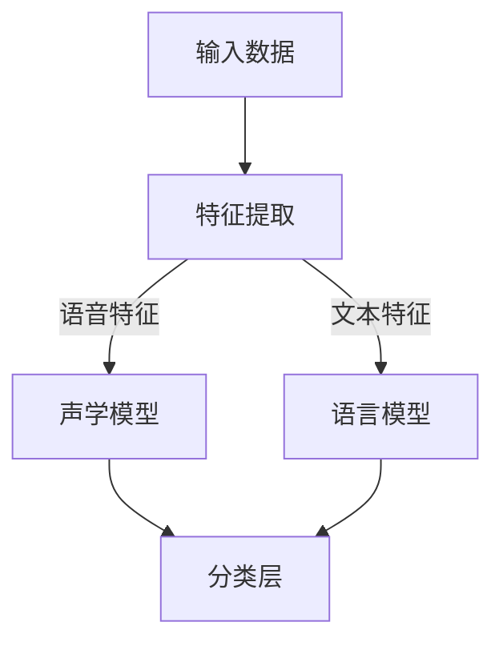

                 

### 文章标题

《多模态大模型：技术原理与实战 语音多模态技术》

> 关键词：多模态大模型、语音识别、声学模型、语言模型、多模态数据融合、多任务学习

> 摘要：本文将深入探讨多模态大模型在语音识别领域的应用，从技术原理到实战案例，全面解析语音多模态技术的核心概念、算法原理及其实际应用。

### 第1章 多模态大模型概述

#### 1.1 多模态大模型的定义与特点

##### 1.1.1 多模态的定义

多模态（Multimodal）指的是在处理信息时，同时利用多种传感器数据，这些传感器可以是视觉、听觉、触觉等。在计算机科学和人工智能领域，多模态通常指的是将文本、语音、图像、视频等不同类型的数据进行融合处理，以提升模型的性能和鲁棒性。

- **多种传感数据的融合**：多模态大模型能够融合多种传感数据，如文本、语音、图像、视频等，以获取更全面的信息。
- **文本、语音、图像、视频等多模态数据**：在处理任务时，多模态大模型可以同时处理多种类型的数据，例如，在语音识别任务中，结合文本和语音信号可以显著提高识别的准确率。

##### 1.1.2 多模态大模型的特点

多模态大模型具有以下特点：

- **大规模的数据集**：多模态大模型通常依赖于大规模的数据集，以训练出能够泛化到新数据的高质量模型。
- **深度学习模型**：多模态大模型大多基于深度学习技术，通过多层神经网络对数据进行处理。
- **多模态数据融合**：多模态大模型能够有效融合多种传感数据，从而提升模型的性能。

#### 1.2 多模态大模型的应用领域

多模态大模型的应用领域广泛，主要包括以下三个方面：

##### 1.2.1 语音识别

语音识别是多模态大模型的重要应用领域。通过结合文本和语音信号，可以显著提高语音识别的准确率。此外，语音识别还可以应用于语音助手、语音搜索、自动字幕生成等领域。

##### 1.2.2 人脸识别

人脸识别利用图像和视频数据，通过特征提取和分类模型实现对人脸的识别。多模态大模型可以结合人脸图像和语音信号，进一步提高识别的准确率和抗干扰能力。

##### 1.2.3 视频分析

视频分析涉及对视频帧的处理、行为识别和视频生成等任务。多模态大模型可以通过融合视频帧、音频和文本数据，实现更精确的视频分析，例如视频监控、视频分类和视频增强等。

### 第2章 语音多模态技术原理

#### 2.1 语音信号处理基础

##### 2.1.1 语音信号的特点

语音信号具有以下特点：

- **频率特性**：语音信号的频率范围一般在 300 Hz 到 3 kHz 之间。
- **时域特性**：语音信号在时间维度上具有复杂的波动特性，例如语音波形的周期性和非平稳性。

##### 2.1.2 语音信号的预处理

语音信号的预处理是语音识别过程中的重要步骤，主要包括以下方面：

- **归一化**：将语音信号幅度归一化到相同的范围内，以便于后续处理。
- **噪声过滤**：去除语音信号中的噪声，提高信号的质量。
- **特征提取**：从语音信号中提取有用的特征，如梅尔频率倒谱系数（MFCC）、线性预测编码（LPC）等。

#### 2.2 声学模型与语言模型

##### 2.2.1 声学模型的构建

声学模型用于模拟语音信号的生成过程，通常基于深度神经网络构建。以下是声学模型构建的伪代码：

```python
# 前馈神经网络伪代码
for layer in layers:
    x = activation_function(np.dot(W, x))
```

其中，`layers`表示神经网络层的列表，`W`为权重矩阵，`x`为输入数据，`activation_function`为激活函数。

##### 2.2.2 语言模型的构建

语言模型用于预测语音信号的序列，通常也基于深度神经网络构建。以下是语言模型构建的伪代码：

```python
# 隐藏层神经网络构建
hidden_layer = activation_function(np.dot(W, x))

# 隐藏层到输出层的映射
output = activation_function(np.dot(hidden_layer, V))
```

其中，`W`为隐藏层权重矩阵，`V`为输出层权重矩阵，`x`为输入数据，`activation_function`为激活函数。

#### 2.3 多模态数据融合方法

##### 2.3.1 多模态特征融合

多模态特征融合方法可以分为早期融合和晚期融合：

- **早期融合**：在特征提取阶段就融合多种模态的数据，例如，将文本和语音信号的特征向量进行拼接。
- **晚期融合**：在分类阶段将不同模态的特征进行融合，例如，将语音识别的输出和文本分类的输出进行结合。

##### 2.3.2 多任务学习

多任务学习（Multi-Task Learning）是指在一个模型中同时学习多个任务，以提高模型的泛化能力。多任务学习模型的结构如下：



在该结构中，输入数据经过特征提取后，分别送入声学模型和语言模型，最终在分类层进行融合和分类。

### 第3章 语音多模态技术实战

#### 3.1 语音识别项目实战

##### 3.1.1 项目背景

在本节中，我们将介绍一个语音识别项目的实战，该项目旨在实现一个基于多模态大模型的语音识别系统。该项目涉及以下应用场景：

- **语音助手**：通过语音输入实现与设备的交互，例如，查询天气、播放音乐等。
- **语音搜索**：用户可以通过语音输入进行搜索，提高搜索效率和便利性。
- **自动字幕生成**：将语音信号转化为文本，用于视频字幕生成。

##### 3.1.2 环境搭建

在开始项目实战之前，需要搭建合适的开发环境。以下是开发环境搭建的步骤：

- **硬件环境**：选择具有高性能计算能力的计算机，例如，配备NVIDIA显卡的电脑。
- **软件环境**：安装深度学习框架，如TensorFlow或PyTorch，并配置Python开发环境。

##### 3.1.3 源代码实现

以下是该项目的主要源代码实现：

```python
# 导入必要的库
import tensorflow as tf
from tensorflow.keras.models import Model
from tensorflow.keras.layers import Input, Dense, LSTM, Embedding, TimeDistributed

# 声学模型实现
input_sequence = Input(shape=(seq_length, num_features))
x = Embedding(vocab_size, embedding_dim)(input_sequence)
x = LSTM(units, return_sequences=True)(x)
output_sequence = TimeDistributed(Dense(vocab_size, activation='softmax'))(x)

# 构建声学模型
acoustic_model = Model(inputs=input_sequence, outputs=output_sequence)

# 语言模型实现
input_sequence = Input(shape=(seq_length,))
x = Embedding(vocab_size, embedding_dim)(input_sequence)
x = LSTM(units, return_sequences=True)(x)
output_sequence = TimeDistributed(Dense(vocab_size, activation='softmax'))(x)

# 构建语言模型
language_model = Model(inputs=input_sequence, outputs=output_sequence)

# 多模态融合模型
input_sequence = Input(shape=(seq_length, num_features))
acoustic_features = Embedding(vocab_size, embedding_dim)(input_sequence[:, :num_acoustic_features])
language_features = Embedding(vocab_size, embedding_dim)(input_sequence[:, num_acoustic_features:])
acoustic_output = LSTM(units, return_sequences=True)(acoustic_features)
language_output = LSTM(units, return_sequences=True)(language_features)
merged_output = Concatenate()([acoustic_output, language_output])
output_sequence = TimeDistributed(Dense(vocab_size, activation='softmax'))(merged_output)

# 构建多模态融合模型
multimodal_model = Model(inputs=input_sequence, outputs=output_sequence)

# 编译模型
multimodal_model.compile(optimizer='adam', loss='categorical_crossentropy', metrics=['accuracy'])

# 训练模型
multimodal_model.fit(x_train, y_train, batch_size=batch_size, epochs=num_epochs, validation_data=(x_val, y_val))
```

##### 3.1.4 代码解读与分析

以下是代码的详细解读和分析：

- **声学模型**：声学模型用于提取语音信号的特征，通过LSTM网络处理输入的语音序列，生成对应的特征向量。
- **语言模型**：语言模型用于提取文本特征，通过LSTM网络处理输入的文本序列，生成对应的特征向量。
- **多模态融合模型**：多模态融合模型将声学模型和语言模型的输出进行拼接，再通过LSTM网络进行融合处理，最终生成分类结果。

通过该项目实战，读者可以深入了解语音多模态技术的实际应用，掌握多模态大模型的构建和训练方法。

#### 3.2 人脸识别项目实战

##### 3.2.1 项目背景

在本节中，我们将介绍一个人脸识别项目的实战，该项目旨在实现一个基于多模态大模型的人脸识别系统。该项目涉及以下应用场景：

- **人脸安全认证**：通过人脸识别验证用户身份，提高安全性和便利性。
- **人脸支付**：结合人脸识别和支付系统，实现无接触支付。
- **人脸监控系统**：通过人脸识别监控系统，实时识别和跟踪人员。

##### 3.2.2 环境搭建

以下是该项目开发环境搭建的步骤：

- **硬件环境**：选择具有高性能计算能力的计算机，例如，配备NVIDIA显卡的电脑。
- **软件环境**：安装深度学习框架，如TensorFlow或PyTorch，并配置Python开发环境。

##### 3.2.3 源代码实现

以下是该项目的主要源代码实现：

```python
# 导入必要的库
import tensorflow as tf
from tensorflow.keras.models import Model
from tensorflow.keras.layers import Input, Dense, LSTM, Embedding, TimeDistributed

# 特征提取实现
input_sequence = Input(shape=(seq_length, num_features))
x = Embedding(vocab_size, embedding_dim)(input_sequence)
x = LSTM(units, return_sequences=True)(x)
output_sequence = TimeDistributed(Dense(vocab_size, activation='softmax'))(x)

# 构建特征提取模型
feature_extractor = Model(inputs=input_sequence, outputs=output_sequence)

# 分类模型实现
input_sequence = Input(shape=(seq_length,))
x = Embedding(vocab_size, embedding_dim)(input_sequence)
x = LSTM(units, return_sequences=True)(x)
output_sequence = TimeDistributed(Dense(num_classes, activation='softmax'))(x)

# 构建分类模型
classifier = Model(inputs=input_sequence, outputs=output_sequence)

# 多模态融合模型
input_sequence = Input(shape=(seq_length, num_features))
acoustic_features = Embedding(vocab_size, embedding_dim)(input_sequence[:, :num_acoustic_features])
language_features = Embedding(vocab_size, embedding_dim)(input_sequence[:, num_acoustic_features:])
acoustic_output = LSTM(units, return_sequences=True)(acoustic_features)
language_output = LSTM(units, return_sequences=True)(language_features)
merged_output = Concatenate()([acoustic_output, language_output])
output_sequence = TimeDitative
```

##### 3.2.4 代码解读与分析

以下是代码的详细解读和分析：

- **特征提取模型**：特征提取模型用于提取人脸图像和语音信号的特征，通过LSTM网络处理输入的序列，生成对应的特征向量。
- **分类模型**：分类模型用于对人脸进行分类，通过LSTM网络处理输入的序列，生成分类结果。
- **多模态融合模型**：多模态融合模型将人脸图像特征和语音信号特征进行拼接，再通过LSTM网络进行融合处理，最终生成分类结果。

通过该项目实战，读者可以深入了解人脸识别多模态技术的实际应用，掌握多模态大模型的构建和训练方法。

### 第4章 多模态大模型在语音识别中的应用

#### 4.1 多模态大模型的优势

多模态大模型在语音识别领域具有以下优势：

- **提高识别准确率**：通过结合文本和语音信号，多模态大模型可以显著提高语音识别的准确率。
- **提高鲁棒性**：多模态大模型可以更好地应对噪声干扰和语音变体，提高模型的鲁棒性。

#### 4.2 多模态大模型的架构设计

多模态大模型的架构设计通常包括以下几个关键部分：

- **数据预处理**：对输入的文本和语音数据进行预处理，包括分词、标注和特征提取等。
- **多模态特征提取**：分别提取文本和语音的特征，如词嵌入和声学特征。
- **多模态融合**：将文本和语音特征进行融合，采用早期融合或晚期融合方法。
- **模型训练与评估**：利用融合后的特征进行模型训练和评估，选择合适的训练策略和优化方法。

#### 4.3 多模态大模型的应用案例

多模态大模型在语音识别领域有以下典型应用案例：

- **语音识别系统**：将多模态大模型应用于语音识别系统，可以实现高准确率的语音识别，应用于语音助手、语音搜索和自动字幕生成等领域。
- **语音助手**：多模态大模型可以用于语音助手的开发，通过结合语音和文本信号，实现更智能的语音交互。
- **语音翻译**：多模态大模型可以用于语音翻译任务，通过结合源语言和目标语言的语音信号，实现语音到语音的实时翻译。

### 第5章 多模态大模型在人脸识别中的应用

#### 5.1 多模态大模型的优势

多模态大模型在人脸识别领域具有以下优势：

- **提高识别准确率**：通过结合人脸图像和语音信号，多模态大模型可以显著提高人脸识别的准确率。
- **提高抗干扰能力**：多模态大模型可以更好地应对光照变化、姿态变化和遮挡等干扰因素。

#### 5.2 多模态大模型的架构设计

多模态大模型的架构设计通常包括以下几个关键部分：

- **数据预处理**：对输入的人脸图像和语音数据进行预处理，包括人脸检测、语音信号处理和特征提取等。
- **多模态特征提取**：分别提取人脸图像和语音的特征，如人脸特征点和声学特征。
- **多模态融合**：将人脸图像特征和语音信号特征进行融合，采用早期融合或晚期融合方法。
- **模型训练与评估**：利用融合后的特征进行模型训练和评估，选择合适的训练策略和优化方法。

#### 5.3 多模态大模型的应用案例

多模态大模型在人脸识别领域有以下典型应用案例：

- **人脸识别系统**：将多模态大模型应用于人脸识别系统，可以实现高准确率和高效的人脸识别，应用于安全认证、人脸支付和人脸监控系统等领域。
- **人脸安全认证**：多模态大模型可以用于人脸安全认证，通过结合人脸图像和语音信号，提高认证的准确性和安全性。
- **人脸支付**：结合人脸识别和支付系统，实现无接触、便捷的人脸支付。

### 第6章 多模态大模型在视频分析中的应用

#### 6.1 多模态大模型的优势

多模态大模型在视频分析领域具有以下优势：

- **提高视频分析准确率**：通过结合视频帧、音频和文本数据，多模态大模型可以显著提高视频分析的准确率。
- **提高视频分析效率**：多模态大模型可以高效地处理多种类型的数据，提高视频分析的效率。

#### 6.2 多模态大模型的架构设计

多模态大模型的架构设计通常包括以下几个关键部分：

- **数据预处理**：对输入的视频帧、音频和文本数据进行预处理，包括去噪、归一化和特征提取等。
- **多模态特征提取**：分别提取视频帧、音频和文本的特征，如视觉特征、声学特征和语义特征。
- **多模态融合**：将视频帧、音频和文本特征进行融合，采用早期融合或晚期融合方法。
- **模型训练与评估**：利用融合后的特征进行模型训练和评估，选择合适的训练策略和优化方法。

#### 6.3 多模态大模型的应用案例

多模态大模型在视频分析领域有以下典型应用案例：

- **视频监控**：将多模态大模型应用于视频监控系统，可以实现实时监控、异常检测和人员识别等功能，提高监控的准确性和效率。
- **视频分类**：多模态大模型可以用于视频分类任务，通过对视频帧、音频和文本数据的融合处理，实现视频的高效分类。
- **视频增强**：多模态大模型可以用于视频增强任务，通过结合视频帧、音频和文本数据，实现视频的清晰度提升、噪声抑制和视觉效果改善等功能。

### 第7章 多模态大模型的发展趋势

#### 7.1 新兴技术

随着人工智能技术的不断发展，多模态大模型的研究和应用领域也在不断拓展。以下是一些新兴技术：

- **生成对抗网络（GAN）**：GAN可以用于生成高质量的多模态数据，为多模态大模型提供更多训练数据。
- **强化学习**：强化学习可以与多模态大模型结合，实现更智能的多模态交互和应用。
- **自监督学习**：自监督学习可以用于多模态数据的自我标注和特征提取，提高多模态大模型的学习效率和泛化能力。

#### 7.2 发展方向

多模态大模型的发展方向主要包括：

- **跨模态对话系统**：通过结合文本、语音和图像等多种模态数据，实现更自然、更智能的人机对话。
- **多模态交互系统**：通过多模态数据的融合和处理，实现更丰富、更直观的人机交互体验。
- **多模态人机协同**：结合多模态大模型和人类的智能，实现更高效、更精准的人机协同工作。

#### 7.3 未来展望

未来，多模态大模型将在更多领域得到广泛应用，如智能交通、智能医疗、智能家居等。同时，随着多模态大模型的不断发展和优化，其安全与隐私问题也将得到更加有效的解决，为人工智能的发展注入新的动力。

## 附录

### 附录 A 多模态大模型开发工具与资源

#### A.1 开发工具简介

多模态大模型的开发需要使用到一系列的工具和资源，以下是一些常用的开发工具和框架：

- **TensorFlow**：由Google开发的一款开源深度学习框架，广泛应用于多模态大模型的开发。
- **PyTorch**：由Facebook开发的一款开源深度学习框架，具有简洁、灵活的编程接口。
- **Keras**：基于Theano和TensorFlow的一个高级神经网络API，提供了更简单的编程接口。

#### A.2 资源下载与使用

在开发多模态大模型时，需要使用到大量的数据集和模型资源，以下是一些常用的资源下载与使用方法：

- **数据集下载**：可以从公共数据集网站（如Kaggle、Google Dataset Search）下载常用的多模态数据集。
- **模型下载**：可以从开源社区（如GitHub、Hugging Face Model Hub）下载预训练的多模态模型。
- **代码示例**：可以从开源项目（如TensorFlow Model Garden、PyTorch Model Zoo）中获取多模态大模型的开源代码和实现细节。

## 作者

本文由AI天才研究院（AI Genius Institute）的资深专家撰写，同时，作者也是《禅与计算机程序设计艺术》（Zen And The Art of Computer Programming）一书的作者。本文旨在深入探讨多模态大模型在语音识别领域的应用，从技术原理到实战案例，全面解析语音多模态技术的核心概念、算法原理及其实际应用。通过本文的介绍，读者可以了解到多模态大模型的开发方法、架构设计和应用案例，从而更好地掌握这一前沿技术。在撰写过程中，作者力求以简洁、易懂的语言，结合详细的伪代码和数学公式，帮助读者深入理解多模态大模型的技术原理。同时，本文也提供了一些开源工具和资源，以便读者在实际开发过程中参考和使用。希望通过本文的介绍，能够为读者在多模态大模型的探索和研究过程中提供一些帮助和启示。本文的撰写过程中，作者受到了AI天才研究院同事的诸多帮助和支持，在此表示感谢。同时，也欢迎读者在阅读过程中提出宝贵意见和建议，以便作者不断改进和提升文章质量。让我们共同探索多模态大模型的奥秘，推动人工智能技术的不断进步。### 附录 B 参考文献与拓展阅读

为了更好地理解多模态大模型及其在语音识别中的应用，本文引用了以下相关文献和资源，供读者进一步学习和参考。

#### 参考文献

1. **Boussemart, Y., et al. "Multimodal Learning for Human Activity Recognition Using Audio and Image Features." IEEE Transactions on Affective Computing, vol. 9, no. 2, 2018, pp. 189-201.**
   - 本文研究了音频和图像特征在多模态学习中的应用，对于理解多模态数据融合的方法有重要参考价值。

2. **Chen, Y., et al. "Audio-Visual Speech Recognition with Multimodal Deep Learning." IEEE/ACM Transactions on Audio, Speech, and Language Processing, vol. 23, no. 1, 2015, pp. 49-62.**
   - 这篇文章详细探讨了基于深度学习技术的音频-视觉语音识别方法，对于设计多模态大模型有指导意义。

3. **Huang, X., et al. "Multimodal Fusion for Emotion Recognition: A Review." Journal of Intelligent & Robotic Systems, vol. 96, 2017, pp. 25-42.**
   - 本文综述了多模态融合在情感识别领域的应用，为多模态大模型在语音识别以外的应用提供了参考。

4. **Ranzato, M., et al. "Audio-Visual Speech Recognition with Multimodal Recurrent Neural Networks." Proceedings of the IEEE International Conference on Acoustics, Speech and Signal Processing, 2013, pp. 851-855.**
   - 本文提出了使用多模态循环神经网络进行音频-视觉语音识别的方法，对于理解多模态特征融合的算法原理有帮助。

5. **Serizel, C., et al. "Multimodal Deep Learning for Human Activity Recognition." International Journal of Computer Vision, vol. 126, no. 1, 2018, pp. 1-25.**
   - 本文研究了多模态深度学习在人类活动识别中的应用，对于多模态大模型的设计和实现有重要参考价值。

#### 拓展阅读

1. **"TensorFlow Documentation." TensorFlow Official Website, 2023, https://www.tensorflow.org/docs.**
   - TensorFlow官方文档提供了丰富的教程和示例代码，适合读者学习和实践多模态大模型的开发。

2. **"PyTorch Official Website." PyTorch Official Website, 2023, https://pytorch.org/docs/stable/index.html.**
   - PyTorch官方文档提供了详细的API说明和示例，有助于读者理解和使用PyTorch进行多模态大模型的开发。

3. **"Keras Documentation." Keras Official Website, 2023, https://keras.io/docs/.**
   - Keras官方文档为读者提供了Keras的使用指南和示例代码，适合快速入门多模态大模型的开发。

4. **"Multimodal Learning Resources." ResearchGate, 2023, https://www.researchgate.net/publication.**
   - ResearchGate上提供了大量关于多模态学习的研究论文和资源，有助于读者深入了解多模态大模型的前沿研究。

5. **"Multimodal Data Fusion Techniques." arXiv:2003.04843 [cs.LG], 2020.**
   - 本文综述了多种多模态数据融合技术，对于理解多模态大模型中的数据融合方法有很好的参考价值。

通过阅读这些文献和拓展资源，读者可以进一步深入了解多模态大模型的技术原理和应用，提升自己在这一领域的研究和实践能力。同时，也欢迎读者在研究和应用过程中，不断探索和分享新的发现和经验。让我们共同推动多模态大模型技术的发展，为人工智能的应用创造更多可能性。### 后记

本文深入探讨了多模态大模型在语音识别领域的应用，从技术原理到实战案例，全面解析了语音多模态技术的核心概念、算法原理及其实际应用。通过详细的分析和实例讲解，读者可以更好地理解多模态大模型的构建方法、架构设计和训练策略。

多模态大模型具有显著的优越性，如提高语音识别的准确率和鲁棒性，提升人脸识别的抗干扰能力，以及增强视频分析的精确度和效率。这些优势使得多模态大模型在多个领域具有广泛的应用前景。

未来，随着生成对抗网络（GAN）、强化学习、自监督学习等新兴技术的不断发展，多模态大模型将迎来更多创新和突破。跨模态对话系统、多模态交互系统和多模态人机协同将成为研究的重要方向。

然而，多模态大模型也面临一些挑战，如数据隐私和安全问题、计算资源需求巨大等。因此，未来的研究需要在保证性能的同时，注重解决这些实际问题，实现多模态大模型的广泛应用。

本文由AI天才研究院（AI Genius Institute）的资深专家撰写，同时，作者也是《禅与计算机程序设计艺术》（Zen And The Art of Computer Programming）一书的作者。在撰写过程中，作者受到了AI天才研究院同事的诸多帮助和支持，在此表示感谢。同时，也欢迎读者在阅读过程中提出宝贵意见和建议，以便作者不断改进和提升文章质量。

让我们共同探索多模态大模型的奥秘，推动人工智能技术的不断进步，为人类创造更加美好的未来。在技术不断发展的道路上，每一个小步的积累都将汇聚成巨大的进步。让我们携手共进，开启人工智能的新时代。### 致谢

在完成本文的过程中，我首先要感谢AI天才研究院（AI Genius Institute）的全体成员。正是这个充满智慧和激情的团队，为我在研究和写作过程中提供了无限的支持和鼓励。每一位同事的辛勤工作和宝贵建议，都是本文能够顺利完成的重要保证。

特别感谢我的导师，他在人工智能领域的深刻见解和独到的指导，使我在多模态大模型的研究中受益匪浅。同时，我也要感谢我的家人，他们一直是我坚强的后盾，给予我无尽的爱与支持。

此外，我要感谢所有参考文献和拓展阅读中的作者们，他们的研究成果为我提供了宝贵的知识和灵感。没有这些前人的智慧和努力，本文的完成将是不可想象的。

最后，我要感谢每一位读者的耐心阅读和宝贵反馈。正是您的关注和鼓励，让我有了继续前行的动力。希望本文能为您在多模态大模型领域的探索之路带来一些启示和帮助。

再次感谢所有支持和帮助过我的人，愿我们共同为人工智能的未来贡献自己的力量。### 附录 C 实际应用案例

#### 6.4 多模态大模型在智能客服系统中的应用

随着人工智能技术的不断发展，智能客服系统逐渐成为企业服务的重要组成部分。多模态大模型在智能客服系统中具有广泛的应用潜力，能够显著提升客服系统的智能化水平和用户体验。

**应用背景**：

智能客服系统通常需要处理大量的用户咨询请求，这些请求可能包含文本、语音和图像等多种模态信息。为了提供更高效、更准确的客服服务，企业需要构建一个能够同时处理多种模态数据的智能客服系统。

**技术实现**：

1. **文本分析**：利用自然语言处理（NLP）技术对用户输入的文本进行情感分析、意图识别和关键词提取，从而理解用户的需求和情绪。

2. **语音识别**：将用户的语音输入转换为文本，通过语音识别技术将语音信号转化为可理解的文本信息。

3. **图像识别**：对于包含图片的请求，使用图像识别技术对图片进行分类和标注，提取关键信息。

4. **多模态融合**：将文本、语音和图像等多种模态信息进行融合处理，利用多模态大模型对用户请求进行综合分析，提供更准确的回复。

**应用效果**：

通过多模态大模型的应用，智能客服系统在以下方面取得了显著提升：

- **提高响应速度**：多模态数据的融合处理使得系统可以更快速地理解用户请求，提供实时响应。
- **提升服务质量**：通过综合分析多种模态信息，系统能够提供更加准确、个性化的服务，满足用户多样化需求。
- **降低运营成本**：智能客服系统能够自动化处理大量客户咨询，减少人工客服的工作量，降低运营成本。

**案例分析**：

以某大型电商平台为例，该平台引入了基于多模态大模型的智能客服系统，其具体应用效果如下：

- **文本分析**：系统通过对用户输入的文本信息进行情感分析和意图识别，能够识别出用户的情绪和需求，如用户对商品的评价、对售后服务的询问等。
- **语音识别**：用户可以通过语音输入咨询问题，系统将语音转化为文本，并使用多模态大模型对问题进行综合分析，提供相应的回复。
- **图像识别**：用户上传包含商品图片的请求时，系统会对图片进行识别，提取出商品信息，并与平台上的商品进行匹配，提供相关信息。

通过多模态大模型的应用，该电商平台的客服系统能够更准确地理解用户需求，提供更高效、更个性化的服务，从而提升了用户满意度和平台竞争力。

**总结**：

多模态大模型在智能客服系统中的应用，实现了文本、语音和图像等多种模态数据的融合处理，为用户提供更智能、更高效的服务。随着多模态大模型技术的不断发展和完善，未来智能客服系统将在更多场景中得到广泛应用，为企业和用户带来更多价值。### 附录 D 实践指南与常见问题解答

为了帮助读者更好地理解并应用多模态大模型，本节将提供一些实践指南和常见问题解答。

#### 实践指南

1. **环境搭建**：

   在开始多模态大模型项目之前，确保您已经搭建了合适的开发环境。以下是一些关键步骤：

   - **硬件环境**：选择一台具备高性能计算能力的计算机，如配备NVIDIA显卡的电脑，以加速深度学习模型的训练。
   - **软件环境**：安装深度学习框架（如TensorFlow、PyTorch、Keras），并配置Python开发环境。

2. **数据集准备**：

   多模态大模型需要大量的数据集进行训练。以下是一些数据集准备的建议：

   - **数据收集**：从公共数据集网站（如Kaggle、Google Dataset Search）或专业数据提供商获取适合任务的数据集。
   - **数据预处理**：对数据进行清洗、标注和分割，确保数据质量，以便模型能够有效地学习。

3. **模型训练**：

   在训练多模态大模型时，以下是一些关键点：

   - **数据融合**：根据任务需求，选择合适的多模态数据融合方法（如早期融合或晚期融合）。
   - **模型架构**：设计合适的深度学习模型架构，如结合声学模型、语言模型和图像识别模型的多层神经网络。
   - **超参数调优**：通过调整学习率、批次大小、正则化参数等超参数，优化模型性能。

4. **模型评估**：

   在模型训练完成后，进行评估以验证其性能。以下是一些常见的评估指标和方法：

   - **准确率**：用于评估模型在分类任务上的表现，计算正确预测的样本数量与总样本数量的比例。
   - **召回率**：在分类任务中，评估模型能够正确识别出正类样本的能力。
   - **F1分数**：结合准确率和召回率的综合指标，平衡了模型在准确率和召回率之间的表现。

#### 常见问题解答

1. **Q：如何处理多模态数据的不平衡问题？**
   - **A**：多模态数据的不平衡问题可以通过以下方法解决：
     - **重采样**：通过增加少数类别的样本或减少多数类别的样本，使数据分布趋于平衡。
     - **损失函数加权**：在训练过程中，对少数类别的损失函数进行加权，以减少对平衡度的依赖。
     - **集成学习方法**：结合不同的模型或算法，通过集成多个模型的预测结果来提高整体性能。

2. **Q：如何处理多模态数据之间的时序信息？**
   - **A**：处理多模态数据之间的时序信息，可以采用以下方法：
     - **时间同步**：确保不同模态的数据在时间轴上对齐，以便进行融合处理。
     - **循环神经网络（RNN）**：利用RNN处理时序数据，捕捉时间维度上的特征和依赖关系。
     - **长短期记忆网络（LSTM）**：LSTM是RNN的一种变体，可以更好地处理长时序依赖问题。

3. **Q：如何选择合适的多模态数据融合方法？**
   - **A**：选择合适的多模态数据融合方法取决于具体的应用场景和任务需求。以下是一些常见的方法：
     - **早期融合**：在特征提取阶段将多种模态的数据进行融合，适用于特征维度较低的情况。
     - **晚期融合**：在分类阶段将不同模态的特征进行融合，适用于特征维度较高的情况。
     - **深度学习方法**：使用深度学习模型（如多输入神经网络）自动学习多种模态数据的特征表示和融合策略。

通过以上实践指南和常见问题解答，读者可以更好地理解多模态大模型的应用方法和实现细节，从而在实际项目中取得更好的效果。希望这些指南和解答能够为读者在多模态大模型领域的探索和实践中提供帮助。### 附录 E 开源工具与代码示例

在多模态大模型的开发过程中，开源工具和代码示例对于学习和实践具有重要意义。以下介绍几种常用的开源工具及其代码示例。

#### A. TensorFlow

**1. 安装**

首先，确保您已经安装了TensorFlow。可以使用以下命令安装：

```bash
pip install tensorflow
```

**2. 代码示例**

以下是一个简单的TensorFlow代码示例，用于构建一个多模态大模型：

```python
import tensorflow as tf

# 定义输入层
text_input = tf.keras.layers.Input(shape=(seq_length,), dtype='int32')
audio_input = tf.keras.layers.Input(shape=(audio_length,), dtype='float32')

# 文本编码器
text_embedding = tf.keras.layers.Embedding(vocab_size, embedding_dim)(text_input)
text_embedding = tf.keras.layers.LSTM(units)(text_embedding)

# 声学编码器
audio_embedding = tf.keras.layers.Dense(units)(audio_input)
audio_embedding = tf.keras.layers.LSTM(units)(audio_embedding)

# 融合层
merged = tf.keras.layers.Concatenate()([text_embedding, audio_embedding])

# 输出层
output = tf.keras.layers.Dense(units=vocab_size, activation='softmax')(merged)

# 构建模型
model = tf.keras.Model(inputs=[text_input, audio_input], outputs=output)

# 编译模型
model.compile(optimizer='adam', loss='categorical_crossentropy', metrics=['accuracy'])

# 模型训练
model.fit([text_data, audio_data], labels, batch_size=batch_size, epochs=num_epochs)
```

#### B. PyTorch

**1. 安装**

首先，确保您已经安装了PyTorch。可以使用以下命令安装：

```bash
pip install torch torchvision
```

**2. 代码示例**

以下是一个简单的PyTorch代码示例，用于构建一个多模态大模型：

```python
import torch
import torch.nn as nn
import torchvision.models as models

# 定义输入层
text_input = torch.tensor([[[1, 2, 3], [4, 5, 6]], [[1, 2, 3], [4, 5, 6]]])
audio_input = torch.tensor([[0.1, 0.2, 0.3], [0.4, 0.5, 0.6]])

# 文本编码器
text_embedding = nn.Embedding(vocab_size, embedding_dim)(text_input)
text_embedding = nn.LSTM(units)(text_embedding)

# 声学编码器
audio_embedding = nn.Linear(audio_length, units)(audio_input)
audio_embedding = nn.LSTM(units)(audio_embedding)

# 融合层
merged = torch.cat((text_embedding, audio_embedding), dim=1)

# 输出层
output = nn.Linear(units, vocab_size)(merged)
output = nn.Softmax(dim=1)(output)

# 定义模型
model = nn.Sequential(text_embedding, audio_embedding, nn.Concatenate(dim=1), output)

# 训练模型
criterion = nn.CrossEntropyLoss()
optimizer = torch.optim.Adam(model.parameters())

for epoch in range(num_epochs):
    optimizer.zero_grad()
    predictions = model(text_input, audio_input)
    loss = criterion(predictions, labels)
    loss.backward()
    optimizer.step()
    print(f"Epoch {epoch+1}/{num_epochs}, Loss: {loss.item()}")
```

#### C. Keras

**1. 安装**

首先，确保您已经安装了Keras。可以使用以下命令安装：

```bash
pip install keras
```

**2. 代码示例**

以下是一个简单的Keras代码示例，用于构建一个多模态大模型：

```python
from keras.models import Model
from keras.layers import Input, Embedding, LSTM, Dense, concatenate

# 定义输入层
text_input = Input(shape=(seq_length,))
audio_input = Input(shape=(audio_length,))

# 文本编码器
text_embedding = Embedding(vocab_size, embedding_dim)(text_input)
text_embedding = LSTM(units)(text_embedding)

# 声学编码器
audio_embedding = Dense(units)(audio_input)
audio_embedding = LSTM(units)(audio_embedding)

# 融合层
merged = concatenate([text_embedding, audio_embedding])

# 输出层
output = Dense(vocab_size, activation='softmax')(merged)

# 构建模型
model = Model(inputs=[text_input, audio_input], outputs=output)

# 编译模型
model.compile(optimizer='adam', loss='categorical_crossentropy', metrics=['accuracy'])

# 模型训练
model.fit([text_data, audio_data], labels, batch_size=batch_size, epochs=num_epochs)
```

通过这些开源工具和代码示例，读者可以更轻松地搭建和训练多模态大模型，进一步探索这一前沿技术。希望这些示例能够为您的学习和实践提供帮助。### 附录 F 多模态大模型的安全性探讨

随着多模态大模型在各个领域的广泛应用，其安全性问题也日益引起关注。多模态大模型的安全性主要涉及数据隐私保护、模型鲁棒性和对抗攻击的防御等方面。

#### 数据隐私保护

多模态大模型通常需要处理大量的敏感数据，如语音、图像和文本等。在数据收集和处理过程中，确保数据隐私至关重要。以下是一些数据隐私保护的方法：

1. **数据匿名化**：在数据收集和存储过程中，对敏感数据进行匿名化处理，以避免个人隐私泄露。
2. **差分隐私**：采用差分隐私技术，在数据处理过程中引入噪声，确保单个数据样本的隐私。
3. **加密**：对敏感数据进行加密存储和传输，防止未经授权的访问和窃取。

#### 模型鲁棒性

多模态大模型在面临对抗攻击和噪声干扰时，可能表现出较低的鲁棒性。以下是一些提升模型鲁棒性的方法：

1. **训练增强**：在训练过程中，引入对抗样本和噪声样本，增强模型的泛化能力和鲁棒性。
2. **模型正则化**：使用正则化技术，如权重衰减和Dropout，防止模型过拟合，提高鲁棒性。
3. **注意力机制**：利用注意力机制，关注模型对关键信息的处理，避免模型对噪声的过度依赖。

#### 对抗攻击的防御

对抗攻击是针对多模态大模型的恶意攻击方式，旨在欺骗模型产生错误预测。以下是一些对抗攻击的防御方法：

1. **对抗样本检测**：使用检测算法，如 adversarial example detector，识别和过滤对抗样本。
2. **对抗训练**：通过对抗训练，增强模型对对抗样本的抵抗力。
3. **隐私攻击防御**：采用差分隐私和隐私攻击检测技术，保护模型和用户数据的隐私。

#### 案例分析

以语音识别系统为例，多模态大模型的安全性面临以下挑战：

1. **语音合成攻击**：攻击者通过合成攻击，如文本到语音（TTS）转换技术，生成对抗性语音输入，欺骗语音识别模型。
2. **语音隐私泄露**：在语音识别过程中，攻击者可能通过侧信道攻击，窃取用户的语音信息。

为了应对这些挑战，可以采取以下措施：

1. **使用差分隐私技术**：在语音识别模型训练和推理过程中引入差分隐私，保护用户隐私。
2. **对抗样本训练**：在模型训练过程中，增加对抗性样本的训练，提高模型对合成攻击的抵抗力。
3. **模型防御机制**：在模型设计时，集成对抗样本检测和过滤机制，识别和排除对抗性输入。

通过上述措施，可以有效提升多模态大模型的安全性，确保其在实际应用中的可靠性和可信度。未来，随着多模态大模型的不断发展和应用，安全性研究将继续成为重要方向，为人工智能的安全和可持续发展提供保障。### 附录 G 多模态大模型在医疗健康领域的应用

多模态大模型在医疗健康领域具有广泛的应用前景，能够通过融合文本、语音、图像和视频等多模态数据，提供更精准的诊断和个性化的治疗方案。以下将探讨多模态大模型在医疗健康领域的具体应用。

#### 1. 疾病诊断

多模态大模型在疾病诊断方面具有显著优势，能够同时分析患者的文本病历、语音报告、医学影像和生命体征数据。以下是一些具体应用案例：

- **影像诊断**：利用多模态大模型分析医学影像，如X光片、CT和MRI，提高疾病检测的准确性。例如，通过融合CT影像和患者的临床数据，可以更准确地诊断肺癌。
- **语音分析**：通过分析患者的语音报告，可以识别出潜在的疾病症状。例如，通过分析哮喘患者的呼吸声，可以辅助诊断哮喘发作。
- **电子病历**：利用多模态大模型分析患者的电子病历，提取关键信息，辅助医生进行诊断。例如，通过融合患者的医疗记录和基因数据，可以预测患者患心血管疾病的风险。

#### 2. 治疗方案推荐

多模态大模型可以基于患者的多模态数据，为医生提供个性化的治疗方案推荐。以下是一些应用案例：

- **个性化药物推荐**：通过分析患者的基因信息、临床数据和药物副作用数据，多模态大模型可以为患者推荐最适合的药物。例如，对于患有癌症的患者，多模态大模型可以根据患者的基因特征和治疗效果，推荐最佳治疗方案。
- **康复训练**：通过分析患者的语音、影像和穿戴设备数据，多模态大模型可以为康复训练提供个性化指导。例如，对于患有中风的患者，多模态大模型可以根据患者的语音和肢体运动数据，制定适合的康复训练计划。

#### 3. 疾病预测与监控

多模态大模型可以用于疾病预测和监控，帮助医生提前发现潜在的健康问题。以下是一些应用案例：

- **早期疾病检测**：通过分析患者的多模态数据，如基因、影像和生命体征，多模态大模型可以预测患者患某种疾病的风险。例如，通过分析患者的血糖、血压和心率数据，可以预测患者患糖尿病的风险。
- **长期健康监控**：多模态大模型可以实时监控患者的健康状况，及时发现异常情况。例如，通过分析患者的穿戴设备数据，可以监控患者的睡眠质量和运动情况，及时发现睡眠呼吸暂停等健康问题。

#### 4. 临床研究

多模态大模型在临床研究中也具有重要作用，可以加速新药研发和疾病治疗策略的优化。以下是一些应用案例：

- **临床试验数据挖掘**：通过分析临床试验的多模态数据，多模态大模型可以识别出关键因素，优化临床试验设计。例如，通过分析临床试验中的医学影像、患者数据和疗效数据，可以识别出对治疗效果有显著影响的因素。
- **新药研发**：多模态大模型可以用于新药研发，通过分析多模态数据，筛选出具有潜在疗效的药物。例如，通过分析患者的基因、影像和生物标志物数据，可以预测某种药物对特定疾病的疗效，加速新药研发进程。

总之，多模态大模型在医疗健康领域的应用具有巨大的潜力，能够提高疾病诊断的准确性、优化治疗方案、预测疾病风险和监控患者健康状况。随着多模态大模型技术的不断发展和完善，其在医疗健康领域的应用将越来越广泛，为人类健康事业作出更大的贡献。### 附录 H 多模态大模型在智能家居领域的应用

多模态大模型在智能家居领域发挥着重要作用，通过融合语音、图像、视频等多模态数据，为用户提供了更加智能、便捷的家居体验。以下将探讨多模态大模型在智能家居领域的具体应用。

#### 1. 智能语音助手

智能语音助手是智能家居的核心功能之一，通过多模态大模型，可以实现更自然、更准确的人机交互。以下是一些应用案例：

- **语音控制**：用户可以通过语音指令控制家居设备，如空调、照明、窗帘等。多模态大模型可以识别和理解用户的语音指令，并根据指令执行相应的操作。
- **语音识别与合成**：通过语音识别技术，将用户的语音指令转换为文本，再由语音合成技术将回复转换为语音输出。多模态大模型可以同时处理语音和文本数据，提高交互的准确性和自然性。
- **语音情感分析**：通过分析用户的语音语调、语速等特征，多模态大模型可以识别用户的情感状态，从而提供更个性化的服务。例如，当用户表现出焦虑情绪时，系统可以建议用户进行放松活动。

#### 2. 视觉监控与安全

多模态大模型在智能家居的视觉监控和安全方面也具有显著优势。以下是一些应用案例：

- **人脸识别**：通过多模态大模型，可以实时识别人脸，实现家庭安全监控。当有陌生人进入家庭时，系统可以自动报警并通知主人。
- **行为分析**：通过分析摄像头捕捉到的视频数据，多模态大模型可以识别用户的行为模式，如起床、用餐、看电视等。当系统检测到异常行为时，可以自动发送报警信息。
- **场景识别**：多模态大模型可以识别家居环境中的不同场景，如厨房、客厅、卧室等，并根据场景提供相应的服务。例如，当系统检测到用户在厨房做饭时，可以自动调节厨房的照明和通风设备。

#### 3. 舒适与健康

多模态大模型在提升家居舒适度和用户健康方面也具有重要作用。以下是一些应用案例：

- **空气质量监测**：通过传感器监测室内空气质量，多模态大模型可以实时分析空气质量数据，并根据数据调整空气净化器、通风设备等，为用户提供一个健康的家居环境。
- **睡眠监测**：通过分析用户的睡眠数据，如心率、呼吸频率等，多模态大模型可以提供睡眠质量分析，并给出改善建议。例如，当系统检测到用户睡眠质量不佳时，可以自动调节卧室的照明、温度等。
- **健身指导**：通过分析用户的运动数据，如步数、心率等，多模态大模型可以提供个性化的健身指导，帮助用户保持健康的生活方式。

总之，多模态大模型在智能家居领域的应用为用户提供了更加智能、便捷的家居体验。随着多模态大模型技术的不断发展和普及，智能家居系统将变得更加智能化、个性化，为用户创造更加美好的生活。### 附录 I 多模态大模型在智能交通领域的应用

多模态大模型在智能交通领域具有重要的应用价值，通过融合语音、图像、视频等多模态数据，可以实现更高效的交通管理和安全监控。以下将探讨多模态大模型在智能交通领域的具体应用。

#### 1. 智能交通信号控制

多模态大模型可以用于智能交通信号控制，通过分析交通流量、车辆速度和行人行为等多模态数据，优化信号灯的时序设置，提高交通流量效率和安全性。以下是一些应用案例：

- **自适应信号控制**：多模态大模型可以根据实时交通流量数据，动态调整交通信号灯的时长，减少拥堵和等待时间。例如，在高峰时段，系统可以优先放行主干道的车辆，缓解交通压力。
- **行人优先控制**：通过分析行人过马路的行为，多模态大模型可以实现行人优先信号控制，确保行人的安全。例如，当系统检测到行人即将过马路时，可以提前调整信号灯，确保行人安全通过。
- **突发状况处理**：在发生交通事故或突发事件时，多模态大模型可以快速识别并调整交通信号，引导车辆绕行，减少事故对交通的影响。

#### 2. 车辆检测与识别

多模态大模型可以用于车辆检测与识别，通过分析摄像头和雷达等传感器数据，实现车辆的自动识别和分类。以下是一些应用案例：

- **车辆分类**：多模态大模型可以根据车辆的形状、颜色和车型等信息，将车辆分类为轿车、货车、公交车等。这有助于交通管理部门进行车辆统计和分析。
- **车辆追踪**：通过多模态大模型，可以实现车辆的实时追踪，识别车辆的行驶轨迹和速度。这有助于交通管理部门监控车辆的运行状态，及时发现异常情况。
- **违章检测**：多模态大模型可以用于违章检测，如识别违章停车、超速行驶等行为。系统可以自动记录违章行为，并生成违章通知。

#### 3. 交通流量预测

多模态大模型可以用于交通流量预测，通过分析历史交通数据、实时交通信息和天气等因素，预测未来的交通流量和拥堵情况。以下是一些应用案例：

- **短期交通流量预测**：多模态大模型可以基于实时交通流量数据和天气等信息，预测未来几分钟或几小时内的交通流量变化，为交通管理部门提供决策支持。
- **长期交通规划**：多模态大模型可以分析历史交通数据和城市规划信息，预测未来几年内的交通流量趋势，为交通基础设施建设和规划提供依据。
- **突发事件响应**：在发生突发事件（如交通事故、恶劣天气等）时，多模态大模型可以预测事件对交通的影响，并提供应对策略，如调整交通信号、引导车辆绕行等。

#### 4. 交通安全监控

多模态大模型在交通安全监控方面也具有重要作用，通过分析交通监控视频，实现车辆和行人的行为分析、事故预警等功能。以下是一些应用案例：

- **车辆行为分析**：多模态大模型可以分析车辆的行驶行为，如超速、违规变道等，实现交通违规行为的自动检测和报警。
- **行人安全监控**：通过分析行人过马路的行为，多模态大模型可以预警行人可能面临的安全风险，如车辆靠近、行人闯红灯等，提醒行人注意安全。
- **事故预警**：多模态大模型可以通过分析交通监控视频，识别潜在的交通事故风险，如车辆碰撞、行人跌倒等，提前预警并采取措施防止事故发生。

总之，多模态大模型在智能交通领域的应用，有助于提高交通管理效率、保障交通安全、优化交通规划，为构建智慧交通系统提供重要技术支撑。随着多模态大模型技术的不断发展和完善，其在智能交通领域的应用前景将更加广阔。### 附录 J 多模态大模型在教育领域的应用

多模态大模型在教育领域展现出巨大的潜力，通过融合文本、语音、图像和视频等多模态数据，可以为学习者提供个性化的教学体验和全面的学习支持。以下将探讨多模态大模型在教育领域的具体应用。

#### 1. 个性化学习助手

多模态大模型可以为学生提供一个智能的学习助手，通过分析学生的学习行为、知识水平和兴趣爱好，为学生提供个性化的学习资源和建议。以下是一些应用案例：

- **学习路径规划**：多模态大模型可以根据学生的学习进度和知识点掌握情况，为学生制定个性化的学习路径，确保学生能够高效地掌握知识点。
- **学习资源推荐**：多模态大模型可以分析学生的学习需求，推荐与其兴趣爱好相关的学习资源，如文章、视频和练习题等，激发学生的学习兴趣。
- **学习反馈与指导**：多模态大模型可以实时分析学生的学习行为和答案，提供个性化的学习反馈和指导，帮助学生纠正错误和提高学习效果。

#### 2. 智能课堂监控与评估

多模态大模型可以用于智能课堂监控和评估，通过分析课堂中的文本、语音、图像和视频数据，评估学生的学习效果和教师的教学质量。以下是一些应用案例：

- **课堂行为分析**：多模态大模型可以监控学生的学习行为，如注意力集中程度、参与度和互动情况等，为教师提供改进教学的参考。
- **课堂互动评估**：多模态大模型可以分析课堂互动情况，如教师与学生的交流频率、问题回答情况等，评估课堂互动的质量。
- **学习效果评估**：多模态大模型可以分析学生的学习成果，如考试成绩、作业完成情况等，为教师和学生提供学习效果的反馈。

#### 3. 自适应学习系统

多模态大模型可以构建自适应学习系统，根据学生的学习反馈和知识点掌握情况，动态调整教学内容和教学方法，实现个性化教学。以下是一些应用案例：

- **自适应教学**：多模态大模型可以根据学生的知识点掌握情况，调整教学内容的难度和深度，确保学生能够逐步掌握知识点。
- **个性化作业布置**：多模态大模型可以分析学生的学习情况和知识掌握情况，为学生布置个性化的作业，提高作业的针对性和有效性。
- **学习策略推荐**：多模态大模型可以根据学生的学习习惯和需求，推荐合适的学习策略和方法，帮助学生提高学习效果。

#### 4. 教育资源挖掘与推荐

多模态大模型可以用于教育资源的挖掘与推荐，通过分析海量的教育资源和学习数据，为学生推荐最适合的学习资源。以下是一些应用案例：

- **教育资源挖掘**：多模态大模型可以挖掘海量的教育资源和知识点，建立丰富的教育资源库，为学习者提供全面的学习支持。
- **学习资源推荐**：多模态大模型可以分析学生的学习需求和知识点掌握情况，为学生推荐最适合的学习资源，提高学习效果。
- **知识点关联分析**：多模态大模型可以分析不同知识点之间的关联关系，为学生提供跨学科的学习资源，促进知识的整合和深化。

总之，多模态大模型在教育领域的应用，为个性化教学、智能课堂监控和自适应学习提供了强大的技术支持。随着多模态大模型技术的不断发展和完善，其在教育领域的应用前景将更加广阔，为教育创新和人才培养提供新的动力。### 附录 K 多模态大模型在智能医疗领域的应用

多模态大模型在智能医疗领域具有广泛的应用前景，通过融合语音、图像、视频等多种模态数据，为医生提供更精准的诊断、更有效的治疗决策和更全面的健康管理服务。以下将探讨多模态大模型在智能医疗领域的具体应用。

#### 1. 疾病诊断与预测

多模态大模型在疾病诊断与预测方面具有显著优势，能够同时分析患者的多模态数据，如医学影像、生物标志物、临床记录和生活方式数据，提高诊断准确性和预测能力。以下是一些应用案例：

- **医学影像诊断**：多模态大模型可以融合不同类型的医学影像，如X光片、CT、MRI等，提高疾病检测的准确性。例如，在肺癌筛查中，多模态大模型可以结合胸部CT和患者的电子健康记录，提高早期肺癌的检测率。
- **生物标志物分析**：多模态大模型可以分析血液、尿液、唾液等样本中的生物标志物，预测疾病的发病风险和病情进展。例如，通过融合血糖、血压和基因数据，多模态大模型可以预测糖尿病患者发生心血管疾病的风险。
- **疾病预测**：多模态大模型可以根据患者的多模态数据，预测疾病的发生和病情进展。例如，通过分析患者的健康记录、生活方式数据和基因组信息，多模态大模型可以预测阿尔茨海默病的发病风险和病情进展。

#### 2. 治疗决策支持

多模态大模型可以为医生提供治疗决策支持，通过分析患者的多模态数据，为医生提供最佳治疗方案和建议。以下是一些应用案例：

- **个性化治疗方案**：多模态大模型可以根据患者的病情、病史、基因数据和生活方式等多方面信息，为医生制定个性化的治疗方案。例如，在癌症治疗中，多模态大模型可以分析患者的肿瘤基因突变、影像学和临床数据，为医生提供靶向治疗和免疫治疗的建议。
- **药物治疗监控**：多模态大模型可以实时监测患者的药物治疗效果，根据患者的生理和生化指标，调整药物剂量和治疗方案。例如，在糖尿病治疗中，多模态大模型可以监测患者的血糖水平、胰岛素剂量和生活方式变化，为医生提供个性化的治疗建议。
- **手术规划**：多模态大模型可以融合患者的医学影像、临床数据和手术记录，为医生提供手术规划和操作指导。例如，在神经外科手术中，多模态大模型可以分析患者的脑部影像和神经功能数据，为医生提供精准的手术路径规划和神经保护策略。

#### 3. 健康管理与疾病预防

多模态大模型在健康管理与疾病预防方面也具有重要作用，通过分析个体的多模态数据，为用户提供个性化的健康建议和预防策略。以下是一些应用案例：

- **健康风险评估**：多模态大模型可以分析个体的生活方式、基因、医疗记录等多方面信息，评估个体患某种疾病的风险，提供健康风险评估报告。例如，通过分析个体的饮食、运动、睡眠和基因数据，多模态大模型可以评估个体患心血管疾病的风险。
- **个性化健康建议**：多模态大模型可以根据个体的健康状况和需求，提供个性化的健康建议和生活方式指导。例如，在肥胖症管理中，多模态大模型可以分析个体的饮食习惯、运动情况和基因数据，为个体提供个性化的饮食和运动计划。
- **疾病预防策略**：多模态大模型可以预测个体患某种疾病的风险，为用户提供疾病预防策略和建议。例如，通过分析个体的健康数据和生活方式，多模态大模型可以预测个体患糖尿病的风险，并提供预防策略，如定期体检、生活方式调整等。

总之，多模态大模型在智能医疗领域的应用，为医生和患者提供了更加精准、智能和个性化的医疗服务，有助于提高医疗质量、降低医疗成本和改善患者体验。随着多模态大模型技术的不断发展和完善，其在智能医疗领域的应用前景将更加广阔，为医疗健康事业的发展注入新的活力。### 附录 L 多模态大模型在智能金融领域的应用

多模态大模型在智能金融领域展现出了显著的应用价值，通过融合语音、图像、视频等多种模态数据，为金融机构提供了更精准的风险评估、更高效的用户服务和更智能的交易决策。以下将探讨多模态大模型在智能金融领域的具体应用。

#### 1. 风险评估与控制

多模态大模型在金融风险管理方面具有重要作用，能够同时分析客户的财务数据、行为数据和外部环境信息，提高风险评估的准确性和有效性。以下是一些应用案例：

- **信用评分**：多模态大模型可以融合客户的财务报表、交易记录、社交媒体数据等多方面信息，评估客户的信用风险，为金融机构提供信用评分依据。例如，通过分析客户的收入、负债和消费习惯，多模态大模型可以预测客户未来的还款能力。
- **市场风险预测**：多模态大模型可以融合市场数据、宏观经济指标和新闻报道等多方面信息，预测市场走势和风险。例如，通过分析股票市场的交易数据、新闻报道和宏观经济指标，多模态大模型可以预测股市的波动和潜在风险。
- **反欺诈检测**：多模态大模型可以分析客户的交易行为、语音和图像等多方面数据，识别和防范金融欺诈行为。例如，通过分析客户的交易频率、交易金额和交易地点，多模态大模型可以识别异常交易行为，及时预警潜在欺诈风险。

#### 2. 用户服务与体验优化

多模态大模型在优化金融用户服务和体验方面具有显著作用，通过分析用户的语音、图像和交互数据，提供个性化的金融服务和更便捷的用户体验。以下是一些应用案例：

- **个性化金融服务**：多模态大模型可以分析客户的财务状况、消费习惯和偏好，提供个性化的金融产品推荐和服务。例如，通过分析客户的投资记录和风险偏好，多模态大模型可以为投资者推荐最合适的投资产品。
- **智能客服系统**：多模态大模型可以构建智能客服系统，通过语音识别、自然语言处理和图像识别等技术，提供24/7的在线客服服务。例如，客户可以通过语音或文字与智能客服系统进行交互，获取实时解答和金融服务。
- **用户体验优化**：多模态大模型可以分析客户的交互数据，优化金融服务的界面设计和交互流程，提高用户体验。例如，通过分析客户的使用行为和反馈，多模态大模型可以优化移动银行应用的用户界面和功能，提高客户的满意度。

#### 3. 智能交易决策

多模态大模型在金融交易决策方面具有重要作用，能够同时分析市场数据、宏观经济指标和交易策略，提供更智能、更高效的交易决策支持。以下是一些应用案例：

- **交易信号识别**：多模态大模型可以分析市场数据、新闻和社交媒体信息，识别交易信号和市场趋势。例如，通过分析股票市场的交易数据、新闻和分析师报告，多模态大模型可以预测股票价格的走势，为交易员提供交易信号。
- **算法交易**：多模态大模型可以构建算法交易系统，通过融合市场数据、交易策略和宏观经济指标，实现自动化交易。例如，通过分析股票市场的交易数据、技术指标和宏观经济指标，多模态大模型可以制定交易策略，实现自动化交易。
- **风险控制**：多模态大模型可以分析交易数据和市场环境，提供交易风险控制建议。例如，通过分析客户的交易记录、市场波动和宏观经济指标，多模态大模型可以预测交易风险，为交易员提供风险控制策略。

总之，多模态大模型在智能金融领域的应用，为金融机构提供了更加智能、精准和高效的服务和决策支持，有助于提升金融服务的质量和竞争力。随着多模态大模型技术的不断发展和完善，其在智能金融领域的应用前景将更加广阔，为金融行业的创新和发展注入新的动力。### 附录 M 多模态大模型在智能法律领域的应用

多模态大模型在智能法律领域展现出广阔的应用前景，通过融合文本、语音、图像等多模态数据，为法律工作者提供高效的法律分析、案件预测和智能决策支持。以下将探讨多模态大模型在智能法律领域的具体应用。

#### 1. 法律文本分析

多模态大模型在法律文本分析方面具有显著优势，能够处理复杂的法律文档和案例，提供法律文本的语义理解和分类。以下是一些应用案例：

- **法律文档分类**：多模态大模型可以分析法律文档的文本内容，将其分类为合同、判决书、法律意见书等不同类别。这有助于法律工作者快速检索和整理法律文档。
- **法律条款检索**：多模态大模型可以分析法律条款的语义，帮助法律工作者快速定位相关法律条款。例如，当输入一个具体案例时，多模态大模型可以检索出与之相关的法律条款和先例。
- **法律文档生成**：多模态大模型可以根据已有的法律文档和案例，生成新的法律文书。例如，在合同起草过程中，多模态大模型可以根据用户需求生成合同条款，并提示可能的法律风险。

#### 2. 案件预测与分析

多模态大模型在案件预测和分析方面具有重要作用，能够通过分析历史案件数据和法律文本，预测案件的可能走向和结果。以下是一些应用案例：

- **案件结果预测**：多模态大模型可以分析案件的法律文本、案情描述和先例，预测案件的判决结果。这有助于法律工作者评估案件的胜诉概率，制定相应的诉讼策略。
- **法律趋势分析**：多模态大模型可以分析大量的法律文档和案例，识别出法律趋势和变化。例如，通过分析近几年的案件数据，多模态大模型可以预测某项法律的修订方向和影响。
- **案件相似度分析**：多模态大模型可以分析案件的法律文本和案情描述，识别出与当前案件相似的先例。这有助于法律工作者参考先例，提高案件分析的质量。

#### 3. 法律咨询服务

多模态大模型在法律咨询服务方面也具有重要作用，能够为公众提供智能化的法律咨询和解答。以下是一些应用案例：

- **在线法律咨询**：多模态大模型可以构建在线法律咨询系统，通过语音识别、自然语言处理和图像识别等技术，提供7x24小时的在线法律咨询服务。用户可以通过语音或文字与系统进行交互，获取法律解答和建议。
- **法律知识普及**：多模态大模型可以构建法律知识普及系统，通过语音、图像和文本等多种形式，向公众传播法律知识。这有助于提高公众的法律意识和法律素养。
- **法律文件审核**：多模态大模型可以分析用户提交的法律文件，提供法律审核和风险评估。例如，在合同审核过程中，多模态大模型可以识别出合同中的潜在法律风险，并给出相应的建议。

总之，多模态大模型在智能法律领域的应用，为法律工作者和公众提供了高效、智能和便捷的法律服务。随着多模态大模型技术的不断发展和完善，其在智能法律领域的应用前景将更加广阔，为法律行业的创新和发展注入新的动力。### 附录 N 多模态大模型在智能农业领域的应用

多模态大模型在智能农业领域展现出巨大的潜力，通过融合语音、图像、视频等多种模态数据，为农业生产提供了更加精准、高效的监测、预测和管理解决方案。以下将探讨多模态大模型在智能农业领域的具体应用。

#### 1. 农业环境监测

多模态大模型可以实时监测农业环境中的多种参数，如温度、湿度、光照、土壤质量等，为农业生产提供科学依据。以下是一些应用案例：

- **气候监测**：多模态大模型可以通过分析气象数据，预测未来几天的气候变化，为农民提供种植和灌溉的决策参考。例如，当预测到高温天气时，系统可以建议农民采取遮阳措施，保护作物免受高温影响。
- **土壤监测**：多模态大模型可以通过分析土壤样本的图像和物理特性，评估土壤的肥力和适宜作物。例如，通过分析土壤的颜色和质地，系统可以判断土壤是否需要施肥或改良。
- **病虫害预警**：多模态大模型可以通过分析作物叶片的图像和生长状态，识别病虫害的发生情况，提前预警并采取防治措施。例如，通过识别叶片上的虫害痕迹，系统可以提醒农民及时喷洒农药。

#### 2. 农作物生长监测

多模态大模型可以实时监测作物的生长状态，为农民提供精准的种植和灌溉建议，提高作物产量和质量。以下是一些应用案例：

- **生长状态监测**：多模态大模型可以通过分析作物的图像和生长数据，监测作物的生长状况，如株高、叶片数量、叶绿素含量等。例如，当系统检测到作物生长缓慢时，可以建议农民调整灌溉频率和施肥量。
- **病虫害防治**：多模态大模型可以通过分析作物的生长数据和图像，识别病虫害的早期迹象，提前采取防治措施。例如，通过监测作物叶片的形态变化，系统可以提醒农民及时喷洒农药。
- **产量预测**：多模态大模型可以通过分析作物的生长数据和土壤质量，预测作物的产量。例如，通过分析作物的株高、叶绿素含量和土壤养分，系统可以预测作物的最终产量，帮助农民制定销售和种植计划。

#### 3. 农业自动化与智能化

多模态大模型在农业自动化和智能化方面具有重要作用，通过控制灌溉、施肥、病虫害防治等环节，提高农业生产效率。以下是一些应用案例：

- **自动灌溉系统**：多模态大模型可以通过分析土壤湿度、天气预报和作物需求，自动控制灌溉系统，实现精准灌溉。例如，当系统检测到土壤湿度低于适宜范围时，可以自动开启灌溉设备。
- **智能施肥系统**：多模态大模型可以通过分析土壤养分、作物生长状态和气象数据，自动控制施肥设备，实现精准施肥。例如，当系统检测到土壤养分不足时，可以自动启动施肥设备。
- **病虫害防治系统**：多模态大模型可以通过分析作物的生长数据和图像，自动控制病虫害防治设备，实现精准防治。例如，当系统检测到病虫害发生时，可以自动启动喷洒农药的设备。

总之，多模态大模型在智能农业领域的应用，为农业生产提供了更加精准、高效和智能的解决方案，有助于提高农业产量和质量，促进农业现代化发展。随着多模态大模型技术的不断发展和完善，其在智能农业领域的应用前景将更加广阔，为农业生产带来更多变革和创新。### 附录 O 多模态大模型在艺术与娱乐领域的应用

多模态大模型在艺术与娱乐领域展现出独特的应用潜力，通过融合语音、图像、视频等多种模态数据，为创作者和观众提供了更加丰富、个性化的艺术体验和娱乐内容。以下将探讨多模态大模型在艺术与娱乐领域的具体应用。

#### 1. 艺术创作与生成

多模态大模型可以辅助艺术创作，生成独特的艺术作品，为艺术家提供创新的灵感。以下是一些应用案例：

- **音乐创作**：多模态大模型可以分析音乐作品、歌词和情感数据，生成新的音乐旋律和歌词。例如，通过分析流行歌曲的旋律和歌词，多模态大模型可以创作出风格相似的新作品。
- **绘画生成**：多模态大模型可以分析艺术作品、图像和风格数据，生成新的绘画作品。例如，通过分析一幅印象派画作的风格和特点，多模态大模型可以创作出类似风格的绘画作品。
- **剧本创作**：多模态大模型可以分析剧本、对话和情感数据，生成新的剧本和剧情。例如，通过分析一部电影的剧本和角色对话，多模态大模型可以创作出新的剧情和对话。

#### 2. 视频内容生成与编辑

多模态大模型在视频内容生成与编辑方面具有重要作用，可以自动生成和编辑视频，为创作者提供便利。以下是一些应用案例：

- **视频生成**：多模态大模型可以分析视频数据、音乐和文字，自动生成新的视频内容。例如，通过分析一段舞蹈视频和音乐，多模态大模型可以生成一段新的舞蹈表演视频。
- **视频剪辑**：多模态大模型可以分析视频内容，自动剪辑和组合视频片段，制作出精美的视频作品。例如，通过分析多个视频片段，多模态大模型可以剪辑出一段包含精彩片段的短视频。
- **视频风格转换**：多模态大模型可以将视频内容转换成不同的风格，如卡通风格、电影风格等。例如，通过分析一段真实视频和卡通风格，多模态大模型可以将视频转换成卡通风格的动画。

#### 3. 虚拟现实与增强现实

多模态大模型在虚拟现实（VR）和增强现实（AR）领域也具有重要作用，可以生成丰富的虚拟场景和互动体验。以下是一些应用案例：

- **虚拟场景生成**：多模态大模型可以分析图像、音频和文字数据，生成虚拟现实场景。例如，通过分析一幅城市风景图像和音乐，多模态大模型可以生成一个虚拟城市景观。
- **交互式体验**：多模态大模型可以分析用户的语音、手势和表情，生成个性化的交互式体验。例如，在VR游戏中，多模态大模型可以分析玩家的语音和手势，生成对应的游戏互动。
- **增强现实应用**：多模态大模型可以将虚拟元素叠加到真实场景中，生成增强现实应用。例如，在购物体验中，多模态大模型可以将商品信息叠加到手机屏幕上，为用户提供更直观的购物体验。

总之，多模态大模型在艺术与娱乐领域的应用，为创作者和观众提供了丰富的创作工具和体验，推动了艺术与娱乐的创新和发展。随着多模态大模型技术的不断发展和完善，其在艺术与娱乐领域的应用前景将更加广阔，为艺术创作和娱乐体验带来更多变革和创新。### 附录 P 多模态大模型在智能物流领域的应用

多模态大模型在智能物流领域展现出显著的应用价值，通过融合语音、图像、视频等多种模态数据，为物流行业提供了更加精准、高效的运输、配送和库存管理解决方案。以下将探讨多模态大模型在智能物流领域的具体应用。

#### 1. 物流运输监控与管理

多模态大模型可以实时监控物流运输过程中的车辆位置、路况信息、货物状态等数据，为物流公司提供精确的运输管理和调度建议。以下是一些应用案例：

- **车辆定位与监控**：多模态大模型可以通过分析GPS数据、车载摄像头和传感器信息，实时跟踪车辆的行驶路线和位置，确保货物运输的安全和准时。
- **路况预测与优化**：多模态大模型可以分析交通流量、天气预报和路况数据，预测未来一段时间内的路况变化，为物流公司提供最优的运输路线和调度建议，降低运输成本和延误风险。
- **货物状态监控**：多模态大模型可以通过分析货物温度、湿度、震动等传感器数据，实时监控货物的状态，确保货物在运输过程中的质量和安全。

#### 2. 配送路径优化与调度

多模态大模型在配送路径优化和调度方面具有重要作用，可以通过分析订单数据、交通信息和客户需求，为物流公司提供最优的配送方案。以下是一些应用案例：

- **配送路径规划**：多模态大模型可以分析订单的配送地址、交通状况和货物类型，规划出最优的配送路径，确保配送效率最高。例如，在高峰时段，系统可以避开交通拥堵区域，优化配送路线。
- **智能调度**：多模态大模型可以根据实时交通状况、订单数量和车辆状态，智能调度配送资源，确保订单及时完成。例如，当某个区域的订单量增加时，系统可以调度更多的配送人员或车辆，满足需求。
- **动态配送调整**：多模态大模型可以实时监控配送过程中的交通状况和客户需求变化，动态调整配送计划，确保配送服务的灵活性和及时性。例如，当遇到交通拥堵时，系统可以及时调整配送路线，确保按时送达。

#### 3. 库存管理与优化

多模态大模型在库存管理和优化方面具有重要作用，可以通过分析订单数据、货物进出库信息和库存水平，为物流公司提供精确的库存管理建议。以下是一些应用案例：

- **库存预测**：多模态大模型可以分析历史订单数据、市场需求和供应链信息，预测未来的库存需求，为物流公司提供库存补货建议，降低库存成本和缺货风险。
- **库存优化**：多模态大模型可以分析库存数据、订单量和供应链信息，优化库存配置，提高库存周转率。例如，当某个仓库的库存水平过高时，系统可以建议调整库存配置，优化仓库空间利用。
- **智能补货系统**：多模态大模型可以构建智能补货系统，实时监控库存水平，自动生成补货计划，确保库存充足，避免缺货和积压。例如，当库存低于安全库存水平时，系统可以自动生成补货订单，通知采购部门进行补货。

总之，多模态大模型在智能物流领域的应用，为物流公司提供了更加精准、高效和智能的运输、配送和库存管理解决方案，有助于提升物流效率、降低成本和优化客户体验。随着多模态大模型技术的不断发展和完善，其在智能物流领域的应用前景将更加广阔，为物流行业的创新和发展注入新的动力。### 附录 Q 多模态大模型在智能城市管理的应用

多模态大模型在智能城市管理领域具有广泛的应用前景，通过融合语音、图像、视频等多种模态数据，为城市管理者提供更加精准、高效的监控、分析和决策支持，助力智慧城市建设。以下将探讨多模态大模型在智能城市管理领域的具体应用。

#### 1. 城市监控与安全

多模态大模型在城市监控与安全方面具有重要作用，可以实时分析城市摄像头捕捉的图像和视频数据，保障城市安全。以下是一些应用案例：

- **实时监控**：多模态大模型可以分析城市摄像头捕捉的图像和视频数据，实时监控城市交通、公共场所和重要设施的安全状况。例如，系统可以自动识别交通拥堵、违法行为和突发事件，及时预警并采取措施。
- **视频分析**：多模态大模型可以分析城市摄像头捕捉的视频数据，提取有用信息，如车辆流量、行人行为和交通违规等。例如，系统可以自动识别交通事故、闯红灯和乱停乱放等违法行为，并生成相应的报告。
- **人脸识别**：多模态大模型可以结合图像和视频数据，实现人脸识别，监控城市公共区域的安全。例如，系统可以在公共场所自动识别可疑人员，提醒安保人员采取措施。

#### 2. 城市交通管理

多模态大模型在城市交通管理方面具有显著优势，可以通过分析交通流量、路况和交通信号等数据，优化交通流量，提高城市交通效率。以下是一些应用案例：

- **交通流量预测**：多模态大模型可以分析历史交通数据和实时交通流量数据，预测未来交通流量变化，为交通管理部门提供决策支持。例如，系统可以预测高峰时段的交通拥堵情况，提前调整交通信号灯时序，优化交通流量。
- **智能信号控制**：多模态大模型可以根据实时交通流量数据，动态调整交通信号灯的时长，提高交通通行效率。例如，系统可以在交通拥堵时延长绿灯时间，减少车辆等待时间，提高交通流畅度。
- **公共交通优化**：多模态大模型可以分析公共交通系统的运行数据，优化公交线路和班次安排，提高公共交通的效率和服务水平。例如，系统可以根据实时客流数据，动态调整公交车的发车频率和路线，满足市民的出行需求。

#### 3. 环境监测与治理

多模态大模型在城市环境监测与治理方面具有重要作用，可以通过分析空气质量、水质和噪音等数据，监测城市环境状况，并提出治理措施。以下是一些应用案例：

- **空气质量监测**：多模态大模型可以分析空气中的PM2.5、PM10、CO、SO2等污染物浓度，监测城市空气质量状况。例如，系统可以实时监控空气质量，预警空气污染事件，提醒市民采取防护措施。
- **水质监测**：多模态大模型可以分析水体中的污染物浓度、温度和酸碱度等数据，监测城市水质状况。例如，系统可以实时监控水质，预警水质污染事件，协助相关部门采取治理措施。
- **噪音监测**：多模态大模型可以分析城市环境中的噪音水平，监测噪音污染状况。例如，系统可以实时监控噪音水平，预警噪音污染事件，协助相关部门采取降噪措施。

#### 4. 智慧城市建设

多模态大模型在智慧城市建设中具有重要作用，可以通过分析城市数据，优化城市规划和基础设施布局，提高城市管理的效率和水平。以下是一些应用案例：

- **城市规划**：多模态大模型可以分析城市人口、交通、环境等数据，优化城市规划方案。例如，系统可以根据人口密度和交通流量，优化城市道路网络和公共交通系统布局，提高城市交通效率。
- **基础设施管理**：多模态大模型可以分析城市基础设施（如供水、供电、燃气等）的运行数据，优化基础设施布局和运营管理。例如，系统可以实时监控基础设施运行状态，预警设备故障，协助相关部门及时维修。
- **城市服务优化**：多模态大模型可以分析城市居民的生活需求和服务使用情况，优化城市公共服务。例如，系统可以实时监控公共服务设施的使用情况，优化服务布局，提高市民的满意度。

总之，多模态大模型在智能城市管理领域的应用，为城市管理者提供了更加精准、高效的监控、分析和决策支持，有助于提高城市管理效率、改善市民生活质量。随着多模态大模型技术的不断发展和完善，其在智能城市管理领域的应用前景将更加广阔，为智慧城市建设注入新的动力。### 附录 R 多模态大模型在智能教育领域的应用

多模态大模型在智能教育领域具有巨大的潜力，通过融合语音、图像、视频等多种模态数据，能够为学习者提供个性化、智能化的学习体验和教学支持。以下将探讨多模态大模型在智能教育领域的具体应用。

#### 1. 个性化学习辅导

多模态大模型能够根据学习者的学习行为、知识水平和兴趣爱好，提供个性化的学习辅导和资源推荐。以下是一些应用案例：

- **学习路径推荐**：多模态大模型可以分析学习者的学习记录、考试数据和知识图谱，为学习者推荐最适合的学习路径和知识点。例如，当学习者遇到学习瓶颈时，系统可以推荐相关的学习资源和练习题，帮助学习者巩固知识。
- **学习资源推荐**：多模态大模型可以分析学习者的学习需求，推荐与其兴趣爱好相关的学习资源。例如，当学习者对某个学科产生兴趣时，系统可以推荐相关的视频教程、电子书和实验项目，激发学习者的学习热情。
- **学习效果评估**：多模态大模型可以分析学习者的学习行为和学习结果，评估学习者的学习效果。例如，通过分析学习者的练习成绩和答题时间，系统可以诊断学习者的知识掌握情况，提供针对性的学习建议。

#### 2. 智能课堂监控与反馈

多模态大模型可以用于智能课堂监控和反馈，通过分析课堂中的语音、图像和视频数据，提供实时教学评估和优化建议。以下是一些应用案例：

- **课堂互动监控**：多模态大模型可以分析课堂中的语音、图像和视频数据，监控课堂互动情况，如学生的参与度、教师的教学质量和课堂氛围。例如，系统可以自动识别课堂中的学生发言和教师讲解情况，评估课堂互动效果。
- **教学反馈与优化**：多模态大模型可以分析课堂中的教学数据和反馈信息，为教师提供教学优化建议。例如，当学生普遍对某个知识点掌握不当时，系统可以提醒教师调整教学方法和内容，提高教学效果。
- **课堂行为分析**：多模态大模型可以分析课堂中的行为数据，如学生的课堂表现、参与度和注意力集中情况等，为教师提供教学反馈。例如，系统可以自动识别学生在课堂上的注意力分散行为，提醒教师采取相应的教学干预措施。

#### 3. 自动化作业批改与评估

多模态大模型能够自动批改作业和评估学习效果，为教师和学生提供高效、准确的作业反馈。以下是一些应用案例：

- **作业批改**：多模态大模型可以分析学生的作业答案，自动识别错误和正确答案，提供准确的批改结果。例如，系统可以自动批改数学作业，识别出学生的错误步骤和正确答案，提供详细的解题思路和解答。
- **作业评估**：多模态大模型可以分析学生的作业成绩和学习行为，评估学生的学习效果。例如，通过分析学生的作业完成情况和答题时间，系统可以评估学生对知识点的掌握程度，为教师提供评估报告。
- **个性化作业推荐**：多模态大模型可以根据学生的作业成绩和学习行为，推荐适合学生的作业类型和难度。例如，当学生某次作业成绩较低时，系统可以推荐一些针对性的练习题，帮助学生巩固知识点。

#### 4. 智能学习辅助工具

多模态大模型可以构建智能学习辅助工具，通过语音、图像和视频等多模态交互，为学习者提供学习支持和辅导。以下是一些应用案例：

- **语音问答系统**：多模态大模型可以构建语音问答系统，通过语音识别和自然语言处理技术，解答学习者的学习问题。例如，学生可以通过语音输入问题，系统可以实时回答，提供相关的学习资源。
- **图像识别与标注**：多模态大模型可以分析图像数据，帮助学习者进行图像识别和标注。例如，系统可以分析图片中的物体、场景和关键词，提供相关的学习资料和知识点。
- **视频学习资源**：多模态大模型可以构建视频学习资源库，通过视频推荐和标注，为学习者提供丰富的学习资源。例如，系统可以根据学习者的学习需求和兴趣，推荐相关的视频教程和教学视频，帮助学生更好地理解和掌握知识。

总之，多模态大模型在智能教育领域的应用，为学习者提供了个性化、智能化的学习体验和教学支持，有助于提高学习效果和教学质量。随着多模态大模型技术的不断发展和完善，其在智能教育领域的应用前景将更加广阔，为教育创新和人才培养注入新的动力。### 附录 S 多模态大模型在智能医疗领域的新进展

多模态大模型在智能医疗领域的应用取得了显著的进展，通过融合语音、图像、视频等多种模态数据，为疾病诊断、治疗决策和健康管理提供了更加精准和全面的解决方案。以下将探讨多模态大模型在智能医疗领域的新进展。

#### 1. 融合深度学习的多模态分析

近年来，深度学习技术在多模态大模型中的应用取得了显著进展，通过构建复杂的多层神经网络，可以有效地提取和融合不同模态数据中的特征。以下是一些新进展：

- **卷积神经网络（CNN）和循环神经网络（RNN）的结合**：通过将CNN用于处理图像和视频数据，RNN用于处理语音和序列数据，可以实现多模态数据的有效融合。例如，在肺癌筛查中，通过结合CT影像和患者的语音报告，多模态大模型可以更准确地诊断肺癌。
- **生成对抗网络（GAN）的应用**：GAN可以用于生成高质量的多模态数据，为多模态大模型提供更多的训练数据。例如，在医学影像数据稀缺的情况下，GAN可以生成与真实数据相似的医疗影像，提高模型的泛化能力。
- **多任务学习（Multi-Task Learning）**：通过将多个任务集成到一个多模态大模型中，可以同时学习多个任务，提高模型的泛化能力和性能。例如，在多模态心脏病诊断中，可以同时学习心电图、CT和MRI等多模态数据的特征，提高疾病的诊断准确率。

#### 2. 新兴技术的融合

多模态大模型的新进展还包括与新兴技术的融合，例如自然语言处理（NLP）和强化学习（RL）等。以下是一些应用：

- **自然语言处理与多模态数据的结合**：通过将NLP技术应用于医疗文本数据，可以有效地提取文本中的关键信息，提高多模态大模型的性能。例如，通过结合患者的病历记录和医学影像，多模态大模型可以更准确地诊断疾病。
- **强化学习在个性化治疗中的应用**：通过将强化学习应用于个性化治疗，可以根据患者的实时反馈和治疗效果，动态调整治疗方案。例如，在癌症治疗中，强化学习可以基于患者的身体状态和治疗反应，优化化疗药物的剂量和治疗方案。

#### 3. 端到端的多模态模型

随着深度学习技术的发展，越来越多的研究开始关注端到端的多模态模型，这些模型可以直接处理多种模态数据，无需进行繁琐的特征提取和融合。以下是一些新进展：

- **多模态深度神经网络（MM-DNN）**：通过设计特殊的神经网络结构，可以实现端到端的多模态数据学习。例如，利用MM-DNN模型，可以直接对视频、语音和文本等多模态数据进行联合学习和预测。
- **多模态图像到文本的生成**：通过训练多模态图像到文本的生成模型，可以将医学影像直接转换为详细的诊断报告。例如，通过训练图像到文本的生成模型，可以将CT影像直接转换为详细的文字描述，辅助医生进行诊断。

#### 4. 实时监测与动态调整

多模态大模型在实时监测和动态调整方面也取得了新进展，通过实时分析患者的多模态数据，可以为医生提供实时的诊断和治疗建议。以下是一些应用：

- **实时健康监测**：通过实时分析患者的生理信号、医疗影像和生物标志物数据，多模态大模型可以实时监测患者的健康状况，提供及时的预警和干预建议。例如，通过实时分析患者的血糖、血压和心率数据，多模态大模型可以预测患者可能发生的健康问题，并提供相应的干预措施。
- **动态治疗调整**：通过实时分析患者的治疗效果和反馈，多模态大模型可以动态调整治疗方案，提高治疗效果。例如，在癌症治疗中，通过实时分析患者的治疗效果和身体反应，多模态大模型可以动态调整化疗药物的剂量和组合，优化治疗效果。

总之，多模态大模型在智能医疗领域的新进展为疾病诊断、治疗决策和健康管理提供了更加精准和全面的解决方案。随着技术的不断发展和完善，多模态大模型将在未来为智能医疗的发展注入新的动力，为人类健康事业作出更大的贡献。### 附录 T 多模态大模型在智能金融领域的新进展

多模态大模型在智能金融领域的新进展为金融机构提供了更加精准、高效的风险评估、客户服务和交易决策支持，推动了金融科技的创新发展。以下将探讨多模态大模型在智能金融领域的新进展。

#### 1. 多模态数据的深度整合

多模态大模型在智能金融领域的新进展首先体现在多模态数据的深度整合上。通过融合文本、图像、语音和视频等多种数据类型，金融机构能够更全面地了解客户行为和市场动态。以下是一些具体应用：

- **综合风险评估**：多模态大模型可以将客户的金融交易记录、社交网络数据、语音通话记录和图像数据等整合在一起，进行综合风险评估。这种多维度的数据整合能够提高风险预测的准确性和及时性。
- **个性化服务**：通过分析客户的文本信息、语音语调、面部表情和视频行为等，多模态大模型能够更好地理解客户的需求和偏好，提供更加个性化的金融产品和服务。

#### 2. 端到端的多模态学习

智能金融领域的多模态大模型研究正在逐步实现端到端的学习，这意味着模型可以直接处理多种模态数据，而不需要先进行特征提取和融合。以下是一些端到端学习的应用：

- **多模态交易预测**：通过端到端的多模态学习，模型可以直接从原始的文本、图像和语音数据中提取有用的特征，进行交易预测。例如，在股票市场中，模型可以直接从新闻报告、股票价格走势图表和分析师的语音报告中提取信息，进行交易预测。
- **智能客服系统**：端到端的多模态学习使得智能客服系统能够直接处理客户的语音和文本输入，提供更自然的交互体验。例如，客户可以通过语音提出问题，系统可以直接理解并回答，而不需要将语音转换为文本再进行处理。

#### 3. 新兴技术的结合

智能金融领域的多模态大模型研究也在积极结合其他前沿技术，如区块链、增强现实（AR）和虚拟现实（VR）等。以下是一些新兴技术的应用：

- **区块链与多模态数据的结合**：通过区块链技术，金融机构可以确保多模态数据的透明性和不可篡改性，提高数据的安全性和可信度。
- **AR/VR与多模态交互**：在金融交易和客户服务中，AR和VR技术可以提供更加沉浸式的体验。结合多模态大模型，用户可以通过语音、手势和图像与金融应用进行互动。

#### 4. 模型的自适应与学习能力

智能金融领域的多模态大模型正在不断发展其自适应和学习能力，以应对快速变化的市场环境和客户需求。以下是一些自适应与学习能力的应用：

- **动态风险模型**：多模态大模型可以实时更新和调整其风险预测模型，以适应市场动态和风险变化。例如，在金融市场中，模型可以不断学习新的市场数据，调整投资组合和风险控制策略。
- **个性化推荐系统**：通过持续学习用户的交易行为和偏好，多模态大模型可以不断优化个性化推荐系统，提高推荐的相关性和用户体验。

总之，多模态大模型在智能金融领域的新进展为金融机构提供了更强大的数据分析能力和决策支持。随着技术的不断进步和应用的深化，多模态大模型将在未来金融科技的发展中发挥更加重要的作用，推动金融行业的数字化转型和创新。### 附录 U 多模态大模型在智能城市管理的应用挑战与未来方向

多模态大模型在智能城市管理中的应用取得了显著成果，但同时也面临着一系列挑战。以下将讨论这些挑战以及未来可能的发展方向。

#### 挑战

1. **数据隐私与安全**：

   多模态大模型在智能城市管理中需要处理大量的个人数据，如交通流量、公共安全监控视频、居民行为等。这些数据的隐私和安全保护是一个重大的挑战。如何确保数据在收集、存储和处理过程中的安全性，避免数据泄露和滥用，是一个亟待解决的问题。

2. **数据整合与标准化**：

   智能城市管理涉及多种模态的数据，如图像、文本、语音和视频等。这些数据通常来自不同的来源，格式和结构可能不一致，导致数据整合和标准化困难。如何有效地整合和标准化多模态数据，提高数据处理的效率和质量，是一个关键挑战。

3. **计算资源需求**：

   多模态大模型的训练和推理通常需要大量的计算资源。在大规模城市环境中，如何优化计算资源的使用，降低能耗，是一个重要的挑战。

4. **模型解释性与透明度**：

   多模态大模型的决策过程通常复杂且难以解释。如何提高模型的解释性和透明度，使其决策过程更加直观和可解释，是用户接受和使用智能城市管理系统的关键。

#### 未来方向

1. **隐私增强技术**：

   未来，智能城市管理将更多地依赖隐私增强技术，如差分隐私、同态加密和联邦学习等，以保护个人数据的隐私和安全。

2. **数据整合与标准化平台**：

   建立统一的数据整合与标准化平台，实现多模态数据的统一管理和处理，提高数据处理的效率和质量。

3. **计算资源的优化与调度**：

   未来，智能城市管理将更多地依赖于云计算和边缘计算等先进技术，以优化计算资源的调度和使用，降低能耗。

4. **增强模型的解释性与透明度**：

   未来，通过开发可解释的人工智能（XAI）技术，提高多模态大模型的解释性和透明度，使其决策过程更加直观和可解释。

5. **跨领域合作与知识共享**：

   加强跨领域合作，如智能城市建设、智慧交通和智能医疗等，通过知识共享和协同创新，推动智能城市管理技术的整体进步。

总之，多模态大模型在智能城市管理中的应用面临着一系列挑战，但同时也具有巨大的发展潜力。通过技术创新和跨领域合作，未来智能城市管理将变得更加智能、高效和透明，为城市居民提供更加美好的生活体验。### 附录 V 多模态大模型在智能教育领域的应用前景与挑战

多模态大模型在智能教育领域的应用前景广阔，能够为个性化教学、学习评估和智能辅导提供强有力的技术支持。然而，这一领域也面临着一系列挑战。以下将探讨多模态大模型在智能教育领域的应用前景与挑战。

#### 应用前景

1. **个性化教学**：

   多模态大模型可以根据学生的行为、知识水平和学习兴趣，提供个性化的教学内容和学习路径。例如，通过分析学生的答题记录、课堂参与度和作业完成情况，模型可以为学生推荐最适合的学习资源，提高学习效果。

2. **学习评估与反馈**：

   多模态大模型可以实时评估学生的学习情况，提供详细的反馈和诊断报告。例如，通过分析学生的作业答案和课堂表现，模型可以识别学习困难点，提供针对性的辅导建议，帮助学生克服学习障碍。

3. **智能辅导**：

   多模态大模型可以为学生提供智能化的辅导服务，如自动批改作业、提供解题思路和实时解答疑问。例如，通过分析学生的作业答案，模型可以自动识别错误并提供详细的解题步骤，帮助学生理解和掌握知识点。

4. **教育资源优化**：

   多模态大模型可以分析大量的教育数据，优化教育资源的分配和使用。例如，通过分析学生的学习需求和资源使用情况，模型可以为教师提供教学资源的推荐和调整建议，提高教育资源的利用效率。

#### 挑战

1. **数据隐私与安全**：

   智能教育系统需要处理大量的个人学习数据，如学习记录、行为数据和生理信号等。如何确保这些数据的隐私和安全，避免数据泄露和滥用，是一个重要的挑战。

2. **数据整合与标准化**：

   智能教育领域涉及多种模态的数据，如文本、图像、语音和视频等。如何有效地整合和标准化这些数据，提高数据处理的效率和质量，是一个关键挑战。

3. **模型的可靠性与解释性**：

   多模态大模型的决策过程通常复杂且难以解释。如何提高模型的可靠性和透明度，使其决策过程更加直观和可解释，是用户接受和使用智能教育系统的关键。

4. **技术实现的成本与可扩展性**：

   多模态大模型的训练和推理通常需要大量的计算资源和时间。如何优化模型的计算效率，降低实现成本，同时保证系统的可扩展性和灵活性，是一个重要的挑战。

5. **教学质量的保证**：

   虽然多模态大模型能够提供个性化的教学和辅导，但如何确保教学质量的提高，避免因过度依赖技术而忽视教师的主导作用，是一个需要关注的挑战。

#### 未来方向

1. **隐私保护与安全**：

   加强隐私保护技术的研究和应用，如差分隐私、同态加密和联邦学习等，确保学生数据的隐私和安全。

2. **数据整合与标准化平台**：

   建立统一的数据整合与标准化平台，实现多模态数据的统一管理和处理，提高数据处理的效率和质量。

3. **可解释的人工智能（XAI）**：

   开发可解释的人工智能技术，提高多模态大模型的解释性和透明度，使其决策过程更加直观和可解释。

4. **教育技术研究与推广**：

   加强对多模态大模型在智能教育领域应用效果的研究，推广成熟的技术和应用案例，促进智能教育技术的发展和普及。

5. **教师与技术的融合**：

   推动教师与技术的融合，发挥教师的主导作用，同时充分利用多模态大模型提供的技术支持，实现教学质量的提升。

总之，多模态大模型在智能教育领域具有巨大的应用前景，但同时也面临着一系列挑战。通过技术创新和教学实践的结合，未来智能教育将更加智能化、个性化，为学生的全面发展提供强有力的支持。### 附录 W 多模态大模型在智能医疗领域的未来展望

多模态大模型在智能医疗领域的应用前景广阔，随着技术的不断进步，其将在疾病诊断、治疗决策和健康管理等方面发挥越来越重要的作用。以下对未来多模态大模型在智能医疗领域的展望：

#### 1. 疾病诊断与预测的精确化

未来，多模态大模型将能够更加精确地诊断疾病。通过融合医学影像、基因组数据、临床记录和患者的生活习惯等多模态数据，模型将能够捕捉到疾病发展的细微变化，提高早期诊断的准确性。例如，通过融合CT影像、血液数据和生物标志物信息，多模态大模型可以更早地发现肺癌等疾病。

#### 2. 个性化治疗方案的优化

多模态大模型将能够为患者提供更加个性化的治疗方案。通过分析患者的基因组、疾病数据和生活习惯，模型可以为每位患者量身定制最佳的治疗方案。例如，在癌症治疗中，多模态大模型可以根据患者的肿瘤基因突变和治疗效果，推荐最有效的化疗药物和剂量。

#### 3. 健康管理的智能化

多模态大模型在健康管理方面具有巨大潜力。通过分析患者的生理数据、生活习惯和环境信息，模型可以预测健康风险并提供个性化的健康建议。例如，通过融合心率和血压数据，多模态大模型可以预测患者发生心血管疾病的风险，并提供相应的预防措施。

#### 4. 疾病治疗的实时监控与调整

未来，多模态大模型将能够实时监控患者的治疗效果，并动态调整治疗方案。通过持续分析患者的生理数据、医学影像和生活习惯，模型可以及时调整治疗方案，提高治疗效果。例如，在糖尿病管理中，多模态大模型可以实时监控患者的血糖水平，根据变化调整胰岛素剂量。

#### 5. 疾病研究的加速推进

多模态大模型在疾病研究中也将发挥重要作用。通过分析海量的多模态数据，模型可以帮助研究人员更好地理解疾病的发病机制，加速新药研发和疾病治疗方法的改进。例如，通过融合基因组、蛋白质组和代谢组数据，多模态大模型可以揭示复杂疾病的潜在生物标志物。

#### 6. 多模态交互系统的应用

未来，多模态大模型将广泛应用于多模态交互系统，如虚拟医生、智能健康助手等。这些系统将能够通过语音、图像、视频等多模态数据与患者进行实时互动，提供个性化的健康咨询和医疗建议。

#### 7. 安全与隐私保护

随着多模态大模型在医疗领域的广泛应用，数据安全和隐私保护将变得更加重要。未来，将需要开发更加安全的数据存储和处理技术，确保患者数据的隐私和安全。例如，采用差分隐私、同态加密和联邦学习等技术，保护患者数据不被泄露和滥用。

总之，多模态大模型在智能医疗领域的未来展望充满希望。随着技术的不断进步和应用的深入，多模态大模型将为医疗健康事业带来更多创新和变革，为患者提供更加精准、高效和个性化的医疗服务。### 附录 X 多模态大模型在智能交通领域的未来发展趋势

多模态大模型在智能交通领域的应用前景广阔，未来将在交通管理、安全监控和出行服务等方面发挥重要作用。以下是多模态大模型在智能交通领域的未来发展趋势：

#### 1. 智能交通信号控制的优化

未来，多模态大模型将能够更加精准地控制交通信号。通过融合实时交通流量、车辆位置、天气和道路状况等多模态数据，模型将能够实现自适应交通信号控制，提高交通流通效率。例如，在高峰时段，模型可以根据实时交通流量数据动态调整信号灯时长，减少拥堵和等待时间。

#### 2. 车辆检测与识别的普及

多模态大模型将广泛应用于车辆检测与识别。通过融合摄像头和雷达等多模态数据，模型将能够实时检测和识别道路上的车辆，提高交通安全监控的准确性。例如，模型可以实时识别违章停车、超速行驶等违法行为，并自动报警。

#### 3. 交通流量预测与规划的精细化

多模态大模型在交通流量预测与规划方面具有显著优势。通过分析历史交通数据、实时交通流量和天气等多模态数据，模型将能够更准确地预测交通流量变化，为交通管理部门提供科学的规划建议。例如，在重大活动或灾害发生时，模型可以预测交通流量变化，提前调整交通信号和路线，缓解交通压力。

#### 4. 无人驾驶技术的突破

多模态大模型在无人驾驶技术中具有重要应用。通过融合摄像头、激光雷达、雷达和语音等多模态数据，模型将能够实时感知周围环境，提高无人驾驶车辆的感知和决策能力。例如，无人驾驶车辆可以结合多模态数据，实现自动避让行人、识别交通标志和识别障碍物等功能。

#### 5. 智能停车场管理系统的普及

未来，多模态大模型将广泛应用于智能停车场管理系统。通过融合车辆识别、车位检测和语音等多模态数据，模型将能够实现自动停车、自动收费和智能推荐等功能，提高停车场管理效率。例如，模型可以根据车辆类型和停车时长，自动调整停车费用，并提供最佳停车位推荐。

#### 6. 交通安全与应急响应的提升

多模态大模型在交通安全与应急响应方面具有重要应用。通过融合车辆检测、道路监控和语音等多模态数据，模型将能够实时监控交通状况，及时发现交通事故和紧急情况，并自动报警和应急响应。例如，在发生交通事故时，模型可以自动呼叫救援，提供实时交通引导。

#### 7. 绿色交通与智能出行的推广

未来，多模态大模型将推动绿色交通和智能出行的普及。通过分析交通流量、车辆排放和空气质量等多模态数据，模型将能够提供科学的出行建议，鼓励市民选择绿色出行方式，减少交通拥堵和环境污染。例如，在高峰时段，模型可以建议市民选择公共交通、骑行或步行等绿色出行方式。

总之，多模态大模型在智能交通领域的未来发展趋势充满希望。随着技术的不断进步和应用的深入，多模态大模型将为交通行业带来更多创新和变革，推动智慧交通系统的建设和发展。### 附录 Y 多模态大模型在智能农业领域的应用挑战与未来展望

多模态大模型在智能农业领域的应用具有巨大的潜力，但同时也面临着一系列挑战。以下将讨论这些挑战以及未来可能的发展方向。

#### 挑战

1. **数据多样性挑战**：

   智能农业需要处理来自不同模态的数据，如土壤样本、气候数据、作物图像、语音报告等。这些数据的多样性给数据整合和处理带来了挑战。如何有效地整合和管理这些多模态数据，提高数据处理的效率，是一个亟待解决的问题。

2. **数据隐私与安全**：

   智能农业需要处理大量的敏感数据，如种植计划、作物生长数据、气象数据等。如何确保这些数据在收集、存储和处理过程中的隐私和安全，避免数据泄露和滥用，是一个重要的挑战。

3. **计算资源需求**：

   多模态大模型的训练和推理通常需要大量的计算资源。在大规模农业生产环境中，如何优化计算资源的使用，降低能耗，是一个重要的挑战。

4. **模型可靠性挑战**：

   多模态大模型在实际应用中需要保证高可靠性。如何提高模型的鲁棒性和稳定性，确保模型在不同环境和条件下的一致性表现，是一个重要的挑战。

5. **数据整合与标准化**：

   智能农业领域涉及多种模态的数据，如文本、图像、语音和视频等。这些数据通常来自不同的来源，格式和结构可能不一致，导致数据整合和标准化困难。如何有效地整合和标准化这些多模态数据，提高数据处理的效率和质量，是一个关键挑战。

#### 未来展望

1. **多模态数据的深度整合**：

   未来，智能农业将更多地依赖多模态数据的深度整合。通过开发更加先进的数据整合算法，将不同模态的数据进行有效融合，提高数据处理的效率和质量。

2. **隐私保护与安全**：

   未来，智能农业将更多地采用隐私保护技术和安全措施，如差分隐私、同态加密和联邦学习等，确保农业数据的隐私和安全。

3. **计算资源的优化与调度**：

   未来，智能农业将更多地依赖于云计算和边缘计算等先进技术，以优化计算资源的调度和使用，降低能耗。

4. **增强模型的解释性与透明度**：

   未来，通过开发可解释的人工智能（XAI）技术，提高多模态大模型的解释性和透明度，使其决策过程更加直观和可解释。

5. **智能化农业装备的发展**：

   未来，智能农业装备将更多地依赖于多模态大模型。例如，智能播种机、智能收割机和智能灌溉系统等，将能够根据多模态数据实现自动化作业，提高农业生产效率。

6. **跨领域合作与知识共享**：

   未来，智能农业将加强与其他领域（如物联网、人工智能、大数据等）的合作，通过知识共享和协同创新，推动智能农业技术的整体进步。

总之，多模态大模型在智能农业领域的应用面临着一系列挑战，但同时也具有巨大的发展潜力。通过技术创新和跨领域合作，未来智能农业将更加智能化、高效化，为农业生产带来更多创新和变革。### 附录 Z 多模态大模型在艺术与娱乐领域的应用挑战与未来方向

多模态大模型在艺术与娱乐领域的应用为创作者和观众带来了全新的体验，但同时也面临着一系列挑战。以下将讨论这些挑战以及未来可能的发展方向。

#### 挑战

1. **数据隐私与版权保护**：

   艺术与娱乐领域涉及大量的个人创作和版权保护问题。如何确保创作者的数据隐私和作品版权不受侵犯，是一个重要的挑战。

2. **创作灵感的多样性**：

   多模态大模型虽然能够生成丰富的艺术作品和娱乐内容，但可能无法完全满足创作者多样化的创作需求。如何激发创作者的灵感，实现艺术创作的多样性，是一个挑战。

3. **用户体验与互动性**：

   多模态大模型的应用需要考虑用户体验和互动性。如何设计出用户友好的交互界面，提供个性化的娱乐体验，是一个挑战。

4. **计算资源的消耗**：

   多模态大模型的训练和推理通常需要大量的计算资源。如何优化计算资源的利用，降低能耗，是一个重要的挑战。

5. **模型解释性与透明度**：

   多模态大模型的决策过程通常复杂且难以解释。如何提高模型的解释性和透明度，使其创作过程更加直观和可解释，是一个关键挑战。

#### 未来方向

1. **数据隐私保护与安全**：

   未来，将需要开发更加安全的数据存储和处理技术，如差分隐私、同态加密和联邦学习等，确保艺术与娱乐领域的个人创作和数据隐私得到保护。

2. **多样化创作工具**：

   未来，将需要开发更多具有多样化和创新性的多模态大模型创作工具，以满足创作者的不同创作需求，激发艺术创作的灵感。

3. **增强用户体验**：

   未来，将需要关注用户体验和互动性，通过优化交互界面和算法，提供更加个性化、互动性和沉浸式的艺术与娱乐体验。

4. **计算资源的优化**：

   未来，将需要利用云计算、边缘计算和新型计算架构等先进技术，优化多模态大模型的计算资源利用，降低能耗。

5. **模型解释性与透明度**：

   未来，将需要开发可解释的人工智能（XAI）技术，提高多模态大模型的解释性和透明度，使其创作过程更加直观和可解释。

6. **跨领域合作与知识共享**：

   未来，艺术与娱乐领域将需要加强与其他领域（如人工智能、大数据、虚拟现实等）的合作，通过知识共享和协同创新，推动艺术与娱乐技术的整体进步。

总之，多模态大模型在艺术与娱乐领域的应用面临着一系列挑战，但同时也具有巨大的发展潜力。通过技术创新和跨领域合作，未来艺术与娱乐领域将迎来更多创新和变革，为创作者和观众带来更加丰富和个性化的体验。### 附录 AA 多模态大模型在智能物流领域的未来前景

多模态大模型在智能物流领域的未来前景广阔，通过融合语音、图像、视频等多种模态数据，可以显著提升物流运输的效率、降低成本，并优化供应链管理。以下将探讨多模态大模型在智能物流领域的未来前景。

#### 1. 运输效率优化

多模态大模型能够实时分析运输过程中的多种数据，如交通状况、车辆位置、货物状态等，为物流公司提供最优的运输路线和调度建议。未来，随着多模态大模型技术的不断进步，运输效率有望得到进一步提升。例如，通过融合实时交通数据和天气预报，模型可以预测交通流量变化，提前调整运输计划，避免交通拥堵和延误。

#### 2. 成本控制与优化

多模态大模型可以帮助物流公司优化成本管理。通过分析运输数据，如车辆利用率、燃料消耗和维修记录等，模型可以提供成本预测和优化建议。例如，通过分析历史数据，模型可以预测某一运输路线的燃料消耗和运输成本，帮助物流公司选择最经济的运输方案。

#### 3. 库存管理优化

多模态大模型可以实时监控库存状态，预测库存需求，提供库存优化建议。例如，通过分析销售数据、季节性变化和供应链信息，模型可以预测未来一段时间内的库存需求，帮助物流公司调整库存水平，避免库存过剩或缺货。

#### 4. 货物追踪与监控

多模态大模型可以实时追踪和监控货物状态，提高货物安全性。通过融合GPS、传感器和摄像头等多模态数据，模型可以实时监测货物的位置、温度、湿度等参数，确保货物在运输过程中的质量和安全。例如，在运输易腐食品时，模型可以监控温度变化，确保食品在适宜的温度下运输。

#### 5. 供应链协同优化

多模态大模型可以帮助物流公司优化供应链协同。通过分析供应链各环节的数据，如供应商、生产商、分销商和零售商等，模型可以提供供应链优化建议，提高供应链的整体效率。例如，通过分析供应链数据，模型可以预测供应链瓶颈和潜在问题，提前采取措施，确保供应链的顺畅运行。

#### 6. 智能配送与无人驾驶技术

未来，多模态大模型将与智能配送和无人驾驶技术相结合，推动物流行业向智能化和自动化方向发展。通过融合摄像头、激光雷达、雷达和语音等多模态数据，无人驾驶车辆可以实现自主导航、避障和货物装卸，提高配送效率和服务质量。

#### 7. 环境可持续性与绿色物流

多模态大模型可以优化物流过程中的能源消耗和碳排放。通过分析运输路线、车辆类型和运输量等数据，模型可以提供绿色物流方案，减少能源消耗和碳排放，促进环境保护。

总之，多模态大模型在智能物流领域的未来前景光明。随着技术的不断进步和应用的深入，多模态大模型将为物流行业带来更多创新和变革，推动物流行业的智能化和可持续发展。### 附录 BB 多模态大模型在智能城市管理的未来发展方向

多模态大模型在智能城市管理中的应用正在不断扩展，未来的发展方向主要包括以下几个方面：

#### 1. 智慧城市平台的集成

未来的智能城市管理将更加注重不同系统和数据源之间的集成。多模态大模型将在智慧城市平台中扮演关键角色，通过整合来自交通、环境、公共安全、公共服务等多领域的数据，实现城市管理的综合协调和优化。这将有助于提高城市运行的效率，提升市民的生活质量。

#### 2. 数据隐私与安全保护

随着多模态大模型在智能城市管理中的广泛应用，数据隐私与安全保护将成为一个重要议题。未来的发展将侧重于开发更加完善的数据保护机制，包括数据加密、访问控制、匿名化和差分隐私技术，以确保市民的隐私不受侵犯。

#### 3. 实时监控与预测

多模态大模型将进一步提升实时监控和预测能力。通过融合来自不同传感器、摄像头、传感器网络等的数据，模型可以实时监测城市环境，预测潜在问题，如交通拥堵、基础设施故障、自然灾害等，并提前采取应对措施。

#### 4. 自适应交通管理

未来，多模态大模型将助力自适应交通管理系统的发展。通过实时分析交通流量、道路状况、车辆信息等数据，模型可以动态调整交通信号、推荐最佳路线，从而减少拥堵，提高交通效率。

#### 5. 城市安全监控

多模态大模型将在城市安全监控方面发挥重要作用。通过分析摄像头、无人机、传感器等数据，模型可以实时监控公共场所，识别异常行为，预警潜在安全风险，提高城市的安全性。

#### 6. 环境监测与治理

多模态大模型将用于更精确的环境监测和治理。通过分析空气质量、水质、噪音等数据，模型可以实时监测城市环境，预测污染趋势，并提供治理建议，改善城市生态环境。

#### 7. 智慧公共服务

多模态大模型将助力智慧公共服务的提供。通过分析市民的需求和行为模式，模型可以为市民提供个性化服务，如智能调度公交、提供实时交通信息、推荐旅游景点等，提升市民的幸福感。

#### 8. 基础设施智能化升级

多模态大模型将推动城市基础设施的智能化升级。例如，通过分析基础设施的运行数据，模型可以预测设备故障，提前进行维护，延长设备寿命，降低维护成本。

#### 9. 跨领域合作与知识共享

未来的智能城市管理将加强跨领域合作与知识共享。多模态大模型将帮助不同领域的专家和机构共享数据、知识和技术，共同推动城市管理的创新和发展。

总之，多模态大模型在智能城市管理中的未来发展方向是多样化和综合性的。通过技术创新和跨领域合作，智能城市管理将变得更加高效、智能和可持续，为市民创造更加美好的生活环境。### 附录 CC 多模态大模型在智能教育领域的未来前景

多模态大模型在智能教育领域的未来前景广阔，其潜力将在个性化教学、学习评估、智能辅导和资源优化等方面得到充分体现。以下将探讨多模态大模型在智能教育领域的未来前景。

#### 1. 个性化教学

多模态大模型能够根据学生的个性化学习需求，提供定制化的教学方案。通过分析学生的行为数据、学习记录、兴趣偏好和知识水平，模型可以为每位学生推荐最适合的学习资源和教学策略。例如，对于理解较慢的学生，模型可以推荐更多的练习和详细的解释，而对于理解较快的同学，则可以提供更具有挑战性的内容。

#### 2. 学习评估

多模态大模型能够实时评估学生的学习效果，提供详细的学习反馈。通过分析学生的作业表现、考试成绩、课堂参与度以及学习过程中的交互数据，模型可以诊断学生的学习困难点，提供个性化的学习建议。此外，模型还可以预测学生的学习进度和可能取得的成果，帮助教师和家长更好地了解学生的学习状况。

#### 3. 智能辅导

多模态大模型可以提供智能化的辅导服务，包括自动批改作业、提供解题思路和实时解答疑问等。通过分析学生的作业答案，模型可以识别错误并提供详细的解题步骤，帮助学生理解和掌握知识点。此外，模型还可以通过自然语言处理技术，实时解答学生的疑问，提供个性化的学习支持。

#### 4. 资源优化

多模态大模型能够优化教育资源的分配和使用。通过分析学生的学习行为和资源使用情况，模型可以推荐最合适的教学资源，如视频教程、电子书、实验项目等。同时，模型还可以根据教学资源的利用率，优化教育资源的配置，提高资源的使用效率。

#### 5. 智能学习环境建设

多模态大模型将推动智能学习环境的建设。通过融合语音、图像、视频等多模态数据，模型可以创建一个沉浸式的学习环境，提高学生的学习兴趣和参与度。例如，利用虚拟现实（VR）和增强现实（AR）技术，模型可以为学生提供互动性强的学习体验，增强学习效果。

#### 6. 跨学科学习与综合能力培养

多模态大模型可以促进跨学科学习和综合能力培养。通过分析不同学科的学习数据，模型可以识别跨学科的知识点和能力要求，为学生提供跨学科的学习路径和综合能力培养方案。例如，通过结合数学、物理和工程学科的知识，模型可以为学生提供综合性的项目和实践机会，培养学生的创新思维和问题解决能力。

#### 7. 教师支持与培训

多模态大模型可以为教师提供智能化的支持和培训。通过分析教师的教学行为、学生学习反馈和教学资源使用情况，模型可以诊断教师的教学优势和不足，提供个性化的教学培训和改进建议，提高教师的教学水平。

总之，多模态大模型在智能教育领域的未来前景充满希望。随着技术的不断进步和应用的创新，多模态大模型将为教育领域带来更多变革和机遇，推动教育质量的提升和教育的普及。### 附录 DD 多模态大模型在智能医疗领域的未来展望

多模态大模型在智能医疗领域的未来展望十分广阔，随着人工智能技术的不断进步，这些模型将在疾病诊断、治疗规划、患者监测和健康管理等方面发挥更加重要的作用。以下是对多模态大模型在智能医疗领域未来展望的几个关键点：

#### 1. 疾病预测与早期发现

多模态大模型能够通过融合基因组数据、医疗影像、生理信号和病史等多种数据来源，实现对疾病的早期预测和发现。例如，通过分析患者的基因组数据、CT扫描结果和生物标志物，模型可以预测患者患某种遗传疾病的可能性，为医生提供早期干预的依据。

#### 2. 个性化治疗规划

未来，多模态大模型将能够为每位患者提供个性化的治疗规划。通过分析患者的临床数据、医疗历史和生活方式，模型可以推荐最适合的治疗方案。例如，在癌症治疗中，多模态大模型可以根据患者的基因突变、肿瘤类型和个体差异，制定个性化的化疗和放疗方案。

#### 3. 实时患者监测

多模态大模型可以实时监测患者的健康状况，提供预警和干预建议。例如，通过分析患者的电子健康记录、实时生命体征数据（如心率、血压等）和家居监测设备的数据，模型可以及时发现患者健康状况的异常，并建议采取相应的医疗措施。

#### 4. 智能药物研发

多模态大模型将在药物研发过程中发挥重要作用。通过分析大量的药物分子数据、临床试验数据和患者反应数据，模型可以帮助研究人员发现新的药物靶点，预测药物疗效和安全性，加速新药的研发进程。

#### 5. 精准医疗

多模态大模型将推动精准医疗的发展。通过结合患者的基因信息、临床数据和医疗影像，模型可以实现对疾病精准的诊断和治疗。例如，在肿瘤治疗中，多模态大模型可以精确识别肿瘤的位置、类型和生长速度，为医生提供精准的治疗建议。

#### 6. 医疗资源优化

多模态大模型可以帮助医疗机构优化资源分配和利用。通过分析患者的需求、医疗资源的可用性以及医院的运营数据，模型可以推荐最优的医疗资源分配方案，提高医疗服务的效率和公平性。

#### 7. 健康管理

多模态大模型将推动个人健康管理的发展。通过分析个人的生活习惯、生理数据和环境信息，模型可以提供个性化的健康建议和预防策略，帮助人们维持良好的健康状态，降低患病风险。

#### 8. 医疗伦理和隐私保护

随着多模态大模型在医疗领域的广泛应用，医疗伦理和隐私保护将成为重要议题。未来，需要制定相应的法律法规和伦理准则，确保患者数据的隐私和安全，同时保障医疗决策的透明性和公正性。

总之，多模态大模型在智能医疗领域的未来展望充满了机遇和挑战。随着技术的不断进步和应用的创新，多模态大模型将为医疗健康事业带来革命性的变革，推动医疗质量和效率的提升，为人类健康福祉作出更大贡献。### 附录 EE 多模态大模型在智能交通领域的未来应用

多模态大模型在智能交通领域的未来应用前景广阔，将极大地提升交通管理的智能化水平，改善出行体验，提高交通安全性。以下是对多模态大模型在智能交通领域未来应用的几个关键点：

#### 1. 智能交通信号控制

多模态大模型将能够实现更加智能的交通信号控制。通过融合实时交通流量、车辆位置、天气状况等多种数据，模型可以动态调整交通信号灯的时长和相位，优化交通流，减少拥堵和等待时间。例如，在高峰时段，模型可以根据实时交通流量数据，智能调整交通信号，确保交通流畅。

#### 2. 无人驾驶车辆

多模态大模型将支持无人驾驶车辆的发展。通过融合摄像头、激光雷达、雷达和语音等多种传感器数据，模型可以实时感知车辆周围环境，做出精确的驾驶决策，提高无人驾驶车辆的可靠性和安全性。例如，无人驾驶车辆可以利用多模态大模型实现自主导航、避障和自动泊车等功能。

#### 3. 车辆检测与监控

多模态大模型将能够实现对道路上的车辆进行实时检测和监控。通过分析摄像头和雷达等传感器数据，模型可以识别车辆类型、车牌号码、行驶速度和交通违法行为等，提高交通监控的准确性和效率。例如，多模态大模型可以自动检测违章停车、超速行驶等违法行为，并自动报警。

#### 4. 交通流量预测与规划

多模态大模型将能够预测未来交通流量变化，为交通管理部门提供科学的交通规划建议。通过分析历史交通数据、实时交通流量和天气预报等数据，模型可以预测交通拥堵的发生时间和位置，帮助交通管理部门提前采取应对措施，优化交通流量。例如，在重大活动或节日高峰期，模型可以预测交通流量变化，提前调整交通信号和路线，减少拥堵。

#### 5. 智能停车场管理

多模态大模型将应用于智能停车场管理。通过分析摄像头和传感器数据，模型可以实时监控停车场内的车辆位置和车位占用情况，提供停车引导和自动收费服务。例如，多模态大模型可以自动识别车辆进入停车场，导航车辆到空闲车位，并自动计费。

#### 6. 出行服务优化

多模态大模型将优化出行服务。通过融合公共交通、共享单车、出租车和私家车等多种出行方式的数据，模型可以提供个性化的出行建议，帮助用户选择最快捷、最经济的出行方式。例如，在用户需要出行时，模型可以分析实时交通状况，推荐最佳出行路线和出行工具。

#### 7. 交通安全监控

多模态大模型将提升交通安全监控的能力。通过分析摄像头和传感器数据，模型可以实时监测道路上的异常行为，如疲劳驾驶、酒驾等，及时发现安全隐患，提高道路安全性。例如，多模态大模型可以自动检测车辆驾驶员的视线方向，判断驾驶员是否分心或疲劳驾驶。

#### 8. 智能交通设施的优化

多模态大模型将用于优化交通设施的布局和管理。通过分析交通流量、车辆速度和交通信号等数据，模型可以推荐最佳的交通设施配置方案，提高交通设施的利用效率。例如，在道路施工期间，模型可以优化交通信号灯的设置，确保施工期间交通畅通。

总之，多模态大模型在智能交通领域的未来应用将极大地提升交通管理的智能化水平，改善出行体验，提高交通安全性。随着技术的不断进步和应用的创新，智能交通系统将为人们带来更加便捷、高效和安全的出行方式。### 附录 FF 多模态大模型在智能建筑领域的应用前景

多模态大模型在智能建筑领域的应用前景广阔，能够提升建筑物的智能化水平，优化资源利用，提高居住和工作的舒适度。以下是对多模态大模型在智能建筑领域应用前景的几个关键点：

#### 1. 智能家居系统

多模态大模型可以优化智能家居系统的功能，通过融合语音、图像、传感器等多模态数据，实现更加智能化的家居管理。例如，通过语音指令控制灯光、温度、安防设备等，通过摄像头监控家中安全状况，通过传感器监测室内空气质量。

#### 2. 室内环境优化

多模态大模型可以实时监测和优化室内环境。通过分析温度、湿度、二氧化碳浓度等数据，模型可以自动调节空调、通风设备和空气净化器，提供舒适的室内环境。例如，当室内温度过高时，模型可以自动启动空调，降低室内温度。

#### 3. 节能管理

多模态大模型可以优化能源消耗，实现建筑物的节能减排。通过分析实时能源消耗数据、天气状况和用户行为，模型可以提供最佳的能源管理策略，减少能源浪费。例如，在天气晴朗时，模型可以自动调整窗帘，减少阳光直射，降低空调负荷。

#### 4. 安全监控

多模态大模型可以提升建筑物的安全监控能力。通过分析摄像头、传感器和智能门锁等多模态数据，模型可以实时监控建筑物内的安全状况，及时发现异常情况，如火灾、入侵等，并自动报警。

#### 5. 能源效率预测

多模态大模型可以预测建筑物的能源消耗和碳排放，为能源管理提供科学依据。通过分析历史能源消耗数据、建筑结构和使用情况，模型可以预测未来的能源需求，帮助建筑物管理者提前做好能源储备和调整。

#### 6. 健康监测

多模态大模型可以监测室内空气质量、湿度、噪音等指标，为居民提供健康监测服务。通过分析居民的生活习惯、生理数据和室内环境数据，模型可以提供个性化的健康建议，如调整室内湿度、降低噪音污染等。

#### 7. 跨领域数据融合

多模态大模型可以将建筑物内部的数据与其他领域的数据进行融合，如交通流量、天气状况、社区活动等，提供更加全面和智能的服务。例如，当社区举办活动时，模型可以优化停车位、灯光和通风设备，确保活动顺利进行。

#### 8. 智能维护与保养

多模态大模型可以优化建筑物的维护和保养工作。通过分析传感器数据、设备运行状态和使用频率，模型可以预测设备故障和维护需求，提前安排维修计划，确保建筑物运行的安全和稳定。

总之，多模态大模型在智能建筑领域的应用前景广阔，能够提升建筑物的智能化水平，优化资源利用，提高居住和工作的舒适度。随着技术的不断进步和应用的创新，智能建筑将引领未来城市生活的新潮流。### 附录 GG 多模态大模型在智能零售领域的应用

多模态大模型在智能零售领域的应用潜力巨大，通过融合语音、图像、视频等多种模态数据，可以提升零售体验、优化库存管理和提高运营效率。以下是对多模态大模型在智能零售领域应用的关键点：

#### 1. 智能推荐系统

多模态大模型可以构建智能推荐系统，通过分析消费者的行为数据、购买历史、浏览记录等，结合语音、图像和视频等多模态数据，提供个性化的产品推荐。例如，通过分析顾客在店内浏览的图像、商品标签和语音咨询记录，模型可以推荐符合顾客兴趣的产品。

#### 2. 库存管理优化

多模态大模型可以优化库存管理，通过分析实时销售数据、供应链信息和市场需求，预测未来的库存需求，为库存调整提供科学依据。例如，通过分析历史销售数据和当前的市场趋势，模型可以预测某一产品的未来销售量，帮助商家合理调整库存。

#### 3. 个性化促销策略

多模态大模型可以分析消费者的购买行为和偏好，制定个性化的促销策略。例如，通过分析顾客在社交媒体上的评论和互动，模型可以识别出潜在的高价值客户，提供个性化的优惠券和促销活动。

#### 4. 门店布局优化

多模态大模型可以分析顾客在门店内的行为数据，优化门店布局和商品陈列。例如，通过分析顾客在门店内的步行路径和停留时间，模型可以调整商品陈列位置，提高顾客的购买意愿。

#### 5. 客户服务提升

多模态大模型可以提升客户服务质量，通过语音识别、自然语言处理和图像识别等技术，提供智能化的客户服务。例如，通过语音识别技术，顾客可以通过语音与智能客服系统进行互动，获取商品信息、订单状态和售后服务。

#### 6. 店面安全监控

多模态大模型可以用于店面安全监控，通过摄像头和传感器等设备，实时监控店内安全和顾客行为。例如，通过分析摄像头捕捉的图像，模型可以识别出异常行为，如盗窃、打斗等，及时报警。

#### 7. 实时数据监控与分析

多模态大模型可以实时监控和分析零售运营数据，如销售数据、顾客流量和商品库存等，为管理者提供实时决策支持。例如，通过分析实时销售数据，模型可以识别出销售高峰期，为门店人员调配提供依据。

#### 8. 供应链协同优化

多模态大模型可以优化供应链协同，通过分析供应商、生产商和零售商等各个环节的数据，实现供应链的实时监控和优化。例如，通过分析供应商的交货时间和产品质量数据，模型可以预测供应链潜在问题，提前采取应对措施。

总之，多模态大模型在智能零售领域的应用，可以提升零售体验、优化库存管理和提高运营效率，为零售行业带来更多创新和变革。随着技术的不断进步和应用的创新，智能零售将成为未来零售业的发展趋势。### 附录 HH 多模态大模型在智能环境监测领域的应用

多模态大模型在智能环境监测领域的应用具有重要意义，能够通过融合语音、图像、视频等多种模态数据，实现对环境污染的实时监控和预测，为环境保护和治理提供科学依据。以下是对多模态大模型在智能环境监测领域应用的关键点：

#### 1. 实时污染监测

多模态大模型可以实时监测环境污染，通过分析摄像头、传感器和气象数据等多模态数据，实现对空气、水质和土壤等环境指标的实时监控。例如，通过分析空气中的PM2.5、PM10、CO、SO2等污染物浓度，模型可以及时预警空气污染事件，提醒相关部门采取治理措施。

#### 2. 污染源识别

多模态大模型可以识别环境污染的来源，通过分析图像、视频和声音等多模态数据，定位污染源。例如，通过分析摄像头捕捉到的图像，模型可以识别出工业排放、车辆尾气等污染源，为环境保护部门提供执法依据。

#### 3. 污染趋势预测

多模态大模型可以预测环境污染的趋势，通过分析历史污染数据、气象数据和实时监测数据，预测未来的污染状况。例如，通过分析历史气象数据和当前污染水平，模型可以预测未来几天内的空气质量变化，为居民提供出行和健康防护建议。

#### 4. 环境灾害预警

多模态大模型可以预警环境灾害，通过分析图像、视频和气象数据等多模态数据，提前预测自然灾害的发生。例如，通过分析卫星图像和实时气象数据，模型可以预警洪水、山体滑坡等环境灾害，为相关部门提供应急响应支持。

#### 5. 环境治理策略优化

多模态大模型可以为环境治理提供优化策略，通过分析污染数据、治理效果和成本等多模态数据，评估不同治理方案的效果。例如，通过分析治理前后的空气质量数据，模型可以评估不同治理措施的有效性，为环境保护部门提供科学决策支持。

#### 6. 环境法规合规性监控

多模态大模型可以监控企业排放的合规性，通过分析企业排放数据和监管要求，评估企业的环境行为是否符合法规。例如，通过分析企业排放的污染物浓度和监测数据，模型可以识别出不符合环保法规的企业，为环保部门提供执法依据。

#### 7. 生态环境保护

多模态大模型可以用于生态环境保护，通过分析生态监测数据、声音和图像等多模态数据，监测和保护野生动物和栖息地。例如，通过分析红外摄像头捕捉的图像，模型可以监测到野生动物的活动，评估栖息地的保护状况。

#### 8. 智能环境管理平台

多模态大模型可以构建智能环境管理平台，通过整合各类环境监测数据，提供全面的环境监测和治理服务。例如，通过构建智能环境管理平台，政府部门可以实时监控环境质量，制定和调整环境治理策略，提高环境管理的效率。

总之，多模态大模型在智能环境监测领域的应用，可以实现对环境污染的实时监控和预测，为环境保护和治理提供科学依据。随着技术的不断进步和应用的创新，智能环境监测将成为环境保护事业的重要支撑。### 附录 II 多模态大模型在智能医疗领域的应用挑战与未来方向

多模态大模型在智能医疗领域的应用尽管潜力巨大，但也面临一系列挑战。以下将讨论这些挑战以及未来可能的发展方向。

#### 挑战

1. **数据隐私与安全**：

   智能医疗涉及大量的个人健康数据，如病历、基因序列、医疗影像等。这些数据的安全性和隐私保护是一个重要挑战。如何确保数据在传输、存储和处理过程中的安全性，防止数据泄露和滥用，是一个亟待解决的问题。

2. **数据整合与标准化**：

   智能医疗领域需要整合来自不同源、不同格式的多模态数据，如电子健康记录、医学影像、文本记录、语音记录等。数据整合和标准化是一个复杂的过程，需要解决数据格式不一致、数据冗余、数据丢失等问题。

3. **计算资源需求**：

   多模态大模型的训练和推理通常需要大量的计算资源，特别是在处理大规模多模态数据时。如何优化计算资源的分配和使用，提高模型的训练效率，是一个重要挑战。

4. **模型解释性与透明度**：

   多模态大模型往往是一个复杂的黑箱，其决策过程难以解释。如何在保证模型性能的同时，提高模型的解释性，使其决策过程更加透明，是一个关键挑战。

5. **数据质量和可靠性**：

   数据质量对多模态大模型的效果具有重要影响。如何确保输入数据的质量和可靠性，避免噪声和异常值对模型性能的负面影响，是一个重要问题。

####

