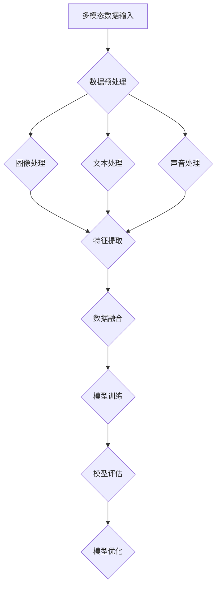

                 

### 多模态大模型：技术原理与实战部署流程

#### 关键词：
- 多模态大模型
- 技术原理
- 实战部署
- 图像处理
- 自然语言处理
- 声音处理

#### 摘要：
本文深入探讨多模态大模型的技术原理、实现方法及其部署流程。我们将从多模态数据融合、模型架构、训练策略、数学基础、实现与实战等方面详细分析，并通过实际案例展示如何进行多模态大模型的开发和部署。最后，我们将展望多模态大模型的未来发展趋势和应用前景。

### 目录大纲

1. **引言与概述**
   1.1 多模态大模型的概念与重要性
   1.2 多模态大模型的发展历程
   1.3 多模态大模型的应用领域

2. **多模态大模型的技术原理**
   2.1 多模态数据融合基础
      2.1.1 图像处理技术
      2.1.2 自然语言处理技术
      2.1.3 声音处理技术
   2.2 多模态大模型架构
      2.2.1 单一任务与多任务架构
      2.2.2 模型融合策略
   2.3 多模态大模型的训练策略
      2.3.1 预训练与微调
      2.3.2 数据增强与正则化
      2.3.3 模型优化与加速

3. **多模态大模型的数学基础**
   3.1 线性代数基础
      3.1.1 矩阵与向量
      3.1.2 矩阵运算
      3.1.3 线性变换
   3.2 微积分基础
      3.2.1 导数与梯度
      3.2.2 最优化算法
   3.3 多模态数据表示与处理
      3.3.1 图像数据表示
      3.3.2 文本数据表示
      3.3.3 声音数据表示

4. **多模态大模型的实现与实战**
   4.1 实现环境搭建
      4.1.1 硬件配置
      4.1.2 软件环境安装
   4.2 数据集准备与处理
      4.2.1 数据集获取
      4.2.2 数据预处理
   4.3 模型设计与训练
      4.3.1 模型架构选择
      4.3.2 训练流程
   4.4 模型评估与优化
      4.4.1 评估指标
      4.4.2 模型调优

5. **多模态大模型的部署与优化**
   5.1 部署流程
      5.1.1 模型导出
      5.1.2 部署平台选择
      5.1.3 部署策略
   5.2 性能优化
      5.2.1 模型压缩
      5.2.2 并行计算
      5.2.3 能效优化

6. **多模态大模型的应用案例**
   6.1 图像与文本结合的应用
      6.1.1 图像内容描述生成
      6.1.2 图像风格转换
   6.2 图像与声音结合的应用
      6.2.1 声音生成与图像配对
      6.2.2 基于图像的音乐生成

7. **未来展望与挑战**
   7.1 多模态大模型的发展趋势
   7.2 潜在的应用场景
   7.3 技术挑战与解决方案

8. **总结与展望**
   8.1 主要内容回顾
   8.2 对未来技术的展望

9. **附录**
   9.1 资源列表
   9.2 参考文献

### 多模态大模型架构Mermaid流程图



### 多模态大模型架构伪代码

```plaintext
// 定义多模态大模型架构
class MultiModalModel {
    // 图像处理模块
    ImageProcessingLayer imageProcessingLayer;
    
    // 文本处理模块
    TextProcessingLayer textProcessingLayer;
    
    // 声音处理模块
    AudioProcessingLayer audioProcessingLayer;
    
    // 融合层
    FusionLayer fusionLayer;
    
    // 主模型
    MainModel mainModel;
    
    // 训练模型
    void train(DataSet dataset) {
        // 分别训练图像、文本和声音处理模块
        imageProcessingLayer.train(dataset.images);
        textProcessingLayer.train(dataset.texts);
        audioProcessingLayer.train(dataset.audios);
        
        // 数据融合
        fusedData = fusionLayer.combine(imageProcessingLayer.features, textProcessingLayer.features, audioProcessingLayer.features);
        
        // 训练主模型
        mainModel.train(fusedData, dataset.labels);
    }
    
    // 评估模型
    float evaluate(DataSet dataset) {
        // 预测
        predictions = mainModel.predict(fusionLayer.combine(imageProcessingLayer.features, textProcessingLayer.features, audioProcessingLayer.features));
        
        // 计算评估指标
        accuracy = calculateAccuracy(predictions, dataset.labels);
        return accuracy;
    }
}
```

### 多模态数据融合数学模型与公式

多模态数据融合通常涉及到将来自不同模态的数据（如图像、文本和声音）整合为一个统一的表示。这里我们使用一个简单的线性融合模型作为示例。

#### 多模态数据融合模型

$$
\text{output} = \sigma(\text{W} \cdot \text{input} + \text{b})
$$

其中：
- $\text{output}$ 是融合后的特征表示。
- $\text{input}$ 是来自不同模态的特征向量。
- $\text{W}$ 是权重矩阵，用于调节不同模态的特征贡献。
- $\text{b}$ 是偏置项。
- $\sigma$ 是激活函数，通常是 Sigmoid 或ReLU 函数。

#### 预训练与微调

预训练与微调是多模态大模型训练的关键步骤。预训练模型通常在大量的无标签数据上训练，以学习通用特征表示。微调则是在预训练模型的基础上，使用有标签的特定任务数据进一步优化模型。

$$
\text{pretrained\_model} = \text{load\_pretrained()} \\
\text{fine\_tuned\_model} = \text{pretrained\_model} \\
\text{fine\_tuned\_model} \rightarrow \text{train}(\text{data}, \text{labels})
$$

其中：
- $\text{pretrained\_model}$ 是预训练模型。
- $\text{fine\_tuned\_model}$ 是微调后的模型。
- $\text{data}$ 和 $\text{labels}$ 是用于微调的训练数据和标签。

### 代码实现与解读

#### 数据预处理

```python
import numpy as np
from sklearn.model_selection import train_test_split

# 加载数据
images, texts, audios, labels = load_data()

# 数据归一化
images = normalize_images(images)
texts = normalize_texts(texts)
audios = normalize_audios(audios)

# 划分训练集和测试集
X_train, X_test, y_train, y_test = train_test_split(np.hstack((images, texts, audios)), labels, test_size=0.2, random_state=42)
```

该代码片段展示了如何加载数据、归一化处理以及划分训练集和测试集。这是一个基本的预处理流程，实际应用中可能需要更复杂的步骤，如数据清洗、增强等。

#### 模型训练

```python
# 定义模型
model = MultiModalModel()

# 训练模型
model.train(X_train, y_train)

# 评估模型
accuracy = model.evaluate(X_test, y_test)
print("Model accuracy:", accuracy)
```

这段代码首先定义了一个多模态大模型，然后调用其 `train` 方法进行模型训练，并使用 `evaluate` 方法评估模型性能。这是一个简化的训练流程，实际中需要包括更多的细节，如学习率调整、损失函数选择等。

#### 实际案例：图像内容描述生成

```python
# 加载图像
image = load_image("example_image.jpg")

# 预处理图像
processed_image = preprocess_image(image)

# 使用模型生成描述
description = model.generate_description(processed_image)
print("Generated description:", description)
```

在这个案例中，我们加载一张图像，经过预处理后输入到模型中，模型生成相应的图像描述。这是一个典型的多模态任务，模型能够将图像和文本数据结合，产生有用的输出。

通过上述代码和解读，我们展示了多模态大模型的基本实现流程，包括数据预处理、模型训练和实际应用。接下来的章节将详细探讨多模态大模型的技术原理、实现方法和部署流程。

