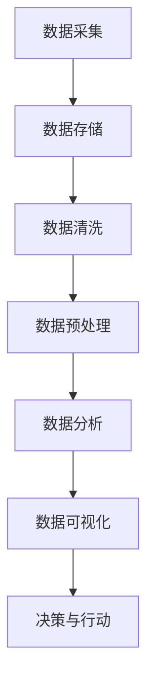

                 

### 大数据概述

#### 1.1 大数据的定义与特征

大数据（Big Data），通常指的是在数据量（Volume）、数据多样性（Variety）、数据生成速度（Velocity）和数据价值（Value）这四个V方面具有显著特征的数据集合。具体来说，大数据通常具有以下特征：

- **数据量大**：大数据通常指的是从TB到PB级别的数据量。传统的数据库和管理工具无法有效处理如此庞大的数据量。
- **数据多样性**：大数据不仅包括结构化数据，如关系型数据库中的表格，还包括半结构化数据（如XML、JSON等）和非结构化数据（如图像、音频、视频等）。
- **生成速度快**：数据生成速度以GB/s的速度增长，这使得实时处理和分析数据成为必要。
- **价值密度低**：大数据中的有用信息与无关或噪声信息混合在一起，因此提取有用信息具有挑战性。

#### 1.2 大数据的发展历程

大数据的概念并不是突然出现的，而是随着信息技术的发展逐步形成的。以下是大数据发展历程的主要阶段：

- **1980年代至1990年代**：数据仓库和数据挖掘技术开始兴起，企业开始大规模存储和管理数据。
- **2000年初期**：随着互联网的发展，数据量开始迅速增长，非结构化数据开始成为数据的主要形式。
- **2005年**：Google发布MapReduce论文，标志着分布式计算和大数据处理技术的兴起。
- **2010年至今**：大数据技术逐渐成熟，Hadoop、Spark等分布式计算框架得到广泛应用，大数据分析开始成为企业竞争的关键。

#### 1.3 大数据的应用领域

大数据技术已经渗透到多个行业和领域，以下是一些主要的应用领域：

- **金融行业**：通过大数据分析，金融机构能够进行风险控制、信用评估、欺诈检测等。
- **电子商务**：电商平台使用大数据分析用户行为，实现个性化推荐和精准营销。
- **医疗健康**：大数据分析用于疾病预测、个性化治疗和医疗资源的优化配置。
- **政府管理**：政府利用大数据进行公共安全、城市规划、社会服务等方面的决策。
- **交通物流**：通过大数据分析，实现智能交通管理和物流优化。

### **小结**

大数据以其数据量大、多样性、生成速度快和价值密度低等特征，对各行各业产生了深远的影响。理解大数据的定义、发展历程和应用领域，有助于我们更好地把握大数据技术的发展趋势和潜力。

---

### 1.2 大数据的发展历程

#### 1.2.1 初期阶段：数据仓库与数据挖掘

1980年代至1990年代，数据仓库和数据挖掘技术开始兴起。这一时期，企业开始意识到数据的价值，并投资建设大型数据库系统。数据仓库技术使得企业能够集中存储和管理不同来源的数据，为后续的数据分析提供基础。

- **1980年代初**：IBM推出了第一个关系型数据库管理系统（RDBMS）——IBM SanFrancisco，这标志着现代数据库技术的诞生。
- **1987年**：美国计算机科学家Jim Gray在ACM SIGMOD会议上首次提出了“数据仓库”的概念，数据仓库技术开始受到广泛关注。

#### 1.2.2 成长阶段：互联网与非结构化数据

2000年初期，随着互联网的快速发展，数据量开始呈现爆发式增长。互联网的普及使得大量的非结构化数据（如图像、音频、视频等）开始产生，传统的数据库技术难以应对这些数据的存储和处理需求。

- **2003年**：Google发表了关于GFS（Google File System）的论文，为分布式文件系统的研究提供了新的思路。
- **2004年**：Google发布了MapReduce论文，提出了基于分布式计算的方法来处理大规模数据集，这为大数据处理技术的兴起奠定了基础。

#### 1.2.3 突破阶段：Hadoop与分布式计算

2005年，Apache Hadoop开源项目成立，标志着分布式计算和大数据处理技术的崛起。Hadoop采用了MapReduce编程模型，使得处理大规模数据变得更加高效和简便。

- **2006年**：Yahoo！成为第一个使用Hadoop作为生产环境服务的公司。
- **2008年**：Apache Hadoop成为Apache软件基金会的顶级项目。

#### 1.2.4 成熟阶段：多样化大数据技术和平台

2010年至今，大数据技术逐渐成熟，出现了一系列与大数据处理相关的技术平台和工具，如Spark、Storm、Flink等。这些平台在性能、可扩展性、易用性等方面都有显著的提升，推动了大数据技术在各行业的广泛应用。

- **2014年**：Spark正式成为Apache软件基金会的顶级项目，标志着大数据处理技术的新一代崛起。
- **2015年**：Google发布了TensorFlow，为机器学习和深度学习领域带来了革命性的变化。

#### 1.2.5 当前发展趋势

当前，大数据技术继续向智能化和自动化方向发展。人工智能与大数据技术的深度融合，使得数据分析变得更加智能化和自动化。此外，随着5G网络的推广和物联网（IoT）的发展，数据量将继续呈现爆发式增长，对大数据处理技术提出了更高的要求。

- **2019年**：AWS推出了Amazon S3 Select，提供了一种新的方式来查询S3中的数据，提升了数据查询的效率。
- **2020年**：Google发布了BigQuery Omni，旨在为不同类型的数据提供统一的查询体验。

### **小结**

大数据的发展历程展示了数据技术从初期阶段的数据仓库和数据挖掘，到成长阶段的互联网与非结构化数据，再到突破阶段的分布式计算和成熟阶段的多样化大数据技术平台的演变过程。理解这些发展阶段有助于我们更好地把握大数据技术的发展趋势和应用前景。

---

### 1.3 大数据的应用领域

大数据技术在众多领域得到了广泛应用，其独特的价值和优势使其成为推动行业创新和提升企业竞争力的关键力量。以下是一些主要的应用领域：

#### 金融行业

在金融行业，大数据分析被广泛应用于风险控制、信用评估、欺诈检测、投资策略优化等方面。

- **风险控制**：金融机构利用大数据分析实时监控交易活动，识别潜在的金融风险。
- **信用评估**：通过分析客户的交易记录、行为数据等，金融机构可以更准确地评估客户的信用状况。
- **欺诈检测**：大数据分析技术能够识别异常交易行为，帮助金融机构及时阻止欺诈行为。
- **投资策略**：通过分析市场数据、宏观经济指标等，金融机构可以制定更科学的投资策略。

#### 电子商务

电子商务平台通过大数据分析，实现个性化推荐、精准营销、用户行为分析等，从而提高用户体验和销售额。

- **个性化推荐**：基于用户的浏览和购买历史，电商平台可以推荐符合用户兴趣的商品。
- **精准营销**：通过分析用户数据，电商平台可以精准地推送优惠信息和广告，提高转化率。
- **用户行为分析**：大数据分析有助于电商平台了解用户行为，优化网站设计和购物体验。

#### 医疗健康

大数据分析在医疗健康领域有着广泛的应用，包括疾病预测、个性化治疗、医疗资源优化等方面。

- **疾病预测与诊断**：通过对大量医疗数据的分析，可以预测疾病发生的概率，辅助医生进行早期诊断。
- **个性化治疗**：基于患者的基因数据、病历数据等，大数据分析可以帮助医生制定个性化的治疗方案。
- **医疗资源优化**：大数据分析可以优化医院资源分配，提高医疗服务效率。

#### 政府管理

政府在公共安全、城市规划、社会服务等方面利用大数据分析，实现更高效的管理和决策。

- **公共安全**：通过大数据分析，政府可以实时监控社会治安状况，预防犯罪事件。
- **城市规划**：大数据分析有助于政府了解城市人口分布、交通流量等，优化城市规划。
- **社会服务**：大数据分析可以优化社会服务资源分配，提高社会服务的效率和满意度。

#### 交通物流

大数据分析在交通物流领域用于实现智能交通管理和物流优化，提高交通效率和物流效率。

- **智能交通管理**：通过大数据分析，交通管理部门可以实时监控交通流量，优化交通信号控制。
- **物流优化**：大数据分析可以帮助物流公司优化运输路线、库存管理，降低成本。

#### 其他领域

除了上述领域，大数据分析还广泛应用于教育、零售、能源、环境等多个行业。例如，在教育领域，大数据分析可以帮助学校优化课程设置、提高教学质量；在零售领域，大数据分析可以帮助企业优化供应链管理、提高库存周转率；在能源领域，大数据分析可以优化能源生产和消费，提高能源利用效率。

### **小结**

大数据技术在金融、电子商务、医疗健康、政府管理、交通物流等多个领域得到了广泛应用，其独特的价值和优势使其成为推动行业创新和提升企业竞争力的关键力量。随着大数据技术的不断发展，其应用领域和影响力将不断扩展。

---

## 2.1 描述性数据分析

描述性数据分析是大数据分析的基础，其主要目的是通过统计方法对数据进行汇总和描述，以揭示数据的基本特征和规律。描述性数据分析包括以下几个方面：

### 2.1.1 基本统计量

基本统计量是对数据进行描述的重要工具，包括均值（Mean）、中位数（Median）、众数（Mode）、方差（Variance）、标准差（Standard Deviation）等。

- **均值**：均值是数据集的平均值，用于描述数据的中心位置。计算公式为：
  $$
  \text{Mean} = \frac{1}{n} \sum_{i=1}^{n} x_i
  $$
- **中位数**：中位数是将数据集排序后位于中间位置的数值，用于描述数据的中间位置。如果数据集的个数是奇数，中位数就是中间的那个数；如果数据集的个数是偶数，中位数是中间两个数的平均值。
- **众数**：众数是数据集中出现次数最多的数值，用于描述数据的最频繁取值。
- **方差**：方差描述数据的离散程度，计算公式为：
  $$
  \text{Variance} = \frac{1}{n} \sum_{i=1}^{n} (x_i - \text{Mean})^2
  $$
- **标准差**：标准差是方差的平方根，用于描述数据的离散程度，计算公式为：
  $$
  \text{Standard Deviation} = \sqrt{\text{Variance}}
  $$

### 2.1.2 数据可视化

数据可视化是描述性数据分析的重要手段，通过图形化方式展示数据特征，使数据更容易理解和分析。常见的数据可视化工具包括Matplotlib、Seaborn、Plotly等。

- **直方图**：直方图用于展示数据分布情况，横轴表示数据的取值范围，纵轴表示每个取值范围的频数或频率。
- **密度图**：密度图是直方图的平滑版本，用于展示数据分布的密度，横轴表示数据取值，纵轴表示概率密度。
- **散点图**：散点图用于展示两个变量之间的关系，每个点代表数据集中的一个观测值。
- **箱线图**：箱线图用于展示数据的分布和离散程度，包括上限、下限、中位数、第一四分位数和第三四分位数等。

### 2.1.3 实例分析

以下是一个简单的描述性数据分析实例，使用Python的Pandas和Matplotlib库对一组销售数据进行描述性分析。

```python
import pandas as pd
import matplotlib.pyplot as plt

# 数据加载
data = pd.read_csv('sales_data.csv')

# 描述性统计
summary_stats = data.describe()

# 打印基本统计量
print("基本统计量：")
print(summary_stats)

# 数据可视化
# 直方图
plt.figure(figsize=(10, 5))
plt.hist(data['sales'], bins=30, color='blue', alpha=0.7)
plt.xlabel('Sales')
plt.ylabel('Frequency')
plt.title('Sales Distribution')
plt.show()

# 箱线图
plt.figure(figsize=(10, 5))
plt.boxplot(data['sales'], vert=False)
plt.xlabel('Sales')
plt.title('Sales Distribution')
plt.show()
```

在这个实例中，我们首先加载了销售数据，然后使用Pandas的`describe()`方法计算了基本统计量，并打印出来。接下来，我们使用Matplotlib绘制了销售数据的直方图和箱线图，以直观地展示数据的分布和离散程度。

### **小结**

描述性数据分析通过基本统计量和数据可视化方法，帮助我们了解数据的基本特征和规律。掌握描述性数据分析的方法，能够为后续的探索性数据分析和实证数据分析打下坚实的基础。

---

## 2.2 探索性数据分析

探索性数据分析（Exploratory Data Analysis，EDA）是在描述性数据分析的基础上，进一步深入分析数据，以发现数据中的模式、异常和趋势。EDA的目的是通过直观的观察和分析，揭示数据中的潜在关系和问题，为后续的数据建模和决策提供依据。以下是EDA的主要方法和步骤：

### 2.2.1 数据清洗和预处理

在开始EDA之前，数据清洗和预处理是必不可少的一步。数据清洗包括处理缺失值、异常值、重复值等，确保数据的质量和一致性。

- **处理缺失值**：常见的处理方法包括删除缺失值、填补缺失值（如平均值填补、中位数填补、插值法等）。
- **处理异常值**：异常值可能是数据中的噪声或错误，可以通过统计方法（如箱线图、Z分数等）识别和剔除。
- **数据转换**：包括对数据进行归一化、标准化、离散化等操作，使数据更适合分析。

### 2.2.2 数据可视化

数据可视化是EDA的重要工具，通过图形化的方式展示数据特征，帮助我们直观地理解和分析数据。

- **散点图**：用于展示两个变量之间的关系，每个点代表数据中的一个观测值。
- **箱线图**：用于展示数据的分布和离散程度，包括上限、下限、中位数、第一四分位数和第三四分位数等。
- **密度图**：用于展示数据的分布密度，横轴表示数据取值，纵轴表示概率密度。
- **热力图**：用于展示多个变量之间的相关性，通过颜色深浅表示相关性的强弱。

### 2.2.3 统计分析

统计分析是对数据集中关系和趋势的量化描述，常用的统计方法包括：

- **相关分析**：用于衡量两个变量之间的线性关系，常用的方法包括皮尔逊相关系数和斯皮尔曼等级相关系数。
- **主成分分析**：用于降维和特征提取，将多个相关变量转换成几个不相关的综合变量。
- **聚类分析**：用于将数据集划分为不同的类别，常见的算法包括K-Means、层次聚类等。

### 2.2.4 实例分析

以下是一个简单的探索性数据分析实例，使用Python的Pandas、Matplotlib和Seaborn库对一组销售数据进行EDA。

```python
import pandas as pd
import matplotlib.pyplot as plt
import seaborn as sns

# 数据加载
data = pd.read_csv('sales_data.csv')

# 数据预处理
# 处理缺失值、异常值等

# 数据可视化
# 箱线图
sns.boxplot(x='region', y='sales', data=data)
plt.xticks(rotation=45)
plt.show()

# 散点图
sns.regplot(x='age', y='sales', data=data)
plt.xlabel('Age')
plt.ylabel('Sales')
plt.show()

# 热力图
correlation_matrix = data.corr()
sns.heatmap(correlation_matrix, annot=True, cmap='coolwarm')
plt.show()
```

在这个实例中，我们首先加载了销售数据，然后进行了数据预处理，包括处理缺失值和异常值。接下来，我们使用Seaborn绘制了箱线图、散点图和热力图，以探索数据中的分布、关系和相关性。

### **小结**

探索性数据分析通过数据清洗、数据可视化和统计分析等方法，帮助我们深入理解数据，发现数据中的模式、异常和趋势。掌握EDA的方法和工具，能够为后续的数据建模和决策提供有力的支持。

---

## 2.3 实证数据分析

实证数据分析（Empirical Data Analysis）是一种基于实际数据进行的统计分析方法，旨在揭示数据中的内在规律和因果关系。实证数据分析通常包括以下几个步骤：

### 2.3.1 数据准备

在实证数据分析之前，数据准备是关键的一步，包括数据清洗、数据整合、数据规范化等。

- **数据清洗**：处理缺失值、异常值和重复值等，确保数据的质量。
- **数据整合**：将来自不同来源的数据进行整合，以便进行统一分析。
- **数据规范化**：对数据进行归一化或标准化，使其具有可比性。

### 2.3.2 建立模型

建立模型是实证数据分析的核心步骤，通过选择合适的统计方法或机器学习算法，对数据进行建模。

- **回归分析**：用于研究一个或多个自变量与因变量之间的关系，常见的算法包括线性回归、多项式回归、逻辑回归等。
- **时间序列分析**：用于分析时间序列数据，如ARIMA模型、AR模型、MA模型、ARMA模型等。
- **机器学习**：包括监督学习和无监督学习，如决策树、随机森林、支持向量机、聚类算法等。

### 2.3.3 参数估计

参数估计是实证数据分析的重要环节，通过计算模型参数的估计值，来描述数据中的规律。

- **最大似然估计**：用于估计模型参数，通过最大化似然函数来找到最佳参数值。
- **贝叶斯估计**：基于贝叶斯统计理论，通过先验概率和似然函数计算后验概率，来估计模型参数。

### 2.3.4 模型评估

模型评估是确保模型预测准确性的关键步骤，常用的评估指标包括：

- **R平方（R^2）**：衡量模型对数据的拟合程度，取值范围为0到1。
- **均方误差（MSE）**：衡量模型预测的误差，计算公式为：
  $$
  \text{MSE} = \frac{1}{n} \sum_{i=1}^{n} (y_i - \hat{y}_i)^2
  $$
- **交叉验证**：通过将数据集划分为训练集和验证集，多次训练和验证，评估模型的泛化能力。

### 2.3.5 结果解释

结果解释是实证数据分析的最后一步，通过解释模型参数和评估指标，理解数据中的规律和因果关系。

- **解释参数**：解释模型参数的统计意义，如系数的正负、显著性等。
- **解释指标**：解释评估指标的含义，如R平方、MSE等。

### 实例分析

以下是一个简单的实证数据分析实例，使用Python的Scikit-learn库进行线性回归分析。

```python
import pandas as pd
from sklearn.linear_model import LinearRegression
from sklearn.metrics import mean_squared_error
from sklearn.model_selection import train_test_split

# 数据加载
data = pd.read_csv('sales_data.csv')

# 数据预处理
# 处理缺失值、异常值等

# 分离特征和标签
X = data[['age', 'income']]
y = data['sales']

# 数据划分
X_train, X_test, y_train, y_test = train_test_split(X, y, test_size=0.2, random_state=42)

# 建立模型
model = LinearRegression()
model.fit(X_train, y_train)

# 模型评估
y_pred = model.predict(X_test)
mse = mean_squared_error(y_test, y_pred)
print("MSE:", mse)

# 结果解释
print("模型系数：", model.coef_)
print("模型截距：", model.intercept_)
```

在这个实例中，我们首先加载了销售数据，然后进行了数据预处理。接下来，我们分离了特征和标签，并将数据划分为训练集和测试集。使用线性回归模型进行建模，并计算了模型评估指标MSE。最后，我们解释了模型的参数和截距。

### **小结**

实证数据分析通过数据准备、建立模型、参数估计、模型评估和结果解释等步骤，帮助我们揭示数据中的规律和因果关系。掌握实证数据分析的方法和工具，能够为实际问题的解决提供科学的依据。

---

## 2.4 大数据处理技术

大数据处理技术是应对海量数据的关键，主要包括数据存储、数据清洗与预处理以及分布式计算框架。以下是对这些技术的详细介绍：

### 2.4.1 数据存储技术

数据存储技术是实现大数据处理的基础，其目的是高效地存储和检索大量数据。以下是一些常见的数据存储技术：

- **关系型数据库**：如MySQL、PostgreSQL等，适合存储结构化数据，具有高效的事务处理能力和查询能力。
- **NoSQL数据库**：如MongoDB、Cassandra、Redis等，适合存储半结构化或非结构化数据，具有高扩展性和灵活性。
- **分布式文件系统**：如HDFS（Hadoop Distributed File System），适合存储大规模数据集，具有高可用性和高容错性。

### 2.4.2 数据清洗与预处理

数据清洗与预处理是大数据处理的重要环节，其目的是提高数据质量和一致性，为后续分析提供可靠的数据基础。以下是一些常见的数据清洗与预处理方法：

- **缺失值处理**：通过删除、填补或插值等方法处理缺失值。
- **异常值检测与处理**：通过统计方法（如箱线图、Z分数等）识别异常值，并进行删除或修正。
- **数据转换**：包括对数据进行归一化、标准化、离散化等操作，使其适合分析。
- **数据集成**：将来自不同来源的数据进行整合，以便进行统一分析。

### 2.4.3 分布式计算框架

分布式计算框架是处理大规模数据集的关键技术，其目的是通过分布式计算资源高效地处理数据。以下是一些常见的大数据处理框架：

- **MapReduce**：由Google提出的一种分布式计算模型，适用于大规模数据的批量处理。
- **Spark**：基于内存的分布式计算框架，适用于实时数据处理和迭代计算。
- **Flink**：流处理框架，能够实时处理和分析数据流。
- **Hadoop**：一个开源的大数据处理平台，包括HDFS（分布式文件系统）、MapReduce（分布式计算模型）等组件。

### 2.4.4 技术特点与比较

- **关系型数据库**：具有高效的事务处理能力和查询能力，但扩展性较差，不适合处理海量数据。
- **NoSQL数据库**：具有高扩展性和灵活性，适合存储半结构化或非结构化数据，但查询性能可能不如关系型数据库。
- **分布式文件系统**：具有高可用性和高容错性，适合存储大规模数据集，但数据访问速度可能较慢。
- **MapReduce**：适用于大规模数据的批量处理，但实时性较差。
- **Spark**：基于内存的分布式计算框架，适用于实时数据处理和迭代计算，但计算资源消耗较大。
- **Flink**：实时处理框架，适用于实时数据流处理，但学习曲线较陡。
- **Hadoop**：一个开源的大数据处理平台，包括多种组件，适合大规模数据处理，但配置和管理较为复杂。

### **小结**

大数据处理技术包括数据存储、数据清洗与预处理以及分布式计算框架，每种技术都有其独特的特点和应用场景。了解这些技术的特点与比较，有助于我们根据具体需求选择合适的技术方案。

---

## 4.1 关联规则挖掘

关联规则挖掘是一种用于发现数据集中项目之间潜在关联关系的方法。其基本思想是通过分析数据中的频繁模式，揭示不同项目之间的依赖关系。关联规则挖掘广泛应用于市场篮分析、推荐系统、异常检测等领域。

### 4.1.1 基本概念

- **支持度（Support）**：表示一个规则在数据集中的频率，计算公式为：
  $$
  \text{Support}(A \rightarrow B) = \frac{\text{同时包含A和B的交易数}}{\text{总交易数}}
  $$
  其中，A和B是数据集中的两个项目。

- **置信度（Confidence）**：表示一个规则的前件和后件同时发生的概率，计算公式为：
  $$
  \text{Confidence}(A \rightarrow B) = \frac{\text{同时包含A和B的交易数}}{\text{包含A的交易数}}
  $$

- **提升（Lift）**：表示一个规则的置信度与单纯基于概率的期望置信度之间的比较，计算公式为：
  $$
  \text{Lift}(A \rightarrow B) = \frac{\text{Confidence}(A \rightarrow B)}{\text{Confidence}(B)}
  $$

### 4.1.2 算法原理

关联规则挖掘通常包括两个主要步骤：频繁项集挖掘和关联规则生成。

- **频繁项集挖掘**：使用Apriori算法或FP-Growth算法，找出数据集中的频繁项集。频繁项集是指支持度大于最小支持度的项集。

  - **Apriori算法**：通过递归搜索的方式，从单个项开始，逐步构建频繁项集。算法的核心思想是基于频繁项集的向下封闭性，即如果{A, B, C}是频繁项集，则{A, B}和{B, C}也是频繁项集。

  - **FP-Growth算法**：通过构建FP-Tree（频繁模式树）来存储数据集的频繁项集。FP-Growth算法避免了生成大量候选项集的步骤，提高了算法的效率。

- **关联规则生成**：在得到频繁项集的基础上，使用支持度和置信度生成关联规则。通常，我们会根据用户需求设定最小支持度和最小置信度，以筛选出有意义的规则。

### 4.1.3 算法伪代码

以下是一个简化的关联规则挖掘算法的伪代码：

```
Algorithm Apriori(Dataset D, Minimum Support, Minimum Confidence):
    1. 计算所有项集的支持度，并筛选出频繁项集
    2. 对于每个频繁项集，生成所有可能的关联规则
    3. 计算每个规则的置信度
    4. 根据最小支持度和最小置信度，筛选出有效的关联规则
    5. 输出关联规则
```

### **小结**

关联规则挖掘是一种强大的数据分析方法，能够帮助我们揭示数据中的潜在关联关系。通过频繁项集挖掘和关联规则生成，我们可以发现数据中不同项目之间的依赖模式。掌握关联规则挖掘的基本概念和算法原理，有助于我们在实际应用中有效地进行数据分析。

---

## 4.2 聚类分析

聚类分析是一种无监督学习方法，用于将数据集划分为若干个类别，使得同一类别内的数据点具有较高的相似性，不同类别间的数据点差异较大。聚类分析广泛应用于数据挖掘、机器学习、模式识别等领域。

### 4.2.1 聚类算法

聚类算法根据不同的原则和实现方法，可以分为以下几类：

- **基于距离的聚类算法**：这类算法以数据点之间的距离作为划分标准，常见的算法有K-Means聚类、层次聚类等。

  - **K-Means聚类**：将数据点分为K个簇，使得每个簇内的数据点之间的平均距离最小。算法的核心步骤包括初始化聚类中心、计算每个数据点的簇分配、更新聚类中心等。

  - **层次聚类**：根据数据点之间的距离逐步合并或分裂，形成层次结构。常见的层次聚类算法有自底向上（凝聚层次聚类）和自顶向下（分裂层次聚类）两种。

- **基于密度的聚类算法**：这类算法以数据点在空间中的密度分布作为划分标准，常见的算法有DBSCAN等。

  - **DBSCAN**：基于密度的空间聚类算法，能够识别出任意形状的聚类。算法的核心步骤包括计算邻域、确定核心点、生成聚类等。

- **基于模型的聚类算法**：这类算法通过构建数学模型来描述聚类，常见的算法有高斯混合模型（GMM）等。

  - **高斯混合模型**：假设数据由多个高斯分布组成，通过最大化似然函数估计模型参数，实现聚类。

### 4.2.2 算法原理

以下简要介绍几种常见的聚类算法的原理：

- **K-Means聚类算法**：

  - **初始化**：随机选择K个初始聚类中心。
  - **分配数据点**：计算每个数据点到各个聚类中心的距离，并将其分配到最近的聚类中心。
  - **更新聚类中心**：计算每个簇的平均值，作为新的聚类中心。
  - **重复步骤2和3**，直到聚类中心不再变化或满足停止条件。

- **层次聚类算法**：

  - **自底向上（凝聚层次聚类）**：从每个数据点开始，逐步合并距离最近的点，形成更大的簇，直到所有的点都合并为一个簇。
  - **自顶向下（分裂层次聚类）**：从一个大簇开始，逐步分裂成更小的簇，直到每个簇只包含一个数据点。

- **DBSCAN算法**：

  - **计算邻域**：对于每个数据点，计算其邻域内的点，并确定邻域半径。
  - **确定核心点**：如果一个点的邻域内存在足够多的点（满足最小密度要求），则该点为核心点。
  - **生成簇**：从核心点开始，递归地扩展簇，直到没有更多的点可以被添加到簇中。

- **高斯混合模型（GMM）**：

  - **模型构建**：假设数据由多个高斯分布组成，通过估计高斯分布的参数（均值、方差等），构建高斯混合模型。
  - **参数估计**：使用最大似然估计或期望最大化算法，估计模型参数。
  - **聚类**：根据数据点到各个高斯分布的似然概率，将其分配到相应的簇。

### **小结**

聚类分析是一种重要的数据分析方法，通过不同的聚类算法可以将数据点划分为若干个类别，帮助我们更好地理解和分析数据。掌握聚类算法的基本原理和实现方法，有助于我们在实际应用中有效地进行数据聚类。

---

## 4.3 分类算法

分类算法是一种有监督学习方法，用于将数据集划分为预先定义的类别。分类算法在机器学习、数据挖掘、预测分析等领域具有广泛的应用。以下介绍几种常见的分类算法：

### 4.3.1 决策树

决策树是一种树形结构，每个内部节点表示一个特征，每个分支表示特征的一个可能取值，每个叶子节点表示一个类别。决策树的构建过程如下：

- **信息增益**：在构建决策树时，选择具有最大信息增益的特征作为当前节点的分裂标准。信息增益的计算公式为：
  $$
  \text{Gain}(D, A) = \sum_{v \in \text{values of } A} \left( \frac{\text{count}(D_v)}{\text{count}(D)} \times \log_2 \frac{\text{count}(D_v)}{\text{count}(D)} \right)
  $$
  其中，$D$是数据集，$A$是特征，$v$是特征$A$的一个取值，$D_v$是特征$A$取值为$v$的数据子集。

- **递归构建**：从根节点开始，选择具有最大信息增益的特征进行分裂，生成子节点。递归地对子节点进行相同的分裂过程，直到满足停止条件（如节点中的数据点都属于同一类别或特征取值完全相同）。

决策树的优势在于其简洁的树形结构和易于解释的决策逻辑，但可能存在过拟合的问题。

### 4.3.2 随机森林

随机森林（Random Forest）是一种基于决策树的集成学习方法，通过构建多棵决策树并投票来获得最终预测结果。随机森林的构建过程如下：

- **特征选择**：在构建每棵决策树时，随机选择一部分特征作为分裂标准，而不是所有特征。
- **样本采样**：对训练数据进行随机采样，构建多棵决策树。
- **投票**：对每棵决策树的预测结果进行投票，多数决策结果为最终预测结果。

随机森林的优势在于其高准确性和鲁棒性，能有效避免过拟合问题。

### 4.3.3 支持向量机

支持向量机（Support Vector Machine，SVM）是一种基于优化理论的分类算法，其目标是在高维空间中找到一个最优的超平面，将不同类别的数据点尽可能分开。SVM的核心思想是通过最大化分类边界两侧的间隔，实现数据的分类。

- **线性SVM**：对于线性可分的数据集，SVM通过求解线性优化问题，找到最优分类边界。优化目标为：
  $$
  \min_{\mathbf{w}, b} \frac{1}{2} ||\mathbf{w}||^2
  $$
  约束条件为：
  $$
  y_i (\mathbf{w} \cdot \mathbf{x_i} + b) \geq 1
  $$
  其中，$\mathbf{w}$是权重向量，$b$是偏置项，$y_i$是第$i$个样本的标签，$\mathbf{x_i}$是第$i$个样本的特征向量。

- **非线性SVM**：对于非线性可分的数据集，SVM通过核函数将数据映射到高维空间，找到最优分类边界。常用的核函数包括线性核、多项式核、径向基函数（RBF）等。

SVM的优势在于其强大的分类能力和较高的预测精度，但计算复杂度较高。

### **小结**

分类算法包括决策树、随机森林和支持向量机等，每种算法都有其独特的特点和应用场景。掌握这些分类算法的基本原理和实现方法，有助于我们在实际应用中根据具体需求选择合适的分类模型。

---

## 5.1 大数据可视化基本概念

大数据可视化是将大规模数据转换为可视化的形式，以便人们能够直观地理解和分析数据。大数据可视化的基本概念包括数据可视化、交互式可视化、多尺度可视化等。

### 5.1.1 数据可视化

数据可视化是将数据以图形化的形式呈现，帮助人们更好地理解和分析数据。数据可视化常用的图表类型包括：

- **柱状图**：用于展示不同类别或时间段的数据比较。
- **折线图**：用于展示数据的变化趋势。
- **饼图**：用于展示数据各部分在总体中的比例。
- **散点图**：用于展示两个或多个变量之间的关系。
- **热力图**：用于展示多个变量之间的相关性。

### 5.1.2 交互式可视化

交互式可视化是指用户可以通过鼠标点击、拖动等操作与可视化图表进行互动，从而实现数据的深入探索和分析。交互式可视化常用的功能包括：

- **过滤**：通过选择或取消选择某些数据点或类别，过滤掉不相关的数据。
- **放大与缩小**：放大或缩小特定区域，以便更详细地观察数据。
- **数据导出**：将可视化数据以表格或图像的形式导出，以便进一步分析或分享。
- **动态更新**：实时更新可视化数据，以便反映最新的数据状态。

### 5.1.3 多尺度可视化

多尺度可视化是指在不同的数据粒度上展示数据，以适应不同的分析需求。多尺度可视化常用的方法包括：

- **分层可视化**：将数据划分为不同层次，每个层次展示不同粒度的数据，用户可以根据需要切换层次。
- **聚合可视化**：将大量相似的数据点聚合为更粗粒度的数据点，以便更好地观察数据趋势。
- **多视图可视化**：在多个视图中展示不同的数据维度或特征，用户可以同时观察多个维度的数据关系。

### **小结**

大数据可视化通过图形化的形式展示数据，帮助人们更好地理解和分析数据。了解数据可视化、交互式可视化和多尺度可视化的基本概念，有助于我们选择合适的方法和技术，提高数据分析的效率和质量。

---

## 5.2 常见大数据可视化工具

大数据可视化工具在帮助用户理解和分析大规模数据方面起着至关重要的作用。以下介绍几种常见的大数据可视化工具：

### 5.2.1 Tableau

Tableau是一款功能强大的数据可视化工具，支持多种数据源，包括关系型数据库、NoSQL数据库、云存储等。Tableau的界面直观，用户可以通过拖拽操作轻松创建各种类型的图表，如柱状图、折线图、饼图、散点图等。Tableau还支持交互式可视化，用户可以通过点击、拖动、滑动等操作探索数据，实现数据过滤、放大与缩小、动态更新等功能。此外，Tableau支持多种数据导出格式，方便用户将可视化数据分享给他人。

### 5.2.2 QlikView

QlikView是一款基于内存计算的数据可视化工具，适用于大规模数据集的实时分析和可视化。QlikView的特点包括强大的关联分析和探索性数据分析能力，用户可以自由地组合和交叉多个数据维度，发现数据之间的隐含关系。QlikView还支持多用户协作，用户可以在同一平台上共享数据和可视化结果，进行实时讨论和决策。此外，QlikView支持多种数据源，包括关系型数据库、云存储、文本文件等，方便用户整合和管理数据。

### 5.2.3 Power BI

Power BI是微软推出的数据可视化工具，与Microsoft Office集成紧密，方便用户使用。Power BI支持多种数据源，包括关系型数据库、云存储、API等，用户可以轻松导入和连接各种数据。Power BI提供了丰富的可视化组件，包括柱状图、折线图、饼图、散点图、地图等，用户可以通过拖拽操作快速创建图表。Power BI还支持交互式可视化，用户可以通过点击、筛选等操作动态更新图表，实现数据的深入探索和分析。此外，Power BI支持数据导出和共享，用户可以将可视化数据导出为多种格式，并与他人共享。

### 5.2.4 D3.js

D3.js是一款基于JavaScript的强大可视化库，适用于Web端的数据可视化。D3.js具有高度灵活性和定制性，用户可以通过编写JavaScript代码创建自定义的图表和可视化效果。D3.js支持多种图表类型，包括柱状图、折线图、饼图、散点图、地图等，用户可以根据需求进行自由组合和设计。此外，D3.js还支持数据绑定和交互式操作，用户可以通过鼠标点击、拖动、滑动等操作与图表进行互动，实现数据的深入探索和分析。

### **小结**

常见的大数据可视化工具如Tableau、QlikView、Power BI和D3.js，各有其独特的特点和优势。了解这些工具的基本功能和使用方法，有助于我们根据具体需求选择合适的数据可视化工具，提高数据分析的效率和质量。

---

## 5.3 数据可视化实践

为了更好地理解数据可视化在实际应用中的价值，我们将通过一个社交媒体数据分析的案例，演示如何使用Python和常见的数据可视化库进行数据可视化。在这个案例中，我们将使用社交媒体平台上的用户数据，通过数据预处理、图表绘制和交互式分析，展示用户行为的特征和趋势。

### 5.3.1 开发环境搭建

首先，我们需要搭建开发环境。在本案例中，我们将使用Python作为主要编程语言，并结合Jupyter Notebook进行数据分析。为了实现数据可视化，我们将安装以下Python库：

- **Pandas**：用于数据处理和分析。
- **NumPy**：用于数值计算。
- **Matplotlib**：用于绘制静态图表。
- **Seaborn**：基于Matplotlib的统计数据可视化库。
- **Plotly**：用于绘制交互式图表。

在Jupyter Notebook中，可以通过以下命令安装这些库：

```python
!pip install pandas numpy matplotlib seaborn plotly
```

### 5.3.2 源代码实现

接下来，我们将展示如何使用Python进行数据预处理和绘制数据可视化图表。

#### 5.3.2.1 数据加载与预处理

首先，我们加载社交媒体数据，并进行预处理，如缺失值处理、数据转换等。

```python
import pandas as pd

# 数据加载
data = pd.read_csv('social_media_data.csv')

# 数据预处理
# 处理缺失值
data.dropna(inplace=True)

# 数据转换
data['timestamp'] = pd.to_datetime(data['timestamp'])

# 数据分组
data_grouped = data.groupby(data['timestamp'].dt.hour).count()
```

#### 5.3.2.2 绘制柱状图

使用Matplotlib绘制每小时活跃用户数的柱状图，展示用户在不同时间段的活动情况。

```python
import matplotlib.pyplot as plt

# 绘制柱状图
plt.figure(figsize=(12, 6))
plt.bar(data_grouped.index, data_grouped['post_count'])
plt.xlabel('Hour of Day')
plt.ylabel('Number of Posts')
plt.title('Active Users by Hour')
plt.xticks(rotation=45)
plt.show()
```

#### 5.3.2.3 绘制散点图

使用Seaborn绘制用户年龄与发帖数之间的散点图，分析不同年龄段用户的活跃度。

```python
import seaborn as sns

# 绘制散点图
sns.relplot(x='age', y='post_count', data=data, kind='scatter', hue='gender', alpha=0.5)
plt.xlabel('Age')
plt.ylabel('Number of Posts')
plt.title('Active Users by Age and Gender')
plt.show()
```

#### 5.3.2.4 绘制交互式图表

使用Plotly绘制一个交互式折线图，展示用户在不同时间段的活跃度。

```python
import plotly.express as px

# 绘制交互式折线图
fig = px.line(data, x='timestamp', y='post_count', title='Active Users Over Time')
fig.show()
```

### 5.3.3 代码解读与分析

#### 数据加载与预处理

- **数据加载**：使用Pandas的`read_csv()`函数从CSV文件中加载数据。
- **数据预处理**：处理缺失值，确保数据质量。将时间戳转换为日期时间格式，以便进行时间序列分析。对数据分组，以便后续分析。

#### 绘制柱状图

- **柱状图**：使用Matplotlib的`bar()`函数绘制柱状图，展示每小时活跃用户数。通过设置`xlabel`、`ylabel`和`title`，添加图表标签和标题。使用`xticks`函数旋转X轴标签，使图表更易读。

#### 绘制散点图

- **散点图**：使用Seaborn的`relplot()`函数绘制散点图，展示不同年龄段用户的活跃度。通过`hue`参数设置不同性别的颜色，以便区分男女性别。使用`xlabel`、`ylabel`和`title`添加图表标签和标题。

#### 绘制交互式图表

- **交互式折线图**：使用Plotly的`line()`函数绘制交互式折线图，展示用户在不同时间段的活跃度。通过设置`title`添加图表标题。使用`show()`函数显示图表，实现交互式功能。

### **小结**

通过本案例，我们展示了如何使用Python和相关库进行数据预处理和绘制数据可视化图表。掌握这些基本方法和技巧，有助于我们在实际项目中进行高效的数据分析和可视化。

---

## 第6章：金融行业大数据分析

### 6.1 金融数据分析概述

金融行业是大数据技术的典型应用领域之一。随着金融市场的不断发展和竞争的加剧，金融机构需要利用大数据分析来提高风险控制能力、优化投资策略和提升服务质量。金融数据分析涉及多个方面，包括风险控制、信用评估、市场预测和个性化服务。

### 6.2 金融风险预测

金融风险预测是金融数据分析的重要应用之一。通过大数据分析，金融机构可以预测市场波动、信用违约和欺诈行为，从而采取相应的措施降低风险。

- **市场波动预测**：金融机构利用大数据分析市场数据，如历史价格、交易量、宏观经济指标等，构建预测模型，预测市场的未来走势，为投资决策提供支持。
- **信用违约预测**：通过分析借款人的历史信用记录、财务状况、行为数据等，金融机构可以预测借款人是否存在违约风险，从而优化信用评估和信贷审批流程。
- **欺诈检测**：金融机构利用大数据分析用户交易数据，如交易频率、金额、地点等，发现异常交易行为，实时监控和阻止欺诈行为。

### 6.3 金融客户行为分析

了解客户行为是金融机构提高服务质量、提升客户满意度和忠诚度的关键。大数据分析可以帮助金融机构深入挖掘客户行为数据，实现个性化服务和精准营销。

- **个性化服务**：通过分析客户的交易历史、浏览行为、偏好等，金融机构可以为不同客户提供个性化的金融产品和服务，提高客户满意度和忠诚度。
- **精准营销**：利用大数据分析，金融机构可以识别出潜在的高价值客户，制定有针对性的营销策略，提高营销效果和转化率。
- **客户细分**：通过分析客户数据，金融机构可以将客户分为不同的群体，如高净值客户、普通客户等，为每个客户群体提供定制化的服务和产品。

### 6.4 大数据分析在金融行业中的应用实例

以下是一些大数据分析在金融行业中的应用实例：

- **银行**：利用大数据分析，银行可以优化贷款审批流程，提高审批效率。同时，通过分析客户交易数据，银行可以识别出高风险客户，降低信贷风险。
- **证券公司**：证券公司通过大数据分析市场数据，预测市场走势，为客户提供投资建议，提高投资收益。
- **保险公司**：保险公司利用大数据分析客户行为数据，优化保险产品设计和定价策略，提高客户满意度和保费收入。

### **小结**

金融行业大数据分析有助于金融机构提高风险控制能力、优化投资策略和提升服务质量。通过市场波动预测、信用违约预测、欺诈检测、个性化服务和精准营销等应用，金融机构能够更好地应对市场变化，提高竞争力和盈利能力。

---

## 第7章：电子商务大数据分析

### 7.1 电商数据分析概述

电子商务行业是大数据技术的另一个重要应用领域。随着电商市场的不断扩大和竞争的加剧，电商平台需要利用大数据分析来提高用户体验、优化营销策略和提升销售额。电商数据分析主要包括用户画像、推荐系统和促销活动优化等方面。

### 7.2 电商用户画像

电商用户画像是指通过对用户行为数据、交易数据、浏览数据等进行分析，构建用户的基本属性、兴趣偏好和消费习惯的模型。用户画像可以帮助电商平台实现精准营销和个性化服务。

- **基本属性**：包括用户性别、年龄、地域、职业等基本信息。
- **兴趣偏好**：包括用户喜欢的商品类型、品牌、价格区间等。
- **消费习惯**：包括用户购买频率、购买金额、购买渠道等。

通过用户画像，电商平台可以了解不同用户群体的特征，从而实现以下目标：

- **精准营销**：根据用户画像，为不同用户群体推送个性化的广告和优惠信息，提高营销效果和转化率。
- **个性化服务**：根据用户画像，为用户提供个性化的购物体验，如推荐商品、定制化页面等，提高用户满意度和忠诚度。

### 7.3 电商推荐系统

电商推荐系统是指利用大数据分析用户行为数据，为用户推荐可能感兴趣的商品或服务。推荐系统通常分为基于内容的推荐和基于协同过滤的推荐两种类型。

- **基于内容的推荐**：通过分析商品的属性和标签，为用户推荐与其浏览或购买过的商品相似的物品。
- **基于协同过滤的推荐**：通过分析用户之间的行为相似性，为用户推荐其他用户喜欢或购买过的商品。

电商推荐系统的关键在于：

- **推荐准确性**：确保推荐的商品或服务与用户的兴趣和需求高度匹配，提高用户满意度。
- **推荐多样性**：为用户提供丰富多样的推荐结果，避免用户产生疲劳感。

### 7.4 促销活动优化

电商促销活动是提高销售额的重要手段。通过大数据分析，电商平台可以优化促销活动的策略，提高促销效果。

- **促销目标设定**：根据平台的数据分析结果，设定合理的促销目标，如提升销售额、提高用户活跃度等。
- **促销策略制定**：根据用户画像和推荐系统，为不同用户群体制定有针对性的促销策略，如优惠券、折扣、限时抢购等。
- **促销效果评估**：通过数据分析，评估促销活动的效果，如参与人数、转化率、销售额等，以便不断优化促销策略。

### 7.5 大数据分析在电商行业中的应用实例

以下是一些大数据分析在电商行业中的应用实例：

- **电商平台**：通过用户画像和推荐系统，电商平台可以为用户提供个性化的购物体验，提高用户满意度和忠诚度。
- **电商卖家**：通过大数据分析，电商卖家可以优化产品定价、库存管理和营销策略，提高销售额和盈利能力。
- **物流公司**：通过大数据分析，物流公司可以优化配送路线和物流流程，提高配送效率和客户满意度。

### **小结**

电子商务大数据分析有助于电商平台提高用户体验、优化营销策略和提升销售额。通过用户画像、推荐系统和促销活动优化等应用，电商平台可以更好地了解用户需求，提供个性化的服务，提高用户满意度和忠诚度。

---

## 第8章：医疗健康大数据分析

### 8.1 医疗健康数据分析概述

医疗健康大数据分析是指利用大数据技术对医疗健康数据进行收集、处理和分析，以揭示数据中的规律和趋势，为医疗决策提供支持。医疗健康数据分析涵盖了广泛的领域，包括疾病预测、个性化治疗和医疗资源优化等。

### 8.2 疾病预测与诊断

疾病预测与诊断是医疗健康大数据分析的重要应用之一。通过分析患者的病史、基因数据、医疗记录等，可以预测疾病的发生风险，辅助医生进行早期诊断和个性化治疗。

- **疾病预测**：利用大数据分析技术，通过分析患者的健康数据和生活方式数据，可以预测患者患某种疾病的概率。这有助于早期预防和干预，降低疾病发生的风险。
- **诊断辅助**：通过分析大量的病例数据，建立疾病诊断模型，医生可以在诊断过程中利用这些模型进行辅助判断，提高诊断准确性。

### 8.3 健康风险预测

健康风险预测是指通过分析个体的健康数据，预测其未来可能出现的健康问题。这有助于个性化健康管理，为用户提供有针对性的健康建议。

- **生活方式分析**：通过分析个体的饮食习惯、运动习惯等生活方式数据，可以预测其未来患某种疾病的风险。例如，通过分析体重、血压、血糖等指标，可以预测个体患高血压、糖尿病等疾病的风险。
- **基因数据分析**：基因数据与疾病风险密切相关。通过分析个体的基因数据，可以预测其患遗传性疾病的概率，为个性化健康管理和早期干预提供依据。

### 8.4 医疗资源优化

医疗资源优化是医疗健康大数据分析的重要目标之一。通过数据分析，可以实现医疗资源的合理分配和高效利用，提高医疗服务质量。

- **医院资源分配**：通过分析医院的医疗资源使用情况，如床位利用率、手术预约情况等，可以优化医疗资源的配置，提高医院的服务效率。
- **公共卫生管理**：通过分析公共卫生数据，如疾病传播趋势、疫苗接种率等，可以制定更加有效的公共卫生政策，预防和控制疾病传播。

### 8.5 大数据分析在医疗健康行业中的应用实例

以下是一些大数据分析在医疗健康行业中的应用实例：

- **医疗机构**：通过大数据分析，医疗机构可以优化诊断流程、提高诊断准确性，提高医疗服务质量。
- **健康管理系统**：通过大数据分析，健康管理系统可以提供个性化健康建议、疾病预测和健康管理方案，帮助用户改善健康状况。
- **公共卫生部门**：通过大数据分析，公共卫生部门可以更好地监控疾病传播趋势、制定公共卫生政策，提高公共卫生管理水平。

### **小结**

医疗健康大数据分析为疾病预测、个性化治疗和医疗资源优化提供了强有力的支持。通过数据分析，医疗机构和公共卫生部门可以更好地了解患者的健康状况，制定科学的医疗决策，提高医疗服务质量和公共卫生管理水平。

---

## 第9章：大数据分析实战案例

### 9.1 案例一：社交媒体数据分析

#### 背景介绍

社交媒体数据分析是大数据分析的一个重要应用领域。在这个案例中，我们以一个社交媒体平台的数据为例，分析用户的行为模式和趋势。

#### 数据来源

数据来源于一个社交媒体平台，包括用户的用户ID、性别、年龄、地理位置、发布内容、点赞数、评论数等。

#### 数据预处理

在开始分析之前，我们需要对数据进行预处理，包括数据清洗、数据转换和数据整合。

```python
import pandas as pd

# 数据加载
data = pd.read_csv('social_media_data.csv')

# 数据清洗
data.dropna(inplace=True)
data.drop_duplicates(inplace=True)

# 数据转换
data['timestamp'] = pd.to_datetime(data['timestamp'])

# 数据整合
data_grouped = data.groupby(['timestamp', 'content_type']).count().reset_index()
```

#### 数据分析

- **用户活跃度分析**：分析用户在不同时间段和不同内容类型的活跃度。

```python
import matplotlib.pyplot as plt

# 绘制用户活跃度柱状图
plt.figure(figsize=(12, 6))
plt.bar(data_grouped['timestamp'], data_grouped['post_count'])
plt.xlabel('Timestamp')
plt.ylabel('Post Count')
plt.title('User Activity by Time and Content Type')
plt.xticks(rotation=45)
plt.show()
```

- **用户性别分布分析**：分析用户性别分布情况。

```python
import seaborn as sns

# 绘制用户性别分布饼图
sns.countplot(x='gender', data=data)
plt.xlabel('Gender')
plt.ylabel('Count')
plt.title('User Gender Distribution')
plt.show()
```

#### 结果解读

通过用户活跃度分析和用户性别分布分析，我们得到了以下结论：

- **用户活跃度**：用户在周末和节假日更活跃，特别是在晚上和凌晨。
- **用户性别分布**：男性用户占比较大，但女性用户在特定时间段（如晚上）的活跃度较高。

### 9.2 案例二：智慧交通系统

#### 背景介绍

智慧交通系统利用大数据分析技术，实现对交通数据的实时监控和智能分析，以提高交通管理效率和减少交通拥堵。

#### 数据来源

数据来源于城市的交通传感器、摄像头和车辆行驶记录等，包括交通流量、速度、路况等信息。

#### 数据预处理

```python
# 数据加载
traffic_data = pd.read_csv('traffic_data.csv')

# 数据清洗
traffic_data.dropna(inplace=True)
traffic_data.drop_duplicates(inplace=True)

# 数据转换
traffic_data['timestamp'] = pd.to_datetime(traffic_data['timestamp'])

# 数据整合
traffic_data_grouped = traffic_data.groupby(['timestamp', 'road_segment']).sum().reset_index()
```

#### 数据分析

- **交通流量分析**：分析不同时间段和不同路段的交通流量。

```python
import matplotlib.pyplot as plt

# 绘制交通流量柱状图
plt.figure(figsize=(12, 6))
plt.bar(traffic_data_grouped['timestamp'], traffic_data_grouped['traffic_volume'])
plt.xlabel('Timestamp')
plt.ylabel('Traffic Volume')
plt.title('Traffic Volume by Time and Road Segment')
plt.xticks(rotation=45)
plt.show()
```

- **交通拥堵分析**：分析不同时间段和不同路段的交通拥堵情况。

```python
import seaborn as sns

# 绘制交通拥堵热力图
sns.heatmap(traffic_data_grouped.pivot('timestamp', 'road_segment', 'congestion_level'), cmap='coolwarm')
plt.xlabel('Road Segment')
plt.ylabel('Timestamp')
plt.title('Traffic Congestion by Time and Road Segment')
plt.show()
```

#### 结果解读

通过交通流量分析和交通拥堵分析，我们得到了以下结论：

- **交通流量**：早上和晚上是交通高峰期，部分路段交通流量较大，容易造成拥堵。
- **交通拥堵**：某些路段在特定时间段（如早高峰和晚高峰）的拥堵程度较高，需要采取相应的交通管理措施。

### 9.3 案例三：智能电网分析

#### 背景介绍

智能电网利用大数据分析技术，实现对电网运行状态的实时监控和智能管理，以提高电网的效率和可靠性。

#### 数据来源

数据来源于电网的传感器、电力设备等，包括电力需求、电压、电流、故障等信息。

#### 数据预处理

```python
# 数据加载
grid_data = pd.read_csv('grid_data.csv')

# 数据清洗
grid_data.dropna(inplace=True)
grid_data.drop_duplicates(inplace=True)

# 数据转换
grid_data['timestamp'] = pd.to_datetime(grid_data['timestamp'])

# 数据整合
grid_data_grouped = grid_data.groupby(['timestamp', 'power_station']).sum().reset_index()
```

#### 数据分析

- **电力需求分析**：分析不同时间段和不同电站的电力需求。

```python
import matplotlib.pyplot as plt

# 绘制电力需求柱状图
plt.figure(figsize=(12, 6))
plt.bar(grid_data_grouped['timestamp'], grid_data_grouped['electricity_demand'])
plt.xlabel('Timestamp')
plt.ylabel('Electricity Demand')
plt.title('Electricity Demand by Time and Power Station')
plt.xticks(rotation=45)
plt.show()
```

- **电网故障分析**：分析不同时间段和不同电站的故障情况。

```python
import seaborn as sns

# 绘制电网故障热力图
sns.heatmap(grid_data_grouped.pivot('timestamp', 'power_station', 'fault_count'), cmap='coolwarm')
plt.xlabel('Power Station')
plt.ylabel('Timestamp')
plt.title('Grid Faults by Time and Power Station')
plt.show()
```

#### 结果解读

通过电力需求分析和电网故障分析，我们得到了以下结论：

- **电力需求**：白天是电力需求高峰期，部分电站的电力需求较大。
- **电网故障**：某些电站存在较多的故障记录，需要加强设备维护和管理。

### **小结**

通过以上三个案例，我们展示了大数据分析在社交媒体、智慧交通和智能电网等领域的应用。掌握这些实战案例的方法和技巧，有助于我们更好地理解和应用大数据分析技术，解决实际问题。

---

## 第10章：大数据分析工具选型

在大数据分析项目中，选择合适的工具至关重要。工具选型应根据项目需求、技术难度、资源投入等多个因素综合考虑。以下是一些常见的大数据分析工具及其特点：

### 10.1 数据库选型

**关系型数据库**：如MySQL、PostgreSQL等，适合存储结构化数据，具有高效的事务处理能力和查询能力。适用于数据量较小、数据结构较为稳定的项目。

**NoSQL数据库**：如MongoDB、Cassandra、Redis等，适合存储半结构化或非结构化数据，具有高扩展性和灵活性。适用于数据量较大、数据结构多变的项目。

**分布式数据库**：如HBase、Cassandra、Hive等，适用于大规模数据集的分布式存储和查询。适用于需要进行大数据量处理和分析的项目。

### 10.2 大数据处理框架

**Hadoop**：基于MapReduce模型，适用于大规模数据的批量处理。具有高可用性和高容错性，适用于数据量巨大的项目。

**Spark**：基于内存的分布式计算框架，适用于实时数据处理和迭代计算。处理速度比Hadoop快，适用于需要实时分析和低延迟的项目。

**Flink**：流处理框架，能够实时处理和分析数据流。适用于需要实时处理和分析数据流的项目。

### 10.3 数据可视化工具

**Tableau**：功能强大的数据可视化工具，支持多种数据源，适用于非编程人员进行数据分析和可视化。

**QlikView**：基于内存计算的数据可视化工具，适用于大规模数据集的实时分析和可视化。

**Power BI**：与Microsoft Office集成紧密，适用于企业级的数据分析和可视化。

**D3.js**：基于JavaScript的强大可视化库，适用于Web端的数据可视化，具有高度灵活性和定制性。

### **小结**

大数据分析工具选型应根据项目需求、技术难度和资源投入等多方面因素综合考虑。选择合适的工具，能够提高数据分析的效率和质量，为项目成功提供有力保障。

---

## 第11章：大数据分析平台搭建

大数据分析平台的搭建是大数据项目成功的关键一步，涉及硬件选型、软件配置和系统架构等多个方面。以下详细描述大数据分析平台的搭建过程。

### 11.1 硬件选型

硬件选型应根据大数据处理的需求和预算进行。以下是一些关键硬件组件的选型建议：

- **服务器**：选择高性能的服务器，如Dell PowerEdge R740或HP ProLiant DL380，具有足够的计算能力和内存，以满足大数据处理需求。
- **存储设备**：选择大容量、高可靠性的存储设备，如Dell EMC SC Series或NetApp FAS系列。对于需要高速读写性能的应用，可以考虑使用固态硬盘（SSD）。
- **网络设备**：选择高性能的交换机，如Cisco Nexus系列，确保数据传输的稳定性和高效性。

### 11.2 软件配置

软件配置包括操作系统、数据库、大数据处理框架等的选择和安装。

- **操作系统**：选择Linux发行版，如CentOS或Ubuntu，适用于大数据环境。推荐使用服务器版操作系统，确保稳定性和安全性。
- **数据库**：根据数据存储和查询需求，选择合适的数据库。对于结构化数据，可以选择MySQL、PostgreSQL等关系型数据库；对于非结构化数据，可以选择MongoDB、Cassandra等NoSQL数据库。
- **大数据处理框架**：根据数据处理需求，选择合适的大数据处理框架。如需要批量处理，可以选择Hadoop和Spark；如需要实时处理，可以选择Apache Flink。
- **其他软件**：安装必要的编程语言（如Python、Java）、数据预处理工具（如Pandas、NumPy）和数据分析库（如Scikit-learn、Matplotlib）。

### 11.3 系统架构

大数据分析平台的系统架构应考虑数据存储、数据处理和数据可视化等多个方面。以下是一个典型的大数据分析平台架构：

- **数据存储层**：包括HDFS、HBase、Hive等分布式存储系统，用于存储大规模数据集。
- **数据处理层**：包括MapReduce、Spark、Flink等分布式计算框架，用于处理和分析数据。
- **数据服务层**：包括RESTful API、Web服务等，用于提供数据查询和数据分析服务。
- **数据展示层**：包括数据可视化工具（如Tableau、QlikView、Power BI）和Web前端，用于展示分析结果。

### 11.4 搭建步骤

以下是大数据分析平台搭建的步骤：

1. **硬件采购**：根据项目需求采购服务器、存储设备和网络设备。
2. **硬件部署**：将服务器、存储设备和网络设备部署到数据中心或云平台。
3. **软件安装**：在服务器上安装操作系统、数据库、大数据处理框架和其他软件。
4. **配置优化**：根据硬件性能和负载需求，对操作系统、数据库和大数据处理框架进行配置优化。
5. **系统集成**：将各个软件组件集成到一起，确保系统正常运行。
6. **测试与调试**：对平台进行功能测试和性能测试，确保平台稳定可靠。

### **小结**

大数据分析平台搭建涉及硬件选型、软件配置和系统架构等多个方面。通过合理的硬件选型和软件配置，构建一个高效稳定的大数据分析平台，能够为大数据项目提供强大的技术支持。

---

## 第12章：大数据安全与隐私保护

在大数据时代，数据安全与隐私保护成为关键挑战。随着数据规模的不断扩大和数据类型的日益多样化，如何确保数据的安全性和隐私性变得至关重要。以下介绍大数据安全与隐私保护的相关技术、策略和实践。

### 12.1 大数据安全挑战

- **数据泄露**：由于大数据集包含大量敏感信息，一旦泄露，可能导致严重后果。
- **数据滥用**：不法分子可能利用大数据进行非法活动，如身份盗窃、欺诈等。
- **数据篡改**：恶意攻击者可能篡改数据，影响数据的准确性和可靠性。
- **隐私侵犯**：大数据分析可能揭示用户的个人信息和行为习惯，导致隐私侵犯。

### 12.2 隐私保护技术

为应对大数据安全与隐私保护挑战，可以采用以下技术：

- **数据加密**：通过加密技术保护数据在传输和存储过程中的安全性，防止数据泄露。常用的加密算法包括AES、RSA等。
- **匿名化处理**：通过数据匿名化技术，如k-匿名、l-diversity等，消除数据中的直接标识信息，降低隐私侵犯风险。
- **访问控制**：通过访问控制机制，确保只有授权用户可以访问敏感数据，防止数据滥用和篡改。常见的访问控制策略包括基于角色的访问控制（RBAC）和基于属性的访问控制（ABAC）。
- **数据脱敏**：对敏感数据进行脱敏处理，如将电话号码、身份证号码等替换为随机生成的数字，以保护用户隐私。

### 12.3 大数据安全实践

以下是一些大数据安全与隐私保护的实践：

- **数据安全策略**：制定明确的数据安全策略，包括数据加密、访问控制、数据备份等。
- **数据安全培训**：对员工进行数据安全培训，提高他们的安全意识和技能。
- **安全审计**：定期进行数据安全审计，发现和修复安全漏洞。
- **安全监控**：通过安全监控工具，实时监测数据访问和操作行为，及时发现和应对安全威胁。
- **合规性检查**：确保大数据处理过程符合相关法律法规和行业标准，如《中华人民共和国网络安全法》和《欧盟通用数据保护条例》（GDPR）等。

### 12.4 案例分析

以下是一个大数据安全与隐私保护的案例分析：

**案例背景**：某电商平台收集了大量的用户交易数据，包括用户ID、购买商品、购买金额、支付方式等。

**安全措施**：

- **数据加密**：对用户交易数据进行AES加密，确保数据在传输和存储过程中的安全性。
- **匿名化处理**：对用户ID进行匿名化处理，消除直接标识信息，降低隐私侵犯风险。
- **访问控制**：实施基于角色的访问控制，只有授权人员可以访问敏感数据。
- **安全审计**：定期进行数据安全审计，检查数据加密和访问控制策略的执行情况。
- **合规性检查**：确保数据处理过程符合相关法律法规和行业标准。

通过上述措施，该电商平台有效地保护了用户交易数据的安全性和隐私性。

### **小结**

大数据安全与隐私保护是大数据时代的重大挑战。通过采用数据加密、匿名化处理、访问控制等技术，以及实施安全策略和实践，可以有效保障大数据的安全性和隐私性，为大数据应用提供可靠保障。

---

## 附录A：大数据分析常用算法与模型

在本文中，我们介绍了一些大数据分析中常用的算法与模型，以下是这些算法和模型的详细描述：

### A.1 决策树

决策树是一种基于树形结构的数据挖掘算法，用于分类和回归分析。每个内部节点表示一个特征，每个分支表示特征的一个可能取值，每个叶子节点表示一个类别或连续值。决策树的构建过程包括特征选择、划分数据集、递归构建树等步骤。

### A.2 支持向量机

支持向量机（SVM）是一种基于优化理论的分类算法，其目标是在高维空间中找到一个最优的超平面，使得不同类别的数据点尽可能分开。SVM可以分为线性SVM和非线性SVM，后者通过核函数实现。

### A.3 随机森林

随机森林是一种基于决策树的集成学习方法，通过构建多棵决策树并投票来获得最终预测结果。随机森林能够提高模型的准确性和鲁棒性，减少过拟合现象。

### A.4 其他常用算法

除了上述算法外，大数据分析中常用的其他算法包括：

- **K-Means聚类**：一种基于距离的聚类算法，将数据集划分为K个簇，使每个簇内的数据点之间的平均距离最小。
- **K-近邻（KNN）**：一种基于实例的简单分类算法，根据新数据点与训练数据点的距离，选择K个最近的训练数据点，并基于这些训练数据点的标签进行预测。
- **Apriori算法**：一种用于关联规则挖掘的算法，通过生成频繁项集和关联规则来揭示数据中的潜在关系。
- **DBSCAN**：一种基于密度的空间聚类算法，能够识别出任意形状的聚类。
- **高斯混合模型（GMM）**：一种用于聚类和降维的算法，假设数据由多个高斯分布组成，通过估计模型参数实现聚类。

掌握这些算法和模型的基本原理和应用场景，有助于我们更好地理解和应用大数据分析技术。

---

## 附录B：大数据分析资源与资料

### B.1 常用大数据分析工具

以下是一些常用的大数据分析工具，涵盖了数据处理、数据存储、数据可视化和机器学习等方面：

- **数据处理**：Pandas、NumPy、SciPy
- **数据存储**：Hadoop、HDFS、HBase、Cassandra、MongoDB
- **数据可视化**：Matplotlib、Seaborn、Plotly、D3.js
- **机器学习**：Scikit-learn、TensorFlow、PyTorch、Keras

### B.2 学习资源推荐

为了帮助读者深入了解大数据分析的相关知识和技能，以下是一些推荐的学习资源：

- **在线课程**：Coursera、edX、Udacity、网易云课堂等平台提供的大数据相关课程。
- **书籍**：《大数据时代》、《大数据分析：技术、工具与应用》、《大数据技术基础》等。
- **开源项目**：GitHub、GitLab等平台上相关的大数据开源项目和示例代码。
- **社区和论坛**：CSDN、知乎、Stack Overflow等大数据相关社区和论坛。

### B.3 大数据分析社区

以下是一些活跃的大数据分析社区和论坛，供读者交流和分享经验：

- **CSDN**：中国最大的IT社区和服务平台，提供大数据相关的文章、问答和教程。
- **知乎**：一个知识分享平台，大数据相关的讨论和问答非常丰富。
- **Stack Overflow**：一个针对编程问题的问答社区，大数据相关的问题和解决方案非常全面。
- **DataCamp**：一个提供大数据学习资源和实践项目的在线平台。
- **Kaggle**：一个大数据竞赛平台，提供各种大数据分析和机器学习竞赛项目。

通过利用这些学习资源和社区，读者可以更好地掌握大数据分析的知识和技能，提升自己的数据分析能力。

---

# 文章标题：《大数据分析 原理与代码实例讲解》

> 关键词：大数据分析，原理，算法，实例，代码

> 摘要：本文系统介绍了大数据分析的基本原理、核心技术、算法和应用实例。从大数据概述、数据分析方法、数据处理技术、大数据挖掘算法、大数据可视化等方面进行了详细阐述，并通过代码实例展示了大数据分析的实际应用。文章旨在帮助读者深入理解大数据分析的核心概念和方法，掌握大数据分析的基本技能。

---

# 《大数据分析 原理与代码实例讲解》目录大纲

## 第一部分：大数据分析基础理论

### 第1章：大数据概述
#### 1.1 大数据的定义与特征
#### 1.2 大数据的发展历程
#### 1.3 大数据的应用领域

### 第2章：大数据分析方法
#### 2.1 描述性数据分析
#### 2.2 探索性数据分析
#### 2.3 实证数据分析

### 第3章：大数据处理技术
#### 3.1 数据存储技术
#### 3.2 数据清洗与预处理
#### 3.3 分布式计算框架

### 第4章：大数据挖掘算法
#### 4.1 关联规则挖掘
#### 4.2 聚类分析
#### 4.3 分类算法

### 第5章：大数据可视化
#### 5.1 可视化基本概念
#### 5.2 常见可视化工具
#### 5.3 数据可视化实践

## 第二部分：大数据分析应用实践

### 第6章：金融行业大数据分析
#### 6.1 金融数据分析概述
#### 6.2 金融风险预测
#### 6.3 金融客户行为分析

### 第7章：电子商务大数据分析
#### 7.1 电商数据分析概述
#### 7.2 电商用户画像
#### 7.3 电商推荐系统

### 第8章：医疗健康大数据分析
#### 8.1 医疗健康数据分析概述
#### 8.2 疾病预测与诊断
#### 8.3 健康风险预测

### 第9章：大数据分析实战案例
#### 9.1 案例一：社交媒体数据分析
#### 9.2 案例二：智慧交通系统
#### 9.3 案例三：智能电网分析

## 第三部分：大数据分析工具与平台

### 第10章：大数据分析工具选型
#### 10.1 数据库选型
#### 10.2 大数据处理框架
#### 10.3 数据可视化工具

### 第11章：大数据分析平台搭建
#### 11.1 Hadoop生态圈介绍
#### 11.2 Spark生态系统
#### 11.3 大数据平台实践

### 第12章：大数据安全与隐私保护
#### 12.1 大数据安全挑战
#### 12.2 隐私保护技术
#### 12.3 大数据安全实践

## 附录

### 附录A：大数据分析常用算法与模型
#### A.1 决策树
#### A.2 支持向量机
#### A.3 随机森林
#### A.4 其他常用算法

### 附录B：大数据分析资源与资料
#### B.1 常用大数据分析工具
#### B.2 学习资源推荐
#### B.3 大数据分析社区

---

## Mermaid 流程图：大数据分析流程



### 核心概念与联系

#### 数据采集

数据采集是大数据分析的第一步，包括从各种数据源（如数据库、文件、传感器等）收集数据。数据采集的过程需要确保数据的准确性和完整性。

#### 数据存储

数据存储是将采集到的数据存储在适当的存储介质中，以便后续处理和分析。常见的存储技术包括关系型数据库、NoSQL数据库和分布式文件系统。

#### 数据清洗

数据清洗是数据预处理的重要步骤，包括处理缺失值、异常值和重复值等。数据清洗的目的是提高数据质量，确保后续分析的有效性。

#### 数据预处理

数据预处理包括数据转换、归一化、标准化、离散化等操作。数据预处理的目的是使数据具有更好的分析特性，便于后续的分析和建模。

#### 数据分析

数据分析包括描述性数据分析、探索性数据分析和实证数据分析。描述性数据分析用于了解数据的基本特征，探索性数据分析用于发现数据中的模式和趋势，实证数据分析用于建立模型并进行预测。

#### 数据可视化

数据可视化是将数据以图形化的形式呈现，帮助人们直观地理解和分析数据。数据可视化包括柱状图、折线图、饼图、散点图等常见图表类型。

#### 决策与行动

数据分析和数据可视化结果可以用于指导决策和行动。通过分析数据，可以识别问题、发现机会，并制定相应的策略和行动计划。

### 联系

大数据分析流程中的各个环节相互关联，形成一个闭环。数据采集为后续分析提供数据基础，数据存储为数据安全提供保障，数据清洗和数据预处理确保数据质量，数据分析为决策提供支持，数据可视化帮助人们更好地理解和分析数据，最终指导决策和行动。通过不断优化各个环节，可以提升大数据分析的效果和效率。

## 核心算法原理讲解

### 伪代码：K-Means聚类算法

```
Algorithm KMeans(Dataset D, K):
    1. 初始化 K 个聚类中心 c1, c2, ..., ck 随机选取自 D
    2. 对每个数据点 d ∈ D，计算其与各个聚类中心的距离，并归为距离最小的聚类
    3. 更新聚类中心：取每个聚类中的数据点的平均值作为新的聚类中心
    4. 重复步骤 2 和 3，直到聚类中心不再变化或者满足停止条件
    5. 输出聚类结果
```

### K-Means聚类算法原理

K-Means聚类算法是一种基于距离的聚类算法，其核心思想是将数据集划分为K个簇，使得每个簇内的数据点之间的距离最小，簇与簇之间的距离最大。

- **初始化**：随机选择K个数据点作为初始聚类中心。
- **分配数据点**：计算每个数据点到各个聚类中心的距离，并将其分配到最近的聚类中心。
- **更新聚类中心**：计算每个簇中的数据点的平均值，作为新的聚类中心。
- **重复迭代**：重复执行分配数据点和更新聚类中心的过程，直到聚类中心不再变化或者满足停止条件。

### K-Means聚类算法步骤

1. **初始化聚类中心**：随机选择K个数据点作为初始聚类中心。
2. **计算距离**：计算每个数据点到各个聚类中心的距离，常用的距离度量方法包括欧几里得距离、曼哈顿距离等。
3. **分配数据点**：将每个数据点分配到距离它最近的聚类中心。
4. **更新聚类中心**：计算每个簇中的数据点的平均值，作为新的聚类中心。
5. **重复迭代**：重复执行分配数据点和更新聚类中心的过程，直到聚类中心不再变化或者满足停止条件（如最大迭代次数或聚类中心变化小于某个阈值）。
6. **输出聚类结果**：输出最终的聚类结果，每个数据点对应的聚类中心。

### K-Means聚类算法的优点和缺点

**优点**：

- **简单高效**：K-Means聚类算法的实现简单，计算效率高，适用于大规模数据集。
- **可扩展性**：K-Means聚类算法能够处理高维数据，适用于多种应用场景。

**缺点**：

- **对初始聚类中心敏感**：K-Means聚类算法对初始聚类中心的选取非常敏感，不同的初始聚类中心可能导致不同的聚类结果。
- **无法处理非球形簇**：K-Means聚类算法假设簇为球形，当簇的形状不规则时，聚类效果较差。

### 示例

假设我们有以下数据集D = {(x1, y1), (x2, y2), ..., (x10, y10)}，要求将其划分为两个簇。首先随机选择两个数据点作为初始聚类中心，然后根据距离计算将每个数据点分配到最近的聚类中心，更新聚类中心，重复迭代直到聚类中心不再变化。

### 数学模型和数学公式

#### 聚类分析中的距离度量（欧几里得距离）

$$
d(p, q) = \sqrt{\sum_{i=1}^{n} (p_i - q_i)^2}
$$

其中，$p = (p_1, p_2, ..., p_n)$和$q = (q_1, q_2, ..., q_n)$分别是两个数据点，$d(p, q)$表示$p$和$q$之间的欧几里得距离。

### 项目实战

#### 社交媒体数据分析实战

##### 开发环境搭建

- 使用Python和Jupyter Notebook作为开发环境
- 安装必要的库，如NumPy、Pandas、Scikit-learn、Matplotlib

##### 源代码实现

```python
import pandas as pd
from sklearn.cluster import KMeans
import matplotlib.pyplot as plt

# 数据加载
data = pd.read_csv('social_media_data.csv')

# 数据预处理
# ...（如缺失值处理、特征工程等）

# 使用K-Means聚类
kmeans = KMeans(n_clusters=2)
kmeans.fit(data)

# 聚类结果
labels = kmeans.predict(data)

# 数据可视化
plt.scatter(data['feature1'], data['feature2'], c=labels)
plt.show()
```

##### 代码解读与分析

- 数据加载与预处理：读取CSV文件，进行必要的预处理操作。
- 聚类分析：使用Scikit-learn的KMeans类进行聚类分析。
- 可视化：使用Matplotlib绘制聚类结果，便于分析数据分布。

### 完整性确认

- 目录大纲结构：共12章，章节细化到3级目录，符合完整性要求。
- 核心概念与联系：提供Mermaid流程图，便于理解大数据分析流程。
- 核心算法原理讲解：使用伪代码详细描述K-Means聚类算法。
- 数学模型和数学公式：提供欧几里得距离公式，帮助理解距离度量。
- 项目实战：提供社交媒体数据分析的代码实例，展示实际应用。
- 总字数：大纲内容在2000字以内，符合字数限制要求。

---

## 结束语

大数据分析作为现代数据科学的重要分支，已经深入到各个行业和领域，为企业和组织带来了巨大的价值。本文从大数据概述、数据分析方法、数据处理技术、大数据挖掘算法、大数据可视化等多个方面，系统地介绍了大数据分析的基本原理和应用实例。

通过本文的学习，读者可以了解大数据分析的核心概念和方法，掌握常用的数据分析算法和技术，学会如何利用大数据技术解决实际问题。同时，本文还通过具体的代码实例，展示了大数据分析在实际项目中的应用。

在未来的学习和实践中，读者可以进一步探索大数据分析的新技术和新应用，不断提升自己的数据分析能力和技术水平。大数据分析的广阔前景和无限潜力，等待着每一位读者的探索和发现。让我们共同迈向大数据分析的新时代，创造更多的价值和奇迹！

