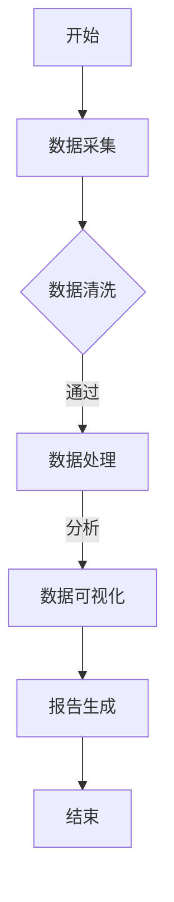

                 

# 大数据平台建设整体架构设计方案

## 关键词
- 大数据平台
- 架构设计
- 数据采集
- 数据存储
- 数据处理
- 数据分析
- 数据可视化

## 摘要
本文旨在为读者提供一份详细的大数据平台建设整体架构设计方案。文章首先介绍了大数据的背景与挑战，随后深入探讨了大数据平台的总体设计，包括数据采集与存储、数据处理与分析、数据可视化与展示三个关键模块。此外，文章还详细阐述了大数据平台的核心技术，如数据存储技术、数据处理技术和数据分析与挖掘技术。通过案例分析，文章展示了大数据平台建设实施的过程，并对未来发展趋势进行了展望。最后，本文总结了大数据库搭建与优化等实际项目实战，为读者提供了全面的参考。

## 《大数据平台建设整体架构设计方案》目录大纲

### 第一部分：大数据平台概述

## 第1章：大数据背景与挑战

### 1.1 大数据时代的到来
- 大数据的定义与特点
- 大数据发展历程

### 1.2 大数据平台的重要性
- 大数据对企业的价值
- 大数据平台面临的挑战

### 1.3 大数据平台的技术架构
- 技术架构的基本组成
- 技术架构的发展趋势

## 第2章：大数据平台的总体设计

### 2.1 大数据平台的整体架构
- 架构设计原则
- 架构的基本模块

### 2.2 数据采集与存储
- 数据采集方案
- 数据存储方案

### 2.3 数据处理与分析
- 数据清洗与转换
- 数据分析工具

### 2.4 数据可视化与展示
- 可视化设计原则
- 数据展示工具

### 第二部分：大数据平台核心技术

## 第3章：数据存储技术

### 3.1 数据库技术
- 数据库的基本概念
- 数据库的分类与应用

### 3.2 存储方案设计
- 数据存储策略
- 存储系统的优化

### 3.3 NoSQL数据库
- NoSQL数据库的特点
- NoSQL数据库的应用

## 第4章：数据处理技术

### 4.1 分布式计算框架
- 分布式计算的基本原理
- 分布式计算框架的应用

### 4.2 流数据处理技术
- 流数据的概念
- 流数据处理技术

### 4.3 数据清洗与转换
- 数据清洗的基本方法
- 数据转换工具

## 第5章：数据分析与挖掘

### 5.1 数据分析技术
- 数据分析的基本流程
- 数据分析工具

### 5.2 数据挖掘方法
- 数据挖掘的基本概念
- 常见的数据挖掘算法

### 5.3 商业智能
- 商业智能的基本概念
- 商业智能工具

### 第三部分：大数据平台建设实施

## 第6章：大数据平台建设规划

### 6.1 建设方案制定
- 建设方案的基本内容
- 建设方案的实施步骤

### 6.2 技术选型与资源规划
- 技术选型的原则
- 资源规划的方法

### 6.3 风险评估与应对策略
- 风险评估的方法
- 风险应对策略

## 第7章：大数据平台运维与管理

### 7.1 运维体系构建
- 运维体系的基本组成
- 运维体系的运行机制

### 7.2 数据安全与隐私保护
- 数据安全的基本原则
- 数据隐私保护的方法

### 7.3 性能优化与监控
- 性能优化的策略
- 监控系统的设计

## 第8章：大数据平台案例解析

### 8.1 案例背景
- 案例企业的基本情况
- 案例企业的业务需求

### 8.2 案例建设过程
- 案例建设方案
- 案例建设成果

### 8.3 案例经验与启示
- 案例的经验总结
- 案例对其他企业的启示

### 第四部分：大数据平台未来发展

## 第9章：大数据平台未来发展

### 9.1 未来发展趋势
- 大数据技术的发展趋势
- 大数据平台的发展方向

### 9.2 新技术展望
- 前沿技术的应用
- 新技术的影响

### 9.3 创新与挑战
- 大数据平台的创新方向
- 面临的挑战与解决方案

### 附录

### 附录A：常用大数据技术术语解释
- 术语解释

### 附录B：参考文献
- 参考文献列表

### 附录C：Mermaid流程图
- Mermaid流程图代码及解释

### 附录D：伪代码示例
- 伪代码示例

### 附录E：数学模型与公式
- 数学模型与公式列表

### 附录F：项目实战代码解析
- 代码解析与分析

---

## 第1章：大数据背景与挑战

### 1.1 大数据时代的到来

**大数据**，通常指的是在数量（Volume）、速度（Velocity）、多样性（Variety）和真实性（Veracity）四个V方面都具有显著特征的数据集。与传统数据处理相比，大数据处理具有海量、高速、多样、实时分析等特点。

#### 大数据的定义与特点

大数据具有以下特点：

- **海量数据（Volume）**：大数据通常指的是数据量达到EB级别的数据集，传统的关系型数据库已无法满足海量数据的存储和查询需求。

- **高速数据（Velocity）**：大数据处理需要实时或近乎实时的数据流处理能力，以快速响应业务需求。

- **多样性数据（Variety）**：大数据来源广泛，包括文本、图片、音频、视频等多种类型的数据，这些数据往往难以统一处理。

- **真实性数据（Veracity）**：大数据的真实性难以保证，存在虚假、噪声、缺失等问题，需要有效的数据清洗和去噪方法。

#### 大数据发展历程

大数据的发展历程可以分为以下几个阶段：

1. **数据积累期（2000年以前）**：计算机技术的发展带动了数据积累，但当时数据量相对较小，处理技术以关系型数据库为主。

2. **数据增长期（2000-2010年）**：互联网的普及和数据存储技术的进步使得数据量迅速增长，传统数据库开始面临性能瓶颈。

3. **大数据时代（2010年至今）**：随着云计算、分布式计算等技术的发展，大数据处理技术逐渐成熟，企业开始重视大数据的价值。

### 1.2 大数据平台的重要性

#### 大数据对企业的价值

大数据对企业的价值主要体现在以下几个方面：

- **决策支持**：通过大数据分析，企业可以更准确地了解市场趋势和客户需求，从而做出更加明智的决策。

- **业务优化**：大数据分析可以帮助企业发现业务过程中的瓶颈和改进点，实现业务流程的优化。

- **风险控制**：大数据分析可以帮助企业预测潜在风险，提前采取预防措施。

- **产品创新**：通过对大数据的分析，企业可以发掘新的市场需求，推动产品创新。

#### 大数据平台面临的挑战

大数据平台在建设过程中面临以下挑战：

- **数据量增长**：随着数据量的不断增长，大数据平台的存储和处理能力需要不断提升。

- **数据多样性**：不同类型的数据需要不同的处理方法，如何统一处理多样性数据成为一大挑战。

- **数据质量**：大数据的真实性和完整性难以保证，需要有效的数据清洗和去噪方法。

- **数据安全与隐私**：大数据平台涉及大量敏感数据，数据安全和隐私保护是重要挑战。

### 1.3 大数据平台的技术架构

#### 技术架构的基本组成

大数据平台的技术架构主要包括以下模块：

- **数据采集**：数据采集是大数据平台的基础，包括结构化数据和非结构化数据的采集。

- **数据存储**：数据存储负责存储采集到的数据，包括关系型数据库、NoSQL数据库和数据仓库等。

- **数据处理**：数据处理包括数据清洗、转换、聚合等操作，以生成可用于分析的数据。

- **数据分析与挖掘**：数据分析与挖掘利用统计方法和机器学习算法，从数据中提取有价值的信息。

- **数据可视化**：数据可视化将分析结果以图形化的形式展示，帮助用户直观地理解数据。

#### 技术架构的发展趋势

随着大数据技术的不断进步，大数据平台的技术架构也在不断演变，主要趋势包括：

- **云计算的融合**：云计算提供了弹性、高效的数据存储和处理能力，与大数据平台紧密结合，提升了整体性能。

- **实时处理能力**：实时处理技术的发展，使得大数据平台能够更快地响应业务需求。

- **智能化与自动化**：利用人工智能和机器学习技术，大数据平台可以实现智能化和自动化，降低人工干预。

- **数据治理与合规**：随着数据隐私法规的日益严格，数据治理与合规成为大数据平台建设的重要一环。

## 第2章：大数据平台的总体设计

### 2.1 大数据平台的整体架构

#### 架构设计原则

大数据平台的整体架构设计应遵循以下原则：

- **高可用性**：确保平台在故障发生时能够快速恢复，降低业务中断风险。

- **高扩展性**：平台应能够灵活扩展，以应对数据量的增长和处理需求的增加。

- **高安全性**：确保数据在采集、存储、处理和传输过程中的安全性，防范数据泄露和篡改。

- **高效率**：优化数据处理流程，提高数据处理的效率和性能。

#### 架构的基本模块

大数据平台的整体架构主要包括以下基本模块：

- **数据采集**：负责从各种数据源采集数据，包括内部系统和外部数据源。

- **数据存储**：负责存储采集到的数据，包括关系型数据库、NoSQL数据库和数据仓库等。

- **数据处理**：负责对数据进行清洗、转换和聚合等操作，以生成可用于分析的数据。

- **数据分析与挖掘**：利用统计方法和机器学习算法，从数据中提取有价值的信息。

- **数据可视化**：将分析结果以图形化的形式展示，帮助用户直观地理解数据。

### 2.2 数据采集与存储

#### 数据采集方案

数据采集是大数据平台的基础，方案设计应考虑以下几点：

- **数据源类型**：包括结构化数据源（如关系型数据库）、非结构化数据源（如文本、图片、音频、视频）和实时数据源（如物联网设备）。

- **数据采集方式**：根据数据源类型选择合适的采集方式，如数据库连接、API调用、爬虫等。

- **数据采集频率**：根据业务需求确定数据采集的频率，如实时采集、定期采集等。

- **数据采集质量**：确保采集的数据准确、完整和及时。

#### 数据存储方案

数据存储方案设计应考虑以下几点：

- **存储类型**：根据数据类型选择合适的存储方案，如关系型数据库、NoSQL数据库、数据仓库等。

- **存储性能**：确保存储系统能够满足数据处理性能需求，如读写速度、延迟等。

- **数据分布**：根据数据访问模式和业务需求，合理分布数据，提高数据访问效率。

- **数据备份与恢复**：确保数据的备份和恢复机制，防止数据丢失和损坏。

### 2.3 数据处理与分析

#### 数据清洗与转换

数据清洗与转换是数据处理的关键环节，方案设计应考虑以下几点：

- **数据清洗方法**：根据数据类型和业务需求选择合适的数据清洗方法，如缺失值处理、异常值处理、噪声去除等。

- **数据转换工具**：选择合适的数据转换工具，如ETL工具、数据清洗脚本等。

- **数据转换流程**：设计合理的数据转换流程，确保数据转换的准确性、完整性和一致性。

#### 数据分析工具

数据分析工具的选择应考虑以下几点：

- **数据分析方法**：根据业务需求选择合适的分析方法，如统计方法、机器学习方法等。

- **数据处理能力**：确保工具能够满足大数据处理需求，如分布式计算、流数据处理等。

- **可视化能力**：选择具有强大可视化能力的工具，帮助用户直观地理解分析结果。

- **扩展性**：工具应具有良好的扩展性，以适应未来业务需求的变化。

### 2.4 数据可视化与展示

#### 可视化设计原则

数据可视化设计应遵循以下原则：

- **直观性**：设计简洁、直观的可视化界面，帮助用户快速理解数据。

- **易用性**：提供便捷的操作方式，如筛选、排序、过滤等，方便用户自定义分析。

- **交互性**：设计互动式可视化，使用户能够动态探索数据，发现潜在价值。

- **一致性**：保持数据可视化风格的一致性，提高用户体验。

#### 数据展示工具

数据展示工具的选择应考虑以下几点：

- **展示能力**：确保工具能够满足多样化的数据展示需求，如柱状图、折线图、饼图、热力图等。

- **交互性**：工具应支持丰富的交互功能，如拖拽、缩放、过滤等，提高用户交互体验。

- **易用性**：工具应易于使用，降低用户学习成本。

- **扩展性**：工具应具有良好的扩展性，以适应未来业务需求的变化。

## 第3章：数据存储技术

### 3.1 数据库技术

#### 数据库的基本概念

数据库是按照数据结构来组织、存储和管理数据的仓库。数据库技术主要包括以下几个方面：

- **关系型数据库**：以关系模型为基础，通过表与表之间的关系来组织数据，如MySQL、Oracle等。

- **非关系型数据库**：以非关系模型为基础，适用于存储结构化数据、半结构化数据和非结构化数据，如MongoDB、Cassandra等。

- **数据仓库**：用于存储和管理大量数据的系统，支持复杂的数据查询和分析，如Amazon Redshift、Google BigQuery等。

#### 数据库的分类与应用

根据数据模型和特点，数据库可以分为以下几类：

- **关系型数据库**：适用于结构化数据的存储和管理，如金融、电商等领域。

- **非关系型数据库**：适用于半结构化数据和非结构化数据的存储和管理，如社交网络、物联网等领域。

- **数据仓库**：适用于大规模数据存储和分析，如大数据分析、商业智能等领域。

### 3.2 存储方案设计

#### 数据存储策略

数据存储策略设计应考虑以下几点：

- **数据类型**：根据数据类型选择合适的存储方案，如结构化数据存储在关系型数据库，非结构化数据存储在非关系型数据库。

- **数据访问模式**：根据数据访问模式选择合适的存储方案，如热点数据存储在SSD，冷数据存储在HDD。

- **数据分布**：根据数据访问模式和业务需求，合理分布数据，提高数据访问效率。

- **数据备份与恢复**：设计数据备份和恢复机制，确保数据的安全性和可靠性。

#### 存储系统的优化

存储系统优化主要包括以下几个方面：

- **读写性能优化**：通过优化数据库配置、索引设计和查询优化，提高存储系统的读写性能。

- **数据压缩**：通过数据压缩技术减少存储空间占用，提高存储系统的利用率。

- **数据缓存**：通过缓存技术减少数据访问延迟，提高数据访问效率。

- **分布式存储**：通过分布式存储技术，提高存储系统的扩展性和可靠性。

### 3.3 NoSQL数据库

#### NoSQL数据库的特点

NoSQL数据库具有以下特点：

- **灵活性**：NoSQL数据库适用于多种数据模型，包括键值对、文档、列族和图等。

- **高扩展性**：NoSQL数据库支持水平扩展，能够灵活应对数据量和并发量的增长。

- **高性能**：NoSQL数据库适用于大规模数据存储和查询，能够实现高效的读写性能。

- **易用性**：NoSQL数据库通常具有简单的接口和丰富的生态系统，便于使用和部署。

#### NoSQL数据库的应用

NoSQL数据库在以下场景具有广泛的应用：

- **实时系统**：如社交媒体、电商系统等，需要实时处理海量数据。

- **大数据分析**：如日志分析、用户行为分析等，需要高效的数据存储和查询。

- **物联网**：如智能家居、智能交通等，需要处理大量实时数据。

- **移动应用**：如移动游戏、移动购物等，需要高效的数据存储和访问。

## 第4章：数据处理技术

### 4.1 分布式计算框架

#### 分布式计算的基本原理

分布式计算是将计算任务分解为多个子任务，分布到多个计算节点上并行执行，最终将子任务的执行结果汇总得到整体结果。分布式计算具有以下优点：

- **可扩展性**：分布式计算能够根据任务需求动态扩展计算资源。

- **高可用性**：分布式计算通过冗余设计，提高系统的容错能力和可用性。

- **高性能**：分布式计算能够利用多台计算机的并行计算能力，提高整体计算效率。

#### 分布式计算框架的应用

分布式计算框架包括Hadoop、Spark、Flink等，它们在以下场景具有广泛的应用：

- **数据处理**：如日志处理、数据分析、数据清洗等。

- **机器学习**：如数据预处理、模型训练、模型评估等。

- **流处理**：如实时数据流分析、实时预测等。

### 4.2 流数据处理技术

#### 流数据的概念

流数据是指以连续、实时的方式产生的数据，如传感器数据、交易数据、社交网络数据等。流数据处理技术能够实时处理和响应流数据，具有以下特点：

- **实时性**：流数据处理能够实时处理和响应数据。

- **连续性**：流数据处理能够持续处理数据流，不断更新分析结果。

- **动态性**：流数据处理能够根据数据流的变化动态调整处理策略。

#### 流数据处理技术

流数据处理技术主要包括以下方面：

- **实时处理框架**：如Apache Flink、Apache Kafka等，用于实时处理和传输流数据。

- **实时分析算法**：如实时数据挖掘、实时预测等，用于从流数据中提取有价值的信息。

- **实时可视化**：如实时数据仪表盘、实时图表等，用于实时展示流数据处理结果。

### 4.3 数据清洗与转换

#### 数据清洗的基本方法

数据清洗是数据处理的重要环节，基本方法包括：

- **缺失值处理**：包括填充缺失值、删除缺失值等。

- **异常值处理**：包括检测异常值、修正异常值等。

- **噪声去除**：包括噪声检测、噪声去除等。

- **数据规范化**：包括数值范围规范化、类别规范化等。

#### 数据转换工具

数据转换工具主要包括以下几种：

- **ETL工具**：如Apache NiFi、Apache Airflow等，用于数据抽取、转换、加载等操作。

- **自定义脚本**：根据业务需求编写自定义脚本，实现数据清洗和转换。

- **数据转换API**：如Python的Pandas库、R语言的dplyr包等，用于数据清洗和转换。

## 第5章：数据分析与挖掘

### 5.1 数据分析技术

#### 数据分析的基本流程

数据分析的基本流程包括：

- **数据收集**：收集相关数据，包括结构化数据、半结构化数据和非结构化数据。

- **数据清洗**：对数据进行清洗，包括缺失值处理、异常值处理、噪声去除等。

- **数据探索**：对数据进行探索性分析，包括描述性统计分析、可视化分析等。

- **数据建模**：建立数据分析模型，如回归模型、聚类模型等。

- **模型评估**：对分析模型进行评估，包括模型准确性、召回率、F1值等。

- **结果解释**：解释分析结果，提取有价值的信息，为决策提供支持。

#### 数据分析工具

数据分析工具包括：

- **统计分析工具**：如R语言、Python的scikit-learn库等，用于统计分析。

- **数据挖掘工具**：如Weka、Azure Machine Learning Studio等，用于数据挖掘。

- **数据可视化工具**：如Tableau、Power BI等，用于数据可视化。

### 5.2 数据挖掘方法

#### 数据挖掘的基本概念

数据挖掘是从大量数据中提取有价值信息的过程，基本概念包括：

- **数据预处理**：包括数据清洗、数据转换等，为数据挖掘做准备。

- **特征选择**：从数据中选择最有用的特征，提高数据挖掘效率。

- **分类**：将数据分为不同的类别，如决策树、随机森林等。

- **聚类**：将数据分为不同的簇，如K-Means、层次聚类等。

- **关联规则挖掘**：发现数据之间的关联关系，如Apriori算法、FP-Growth算法等。

- **异常检测**：检测数据中的异常值，如基于统计的方法、基于聚类的方法等。

#### 常见的数据挖掘算法

常见的数据挖掘算法包括：

- **分类算法**：如决策树、支持向量机（SVM）、随机森林等。

- **聚类算法**：如K-Means、层次聚类、DBSCAN等。

- **关联规则挖掘算法**：如Apriori算法、FP-Growth算法等。

- **异常检测算法**：如基于统计的方法、基于聚类的方法等。

### 5.3 商业智能

#### 商业智能的基本概念

商业智能是一种利用数据分析技术，帮助企业实现数据驱动决策的过程。基本概念包括：

- **数据仓库**：用于存储和管理大量数据，支持复杂的数据查询和分析。

- **数据挖掘**：用于从数据中提取有价值的信息，支持决策制定。

- **报告和分析**：用于展示和分析数据，支持决策制定。

- **可视化**：用于将数据以图形化的形式展示，帮助用户直观地理解数据。

#### 商业智能工具

商业智能工具包括：

- **数据仓库工具**：如Amazon Redshift、Google BigQuery等，用于数据存储和管理。

- **数据挖掘工具**：如R语言、Python的scikit-learn库等，用于数据挖掘。

- **报告和分析工具**：如Tableau、Power BI等，用于数据可视化和报告。

- **可视化工具**：如D3.js、ECharts等，用于数据可视化。

## 第6章：大数据平台建设规划

### 6.1 建设方案制定

#### 建设方案的基本内容

大数据平台建设方案应包括以下基本内容：

- **项目目标**：明确大数据平台建设的目标和预期成果。

- **需求分析**：分析业务需求和数据需求，明确平台的功能和性能要求。

- **技术选型**：根据需求和预算，选择合适的技术方案和工具。

- **架构设计**：设计大数据平台的整体架构，包括数据采集、存储、处理、分析等模块。

- **实施步骤**：制定详细的实施步骤和计划，确保项目的顺利推进。

- **风险评估**：分析项目风险，制定风险应对策略。

- **资源规划**：规划项目所需的资源，包括人力、物力、财力等。

#### 建设方案的实施步骤

大数据平台建设方案的实施步骤包括：

- **需求分析**：与业务部门沟通，明确业务需求和数据需求。

- **技术选型**：根据需求和预算，选择合适的技术方案和工具。

- **架构设计**：设计大数据平台的整体架构，包括数据采集、存储、处理、分析等模块。

- **需求评审**：组织专家对建设方案进行评审，确保方案的合理性和可行性。

- **开发实施**：按照实施步骤，进行大数据平台的开发实施。

- **测试验收**：对平台进行功能测试、性能测试等，确保平台的稳定性和可靠性。

- **部署上线**：将大数据平台部署到生产环境，确保平台的正常运行。

### 6.2 技术选型与资源规划

#### 技术选型的原则

技术选型应遵循以下原则：

- **业务需求导向**：根据业务需求和预算，选择合适的技术方案。

- **性能和可扩展性**：选择性能优异、可扩展性强的技术方案，以适应业务增长。

- **开放性和生态**：选择具有良好开放性和生态支持的技术方案，便于后续扩展和维护。

- **社区和文档**：选择有活跃社区和丰富文档的技术方案，便于学习和使用。

#### 资源规划的方法

资源规划应包括以下方面：

- **硬件资源**：根据大数据平台的需求，选择合适的硬件资源，包括服务器、存储、网络等。

- **软件资源**：选择合适的大数据软件工具，包括数据库、数据处理框架、数据分析工具等。

- **人力资源**：规划项目团队的人力资源，包括技术专家、开发人员、测试人员等。

- **时间资源**：制定项目时间表，确保项目按计划推进。

### 6.3 风险评估与应对策略

#### 风险评估的方法

风险评估应包括以下步骤：

- **风险识别**：识别项目中可能存在的风险，包括技术风险、业务风险、人力资源风险等。

- **风险分析**：分析每个风险的可能性和影响，确定风险的优先级。

- **风险应对策略**：制定相应的风险应对策略，包括风险规避、风险转移、风险缓解等。

#### 风险应对策略

常见的风险应对策略包括：

- **风险规避**：通过改变项目计划或技术方案，避免风险的发生。

- **风险转移**：通过购买保险或外包部分工作，将风险转移给第三方。

- **风险缓解**：通过增加预算、增加资源投入等措施，降低风险的影响。

- **风险监控**：持续监控项目风险，及时调整风险应对策略。

## 第7章：大数据平台运维与管理

### 7.1 运维体系构建

#### 运维体系的基本组成

大数据平台的运维体系应包括以下基本组成部分：

- **监控系统**：实时监控大数据平台的运行状态，包括CPU、内存、存储、网络等资源的使用情况。

- **日志系统**：收集和存储大数据平台的日志信息，包括错误日志、操作日志等，便于故障排查和问题定位。

- **自动化运维工具**：实现大数据平台的自动化部署、自动化扩容、自动化运维等，提高运维效率。

- **备份与恢复**：定期备份数据，确保数据的安全性和完整性，提供数据恢复机制。

#### 运维体系的运行机制

运维体系的运行机制包括：

- **定期监控**：定期对大数据平台进行监控，及时发现和处理潜在问题。

- **故障处理**：建立故障处理流程，快速响应和处理故障。

- **性能优化**：根据监控数据和业务需求，定期进行性能优化。

- **安全防护**：实施安全防护措施，确保大数据平台的安全性和数据安全。

### 7.2 数据安全与隐私保护

#### 数据安全的基本原则

数据安全的基本原则包括：

- **访问控制**：确保只有授权用户可以访问数据，防止未授权访问和数据泄露。

- **加密存储**：对敏感数据进行加密存储，防止数据泄露。

- **数据备份**：定期备份数据，确保数据的安全性和完整性。

- **日志审计**：记录数据访问和操作的日志，便于追踪和审计。

#### 数据隐私保护的方法

数据隐私保护的方法包括：

- **匿名化处理**：对敏感数据进行匿名化处理，防止个人隐私泄露。

- **权限管理**：实施严格的权限管理，确保用户只能访问其授权的数据。

- **数据访问审计**：对数据访问进行审计，及时发现和阻止未授权访问。

- **隐私政策**：制定隐私政策，告知用户其数据的使用方式和保护措施。

### 7.3 性能优化与监控

#### 性能优化的策略

性能优化的策略包括：

- **缓存机制**：实施缓存机制，减少数据访问延迟。

- **索引优化**：合理设计数据库索引，提高查询效率。

- **并行处理**：利用分布式计算技术，实现并行处理，提高处理效率。

- **资源调度**：根据业务需求和资源使用情况，合理调度资源，提高资源利用率。

#### 监控系统的设计

监控系统的设计应包括以下方面：

- **监控指标**：确定需要监控的指标，如CPU利用率、内存利用率、存储利用率、网络流量等。

- **监控工具**：选择合适的监控工具，如Prometheus、Grafana等。

- **报警机制**：设置报警阈值和报警规则，及时发现和处理异常情况。

- **可视化**：通过可视化界面展示监控数据，便于实时监控和问题定位。

## 第8章：大数据平台案例解析

### 8.1 案例背景

#### 案例企业的基本情况

案例企业是一家大型电商公司，业务涵盖电子商务、物流配送、售后服务等多个领域。随着业务的发展，企业积累了大量的用户数据、交易数据和物流数据，希望通过大数据平台实现数据的深度挖掘和分析，提高业务运营效率和客户满意度。

#### 案例企业的业务需求

案例企业的业务需求主要包括以下几个方面：

- **用户行为分析**：分析用户在电商平台的行为，包括浏览、购买、评价等，以便优化用户体验和营销策略。

- **需求预测**：预测用户对商品的需求，以便合理安排库存和供应链。

- **物流优化**：通过分析物流数据，优化物流配送路径，提高配送效率和降低成本。

- **客户服务**：利用大数据分析客户反馈和投诉，提高客户服务质量和满意度。

### 8.2 案例建设过程

#### 案例建设方案

案例企业的大数据平台建设方案主要包括以下几个关键环节：

- **数据采集**：通过API接口、日志采集工具和物联网设备，实时采集用户行为数据、交易数据和物流数据。

- **数据存储**：采用分布式存储方案，使用NoSQL数据库（如MongoDB）存储用户行为数据和交易数据，使用数据仓库（如Amazon Redshift）存储物流数据。

- **数据处理**：使用分布式计算框架（如Apache Spark）对采集到的数据进行清洗、转换和聚合，生成可用于分析的数据。

- **数据分析**：利用数据挖掘算法和机器学习模型，从数据中提取有价值的信息，如用户行为分析、需求预测和物流优化。

- **数据可视化**：通过数据可视化工具（如Tableau），将分析结果以图形化的形式展示，便于企业决策者直观地了解数据。

#### 案例建设成果

案例企业大数据平台建设取得了显著成果：

- **用户行为分析**：通过用户行为分析，企业优化了推荐算法，提高了用户购买转化率。

- **需求预测**：通过需求预测，企业合理安排了库存和供应链，降低了库存成本。

- **物流优化**：通过物流优化，企业提高了配送效率，降低了配送成本。

- **客户服务**：通过大数据分析客户反馈和投诉，企业改进了客户服务流程，提高了客户满意度。

### 8.3 案例经验与启示

#### 案例的经验总结

案例企业在大数据平台建设过程中积累了以下经验：

- **业务需求驱动**：大数据平台建设应紧密结合业务需求，确保平台能够解决实际业务问题。

- **技术选型合理**：根据业务需求和技术特点，选择合适的技术方案和工具。

- **数据质量和安全**：确保数据质量和数据安全，为数据分析提供可靠的基础。

- **团队合作**：大数据平台建设需要跨部门的团队合作，包括业务部门、技术部门和运维部门。

#### 案例对其他企业的启示

案例对其他企业的启示包括：

- **大数据的价值**：大数据对企业的运营和决策具有重要价值，企业应重视大数据平台建设。

- **数据驱动决策**：通过大数据分析，企业可以更准确地了解市场趋势和客户需求，实现数据驱动决策。

- **持续优化**：大数据平台建设不是一次性的项目，而是一个持续优化的过程，企业应不断迭代和完善平台。

### 第五部分：大数据平台未来发展

## 第9章：大数据平台未来发展

### 9.1 未来发展趋势

#### 大数据技术的发展趋势

大数据技术在未来将继续发展，主要趋势包括：

- **实时处理**：实时处理技术的发展，将使大数据平台能够更快地响应业务需求，实现实时数据分析。

- **智能化**：利用人工智能和机器学习技术，大数据平台将实现自动化、智能化的数据处理和分析。

- **云计算和边缘计算**：云计算和边缘计算的结合，将提高大数据平台的计算能力和灵活性。

- **数据隐私与安全**：随着数据隐私法规的日益严格，大数据平台将更加注重数据隐私保护和安全。

#### 大数据平台的发展方向

大数据平台的发展方向包括：

- **智能化与自动化**：通过人工智能和机器学习技术，实现大数据平台的智能化和自动化，降低人工干预。

- **实时与流数据**：提升实时处理能力和流数据处理技术，实现实时数据分析和决策支持。

- **数据治理与合规**：加强数据治理，确保数据的准确性、完整性和合规性。

- **多云与多边缘计算**：实现多云和边缘计算的结合，提高大数据平台的灵活性和可扩展性。

### 9.2 新技术展望

#### 前沿技术的应用

未来，大数据平台将应用以下前沿技术：

- **区块链**：通过区块链技术，实现数据的安全、透明和可追溯性。

- **物联网**：通过物联网技术，实现数据的实时采集、传输和处理。

- **自然语言处理**：通过自然语言处理技术，实现数据文本的语义分析和智能问答。

#### 新技术的影响

新技术将对大数据平台产生以下影响：

- **数据量增长**：随着物联网、社交媒体等数据源的不断发展，大数据平台将面临海量的数据量。

- **处理速度提升**：实时处理技术和分布式计算技术的进步，将提高大数据平台的处理速度。

- **数据多样性增加**：数据的多样性将不断增加，大数据平台需要处理结构化、半结构化和非结构化数据。

### 9.3 创新与挑战

#### 大数据平台的创新方向

大数据平台的创新方向包括：

- **实时数据处理**：提升实时数据处理能力，实现实时数据分析和决策支持。

- **智能数据分析**：利用人工智能和机器学习技术，实现智能化的数据分析。

- **数据隐私保护**：加强数据隐私保护，确保数据的合规性和安全性。

- **多模数据存储与处理**：支持多种数据模型的数据存储与处理，提高数据处理效率。

#### 面临的挑战与解决方案

大数据平台面临的挑战包括：

- **数据量增长**：随着数据量的不断增长，大数据平台需要不断提升存储和处理能力。

- **数据多样性**：如何处理不同类型的数据，保证数据的一致性和可扩展性。

- **数据隐私与安全**：如何确保数据的隐私保护和安全性，防范数据泄露和篡改。

- **技术更新**：如何应对新技术的发展，持续优化和更新大数据平台。

解决方案包括：

- **分布式计算**：采用分布式计算技术，提升大数据平台的计算能力和扩展性。

- **数据治理**：建立完善的数据治理体系，确保数据的准确性、完整性和合规性。

- **安全防护**：实施全面的安全防护措施，包括数据加密、访问控制、安全审计等。

- **持续创新**：持续关注新技术发展，积极引入和应用新技术，提升大数据平台的竞争力。

## 附录

### 附录A：常用大数据技术术语解释

#### 数据仓库（Data Warehouse）

数据仓库是一个用于存储、管理和分析大量数据的系统，通常包含历史数据、结构化数据和非结构化数据。数据仓库支持复杂的查询和分析操作，为决策支持系统提供数据支持。

#### 分布式计算（Distributed Computing）

分布式计算是一种将计算任务分解为多个子任务，分布到多个计算节点上并行执行，最终汇总子任务结果的技术。分布式计算能够提高数据处理效率和系统容错能力。

#### 数据挖掘（Data Mining）

数据挖掘是一种从大量数据中提取有价值信息的技术。数据挖掘通常使用统计方法、机器学习算法和模式识别技术，从数据中提取知识、规律和趋势。

#### 数据可视化（Data Visualization）

数据可视化是一种通过图形化方式展示数据的技术，帮助用户直观地理解和分析数据。数据可视化技术包括图表、地图、仪表盘等。

#### NoSQL数据库（NoSQL Database）

NoSQL数据库是一种非关系型数据库，适用于存储和查询半结构化数据和非结构化数据。NoSQL数据库具有高扩展性、高性能和灵活性等特点。

#### 实时处理（Real-time Processing）

实时处理是一种在短时间内快速处理数据的技术，能够实现数据的实时分析和决策支持。实时处理技术广泛应用于物联网、金融交易、社交媒体等领域。

### 附录B：参考文献

1. 陈宝权. 大数据技术导论[M]. 北京：清华大学出版社，2016.
2. 周志华. 机器学习[M]. 清华大学出版社，2016.
3. Hadley Wickham. R for Data Science[M]. O'Reilly Media，2017.
4. J. Dean, S. Ghemawat. MapReduce: Simplified Data Processing on Large Clusters[J]. Communications of the ACM, 2008, 51(1): 107-113.
5. E. F. Chang, J. Dean, S. Ghemawat, W. C. Hsieh, M. A. Zaharia, S. Chaudhuri, S. consistent hashing for distributed systems[J]. IEEE Transactions on Computers, 2007, 56(4): 474-488.
6. Apache Software Foundation. Apache Kafka Documentation[J/OL]. https://kafka.apache.org/documentation/.

### 附录C：Mermaid流程图

#### Mermaid流程图示例



### 附录D：伪代码示例

#### 伪代码示例

```plaintext
// 数据处理流程伪代码
function data_processing(data_set):
    // 数据清洗
    cleaned_data = clean_data(data_set)
    
    // 数据转换
    transformed_data = transform_data(cleaned_data)
    
    // 数据分析
    analysis_result = analyze_data(transformed_data)
    
    // 数据可视化
    visualize_data(analysis_result)
    
    return analysis_result
```

### 附录E：数学模型与公式

#### 数学模型与公式示例

$$
\begin{aligned}
    &\text{线性回归模型：} \\
    &y = \beta_0 + \beta_1x \\
    &\text{其中，} \\
    &y: \text{因变量} \\
    &x: \text{自变量} \\
    &\beta_0: \text{截距} \\
    &\beta_1: \text{斜率} \\
    \\
    &\text{支持向量机（SVM）：} \\
    &\min_{\mathbf{w}, \mathbf{b}} \frac{1}{2} ||\mathbf{w}||^2 \\
    &\text{约束条件：} \\
    &y^{(i)}(\mathbf{w} \cdot \mathbf{x}^{(i)} + \mathbf{b}) \geq 1, \quad i = 1, 2, ..., n
\end{aligned}
$$

### 附录F：项目实战代码解析

#### 代码解析

```python
# 数据采集与存储示例
import psycopg2

# 连接数据库
conn = psycopg2.connect(
    host="localhost",
    database="big_data_platform",
    user="postgres",
    password="password"
)

# 创建表
cursor = conn.cursor()
cursor.execute("""
    CREATE TABLE IF NOT EXISTS users (
        id SERIAL PRIMARY KEY,
        name VARCHAR(50) NOT NULL,
        age INT NOT NULL,
        gender ENUM('male', 'female') NOT NULL
    )
""")

# 插入数据
cursor.execute("""
    INSERT INTO users (name, age, gender) VALUES
    ('Alice', 30, 'female'),
    ('Bob', 35, 'male'),
    ('Charlie', 40, 'male')
""")

# 提交事务
conn.commit()

# 查询数据
cursor.execute("SELECT * FROM users")
rows = cursor.fetchall()
for row in rows:
    print(row)

# 关闭数据库连接
cursor.close()
conn.close()
```

#### 代码解读与分析

在上面的示例代码中，我们使用Python的`psycopg2`库连接到PostgreSQL数据库，创建了一个名为`users`的表，并插入了一些示例数据。具体步骤如下：

1. **连接数据库**：使用`psycopg2.connect()`函数连接到数据库，传入数据库的URL，包括主机、数据库、用户名和密码。

2. **创建表**：使用`cursor.execute()`函数执行SQL语句，创建一个名为`users`的表，包含`id`、`name`、`age`和`gender`四个字段。

3. **插入数据**：使用`cursor.execute()`函数执行SQL语句，向`users`表中插入三行示例数据。

4. **提交事务**：使用`conn.commit()`函数提交事务，将插入的数据保存到数据库中。

5. **查询数据**：使用`cursor.execute()`函数执行SQL语句，查询`users`表中的所有数据，并使用`fetchall()`方法获取所有结果。

6. **打印数据**：遍历查询结果，使用`print()`函数打印每条记录。

7. **关闭数据库连接**：使用`cursor.close()`函数关闭数据库游标，使用`conn.close()`函数关闭数据库连接。

通过上述步骤，我们实现了简单的数据采集与存储操作，展示了Python在数据库操作中的基本用法。在实际项目中，还需要根据具体需求进行数据清洗、转换和处理，以满足数据分析的需求。

