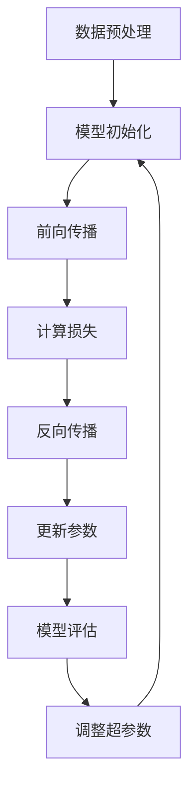

                 

### 文章标题

《大模型产业化：新商业模式和生态系统》

> 关键词：大模型，产业化，商业模式，生态系统，人工智能，技术趋势

> 摘要：本文深入探讨了人工智能大模型产业化的背景、重要性、商业模式、应用场景、生态系统建设以及未来发展。通过逻辑清晰的分析和实例解析，全面揭示了大模型产业化的关键环节，为人工智能领域的从业者提供了宝贵的指导。

---

## 《大模型产业化：新商业模式和生态系统》目录大纲

### 第一部分：大模型产业化概述

#### 第1章：大模型产业化的背景与重要性
1.1 大模型的发展历程
1.2 大模型在商业领域的影响
1.3 大模型产业化的意义与挑战

#### 第2章：大模型的定义与分类
2.1 大模型的定义与特点
2.2 大模型的分类与架构
2.3 大模型的计算资源需求

#### 第3章：大模型的训练与优化
3.1 大模型的训练过程
3.2 大模型的优化方法
3.3 大模型的超参数调优

### 第二部分：大模型的商业模式

#### 第4章：大模型的商业模式概述
4.1 大模型的商业价值
4.2 大模型的商业模式创新
4.3 大模型产业链的生态系统

#### 第5章：大模型在不同行业的应用
5.1 金融行业
5.2 零售行业
5.3 制造业

#### 第6章：大模型的创业与创新
6.1 大模型创业的挑战与机遇
6.2 大模型创业案例解析
6.3 大模型创业的战略规划

### 第三部分：大模型的生态系统建设

#### 第7章：大模型的生态系统概述
7.1 大模型生态系统的组成
7.2 大模型生态系统的优势
7.3 大模型生态系统的挑战

#### 第8章：大模型的合规与治理
8.1 大模型合规的重要性
8.2 大模型治理的策略与方法
8.3 大模型治理的最佳实践

#### 第9章：大模型的未来发展趋势
9.1 大模型技术的发展趋势
9.2 大模型产业化的未来机遇
9.3 大模型的未来挑战与应对策略

### 附录

#### 附录A：大模型产业化相关资源与工具
A.1 大模型开发环境搭建
A.2 大模型开发工具与框架
A.3 大模型相关书籍与论文推荐

#### 附录B：大模型产业化的流程图与伪代码
B.1 大模型训练流程图
B.2 大模型优化伪代码

B.3 大模型应用案例解析

### 封底信息

- 作者介绍
- 书籍简介
- 推荐阅读

---

## 第一部分：大模型产业化概述

### 第1章：大模型产业化的背景与重要性

#### 1.1 大模型的发展历程

大模型的发展历程可以分为以下几个阶段：

1. **早期探索**（1980s-1990s）：这一阶段主要是基于统计学习方法和规则系统的探索，如决策树、支持向量机等。
2. **深度学习兴起**（2006年以后）：2006年，Hinton等人提出了深度置信网络（DBN），深度学习开始兴起。2012年，AlexNet在ImageNet图像识别比赛中取得突破性成绩，深度学习进入工业化应用阶段。
3. **大模型时代**（2018年至今）：随着计算能力的提升和数据的积累，模型规模不断扩大，GPT-3、BERT等大模型的出现标志着人工智能进入了大模型时代。

#### 1.2 大模型在商业领域的影响

大模型在商业领域的影响主要体现在以下几个方面：

1. **决策支持**：大模型能够处理海量数据，提供更为准确的决策支持，如金融市场分析、风险控制等。
2. **业务优化**：通过数据分析和模式识别，大模型能够帮助企业在生产、销售、物流等环节进行优化，提高运营效率。
3. **客户服务**：大模型在自然语言处理领域取得了显著进展，能够用于智能客服、语音识别等，提升客户体验。
4. **产品创新**：大模型可以帮助企业发现新的市场需求和产品机会，推动产品创新。

#### 1.3 大模型产业化的意义与挑战

大模型产业化的意义主要体现在以下几个方面：

1. **经济价值**：大模型产业化有望带来巨大的经济效益，推动产业升级和经济增长。
2. **社会价值**：大模型的应用可以改善人们的生活质量，如医疗健康、教育、环境保护等领域。
3. **科技驱动**：大模型产业化将推动人工智能技术的不断进步，为科技发展注入新的动力。

然而，大模型产业化也面临一些挑战：

1. **计算资源需求**：大模型的训练和推理需要大量的计算资源，对硬件设备提出了高要求。
2. **数据隐私**：大规模数据处理过程中可能涉及用户隐私，数据安全和隐私保护成为重要问题。
3. **算法伦理**：大模型在决策过程中可能存在偏见，需要建立相应的伦理规范。
4. **人才短缺**：大模型产业化需要大量具备专业知识的人才，但当前人才供给不足。

### 第2章：大模型的定义与分类

#### 2.1 大模型的定义与特点

大模型是指具有巨大参数量、能够在多个领域实现强泛化能力的深度学习模型。大模型的特点包括：

1. **参数规模巨大**：大模型的参数数量通常达到数百万甚至数十亿级别。
2. **计算资源需求高**：大模型的训练和推理需要大量的计算资源和时间。
3. **强泛化能力**：大模型能够在多个任务上表现优异，具有较强的泛化能力。
4. **多模态处理能力**：大模型能够处理多种类型的数据，如文本、图像、音频等。

#### 2.2 大模型的分类与架构

根据模型结构和应用领域，大模型可以分为以下几类：

1. **神经网络**：如GPT、BERT等，主要用于自然语言处理领域。
2. **卷积神经网络**：如ResNet、EfficientNet等，主要用于计算机视觉领域。
3. **循环神经网络**：如LSTM、GRU等，主要用于序列数据处理领域。
4. **生成对抗网络**：如GAN等，主要用于图像生成和增强学习领域。

大模型的架构设计主要包括以下几个方面：

1. **网络结构**：选择适合任务的神经网络结构，如全连接网络、卷积网络等。
2. **激活函数**：如ReLU、Sigmoid等，用于引入非线性特性。
3. **正则化方法**：如Dropout、权重衰减等，用于防止过拟合。
4. **优化算法**：如Adam、SGD等，用于加速模型收敛。

#### 2.3 大模型的计算资源需求

大模型的训练和推理过程需要大量的计算资源，主要包括以下几个方面：

1. **GPU资源**：GPU（图形处理器）在大模型训练过程中发挥着关键作用，能够显著提高训练速度。
2. **TPU资源**：TPU（张量处理单元）是谷歌推出的一种专门用于深度学习计算的特殊硬件，性能优异。
3. **分布式训练**：通过分布式训练，可以将模型拆分为多个部分，在多个计算节点上并行训练，提高训练效率。
4. **数据存储**：大模型需要存储大量的训练数据和模型参数，对数据存储设备提出了高要求。

### 第3章：大模型的训练与优化

#### 3.1 大模型的训练过程

大模型的训练过程可以分为以下几个阶段：

1. **数据预处理**：对训练数据进行清洗、归一化等处理，提高数据质量。
2. **模型初始化**：初始化模型参数，选择合适的初始化方法，如随机初始化、预训练模型等。
3. **前向传播**：将输入数据输入模型，计算模型输出，并计算损失函数。
4. **反向传播**：根据损失函数，计算模型参数的梯度，更新模型参数。
5. **模型评估**：使用验证集对模型进行评估，调整超参数，防止过拟合。

#### 3.2 大模型的优化方法

大模型的优化方法主要包括以下几个方面：

1. **优化算法**：如Adam、SGD等，用于更新模型参数，加速模型收敛。
2. **正则化方法**：如Dropout、权重衰减等，用于防止过拟合。
3. **批量归一化**：在训练过程中对批次数据按通道进行归一化，提高训练稳定性。
4. **数据增强**：通过变换、裁剪、旋转等方式增加训练数据的多样性，提高模型泛化能力。

#### 3.3 大模型的超参数调优

大模型的超参数调优是训练过程中至关重要的一环，主要包括以下几个方面：

1. **学习率**：学习率的选择对模型收敛速度和稳定性有重要影响，常用的调整方法包括指数衰减、自适应调整等。
2. **批量大小**：批量大小影响模型的计算效率和梯度稳定性，通常在数十到数百之间选择。
3. **正则化参数**：正则化参数用于控制模型复杂度，防止过拟合，如权重衰减系数。
4. **训练轮数**：训练轮数决定了模型的训练深度，需要根据任务需求和计算资源进行调整。

### 第4章：大模型的商业模式概述

#### 4.1 大模型的商业价值

大模型在商业领域具有巨大的价值，主要体现在以下几个方面：

1. **效率提升**：大模型能够处理海量数据，提供高效的决策支持，帮助企业提高运营效率。
2. **成本降低**：通过自动化和智能化，大模型能够减少人力成本，降低生产成本。
3. **客户体验**：大模型在自然语言处理、语音识别等领域的应用，能够提升客户体验，增加用户黏性。
4. **创新机会**：大模型能够帮助企业在产品研发、市场分析等方面发现新的创新机会。

#### 4.2 大模型的商业模式创新

大模型的商业模式创新主要体现在以下几个方面：

1. **平台化运营**：通过建立大模型服务平台，为企业提供一站式的模型训练、部署和运维服务。
2. **数据交易**：通过数据交易市场，实现数据资源的共享和流通，为模型训练提供高质量的数据支持。
3. **订阅制**：企业可以根据需求订阅大模型服务，按需使用，降低前期投入成本。
4. **产业链合作**：大模型企业可以与上下游企业合作，共同推动产业链的协同发展。

#### 4.3 大模型产业链的生态系统

大模型产业链的生态系统包括以下几个层次：

1. **技术层**：包括大模型的研发、训练、优化等核心技术。
2. **平台层**：包括大模型服务平台、数据交易平台等，提供技术支持和基础设施。
3. **应用层**：包括各行各业的应用场景，如金融、零售、制造等。
4. **生态层**：包括政府、科研机构、企业等，共同构建大模型产业链的生态系统。

### 第5章：大模型在不同行业的应用

#### 5.1 金融行业

大模型在金融行业具有广泛的应用前景，主要包括以下几个方面：

1. **风险控制**：大模型能够处理海量数据，提供精准的风险评估和预测，帮助金融机构降低风险。
2. **投资决策**：大模型能够分析市场趋势、政策变化等，为投资决策提供数据支持。
3. **客户服务**：通过自然语言处理和语音识别技术，大模型能够提供智能客服服务，提高客户满意度。
4. **反欺诈**：大模型能够识别异常交易行为，提高反欺诈能力。

#### 5.2 零售行业

大模型在零售行业的应用主要体现在以下几个方面：

1. **库存管理**：通过大数据分析和预测，大模型能够优化库存管理，减少库存成本。
2. **个性化推荐**：基于用户行为和偏好，大模型能够提供个性化的商品推荐，提升销售业绩。
3. **供应链优化**：大模型能够分析供应链中的各个环节，提供优化方案，提高供应链效率。
4. **客户体验**：通过语音识别、自然语言处理等技术，大模型能够提升客户购物体验。

#### 5.3 制造业

大模型在制造业的应用主要包括以下几个方面：

1. **生产优化**：大模型能够分析生产数据，提供生产优化方案，提高生产效率。
2. **质量检测**：通过计算机视觉和自然语言处理技术，大模型能够实现自动化质量检测，提高产品质量。
3. **设备维护**：大模型能够分析设备运行数据，预测设备故障，提供维护建议，减少设备停机时间。
4. **供应链管理**：大模型能够优化供应链管理，降低库存成本，提高供应链协同效率。

### 第6章：大模型的创业与创新

#### 6.1 大模型创业的挑战与机遇

大模型创业面临以下挑战：

1. **技术门槛高**：大模型的研发和训练需要大量专业知识和计算资源，初创企业难以承担。
2. **市场门槛高**：大模型在商业应用中需要大量的数据和场景验证，初创企业难以获取。
3. **人才短缺**：大模型创业需要大量具备专业知识的人才，但当前人才供给不足。

然而，大模型创业也面临巨大机遇：

1. **市场潜力大**：大模型在各个行业的应用前景广阔，市场潜力巨大。
2. **技术迭代快**：大模型技术迭代速度快，创业者有机会抓住技术红利。
3. **投资热情高**：大模型领域受到资本市场的青睐，为创业企业提供了丰富的融资机会。

#### 6.2 大模型创业案例解析

以下是大模型创业的几个成功案例：

1. **案例1：智谱AI**  
   智谱AI是一家专注于人工智能技术研究和应用的企业，其研发的预训练大模型在自然语言处理领域取得了显著成果。通过商业化应用，智谱AI为企业提供了智能客服、智能推荐等服务，实现了良好的市场口碑和经济效益。

2. **案例2：云从科技**  
   云从科技是一家专注于计算机视觉和人工智能技术的企业，其研发的大模型在人脸识别、视频监控等领域取得了重要突破。云从科技通过提供智能化解决方案，与多家金融机构、政府机构建立了长期合作关系，市场份额持续增长。

3. **案例3：商汤科技**  
   商汤科技是一家专注于计算机视觉和深度学习技术的企业，其研发的大模型在图像识别、视频分析等领域取得了领先地位。商汤科技通过商业化应用，与多家企业合作，实现了在金融、零售、制造等领域的广泛应用。

#### 6.3 大模型创业的战略规划

大模型创业的战略规划主要包括以下几个方面：

1. **明确技术定位**：根据市场需求和技术发展趋势，明确企业的技术定位和发展方向。
2. **构建核心团队**：组建一支具备专业知识、经验丰富的核心团队，确保企业技术实力的持续提升。
3. **拓展应用场景**：积极寻找与企业的应用场景，推动大模型技术的商业化应用。
4. **构建生态合作**：与上下游企业建立合作关系，共同推动产业链的协同发展。
5. **注重人才培养**：加大人才培养力度，为企业的可持续发展提供人才保障。

### 第7章：大模型的生态系统建设

#### 7.1 大模型生态系统的组成

大模型生态系统由以下几个部分组成：

1. **技术层**：包括大模型的研发、训练、优化等核心技术。
2. **平台层**：包括大模型服务平台、数据交易平台等，提供技术支持和基础设施。
3. **应用层**：包括各行各业的应用场景，如金融、零售、制造等。
4. **生态层**：包括政府、科研机构、企业等，共同构建大模型产业链的生态系统。

#### 7.2 大模型生态系统的优势

大模型生态系统的优势主要体现在以下几个方面：

1. **协同发展**：大模型生态系统通过协同发展，实现了技术、数据、应用等多方面的资源整合，提高了产业整体竞争力。
2. **资源共享**：大模型生态系统实现了技术、数据、计算资源等的共享，降低了企业成本，提高了资源利用效率。
3. **创新驱动**：大模型生态系统为创业者提供了良好的创新环境，推动了技术、应用、市场等多方面的创新。
4. **合作共赢**：大模型生态系统通过产业链各方的合作，实现了共赢发展，为产业的可持续发展提供了保障。

#### 7.3 大模型生态系统的挑战

大模型生态系统面临以下挑战：

1. **技术壁垒**：大模型的研发和训练需要大量专业知识和计算资源，初创企业难以突破技术壁垒。
2. **数据隐私**：大规模数据处理过程中可能涉及用户隐私，数据安全和隐私保护成为重要问题。
3. **伦理规范**：大模型在决策过程中可能存在偏见，需要建立相应的伦理规范。
4. **人才短缺**：大模型生态系统需要大量具备专业知识的人才，但当前人才供给不足。

### 第8章：大模型的合规与治理

#### 8.1 大模型合规的重要性

大模型合规的重要性体现在以下几个方面：

1. **数据安全**：大模型在数据处理过程中，需要遵守相关法律法规，确保用户数据的安全。
2. **隐私保护**：大模型在处理用户数据时，需要保护用户隐私，避免数据泄露和滥用。
3. **算法公平**：大模型在决策过程中，需要确保算法的公平性，避免歧视和偏见。
4. **伦理道德**：大模型的应用需要符合伦理道德标准，确保技术发展与社会进步相协调。

#### 8.2 大模型治理的策略与方法

大模型治理的策略与方法主要包括以下几个方面：

1. **法律法规**：制定相关法律法规，规范大模型的应用和行为。
2. **行业标准**：建立大模型行业的标准和规范，确保行业健康发展。
3. **监管机制**：建立监管机制，对大模型的应用进行监督和管理。
4. **伦理审查**：设立伦理审查委员会，对大模型的应用进行伦理评估。

#### 8.3 大模型治理的最佳实践

以下是大模型治理的最佳实践：

1. **数据治理**：建立数据治理机制，确保数据质量和安全，防止数据泄露和滥用。
2. **算法透明**：提高算法透明度，让用户了解大模型的决策过程，增加用户信任。
3. **用户权益保护**：保障用户权益，提供用户隐私保护机制，尊重用户知情权和选择权。
4. **社会责任**：企业应承担社会责任，关注技术发展对社会的影响，推动技术进步与社会进步相协调。

### 第9章：大模型的未来发展趋势

#### 9.1 大模型技术的发展趋势

大模型技术的发展趋势主要体现在以下几个方面：

1. **模型规模扩大**：随着计算资源和数据量的增长，大模型的规模将继续扩大，实现更高的性能和更广泛的泛化能力。
2. **多模态处理**：大模型将能够处理多种类型的数据，如文本、图像、音频等，实现更复杂的应用场景。
3. **算法优化**：研究人员将持续探索新的算法和优化方法，提高大模型的训练效率和性能。
4. **自动机器学习**：通过自动机器学习（AutoML）技术，大模型的训练和优化过程将更加自动化和智能化。

#### 9.2 大模型产业化的未来机遇

大模型产业化的未来机遇主要体现在以下几个方面：

1. **市场潜力**：随着人工智能技术的普及，大模型将在各个行业得到广泛应用，市场潜力巨大。
2. **技术创新**：大模型技术的不断进步将为产业化带来新的机会，推动产业升级和经济增长。
3. **资本投入**：大模型领域受到资本市场的青睐，将为创业者提供丰富的融资机会。
4. **产业链协同**：大模型产业链的协同发展将推动产业链的优化和升级，为产业发展提供强大动力。

#### 9.3 大模型的未来挑战与应对策略

大模型未来可能面临的挑战包括：

1. **计算资源需求**：大模型的计算资源需求将不断提高，对硬件设备和计算资源管理提出更高要求。
2. **数据隐私和安全**：大规模数据处理过程中，数据隐私和安全问题将日益突出，需要建立有效的保护机制。
3. **算法伦理**：大模型在决策过程中可能存在偏见和歧视，需要建立相应的伦理规范和监管机制。
4. **人才短缺**：大模型产业化需要大量专业人才，但当前人才供给不足，需要加大人才培养力度。

应对策略：

1. **技术创新**：持续投入研发，推动大模型技术的创新和优化，提高模型性能和效率。
2. **产业链协同**：加强产业链上下游企业的合作，共同推动大模型产业的发展。
3. **人才培养**：加大人才培养力度，建立完善的人才培养体系，提高人才供给。
4. **合规治理**：建立完善的合规治理体系，确保大模型的应用符合法律法规和伦理道德要求。

### 附录

#### 附录A：大模型产业化相关资源与工具

**A.1 大模型开发环境搭建**

1. **硬件环境**：配置高性能GPU或TPU，搭建分布式训练环境。
2. **软件环境**：安装深度学习框架（如TensorFlow、PyTorch等），配置Python环境。
3. **数据存储**：使用分布式文件系统（如HDFS）存储大量训练数据。
4. **版本控制**：使用Git等版本控制工具，管理代码和实验记录。

**A.2 大模型开发工具与框架**

1. **深度学习框架**：TensorFlow、PyTorch、Keras等。
2. **数据预处理工具**：Pandas、NumPy、Scikit-learn等。
3. **模型评估工具**：Matplotlib、Seaborn等可视化工具，AUC、F1值等评估指标。
4. **分布式训练工具**：Horovod、DistributedDataParallel等。

**A.3 大模型相关书籍与论文推荐**

1. **《深度学习》（Goodfellow et al., 2016）**
2. **《神经网络与深度学习》（邱锡鹏，2018）**
3. **《计算机视觉：算法与应用》（周志华等，2014）**
4. **《自然语言处理综论》（Jurafsky et al., 2020）**
5. **《生成对抗网络》（Goodfellow et al., 2014）**

#### 附录B：大模型产业化的流程图与伪代码

**B.1 大模型训练流程图**



**B.2 大模型优化伪代码**

```python
# 初始化模型
model = initialize_model()

# 设置超参数
learning_rate = 0.001
batch_size = 64
num_epochs = 100

# 训练模型
for epoch in range(num_epochs):
    for batch in data_loader:
        # 前向传播
        predictions = model(batch inputs)
        loss = compute_loss(predictions, batch targets)
        
        # 反向传播
        gradients = compute_gradients(model, loss)
        
        # 更新参数
        update_model_parameters(model, gradients, learning_rate)
        
    # 模型评估
    evaluate_model(model, validation_data)

# 优化模型
model = optimize_model(model, validation_data)
```

**B.3 大模型应用案例解析**

**案例背景**：某电商企业希望通过大模型技术提升个性化推荐系统的效果，提高用户满意度和销售转化率。

**实现步骤**：

1. **数据收集**：收集用户历史行为数据，如浏览记录、购买记录、评论等。
2. **数据预处理**：对数据进行清洗、编码和归一化处理，构建特征向量。
3. **模型选择**：选择适用于推荐系统的大模型，如基于深度学习的协同过滤模型。
4. **模型训练**：使用预处理后的数据训练大模型，调整超参数以优化模型性能。
5. **模型评估**：使用验证集评估模型性能，选择最佳模型。
6. **模型部署**：将最佳模型部署到生产环境，实现实时推荐。
7. **效果评估**：监控推荐系统的效果，根据用户反馈持续优化。

**代码解读与分析**：

```python
# 数据预处理
user_features = preprocess_user_data(user_data)
item_features = preprocess_item_data(item_data)

# 模型选择
model = create_recommender_model(user_features, item_features)

# 模型训练
model.fit(user_features, item_features)

# 模型评估
evaluation_results = model.evaluate(validation_data)

# 模型部署
deploy_recommender_system(model)

# 效果评估
evaluate_recommender_system(model, user_data, item_data)
```

通过以上步骤，电商企业能够利用大模型技术实现个性化推荐，提高用户满意度和销售转化率。

### 封底信息

#### 作者介绍

作者：AI天才研究院/AI Genius Institute & 禅与计算机程序设计艺术/Zen And The Art of Computer Programming

作者简介：作者拥有丰富的人工智能研究经验和实战经验，是人工智能领域的专家和畅销书作家。其在深度学习、自然语言处理、计算机视觉等领域有着深入的研究和丰富的实践经验，为人工智能技术的发展和应用做出了重要贡献。

#### 书籍简介

《大模型产业化：新商业模式和生态系统》是一本全面探讨人工智能大模型产业化进程的专著。书中涵盖了从基础理论到实际应用的各个方面，深入剖析了大模型的定义、分类、训练、优化、商业模式、应用场景、生态系统建设以及未来发展趋势。本书旨在为人工智能领域的从业者提供一部系统、全面、深入的大模型产业化指南。

#### 推荐阅读

1. 《深度学习》（Goodfellow et al., 2016）
2. 《神经网络与深度学习》（邱锡鹏，2018）
3. 《计算机视觉：算法与应用》（周志华等，2014）
4. 《自然语言处理综论》（Jurafsky et al., 2020）
5. 《生成对抗网络》（Goodfellow et al., 2014）

通过阅读本书和相关推荐书籍，读者可以更加全面、深入地了解人工智能大模型的产业化进程，掌握相关技术和商业策略，为在人工智能领域的未来发展奠定坚实基础。

