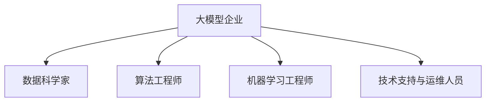

                 

# 文章标题
《大模型企业的人才竞争》

> 关键词：大模型企业、人才竞争、数据科学家、算法工程师、机器学习工程师、人才管理策略

> 摘要：本文深入探讨了在大模型企业中，人才竞争的背景、核心人才需求、人才管理策略以及实战案例，旨在为相关企业提供有益的参考和策略。

----------------------------------------------------------------

## 引言与背景

### 1.1 大模型企业的崛起

近年来，人工智能（AI）技术的迅猛发展，使得大模型企业成为业界焦点。大模型（Large Model）是指使用海量数据进行训练的深度学习模型，具有强大的表达能力和学习能力。这些模型在自然语言处理、计算机视觉、语音识别等领域取得了显著成果，推动了一系列应用的发展。

大模型企业的崛起，源于以下几个原因：

1. **技术进步**：随着计算能力的提升和算法的优化，训练大规模模型变得更加可行。尤其是在云计算、GPU和TPU等硬件的推动下，大模型训练变得更加高效。

2. **数据资源**：互联网的快速发展使得数据获取变得更加容易，大模型企业拥有了丰富的数据资源，这为模型的训练和优化提供了坚实的基础。

3. **市场需求**：随着数字化转型的深入，企业和用户对于智能化解决方案的需求日益增长，大模型企业凭借其技术优势，获得了广阔的市场空间。

### 1.2 人才竞争的重要性

在大模型企业的崛起过程中，人才竞争成为关键因素。以下是人才竞争的重要性：

1. **核心竞争力的体现**：人才是企业最宝贵的资产，尤其是在技术驱动型的企业中，人才的质量直接决定了企业的核心竞争力。

2. **创新的动力**：大模型企业需要持续进行技术创新，而创新离不开专业人才的支持。优秀的人才能够推动企业在技术上的突破。

3. **市场竞争的保障**：在激烈的市场竞争中，拥有优质人才的企业能够更好地适应市场变化，抓住机遇，实现可持续发展。

4. **组织文化的塑造**：人才是企业文化的传播者和实践者，优秀的人才能够带动整个组织文化的提升。

### 1.3 人才竞争的背景

当前，人才竞争的背景主要体现在以下几个方面：

1. **技术快速发展**：人工智能领域的快速发展，使得相关人才的需求急剧增加。然而，人才的供给相对滞后，导致人才竞争激烈。

2. **跨界竞争加剧**：不仅仅是传统企业，互联网公司、初创企业等都在争夺人工智能人才，形成了跨界竞争的局面。

3. **人才流动频繁**：随着市场的变化和个体职业发展的需求，人工智能领域的人才流动频繁，企业需要持续进行人才引进和培养。

4. **人才培养机制不完善**：尽管教育体系在逐渐完善，但针对人工智能领域专业人才的培养仍然存在不足，导致企业需要付出更多的努力来吸引和留住人才。

总之，大模型企业的人才竞争已经成为一个不可忽视的现象，企业需要采取有效的策略来应对这一挑战。

### 2. 人才竞争的背景

#### 2.1 产业发展趋势

随着人工智能技术的不断成熟和应用的广泛普及，大模型企业正成为产业发展的新风口。人工智能技术从最初的算法创新到如今的大模型时代，经历了几个重要阶段：

1. **基础算法阶段**：在这一阶段，主要的算法如感知机、决策树、神经网络等相继提出，为人工智能的发展奠定了基础。

2. **模型优化阶段**：随着硬件性能的提升和算法的改进，深度学习模型开始在图像识别、语音识别等领域取得突破。

3. **大模型阶段**：当前，大模型技术已经成为人工智能领域的核心。通过使用海量数据进行训练，大模型在自然语言处理、计算机视觉等领域表现出色。

大模型企业的崛起，不仅仅是技术的进步，更是市场需求的驱动。以下是一些关键因素：

- **云计算的普及**：云计算提供了强大的计算能力和存储资源，使得大规模模型训练变得更加可行。

- **大数据的积累**：互联网、物联网等技术的发展，使得数据获取变得更加容易，大数据为模型的训练提供了丰富的素材。

- **应用的多样化**：从智能助手到自动驾驶，从医疗诊断到金融风控，人工智能的应用场景越来越广泛，推动了大模型企业的发展。

#### 2.2 企业需求变化

大模型企业对人才的需求发生了显著变化。以下是几个关键点：

1. **技术要求更高**：随着模型规模的增大，对算法、数据处理、系统架构等方面的要求也不断提高。企业需要更多具备跨学科背景的人才。

2. **跨界能力更强**：大模型企业不仅需要技术人才，还需要有业务理解、项目管理等方面的人才，以便更好地将技术应用到实际业务中。

3. **快速学习能力**：人工智能领域的发展迅速，企业需要具备快速学习能力和适应能力的人才，以应对技术变化和市场波动。

4. **团队合作精神**：大模型项目通常需要跨部门的合作，团队合作精神成为衡量人才的重要标准。

#### 2.3 行业案例分析

以下是几个大模型企业在人才竞争方面的案例分析：

1. **谷歌**：作为人工智能领域的领军企业，谷歌通过不断吸引顶级人才，建立了强大的研发团队。谷歌的招聘策略包括提供有竞争力的薪酬、完善的培训体系以及开放的创新环境。

2. **微软**：微软在人工智能领域也有着深厚的人才储备。通过收购AI初创公司、建立AI研究实验室等方式，微软不断扩充其人才队伍。

3. **百度**：百度在人工智能领域的投入巨大，特别是在自动驾驶、语音识别等方面。百度通过内部培养和外部引进相结合的方式，建立了强大的技术团队。

这些案例表明，大模型企业在人才竞争方面采取了多种策略，包括品牌建设、招聘渠道选择、薪酬福利设计等。通过这些策略，企业不仅能够吸引到优质人才，还能够培养出适应企业需求的专业人才。

### 3. 大模型企业核心人才需求

#### 3.1 数据科学家

在大模型企业中，数据科学家（Data Scientist）是不可或缺的核心人才。数据科学家负责从海量数据中提取有价值的信息，并将其转化为可操作的洞见和决策依据。以下是数据科学家的角色、职责和技能要求。

##### 3.1.1 数据科学家角色

数据科学家的主要角色包括：

- **数据探索和分析**：通过对数据的探索和分析，发现数据中的模式和趋势。
- **模型构建和优化**：根据业务需求，设计和优化机器学习模型。
- **数据可视化和报告**：将数据分析结果通过可视化工具呈现给业务团队，并提供数据报告。

##### 3.1.2 数据科学家技能要求

数据科学家需要具备以下技能：

- **统计学和机器学习知识**：掌握统计学原理和常见的机器学习算法，能够设计和优化模型。
- **编程能力**：熟练掌握Python、R等编程语言，能够进行数据处理和模型构建。
- **数据处理能力**：熟悉数据处理工具和库，如Pandas、NumPy等。
- **数据可视化能力**：能够使用Matplotlib、Seaborn、Tableau等工具进行数据可视化。
- **业务理解**：具备一定的业务背景，能够将数据分析和模型结果转化为业务洞见。

##### 3.1.3 数据科学家的岗位职责与能力要求

数据科学家的岗位职责通常包括以下几个方面：

- **数据采集与预处理**：从各种数据源采集数据，并进行数据清洗、转换和集成。
- **模型构建与优化**：根据业务需求，设计和优化机器学习模型，如分类、回归、聚类等。
- **结果评估与迭代**：对模型性能进行评估，并根据评估结果进行模型迭代和优化。
- **数据报告与可视化**：将数据分析结果通过可视化工具呈现给业务团队，并提供详细的数据报告。
- **业务协作**：与业务团队紧密合作，理解业务需求，将技术解决方案应用到实际业务中。

在能力要求方面，数据科学家需要具备以下能力：

- **数据分析能力**：能够使用统计学方法和机器学习算法进行数据分析，提取有价值的信息。
- **模型构建能力**：能够设计和优化不同的机器学习模型，满足业务需求。
- **数据可视化能力**：能够使用数据可视化工具，将复杂的数据分析结果直观地展示给业务团队。
- **沟通能力**：能够与业务团队进行有效沟通，理解业务需求，将技术解决方案转化为实际业务成果。

#### 3.2 算法工程师

算法工程师（Algorithm Engineer）在大模型企业中同样扮演着关键角色。算法工程师负责开发和优化算法，以提升模型的性能和效率。以下是算法工程师的角色、职责和技能要求。

##### 3.2.1 算法工程师角色

算法工程师的主要角色包括：

- **算法研究**：研究和开发新的算法，探索技术前沿。
- **模型优化**：针对现有模型，进行优化和调参，提升模型性能。
- **技术文档撰写**：撰写技术文档，为团队成员提供算法实现和优化的参考。

##### 3.2.2 算法工程师技能要求

算法工程师需要具备以下技能：

- **数学基础**：掌握线性代数、概率论、统计学等数学知识。
- **编程能力**：熟练掌握C++、Python等编程语言，能够编写高效、稳定的代码。
- **算法设计能力**：熟悉常见的算法和数据结构，能够设计和实现复杂算法。
- **系统优化能力**：了解计算机系统原理，能够对系统进行性能优化。
- **问题解决能力**：具备良好的问题解决能力，能够快速定位和解决算法问题。

##### 3.2.3 算法工程师岗位职责与能力要求

算法工程师的岗位职责通常包括以下几个方面：

- **算法研发**：根据业务需求，研究和开发新的算法，解决实际问题。
- **模型优化**：对现有模型进行优化，提升模型性能和效率。
- **技术文档撰写**：撰写详细的算法实现文档和优化报告，为团队成员提供技术支持。
- **团队协作**：与数据科学家、机器学习工程师等团队成员紧密合作，共同推进项目进展。
- **技术分享**：定期进行技术分享和内部培训，提升团队整体技术水平。

在能力要求方面，算法工程师需要具备以下能力：

- **算法设计能力**：能够设计和实现复杂的算法，满足业务需求。
- **模型优化能力**：能够对现有模型进行优化，提升模型性能和效率。
- **系统优化能力**：能够对系统进行性能优化，提升整体运行效率。
- **编程能力**：能够编写高效、稳定的代码，确保算法的实现质量。
- **问题解决能力**：能够快速定位和解决算法问题，确保项目的顺利进行。

#### 3.3 机器学习工程师

机器学习工程师（Machine Learning Engineer）在大模型企业中承担着重要的职责。他们负责开发和优化机器学习模型，确保模型的准确性和稳定性。以下是机器学习工程师的角色、职责和技能要求。

##### 3.3.1 机器学习工程师角色

机器学习工程师的主要角色包括：

- **模型训练与调优**：负责机器学习模型的训练和调优，提升模型性能。
- **数据处理与建模**：处理和分析数据，构建和优化机器学习模型。
- **系统开发与维护**：开发和维护机器学习系统的架构和代码。

##### 3.3.2 机器学习工程师技能要求

机器学习工程师需要具备以下技能：

- **数学基础**：掌握线性代数、概率论、统计学等数学知识。
- **编程能力**：熟练掌握Python、Java等编程语言，能够编写高效、稳定的代码。
- **机器学习知识**：熟悉常见的机器学习算法，如线性回归、决策树、支持向量机等。
- **数据处理能力**：熟练使用数据处理工具和库，如Pandas、NumPy等。
- **系统架构能力**：了解分布式系统和云计算，能够设计和优化机器学习系统的架构。

##### 3.3.3 机器学习工程师岗位职责与能力要求

机器学习工程师的岗位职责通常包括以下几个方面：

- **模型训练与调优**：根据业务需求，设计和优化机器学习模型，进行模型训练和调优，提升模型性能。
- **数据处理与建模**：处理和分析数据，构建和优化机器学习模型，确保模型的可解释性和稳定性。
- **系统开发与维护**：开发和维护机器学习系统的架构和代码，确保系统的稳定运行和高性能。
- **技术文档撰写**：撰写详细的模型实现文档和系统架构文档，为团队成员提供技术支持。
- **团队协作**：与数据科学家、算法工程师等团队成员紧密合作，共同推进项目进展。

在能力要求方面，机器学习工程师需要具备以下能力：

- **模型训练能力**：能够设计和优化机器学习模型，进行模型训练和调优，提升模型性能。
- **数据处理能力**：能够处理和分析数据，构建和优化机器学习模型，确保模型的可解释性和稳定性。
- **系统架构能力**：能够设计和优化机器学习系统的架构，确保系统的稳定运行和高性能。
- **编程能力**：能够编写高效、稳定的代码，确保算法的实现质量。
- **问题解决能力**：能够快速定位和解决算法问题，确保项目的顺利进行。

#### 3.4 技术支持与运维人员

在大模型企业中，技术支持与运维人员（Technical Support & Operations）同样至关重要。他们负责确保系统的稳定运行和高效维护。以下是技术支持与运维人员的角色、职责和技能要求。

##### 3.4.1 技术支持与运维人员角色

技术支持与运维人员的主要角色包括：

- **系统维护**：确保系统的稳定运行，进行日常维护和监控。
- **故障排查**：快速定位和解决系统故障，保障业务的连续性。
- **性能优化**：优化系统性能，提升系统的处理能力和响应速度。

##### 3.4.2 技术支持与运维人员技能要求

技术支持与运维人员需要具备以下技能：

- **操作系统知识**：熟悉Linux、Windows等操作系统的配置和管理。
- **网络知识**：了解网络架构和协议，能够进行网络配置和故障排查。
- **数据库知识**：掌握数据库的基本原理和操作，能够进行数据库的维护和优化。
- **系统监控与日志分析**：熟悉系统监控工具，能够分析系统日志，快速定位故障。
- **自动化运维**：熟悉自动化运维工具，能够编写脚本进行自动化操作。

##### 3.4.3 技术支持与运维人员岗位职责与能力要求

技术支持与运维人员的岗位职责通常包括以下几个方面：

- **系统维护**：负责系统的日常维护，包括硬件设备、操作系统、数据库等，确保系统的稳定运行。
- **故障排查**：快速响应系统故障，进行故障排查和修复，确保业务的连续性。
- **性能优化**：对系统进行性能优化，提升系统的处理能力和响应速度，确保高效运行。
- **日志分析**：分析系统日志，及时发现潜在问题，防止故障发生。
- **自动化运维**：编写脚本进行自动化操作，减少人工干预，提升运维效率。

在能力要求方面，技术支持与运维人员需要具备以下能力：

- **系统维护能力**：能够进行系统的日常维护，确保系统的稳定运行。
- **故障排查能力**：能够快速定位和解决系统故障，保障业务的连续性。
- **性能优化能力**：能够对系统进行性能优化，提升系统的处理能力和响应速度。
- **日志分析能力**：能够分析系统日志，及时发现潜在问题，防止故障发生。
- **自动化运维能力**：能够编写脚本进行自动化操作，减少人工干预，提升运维效率。

### 4. 人才引进与培养

#### 4.1 人才引进策略

在大模型企业中，人才引进是确保企业持续创新和发展的关键环节。以下是一些有效的人才引进策略：

1. **企业品牌建设**：
   - **品牌宣传**：通过在科技展会、学术会议、社交媒体等平台进行品牌宣传，提升企业的知名度和影响力。
   - **雇主品牌**：打造雇主品牌，让人才看到企业的发展前景、企业文化以及良好的工作环境。

2. **招聘渠道选择**：
   - **校园招聘**：通过高校招聘、实习计划等吸引优秀应届毕业生。
   - **社会招聘**：通过人才市场、招聘网站、社交媒体等渠道吸引行业内的优秀人才。
   - **猎头服务**：针对关键岗位，通过猎头公司寻找具备丰富经验的专业人才。

3. **薪酬福利设计**：
   - **具有竞争力的薪酬**：提供市场竞争力薪酬，确保人才的经济需求得到满足。
   - **福利待遇**：提供全面的福利待遇，包括医疗保险、退休金计划、带薪休假等。
   - **长期激励**：设立股权激励、绩效奖金等长期激励措施，留住核心人才。

#### 4.2 人才培养机制

人才培养机制是确保企业人才持续成长和发展的基础。以下是一些关键措施：

1. **培训计划**：
   - **岗前培训**：为新入职员工提供系统性的岗前培训，帮助其快速融入团队和工作。
   - **专业技能培训**：定期组织专业技能培训，提升员工的业务能力和技术水平。
   - **管理培训**：针对管理层和潜在管理者，提供管理技能和领导力培训。

2. **在职学习**：
   - **学习资源**：提供丰富的学习资源，如在线课程、图书、专业论坛等。
   - **时间安排**：为员工安排适当的学习时间，鼓励其进行自我提升。

3. **师徒制度**：
   - **经验传承**：通过师徒制度，让资深员工传授经验，帮助新员工快速成长。
   - **反馈机制**：建立反馈机制，让新员工能够及时获得改进建议和指导。

#### 4.3 激励机制设计

激励机制的合理设计能够有效激发员工的积极性和创造力。以下是一些关键措施：

1. **薪酬激励**：
   - **绩效奖金**：根据员工的绩效表现发放奖金，激励员工提升工作绩效。
   - **年终奖金**：根据公司业绩和员工贡献发放年终奖金，激励员工持续努力。

2. **荣誉与晋升**：
   - **荣誉称号**：为表现优异的员工颁发荣誉称号，提升其职业声誉。
   - **晋升机制**：建立明确的晋升机制，为员工提供职业发展路径。

3. **工作氛围营造**：
   - **团队建设**：组织团队建设活动，增强员工之间的凝聚力和协作精神。
   - **文化氛围**：营造积极向上的企业文化，让员工感受到企业的关爱和支持。

#### 4.4 留任策略

留任策略是确保企业能够留住核心人才的关键。以下是一些有效措施：

1. **职业规划**：
   - **个人发展计划**：为员工制定个人发展计划，明确其职业目标和晋升路径。
   - **职业咨询**：提供职业咨询服务，帮助员工规划职业道路。

2. **职业发展路径**：
   - **多岗位轮换**：为员工提供多岗位轮换机会，丰富其工作经验和技能。
   - **专业发展**：提供专业发展机会，支持员工进行专业深造和技能提升。

3. **转化流失员工**：
   - **离职反馈**：通过离职反馈了解员工离职原因，改进管理措施。
   - **人才回流**：建立人才回流机制，吸引流失员工重新加入公司。

### 5. 大模型企业人才竞争案例解析

#### 5.1 案例一：科技巨头的人才战略

**谷歌**在人工智能领域的人才战略备受瞩目，其成功的原因主要在于以下几个方面：

1. **企业背景**：

谷歌作为全球领先的科技公司，在人工智能领域有着深厚的技术积累和强大的研发团队。谷歌的使命是“整合全球信息，使人人皆可访问并从中受益”，这一使命驱使谷歌在人工智能领域持续投入，吸引顶尖人才。

2. **人才引进策略**：

- **品牌影响力**：谷歌通过持续的技术创新和市场影响力，树立了良好的品牌形象，吸引了大量顶尖人才。
- **招聘渠道**：谷歌采用多元化的招聘渠道，包括校园招聘、社会招聘和内部推荐等，确保人才的广泛覆盖。
- **薪酬福利**：谷歌提供具有竞争力的薪酬和全面的福利待遇，包括股票期权、灵活的工作时间和丰富的员工福利。

3. **激励机制分析**：

- **股权激励**：谷歌通过股权激励计划，让员工能够分享公司的发展成果，激发其工作积极性和长期投入。
- **职业发展**：谷歌为员工提供丰富的职业发展机会，包括内部晋升、跨部门调岗和海外工作等。
- **创新文化**：谷歌鼓励员工自由探索和创新，提供开放的沟通环境和资源支持，激发员工的创造力。

**结论**：谷歌的人才战略成功在于其强大的品牌影响力、多元化的招聘渠道和具有竞争力的薪酬福利，以及为员工提供的职业发展和创新环境。

#### 5.2 案例二：创业公司的人才挑战

**AI初创公司**在人才竞争中面临着诸多挑战，以下是一个典型的案例：

1. **企业背景**：

AI初创公司成立于2018年，专注于人工智能领域的研究和应用。公司在成立初期，面临资金有限、市场知名度不高、技术储备不足等问题。

2. **人才引进与培养策略**：

- **人才引进**：初创公司在人才引进方面，采取了以下策略：
  - **校园招聘**：与多所知名高校建立合作关系，通过校园招聘吸引优秀应届生。
  - **社会招聘**：通过社交媒体和专业招聘网站，吸引行业内的优秀人才。
  - **内部推荐**：鼓励现有员工推荐优秀人才，提高招聘成功率。

- **人才培养**：
  - **专业技能培训**：定期组织专业技能培训，提升员工的业务能力和技术水平。
  - **项目实践**：通过实际项目，让员工在实战中提升技能，积累经验。
  - **团队建设**：组织团队建设活动，增强员工之间的凝聚力和协作精神。

3. **激励与留任经验**：

- **股权激励**：初创公司通过股权激励计划，让员工能够分享公司的发展成果，增强其归属感和长期投入。
- **灵活工作制度**：初创公司提供灵活的工作制度，如远程办公、弹性工作时间等，提高员工的工作满意度和忠诚度。
- **职业发展路径**：初创公司为员工提供明确的职业发展路径，支持员工进行职业规划和发展。

**结论**：AI初创公司通过校园招聘、社会招聘和内部推荐等多种方式引进人才，并通过专业技能培训、项目实践和股权激励等措施培养和留住人才。尽管面临资金有限和市场知名度不高等挑战，但通过合理的策略和持续的投入，初创公司在人才竞争中取得了一定的成功。

### 6. 未来展望

#### 6.1 人才竞争的挑战

在大模型企业人才竞争中，未来将面临以下几个挑战：

1. **市场供需失衡**：随着人工智能技术的广泛应用，对人才的需求不断增加，而优秀人才的供给相对滞后，导致市场供需失衡。

2. **技术快速发展**：人工智能技术不断进步，对人才的技术水平和学习能力提出了更高要求，企业需要持续投入资源进行人才培养和引进。

3. **跨界竞争加剧**：不仅传统企业，互联网公司、初创企业等也在争夺人工智能人才，跨界竞争使得人才竞争更加激烈。

4. **人才流动频繁**：随着市场变化和职业发展需求，人工智能领域的人才流动频繁，企业需要采取有效措施留住核心人才。

5. **人才培养机制不完善**：尽管教育体系在逐渐完善，但针对人工智能领域专业人才的培养仍然存在不足，企业需要自行承担更多的培养责任。

#### 6.2 人才竞争的机遇

尽管面临诸多挑战，大模型企业在人才竞争中仍然拥有以下机遇：

1. **技术创新**：随着人工智能技术的不断进步，企业将有机会通过技术创新获得竞争优势，吸引和留住高端人才。

2. **教育改革**：随着教育体系的改革，人工智能领域专业人才的培养将逐渐跟上市场需求，为企业提供更多优质的人才资源。

3. **产业合作**：企业可以通过与高校、研究机构等建立合作关系，共同培养人才，提升整体行业水平。

4. **人才流动**：人才流动虽然带来挑战，但同时也为企业提供了更多的人才资源，企业可以通过灵活的人才管理策略，吸引和留住优秀人才。

5. **数字化转型**：随着数字化转型的深入，企业对人工智能技术的需求将进一步增加，这为人才竞争提供了更广阔的市场空间。

### 附录

#### 附录 A: 人才竞争相关资源与工具

**A.1 人才招聘平台**

- **LinkedIn**：专业的职业社交平台，适合招聘高端人才。
- **智联招聘**：国内领先的招聘网站，提供全面的职位信息。
- **Boss直聘**：直接与求职者沟通的招聘平台，提高招聘效率。

**A.2 人才培训与认证**

- **Coursera**：提供多种在线课程和认证，涵盖人工智能、数据科学等领域。
- **Udacity**：提供人工智能、机器学习等领域的课程和认证。
- **edX**：哈佛大学、麻省理工学院等知名高校的在线课程平台。

**A.3 技术社区与论坛**

- **Stack Overflow**：编程问答社区，适合寻找技术解决方案。
- **GitHub**：代码托管平台，适合交流和学习编程技术。
- **Reddit**：人工智能论坛，涵盖各种AI话题的讨论。

#### 附录 B: Mermaid 流程图示例

## 作者信息

作者：AI天才研究院/AI Genius Institute & 禅与计算机程序设计艺术 /Zen And The Art of Computer Programming

---

文章内容遵循以下结构：

1. **文章标题**：清晰明确，突出主题。
2. **关键词**：总结文章的核心内容，方便读者检索。
3. **摘要**：简要概括文章的核心思想和主要内容。
4. **引言与背景**：介绍大模型企业人才竞争的背景和重要性。
5. **核心人才需求**：详细分析数据科学家、算法工程师、机器学习工程师和技术支持与运维人员的角色、职责和技能要求。
6. **人才管理策略**：探讨人才引进与培养、激励机制设计和留任策略。
7. **实战案例**：通过科技巨头和AI初创公司的人才战略案例，分析人才竞争的实践。
8. **未来展望**：预测大模型企业人才竞争的挑战与机遇。
9. **附录**：提供人才竞争相关的资源与工具，以及Mermaid流程图示例。
10. **作者信息**：作者的专业背景和著作介绍，增强文章的可信度。

文章以逻辑清晰、结构紧凑、简单易懂的方式，为读者提供了全面深入的大模型企业人才竞争分析，适合IT领域专业人士阅读和参考。

