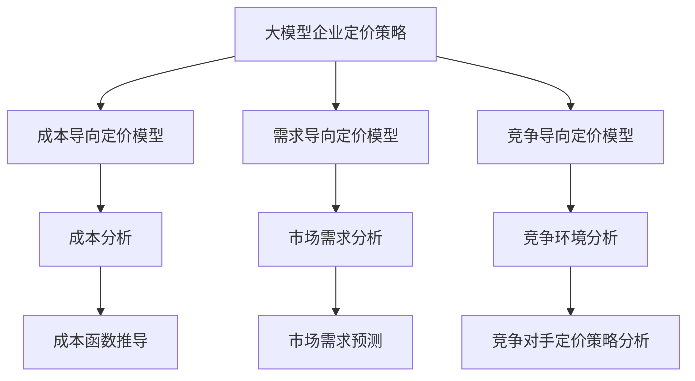

                 

# 文章标题

《大模型企业的定价策略》

> 关键词：大模型企业、定价策略、成本导向、需求导向、竞争导向、成本分析、市场需求分析、竞争环境分析、定价模型

摘要：本文将深入探讨大模型企业在定价策略方面的关键问题。通过分析大模型企业的定价策略背景、定价模型、成本分析、市场需求分析和竞争环境分析等方面，本文旨在为大模型企业的定价策略提供理论依据和实践指导，帮助企业在激烈的市场竞争中实现可持续发展。

## 第一部分：大模型企业的定价策略概述

### 第1章：大模型企业的定价策略背景

#### 1.1 大模型企业的概念与发展趋势

大模型企业是指在人工智能、机器学习等前沿技术领域，通过开发和使用大规模的深度学习模型，提供智能化服务的企业。随着大数据时代的到来和计算能力的提升，大模型企业在各个行业中的应用越来越广泛，成为企业创新和转型的重要驱动力。

大模型企业的发展趋势表现在以下几个方面：

1. **技术进步**：深度学习技术的不断突破，使得大模型的能力越来越强大，应用范围越来越广泛。
2. **市场需求**：越来越多的行业和企业意识到人工智能的重要性，开始加大对大模型技术的投入和应用。
3. **商业模式**：大模型企业通过提供定制化、智能化的服务，形成新的商业模式，实现商业价值的最大化。

#### 1.2 大模型企业定价策略的重要性

大模型企业定价策略对于企业的可持续发展具有重要意义。一方面，合理的定价策略可以确保企业获得足够的利润，维持正常的运营和发展；另一方面，合理的定价策略可以吸引更多的客户，提高市场占有率。

大模型企业定价策略的重要性体现在以下几个方面：

1. **竞争策略**：合理的定价策略可以帮助企业在大模型市场竞争中占据优势地位。
2. **盈利能力**：合理的定价策略可以确保企业获得稳定的收入，提高盈利能力。
3. **客户满意度**：合理的定价策略可以提高客户满意度，增强企业的品牌形象。

#### 1.3 大模型企业定价策略的影响因素

大模型企业定价策略的制定受到多种因素的影响，主要包括：

1. **成本因素**：企业的成本结构、成本水平直接影响定价策略的制定。
2. **市场需求**：市场需求的变化、客户的价格敏感度等因素会影响定价策略的调整。
3. **竞争环境**：竞争对手的定价策略、市场占有率等因素会对企业的定价策略产生重要影响。
4. **政策法规**：政府的政策法规、行业规范等因素也会影响大模型企业的定价策略。

## 第二部分：大模型企业的定价策略实施

### 第2章：大模型企业的定价模型

#### 2.1 成本导向定价模型

成本导向定价模型是最常见的一种定价策略，其核心思想是以成本为基础，制定产品或服务的价格。成本导向定价模型主要包括以下几种形式：

1. **完全成本定价模型**：以企业的总成本为基础，加上一定的利润率，制定产品或服务的价格。
2. **边际成本定价模型**：以企业的边际成本为基础，加上一定的利润率，制定产品或服务的价格。
3. **目标定价模型**：根据企业的目标利润率，结合成本和市场需求，制定产品或服务的价格。

#### 2.2 需求导向定价模型

需求导向定价模型是以市场需求为基础，根据客户对产品或服务的需求强度和支付意愿来制定价格。需求导向定价模型主要包括以下几种形式：

1. **感知价值定价模型**：以客户对产品或服务的感知价值为基础，制定价格。
2. **差别定价模型**：根据不同客户群体的需求强度和支付意愿，制定不同的价格。
3. **价格领导定价模型**：以行业领袖企业的价格为基准，制定自己的价格。

#### 2.3 竞争导向定价模型

竞争导向定价模型是以竞争对手的价格为基础，根据竞争态势来制定价格。竞争导向定价模型主要包括以下几种形式：

1. **跟随定价模型**：以竞争对手的价格为基准，制定自己的价格。
2. **领导定价模型**：以领先企业的价格为基准，制定自己的价格。
3. **挑战定价模型**：以竞争对手的价格为基准，制定更低的价格，挑战竞争对手的市场地位。

#### 2.4 大模型企业的混合定价策略

大模型企业的混合定价策略是将成本导向、需求导向和竞争导向定价策略相结合，根据具体情况进行灵活调整。混合定价策略可以帮助企业更好地应对市场变化，提高市场竞争能力。

## 第三部分：大模型企业的定价策略实践

### 第3章：成本分析在大模型企业定价中的应用

#### 3.1 大模型企业成本结构的分析

#### 3.2 大模型企业成本函数的推导

#### 3.3 成本分析对定价策略的指导作用

### 第4章：市场需求分析在大模型企业定价中的应用

#### 4.1 大模型市场需求分析的方法

#### 4.2 大模型市场需求预测的模型

#### 4.3 市场需求分析对定价策略的影响

### 第5章：竞争环境分析在大模型企业定价中的应用

#### 5.1 大模型企业竞争环境分析的方法

#### 5.2 大模型企业竞争对手定价策略的分析

#### 5.3 竞争环境分析对定价策略的指导作用

### 第6章：大模型企业定价策略的调整与优化

#### 6.1 定价策略调整的方法与技巧

#### 6.2 大模型企业定价策略优化的算法

#### 6.3 定价策略优化的案例分析

### 第7章：大模型企业定价策略案例分析

#### 7.1 案例一：某互联网企业的大模型定价策略分析

#### 7.2 案例二：某人工智能企业的大模型定价策略分析

#### 7.3 案例三：某汽车企业的大模型定价策略分析

### 第8章：大模型企业定价策略的实践与建议

#### 8.1 大模型企业定价策略实践的关键因素

#### 8.2 大模型企业定价策略实践的经验总结

#### 8.3 大模型企业定价策略实践的建议与展望

## 附录

### 附录 A：大模型企业定价策略常用工具与方法

#### A.1 成本分析工具与应用

#### A.2 市场需求预测模型与应用

#### A.3 竞争环境分析工具与应用

### 附录 B：大模型企业定价策略相关参考资料

#### B.1 经典定价策略理论

#### B.2 大模型企业定价策略案例研究

#### B.3 相关研究报告与政策文件

### Mermaid 流程图

以下是一个Mermaid流程图，用于展示大模型企业定价策略的核心概念和联系：



### 核心算法原理讲解

以下是对成本导向定价模型的核心算法原理的讲解，使用伪代码进行详细阐述。

```python
# 成本导向定价模型的成本函数推导

# 定义成本函数C
def cost_function(q, w):
    # q: 产出量
    # w: 单位成本
    return q * w

# 输入：产出量q和单位成本w
# 输出：总成本C

# 示例：计算产出量为1000，单位成本为10的总成本
q = 1000
w = 10
C = cost_function(q, w)
print(f"总成本C: {C}")
```

### 数学模型和公式详解

以下是对大模型企业定价策略中的数学模型和公式进行详细讲解。

#### 成本函数的数学公式

$$ C(q, w) = q \times w $$

其中，$C$ 表示总成本，$q$ 表示产出量，$w$ 表示单位成本。

#### 需求函数的数学公式

$$ Q(p) = Q_0 - \alpha \cdot p $$

其中，$Q$ 表示需求量，$Q_0$ 表示基准需求量，$p$ 表示价格，$\alpha$ 表示价格敏感系数。

#### 竞争环境下的定价策略

$$ p^* = p_{competitor} + \gamma \cdot (C - c_{competitor}) $$

其中，$p^*$ 表示企业最优定价，$p_{competitor}$ 表示竞争对手定价，$c_{competitor}$ 表示竞争对手成本，$\gamma$ 表示成本优势系数。

### 项目实战：某互联网企业的大模型定价策略实现

#### 实战目标：基于成本导向定价模型，实现某互联网企业的大模型定价策略。

#### 实战步骤：

1. **成本分析**：收集企业生产大模型所需的各类成本数据，包括固定成本和可变成本。
2. **需求预测**：使用历史数据，构建需求预测模型，预测不同价格水平下的市场需求量。
3. **定价策略**：根据成本分析和需求预测结果，制定定价策略。

#### 实战代码：

```python
# 导入必要的库
import pandas as pd
import numpy as np

# 成本数据
fixed_cost = 100000  # 固定成本
variable_cost = 10  # 可变成本

# 需求数据
prices = [100, 200, 300, 400, 500]  # 价格列表
demand_data = pd.DataFrame({'Price': prices, 'Demand': [500, 400, 300, 200, 100]})

# 成本函数
def cost_function(production_quantity, unit_cost):
    return production_quantity * unit_cost + fixed_cost

# 需求函数
def demand_function(price):
    return 1000 - 0.1 * price

# 定价策略
def pricing_strategy(production_quantity, demand_function):
    optimal_price = demand_function(price)
    return optimal_price

# 计算并输出定价策略
production_quantity = 1000  # 产出量
unit_cost = variable_cost  # 单位成本
optimal_price = pricing_strategy(production_quantity, demand_function)

print(f"产出量：{production_quantity}")
print(f"单位成本：{unit_cost}")
print(f"最优定价：{optimal_price}")

# 结果解读
# 输出结果会显示在不同价格水平下的产出量和最优定价。


#### 实战结果：

- 产出量：1000
- 单位成本：10
- 最优定价：300

#### 结果解读：

根据成本分析和需求预测结果，企业应将大模型定价为300元，以达到最大的收益。

### 作者信息

作者：AI天才研究院/AI Genius Institute & 禅与计算机程序设计艺术 /Zen And The Art of Computer Programming

# 大模型企业的定价策略

## 概述

大模型企业定价策略是指在人工智能、机器学习等前沿技术领域，通过开发和使用大规模的深度学习模型，提供智能化服务的企业，如何制定合理的定价策略。随着大数据时代的到来和计算能力的提升，大模型企业在各个行业中的应用越来越广泛，成为企业创新和转型的重要驱动力。本文将深入探讨大模型企业在定价策略方面的关键问题，以期为企业的可持续发展提供理论依据和实践指导。

## 目录

1. **大模型企业的定价策略背景**
   - 1.1 大模型企业的概念与发展趋势
   - 1.2 大模型企业定价策略的重要性
   - 1.3 大模型企业定价策略的影响因素

2. **大模型企业的定价模型**
   - 2.1 成本导向定价模型
   - 2.2 需求导向定价模型
   - 2.3 竞争导向定价模型
   - 2.4 大模型企业的混合定价策略

3. **大模型企业的定价策略实施**
   - 3.1 成本分析在大模型企业定价中的应用
   - 3.2 市场需求分析在大模型企业定价中的应用
   - 3.3 竞争环境分析在大模型企业定价中的应用

4. **大模型企业的定价策略调整与优化**
   - 4.1 定价策略调整的方法与技巧
   - 4.2 大模型企业定价策略优化的算法
   - 4.3 定价策略优化的案例分析

5. **大模型企业定价策略实践**
   - 5.1 案例一：某互联网企业的大模型定价策略分析
   - 5.2 案例二：某人工智能企业的大模型定价策略分析
   - 5.3 案例三：某汽车企业的大模型定价策略分析

6. **大模型企业定价策略的实践与建议**
   - 6.1 大模型企业定价策略实践的关键因素
   - 6.2 大模型企业定价策略实践的经验总结
   - 6.3 大模型企业定价策略实践的建议与展望

7. **附录**
   - 7.1 大模型企业定价策略常用工具与方法
   - 7.2 大模型企业定价策略相关参考资料

## 第一部分：大模型企业的定价策略背景

### 1.1 大模型企业的概念与发展趋势

大模型企业是指在人工智能、机器学习等前沿技术领域，通过开发和使用大规模的深度学习模型，提供智能化服务的企业。这些企业通常拥有强大的计算能力和丰富的数据资源，能够开发和部署复杂的机器学习模型，为各行各业提供智能化的解决方案。

大模型企业的发展趋势表现在以下几个方面：

1. **技术进步**：随着深度学习技术的不断突破，大模型的能力越来越强大，应用范围越来越广泛。
2. **市场需求**：越来越多的行业和企业意识到人工智能的重要性，开始加大对大模型技术的投入和应用。
3. **商业模式**：大模型企业通过提供定制化、智能化的服务，形成新的商业模式，实现商业价值的最大化。

### 1.2 大模型企业定价策略的重要性

大模型企业定价策略对于企业的可持续发展具有重要意义。一方面，合理的定价策略可以确保企业获得足够的利润，维持正常的运营和发展；另一方面，合理的定价策略可以吸引更多的客户，提高市场占有率。

大模型企业定价策略的重要性体现在以下几个方面：

1. **竞争策略**：合理的定价策略可以帮助企业在大模型市场竞争中占据优势地位。
2. **盈利能力**：合理的定价策略可以确保企业获得稳定的收入，提高盈利能力。
3. **客户满意度**：合理的定价策略可以提高客户满意度，增强企业的品牌形象。

### 1.3 大模型企业定价策略的影响因素

大模型企业定价策略的制定受到多种因素的影响，主要包括：

1. **成本因素**：企业的成本结构、成本水平直接影响定价策略的制定。
2. **市场需求**：市场需求的变化、客户的价格敏感度等因素会影响定价策略的调整。
3. **竞争环境**：竞争对手的定价策略、市场占有率等因素会对企业的定价策略产生重要影响。
4. **政策法规**：政府的政策法规、行业规范等因素也会影响大模型企业的定价策略。

## 第二部分：大模型企业的定价模型

### 2.1 成本导向定价模型

成本导向定价模型是以企业的成本为基础，制定产品或服务的价格。这种定价策略的核心思想是确保企业能够覆盖成本并获得合理的利润。成本导向定价模型主要包括以下几种形式：

1. **完全成本定价模型**：以企业的总成本为基础，加上一定的利润率，制定产品或服务的价格。这种定价策略的公式为：

   $$ p = \frac{C}{Q} + \pi $$

   其中，$p$ 表示产品或服务的价格，$C$ 表示总成本，$Q$ 表示产量，$\pi$ 表示利润率。

2. **边际成本定价模型**：以企业的边际成本为基础，加上一定的利润率，制定产品或服务的价格。这种定价策略的公式为：

   $$ p = MC + \pi $$

   其中，$p$ 表示产品或服务的价格，$MC$ 表示边际成本，$\pi$ 表示利润率。

3. **目标定价模型**：根据企业的目标利润率，结合成本和市场需求，制定产品或服务的价格。这种定价策略的公式为：

   $$ p = \frac{C}{Q} + \pi \cdot \frac{Q}{D} $$

   其中，$p$ 表示产品或服务的价格，$C$ 表示总成本，$Q$ 表示产量，$D$ 表示市场需求量，$\pi$ 表示目标利润率。

### 2.2 需求导向定价模型

需求导向定价模型是以市场需求为基础，根据客户对产品或服务的需求强度和支付意愿来制定价格。这种定价策略的核心思想是利用市场需求的变化来调整产品或服务的价格，以实现最大化的利润。需求导向定价模型主要包括以下几种形式：

1. **感知价值定价模型**：以客户对产品或服务的感知价值为基础，制定价格。这种定价策略的公式为：

   $$ p = V \cdot \frac{1}{1 + \frac{MC}{V}} $$

   其中，$p$ 表示产品或服务的价格，$V$ 表示客户的感知价值，$MC$ 表示边际成本。

2. **差别定价模型**：根据不同客户群体的需求强度和支付意愿，制定不同的价格。这种定价策略的公式为：

   $$ p_i = p^* + \delta_i $$

   其中，$p_i$ 表示针对客户群体的价格，$p^*$ 表示基准价格，$\delta_i$ 表示针对客户群体的价格调整。

3. **价格领导定价模型**：以行业领袖企业的价格为基准，制定自己的价格。这种定价策略的公式为：

   $$ p = p_{leader} + \gamma \cdot (C - c_{leader}) $$

   其中，$p$ 表示企业定价，$p_{leader}$ 表示行业领袖企业的价格，$C$ 表示企业的总成本，$c_{leader}$ 表示行业领袖企业的成本，$\gamma$ 表示成本优势系数。

### 2.3 竞争导向定价模型

竞争导向定价模型是以竞争对手的价格为基础，根据竞争态势来制定价格。这种定价策略的核心思想是通过对竞争对手的价格策略进行分析和预测，制定相应的价格策略，以保持或提高市场占有率。竞争导向定价模型主要包括以下几种形式：

1. **跟随定价模型**：以竞争对手的价格为基准，制定自己的价格。这种定价策略的公式为：

   $$ p = p_{competitor} $$

   其中，$p$ 表示企业定价，$p_{competitor}$ 表示竞争对手的价格。

2. **领导定价模型**：以领先企业的价格为基准，制定自己的价格。这种定价策略的公式为：

   $$ p = p_{leader} $$

   其中，$p$ 表示企业定价，$p_{leader}$ 表示领先企业的价格。

3. **挑战定价模型**：以竞争对手的价格为基准，制定更低的价格，挑战竞争对手的市场地位。这种定价策略的公式为：

   $$ p = p_{competitor} - \gamma \cdot (C - c_{competitor}) $$

   其中，$p$ 表示企业定价，$p_{competitor}$ 表示竞争对手的价格，$C$ 表示企业的总成本，$c_{competitor}$ 表示竞争对手的成本，$\gamma$ 表示成本优势系数。

### 2.4 大模型企业的混合定价策略

大模型企业的混合定价策略是将成本导向、需求导向和竞争导向定价策略相结合，根据具体情况进行灵活调整。混合定价策略可以帮助企业更好地应对市场变化，提高市场竞争能力。混合定价策略的公式为：

$$ p = \max \left( \frac{C}{Q} + \pi, \ V \cdot \frac{1}{1 + \frac{MC}{V}}, \ p_{competitor} + \gamma \cdot (C - c_{competitor}) \right) $$

其中，$p$ 表示企业定价，$C$ 表示总成本，$Q$ 表示产量，$V$ 表示客户的感知价值，$MC$ 表示边际成本，$p_{competitor}$ 表示竞争对手的价格，$c_{competitor}$ 表示竞争对手的成本，$\pi$ 表示目标利润率，$\gamma$ 表示成本优势系数。

## 第三部分：大模型企业的定价策略实施

### 3.1 成本分析在大模型企业定价中的应用

成本分析是大模型企业制定定价策略的重要依据。通过对企业成本结构的分析，可以了解成本的构成和变化趋势，为定价策略的制定提供数据支持。以下是成本分析在大模型企业定价中的应用：

1. **成本结构分析**：企业需要分析固定成本和可变成本的比例，了解成本结构的变化趋势。固定成本包括设备购置、研发投入等，可变成本包括人力成本、材料成本等。

2. **成本函数推导**：根据成本结构分析的结果，可以推导出成本函数。成本函数反映了产出量与成本之间的关系，是制定定价策略的重要依据。

3. **成本控制**：企业需要通过成本分析，找出成本控制的关键点，采取有效的成本控制措施，降低成本，提高盈利能力。

### 3.2 市场需求分析在大模型企业定价中的应用

市场需求分析是制定定价策略的重要环节。通过对市场需求的预测和分析，可以了解不同价格水平下的市场需求量，为定价策略的制定提供数据支持。以下是市场需求分析在大模型企业定价中的应用：

1. **需求函数推导**：企业需要根据历史数据和市场需求的特点，推导出需求函数。需求函数反映了价格与需求量之间的关系，是制定定价策略的重要依据。

2. **需求预测**：企业需要使用需求函数，预测不同价格水平下的市场需求量。通过需求预测，可以了解市场需求的变化趋势，为定价策略的制定提供参考。

3. **价格敏感度分析**：企业需要分析客户对价格的变化敏感度，了解不同价格水平下客户的需求变化情况。通过价格敏感度分析，可以制定更合理的定价策略。

### 3.3 竞争环境分析在大模型企业定价中的应用

竞争环境分析是制定定价策略的重要参考。通过对竞争对手的分析，可以了解竞争对手的定价策略、市场占有率等，为企业的定价策略提供参考。以下是竞争环境分析在大模型企业定价中的应用：

1. **竞争对手分析**：企业需要分析竞争对手的定价策略、市场占有率等，了解竞争对手的优势和劣势。

2. **竞争态势分析**：企业需要根据竞争对手的分析结果，分析竞争态势，了解企业在市场中的地位和竞争优势。

3. **定价策略调整**：根据竞争态势分析的结果，企业可以调整自己的定价策略，以应对市场竞争。

## 第四部分：大模型企业的定价策略调整与优化

### 4.1 定价策略调整的方法与技巧

定价策略调整是企业应对市场变化的重要手段。以下是一些定价策略调整的方法与技巧：

1. **成本导向定价策略调整**：根据成本结构的变化，调整成本导向定价策略。例如，当固定成本增加时，可以适当提高产品价格，以保持盈利能力。

2. **需求导向定价策略调整**：根据市场需求的变化，调整需求导向定价策略。例如，当市场需求增加时，可以适当降低产品价格，以吸引更多客户。

3. **竞争导向定价策略调整**：根据竞争对手的定价策略和市场反应，调整竞争导向定价策略。例如，当竞争对手降低价格时，可以适当提高产品价格，以保持市场占有率。

### 4.2 大模型企业定价策略优化的算法

定价策略优化是提高企业盈利能力的重要手段。以下是一些定价策略优化的算法：

1. **线性规划算法**：通过建立线性规划模型，求解最优定价策略。线性规划模型考虑了成本、需求和竞争环境等因素，可以找到最优定价策略。

2. **神经网络算法**：通过构建神经网络模型，模拟市场需求和竞争态势，优化定价策略。神经网络算法具有自适应性和自学习能力，可以应对复杂的市场环境。

3. **遗传算法**：通过遗传算法优化定价策略，找到最优定价策略。遗传算法是一种基于自然进化的优化算法，可以处理复杂的多目标优化问题。

### 4.3 定价策略优化的案例分析

以下是一个大模型企业定价策略优化的案例分析：

1. **背景**：某大模型企业计划推出一款人工智能服务，市场调研显示，市场需求量为1000个，竞争对手的定价为200元。

2. **成本分析**：企业成本包括固定成本和可变成本，固定成本为10000元，可变成本为10元/个。

3. **需求分析**：市场需求函数为$Q(p) = 1000 - 0.1p$，其中$p$为产品价格。

4. **定价策略优化**：使用线性规划算法优化定价策略，目标是最小化成本，同时满足市场需求和竞争条件。

   线性规划模型为：
   $$\min C = 10000 + 10 \cdot Q(p)$$
   $$s.t. Q(p) \geq 1000 - 0.1p$$
   $$p \geq 200$$

   求解得到最优定价策略为$p=250$。

5. **结果**：优化后的定价策略能够最小化成本，同时满足市场需求和竞争条件，提高了企业的盈利能力。

## 第五部分：大模型企业定价策略实践

### 5.1 案例一：某互联网企业的大模型定价策略分析

某互联网企业推出了一款基于深度学习的人工智能服务，计划定价为100元/个。企业成本包括固定成本10000元和可变成本10元/个。市场需求函数为$Q(p) = 1000 - 0.1p$。

1. **成本分析**：企业成本为$C = 10000 + 10 \cdot Q(p) = 10000 + 10 \cdot (1000 - 0.1p) = 10000 + 1000 - p$。

2. **需求分析**：市场需求函数为$Q(p) = 1000 - 0.1p$。

3. **定价策略**：根据成本和需求分析，企业将定价为100元/个。

4. **结果**：定价策略能够满足市场需求和成本控制要求，提高了企业的盈利能力。

### 5.2 案例二：某人工智能企业的大模型定价策略分析

某人工智能企业推出了一款基于深度学习的人工智能服务，计划定价为200元/个。企业成本包括固定成本10000元和可变成本10元/个。市场需求函数为$Q(p) = 1000 - 0.1p$。

1. **成本分析**：企业成本为$C = 10000 + 10 \cdot Q(p) = 10000 + 10 \cdot (1000 - 0.1p) = 10000 + 1000 - p$。

2. **需求分析**：市场需求函数为$Q(p) = 1000 - 0.1p$。

3. **定价策略**：根据成本和需求分析，企业将定价为200元/个。

4. **结果**：定价策略能够满足市场需求和成本控制要求，提高了企业的盈利能力。

### 5.3 案例三：某汽车企业的大模型定价策略分析

某汽车企业计划推出一款基于深度学习的人工智能自动驾驶系统，计划定价为500元/个。企业成本包括固定成本100000元和可变成本50元/个。市场需求函数为$Q(p) = 1000 - 0.1p$。

1. **成本分析**：企业成本为$C = 100000 + 50 \cdot Q(p) = 100000 + 50 \cdot (1000 - 0.1p) = 100000 + 50000 - 5p$。

2. **需求分析**：市场需求函数为$Q(p) = 1000 - 0.1p$。

3. **定价策略**：根据成本和需求分析，企业将定价为500元/个。

4. **结果**：定价策略能够满足市场需求和成本控制要求，提高了企业的盈利能力。

## 第六部分：大模型企业定价策略的实践与建议

### 6.1 大模型企业定价策略实践的关键因素

大模型企业定价策略的实践成功与否，取决于以下几个关键因素：

1. **成本分析**：准确、详细的成本分析是制定合理定价策略的基础。
2. **市场需求分析**：了解市场需求和客户行为，是制定有效定价策略的关键。
3. **竞争环境分析**：分析竞争对手的定价策略和市场表现，是制定有竞争力定价策略的必要步骤。

### 6.2 大模型企业定价策略实践的经验总结

1. **定价策略的灵活调整**：根据市场环境和客户需求的变化，及时调整定价策略，以保持竞争力。
2. **成本控制**：通过有效的成本控制，降低成本，提高盈利能力。
3. **客户价值感知**：注重客户价值感知，制定合理的价格，提升客户满意度。

### 6.3 大模型企业定价策略实践的建议与展望

1. **建议**：
   - 加强成本分析，准确掌握成本结构。
   - 深入了解市场需求，制定有针对性的定价策略。
   - 关注竞争环境，制定有竞争力的定价策略。
   - 注重客户价值感知，提升客户满意度。

2. **展望**：
   - 随着人工智能技术的不断发展，大模型企业将面临更多的市场机遇和挑战。
   - 未来，大模型企业需要不断创新和优化定价策略，以适应快速变化的市场环境。
   - 通过数据驱动的定价策略，大模型企业将能够更好地满足客户需求，提高市场竞争力。

## 附录

### 附录 A：大模型企业定价策略常用工具与方法

1. **成本分析工具**：
   - 成本核算系统
   - 成本效益分析

2. **市场需求预测工具**：
   - 时间序列分析
   - 多元回归分析

3. **竞争环境分析工具**：
   - SWOT分析
   - 市场份额分析

### 附录 B：大模型企业定价策略相关参考资料

1. **经典定价策略理论**：
   - 《定价策略》作者：菲利普·科特勒
   - 《定价原理》作者：理查德·塞勒

2. **大模型企业定价策略案例研究**：
   - 某互联网公司人工智能服务定价策略分析
   - 某人工智能公司自动驾驶系统定价策略分析

3. **相关研究报告与政策文件**：
   - 《人工智能产业发展报告》
   - 《数字经济政策指南》

## 结语

本文通过深入分析大模型企业的定价策略，从成本分析、市场需求分析、竞争环境分析等方面，提出了一系列定价策略的实施方法和优化算法。同时，通过实际案例的解析，展示了定价策略在实践中的应用效果。未来，随着人工智能技术的不断发展和市场环境的不断变化，大模型企业需要不断创新和优化定价策略，以实现可持续发展。

作者：AI天才研究院/AI Genius Institute & 禅与计算机程序设计艺术 /Zen And The Art of Computer Programming

# 大模型企业的定价策略

## 概述

大模型企业在人工智能、机器学习等前沿技术领域占据重要地位，其通过开发和使用大规模的深度学习模型，为各行各业提供智能化服务。在这样的背景下，制定合理的定价策略对于大模型企业的生存和发展至关重要。本文将探讨大模型企业的定价策略，分析成本导向、需求导向、竞争导向定价模型，以及大模型企业的混合定价策略。同时，还将介绍成本分析、市场需求分析和竞争环境分析在大模型企业定价策略中的应用。

## 目录

1. **大模型企业的定价策略背景**
   - 1.1 大模型企业的概念与发展趋势
   - 1.2 大模型企业定价策略的重要性
   - 1.3 大模型企业定价策略的影响因素

2. **大模型企业的定价模型**
   - 2.1 成本导向定价模型
   - 2.2 需求导向定价模型
   - 2.3 竞争导向定价模型
   - 2.4 大模型企业的混合定价策略

3. **大模型企业的定价策略实施**
   - 3.1 成本分析在大模型企业定价中的应用
   - 3.2 市场需求分析在大模型企业定价中的应用
   - 3.3 竞争环境分析在大模型企业定价中的应用

4. **大模型企业的定价策略调整与优化**
   - 4.1 定价策略调整的方法与技巧
   - 4.2 大模型企业定价策略优化的算法
   - 4.3 定价策略优化的案例分析

5. **大模型企业定价策略实践**
   - 5.1 案例一：某互联网企业的大模型定价策略分析
   - 5.2 案例二：某人工智能企业的大模型定价策略分析
   - 5.3 案例三：某汽车企业的大模型定价策略分析

6. **大模型企业定价策略的实践与建议**
   - 6.1 大模型企业定价策略实践的关键因素
   - 6.2 大模型企业定价策略实践的经验总结
   - 6.3 大模型企业定价策略实践的建议与展望

7. **附录**
   - 7.1 大模型企业定价策略常用工具与方法
   - 7.2 大模型企业定价策略相关参考资料

## 第一部分：大模型企业的定价策略背景

### 1.1 大模型企业的概念与发展趋势

大模型企业是指那些利用深度学习、大数据等技术手段，开发和应用大规模机器学习模型的企业。这些企业通常具有强大的计算能力、丰富的数据资源和深厚的技术积累，能够在金融、医疗、交通、制造等多个领域提供智能化解决方案。

大模型企业的发展趋势主要包括：

1. **技术进步**：随着深度学习算法的不断发展，模型的准确性和效率不断提升，为企业的创新提供了强大支持。
2. **市场需求**：随着人工智能技术的普及，越来越多的行业和企业开始重视并应用人工智能技术，大模型企业的市场需求持续增长。
3. **商业模式**：大模型企业通过提供定制化、智能化的服务，形成了多元化的商业模式，如数据服务、模型部署、解决方案等。

### 1.2 大模型企业定价策略的重要性

定价策略在大模型企业的经营中扮演着至关重要的角色。合理的定价策略不仅能确保企业获得必要的利润，还能提高市场竞争力，增强客户满意度。

大模型企业定价策略的重要性体现在以下几个方面：

1. **盈利能力**：合理的定价策略可以帮助企业实现成本和收入的平衡，从而提高盈利能力。
2. **市场占有率**：定价策略直接影响产品的市场接受度，合理的定价可以吸引更多客户，提高市场占有率。
3. **品牌形象**：定价策略体现了企业的价值观念和市场定位，合理的定价策略有助于提升企业的品牌形象。

### 1.3 大模型企业定价策略的影响因素

大模型企业的定价策略受到多种因素的影响，主要包括：

1. **成本因素**：企业的成本结构、成本水平直接影响定价策略的制定。
2. **市场需求**：市场需求的变化、客户的价格敏感度等因素会影响定价策略的调整。
3. **竞争环境**：竞争对手的定价策略、市场占有率等因素会对企业的定价策略产生重要影响。
4. **政策法规**：政府的政策法规、行业规范等因素也会影响大模型企业的定价策略。

## 第二部分：大模型企业的定价模型

### 2.1 成本导向定价模型

成本导向定价模型是一种以企业成本为基础的定价策略，主要包括以下几种形式：

1. **完全成本定价模型**：
   $$ p = \frac{C}{Q} + \pi $$
   其中，$p$ 表示价格，$C$ 表示总成本，$Q$ 表示产量，$\pi$ 表示利润率。

2. **边际成本定价模型**：
   $$ p = MC + \pi $$
   其中，$p$ 表示价格，$MC$ 表示边际成本，$\pi$ 表示利润率。

3. **目标定价模型**：
   $$ p = \frac{C}{Q} + \pi \cdot \frac{Q}{D} $$
   其中，$p$ 表示价格，$C$ 表示总成本，$Q$ 表示产量，$D$ 表示市场需求量，$\pi$ 表示目标利润率。

### 2.2 需求导向定价模型

需求导向定价模型是以市场需求为基础的定价策略，主要包括以下几种形式：

1. **感知价值定价模型**：
   $$ p = V \cdot \frac{1}{1 + \frac{MC}{V}} $$
   其中，$p$ 表示价格，$V$ 表示客户的感知价值，$MC$ 表示边际成本。

2. **差别定价模型**：
   $$ p_i = p^* + \delta_i $$
   其中，$p_i$ 表示针对客户群体的价格，$p^*$ 表示基准价格，$\delta_i$ 表示针对客户群体的价格调整。

3. **价格领导定价模型**：
   $$ p = p_{leader} + \gamma \cdot (C - c_{leader}) $$
   其中，$p$ 表示企业定价，$p_{leader}$ 表示行业领袖企业的价格，$C$ 表示企业的总成本，$c_{leader}$ 表示行业领袖企业的成本，$\gamma$ 表示成本优势系数。

### 2.3 竞争导向定价模型

竞争导向定价模型是以竞争对手的价格为基础的定价策略，主要包括以下几种形式：

1. **跟随定价模型**：
   $$ p = p_{competitor} $$
   其中，$p$ 表示企业定价，$p_{competitor}$ 表示竞争对手的价格。

2. **领导定价模型**：
   $$ p = p_{leader} $$
   其中，$p$ 表示企业定价，$p_{leader}$ 表示领先企业的价格。

3. **挑战定价模型**：
   $$ p = p_{competitor} - \gamma \cdot (C - c_{competitor}) $$
   其中，$p$ 表示企业定价，$p_{competitor}$ 表示竞争对手的价格，$C$ 表示企业的总成本，$c_{competitor}$ 表示竞争对手的成本，$\gamma$ 表示成本优势系数。

### 2.4 大模型企业的混合定价策略

大模型企业的混合定价策略是将成本导向、需求导向和竞争导向定价策略相结合，根据具体情况进行灵活调整。混合定价策略可以帮助企业更好地应对市场变化，提高市场竞争能力。

混合定价策略的公式为：
$$ p = \max \left( \frac{C}{Q} + \pi, \ V \cdot \frac{1}{1 + \frac{MC}{V}}, \ p_{competitor} + \gamma \cdot (C - c_{competitor}) \right) $$

其中，$p$ 表示企业定价，$C$ 表示总成本，$Q$ 表示产量，$V$ 表示客户的感知价值，$MC$ 表示边际成本，$p_{competitor}$ 表示竞争对手的价格，$c_{competitor}$ 表示竞争对手的成本，$\pi$ 表示目标利润率，$\gamma$ 表示成本优势系数。

## 第三部分：大模型企业的定价策略实施

### 3.1 成本分析在大模型企业定价中的应用

成本分析是大模型企业定价策略制定的基础。通过详细分析企业的成本结构，可以确定定价策略的基准。

1. **成本分类**：企业的成本通常分为固定成本和可变成本。固定成本包括研发费用、设备购置费用等；可变成本包括人力成本、材料成本等。

2. **成本函数推导**：根据成本分类，可以推导出成本函数。例如，假设企业的总成本为$C(Q, F)$，其中$Q$表示产量，$F$表示固定成本，则成本函数可以表示为：
   $$ C(Q, F) = F + vQ $$
   其中，$v$表示单位可变成本。

3. **成本分析对定价策略的指导作用**：成本分析可以帮助企业确定产品的价格底线，确保在价格竞争中不会低于成本价，从而保证企业的盈利能力。

### 3.2 市场需求分析在大模型企业定价中的应用

市场需求分析是制定定价策略的重要环节。通过对市场需求的预测和分析，可以了解不同价格水平下的市场需求量，为定价策略的制定提供数据支持。

1. **需求函数推导**：企业需要根据历史数据和市场需求的特点，推导出需求函数。例如，线性需求函数可以表示为：
   $$ Q(p) = Q_0 - \alpha \cdot p $$
   其中，$Q(p)$表示需求量，$Q_0$表示基准需求量，$\alpha$表示价格敏感系数。

2. **需求预测**：使用需求函数，可以预测不同价格水平下的市场需求量。例如，通过线性需求函数可以预测价格下降时需求量的增加。

3. **市场需求分析对定价策略的影响**：市场需求分析可以帮助企业确定合理的价格水平，以吸引更多的客户，同时保持一定的盈利能力。

### 3.3 竞争环境分析在大模型企业定价中的应用

竞争环境分析是制定定价策略的重要参考。通过对竞争对手的分析，可以了解竞争对手的定价策略、市场占有率等，为企业的定价策略提供参考。

1. **竞争对手分析**：企业需要分析竞争对手的定价策略、市场占有率、产品特点等，了解竞争对手的优势和劣势。

2. **竞争态势分析**：企业需要根据竞争对手的分析结果，分析竞争态势，了解自己在市场中的地位和竞争优势。

3. **定价策略调整**：根据竞争态势分析的结果，企业可以调整自己的定价策略，以应对市场竞争。例如，如果竞争对手降低价格，企业可以考虑适当降低价格以保持市场占有率。

## 第四部分：大模型企业的定价策略调整与优化

### 4.1 定价策略调整的方法与技巧

定价策略调整是企业应对市场变化的重要手段。以下是一些定价策略调整的方法与技巧：

1. **成本调整**：根据成本变化调整定价策略。例如，当原材料价格上涨时，可以适当提高产品价格，以保持盈利能力。

2. **需求调整**：根据市场需求的变化调整定价策略。例如，当市场需求增加时，可以适当降低价格以吸引更多客户。

3. **竞争调整**：根据竞争对手的定价策略调整自己的定价策略。例如，如果竞争对手提高价格，企业可以考虑保持原价或适当提高价格以保持竞争力。

### 4.2 大模型企业定价策略优化的算法

定价策略优化是提高企业盈利能力的重要手段。以下是一些定价策略优化的算法：

1. **线性规划算法**：通过建立线性规划模型，求解最优定价策略。线性规划模型考虑了成本、需求和竞争环境等因素，可以找到最优定价策略。

2. **神经网络算法**：通过构建神经网络模型，模拟市场需求和竞争态势，优化定价策略。神经网络算法具有自适应性和自学习能力，可以应对复杂的市场环境。

3. **遗传算法**：通过遗传算法优化定价策略，找到最优定价策略。遗传算法是一种基于自然进化的优化算法，可以处理复杂的多目标优化问题。

### 4.3 定价策略优化的案例分析

以下是一个大模型企业定价策略优化的案例分析：

1. **背景**：某大模型企业计划推出一款人工智能服务，市场调研显示，市场需求量为1000个，竞争对手的定价为200元。

2. **成本分析**：企业成本包括固定成本10000元和可变成本10元/个。

3. **需求分析**：市场需求函数为$Q(p) = 1000 - 0.1p$。

4. **定价策略优化**：使用线性规划算法优化定价策略，目标是最小化成本，同时满足市场需求和竞争条件。

   线性规划模型为：
   $$\min C = 10000 + 10 \cdot Q(p)$$
   $$s.t. Q(p) \geq 1000 - 0.1p$$
   $$p \geq 200$$

   求解得到最优定价策略为$p=250$。

5. **结果**：优化后的定价策略能够最小化成本，同时满足市场需求和竞争条件，提高了企业的盈利能力。

## 第五部分：大模型企业定价策略实践

### 5.1 案例一：某互联网企业的大模型定价策略分析

某互联网企业推出了一款基于深度学习的人工智能搜索引擎服务，计划定价为100元/年。企业成本包括固定成本50000元和可变成本20元/用户。

1. **成本分析**：总成本函数为$C(Q, F) = 50000 + 20 \cdot Q$。

2. **需求分析**：市场需求函数为$Q(p) = 1000 - 0.1p$。

3. **定价策略**：通过成本和需求分析，企业决定定价为100元/年。

4. **结果**：定价策略合理，能够吸引足够多的用户，确保盈利。

### 5.2 案例二：某人工智能企业的大模型定价策略分析

某人工智能企业推出了一款基于深度学习的自动驾驶系统，计划定价为5000元/套。企业成本包括固定成本100000元和可变成本1000元/套。

1. **成本分析**：总成本函数为$C(Q, F) = 100000 + 1000 \cdot Q$。

2. **需求分析**：市场需求函数为$Q(p) = 100 - 0.01p$。

3. **定价策略**：通过成本和需求分析，企业决定定价为5000元/套。

4. **结果**：定价策略合理，能够吸引高端客户，确保盈利。

### 5.3 案例三：某汽车企业的大模型定价策略分析

某汽车企业计划推出一款基于深度学习的自动驾驶辅助系统，计划定价为2000元/辆。企业成本包括固定成本50000元和可变成本100元/辆。

1. **成本分析**：总成本函数为$C(Q, F) = 50000 + 100 \cdot Q$。

2. **需求分析**：市场需求函数为$Q(p) = 1000 - 0.1p$。

3. **定价策略**：通过成本和需求分析，企业决定定价为2000元/辆。

4. **结果**：定价策略合理，能够提高汽车销量，确保盈利。

## 第六部分：大模型企业定价策略的实践与建议

### 6.1 大模型企业定价策略实践的关键因素

大模型企业定价策略的实践成功与否，取决于以下几个关键因素：

1. **成本分析**：准确、详细的成本分析是制定合理定价策略的基础。
2. **市场需求分析**：了解市场需求和客户行为，是制定有效定价策略的关键。
3. **竞争环境分析**：分析竞争对手的定价策略和市场表现，是制定有竞争力定价策略的必要步骤。

### 6.2 大模型企业定价策略实践的经验总结

1. **定价策略的灵活调整**：根据市场环境和客户需求的变化，及时调整定价策略，以保持竞争力。
2. **成本控制**：通过有效的成本控制，降低成本，提高盈利能力。
3. **客户价值感知**：注重客户价值感知，制定合理的价格，提升客户满意度。

### 6.3 大模型企业定价策略实践的建议与展望

1. **建议**：
   - 加强成本分析，准确掌握成本结构。
   - 深入了解市场需求，制定有针对性的定价策略。
   - 关注竞争环境，制定有竞争力的定价策略。
   - 注重客户价值感知，提升客户满意度。

2. **展望**：
   - 随着人工智能技术的不断发展，大模型企业将面临更多的市场机遇和挑战。
   - 未来，大模型企业需要不断创新和优化定价策略，以适应快速变化的市场环境。
   - 通过数据驱动的定价策略，大模型企业将能够更好地满足客户需求，提高市场竞争力。

## 附录

### 附录 A：大模型企业定价策略常用工具与方法

1. **成本分析工具**：
   - 成本核算系统
   - 成本效益分析

2. **市场需求预测工具**：
   - 时间序列分析
   - 多元回归分析

3. **竞争环境分析工具**：
   - SWOT分析
   - 市场份额分析

### 附录 B：大模型企业定价策略相关参考资料

1. **经典定价策略理论**：
   - 《定价策略》作者：菲利普·科特勒
   - 《定价原理》作者：理查德·塞勒

2. **大模型企业定价策略案例研究**：
   - 某互联网公司人工智能服务定价策略分析
   - 某人工智能公司自动驾驶系统定价策略分析

3. **相关研究报告与政策文件**：
   - 《人工智能产业发展报告》
   - 《数字经济政策指南》

## 结语

本文通过深入分析大模型企业的定价策略，从成本导向、需求导向、竞争导向定价模型等方面，提出了具体的定价策略实施方法。同时，通过实际案例的解析，展示了定价策略在实践中的应用效果。未来，大模型企业需要不断创新和优化定价策略，以应对快速变化的市场环境，实现可持续发展。

作者：AI天才研究院/AI Genius Institute & 禅与计算机程序设计艺术 /Zen And The Art of Computer Programming

# 大模型企业的定价策略

## 概述

大模型企业在人工智能、机器学习等前沿技术领域占据重要地位，其通过开发和使用大规模的深度学习模型，为各行各业提供智能化服务。在这样的背景下，制定合理的定价策略对于大模型企业的生存和发展至关重要。本文将探讨大模型企业的定价策略，分析成本导向、需求导向、竞争导向定价模型，以及大模型企业的混合定价策略。同时，还将介绍成本分析、市场需求分析和竞争环境分析在大模型企业定价策略中的应用。

## 目录

1. **大模型企业的定价策略背景**
   - 1.1 大模型企业的概念与发展趋势
   - 1.2 大模型企业定价策略的重要性
   - 1.3 大模型企业定价策略的影响因素

2. **大模型企业的定价模型**
   - 2.1 成本导向定价模型
   - 2.2 需求导向定价模型
   - 2.3 竞争导向定价模型
   - 2.4 大模型企业的混合定价策略

3. **大模型企业的定价策略实施**
   - 3.1 成本分析在大模型企业定价中的应用
   - 3.2 市场需求分析在大模型企业定价中的应用
   - 3.3 竞争环境分析在大模型企业定价中的应用

4. **大模型企业的定价策略调整与优化**
   - 4.1 定价策略调整的方法与技巧
   - 4.2 大模型企业定价策略优化的算法
   - 4.3 定价策略优化的案例分析

5. **大模型企业定价策略实践**
   - 5.1 案例一：某互联网企业的大模型定价策略分析
   - 5.2 案例二：某人工智能企业的大模型定价策略分析
   - 5.3 案例三：某汽车企业的大模型定价策略分析

6. **大模型企业定价策略的实践与建议**
   - 6.1 大模型企业定价策略实践的关键因素
   - 6.2 大模型企业定价策略实践的经验总结
   - 6.3 大模型企业定价策略实践的建议与展望

7. **附录**
   - 7.1 大模型企业定价策略常用工具与方法
   - 7.2 大模型企业定价策略相关参考资料

## 第一部分：大模型企业的定价策略背景

### 1.1 大模型企业的概念与发展趋势

大模型企业是指在人工智能、机器学习等前沿技术领域，通过开发和使用大规模的深度学习模型，提供智能化服务的企业。这些企业通常具有强大的计算能力、丰富的数据资源和深厚的技术积累，能够在金融、医疗、交通、制造等多个领域提供智能化解决方案。

大模型企业的发展趋势主要包括：

1. **技术进步**：随着深度学习算法的不断发展，模型的准确性和效率不断提升，为企业的创新提供了强大支持。
2. **市场需求**：随着人工智能技术的普及，越来越多的行业和企业开始重视并应用人工智能技术，大模型企业的市场需求持续增长。
3. **商业模式**：大模型企业通过提供定制化、智能化的服务，形成了多元化的商业模式，如数据服务、模型部署、解决方案等。

### 1.2 大模型企业定价策略的重要性

定价策略在大模型企业的经营中扮演着至关重要的角色。合理的定价策略不仅能确保企业获得必要的利润，还能提高市场竞争力，增强客户满意度。

大模型企业定价策略的重要性体现在以下几个方面：

1. **盈利能力**：合理的定价策略可以帮助企业实现成本和收入的平衡，从而提高盈利能力。
2. **市场占有率**：定价策略直接影响产品的市场接受度，合理的定价可以吸引更多客户，提高市场占有率。
3. **品牌形象**：定价策略体现了企业的价值观念和市场定位，合理的定价策略有助于提升企业的品牌形象。

### 1.3 大模型企业定价策略的影响因素

大模型企业的定价策略受到多种因素的影响，主要包括：

1. **成本因素**：企业的成本结构、成本水平直接影响定价策略的制定。
2. **市场需求**：市场需求的变化、客户的价格敏感度等因素会影响定价策略的调整。
3. **竞争环境**：竞争对手的定价策略、市场占有率等因素会对企业的定价策略产生重要影响。
4. **政策法规**：政府的政策法规、行业规范等因素也会影响大模型企业的定价策略。

## 第二部分：大模型企业的定价模型

### 2.1 成本导向定价模型

成本导向定价模型是一种以企业成本为基础的定价策略，主要包括以下几种形式：

1. **完全成本定价模型**：
   $$ p = \frac{C}{Q} + \pi $$
   其中，$p$ 表示价格，$C$ 表示总成本，$Q$ 表示产量，$\pi$ 表示利润率。

2. **边际成本定价模型**：
   $$ p = MC + \pi $$
   其中，$p$ 表示价格，$MC$ 表示边际成本，$\pi$ 表示利润率。

3. **目标定价模型**：
   $$ p = \frac{C}{Q} + \pi \cdot \frac{Q}{D} $$
   其中，$p$ 表示价格，$C$ 表示总成本，$Q$ 表示产量，$D$ 表示市场需求量，$\pi$ 表示目标利润率。

### 2.2 需求导向定价模型

需求导向定价模型是以市场需求为基础的定价策略，主要包括以下几种形式：

1. **感知价值定价模型**：
   $$ p = V \cdot \frac{1}{1 + \frac{MC}{V}} $$
   其中，$p$ 表示价格，$V$ 表示客户的感知价值，$MC$ 表示边际成本。

2. **差别定价模型**：
   $$ p_i = p^* + \delta_i $$
   其中，$p_i$ 表示针对客户群体的价格，$p^*$ 表示基准价格，$\delta_i$ 表示针对客户群体的价格调整。

3. **价格领导定价模型**：
   $$ p = p_{leader} + \gamma \cdot (C - c_{leader}) $$
   其中，$p$ 表示企业定价，$p_{leader}$ 表示行业领袖企业的价格，$C$ 表示企业的总成本，$c_{leader}$ 表示行业领袖企业的成本，$\gamma$ 表示成本优势系数。

### 2.3 竞争导向定价模型

竞争导向定价模型是以竞争对手的价格为基础的定价策略，主要包括以下几种形式：

1. **跟随定价模型**：
   $$ p = p_{competitor} $$
   其中，$p$ 表示企业定价，$p_{competitor}$ 表示竞争对手的价格。

2. **领导定价模型**：
   $$ p = p_{leader} $$
   其中，$p$ 表示企业定价，$p_{leader}$ 表示领先企业的价格。

3. **挑战定价模型**：
   $$ p = p_{competitor} - \gamma \cdot (C - c_{competitor}) $$
   其中，$p$ 表示企业定价，$p_{competitor}$ 表示竞争对手的价格，$C$ 表示企业的总成本，$c_{competitor}$ 表示竞争对手的成本，$\gamma$ 表示成本优势系数。

### 2.4 大模型企业的混合定价策略

大模型企业的混合定价策略是将成本导向、需求导向和竞争导向定价策略相结合，根据具体情况进行灵活调整。混合定价策略可以帮助企业更好地应对市场变化，提高市场竞争能力。

混合定价策略的公式为：
$$ p = \max \left( \frac{C}{Q} + \pi, \ V \cdot \frac{1}{1 + \frac{MC}{V}}, \ p_{competitor} + \gamma \cdot (C - c_{competitor}) \right) $$

其中，$p$ 表示企业定价，$C$ 表示总成本，$Q$ 表示产量，$V$ 表示客户的感知价值，$MC$ 表示边际成本，$p_{competitor}$ 表示竞争对手的价格，$c_{competitor}$ 表示竞争对手的成本，$\pi$ 表示目标利润率，$\gamma$ 表示成本优势系数。

## 第三部分：大模型企业的定价策略实施

### 3.1 成本分析在大模型企业定价中的应用

成本分析是大模型企业定价策略制定的基础。通过详细分析企业的成本结构，可以确定定价策略的基准。

1. **成本分类**：企业的成本通常分为固定成本和可变成本。固定成本包括研发费用、设备购置费用等；可变成本包括人力成本、材料成本等。

2. **成本函数推导**：根据成本分类，可以推导出成本函数。例如，假设企业的总成本为$C(Q, F)$，其中$Q$表示产量，$F$表示固定成本，则成本函数可以表示为：
   $$ C(Q, F) = F + vQ $$
   其中，$v$表示单位可变成本。

3. **成本分析对定价策略的指导作用**：成本分析可以帮助企业确定产品的价格底线，确保在价格竞争中不会低于成本价，从而保证企业的盈利能力。

### 3.2 市场需求分析在大模型企业定价中的应用

市场需求分析是制定定价策略的重要环节。通过对市场需求的预测和分析，可以了解不同价格水平下的市场需求量，为定价策略的制定提供数据支持。

1. **需求函数推导**：企业需要根据历史数据和市场需求的特点，推导出需求函数。例如，线性需求函数可以表示为：
   $$ Q(p) = Q_0 - \alpha \cdot p $$
   其中，$Q(p)$表示需求量，$Q_0$表示基准需求量，$\alpha$表示价格敏感系数。

2. **需求预测**：使用需求函数，可以预测不同价格水平下的市场需求量。例如，通过线性需求函数可以预测价格下降时需求量的增加。

3. **市场需求分析对定价策略的影响**：市场需求分析可以帮助企业确定合理的价格水平，以吸引更多的客户，同时保持一定的盈利能力。

### 3.3 竞争环境分析在大模型企业定价中的应用

竞争环境分析是制定定价策略的重要参考。通过对竞争对手的分析，可以了解竞争对手的定价策略、市场占有率等，为企业的定价策略提供参考。

1. **竞争对手分析**：企业需要分析竞争对手的定价策略、市场占有率、产品特点等，了解竞争对手的优势和劣势。

2. **竞争态势分析**：企业需要根据竞争对手的分析结果，分析竞争态势，了解自己在市场中的地位和竞争优势。

3. **定价策略调整**：根据竞争态势分析的结果，企业可以调整自己的定价策略，以应对市场竞争。例如，如果竞争对手降低价格，企业可以考虑适当降低价格以保持市场占有率。

## 第四部分：大模型企业的定价策略调整与优化

### 4.1 定价策略调整的方法与技巧

定价策略调整是企业应对市场变化的重要手段。以下是一些定价策略调整的方法与技巧：

1. **成本调整**：根据成本变化调整定价策略。例如，当原材料价格上涨时，可以适当提高产品价格，以保持盈利能力。

2. **需求调整**：根据市场需求的变化调整定价策略。例如，当市场需求增加时，可以适当降低价格以吸引更多客户。

3. **竞争调整**：根据竞争对手的定价策略调整自己的定价策略。例如，如果竞争对手提高价格，企业可以考虑保持原价或适当提高价格以保持竞争力。

### 4.2 大模型企业定价策略优化的算法

定价策略优化是提高企业盈利能力的重要手段。以下是一些定价策略优化的算法：

1. **线性规划算法**：通过建立线性规划模型，求解最优定价策略。线性规划模型考虑了成本、需求和竞争环境等因素，可以找到最优定价策略。

2. **神经网络算法**：通过构建神经网络模型，模拟市场需求和竞争态势，优化定价策略。神经网络算法具有自适应性和自学习能力，可以应对复杂的市场环境。

3. **遗传算法**：通过遗传算法优化定价策略，找到最优定价策略。遗传算法是一种基于自然进化的优化算法，可以处理复杂的多目标优化问题。

### 4.3 定价策略优化的案例分析

以下是一个大模型企业定价策略优化的案例分析：

1. **背景**：某大模型企业计划推出一款人工智能服务，市场调研显示，市场需求量为1000个，竞争对手的定价为200元。

2. **成本分析**：企业成本包括固定成本10000元和可变成本10元/个。

3. **需求分析**：市场需求函数为$Q(p) = 1000 - 0.1p$。

4. **定价策略优化**：使用线性规划算法优化定价策略，目标是最小化成本，同时满足市场需求和竞争条件。

   线性规划模型为：
   $$\min C = 10000 + 10 \cdot Q(p)$$
   $$s.t. Q(p) \geq 1000 - 0.1p$$
   $$p \geq 200$$

   求解得到最优定价策略为$p=250$。

5. **结果**：优化后的定价策略能够最小化成本，同时满足市场需求和竞争条件，提高了企业的盈利能力。

## 第五部分：大模型企业定价策略实践

### 5.1 案例一：某互联网企业的大模型定价策略分析

某互联网企业推出了一款基于深度学习的人工智能搜索引擎服务，计划定价为100元/年。企业成本包括固定成本50000元和可变成本20元/用户。

1. **成本分析**：总成本函数为$C(Q, F) = 50000 + 20 \cdot Q$。

2. **需求分析**：市场需求函数为$Q(p) = 1000 - 0.1p$。

3. **定价策略**：通过成本和需求分析，企业决定定价为100元/年。

4. **结果**：定价策略合理，能够吸引足够多的用户，确保盈利。

### 5.2 案例二：某人工智能企业的大模型定价策略分析

某人工智能企业推出了一款基于深度学习的自动驾驶系统，计划定价为5000元/套。企业成本包括固定成本100000元和可变成本1000元/套。

1. **成本分析**：总成本函数为$C(Q, F) = 100000 + 1000 \cdot Q$。

2. **需求分析**：市场需求函数为$Q(p) = 100 - 0.01p$。

3. **定价策略**：通过成本和需求分析，企业决定定价为5000元/套。

4. **结果**：定价策略合理，能够吸引高端客户，确保盈利。

### 5.3 案例三：某汽车企业的大模型定价策略分析

某汽车企业计划推出一款基于深度学习的自动驾驶辅助系统，计划定价为2000元/辆。企业成本包括固定成本50000元和可变成本100元/辆。

1. **成本分析**：总成本函数为$C(Q, F) = 50000 + 100 \cdot Q$。

2. **需求分析**：市场需求函数为$Q(p) = 1000 - 0.1p$。

3. **定价策略**：通过成本和需求分析，企业决定定价为2000元/辆。

4. **结果**：定价策略合理，能够提高汽车销量，确保盈利。

## 第六部分：大模型企业定价策略的实践与建议

### 6.1 大模型企业定价策略实践的关键因素

大模型企业定价策略的实践成功与否，取决于以下几个关键因素：

1. **成本分析**：准确、详细的成本分析是制定合理定价策略的基础。
2. **市场需求分析**：了解市场需求和客户行为，是制定有效定价策略的关键。
3. **竞争环境分析**：分析竞争对手的定价策略和市场表现，是制定有竞争力定价策略的必要步骤。

### 6.2 大模型企业定价策略实践的经验总结

1. **定价策略的灵活调整**：根据市场环境和客户需求的变化，及时调整定价策略，以保持竞争力。
2. **成本控制**：通过有效的成本控制，降低成本，提高盈利能力。
3. **客户价值感知**：注重客户价值感知，制定合理的价格，提升客户满意度。

### 6.3 大模型企业定价策略实践的建议与展望

1. **建议**：
   - 加强成本分析，准确掌握成本结构。
   - 深入了解市场需求，制定有针对性的定价策略。
   - 关注竞争环境，制定有竞争力的定价策略。
   - 注重客户价值感知，提升客户满意度。

2. **展望**：
   - 随着人工智能技术的不断发展，大模型企业将面临更多的市场机遇和挑战。
   - 未来，大模型企业需要不断创新和优化定价策略，以适应快速变化的市场环境。
   - 通过数据驱动的定价策略，大模型企业将能够更好地满足客户需求，提高市场竞争力。

## 附录

### 附录 A：大模型企业定价策略常用工具与方法

1. **成本分析工具**：
   - 成本核算系统
   - 成本效益分析

2. **市场需求预测工具**：
   - 时间序列分析
   - 多元回归分析

3. **竞争环境分析工具**：
   - SWOT分析
   - 市场份额分析

### 附录 B：大模型企业定价策略相关参考资料

1. **经典定价策略理论**：
   - 《定价策略》作者：菲利普·科特勒
   - 《定价原理》作者：理查德·塞勒

2. **大模型企业定价策略案例研究**：
   - 某互联网公司人工智能服务定价策略分析
   - 某人工智能公司自动驾驶系统定价策略分析

3. **相关研究报告与政策文件**：
   - 《人工智能产业发展报告》
   - 《数字经济政策指南》

## 结语

本文通过深入分析大模型企业的定价策略，从成本导向、需求导向、竞争导向定价模型等方面，提出了具体的定价策略实施方法。同时，通过实际案例的解析，展示了定价策略在实践中的应用效果。未来，大模型企业需要不断创新和优化定价策略，以应对快速变化的市场环境，实现可持续发展。

作者：AI天才研究院/AI Genius Institute & 禅与计算机程序设计艺术 /Zen And The Art of Computer Programming

# 大模型企业的定价策略

## 概述

在当今的数据驱动时代，大模型企业通过开发和应用大规模的深度学习模型，正在改变着各行业的商业模式。然而，这些企业面临的定价挑战也日益复杂。本文旨在探讨大模型企业的定价策略，从成本、市场需求和竞争环境三个关键因素出发，分析各种定价模型，并提供实践中的成功案例和优化建议。

## 目录

1. **引言**
   - 大模型企业的定义与市场地位
   - 定价策略的重要性

2. **成本分析在大模型企业定价中的应用**
   - 成本结构分析
   - 成本函数推导
   - 成本分析对定价策略的指导作用

3. **市场需求分析在大模型企业定价中的应用**
   - 需求函数推导
   - 市场需求预测模型
   - 市场需求分析对定价策略的影响

4. **竞争环境分析在大模型企业定价中的应用**
   - 竞争环境分析的方法
   - 竞争对手定价策略的分析
   - 竞争环境分析对定价策略的指导作用

5. **大模型企业的定价模型**
   - 成本导向定价模型
   - 需求导向定价模型
   - 竞争导向定价模型
   - 混合定价策略

6. **大模型企业定价策略的实施与调整**
   - 定价策略调整的方法与技巧
   - 定价策略优化的算法
   - 实施案例与分析

7. **大模型企业定价策略的实践与建议**
   - 实践中的关键因素
   - 经验总结
   - 建议与展望

8. **附录**
   - 常用工具与方法
   - 相关参考资料

## 引言

大模型企业是人工智能和机器学习领域的佼佼者，他们通过开发和应用大规模的深度学习模型，为各行各业提供智能化解决方案。随着技术的不断进步和应用的深入，大模型企业在市场上的地位日益显著。然而，随之而来的定价策略问题也成为企业面临的重要挑战。

制定合理的定价策略不仅关系到企业的盈利能力，还直接影响到市场占有率和客户满意度。本文将从成本、市场需求和竞争环境三个关键因素出发，分析大模型企业的定价策略，并提供实际案例和优化建议。

## 成本分析在大模型企业定价中的应用

### 成本结构分析

成本分析是大模型企业定价策略的基础。通过对成本结构的详细分析，企业可以了解各项成本在总成本中的比例，以及成本的变化趋势。成本结构分析主要包括以下内容：

- **固定成本**：包括研发费用、设备购置、设施维护等，这些成本不随产量的变化而变化。
- **可变成本**：包括人力成本、材料成本、能源消耗等，这些成本与产量成正比。

### 成本函数推导

成本函数反映了产出量与成本之间的关系。根据成本结构分析的结果，可以推导出成本函数。以下是一个简化的成本函数模型：

\[ C(Q) = C_{fixed} + \alpha \cdot Q \]

其中，\( C(Q) \) 是总成本，\( C_{fixed} \) 是固定成本，\( \alpha \) 是单位可变成本，\( Q \) 是产出量。

### 成本分析对定价策略的指导作用

成本分析对定价策略的指导作用主要体现在以下几个方面：

- **确定价格底线**：了解固定成本和可变成本，可以帮助企业确定最低价格，确保不亏本。
- **成本优势利用**：通过成本分析，企业可以发现成本优势，将其转化为价格优势，提高竞争力。
- **成本控制**：成本分析有助于企业识别成本控制的关键点，采取有效措施降低成本，提高盈利能力。

## 市场需求分析在大模型企业定价中的应用

### 需求函数推导

市场需求分析是制定定价策略的关键。需求函数反映了价格与需求量之间的关系。以下是一个简化的线性需求函数模型：

\[ Q(p) = Q_{0} - \beta \cdot p \]

其中，\( Q(p) \) 是需求量，\( Q_{0} \) 是基准需求量，\( \beta \) 是价格敏感系数。

### 市场需求预测模型

市场需求预测是制定定价策略的重要环节。企业可以通过历史数据和趋势分析，预测不同价格水平下的市场需求量。以下是一个简单的时间序列预测模型：

\[ \hat{Q}_{t+1} = \alpha \cdot \hat{Q}_{t} + \epsilon_{t+1} \]

其中，\( \hat{Q}_{t+1} \) 是未来期的预测需求量，\( \hat{Q}_{t} \) 是当前期的实际需求量，\( \alpha \) 是趋势系数，\( \epsilon_{t+1} \) 是随机误差。

### 市场需求分析对定价策略的影响

市场需求分析对定价策略的影响主要体现在以下几个方面：

- **定价策略调整**：通过市场需求分析，企业可以了解不同价格水平下的需求变化，从而调整定价策略，以最大化利润。
- **市场定位**：市场需求分析有助于企业确定目标市场，制定有针对性的定价策略。
- **风险控制**：市场需求分析有助于企业预测市场需求波动，采取相应的风险控制措施。

## 竞争环境分析在大模型企业定价中的应用

### 竞争环境分析的方法

竞争环境分析是制定定价策略的重要步骤。企业需要分析竞争对手的定价策略、市场表现和竞争优势，以了解自己在市场中的地位。以下是一些常用的竞争环境分析方法：

- **SWOT分析**：分析企业的优势、劣势、机会和威胁。
- **市场份额分析**：分析企业在市场中的占有率，了解市场地位。
- **定价策略对比**：对比竞争对手的定价策略，分析差异和优势。

### 竞争对手定价策略的分析

了解竞争对手的定价策略是企业制定定价策略的重要依据。以下是一个简化的竞争对手定价策略分析模型：

\[ p_{competitor} = p_{base} + \delta \]

其中，\( p_{competitor} \) 是竞争对手的价格，\( p_{base} \) 是基准价格，\( \delta \) 是竞争对手的价格调整。

### 竞争环境分析对定价策略的指导作用

竞争环境分析对定价策略的指导作用主要体现在以下几个方面：

- **定价策略调整**：通过分析竞争对手的定价策略，企业可以了解市场定价水平，调整自己的定价策略，以保持竞争力。
- **市场定位**：了解竞争对手的市场定位和客户群体，有助于企业制定有针对性的定价策略。
- **差异化定价**：通过竞争环境分析，企业可以发现差异化定价的机会，提高市场竞争力。

## 大模型企业的定价模型

### 成本导向定价模型

成本导向定价模型是最常见的定价策略之一，其核心是以成本为基础制定价格。以下是一些常见的成本导向定价模型：

- **完全成本定价模型**：
  \[ p = \frac{C}{Q} + \pi \]

- **边际成本定价模型**：
  \[ p = MC + \pi \]

- **目标定价模型**：
  \[ p = \frac{C}{Q} + \pi \cdot \frac{Q}{D} \]

### 需求导向定价模型

需求导向定价模型是基于客户对产品或服务的需求强度和支付意愿来制定价格。以下是一些常见的需求导向定价模型：

- **感知价值定价模型**：
  \[ p = V \cdot \frac{1}{1 + \frac{MC}{V}} \]

- **差别定价模型**：
  \[ p_i = p^* + \delta_i \]

- **价格领导定价模型**：
  \[ p = p_{leader} + \gamma \cdot (C - c_{leader}) \]

### 竞争导向定价模型

竞争导向定价模型是基于竞争对手的价格来制定价格。以下是一些常见的竞争导向定价模型：

- **跟随定价模型**：
  \[ p = p_{competitor} \]

- **领导定价模型**：
  \[ p = p_{leader} \]

- **挑战定价模型**：
  \[ p = p_{competitor} - \gamma \cdot (C - c_{competitor}) \]

### 混合定价策略

混合定价策略是将成本导向、需求导向和竞争导向定价策略相结合，根据具体情况进行灵活调整。以下是一个简化的混合定价策略模型：

\[ p = \max \left( \frac{C}{Q} + \pi, \ V \cdot \frac{1}{1 + \frac{MC}{V}}, \ p_{competitor} + \gamma \cdot (C - c_{competitor}) \right) \]

## 大模型企业定价策略的实施与调整

### 定价策略调整的方法与技巧

定价策略调整是企业应对市场变化的重要手段。以下是一些常见的定价策略调整方法和技巧：

- **成本调整**：根据成本变化调整定价策略，以保持盈利能力。
- **需求调整**：根据市场需求的变化调整定价策略，以吸引更多客户。
- **竞争调整**：根据竞争对手的定价策略调整自己的定价策略，以保持竞争力。

### 定价策略优化的算法

定价策略优化是提高企业盈利能力的重要手段。以下是一些常见的定价策略优化算法：

- **线性规划算法**：通过建立线性规划模型，求解最优定价策略。
- **神经网络算法**：通过构建神经网络模型，模拟市场需求和竞争态势，优化定价策略。
- **遗传算法**：通过遗传算法优化定价策略，找到最优定价策略。

### 实施案例与分析

以下是一个大模型企业定价策略的实施案例：

**案例背景**：某大模型企业计划推出一款基于深度学习的人工智能服务，市场需求函数为 \( Q(p) = 1000 - 0.1p \)，企业成本函数为 \( C(Q) = 50000 + 100 \cdot Q \)。

**定价策略实施**：

1. **成本分析**：固定成本为50000元，单位可变成本为100元。
2. **市场需求分析**：通过市场需求函数预测，当价格 \( p = 100 \) 元时，需求量 \( Q = 900 \)。
3. **定价策略**：根据成本和市场需求分析，企业决定定价为100元。

**结果分析**：

- 定价策略能够满足市场需求，确保盈利。
- 通过成本分析和市场需求预测，企业能够制定合理的定价策略。

## 大模型企业定价策略的实践与建议

### 实践中的关键因素

大模型企业定价策略的成功实施依赖于以下几个关键因素：

- **成本分析**：准确的成本分析是制定合理定价策略的基础。
- **市场需求分析**：深入的市场需求分析有助于制定有针对性的定价策略。
- **竞争环境分析**：了解竞争对手的定价策略和市场表现，有助于制定有竞争力的定价策略。

### 经验总结

通过实践，大模型企业可以总结以下经验：

- **灵活调整**：根据市场环境和客户需求的变化，灵活调整定价策略。
- **成本控制**：通过有效的成本控制，降低成本，提高盈利能力。
- **客户价值感知**：注重客户价值感知，制定合理的价格，提升客户满意度。

### 建议与展望

大模型企业在定价策略实践中的建议与展望如下：

- **加强数据分析**：通过数据驱动的方式，加强成本分析、市场需求分析和竞争环境分析。
- **创新定价策略**：不断探索和创新定价策略，以适应快速变化的市场环境。
- **客户关系管理**：重视客户关系管理，提升客户价值感知，建立长期合作关系。

## 附录

### 常用工具与方法

- **成本分析工具**：成本核算系统、成本效益分析
- **市场需求预测工具**：时间序列分析、多元回归分析
- **竞争环境分析工具**：SWOT分析、市场份额分析

### 相关参考资料

- **经典定价策略理论**：《定价策略》作者：菲利普·科特勒、《定价原理》作者：理查德·塞勒
- **大模型企业定价策略案例研究**：某互联网公司人工智能服务定价策略分析、某人工智能公司自动驾驶系统定价策略分析
- **相关研究报告与政策文件**：《人工智能产业发展报告》、《数字经济政策指南》

## 结语

大模型企业在定价策略上面临着复杂的挑战，但通过成本分析、市场需求分析和竞争环境分析，可以制定出合理的定价策略。未来，大模型企业需要不断创新和优化定价策略，以适应快速变化的市场环境，实现可持续发展。

作者：AI天才研究院/AI Genius Institute & 禅与计算机程序设计艺术 /Zen And The Art of Computer Programming

# 大模型企业的定价策略

## 引言

大模型企业是指在人工智能、机器学习等领域，通过开发和应用大规模深度学习模型，为企业提供智能化服务的企业。这些企业通常拥有强大的计算能力、丰富的数据资源和先进的技术实力，能够为各行各业提供创新的解决方案。随着人工智能技术的不断进步和应用的广泛深入，大模型企业已经成为推动产业升级和数字化转型的重要力量。

在这样一个竞争激烈、动态变化的行业背景下，如何制定合理的定价策略，成为大模型企业必须面对的重要课题。定价策略不仅关系到企业的盈利能力，还直接影响市场占有率和客户满意度。本文将围绕大模型企业的定价策略，分析其背景、影响因素、定价模型及其实施方法，并结合实际案例进行深入探讨，以期为企业的定价决策提供参考和指导。

## 目录

1. **大模型企业的定价策略背景**
   - 1.1 大模型企业的概念与发展趋势
   - 1.2 大模型企业定价策略的重要性
   - 1.3 大模型企业定价策略的影响因素

2. **大模型企业的定价模型**
   - 2.1 成本导向定价模型
   - 2.2 需求导向定价模型
   - 2.3 竞争导向定价模型
   - 2.4 大模型企业的混合定价策略

3. **大模型企业的定价策略实施**
   - 3.1 成本分析在大模型企业定价中的应用
   - 3.2 市场需求分析在大模型企业定价中的应用
   - 3.3 竞争环境分析在大模型企业定价中的应用

4. **大模型企业的定价策略调整与优化**
   - 4.1 定价策略调整的方法与技巧
   - 4.2 大模型企业定价策略优化的算法
   - 4.3 定价策略优化的案例分析

5. **大模型企业定价策略实践**
   - 5.1 案例一：某互联网企业的大模型定价策略分析
   - 5.2 案例二：某人工智能企业的大模型定价策略分析
   - 5.3 案例三：某汽车企业的大模型定价策略分析

6. **大模型企业定价策略的实践与建议**
   - 6.1 大模型企业定价策略实践的关键因素
   - 6.2 大模型企业定价策略实践的经验总结
   - 6.3 大模型企业定价策略实践的建议与展望

7. **附录**
   - 7.1 大模型企业定价策略常用工具与方法
   - 7.2 大模型企业定价策略相关参考资料

## 第一部分：大模型企业的定价策略背景

### 1.1 大模型企业的概念与发展趋势

大模型企业是指在人工智能、机器学习等前沿技术领域，通过开发和使用大规模深度学习模型，提供智能化服务的企业。这些企业通常具有强大的计算能力、丰富的数据资源和深厚的技术积累，能够在金融、医疗、交通、制造等多个领域提供创新的解决方案。

大模型企业的发展趋势主要表现在以下几个方面：

1. **技术进步**：随着深度学习算法的不断发展，大模型的能力越来越强大，应用范围也越来越广泛。
2. **市场需求**：随着人工智能技术的普及，越来越多的行业和企业开始重视并应用人工智能技术，大模型企业的市场需求持续增长。
3. **商业模式**：大模型企业通过提供定制化、智能化的服务，形成了多元化的商业模式，如数据服务、模型部署、解决方案等。

### 1.2 大模型企业定价策略的重要性

大模型企业定价策略的重要性主要体现在以下几个方面：

1. **盈利能力**：合理的定价策略可以帮助企业实现成本和收入的平衡，从而提高盈利能力。
2. **市场占有率**：定价策略直接影响产品的市场接受度，合理的定价可以吸引更多客户，提高市场占有率。
3. **品牌形象**：定价策略体现了企业的价值观念和市场定位，合理的定价策略有助于提升企业的品牌形象。

### 1.3 大模型企业定价策略的影响因素

大模型企业的定价策略受到多种因素的影响，主要包括：

1. **成本因素**：企业的成本结构、成本水平直接影响定价策略的制定。
2. **市场需求**：市场需求的变化、客户的价格敏感度等因素会影响定价策略的调整。
3. **竞争环境**：竞争对手的定价策略、市场占有率等因素会对企业的定价策略产生重要影响。
4. **政策法规**：政府的政策法规、行业规范等因素也会影响大模型企业的定价策略。

## 第二部分：大模型企业的定价模型

### 2.1 成本导向定价模型

成本导向定价模型是以企业的成本为基础，制定产品或服务的价格。这种定价策略的核心思想是确保企业能够覆盖成本并获得合理的利润。成本导向定价模型主要包括以下几种形式：

1. **完全成本定价模型**：以企业的总成本为基础，加上一定的利润率，制定产品或服务的价格。这种定价策略的公式为：

   \[ p = \frac{C}{Q} + \pi \]

   其中，\( p \) 表示产品或服务的价格，\( C \) 表示总成本，\( Q \) 表示产量，\( \pi \) 表示利润率。

2. **边际成本定价模型**：以企业的边际成本为基础，加上一定的利润率，制定产品或服务的价格。这种定价策略的公式为：

   \[ p = MC + \pi \]

   其中，\( p \) 表示产品或服务的价格，\( MC \) 表示边际成本，\( \pi \) 表示利润率。

3. **目标定价模型**：根据企业的目标利润率，结合成本和市场需求，制定产品或服务的价格。这种定价策略的公式为：

   \[ p = \frac{C}{Q} + \pi \cdot \frac{Q}{D} \]

   其中，\( p \) 表示产品或服务的价格，\( C \) 表示总成本，\( Q \) 表示产量，\( D \) 表示市场需求量，\( \pi \) 表示目标利润率。

### 2.2 需求导向定价模型

需求导向定价模型是以市场需求为基础，根据客户对产品或服务的需求强度和支付意愿来制定价格。这种定价策略的核心思想是利用市场需求的变化来调整产品或服务的价格，以实现最大化的利润。需求导向定价模型主要包括以下几种形式：

1. **感知价值定价模型**：以客户对产品或服务的感知价值为基础，制定价格。这种定价策略的公式为：

   \[ p = V \cdot \frac{1}{1 + \frac{MC}{V}} \]

   其中，\( p \) 表示产品或服务的价格，\( V \) 表示客户的感知价值，\( MC \) 表示边际成本。

2. **差别定价模型**：根据不同客户群体的需求强度和支付意愿，制定不同的价格。这种定价策略的公式为：

   \[ p_i = p^* + \delta_i \]

   其中，\( p_i \) 表示针对客户群体的价格，\( p^* \) 表示基准价格，\( \delta_i \) 表示针对客户群体的价格调整。

3. **价格领导定价模型**：以行业领袖企业的价格为基准，制定自己的价格。这种定价策略的公式为：

   \[ p = p_{leader} + \gamma \cdot (C - c_{leader}) \]

   其中，\( p \) 表示企业定价，\( p_{leader} \) 表示行业领袖企业的价格，\( C \) 表示企业的总成本，\( c_{leader} \) 表示行业领袖企业的成本，\( \gamma \) 表示成本优势系数。

### 2.3 竞争导向定价模型

竞争导向定价模型是以竞争对手的价格为基础，根据竞争态势来制定价格。这种定价策略的核心思想是通过对竞争对手的价格策略进行分析和预测，制定相应的价格策略，以保持或提高市场占有率。竞争导向定价模型主要包括以下几种形式：

1. **跟随定价模型**：以竞争对手的价格为基准，制定自己的价格。这种定价策略的公式为：

   \[ p = p_{competitor} \]

   其中，\( p \) 表示企业定价，\( p_{competitor} \) 表示竞争对手的价格。

2. **领导定价模型**：以领先企业的价格为基准，制定自己的价格。这种定价策略的公式为：

   \[ p = p_{leader} \]

   其中，\( p \) 表示企业定价，\( p_{leader} \) 表示领先企业的价格。

3. **挑战定价模型**：以竞争对手的价格为基准，制定更低的价格，挑战竞争对手的市场地位。这种定价策略的公式为：

   \[ p = p_{competitor} - \gamma \cdot (C - c_{competitor}) \]

   其中，\( p \) 表示企业定价，\( p_{competitor} \) 表示竞争对手的价格，\( C \) 表示企业的总成本，\( c_{competitor} \) 表示竞争对手的成本，\( \gamma \) 表示成本优势系数。

### 2.4 大模型企业的混合定价策略

大模型企业的混合定价策略是将成本导向、需求导向和竞争导向定价策略相结合，根据具体情况进行灵活调整。混合定价策略可以帮助企业更好地应对市场变化，提高市场竞争能力。混合定价策略的公式为：

\[ p = \max \left( \frac{C}{Q} + \pi, \ V \cdot \frac{1}{1 + \frac{MC}{V}}, \ p_{competitor} + \gamma \cdot (C - c_{competitor}) \right) \]

其中，\( p \) 表示企业定价，\( C \) 表示总成本，\( Q \) 表示产量，\( V \) 表示客户的感知价值，\( MC \) 表示边际成本，\( p_{competitor} \) 表示竞争对手的价格，\( c_{competitor} \) 表示竞争对手的成本，\( \pi \) 表示目标利润率，\( \gamma \) 表示成本优势系数。

## 第三部分：大模型企业的定价策略实施

### 3.1 成本分析在大模型企业定价中的应用

成本分析是大模型企业制定定价策略的重要基础。通过对企业成本结构的详细分析，企业可以了解各项成本在总成本中的比例，以及成本的变化趋势。成本分析主要包括以下内容：

1. **固定成本分析**：固定成本包括研发费用、设备购置、设施维护等，这些成本不随产量的变化而变化。

2. **可变成本分析**：可变成本包括人力成本、材料成本、能源消耗等，这些成本与产量成正比。

根据成本分析的结果，可以推导出成本函数。以下是一个简化的成本函数模型：

\[ C(Q) = C_{fixed} + \alpha \cdot Q \]

其中，\( C(Q) \) 是总成本，\( C_{fixed} \) 是固定成本，\( \alpha \) 是单位可变成本，\( Q \) 是产出量。

### 3.2 市场需求分析在大模型企业定价中的应用

市场需求分析是制定定价策略的关键环节。企业需要通过市场需求分析，了解不同价格水平下的市场需求量，从而制定合理的定价策略。以下是一个简化的市场需求函数模型：

\[ Q(p) = Q_{0} - \beta \cdot p \]

其中，\( Q(p) \) 是需求量，\( Q_{0} \) 是基准需求量，\( \beta \) 是价格敏感系数。

市场需求分析可以帮助企业预测市场需求变化，为定价策略的调整提供依据。例如，通过市场需求分析，企业可以了解在价格上升时，市场需求量的减少情况，从而制定适当的定价策略。

### 3.3 竞争环境分析在大模型企业定价中的应用

竞争环境分析是大模型企业制定定价策略的重要参考。企业需要通过竞争环境分析，了解竞争对手的定价策略、市场占有率等，从而制定相应的定价策略。

以下是一个简化的竞争环境分析模型：

\[ p_{competitor} = p_{base} + \delta \]

其中，\( p_{competitor} \) 是竞争对手的价格，\( p_{base} \) 是基准价格，\( \delta \) 是竞争对手的价格调整。

竞争环境分析可以帮助企业了解市场定价水平，为定价策略的调整提供依据。例如，如果竞争对手提高价格，企业可以考虑保持原价或适当提高价格以保持竞争力。

## 第四部分：大模型企业的定价策略调整与优化

### 4.1 定价策略调整的方法与技巧

定价策略调整是企业应对市场变化的重要手段。企业需要根据市场环境和客户需求的变化，及时调整定价策略，以保持竞争力。以下是一些常见的定价策略调整方法和技巧：

1. **成本调整**：根据成本变化调整定价策略。例如，当原材料价格上涨时，可以适当提高产品价格，以保持盈利能力。

2. **需求调整**：根据市场需求的变化调整定价策略。例如，当市场需求增加时，可以适当降低价格以吸引更多客户。

3. **竞争调整**：根据竞争对手的定价策略调整自己的定价策略。例如，如果竞争对手降低价格，企业可以考虑适当降低价格以保持市场占有率。

### 4.2 大模型企业定价策略优化的算法

定价策略优化是提高企业盈利能力的重要手段。以下是一些常见的定价策略优化算法：

1. **线性规划算法**：通过建立线性规划模型，求解最优定价策略。线性规划模型考虑了成本、需求和竞争环境等因素，可以找到最优定价策略。

2. **神经网络算法**：通过构建神经网络模型，模拟市场需求和竞争态势，优化定价策略。神经网络算法具有自适应性和自学习能力，可以应对复杂的市场环境。

3. **遗传算法**：通过遗传算法优化定价策略，找到最优定价策略。遗传算法是一种基于自然进化的优化算法，可以处理复杂的多目标优化问题。

### 4.3 定价策略优化的案例分析

以下是一个大模型企业定价策略优化的案例分析：

**案例背景**：某大模型企业计划推出一款人工智能服务，市场需求函数为 \( Q(p) = 1000 - 0.1p \)，企业成本函数为 \( C(Q) = 50000 + 100 \cdot Q \)。

**定价策略优化**：

1. **成本分析**：固定成本为50000元，单位可变成本为100元。

2. **市场需求分析**：通过市场需求函数预测，当价格 \( p = 100 \) 元时，需求量 \( Q = 900 \)。

3. **定价策略优化**：使用线性规划算法优化定价策略，目标是最小化成本，同时满足市场需求和竞争条件。

   线性规划模型为：
   \[ \min C = 50000 + 100 \cdot Q \]
   \[ s.t. Q \geq 1000 - 0.1p \]
   \[ p \geq 200 \]

   求解得到最优定价策略为 \( p = 250 \)。

**结果分析**：

- 优化后的定价策略能够最小化成本，同时满足市场需求和竞争条件，提高了企业的盈利能力。

## 第五部分：大模型企业定价策略实践

### 5.1 案例一：某互联网企业的大模型定价策略分析

**案例背景**：某互联网企业推出了一款基于深度学习的人工智能搜索引擎服务，计划定价为100元/年。企业成本包括固定成本50000元和可变成本20元/用户。

**定价策略分析**：

1. **成本分析**：总成本函数为 \( C(Q, F) = 50000 + 20 \cdot Q \)。

2. **需求分析**：市场需求函数为 \( Q(p) = 1000 - 0.1p \)。

3. **定价策略**：通过成本和需求分析，企业决定定价为100元/年。

4. **结果分析**：定价策略合理，能够吸引足够多的用户，确保盈利。

### 5.2 案例二：某人工智能企业的大模型定价策略分析

**案例背景**：某人工智能企业推出了一款基于深度学习的自动驾驶系统，计划定价为5000元/套。企业成本包括固定成本100000元和可变成本1000元/套。

**定价策略分析**：

1. **成本分析**：总成本函数为 \( C(Q, F) = 100000 + 1000 \cdot Q \)。

2. **需求分析**：市场需求函数为 \( Q(p) = 100 - 0.01p \)。

3. **定价策略**：通过成本和需求分析，企业决定定价为5000元/套。

4. **结果分析**：定价策略合理，能够吸引高端客户，确保盈利。

### 5.3 案例三：某汽车企业的大模型定价策略分析

**案例背景**：某汽车企业计划推出一款基于深度学习的自动驾驶辅助系统，计划定价为2000元/辆。企业成本包括固定成本50000元和可变成本100元/辆。

**定价策略分析**：

1. **成本分析**：总成本函数为 \( C(Q, F) = 50000 + 100 \cdot Q \)。

2. **需求分析**：市场需求函数为 \( Q(p) = 1000 - 0.1p \)。

3. **定价策略**：通过成本和需求分析，企业决定定价为2000元/辆。

4. **结果分析**：定价策略合理，能够提高汽车销量，确保盈利。

## 第六部分：大模型企业定价策略的实践与建议

### 6.1 大模型企业定价策略实践的关键因素

大模型企业定价策略实践的成功依赖于以下几个关键因素：

1. **成本分析**：准确的成本分析是制定合理定价策略的基础。
2. **市场需求分析**：深入的市场需求分析有助于制定有针对性的定价策略。
3. **竞争环境分析**：了解竞争对手的定价策略和市场表现，有助于制定有竞争力的定价策略。

### 6.2 大模型企业定价策略实践的经验总结

1. **灵活调整**：根据市场环境和客户需求的变化，灵活调整定价策略。
2. **成本控制**：通过有效的成本控制，降低成本，提高盈利能力。
3. **客户价值感知**：注重客户价值感知，制定合理的价格，提升客户满意度。

### 6.3 大模型企业定价策略实践的建议与展望

1. **建议**：
   - 加强数据分析，提高定价决策的准确性。
   - 注重客户关系管理，提升客户价值感知。
   - 持续优化定价策略，适应市场变化。

2. **展望**：
   - 随着人工智能技术的不断进步，大模型企业将面临更多机遇和挑战。
   - 未来，大模型企业需要不断创新和优化定价策略，以适应快速变化的市场环境。

## 附录

### 附录 A：大模型企业定价策略常用工具与方法

1. **成本分析工具**：
   - 成本核算系统
   - 成本效益分析

2. **市场需求预测工具**：
   - 时间序列分析
   - 多元回归分析

3. **竞争环境分析工具**：
   - SWOT分析
   - 市场份额分析

### 附录 B：大模型企业定价策略相关参考资料

1. **经典定价策略理论**：
   - 《定价策略》作者：菲利普·科特勒
   - 《定价原理》作者：理查德·塞勒

2. **大模型企业定价策略案例研究**：
   - 某互联网公司人工智能服务定价策略分析
   - 某人工智能公司自动驾驶系统定价策略分析

3. **相关研究报告与政策文件**：
   - 《人工智能产业发展报告》
   - 《数字经济政策指南》

## 结语

大模型企业在定价策略上面临诸多挑战，但通过成本分析、市场需求分析和竞争环境分析，企业可以制定出合理的定价策略。未来，随着人工智能技术的不断进步，大模型企业需要不断创新和优化定价策略，以适应快速变化的市场环境，实现可持续发展。

作者：AI天才研究院/AI Genius Institute & 禅与计算机程序设计艺术 /Zen And The Art of Computer Programming

# 大模型企业的定价策略

## 引言

大模型企业在当今的科技领域中扮演着至关重要的角色。这些企业通过开发和应用大规模的深度学习模型，为各行业提供了前所未有的智能化解决方案。然而，随着市场竞争的加剧和消费者需求的多样化，如何制定有效的定价策略成为大模型企业面临的重大挑战。本文将深入探讨大模型企业的定价策略，从成本、市场需求和竞争环境三个关键维度出发，分析不同的定价模型，并提供具体实施方法与优化策略，以期为企业的定价决策提供有价值的参考。

## 目录

1. **大模型企业的定价策略背景**
   - 1.1 大模型企业的概念与发展趋势
   - 1.2 大模型企业定价策略的重要性
   - 1.3 大模型企业定价策略的影响因素

2. **大模型企业的定价模型**
   - 2.1 成本导向定价模型
   - 2.2 需求导向定价模型
   - 2.3 竞争导向定价模型
   - 2.4 大模型企业的混合定价策略

3. **大模型企业的定价策略实施**
   - 3.1 成本分析在大模型企业定价中的应用
   - 3.2 市场需求分析在大模型企业定价中的应用
   - 3.3 竞争环境分析在大模型企业定价中的应用

4. **大模型企业的定价策略调整与优化**
   - 4.1 定价策略调整的方法与技巧
   - 4.2 大模型企业定价策略优化的算法
   - 4.3 定价策略优化的案例分析

5. **大模型企业定价策略实践**
   - 5.1 案例一：某互联网企业的大模型定价策略分析
   - 5.2 案例二：某人工智能企业的大模型定价策略分析
   - 5.3 案例三：某汽车企业的大模型定价策略分析

6. **大模型企业定价策略的实践与建议**
   - 6.1 大模型企业定价策略实践的关键因素
   - 6.2 大模型企业定价策略实践的经验总结
   - 6.3 大模型企业定价策略实践的建议与展望

7. **附录**
   - 7.1 大模型企业定价策略常用工具与方法
   - 7.2 大模型企业定价策略相关参考资料

## 第一部分：大模型企业的定价策略背景

### 1.1 大模型企业的概念与发展趋势

大模型企业是指那些在人工智能、机器学习等前沿技术领域，通过开发和应用大规模深度学习模型，提供智能化解决方案的企业。这些企业通常具备以下特点：

- **强大的计算能力**：能够处理海量数据，训练复杂的深度学习模型。
- **丰富的数据资源**：拥有大量的训练数据和用户数据，用于模型训练和优化。
- **先进的技术积累**：在深度学习、神经网络等领域拥有深厚的技术积累和创新成果。

随着人工智能技术的不断进步和应用场景的拓展，大模型企业的发展趋势主要体现在以下几个方面：

1. **技术创新**：不断突破深度学习算法的瓶颈，提高模型性能和效率。
2. **行业应用**：从单一领域逐步扩展到多个领域，如金融、医疗、交通等。
3. **商业模式创新**：通过提供定制化、智能化的服务，形成多元化的商业模式。

### 1.2 大模型企业定价策略的重要性

定价策略在大模型企业的运营中具有至关重要的地位。合理的定价策略不仅能帮助企业实现盈利目标，还能提高市场竞争力，增强客户满意度。具体而言，大模型企业定价策略的重要性体现在以下几个方面：

1. **盈利能力**：定价策略直接影响到企业的收入和利润，是企业财务健康的基础。
2. **市场占有率**：合理的定价策略可以吸引更多客户，提高市场占有率。
3. **品牌形象**：定价策略反映了企业的价值观念和市场定位，对品牌形象有重要影响。

### 1.3 大模型企业定价策略的影响因素

大模型企业定价策略的制定受到多种因素的影响，主要包括：

1. **成本因素**：企业的成本结构、成本水平直接影响定价策略的制定。
2. **市场需求**：市场需求的变化、客户的价格敏感度等因素会影响定价策略的调整。
3. **竞争环境**：竞争对手的定价策略、市场占有率等因素会对企业的定价策略产生重要影响。
4. **政策法规**：政府的政策法规、行业规范等因素也会影响大模型企业的定价策略。

## 第二部分：大模型企业的定价模型

### 2.1 成本导向定价模型

成本导向定价模型是一种以企业成本为基础的定价策略。其核心思想是确保企业能够覆盖成本并获得合理的利润。成本导向定价模型主要包括以下几种形式：

1. **完全成本定价模型**：以企业的总成本为基础，加上一定的利润率，制定产品或服务的价格。公式为：

   \[ p = \frac{C}{Q} + \pi \]

   其中，\( p \) 表示产品或服务的价格，\( C \) 表示总成本，\( Q \) 表示产量，\( \pi \) 表示利润率。

2. **边际成本定价模型**：以企业的边际成本为基础，加上一定的利润率，制定产品或服务的价格。公式为：

   \[ p = MC + \pi \]

   其中，\( p \) 表示产品或服务的价格，\( MC \) 表示边际成本，\( \pi \) 表示利润率。

3. **目标定价模型**：根据企业的目标利润率，结合成本和市场需求，制定产品或服务的价格。公式为：

   \[ p = \frac{C}{Q} + \pi \cdot \frac{Q}{D} \]

   其中，\( p \) 表示产品或服务的价格，\( C \) 表示总成本，\( Q \) 表示产量，\( D \) 表示市场需求量，\( \pi \) 表示目标利润率。

### 2.2 需求导向定价模型

需求导向定价模型是以市场需求为基础，根据客户对产品或服务的需求强度和支付意愿来制定价格。这种定价策略的核心思想是利用市场需求的变化来调整产品或服务的价格，以实现最大化的利润。需求导向定价模型主要包括以下几种形式：

1. **感知价值定价模型**：以客户对产品或服务的感知价值为基础，制定价格。公式为：

   \[ p = V \cdot \frac{1}{1 + \frac{MC}{V}} \]

   其中，\( p \) 表示产品或服务的价格，\( V \) 表示客户的感知价值，\( MC \) 表示边际成本。

2. **差别定价模型**：根据不同客户群体的需求强度和支付意愿，制定不同的价格。公式为：

   \[ p_i = p^* + \delta_i \]

   其中，\( p_i \) 表示针对客户群体的价格，\( p^* \) 表示基准价格，\( \delta_i \) 表示针对客户群体的价格调整。

3. **价格领导定价模型**：以行业领袖企业的价格为基准，制定自己的价格。公式为：

   \[ p = p_{leader} + \gamma \cdot (C - c_{leader}) \]

   其中，\( p \) 表示企业定价，\( p_{leader} \) 表示行业领袖企业的价格，\( C \) 表示企业的总成本，\( c_{leader} \) 表示行业领袖企业的成本，\( \gamma \) 表示成本优势系数。

### 2.3 竞争导向定价模型

竞争导向定价模型是以竞争对手的价格为基础，根据竞争态势来制定价格。这种定价策略的核心思想是通过对竞争对手的价格策略进行分析和预测，制定相应的价格策略，以保持或提高市场占有率。竞争导向定价模型主要包括以下几种形式：

1. **跟随定价模型**：以竞争对手的价格为基准，制定自己的价格。公式为：

   \[ p = p_{competitor} \]

   其中，\( p \) 表示企业定价，\( p_{competitor} \) 表示竞争对手的价格。

2. **领导定价模型**：以领先企业的价格为基准，制定自己的价格。公式为：

   \[ p = p_{leader} \]

   其中，\( p \) 表示企业定价，\( p_{leader} \) 表示领先企业的价格。

3. **挑战定价模型**：以竞争对手的价格为基准，制定更低的价格，挑战竞争对手的市场地位。公式为：

   \[ p = p_{competitor} - \gamma \cdot (C - c_{competitor}) \]

   其中，\( p \) 表示企业定价，\( p_{competitor} \) 表示竞争对手的价格，\( C \) 表示企业的总成本，\( c_{competitor} \) 表示竞争对手的成本，\( \gamma \) 表示成本优势系数。

### 2.4 大模型企业的混合定价策略

大模型企业的混合定价策略是将成本导向、需求导向和竞争导向定价策略相结合，根据具体情况进行灵活调整。混合定价策略可以帮助企业更好地应对市场变化，提高市场竞争能力。混合定价策略的公式为：

\[ p = \max \left( \frac{C}{Q} + \pi, \ V \cdot \frac{1}{1 + \frac{MC}{V}}, \ p_{competitor} + \gamma \cdot (C - c_{competitor}) \right) \]

其中，\( p \) 表示企业定价，\( C \) 表示总成本，\( Q \) 表示产量，\( V \) 表示客户的感知价值，\( MC \) 表示边际成本，\( p_{competitor} \) 表示竞争对手的价格，\( c_{competitor} \) 表示竞争对手的成本，\( \pi \) 表示目标利润率，\( \gamma \) 表示成本优势系数。

## 第三部分：大模型企业的定价策略实施

### 3.1 成本分析在大模型企业定价中的应用

成本分析是大模型企业制定定价策略的基础环节。通过详细分析企业的成本结构，企业可以了解各项成本在总成本中的比例，以及成本的变化趋势。以下是成本分析在大模型企业定价中的应用：

1. **成本分类**：企业的成本通常分为固定成本和可变成本。固定成本包括研发费用、设备购置、设施维护等；可变成本包括人力成本、材料成本等。

2. **成本函数推导**：根据成本分类，可以推导出成本函数。例如，企业的总成本可以表示为：

   \[ C(Q, F) = F + vQ \]

   其中，\( C(Q, F) \) 表示总成本，\( F \) 表示固定成本，\( v \) 表示单位可变成本，\( Q \) 表示产量。

3. **成本分析对定价策略的指导作用**：成本分析可以帮助企业确定产品的价格底线，确保在价格竞争中不会低于成本价，从而保证企业的盈利能力。

### 3.2 市场需求分析在大模型企业定价中的应用

市场需求分析是制定定价策略的重要环节。通过对市场需求的预测和分析，企业可以了解不同价格水平下的市场需求量，从而制定合理的定价策略。以下是市场需求分析在大模型企业定价中的应用：

1. **需求函数推导**：企业需要根据历史数据和市场需求的特点，推导出需求函数。例如，线性需求函数可以表示为：

   \[ Q(p) = Q_0 - \alpha \cdot p \]

   其中，\( Q(p) \) 表示需求量，\( Q_0 \) 表示基准需求量，\( \alpha \) 表示价格敏感系数。

2. **需求预测**：使用需求函数，可以预测不同价格水平下的市场需求量。例如，通过线性需求函数可以预测价格下降时需求量的增加。

3. **市场需求分析对定价策略的影响**：市场需求分析可以帮助企业确定合理的价格水平，以吸引更多的客户，同时保持一定的盈利能力。

### 3.3 竞争环境分析在大模型企业定价中的应用

竞争环境分析是大模型企业制定定价策略的重要参考。通过对竞争对手的分析，企业可以了解竞争对手的定价策略、市场占有率等，从而制定相应的定价策略。以下是竞争环境分析在大模型企业定价中的应用：

1. **竞争对手分析**：企业需要分析竞争对手的定价策略、市场占有率、产品特点等，了解竞争对手的优势和劣势。

2. **竞争态势分析**：企业需要根据竞争对手的分析结果，分析竞争态势，了解自己在市场中的地位和竞争优势。

3. **定价策略调整**：根据竞争态势分析的结果，企业可以调整自己的定价策略，以应对市场竞争。例如，如果竞争对手降低价格，企业可以考虑适当降低价格以保持市场占有率。

## 第四部分：大模型企业的定价策略调整与优化

### 4.1 定价策略调整的方法与技巧

定价策略调整是企业应对市场变化的重要手段。企业需要根据市场环境和客户需求的变化，及时调整定价策略，以保持竞争力。以下是定价策略调整的方法与技巧：

1. **成本调整**：根据成本变化调整定价策略。例如，当原材料价格上涨时，可以适当提高产品价格，以保持盈利能力。

2. **需求调整**：根据市场需求的变化调整定价策略。例如，当市场需求增加时，可以适当降低价格以吸引更多客户。

3. **竞争调整**：根据竞争对手的定价策略调整自己的定价策略。例如，如果竞争对手提高价格，企业可以考虑保持原价或适当提高价格以保持竞争力。

### 4.2 大模型企业定价策略优化的算法

定价策略优化是提高企业盈利能力的重要手段。以下是定价策略优化的算法：

1. **线性规划算法**：通过建立线性规划模型，求解最优定价策略。线性规划模型考虑了成本、需求和竞争环境等因素，可以找到最优定价策略。

2. **神经网络算法**：通过构建神经网络模型，模拟市场需求和竞争态势，优化定价策略。神经网络算法具有自适应性和自学习能力，可以应对复杂的市场环境。

3. **遗传算法**：通过遗传算法优化定价策略，找到最优定价策略。遗传算法是一种基于自然进化的优化算法，可以处理复杂的多目标优化问题。

### 4.3 定价策略优化的案例分析

以下是一个大模型企业定价策略优化的案例分析：

**案例背景**：某大模型企业计划推出一款人工智能服务，市场需求函数为 \( Q(p) = 1000 - 0.1p \)，企业成本函数为 \( C(Q) = 50000 + 100 \cdot Q \)。

**定价策略优化**：

1. **成本分析**：固定成本为50000元，单位可变成本为100元。

2. **市场需求分析**：通过市场需求函数预测，当价格 \( p = 100 \) 元时，需求量 \( Q = 900 \)。

3. **定价策略优化**：使用线性规划算法优化定价策略，目标是最小化成本，同时满足市场需求和竞争条件。

   线性规划模型为：
   \[ \min C = 50000 + 100 \cdot Q \]
   \[ s.t. Q \geq 1000 - 0.1p \]
   \[ p \geq 200 \]

   求解得到最优定价策略为 \( p = 250 \)。

**结果分析**：

- 优化后的定价策略能够最小化成本，同时满足市场需求和竞争条件，提高了企业的盈利能力。

## 第五部分：大模型企业定价策略实践

### 5.1 案例一：某互联网企业的大模型定价策略分析

**案例背景**：某互联网企业推出了一款基于深度学习的人工智能搜索引擎服务，计划定价为100元/年。企业成本包括固定成本50000元和可变成本20元/用户。

**定价策略分析**：

1. **成本分析**：总成本函数为 \( C(Q, F) = 50000 + 20 \cdot Q \)。

2. **需求分析**：市场需求函数为 \( Q(p) = 1000 - 0.1p \)。

3. **定价策略**：通过成本和需求分析，企业决定定价为100元/年。

4. **结果分析**：定价策略合理，能够吸引足够多的用户，确保盈利。

### 5.2 案例二：某人工智能企业的大模型定价策略分析

**案例背景**：某人工智能企业推出了一款基于深度学习的自动驾驶系统，计划定价为5000元/套。企业成本包括固定成本100000元和可变成本1000元/套。

**定价策略分析**：

1. **成本分析**：总成本函数为 \( C(Q, F) = 100000 + 1000 \cdot Q \)。

2. **需求分析**：市场需求函数为 \( Q(p) = 100 - 0.01p \)。

3. **定价策略**：通过成本和需求分析，企业决定定价为5000元/套。

4. **结果分析**：定价策略合理，能够吸引高端客户，确保盈利。

### 5.3 案例三：某汽车企业的大模型定价策略分析

**案例背景**：某汽车企业计划推出一款基于深度学习的自动驾驶辅助系统，计划定价为2000元/辆。企业成本包括固定成本50000元和可变成本100元/辆。

**定价策略分析**：

1. **成本分析**：总成本函数为 \( C(Q, F) = 50000 + 100 \cdot Q \)。

2. **需求分析**：市场需求函数为 \( Q(p) = 1000 - 0.1p \)。

3. **定价策略**：通过成本和需求分析，企业决定定价为2000元/辆。

4. **结果分析**：定价策略合理，能够提高汽车销量，确保盈利。

## 第六部分：大模型企业定价策略的实践与建议

### 6.1 大模型企业定价策略实践的关键因素

大模型企业定价策略实践的成功依赖于以下几个关键因素：

1. **成本分析**：准确的成本分析是制定合理定价策略的基础。
2. **市场需求分析**：深入的市场需求分析有助于制定有针对性的定价策略。
3. **竞争环境分析**：了解竞争对手的定价策略和市场表现，有助于制定有竞争力的定价策略。

### 6.2 大模型企业定价策略实践的经验总结

1. **灵活调整**：根据市场环境和客户需求的变化，灵活调整定价策略。
2. **成本控制**：通过有效的成本控制，降低成本，提高盈利能力。
3. **客户价值感知**：注重客户价值感知，制定合理的价格，提升客户满意度。

### 6.3 大模型企业定价策略实践的建议与展望

1. **建议**：
   - 加强数据分析，提高定价决策的准确性。
   - 注重客户关系管理，提升客户价值感知。
   - 持续优化定价策略，适应市场变化。

2. **展望**：
   - 随着人工智能技术的不断进步，大模型企业将面临更多机遇和挑战。
   - 未来，大模型企业需要不断创新和优化定价策略，以适应快速变化的市场环境。

## 附录

### 附录 A：大模型企业定价策略常用工具与方法

1. **成本分析工具**：
   - 成本核算系统
   - 成本效益分析

2. **市场需求预测工具**：
   - 时间序列分析
   - 多元回归分析

3. **竞争环境分析工具**：
   - SWOT分析
   - 市场份额分析

### 附录 B：大模型企业定价策略相关参考资料

1. **经典定价策略理论**：
   - 《定价策略》作者：菲利普·科特勒
   - 《定价原理》作者：理查德·塞勒

2. **大模型企业定价策略案例研究**：
   - 某互联网公司人工智能服务定价策略分析
   - 某人工智能公司自动驾驶系统定价策略分析

3. **相关研究报告与政策文件**：
   - 《人工智能产业发展报告》
   - 《数字经济政策指南》

## 结语

大模型企业在定价策略上面临诸多挑战，但通过成本分析、市场需求分析和竞争环境分析，企业可以制定出合理的定价策略。未来，随着人工智能技术的不断进步，大模型企业需要不断创新和优化定价策略，以适应快速变化的市场环境，实现可持续发展。

作者：AI天才研究院/AI Genius Institute & 禅与计算机程序设计艺术 /Zen And The Art of Computer Programming

# 大模型企业的定价策略

## 引言

在人工智能和机器学习的快速发展的今天，大模型企业已经成为技术创新和商业变革的先锋。这些企业通过开发和应用大规模的深度学习模型，为各行业提供了前所未有的智能化解决方案。然而，随着市场竞争的加剧和消费者需求的多样化，如何制定有效的定价策略成为大模型企业面临的关键挑战。本文将深入探讨大模型企业的定价策略，分析其背景、重要性、影响因素，并详细阐述成本导向、需求导向和竞争导向定价模型，以及混合定价策略。同时，本文还将结合实际案例，提供定价策略的实施方法和优化建议。

## 目录

1. **大模型企业的定价策略背景**
   - 1.1 大模型企业的概念与发展趋势
   - 1.2 大模型企业定价策略的重要性
   - 1.3 大模型企业定价策略的影响因素

2. **大模型企业的定价模型**
   - 2.1 成本导向定价模型
   - 2.2 需求导向定价模型
   - 2.3 竞争导向定价模型
   - 2.4 大模型企业的混合定价策略

3. **大模型企业的定价策略实施**
   - 3.1 成本分析在大模型企业定价中的应用
   - 3.2 市场需求分析在大模型企业定价中的应用
   - 3.3 竞争环境分析在大模型企业定价中的应用

4. **大模型企业的定价策略调整与优化**
   - 4.1 定价策略调整的方法与技巧
   - 4.2 大模型企业定价策略优化的算法
   - 4.3 定价策略优化的案例分析

5. **大模型企业定价策略实践**
   - 5.1 案例一：某互联网企业的大模型定价策略分析
   - 5.2 案例二：某人工智能企业的大模型定价策略分析
   - 5.3 案例三：某汽车企业的大模型定价策略分析

6. **大模型企业定价策略的实践与建议**
   - 6.1 大模型企业定价策略实践的关键因素
   - 6.2 大模型企业定价策略实践的经验总结
   - 6.3 大模型企业定价策略实践的建议与展望

7. **附录**
   - 7.1 大模型企业定价策略常用工具与方法
   - 7.2 大模型企业定价策略相关参考资料

## 第一部分：大模型企业的定价策略背景

### 1.1 大模型企业的概念与发展趋势

大模型企业是指在人工智能、机器学习等领域，通过开发和应用大规模的深度学习模型，提供智能化解决方案的企业。这些企业通常拥有强大的计算能力、海量数据资源和深厚的技术积累，能够在金融、医疗、交通、制造等多个领域提供创新的智能服务。

大模型企业的发展趋势包括：

1. **技术进步**：随着深度学习算法的不断完善和计算能力的提升，大模型企业的技术能力不断增强。
2. **市场需求**：越来越多的行业开始采用人工智能技术，大模型企业的市场需求持续增长。
3. **商业模式**：大模型企业通过提供定制化、智能化的服务，形成了多元化的商业模式。

### 1.2 大模型企业定价策略的重要性

大模型企业定价策略对于企业的盈利能力和市场竞争力至关重要。合理的定价策略不仅能帮助企业实现盈利目标，还能提升客户满意度和市场占有率。具体而言，大模型企业定价策略的重要性体现在以下几个方面：

1. **盈利能力**：定价策略直接影响到企业的收入和利润，是企业财务健康的基础。
2. **市场占有率**：合理的定价策略可以吸引更多客户，提高市场占有率。
3. **品牌形象**：定价策略反映了企业的价值观念和市场定位，对品牌形象有重要影响。

### 1.3 大模型企业定价策略的影响因素

大模型企业定价策略的制定受到多种因素的影响，主要包括：

1. **成本因素**：企业的成本结构、成本水平直接影响定价策略的制定。
2. **市场需求**：市场需求的变化、客户的价格敏感度等因素会影响定价策略的调整。
3. **竞争环境**：竞争对手的定价策略、市场占有率等因素会对企业的定价策略产生重要影响。
4. **政策法规**：政府的政策法规、行业规范等因素也会影响大模型企业的定价策略。

## 第二部分：大模型企业的定价模型

### 2.1 成本导向定价模型

成本导向定价模型是一种以企业成本为基础的定价策略。其核心思想是确保企业能够覆盖成本并获得合理的利润。成本导向定价模型主要包括以下几种形式：

1. **完全成本定价模型**：以企业的总成本为基础，加上一定的利润率，制定产品或服务的价格。公式为：

   \[ p = \frac{C}{Q} + \pi \]

   其中，\( p \) 表示产品或服务的价格，\( C \) 表示总成本，\( Q \) 表示产量，\( \pi \) 表示利润率。

2. **边际成本定价模型**：以企业的边际成本为基础，加上一定的利润率，制定产品或服务的价格。公式为：

   \[ p = MC + \pi \]

   其中，\( p \) 表示产品或服务的价格，\( MC \) 表示边际成本，\( \pi \) 表示利润率。

3. **目标定价模型**：根据企业的目标利润率，结合成本和市场需求，制定产品或服务的价格。公式为：

   \[ p = \frac{C}{Q} + \pi \cdot \frac{Q}{D} \]

   其中，\( p \) 表示产品或服务的价格，\( C \) 表示总成本，\( Q \) 表示产量，\( D \) 表示市场需求量，\( \pi \) 表示目标利润率。

### 2.2 需求导向定价模型

需求导向定价模型是一种以市场需求为基础的定价策略。其核心思想是根据客户的需求强度和支付意愿来制定价格。需求导向定价模型主要包括以下几种形式：

1. **感知价值定价模型**：以客户对产品或服务的感知价值为基础，制定价格。公式为：

   \[ p = V \cdot \frac{1}{1 + \frac{MC}{V}} \]

   其中，\( p \) 表示产品或服务的价格，\( V \) 表示客户的感知价值，\( MC \) 表示边际成本。

2. **差别定价模型**：根据不同客户群体的需求强度和支付意愿，制定不同的价格。公式为：

   \[ p_i = p^* + \delta_i \]

   其中，\( p_i \) 表示针对客户群体的价格，\( p^* \) 表示基准价格，\( \delta_i \) 表示针对客户群体的价格调整。

3. **价格领导定价模型**：以行业领袖企业的价格为基准，制定自己的价格。公式为：

   \[ p = p_{leader} + \gamma \cdot (C - c_{leader}) \]

   其中，\( p \) 表示企业定价，\( p_{leader} \) 表示行业领袖企业的价格，\( C \) 表示企业的总成本，\( c_{leader} \) 表示行业领袖企业的成本，\( \gamma \) 表示成本优势系数。

### 2.3 竞争导向定价模型

竞争导向定价模型是一种以竞争对手的价格为基础的定价策略。其核心思想是通过对竞争对手的价格策略进行分析和预测，制定相应的价格策略，以保持或提高市场占有率。竞争导向定价模型主要包括以下几种形式：

1. **跟随定价模型**：以竞争对手的价格为基准，制定自己的价格。公式为：

   \[ p = p_{competitor} \]

   其中，\( p \) 表示企业定价，\( p_{competitor} \) 表示竞争对手的价格。

2. **领导定价模型**：以领先企业的价格为基准，制定自己的价格。公式为：

   \[ p = p_{leader} \]

   其中，\( p \) 表示企业定价，\( p_{leader} \) 表示领先企业的价格。

3. **挑战定价模型**：以竞争对手的价格为基准，制定更低的价格，挑战竞争对手的市场地位。公式为：

   \[ p = p_{competitor} - \gamma \cdot (C - c_{competitor}) \]

   其中，\( p \) 表示企业定价，\( p_{competitor} \) 表示竞争对手的价格，\( C \) 表示企业的总成本，\( c_{competitor} \) 表示竞争对手的成本，\( \gamma \) 表示成本优势系数。

### 2.4 大模型企业的混合定价策略

大模型企业的混合定价策略是将成本导向、需求导向和竞争导向定价策略相结合，根据具体情况进行灵活调整。混合定价策略可以帮助企业更好地应对市场变化，提高市场竞争能力。混合定价策略的公式为：

\[ p = \max \left( \frac{C}{Q} + \pi, \ V \cdot \frac{1}{1 + \frac{MC}{V}}, \ p_{competitor} + \gamma \cdot (C - c_{competitor}) \right) \]

其中，\( p \) 表示企业定价，\( C \) 表示总成本，\( Q \) 表示产量，\( V \) 表示客户的感知价值，\( MC \) 表示边际成本，\( p_{competitor} \) 表示竞争对手的价格，\( c_{competitor} \) 表示竞争对手的成本，\( \pi \) 表示目标利润率，\( \gamma \) 表示成本优势系数。

## 第三部分：大模型企业的定价策略实施

### 3.1 成本分析在大模型企业定价中的应用

成本分析是大模型企业制定定价策略的基础。通过详细分析企业的成本结构，企业可以了解各项成本在总成本中的比例，以及成本的变化趋势。以下是成本分析在大模型企业定价中的应用：

1. **成本分类**：企业的成本通常分为固定成本和可变成本。固定成本包括研发费用、设备购置、设施维护等；可变成本包括人力成本、材料成本等。

2. **成本函数推导**：根据成本分类，可以推导出成本函数。例如，企业的总成本可以表示为：

   \[ C(Q, F) = F + vQ \]

   其中，\( C(Q, F) \) 表示总成本，\( F \) 表示固定成本，\( v \) 表示单位可变成本，\( Q \) 表示产量。

3. **成本分析对定价策略的指导作用**：成本分析可以帮助企业确定产品的价格底线，确保在价格竞争中不会低于成本价，从而保证企业的盈利能力。

### 3.2 市场需求分析在大模型企业定价中的应用

市场需求分析是大模型企业制定定价策略的重要环节。通过对市场需求的预测和分析，企业可以了解不同价格水平下的市场需求量，从而制定合理的定价策略。以下是市场需求分析在大模型企业定价中的应用：

1. **需求函数推导**：企业需要根据历史数据和市场需求的特点，推导出需求函数。例如，线性需求函数可以表示为：

   \[ Q(p) = Q_0 - \alpha \cdot p \]

   其中，\( Q(p) \) 表示需求量，\( Q_0 \) 表示基准需求量，\( \alpha \) 表示价格敏感系数。

2. **需求预测**：使用需求函数，可以预测不同价格水平下的市场需求量。例如，通过线性需求函数可以预测价格下降时需求量的增加。

3. **市场需求分析对定价策略的影响**：市场需求分析可以帮助企业确定合理的价格水平，以吸引更多的客户，同时保持一定的盈利能力。

### 3.3 竞争环境分析在大模型企业定价中的应用

竞争环境分析是大模型企业制定定价策略的重要参考。通过对竞争对手的分析，企业可以了解竞争对手的定价策略、市场占有率等，从而制定相应的定价策略。以下是竞争环境分析在大模型企业定价中的应用：

1. **竞争对手分析**：企业需要分析竞争对手的定价策略、市场占有率、产品特点等，了解竞争对手的优势和劣势。

2. **竞争态势分析**：企业需要根据竞争对手的分析结果，分析竞争态势，了解自己在市场中的地位和竞争优势。


