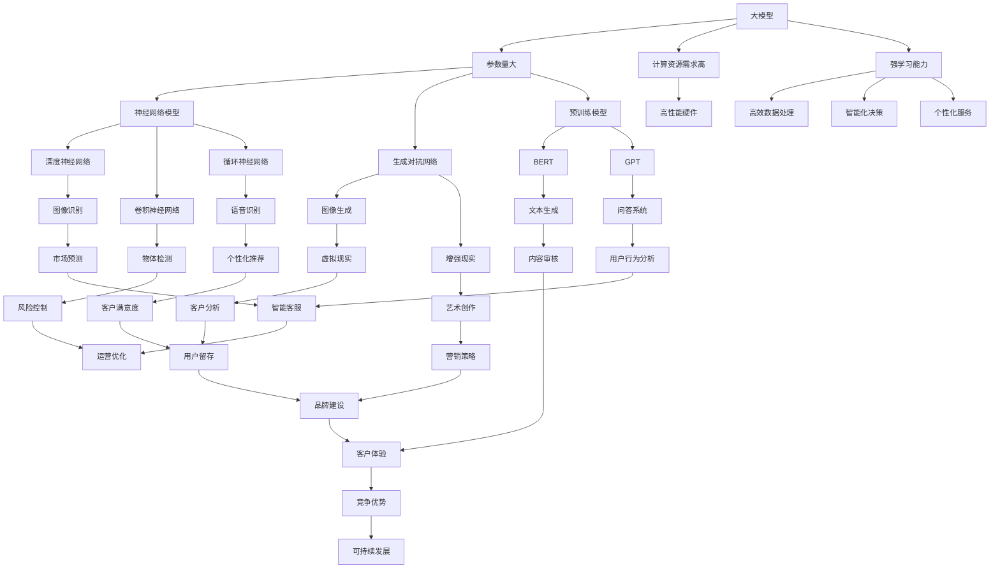

                 

# 文章标题：大模型企业的差异化竞争策略

## 关键词：
- 大模型
- 差异化竞争策略
- 人工智能
- 企业发展
- 技术创新
- 客户需求

## 摘要：
本文将深入探讨大模型企业如何通过差异化竞争策略在市场中脱颖而出。首先，我们将分析大模型的概念、特点及其与企业差异化竞争策略的关系。接着，本文将逐步构建差异化竞争策略，包括市场需求分析、竞争对手分析、企业大模型差异化优势分析以及构建差异化竞争策略的具体方法。然后，我们将讨论如何将差异化竞争策略落地，包括企业大模型落地策略、人才培养与引进、企业文化打造等。最后，我们将通过具体案例和实践，展示企业如何在大模型应用中实现差异化竞争，并提供持续优化和适应的策略。本文旨在为企业提供一套全面的大模型差异化竞争策略指南。

## 目录大纲

### 第一部分：企业大模型应用背景与基础

#### 第1章：企业大模型应用概述

##### 1.1 大模型与差异化竞争策略的关系

##### 1.2 企业大模型应用的价值

##### 1.3 企业大模型应用的挑战

#### 第2章：企业大模型基础

##### 2.1 大模型的概念与分类

##### 2.2 大模型的核心算法

##### 2.3 大模型在企业应用中的特点

### 第二部分：差异化竞争策略的构建

#### 第3章：差异化竞争策略概述

##### 3.1 差异化竞争策略的定义

##### 3.2 差异化竞争策略的重要性

##### 3.3 差异化竞争策略的实施原则

#### 第4章：企业大模型差异化竞争策略分析

##### 4.1 市场需求分析

##### 4.2 竞争对手分析

##### 4.3 企业大模型差异化优势

#### 第5章：构建差异化竞争策略

##### 5.1 差异化产品设计与创新

##### 5.2 差异化服务与体验设计

##### 5.3 差异化营销策略

#### 第6章：差异化竞争策略的落地

##### 6.1 企业大模型落地策略

##### 6.2 人才培养与引进

##### 6.3 企业文化打造

#### 第7章：差异化竞争策略的持续优化

##### 7.1 竞争环境的变化应对

##### 7.2 客户需求的动态调整

##### 7.3 差异化竞争策略的持续改进

### 第三部分：企业大模型差异化竞争策略实践

#### 第8章：企业大模型差异化竞争策略案例

##### 8.1 案例一：互联网企业的大模型应用

##### 8.2 案例二：传统制造业的大模型应用

##### 8.3 案例三：金融行业的大模型应用

#### 第9章：企业大模型差异化竞争策略实战

##### 9.1 实战一：构建企业大模型应用场景

##### 9.2 实战二：制定差异化竞争策略

##### 9.3 实战三：落地差异化竞争策略

#### 附录

##### 附录A：企业大模型差异化竞争策略工具与资源

##### 附录B：参考文献

## 第1章：企业大模型应用概述

### 1.1 大模型与差异化竞争策略的关系

大模型（Large Models）是指那些具有巨大参数量和复杂结构的机器学习模型，它们能够处理和生成大规模数据，并在各种任务中表现出卓越的性能。随着人工智能技术的不断进步，大模型的应用越来越广泛，从自然语言处理到计算机视觉，再到复杂的预测分析，大模型正在成为各个行业提升竞争力的关键。

差异化竞争策略（Differentiation Strategy）是指企业通过在产品或服务上提供独特的价值，以区别于竞争对手，从而在市场中获得竞争优势。这种策略的核心在于创造产品或服务的独特性，使得消费者在选择时更倾向于购买本企业的产品或服务。

大模型与差异化竞争策略之间存在密切的关系：

1. **技术优势**：大模型通常需要先进的计算资源和复杂的算法支持，这为企业提供了技术上的优势，使其能够开发出具有竞争力的产品和服务。

2. **创新能力**：大模型的应用促进了企业的技术创新，使得企业能够不断推陈出新，满足市场的需求。

3. **数据洞察**：大模型能够处理和分析海量数据，为企业提供深入的洞察，帮助企业更好地理解市场需求和消费者行为，从而制定更有效的差异化策略。

4. **个性化服务**：大模型的应用使得企业能够提供高度个性化的产品和服务，提高用户满意度和忠诚度。

### 1.2 企业大模型应用的价值

企业大模型应用的价值体现在以下几个方面：

1. **提高生产效率**：大模型能够自动化和优化生产流程，减少人力投入，提高生产效率。

2. **降低运营成本**：通过智能化的运营管理，企业可以降低运营成本，提高资源利用效率。

3. **提升产品质量**：大模型的应用可以提高产品的设计和制造质量，减少缺陷率。

4. **增强竞争力**：差异化产品和服务能够帮助企业赢得市场份额，提高市场竞争力。

5. **开拓新市场**：大模型的应用可以帮助企业发现新的市场机会，开拓新的业务领域。

### 1.3 企业大模型应用的挑战

尽管企业大模型应用具有巨大的价值，但企业在实际应用中也会面临一系列挑战：

1. **计算资源需求**：大模型训练和推理需要大量的计算资源，这对企业的硬件设施提出了较高的要求。

2. **数据隐私与安全**：大模型对数据有很高的要求，如何在保证数据隐私和安全的前提下进行数据收集和处理，是企业需要解决的问题。

3. **人才短缺**：大模型应用需要专业的技术人才，但市场上此类人才相对稀缺。

4. **技术更新快速**：人工智能技术更新迭代速度快，企业需要不断学习和更新技术，以保持竞争力。

5. **法规与伦理**：随着大模型应用范围的扩大，相关的法规和伦理问题也日益凸显，企业需要遵守相关法规，同时确保技术应用符合伦理标准。

### 1.4 大模型与差异化竞争策略的联系

大模型与差异化竞争策略的联系主要体现在以下几个方面：

1. **技术创新**：大模型的应用推动了技术的不断进步，为企业提供了技术创新的机会，帮助企业实现差异化。

2. **个性化服务**：大模型能够根据用户数据进行个性化推荐，提供个性化的服务，增强用户黏性。

3. **智能决策**：大模型的应用可以帮助企业进行智能决策，优化产品设计和市场营销策略，实现差异化竞争优势。

4. **数据驱动**：大模型的应用使得企业能够更好地进行数据分析和决策，以数据驱动的方式推动差异化策略的实施。

综上所述，大模型与企业差异化竞争策略之间存在着密切的联系，企业通过合理利用大模型，可以有效地提高竞争力，实现可持续发展。

### 1.5 大模型的核心概念与联系

为了更好地理解大模型在企业中的应用，我们需要首先介绍一些核心概念，并解释它们之间的联系。

#### 大模型的概念

大模型是指那些具有巨大参数量和复杂结构的机器学习模型。这些模型通常具有以下几个特点：

- **参数量大**：大模型包含数亿甚至数十亿个参数，这使得它们能够捕获数据中的复杂模式。
- **计算资源需求高**：大模型的训练和推理需要大量的计算资源，通常需要使用高性能的硬件设施，如GPU或TPU。
- **强学习能力**：通过大规模数据训练，大模型能够获得很强的学习和泛化能力。

#### 大模型的分类

根据模型的结构和功能，大模型可以分为以下几类：

- **神经网络模型**：如深度神经网络（DNN）、卷积神经网络（CNN）、循环神经网络（RNN）等。
- **生成对抗网络**（GAN）：用于生成新数据和图像，广泛应用于图像生成和增强现实领域。
- **预训练模型**：如BERT、GPT等，通过在大规模数据集上进行预训练，然后进行微调以适应特定任务。

#### 大模型在企业应用中的特点

大模型在企业应用中具有以下特点：

- **高效数据处理**：大模型能够高效地处理和生成大规模数据，帮助企业快速响应市场变化。
- **智能化决策**：大模型的应用可以帮助企业进行智能决策，优化业务流程和决策过程。
- **个性化服务**：通过大模型，企业能够提供高度个性化的产品和服务，提高用户满意度和忠诚度。

#### 大模型的核心概念联系

为了更好地理解大模型的核心概念和联系，我们可以使用Mermaid流程图进行说明：



通过上述流程图，我们可以清晰地看到大模型的核心概念和联系，以及它们在企业应用中的重要性。

### 1.6 大模型的核心算法原理讲解与伪代码

#### 1.6.1 神经网络算法原理讲解

神经网络（Neural Network）是构建大模型的基础，其核心原理是基于人脑的神经元连接机制。神经网络由多个层次组成，包括输入层、隐藏层和输出层。每个层次包含多个神经元，神经元之间通过权重连接，形成一个复杂的网络结构。

神经网络的基本工作原理如下：

1. **前向传播**：输入数据通过输入层进入网络，经过每一层的神经元计算，最终生成输出。
2. **反向传播**：通过比较输出结果与预期结果，计算误差，然后根据误差调整各层的权重，这个过程称为反向传播。

神经网络的核心算法包括激活函数、损失函数和优化器。

1. **激活函数**：激活函数用于引入非线性特性，常见的激活函数有Sigmoid、ReLU、Tanh等。
2. **损失函数**：损失函数用于衡量输出结果与预期结果之间的差距，常见的损失函数有均方误差（MSE）、交叉熵（Cross Entropy）等。
3. **优化器**：优化器用于调整权重，以最小化损失函数，常见的优化器有SGD、Adam等。

以下是一个简单的神经网络伪代码示例：

```python
# 定义神经网络结构
input_layer_size = 784  # 输入层神经元数量
hidden_layer_size = 500  # 隐藏层神经元数量
output_layer_size = 10  # 输出层神经元数量

# 初始化权重和偏置
weights_input_hidden = np.random.randn(input_layer_size, hidden_layer_size)
weights_hidden_output = np.random.randn(hidden_layer_size, output_layer_size)

# 定义激活函数
sigmoid = lambda x: 1 / (1 + np.exp(-x))

# 定义损失函数
mse_loss = lambda y_hat, y: (y_hat - y) ** 2

# 定义优化器
def gradient_descent(x, y, learning_rate, epochs):
    for epoch in range(epochs):
        z_hidden = np.dot(x, weights_input_hidden)
        a_hidden = sigmoid(z_hidden)
        z_output = np.dot(a_hidden, weights_hidden_output)
        a_output = sigmoid(z_output)
        
        output_error = a_output - y
        hidden_error = np.dot(output_error, weights_hidden_output.T) * sigmoid(z_hidden) * (1 - sigmoid(z_hidden))
        
        weights_hidden_output -= learning_rate * np.dot(a_hidden.T, output_error)
        weights_input_hidden -= learning_rate * np.dot(x.T, hidden_error)
        
        if epoch % 100 == 0:
            loss = mse_loss(a_output, y)
            print(f"Epoch {epoch}: Loss {loss}")

# 训练神经网络
gradient_descent(x_train, y_train, learning_rate=0.1, epochs=1000)
```

#### 1.6.2 损失函数与优化器的详细讲解

损失函数用于衡量模型预测值与实际值之间的差距，选择合适的损失函数对模型的性能至关重要。以下是对几种常见损失函数的详细讲解：

1. **均方误差（MSE）**：
   $$MSE = \frac{1}{n}\sum_{i=1}^{n}(y_i - \hat{y}_i)^2$$
   MSE 是预测值与实际值之间差的平方的平均值，适用于输出为连续值的情况。

2. **交叉熵（Cross Entropy）**：
   $$Cross \ Entropy = -\frac{1}{n}\sum_{i=1}^{n}y_i \log(\hat{y}_i)$$
   交叉熵适用于输出为概率分布的情况，常用于分类问题。

3. **Huber损失**：
   $$Huber = \begin{cases}
   \frac{1}{2}(y - \hat{y})^2, & \text{if } |y - \hat{y}| \leq \delta \\
   \delta(|y - \hat{y}| - \frac{\delta}{2}), & \text{otherwise}
   \end{cases}$$
   Huber 损失在拟合直线附近是线性的，在远离拟合直线时是平方的，这有助于减少异常值对模型的影响。

优化器用于调整模型参数以最小化损失函数，以下是对几种常见优化器的详细讲解：

1. **随机梯度下降（SGD）**：
   $$\theta_{t+1} = \theta_{t} - \alpha \nabla_{\theta}J(\theta)$$
   SGD 通过随机选取一部分训练样本来计算梯度，更新模型参数。

2. **动量（Momentum）**：
   $$v_{t} = \beta v_{t-1} + (1 - \beta) \nabla_{\theta}J(\theta)$$
   $$\theta_{t+1} = \theta_{t} - \alpha v_{t}$$
   动量优化器通过保留之前的梯度信息，增加更新方向的持续性。

3. **Adagrad**：
   $$\theta_{t+1} = \theta_{t} - \frac{\alpha}{\sqrt{\sum_{i=1}^{t}(r_i)^2}} \nabla_{\theta}J(\theta)$$
   Adagrad 优化器根据历史梯度平方的累积和调整学习率，解决了学习率逐渐减小的问题。

4. **Adam**：
   $$m_t = \beta_1 r_t$$
   $$v_t = \beta_2 r_t$$
   $$m_t^{\hat{}} = \frac{m_t}{1 - \beta_1^t}$$
   $$v_t^{\hat{}} = \frac{v_t}{1 - \beta_2^t}$$
   $$\theta_{t+1} = \theta_{t} - \alpha \frac{m_t^{\hat{}}}{\sqrt{v_t^{\hat{}}}}$$
   Adam 优化器结合了动量和自适应学习率的优势，广泛用于深度学习模型。

### 1.7 大模型在企业应用中的特点

大模型在企业应用中具有以下几个显著特点：

1. **参数量大**：大模型通常包含数亿甚至数十亿个参数，这使得它们能够捕捉数据中的复杂模式，从而在任务中表现出更高的准确性。

2. **计算资源需求高**：由于参数量庞大，大模型的训练和推理过程需要大量的计算资源。这通常需要使用高性能的硬件设备，如GPU或TPU，以及高效的分布式计算技术。

3. **强学习能力**：大模型通过在大量数据上进行训练，能够学习到数据的深层次特征，从而在未知数据上表现出强大的泛化能力。

4. **高成本**：大模型的训练和部署通常需要大量的资金投入，包括硬件设备、数据存储和计算资源等。

5. **快速迭代**：大模型的应用使得企业能够快速进行模型迭代和优化，以适应不断变化的市场需求。

6. **高度定制化**：大模型能够根据具体业务需求进行定制化开发，提供个性化的解决方案。

7. **实时性**：通过优化算法和硬件设施，大模型的应用可以实现实时数据处理和决策，提高业务效率。

8. **可扩展性**：大模型的设计通常具有很好的可扩展性，能够轻松适应数据量的增长和业务规模的扩大。

### 1.8 大模型在差异化竞争策略中的应用案例

#### 1.8.1 互联网公司案例

某互联网公司通过大模型实现了个性化推荐系统，大幅提高了用户满意度和转化率。具体应用如下：

1. **用户行为分析**：公司通过收集用户的浏览、点击、购买等行为数据，利用大模型进行用户行为分析，挖掘用户的兴趣偏好。

2. **个性化推荐**：基于用户行为分析结果，大模型为每位用户生成个性化的推荐列表，推荐用户可能感兴趣的商品或内容。

3. **实时调整**：大模型实时处理用户反馈，根据用户行为动态调整推荐策略，优化推荐效果。

4. **效果评估**：通过用户活跃度、点击率、转化率等指标，评估个性化推荐系统的效果，不断优化推荐算法。

#### 1.8.2 制造业公司案例

某制造业公司通过大模型实现了预测性维护，显著降低了设备故障率和维护成本。具体应用如下：

1. **设备数据收集**：公司安装传感器，实时收集设备运行数据，如温度、振动、压力等。

2. **数据预处理**：对收集到的设备数据进行预处理，包括数据清洗、归一化和特征提取。

3. **模型训练**：利用预处理后的数据，训练大模型，预测设备可能的故障时间。

4. **实时监控**：大模型实时监控设备状态，当预测到设备可能发生故障时，提前进行维护，避免设备停机。

5. **效果评估**：通过设备维护频率、故障率、维护成本等指标，评估预测性维护的效果。

### 1.9 大模型与差异化竞争策略的深入探讨

#### 1.9.1 大模型在差异化竞争策略中的角色

大模型在差异化竞争策略中扮演着至关重要的角色。首先，大模型能够为企业提供强大的数据分析和预测能力，帮助企业更好地理解市场需求和消费者行为。这使得企业能够更有针对性地开发产品和服务，从而在市场中脱颖而出。

其次，大模型的应用可以帮助企业实现个性化服务，提高用户体验和满意度。通过分析大量用户数据，大模型可以生成个性化的推荐、定制化的产品和服务，从而增强用户黏性。

此外，大模型还可以帮助企业进行智能决策，优化业务流程和运营策略。通过实时数据处理和预测，企业可以快速响应市场变化，调整策略以适应新的挑战。

#### 1.9.2 大模型对企业差异化竞争策略的影响

大模型对企业差异化竞争策略的影响主要体现在以下几个方面：

1. **技术创新**：大模型的应用推动了技术的不断进步，使得企业能够开发出更加先进和高效的产品和服务。技术创新是企业获得竞争优势的重要手段。

2. **个性化服务**：大模型能够帮助企业实现个性化服务，提高用户体验和满意度。个性化服务是现代市场竞争的关键，能够为企业赢得更多的市场份额。

3. **智能决策**：大模型的应用使得企业能够进行更加精准和高效的决策。智能决策能够帮助企业优化业务流程和运营策略，提高整体效率。

4. **数据洞察**：大模型能够处理和分析海量数据，为企业提供深入的洞察。这些洞察有助于企业更好地了解市场和消费者，从而制定更有针对性的策略。

5. **品牌建设**：大模型的应用有助于企业建立强大的品牌形象。通过提供高质量的产品和服务，企业能够树立良好的口碑，增强品牌影响力。

#### 1.9.3 大模型与差异化竞争策略的互动关系

大模型与差异化竞争策略之间存在着互动关系。一方面，大模型的应用为企业提供了强大的工具和资源，使得企业能够更加有效地实施差异化竞争策略。另一方面，差异化竞争策略的成功实施也为大模型的应用提供了广阔的舞台和机会。

具体来说，企业通过差异化竞争策略，可以明确自身的市场定位和目标客户群体。大模型的应用可以帮助企业更好地了解这些客户的需求和偏好，从而开发出更加个性化的产品和服务。

此外，差异化竞争策略的成功实施还可以为企业积累大量的用户数据和经验。这些数据可以为后续的大模型训练和应用提供宝贵的资源，进一步提高模型的性能和效果。

总之，大模型与差异化竞争策略之间是相辅相成的关系。企业通过合理利用大模型，可以更加有效地实施差异化竞争策略，提高市场竞争力；而差异化竞争策略的成功实施也为大模型的应用提供了广阔的空间和机会。

## 第2章：企业大模型差异化竞争策略的构建

### 2.1 差异化竞争策略构建的原则

构建差异化竞争策略是一项复杂而系统的工程，需要遵循以下原则：

#### 2.1.1 市场导向

差异化竞争策略的制定必须以市场需求为导向。企业应深入分析市场趋势、用户需求和市场环境，确保策略的制定和实施符合市场的实际需求和期望。

#### 2.1.2 创新驱动

差异化竞争策略的核心在于创新。企业应注重技术创新、产品创新和服务创新，通过不断创新来满足市场的多样化和个性化需求。

#### 2.1.3 客户中心

客户是差异化竞争策略的核心。企业应以客户为中心，通过深入了解客户需求和偏好，提供高质量、个性化的产品和服务，从而赢得客户的信任和忠诚。

#### 2.1.4 数据驱动

差异化竞争策略的制定和实施应基于数据驱动。企业应充分利用大数据分析、人工智能等技术手段，对市场数据和用户行为进行深入分析，从而制定科学、有效的策略。

#### 2.1.5 长期可持续

差异化竞争策略应具有长期可持续性。企业应制定长期的战略规划，确保策略的实施能够持续提升企业的核心竞争力，实现可持续发展。

### 2.2 差异化竞争策略构建的流程

构建差异化竞争策略的流程可以分为以下几个步骤：

#### 2.2.1 确定差异化方向

首先，企业需要明确自身的差异化方向，这可以是技术创新、产品特性、用户体验、服务模式等。差异化方向的选择应基于企业的核心优势和市场机会。

#### 2.2.2 市场调研

进行深入的市场调研，了解目标市场的需求、竞争对手的情况和市场趋势。市场调研可以通过问卷调查、访谈、数据分析等方式进行。

#### 2.2.3 设计差异化方案

根据市场调研结果，设计具体的差异化方案。这包括产品特性、服务模式、营销策略等。差异化方案应具有创新性、可行性和竞争优势。

#### 2.2.4 实施与监控

将差异化方案付诸实施，并持续监控策略的执行情况。通过定期的评估和反馈，及时调整和优化策略，确保其有效性和适应性。

### 2.3 差异化竞争策略的评估与调整

差异化竞争策略的评估与调整是确保策略有效性的关键。以下是几个关键步骤：

#### 2.3.1 评估差异化效果

通过市场反馈、用户满意度、市场份额等指标，评估差异化策略的效果。评估结果应作为调整策略的依据。

#### 2.3.2 调整差异化策略

根据评估结果，对差异化策略进行调整和优化。调整可以包括产品特性、服务模式、营销策略等。

#### 2.3.3 持续改进

差异化竞争策略不是一次性的工作，需要企业持续进行技术创新和市场创新，以保持竞争优势。企业应建立持续改进的机制，确保策略的持续优化。

### 2.4 大模型在差异化竞争策略构建中的应用

大模型在差异化竞争策略的构建中具有重要作用，以下是几个关键应用：

#### 2.4.1 数据分析

大模型能够处理和分析海量数据，为企业提供深入的市场洞察和用户分析。通过数据分析，企业可以更准确地了解市场需求和消费者行为，为差异化策略的制定提供数据支持。

#### 2.4.2 情感分析

大模型可以进行情感分析，分析用户对产品和服务的情感态度。通过情感分析，企业可以了解用户的情感需求和痛点，从而优化产品和服务设计。

#### 2.4.3 预测分析

大模型可以进行预测分析，预测市场趋势和用户需求变化。通过预测分析，企业可以提前调整策略，以适应市场的变化。

#### 2.4.4 个性化推荐

大模型可以用于个性化推荐系统，根据用户行为和偏好，推荐个性化的产品和服务。个性化推荐可以提高用户体验和满意度，增强用户黏性。

### 2.5 差异化竞争策略构建的核心要素

构建差异化竞争策略的核心要素包括以下几个方面：

#### 2.5.1 市场需求

深入了解市场需求，是差异化竞争策略构建的基础。企业应通过市场调研和用户反馈，了解目标市场的需求、趋势和变化，从而制定出符合市场需求的策略。

#### 2.5.2 竞争对手

分析竞争对手的优势和劣势，是差异化竞争策略构建的关键。通过分析竞争对手的产品、服务、策略和市场表现，企业可以找到自身的竞争优势和差异化点。

#### 2.5.3 企业优势

充分发挥企业的优势，是差异化竞争策略成功的关键。企业应明确自身的核心优势，如技术、品牌、渠道、服务等，并围绕这些优势制定差异化策略。

#### 2.5.4 创新能力

持续创新能力，是差异化竞争策略的核心。企业应注重技术创新、产品创新和服务创新，通过不断推出新产品和服务，保持市场竞争力。

#### 2.5.5 品牌建设

品牌建设是差异化竞争策略的重要部分。企业应通过有效的品牌传播和品牌管理，树立独特的品牌形象，提高品牌知名度和美誉度。

### 2.6 差异化竞争策略构建的方法与工具

构建差异化竞争策略的方法和工具多种多样，以下是几种常用的方法和工具：

#### 2.6.1 市场研究方法

市场研究是差异化竞争策略构建的重要步骤。常用的市场研究方法包括：

- **问卷调查**：通过设计问卷，收集用户的意见和需求。
- **深度访谈**：与用户进行深入访谈，了解用户的具体需求和痛点。
- **数据分析**：通过数据分析，挖掘市场趋势和用户行为。

#### 2.6.2 SWOT分析

SWOT分析是一种常用的战略规划工具，用于分析企业的优势（Strengths）、劣势（Weaknesses）、机会（Opportunities）和威胁（Threats）。通过SWOT分析，企业可以明确自身的竞争优势和劣势，以及外部市场环境的机会和威胁，从而制定出更加科学的差异化竞争策略。

#### 2.6.3 设计思维

设计思维是一种以用户为中心的创新方法，强调通过迭代和实验来解决问题。设计思维可以帮助企业在差异化竞争策略的构建过程中，更好地理解用户需求，提出创新的解决方案。

#### 2.6.4 商业模式创新

商业模式创新是构建差异化竞争策略的重要手段。企业可以通过创新商业模式，如改变产品定价、服务模式、渠道策略等，来满足市场的需求和期望。

### 2.7 差异化竞争策略构建的案例分析

为了更好地理解差异化竞争策略的构建过程，以下是一个具体的案例分析：

#### 2.7.1 案例背景

某互联网公司是一家专注于在线教育平台的企业。随着市场竞争的加剧，公司希望通过差异化竞争策略，提升市场竞争力。

#### 2.7.2 差异化方向

公司确定了以下差异化方向：

- **技术创新**：通过引入人工智能技术，提升平台的个性化推荐和学习体验。
- **服务模式**：提供1对1定制化教学服务，满足用户的个性化需求。
- **品牌建设**：打造专业的教育品牌形象，提升品牌知名度和美誉度。

#### 2.7.3 市场调研

公司进行了深入的市场调研，包括：

- **用户需求调研**：通过问卷调查和访谈，了解用户对在线教育的需求、偏好和痛点。
- **竞争对手分析**：分析主要竞争对手的产品、服务、策略和市场表现。

#### 2.7.4 设计差异化方案

基于市场调研结果，公司设计了以下差异化方案：

- **个性化推荐**：利用人工智能技术，为用户提供个性化的学习路径和课程推荐。
- **1对1定制化教学**：提供定制化的教学服务，满足用户个性化的学习需求。
- **专业品牌建设**：通过宣传和推广，提升品牌的专业形象和知名度。

#### 2.7.5 实施与监控

公司将差异化方案付诸实施，并建立了监控和评估机制，包括：

- **数据监控**：通过数据分析，监控用户活跃度、学习效果和用户满意度。
- **用户反馈**：定期收集用户反馈，了解用户对差异化方案的满意度和改进建议。

#### 2.7.6 调整与优化

根据监控和评估结果，公司对差异化策略进行了调整和优化，包括：

- **技术优化**：优化个性化推荐算法，提高推荐精度和用户体验。
- **服务优化**：根据用户反馈，改进1对1定制化教学服务，提升服务质量。

### 2.8 差异化竞争策略构建的核心要素与实施步骤

#### 2.8.1 核心要素

构建差异化竞争策略的核心要素包括：

- **市场需求**：深入了解市场需求，是差异化策略的基础。
- **竞争对手**：分析竞争对手的优势和劣势，是差异化策略的关键。
- **企业优势**：充分发挥企业优势，是差异化策略成功的关键。
- **创新能力**：持续创新能力，是差异化策略的核心。
- **品牌建设**：品牌建设是差异化策略的重要部分。

#### 2.8.2 实施步骤

构建差异化竞争策略的实施步骤如下：

1. **确定差异化方向**：明确企业差异化竞争策略的方向，如技术创新、产品特性、用户体验等。
2. **市场调研**：进行深入的市场调研，了解市场需求、竞争对手和用户行为。
3. **设计差异化方案**：根据市场调研结果，设计具体的差异化方案，包括产品特性、服务模式、营销策略等。
4. **实施与监控**：将差异化方案付诸实施，并建立监控和评估机制，确保策略的有效性和适应性。
5. **调整与优化**：根据监控和评估结果，对差异化策略进行调整和优化，确保其持续有效。

通过以上步骤，企业可以构建出一套科学、有效的差异化竞争策略，从而在市场中脱颖而出。

## 第3章：企业大模型差异化竞争策略分析

### 3.1 市场需求分析

市场需求分析是构建企业大模型差异化竞争策略的重要基础。通过深入分析市场需求，企业可以明确目标客户群体的需求、偏好和痛点，从而制定出有针对性的差异化策略。

#### 3.1.1 市场现状

首先，企业需要对当前市场的现状进行全面的了解。这包括市场规模、增长趋势、主要竞争对手和市场份额等。通过市场现状的分析，企业可以确定自身在市场中的定位和优势。

#### 3.1.2 用户需求

用户需求是差异化策略的核心。企业需要通过多种途径，如问卷调查、用户访谈、用户反馈等，深入了解目标用户的需求、偏好和痛点。以下是一些具体的方法：

- **问卷调查**：设计有针对性的问卷，收集用户对产品、服务、价格、体验等方面的意见和建议。
- **用户访谈**：与用户进行面对面的访谈，深入了解用户的真实需求和期望。
- **用户反馈**：收集用户在使用产品或服务过程中的反馈，了解用户遇到的问题和需求。

#### 3.1.3 潜在需求

除了现有用户的需求外，企业还需要挖掘潜在需求。潜在需求可能来自于市场的新趋势、新的技术应用或者竞争对手的新动向。通过分析潜在需求，企业可以提前布局，抢占市场先机。

- **市场趋势**：关注行业发展趋势，如新兴技术、市场变化等。
- **竞争对手**：分析竞争对手的新动向，如产品创新、服务模式等。
- **技术进步**：关注新技术的发展，如人工智能、大数据等，探索其在市场需求中的应用潜力。

### 3.2 竞争对手分析

竞争对手分析是构建差异化竞争策略的重要步骤。通过分析竞争对手的优势和劣势，企业可以找到自身的竞争优势和差异化点。

#### 3.2.1 竞争对手概况

首先，企业需要了解主要竞争对手的基本情况，包括市场份额、产品特性、营销策略、运营模式等。以下是一些分析竞争对手概况的方法：

- **市场调研**：通过市场调研，了解竞争对手的市场表现和市场份额。
- **产品分析**：分析竞争对手的产品特性、功能、用户体验等。
- **营销策略**：研究竞争对手的营销策略，如广告投放、促销活动、品牌宣传等。
- **运营模式**：了解竞争对手的运营模式，如供应链管理、客户服务、渠道策略等。

#### 3.2.2 竞争优势与劣势

在了解竞争对手概况的基础上，企业需要分析竞争对手的优势和劣势。以下是一些分析方法：

- **SWOT分析**：通过SWOT分析，评估竞争对手的优势（Strengths）、劣势（Weaknesses）、机会（Opportunities）和威胁（Threats）。
- **财务分析**：通过财务分析，了解竞争对手的盈利能力、成本结构、市场地位等。
- **用户反馈**：收集用户对竞争对手产品和服务的反馈，了解用户对其满意度和不满意度。

#### 3.2.3 竞争对手策略分析

分析竞争对手的差异化策略，可以帮助企业了解竞争对手如何在不同市场条件下应对竞争。以下是一些分析方法：

- **产品差异化**：分析竞争对手如何通过产品差异化策略来吸引和留住客户。
- **服务差异化**：研究竞争对手如何通过服务差异化策略提升客户满意度。
- **营销策略**：了解竞争对手的营销策略，如广告投放、促销活动、品牌宣传等。
- **技术创新**：分析竞争对手如何通过技术创新来保持竞争优势。

### 3.3 企业大模型差异化优势

在市场需求分析和竞争对手分析的基础上，企业需要明确自身的大模型差异化优势，以制定出具有竞争力的差异化策略。

#### 3.3.1 技术优势

大模型在企业中的应用，为企业带来了显著的技术优势。以下是一些技术优势：

- **数据处理能力**：大模型能够处理和分析海量数据，为企业提供深入的洞察。
- **预测准确性**：大模型通过大规模数据训练，能够提高预测的准确性，帮助企业在决策中更加精准。
- **个性化服务**：大模型能够根据用户数据和行为特征，提供个性化的产品和服务，提升用户体验。
- **智能决策**：大模型的应用可以帮助企业进行智能决策，优化业务流程和运营策略。

#### 3.3.2 产品优势

大模型的应用，使得企业能够开发出具有独特优势的产品。以下是一些产品优势：

- **高精度预测**：大模型能够为企业提供高精度的预测结果，帮助企业优化库存管理、供应链管理等。
- **个性化推荐**：大模型的应用，使得企业能够提供高度个性化的产品推荐，提升用户满意度。
- **智能客服**：大模型的应用，使得企业能够提供智能客服服务，提高客户服务效率和质量。
- **自动化决策**：大模型能够帮助企业实现自动化决策，降低运营成本，提高效率。

#### 3.3.3 服务优势

大模型的应用，使得企业能够提供独特的服务优势。以下是一些服务优势：

- **快速响应**：大模型能够实时处理数据，快速响应用户需求，提高服务效率。
- **个性化定制**：大模型能够根据用户数据和行为特征，提供个性化的服务方案，满足用户需求。
- **智能优化**：大模型能够实时分析服务数据，自动优化服务流程和策略，提高服务质量。
- **高效运维**：大模型的应用，使得企业能够实现高效运维，降低运维成本，提高系统稳定性。

### 3.4 差异化策略的定位

差异化策略的定位是企业成功实施差异化策略的关键。以下是差异化策略定位的关键要素：

#### 3.4.1 市场定位

企业需要明确自身的市场定位，即确定目标市场和目标客户群体。市场定位应基于市场需求和竞争对手分析，确保差异化策略能够满足目标市场的需求。

#### 3.4.2 竞争定位

企业需要明确自身的竞争定位，即确定如何区别于竞争对手。竞争定位应基于企业的技术优势、产品优势和服务优势，确保差异化策略能够突出企业的竞争优势。

#### 3.4.3 品牌定位

企业需要明确自身的品牌定位，即确定品牌形象和品牌价值。品牌定位应基于企业的差异化策略，确保品牌能够与差异化策略相匹配，提升品牌影响力和市场认可度。

### 3.5 差异化策略的实施

差异化策略的实施是确保差异化策略有效性的关键。以下是差异化策略实施的关键步骤：

#### 3.5.1 产品设计与创新

差异化策略的实施首先需要对产品进行设计和创新。这包括开发具有独特功能和用户体验的产品，满足市场需求和用户偏好。

#### 3.5.2 服务优化与提升

差异化策略的实施还需要对服务进行优化和提升。这包括提供个性化、高效、优质的服务，提升客户满意度和忠诚度。

#### 3.5.3 营销策略制定与执行

差异化策略的实施还需要制定和执行有效的营销策略。这包括通过精准营销、品牌宣传等方式，提高品牌知名度和市场占有率。

#### 3.5.4 监控与评估

差异化策略的实施过程中，企业需要建立监控和评估机制，定期评估差异化策略的效果，及时发现和解决问题。

### 3.6 差异化策略的评估与调整

差异化策略的评估与调整是确保差异化策略持续有效的重要环节。以下是差异化策略评估与调整的关键步骤：

#### 3.6.1 效果评估

通过市场反馈、用户满意度、市场份额等指标，对差异化策略的效果进行评估。评估结果应作为调整策略的依据。

#### 3.6.2 调整与优化

根据评估结果，对差异化策略进行调整和优化。调整可以包括产品特性、服务模式、营销策略等。

#### 3.6.3 持续改进

差异化策略不是一次性的工作，企业需要持续进行评估和优化，确保策略能够持续有效。

### 3.7 大模型在差异化策略分析中的应用

大模型在差异化策略分析中具有重要作用，以下是几个关键应用：

#### 3.7.1 数据分析

大模型能够处理和分析海量数据，为企业提供深入的市场洞察和用户分析。通过数据分析，企业可以更准确地了解市场需求和消费者行为，为差异化策略的制定提供数据支持。

#### 3.7.2 情感分析

大模型可以进行情感分析，分析用户对产品和服务的情感态度。通过情感分析，企业可以了解用户的情感需求和痛点，从而优化产品和服务设计。

#### 3.7.3 预测分析

大模型可以进行预测分析，预测市场趋势和用户需求变化。通过预测分析，企业可以提前调整策略，以适应市场的变化。

#### 3.7.4 个性化推荐

大模型可以用于个性化推荐系统，根据用户行为和偏好，推荐个性化的产品和服务。个性化推荐可以提高用户体验和满意度，增强用户黏性。

### 3.8 差异化竞争策略分析的核心要素

差异化竞争策略分析的核心要素包括以下几个方面：

#### 3.8.1 市场需求

深入了解市场需求，是差异化策略分析的基础。企业应通过市场调研和用户反馈，了解目标市场的需求、趋势和变化，从而制定出符合市场需求的策略。

#### 3.8.2 竞争对手

分析竞争对手的优势和劣势，是差异化策略分析的关键。通过分析竞争对手的产品、服务、策略和市场表现，企业可以找到自身的竞争优势和差异化点。

#### 3.8.3 企业优势

充分发挥企业的优势，是差异化策略分析的核心。企业应明确自身的核心优势，如技术、品牌、渠道、服务等，并围绕这些优势制定差异化策略。

#### 3.8.4 创新能力

持续创新能力，是差异化策略分析的重要方面。企业应注重技术创新、产品创新和服务创新，通过不断推出新产品和服务，保持市场竞争力。

#### 3.8.5 品牌建设

品牌建设是差异化策略分析的重要部分。企业应通过有效的品牌传播和品牌管理，树立独特的品牌形象，提高品牌知名度和美誉度。

### 3.9 差异化竞争策略分析的方法与工具

差异化竞争策略分析的方法和工具多种多样，以下是几种常用的方法和工具：

#### 3.9.1 市场研究方法

市场研究是差异化策略分析的重要步骤。常用的市场研究方法包括：

- **问卷调查**：通过设计问卷，收集用户的意见和需求。
- **深度访谈**：与用户进行深入访谈，了解用户的具体需求和期望。
- **数据分析**：通过数据分析，挖掘市场趋势和用户行为。

#### 3.9.2 SWOT分析

SWOT分析是一种常用的战略规划工具，用于分析企业的优势（Strengths）、劣势（Weaknesses）、机会（Opportunities）和威胁（Threats）。通过SWOT分析，企业可以明确自身的竞争优势和劣势，以及外部市场环境的机会和威胁，从而制定出更加科学的差异化策略。

#### 3.9.3 设计思维

设计思维是一种以用户为中心的创新方法，强调通过迭代和实验来解决问题。设计思维可以帮助企业在差异化策略分析过程中，更好地理解用户需求，提出创新的解决方案。

#### 3.9.4 商业模式创新

商业模式创新是差异化策略分析的重要手段。企业可以通过创新商业模式，如改变产品定价、服务模式、渠道策略等，来满足市场的需求和期望。

### 3.10 差异化竞争策略分析的实际案例

为了更好地理解差异化竞争策略分析的实际应用，以下是一个实际案例：

#### 案例背景

某互联网公司是一家专注于在线教育平台的企业。随着市场竞争的加剧，公司希望通过差异化竞争策略，提升市场竞争力。

#### 差异化方向

公司确定了以下差异化方向：

- **技术创新**：通过引入人工智能技术，提升平台的个性化推荐和学习体验。
- **服务模式**：提供1对1定制化教学服务，满足用户的个性化需求。
- **品牌建设**：打造专业的教育品牌形象，提升品牌知名度和美誉度。

#### 市场调研

公司进行了深入的市场调研，包括：

- **用户需求调研**：通过问卷调查和访谈，了解用户对在线教育的需求、偏好和痛点。
- **竞争对手分析**：分析主要竞争对手的产品、服务、策略和市场表现。

#### 差异化策略制定

基于市场调研结果，公司制定了以下差异化策略：

- **个性化推荐**：利用人工智能技术，为用户提供个性化的学习路径和课程推荐。
- **1对1定制化教学**：提供定制化的教学服务，满足用户个性化的学习需求。
- **专业品牌建设**：通过宣传和推广，提升品牌的专业形象和知名度。

#### 实施与评估

公司将差异化策略付诸实施，并建立了监控和评估机制，包括：

- **数据监控**：通过数据分析，监控用户活跃度、学习效果和用户满意度。
- **用户反馈**：定期收集用户反馈，了解用户对差异化策略的满意度和改进建议。

#### 调整与优化

根据监控和评估结果，公司对差异化策略进行了调整和优化，包括：

- **技术优化**：优化个性化推荐算法，提高推荐精度和用户体验。
- **服务优化**：根据用户反馈，改进1对1定制化教学服务，提升服务质量。

### 3.11 差异化竞争策略分析的核心要素总结

差异化竞争策略分析的核心要素包括：

- **市场需求**：深入了解市场需求，是差异化策略分析的基础。
- **竞争对手**：分析竞争对手的优势和劣势，是差异化策略分析的关键。
- **企业优势**：充分发挥企业优势，是差异化策略分析的核心。
- **创新能力**：持续创新能力，是差异化策略分析的重要方面。
- **品牌建设**：品牌建设是差异化策略分析的重要部分。

通过以上核心要素的分析和整合，企业可以构建出科学的差异化竞争策略，从而在市场中脱颖而出。

## 第4章：构建差异化竞争策略

### 4.1 差异化竞争策略的定义

差异化竞争策略（Differentiation Strategy）是指企业在产品或服务上通过独特性、创新性或优越性来区别于竞争对手，从而在市场中获得竞争优势的策略。这种策略的核心在于创造产品或服务的独特性，使其在消费者心中形成鲜明的品牌形象和认知。

### 4.2 差异化竞争策略的重要性

差异化竞争策略在企业竞争中具有重要性，主要体现在以下几个方面：

1. **提高竞争力**：差异化策略使得企业能够提供独特的价值，从而在激烈的市场竞争中脱颖而出。
2. **增强品牌价值**：差异化策略有助于树立企业的品牌形象，提高品牌认知度和忠诚度。
3. **减少价格竞争**：差异化策略使得企业可以避开直接的价格战，通过产品或服务的独特性来吸引消费者。
4. **提升利润率**：差异化策略通常伴随着更高的附加值，从而带来更高的利润率。
5. **促进持续创新**：差异化策略鼓励企业不断进行技术创新和服务创新，以保持市场领先地位。

### 4.3 差异化竞争策略的实施原则

为了有效地实施差异化竞争策略，企业应遵循以下原则：

1. **市场导向**：差异化策略的制定应基于对市场的深入分析，确保策略与市场需求相匹配。
2. **创新驱动**：企业应持续投入研发，推动技术创新和服务创新，保持竞争优势。
3. **客户中心**：差异化策略应围绕客户需求设计，提高客户满意度和忠诚度。
4. **数据驱动**：利用大数据分析和人工智能技术，为企业提供精准的市场洞察和决策支持。
5. **可持续性**：差异化策略应具有长期可持续性，能够持续提升企业的核心竞争力和市场地位。

### 4.4 差异化竞争策略的构建步骤

构建差异化竞争策略可以分为以下步骤：

1. **明确差异化方向**：根据企业的资源和能力，确定差异化策略的具体方向，如技术创新、产品特性、用户体验、服务模式等。
2. **市场调研**：通过市场调研，深入了解市场需求、竞争对手和用户偏好，为差异化策略提供数据支持。
3. **设计差异化方案**：根据市场调研结果，设计具体的差异化方案，包括产品特性、服务模式、营销策略等。
4. **实施与监控**：将差异化方案付诸实施，并建立监控和评估机制，确保策略的有效性和适应性。
5. **调整与优化**：根据监控和评估结果，对差异化策略进行调整和优化，确保其持续有效。

### 4.5 差异化产品设计与创新

差异化产品设计与创新是差异化竞争策略的核心组成部分。以下是一些关键步骤：

1. **需求挖掘**：通过市场调研和用户反馈，深入了解用户需求，挖掘潜在的市场机会。
2. **概念验证**：基于需求挖掘，设计产品原型或概念，验证其市场需求和可行性。
3. **设计迭代**：通过用户测试和反馈，不断优化产品设计，提高用户体验。
4. **技术实现**：利用先进的技术手段，如人工智能、大数据等，实现产品创新和优化。
5. **市场测试**：在小范围内进行市场测试，收集用户反馈，进一步优化产品。

### 4.6 差异化服务与体验设计

差异化服务与体验设计是提升客户满意度和忠诚度的关键。以下是一些关键步骤：

1. **用户分析**：通过用户行为数据和反馈，深入了解用户需求和偏好。
2. **服务设计**：基于用户分析，设计个性化的服务方案，满足用户需求。
3. **体验优化**：通过用户体验测试和反馈，不断优化服务流程和体验。
4. **技术支持**：利用人工智能、大数据等技术，提供智能化的服务支持和个性化推荐。
5. **持续改进**：根据用户反馈和市场变化，持续优化服务设计，提升服务质量。

### 4.7 差异化营销策略

差异化营销策略是推广差异化产品和服务的重要手段。以下是一些关键步骤：

1. **品牌定位**：明确品牌定位和独特价值主张，确保差异化营销策略与品牌形象一致。
2. **目标市场**：确定目标市场和目标客户群体，确保营销资源的有效配置。
3. **营销渠道**：选择合适的营销渠道，如社交媒体、搜索引擎、线下活动等，进行精准营销。
4. **内容营销**：通过内容营销，如博客、视频、社交媒体帖子等，提升品牌知名度和影响力。
5. **效果评估**：通过数据分析，评估营销活动的效果，及时调整和优化营销策略。

### 4.8 差异化竞争策略的评估与调整

差异化竞争策略的评估与调整是确保策略持续有效的重要环节。以下是一些关键步骤：

1. **效果评估**：通过市场反馈、用户满意度、市场份额等指标，评估差异化策略的效果。
2. **反馈机制**：建立反馈机制，收集用户和市场的反馈，及时了解策略实施中的问题。
3. **调整策略**：根据评估结果和反馈，对差异化策略进行调整和优化，确保其持续有效。
4. **持续改进**：通过定期评估和反馈，持续优化差异化策略，适应市场变化和竞争环境。

### 4.9 大模型在差异化竞争策略构建中的应用

大模型在差异化竞争策略的构建中具有重要作用，主要体现在以下几个方面：

1. **数据分析**：利用大模型进行市场趋势和用户行为分析，为企业提供深入的市场洞察。
2. **个性化推荐**：基于用户数据和行为特征，大模型可以提供个性化的产品和服务推荐，提升用户体验。
3. **智能决策**：通过大模型进行智能决策，优化产品设计和营销策略，提高决策准确性。
4. **风险预测**：大模型可以对市场风险和业务风险进行预测，帮助企业提前应对潜在问题。

### 4.10 差异化竞争策略构建的核心要素

差异化竞争策略构建的核心要素包括：

1. **市场需求**：深入了解市场需求，是差异化策略构建的基础。
2. **竞争对手**：分析竞争对手的优势和劣势，是差异化策略构建的关键。
3. **企业优势**：充分发挥企业优势，是差异化策略构建的核心。
4. **创新能力**：持续创新能力，是差异化策略构建的重要方面。
5. **品牌建设**：品牌建设是差异化策略构建的重要部分。

### 4.11 差异化竞争策略构建的方法与工具

差异化竞争策略构建的方法和工具多种多样，以下是一些常用的方法和工具：

1. **市场研究方法**：如问卷调查、用户访谈、数据分析等，用于了解市场需求和用户行为。
2. **SWOT分析**：用于分析企业的优势、劣势、机会和威胁，帮助制定差异化策略。
3. **设计思维**：一种以用户为中心的创新方法，强调通过迭代和实验来解决问题。
4. **商业模式创新**：通过改变产品定价、服务模式、渠道策略等，来满足市场需求。

### 4.12 差异化竞争策略构建的案例分析

为了更好地理解差异化竞争策略的构建过程，以下是一个实际案例分析：

#### 案例背景

某互联网公司是一家提供在线教育服务的公司。随着市场竞争的加剧，公司希望通过差异化竞争策略，提升市场竞争力。

#### 差异化方向

公司确定了以下差异化方向：

- **技术创新**：引入人工智能技术，提供个性化的学习推荐和智能辅导。
- **服务模式**：提供1对1定制化教学服务

