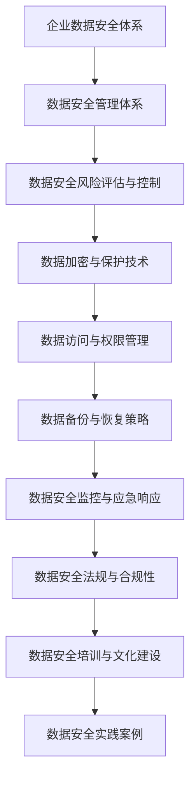

                 

# 文章标题：大模型企业的数据安全策略

> 关键词：大模型、数据安全、加密技术、访问控制、法规合规、应急响应

> 摘要：本文旨在探讨大模型企业在面对日益严峻的数据安全挑战时，如何制定并实施一套全面的数据安全策略。文章首先概述了大模型企业数据安全的重要性及面临的挑战，然后详细介绍了数据安全管理体系、风险评估与控制、加密与保护技术、访问与权限管理、备份与恢复策略、监控与应急响应、法规与合规性以及数据安全培训与文化建设等方面的内容。最后，通过实际案例和附录，为读者提供了具体实施指南和相关法规政策汇总。

## 第一部分：数据安全策略概述

### 第1章：大模型企业数据安全背景与挑战

#### 1.1 大模型企业数据安全的重要性

随着人工智能技术的快速发展，大模型（如BERT、GPT等）在企业中的应用越来越广泛。大模型能够处理和分析大量的数据，从而为企业提供智能化的决策支持。然而，这同时也带来了数据安全方面的挑战。大模型企业数据安全的重要性体现在以下几个方面：

1. **保护企业核心资产**：数据是企业的重要资产，一旦泄露或滥用，可能对企业的竞争力造成严重影响。
2. **维护客户隐私**：企业往往收集和处理大量的客户数据，这些数据涉及到客户的隐私信息。确保这些数据的安全，是维护客户信任的关键。
3. **遵守法律法规**：各国对数据安全都有严格的法律法规，企业必须确保其数据安全策略符合相关法规要求。

#### 1.2 大模型企业面临的数据安全挑战

大模型企业在数据安全方面面临的挑战主要包括以下几个方面：

##### 1.2.1 数据泄露风险

数据泄露是数据安全领域最为常见的威胁之一。随着数据量的增加，数据泄露的风险也随之增大。大模型企业通常处理大量的敏感数据，如财务数据、客户信息、商业机密等，一旦发生数据泄露，后果可能是灾难性的。

##### 1.2.2 数据滥用风险

数据滥用指的是未经授权的用户或系统对数据进行非法操作，如篡改、删除、泄露等。大模型企业中的数据通常具有较高的价值，因此成为数据滥用的目标。此外，内部员工也可能出于不正当目的滥用数据。

##### 1.2.3 法律法规合规性挑战

大模型企业必须遵守各种数据安全法律法规，如《通用数据保护条例》（GDPR）、《加州消费者隐私法案》（CCPA）等。不同国家和地区的法律法规要求不同，企业需要确保其数据安全策略符合所有适用的法规要求。

#### 1.3 大模型企业数据安全的总体目标

大模型企业数据安全的总体目标是确保数据的完整性、可用性和保密性。具体来说，包括以下几个方面：

1. **数据保密性**：确保数据在传输和存储过程中不被未授权的实体访问。
2. **数据完整性**：确保数据在传输和存储过程中不被篡改。
3. **数据可用性**：确保数据在需要时能够被授权的实体访问。
4. **数据合规性**：确保数据安全策略符合所有适用的法律法规要求。

### 第2章：大模型数据安全管理体系

#### 2.1 数据安全管理体系概述

数据安全管理体系是企业应对数据安全挑战的基础。一个有效的数据安全管理体系应包括以下几个方面：

1. **数据安全政策**：明确企业的数据安全目标、原则和基本要求。
2. **规章制度**：制定具体的规章制度，规范员工的行为，确保数据安全策略得到有效执行。
3. **组织架构**：设立专门的数据安全部门或团队，负责数据安全的规划、实施和监督。
4. **风险评估与控制**：定期进行数据安全风险评估，识别潜在风险，并采取相应的控制措施。

#### 2.2 数据安全组织与职责划分

为了确保数据安全策略的有效实施，企业需要建立明确的数据安全组织架构，并明确各部门和岗位的职责。一般来说，数据安全组织应包括以下部门和岗位：

1. **数据安全委员会**：负责制定企业的数据安全策略和规章制度，监督数据安全工作的开展。
2. **数据安全部门**：负责数据安全的日常管理工作，包括风险评估、监控、应急响应等。
3. **IT部门**：负责企业信息系统的安全建设和管理，确保系统的安全性和稳定性。
4. **业务部门**：负责确保业务过程中的数据安全，遵守企业的数据安全规章制度。
5. **员工**：每个员工都应遵守企业的数据安全规章制度，确保自己在工作过程中的数据安全。

#### 2.3 数据安全政策与规章制度

数据安全政策是数据安全管理体系的基石，它应明确企业的数据安全目标、原则和基本要求。以下是数据安全政策的几个关键要素：

1. **数据分类**：根据数据的敏感程度和重要性，对数据进行分类，制定不同的安全保护措施。
2. **访问控制**：制定严格的访问控制策略，确保只有授权用户才能访问敏感数据。
3. **加密与保护**：要求在数据传输和存储过程中对敏感数据进行加密，防止数据泄露。
4. **备份与恢复**：制定数据备份和恢复策略，确保数据在灾难发生时能够及时恢复。
5. **监控与审计**：建立数据安全监控与审计机制，及时发现和应对潜在的安全威胁。
6. **培训与文化建设**：定期进行数据安全培训，提高员工的数据安全意识，营造良好的数据安全文化。

规章制度是数据安全政策的细化，它应具体规定员工在数据安全方面应遵守的行为准则。以下是规章制度的一些关键要素：

1. **员工行为准则**：明确员工在处理数据时应遵守的行为规范，如不得擅自复制、传播、篡改或泄露敏感数据。
2. **密码管理**：要求员工使用强密码，并定期更换密码。
3. **数据传输与存储**：规定数据传输和存储时的安全要求，如使用加密传输协议、加密存储介质等。
4. **数据备份与恢复**：规定数据备份的频率、方式、存储位置等。
5. **安全事件报告**：要求员工在发现数据安全事件时，及时报告给数据安全部门。

通过制定和实施明确的数据安全政策和规章制度，企业可以有效地提升数据安全水平，确保数据的完整性、可用性和保密性。接下来，我们将进一步探讨数据安全风险评估与控制的方法和策略。

### 第3章：大模型数据安全风险评估与控制

#### 3.1 数据安全风险评估方法

数据安全风险评估是数据安全管理的重要环节，它有助于企业识别潜在的数据安全风险，并制定相应的控制措施。以下是几种常用的数据安全风险评估方法：

1. **问卷调查法**：通过问卷调查，收集员工对数据安全问题的看法和反馈，识别潜在的风险。
2. **访谈法**：与员工进行面对面访谈，了解他们对数据安全的认知和操作习惯，识别潜在的风险。
3. **安全审计法**：对企业的信息系统进行安全审计，检查是否存在安全漏洞和违规操作，识别潜在的风险。
4. **风险评估模型**：利用定量或定性的风险评估模型，对数据安全风险进行量化分析，识别潜在的风险。

#### 3.2 数据安全风险识别与评估流程

数据安全风险识别与评估流程包括以下几个步骤：

1. **数据收集**：收集与数据安全相关的信息，包括数据类型、数据量、数据来源等。
2. **风险识别**：根据收集到的信息，识别可能存在的数据安全风险。
3. **风险评估**：对识别出的风险进行评估，确定其严重程度和发生概率。
4. **风险优先级排序**：根据评估结果，对风险进行优先级排序，确定优先处理的风险。
5. **制定控制措施**：针对优先级较高的风险，制定相应的控制措施，降低风险发生的可能性。

#### 3.3 数据安全风险控制策略

数据安全风险控制策略旨在降低数据安全风险发生的可能性。以下是几种常用的数据安全风险控制策略：

1. **技术控制措施**：通过技术手段，如加密、访问控制、防火墙等，保护数据的安全。
2. **管理控制措施**：通过管理手段，如规章制度、培训、审计等，规范员工的行为，确保数据安全。
3. **法律控制措施**：通过法律手段，如签订保密协议、追究责任等，确保数据安全。

#### 3.3.1 技术控制措施

技术控制措施是数据安全风险控制的核心。以下是一些常见的技术控制措施：

1. **数据加密**：对敏感数据进行加密，防止数据泄露。
2. **访问控制**：根据用户的角色和权限，限制用户对数据的访问。
3. **防火墙**：设置防火墙，防止外部攻击。
4. **入侵检测系统**：实时监控网络流量，识别潜在的安全威胁。
5. **防病毒软件**：安装防病毒软件，防止恶意软件感染。

#### 3.3.2 管理控制措施

管理控制措施是确保数据安全的重要手段。以下是一些常见的管理控制措施：

1. **数据安全政策与规章制度**：制定并实施数据安全政策与规章制度，规范员工的行为。
2. **安全培训**：定期进行安全培训，提高员工的数据安全意识。
3. **安全审计**：定期进行安全审计，检查数据安全策略的实施情况。
4. **责任追究**：对违反数据安全规定的行为进行责任追究，确保数据安全。

通过技术控制措施和管理控制措施相结合，企业可以有效地降低数据安全风险，确保数据的完整性、可用性和保密性。

### 第4章：大模型数据加密与保护技术

#### 4.1 数据加密技术概述

数据加密技术是保护数据安全的重要手段。通过数据加密，可以将敏感数据转换成只有授权用户才能解读的形式，从而防止数据泄露和滥用。以下是几种常见的数据加密技术：

1. **对称加密算法**：对称加密算法使用相同的密钥进行加密和解密。常见的对称加密算法包括AES、DES等。
2. **非对称加密算法**：非对称加密算法使用不同的密钥进行加密和解密，通常包括公钥和私钥。常见的非对称加密算法包括RSA、ECC等。
3. **哈希算法**：哈希算法用于生成数据的唯一摘要，常见的哈希算法包括MD5、SHA-256等。

#### 4.2 常见加密算法及应用

##### 4.2.1 对称加密算法

对称加密算法具有加密速度快、解密速度快的特点，适用于需要对大量数据进行加密的场景。以下是两种常见的对称加密算法：

1. **AES（高级加密标准）**：AES是一种块加密算法，它使用128位、192位或256位的密钥对数据进行加密。AES具有高效性、安全性和可扩展性，被广泛用于数据加密和认证。
   
   **伪代码**：
   ```
   function AES_encrypt(plaintext, key):
       // 初始化加密算法
       AES = initialize_aes(key)
       
       // 分块加密
       ciphertext = ""
       for block in divide_into_blocks(plaintext):
           ciphertext += AES.encrypt(block)
       
       return ciphertext
   
   function AES_decrypt(ciphertext, key):
       // 初始化加密算法
       AES = initialize_aes(key)
       
       // 分块解密
       plaintext = ""
       for block in divide_into_blocks(ciphertext):
           plaintext += AES.decrypt(block)
       
       return plaintext
   ```

2. **DES（数据加密标准）**：DES是一种较早的块加密算法，使用56位的密钥对数据进行加密。虽然DES的安全性已受到质疑，但在某些特定场景下仍然被使用。

   **伪代码**：
   ```
   function DES_encrypt(plaintext, key):
       // 初始化加密算法
       DES = initialize_des(key)
       
       // 分块加密
       ciphertext = ""
       for block in divide_into_blocks(plaintext):
           ciphertext += DES.encrypt(block)
       
       return ciphertext
   
   function DES_decrypt(ciphertext, key):
       // 初始化加密算法
       DES = initialize_des(key)
       
       // 分块解密
       plaintext = ""
       for block in divide_into_blocks(ciphertext):
           plaintext += DES.decrypt(block)
       
       return plaintext
   ```

##### 4.2.2 非对称加密算法

非对称加密算法具有密钥分离、加密速度快、解密速度慢的特点，适用于需要对数据进行安全传输的场景。以下是两种常见的非对称加密算法：

1. **RSA（RSA算法）**：RSA是一种基于大数分解算法的公钥加密算法。RSA算法的安全性依赖于大数分解的难度，被广泛用于数据加密和数字签名。
   
   **伪代码**：
   ```
   function RSA_encrypt(plaintext, public_key):
       // 使用公钥加密
       ciphertext = rsa_encrypt(plaintext, public_key)
       
       return ciphertext
   
   function RSA_decrypt(ciphertext, private_key):
       // 使用私钥解密
       plaintext = rsa_decrypt(ciphertext, private_key)
       
       return plaintext
   ```

2. **ECC（椭圆曲线加密）**：ECC是一种基于椭圆曲线离散对数问题的公钥加密算法。ECC算法在相同安全强度下比RSA算法具有更高的效率，被越来越多地用于数据加密和认证。

   **伪代码**：
   ```
   function ECC_encrypt(plaintext, public_key):
       // 使用公钥加密
       ciphertext = ecc_encrypt(plaintext, public_key)
       
       return ciphertext
   
   function ECC_decrypt(ciphertext, private_key):
       // 使用私钥解密
       plaintext = ecc_decrypt(ciphertext, private_key)
       
       return plaintext
   ```

##### 4.2.3 哈希算法

哈希算法用于生成数据的唯一摘要，常用于数据完整性验证和数字签名。以下是两种常见的哈希算法：

1. **MD5（消息摘要算法5）**：MD5算法是一种广泛使用的哈希算法，它将任意长度的数据生成一个128位的消息摘要。尽管MD5已被认为是相对不安全的，但在某些场景下仍然被使用。

   **伪代码**：
   ```
   function MD5_hash(data):
       // 计算MD5哈希值
       hash_value = md5_hash(data)
       
       return hash_value
   ```

2. **SHA-256（安全哈希算法256位）**：SHA-256算法是一种更安全的哈希算法，它将任意长度的数据生成一个256位的消息摘要。SHA-256算法被广泛用于数据完整性验证和数字签名。

   **伪代码**：
   ```
   function SHA256_hash(data):
       // 计算SHA-256哈希值
       hash_value = sha256_hash(data)
       
       return hash_value
   ```

#### 4.3 数据脱敏与匿名化技术

数据脱敏与匿名化技术用于保护敏感数据的隐私，确保在数据使用和分享过程中不会泄露真实身份信息。以下是两种常见的数据脱敏与匿名化技术：

##### 4.3.1 数据脱敏方法

数据脱敏方法包括以下几种：

1. **掩码**：将敏感数据的部分或全部替换为特定字符或符号，如将电话号码替换为“XXX-XXXX”。
2. **替换**：将敏感数据替换为非敏感数据，如将真实姓名替换为“用户XX”。
3. **加密**：使用加密算法对敏感数据进行加密，确保只有授权用户才能解密。

##### 4.3.2 数据匿名化方法

数据匿名化方法包括以下几种：

1. **k-匿名**：确保在一个数据子集中，任何单个记录不能被识别为特定个体，至少需要k个记录才能识别出特定个体。
2. **l-diversity**：确保在一个数据子集中，任何单个记录不能被识别为特定个体，且至少有l个不同的记录。
3. **t-closeness**：确保在一个数据子集中，任何单个记录的属性值与大多数记录的属性值接近，以减少属性值的偏差。

通过数据加密、脱敏与匿名化技术的结合使用，大模型企业可以有效地保护敏感数据的安全和隐私，确保数据的合法合规使用。

### 第5章：大模型数据访问与权限管理

#### 5.1 数据访问控制概述

数据访问控制是确保只有授权用户能够访问敏感数据的重要措施。有效的数据访问控制可以防止未经授权的访问和数据泄露。数据访问控制包括以下几个方面：

1. **身份验证**：确保用户身份的合法性，常见的身份验证方法包括密码、指纹、人脸识别等。
2. **授权**：根据用户的角色和权限，确定其对数据的访问权限，如读取、写入、修改等。
3. **审计**：记录用户的访问行为，以便在发生数据泄露或滥用时进行追溯。

#### 5.2 数据访问权限管理策略

为了确保数据访问控制的有效性，企业需要制定明确的数据访问权限管理策略。以下是几个关键要素：

1. **角色定义**：根据企业的业务需求和用户职责，定义不同的角色和对应的权限。
2. **权限分配**：根据角色的定义，为每个用户分配相应的权限，确保每个用户只能访问其需要的数据。
3. **权限审查**：定期审查用户的权限，确保权限的合理性和及时更新。

#### 5.3 数据权限控制实现方法

数据权限控制可以通过以下几种方法实现：

1. **基于角色的访问控制（RBAC）**：根据用户的角色分配权限，用户只能访问与其角色相关的数据。
2. **基于属性的访问控制（ABAC）**：根据用户的属性（如部门、职位等）和数据的属性（如敏感程度、访问时间等）分配权限。
3. **访问控制列表（ACL）**：为每个数据对象定义访问控制列表，列出哪些用户和角色可以访问该数据。

##### 5.3.1 角色与权限设计

角色与权限设计是数据权限控制的基础。以下是角色与权限设计的一般步骤：

1. **角色定义**：根据业务需求和用户职责，定义不同的角色，如管理员、普通用户、外部合作伙伴等。
2. **权限分配**：为每个角色分配相应的权限，确保每个角色只能访问其需要的数据。
3. **权限映射**：将用户与角色进行映射，确保每个用户都可以访问与其角色相关的数据。

##### 5.3.2 访问控制列表（ACL）应用

访问控制列表（ACL）是一种常用的数据权限控制方法，它为每个数据对象定义访问控制规则。以下是ACL应用的一般步骤：

1. **定义ACL规则**：根据企业的数据安全策略，定义ACL规则，包括允许或拒绝访问的数据对象、用户和角色。
2. **配置ACL**：将ACL规则配置到数据存储系统或应用程序中，确保数据对象根据ACL规则进行访问控制。
3. **权限检查**：在用户访问数据时，根据ACL规则检查用户权限，确保只有授权用户可以访问相应的数据。

通过有效的数据访问与权限管理，大模型企业可以确保数据的安全和合规使用，防止未经授权的访问和数据泄露。

### 第6章：大模型数据备份与恢复策略

#### 6.1 数据备份概述

数据备份是确保数据在灾难发生时能够恢复的重要措施。备份包括以下两种类型：

1. **全备份**：备份整个数据集，确保在灾难发生时能够恢复整个系统。
2. **增量备份**：仅备份自上次备份以来发生变化的数据，节省存储空间和备份时间。

#### 6.2 数据备份方法与策略

为了确保数据备份的有效性，企业需要制定合理的备份方法与策略。以下是几个关键要素：

1. **备份频率**：根据数据的重要性和变化速度，确定备份的频率，如每天、每周或每月。
2. **备份存储位置**：将备份数据存储在异地或云存储中，确保在灾难发生时备份数据的安全。
3. **备份验证**：定期验证备份数据的完整性和可恢复性，确保备份数据的有效性。

#### 6.3 数据恢复策略

数据恢复策略包括以下两个方面：

1. **数据恢复流程**：在灾难发生时，按照预定的数据恢复流程，尽快恢复数据。
2. **数据恢复案例分析**：通过实际案例，分析数据恢复过程中的问题和解决方案，提高数据恢复效率。

##### 6.3.1 数据恢复流程

数据恢复流程包括以下几个步骤：

1. **灾难检测**：及时发现灾难事件，如系统崩溃、数据损坏等。
2. **紧急响应**：启动数据恢复应急响应计划，确保尽快恢复数据。
3. **数据备份检查**：检查备份数据的完整性和有效性。
4. **数据恢复**：使用备份数据恢复系统或数据。
5. **数据验证**：验证恢复后的数据是否完整、正确。

##### 6.3.2 数据恢复案例分析

以下是一个数据恢复案例：

**案例背景**：某企业服务器硬盘损坏，导致数据丢失。

**数据恢复过程**：

1. **灾难检测**：管理员发现服务器无法启动，无法访问数据。
2. **紧急响应**：启动数据恢复应急响应计划，联系数据恢复专家。
3. **数据备份检查**：检查最近的备份数据，发现备份数据完整、有效。
4. **数据恢复**：使用备份数据恢复系统，成功恢复数据。
5. **数据验证**：验证恢复后的数据，确保数据完整、正确。

通过制定合理的数据备份与恢复策略，企业可以在灾难发生时尽快恢复数据，减少数据丢失的风险。

### 第7章：大模型企业数据安全监控与应急响应

#### 7.1 数据安全监控体系构建

数据安全监控体系是确保数据安全的重要措施。构建一个有效的数据安全监控体系需要考虑以下几个方面：

1. **监控工具**：选择合适的数据安全监控工具，如防火墙、入侵检测系统、安全信息与事件管理系统（SIEM）等。
2. **监控指标**：定义监控指标，如数据访问次数、异常访问次数、数据传输速度等，以便实时监控数据安全状况。
3. **监控策略**：制定监控策略，如设置阈值、报警规则等，确保在发生安全事件时能够及时发现。

#### 7.2 数据安全事件检测与响应

数据安全事件检测与响应包括以下几个步骤：

1. **事件检测**：通过监控工具和监控策略，实时检测数据安全事件。
2. **事件分析**：对检测到的事件进行分析，确定事件的类型和影响范围。
3. **事件响应**：根据事件分析结果，采取相应的响应措施，如隔离、修复、报警等。

#### 7.3 数据安全应急响应预案

为了确保在数据安全事件发生时能够迅速响应，企业需要制定数据安全应急响应预案。以下是几个关键要素：

1. **预案内容**：包括事件分类、响应流程、责任分工、资源调配等。
2. **预案演练**：定期进行预案演练，确保应急响应人员熟悉预案内容和操作流程。
3. **预案更新**：根据实际情况和经验教训，定期更新预案。

##### 7.3.1 应急响应流程

应急响应流程包括以下几个步骤：

1. **事件报告**：发现数据安全事件后，立即报告给数据安全部门。
2. **事件评估**：数据安全部门对事件进行评估，确定事件的严重程度和影响范围。
3. **启动预案**：根据事件评估结果，启动相应的应急响应预案。
4. **响应措施**：采取预定的响应措施，如隔离、修复、报警等。
5. **事件报告**：将事件处理结果报告给相关部门和领导。

##### 7.3.2 应急响应案例分析

以下是一个数据安全应急响应案例：

**案例背景**：某企业服务器遭到黑客攻击，导致数据泄露。

**应急响应过程**：

1. **事件报告**：管理员发现服务器异常，立即报告给数据安全部门。
2. **事件评估**：数据安全部门对事件进行评估，发现服务器中的敏感数据已被窃取。
3. **启动预案**：启动数据安全应急响应预案，通知相关部门和领导。
4. **响应措施**：采取以下措施：
   - 立即隔离受影响的服务器，防止攻击扩散。
   - 与网络安全专家合作，分析攻击方式，修复漏洞。
   - 报告相关监管部门，配合调查。
   - 更新安全策略，加强网络安全监控。
5. **事件报告**：将事件处理结果报告给相关部门和领导。

通过构建有效的数据安全监控体系，制定应急响应预案，企业可以迅速应对数据安全事件，降低事件对业务的负面影响。

### 第8章：大模型企业数据安全法规与合规性

#### 8.1 数据安全法规概述

数据安全法规是保障数据安全、保护个人隐私、促进数据合法合规使用的重要法律依据。不同国家和地区的数据安全法规有所不同，以下是一些常见的数据安全法规：

1. **通用数据保护条例（GDPR）**：欧盟制定的一项重要数据安全法规，适用于欧盟成员国的个人数据保护。
2. **加州消费者隐私法案（CCPA）**：美国加州制定的一项消费者隐私保护法规，适用于加州的消费者数据保护。
3. **健康保险可携性和责任法案（HIPAA）**：美国制定的医疗健康数据保护法规。
4. **个人信息保护法（PIPL）**：我国制定的一项重要数据安全法规，适用于个人信息保护。

#### 8.2 数据安全合规性要求

为了确保数据安全合规，企业需要遵守以下要求：

1. **数据分类**：根据数据的重要性和敏感性，对数据进行分类，制定不同的安全保护措施。
2. **数据收集与处理**：确保在收集和处理数据时遵循法律法规的要求，如取得用户同意、明示数据处理规则等。
3. **数据存储与传输**：确保数据存储和传输过程中的安全，如使用加密技术、遵守数据传输协议等。
4. **数据访问与权限管理**：确保只有授权用户可以访问数据，实施严格的访问控制措施。
5. **数据安全培训与文化建设**：定期进行数据安全培训，提高员工的数据安全意识，营造良好的数据安全文化。

#### 8.3 数据安全合规性检查与审计

为了确保数据安全合规，企业需要定期进行数据安全合规性检查与审计。以下是几个关键要素：

1. **合规性检查**：对企业的数据安全策略、规章制度、操作流程等进行合规性检查，确保符合相关法规要求。
2. **合规性审计**：聘请专业的审计机构对企业进行数据安全合规性审计，识别潜在的风险和不足之处。
3. **整改措施**：根据合规性检查和审计结果，制定整改措施，及时纠正违规行为。
4. **持续改进**：持续关注数据安全法规的变化，定期更新数据安全策略和规章制度，确保合规性。

通过遵守数据安全法规、实施合规性检查与审计，企业可以确保数据的安全和合规使用，降低数据安全风险。

### 第9章：大模型企业数据安全培训与文化建设

#### 9.1 数据安全培训计划

数据安全培训是提高员工数据安全意识和技能的重要手段。为了制定一个有效的数据安全培训计划，企业需要考虑以下几个方面：

1. **培训目标**：明确培训的目标，如提高员工的数据安全意识、增强数据安全技能等。
2. **培训内容**：根据员工的岗位和职责，设计相应的培训内容，如数据安全政策、数据安全操作规范、应急响应等。
3. **培训形式**：选择合适的培训形式，如线上培训、线下培训、研讨会等。
4. **培训频率**：确定培训的频率，如每季度、每半年等。

#### 9.2 数据安全文化建设

数据安全文化建设是确保数据安全长效机制的重要措施。为了营造良好的数据安全文化，企业需要从以下几个方面着手：

1. **领导重视**：企业领导应高度重视数据安全，树立数据安全意识，推动数据安全文化建设。
2. **全员参与**：全体员工都应积极参与数据安全文化建设，遵守数据安全规章制度，提高数据安全意识。
3. **宣传推广**：通过内部宣传、培训、文化活动等方式，推广数据安全文化，提高员工的数据安全意识。
4. **激励机制**：建立数据安全激励机制，对在数据安全工作中表现突出的员工进行奖励，激发员工的数据安全积极性。

#### 9.3 数据安全意识提升策略

为了提升员工的数据安全意识，企业可以采取以下策略：

1. **制定数据安全行为规范**：明确员工在数据安全方面的行为规范，如不得擅自复制、传播、篡改或泄露敏感数据。
2. **加强安全意识教育**：通过安全意识教育，提高员工对数据安全的认识和重视程度。
3. **开展数据安全演练**：定期开展数据安全演练，提高员工在数据安全事件发生时的应急响应能力。
4. **奖励与处罚**：对遵守数据安全规章制度的员工进行奖励，对违反数据安全规章制度的员工进行处罚，形成有效的数据安全氛围。

通过制定数据安全培训计划、加强数据安全文化建设以及提升员工的数据安全意识，企业可以确保数据安全工作的长效开展，降低数据安全风险。

### 附录：数据安全策略实践案例

#### 附录 A：数据安全策略实施步骤

1. **制定数据安全策略**：根据企业的业务需求和数据特点，制定一套全面的数据安全策略。
2. **风险评估与控制**：进行数据安全风险评估，识别潜在的风险，并采取相应的控制措施。
3. **数据加密与保护**：对敏感数据采用加密技术进行保护，防止数据泄露。
4. **访问与权限管理**：实施严格的访问与权限管理，确保只有授权用户可以访问敏感数据。
5. **备份与恢复**：制定数据备份与恢复策略，确保在灾难发生时能够迅速恢复数据。
6. **监控与应急响应**：建立数据安全监控与应急响应机制，及时发现并应对数据安全事件。
7. **法规与合规性**：确保数据安全策略符合相关法律法规的要求。
8. **培训与文化**：定期进行数据安全培训，提高员工的数据安全意识，营造良好的数据安全文化。

#### 附录 B：数据安全策略评估与改进

1. **定期评估**：定期对数据安全策略进行评估，检查策略的有效性和适应性。
2. **问题识别**：根据评估结果，识别存在的问题和不足之处。
3. **改进措施**：制定相应的改进措施，如更新数据安全策略、优化安全措施、加强培训等。
4. **实施与监控**：实施改进措施，并持续监控其效果，确保数据安全策略的有效性。

#### 附录 C：数据安全策略相关法规政策汇总

1. **通用数据保护条例（GDPR）**
2. **加州消费者隐私法案（CCPA）**
3. **健康保险可携性和责任法案（HIPAA）**
4. **个人信息保护法（PIPL）**
5. **网络安全法**
6. **信息安全技术标准**
7. **其他相关法律法规**

**附录 D：大模型数据安全架构图（Mermaid 流程图）**



### 作者信息

作者：AI天才研究院/AI Genius Institute & 禅与计算机程序设计艺术 /Zen And The Art of Computer Programming

