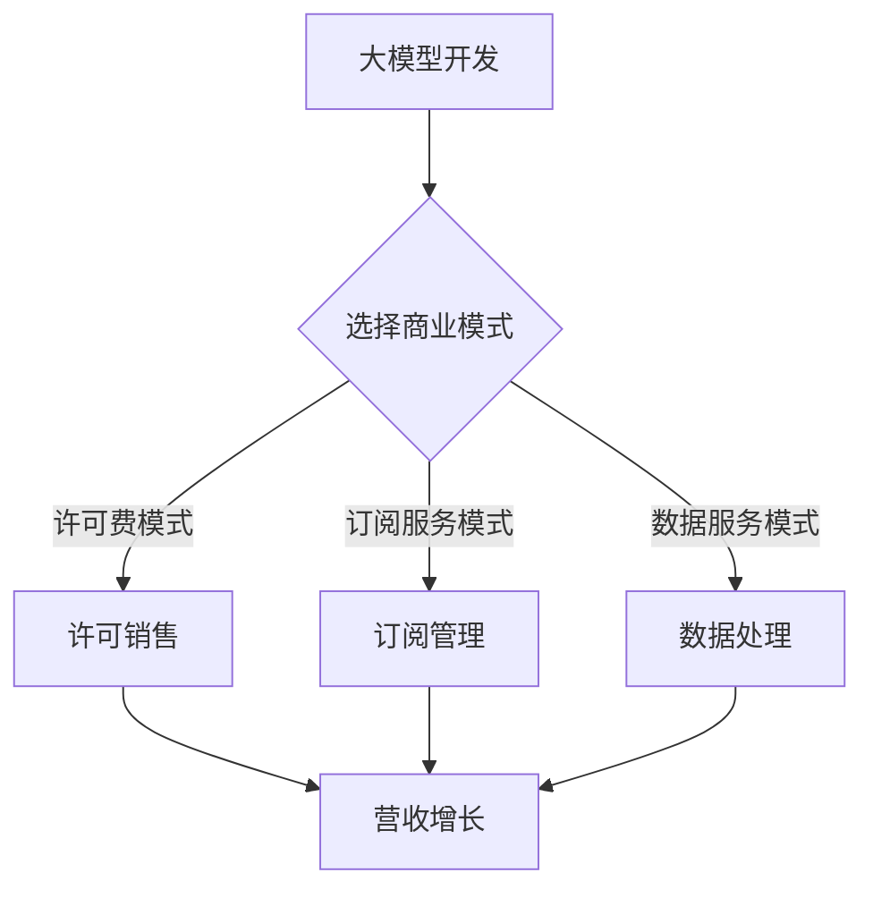

                 

# 大模型创业免费模式走不通，良性商业化是关键

> 关键词：大模型、创业、商业化、模式、良性

> 摘要：本文将探讨大模型创业过程中免费模式的局限性，分析良性商业化的必要性和关键要素，结合实际案例提供可行的商业化策略，为创业者提供有价值的参考。

在人工智能技术迅猛发展的今天，大型语言模型（Large Language Models，简称LLM）已成为行业焦点。许多创业者试图通过免费模式迅速占领市场，以实现快速扩张和用户增长。然而，本文将指出，大模型创业的免费模式存在诸多局限，良性商业化才是可持续发展的关键。

## 第一部分：大模型与商业化的背景与核心概念

### 第1章：大模型与创业环境的变化

#### 1.1 大模型的发展历程

- 大模型的概念起源于深度学习技术的进步，尤其是神经网络架构和计算能力的提升。
- 早期的大模型如GPT-2和GPT-3，展示了其在语言理解和生成方面的强大能力。

#### 1.2 创业环境的变化

- 随着大数据和云计算的普及，创业环境变得更加开放和有利。
- 创业者可以更容易地获取海量数据和强大的计算资源，这为开发大模型提供了有利条件。

#### 1.3 大模型创业的优势与挑战

- **优势：**
  - **技术门槛高**：大模型对技术要求较高，降低了进入市场的门槛。
  - **市场潜力大**：大模型在多个领域具有广泛应用前景，如自然语言处理、推荐系统等。
- **挑战：**
  - **资金需求大**：大模型的训练和部署需要大量资金支持。
  - **商业化难度高**：大模型的商业化路径不明确，需要探索合适的商业模式。

### 第2章：大模型商业化的核心概念

#### 2.1 大模型商业化模式概述

- **销售模式**：直接销售大模型软件或服务。
- **合作模式**：与大企业或研究机构合作，提供技术支持和解决方案。
- **服务模式**：提供基于大模型的定制化服务。

#### 2.2 大模型的价值评估方法

- **价值评估框架**：从技术、市场、财务等方面评估大模型的价值。
- **ROI计算方法**：计算投资回报率，评估商业模式的可行性。

#### 2.3 良性商业化的定义与特征

- **良性商业化的定义**：在保证持续盈利的同时，实现可持续发展和社会责任。
- **特征**：包括盈利模式清晰、风险可控、资源利用高效等。

## 第二部分：大模型商业化模式分析

### 第3章：大模型商业化模式案例分析

#### 3.1 许可费模式

- **模式特点**：客户购买大模型软件的许可权。
- **成功案例分析**：OpenAI将GPT-3许可给多个企业，实现了良好的商业化。

#### 3.2 订阅服务模式

- **模式特点**：客户按月或按年订阅大模型服务。
- **成功案例分析**：谷歌的Cloud Natural Language API通过订阅模式获得广泛采用。

#### 3.3 数据服务模式

- **模式特点**：提供大模型训练所需的数据服务。
- **成功案例分析**：数据猿（Data Era）通过提供高质量数据服务，实现了商业模式的成功。

### 第4章：大模型商业化过程中的法律与合规

#### 4.1 商业化模式中的法律问题

- **数据隐私**：确保客户数据的隐私和安全。
- **知识产权保护**：保护大模型及其相关技术的知识产权。

#### 4.2 合规性要求与风险管理

- **法律合规性评估**：确保商业模式符合相关法律法规。
- **风险管理策略**：制定应对潜在法律风险的管理策略。

### 第5章：大模型商业化的战略规划

#### 5.1 市场定位与竞争分析

- **市场定位策略**：根据目标市场的特点，制定市场定位策略。
- **竞争对手分析**：分析竞争对手的优势和劣势，制定相应的竞争策略。

#### 5.2 商业模式创新

- **创新模式探讨**：探索基于大模型的创新商业模式。
- **创新案例分析**：分析成功案例中的商业模式创新。

#### 5.3 战略规划与实施

- **战略规划**：制定长期的商业化战略。
- **实施**：将战略规划转化为具体的行动方案。

## 第三部分：大模型商业化实践

### 第6章：大模型商业化实践案例分析

#### 6.1 人工智能助手商业化

- **项目背景**：某企业开发了一款基于大模型的人工智能助手。
- **实施步骤**：从需求分析到产品上线，详细描述实施步骤。
- **成果分析**：评估项目成果，包括用户反馈和商业收益。

#### 6.2 自动驾驶商业化

- **项目背景**：某企业致力于自动驾驶技术的商业化。
- **实施步骤**：介绍项目从研发到市场推广的详细过程。
- **成果分析**：分析自动驾驶商业化带来的影响，如市场接受度和盈利能力。

#### 6.3 医疗健康数据服务商业化

- **项目背景**：某企业提供基于大模型的医疗健康数据服务。
- **实施步骤**：描述项目的开发过程，包括数据收集、模型训练和应用。
- **成果分析**：评估项目在医疗健康领域的贡献，如提高诊断准确率和降低成本。

### 第7章：大模型商业化过程中的问题与解决方案

#### 7.1 商业化过程中常见问题

- **技术难题**：如何保证大模型的稳定性和高效性。
- **资金问题**：如何筹集足够的资金支持大模型开发。
- **市场接受度**：如何提高市场对大模型服务的认可度。

#### 7.2 问题分析与解决方案

- **技术难题的解决策略**：介绍解决技术难题的具体方法。
- **资金问题的应对措施**：探讨如何有效筹集资金。
- **提高市场接受度的策略**：分析如何提升大模型服务的市场认可度。

### 第8章：未来展望

#### 8.1 大模型商业化的发展趋势

- **技术发展趋势**：预测大模型技术未来的发展方向。
- **商业模式演变**：探讨大模型商业模式的未来演变趋势。

#### 8.2 创业者在大模型商业化中的机会与挑战

- **机会分析**：分析创业者在大模型商业化中的机会。
- **挑战应对策略**：提供应对大模型商业化挑战的策略。

### 附录

#### 附录A：大模型商业化资源与工具

- **开发工具介绍**：介绍用于大模型开发的常用工具。
- **数据资源链接**：提供大模型训练所需的数据资源链接。
- **法律法规指南**：介绍与大数据模型商业化相关的法律法规。

## Mermaid 流程图

### 2.1 大模型商业化模式流程图



## 核心算法原理讲解

### 4.1 大模型训练算法伪代码

```python
# 初始化参数
theta <- 初始化参数

# 设置迭代次数
for i = 1 to N do
    # 计算梯度
    gradient <- 计算梯度(theta)
    
    # 更新参数
    theta <- theta - 学习率 * gradient
    
    # 计算损失函数值
    loss <- 计算损失函数(theta)
    
    # 输出迭代次数和损失函数值
    print(i, loss)
end
```

## 数学模型和数学公式

### 5.1 大模型价值评估模型

$$
V = \frac{1}{2} \sigma^2 n + \mu n - C
$$

其中，\(V\) 是大模型的价值，\(\sigma^2\) 是价值的方差，\(\mu\) 是价值的期望，\(n\) 是模型的使用频率，\(C\) 是模型的成本。

## 项目实战

### 6.1 人工智能助手商业化项目

#### 开发环境搭建

- **硬件环境**：配置高性能计算服务器。
- **软件环境**：安装深度学习框架（如TensorFlow、PyTorch）。

#### 源代码实现与解读

```python
# 导入必要的库
import tensorflow as tf
import numpy as np

# 定义模型结构
model = tf.keras.Sequential([
    tf.keras.layers.Dense(512, activation='relu', input_shape=(784,)),
    tf.keras.layers.Dropout(0.2),
    tf.keras.layers.Dense(10, activation='softmax')
])

# 编译模型
model.compile(optimizer='adam',
              loss='categorical_crossentropy',
              metrics=['accuracy'])

# 训练模型
model.fit(x_train, y_train, batch_size=128, epochs=10, validation_data=(x_val, y_val))

# 评估模型
test_loss, test_acc = model.evaluate(x_test, y_test)
print('Test accuracy:', test_acc)
```

#### 代码解读与分析

- **模型结构**：使用一个全连接层作为输入层，激活函数为ReLU。
- **编译模型**：指定优化器和损失函数。
- **训练模型**：使用训练数据训练模型，并设置批量大小和迭代次数。
- **评估模型**：使用测试数据评估模型的性能。

## 总结与作者信息

本文从大模型创业的背景和核心概念出发，分析了免费模式的局限性，探讨了良性商业化的必要性和关键要素，并通过实际案例提供了商业化策略。创业者在选择商业模式时，应综合考虑技术、市场和法律等多方面因素，制定可行的战略规划。

**作者：AI天才研究院/AI Genius Institute & 禅与计算机程序设计艺术 /Zen And The Art of Computer Programming**

