                 

# 《大模型创业公司的独立发布》

> 关键词：大模型、创业公司、独立发布、市场调研、产品设计、营销策略、资金管理

> 摘要：本文旨在探讨大模型创业公司如何独立发布其产品，包括市场调研、产品设计、营销策略、资金管理等方面。文章首先介绍大模型的概念与价值，然后详细分析创业公司的运营流程，最后提出发布与推广的策略，以期为创业者提供有价值的参考。

## 第一部分：大模型概述

### 第1章：大模型的概念与价值

#### 1.1 大模型的定义与分类

大模型是指具有大规模参数的深度学习模型，通常用于处理复杂的任务，如图像识别、自然语言处理等。根据应用场景和任务类型，大模型可以分为通用模型和领域特定模型。

**Mermaid流程图：大模型的分类与发展历程**

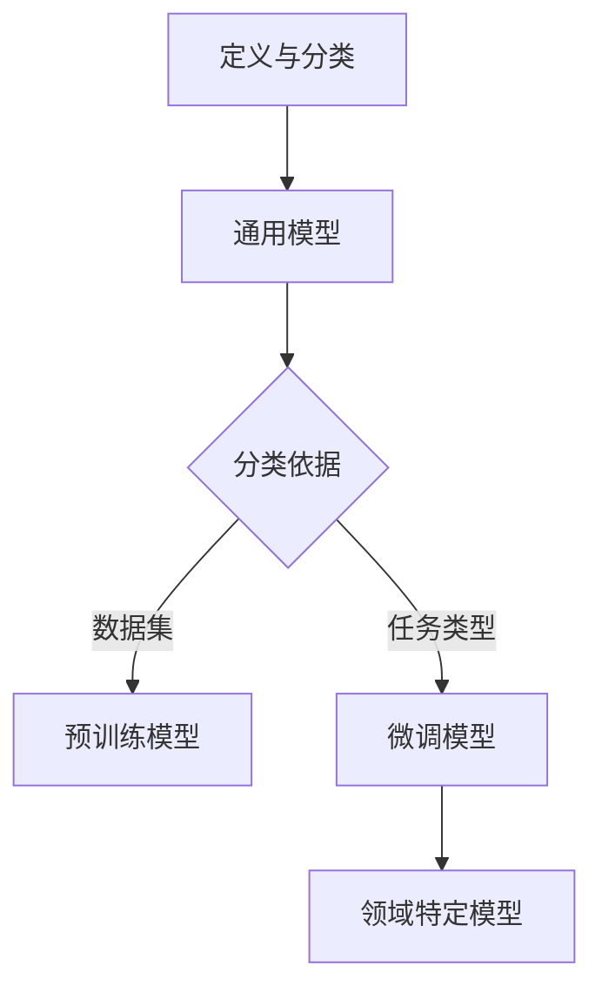
```mermaid
graph TD
A[定义与分类]
A --> B[通用模型]
B --> C{分类依据}
C --> |数据集| D[预训练模型]
C --> |任务类型| E[微调模型]
E --> F[领域特定模型]
```

#### 1.2 大模型的发展历程

大模型的发展历程可以追溯到深度学习的兴起。自2012年AlexNet在ImageNet竞赛中取得突破性成果以来，深度学习技术迅速发展。2014年，GPT系列模型的出现标志着自然语言处理领域的重大突破。2018年，BERT模型进一步推动了自然语言处理技术的发展。

**Mermaid流程图：大模型的发展历程**

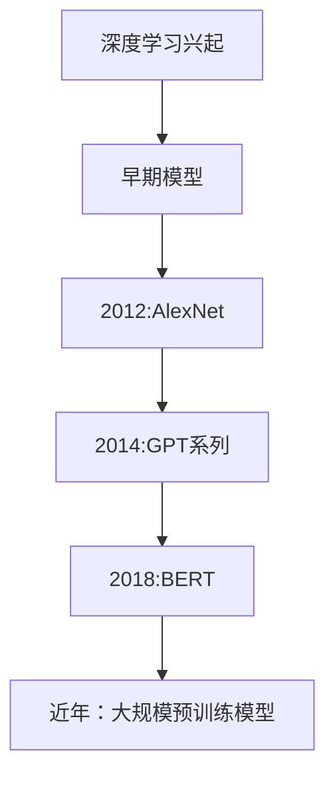
```mermaid
graph TD
A[深度学习兴起]
A --> B[早期模型]
B --> C[2012:AlexNet]
C --> D[2014:GPT系列]
D --> E[2018:BERT]
E --> F[近年：大规模预训练模型]
```

#### 1.3 大模型在企业中的应用价值

大模型在企业中具有广泛的应用价值，可以提高企业的市场竞争力，实现业务创新和效率提升。以下是一些具体的应用场景：

- **图像识别**：应用于产品检测、质量控制等领域，提高生产效率。
- **自然语言处理**：应用于客户服务、智能推荐等领域，提升用户体验。
- **语音识别**：应用于语音助手、智能会议等领域，实现人机交互。
- **预测分析**：应用于市场预测、风险管理等领域，帮助企业做出更准确的决策。

**数学模型与讲解**：企业效益最大化模型

$$
\text{企业效益} = f(\text{市场份额}, \text{成本效率}, \text{技术优势})
$$

### 第2章：大模型技术基础

#### 2.1 深度学习基础

深度学习是构建大模型的基础，主要包括神经网络、深度学习框架等方面。

**伪代码**：神经网络基础

```python
# 输入层
input_data = ...

# 隐藏层
hidden_layer = sigmoid(np.dot(input_data, weights))

# 输出层
output_data = sigmoid(np.dot(hidden_layer, output_weights))
```

#### 2.2 大模型的训练方法

大模型的训练方法包括预训练与微调、数据处理与增强等方面。

**伪代码**：预训练与微调

```python
# 预训练
model.fit(train_data, epochs=num_epochs, batch_size=batch_size)

# 微调
model.fit(train_data, epochs=num_epochs, batch_size=batch_size, initial_learning_rate=learning_rate)
```

#### 2.3 大模型评估与优化

大模型的评估与优化主要包括评估指标、优化策略等方面。

**伪代码**：评估指标与优化策略

```python
# 评估指标
accuracy = model.evaluate(test_data)[1]

# 优化策略
model.compile(optimizer='adam', loss='categorical_crossentropy', metrics=['accuracy'])
```

## 第二部分：大模型创业公司的运营

### 第3章：大模型创业公司的市场调研

#### 3.1 市场环境分析

市场环境分析是创业公司制定战略的重要依据。主要从行业现状、竞争对手分析等方面进行。

**Mermaid流程图：市场环境分析**

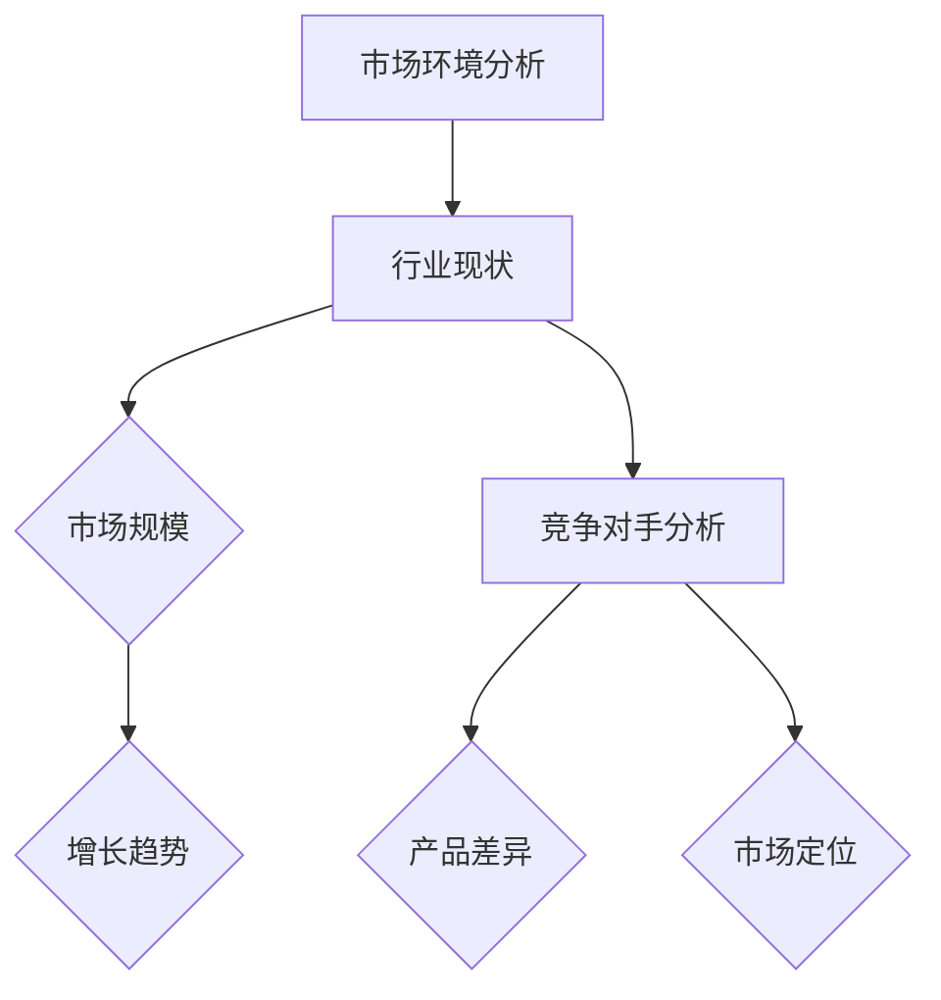
```mermaid
graph TD
A[市场环境分析]
A --> B[行业现状]
B --> C{市场规模}
C --> D{增长趋势}
B --> E[竞争对手分析]
E --> F{产品差异}
E --> G{市场定位}
```

#### 3.2 目标市场与客户分析

目标市场与客户分析是创业公司定位的关键。主要从目标市场的定位、客户需求分析等方面进行。

**Mermaid流程图：目标市场与客户分析**

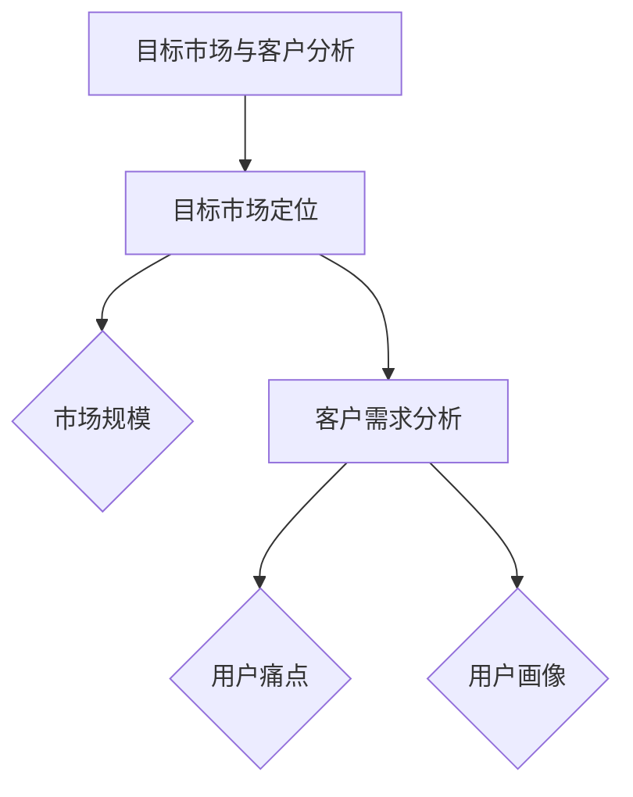
```mermaid
graph TD
A[目标市场与客户分析]
A --> B[目标市场定位]
B --> C{市场规模}
B --> D[客户需求分析]
D --> E{用户痛点}
D --> F{用户画像}
```

### 第4章：大模型产品设计与开发

#### 4.1 产品设计原则

产品设计原则是创业公司打造优质产品的关键。主要从功能规划、用户体验设计等方面进行。

**Mermaid流程图：产品设计原则**

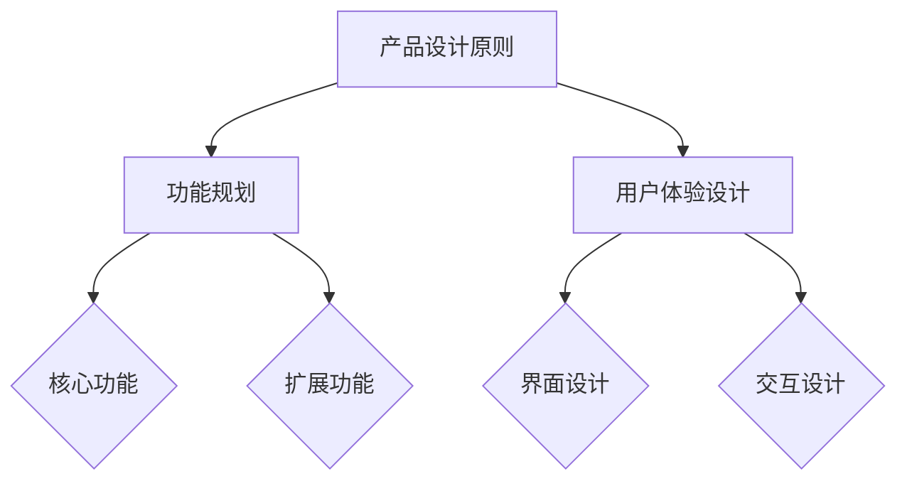
```mermaid
graph TD
A[产品设计原则]
A --> B[功能规划]
B --> C{核心功能}
B --> D{扩展功能}
A --> E[用户体验设计]
E --> F{界面设计}
E --> G{交互设计}
```

#### 4.2 产品开发流程

产品开发流程是创业公司实现产品落地的关键。主要从需求分析、技术方案设计、开发与测试等方面进行。

**Mermaid流程图：产品开发流程**

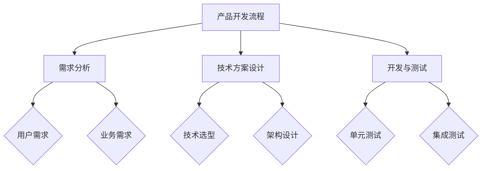
```mermaid
graph TD
A[产品开发流程]
A --> B[需求分析]
B --> C{用户需求}
B --> D{业务需求}
A --> E[技术方案设计]
E --> F{技术选型}
E --> G{架构设计}
A --> H[开发与测试]
H --> I{单元测试}
H --> J{集成测试}
```

#### 4.3 产品迭代与优化

产品迭代与优化是创业公司持续提升产品竞争力的关键。主要从用户反馈收集、产品迭代策略等方面进行。

**Mermaid流程图：产品迭代与优化**

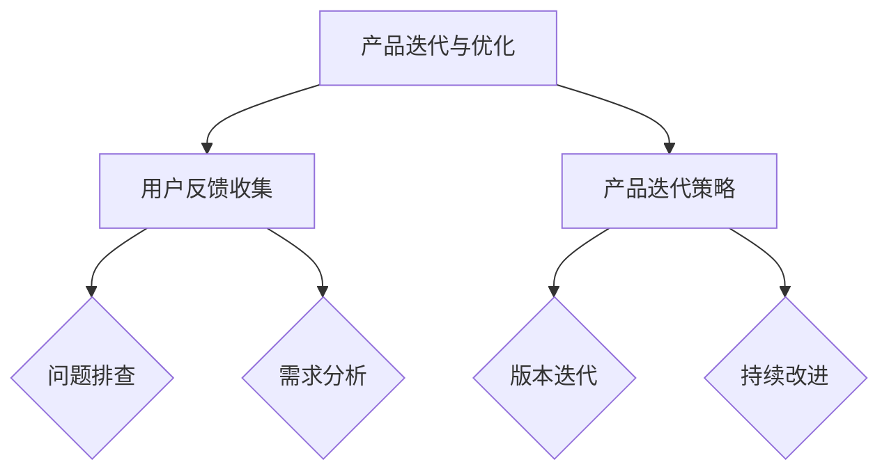
```mermaid
graph TD
A[产品迭代与优化]
A --> B[用户反馈收集]
B --> C{问题排查}
B --> D{需求分析}
A --> E[产品迭代策略]
E --> F{版本迭代}
E --> G{持续改进}
```

### 第5章：大模型创业公司的营销策略

#### 5.1 营销目标设定

营销目标设定是创业公司制定营销策略的关键。主要从品牌建设、销售目标等方面进行。

**Mermaid流程图：营销目标设定**

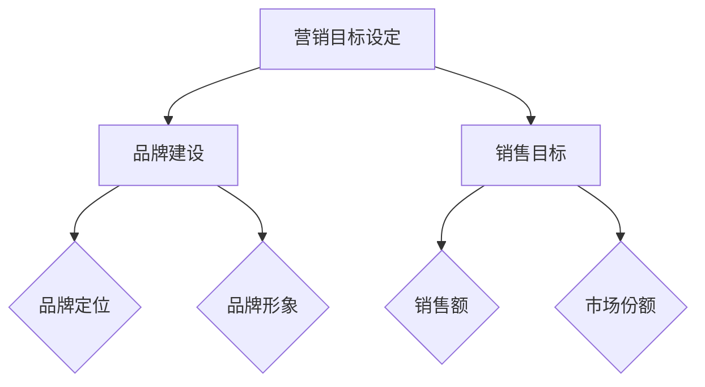
```mermaid
graph TD
A[营销目标设定]
A --> B[品牌建设]
B --> C{品牌定位}
B --> D{品牌形象}
A --> E[销售目标]
E --> F{销售额}
E --> G{市场份额}
```

#### 5.2 营销渠道选择

营销渠道选择是创业公司实现产品销售的关键。主要从线上渠道、线下渠道等方面进行。

**Mermaid流程图：营销渠道选择**

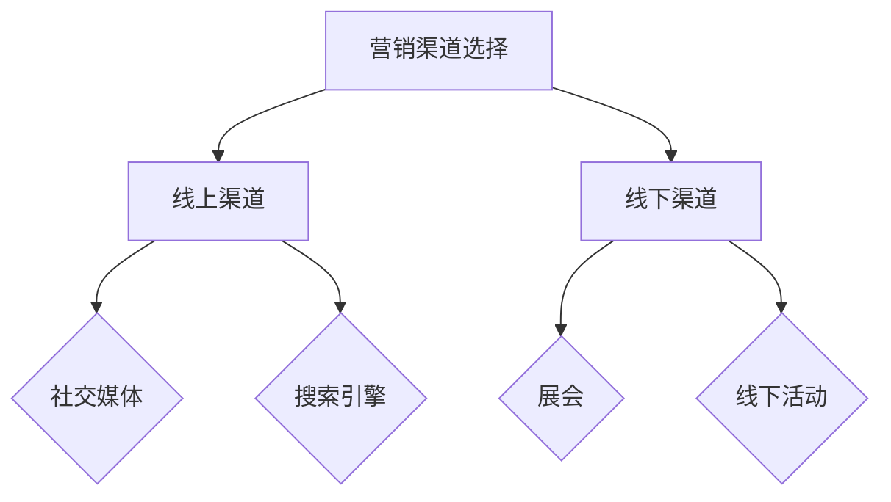
```mermaid
graph TD
A[营销渠道选择]
A --> B[线上渠道]
B --> C{社交媒体}
B --> D{搜索引擎}
A --> E[线下渠道]
E --> F{展会}
E --> G{线下活动}
```

#### 5.3 营销活动策划

营销活动策划是创业公司实现品牌传播和销售增长的关键。主要从活动类型、活动效果评估等方面进行。

**Mermaid流程图：营销活动策划**

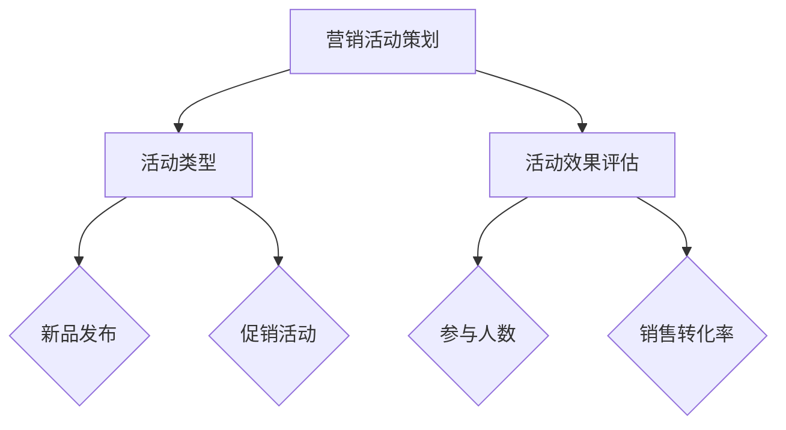
```mermaid
graph TD
A[营销活动策划]
A --> B[活动类型]
B --> C{新品发布}
B --> D{促销活动}
A --> E[活动效果评估]
E --> F{参与人数}
E --> G{销售转化率}
```

### 第6章：大模型创业公司的资金与管理

#### 6.1 资金筹集策略

资金筹集策略是创业公司实现可持续发展的关键。主要从股权融资、债务融资等方面进行。

**Mermaid流程图：资金筹集策略**

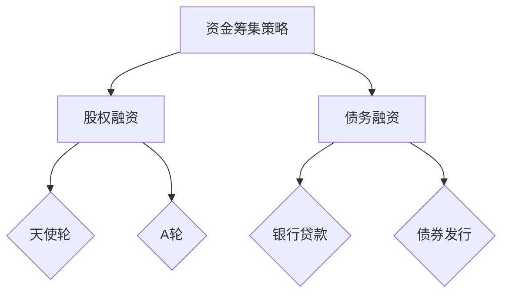
```mermaid
graph TD
A[资金筹集策略]
A --> B[股权融资]
B --> C{天使轮}
B --> D{A轮}
A --> E[债务融资]
E --> F{银行贷款}
E --> G{债券发行}
```

#### 6.2 财务管理

财务管理是创业公司实现稳健运营的关键。主要从成本控制、盈利模式分析等方面进行。

**Mermaid流程图：财务管理**

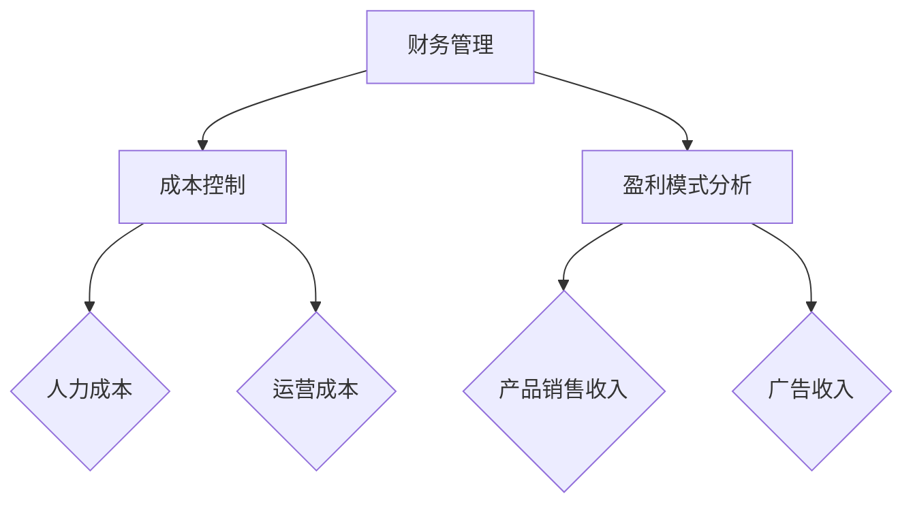
```mermaid
graph TD
A[财务管理]
A --> B[成本控制]
B --> C{人力成本}
B --> D{运营成本}
A --> E[盈利模式分析]
E --> F{产品销售收入}
E --> G{广告收入}
```

#### 6.3 团队建设与管理

团队建设与管理是创业公司实现高效运作的关键。主要从招聘策略、员工激励机制等方面进行。

**Mermaid流程图：团队建设与管理**

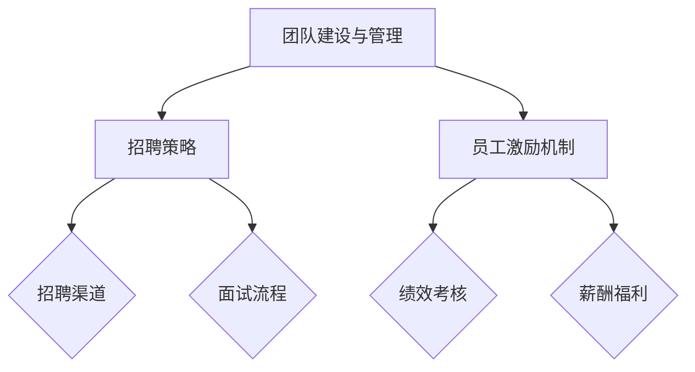
```mermaid
graph TD
A[团队建设与管理]
A --> B[招聘策略]
B --> C{招聘渠道}
B --> D{面试流程}
A --> E[员工激励机制]
E --> F{绩效考核}
E --> G{薪酬福利}
```

## 第三部分：大模型创业公司的独立发布与推广

### 第7章：大模型的独立发布流程

#### 7.1 发布前的准备工作

发布前的准备工作是确保产品顺利发布的关键。主要从发布计划、技术测试、用户反馈收集等方面进行。

**Mermaid流程图：发布前的准备工作**

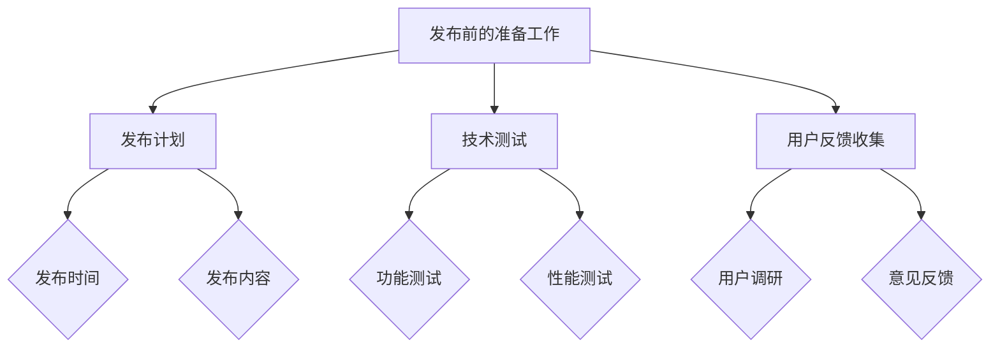
```mermaid
graph TD
A[发布前的准备工作]
A --> B[发布计划]
B --> C{发布时间}
B --> D{发布内容}
A --> E[技术测试]
E --> F{功能测试}
E --> G{性能测试}
A --> H[用户反馈收集]
H --> I{用户调研}
H --> J{意见反馈}
```

#### 7.2 发布过程管理

发布过程管理是确保产品顺利发布的关键。主要从发布时间规划、灾难应对计划等方面进行。

**Mermaid流程图：发布过程管理**

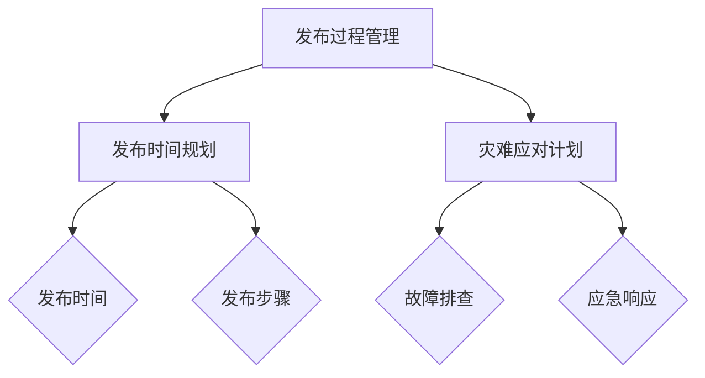
```mermaid
graph TD
A[发布过程管理]
A --> B[发布时间规划]
B --> C{发布时间}
B --> D{发布步骤}
A --> E[灾难应对计划]
E --> F{故障排查}
E --> G{应急响应}
```

#### 7.3 发布后的反馈与改进

发布后的反馈与改进是确保产品持续优化的重要环节。主要从用户反馈收集、产品改进策略等方面进行。

**Mermaid流程图：发布后的反馈与改进**

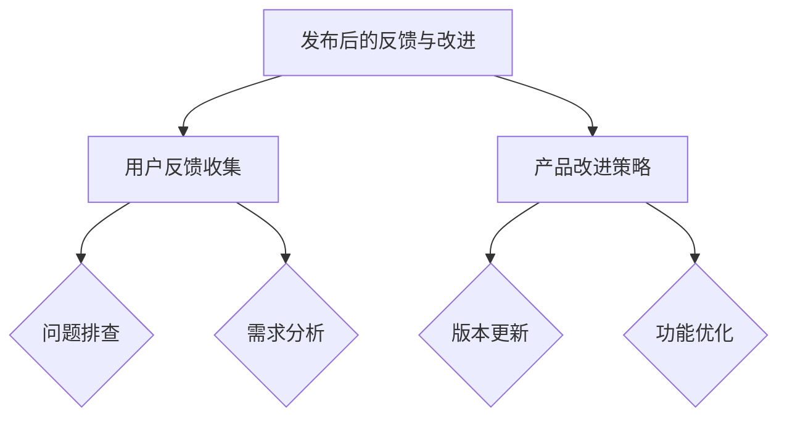
```mermaid
graph TD
A[发布后的反馈与改进]
A --> B[用户反馈收集]
B --> C{问题排查}
B --> D{需求分析}
A --> E[产品改进策略]
E --> F{版本更新}
E --> G{功能优化}
```

### 第8章：大模型的推广策略

#### 8.1 推广目标设定

推广目标设定是创业公司制定推广策略的关键。主要从推广范围、推广效果评估等方面进行。

**Mermaid流程图：推广目标设定**

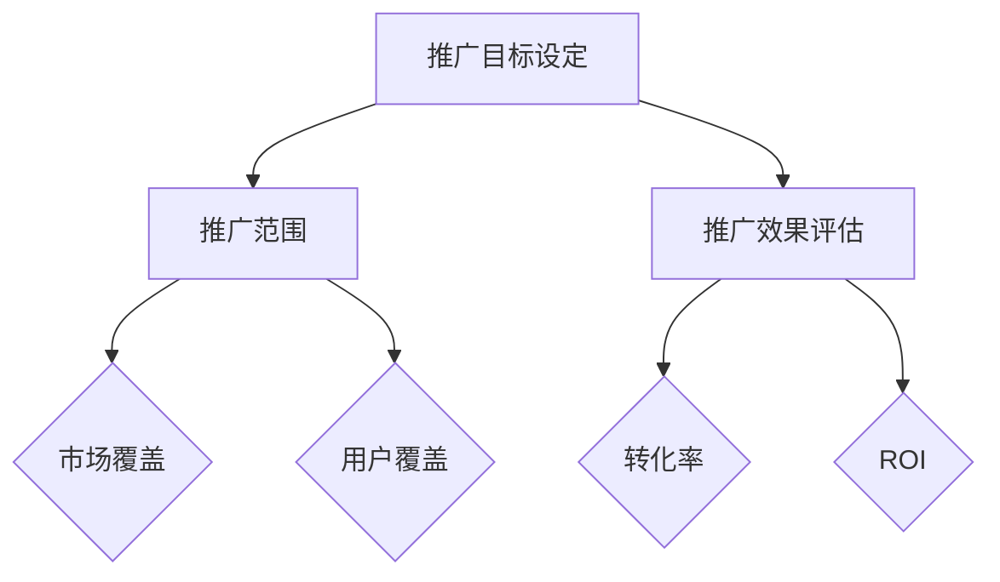
```mermaid
graph TD
A[推广目标设定]
A --> B[推广范围]
B --> C{市场覆盖}
B --> D{用户覆盖}
A --> E[推广效果评估]
E --> F{转化率}
E --> G{ROI}
```

#### 8.2 推广渠道选择

推广渠道选择是创业公司实现产品推广的关键。主要从社交媒体推广、行业会议推广等方面进行。

**Mermaid流程图：推广渠道选择**

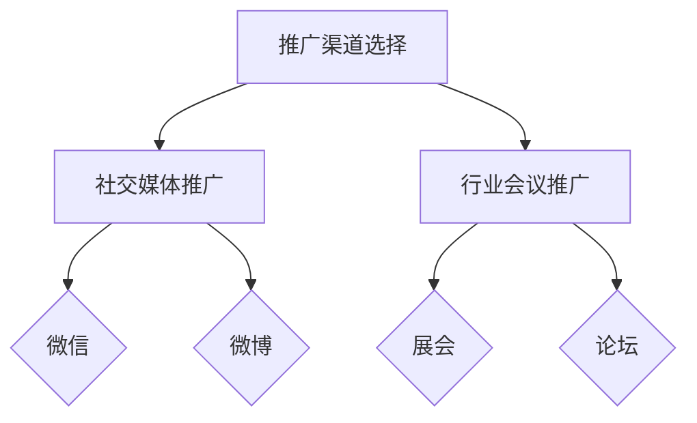
```mermaid
graph TD
A[推广渠道选择]
A --> B[社交媒体推广]
B --> C{微信}
B --> D{微博}
A --> E[行业会议推广]
E --> F{展会}
E --> G{论坛}
```

#### 8.3 推广活动策划

推广活动策划是创业公司实现品牌传播和用户增长的重要手段。主要从活动内容设计、活动效果分析等方面进行。

**Mermaid流程图：推广活动策划**

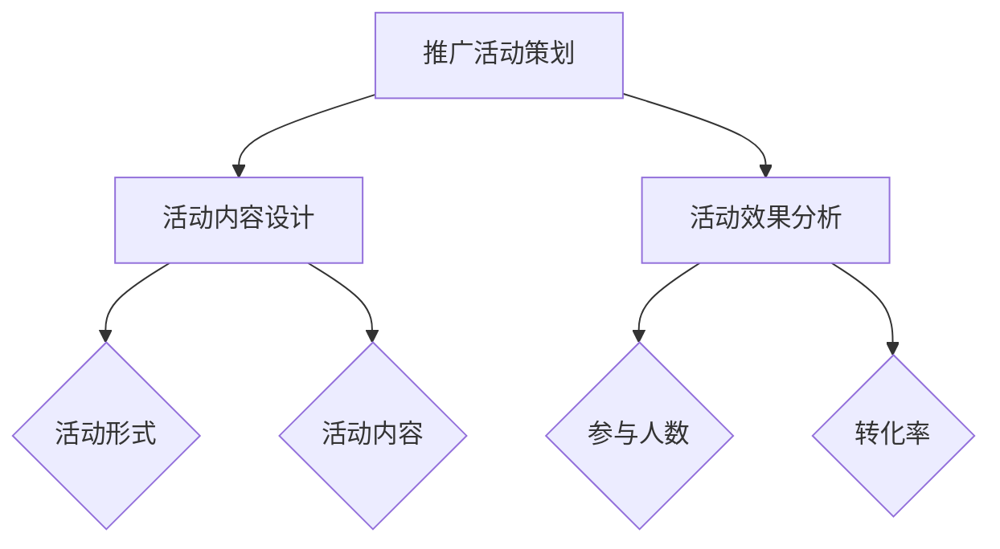
```mermaid
graph TD
A[推广活动策划]
A --> B[活动内容设计]
B --> C{活动形式}
B --> D{活动内容}
A --> E[活动效果分析]
E --> F{参与人数}
E --> G{转化率}
```

### 第9章：大模型创业公司的可持续发展

#### 9.1 持续创新策略

持续创新策略是创业公司保持市场竞争力的重要保障。主要从技术创新、产品创新等方面进行。

**Mermaid流程图：持续创新策略**

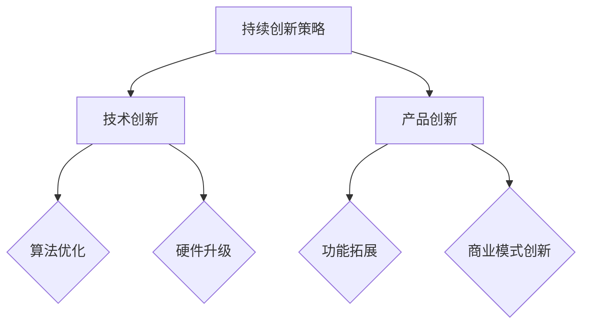
```mermaid
graph TD
A[持续创新策略]
A --> B[技术创新]
B --> C{算法优化}
B --> D{硬件升级}
A --> E[产品创新]
E --> F{功能拓展}
E --> G{商业模式创新}
```

#### 9.2 企业文化与团队成长

企业文化与团队成长是创业公司可持续发展的重要基础。主要从企业文化塑造、团队成长与激励等方面进行。

**Mermaid流程图：企业文化与团队成长**

```mermaid
graph TD
A[企业文化与团队成长]
A --> B[企业文化塑造]
B --> C{价值观传承}
B --> D{团队协作}
A --> E[团队成长与激励]
E --> F{培训与发展}
E --> G{激励制度}
```

## 附录

### 附录A：大模型相关资源与工具

附录A主要介绍大模型开发所需的相关资源与工具，包括开发环境搭建、主流深度学习框架、大模型开源项目等。

**A.1 开发环境搭建**

开发环境搭建是进行大模型开发的第一步，主要涉及硬件配置、软件安装和环境配置等方面。

**A.2 主流深度学习框架**

主流深度学习框架包括TensorFlow、PyTorch、Keras等，这些框架提供了丰富的API和工具，方便开发者进行模型开发和训练。

**A.3 大模型开源项目**

大模型开源项目是开发者学习和实践的重要资源，包括BERT、GPT、ImageNet等知名项目，开发者可以通过这些项目了解大模型的技术原理和实现方法。

### 作者

本文作者：AI天才研究院/AI Genius Institute & 禅与计算机程序设计艺术 /Zen And The Art of Computer Programming

本文从大模型的概念与价值、技术基础、创业公司运营、独立发布与推广等方面进行了深入探讨，旨在为创业者提供有价值的参考。文章结构清晰，逻辑严密，涵盖了从理论到实践的各个方面，有助于读者全面了解大模型创业公司的运营策略。

文章关键词：大模型、创业公司、独立发布、市场调研、产品设计、营销策略、资金管理

文章摘要：本文介绍了大模型创业公司的独立发布流程，包括市场调研、产品设计、营销策略、资金管理等方面。通过本文的探讨，读者可以了解大模型在企业中的应用价值，以及如何进行有效的市场调研、产品设计和营销推广，从而实现创业公司的可持续发展。文章还介绍了大模型的定义、分类和发展历程，以及深度学习基础、大模型训练方法、评估与优化等方面，为读者提供了全面的技术知识。最后，文章提出了持续创新策略和企业文化塑造等方面，为创业公司的长远发展提供了指导。

