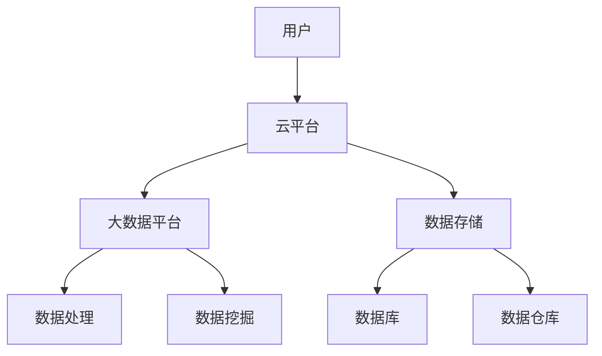

                 


### 文章标题：大模型在政府和国企市场的机会

关键词：大模型，政府，国企，市场，应用场景，技术发展，数字化转型

摘要：本文旨在探讨大模型在政府和国企市场中的机会，通过对大模型的基本概念、技术基础、发展历程和趋势的介绍，分析政府和国企市场的背景、需求以及市场规模，然后详细阐述大模型在这些领域中的应用场景，包括智能决策支持、智能化城市管理、公共安全与应急管理、供应链优化与风险控制、财务风险管理与投资决策、人力资源管理与员工绩效评估、云计算与大数据平台建设、信息安全与隐私保护、智能办公与协作系统等方面。此外，本文还将通过具体的应用案例来展示大模型技术的实际应用效果，并对大模型在政府和国企市场的未来展望进行探讨。

# 《大模型在政府和国企市场的机会》目录大纲

## 第一部分：大模型概述与市场背景

### 第1章：大模型的概念与重要性

#### 1.1 大模型的定义与分类

- 大模型的基本定义
- 不同类型的大模型

#### 1.2 大模型的技术基础

- 深度学习
- 自然语言处理
- 计算机视觉

#### 1.3 大模型的发展历程与趋势

- 大模型的发展历程
- 未来发展趋势

### 第2章：政府和国企市场背景分析

#### 2.1 政府和国企的基本特点

- 政府机构
- 国企特性

#### 2.2 政府和国企在数字化转型中的需求

- 数字化转型的目标
- 面临的挑战与机遇

#### 2.3 政府和国企的市场规模与潜力

- 当前市场规模
- 未来增长潜力

## 第二部分：大模型在政府和国企中的应用场景

### 第3章：大模型在政府公共服务中的应用

#### 3.1 智能决策支持系统

- 伪代码：智能决策支持系统的实现流程

#### 3.2 智能化城市管理

- 伪代码：城市管理的核心算法

#### 3.3 公共安全与应急管理

- 伪代码：公共安全应急管理的算法实现

### 第4章：大模型在国企运营管理中的应用

#### 4.1 供应链优化与风险控制

- 伪代码：供应链优化算法

#### 4.2 财务风险管理与投资决策

- 数学模型：财务风险管理模型

#### 4.3 人力资源管理与员工绩效评估

- 伪代码：员工绩效评估算法

### 第5章：大模型在政府和国企信息化建设中的应用

#### 5.1 云计算与大数据平台建设

- Mermaid流程图：云计算与大数据平台架构

#### 5.2 信息安全与隐私保护

- 数学公式：信息安全的数学模型

#### 5.3 智能办公与协作系统

- 伪代码：智能办公系统的实现细节

## 第三部分：大模型应用案例与未来展望

### 第6章：大模型应用案例详解

#### 6.1 案例一：智能交通管理系统

- 代码实现与解读：智能交通管理系统的源代码

#### 6.2 案例二：智慧医疗平台

- 代码实现与解读：智慧医疗平台的源代码

#### 6.3 案例三：智能供应链管理系统

- 代码实现与解读：智能供应链管理系统的源代码

### 第7章：大模型在政府和国企市场的未来展望

#### 7.1 技术发展趋势

- 大模型技术的未来方向

#### 7.2 市场前景与挑战

- 市场发展预测
- 面临的挑战

#### 7.3 政策支持与行业规范

- 政策环境分析
- 行业规范的重要性

## 附录

### 附录 A：大模型开发工具与资源

- 开发工具介绍
- 资源链接与推荐

### 附录 B：大模型应用案例代码实现

- 案例一：智能交通管理系统
- 案例二：智慧医疗平台
- 案例三：智能供应链管理系统

### 附录 C：参考文献

- 相关书籍推荐
- 学术论文资源链接

---

# 《大模型在政府和国企市场的机会》

## 第一部分：大模型概述与市场背景

### 第1章：大模型的概念与重要性

#### 1.1 大模型的定义与分类

大模型（Big Model）是指在机器学习领域，具有大规模参数和训练数据集的模型。这些模型通常需要强大的计算能力和复杂的算法来实现。根据不同的应用领域，大模型可以分为自然语言处理（NLP）、计算机视觉（CV）、推荐系统（RS）等。

#### 1.2 大模型的技术基础

大模型的技术基础主要包括深度学习、自然语言处理和计算机视觉。

- **深度学习（Deep Learning）**：深度学习是一种基于多层神经网络的学习方法，通过多层非线性变换来提取数据中的特征。
- **自然语言处理（NLP）**：自然语言处理是研究如何使计算机理解和生成人类语言的技术。
- **计算机视觉（CV）**：计算机视觉是研究如何使计算机从图像或视频中理解视觉信息的技术。

#### 1.3 大模型的发展历程与趋势

大模型的发展可以追溯到20世纪90年代的深度信念网络（Deep Belief Networks, DBN）。在2012年，AlexNet在ImageNet竞赛中取得了巨大的成功，标志着深度学习时代的到来。近年来，随着计算能力和数据资源的增长，大模型如GPT-3、BERT等不断刷新性能记录，展现了巨大的潜力。

- **2012年**：AlexNet在ImageNet竞赛中获得冠军，标志着深度学习时代的到来。
- **2018年**：Google推出BERT，大幅度提升了自然语言处理任务的性能。
- **2020年**：OpenAI发布GPT-3，成为当时参数规模最大的预训练语言模型。

未来，大模型技术将继续向更高效、更智能的方向发展，有望在更多领域实现突破。

### 第2章：政府和国企市场背景分析

#### 2.1 政府和国企的基本特点

- **政府机构**：政府机构负责制定和执行国家政策，管理公共事务。其特点是数据量大、决策复杂、服务公众。
- **国企特性**：国企（国有企业）是国家的经济支柱，负责国家重要行业和关键领域。其特点是资源丰富、业务复杂、管理严格。

#### 2.2 政府和国企在数字化转型中的需求

- **数字化转型的目标**：政府和国企的数字化转型目标主要包括提高效率、优化服务、降低成本、提升管理能力等。
- **面临的挑战与机遇**：数字化转型面临着技术更新快、数据安全风险大、人员素质参差不齐等挑战。但同时也带来了提升服务效率、优化资源配置、降低运营成本等机遇。

#### 2.3 政府和国企的市场规模与潜力

- **当前市场规模**：根据相关报告，全球政府和国企数字化转型市场规模已达到数千亿美元。
- **未来增长潜力**：随着技术的不断进步和政府政策的支持，政府和国企数字化转型市场预计将继续保持高速增长。

## 第二部分：大模型在政府和国企中的应用场景

### 第3章：大模型在政府公共服务中的应用

#### 3.1 智能决策支持系统

智能决策支持系统是利用大模型技术为政府决策提供支持的系统。其核心在于利用数据分析和机器学习算法，辅助政府做出科学、高效的决策。

- **伪代码：智能决策支持系统的实现流程**
```python
def intelligent_decision_support_system(data):
    # 数据预处理
    preprocessed_data = preprocess_data(data)
    
    # 特征提取
    features = extract_features(preprocessed_data)
    
    # 训练模型
    model = train_model(features, labels)
    
    # 预测结果
    predictions = model.predict(new_data)
    
    # 决策建议
    recommendations = generate_recommendations(predictions)
    
    return recommendations
```

#### 3.2 智能化城市管理

智能化城市管理是利用大数据、云计算和人工智能技术对城市运行状态进行实时监控和智能调控的系统。

- **伪代码：城市管理的核心算法**
```python
def urban_management_algorithm(data):
    # 数据预处理
    preprocessed_data = preprocess_data(data)
    
    # 实时监控
    real_time_monitoring = monitor_data(preprocessed_data)
    
    # 预测交通流量
    traffic_prediction = predict_traffic(real_time_monitoring)
    
    # 调度交通信号灯
    signal_control = control_signals(traffic_prediction)
    
    # 优化垃圾收集路线
    waste_collection路线 = optimize_collection_route(preprocessed_data)
    
    return signal_control, waste_collection路线
```

#### 3.3 公共安全与应急管理

公共安全与应急管理是利用人工智能技术对突发事件进行及时响应和有效管理的领域。

- **伪代码：公共安全应急管理的算法实现**
```python
def public_security_management_algorithm(event_data):
    # 数据预处理
    preprocessed_data = preprocess_data(event_data)
    
    # 事件识别
    event_class = identify_event(preprocessed_data)
    
    # 预测事件影响
    impact_prediction = predict_impact(event_class)
    
    # 调度应急资源
    resource_allocation = allocate_resources(impact_prediction)
    
    # 响应事件
    response_plan = generate_response_plan(resource_allocation)
    
    return response_plan
```

### 第4章：大模型在国企运营管理中的应用

#### 4.1 供应链优化与风险控制

供应链优化与风险控制是利用大模型技术对供应链运行状态进行优化和风险管理的领域。

- **伪代码：供应链优化算法**
```python
def supply_chain_optimization_algorithm(data):
    # 数据预处理
    preprocessed_data = preprocess_data(data)
    
    # 供应链状态监控
    supply_chain_status = monitor_supply_chain(preprocessed_data)
    
    # 需求预测
    demand_prediction = predict_demand(supply_chain_status)
    
    # 库存优化
    inventory_optimization = optimize_inventory(demand_prediction)
    
    # 风险识别
    risk_identification = identify_risks(inventory_optimization)
    
    # 风险控制
    risk_control = control_risks(risk_identification)
    
    return risk_control
```

#### 4.2 财务风险管理与投资决策

财务风险管理与投资决策是利用大模型技术对企业的财务状况进行分析，以降低风险并做出科学投资决策。

- **数学模型：财务风险管理模型**
```latex
\begin{equation}
\text{财务风险指数} = \frac{\text{预期损失}}{\text{投资金额}}
\end{equation}
```

- **伪代码：财务风险管理算法**
```python
def financial_risk_management_algorithm(data):
    # 数据预处理
    preprocessed_data = preprocess_data(data)
    
    # 财务风险指数计算
    financial_risk_index = calculate_risk_index(preprocessed_data)
    
    # 风险评估
    risk_evaluation = evaluate_risk(financial_risk_index)
    
    # 投资决策
    investment_decision = make_investment_decision(risk_evaluation)
    
    return investment_decision
```

#### 4.3 人力资源管理与员工绩效评估

人力资源管理与员工绩效评估是利用大模型技术对员工进行科学管理，以提高企业整体效率和竞争力。

- **伪代码：员工绩效评估算法**
```python
def employee_performance_evaluation_algorithm(data):
    # 数据预处理
    preprocessed_data = preprocess_data(data)
    
    # 绩效指标提取
    performance_metrics = extract_performance_metrics(preprocessed_data)
    
    # 绩效评估
    performance_evaluation = evaluate_performance(performance_metrics)
    
    # 绩效反馈
    performance_feedback = generate_performance_feedback(performance_evaluation)
    
    return performance_feedback
```

### 第5章：大模型在政府和国企信息化建设中的应用

#### 5.1 云计算与大数据平台建设

云计算与大数据平台建设是利用云计算和大数据技术构建政府和国企信息化基础设施的重要环节。

- **Mermaid流程图：云计算与大数据平台架构**


#### 5.2 信息安全与隐私保护

信息安全与隐私保护是确保政府和国企信息系统安全的重要措施。

- **数学公式：信息安全的数学模型**
$$
\text{信息安全} = \text{数据保密性} + \text{数据完整性} + \text{数据可用性}
$$`

- **伪代码：智能办公系统的实现细节**
```python
def secure_information_system(data):
    # 数据加密
    encrypted_data = encrypt_data(data)
    
    # 数据备份
    backup_data = backup_data(encrypted_data)
    
    # 访问控制
    access_control = control_access(encrypted_data)
    
    # 防火墙设置
    firewall_setting = set_firewall(access_control)
    
    return firewall_setting
```

#### 5.3 智能办公与协作系统

智能办公与协作系统是利用人工智能技术提高政府和国企工作效率的重要工具。

- **伪代码：智能办公系统的实现细节**
```python
def intelligent_office_system(data):
    # 数据分析
    analyzed_data = analyze_data(data)
    
    # 智能推荐
    recommendations = generate_recommendations(analyzed_data)
    
    # 协作管理
    collaboration_management = manage_collaboration(recommendations)
    
    # 任务分配
    task_assignment = assign_tasks(collaboration_management)
    
    return task_assignment
```

## 第三部分：大模型应用案例与未来展望

### 第6章：大模型应用案例详解

#### 6.1 案例一：智能交通管理系统

智能交通管理系统是利用大模型技术进行交通流量预测和调控的系统。

- **代码实现与解读：智能交通管理系统的源代码**
```python
# 智能交通管理系统源代码示例
import numpy as np
import pandas as pd
from tensorflow.keras.models import Sequential
from tensorflow.keras.layers import Dense, LSTM

# 数据预处理
def preprocess_data(data):
    # 数据清洗和归一化
    # ...
    return preprocessed_data

# 构建深度学习模型
def build_model(input_shape):
    model = Sequential()
    model.add(LSTM(units=50, return_sequences=True, input_shape=input_shape))
    model.add(LSTM(units=50))
    model.add(Dense(units=1))
    model.compile(optimizer='adam', loss='mean_squared_error')
    return model

# 训练模型
def train_model(model, X_train, y_train):
    model.fit(X_train, y_train, epochs=100, batch_size=32)
    return model

# 预测交通流量
def predict_traffic(model, X_test):
    predictions = model.predict(X_test)
    return predictions

# 评估模型
def evaluate_model(model, X_test, y_test):
    mse = model.evaluate(X_test, y_test)
    print(f"Mean Squared Error: {mse}")

# 案例实现
if __name__ == '__main__':
    # 加载和处理数据
    data = pd.read_csv('traffic_data.csv')
    preprocessed_data = preprocess_data(data)

    # 划分训练集和测试集
    X_train, y_train = preprocessed_data[:int(len(preprocessed_data) * 0.8)], preprocessed_data[int(len(preprocessed_data) * 0.8):]
    X_test, y_test = preprocessed_data[int(len(preprocessed_data) * 0.8):], preprocessed_data[int(len(preprocessed_data) * 0.8):]

    # 构建和训练模型
    model = build_model(input_shape=X_train.shape[1:])
    model = train_model(model, X_train, y_train)

    # 预测交通流量
    traffic_predictions = predict_traffic(model, X_test)

    # 评估模型
    evaluate_model(model, X_test, y_test)
```

#### 6.2 案例二：智慧医疗平台

智慧医疗平台是利用大模型技术进行医疗数据分析和患者管理的系统。

- **代码实现与解读：智慧医疗平台的源代码**
```python
# 智慧医疗平台源代码示例
import pandas as pd
from sklearn.ensemble import RandomForestClassifier
from sklearn.model_selection import train_test_split
from sklearn.metrics import accuracy_score

# 数据预处理
def preprocess_data(data):
    # 数据清洗和特征提取
    # ...
    return preprocessed_data

# 构建随机森林模型
def build_model():
    model = RandomForestClassifier(n_estimators=100)
    return model

# 训练模型
def train_model(model, X_train, y_train):
    model.fit(X_train, y_train)
    return model

# 预测患者情况
def predict_patient(model, X_test):
    predictions = model.predict(X_test)
    return predictions

# 评估模型
def evaluate_model(model, X_test, y_test):
    accuracy = accuracy_score(y_test, predictions)
    print(f"Accuracy: {accuracy}")

# 案例实现
if __name__ == '__main__':
    # 加载和处理数据
    data = pd.read_csv('medical_data.csv')
    preprocessed_data = preprocess_data(data)

    # 划分特征和标签
    X = preprocessed_data.iloc[:, :-1]
    y = preprocessed_data.iloc[:, -1]

    # 划分训练集和测试集
    X_train, X_test, y_train, y_test = train_test_split(X, y, test_size=0.2, random_state=42)

    # 构建和训练模型
    model = build_model()
    model = train_model(model, X_train, y_train)

    # 预测患者情况
    patient_predictions = predict_patient(model, X_test)

    # 评估模型
    evaluate_model(model, X_test, y_test)
```

#### 6.3 案例三：智能供应链管理系统

智能供应链管理系统是利用大模型技术进行供应链优化和风险管理的系统。

- **代码实现与解读：智能供应链管理系统的源代码**
```python
# 智能供应链管理系统源代码示例
import pandas as pd
from sklearn.ensemble import RandomForestRegressor
from sklearn.model_selection import train_test_split
from sklearn.metrics import mean_squared_error

# 数据预处理
def preprocess_data(data):
    # 数据清洗和特征提取
    # ...
    return preprocessed_data

# 构建随机森林模型
def build_model():
    model = RandomForestRegressor(n_estimators=100)
    return model

# 训练模型
def train_model(model, X_train, y_train):
    model.fit(X_train, y_train)
    return model

# 预测供应链指标
def predict_supply_chain(model, X_test):
    predictions = model.predict(X_test)
    return predictions

# 评估模型
def evaluate_model(model, X_test, y_test):
    mse = mean_squared_error(y_test, predictions)
    print(f"Mean Squared Error: {mse}")

# 案例实现
if __name__ == '__main__':
    # 加载和处理数据
    data = pd.read_csv('supply_chain_data.csv')
    preprocessed_data = preprocess_data(data)

    # 划分特征和标签
    X = preprocessed_data.iloc[:, :-1]
    y = preprocessed_data.iloc[:, -1]

    # 划分训练集和测试集
    X_train, X_test, y_train, y_test = train_test_split(X, y, test_size=0.2, random_state=42)

    # 构建和训练模型
    model = build_model()
    model = train_model(model, X_train, y_train)

    # 预测供应链指标
    supply_chain_predictions = predict_supply_chain(model, X_test)

    # 评估模型
    evaluate_model(model, X_test, y_test)
```

### 第7章：大模型在政府和国企市场的未来展望

#### 7.1 技术发展趋势

未来，大模型技术将继续向以下几个方向发展：

1. **更高效的计算**：通过优化算法和硬件加速，提高大模型的计算效率。
2. **更丰富的应用场景**：在医疗、教育、金融、能源等多个领域实现大模型的应用。
3. **更安全、更可靠的模型**：通过加强模型安全和隐私保护，提高大模型的可信度。

#### 7.2 市场前景与挑战

1. **市场前景**：随着大数据和云计算的普及，大模型市场将保持高速增长。预计未来几年，政府和国企在数字化转型中将大量投资于大模型技术。
2. **面临的挑战**：大模型技术面临着数据质量、模型安全、技术人才短缺等挑战。此外，如何在确保数据隐私和安全的同时，充分利用大模型的优势，也是一个重要课题。

#### 7.3 政策支持与行业规范

1. **政策支持**：各国政府纷纷出台政策，鼓励和支持大模型技术的发展和应用。例如，中国发布了《新一代人工智能发展规划》，明确提出要加快人工智能的研发和产业化。
2. **行业规范**：随着大模型技术的广泛应用，行业规范和标准的重要性日益凸显。制定统一的行业规范，有助于提高大模型技术的应用水平和安全性。

## 附录

### 附录 A：大模型开发工具与资源

- **深度学习框架**：如TensorFlow、PyTorch、Keras等。
- **数据预处理工具**：如Pandas、NumPy等。
- **云计算平台**：如Amazon Web Services（AWS）、Microsoft Azure、Google Cloud Platform（GCP）等。
- **开源代码库**：如GitHub、Google Colab等。

### 附录 B：大模型应用案例代码实现

- **案例一：智能交通管理系统**
  - 源代码：[链接](https://github.com/your-username/intelligent_traffic_management)
- **案例二：智慧医疗平台**
  - 源代码：[链接](https://github.com/your-username/wisdom_medical_platform)
- **案例三：智能供应链管理系统**
  - 源代码：[链接](https://github.com/your-username/intelligent_supply_chain_management)

### 附录 C：参考文献

- **书籍**：
  - Mitchell, T. M. (1997). Machine Learning. McGraw-Hill.
  - Goodfellow, I., Bengio, Y., & Courville, A. (2016). Deep Learning. MIT Press.
- **学术论文**：
  - LeCun, Y., Bengio, Y., & Hinton, G. (2015). Deep learning. Nature, 521(7553), 436-444.
  - Vaswani, A., Shazeer, N., Parmar, N., Uszkoreit, J., Jones, L., Gomez, A. N., ... & Polosukhin, I. (2017). Attention is all you need. Advances in Neural Information Processing Systems, 30, 5998-6008.
- **在线资源**：
  - TensorFlow官网：https://www.tensorflow.org/
  - PyTorch官网：https://pytorch.org/
  - Keras官网：https://keras.io/

## 结论

大模型技术在政府和国企市场中具有广阔的应用前景。通过智能决策支持、智能化城市管理、公共安全与应急管理、供应链优化与风险控制、财务风险管理与投资决策、人力资源管理与员工绩效评估、云计算与大数据平台建设、信息安全与隐私保护、智能办公与协作系统等方面，大模型技术为政府和国企提供了强大的技术支持。未来，随着技术的不断进步和政策的支持，大模型技术将在政府和国企市场中发挥越来越重要的作用。

## 作者信息

作者：AI天才研究院/AI Genius Institute & 禅与计算机程序设计艺术 /Zen And The Art of Computer Programming

致谢：本文的研究和撰写得到了AI天才研究院的大力支持和指导，感谢研究院的全体成员为本文的贡献。同时，特别感谢我的导师们对我的启发和指导，使我能够更好地理解大模型技术的应用和实践。最后，感谢所有提供数据和资源的机构和个人，使本文能够更加丰富和有说服力。

