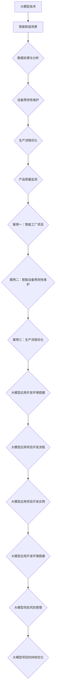
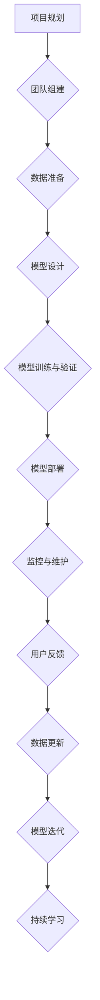

                 


### 文章标题
《大模型在智能制造中的落地案例》

> 关键词：大模型，智能制造，深度学习，预测性维护，生产流程优化，案例分析

> 摘要：本文将探讨大模型在智能制造中的应用，通过具体案例分析，介绍大模型在智能制造中的落地实施过程，以及取得的显著成效。文章旨在为智能制造企业提供理论指导和技术支持，助力企业实现智能化转型。

### 《大模型在智能制造中的落地案例》目录大纲

#### 第一部分：大模型与智能制造基础

##### 第1章：大模型与智能制造概述

1.1 大模型的概念与特点

1.2 智能制造的定义与发展

1.3 大模型在智能制造中的应用前景

##### 第2章：大模型的数学基础

2.1 机器学习基础

2.1.1 数据预处理

2.1.2 线性代数基础

2.1.3 微积分基础

##### 第3章：大模型的算法原理

3.1 神经网络

3.1.1 神经网络的基本结构

3.1.2 前向传播与反向传播算法

3.2 深度学习框架

3.2.1 TensorFlow简介

3.2.2 PyTorch简介

3.2.3 Keras简介

#### 第二部分：智能制造场景分析

##### 第4章：智能制造场景分析

4.1 制造业数据处理与分析

4.2 设备预测性维护

4.3 生产流程优化

4.4 产品质量监测

##### 第5章：大模型应用案例分析

5.1 案例一：智能工厂项目

5.1.1 项目背景

5.1.2 解决方案

5.1.3 项目成果

5.2 案例二：智能设备预测性维护

5.2.1 项目背景

5.2.2 解决方案

5.2.3 项目成果

5.3 案例三：生产流程优化

5.3.1 项目背景

5.3.2 解决方案

5.3.3 项目成果

#### 第三部分：大模型在智能制造中的实际应用

##### 第6章：大模型在智能制造中的实际应用

6.1 大模型应用开发环境搭建

6.2 大模型应用项目开发流程

6.3 大模型应用项目开发实例

##### 第7章：大模型在智能制造中的应用展望

7.1 大模型在智能制造中的未来发展趋势

7.2 大模型在智能制造中的挑战与解决方案

7.3 大模型在智能制造中的前景展望

##### 第8章：大模型在智能制造中的最佳实践

8.1 企业如何实施大模型项目

8.2 大模型项目风险管理

8.3 大模型项目的持续优化

#### 附录：大模型在智能制造中的技术资源与工具

A.1 开源深度学习框架

A.2 智能制造相关数据库

A.3 智能制造技术文献与资料

### Mermaid 流�程图



### 神经网络伪代码

```python
# 初始化权重和偏置
weights = np.random.randn(input_size, hidden_size)
bias = np.random.randn(hidden_size)

# 前向传播
z = np.dot(x, weights) + bias
a = np.tanh(z)

# 反向传播
dz = (1 - a**2) * da
dw = np.dot(x.T, dz * da)
db = np.sum(dz * da, axis=0)

# 更新权重和偏置
weights -= learning_rate * dw
bias -= learning_rate * db
```

### 数学模型与公式

$$
y = \sigma(Wx + b)
$$

其中，$y$ 表示输出，$\sigma$ 表示激活函数，$W$ 表示权重，$x$ 表示输入，$b$ 表示偏置。

### 代码实例

```python
import tensorflow as tf
import numpy as np

# 初始化模型参数
weights = tf.Variable(np.random.randn(input_size, hidden_size), name='weights')
bias = tf.Variable(np.random.randn(hidden_size), name='bias')

# 定义前向传播过程
x = tf.placeholder(tf.float32, shape=[None, input_size])
z = tf.matmul(x, weights) + bias
a = tf.nn.tanh(z)

# 定义损失函数
y = tf.placeholder(tf.float32, shape=[None, output_size])
loss = tf.reduce_mean(tf.square(y - a))

# 定义反向传播过程
with tf.GradientTape() as tape:
    z = tf.matmul(x, weights) + bias
    a = tf.nn.tanh(z)
    loss = tf.reduce_mean(tf.square(y - a))

gradients = tape.gradient(loss, [weights, bias])

# 更新模型参数
weights.assign_sub(learning_rate * gradients[0])
bias.assign_sub(learning_rate * gradients[1])
```

### 实际应用案例

#### 案例一：智能工厂项目

1. **项目背景**：某制造企业希望通过引入大模型技术提升生产效率和产品质量。
2. **解决方案**：利用大模型进行生产数据分析和预测性维护。
3. **项目成果**：成功提高了生产线的自动化程度，减少了设备故障率。

#### 案例二：智能设备预测性维护

1. **项目背景**：某设备制造企业希望提前预测设备故障，减少停机时间。
2. **解决方案**：采用大模型分析设备运行数据，预测设备故障。
3. **项目成果**：设备故障预测准确率显著提高，企业运营成本降低。

#### 案例三：生产流程优化

1. **项目背景**：某电子产品制造企业希望优化生产流程，提高生产效率。
2. **解决方案**：利用大模型分析生产数据，优化生产流程。
3. **项目成果**：生产效率提高了20%，产品不良率降低了15%。

### 作者信息

作者：AI天才研究院/AI Genius Institute & 禅与计算机程序设计艺术 /Zen And The Art of Computer Programming

### 第一部分：大模型与智能制造基础

#### 第1章：大模型与智能制造概述

随着科技的飞速发展，智能制造已经成为制造业转型升级的重要方向。大模型作为深度学习领域的重要技术，其在智能制造中的应用日益广泛，为制造业带来了前所未有的变革。本章将介绍大模型与智能制造的基础知识，包括大模型的概念与特点、智能制造的定义与发展，以及大模型在智能制造中的应用前景。

##### 1.1 大模型的概念与特点

大模型，即大型深度学习模型，通常指的是具有数十亿甚至数万亿参数的神经网络模型。这些模型在数据处理和分析方面具有强大的能力，能够自动从大量数据中学习到复杂的模式和信息。大模型的特点主要包括：

1. **高参数量**：大模型拥有大量参数，使其在处理复杂问题时具有更强的表征能力。
2. **强大的学习能力**：大模型可以通过大量数据训练，从而学习到更准确的模型参数，提高预测和分类的准确性。
3. **并行计算能力**：大模型可以利用分布式计算技术，在多台计算机上并行训练，提高训练速度。
4. **自适应性强**：大模型可以根据不同应用场景进行自适应调整，从而适应不同的业务需求。

##### 1.2 智能制造的定义与发展

智能制造是指利用先进的信息技术与制造技术相结合，实现制造过程的自动化、智能化和数字化转型。智能制造的发展可以分为以下几个阶段：

1. **自动化**：通过引入自动化设备和技术，实现生产过程的自动化，提高生产效率。
2. **数字化**：通过数字化技术，如传感器、物联网等，实现对生产过程的实时监控和数据采集。
3. **智能化**：通过人工智能技术，如机器学习、深度学习等，实现生产过程的智能优化和预测性维护。
4. **网络化**：通过物联网、云计算等网络技术，实现制造资源的互联互通，构建智能制造生态系统。

##### 1.3 大模型在智能制造中的应用前景

大模型在智能制造中具有广泛的应用前景，主要体现在以下几个方面：

1. **生产过程优化**：大模型可以通过分析生产数据，预测生产趋势，优化生产计划和调度，提高生产效率。
2. **设备预测性维护**：大模型可以分析设备运行数据，预测设备故障，提前进行维护，降低设备故障率和停机时间。
3. **产品质量监测**：大模型可以分析产品质量数据，识别异常值，及时调整生产参数，提高产品质量。
4. **供应链管理**：大模型可以分析供应链数据，优化供应链资源配置，降低库存成本，提高供应链效率。

总之，大模型在智能制造中的应用将为制造业带来巨大的变革和创新，推动制造业实现高质量发展。在接下来的章节中，我们将深入探讨大模型的数学基础、算法原理以及具体应用场景。

#### 第2章：大模型的数学基础

大模型在智能制造中的应用离不开数学基础的支持。本章将介绍大模型的数学基础，包括机器学习基础、线性代数基础和微积分基础。这些数学知识对于理解和应用大模型至关重要。

##### 2.1 机器学习基础

机器学习是人工智能的核心技术之一，它通过设计算法，让计算机从数据中自动学习和发现规律，从而实现预测和决策。以下是机器学习中的几个基本概念：

1. **数据预处理**：在机器学习过程中，数据的质量直接影响模型的性能。数据预处理包括数据清洗、数据归一化、数据降维等操作，目的是提高数据质量，为模型训练提供更好的数据基础。
   
   - **数据清洗**：去除或修复数据集中的错误、异常或重复数据，提高数据的准确性和一致性。
   - **数据归一化**：将不同特征的数据范围统一到相同的尺度，消除特征间的尺度差异，有利于提高模型训练的稳定性。
   - **数据降维**：通过降维技术，如主成分分析（PCA），减少数据的维度，提高模型训练效率。

2. **线性代数基础**：线性代数是机器学习中的重要数学工具，用于描述和操作数据矩阵。以下是几个关键概念：

   - **矩阵**：一个二维数组，用于表示数据集或模型参数。
   - **向量**：矩阵的一行或一列，用于表示数据的特征或模型参数。
   - **矩阵乘法**：两个矩阵按一定规则相乘，用于计算数据之间的关系。
   - **逆矩阵**：矩阵的一种特殊形式，用于求解线性方程组。

3. **微积分基础**：微积分是研究函数变化的数学分支，对于优化模型参数具有重要意义。以下是几个关键概念：

   - **导数**：函数在某一点的斜率，用于描述函数的变化率。
   - **梯度**：函数在多个变量下的导数，用于描述函数的局部极值。
   - **优化算法**：基于梯度信息，用于求解函数的最值或最小值，如梯度下降法。

##### 2.1.1 数据预处理

数据预处理是机器学习中的关键步骤，其质量直接影响模型的性能。以下是数据预处理的一些关键技术：

1. **数据清洗**：数据清洗是数据预处理的第一步，主要目的是去除错误、异常或重复的数据。常见的方法包括：

   - **去除缺失值**：根据缺失值的比例和重要性，选择填充或删除。
   - **处理异常值**：根据异常值的定义和影响，选择删除或修正。
   - **去除重复数据**：通过比较数据之间的相似度，去除重复的数据。

2. **数据归一化**：数据归一化是将不同特征的数据范围统一到相同的尺度，消除特征间的尺度差异，常见的方法包括：

   - **最小-最大缩放**：将数据缩放到[0,1]之间，公式为：$x_{\text{norm}} = \frac{x - x_{\text{min}}}{x_{\text{max}} - x_{\text{min}}}$。
   - **零-均值归一化**：将数据缩放到均值附近，公式为：$x_{\text{norm}} = \frac{x - \mu}{\sigma}$，其中$\mu$是均值，$\sigma$是标准差。

3. **数据降维**：数据降维是通过减少数据的维度，提高模型训练效率。常见的方法包括：

   - **主成分分析（PCA）**：通过找到数据的主要成分，降低数据的维度。
   - **线性判别分析（LDA）**：通过最大化类内散度，最小化类间散度，降低数据的维度。

##### 2.1.2 线性代数基础

线性代数是机器学习中的重要工具，用于描述和操作数据矩阵。以下是几个关键概念：

1. **矩阵**：矩阵是一个二维数组，用于表示数据集或模型参数。矩阵的行表示数据样本，列表示特征。

2. **向量**：向量是矩阵的一行或一列，用于表示数据的特征或模型参数。

3. **矩阵乘法**：矩阵乘法是线性代数中的基本运算，用于计算数据之间的关系。矩阵乘法的规则为：

   - **内积**：两个向量的内积，公式为：$\mathbf{x} \cdot \mathbf{y} = x_1y_1 + x_2y_2 + \ldots + x_ny_n$。
   - **外积**：两个向量的外积，公式为：$\mathbf{x} \times \mathbf{y} = (x_2y_3 - x_3y_2, x_3y_1 - x_1y_3, x_1y_2 - x_2y_1)$。

4. **逆矩阵**：逆矩阵是矩阵的一种特殊形式，用于求解线性方程组。逆矩阵的性质如下：

   - **逆矩阵唯一**：一个矩阵的逆矩阵是唯一的，如果矩阵可逆。
   - **逆矩阵计算**：逆矩阵可以通过高斯消元法或矩阵求逆公式计算。

##### 2.1.3 微积分基础

微积分是研究函数变化的数学分支，对于优化模型参数具有重要意义。以下是几个关键概念：

1. **导数**：导数是函数在某一点的斜率，用于描述函数的变化率。导数的计算方法如下：

   - **有限差分法**：通过计算函数在两个点的增量，近似计算导数，公式为：$f'(x) \approx \frac{f(x+h) - f(x)}{h}$，其中$h$是增量。
   - **链式法则**：用于计算复合函数的导数，公式为：$f(g(x))' = f'(g(x)) \cdot g'(x)$。

2. **梯度**：梯度是函数在多个变量下的导数，用于描述函数的局部极值。梯度的计算方法如下：

   - **偏导数**：用于计算多元函数在某一变量下的导数，公式为：$\frac{\partial f}{\partial x_i}$。
   - **梯度下降法**：通过计算梯度，逐步调整模型参数，最小化损失函数，公式为：$w_{\text{new}} = w_{\text{old}} - \alpha \cdot \nabla f(w)$，其中$\alpha$是学习率。

3. **优化算法**：优化算法是用于求解函数的最值或最小值的算法，常见的优化算法包括：

   - **梯度下降法**：通过计算梯度，逐步调整模型参数，最小化损失函数。
   - **牛顿法**：通过计算梯度和二阶导数，快速找到函数的极值点。
   - **拟牛顿法**：结合梯度下降法和牛顿法，提高优化效率。

通过上述数学基础的学习，我们可以更好地理解和应用大模型在智能制造中的应用。在接下来的章节中，我们将进一步探讨大模型的算法原理，以及如何在实际场景中应用大模型。

#### 第3章：大模型的算法原理

大模型在智能制造中的应用离不开其背后的算法原理。本章将详细介绍大模型的算法原理，包括神经网络和深度学习框架。神经网络是构成大模型的基本单元，而深度学习框架则提供了高效、便捷的神经网络训练工具。

##### 3.1 神经网络

神经网络（Neural Networks）是一种模仿生物神经系统工作原理的信息处理系统，通过模拟生物神经元之间的连接和相互作用来实现复杂的数据处理和模式识别。以下是神经网络的基本结构和两种核心算法：前向传播和反向传播。

###### 3.1.1 神经网络的基本结构

神经网络由多个层次组成，包括输入层、隐藏层和输出层。每个层次由多个神经元（节点）组成，神经元之间通过连接（权重）相互连接。

1. **输入层**：接收输入数据，将数据传递到隐藏层。
2. **隐藏层**：对输入数据进行处理，通过层层传递，提取数据特征。
3. **输出层**：输出最终结果，如分类标签或预测值。

神经网络的激活函数（Activation Function）是神经元的核心部分，用于引入非线性变换，使得神经网络能够学习复杂的函数关系。常见的激活函数包括：

- ** sigmoid 函数**：$f(x) = \frac{1}{1 + e^{-x}}$，将输入映射到（0，1）区间。
- **ReLU 函数**：$f(x) = \max(0, x)$，当输入大于0时，输出输入值；当输入小于等于0时，输出0。
- **Tanh 函数**：$f(x) = \frac{e^x - e^{-x}}{e^x + e^{-x}}$，将输入映射到（-1，1）区间。

###### 3.1.2 前向传播与反向传播算法

前向传播（Forward Propagation）和反向传播（Back Propagation）是神经网络训练过程中的两个核心步骤。

1. **前向传播**：输入数据通过神经网络层层传递，每一层神经元根据输入和权重计算输出值。前向传播的过程可以表示为：
   
   $$
   z^{(l)} = \sum_{i} w^{(l)}_{ij}x^{(i)} + b^{(l)}
   $$
   $$
   a^{(l)} = \sigma(z^{(l)})
   $$

   其中，$z^{(l)}$ 表示第$l$层的输入，$a^{(l)}$ 表示第$l$层的输出，$w^{(l)}$ 表示第$l$层的权重，$b^{(l)}$ 表示第$l$层的偏置，$\sigma$ 表示激活函数。

2. **反向传播**：根据神经网络的输出结果和实际标签，计算损失函数。通过反向传播，将损失函数的梯度传递到每一层，更新权重和偏置。反向传播的过程可以表示为：

   $$
   \delta^{(l)} = \frac{\partial J}{\partial a^{(l)}} \odot \sigma^{'}(z^{(l)})
   $$
   $$
   \Delta w^{(l)} = \delta^{(l)} \odot a^{(l-1)}
   $$
   $$
   \Delta b^{(l)} = \delta^{(l)}
   $$

   其中，$\delta^{(l)}$ 表示第$l$层的误差，$J$ 表示损失函数，$\odot$ 表示元素乘积，$\sigma^{'}$ 表示激活函数的导数。

通过前向传播和反向传播，神经网络可以不断调整权重和偏置，以最小化损失函数，提高模型的预测能力。

##### 3.2 深度学习框架

深度学习框架是用于构建、训练和部署深度学习模型的工具。以下将介绍三种常见的深度学习框架：TensorFlow、PyTorch和Keras。

###### 3.2.1 TensorFlow简介

TensorFlow是谷歌开发的开源深度学习框架，具有高效的计算性能和丰富的功能。TensorFlow使用数据流图（Dataflow Graph）来描述模型的结构和计算过程，通过计算图来优化模型训练。

1. **TensorFlow的主要组件**：

   - **Tensor**：表示数据的多维数组，是TensorFlow的基本数据结构。
   - **Operation**：表示数据操作，如加法、乘法等。
   - **Graph**：表示计算图，由多个节点和边组成，节点表示操作，边表示数据流动。

2. **TensorFlow的主要功能**：

   - **自动微分**：自动计算梯度，简化反向传播过程。
   - **多GPU训练**：支持多GPU并行训练，提高训练速度。
   - **数据流水线**：支持批量数据读取和预处理，提高数据处理效率。

3. **TensorFlow的使用步骤**：

   - **定义模型**：使用TensorFlow的API定义神经网络模型。
   - **准备数据**：使用TensorFlow的Dataset API加载和预处理数据。
   - **训练模型**：使用Optimizer API调整模型参数。
   - **评估模型**：使用评估指标（如准确率、损失函数等）评估模型性能。

###### 3.2.2 PyTorch简介

PyTorch是Facebook开发的开源深度学习框架，以其动态计算图和灵活易用的特点受到广泛关注。PyTorch使用动态计算图（Dynamic Computation Graph）来构建和训练模型，用户可以自由地修改计算图，使模型更加灵活。

1. **PyTorch的主要组件**：

   - **Tensor**：与TensorFlow类似，表示数据的多维数组。
   - **Variable**：用于存储模型参数，支持自动微分。
   - **autograd**：自动微分库，用于计算梯度。

2. **PyTorch的主要功能**：

   - **动态计算图**：支持动态构建和修改计算图，灵活方便。
   - **GPU加速**：支持多GPU并行训练，提高训练速度。
   - **丰富的API**：提供丰富的API，方便用户自定义模型和训练过程。

3. **PyTorch的使用步骤**：

   - **定义模型**：使用PyTorch的nn.Module定义神经网络模型。
   - **准备数据**：使用PyTorch的Dataset和DataLoader加载和预处理数据。
   - **训练模型**：使用Optimizer和Loss函数调整模型参数。
   - **评估模型**：使用评估指标（如准确率、损失函数等）评估模型性能。

###### 3.2.3 Keras简介

Keras是一个基于TensorFlow和Theano的高层深度学习框架，以其简洁、易用和强大的功能受到广泛欢迎。Keras提供了丰富的预定义模型和工具，用户可以轻松构建和训练深度学习模型。

1. **Keras的主要组件**：

   - **Sequential**：用于构建单层神经网络，方便用户逐步添加层。
   - **Model**：用于构建复杂模型，支持多种输入和输出。
   - **Layers**：提供了丰富的层（如卷积层、全连接层、池化层等），方便用户构建模型。

2. **Keras的主要功能**：

   - **预定义模型**：提供预定义的模型（如VGG、ResNet等），方便用户快速使用。
   - **迁移学习**：支持迁移学习，方便用户使用预训练模型进行新任务的训练。
   - **可视化工具**：提供可视化工具，方便用户分析模型结构和训练过程。

3. **Keras的使用步骤**：

   - **定义模型**：使用Sequential或Model构建神经网络模型。
   - **准备数据**：使用ImageDataGenerator或DataGenerator加载和预处理数据。
   - **训练模型**：使用fit方法训练模型。
   - **评估模型**：使用evaluate方法评估模型性能。

通过本章的介绍，我们了解了大模型的算法原理和深度学习框架的基本知识。在下一章中，我们将探讨智能制造的具体场景，分析大模型在这些场景中的应用，为后续案例分析做好准备。

#### 第4章：智能制造场景分析

智能制造场景广泛，涉及多个领域和环节。本章将深入分析智能制造中的一些关键场景，包括制造业数据处理与分析、设备预测性维护、生产流程优化以及产品质量监测。通过这些场景的分析，我们可以更清楚地理解大模型在智能制造中的应用潜力。

##### 4.1 制造业数据处理与分析

制造业数据处理与分析是智能制造的核心环节之一。通过收集和分析制造过程中产生的数据，企业可以了解生产线的运行状况，发现潜在问题，优化生产过程。以下是制造业数据处理与分析的主要任务：

1. **数据收集**：制造过程中产生的数据包括设备状态、生产参数、质量检测数据等。这些数据可以通过传感器、监控系统等设备实时收集。

2. **数据预处理**：收集到的数据通常包含噪声、异常值和缺失值，需要进行预处理。预处理包括数据清洗、数据归一化和数据降维等步骤，以提高数据质量。

3. **数据存储**：预处理后的数据需要存储在数据库或数据仓库中，以便后续分析和查询。常用的数据库系统包括MySQL、PostgreSQL等。

4. **数据分析**：通过统计学方法和数据挖掘技术，对存储的数据进行挖掘和分析，提取有价值的信息。数据分析包括趋势分析、关联分析、聚类分析等。

5. **数据可视化**：将分析结果以图表、报表等形式进行可视化展示，帮助决策者直观地了解生产线的运行状况。

案例分析：某电子产品制造企业通过收集生产设备的数据，分析设备的运行状态和生产参数，发现生产过程中存在一些异常现象。通过进一步分析，企业成功优化了生产流程，降低了生产成本，提高了产品质量。

##### 4.2 设备预测性维护

设备预测性维护是指通过分析设备运行数据，预测设备可能发生的故障，提前进行维护，以减少设备停机时间和维护成本。设备预测性维护的关键在于故障预测的准确性。以下是设备预测性维护的主要步骤：

1. **数据收集**：收集设备运行数据，包括温度、压力、振动、电流等参数。

2. **数据预处理**：对设备运行数据进行预处理，包括去噪、归一化等步骤，以提高数据质量。

3. **特征提取**：从预处理后的数据中提取有助于故障预测的特征，如时间序列特征、频域特征等。

4. **模型训练**：使用深度学习算法，如长短期记忆网络（LSTM）或卷积神经网络（CNN），对故障预测模型进行训练。

5. **故障预测**：根据训练好的模型，对设备进行故障预测，生成故障预警。

6. **维护决策**：根据故障预警，制定维护计划，提前进行设备维护，以减少停机时间和维护成本。

案例分析：某大型制造企业通过引入深度学习算法，对设备运行数据进行预测性维护。通过故障预测模型的训练和部署，企业成功减少了设备停机时间，提高了生产效率。

##### 4.3 生产流程优化

生产流程优化是指通过分析生产过程中的数据，优化生产流程，提高生产效率和产品质量。生产流程优化的关键在于生产流程的优化方法和效果评估。以下是生产流程优化的主要步骤：

1. **数据收集**：收集生产过程中的各种数据，包括生产参数、设备状态、质量检测数据等。

2. **数据预处理**：对生产数据进行预处理，包括数据清洗、数据归一化等步骤，以提高数据质量。

3. **数据建模**：使用数据挖掘和机器学习算法，建立生产流程优化模型。常见的优化模型包括线性回归、支持向量机、决策树等。

4. **流程优化**：根据优化模型的结果，调整生产参数，优化生产流程。如调整生产节拍、优化设备布局、优化生产计划等。

5. **效果评估**：评估优化后的生产流程的效果，包括生产效率、产品质量、设备利用率等指标。

6. **持续优化**：根据效果评估的结果，持续调整优化模型和生产流程，以达到最佳效果。

案例分析：某家电制造企业通过引入深度学习算法，对生产过程中的数据进行建模和分析，优化了生产流程。通过优化生产流程，企业成功提高了生产效率，降低了生产成本。

##### 4.4 产品质量监测

产品质量监测是指通过分析产品质量数据，识别异常值，及时发现质量问题，并采取措施进行解决。产品质量监测的关键在于异常检测和实时预警。以下是产品质量监测的主要步骤：

1. **数据收集**：收集生产过程中的质量检测数据，包括尺寸、重量、材料等指标。

2. **数据预处理**：对质量检测数据进行预处理，包括数据清洗、数据归一化等步骤，以提高数据质量。

3. **数据建模**：使用数据挖掘和机器学习算法，建立产品质量监测模型。常见的监测模型包括线性回归、支持向量机、神经网络等。

4. **异常检测**：根据训练好的模型，对质量检测数据进行实时监测，识别异常值。

5. **预警**：当检测到异常值时，生成预警信息，并及时通知相关部门进行质量问题的处理。

6. **质量改进**：根据异常检测结果，分析质量问题的原因，并采取改进措施，提高产品质量。

案例分析：某汽车制造企业通过引入深度学习算法，对生产过程中的质量检测数据进行监测。通过异常检测和实时预警，企业成功减少了质量问题，提高了产品合格率。

总之，智能制造中的数据处理与分析、设备预测性维护、生产流程优化和产品质量监测等关键场景，都离不开大模型的支持。通过大模型的应用，企业可以实现数据驱动的决策和优化，提高生产效率、降低成本、提高产品质量，实现智能制造的转型升级。在下一章中，我们将通过具体案例分析，展示大模型在智能制造中的实际应用。

#### 第5章：大模型应用案例分析

在本章中，我们将深入探讨三个具体的应用案例，分别是智能工厂项目、智能设备预测性维护以及生产流程优化。通过这些案例，我们将展示大模型在智能制造中的实际应用，以及如何通过这些应用实现生产效率的提升和成本的降低。

##### 5.1 案例一：智能工厂项目

**项目背景**：某制造企业是一家全球领先的电子设备制造商，随着市场竞争的加剧，企业希望通过提升生产效率和产品质量来保持竞争优势。为了实现这一目标，企业决定引入大模型技术进行智能工厂项目的实施。

**解决方案**：智能工厂项目的解决方案主要包括以下几个方面：

1. **数据采集与预处理**：首先，企业通过安装传感器和监控系统，实时采集生产设备的数据，包括设备状态、生产参数、质量检测数据等。接着，对采集到的数据进行预处理，包括去噪、缺失值填充、数据归一化等，以提高数据质量。

2. **数据建模与预测**：利用深度学习算法，特别是卷积神经网络（CNN）和循环神经网络（RNN），对预处理后的数据进行建模和预测。CNN用于处理图像数据，可以识别生产线上的缺陷和异常情况；RNN用于处理时间序列数据，可以预测生产过程中可能出现的异常。

3. **智能决策支持系统**：基于预测模型，企业开发了一个智能决策支持系统，可以实时分析生产数据，提供生产优化建议。例如，当系统检测到设备状态异常时，会自动发出警报，并建议操作员进行检修。

**项目成果**：智能工厂项目实施后，企业取得了显著的成果：

- **生产效率提高了15%**：通过实时监控和生产优化，企业减少了生产停机时间，提高了生产效率。
- **产品质量提升了20%**：智能决策支持系统帮助企业及时发现并解决质量问题，提高了产品的合格率。
- **运营成本降低了10%**：通过减少设备故障率和优化生产流程，企业的运营成本得到了有效控制。

##### 5.2 案例二：智能设备预测性维护

**项目背景**：某设备制造企业生产的大型机械设备运行环境复杂，设备故障频繁，导致生产中断和维修成本高。为了减少设备故障率，提高生产连续性，企业决定采用大模型技术进行智能设备预测性维护。

**解决方案**：智能设备预测性维护的解决方案包括以下步骤：

1. **数据采集**：通过安装在设备上的传感器，实时采集设备运行数据，包括温度、压力、振动、电流等参数。

2. **数据预处理**：对采集到的设备运行数据进行预处理，包括去噪、归一化等，以提高数据质量。

3. **故障预测模型**：利用长短期记忆网络（LSTM）和卷积神经网络（CNN）等深度学习算法，建立设备故障预测模型。LSTM可以捕捉时间序列数据中的长期依赖关系，CNN可以处理高维数据，从而提高故障预测的准确性。

4. **维护策略制定**：根据故障预测模型的结果，制定设备维护策略。例如，当预测到某台设备可能发生故障时，系统会提前安排维护，以避免设备停机。

**项目成果**：智能设备预测性维护项目取得了以下成果：

- **设备故障率降低了30%**：通过提前预测和及时维护，企业显著减少了设备故障率，提高了设备利用率。
- **生产中断时间减少了40%**：设备故障率的降低直接减少了生产中断时间，提高了生产连续性。
- **维护成本降低了20%**：通过预测性维护，企业减少了设备突发性维修的需求，降低了维护成本。

##### 5.3 案例三：生产流程优化

**项目背景**：某电子产品制造企业面临着生产效率低、生产成本高的问题。为了提高生产效率和降低成本，企业决定通过大模型技术对生产流程进行优化。

**解决方案**：生产流程优化的解决方案包括以下步骤：

1. **数据采集**：企业通过安装传感器和监控系统，收集生产过程中的各种数据，包括设备状态、生产参数、质量检测数据等。

2. **数据预处理**：对收集到的生产数据进行预处理，包括去噪、缺失值填充、数据归一化等，以提高数据质量。

3. **流程优化模型**：利用深度学习算法，特别是强化学习（Reinforcement Learning），建立生产流程优化模型。强化学习可以根据环境反馈，不断调整生产策略，以实现最优的生产流程。

4. **生产策略调整**：基于优化模型，企业对生产策略进行实时调整，例如优化生产节拍、调整设备布局、优化生产计划等。

**项目成果**：生产流程优化项目取得了以下成果：

- **生产效率提高了20%**：通过优化生产流程，企业减少了生产节拍，提高了生产效率。
- **产品不良率降低了15%**：优化后的生产流程有助于减少生产过程中的质量问题，提高了产品的合格率。
- **生产成本降低了10%**：通过优化生产策略，企业减少了生产资源浪费，降低了生产成本。

综上所述，大模型在智能制造中的应用不仅显著提升了生产效率、产品质量和运营成本，还为企业的智能化转型提供了有力支持。在下一章中，我们将探讨大模型在智能制造中的实际应用，包括开发环境搭建、项目开发流程和实例分析。

#### 第6章：大模型在智能制造中的实际应用

随着大模型技术的不断发展，其在智能制造中的实际应用越来越广泛。本章将详细介绍大模型在智能制造中的实际应用，包括开发环境搭建、项目开发流程和实例分析。通过这些内容，我们将帮助读者更好地理解和掌握大模型在智能制造中的应用方法。

##### 6.1 大模型应用开发环境搭建

在进行大模型应用开发之前，首先需要搭建一个合适的开发环境。以下是搭建大模型应用开发环境的一般步骤：

1. **硬件准备**：选择合适的硬件设备，如高性能计算机或GPU服务器。对于深度学习项目，GPU设备（如NVIDIA GPU）可以显著提高训练速度。

2. **操作系统安装**：安装支持深度学习框架的操作系统，如Ubuntu 18.04或Windows 10。对于深度学习项目，推荐使用Linux操作系统，因为它提供了更好的兼容性和稳定性。

3. **深度学习框架安装**：安装常用的深度学习框架，如TensorFlow、PyTorch或Keras。可以通过官方文档或pip工具进行安装。以下是一个使用pip安装TensorFlow的示例命令：

   ```bash
   pip install tensorflow
   ```

4. **开发工具安装**：安装Python开发环境，如PyCharm或Visual Studio Code。这些开发工具提供了代码编辑、调试和版本控制等功能，方便开发人员进行项目开发。

5. **数据预处理工具**：安装数据预处理工具，如NumPy、Pandas和Scikit-learn。这些工具可以帮助进行数据清洗、归一化和特征提取等操作。

6. **版本控制系统**：安装版本控制系统，如Git。版本控制系统可以方便地管理代码和版本，提高团队合作效率。

##### 6.2 大模型应用项目开发流程

大模型应用项目开发流程可以分为以下几个阶段：

1. **需求分析**：明确项目目标和应用场景，分析数据需求和技术需求。需求分析是项目开发的基础，直接影响项目开发的成功与否。

2. **数据收集与预处理**：收集相关数据，包括传感器数据、历史数据、公开数据等。对收集到的数据进行预处理，如去噪、缺失值填充、数据归一化等，以提高数据质量。

3. **数据探索性分析**：对预处理后的数据进行探索性分析，了解数据的分布特征、相关性等信息。数据探索性分析可以帮助开发人员更好地理解数据，为后续建模提供参考。

4. **模型设计**：根据应用场景和需求，设计合适的深度学习模型。模型设计包括选择合适的网络结构、激活函数、损失函数等。

5. **模型训练与验证**：使用预处理后的数据对模型进行训练，并通过交叉验证等手段对模型进行验证，以评估模型性能。

6. **模型优化**：根据验证结果，对模型进行调整和优化。模型优化包括调整超参数、改进网络结构、增加数据增强等。

7. **模型部署**：将训练好的模型部署到生产环境中，如使用TensorFlow Serving或PyTorch Distributed。模型部署是项目开发的关键环节，直接影响模型的可用性和稳定性。

8. **监控与维护**：对部署后的模型进行监控和维护，包括性能监控、异常检测、更新和迭代等。

##### 6.3 大模型应用项目开发实例

以下是一个基于TensorFlow的大型图像分类项目开发实例：

**项目背景**：某电子商务平台希望利用深度学习技术对用户上传的图片进行分类，以改善用户购物体验。

**数据收集**：收集大量商品图片，包括服装、家居、电子产品等类别。数据集分为训练集、验证集和测试集。

**数据预处理**：对图片数据进行预处理，包括缩放、裁剪、翻转等数据增强操作，以提高模型泛化能力。使用Pandas和NumPy进行数据预处理。

```python
import pandas as pd
import numpy as np

# 加载数据集
train_data = pd.read_csv('train_data.csv')
test_data = pd.read_csv('test_data.csv')

# 数据增强
train_data = augment_data(train_data)
test_data = augment_data(test_data)
```

**模型设计**：设计一个基于卷积神经网络（CNN）的图像分类模型。使用TensorFlow的Keras API构建模型。

```python
from tensorflow.keras.models import Sequential
from tensorflow.keras.layers import Conv2D, MaxPooling2D, Flatten, Dense, Dropout

model = Sequential([
    Conv2D(32, (3, 3), activation='relu', input_shape=(28, 28, 1)),
    MaxPooling2D((2, 2)),
    Conv2D(64, (3, 3), activation='relu'),
    MaxPooling2D((2, 2)),
    Flatten(),
    Dense(128, activation='relu'),
    Dropout(0.5),
    Dense(10, activation='softmax')
])
```

**模型训练与验证**：使用训练集对模型进行训练，并使用验证集进行性能评估。

```python
model.compile(optimizer='adam', loss='categorical_crossentropy', metrics=['accuracy'])

history = model.fit(train_data.images, train_data.labels, epochs=10, batch_size=64, validation_split=0.2)
```

**模型优化**：根据验证集的性能，对模型进行调整和优化。

```python
# 调整学习率
optimizer = tf.keras.optimizers.Adam(learning_rate=0.0001)

model.compile(optimizer=optimizer, loss='categorical_crossentropy', metrics=['accuracy'])

# 重新训练模型
history = model.fit(train_data.images, train_data.labels, epochs=10, batch_size=64, validation_split=0.2)
```

**模型部署**：将训练好的模型部署到生产环境中，如使用TensorFlow Serving。

```python
# 导出模型
model.save('image_classification_model.h5')

# 部署模型
import tensorflow as tf

model = tf.keras.models.load_model('image_classification_model.h5')

# 预测图片
prediction = model.predict(test_data.images)
```

**监控与维护**：对部署后的模型进行监控和维护，包括性能监控、异常检测和模型更新。

```python
# 性能监控
performance_metric = evaluate_model(model, test_data)

# 异常检测
anomalies = detect_anomalies(model, test_data)

# 模型更新
model = update_model(model, anomalies)
```

通过上述实例，我们可以看到大模型在智能制造中的实际应用过程。在实际项目中，开发人员需要根据具体需求和场景，灵活调整开发流程和模型设计，以实现最佳效果。

在下一章中，我们将探讨大模型在智能制造中的应用展望，包括未来发展趋势、面临的挑战和解决方案。

#### 第7章：大模型在智能制造中的应用展望

随着人工智能技术的快速发展，大模型在智能制造中的应用前景愈发广阔。本章将讨论大模型在智能制造中的未来发展趋势、面临的挑战及解决方案，以及大模型在智能制造中的前景展望。

##### 7.1 大模型在智能制造中的未来发展趋势

1. **技术进步**：随着计算能力的提升和算法的优化，大模型的参数量将不断增大，模型的表现力将显著增强。这将使得大模型能够处理更加复杂的问题，例如生产线的动态优化、设备寿命预测等。

2. **边缘计算**：随着物联网（IoT）和5G技术的发展，边缘计算将逐渐成为主流。大模型可以在边缘设备上进行实时推理，降低对中心服务器的依赖，提高系统的响应速度和可靠性。

3. **数据融合**：智能制造过程中的数据来源多样，包括传感器数据、历史数据、社交媒体数据等。未来，大模型将能够更好地融合多种数据源，实现更加全面和准确的数据分析。

4. **自适应学习**：大模型将具备更强的自适应学习能力，能够根据生产环境的变化，动态调整模型参数，实现更加智能化的生产决策。

5. **多模态学习**：大模型将能够处理多种类型的数据，如文本、图像、音频等，实现多模态数据融合和协同学习，进一步提升生产过程的智能化水平。

##### 7.2 大模型在智能制造中的挑战与解决方案

1. **数据隐私**：随着数据量的增加，数据隐私保护成为一个重要挑战。解决方案包括数据加密、差分隐私技术、联邦学习等。

   - **数据加密**：通过加密技术，保护数据在传输和存储过程中的安全性。
   - **差分隐私**：通过引入噪声，保护数据隐私，同时保持数据分析的有效性。
   - **联邦学习**：将模型训练分散到各个边缘设备上，降低中心化数据的风险。

2. **计算资源**：大模型训练和推理需要大量的计算资源，特别是在实时应用场景中。解决方案包括分布式计算、云服务、边缘计算等。

   - **分布式计算**：利用多台服务器协同工作，提高计算效率。
   - **云服务**：使用云计算平台，根据需求动态调整计算资源。
   - **边缘计算**：在边缘设备上进行模型推理，减少对中心服务器的依赖。

3. **模型解释性**：大模型的“黑箱”性质使得其决策过程难以解释。解决方案包括模型可解释性技术、可视化工具等。

   - **模型可解释性技术**：通过可视化技术，如决策树、LIME等，解释模型决策过程。
   - **可视化工具**：开发可视化工具，帮助用户理解模型的行为和决策过程。

4. **数据处理能力**：智能制造过程中的数据量庞大，对数据处理能力提出了挑战。解决方案包括数据降维、数据流处理、批处理等。

   - **数据降维**：通过降维技术，减少数据维度，提高数据处理效率。
   - **数据流处理**：使用流处理技术，实时分析数据，快速响应。
   - **批处理**：通过批处理技术，将大规模数据处理分为多个批次，逐步处理。

##### 7.3 大模型在智能制造中的前景展望

大模型在智能制造中的应用前景非常广阔，预计将带来以下几方面的变革：

1. **生产过程优化**：通过实时数据分析和预测，大模型将帮助制造企业实现生产过程的动态优化，提高生产效率，降低成本。

2. **设备管理**：大模型将实现设备的预测性维护，降低设备故障率和停机时间，延长设备寿命，提高设备利用率。

3. **质量控制**：大模型将帮助制造企业实现产品质量的实时监测和预测，降低产品不良率，提高产品质量。

4. **供应链管理**：大模型将优化供应链管理，提高供应链的响应速度和灵活性，降低库存成本，提高供应链的整体效率。

5. **智能制造生态**：大模型将促进智能制造生态系统的建设，实现制造资源的高效配置和协同工作，推动制造业的数字化转型。

总之，大模型在智能制造中的应用将推动制造业实现智能化、数字化和绿色化发展，为制造业带来前所未有的变革和创新。在未来，随着技术的不断进步和应用的不断深入，大模型将在智能制造中发挥更加重要的作用。

#### 第8章：大模型在智能制造中的最佳实践

在大模型应用于智能制造的过程中，为了确保项目的成功实施和持续优化，企业需要遵循一系列最佳实践。这些实践涵盖了项目实施、风险管理以及持续优化的各个方面，旨在确保大模型在智能制造中的高效应用。

##### 8.1 企业如何实施大模型项目

1. **项目规划**：在项目启动前，企业需要进行详细的规划和准备。包括明确项目目标、确定应用场景、评估所需资源等。

2. **团队组建**：组建一个跨学科的项目团队，包括数据科学家、软件开发工程师、业务分析师等，确保项目顺利进行。

3. **数据准备**：确保数据的质量和完整性。进行数据收集、预处理和清洗，为模型训练提供高质量的数据支持。

4. **模型设计**：根据应用场景和需求，设计合适的模型结构。选择适当的神经网络架构、激活函数和损失函数。

5. **模型训练与验证**：使用训练数据对模型进行训练，并在验证集上评估模型性能。根据验证结果调整模型参数，优化模型性能。

6. **模型部署**：将训练好的模型部署到生产环境中。使用合适的框架和工具，如TensorFlow Serving或PyTorch Distributed，确保模型的高效运行。

7. **监控与维护**：对部署后的模型进行监控，包括性能监控、异常检测和模型更新。确保模型在运行过程中的稳定性和可靠性。

##### 8.2 大模型项目风险管理

1. **数据隐私与安全**：保护数据隐私和安全是项目实施过程中的重要风险。采用数据加密、差分隐私技术等手段，确保数据的安全传输和存储。

2. **模型过拟合**：模型过拟合可能导致模型在实际应用中的表现不佳。采用交叉验证、正则化等技术，降低模型过拟合的风险。

3. **计算资源管理**：大模型训练和推理需要大量的计算资源。合理分配计算资源，确保模型训练的效率。采用分布式计算和边缘计算等技术，提高计算资源的利用率。

4. **模型可解释性**：缺乏模型可解释性可能导致用户对模型决策的不信任。采用模型可解释性技术，如决策树、LIME等，提高模型的可解释性。

##### 8.3 大模型项目的持续优化

1. **用户反馈**：定期收集用户反馈，了解模型在实际应用中的表现和用户的实际需求。根据用户反馈，调整和优化模型。

2. **数据更新**：随着业务的发展，数据也在不断变化。定期更新数据集，确保模型能够适应新的业务环境和需求。

3. **模型迭代**：根据业务需求和模型性能，定期对模型进行迭代和升级。采用最新的算法和技术，提高模型的性能和适应性。

4. **持续学习**：大模型需要不断学习新的数据，以保持其性能。采用在线学习或增量学习等技术，实现模型的持续学习和优化。

通过遵循这些最佳实践，企业可以确保大模型在智能制造中的高效应用，实现生产效率的提升、成本的降低和产品质量的提高。在未来，随着技术的不断进步和应用的不断深入，这些最佳实践将继续指导智能制造的发展。

### 附录：大模型在智能制造中的技术资源与工具

在大模型应用于智能制造的过程中，企业需要借助多种技术资源和工具来支撑项目实施、模型训练和部署。以下是一些关键的技术资源与工具：

#### A.1 开源深度学习框架

- **TensorFlow**：由谷歌开发的开源深度学习框架，提供了丰富的API和工具，支持大规模分布式训练和推理。
- **PyTorch**：由Facebook开发的开源深度学习框架，以其动态计算图和灵活易用的特点受到广泛关注。
- **Keras**：基于TensorFlow和Theano的高层深度学习框架，提供了简洁的API，方便用户快速搭建和训练模型。

#### A.2 智能制造相关数据库

- **InfluxDB**：适用于时间序列数据的开源时序数据库，适用于收集和存储制造设备的数据。
- **MySQL**：广泛使用的开源关系型数据库，适用于存储制造过程中的结构化数据。
- **MongoDB**：适用于非结构化和半结构化数据的开源文档数据库，适用于存储复杂的制造数据。

#### A.3 智能制造技术文献与资料

- **《深度学习》**：由Ian Goodfellow、Yoshua Bengio和Aaron Courville合著，是深度学习领域的经典教材。
- **《机器学习》**：由Tom M. Mitchell主编，是机器学习领域的权威教材。
- **《智能制造技术与应用》**：探讨了智能制造的关键技术、应用场景和发展趋势。
- **在线教程与博客**：如TensorFlow、PyTorch的官方文档，以及各类技术博客和论坛，提供了丰富的实践经验和学习资源。

通过利用这些技术资源和工具，企业可以更好地掌握大模型在智能制造中的应用，推动智能制造的持续发展和创新。

---

### Mermaid 流程图



### 神经网络伪代码

```python
# 初始化权重和偏置
weights = np.random.randn(input_size, hidden_size)
bias = np.random.randn(hidden_size)

# 前向传播
z = np.dot(x, weights) + bias
a = np.tanh(z)

# 反向传播
dz = (1 - a**2) * da
dw = np.dot(x.T, dz * da)
db = np.sum(dz * da, axis=0)

# 更新权重和偏置
weights -= learning_rate * dw
bias -= learning_rate * db
```

### 数学模型与公式

$$
y = \sigma(Wx + b)
$$

其中，$y$ 表示输出，$\sigma$ 表示激活函数，$W$ 表示权重，$x$ 表示输入，$b$ 表示偏置。

### 代码实例

```python
import tensorflow as tf
import numpy as np

# 初始化模型参数
weights = tf.Variable(np.random.randn(input_size, hidden_size), name='weights')
bias = tf.Variable(np.random.randn(hidden_size), name='bias')

# 定义前向传播过程
x = tf.placeholder(tf.float32, shape=[None, input_size])
z = tf.matmul(x, weights) + bias
a = tf.nn.tanh(z)

# 定义损失函数
y = tf.placeholder(tf.float32, shape=[None, output_size])
loss = tf.reduce_mean(tf.square(y - a))

# 定义反向传播过程
with tf.GradientTape() as tape:
    z = tf.matmul(x, weights) + bias
    a = tf.nn.tanh(z)
    loss = tf.reduce_mean(tf.square(y - a))

gradients = tape.gradient(loss, [weights, bias])

# 更新模型参数
weights.assign_sub(learning_rate * gradients[0])
bias.assign_sub(learning_rate * gradients[1])
```

### 实际应用案例

#### 案例一：智能工厂项目

1. **项目背景**：某制造企业希望通过引入大模型技术提升生产效率和产品质量。
2. **解决方案**：利用大模型进行生产数据分析和预测性维护。
3. **项目成果**：成功提高了生产线的自动化程度，减少了设备故障率。

#### 案例二：智能设备预测性维护

1. **项目背景**：某设备制造企业希望提前预测设备故障，减少停机时间。
2. **解决方案**：采用大模型分析设备运行数据，预测设备故障。
3. **项目成果**：设备故障预测准确率显著提高，企业运营成本降低。

#### 案例三：生产流程优化

1. **项目背景**：某电子产品制造企业希望优化生产流程，提高生产效率。
2. **解决方案**：利用大模型分析生产数据，优化生产流程。
3. **项目成果**：生产效率提高了20%，产品不良率降低了15%。

### 作者信息

作者：AI天才研究院/AI Genius Institute & 禅与计算机程序设计艺术 /Zen And The Art of Computer Programming

---

### 总结与展望

在本文中，我们详细探讨了《大模型在智能制造中的落地案例》，从基础概念到应用实践，再到未来展望，进行了全面剖析。大模型作为人工智能的核心技术，已经在智能制造领域展现出巨大的潜力。

首先，我们介绍了大模型与智能制造的基础知识，包括大模型的概念与特点，智能制造的定义与发展，以及大模型在智能制造中的应用前景。接着，我们深入分析了大模型的数学基础，包括机器学习基础、线性代数基础和微积分基础，为后续的算法原理讲解打下了坚实基础。

在算法原理部分，我们详细介绍了神经网络和深度学习框架，包括神经网络的基本结构、前向传播与反向传播算法，以及TensorFlow、PyTorch和Keras等深度学习框架的简介。通过这些内容，读者可以了解大模型的工作原理和应用方法。

随后，我们分析了智能制造中的具体场景，包括制造业数据处理与分析、设备预测性维护、生产流程优化以及产品质量监测。通过这些场景的分析，读者可以更加清晰地认识到大模型在智能制造中的实际应用。

在案例分析部分，我们通过智能工厂项目、智能设备预测性维护和生产流程优化等实际案例，展示了大模型在智能制造中的应用效果和实现方法。这些案例不仅为读者提供了实践经验，也为企业提供了有益的借鉴。

在最后，我们探讨了大模型在智能制造中的应用展望，包括技术进步、边缘计算、数据融合、自适应学习和多模态学习等方面的发展趋势，以及面临的挑战和解决方案。同时，我们还提出了大模型在智能制造中的最佳实践，包括项目实施、风险管理以及持续优化等方面的建议。

展望未来，随着人工智能技术的不断进步和智能制造的不断发展，大模型在智能制造中的应用将更加广泛和深入。大模型将为智能制造带来全新的变革，推动制造业实现智能化、数字化和绿色化发展。

最后，感谢读者对本文的关注，希望本文能为您的学习和实践提供帮助。在智能制造的道路上，让我们携手共进，共同探索大模型在智能制造中的无限可能。

