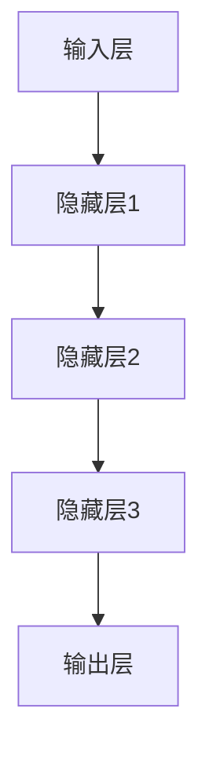

                 

### 文章标题

### 《大模型对企业组织架构的影响》

#### 关键词
- 大模型
- 企业组织架构
- 深度学习
- 人工智能
- 组织变革

#### 摘要
本文将探讨大模型，即大型深度学习神经网络，如何深刻影响现代企业的组织架构。通过分析大模型的定义、原理、关键技术及应用，本文将逐步展示大模型在战略、运营、人力资源、供应链管理以及市场策略等方面对企业组织架构的潜在影响。此外，文章还将探讨如何整合大模型与现有企业业务流程、信息技术，以及大模型对企业竞争优势的塑造。最后，本文将探讨企业组织架构在面临大模型挑战下的创新模式与变革路径，并给出实践指南和未来发展趋势展望。通过系统性的分析，本文旨在为企业领导者提供有益的参考，帮助其在技术变革中把握机遇，优化组织架构，提升企业竞争力。

---

## 《大模型对企业组织架构的影响》目录大纲

### 第一部分：引论

#### 1. 引言

- 大模型与企业组织架构的关联性
- 书籍目的和结构

#### 2. 大模型基础

- 大模型的定义与分类
- 大模型的原理与架构
- 大模型的关键技术
- 大模型的应用领域

#### 3. 大模型对企业组织架构的影响分析

- 大模型对企业战略的影响
- 大模型对企业运营的影响
- 大模型对企业人力资源的影响
- 大模型对企业供应链管理的影响
- 大模型对企业市场策略的影响

#### 4. 大模型与企业业务流程的整合

- 大模型在业务流程中的角色
- 大模型在业务流程中的整合方式
- 大模型在企业运营中的实际案例

#### 5. 大模型与企业信息技术的融合

- 大模型与云计算
- 大模型与物联网
- 大模型与大数据

#### 6. 大模型对企业竞争优势的塑造

- 大模型如何提升企业竞争力
- 大模型对企业竞争优势的影响因素
- 大模型对企业竞争优势的案例分析

### 第二部分：大模型下的企业组织架构创新

#### 7. 企业组织架构创新的必要性

- 传统企业组织架构的局限性
- 大模型推动下的企业组织架构创新

#### 8. 企业组织架构创新的模式

- 模块化组织架构
- 平台化组织架构
- 网络化组织架构
- 智能化组织架构

#### 9. 大模型下的企业组织架构变革案例

- 案例一：数字化转型中的企业组织架构变革
- 案例二：人工智能驱动下的企业组织架构变革
- 案例三：大数据分析推动下的企业组织架构变革

#### 10. 企业组织架构变革的挑战与对策

- 变革的挑战
- 应对变革的策略

### 第三部分：实践与展望

#### 11. 大模型与企业组织架构实践指南

- 实践步骤
- 实践案例分析

#### 12. 大模型与企业组织架构的未来发展趋势

- 技术发展趋势
- 企业组织架构的未来形态
- 未来面临的挑战与机遇

#### 13. 结论

- 本书的核心观点总结
- 对企业组织架构变革的建议

### 附录

#### 附录 A：大模型相关资源

- 大模型学习资源推荐
- 大模型应用案例汇总
- 大模型技术发展趋势报告

#### 附录 B：参考文献

- 相关书籍推荐
- 学术论文推荐
- 报告与白皮书推荐

---

### 引言

在现代商业环境中，大模型——特别是基于深度学习的神经网络模型——正逐步成为企业创新的核心驱动力。大模型通过其强大的数据处理和分析能力，为企业提供了前所未有的洞察力和决策支持，从而深刻影响企业的战略规划和运营效率。这种影响不仅体现在技术层面，更延伸至企业组织架构的方方面面。本文旨在探讨大模型如何重塑现代企业的组织架构，为企业领导者提供战略性的视角和实践指南。

首先，本文将介绍大模型的基本概念、定义、分类及其发展历史，为进一步理解其原理和架构打下基础。接着，本文将详细分析大模型在战略、运营、人力资源、供应链管理和市场策略等方面的具体影响。在此基础上，本文将探讨如何将大模型与企业现有的业务流程和信息技术相结合，以实现更高效的企业运营。

此外，本文还将探讨大模型对企业竞争优势的塑造，以及企业组织架构在面临大模型挑战下的创新模式与变革路径。通过一系列的实际案例，本文将展示大模型在企业组织架构变革中的具体应用和效果。最后，本文将总结核心观点，并对未来企业组织架构的发展趋势提出展望和建议。

本文的结构如下：第一部分引论，将介绍大模型与企业组织架构的关联性，并阐述本书的目的和结构；第二部分大模型基础，将详细解释大模型的定义、分类、原理和关键技术；第三部分大模型对企业组织架构的影响分析，将探讨大模型在不同层面的具体影响；第四部分大模型下的企业组织架构创新，将介绍企业组织架构创新的必要性、模式及实际案例；第五部分实践与展望，将提供大模型与企业组织架构的实践指南和未来发展趋势；最后是结论，总结核心观点并给出建议。

---

### 大模型基础

大模型，通常指那些规模庞大、参数众多的深度学习神经网络模型。这些模型通过训练数以百万计的数据点，能够自动学习和提取数据中的复杂模式和规律，从而实现高度复杂的数据分析任务。本节将详细讨论大模型的定义、分类、发展历史及其关键技术和应用领域。

#### 1. 大模型的定义与分类

大模型的定义可以从两个角度理解：一是模型参数的数量，二是模型所处理的输入数据的规模。

- **模型参数数量**：一般来说，一个模型的参数数量如果超过几十亿，就可以被称为大模型。例如，GPT-3 拥有超过1750亿个参数，是最典型的大模型之一。
- **输入数据规模**：大模型不仅依赖于参数数量，还依赖于训练数据的规模。例如，图像识别模型可能需要处理数百万张图片，而语言模型则需要处理数以亿计的文本数据。

根据不同的应用场景，大模型可以大致分为以下几类：

- **自然语言处理模型**：如 GPT、BERT 等，用于处理文本数据，具有语言理解和生成能力。
- **计算机视觉模型**：如 ResNet、EfficientNet 等，用于图像和视频数据的分类、检测和生成。
- **强化学习模型**：如 DQN、A3C 等，用于解决决策问题，通常应用于游戏、机器人等场景。
- **生成对抗网络（GAN）**：如 StyleGAN、BigGAN 等，用于生成逼真的图像、视频和音频。

#### 2. 大模型的发展历史

大模型的发展历程可以追溯到 20 世纪 50 年代，当时神经网络的概念首次被提出。以下是一些关键的发展节点：

- **1958年**：弗兰克·罗森布拉特（Frank Rosenblatt）提出了感知机（Perceptron）模型，这是第一个基于神经网络的算法。
- **1986年**：Rumelhart、Hinton 和 Williams 提出了反向传播算法（Backpropagation），大大提高了神经网络训练的效率。
- **2012年**：AlexNet 的出现标志着深度学习在图像识别任务上取得了重大突破，开启了深度学习的黄金时代。
- **2018年**：GPT-2 的发布，标志着自然语言处理领域的大模型时代来临。
- **2020年**：GPT-3 发布，成为目前最大的语言模型，参数数量超过 1750 亿，开启了全新的技术应用场景。

#### 3. 大模型的原理与架构

大模型的核心是深度神经网络（Deep Neural Network, DNN），它通过层层堆叠的神经网络层来模拟人脑的信息处理过程。大模型的基本架构通常包括以下几部分：

- **输入层（Input Layer）**：接收外部输入数据，如文本、图像或视频。
- **隐藏层（Hidden Layers）**：通过一系列复杂的非线性变换，提取数据中的特征和模式。
- **输出层（Output Layer）**：根据隐藏层提供的特征，生成预测结果或决策。

**Mermaid 流程图：大模型的基本架构流程**



#### 4. 大模型的关键技术

大模型的成功依赖于一系列关键技术的支持，这些技术包括：

- **神经网络（Neural Networks）**：神经网络是构建大模型的基础，通过多层非线性变换实现复杂的数据处理。
- **深度学习（Deep Learning）**：深度学习是神经网络的一种扩展，通过增加网络层数来提高模型的复杂度和表现力。
- **机器学习算法（Machine Learning Algorithms）**：包括反向传播算法、随机梯度下降、Adam优化器等，用于训练和优化大模型。
- **大数据（Big Data）**：大模型的训练和部署需要海量数据支持，大数据技术提供了高效的数据存储和处理能力。
- **分布式计算（Distributed Computing）**：为了处理大模型所需的巨大计算量，分布式计算技术成为必不可少的手段。

**神经网络的基本算法原理与伪代码**

```python
# 假设我们有一个简单的三层神经网络，输入为x，权重为w，偏置为b，激活函数为sigmoid函数

# 前向传播
def forward(x, w, b):
    z = x * w + b
    a = sigmoid(z)
    return a

# 反向传播
def backward(a, z, dz, dw, db):
    da = dz * sigmoid_derivative(z)
    dw = a * da
    db = da
    return dw, db

# 激活函数
def sigmoid(x):
    return 1 / (1 + e**-x)

# 激活函数的导数
def sigmoid_derivative(x):
    return sigmoid(x) * (1 - sigmoid(x))
```

#### 5. 大模型的应用领域

大模型在各个领域都展现了强大的应用潜力，以下是几个主要的应用领域：

- **数据分析**：大模型能够自动从海量数据中提取有价值的信息和洞见，广泛应用于金融、医疗、零售等行业。
- **人工智能**：大模型是人工智能技术的核心组件，用于开发智能客服、自动驾驶、智能机器人等应用。
- **机器学习**：大模型在训练其他机器学习模型时发挥着重要作用，能够显著提高模型的性能和泛化能力。
- **计算机视觉**：大模型在图像识别、物体检测、人脸识别等领域取得了显著的成果，推动了计算机视觉技术的快速发展。

综上所述，大模型作为一种革命性的技术，正在深刻改变企业的数据处理和分析方式，为企业提供了强大的创新动力。了解大模型的基本概念、原理和关键技术，对于企业领导者来说至关重要，它不仅可以帮助他们把握技术趋势，还能为企业未来的战略规划提供重要参考。

---

### 大模型对企业组织架构的影响分析

大模型作为一种前沿的技术手段，其强大的数据处理和分析能力正在深刻影响现代企业的各个方面。本节将详细探讨大模型在战略、运营、人力资源、供应链管理以及市场策略等五个方面的具体影响，并分析这些影响如何重塑企业的组织架构。

#### 1. 大模型对企业战略的影响

企业的战略决策通常依赖于对市场趋势、竞争对手、客户需求等方面的深入理解。大模型能够通过分析海量数据，提供实时且准确的市场洞察，从而帮助企业制定更为科学和有效的战略。

- **市场趋势预测**：大模型可以通过对历史数据的分析，识别出市场的发展趋势和潜在机会，帮助企业提前布局。
- **竞争对手分析**：大模型可以分析竞争对手的营销策略、产品性能、市场份额等数据，帮助企业制定更为精准的竞争策略。
- **客户需求理解**：通过对客户行为、评论、反馈等数据的分析，大模型可以帮助企业更好地理解客户需求，从而提供更加个性化的产品和服务。

**实际案例**：某电商平台利用大模型分析用户购买行为数据，预测市场趋势，调整库存和营销策略，从而在竞争激烈的市场中获得了显著的增长。

#### 2. 大模型对企业运营的影响

大模型在企业的日常运营中同样发挥着重要作用，能够提升生产效率、优化资源分配，并减少运营成本。

- **生产优化**：大模型可以通过对生产流程数据的分析，发现瓶颈和改进空间，帮助企业优化生产流程，提高生产效率。
- **资源优化**：大模型能够分析企业的资源消耗数据，提供最优的资源分配方案，减少浪费，提高资源利用率。
- **成本控制**：通过对运营数据的监控和分析，大模型可以帮助企业识别成本异常，及时采取措施控制成本。

**实际案例**：某制造企业利用大模型对生产线进行实时监控，通过预测设备故障和优化生产调度，大幅降低了运营成本和停机时间。

#### 3. 大模型对企业人力资源的影响

大模型在人力资源管理中同样有着广泛的应用，能够帮助企业优化招聘流程、提高员工绩效，并改善员工体验。

- **招聘优化**：大模型可以通过分析求职者的简历和面试表现，预测其未来工作表现，从而帮助企业选择更适合的候选人。
- **员工绩效管理**：大模型可以分析员工的日常表现、项目完成情况等数据，提供个性化的绩效评估和反馈，帮助员工提高工作效率。
- **员工体验提升**：大模型可以分析员工的工作习惯和偏好，提供个性化的工作安排和培训建议，从而提升员工的工作满意度和忠诚度。

**实际案例**：某科技公司利用大模型优化招聘流程，通过分析简历内容和面试表现数据，大幅提高了招聘质量和效率。

#### 4. 大模型对企业供应链管理的影响

大模型在供应链管理中的应用，能够帮助企业优化供应链流程，提高供应链的灵活性和响应速度。

- **库存管理**：大模型可以通过分析历史销售数据和市场需求预测，提供最优的库存策略，减少库存积压和缺货风险。
- **物流优化**：大模型可以分析物流数据，提供最优的运输路线和配送方案，减少物流成本和运输时间。
- **供应链可视化**：大模型可以通过整合各种供应链数据，提供实时的供应链可视化，帮助企业实时监控供应链状态，快速响应供应链异常。

**实际案例**：某零售企业利用大模型优化库存管理，通过预测市场需求和调整库存策略，显著降低了库存成本和缺货率。

#### 5. 大模型对企业市场策略的影响

大模型在市场营销中的应用，能够帮助企业制定更为精准和有效的市场策略，提升营销效果和客户满意度。

- **客户细分**：大模型可以通过分析客户数据，将客户分为不同的细分市场，从而提供个性化的营销方案。
- **广告优化**：大模型可以分析广告投放效果，提供最优的广告投放策略，提高广告的点击率和转化率。
- **品牌管理**：大模型可以通过分析社交媒体和用户评论等数据，提供品牌管理和舆情监控，帮助企业维护品牌形象。

**实际案例**：某互联网公司利用大模型优化广告投放策略，通过精准定位潜在客户和优化广告创意，大幅提升了广告效果和客户转化率。

#### 总结

大模型在战略、运营、人力资源、供应链管理和市场策略等五个方面对企业组织架构产生了深远的影响。通过利用大模型的数据处理和分析能力，企业能够更加科学和高效地制定战略、优化运营、管理人力资源、优化供应链和制定市场策略，从而提升企业的整体竞争力。企业领导者需要深刻理解大模型的影响，并积极采取行动，将大模型与现有组织架构和业务流程相结合，实现企业的持续创新和增长。

---

### 大模型与企业业务流程的整合

大模型在现代企业中的应用日益广泛，其强大的数据处理和分析能力正在深刻改变企业的业务流程。本节将探讨大模型在业务流程中的角色、整合方式及其对企业运营的具体影响，并结合实际案例，展示大模型在提升企业运营效率和决策能力方面的实际效果。

#### 1. 大模型在业务流程中的角色

大模型在业务流程中扮演着多重角色，其核心在于提供数据驱动的洞察和决策支持。具体来说，大模型可以在以下几个方面发挥作用：

- **预测分析**：通过分析历史数据，大模型可以预测未来的趋势和变化，帮助企业提前做出应对策略。
- **决策支持**：大模型可以根据实时数据提供决策建议，帮助企业在复杂的业务环境中做出最优的选择。
- **流程优化**：大模型可以通过分析业务流程中的各个环节，发现瓶颈和改进点，提出优化方案，提高整体运营效率。
- **风险控制**：大模型可以监测业务过程中的潜在风险，提前预警，并制定相应的应对措施，减少损失。

#### 2. 大模型在业务流程中的整合方式

要将大模型有效地整合到业务流程中，企业需要采取一系列具体的整合方式，包括数据整合、技术整合和流程整合。

- **数据整合**：企业需要将来自不同业务系统和外部数据源的数据进行整合，构建统一的数据仓库，为模型训练提供丰富的数据基础。数据整合是整合大模型的基础，确保数据的质量和一致性至关重要。
- **技术整合**：企业需要采用先进的计算平台和分布式技术，以满足大模型对计算资源和存储的需求。此外，还需要整合各种机器学习和深度学习框架，如 TensorFlow、PyTorch 等，以便于模型开发和部署。
- **流程整合**：企业需要将大模型的分析结果和决策建议融入业务流程中，通过自动化和智能化的手段，实现数据驱动的高效运营。流程整合的关键在于确保大模型的分析结果能够实时、准确地传递到相关的业务环节，并触发相应的操作。

#### 3. 大模型在企业运营中的实际案例

以下是一些企业如何利用大模型优化业务流程的实际案例，展示了大模型在提升企业运营效率和决策能力方面的具体效果。

**案例一：电商平台的个性化推荐**

某大型电商平台利用大模型对用户行为数据进行深度分析，构建了个性化的推荐系统。通过分析用户的浏览历史、购买记录、搜索关键词等数据，大模型能够预测用户可能感兴趣的商品，并将这些商品推荐给用户。个性化推荐系统的引入，不仅提高了用户的购物体验，也显著提升了平台的销售转化率和客户满意度。

**案例二：制造业的智能生产调度**

某制造企业利用大模型对生产过程中的各类数据进行分析，包括设备状态、生产进度、物料供应等。通过预测设备故障和优化生产调度，大模型能够显著减少设备停机时间，提高生产效率。此外，大模型还可以根据市场需求变化，实时调整生产计划和库存策略，从而减少库存积压和缺货风险。

**案例三：金融行业的信用评估**

某金融机构利用大模型对借款人的信用数据进行全面分析，包括收入水平、工作经历、社会关系等。通过构建复杂的信用评估模型，大模型能够准确预测借款人的信用风险，从而提高贷款审批的准确性和效率。同时，大模型还可以根据借款人的信用状况，提供个性化的还款建议和风险管理策略，减少信用风险。

**案例四：物流公司的智能运输调度**

某物流公司利用大模型对运输路线和配送时间进行优化，通过分析交通数据、天气状况、车辆状态等因素，提供最优的运输路线和配送方案。大模型的引入，不仅提高了运输效率，减少了运输成本，还提升了客户满意度，增强了企业的竞争力。

#### 4. 大模型对企业运营的具体影响

大模型在业务流程中的整合，对企业运营产生了多方面的积极影响：

- **运营效率提升**：通过自动化和智能化的手段，大模型能够优化业务流程中的各个环节，提高整体运营效率。
- **决策能力增强**：大模型提供的实时数据分析和决策支持，帮助企业更好地应对复杂的市场环境，提高决策的准确性和效率。
- **风险控制加强**：大模型能够实时监测业务过程中的潜在风险，提前预警并制定应对措施，减少损失和风险。
- **用户体验优化**：大模型的应用，能够提供个性化的服务和体验，提升用户满意度和忠诚度。

综上所述，大模型在企业业务流程中的整合，不仅提升了企业的运营效率和决策能力，还为企业在激烈的市场竞争中提供了强有力的支持。企业领导者应积极拥抱大模型技术，将其深度融入业务流程，实现持续的创新和增长。

---

### 大模型与企业信息技术的融合

大模型在现代社会中的应用日益广泛，其数据处理和分析能力正深刻改变着企业的信息技术架构。本节将探讨大模型与云计算、物联网和大数据技术的融合，分析这些融合如何提升企业的信息化水平和运营效率。

#### 1. 大模型与云计算

云计算为大规模数据处理提供了强大的计算和存储资源，与云计算的结合使得大模型能够高效地训练和部署。以下是云计算在支持大模型应用中的几个关键方面：

- **计算资源调度**：云计算平台可以根据大模型的需求动态分配计算资源，确保模型训练和推理过程的高效运行。例如，使用 Kubernetes 等容器编排工具，可以轻松管理大规模的分布式训练任务。
- **弹性扩展**：云计算的弹性扩展能力，使得企业可以根据需求快速调整计算资源，以应对大规模数据处理的挑战。例如，使用 AWS、Azure 或 Google Cloud 等平台，可以根据模型训练的数据量和复杂度自动扩展或缩减资源。
- **数据存储与管理**：云计算提供了高效的数据存储和管理方案，如对象存储服务（S3、Azure Blob）、数据湖服务（AWS S3、Azure Data Lake）等，使得大模型能够方便地访问和管理海量数据。

**实际案例**：某互联网公司使用 AWS 的 EC2 实例和 S3 存储服务，搭建了一个大规模的深度学习平台，通过自动化的资源调度和弹性扩展，实现了高效的数据处理和模型训练。

#### 2. 大模型与物联网

物联网（IoT）技术的快速发展，为大规模数据采集提供了新的机会。大模型与物联网的结合，使得企业能够从海量物联网设备中提取有价值的信息，实现智能化的运营和决策。以下是物联网在大模型应用中的几个关键方面：

- **实时数据处理**：物联网设备可以实时收集各种传感器数据，如温度、湿度、运动等。大模型可以对这些实时数据进行处理和分析，提供即时的决策支持。例如，智能工厂中，大模型可以分析设备传感器数据，预测设备故障并提前进行维护。
- **边缘计算与云计算协同**：物联网设备通常具有有限的计算和存储资源，通过边缘计算与云计算的协同，可以将部分数据处理任务下放到边缘设备，从而减少数据传输的延迟和带宽压力。例如，智能交通系统中，边缘计算设备可以实时处理交通流量数据，大模型则负责更复杂的交通预测和优化。
- **设备健康管理**：大模型可以分析物联网设备的运行数据，提供设备健康监测和管理方案，延长设备寿命并提高设备运行效率。例如，智能家居系统中，大模型可以监控家电设备的工作状态，提供优化使用建议，降低能耗。

**实际案例**：某智能交通系统公司利用物联网设备实时采集交通数据，通过边缘计算和云计算的协同处理，大模型提供了实时交通流量预测和优化建议，显著提升了交通运行效率和安全性。

#### 3. 大模型与大数据

大数据技术提供了海量数据的存储、管理和分析能力，为大模型的应用提供了坚实的基础。以下是大数据在大模型应用中的几个关键方面：

- **数据湖与数据仓库**：大数据技术构建的数据湖（Data Lake）和数据仓库（Data Warehouse）可以存储和处理大规模数据集，为大模型提供了丰富的数据来源。数据湖可以存储原始数据，支持不同数据类型的存储，而数据仓库则提供结构化数据的存储和高效查询。
- **数据预处理**：大数据技术提供了高效的数据预处理工具，包括数据清洗、数据转换和数据集成等，确保数据的质量和一致性，为大模型训练提供高质量的数据基础。
- **实时数据分析**：大数据技术支持实时数据分析，使得大模型能够快速处理和分析实时数据，提供即时的决策支持。例如，在金融行业中，大模型可以实时分析市场数据，提供交易策略和风险预警。

**实际案例**：某金融公司利用大数据技术建立了数据湖和数据仓库，通过实时数据分析平台，大模型能够实时监控市场动态，提供交易决策和风险管理支持，提升了公司的交易效率和风险管理能力。

#### 4. 大模型对企业信息化水平的提升

大模型与云计算、物联网和大数据技术的融合，对企业信息化水平产生了显著的提升：

- **数据处理能力增强**：通过云计算和大数据技术，企业能够处理和分析大规模数据集，提升数据处理的效率和质量。
- **决策支持能力提升**：大模型提供的实时数据分析和决策支持，帮助企业做出更为科学和准确的决策，提高运营效率和市场竞争力。
- **运营效率提升**：物联网技术使得企业能够实时监测和管理设备，优化运营流程，减少成本和资源浪费。
- **用户体验优化**：大数据和物联网技术的融合，使得企业能够提供个性化的服务和体验，提升用户满意度和忠诚度。

综上所述，大模型与云计算、物联网和大数据技术的融合，不仅提升了企业的信息化水平，还为企业的数字化转型提供了强有力的支持。企业领导者应积极拥抱这些先进技术，推动企业信息化水平的持续提升，实现业务的创新和增长。

---

### 大模型对企业竞争优势的塑造

大模型作为一种前沿技术，正在深刻改变企业的竞争优势格局。通过其强大的数据处理和分析能力，大模型能够为企业提供深度的商业洞察和优化决策，从而显著提升企业的竞争力。以下将探讨大模型如何提升企业竞争力，分析其影响的主要因素，并结合实际案例，展示大模型在实际应用中的竞争优势。

#### 1. 大模型如何提升企业竞争力

大模型通过以下几个方面提升企业的竞争力：

- **数据驱动的决策**：大模型能够处理和分析大量数据，为企业提供基于数据的决策支持，使企业在面对复杂的市场环境时能够做出更为科学的决策。
- **优化运营流程**：大模型可以深入分析企业的运营数据，发现流程中的瓶颈和改进点，从而优化运营流程，提高生产效率和资源利用率。
- **增强市场洞察力**：大模型能够通过分析市场数据和用户行为，提供精准的市场预测和趋势分析，帮助企业把握市场机遇。
- **提升客户体验**：大模型能够分析用户行为和偏好，提供个性化的产品和服务，从而提升客户满意度和忠诚度。
- **创新业务模式**：大模型的应用可以激发企业的创新思维，推动新的业务模式和产品服务的开发，从而开拓更广阔的市场空间。

#### 2. 大模型对企业竞争优势的影响因素

大模型对企业竞争优势的影响取决于多个因素，主要包括：

- **数据质量**：高质量的数据是训练和优化大模型的基础。数据质量直接影响模型的性能和准确性，因此，企业需要建立完善的数据治理体系，确保数据的准确性和一致性。
- **计算资源**：大模型需要大量的计算资源进行训练和推理。企业需要具备强大的计算能力和高效的资源调度能力，以确保大模型能够高效运行。
- **技术能力**：企业需要具备高水平的技术能力，包括机器学习、深度学习等技术，以及数据工程和软件开发等能力，以便有效地开发和部署大模型。
- **组织文化**：企业需要具备开放和创新的组织文化，鼓励员工拥抱新技术，勇于尝试和改进。

#### 3. 大模型对企业竞争优势的实际案例

以下是一些实际案例，展示了大模型如何提升企业的竞争优势：

**案例一：金融行业的风险管理**

某金融公司利用大模型对信贷风险进行精准预测和管理。通过分析借款人的历史数据、信用评分和市场趋势，大模型能够预测借款人的违约概率，并制定相应的风险管理策略。这不仅提高了贷款审批的准确性，还显著降低了信用风险，提升了公司的整体盈利能力。

**案例二：零售行业的个性化推荐**

某大型零售企业通过构建大模型，实现了对用户行为的深度分析。通过分析用户的浏览记录、购买历史和搜索关键词等数据，大模型能够精准预测用户的偏好，并提供个性化的商品推荐。这一策略大幅提升了用户的购物体验，增加了用户留存率和销售额。

**案例三：制造业的智能生产**

某制造企业通过引入大模型，实现了生产流程的全面智能化。大模型通过对生产数据进行分析，发现生产过程中的瓶颈和改进点，提供了优化生产流程的建议。此外，大模型还实现了设备预测性维护，通过分析设备运行数据，提前发现潜在故障，减少了设备停机时间和维护成本。

**案例四：医疗行业的疾病预测**

某医疗公司利用大模型对患者的健康数据进行预测和分析，包括病历记录、实验室检测结果和医学影像等。通过构建复杂的大模型，公司能够预测患者的疾病风险，并提供个性化的预防和治疗建议。这一技术不仅提高了疾病的早期诊断率，还显著提升了患者的健康水平和生活质量。

#### 4. 大模型对企业竞争优势的案例分析

**案例五：物流行业的运输优化**

某物流公司通过构建大模型，实现了运输路线和配送时间的优化。大模型通过分析交通数据、天气状况和车辆状态，提供了最优的运输路线和配送方案。这一策略不仅提高了运输效率，减少了物流成本，还提升了客户满意度，增强了公司的市场竞争力。

**案例六：能源行业的需求预测**

某能源公司利用大模型对电力需求进行精准预测。通过分析历史电力数据、天气变化和节假日等因素，大模型能够预测未来电力需求的波动，从而优化电力调度和资源分配。这一技术不仅提高了能源利用效率，还减少了能源浪费，降低了运营成本。

#### 总结

大模型通过提升数据驱动的决策能力、优化运营流程、增强市场洞察力、提升客户体验和创新业务模式，显著提升了企业的竞争力。企业需要充分利用大模型的优势，结合自身的业务特点，制定合适的策略，将大模型深度融入业务流程，实现持续的创新和竞争优势。同时，企业也需要关注数据质量、计算资源、技术能力和组织文化等关键因素，以确保大模型能够发挥最大的作用。

---

### 企业组织架构创新的必要性

在当今快速变化的商业环境中，企业面临着前所未有的挑战和机遇。技术的快速发展，特别是大模型技术的广泛应用，正在深刻改变企业的运营模式和竞争格局。传统企业组织架构在这种变革面前显得日益局限，难以满足企业应对复杂环境的需求。因此，企业组织架构的创新成为必然选择。

#### 1. 传统企业组织架构的局限性

传统企业组织架构通常基于金字塔式的层级结构，权力和决策集中在顶层管理层，信息流通不畅，响应速度较慢。以下是一些传统企业组织架构的局限性：

- **信息传递滞后**：在传统的层级结构中，信息需要逐级传递，导致信息延迟和失真，影响决策效率。
- **创新能力不足**：传统组织架构倾向于集中控制，创新活动通常需要经过复杂的审批流程，限制了员工的创造力和自主性。
- **部门壁垒**：各部门之间的协作往往受制于职能分工，导致部门壁垒，阻碍跨部门合作和信息共享。
- **响应速度慢**：在传统架构下，决策流程复杂，企业难以快速响应市场变化，错失发展机遇。
- **资源利用率低**：传统的层级结构可能导致资源分配不合理，部门之间的资源难以有效共享和协调。

#### 2. 大模型推动下的企业组织架构创新

大模型技术的出现为企业提供了前所未有的数据处理和分析能力，促使企业组织架构进行创新和变革。以下是大模型推动下企业组织架构创新的几个关键方面：

- **去中心化**：大模型的应用可以减少对中心决策的依赖，推动企业组织架构向去中心化发展。通过分布式决策和协作，企业能够更加灵活和高效地应对复杂环境。
- **模块化**：大模型的应用促进了业务流程的模块化，企业可以根据业务需求快速调整和重组模块，提高组织的灵活性和适应性。
- **智能化**：大模型引入智能算法和自动化工具，可以优化企业运营流程，提高效率。智能化工具还可以帮助企业实现实时监控和预测，提升决策的准确性和响应速度。
- **跨部门协作**：大模型通过数据共享和分析，促进跨部门之间的协作和信息共享，打破部门壁垒，实现资源的最优配置。
- **创新文化**：大模型的应用鼓励企业建立开放和创新的文化，推动员工积极参与创新活动，提高企业的整体创新能力和竞争力。

#### 3. 大模型推动下的企业组织架构创新案例

以下是一些企业如何在大模型推动下进行组织架构创新的成功案例：

**案例一：模块化组织架构**

某科技公司通过引入大模型技术，对其产品开发流程进行了模块化改造。公司根据不同的产品模块，组建了跨部门的模块团队，每个团队负责特定模块的开发和维护。这种模块化组织架构提高了团队之间的协作效率，缩短了产品开发周期，提升了市场响应速度。

**案例二：智能化运营管理**

某制造企业引入了智能化的生产管理系统，利用大模型对生产流程进行实时监控和优化。通过数据分析和预测，企业能够提前发现生产瓶颈和潜在故障，制定相应的优化措施，提高了生产效率和资源利用率。

**案例三：去中心化的创新文化**

某互联网公司通过构建内部创新平台，鼓励员工自由探索和实验。公司利用大模型技术提供数据支持和智能分析工具，帮助员工快速验证和优化创新项目。这种去中心化的创新文化激发了员工的创造力，推动了企业的创新和发展。

#### 总结

大模型技术的快速发展，推动了企业组织架构的深刻变革。传统企业组织架构的局限性逐渐显现，而大模型的应用为企业提供了创新的动力和路径。通过去中心化、模块化、智能化和跨部门协作等创新模式，企业能够更好地适应复杂多变的市场环境，提升竞争力。企业领导者应积极推动组织架构的创新，充分利用大模型的优势，实现企业的持续发展和成功。

---

### 企业组织架构创新的模式

在大模型技术的推动下，企业组织架构的创新成为提升竞争力的关键。本文将探讨四种创新模式：模块化组织架构、平台化组织架构、网络化组织架构和智能化组织架构，并分析这些模式的特点和优势。

#### 1. 模块化组织架构

模块化组织架构通过将企业业务流程分解为独立的模块，每个模块具有明确的职能和责任。模块之间通过接口进行连接，确保高效协同和灵活调整。

- **特点**：
  - 灵活性高：模块化架构能够快速适应市场变化，通过调整模块组合，实现业务的灵活部署。
  - 可持续发展：模块化使得企业能够专注于模块的优化和提升，持续创新和迭代。

- **优势**：
  - 提高效率：模块化减少了冗余和重复工作，提高了资源的利用率和业务效率。
  - 简化管理：模块化架构降低了管理的复杂性，每个模块可以独立运营和考核，减少了协调成本。
  - 增强创新：模块化鼓励跨部门和跨领域的创新合作，促进知识的共享和流动。

**应用案例**：某科技公司通过模块化架构，将产品开发、市场推广、售后服务等业务拆分为独立的模块，每个模块由不同的团队负责，大幅提高了研发和市场响应速度。

#### 2. 平台化组织架构

平台化组织架构以共享基础设施和资源为核心，通过构建开放的平台，促进内部和外部资源的整合与协同。

- **特点**：
  - 开放性：平台化架构鼓励内部和外部资源的共享，提高资源的利用效率和创新能力。
  - 生态化：平台化架构形成一个生态系统，内部团队和外部合作伙伴可以共同参与，实现互利共赢。

- **优势**：
  - 提升资源利用率：通过共享基础设施和资源，企业可以降低运营成本，提高资源利用率。
  - 增强协同效应：平台化架构促进了跨部门和跨领域的合作，提高了整体效率和创新能力。
  - 灵活应变：平台化架构能够快速响应市场需求，通过引入外部资源和合作伙伴，实现灵活调整和扩展。

**应用案例**：某互联网公司通过平台化架构，构建了一个开放的开发平台，吸引了大量的第三方开发者，共同开发和推广产品，实现了快速市场扩展和用户增长。

#### 3. 网络化组织架构

网络化组织架构通过建立广泛的信息网络，实现信息的快速传递和共享，提高组织内部的透明度和协作效率。

- **特点**：
  - 网络化：组织架构中的各个节点通过信息网络紧密连接，形成一个高效的信息传递和共享机制。
  - 透明化：网络化架构提高了信息透明度，决策过程更加公开和透明，减少了信息不对称。

- **优势**：
  - 提高决策效率：网络化架构使得信息传递迅速，减少了决策的延迟，提高了决策的准确性和效率。
  - 促进知识共享：网络化架构促进了知识的共享和流动，提高了组织的整体智慧和创新能力。
  - 增强团队协作：网络化架构通过信息共享和协作工具，提高了团队之间的协作效率和凝聚力。

**应用案例**：某咨询公司通过建立内部网络平台，实现了全球范围内的信息共享和协作，提高了咨询团队的协作效率和项目成功率。

#### 4. 智能化组织架构

智能化组织架构通过引入人工智能和大数据技术，实现组织运营的智能化和自动化，提高决策的精准度和效率。

- **特点**：
  - 智能化：利用人工智能和大数据技术，对组织运营进行实时监控和预测，提供智能化的决策支持。
  - 自动化：通过自动化工具和算法，实现业务的自动化处理和优化，减少人工干预。

- **优势**：
  - 提高效率：智能化架构通过自动化和优化，减少了人工操作和重复工作，提高了业务效率和准确性。
  - 提升决策能力：智能化技术提供了丰富的数据分析和预测能力，帮助组织做出更为科学和准确的决策。
  - 减少人力成本：智能化架构降低了人力成本，提高了资源利用效率，增强了组织的竞争力。

**应用案例**：某制造企业通过引入智能生产管理系统，实现了生产流程的自动化和优化，大幅提高了生产效率和产品质量。

#### 总结

企业组织架构的创新模式多样，包括模块化、平台化、网络化和智能化等。每种模式都有其独特的特点和应用场景，企业可以根据自身需求选择合适的创新模式，实现组织架构的优化和提升。通过不断创新和变革，企业能够更好地适应快速变化的商业环境，持续提升竞争力。

---

### 大模型下的企业组织架构变革案例

在技术不断革新的时代，企业组织架构的变革已成为提升竞争力的重要手段。以下将介绍三个实际案例，展示企业在大模型技术推动下如何进行组织架构变革，从而实现业务的转型与升级。

#### 案例一：数字化转型中的企业组织架构变革

**背景**：某传统制造业企业，长期以来依赖传统的生产方式和管理模式，面临生产效率低下、成本高企、市场反应迟钝等挑战。为了在数字化时代中生存和发展，企业决定进行全面的数字化转型。

**变革过程**：

1. **顶层设计**：企业首先进行了顶层设计，明确数字化转型目标，制定了详细的实施路线图，包括数据整合、流程重构、技术引入等。
2. **数据整合**：企业建立了一个统一的数据平台，整合了来自生产、销售、物流等各个环节的数据，为后续的大模型应用提供了高质量的数据基础。
3. **组织重构**：企业将原有的层级结构进行了扁平化改造，取消了多个中间管理层，建立了以项目组为单位的扁平化组织架构。每个项目组负责特定业务模块的运营和管理，提高了决策的效率。
4. **技术引入**：企业引入了多种大模型技术，包括生产优化模型、供应链预测模型、客户需求预测模型等，通过数据分析和预测，优化生产流程、减少库存成本、提高客户满意度。
5. **人才培养**：企业加强了员工的技能培训，特别是对数据分析和人工智能技术的培训，提高员工的数字素养和创新能力。

**变革效果**：

- **生产效率提升**：通过引入大模型技术，企业实现了生产流程的全面优化，生产效率提升了30%。
- **成本降低**：通过数据驱动的库存管理和供应链优化，企业的库存成本降低了20%，运营成本减少了15%。
- **客户满意度提高**：个性化的产品推荐和快速响应市场变化，显著提升了客户的满意度和忠诚度。

#### 案例二：人工智能驱动下的企业组织架构变革

**背景**：某互联网公司，在人工智能技术的迅猛发展下，意识到传统的组织架构已经无法满足快速迭代和创新的需求。为了保持竞争优势，公司决定进行人工智能驱动的组织架构变革。

**变革过程**：

1. **组织扁平化**：公司进行了全面的组织扁平化改造，取消了多个中间管理层，建立了扁平化的矩阵组织架构。每个团队成员都直接向项目负责人汇报，提高了决策速度和沟通效率。
2. **跨部门协作**：公司通过构建内部协作平台，促进了跨部门之间的信息共享和协作。每个项目组都可以方便地获取所需的数据和资源，加快了项目进展。
3. **引入AI工具**：公司引入了多种AI工具，如自然语言处理、图像识别、预测分析等，用于业务流程的优化和决策支持。AI工具的应用使得业务流程更加智能化和自动化。
4. **员工赋能**：公司鼓励员工积极使用AI工具，提供相应的培训和指导，提高员工的数字技能和创新能力。
5. **文化重塑**：公司建立了以创新和开放为核心的企业文化，鼓励员工勇于尝试和失败，从失败中学习和成长。

**变革效果**：

- **创新能力提升**：通过组织扁平化和跨部门协作，企业的创新能力得到了显著提升，新产品推出周期缩短了40%。
- **运营效率提高**：AI工具的应用优化了业务流程，减少了人为错误和重复工作，运营效率提高了25%。
- **客户体验优化**：个性化的服务和快速响应市场变化，提升了客户的满意度和忠诚度。

#### 案例三：大数据分析推动下的企业组织架构变革

**背景**：某零售企业，在市场竞争加剧的背景下，意识到数据的价值和重要性。为了更好地利用数据驱动业务，企业决定进行大数据分析推动下的组织架构变革。

**变革过程**：

1. **数据治理**：企业建立了完善的数据治理体系，确保数据的准确性和一致性。数据治理团队负责数据的质量监控、数据安全和合规性。
2. **组织重构**：企业取消了原有的多个职能部门，建立了以数据为核心的跨部门团队。每个团队由数据分析专家、业务专家和IT技术人员组成，负责特定业务领域的数据分析和应用。
3. **技术升级**：企业引入了先进的大数据分析工具和平台，包括数据仓库、数据湖、机器学习框架等，提高数据处理和分析能力。
4. **人才培养**：企业加大了对数据分析人才的培养力度，提供了系统的培训和认证课程，提高员工的数字技能和业务理解能力。
5. **文化变革**：企业倡导数据驱动的决策文化，鼓励员工基于数据做出决策，从数据中寻找业务机会和改进点。

**变革效果**：

- **业务洞察提升**：通过大数据分析，企业对市场趋势、客户行为和业务运营有了更深入的理解，业务洞察力显著提升。
- **决策效率提高**：基于数据的决策支持系统，使企业能够在短时间内做出更为科学的决策，决策效率提高了30%。
- **业务绩效改善**：通过数据驱动的运营优化和精准营销，企业的销售额和市场份额均实现了显著增长。

#### 总结

通过以上三个案例可以看出，大模型技术正在深刻推动企业组织架构的变革。企业在数字化转型、人工智能驱动和大数据分析等不同场景下，通过组织重构、技术引入和人才培养等手段，实现了业务的创新和升级。企业领导者应积极拥抱技术变革，把握机遇，推动企业组织架构的创新，以应对快速变化的商业环境，持续提升竞争力。

---

### 企业组织架构变革的挑战与对策

在企业组织架构变革的过程中，领导者面临诸多挑战。这些挑战不仅影响变革的顺利进行，还可能对企业的稳定运营造成威胁。以下将分析企业组织架构变革中常见的挑战，并提出相应的对策，以帮助企业有效应对变革中的困难和阻力。

#### 1. 变革阻力的来源

**文化阻力**：企业文化是企业长期积累形成的，它根深蒂固，对员工的行为和思维模式产生深远影响。当企业进行组织架构变革时，可能会触及到某些传统文化的核心，导致员工对变革产生抵触情绪。

**技术阻力**：技术变革往往涉及复杂的技术引入和系统改造，这对企业的技术能力和资源提出了高要求。缺乏相应的技术储备和人才支持，可能会影响变革的推进。

**管理阻力**：管理层可能对变革的必要性和可行性存在疑虑，或者担心变革会引发短期内的不稳定，影响企业的日常运营。管理层的不支持往往成为变革推进的重要障碍。

**组织阻力**：组织内部存在既得利益者，他们的职位和利益可能会因变革而受到影响。因此，组织内部的阻力往往难以忽视。

**员工阻力**：员工对变革的接受程度不同，部分员工可能对新技术和新流程感到不适应，甚至产生恐惧和焦虑情绪。

#### 2. 应对变革挑战的对策

**明确变革目标**：企业领导层应首先明确变革的目标和愿景，确保全体员工对变革的方向和目的有清晰的认识。目标应具体、可衡量，并与企业的战略目标相一致。

**加强沟通与共识**：企业应通过多种沟通渠道，与员工和管理层进行深入沟通，解释变革的必要性和好处，争取得到他们的支持和理解。同时，建立共识，让全体员工都认识到变革是企业发展的重要步骤。

**培养技术能力**：企业应加大对技术人才的培养和引进力度，确保技术团队具备实施变革所需的能力。通过培训和技术分享，提高员工的技术素养和适应能力。

**建立激励机制**：为了激励员工积极参与变革，企业可以制定相应的激励机制，如绩效奖金、晋升机会等，鼓励员工主动适应新的工作模式。

**提供心理支持**：企业应关注员工在变革过程中的心理健康，提供必要的心理支持和辅导，帮助员工缓解焦虑和恐惧情绪，增强心理韧性。

**逐步推进变革**：变革不应一蹴而就，而应分阶段、分步骤地进行。企业可以先行试点，总结经验，逐步推广，确保变革的顺利实施。

**建立反馈机制**：企业应建立反馈机制，及时收集员工对变革的反馈和建议，并根据实际情况进行调整。这有助于确保变革的可持续性和有效性。

**领导示范作用**：企业领导层应率先示范，积极支持和参与变革，树立榜样，增强员工的信任和信心。

#### 3. 变革成功的关键因素

**领导层的坚定支持**：领导层的坚定支持和积极参与是变革成功的关键。他们的态度和行动直接影响员工的看法和行为。

**全员参与**：变革需要全体员工的参与，不仅是技术团队，还包括管理层和普通员工。全员参与能够增强变革的共识和执行力。

**持续改进**：变革不是一次性的活动，而是一个持续改进的过程。企业应不断评估变革的效果，根据反馈进行调整和优化。

**创新文化**：企业应建立开放和创新的文化，鼓励员工勇于尝试和失败，从失败中学习和成长。

#### 总结

企业组织架构变革是一项复杂而艰巨的任务，涉及多个方面的挑战和阻力。通过明确变革目标、加强沟通、培养技术能力、建立激励机制、提供心理支持、逐步推进变革和建立反馈机制等对策，企业可以有效应对变革中的困难和阻力，实现组织架构的优化和升级。企业领导者应高度重视变革，积极引导和推动变革，以应对快速变化的商业环境，持续提升企业的竞争力。

---

### 大模型与企业组织架构实践指南

在企业中实施大模型与企业组织架构的结合，不仅需要先进的技术支持，还需要系统的规划和细致的执行。以下将提供一系列的实践指南，包括具体的步骤、案例分析及相应的实施建议，以帮助企业顺利地将大模型与组织架构相结合，实现业务优化和效率提升。

#### 1. 实践步骤

**步骤一：制定整体规划**

- **目标设定**：明确企业应用大模型的总体目标，如提升生产效率、优化供应链管理、提高客户满意度等。
- **资源评估**：评估企业当前的技术能力和资源，确定所需的技术支持、人力和资金投入。
- **实施方案**：制定详细的实施方案，包括技术选型、项目进度、风险评估等。

**案例一**：某零售企业计划通过大模型优化库存管理，首先明确了提升库存周转率和减少库存成本的目标，然后评估了企业现有的数据基础设施，并制定了详细的实施方案。

**步骤二：数据准备和整合**

- **数据收集**：收集来自生产、销售、物流等各个环节的数据，确保数据的全面性和准确性。
- **数据清洗**：对收集到的数据进行处理，去除错误和不一致的数据，提高数据质量。
- **数据整合**：构建统一的数据仓库或数据湖，整合来自不同来源的数据，确保数据的兼容性和一致性。

**案例二**：某制造企业为了训练大模型，首先通过物联网设备收集生产过程中的实时数据，然后对数据进行清洗和整合，构建了一个全面的数据仓库，为模型训练提供了丰富的数据基础。

**步骤三：大模型选型和开发**

- **模型选型**：根据业务需求，选择合适的大模型架构和算法，如神经网络、深度学习、机器学习等。
- **模型开发**：利用先进的开发框架和工具，如 TensorFlow、PyTorch 等，进行大模型的开发和训练。
- **模型优化**：通过交叉验证和超参数调整，优化模型的性能，确保模型的准确性和泛化能力。

**案例三**：某金融公司选择使用 GPT 模型进行客户需求的预测，通过 TensorFlow 框架进行了模型的开发和训练，并通过多次实验和调整，优化了模型的预测准确性。

**步骤四：部署和监控**

- **模型部署**：将训练好的大模型部署到生产环境中，通过自动化工具实现模型的实时运行和更新。
- **性能监控**：监控大模型在运行过程中的性能和稳定性，确保模型能够持续提供高质量的预测和分析结果。
- **反馈调整**：根据业务反馈和模型性能，不断调整和优化模型，提高其适应性和效果。

**案例四**：某物流公司通过 Kubernetes 平台部署了其运输优化模型，并实时监控模型的运行状态，根据实际运行效果进行了多次调整和优化，提高了运输效率和客户满意度。

**步骤五：人才培训和推广**

- **技术培训**：为员工提供相关技术的培训，提高其技术能力和应用水平。
- **文化推广**：建立以数据驱动的决策文化，鼓励员工积极参与数据和模型的开发和优化。
- **激励机制**：制定激励机制，鼓励员工创新和尝试，提高整体工作效率和积极性。

**案例五**：某互联网公司为员工提供了深度学习和大数据技术的培训，并通过内部创新竞赛和奖励机制，激发了员工的创新热情和积极性，推动了企业整体技术的提升。

#### 2. 实施建议

- **充分准备**：在实施前，企业应进行充分的市场调研和技术评估，确保项目目标明确、资源充足。
- **团队合作**：组建跨部门的团队，包括数据科学家、业务专家、IT技术人员等，确保各方面资源的充分利用。
- **逐步推进**：变革应逐步推进，先进行试点项目，总结经验后再全面推广。
- **持续优化**：项目实施后，应持续监控和优化，根据实际效果进行调整和改进。
- **领导支持**：企业领导层的坚定支持和积极参与是项目成功的关键，应提供必要的资源和支持。

#### 案例分析

**案例一**：某零售企业通过实施大模型优化库存管理，不仅成功减少了库存成本，还提高了库存周转率，增强了市场响应能力。该项目的成功得益于详细的规划、高质量的数据基础、先进的模型技术和有效的团队协作。

**案例二**：某制造企业通过引入大模型技术，实现了生产流程的全面智能化，显著提升了生产效率和产品质量。项目的成功在于企业的技术储备、人才的培养以及持续优化的机制。

**案例三**：某金融公司通过构建大模型进行客户需求预测，大幅提高了客户满意度和业务转化率。项目的成功得益于科学的技术选型、优化的模型开发和持续改进的过程。

#### 3. 实施过程中需要注意的问题

- **数据质量问题**：数据质量直接影响大模型的性能，企业应确保数据收集、清洗和整合的质量。
- **技术复杂性**：大模型技术复杂，企业应具备相应的技术能力，或寻求外部技术支持。
- **员工接受度**：员工可能对新技术和新流程不熟悉，企业应提供充分的培训和指导，提高员工的接受度。
- **系统稳定性**：大模型在部署和运行过程中可能面临系统稳定性问题，企业应建立有效的监控和应急机制。

通过以上实践指南和案例分析，企业可以更系统地实施大模型与企业组织架构的结合，实现业务优化和效率提升。企业领导者应高度重视项目实施，制定详细规划，充分利用资源，确保项目成功落地。

---

### 大模型与企业组织架构的未来发展趋势

随着大模型技术的不断演进，其对企业组织架构的影响也将逐步深化，带来一系列显著的趋势。以下将分析大模型在未来技术发展、企业组织架构未来形态以及面临的挑战和机遇，为企业把握未来发展趋势提供指导。

#### 1. 技术发展趋势

**计算能力的提升**：随着云计算、边缘计算和量子计算等技术的发展，计算能力将显著提升，为大模型的训练和部署提供更强的支持。特别是量子计算的发展，可能会彻底改变大模型的设计和优化方式。

**数据隐私和安全**：随着数据隐私和安全问题的日益突出，企业将更加注重数据保护和隐私保护。在大模型的应用中，如何确保数据的安全性和隐私性将成为一个关键问题。这可能促使企业采用联邦学习等隐私保护技术。

**多模态数据融合**：未来，大模型将能够处理更多类型的复杂数据，如文本、图像、音频、视频等。多模态数据融合技术将使大模型能够从不同类型的数据中提取更多有价值的信息，提升数据分析的深度和广度。

**智能化决策支持**：随着大模型技术的进步，其将能够提供更为精准和智能的决策支持。通过实时数据分析、预测和优化，企业可以实现更加智能化的运营和管理。

#### 2. 企业组织架构的未来形态

**去中心化和分布式**：大模型技术的发展将推动企业组织架构向去中心化和分布式发展。通过分布式架构和区块链技术，企业可以更加灵活地组织和协调资源，提高响应速度和效率。

**模块化和平台化**：模块化和平台化组织架构将更加普及。企业可以通过模块化的方式，快速调整和优化业务流程，提高灵活性。平台化架构则能够促进内部和外部资源的共享，形成生态系统，增强企业的创新能力。

**智能化的运营管理**：智能化技术将深度融入企业运营管理中，实现自动化和优化的运营流程。智能化的决策支持系统将为企业提供实时、精准的数据分析和预测，帮助企业做出更加科学的决策。

**跨部门和跨领域的协作**：大模型的应用将促进跨部门和跨领域的协作，打破部门壁垒，实现资源的最优配置。通过构建协作平台和共享数据，企业可以更高效地整合内外部资源，提升整体效率。

#### 3. 未来面临的挑战和机遇

**数据质量和隐私保护**：数据质量和隐私保护是未来企业面临的主要挑战之一。企业需要建立完善的数据治理体系，确保数据的准确性和一致性，同时采用隐私保护技术，保障用户数据的安全。

**技术能力和人才培养**：随着大模型技术的不断发展，企业需要具备相应的技术能力和人才储备。培养高素质的数据科学家、机器学习工程师等人才，将是企业未来发展的关键。

**组织文化的变革**：企业组织架构的变革需要组织文化的变革作为支撑。企业需要建立开放、创新和协作的文化，鼓励员工勇于尝试和接受新技术，推动企业整体的技术进步。

**持续的创新和优化**：大模型技术的应用是一个持续创新和优化的过程。企业需要不断关注技术发展趋势，持续改进和优化大模型的应用，以保持竞争优势。

#### 4. 对未来企业组织架构变革的建议

**重视数据治理**：建立完善的数据治理体系，确保数据的质量和安全性，为大数据模型提供坚实的基础。

**培养技术人才**：加大对数据科学家、机器学习工程师等高端技术人才的培养和引进，提升企业的技术能力。

**推动组织文化变革**：建立开放、创新和协作的企业文化，鼓励员工积极参与技术创新和业务优化。

**持续优化和迭代**：关注技术发展趋势，持续优化大模型的应用，保持企业的技术领先地位。

**加强外部合作**：通过构建生态系统，与外部合作伙伴共同开发和应用大模型技术，实现资源的最优配置和互补。

通过把握大模型技术的未来发展趋势，积极应对挑战，抓住机遇，企业可以推动组织架构的变革和创新，实现业务的持续发展和竞争优势的提升。

---

### 结论

本文全面探讨了《大模型对企业组织架构的影响》，从多个角度分析了大模型在现代企业中的应用及其对企业战略、运营、人力资源、供应链管理和市场策略等方面的深远影响。通过逐步的分析和详细的案例分析，我们清晰地看到了大模型如何推动企业组织架构的创新与变革。

首先，大模型通过其强大的数据处理和分析能力，为企业提供了数据驱动的洞察和决策支持，从而优化企业的战略规划和运营流程。其次，大模型的应用不仅提高了企业的运营效率和决策能力，还增强了企业的市场竞争力和创新能力。此外，大模型与云计算、物联网和大数据技术的融合，为企业信息化水平的提升提供了强有力的支持。

在组织架构创新方面，大模型推动了企业向模块化、平台化、网络化和智能化方向发展。这些创新模式不仅提升了企业的灵活性和响应速度，还促进了跨部门协作和信息共享，为企业的可持续发展提供了新的动力。

然而，大模型的应用也面临诸多挑战，如数据质量、隐私保护、技术能力和组织文化变革等。企业领导者需要高度重视这些问题，制定相应的对策，确保大模型能够顺利地融入企业运营中。

总之，大模型已经成为企业数字化转型和竞争力提升的重要工具。企业领导者应积极拥抱大模型技术，把握其带来的机遇，推动组织架构的变革与创新，实现企业的持续发展和竞争优势。未来的企业将更加智能化、数据化和协作化，大模型将在其中发挥至关重要的作用。

### 对企业组织架构变革的建议

1. **全面规划与实施**：企业应制定详细的变革规划，明确目标、步骤和资源需求，确保变革的顺利推进。同时，要注重变革的阶段性目标和可衡量指标，以评估变革效果。

2. **重视人才培养**：提升员工的数据素养和技能水平，培养跨领域的技术人才，确保企业能够充分利用大模型技术。通过培训、进修和引进外部专家，提升企业的技术能力。

3. **文化变革与沟通**：建立以数据驱动的决策文化，鼓励创新和协作。通过有效的沟通和共识建立，确保全体员工理解和支持变革，降低变革阻力。

4. **逐步推进与试点**：在全面推广前，选择合适的业务领域进行试点，总结经验并逐步推广，确保变革的稳定和可持续性。

5. **持续优化与创新**：关注技术发展趋势，持续优化大模型的应用和业务流程，推动企业的创新和进步。

6. **外部合作与资源共享**：构建生态系统，与外部合作伙伴共同开发和应用大模型技术，实现资源的最优配置和互补。

通过以上建议，企业可以更好地应对大模型带来的挑战，抓住机遇，实现组织架构的优化和创新，持续提升竞争力。

