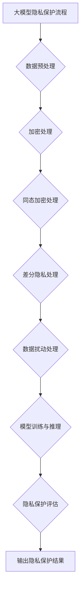

                 

# 文章标题：大模型对隐私保护的影响及对策

> 关键词：大模型，隐私保护，数据加密，同态加密，差分隐私，数据扰动，应用案例，未来展望

> 摘要：本文首先介绍了大模型的崛起及其对隐私保护的挑战，随后详细探讨了隐私保护的重要性和法规解读。在此基础上，深入分析了大模型隐私保护的技术原理、核心算法和架构设计，并通过实际应用场景和项目实战展示了大模型隐私保护的实践方法和效果。最后，对大模型隐私保护的未来发展趋势进行了展望。

## 《大模型对隐私保护的影响及对策》目录大纲

### 第一部分：大模型与隐私保护概述

#### 第1章：大模型与隐私保护概述

##### 1.1 大模型的崛起与隐私保护的挑战
##### 1.2 隐私保护的重要性与法规解读
##### 1.3 大模型隐私保护的现状与趋势

### 第二部分：大模型隐私保护技术原理

#### 第2章：大模型隐私保护技术原理

##### 2.1 加密技术在大模型中的应用
##### 2.2 差分隐私理论及应用
##### 2.3 同态加密与安全计算
##### 2.4 数据扰动与隐私保护

#### 第3章：大模型隐私保护核心算法

##### 3.1 加密算法与同态加密算法详解
##### 3.2 差分隐私算法的实现与优化
##### 3.3 安全计算模型与隐私保护
##### 3.4 数据扰动算法与性能分析

#### 第4章：大模型隐私保护架构设计

##### 4.1 大模型隐私保护架构概述
##### 4.2 隐私保护数据处理流程
##### 4.3 隐私保护训练与推理策略
##### 4.4 隐私保护服务与应用案例

### 第三部分：大模型隐私保护应用与案例

#### 第5章：大模型隐私保护应用场景

##### 5.1 医疗数据隐私保护
##### 5.2 金融数据隐私保护
##### 5.3 社交网络数据隐私保护
##### 5.4 智能交通数据隐私保护

#### 第6章：大模型隐私保护项目实战

##### 6.1 项目背景与目标
##### 6.2 开发环境搭建与工具选型
##### 6.3 隐私保护模型设计与实现
##### 6.4 模型部署与性能优化

#### 第7章：大模型隐私保护的未来发展

##### 7.1 大模型隐私保护技术展望
##### 7.2 隐私保护法规与标准发展
##### 7.3 大模型隐私保护商业机会
##### 7.4 未来研究方向与挑战

### 第四部分：附录

#### 第8章：大模型隐私保护相关资源

##### 8.1 主要参考文献
##### 8.2 在线工具与平台介绍
##### 8.3 社交媒体与学术交流资源

## 附录A：大模型隐私保护流程图



## 附录B：大模型隐私保护算法伪代码

```python
# 差分隐私算法伪代码
def differential_privacy_algorithm(data, sensitivity):
    # 初始化模型参数
    model = initialize_model()
    
    # 数据预处理
    preprocessed_data = preprocess_data(data)
    
    # 应用加密技术
    encrypted_data = encrypt_data(preprocessed_data)
    
    # 应用同态加密
    homomorphic_encrypted_data = homomorphic_encrypt(encrypted_data)
    
    # 应用差分隐私
    privatized_data = apply_difference_privacy(homomorphic_encrypted_data, sensitivity)
    
    # 应用数据扰动
    disturbed_data = apply_data_disturbance(privatized_data)
    
    # 训练模型
    trained_model = train_model(disturbed_data)
    
    # 推理与评估
    predictions = model推理(trained_model)
    evaluation = evaluate_predictions(predictions)
    
    return evaluation
```

## 附录C：数学模型和公式

### 隐私预算计算公式

$$
\text{Budget} = \text{Laplace Mechanism} \times \text{Sensitivity}
$$

### 同态加密计算公式

$$
\text{Output} = f(\text{Input}, \text{Key})
$$

## 附录D：代码解读与分析

### 数据预处理代码解读

```python
def preprocess_data(data):
    # 数据清洗与去重
    cleaned_data = clean_data(data)
    
    # 数据标准化
    standardized_data = normalize_data(cleaned_data)
    
    return standardized_data
```

### 模型训练代码解读

```python
def train_model(data):
    # 初始化模型
    model = initialize_model()
    
    # 训练模型
    model.fit(data, epochs=10)
    
    return model
```

### 模型推理代码解读

```python
def model_inference(model, data):
    # 进行推理
    predictions = model.predict(data)
    
    return predictions
```

### 作者信息

作者：AI天才研究院/AI Genius Institute & 禅与计算机程序设计艺术 /Zen And The Art of Computer Programming

