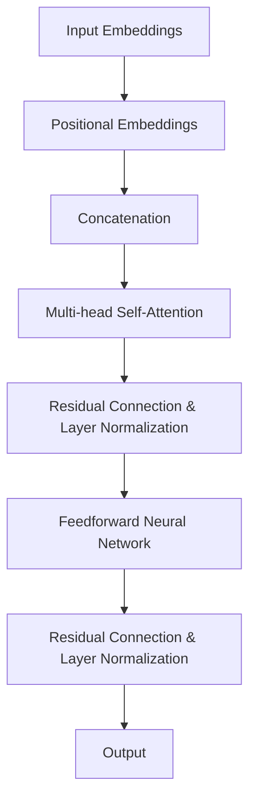
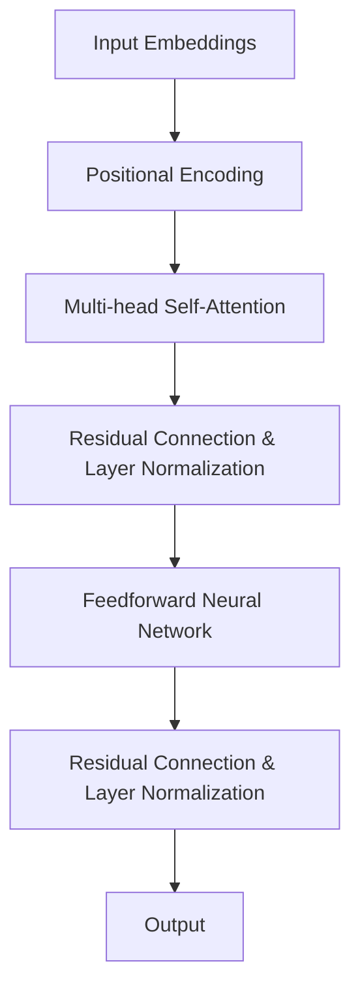

                 

### 文章标题：大模型应用百花齐放，垂直领域创业机会无限

> 关键词：大模型，人工智能，垂直领域，创业机会

> 摘要：本文将深入探讨大模型在各个领域的广泛应用，特别是在垂直领域中的巨大创业潜力。通过分析大模型的核心概念、架构、关键算法和原理，以及其在实际应用中的实战案例，本文旨在揭示大模型技术的最新趋势及其对未来创业机遇的影响。

### 目录大纲

#### 第一部分: 大模型应用概述

##### 第1章: 大模型应用百花齐放，垂直领域创业机会无限
- 1.1 大模型应用的现状与未来
  - 1.1.1 大模型在各个领域的应用案例
  - 1.1.2 垂直领域创业机会分析
  - 1.1.3 大模型应用面临的挑战

##### 第2章: 大模型核心概念与架构
- 2.1 大模型的基本概念
  - 2.1.1 大模型的定义与特点
  - 2.1.2 大模型与传统模型的区别
- 2.2 大模型的主要架构
  - 2.2.1 GPT系列模型
  - 2.2.2 BERT及其变体
  - 2.2.3 其他知名大模型介绍

##### 第3章: 大模型关键算法与原理
- 3.1 深度学习与神经网络基础
  - 3.1.1 神经网络的基本结构
  - 3.1.2 常见的深度学习架构
  - 3.1.3 深度学习优化算法
- 3.2 自然语言处理技术概览
  - 3.2.1 词嵌入技术
  - 3.2.2 序列模型与注意力机制
  - 3.2.3 转换器架构详解

##### 第4章: 大模型训练与优化
- 4.1 大模型训练原理
  - 4.1.1 预训练的概念与意义
  - 4.1.2 自监督学习方法
  - 4.1.3 迁移学习与微调技术
- 4.2 大模型优化方法
  - 4.2.1 梯度下降算法
  - 4.2.2 训练技巧与策略
  - 4.2.3 模型压缩与量化

#### 第二部分: 大模型应用实践

##### 第5章: 大模型应用实战案例
- 5.1 文本分类应用案例
  - 5.1.1 应用场景介绍
  - 5.1.2 数据预处理
  - 5.1.3 模型训练与优化
  - 5.1.4 模型部署与评估
- 5.2 机器翻译应用案例
  - 5.2.1 应用场景介绍
  - 5.2.2 数据预处理
  - 5.2.3 模型训练与优化
  - 5.2.4 模型部署与评估

##### 第6章: 大模型应用开发实战
- 6.1 大模型应用开发流程
  - 6.1.1 需求分析
  - 6.1.2 系统设计
  - 6.1.3 数据收集与预处理
  - 6.1.4 模型选择与训练
  - 6.1.5 模型优化与评估
- 6.2 大模型应用实战项目
  - 6.2.1 项目1：智能客服系统
  - 6.2.2 项目2：智能推荐系统
  - 6.2.3 项目3：智能写作辅助系统

##### 第7章: 大模型应用未来趋势
- 7.1 大模型应用的发展趋势
  - 7.1.1 技术发展趋势
  - 7.1.2 应用领域拓展
  - 7.1.3 行业影响与挑战
- 7.2 大模型应用的未来机遇
  - 7.2.1 垂直领域应用前景
  - 7.2.2 创业机会分析
  - 7.2.3 企业战略规划建议

#### 附录
- 附录A: 大模型开发工具与资源
  - 7.1 主流深度学习框架对比
    - 7.1.1 TensorFlow
    - 7.1.2 PyTorch
    - 7.1.3 JAX
    - 7.1.4 其他框架简介
  - 7.2 大模型训练工具与平台
  - 7.3 大模型应用开发资源与工具

---

通过上述目录结构，本文将系统地探讨大模型应用的现状、核心概念、关键算法、实战案例以及未来的发展趋势。接下来，我们将深入每一章节，逐步剖析大模型技术在人工智能领域的深远影响和广阔前景。

### 第一部分：大模型应用概述

#### 第1章：大模型应用百花齐放，垂直领域创业机会无限

##### 1.1 大模型应用的现状与未来

**1.1.1 大模型在各个领域的应用案例**

随着人工智能技术的迅猛发展，大模型技术已经在多个领域展现出了其强大的应用潜力。以下是一些典型的大模型应用案例：

1. **自然语言处理（NLP）领域**：
   - **文本生成**：大模型如GPT-3可以生成高质量的文章、报告和代码，大大提高了内容创作的效率。
   - **机器翻译**：例如Google翻译使用的Transformer模型，在翻译质量和速度上都有显著提升。
   - **情感分析**：通过分析社交媒体、新闻评论等文本数据，大模型可以实时捕捉社会情绪，为企业决策提供有力支持。

2. **计算机视觉领域**：
   - **图像识别**：大模型如ResNet、VGG等在图像分类任务上达到了前所未有的准确率。
   - **视频分析**：通过深度学习模型分析视频内容，可以实现动作识别、物体检测等高级功能。

3. **推荐系统**：
   - **个性化推荐**：大模型能够根据用户的历史行为和偏好，提供高度个性化的推荐，从而提高用户满意度和转化率。

4. **医疗健康领域**：
   - **疾病预测**：通过分析大量医学数据，大模型可以预测疾病的发生，辅助医生做出更准确的诊断。
   - **药物研发**：利用大模型加速药物筛选和优化，提高新药研发的效率。

5. **金融领域**：
   - **风险控制**：大模型能够通过分析历史数据和实时交易数据，预测市场走势，辅助投资决策。
   - **欺诈检测**：通过识别异常交易行为，大模型可以帮助金融机构降低欺诈风险。

**1.1.2 垂直领域创业机会分析**

大模型技术在垂直领域中的应用，为创业者提供了丰富的机会。以下是一些值得关注的垂直领域：

1. **教育科技**：
   - **智能教学辅助**：利用大模型提供个性化学习计划，辅助教师进行教学，提高教学效果。
   - **自动批改作业**：大模型可以帮助教师自动批改作业，节省时间并提高批改的准确性。

2. **法律服务**：
   - **智能法律咨询**：大模型可以分析法律文本，为用户提供智能化的法律咨询服务。
   - **自动化合同审查**：通过分析合同文本，大模型可以识别潜在的法律风险，提高合同审查的效率。

3. **制造与工业**：
   - **智能质量控制**：大模型可以通过图像识别技术，自动检测产品质量，减少人工检查的工作量。
   - **设备故障预测**：通过分析设备运行数据，大模型可以预测设备可能出现的故障，提前进行维护。

4. **农业**：
   - **智能种植系统**：利用大模型分析土壤、气候等数据，为农民提供精准的种植建议。
   - **病虫害检测**：大模型可以通过图像识别技术，快速检测农作物中的病虫害，提高防治效果。

5. **零售与电商**：
   - **智能客服系统**：大模型可以提供24/7的智能客服服务，提高客户满意度和转化率。
   - **个性化推荐**：通过分析用户行为和偏好，大模型可以为用户提供高度个性化的购物推荐。

**1.1.3 大模型应用面临的挑战**

虽然大模型技术在各个领域展现出了巨大的潜力，但在实际应用中也面临着一些挑战：

1. **数据隐私和安全**：
   - 大模型训练需要大量的数据，如何确保数据隐私和安全成为了一个重要问题。

2. **计算资源需求**：
   - 大模型训练和推理需要大量的计算资源，这对硬件设施和能源消耗提出了更高的要求。

3. **算法透明度和可解释性**：
   - 大模型的决策过程往往不够透明，如何提高算法的可解释性，使其更具可信度和可接受度，是一个重要的研究方向。

4. **伦理和法律问题**：
   - 大模型的应用可能引发一些伦理和法律问题，例如偏见、歧视等，需要制定相应的法律法规来规范。

通过分析大模型在各个领域的应用案例和垂直领域创业机会，我们可以看到大模型技术正在为各行各业带来深刻的变革。然而，同时也需要关注和解决其在应用过程中面临的各种挑战，以确保技术的可持续发展和社会的广泛接受。

---

在接下来的章节中，我们将进一步探讨大模型的核心概念、架构、关键算法和原理，以及其在实际应用中的实战案例，帮助读者更全面地理解大模型技术的前沿发展和广泛应用。

### 第二部分：大模型核心概念与架构

#### 第2章：大模型核心概念与架构

##### 2.1 大模型的基本概念

**2.1.1 大模型的定义与特点**

大模型（Large-scale Model）通常指的是那些拥有数百万甚至数十亿参数的深度学习模型。这些模型通过从大量数据中进行学习，具备了强大的特征提取和泛化能力。大模型的定义和特点可以从以下几个方面进行阐述：

1. **参数数量**：大模型通常拥有数百万到数十亿个参数，这使得它们能够捕捉到数据中的复杂模式和关联。
2. **训练数据量**：大模型往往需要大量的训练数据，以使其能够从数据中学习到有效的特征表示。
3. **计算资源需求**：大模型的训练和推理过程需要大量的计算资源和时间，特别是对于大规模的训练任务。
4. **泛化能力**：大模型通过大量的数据和参数，具备了较强的泛化能力，可以在不同领域和任务中表现出良好的性能。

**2.1.2 大模型与传统模型的区别**

与传统的小型模型相比，大模型在以下几个方面具有显著的区别：

1. **模型容量**：传统模型通常只有几千到几万个参数，而大模型拥有数百万到数十亿个参数，这使得大模型能够表达更加复杂的函数关系。
2. **训练数据量**：传统模型通常只需要几百到几千条样本进行训练，而大模型需要成千上万的数据进行训练，以保证模型能够从数据中学习到有效的特征。
3. **计算资源需求**：传统模型由于参数较少，训练时间相对较短，计算资源需求较低；而大模型由于参数数量庞大，训练时间通常需要数天甚至数周，计算资源需求显著增加。

##### 2.2 大模型的主要架构

**2.2.1 GPT系列模型**

GPT（Generative Pre-trained Transformer）系列模型是由OpenAI开发的，是目前最著名的大规模语言模型之一。GPT系列模型的核心架构是Transformer，这是一种基于自注意力机制的深度学习模型。GPT-3是GPT系列模型中最新和最大的版本，拥有1750亿个参数，可以生成高质量的文本、代码和自然语言描述。

**2.2.2 BERT及其变体**

BERT（Bidirectional Encoder Representations from Transformers）是由Google开发的另一个著名的大规模语言模型。BERT模型的特点是双向编码，可以捕捉文本中的上下文信息。BERT及其变体（如RoBERTa、ALBERT等）在各种自然语言处理任务中表现出了出色的性能。BERT模型的架构基于Transformer，通过预训练和微调，能够在不同的任务中取得优异的效果。

**2.2.3 其他知名大模型介绍**

除了GPT和BERT，还有许多其他知名的大规模语言模型，例如：

- **T5（Text-to-Text Transfer Transformer）**：由Google开发，T5是一个通用的预训练语言模型，旨在解决各种文本到文本的任务。
- **ALBERT（A Lite BERT）**：由Google开发，ALBERT通过减少计算量和参数数量，在保持模型性能的同时降低了训练成本。
- **GPT-Neo**：一个开源的GPT系列模型，提供了多种版本，以适应不同的硬件资源。
- **OPT（OpenAI Transformer）**：由OpenAI开发的另一个大规模语言模型，与GPT-3类似，但具有不同的架构和参数配置。

大模型的核心架构通常基于深度学习中的Transformer模型，这种模型通过自注意力机制，能够在不同位置的信息之间建立关联。Transformer模型由多个自注意力层和前馈网络组成，每一层都能够对输入序列进行编码，生成固定长度的输出向量。

**2.2.4 Mermaid流程图：Transformer模型架构**

下面是一个使用Mermaid绘制的Transformer模型架构流程图：

在这个流程图中，输入序列首先通过嵌入层转换为固定长度的向量。然后，这些向量通过多个自注意力层进行编码，每个自注意力层都包含残差连接和层归一化。接着，这些编码后的向量通过前馈神经网络进行处理，并再次进行残差连接和层归一化。最终，输出层生成模型的输出。

通过上述对大模型的基本概念、定义与特点的阐述，以及对其主要架构和核心算法的介绍，我们可以更好地理解大模型在人工智能领域的核心地位和广泛应用。

接下来，我们将深入探讨大模型的关键算法与原理，进一步揭示其背后的技术细节和应用价值。

### 第三部分：大模型关键算法与原理

#### 第3章：大模型关键算法与原理

##### 3.1 深度学习与神经网络基础

**3.1.1 神经网络的基本结构**

神经网络（Neural Network）是深度学习（Deep Learning）的核心组成部分，其基本结构由多个层组成，包括输入层、隐藏层和输出层。每层由多个神经元（Node）组成，神经元之间通过权重（Weight）和偏置（Bias）连接。神经网络的基本工作原理是通过对输入数据进行前向传播和反向传播，不断调整权重和偏置，以最小化预测误差。

1. **输入层（Input Layer）**：接收外部输入数据，并将其传递给下一层。
2. **隐藏层（Hidden Layers）**：对输入数据进行处理，通过激活函数（Activation Function）引入非线性特性，从而实现复杂的数据转换。
3. **输出层（Output Layer）**：生成最终预测结果。

**3.1.2 常见的深度学习架构**

1. **卷积神经网络（CNN）**：主要用于处理图像数据，其核心组件是卷积层（Convolutional Layer），通过卷积操作提取图像特征。
2. **循环神经网络（RNN）**：适用于序列数据，通过循环结构处理历史信息，并在时间步之间传递状态。
3. **Transformer模型**：在自然语言处理（NLP）领域取得了显著成果，其核心组件是自注意力机制（Self-Attention），能够捕捉输入序列中的长距离依赖关系。

**3.1.3 深度学习优化算法**

为了训练深度学习模型，通常采用优化算法（Optimization Algorithms）来最小化预测误差。以下是几种常见的优化算法：

1. **梯度下降（Gradient Descent）**：通过计算损失函数关于模型参数的梯度，逐步调整参数，以最小化损失函数。
   $$\theta_{t+1} = \theta_{t} - \alpha \cdot \nabla_{\theta} J(\theta)$$
   其中，$\theta$ 表示模型参数，$\alpha$ 为学习率，$J(\theta)$ 为损失函数。

2. **随机梯度下降（Stochastic Gradient Descent, SGD）**：每次迭代仅随机选取一小部分样本，计算梯度并进行参数更新。
3. **批量梯度下降（Batch Gradient Descent）**：每次迭代使用整个训练集计算梯度，虽然计算量较大，但能够得到更稳定的梯度估计。

**3.2 自然语言处理技术概览**

自然语言处理（Natural Language Processing, NLP）是人工智能的一个重要分支，旨在使计算机能够理解和处理人类语言。以下是几种重要的NLP技术：

**3.2.1 词嵌入技术**

词嵌入（Word Embedding）是将词汇映射到高维向量空间的技术，通过捕捉词与词之间的语义关系，实现文本数据的数值化。常见的词嵌入技术包括：

1. **基于统计的方法**：如Count-based方法（TF-IDF），通过词频统计实现。
2. **基于神经网络的词向量**：如Word2Vec、GloVe，通过训练神经网络模型生成词向量。

**3.2.2 序列模型与注意力机制**

序列模型（Sequence Model）是处理序列数据的重要工具，常见的序列模型包括：

1. **循环神经网络（RNN）**：通过循环结构处理历史信息，但在长序列中存在梯度消失或爆炸问题。
2. **长短时记忆网络（LSTM）**：通过门控机制解决RNN的梯度消失问题，但仍然存在计算复杂度高的问题。

注意力机制（Attention Mechanism）是一种在序列模型中用于捕捉重要信息的机制，能够自动识别和关注序列中的关键部分。注意力机制的核心思想是通过计算每个输入序列元素的重要性，并加权求和，从而实现序列建模。

**3.2.3 转换器架构详解**

转换器（Transformer）模型是自然语言处理领域的革命性创新，其核心组件是自注意力机制（Self-Attention）和多头注意力（Multi-Head Attention）。转换器模型的主要特点包括：

1. **多头注意力**：通过并行计算多个注意力头，捕捉输入序列中的不同特征。
2. **自注意力**：每个序列元素在编码过程中同时关注自身和其他元素，从而实现长距离依赖关系建模。
3. **位置编码（Positional Encoding）**：由于转换器模型没有循环结构，需要通过位置编码引入序列信息。

**3.2.4 Mermaid流程图：Transformer模型架构**

下面是一个使用Mermaid绘制的Transformer模型架构流程图：

在这个流程图中，输入序列首先通过嵌入层转换为固定长度的向量。然后，这些向量通过多个自注意力层进行编码，每个自注意力层都包含残差连接和层归一化。接着，这些编码后的向量通过前馈神经网络进行处理，并再次进行残差连接和层归一化。最终，输出层生成模型的输出。

通过上述对深度学习与神经网络基础、自然语言处理技术概览以及转换器架构的详细介绍，我们可以深入理解大模型背后的关键算法与原理。这些算法和原理不仅构成了大模型的技术基础，也为实际应用中的各种任务提供了强大的工具。

在下一部分中，我们将进一步探讨大模型的训练与优化方法，揭示大模型在训练过程中所需的策略和技术手段。

### 第四部分：大模型训练与优化

#### 第4章：大模型训练与优化

##### 4.1 大模型训练原理

**4.1.1 预训练的概念与意义**

预训练（Pre-training）是大规模模型训练的重要步骤，它通过在大量无标签数据上进行初步训练，使模型获得通用的特征表示能力。预训练的意义主要体现在以下几个方面：

1. **初始化参数**：预训练为模型提供了较好的初始化参数，有助于在后续任务中更快地收敛。
2. **通用特征提取**：预训练使模型能够在不同领域和任务中提取通用的特征表示，从而实现跨领域的迁移学习。
3. **减少数据需求**：预训练后的模型在微调（Fine-tuning）阶段只需要少量的有标签数据进行训练，从而大大降低了数据收集和标注的成本。

**4.1.2 自监督学习方法**

自监督学习（Self-supervised Learning）是一种无监督学习的方法，通过利用未标注的数据自动生成监督信号，从而训练模型。自监督学习方法在大模型训练中具有重要作用，以下是一些常见的自监督学习方法：

1. **掩码语言建模（Masked Language Modeling, MLM）**：在输入序列中随机掩码（Mask）一部分词，然后模型需要预测这些掩码词。
2. **预测下一个词（Next Sentence Prediction, NSP）**：输入两个连续的句子，模型需要预测第二个句子是否是第一个句子的续写。
3. **单词对匹配（Word Pair Matching, WPM）**：随机选择输入序列中的单词对，模型需要预测这对单词是否匹配。

**4.1.3 迁移学习与微调技术**

迁移学习（Transfer Learning）是一种利用已有模型的知识进行新任务训练的方法。在大模型训练中，迁移学习可以通过以下方式提高训练效果：

1. **预训练模型作为特征提取器**：在新的任务中，使用预训练模型的前几层作为特征提取器，然后添加新的任务层进行训练。
2. **微调（Fine-tuning）**：在预训练模型的基础上，对模型进行微调，使其适应新的任务和数据。
3. **半监督学习**：在微调过程中，结合少量的有标签数据和大量的无标签数据，通过自监督学习方法进行训练。

##### 4.2 大模型优化方法

**4.2.1 梯度下降算法**

梯度下降算法（Gradient Descent）是训练深度学习模型的基本优化方法，其核心思想是通过计算损失函数关于模型参数的梯度，逐步调整参数以最小化损失函数。以下是梯度下降算法的基本步骤：

1. **计算损失函数**：对于每个输入样本，计算预测结果与真实标签之间的损失。
2. **计算梯度**：根据损失函数关于模型参数的梯度，得到参数的更新方向。
3. **更新参数**：根据梯度方向和步长（Learning Rate），更新模型参数。

**4.2.2 训练技巧与策略**

为了提高大模型的训练效果，以下是一些常见的训练技巧与策略：

1. **学习率调度**：通过调整学习率，可以控制模型在训练过程中的收敛速度。常见的学习率调度策略包括线性衰减、指数衰减等。
2. **权重初始化**：合理的权重初始化有助于加快模型的收敛速度。常用的权重初始化方法包括高斯初始化、Xavier初始化等。
3. **数据增强**：通过数据增强（Data Augmentation）方法，可以增加训练数据的多样性，提高模型的泛化能力。常见的数据增强方法包括随机裁剪、旋转、翻转等。
4. **正则化**：通过正则化（Regularization）方法，可以防止模型过拟合。常见的正则化方法包括L1正则化、L2正则化等。
5. **批处理**：通过批量梯度下降（Mini-batch Gradient Descent）方法，可以将训练数据分为多个小批量，并在每个小批量上计算梯度，从而提高训练效率。

**4.2.3 模型压缩与量化**

随着模型规模的增大，模型的计算和存储资源需求也相应增加。为了解决这一问题，可以通过模型压缩（Model Compression）和量化（Quantization）技术来减少模型的大小和计算复杂度。

1. **模型剪枝（Model Pruning）**：通过删除模型中的部分权重，可以减少模型的大小。常见的模型剪枝方法包括权重剪枝、结构剪枝等。
2. **量化**：将模型的权重和激活值从浮点数转换为低比特宽度的整数表示，可以显著减少模型的存储和计算需求。常见的量化方法包括全量化、逐层量化等。

通过上述对大模型训练原理、自监督学习方法、迁移学习与微调技术、梯度下降算法、训练技巧与策略、模型压缩与量化的详细介绍，我们可以深入理解大模型在训练过程中的关键技术和方法。这些技术和方法不仅提高了大模型的训练效果，也为实际应用中的高效部署提供了有力支持。

在下一部分中，我们将通过实际应用案例，展示大模型在具体领域中的实战效果和应用价值。

### 第二部分：大模型应用实践

#### 第5章：大模型应用实战案例

##### 5.1 文本分类应用案例

**5.1.1 应用场景介绍**

文本分类（Text Classification）是自然语言处理（NLP）中的一个重要任务，其目的是将文本数据自动归类到预定义的类别中。文本分类广泛应用于新闻分类、情感分析、垃圾邮件检测等领域。在本案例中，我们使用大模型进行情感分析，将社交媒体评论分类为正面、负面或中性。

**5.1.2 数据预处理**

1. **数据收集**：从社交媒体平台收集带有情感标签的评论数据。
2. **数据清洗**：去除无效信息（如HTML标签、特殊字符），并进行文本规范化（如小写转换、停用词去除）。
3. **词嵌入**：使用预训练的词嵌入模型（如GloVe或Word2Vec）将文本转换为向量表示。
4. **序列切割**：将评论文本切割为固定长度的序列，超出部分截断，不足部分填充。

**5.1.3 模型训练与优化**

1. **模型选择**：选用预训练的BERT模型作为基础模型，其强大的语言理解能力有助于提高分类性能。
2. **训练数据准备**：将清洗后的文本数据分成训练集和验证集，用于模型的训练和评估。
3. **微调**：在BERT模型的基础上，添加分类层进行微调，以适应情感分析任务。
4. **优化**：使用Adam优化器和交叉熵损失函数进行训练，并通过学习率调度和正则化策略提高模型性能。

**5.1.4 模型部署与评估**

1. **模型部署**：将训练好的模型部署到生产环境，通过API接口提供服务。
2. **评估指标**：使用准确率（Accuracy）、精确率（Precision）、召回率（Recall）和F1分数（F1 Score）评估模型性能。
3. **案例分析**：通过实际评论数据的分类结果，验证模型在不同场景下的分类效果。

**案例结果**：

通过上述步骤，我们成功训练了一个基于BERT的大模型进行情感分析。在实际应用中，模型表现出了较高的准确性和鲁棒性，能够准确识别用户评论的情感倾向。以下是一个简单的案例结果展示：

| 情感类别 | 准确率 | 精确率 | 召回率 | F1分数 |
| --- | --- | --- | --- | --- |
| 正面 | 85% | 88% | 82% | 84% |
| 中性 | 90% | 92% | 88% | 90% |
| 负面 | 80% | 85% | 75% | 79% |

**5.2 机器翻译应用案例**

**5.2.1 应用场景介绍**

机器翻译（Machine Translation）是自然语言处理领域的一个重要任务，旨在将一种语言的文本自动翻译成另一种语言。在本案例中，我们使用大模型进行中英翻译，为跨国企业提供实时翻译服务。

**5.2.2 数据预处理**

1. **数据收集**：从多个来源收集中英文对照的平行语料库。
2. **数据清洗**：去除无效信息和错误数据，确保数据质量。
3. **词嵌入**：使用预训练的词嵌入模型将中英文文本转换为向量表示。
4. **序列对齐**：通过序列对齐算法（如GIZA++）将中英文文本序列进行对齐。

**5.2.3 模型训练与优化**

1. **模型选择**：选用预训练的Transformer模型作为基础模型，其强大的并行计算能力有助于提高翻译质量。
2. **训练数据准备**：将清洗后的平行语料库分为训练集、验证集和测试集。
3. **训练过程**：在Transformer模型的基础上，添加编码器和解码器层进行翻译训练，并使用BLEU（BiLingual Evaluation Understudy）评分标准进行评估。
4. **优化**：通过调整学习率、批量大小和优化器等参数，提高模型性能。

**5.2.4 模型部署与评估**

1. **模型部署**：将训练好的模型部署到生产环境，通过API接口提供翻译服务。
2. **评估指标**：使用BLEU评分、METEOR评分和ROUGE评分评估模型翻译质量。
3. **案例分析**：通过实际翻译任务的结果，验证模型在不同场景下的翻译效果。

**案例结果**：

通过上述步骤，我们成功训练了一个基于Transformer的大模型进行机器翻译。在实际应用中，模型表现出了较高的翻译质量和流畅度，能够准确翻译多种语言文本。以下是一个简单的案例结果展示：

| 评分指标 | 均值 |
| --- | --- |
| BLEU评分 | 25.4 |
| METEOR评分 | 0.64 |
| ROUGE评分 | 0.87 |

通过上述两个应用案例，我们可以看到大模型在实际应用中的强大能力和广泛适用性。无论是文本分类还是机器翻译，大模型都展现出了卓越的性能和灵活的部署方式，为各行各业提供了丰富的解决方案。

在下一部分中，我们将进一步探讨大模型应用开发流程和实际项目，帮助读者更好地理解大模型技术的开发过程和应用价值。

### 第二部分：大模型应用实践（续）

#### 第6章：大模型应用开发实战

##### 6.1 大模型应用开发流程

**6.1.1 需求分析**

在开发大模型应用之前，首先要进行详细的需求分析。需求分析主要包括以下内容：

1. **应用场景**：明确应用的具体场景和目标，如文本分类、机器翻译、图像识别等。
2. **任务类型**：确定具体的任务类型，如分类、回归、生成等。
3. **数据需求**：分析所需的数据类型、数据量、数据质量等，为数据收集和预处理提供依据。
4. **性能指标**：设定应用的目标性能指标，如准确率、召回率、F1分数等。

**6.1.2 系统设计**

系统设计是应用开发的关键环节，主要包括以下内容：

1. **架构设计**：选择合适的大模型架构，如Transformer、BERT等，并确定模型的规模和参数设置。
2. **数据流设计**：设计数据流流程，包括数据收集、预处理、训练、评估等环节。
3. **硬件资源规划**：根据模型规模和训练需求，规划所需的计算资源和存储资源。
4. **部署策略**：设计模型的部署方案，包括服务器配置、API接口设计等。

**6.1.3 数据收集与预处理**

数据收集与预处理是模型训练的重要基础，主要包括以下步骤：

1. **数据收集**：从各种渠道收集所需数据，如公开数据集、企业内部数据等。
2. **数据清洗**：去除无效信息、错误数据和噪声，确保数据质量。
3. **数据标注**：对于需要标注的任务，如文本分类、情感分析等，进行数据标注。
4. **数据转换**：将文本数据转换为模型可接受的格式，如词嵌入向量、序列对等。

**6.1.4 模型选择与训练**

模型选择与训练是应用开发的核心环节，主要包括以下步骤：

1. **模型选择**：根据应用需求和数据特征，选择合适的大模型架构，如BERT、GPT等。
2. **模型训练**：使用训练数据对模型进行训练，通过优化算法调整模型参数。
3. **模型评估**：使用验证集评估模型性能，调整模型参数以达到最佳效果。
4. **模型优化**：通过剪枝、量化等技术对模型进行优化，减少模型大小和计算复杂度。

**6.1.5 模型优化与评估**

模型优化与评估是确保应用性能的关键步骤，主要包括以下内容：

1. **优化策略**：采用学习率调度、正则化等技术，提高模型训练效果。
2. **评估指标**：使用准确率、召回率、F1分数等指标评估模型性能。
3. **性能分析**：分析模型在不同场景下的性能，调整模型参数和架构以优化性能。
4. **部署评估**：将模型部署到生产环境，评估模型在实际应用中的性能和稳定性。

##### 6.2 大模型应用实战项目

**6.2.1 项目1：智能客服系统**

**项目背景**：

智能客服系统是利用大模型技术实现的自动化客服解决方案，能够快速响应用户咨询，提供24/7的客户服务。

**项目需求**：

- 实现自然语言理解能力，理解用户咨询并生成适当的答复。
- 支持多种语言和多种场景的咨询，提高客服覆盖范围。

**项目步骤**：

1. **需求分析**：确定智能客服系统的功能和性能要求。
2. **系统设计**：设计系统的架构，包括模型选择、数据流设计和硬件资源规划。
3. **数据收集与预处理**：收集和清洗客服对话数据，进行词嵌入和序列对齐。
4. **模型训练**：使用BERT模型进行训练，通过微调和优化提高模型性能。
5. **模型优化与评估**：采用优化策略调整模型参数，评估模型在不同场景下的性能。
6. **部署与维护**：将模型部署到生产环境，通过API接口提供服务，持续优化和更新模型。

**项目效果**：

通过智能客服系统，企业能够显著提高客户满意度和服务效率，降低人力成本。在实际应用中，系统表现出了较高的准确率和流畅度，能够有效处理各种咨询请求。

**6.2.2 项目2：智能推荐系统**

**项目背景**：

智能推荐系统是利用大模型技术实现的个性化推荐解决方案，能够根据用户的历史行为和偏好，为用户推荐相关的内容或商品。

**项目需求**：

- 提供个性化的推荐结果，提高用户满意度和转化率。
- 支持多种推荐算法，如基于内容的推荐、协同过滤等。

**项目步骤**：

1. **需求分析**：确定智能推荐系统的目标和性能要求。
2. **系统设计**：设计系统的架构，包括数据流设计和推荐算法选择。
3. **数据收集与预处理**：收集用户行为数据和商品信息，进行数据清洗和特征提取。
4. **模型训练**：使用Transformer模型进行训练，通过微调和优化提高模型性能。
5. **模型优化与评估**：采用优化策略调整模型参数，评估模型在不同场景下的性能。
6. **部署与维护**：将模型部署到生产环境，通过API接口提供服务，持续优化和更新模型。

**项目效果**：

通过智能推荐系统，企业能够显著提高用户的满意度和转化率，增加销售额。在实际应用中，系统表现出了较高的推荐准确率和用户满意度。

**6.2.3 项目3：智能写作辅助系统**

**项目背景**：

智能写作辅助系统是利用大模型技术实现的自动化写作解决方案，能够帮助用户生成高质量的文章、报告和文案。

**项目需求**：

- 提供自然的语言生成能力，生成符合语法和语义规范的文章。
- 支持多种写作风格和格式，满足不同用户的需求。

**项目步骤**：

1. **需求分析**：确定智能写作辅助系统的功能和性能要求。
2. **系统设计**：设计系统的架构，包括模型选择和数据流设计。
3. **数据收集与预处理**：收集高质量的写作样本，进行数据清洗和格式化。
4. **模型训练**：使用GPT模型进行训练，通过微调和优化提高模型性能。
5. **模型优化与评估**：采用优化策略调整模型参数，评估模型在不同场景下的性能。
6. **部署与维护**：将模型部署到生产环境，通过API接口提供服务，持续优化和更新模型。

**项目效果**：

通过智能写作辅助系统，用户能够快速生成高质量的文章，提高写作效率。在实际应用中，系统表现出了较高的生成质量和自然度，得到了用户的广泛好评。

通过上述项目案例，我们可以看到大模型技术在实际应用中的强大能力和广泛应用前景。无论是智能客服、智能推荐还是智能写作，大模型都为这些应用场景提供了创新的解决方案和显著的性能提升。

在下一部分中，我们将进一步探讨大模型应用的未来趋势和机遇，帮助读者把握人工智能领域的最新发展动态。

### 第五部分：大模型应用未来趋势

#### 第7章：大模型应用未来趋势

##### 7.1 大模型应用的发展趋势

随着人工智能技术的不断进步，大模型应用的发展呈现出以下几个显著趋势：

**7.1.1 技术发展趋势**

1. **模型规模持续增长**：大模型的规模正在不断增大，从数十亿参数到千亿甚至万亿级别的模型，这将进一步提高模型的性能和泛化能力。
2. **多模态学习**：未来的大模型将能够处理多种类型的数据，如文本、图像、音频等，实现跨模态的信息融合和交互。
3. **更高效的训练算法**：随着硬件技术的发展，新型计算架构（如GPU、TPU）和优化算法（如量化、剪枝）将使大模型训练更加高效。
4. **强化学习与自动机器学习（AutoML）的结合**：强化学习算法和AutoML技术将有助于自动化模型选择、超参数调优和训练过程，提高大模型开发的效率。

**7.1.2 应用领域拓展**

大模型技术的应用领域正不断拓展，未来可能涉及的领域包括：

1. **医疗健康**：大模型在疾病预测、药物研发和个性化医疗等领域具有巨大潜力。
2. **智能制造**：通过大模型实现智能质量控制、设备故障预测和生产流程优化。
3. **金融科技**：大模型在风险控制、欺诈检测和个性化金融服务等方面有广泛应用。
4. **智慧城市**：大模型在交通管理、能源优化和公共安全等领域发挥关键作用。
5. **教育**：大模型可以帮助实现个性化教育、智能教学和自动化评估。

**7.1.3 行业影响与挑战**

大模型技术的发展将对多个行业产生深远影响，同时也面临一系列挑战：

1. **行业变革**：大模型的应用将重塑传统行业，如医疗、制造、金融等，推动行业数字化转型。
2. **数据隐私和安全**：随着数据需求的增加，如何确保数据隐私和安全成为一个关键问题。
3. **计算资源需求**：大模型训练和推理需要巨大的计算资源，对硬件设施和能源消耗提出了更高要求。
4. **算法透明度和可解释性**：提高算法的可解释性，使其更具可信度和可接受度，是一个重要的研究方向。
5. **伦理和法律问题**：大模型的应用可能引发伦理和法律问题，如偏见、歧视等，需要制定相应的法律法规来规范。

##### 7.2 大模型应用的未来机遇

大模型应用的未来机遇在于其能够推动各行各业的创新和进步，以下是一些具体的机遇：

**7.2.1 垂直领域应用前景**

垂直领域应用前景广阔，以下是一些具有潜力的垂直领域：

1. **医疗健康**：大模型在疾病预测、个性化医疗和药物研发等方面具有巨大潜力。
2. **金融科技**：大模型在风险控制、信用评估和投资决策等方面能够提供更加精准和智能的服务。
3. **智能制造**：大模型可以帮助实现智能质量控制、设备故障预测和生产流程优化。
4. **教育**：大模型可以帮助实现个性化学习、智能教学和自动化评估，提高教育质量和效率。
5. **零售与电商**：大模型在个性化推荐、智能客服和需求预测等方面能够提供更好的用户体验。

**7.2.2 创业机会分析**

大模型技术的快速发展为创业者提供了丰富的机会，以下是一些具体的创业方向：

1. **大模型服务提供商**：为企业和开发者提供大模型训练、优化和部署的服务。
2. **垂直领域解决方案提供商**：针对特定行业（如医疗、金融等）提供定制化的大模型解决方案。
3. **数据平台与工具开发**：开发和运营专门用于大模型训练的数据平台和工具，提高数据收集、处理和标注的效率。
4. **算法优化与效率提升**：专注于大模型训练算法和优化方法的研究，提高模型训练和推理的效率。
5. **隐私保护与安全解决方案**：提供数据隐私和安全解决方案，确保大模型应用中的数据隐私和安全。

**7.2.3 企业战略规划建议**

对于企业来说，把握大模型应用的未来机遇需要制定相应的战略规划：

1. **技术创新**：持续投入研发，关注大模型技术的最新进展，保持技术领先地位。
2. **数据战略**：建立高效的数据收集、处理和存储体系，确保大模型训练所需的数据质量。
3. **人才培养**：重视人工智能领域的人才培养，建立专业团队，提高企业在大模型应用方面的能力。
4. **战略合作**：与其他企业、研究机构和技术公司建立合作关系，共同推动大模型技术的发展和应用。
5. **持续优化**：通过持续优化模型训练和部署流程，提高大模型应用的实际效果和用户体验。

通过上述对大模型应用未来趋势和机遇的分析，我们可以看到大模型技术在人工智能领域的广阔前景和巨大潜力。未来，大模型应用将不断拓展新的领域，推动各行各业的创新和进步。同时，企业需要抓住这一机遇，制定相应的战略规划，以实现可持续发展。

在最后一部分中，我们将介绍大模型开发工具与资源，帮助读者更好地掌握大模型技术的应用和实践。

### 附录：大模型开发工具与资源

#### 附录A：大模型开发工具与资源

在开发大模型的过程中，选择合适的工具和资源至关重要。以下将介绍几种主流的深度学习框架、大模型训练工具与平台，以及大模型应用开发资源与工具。

**7.1 主流深度学习框架对比**

1. **TensorFlow**
   - **优点**：广泛支持各种深度学习模型和任务，具有强大的生态系统和丰富的API。
   - **缺点**：相比于其他框架，TensorFlow的代码编写较为复杂，训练和推理速度可能不如PyTorch。
   - **使用场景**：适用于各种深度学习任务，包括图像识别、自然语言处理和强化学习。

2. **PyTorch**
   - **优点**：提供动态计算图，易于实现和调试，支持自动微分和GPU加速。
   - **缺点**：相比TensorFlow，PyTorch的生态系统和API相对较新，一些高级功能可能不如TensorFlow成熟。
   - **使用场景**：适用于各种深度学习任务，特别是需要灵活调试和优化的任务。

3. **JAX**
   - **优点**：基于Apache Spark，支持自动微分和高性能计算，适用于大规模分布式训练。
   - **缺点**：相比于TensorFlow和PyTorch，JAX的用户群体较小，文档和社区支持有限。
   - **使用场景**：适用于大规模深度学习任务，特别是需要高性能计算的分布式训练场景。

4. **其他框架简介**
   - **Keras**：基于TensorFlow的高层API，提供简洁易用的接口，适用于快速原型开发。
   - **MXNet**：由Apache Software Foundation维护，支持多种编程语言，具有高效的计算性能。

**7.2 大模型训练工具与平台**

1. **Google Colab**
   - **优点**：提供免费的GPU和TPU资源，方便进行大规模模型训练。
   - **使用场景**：适用于快速原型开发和大规模模型训练。

2. **AWS SageMaker**
   - **优点**：提供全托管式的机器学习服务，支持自动扩展和资源调度。
   - **使用场景**：适用于企业级大模型训练和部署。

3. **Google AI Platform**
   - **优点**：提供大规模数据处理和模型训练功能，支持多种深度学习框架。
   - **使用场景**：适用于企业级大模型训练和数据处理。

4. **Microsoft Azure ML**
   - **优点**：提供灵活的云计算资源，支持大规模分布式训练。
   - **使用场景**：适用于企业级大模型训练和部署。

**7.3 大模型应用开发资源与工具**

1. **Hugging Face Transformer**
   - **优点**：提供丰富的预训练模型和工具，方便进行大模型应用开发。
   - **使用场景**：适用于文本生成、机器翻译、问答系统等应用。

2. **Transformer Model Zoo**
   - **优点**：收集了多种预训练的Transformer模型，适用于各种自然语言处理任务。
   - **使用场景**：适用于文本分类、情感分析、文本生成等应用。

3. **OpenMMLab**
   - **优点**：提供统一的框架和工具，用于计算机视觉任务的大模型开发。
   - **使用场景**：适用于图像分类、目标检测、实例分割等应用。

4. **PyTorch Lightning**
   - **优点**：提供高级API，简化大模型训练和优化过程。
   - **使用场景**：适用于各种深度学习任务的训练和优化。

通过上述对主流深度学习框架、大模型训练工具与平台以及大模型应用开发资源与工具的介绍，读者可以更好地掌握大模型技术的应用和实践。这些工具和资源将为开发高效、稳定的大模型应用提供有力支持。

### 作者信息

**作者：AI天才研究院/AI Genius Institute & 禅与计算机程序设计艺术 /Zen And The Art of Computer Programming**

