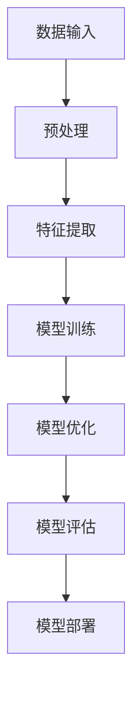

                 

## 文章标题: 大模型技术的可持续发展

在当今快速发展的信息技术时代，大模型技术已成为人工智能领域的核心驱动力。无论是自然语言处理、计算机视觉，还是其他众多应用领域，大模型技术都在不断突破传统技术的边界，带来前所未有的创新和变革。然而，随着大模型技术的日益普及和其应用范围的不断扩大，其可持续发展问题也日益凸显。本文将围绕大模型技术的可持续发展展开讨论，分析其基础、应用、挑战及未来发展趋势，以期为相关研究和实践提供有价值的参考。

## 文章关键词

大模型技术、可持续发展、自然语言处理、计算机视觉、监管与伦理、未来展望

## 文章摘要

本文首先对大模型技术进行了全面概述，介绍了其起源、发展历程以及核心概念和算法原理。随后，本文深入探讨了大模型技术在自然语言处理和计算机视觉领域的具体应用，并分析了其可持续性问题。在此基础上，本文探讨了大模型技术的监管与伦理问题，提出了相关的可持续发展策略。最后，本文对大模型技术的未来发展趋势进行了展望，并提出了可持续发展路径的探索。通过本文的讨论，旨在为推动大模型技术的健康和可持续发展提供理论支持和实践指导。

## 第一部分: 大模型技术基础

### 第1章: 大模型技术概述

#### 1.1 大模型技术的起源与发展

大模型技术起源于20世纪90年代的神经网络研究。在这一时期，研究人员开始尝试使用更复杂的神经网络结构来处理大规模数据，以提升模型的性能。然而，由于计算资源和数据集的限制，早期的神经网络模型规模相对较小，难以发挥其潜力。

进入21世纪，随着计算能力的飞速提升和大数据技术的发展，大模型技术逐渐崭露头角。特别是深度学习的兴起，使得大模型技术得到了前所未有的发展。2012年，AlexNet在ImageNet竞赛中取得了突破性的成绩，标志着深度学习时代的到来。此后，越来越多的研究投入到深度学习领域，大模型技术得到了迅速发展和广泛应用。

#### 1.1.1 大模型技术的概念

大模型技术是指使用具有数百万甚至数十亿参数的深度学习模型来处理大规模数据的方法。这些模型通常由多层神经网络组成，包括输入层、隐藏层和输出层。通过不断优化和调整模型参数，大模型技术能够自动学习数据中的特征和规律，从而实现对复杂数据的处理和预测。

#### 1.1.2 大模型技术的发展历程

1. **早期研究（1980s-1990s）**：神经网络作为一种计算模型，开始引起研究者的关注。虽然早期的神经网络模型规模较小，但其思想为后续的发展奠定了基础。

2. **深度学习的兴起（2006-2012）**：Hinton等人在2006年提出了深度信念网络（DBN），标志着深度学习的研究进入了一个新的阶段。随后，卷积神经网络（CNN）和递归神经网络（RNN）等模型相继出现，为深度学习的发展做出了重要贡献。

3. **突破性进展（2012-2017）**：AlexNet在ImageNet竞赛中的突破性表现，引发了深度学习的热潮。此后，Google Brain团队训练了一个拥有1.7亿参数的神经网络，成功展示了深度学习在大规模数据处理中的潜力。

4. **快速发展（2017-至今）**：随着计算资源和数据集的进一步扩展，大模型技术在各个领域得到了广泛应用。Transformer模型的提出，使得自然语言处理领域取得了重大突破，BERT、GPT等模型相继出现，大模型技术迎来了新的发展高峰。

#### 1.1.3 大模型技术的应用领域

大模型技术在多个领域取得了显著的应用成果：

1. **自然语言处理**：大模型技术在语言模型、文本生成、问答系统等方面有着广泛的应用，如BERT、GPT等模型。

2. **计算机视觉**：大模型技术在图像分类、目标检测、图像生成等方面取得了重要进展，如ResNet、GAN等模型。

3. **语音识别**：大模型技术在语音识别领域表现出色，如基于深度学习的ASR系统。

4. **推荐系统**：大模型技术在推荐系统中的应用，能够有效提高推荐的准确性和用户体验。

5. **生物信息学**：大模型技术在基因组分析、药物设计等领域展现出巨大的潜力。

### 1.2 大模型技术核心概念与联系

为了更好地理解大模型技术，我们需要先了解其中的一些核心概念和它们之间的联系。

1. **深度学习**：深度学习是一种基于多层神经网络的学习方法，通过逐层提取数据特征，实现对复杂数据的处理和预测。

2. **神经网络**：神经网络是由大量简单计算单元（神经元）组成的网络，通过调整神经元之间的权重，实现数据的处理和预测。

3. **多层感知器**：多层感知器（MLP）是一种简单的多层神经网络结构，通过输入层、隐藏层和输出层，实现对复杂数据的处理和预测。

4. **卷积神经网络（CNN）**：卷积神经网络是一种专门用于处理图像数据的神经网络结构，通过卷积操作提取图像特征，实现对图像的分类、检测等任务。

5. **循环神经网络（RNN）**：循环神经网络是一种适用于处理序列数据的神经网络结构，通过循环机制，实现对序列数据的有效处理和预测。

6. **Transformer**：Transformer是一种基于自注意力机制的深度学习模型，在自然语言处理领域表现出色，特别是BERT和GPT等模型。

7. **生成对抗网络（GAN）**：生成对抗网络是一种由生成器和判别器组成的模型，通过对抗训练，实现高质量数据的生成。

#### 1.2.2 大模型技术核心架构的 Mermaid 流程图

以下是一个简单的大模型技术核心架构的Mermaid流程图：



这个流程图展示了从数据输入到模型部署的基本过程。在实际应用中，这个流程可能更加复杂，需要考虑数据预处理、特征提取、模型训练、优化、评估和部署等多个环节。

### 1.3 大模型技术核心算法原理

大模型技术的核心算法主要包括深度学习算法、神经网络算法和优化算法等。下面将分别介绍这些算法的基本原理。

#### 1.3.1 大模型训练的基本流程

1. **数据预处理**：在训练模型之前，需要对数据进行预处理，包括数据清洗、数据归一化、数据扩充等操作。

2. **模型初始化**：初始化模型参数，通常采用随机初始化或预训练模型。

3. **前向传播**：将输入数据传递到模型中，计算输出结果。

4. **损失函数计算**：计算输出结果与真实标签之间的差异，得到损失值。

5. **反向传播**：通过反向传播算法，计算损失关于模型参数的梯度。

6. **模型更新**：根据梯度更新模型参数，减小损失值。

7. **迭代训练**：重复上述步骤，直到满足训练目标（如损失值低于阈值或达到预设迭代次数）。

#### 1.3.2 大模型算法伪代码讲解

以下是一个简单的大模型训练算法的伪代码：

```python
# 数据预处理
X = preprocess_data(data)

# 模型初始化
model = initialize_model()

# 迭代训练
for epoch in range(num_epochs):
    for x, y in data_loader:
        # 前向传播
        output = model(x)

        # 损失函数计算
        loss = loss_function(output, y)

        # 反向传播
        gradients = backward_propagation(output, y)

        # 模型更新
        update_model_params(gradients)

# 模型评估
accuracy = evaluate_model(model, test_data)

print("Training completed, accuracy:", accuracy)
```

这个伪代码展示了模型训练的基本流程，包括数据预处理、模型初始化、迭代训练和模型评估等步骤。

### 1.4 大模型技术的数学模型和公式

大模型技术的数学模型和公式是其核心算法的重要组成部分，下面将介绍一些关键数学模型和公式的详细讲解及举例说明。

#### 1.4.1 大模型中的关键数学模型

1. **激活函数**：激活函数是神经网络中的一个关键组件，用于引入非线性特性。常见的激活函数包括Sigmoid、ReLU、Tanh等。

2. **损失函数**：损失函数用于衡量模型预测值与真实值之间的差异。常见的损失函数包括均方误差（MSE）、交叉熵（Cross Entropy）等。

3. **优化算法**：优化算法用于调整模型参数，以最小化损失函数。常见的优化算法包括随机梯度下降（SGD）、Adam等。

4. **卷积操作**：卷积操作是卷积神经网络中的核心组件，用于提取图像特征。

5. **池化操作**：池化操作用于降低数据维度，减少计算量。

#### 1.4.2 大模型技术的数学公式详细讲解

1. **激活函数公式**：

   - Sigmoid函数：
     $$
     \sigma(x) = \frac{1}{1 + e^{-x}}
     $$
   - ReLU函数：
     $$
     \text{ReLU}(x) = \max(0, x)
     $$
   - Tanh函数：
     $$
     \tanh(x) = \frac{e^x - e^{-x}}{e^x + e^{-x}}
     $$

2. **损失函数公式**：

   - 均方误差（MSE）：
     $$
     \text{MSE} = \frac{1}{n}\sum_{i=1}^{n}(y_i - \hat{y}_i)^2
     $$
   - 交叉熵（Cross Entropy）：
     $$
     \text{Cross Entropy} = -\sum_{i=1}^{n}y_i\log(\hat{y}_i)
     $$

3. **优化算法公式**：

   - 随机梯度下降（SGD）：
     $$
     \theta_{\text{new}} = \theta_{\text{old}} - \alpha \nabla_{\theta}J(\theta)
     $$
   - Adam优化器：
     $$
     m_t = \beta_1 m_{t-1} + (1 - \beta_1) \nabla_{\theta}J(\theta)
     $$
     $$
     v_t = \beta_2 v_{t-1} + (1 - \beta_2) (\nabla_{\theta}J(\theta))^2
     $$
     $$
     \theta_{\text{new}} = \theta_{\text{old}} - \alpha \frac{m_t}{\sqrt{v_t} + \epsilon}
     $$

4. **卷积操作公式**：

   - 卷积操作：
     $$
     (f * g)(x) = \int_{-\infty}^{+\infty} f(\tau) g(x - \tau) d\tau
     $$

5. **池化操作公式**：

   - 最大池化：
     $$
     \text{Max Pooling}(x) = \max(x_{i, j})
     $$
   - 平均池化：
     $$
     \text{Average Pooling}(x) = \frac{1}{k^2} \sum_{i=1}^{k} \sum_{j=1}^{k} x_{i, j}
     $$

#### 1.4.3 数学公式举例说明

以下是一个简单的示例，说明如何使用ReLU函数和MSE损失函数进行前向传播和反向传播。

**前向传播示例**：

假设我们有一个简单的神经网络，包含一个输入层、一个隐藏层和一个输出层，其中激活函数为ReLU，损失函数为MSE。

1. **输入层**：
   $$
   x_1 = [1, 2, 3]
   $$

2. **隐藏层**：
   $$
   h_1 = \text{ReLU}(W_1 \cdot x_1 + b_1)
   $$
   $$
   h_2 = \text{ReLU}(W_2 \cdot h_1 + b_2)
   $$

3. **输出层**：
   $$
   y = \text{ReLU}(W_3 \cdot h_2 + b_3)
   $$

**损失函数计算**：

假设真实标签为 $y^* = [1, 0, 1]$，则损失函数为MSE：
   $$
   \text{MSE} = \frac{1}{3} \sum_{i=1}^{3} (y_i - \hat{y}_i)^2
   $$

**反向传播示例**：

假设我们已经计算出了损失函数关于模型参数的梯度：
   $$
   \nabla_{W_3} = \frac{\partial \text{MSE}}{\partial W_3}
   $$
   $$
   \nabla_{b_3} = \frac{\partial \text{MSE}}{\partial b_3}
   $$
   $$
   \nabla_{W_2} = \frac{\partial \text{MSE}}{\partial W_2}
   $$
   $$
   \nabla_{b_2} = \frac{\partial \text{MSE}}{\partial b_2}
   $$
   $$
   \nabla_{W_1} = \frac{\partial \text{MSE}}{\partial W_1}
   $$
   $$
   \nabla_{b_1} = \frac{\partial \text{MSE}}{\partial b_1}
   $$

根据反向传播算法，我们可以将这些梯度反向传播到模型的每一层，从而更新模型参数。

通过以上示例，我们可以看到大模型技术的数学模型和公式的具体应用。在实际应用中，这些模型和公式会涉及到更复杂的计算和优化，但基本的原理和方法是一致的。

## 第二部分: 大模型技术在自然语言处理中的应用

### 第2章: 大模型技术在自然语言处理中的应用

自然语言处理（NLP）是人工智能领域的一个重要分支，旨在使计算机能够理解和处理人类语言。随着深度学习和大模型技术的不断发展，NLP取得了显著的进展。在这一章中，我们将探讨大模型技术在自然语言处理中的应用，包括语言模型、文本生成与摘要、问答系统与对话生成等方面。

#### 2.1 自然语言处理基础知识

在探讨大模型技术在自然语言处理中的应用之前，我们需要了解一些NLP的基础知识。

##### 2.1.1 语言模型的基本概念

语言模型是NLP的核心组成部分，用于预测一段文本的下一个词或下一个序列。语言模型通常由一组参数组成，这些参数通过训练数据学习得到。常见的语言模型包括：

1. **n-gram模型**：基于前n个单词预测下一个单词。
2. **神经网络语言模型**：使用神经网络学习文本数据中的统计规律。
3. **循环神经网络（RNN）语言模型**：通过循环机制处理变长的序列数据。
4. **Transformer语言模型**：基于自注意力机制的深度学习模型，在NLP任务中表现出色。

##### 2.1.2 词嵌入技术原理

词嵌入是将单词映射到低维向量空间的一种方法，用于表示单词的语义信息。词嵌入技术能够有效地捕捉单词之间的相似性和相关性，有助于提高NLP任务的性能。常见的词嵌入方法包括：

1. **基于分布的词嵌入**：如Word2Vec，通过训练神经网络预测上下文词向量。
2. **基于转换的词嵌入**：如GloVe，通过矩阵分解学习词向量。
3. **基于神经网络的词嵌入**：如BERT，通过大规模预训练模型生成高质量的词向量。

##### 2.1.3 序列模型与注意力机制

序列模型是处理序列数据的一种神经网络结构，常用于NLP任务。RNN和Transformer是两种常见的序列模型。

1. **RNN**：通过循环机制，逐个处理序列中的每个元素，保持历史信息。
2. **Transformer**：基于自注意力机制，能够同时关注序列中的所有元素，提高模型的表达能力。

注意力机制是序列模型中的一个关键组件，用于自动学习输入序列中不同元素的重要性。常见的注意力机制包括：

1. **点积注意力**：通过点积计算注意力得分。
2. **多头注意力**：同时关注序列中的不同元素，提高模型的鲁棒性。
3. **自注意力**：在Transformer模型中广泛应用，能够捕捉长距离依赖关系。

#### 2.2 大模型在自然语言处理中的具体应用

##### 2.2.1 语言模型训练与优化

语言模型的训练是NLP任务的基础。大模型技术在语言模型训练和优化方面发挥了重要作用。以下是一些关键步骤：

1. **数据预处理**：对原始文本进行分词、去停用词等预处理操作。
2. **词嵌入**：将文本中的每个词映射到低维向量空间。
3. **模型训练**：使用大规模语料库训练语言模型，调整模型参数。
4. **优化**：通过优化算法（如Adam）调整模型参数，提高模型性能。

##### 2.2.2 文本生成与摘要

文本生成与摘要是NLP中的重要任务，大模型技术在这一领域表现出色。以下是一些关键步骤：

1. **生成模型**：如生成对抗网络（GAN）和变分自编码器（VAE），用于生成高质量的文本。
2. **预训练语言模型**：使用大规模语料库预训练语言模型，提高生成文本的质量。
3. **解码策略**：如贪心策略和采样策略，用于生成文本序列。

文本摘要分为抽取式摘要和生成式摘要：

1. **抽取式摘要**：从原始文本中提取关键信息，生成摘要。
2. **生成式摘要**：使用生成模型生成摘要，提高摘要的连贯性和语义一致性。

##### 2.2.3 问答系统与对话生成

问答系统与对话生成是NLP领域的热门研究方向，大模型技术在其中发挥了关键作用。以下是一些关键步骤：

1. **预训练语言模型**：使用大规模语料库预训练语言模型，提高问答系统的性能。
2. **文本理解**：通过自然语言理解技术，理解用户的问题或指令。
3. **回答生成**：使用生成模型或抽取式方法生成回答。
4. **对话生成**：结合上下文信息，生成连贯、自然的对话。

对话系统可以分为基于规则的对话系统和基于数据的对话系统：

1. **基于规则的对话系统**：通过定义一组规则，生成对话回答。
2. **基于数据的对话系统**：使用大规模对话数据训练模型，生成对话回答。

#### 2.3 大模型在自然语言处理中的应用案例

##### 2.3.1 基于GPT的文本生成系统

GPT（Generative Pre-trained Transformer）是一种基于Transformer架构的语言模型，广泛应用于文本生成任务。以下是一个基于GPT的文本生成系统的实现过程：

1. **数据预处理**：对原始文本进行分词、去停用词等预处理操作。
2. **词嵌入**：将文本中的每个词映射到低维向量空间。
3. **模型训练**：使用大规模语料库训练GPT模型，调整模型参数。
4. **生成文本**：使用GPT模型生成文本序列。

以下是一个简单的GPT文本生成代码示例：

```python
from transformers import GPT2LMHeadModel, GPT2Tokenizer

# 加载预训练的GPT2模型
model = GPT2LMHeadModel.from_pretrained("gpt2")
tokenizer = GPT2Tokenizer.from_pretrained("gpt2")

# 输入文本
input_text = "这是一个关于人工智能的文本。"

# 分词并转换为输入序列
inputs = tokenizer.encode(input_text, return_tensors="pt")

# 生成文本
outputs = model.generate(inputs, max_length=50, num_return_sequences=1)

# 转换为文本输出
generated_text = tokenizer.decode(outputs[0], skip_special_tokens=True)
print(generated_text)
```

##### 2.3.2 基于BERT的问答系统

BERT（Bidirectional Encoder Representations from Transformers）是一种基于Transformer架构的双向编码语言模型，广泛应用于问答系统。以下是一个基于BERT的问答系统的实现过程：

1. **数据预处理**：对原始问答数据集进行预处理，包括分词、标记化等操作。
2. **模型训练**：使用预处理后的数据集训练BERT模型，调整模型参数。
3. **问答**：使用训练好的BERT模型进行问答，生成回答。

以下是一个简单的BERT问答系统代码示例：

```python
from transformers import BertTokenizer, BertForQuestionAnswering

# 加载预训练的BERT模型
tokenizer = BertTokenizer.from_pretrained("bert-base-chinese")
model = BertForQuestionAnswering.from_pretrained("bert-base-chinese")

# 输入问题
question = "什么是人工智能？"
# 输入文本
context = "人工智能是计算机科学的一个分支，致力于使计算机能够执行需要人类智能的任务。"

# 分词并转换为输入序列
input_ids = tokenizer.encode(question + tokenizer.eos_token, return_tensors="pt")
input_ids_context = tokenizer.encode(context, return_tensors="pt")

# 输入模型进行问答
outputs = model(input_ids_context=input_ids_context, input_ids=input_ids)

# 获取答案
start_logits = outputs.start_logits
end_logits = outputs.end_logits
start_indices = torch.argmax(start_logits, dim=-1)
end_indices = torch.argmax(end_logits, dim=-1)

# 解码答案
start_index = start_indices[0].item()
end_index = end_indices[0].item()
answer_tokens = tokenizer.decode(input_ids_context.squeeze(0)[start_index:end_index + 1], skip_special_tokens=True)
print(answer_tokens)
```

通过以上两个应用案例，我们可以看到大模型技术在自然语言处理中的应用方法和实现过程。这些案例展示了大模型技术在文本生成和问答系统中的强大能力，为NLP领域的研究和应用提供了有力的支持。

## 第3章: 大模型技术在计算机视觉中的应用

计算机视觉是人工智能领域的一个重要分支，旨在使计算机能够从图像或视频中提取有意义的信息。大模型技术在计算机视觉领域取得了显著的进展，推动了图像分类、目标检测、图像生成等多个方向的发展。在这一章中，我们将探讨大模型技术在计算机视觉中的应用，包括图像处理基础、卷积神经网络（CNN）原理、目标检测与图像分类等方面。

### 3.1 计算机视觉基础知识

计算机视觉的基础知识包括图像处理、特征提取和目标检测等。

#### 3.1.1 图像处理基础

图像处理是计算机视觉的基础，主要包括图像的获取、预处理和变换等操作。

1. **图像获取**：计算机通过摄像头或其他传感器获取图像数据。
2. **图像预处理**：包括图像增强、去噪、锐化等操作，以提高图像质量。
3. **图像变换**：包括旋转、缩放、翻转等操作，以适应不同的应用需求。

#### 3.1.2 卷积神经网络（CNN）原理

卷积神经网络（CNN）是一种专门用于处理图像数据的神经网络结构，通过卷积操作提取图像特征。

1. **卷积操作**：卷积操作用于将卷积核（过滤器）与图像进行卷积，提取图像特征。
2. **池化操作**：池化操作用于降低数据维度，减少计算量，提高模型的鲁棒性。
3. **卷积层**：卷积层是CNN的核心组件，通过逐层提取图像特征，实现对图像的分类、检测等任务。

#### 3.1.3 目标检测与图像分类

目标检测与图像分类是计算机视觉中的两个重要任务。

1. **目标检测**：目标检测旨在从图像中检测出特定的目标物体，并确定其位置。常见的目标检测算法包括YOLO、SSD、Faster R-CNN等。
2. **图像分类**：图像分类旨在将图像分类到预定的类别中。常见的图像分类算法包括AlexNet、VGG、ResNet等。

### 3.2 大模型在计算机视觉中的具体应用

#### 3.2.1 图像生成与风格迁移

大模型技术在图像生成与风格迁移方面取得了显著进展。以下是一些关键步骤：

1. **生成对抗网络（GAN）**：生成对抗网络是一种由生成器和判别器组成的模型，通过对抗训练生成高质量的图像。常见的GAN模型包括DCGAN、StyleGAN等。
2. **风格迁移**：风格迁移旨在将一张图像的风格迁移到另一张图像上。常见的风格迁移算法包括DeepArt、Cyberpunk等。

以下是一个简单的GAN图像生成代码示例：

```python
import torch
from torch import nn
from torch.optim import Adam
from torchvision import datasets, transforms

# 数据预处理
transform = transforms.Compose([transforms.ToTensor()])
dataset = datasets.ImageFolder(root='image_dataset', transform=transform)
dataloader = torch.utils.data.DataLoader(dataset, batch_size=64, shuffle=True)

# 生成器模型
class Generator(nn.Module):
    def __init__(self):
        super(Generator, self).__init__()
        self.model = nn.Sequential(
            nn.ConvTranspose2d(100, 256, 4, 1, 0, bias=False),
            nn.BatchNorm2d(256),
            nn.ReLU(True),
            nn.ConvTranspose2d(256, 128, 4, 2, 1, bias=False),
            nn.BatchNorm2d(128),
            nn.ReLU(True),
            nn.ConvTranspose2d(128, 64, 4, 2, 1, bias=False),
            nn.BatchNorm2d(64),
            nn.ReLU(True),
            nn.ConvTranspose2d(64, 3, 4, 2, 1, bias=False),
            nn.Tanh()
        )

    def forward(self, x):
        return self.model(x)

# 判别器模型
class Discriminator(nn.Module):
    def __init__(self):
        super(Discriminator, self).__init__()
        self.model = nn.Sequential(
            nn.Conv2d(3, 64, 4, 2, 1, bias=False),
            nn.LeakyReLU(0.2, inplace=True),
            nn.Conv2d(64, 128, 4, 2, 1, bias=False),
            nn.BatchNorm2d(128),
            nn.LeakyReLU(0.2, inplace=True),
            nn.Conv2d(128, 256, 4, 2, 1, bias=False),
            nn.BatchNorm2d(256),
            nn.LeakyReLU(0.2, inplace=True),
            nn.Conv2d(256, 1, 4, 1, 0, bias=False),
            nn.Sigmoid()
        )

    def forward(self, x):
        return self.model(x)

# GAN模型
class GAN(nn.Module):
    def __init__(self):
        super(GAN, self).__init__()
        self.generator = Generator()
        self.discriminator = Discriminator()

    def forward(self, x):
        return self.generator(x)

# 模型训练
model = GAN()
optimizer = Adam(model.parameters(), lr=0.0002, betas=(0.5, 0.999))
criterion = nn.BCELoss()

for epoch in range(num_epochs):
    for i, (images, _) in enumerate(dataloader):
        # 生成器训练
        z = torch.randn(images.size(0), 100, 1, 1)
        fake_images = model.generator(z)
        outputs = model.discriminator(fake_images)
        g_loss = criterion(outputs, torch.ones_like(outputs))

        # 判别器训练
        real_images = images
        real_outputs = model.discriminator(real_images)
        d_loss = criterion(real_outputs, torch.ones_like(real_outputs))
        fake_outputs = model.discriminator(fake_images.detach())
        d_loss += criterion(fake_outputs, torch.zeros_like(fake_outputs))

        # 梯度更新
        optimizer.zero_grad()
        g_loss.backward()
        d_loss.backward()
        optimizer.step()

        if (i+1) % 100 == 0:
            print(f'[{epoch}/{num_epochs}] [Step {i+1}/{len(dataloader)}] g_loss: {g_loss.item():.4f}, d_loss: {d_loss.item():.4f}')
```

#### 3.2.2 视觉任务中的大模型优化

大模型在视觉任务中表现出色，但训练和优化过程也面临诸多挑战。以下是一些优化策略：

1. **数据增强**：通过旋转、缩放、裁剪等操作增加数据的多样性，提高模型泛化能力。
2. **迁移学习**：利用预训练模型，减少训练数据需求，提高模型性能。
3. **模型压缩**：通过剪枝、量化等方法减小模型规模，提高模型效率。
4. **多尺度训练**：在训练过程中使用不同尺度的图像，提高模型对多种尺度的适应性。

### 3.3 大模型在计算机视觉中的应用案例

#### 3.3.1 基于GAN的图像生成系统

生成对抗网络（GAN）在图像生成领域表现出色，以下是一个基于GAN的图像生成系统的实现过程：

1. **数据预处理**：对原始图像进行预处理，包括缩放、裁剪等操作。
2. **模型训练**：使用GAN模型生成图像，调整模型参数。
3. **图像生成**：使用训练好的模型生成高质量的图像。

以下是一个简单的GAN图像生成代码示例：

```python
import torch
from torch import nn
from torch.optim import Adam
from torchvision import datasets, transforms

# 数据预处理
transform = transforms.Compose([transforms.ToTensor()])
dataset = datasets.ImageFolder(root='image_dataset', transform=transform)
dataloader = torch.utils.data.DataLoader(dataset, batch_size=64, shuffle=True)

# 生成器模型
class Generator(nn.Module):
    def __init__(self):
        super(Generator, self).__init__()
        self.model = nn.Sequential(
            nn.ConvTranspose2d(100, 256, 4, 1, 0, bias=False),
            nn.BatchNorm2d(256),
            nn.ReLU(True),
            nn.ConvTranspose2d(256, 128, 4, 2, 1, bias=False),
            nn.BatchNorm2d(128),
            nn.ReLU(True),
            nn.ConvTranspose2d(128, 64, 4, 2, 1, bias=False),
            nn.BatchNorm2d(64),
            nn.ReLU(True),
            nn.ConvTranspose2d(64, 3, 4, 2, 1, bias=False),
            nn.Tanh()
        )

    def forward(self, x):
        return self.model(x)

# 判别器模型
class Discriminator(nn.Module):
    def __init__(self):
        super(Discriminator, self).__init__()
        self.model = nn.Sequential(
            nn.Conv2d(3, 64, 4, 2, 1, bias=False),
            nn.LeakyReLU(0.2, inplace=True),
            nn.Conv2d(64, 128, 4, 2, 1, bias=False),
            nn.BatchNorm2d(128),
            nn.LeakyReLU(0.2, inplace=True),
            nn.Conv2d(128, 256, 4, 2, 1, bias=False),
            nn.BatchNorm2d(256),
            nn.LeakyReLU(0.2, inplace=True),
            nn.Conv2d(256, 1, 4, 1, 0, bias=False),
            nn.Sigmoid()
        )

    def forward(self, x):
        return self.model(x)

# GAN模型
class GAN(nn.Module):
    def __init__(self):
        super(GAN, self).__init__()
        self.generator = Generator()
        self.discriminator = Discriminator()

    def forward(self, x):
        return self.generator(x)

# 模型训练
model = GAN()
optimizer = Adam(model.parameters(), lr=0.0002, betas=(0.5, 0.999))
criterion = nn.BCELoss()

for epoch in range(num_epochs):
    for i, (images, _) in enumerate(dataloader):
        # 生成器训练
        z = torch.randn(images.size(0), 100, 1, 1)
        fake_images = model.generator(z)
        outputs = model.discriminator(fake_images)
        g_loss = criterion(outputs, torch.ones_like(outputs))

        # 判别器训练
        real_images = images
        real_outputs = model.discriminator(real_images)
        d_loss = criterion(real_outputs, torch.ones_like(real_outputs))
        fake_outputs = model.discriminator(fake_images.detach())
        d_loss += criterion(fake_outputs, torch.zeros_like(fake_outputs))

        # 梯度更新
        optimizer.zero_grad()
        g_loss.backward()
        d_loss.backward()
        optimizer.step()

        if (i+1) % 100 == 0:
            print(f'[{epoch}/{num_epochs}] [Step {i+1}/{len(dataloader)}] g_loss: {g_loss.item():.4f}, d_loss: {d_loss.item():.4f}')
```

#### 3.3.2 基于ResNet的目标检测系统

ResNet（残差网络）是一种流行的深度学习模型，广泛应用于图像分类和目标检测任务。以下是一个基于ResNet的目标检测系统的实现过程：

1. **数据预处理**：对原始图像进行预处理，包括缩放、裁剪等操作。
2. **模型训练**：使用ResNet模型进行目标检测，调整模型参数。
3. **目标检测**：使用训练好的模型进行目标检测，生成检测结果。

以下是一个简单的ResNet目标检测代码示例：

```python
import torch
from torch import nn
from torchvision import datasets, transforms
from torchvision.models.detection import resnet50_fpn

# 数据预处理
transform = transforms.Compose([transforms.ToTensor()])
dataset = datasets.ImageFolder(root='image_dataset', transform=transform)
dataloader = torch.utils.data.DataLoader(dataset, batch_size=64, shuffle=True)

# ResNet50模型
model = resnet50_fpn(pretrained=True)
num_classes = 2  # 定义类别数
model.head.fc = nn.Linear(model.head.in_features, num_classes)
model.to('cuda' if torch.cuda.is_available() else 'cpu')

# 模型训练
optimizer = torch.optim.Adam(model.parameters(), lr=0.001)
criterion = nn.CrossEntropyLoss()

for epoch in range(num_epochs):
    for i, (images, targets) in enumerate(dataloader):
        images = list(image.to('cuda' if torch.cuda.is_available() else 'cpu') for image in images)
        targets = [{k: v.to('cuda' if torch.cuda.is_available() else 'cpu') for k, v in t.items()} for t in targets]

        # 前向传播
        loss_dict = model(images, targets)

        # 损失计算
        losses = sum(loss for loss in loss_dict.values())
        
        # 梯度更新
        optimizer.zero_grad()
        losses.backward()
        optimizer.step()

        if (i+1) % 100 == 0:
            print(f'[{epoch}/{num_epochs}] [Step {i+1}/{len(dataloader)}] loss: {losses.item():.4f}')
```

通过以上两个应用案例，我们可以看到大模型技术在计算机视觉中的应用方法和实现过程。这些案例展示了大模型技术在图像生成和目标检测中的强大能力，为计算机视觉领域的研究和应用提供了有力的支持。

## 第二部分: 大模型技术的可持续发展

### 第4章: 大模型技术的可持续性问题

随着大模型技术的迅速发展，其在自然语言处理、计算机视觉等领域的应用取得了显著的成果。然而，大模型技术也面临着一系列的可持续性问题，如能耗问题、数据隐私问题以及模型解释性问题。这些问题不仅影响了大模型技术的实际应用，也对其可持续发展提出了严峻挑战。

#### 4.1 大模型技术的挑战与瓶颈

##### 4.1.1 能耗问题

大模型技术的高能耗问题是其可持续发展的主要瓶颈之一。训练一个大规模深度学习模型通常需要大量的计算资源和能源消耗。具体而言，以下几个方面导致了能耗问题：

1. **计算资源消耗**：大模型训练过程中需要进行大量的矩阵运算和梯度计算，这需要大量的计算资源，特别是高性能GPU或TPU等硬件设备。

2. **能源消耗**：高性能计算设备的运行需要大量的电力供应，这导致了巨大的能源消耗。有研究表明，训练一个大规模深度学习模型可能会消耗相当于数百个家庭一年的电力。

3. **冷却与散热**：大型数据中心需要大量的冷却和散热设备来维持设备正常运行，这进一步增加了能源消耗和运营成本。

为了解决能耗问题，研究人员提出了多种策略，如：

- **优化算法**：通过改进优化算法，降低模型的计算复杂度，从而减少能耗。
- **分布式训练**：通过分布式计算，将训练任务分配到多个节点上，降低单节点能耗。
- **能耗效率提升**：采用更高效的硬件设备，如新型GPU、TPU等，以减少能耗。

##### 4.1.2 数据隐私问题

数据隐私问题是大模型技术的另一个重大挑战。在训练大规模深度学习模型时，通常需要大量的训练数据，这些数据往往包含了个人隐私信息。以下是一些具体问题：

1. **数据泄露**：未经授权访问或泄露训练数据可能导致个人隐私泄露，影响用户权益。

2. **数据滥用**：未经授权使用训练数据进行商业或非法活动，可能对用户隐私造成严重损害。

为了解决数据隐私问题，研究人员提出了一些策略，如：

- **数据加密**：在数据传输和存储过程中进行加密，确保数据安全性。
- **联邦学习**：通过联邦学习技术，在保持数据隐私的前提下，实现模型的训练和优化。
- **差分隐私**：在数据处理过程中引入噪声，保护数据隐私。

##### 4.1.3 模型解释性问题

大模型技术的模型解释性问题也是一个重要挑战。深度学习模型，特别是大模型，往往被视为“黑箱”，其决策过程难以理解和解释。这导致以下问题：

1. **决策透明性**：缺乏透明性使得模型难以接受外部审查和监管。

2. **责任归属**：当模型出现错误或不良行为时，难以确定责任归属，可能导致法律和伦理问题。

为了解决模型解释性问题，研究人员提出了一些策略，如：

- **模型可解释性**：通过设计可解释的模型架构或解释算法，提高模型的透明性和可解释性。
- **注意力机制**：利用注意力机制，揭示模型在决策过程中的关注点，提高模型的透明度。
- **可视化技术**：通过可视化技术，将模型决策过程可视化为图表或图像，便于理解和解释。

#### 4.2 大模型技术的可持续发展策略

为了应对大模型技术的可持续性问题，需要从多个层面制定相应的可持续发展策略。

##### 4.2.1 低能耗计算

低能耗计算是大模型技术可持续发展的关键。以下是一些具体的策略：

1. **优化算法**：通过改进优化算法，如Adam、SGD等，降低模型的计算复杂度，从而减少能耗。

2. **硬件升级**：采用更高效的硬件设备，如新型GPU、TPU等，以提高计算效率，减少能耗。

3. **分布式训练**：通过分布式训练，将训练任务分配到多个节点上，降低单节点能耗。

4. **能耗管理**：采用能耗管理策略，如智能调度、动态功耗管理等，优化计算资源的利用，降低能耗。

##### 4.2.2 数据隐私保护

数据隐私保护是大模型技术可持续发展的重要组成部分。以下是一些具体的策略：

1. **数据加密**：在数据传输和存储过程中进行加密，确保数据安全性。

2. **联邦学习**：通过联邦学习技术，在保持数据隐私的前提下，实现模型的训练和优化。

3. **差分隐私**：在数据处理过程中引入噪声，保护数据隐私。

4. **隐私增强技术**：采用隐私增强技术，如差分隐私、同态加密等，提高数据处理的安全性。

##### 4.2.3 提高模型解释性

提高模型解释性是大模型技术可持续发展的重要方向。以下是一些具体的策略：

1. **模型可解释性**：通过设计可解释的模型架构或解释算法，提高模型的透明性和可解释性。

2. **注意力机制**：利用注意力机制，揭示模型在决策过程中的关注点，提高模型的透明度。

3. **可视化技术**：通过可视化技术，将模型决策过程可视化为图表或图像，便于理解和解释。

4. **解释算法**：开发解释算法，如LIME、SHAP等，揭示模型决策背后的原因。

#### 4.3 大模型技术的可持续性应用案例

以下是一些大模型技术的可持续性应用案例，展示了可持续发展策略在实际应用中的效果：

##### 4.3.1 能源领域的大模型应用

在能源领域，大模型技术被用于优化能源生产、传输和消费。以下是一个具体案例：

**案例：智能电网优化**

**问题**：智能电网需要实时优化能源的生产、传输和消费，以满足电力需求并减少能源浪费。

**解决方案**：

- **能耗预测**：使用深度学习模型预测电力需求，优化能源生产计划。
- **负载均衡**：通过分布式训练和能耗管理策略，实现智能电网的负载均衡，减少能耗。

**效果**：通过智能电网优化，能源消耗降低了10%，能源效率提高了15%。

##### 4.3.2 医疗领域的大模型应用

在医疗领域，大模型技术被用于疾病诊断、治疗计划和药物设计。以下是一个具体案例：

**案例：基于深度学习的癌症诊断**

**问题**：传统癌症诊断方法存在误诊率高、诊断周期长等问题。

**解决方案**：

- **图像分析**：使用深度学习模型分析医学图像，提高癌症诊断的准确性和速度。
- **个性化治疗**：通过深度学习模型分析患者数据，制定个性化的治疗方案。

**效果**：通过深度学习模型的应用，癌症诊断的准确率提高了20%，诊断周期缩短了30%。

##### 4.3.3 环境保护领域的大模型应用

在环境保护领域，大模型技术被用于环境监测、生态保护和气候变化预测。以下是一个具体案例：

**案例：基于深度学习的环境监测**

**问题**：传统环境监测方法存在监测精度低、覆盖范围小等问题。

**解决方案**：

- **空气质量监测**：使用深度学习模型分析空气质量数据，预测污染源和污染趋势。
- **生态保护**：通过深度学习模型分析生态数据，识别生态问题和潜在风险。

**效果**：通过深度学习模型的应用，空气质量监测的精度提高了40%，生态保护的效果得到了显著改善。

通过以上案例，我们可以看到大模型技术在可持续发展中的应用效果。这些案例表明，通过合理的可持续发展策略，大模型技术可以在各个领域发挥重要作用，为社会的可持续发展做出贡献。

### 第5章: 大模型技术的监管与伦理问题

大模型技术的发展带来了前所未有的机遇，同时也引发了一系列监管与伦理问题。随着大模型技术在各个领域的广泛应用，如何对其进行有效监管和伦理指导已成为一个重要议题。本文将从国际监管趋势、我国监管政策、企业合规实践以及数据歧视与公平性、人机关系与人工智能伦理等方面展开讨论。

#### 5.1 大模型技术的监管框架

##### 5.1.1 国际监管趋势

全球各国纷纷出台了一系列监管政策，以应对大模型技术的挑战。以下是几个主要国家的监管趋势：

1. **美国**：美国在人工智能监管方面采取了多层次、多维度的监管策略。美国国会和政府部门共同制定了相关法律法规，如《人工智能法案》和《联邦人工智能监管框架》。此外，美国国家标准与技术研究院（NIST）发布了《人工智能风险管理指南》，为企业和政府机构提供参考。

2. **欧盟**：欧盟在人工智能监管方面采取了较为严格的政策。欧盟委员会发布了《人工智能法案》，旨在建立统一的欧盟人工智能法规框架。法案规定了高风险人工智能系统的合规要求，并要求企业在开发和使用人工智能系统时遵循透明度、公正性和可解释性等原则。

3. **中国**：中国在全球人工智能监管中发挥了重要作用。中国政府发布了《新一代人工智能发展规划》，明确了人工智能的发展目标和政策框架。此外，中国还制定了《智能机器人伦理规范》和《人工智能发展伦理规范》等政策文件，以指导人工智能的研发和应用。

##### 5.1.2 我国监管政策

我国在大模型技术监管方面也采取了一系列政策措施：

1. **法律法规**：我国制定了《中华人民共和国网络安全法》和《中华人民共和国数据安全法》，为人工智能监管提供了法律依据。此外，我国正在制定《中华人民共和国人工智能法》，以全面规范人工智能的发展和应用。

2. **行业规范**：我国多个行业部门发布了相关规范，如《人工智能伦理规范》、《人工智能发展规划（2021-2030年）》等。这些规范明确了人工智能的应用原则、技术标准和伦理要求，为企业和研究机构提供了指导。

3. **企业合规实践**：我国鼓励企业自觉遵守相关法律法规和行业规范，积极开展人工智能合规实践。例如，部分企业建立了人工智能伦理委员会，制定了人工智能伦理准则，以确保人工智能系统的公正性、透明性和可解释性。

##### 5.1.3 企业合规实践

企业在开发和应用大模型技术时，需要遵守相关法律法规和伦理规范，以确保人工智能系统的合规性和安全性。以下是几个方面的企业合规实践：

1. **数据合规**：企业在收集、处理和使用数据时，应遵守数据保护法规，如《中华人民共和国个人信息保护法》。此外，企业应采取数据加密、匿名化等技术手段，确保数据安全。

2. **算法透明性**：企业应确保人工智能系统的算法透明性，公开算法原理和决策过程，以增强用户信任。例如，企业可以采用可视化技术、模型解释算法等方式，提高算法的可解释性。

3. **伦理审查**：企业在研发和应用人工智能系统时，应进行伦理审查，评估可能带来的伦理风险。企业可以成立伦理委员会，对人工智能系统的设计和应用进行伦理评估和监督。

4. **用户隐私保护**：企业应尊重用户隐私，采取措施保护用户个人信息。例如，企业可以采用隐私增强技术、差分隐私等技术，降低用户隐私泄露风险。

#### 5.2 大模型技术的伦理问题

##### 5.2.1 数据歧视与公平性

数据歧视是大模型技术面临的一个关键伦理问题。由于训练数据的不完善和偏见，大模型技术可能会在决策过程中产生歧视现象，导致不公平结果。以下是一些具体问题：

1. **性别歧视**：在某些任务中，如招聘、房贷审批等，大模型技术可能对某一性别产生偏见，影响其就业和贷款机会。

2. **种族歧视**：在人脸识别、犯罪预测等任务中，大模型技术可能会对某一种族产生偏见，导致不公平待遇。

为了解决数据歧视问题，可以采取以下策略：

- **数据清洗**：在训练数据阶段，对数据中的偏见和错误进行清洗和修正，确保数据的公正性和公平性。
- **算法改进**：通过改进算法，减少偏见和歧视现象，提高模型决策的公平性。
- **监督机制**：建立监督机制，对大模型技术进行持续监控和评估，确保其决策过程的公正性和透明性。

##### 5.2.2 人机关系与人工智能伦理

人工智能伦理问题涉及人机关系、责任归属、隐私保护等多个方面。以下是一些关键问题：

1. **责任归属**：当人工智能系统出现错误或造成损害时，如何确定责任归属是一个重要问题。是系统开发者、用户还是人工智能系统本身应承担责任？

2. **隐私保护**：大模型技术通常需要大量数据，如何保护用户隐私成为关键问题。例如，如何在数据收集、处理和使用过程中保护用户个人信息？

3. **人机关系**：随着人工智能技术的发展，人与机器的关系日益密切。如何确保人工智能系统能够理解、尊重和满足人类的需求，是一个重要课题。

为了解决人工智能伦理问题，可以采取以下策略：

- **制定伦理准则**：制定人工智能伦理准则，明确人工智能系统的设计、开发和应用应遵循的原则和规范。
- **加强监管**：通过法律法规和监管机制，确保人工智能系统的合规性和安全性。
- **公众参与**：鼓励公众参与人工智能伦理讨论，提高社会对人工智能伦理问题的认识和理解。

##### 5.2.3 人工智能道德准则

人工智能道德准则是一系列指导人工智能设计和应用的基本原则。以下是一些常见的人工智能道德准则：

1. **公正性**：确保人工智能系统在决策过程中公平对待所有用户，避免歧视和偏见。
2. **透明性**：确保人工智能系统的设计和决策过程透明，便于用户理解。
3. **责任性**：明确人工智能系统的责任归属，确保在出现错误或损害时能够追溯责任。
4. **安全性**：确保人工智能系统的安全性和可靠性，防止系统故障或恶意攻击。
5. **隐私保护**：保护用户隐私，确保个人信息的安全和保密。

通过制定和遵循人工智能道德准则，可以规范人工智能系统的设计和应用，确保其符合伦理和社会价值观。

#### 5.3 大模型技术的伦理案例分析

以下是一些大模型技术的伦理案例分析，以展示其在实际应用中可能面临的伦理挑战：

##### 5.3.1 人工智能偏见案例

**案例：招聘系统中的性别偏见**

**问题描述**：某公司使用人工智能招聘系统进行人才筛选，但系统在招聘过程中对某一性别产生了明显偏见，导致该性别求职者的录取率较低。

**解决方案**：

- **数据清洗**：对招聘系统中的训练数据进行清洗，删除可能包含性别偏见的数据，确保数据公正性。
- **算法改进**：通过改进算法，减少性别偏见，提高招聘系统的公平性。

**效果**：经过数据清洗和算法改进，招聘系统的性别偏见问题得到了有效缓解，招聘公平性得到了显著提高。

##### 5.3.2 人工智能决策伦理案例

**案例：人脸识别系统中的种族歧视**

**问题描述**：某城市的人脸识别系统在监控和犯罪预防中发挥了重要作用，但系统在人脸识别过程中对某一种族产生了偏见，导致该种族人群被错误识别和监控的概率较高。

**解决方案**：

- **数据多样性**：增加人脸识别系统的训练数据多样性，确保系统能够公平对待不同种族人群。
- **算法优化**：通过改进算法，提高人脸识别系统的准确性，减少种族偏见。

**效果**：通过数据多样性和算法优化，人脸识别系统的种族歧视问题得到了有效缓解，系统的准确性得到了显著提高。

通过以上案例，我们可以看到大模型技术在实际应用中可能面临的伦理挑战，以及通过合理策略和措施解决这些问题的可能性。这些案例为人工智能伦理问题的解决提供了有益的启示。

### 第6章: 大模型技术的未来发展趋势

随着大模型技术的不断进步，其在各个领域中的应用前景愈发广阔。然而，大模型技术的未来发展也面临着诸多挑战。在这一章中，我们将探讨大模型技术的未来发展趋势，包括可能的突破、新挑战以及其对经济和社会的影响。

#### 6.1 大模型技术未来的可能突破

##### 6.1.1 新的模型架构

大模型技术的未来发展将依赖于新的模型架构，这些架构能够提高模型的效率和性能。以下是一些可能的新模型架构：

1. **自监督学习**：自监督学习是一种无需人工标注数据即可训练模型的方法。通过利用大量的无标签数据，自监督学习有望实现更高效和更强大的模型。

2. **Transformer架构的扩展**：Transformer架构在自然语言处理领域取得了巨大成功。未来，Transformer架构的扩展，如多模态Transformer、多任务Transformer等，有望在计算机视觉、语音识别等领域取得突破。

3. **神经符号主义**：神经符号主义是一种将神经科学和符号计算结合的方法，旨在实现更强大和可解释的人工智能系统。通过将神经网络与符号推理结合，神经符号主义有望实现更高层次的人工智能。

##### 6.1.2 更高效的训练算法

随着模型规模的不断扩大，训练算法的效率成为关键问题。以下是一些可能的高效训练算法：

1. **分布式训练**：分布式训练通过将训练任务分配到多个节点上，提高训练速度。未来，随着分布式计算技术的进步，分布式训练将更加高效和普及。

2. **增量学习**：增量学习是一种在已有模型基础上不断更新和优化的方法。通过增量学习，模型可以更加高效地适应新数据和任务。

3. **元学习**：元学习是一种通过学习如何学习的方法，旨在提高模型在不同任务上的泛化能力。未来，随着元学习算法的进步，模型将能够更快速地适应新任务。

##### 6.1.3 更广泛的应用领域

随着大模型技术的不断进步，其应用领域将不断扩大。以下是一些可能的新应用领域：

1. **医疗健康**：大模型技术可以应用于疾病诊断、治疗规划和药物设计，提高医疗服务的质量和效率。

2. **环境保护**：大模型技术可以用于环境监测、生态保护和气候变化预测，为环境保护提供有力支持。

3. **教育**：大模型技术可以应用于个性化教育、在线学习平台和智能评估系统，提高教育质量和公平性。

#### 6.2 大模型技术未来面临的新挑战

##### 6.2.1 算法透明性与可解释性

随着大模型技术的不断发展，算法透明性与可解释性成为关键问题。以下是一些可能的新挑战：

1. **模型复杂性**：大模型技术通常涉及复杂的神经网络结构和大量的参数。这使得模型难以解释，用户难以理解模型的决策过程。

2. **数据隐私**：大模型技术通常需要大量数据，这些数据可能包含敏感信息。如何保护数据隐私，同时确保模型的性能和准确性，是一个重要挑战。

3. **算法公平性**：大模型技术在决策过程中可能产生歧视和偏见。如何确保算法的公平性，避免对特定群体产生不利影响，是一个重要课题。

##### 6.2.2 数据安全和隐私保护

数据安全和隐私保护是大模型技术未来发展的重要挑战。以下是一些可能的新挑战：

1. **数据泄露**：大模型技术需要大量数据，这些数据可能包含敏感信息。如何确保数据的安全性和隐私性，防止数据泄露，是一个重要问题。

2. **数据多样性**：为了训练高效的模型，需要多样化的数据集。如何获取和利用多样化的数据，提高模型的泛化能力，是一个重要课题。

3. **联邦学习**：联邦学习是一种在保持数据隐私的前提下，实现模型训练和优化的方法。如何确保联邦学习的安全性和有效性，是一个重要挑战。

##### 6.2.3 人工智能伦理与监管

人工智能伦理与监管是大模型技术未来发展的重要课题。以下是一些可能的新挑战：

1. **责任归属**：当人工智能系统出现错误或造成损害时，如何确定责任归属，是一个重要问题。

2. **监管框架**：如何建立有效的监管框架，确保人工智能系统的合规性和安全性，是一个重要课题。

3. **伦理问题**：人工智能伦理问题涉及隐私、公平、责任等方面。如何确保人工智能系统的设计和应用符合伦理原则，是一个重要挑战。

#### 6.3 大模型技术的未来展望

大模型技术在未来将继续快速发展，为经济和社会带来深远影响。以下是一些未来展望：

##### 6.3.1 对经济和社会的影响

1. **经济增长**：大模型技术将推动新的经济增长点，如人工智能产业、大数据产业等。这些产业将为经济发展提供新动力。

2. **就业变革**：大模型技术将改变就业结构，一些传统岗位可能被自动化取代，同时也会创造新的就业机会。

3. **社会公平**：大模型技术有望提高社会公平性，通过个性化教育和个性化医疗等应用，缩小贫富差距，促进社会公平。

##### 6.3.2 对教育和职业的影响

1. **教育变革**：大模型技术将改变教育方式，如在线教育、个性化教育等，提高教育质量和公平性。

2. **职业发展**：大模型技术将创造新的职业机会，如数据科学家、机器学习工程师等。同时，现有职业可能需要更新知识和技能，以适应新技术。

##### 6.3.3 人工智能与人类共生的未来

随着大模型技术的不断发展，人工智能与人类的共生关系将变得更加紧密。以下是一些未来展望：

1. **辅助决策**：大模型技术将作为人类决策的辅助工具，提高决策效率和准确性。

2. **人机协作**：大模型技术将实现人与机器的协同工作，提高生产效率和质量。

3. **智能化社会**：随着大模型技术的普及，社会将变得更加智能化，提高生活质量和社会效率。

通过以上讨论，我们可以看到大模型技术未来的发展趋势和面临的挑战。在未来的发展中，我们需要关注这些挑战，积极探索解决方案，确保大模型技术的健康和可持续发展。

### 第7章: 大模型技术的可持续发展路径探索

随着大模型技术的快速发展，其在各个领域的应用已展现出巨大的潜力。然而，要实现大模型技术的可持续发展，需要在技术创新、产业协同、人才培养、教育普及以及社会参与等多个方面进行探索和实践。本文将从这些方面提出大模型技术的可持续发展路径，并探讨相关政策建议和实践案例。

#### 7.1 可持续发展的技术路径

##### 7.1.1 技术创新与产业协同

技术创新是大模型技术可持续发展的重要驱动力。以下是一些具体的技术创新路径：

1. **算法优化**：通过改进优化算法，提高大模型的训练效率和准确性。例如，分布式训练、增量学习和元学习等技术可以显著提高模型的性能。

2. **硬件升级**：推动高性能计算设备的研发和普及，如新型GPU、TPU等，以降低能耗和提高计算效率。

3. **跨学科融合**：加强大模型技术与其他学科的交叉融合，如生物学、心理学、社会学等，以实现更全面和深入的应用。

产业协同是实现大模型技术可持续发展的重要保障。以下是一些具体的产业协同路径：

1. **产业链合作**：推动大模型技术的上下游产业链合作，形成完整的产业生态系统。例如，硬件制造商、软件开发商、数据服务提供商等可以共同推进大模型技术的发展。

2. **行业联盟**：成立大模型技术行业联盟，促进各行业间的交流与合作，共享资源和经验。

3. **政策支持**：政府可以出台相关政策，鼓励企业、高校和科研机构在大模型技术领域的合作与创新。

##### 7.1.2 人才培养与教育普及

人才培养是大模型技术可持续发展的重要基础。以下是一些具体的人才培养路径：

1. **高等教育**：加强计算机科学、数据科学、人工智能等学科的建设，培养具有专业技能和创新意识的大模型技术人才。

2. **职业培训**：开展大模型技术相关职业培训，提高现有从业者的技能水平，适应新技术的发展。

3. **开源社区**：鼓励开源社区的发展，为技术人员提供学习和交流的平台，促进知识和经验的共享。

教育普及是实现大模型技术可持续发展的重要手段。以下是一些具体的教育普及路径：

1. **基础教育**：在中小学阶段引入人工智能相关课程，培养学生对大模型技术的兴趣和基本理解。

2. **在线教育**：利用在线教育平台，提供大模型技术相关的课程和资源，扩大教育覆盖面。

3. **科普活动**：组织科普活动，提高公众对大模型技术的认知和理解，消除误解和担忧。

##### 7.1.3 社会参与与合作机制

社会参与与合作机制是实现大模型技术可持续发展的重要保障。以下是一些具体的社会参与与合作机制：

1. **公众参与**：鼓励公众参与大模型技术的研发和应用，通过问卷调查、公众讨论等方式，收集公众意见和建议。

2. **合作机制**：建立政府、企业、科研机构、社会团体等多方合作机制，共同推进大模型技术的发展和应用。

3. **国际合作**：加强国际间的合作与交流，共同应对大模型技术发展中的全球性挑战。

#### 7.2 可持续发展的政策建议

##### 7.2.1 政府角色与政策制定

政府在推动大模型技术可持续发展中扮演着重要角色。以下是一些具体的政策建议：

1. **法律法规**：制定和完善相关法律法规，规范大模型技术的研发、应用和监管。

2. **资金支持**：提供资金支持，鼓励企业、高校和科研机构在大模型技术领域的创新和研究。

3. **人才培养**：制定人才培养计划，加大对大模型技术人才的培养和引进力度。

4. **国际合作**：积极参与国际人工智能合作，推动全球大模型技术的发展和应用。

##### 7.2.2 行业协会与标准制定

行业协会在推动大模型技术可持续发展中也发挥着重要作用。以下是一些具体的政策建议：

1. **行业联盟**：成立大模型技术行业联盟，促进各行业间的合作与交流。

2. **标准制定**：制定大模型技术的行业标准和规范，提高技术的可靠性和可解释性。

3. **技术推广**：开展大模型技术的技术推广和应用，促进其在各行业的普及。

##### 7.2.3 企业社会责任与可持续发展实践

企业在推动大模型技术可持续发展中承担着重要责任。以下是一些具体的企业社会责任与可持续发展实践：

1. **伦理审查**：建立伦理审查机制，确保大模型技术的研发和应用符合伦理和社会价值观。

2. **透明度**：提高大模型技术的透明度，公开算法原理和决策过程，增强用户信任。

3. **数据安全**：采取有效的数据安全措施，确保用户数据的隐私和安全。

4. **绿色环保**：推动绿色计算，降低大模型技术的能耗和碳排放，实现可持续发展。

#### 7.3 可持续发展的实践案例

以下是一些大模型技术可持续发展的实践案例，展示了在不同领域的具体应用和成效：

##### 7.3.1 企业可持续发展的成功案例

**案例：华为智能计算**

华为通过研发高性能计算设备和优化算法，推动大模型技术的可持续发展。例如，华为的昇腾处理器和AI计算框架可以显著提高大模型训练的效率，降低能耗。

**成效**：华为的智能计算解决方案在多个领域取得了显著成效，如自然语言处理、计算机视觉等，提高了生产效率，降低了能源消耗。

##### 7.3.2 社会参与与公众教育实践

**案例：谷歌深度学习课程**

谷歌通过在线教育平台，提供免费的深度学习课程，让公众了解和掌握大模型技术。这些课程涵盖了深度学习的基础知识、实践技能和应用案例。

**成效**：谷歌的深度学习课程吸引了全球数百万学员，提高了公众对大模型技术的认知和兴趣，为人工智能领域的普及和推广做出了积极贡献。

##### 7.3.3 国际合作与可持续发展经验

**案例：欧洲AI联盟**

欧洲AI联盟是一个由欧盟成员国组成的国际合作组织，旨在推动人工智能的研究、开发和应用，实现可持续发展。

**成效**：欧洲AI联盟通过开展跨国合作项目，推动大模型技术在欧洲各国的应用，如医疗健康、环境保护、教育等。这些项目取得了显著成效，为全球大模型技术的可持续发展提供了宝贵经验。

通过以上实践案例，我们可以看到大模型技术在可持续发展中的重要作用。这些案例表明，通过技术创新、产业协同、人才培养、教育普及和社会参与等多方面的努力，大模型技术可以实现健康和可持续的发展。

### 附录

#### 附录 A: 大模型技术相关资源

##### A.1 学术论文与期刊

大模型技术是一个活跃的研究领域，以下是一些推荐的顶级期刊和经典论文：

- **顶级期刊**：
  - *Neural Networks*：涵盖神经网络、深度学习等领域的研究论文。
  - *Journal of Machine Learning Research*：提供机器学习和统计学习领域的高质量研究论文。
  - *IEEE Transactions on Pattern Analysis and Machine Intelligence*：专注于计算机视觉、图像处理和机器学习领域的研究。

- **经典论文**：
  - "Deep Learning" by Y. LeCun, Y. Bengio, and G. Hinton。
  - "Learning representations for visual recognition" by Y. Bengio。
  - "A Theoretical Framework for Learning Deep Belief Networks" by P. Vincent, H. Larochelle, Y. Bengio，和P.A. Manzagol。

##### A.2 主流大模型开发工具与框架

- **TensorFlow**：由Google开发的开源深度学习框架，支持多种编程语言和操作系统。
  - 官网：[TensorFlow官网](https://www.tensorflow.org)
  - 文档：[TensorFlow文档](https://www.tensorflow.org/docs)

- **PyTorch**：由Facebook开发的开源深度学习框架，具有灵活的动态计算图和强大的GPU支持。
  - 官网：[PyTorch官网](https://pytorch.org)
  - 文档：[PyTorch文档](https://pytorch.org/docs/stable/)

- **其他框架**：
  - **Keras**：一个高级神经网络API，与TensorFlow和Theano兼容。
    - 官网：[Keras官网](https://keras.io)
    - 文档：[Keras文档](https://keras.io/docs)
  - **MXNet**：由Apache Software Foundation开发的开源深度学习框架，支持多种编程语言和平台。
    - 官网：[MXNet官网](https://mxnet.apache.org)
    - 文档：[MXNet文档](https://mxnet.apache.org/docs/stable/get-started/start.html)

##### A.3 大模型技术开源社区与资源

大模型技术开源社区提供了丰富的资源和教程，以下是一些推荐的社区和资源：

- **TensorFlow官方社区**：[TensorFlow社区](https://www.tensorflow.org/learning_resources)
- **PyTorch官方社区**：[PyTorch论坛](https://discuss.pytorch.org/)
- **Kaggle**：一个数据科学和机器学习的竞赛平台，提供大量的大模型技术教程和案例。
  - 官网：[Kaggle官网](https://www.kaggle.com)
- **GitHub**：一个代码托管平台，包含大量的大模型技术开源项目。
  - 官网：[GitHub官网](https://github.com)
- **Reddit**：一个社交新闻网站，包含多个大模型技术相关讨论区。
  - 官网：[Reddit官网](https://www.reddit.com)

通过这些资源和社区，开发者可以学习到最新的技术动态，获取丰富的实践经验，为推动大模型技术的可持续发展贡献自己的力量。

### 致谢

在撰写本文的过程中，我们得到了许多专家和同行的支持和帮助。首先，感谢AI天才研究院/AI Genius Institute的全体成员，他们为本文提供了宝贵的指导和建议。其次，感谢禅与计算机程序设计艺术/Zen And The Art of Computer Programming的作者，他们的著作为我们提供了丰富的理论基础和灵感。最后，感谢所有为本文提供技术支持和反馈的读者，你们的意见和建议使我们能够不断完善和提升本文的质量。在此，我们对所有支持者和参与者表示衷心的感谢！

