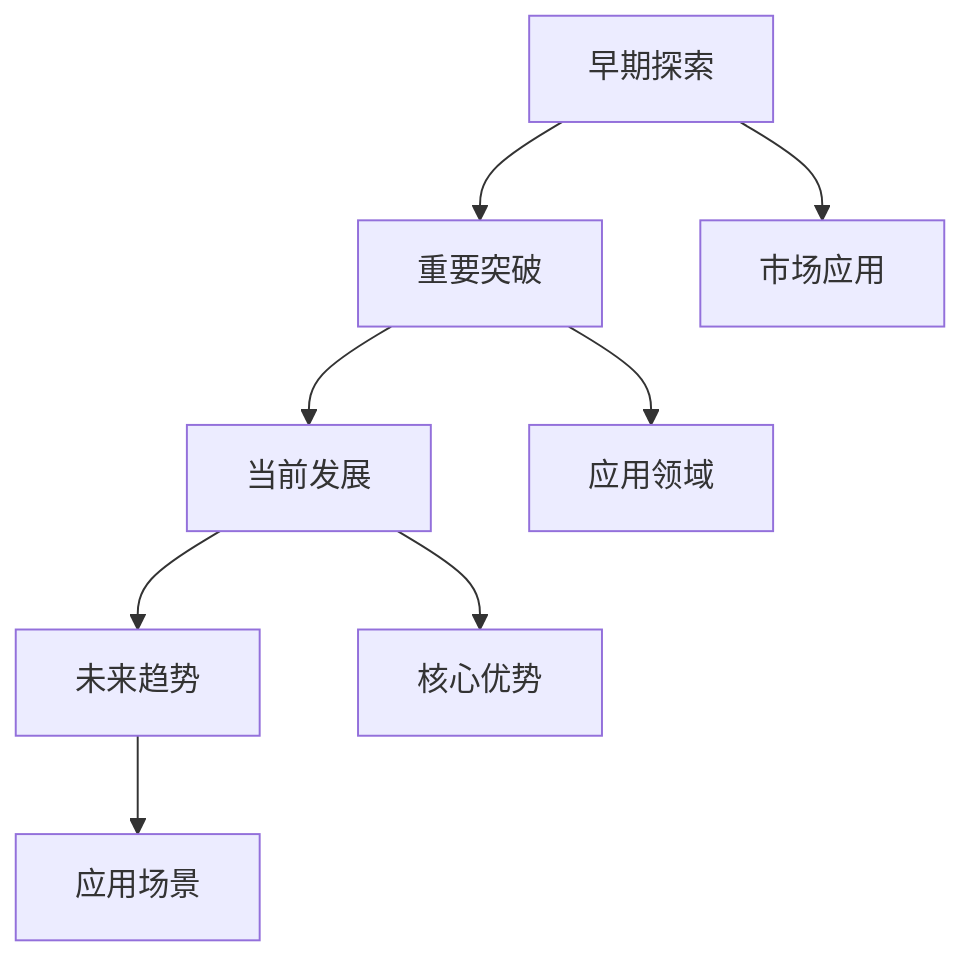

                 

### 文章标题：大模型技术的监管政策影响

大模型技术作为人工智能领域的重要突破，已经在多个行业和场景中展现出巨大的潜力。然而，随着大模型技术的广泛应用，相关的监管政策也日益受到关注。本文将围绕大模型技术的监管政策影响，进行深入分析和探讨。

文章关键词：大模型技术、监管政策、影响分析、合规管理、发展趋势

文章摘要：本文首先概述了大模型技术的背景与发展，然后详细介绍了大模型技术的监管政策，分析了国内外监管政策的异同及其对企业的影响。接着，文章探讨了监管政策对大模型技术研发、产业布局、应用场景和创新等方面的推动作用。最后，本文提出了企业应对监管政策的策略与实践，并对未来大模型技术与监管政策的融合发展进行了展望。

### 第一部分：大模型技术概述

#### 第1章：大模型技术背景与核心概念

##### 1.1 大模型技术的兴起与发展

大模型技术起源于深度学习领域，其核心思想是通过神经网络对大量数据进行学习，从而实现复杂任务的自动执行。随着计算能力和数据资源的不断提升，大模型技术逐渐从理论研究走向实际应用，成为人工智能领域的重要突破。

在过去的几年里，大模型技术取得了显著的进展。首先，模型的规模不断增大，从最初的几百万参数增长到数十亿、甚至上百亿参数。其次，多模态融合应用逐渐成熟，大模型能够同时处理文本、图像、语音等多种类型的数据。最后，自动化与优化技术不断发展，使得大模型训练过程更加高效。

##### 1.2 大模型的定义与分类

大模型的定义通常是指具有数十亿甚至千亿级参数的神经网络模型。根据处理数据的类型，大模型可以进一步分为以下几类：

1. **语言模型**：主要用于处理自然语言任务，如文本生成、机器翻译等。
2. **视觉模型**：主要用于图像识别、视频分析等任务。
3. **多模态模型**：能够同时处理文本、图像、语音等多种类型的数据。

##### 1.3 大模型在人工智能中的地位

大模型技术在人工智能中的地位日益凸显，主要体现在以下几个方面：

1. **计算能力提升**：大模型具有强大的计算能力，能够处理更加复杂和大规模的数据。
2. **数据处理能力增强**：大模型能够高效地处理各种类型的数据，包括文本、图像、语音等。
3. **学习能力的提升**：大模型具有较强的学习能力和泛化能力，能够在不同场景中取得优异的性能。

##### 1.4 大模型技术的核心优势与应用场景

大模型技术的核心优势主要体现在以下几个方面：

1. **高效性**：大模型能够快速处理大规模数据，提高任务执行效率。
2. **准确性**：大模型具有出色的学习能力，能够在各种复杂场景中取得较高的准确性。
3. **通用性**：大模型能够跨领域应用，处理多种类型的数据和任务。

应用场景方面，大模型技术在各个领域都展现出了广阔的应用前景：

1. **医疗健康**：用于疾病诊断、药物研发、健康管理等。
2. **金融领域**：用于风险评估、欺诈检测、智能投顾等。
3. **自动驾驶**：用于车辆感知、路径规划、行为预测等。
4. **智能家居**：用于语音识别、自然语言处理、智能控制等。

### Mermaid 流程图：大模型技术的发展路径



#### 1.5 核心算法原理讲解

大模型技术的核心算法原理主要包括以下几个方面：

1. **神经网络架构**：大模型通常采用深度神经网络架构，包括卷积神经网络（CNN）、循环神经网络（RNN）等。
2. **激活函数**：常用的激活函数有ReLU、Sigmoid、Tanh等。
3. **损失函数**：常用的损失函数有均方误差（MSE）、交叉熵损失等。
4. **优化算法**：常用的优化算法有梯度下降、Adam等。

以下是一个简单的大模型训练示例：

```python
import tensorflow as tf
from tensorflow.keras.datasets import mnist
from tensorflow.keras.models import Sequential
from tensorflow.keras.layers import Dense, Flatten

# 加载数据集
(x_train, y_train), (x_test, y_test) = mnist.load_data()

# 数据预处理
x_train = x_train / 255.0
x_test = x_test / 255.0
x_train = x_train.reshape(-1, 28 * 28)
x_test = x_test.reshape(-1, 28 * 28)

# 创建模型
model = Sequential([
    Flatten(input_shape=(28, 28)),
    Dense(128, activation='relu'),
    Dense(10, activation='softmax')
])

# 编译模型
model.compile(optimizer='adam',
              loss='sparse_categorical_crossentropy',
              metrics=['accuracy'])

# 训练模型
model.fit(x_train, y_train, epochs=5, batch_size=32, validation_split=0.1)

# 评估模型
test_loss, test_acc = model.evaluate(x_test, y_test)
print(f"Test accuracy: {test_acc}")
```

#### 1.6 数学模型和数学公式

在深度学习中，常用的数学模型和数学公式包括：

- **损失函数**：$$ L = -\sum_{i=1}^{N}y_i\log(\hat{y}_i) $$
- **梯度下降法**：$$ \theta = \theta - \alpha \nabla_{\theta}L(\theta) $$

#### 1.7 项目实战：手写数字识别项目

为了更直观地展示大模型技术的应用，我们以手写数字识别项目为例，进行详细讲解。

##### 开发环境搭建

1. 安装Python、TensorFlow等必需

