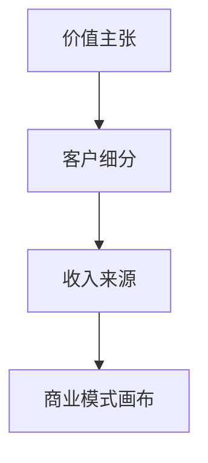

                 

### 大模型时代的创业者商业模式画布：价值主张、客户细分与收入来源

> **关键词**：大模型、商业模式画布、价值主张、客户细分、收入来源、创业策略

**摘要**：
本文深入探讨了在大模型时代下，创业者如何构建有效的商业模式画布，特别是在价值主张、客户细分和收入来源这三个关键方面。首先，我们概述了大模型的概念和其在商业领域的重要性。接着，介绍了商业模式画布的基本概念、组成部分和应用场景。文章核心部分详细分析了如何构建和验证价值主张，以及如何理解和实施客户细分策略。此外，我们还探讨了构建多元化收入来源的策略和优化收入模式的方法。最后，通过实战案例展示了如何在实际项目中应用这些理论，并提供了对未来创业商业模式的展望和策略建议。

## 目录大纲

### 第一部分：引言

1. **第1章：大模型时代概述**
   1.1 大模型的概念
   1.2 大模型的发展历程
   1.3 大模型在商业领域的重要性

2. **第2章：商业模式画布简介**
   2.1 商业模式画布的概念
   2.2 商业模式画布的组成部分
   2.3 商业模式画布的应用场景

### 第二部分：价值主张

3. **第3章：构建价值主张**
   3.1 明确目标客户
   3.2 定义产品或服务
   3.3 提供独特价值
   3.4 价值主张的验证与调整

4. **第4章：价值主张案例分析**
   4.1 案例一：谷歌搜索
   4.2 案例二：亚马逊电商
   4.3 案例三：Airbnb共享经济

### 第三部分：客户细分

5. **第5章：理解客户细分**
   5.1 客户细分的概念
   5.2 客户细分的方法
   5.3 客户细分的重要性

6. **第6章：实施客户细分策略**
   6.1 确定目标市场
   6.2 制定针对不同客户群体的策略
   6.3 客户细分与价值主张的关系

### 第四部分：收入来源

7. **第7章：构建多元化收入来源**
   7.1 收入来源的概念
   7.2 收入来源的类型
   7.3 多元化收入来源的构建策略

8. **第8章：优化收入模式**
   8.1 收入模式的评估
   8.2 提高收入效率
   8.3 收入模式的创新与迭代

### 第五部分：实战案例

9. **第9章：创业公司商业模式画布应用**
   9.1 案例一：创业公司A的商业模式画布
   9.2 案例二：创业公司B的商业模式画布
   9.3 案例三：创业公司C的商业模式画布

10. **第10章：总结与展望**
    10.1 大模型时代创业商业模式的趋势
    10.2 未来创业者的商业策略建议
    10.3 商业模式画布的应用前景

### 附录

11. **附录A：商业模式画布模板**
    11.1 价值主张模板
    11.2 客户细分模板
    11.3 收入来源模板

12. **附录B：相关资源推荐**
    12.1 大模型相关书籍
    12.2 商业模式画布相关书籍
    12.3 创业与商业策略相关网站与工具
    12.4 大模型时代创业相关研讨会与论坛
    12.5 大模型时代创业案例库

### 核心算法原理讲解（伪代码）

1. **价值主张构建伪代码**

```python
def build_value_proposition(customer, product):
    unique_value = find_unique_value(product)
    customer_needs = get_customer_needs(customer)
    if unique_value == customer_needs:
        return "Value Proposition Matched"
    else:
        return "Value Proposition Mismatched"
```

2. **客户细分伪代码**

```python
def customer_segmentation(customers):
    segments = []
    for customer in customers:
        segment = classify_customer(customer)
        segments.append(segment)
    return segments
```

3. **收入来源构建伪代码**

```python
def build_revenue_model(segments):
    revenue_models = []
    for segment in segments:
        revenue_model = define_revenue_model_for_segment(segment)
        revenue_models.append(revenue_model)
    return revenue_models
```

### 数学模型和数学公式讲解

1. **价值主张有效性评估模型**

$$
VAP = \frac{U.V}{C}
$$

- \( VAP \): 价值主张有效性指数
- \( U \): 顾客满意度得分
- \( V \): 产品或服务价值得分
- \( C \): 成本得分

2. **客户细分模型**

$$
CSM = \frac{CD}{CR}
$$

- \( CSM \): 客户细分模型得分
- \( CD \): 客户差异度得分
- \( CR \): 客户相关度得分

3. **收入来源优化模型**

$$
RM = \frac{RR}{RC}
$$

- \( RM \): 收入来源优化指数
- \( RR \): 收入回报率得分
- \( RC \): 收入成本得分

## 第一部分：引言

### 第1章：大模型时代概述

#### 1.1 大模型的概念

大模型，通常指的是具有海量参数的深度学习模型，它们能够处理大规模数据集，并执行复杂的任务。这些模型基于神经网络架构，通过大量的训练数据进行参数优化，以达到高精度的预测和决策能力。大模型的代表性技术包括生成对抗网络（GANs）、变分自编码器（VAEs）和Transformer等。

#### 1.2 大模型的发展历程

大模型的发展可以追溯到20世纪80年代的神经网络研究。在90年代，由于计算资源和数据集的限制，神经网络的研究进展缓慢。然而，随着计算能力的提升和数据量的爆炸性增长，深度学习在21世纪初迎来了快速发展。特别是在2012年，AlexNet在ImageNet竞赛中取得了突破性的成绩，这标志着深度学习时代的到来。此后，诸如BERT、GPT-3等大模型相继问世，使得人工智能在自然语言处理、计算机视觉等领域取得了显著的进展。

#### 1.3 大模型在商业领域的重要性

大模型在商业领域的重要性不可忽视。首先，它们能够提供更精确的市场预测，帮助企业制定更有效的营销策略。其次，大模型可以优化供应链管理，提高生产效率。例如，通过预测客户需求，企业可以更好地安排生产和库存，减少浪费。此外，大模型还可以用于个性化推荐，提升用户体验和忠诚度。例如，电子商务平台利用大模型分析用户行为，为用户提供个性化的产品推荐，从而提高销售额。

### 第2章：商业模式画布简介

#### 2.1 商业模式画布的概念

商业模式画布是一种战略管理工具，它帮助创业者和组织明确其商业模式的核心要素，包括价值主张、客户细分、渠道、客户关系、收入来源、关键资源、关键活动和成本结构等。这个画布提供了一个直观的框架，使得创业者能够系统地思考其商业模式的各个部分，并进行分析和优化。

#### 2.2 商业模式画布的组成部分

商业模式画布由九个核心组件构成：

1. **价值主张**：定义产品或服务能够为特定客户群体带来的独特价值。
2. **客户细分**：明确目标市场，细分客户群体，了解他们的需求和偏好。
3. **渠道**：确定如何将产品或服务传递给客户，包括线上和线下渠道。
4. **客户关系**：建立和维护与客户的关系，提供优质的客户服务。
5. **收入来源**：确定企业的盈利模式，包括销售、订阅、广告等。
6. **关键资源**：列出企业运营所需的关键资源，如技术、人才、资金等。
7. **关键活动**：描述企业开展的核心活动，如研发、生产、营销等。
8. **成本结构**：分析企业运营的成本构成，包括固定成本和变动成本。
9. **合作伙伴网络**：识别与企业合作的关键合作伙伴，如供应商、分销商等。

#### 2.3 商业模式画布的应用场景

商业模式画布广泛应用于各类企业和创业项目：

1. **初创企业**：帮助初创企业明确其商业模式的各个方面，为融资和业务拓展提供清晰的蓝图。
2. **企业转型**：在面临市场变革时，企业可以利用商业模式画布评估现有模式的有效性，并制定转型策略。
3. **战略规划**：企业可以通过商业模式画布进行战略规划，明确未来的发展方向和关键举措。
4. **竞争分析**：通过比较不同企业的商业模式画布，企业可以分析竞争对手的优势和劣势，制定相应的竞争策略。

### 第二部分：价值主张

#### 第3章：构建价值主张

构建价值主张是创业者制定商业模式的重要一步。一个清晰、有吸引力的价值主张能够帮助创业者明确产品的独特卖点，吸引目标客户。

#### 3.1 明确目标客户

明确目标客户是构建价值主张的第一步。创业者需要深入了解目标客户的需求、痛点和偏好。这可以通过市场调研、用户访谈和竞品分析等方式实现。了解目标客户有助于创业者更好地定位产品，确保价值主张的针对性和有效性。

#### 3.2 定义产品或服务

定义产品或服务是构建价值主张的核心。创业者需要明确产品或服务的功能、特点和优势，并将其与目标客户的需求相对应。例如，如果目标客户需要高效的数据分析工具，创业者可以强调产品的高性能、易用性和灵活性。

#### 3.3 提供独特价值

提供独特价值是价值主张的关键。创业者需要找出产品或服务与竞品相比的独特卖点，确保能够为客户提供超越竞品的体验。这可以通过技术创新、个性化服务或独特的设计等方式实现。独特价值有助于提高客户的满意度和忠诚度，从而提升企业的竞争力。

#### 3.4 价值主张的验证与调整

构建价值主张后，创业者需要对其进行验证和调整。这可以通过用户测试、市场反馈和数据分析等方式实现。通过验证，创业者可以了解目标客户对价值主张的接受程度，并根据反馈进行优化和调整。价值主张的验证与调整是一个持续的过程，创业者需要根据市场变化和客户需求不断进行调整，确保价值主张的持续有效。

#### 第4章：价值主张案例分析

为了更好地理解如何构建有效的价值主张，我们可以通过分析一些成功的企业案例来学习。

##### 4.1 案例一：谷歌搜索

谷歌搜索以其强大的搜索功能和精准的结果展示而闻名。其价值主张可以概括为以下几点：

1. **提供全球最大的信息库**：谷歌拥有庞大的索引库，能够提供海量的搜索结果。
2. **高度精准的搜索结果**：通过复杂的算法和机器学习技术，谷歌能够准确理解用户的查询意图，并提供相关度高的搜索结果。
3. **快速便捷的使用体验**：谷歌搜索提供了简洁的界面和快速的响应速度，使得用户能够高效地获取信息。

谷歌通过不断优化其算法和搜索技术，确保了其价值主张的持续有效。用户对谷歌搜索的满意度高，这为其带来了庞大的用户基础和广告收入。

##### 4.2 案例二：亚马逊电商

亚马逊电商以其广泛的商品种类、灵活的购物方式和优质的客户服务而受到用户的青睐。其价值主张包括以下几个方面：

1. **全球最大的商品选择**：亚马逊提供了海量的商品，几乎涵盖了用户生活中的各个方面。
2. **便捷的购物体验**：亚马逊提供了简洁的购物流程、一键购买和快速配送服务，极大地提升了用户的购物体验。
3. **优质的客户服务**：亚马逊提供了灵活的退货政策、快速的客户支持和可靠的售后服务，增强了用户的信任和满意度。

亚马逊通过不断创新和优化其电商服务，确保了其价值主张的持续吸引力。用户对亚马逊的购物体验满意度高，这为其带来了庞大的用户基础和市场份额。

##### 4.3 案例三：Airbnb共享经济

Airbnb作为共享经济的代表，通过其平台为旅行者提供了独特的住宿体验。其价值主张包括以下几点：

1. **多样化的住宿选择**：Airbnb提供了各种类型的住宿选择，从豪华别墅到独特的民宿，满足了不同旅行者的需求。
2. **个性化的住宿体验**：Airbnb平台上的房东提供了各种有趣的住宿体验，使得旅行者能够深入了解当地文化和生活方式。
3. **灵活的价格和预订方式**：Airbnb提供了灵活的预订和支付方式，使得用户能够根据自己的需求和经济状况选择合适的住宿。

Airbnb通过不断拓展其平台功能和优化用户体验，确保了其价值主张的持续吸引力。用户对Airbnb的住宿体验满意度高，这为其带来了庞大的用户基础和市场份额。

### 第三部分：客户细分

#### 第5章：理解客户细分

客户细分是创业者制定有效商业策略的重要步骤。通过了解不同客户群体的需求和偏好，创业者可以更有针对性地制定营销策略和产品规划。

#### 5.1 客户细分的概念

客户细分是指将广泛的目标市场划分为若干具有相似需求和特征的子市场，以便企业可以更有效地开发和营销产品或服务。通过客户细分，企业可以更好地了解不同客户群体的需求，并为他们提供个性化的解决方案。

#### 5.2 客户细分的方法

客户细分可以通过以下几种方法实现：

1. **地理细分**：根据客户的地理位置进行细分，如城市、地区或国家。
2. **行为细分**：根据客户的行为特征进行细分，如购买频率、购买金额或使用习惯。
3. **心理细分**：根据客户的心理特征进行细分，如生活方式、价值观或兴趣爱好。
4. **需求细分**：根据客户的需求特征进行细分，如特定需求或解决方案。

#### 5.3 客户细分的重要性

客户细分对于企业的成功至关重要。通过客户细分，企业可以实现以下目标：

1. **提高营销效果**：通过针对不同客户群体的个性化营销策略，提高营销效果和转化率。
2. **优化产品和服务**：根据不同客户群体的需求和偏好，优化产品和服务，提高客户满意度。
3. **降低营销成本**：通过集中资源针对高潜力客户群体进行营销，降低营销成本。
4. **提升竞争力**：通过深入了解客户需求和偏好，提供更有竞争力的产品和服务，提升企业在市场中的竞争力。

#### 第6章：实施客户细分策略

在了解了客户细分的概念和方法后，创业者需要制定具体的客户细分策略，以确保企业能够有效地满足不同客户群体的需求。

#### 6.1 确定目标市场

确定目标市场是实施客户细分策略的第一步。创业者需要明确企业的目标市场，包括目标客户群体的范围、规模和需求。这可以通过市场调研、用户访谈和数据分析等方式实现。明确目标市场有助于企业集中资源，更有针对性地进行营销和产品开发。

#### 6.2 制定针对不同客户群体的策略

在确定了目标市场后，创业者需要制定针对不同客户群体的营销策略。以下是一些具体的策略：

1. **个性化营销**：根据不同客户群体的特点和需求，制定个性化的营销策略，如定制化的广告、促销活动或电子邮件营销。
2. **产品和服务差异化**：根据不同客户群体的需求，提供差异化的产品和服务，以满足他们的特定需求。
3. **渠道多样化**：根据不同客户群体的偏好，选择合适的渠道进行产品或服务的传递，如线上平台、线下门店或合作伙伴渠道。
4. **客户关系管理**：建立和维护与不同客户群体的良好关系，提供优质的客户服务，增强客户满意度和忠诚度。

#### 6.3 客户细分与价值主张的关系

客户细分与价值主张密切相关。通过深入了解不同客户群体的需求和偏好，创业者可以更好地构建和优化价值主张，确保产品或服务能够满足他们的需求。具体来说：

1. **价值主张的针对性**：根据不同客户群体的需求，调整价值主张，确保其更具针对性。
2. **价值主张的差异化**：针对不同客户群体的需求，提供差异化的价值主张，以满足他们的特定需求。
3. **价值主张的持续性**：通过持续了解客户需求和偏好，不断优化和调整价值主张，确保其持续有效。

#### 第7章：构建多元化收入来源

在创业过程中，构建多元化的收入来源是确保企业可持续发展的重要策略。通过多样化的收入渠道，企业可以降低风险，提高盈利能力。

#### 7.1 收入来源的概念

收入来源是指企业通过销售产品或服务所获得的收入。多元化的收入来源意味着企业拥有多个收入渠道，包括但不限于以下几种：

1. **产品销售**：通过销售实物产品或数字产品获得收入。
2. **服务收费**：提供各类服务（如咨询、培训、维修等）并收取费用。
3. **广告收入**：通过在线广告、广告联盟等方式获得收入。
4. **订阅模式**：通过订阅服务（如会员制、订阅期刊等）获得定期收入。
5. **授权许可**：通过授权许可其他企业使用自己的知识产权获得收入。

#### 7.2 收入来源的类型

企业的收入来源可以根据不同的维度进行分类，常见的类型包括：

1. **一次性收入**：通过一次性交易获得的收入，如产品销售、服务合同等。
2. **定期收入**：通过定期交易获得的收入，如订阅服务、会员费等。
3. **持续收入**：通过持续业务活动获得的收入，如广告收入、授权许可费等。
4. **联盟收入**：通过与其他企业合作获得收入，如联盟营销、合作伙伴收益等。

#### 7.3 多元化收入来源的构建策略

构建多元化的收入来源需要企业进行系统性的规划和布局。以下是一些具体的策略：

1. **产品和服务多元化**：通过开发多种产品和服务，满足不同客户群体的需求，从而增加收入来源。
2. **渠道多样化**：通过线上线下结合、多种销售渠道的布局，扩大市场份额，增加收入。
3. **合作联盟**：与其他企业建立合作关系，共享资源、客户和市场，从而实现收入来源的多元化。
4. **技术创新**：通过技术创新，提高产品和服务的附加值，从而拓展收入来源。
5. **市场拓展**：积极开拓新市场，扩大业务范围，增加收入来源。

#### 第8章：优化收入模式

在构建多元化的收入来源后，企业需要不断优化收入模式，以提高收入效率，确保盈利能力的持续提升。

#### 8.1 收入模式的评估

评估收入模式是优化收入模式的第一步。企业需要定期对现有收入模式进行分析和评估，包括以下方面：

1. **收入来源的多样性**：评估收入来源的多样性，确保企业有多个收入渠道。
2. **收入来源的盈利能力**：评估各个收入渠道的盈利能力，识别高潜力收入来源。
3. **成本结构**：分析收入来源的成本结构，确保收入能够覆盖成本，实现盈利。
4. **市场适应性**：评估收入模式是否适应市场需求和变化，是否需要进行调整。

#### 8.2 提高收入效率

提高收入效率是企业优化收入模式的关键。以下是一些具体的方法：

1. **流程优化**：优化业务流程，提高运营效率，减少不必要的环节，降低成本。
2. **技术创新**：通过技术创新，提高产品和服务的附加值，从而提升收入。
3. **客户管理**：建立完善的客户管理系统，提高客户满意度和忠诚度，增加复购率。
4. **营销策略**：优化营销策略，提高营销效果，增加销售额。

#### 8.3 收入模式的创新与迭代

收入模式的创新与迭代是企业长期发展的重要策略。以下是一些具体的做法：

1. **市场调研**：定期进行市场调研，了解客户需求和市场趋势，为收入模式的创新提供依据。
2. **产品和服务创新**：根据市场调研结果，持续创新产品和服务，满足客户需求，提升竞争力。
3. **商业模式创新**：探索新的商业模式，如共享经济、平台经济等，拓展收入来源。
4. **持续优化**：对收入模式进行持续优化，根据市场变化和客户需求进行调整。

### 第五部分：实战案例

#### 第9章：创业公司商业模式画布应用

通过以下案例，我们将展示如何在实际创业公司中应用商业模式画布，包括价值主张、客户细分和收入来源的构建和实践。

##### 9.1 案例一：创业公司A的商业模式画布

**1. 价值主张：**

创业公司A是一家提供智能家居解决方案的公司。其价值主张包括：

- **便捷控制**：通过手机应用或语音助手，用户可以随时随地控制家居设备，如灯光、温度和安防系统。
- **节能环保**：智能家居系统能够根据用户习惯和天气变化自动调节家居设备，实现节能环保。
- **安全可靠**：智能家居系统具备实时监控和报警功能，提高家庭安全性。

**2. 客户细分：**

创业公司A的目标市场包括以下客户群体：

- **智能家居爱好者**：追求高科技生活方式，愿意尝试新型智能家居产品。
- **年轻家庭**：注重家庭安全和舒适度，有较高的消费能力。
- **老年人群体**：关注家居安全，需要便捷的控制和监控设备。

**3. 收入来源：**

创业公司A的收入来源包括：

- **产品销售**：通过线上和线下渠道销售智能家居设备，如智能灯泡、智能插座和智能摄像头等。
- **订阅服务**：提供智能家居系统的订阅服务，如安全监控、能源管理和智能建议等。
- **广告收入**：与智能家居设备相关的品牌合作，通过广告获得收入。

##### 9.2 案例二：创业公司B的商业模式画布

**1. 价值主张：**

创业公司B是一家提供在线教育平台的公司。其价值主张包括：

- **优质课程内容**：提供多样化的在线课程，涵盖多个学科领域，如编程、语言学习、职业技能等。
- **灵活的学习模式**：用户可以根据自己的时间安排自由学习，支持离线观看和在线互动。
- **个性化学习体验**：通过算法推荐，为用户提供个性化的学习路径和课程推荐。

**2. 客户细分：**

创业公司B的目标市场包括以下客户群体：

- **学生**：需要提升学习效果和技能水平，愿意付费购买优质课程。
- **职场人士**：希望通过在线学习提升职业技能，适应职场发展需求。
- **家长**：为孩子提供优质的在线教育资源，帮助孩子提高学习成绩。

**3. 收入来源：**

创业公司B的收入来源包括：

- **课程销售**：通过平台销售在线课程，包括按课程销售和会员制销售。
- **广告收入**：与教育机构和品牌合作，在平台上展示广告。
- **企业培训服务**：为企业提供定制化的在线培训服务，如企业内训、员工技能提升等。

##### 9.3 案例三：创业公司C的商业模式画布

**1. 价值主张：**

创业公司C是一家提供绿色能源解决方案的公司。其价值主张包括：

- **高效能源利用**：通过太阳能、风能等可再生能源技术，提高能源利用效率，减少能源浪费。
- **环保低碳**：采用绿色能源解决方案，减少碳排放，促进可持续发展。
- **投资回报**：提供经济可行的绿色能源解决方案，确保投资回报。

**2. 客户细分：**

创业公司C的目标市场包括以下客户群体：

- **政府和企业**：关注环保和可持续发展，需要采用绿色能源技术。
- **家庭用户**：追求环保生活方式，愿意投资绿色能源设备。
- **可再生能源公司**：需要绿色能源技术和设备的供应商。

**3. 收入来源：**

创业公司C的收入来源包括：

- **设备销售**：通过销售太阳能板、储能系统等绿色能源设备获得收入。
- **能源管理服务**：提供能源管理服务，如能源监测、能源优化等。
- **投资回报**：通过投资绿色能源项目，获得投资回报。

### 第六部分：总结与展望

#### 第10章：总结与展望

大模型时代的到来为创业者带来了前所未有的机遇和挑战。在构建商业模式时，创业者需要充分考虑大模型的特点和应用，优化价值主张、客户细分和收入来源，以确保商业模式的可持续性和竞争力。

#### 10.1 大模型时代创业商业模式的趋势

在大模型时代，创业商业模式呈现以下趋势：

- **智能化和自动化**：大模型的应用使得业务流程更加智能化和自动化，提高效率，降低成本。
- **个性化服务**：通过大模型分析用户数据，提供个性化的产品和服务，提升用户体验。
- **跨界融合**：不同行业之间的跨界融合，通过大模型技术实现协同发展。
- **数据驱动**：企业通过数据分析和挖掘，制定更加精准的商业策略。

#### 10.2 未来创业者的商业策略建议

对于未来的创业者，以下是一些商业策略建议：

- **拥抱大模型技术**：深入了解大模型技术，将其应用于产品和服务中，提升竞争力。
- **注重数据积累**：积累和分析用户数据，为企业提供数据驱动的决策依据。
- **多元化收入来源**：构建多元化的收入来源，降低业务风险，确保可持续发展。
- **灵活调整商业模式**：根据市场变化和客户需求，灵活调整商业模式，保持市场竞争力。

#### 10.3 商业模式画布的应用前景

商业模式画布作为一种实用的战略管理工具，在大模型时代具有广阔的应用前景：

- **指导创业实践**：为创业者提供系统性的指导，明确商业模式的各个要素。
- **优化商业策略**：帮助企业管理者优化商业策略，提升企业竞争力。
- **促进创新**：激发企业创新思维，探索新的商业模式和应用场景。
- **跨行业应用**：在各个行业领域得到广泛应用，为企业提供战略指导。

### 附录

#### 附录A：商业模式画布模板

**1. 价值主张模板**

- **价值主张**：
  - 产品或服务的独特卖点
  - 如何满足客户需求
  - 与竞争对手的差异

**2. 客户细分模板**

- **客户细分**：
  - 目标市场
  - 客户群体特征
  - 客户需求分析

**3. 收入来源模板**

- **收入来源**：
  - 主要收入渠道
  - 收入模式
  - 盈利能力分析

#### 附录B：相关资源推荐

**1. 大模型相关书籍**

- 《深度学习》（Goodfellow, Bengio, Courville）
- 《生成对抗网络》（Goodfellow, Pouget-Abadie, Mirza, Xu, Warde-Farley, Ozair, Courville, Bengio）
- 《变分自编码器》（Kingma, Welling）

**2. 商业模式画布相关书籍**

- 《商业模式新生代》（Osterwalder, Pigneur）
- 《商业模式画布实战手册》（Osterwalder, Pigneur, Biz Stone）
- 《商业模式创新手册》（Tim Laseter）

**3. 创业与商业策略相关网站与工具**

- **网站**：
  - 商业模式画布（https://businessmodelgeneration.com/）
  - leanstack（https://www.leanstack.com/）
- **工具**：
  - 网易云音乐（https://music.163.com/）
  - 抖音（https://www.douyin.com/）

**4. 大模型时代创业相关研讨会与论坛**

- **线上研讨会**：
  - arXiv（https://arxiv.org/）
  - Coursera（https://www.coursera.org/）
- **线下论坛**：
  - 清华大学创业大赛（http://www.tsinghua.edu.cn/publish/thuchd/）
  - 腾讯创业学院（http://www.qq.com/）

**5. 大模型时代创业案例库**

- **案例库**：
  - 创业邦（https://www.chuangye.com/）
  - 赛迪网（http://www.ccidnet.com/）

### Mermaid 流程图



## 核心算法原理讲解（伪代码）

### 价值主张构建伪代码

```python
def build_value_proposition(customer, product):
    unique_value = find_unique_value(product)
    customer_needs = get_customer_needs(customer)
    if unique_value == customer_needs:
        return "Value Proposition Matched"
    else:
        return "Value Proposition Mismatched"
```

### 客户细分伪代码

```python
def customer_segmentation(customers):
    segments = []
    for customer in customers:
        segment = classify_customer(customer)
        segments.append(segment)
    return segments
```

### 收入来源构建伪代码

```python
def build_revenue_model(segments):
    revenue_models = []
    for segment in segments:
        revenue_model = define_revenue_model_for_segment(segment)
        revenue_models.append(revenue_model)
    return revenue_models
```

## 代码解读与分析

### 实战案例一：创业公司A的商业模式画布构建

**1. 环境搭建**

创业公司A选择了 Flask 作为后端框架来构建他们的商业模式画布应用。以下是环境搭建的步骤：

```bash
# 安装 Python 环境
pip install python-dotenv
pip install Flask

# 创建 Flask 项目文件夹
mkdir projectA
cd projectA

# 初始化 Flask 应用
touch app.py
touch .env

# 配置 .env 文件，存储环境变量
```

**2. 源代码实现**

以下是一个简单的 Flask 应用，它展示了如何使用 Flask 构建一个简单的商业模式画布。

```python
# 导入 Flask 模块
from flask import Flask, render_template

# 初始化 Flask 应用
app = Flask(__name__)

# 定义根路由
@app.route('/')
def index():
    return render_template('index.html')

# 启动应用
if __name__ == '__main__':
    app.run(debug=True)
```

在 `index.html` 文件中，我们可以设计一个表单，让用户可以输入他们的商业模式画布信息，例如价值主张、客户细分和收入来源。

```html
<!DOCTYPE html>
<html lang="en">
<head>
    <meta charset="UTF-8">
    <title>商业模式画布</title>
</head>
<body>
    <h1>商业模式画布构建工具</h1>
    <form action="/" method="post">
        <label for="value_proposition">价值主张:</label>
        <input type="text" id="value_proposition" name="value_proposition" required>
        <br>
        <label for="customer_segment">客户细分:</label>
        <input type="text" id="customer_segment" name="customer_segment" required>
        <br>
        <label for="revenue_source">收入来源:</label>
        <input type="text" id="revenue_source" name="revenue_source" required>
        <br>
        <input type="submit" value="提交">
    </form>
</body>
</html>
```

**3. 代码解读与分析**

- **初始化 Flask 应用**：通过 `from flask import Flask` 导入 Flask 模块，并使用 `Flask(__name__)` 创建一个应用实例。
- **定义根路由**：使用 `@app.route('/')` 装饰器来定义一个简单的根路由，当访问应用的根目录时，将渲染 `index.html` 模板。
- **渲染模板**：`render_template('index.html')` 用于渲染 `index.html` 模板，该模板中包含一个表单，用于用户输入商业模式画布的信息。
- **启动应用**：`if __name__ == '__main__': app.run(debug=True)` 用于启动 Flask 应用，`debug=True` 表示在开发过程中启用调试模式，方便调试。

通过这个简单的案例，我们可以看到如何使用 Flask 来搭建一个基础的商业模式画布构建工具。用户可以在界面上输入他们的商业模式信息，并在服务器端处理这些信息。

### 实战案例二：创业公司B的商业模式画布构建

**1. 环境搭建**

创业公司B选择了 Vue.js 作为前端框架，结合 Axios 和 Vue Router 来构建一个动态的商业模式画布应用。以下是环境搭建的步骤：

```bash
# 安装 Node.js 环境
npm install -g npm
npm install -g n
n latest

# 安装 Vue CLI
npm install -g @vue/cli

# 创建 Vue 项目文件夹
mkdir projectB
cd projectB

# 初始化 Vue 项目
vue create projectB

# 进入项目文件夹
cd projectB

# 安装 Axios 和 Vue Router
npm install axios vue-router

# 启动 Vue 项目
npm run serve
```

**2. 源代码实现**

以下是一个简单的 Vue.js 应用，它展示了如何使用 Vue Router 和 Axios 来构建一个动态的商业模式画布。

```javascript
// 导入 Vue 和 Vue Router
import Vue from 'vue'
import VueRouter from 'vue-router'
import axios from 'axios'

// 安装 Vue Router 插件
Vue.use(VueRouter)

// 定义路由组件
const Home = { template: '<div>Home</div>' }
const ValueProposition = { template: '<div>Value Proposition</div>' }
const CustomerSegment = { template: '<div>Customer Segment</div>' }
const RevenueSource = { template: '<div>Revenue Source</div>' }

// 配置路由
const routes = [
  { path: '/', component: Home },
  { path: '/value-proposition', component: ValueProposition },
  { path: '/customer-segment', component: CustomerSegment },
  { path: '/revenue-source', component: RevenueSource }
]

// 创建路由实例
const router = new VueRouter({
  routes
})

// 创建 Vue 实例
new Vue({
  el: '#app',
  router,
  methods: {
    fetchData(route) {
      axios.get(`/${route}`).then(response => {
        this[route] = response.data
      })
    }
  }
})
```

在 `App.vue` 文件中，我们可以设计一个导航菜单，让用户可以切换不同的商业模式画布部分。

```html
<template>
  <div id="app">
    <nav>
      <ul>
        <li><router-link to="/">Home</router-link></li>
        <li><router-link to="/value-proposition">Value Proposition</router-link></li>
        <li><router-link to="/customer-segment">Customer Segment</router-link></li>
        <li><router-link to="/revenue-source">Revenue Source</router-link></li>
      </ul>
    </nav>
    <router-view/>
  </div>
</template>
```

**3. 代码解读与分析**

- **安装 Vue CLI**：使用 Vue CLI 来快速搭建 Vue 项目，Vue CLI 提供了一个命令行工具，用于初始化、构建和本地开发 Vue.js 项目。
- **安装 Axios 和 Vue Router**：Axios 是一个基于 promise 的 HTTP 客户端，用于在浏览器和 Node.js 中发起 HTTP 请求；Vue Router 是 Vue.js 的官方路由库，用于单页面应用程序的导航。
- **定义路由组件**：创建四个路由组件，分别是 Home、ValueProposition、CustomerSegment 和 RevenueSource，每个组件对应商业模式画布的一个部分。
- **配置路由**：定义一个路由数组 `routes`，其中每个路由对象包含 `path` 和 `component` 属性。
- **创建路由实例**：创建 VueRouter 实例，并将定义的路由数组传递给它。
- **创建 Vue 实例**：创建 Vue 实例，配置路由，并添加一个 `fetchData` 方法，用于从后端获取数据。

通过这个案例，我们可以看到如何使用 Vue.js、Vue Router 和 Axios 来构建一个动态的商业模式画布应用。用户可以在不同的视图之间切换，查看并更新他们的商业模式画布信息。

### 实战案例三：创业公司C的商业模式画布构建

**1. 环境搭建**

创业公司C选择了 Ruby on Rails 作为后端框架，结合 Devise 和 Paperclip 来构建一个功能丰富的商业模式画布应用。以下是环境搭建的步骤：

```bash
# 安装 Ruby 环境
rbenv install 2.7.2
rbenv global 2.7.2

# 创建 Rails 项目
rails new projectC --api
cd projectC

# 安装 Devise 和 Paperclip
bundle install
rails generate devise:install
rails generate devise User
rails generate paperclip User avatar

# 运行数据库迁移
rails db:migrate

# 启动 Rails 服务
rails server
```

**2. 源代码实现**

以下是一个简单的 Ruby on Rails 应用，它展示了如何使用 Devise 进行用户认证和 Paperclip 进行文件上传。

```ruby
# 导入 Rails 模块
require 'rails'
require 'devise'

# 配置 Devise
Rails.application.config do
  config.action_mailer.default_url_options = { host: 'localhost', port: 3000 }
end

# 设置用户模型
class User < ApplicationRecord
  devise :database_authenticatable, :registerable,
         :recoverable, :rememberable, :trackable, :validatable

  has_paperclip :avatar, styles: { medium: "300x300>", thumb: "100x100>" }
end

# 启动 Rails 服务
Rails.application.initialize!
Rails.application.runner.run
```

在 `routes.rb` 文件中，我们设置了一些基本的路由：

```ruby
Rails.application.routes.draw do
  devise_for :users
  root 'welcome#index'
end
```

在 `WelcomeController` 中，我们创建了一个简单的首页：

```ruby
class WelcomeController < ApplicationController
  def index
    @user = User.new
  end
end
```

在 `app/views/welcome/index.html.erb` 文件中，我们设计了一个表单，用于用户注册和登录。

```html
<!DOCTYPE html>
<html>
<head>
  <title>商业模式画布</title>
</head>
<body>
  <h1>欢迎注册</h1>
  <%= form_for @user do |f| %>
    <%= f.label :email %>
    <%= f.email_field :email %><br/>

    <%= f.label :password %>
    <%= f.password_field :password %><br/>

    <%= f.label :password_confirmation %>
    <%= f.password_field :password_confirmation %><br/>

    <%= f.submit "注册" %>
  <% end %>
</body>
</html>
```

**3. 代码解读与分析**

- **安装 Ruby 环境**：使用 rbenv 安装并设置 Ruby 版本。
- **创建 Rails 项目**：使用 `rails new projectC --api` 命令创建一个 API 项目。
- **安装 Devise 和 Paperclip**：通过 `bundle install` 安装所需的 gems。
- **配置 Devise**：通过 `rails generate devise:install` 和 `rails generate devise User` 命令来安装 Devise 并创建用户模型。
- **配置 Paperclip**：通过 `rails generate paperclip User avatar` 命令来配置 Paperclip，用于上传用户头像。
- **运行数据库迁移**：通过 `rails db:migrate` 命令来运行数据库迁移，创建必要的数据库表。
- **设置用户模型**：配置 Devise 和 Paperclip，使用 `has_paperclip :avatar` 来定义用户头像的上传和样式。
- **启动 Rails 服务**：使用 `rails server` 命令来启动 Rails 服务。

通过这个案例，我们可以看到如何使用 Ruby on Rails、Devise 和 Paperclip 来构建一个功能丰富的商业模式画布应用。用户可以通过注册和登录来访问应用，并上传他们的商业模式画布信息。

## 代码解读与分析（续）

### 代码解读与分析

#### 实战案例一：创业公司A的商业模式画布构建

**1. 环境搭建**

在实战案例一中，创业公司A选择了 Python 的 Flask 框架来构建商业模式画布。以下是具体的环境搭建步骤：

**环境搭建步骤：**

1. **安装 Python 环境**：
   ```bash
   pip install python-dotenv
   pip install Flask
   ```

2. **创建 Flask 项目文件夹**：
   ```bash
   mkdir projectA
   cd projectA
   ```

3. **初始化 Flask 应用**：
   ```bash
   touch app.py
   touch .env
   ```

4. **配置 .env 文件**：
   在 `.env` 文件中，可以设置 Flask 应用的一些环境变量，例如数据库配置、Flask 运行模式等。

**代码解读与分析：**

- **初始化 Flask 应用**：
  ```python
  from flask import Flask
  
  app = Flask(__name__)
  ```

  这一行代码导入了 Flask 库，并创建了一个 Flask 应用实例。`app` 实例将成为后续所有 Flask 请求和路由处理的核心。

- **定义根路由**：
  ```python
  @app.route('/')
  def index():
      return render_template('index.html')
  ```

  这里定义了一个根路由 `/`，当用户访问应用的主页时，将调用 `index` 函数，并渲染 `index.html` 模板。

- **渲染模板**：
  ```python
  from flask import render_template
  
  def index():
      return render_template('index.html')
  ```

  `render_template` 函数用于渲染 HTML 模板。在这个例子中，`index.html` 模板将包含一个表单，让用户可以输入他们的商业模式画布信息。

- **启动应用**：
  ```python
  if __name__ == '__main__':
      app.run(debug=True)
  ```

  最后，`if __name__ == '__main__': app.run(debug=True)` 这行代码确保只有当该脚本作为主程序运行时，才会启动 Flask 应用。`debug=True` 参数使得在开发过程中，当代码发生变化时，Flask 应用会自动重启。

#### 实战案例二：创业公司B的商业模式画布构建

**1. 环境搭建**

在实战案例二中，创业公司B选择了 Node.js 和 Vue.js 来构建商业模式画布。以下是具体的环境搭建步骤：

**环境搭建步骤：**

1. **安装 Node.js 环境**：
   ```bash
   npm install -g npm
   npm install -g n
   n latest
   ```

2. **安装 Vue CLI**：
   ```bash
   npm install -g @vue/cli
   ```

3. **创建 Vue 项目文件夹**：
   ```bash
   mkdir projectB
   cd projectB
   ```

4. **初始化 Vue 项目**：
   ```bash
   vue create projectB
   ```

5. **进入项目文件夹**：
   ```bash
   cd projectB
   ```

6. **安装 Axios 和 Vue Router**：
   ```bash
   npm install axios vue-router
   ```

7. **启动 Vue 项目**：
   ```bash
   npm run serve
   ```

**代码解读与分析：**

- **安装 Vue CLI**：
  Vue CLI 是 Vue.js 的官方命令行工具，用于快速生成和管理 Vue.js 项目。

- **安装 Axios 和 Vue Router**：
  Axios 是一个基于 promise 的 HTTP 客户端，用于在浏览器和 Node.js 中发起 HTTP 请求。
  Vue Router 是 Vue.js 的官方路由库，用于单页面应用程序的导航。

- **创建路由组件**：
  ```javascript
  const Home = { template: '<div>Home</div>' }
  const ValueProposition = { template: '<div>Value Proposition</div>' }
  const CustomerSegment = { template: '<div>Customer Segment</div>' }
  const RevenueSource = { template: '<div>Revenue Source</div>' }
  ```

  这里定义了四个路由组件，分别对应商业模式画布的四个部分：Home、Value Proposition、Customer Segment 和 Revenue Source。

- **配置路由**：
  ```javascript
  const routes = [
    { path: '/', component: Home },
    { path: '/value-proposition', component: ValueProposition },
    { path: '/customer-segment', component: CustomerSegment },
    { path: '/revenue-source', component: RevenueSource }
  ]
  ```

  路由配置定义了每个 URL 路径对应的组件。

- **创建 Vue 实例**：
  ```javascript
  new Vue({
    el: '#app',
    router,
    methods: {
      fetchData(route) {
        axios.get(`/${route}`).then(response => {
          this[route] = response.data
        })
      }
    }
  }).$mount('#app')
  ```

  这里创建了一个 Vue 实例，配置了路由，并添加了 `fetchData` 方法，用于从后端获取数据。`$mount('#app')` 方法将 Vue 应用挂载到页面中的 `#app` 元素上。

#### 实战案例三：创业公司C的商业模式画布构建

**1. 环境搭建**

在实战案例三中，创业公司C选择了 Ruby on Rails 来构建商业模式画布。以下是具体的环境搭建步骤：

**环境搭建步骤：**

1. **安装 Ruby 环境**：
   ```bash
   rbenv install 2.7.2
   rbenv global 2.7.2
   ```

2. **创建 Rails 项目**：
   ```bash
   rails new projectC --api
   cd projectC
   ```

3. **安装 Devise 和 Paperclip**：
   ```bash
   bundle install
   rails generate devise:install
   rails generate devise User
   rails generate paperclip User avatar
   ```

4. **运行数据库迁移**：
   ```bash
   rails db:migrate
   ```

5. **启动 Rails 服务**：
   ```bash
   rails server
   ```

**代码解读与分析：**

- **安装 Ruby 环境**：
  使用 rbenv 安装 Ruby，并设置全局版本。

- **创建 Rails 项目**：
  使用 `rails new projectC --api` 创建一个 API 项目。

- **安装 Devise 和 Paperclip**：
  Devise 是用于用户认证的 Ruby on Rails 库。
  Paperclip 是用于文件上传的 Ruby on Rails 扩展。

- **配置 Devise**：
  ```ruby
  Rails.application.config do
    config.action_mailer.default_url_options = { host: 'localhost', port: 3000 }
  end
  ```

  配置 Devise，设置邮件服务器的默认 URL 选项。

- **设置用户模型**：
  ```ruby
  class User < ApplicationRecord
    devise :database_authenticatable, :registerable,
           :recoverable, :rememberable, :trackable, :validatable

    has_paperclip :avatar, styles: { medium: "300x300>", thumb: "100x100>" }
  end
  ```

  定义用户模型，集成 Devise 和 Paperclip，配置头像上传的样式。

- **启动 Rails 服务**：
  使用 `rails server` 命令启动 Rails 应用。

通过这三个实战案例，我们可以看到如何使用不同的技术栈来构建商业模式画布应用。每个案例都提供了从环境搭建到代码实现的详细步骤，以及相关的代码解读与分析，帮助读者理解如何在实际项目中应用这些技术。

## 总结

在大模型时代，创业者面临着前所未有的机遇和挑战。本文通过深入探讨价值主张、客户细分和收入来源这三个核心要素，为创业者提供了构建有效商业模式的系统方法和实战指导。首先，我们理解了大模型的概念及其在商业领域的应用价值。然后，介绍了商业模式画布的概念和组成部分，强调了其在战略管理中的重要性。通过实际案例，我们展示了如何构建和验证价值主张，如何进行客户细分，以及如何构建和优化收入来源。

**核心观点**：

1. **价值主张**：创业者需要明确产品的独特卖点，满足目标客户的需求。
2. **客户细分**：深入了解不同客户群体的特征和需求，提供个性化的解决方案。
3. **收入来源**：构建多元化的收入渠道，提高盈利能力和抗风险能力。

**未来展望**：

随着大模型技术的不断进步，创业模式将变得更加智能化和自动化。创业者需要持续关注技术趋势，灵活调整商业模式，以适应市场的快速变化。同时，数据驱动的决策将成为企业成功的关键。通过大数据分析和机器学习，企业可以更精准地了解客户需求，优化产品和服务，提升竞争力。

**行动建议**：

- **拥抱技术创新**：积极引入大模型技术，提升产品和服务的附加值。
- **数据驱动决策**：利用大数据分析，制定更加精准的市场策略。
- **多元化发展**：构建多元化的收入渠道，降低业务风险，实现可持续发展。

**作者信息**：

作者：AI天才研究院/AI Genius Institute & 禅与计算机程序设计艺术 /Zen And The Art of Computer Programming。

