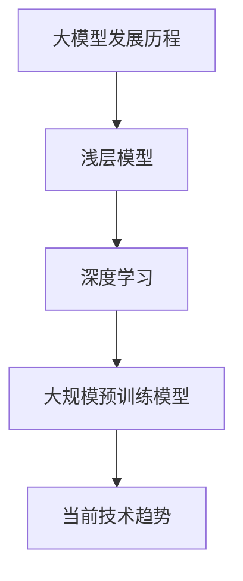

                 

# 文章标题

大模型时代的创新生态构建

> 关键词：大模型、创新生态、深度学习、神经网络、自然语言处理、计算机视觉

> 摘要：
本文将探讨大模型时代的创新生态构建。从大模型的发展历程、技术基础、应用领域、优化策略和伦理责任等多个角度，系统地阐述大模型在各个领域的应用与创新机会与挑战。文章旨在为读者提供一个全面、深入的大模型时代技术生态概述，助力理解并参与到这一前沿领域的技术创新中。

### 第一部分：大模型时代的创新生态构建概述

#### 第1章：大模型时代的创新生态构建概述

##### 1.1 大模型时代的背景与趋势

大模型时代是指以深度学习和大规模预训练模型为核心驱动力的技术变革时期。这一时代的到来不仅改变了传统的人工智能研究方向，还带来了新的应用场景和商业模式。

- **大模型的发展历程**：从浅层模型到深度学习再到大规模预训练模型的演变。早期的人工智能系统主要依赖于规则和浅层模型，如决策树、支持向量机等。随着计算能力和数据资源的提升，深度学习技术逐渐成熟，多层神经网络的应用取得了显著突破。而大规模预训练模型，如GPT、BERT等，进一步推动了人工智能技术的革新。

- **大模型的应用领域**：大模型在自然语言处理、计算机视觉、语音识别等领域得到了广泛应用。例如，自然语言处理中的语言模型、文本分类和生成；计算机视觉中的图像识别、目标检测和视频分析；语音识别中的语音合成和语音识别。

- **技术趋势**：当前，大模型技术正朝着联邦学习、自监督学习、多模态学习等方向发展。联邦学习允许多个参与方共同训练模型，同时保护各自的数据隐私；自监督学习通过无监督方式自动提取数据中的特征；多模态学习通过融合不同类型的数据，提升模型的泛化能力和表现。

##### 1.2 大模型生态的概念与构建要素

大模型生态是指支持大模型研究和应用的一系列软硬件资源、算法研究、数据处理、开发框架和服务应用的集合。以下是构建大模型生态的关键要素：

- **硬件资源**：高性能计算资源，如分布式计算、GPU、FPGA等，是支撑大模型训练和推理的基础。随着硬件技术的发展，计算能力不断提升，为大规模模型的应用提供了可能。

- **算法研究**：大模型的算法研究是生态构建的核心。深度学习、强化学习、图神经网络等核心算法的持续创新，推动了大模型性能的不断提升。

- **数据处理**：数据清洗、数据标注、数据存储与管理等数据处理技术是保证大模型训练质量的关键。高质量的数据集对于训练高效的大模型至关重要。

- **开发框架**：开源框架，如TensorFlow、PyTorch等，为研究人员和开发者提供了便捷的工具和资源，加速了大模型的研究和应用。

- **服务与应用**：大模型服务的商业化应用，从云服务到边缘计算，形成了完整的解决方案。云服务提供了强大的计算和存储资源，边缘计算则实现了实时性和低延迟的应用场景。

##### 1.3 大模型时代的创新机会与挑战

大模型时代带来了前所未有的创新机会，同时也面临诸多挑战。

- **创新机会**：
  - **新应用场景**：大模型在智能制造、智慧医疗、自动驾驶等领域的应用，推动了这些行业的智能化升级。
  - **商业模式创新**：大数据、云计算等产业链的深度融合，为传统行业带来了新的商业模式和业务模式。
  - **跨界合作**：跨行业、跨领域的合作创新，加速了技术的融合与发展。

- **挑战**：
  - **技术难题**：大规模模型的训练与优化、模型的可解释性、计算资源的高效利用等仍是亟待解决的问题。
  - **伦理与隐私**：数据隐私保护、算法伦理等问题需要引起足够的重视，确保大模型的应用不会侵犯用户的隐私权和伦理道德。
  - **人才需求**：高水平的数据科学家、算法工程师等稀缺人才的需求，限制了大模型生态的进一步发展。

### 第二部分：大模型技术基础

#### 第2章：深度学习与神经网络基础

##### 2.1 深度学习的基本概念与原理

深度学习是一种基于多层神经网络的学习方法，其核心思想是通过多层次的非线性变换来提取数据中的特征。以下是深度学习的基本概念与原理：

- **深度学习的定义**：深度学习是一种通过构建具有多个隐藏层的神经网络来进行数据特征提取和模式识别的方法。

- **神经网络的基本结构**：神经网络由输入层、隐藏层和输出层组成。输入层接收外部输入数据，隐藏层通过非线性变换提取特征，输出层生成最终输出。

- **反向传播算法**：反向传播算法是深度学习训练的核心算法。通过计算输出层的误差，反向传播到隐藏层，不断调整网络权重，以最小化误差函数。

##### 2.2 常见的深度学习架构

深度学习的发展经历了多个阶段，从早期的卷积神经网络（CNN）到循环神经网络（RNN），再到近年来流行的变换器架构（Transformer）。

- **卷积神经网络（CNN）**：CNN是一种用于图像识别和处理的重要神经网络架构。通过卷积操作提取图像特征，实现图像分类、目标检测等任务。

- **循环神经网络（RNN）**：RNN是一种适用于序列数据建模的神经网络架构。通过隐藏状态的记忆机制，处理序列数据，如时间序列分析、语音识别等。

- **变换器架构（Transformer）**：Transformer是一种基于自注意力机制的神经网络架构，在自然语言处理任务中取得了显著效果。其核心思想是通过对序列中的每个元素计算注意力权重，实现对序列的全面理解和建模。

##### 2.3 大规模预训练模型原理与应用

大规模预训练模型是指在大规模数据集上预先训练好的模型，随后通过微调技术应用于特定任务。以下是大规模预训练模型的基本原理与应用：

- **预训练的概念**：预训练是指在大规模数据集上训练基础模型，使其能够提取通用特征。这些特征对于后续的任务具有很好的迁移性。

- **自监督学习**：自监督学习是一种无监督学习方式，通过预测数据中的潜在特征来训练模型。预训练模型通常采用自监督学习方式进行训练，从而提取更多的有用信息。

- **微调技术**：微调技术是指将预训练模型在特定任务上进一步训练，以适应具体任务的需求。通过微调，预训练模型可以快速适应新的任务，实现良好的性能。

### 第三部分：大模型在企业中的应用

#### 第3章：大模型在自然语言处理中的应用

##### 3.1 自然语言处理的基本概念

自然语言处理（NLP）是人工智能领域的一个重要分支，旨在使计算机能够理解、生成和处理人类语言。以下是NLP的基本概念：

- **词嵌入**：词嵌入是将词汇映射为向量表示的方法，通过向量之间的距离和角度来表示词汇的关系。

- **序列模型**：序列模型是一种用于处理序列数据（如文本、语音）的神经网络模型，通过隐藏状态的记忆机制来建模序列中的依赖关系。

- **注意力机制**：注意力机制是一种提高模型对序列中重要信息关注的方法，通过计算每个元素对输出的贡献权重，实现对序列的全面理解和建模。

##### 3.2 主流NLP模型介绍与应用

在自然语言处理领域，许多大规模预训练模型取得了显著的成果。以下是几种主流的NLP模型及其应用：

- **GPT系列模型**：GPT（Generative Pre-trained Transformer）系列模型是一种基于Transformer架构的大规模语言模型，广泛应用于文本生成、问答系统等任务。

- **BERT模型**：BERT（Bidirectional Encoder Representations from Transformers）模型是一种双向编码表示模型，通过预训练学习上下文信息，广泛应用于语义理解、问答系统等任务。

- **其他NLP模型**：如ELMO、XLNet等，也是NLP领域的重要模型，通过不同的预训练策略和架构设计，实现了优异的性能。

##### 3.3 NLP项目实战

以下是一个基于BERT模型的情感分析项目的实战案例：

- **项目概述**：构建一个基于BERT模型的情感分析系统，用于分析社交媒体上的用户评论，判断其情感倾向。

- **开发环境搭建**：安装Python、TensorFlow和transformers库。

- **数据预处理**：读取评论数据，进行文本清洗、分词和标记。

- **模型实现**：加载预训练的BERT模型，进行微调训练。

- **模型部署**：将训练好的模型部署到服务器，提供情感分析服务。

以下是项目的核心代码：

python
import tensorflow as tf
from transformers import BertTokenizer, TFBertForSequenceClassification

# 1. 数据预处理
tokenizer = BertTokenizer.from_pretrained('bert-base-uncased')
inputs = tokenizer("Hello, my dog is cute", return_tensors="tf")

# 2. 模型实现
model = TFBertForSequenceClassification.from_pretrained('bert-base-uncased')
outputs = model(inputs)

# 3. 模型部署
print(outputs.logits)

通过以上步骤，我们可以构建一个基于BERT模型的情感分析系统。该项目展示了大模型在自然语言处理中的应用，同时也为其他类似项目提供了参考。

### 第四部分：大模型在其他领域的应用

#### 第4章：大模型在计算机视觉中的应用

##### 4.1 计算机视觉的基本概念

计算机视觉是人工智能领域的一个重要分支，旨在使计算机能够像人类一样理解和解释视觉信息。以下是计算机视觉的基本概念：

- **图像识别**：图像识别是指将图像分类为不同的类别。例如，将图像分类为猫、狗、汽车等。

- **目标检测**：目标检测是指检测图像中的目标并标注其位置。例如，在图像中检测并标注出行人、车辆等目标。

- **图像生成**：图像生成是指通过模型生成新的图像。例如，通过生成对抗网络（GAN）生成逼真的图像。

##### 4.2 主流CV模型介绍与应用

在计算机视觉领域，许多大规模预训练模型取得了显著成果。以下是几种主流的CV模型及其应用：

- **卷积神经网络（CNN）**：CNN是一种用于图像识别和处理的重要神经网络架构。通过卷积操作提取图像特征，实现图像分类、目标检测等任务。

- **生成对抗网络（GAN）**：GAN是一种用于图像生成的神经网络模型。通过生成器和判别器的对抗训练，生成逼真的图像。

- **其他CV模型**：如YOLO、SSD等，也是CV领域的重要模型，通过不同的架构设计和优化策略，实现了优异的性能。

##### 4.3 CV项目实战

以下是一个基于YOLO模型的目标检测项目的实战案例：

- **项目概述**：构建一个基于YOLO模型的目标检测系统，用于检测图像中的目标并标注其位置。

- **开发环境搭建**：安装Python、PyTorch和torchvision库。

- **数据预处理**：读取图像数据，进行数据增强和预处理。

- **模型实现**：加载预训练的YOLO模型，进行微调训练。

- **模型部署**：将训练好的模型部署到服务器，提供目标检测服务。

以下是项目的核心代码：

python
import torch
import torchvision
from torchvision import datasets, transforms
from torch.utils.data import DataLoader

# 1. 数据预处理
transform = transforms.Compose([
    transforms.Resize((640, 640)),
    transforms.ToTensor(),
])

train_data = datasets.ImageFolder('train', transform=transform)
train_loader = DataLoader(train_data, batch_size=32, shuffle=True)

# 2. 模型实现
model = torchvision.models.detection.yolo_v3()
model.load_state_dict(torch.load('yolo_v3.pth'))
model.eval()

# 3. 模型部署
images, targets = next(iter(train_loader))
predictions = model(images)

通过以上步骤，我们可以构建一个基于YOLO模型的目标检测系统。该项目展示了大模型在计算机视觉中的应用，同时也为其他类似项目提供了参考。

### 第五部分：大模型的优化与调优

#### 第5章：大模型的优化策略与调优技巧

##### 5.1 优化策略

在大模型训练过程中，优化策略的选择至关重要。以下是一些常见的优化策略：

- **超参数调整**：超参数如学习率、批量大小、正则化等对模型性能有显著影响。通过调整这些参数，可以优化模型的训练过程。

- **模型压缩**：为了提高模型的效率，可以使用模型压缩技术，如剪枝、量化等，减小模型的大小，提高模型的推理速度。

- **迁移学习**：利用预训练模型在特定任务上的迁移能力，可以显著提高模型的性能，同时减少训练时间。

##### 5.2 调优技巧

在实际应用中，模型调优是一个迭代和逐步优化的过程。以下是一些调优技巧：

- **模型调优**：通过实验和验证，不断调整模型参数，优化模型性能。

- **自动化调优**：使用自动化调优工具，如自动机器学习（AutoML），可以快速找到最优的模型配置。

### 第六部分：大模型的伦理与责任

#### 第6章：大模型伦理与隐私保护

##### 6.1 大模型伦理问题

大模型的广泛应用带来了许多伦理问题，需要引起重视：

- **算法偏见**：模型在训练过程中可能吸收了数据中的偏见，导致模型输出具有偏见性。

- **数据隐私**：大模型通常需要大量训练数据，如何保护用户数据隐私是一个重要问题。

- **责任归属**：在大模型应用中，如何界定责任归属也是一个挑战。

##### 6.2 隐私保护技术

为了解决大模型的隐私保护问题，可以采用以下技术：

- **差分隐私**：通过在数据中加入噪声，保护用户隐私。

- **联邦学习**：在保持数据隐私的同时，实现模型的协同训练。

- **数据加密**：对敏感数据进行加密处理，提高数据安全性。

### 第七部分：大模型生态的构建与发展

#### 第7章：大模型生态的构建策略

##### 7.1 大模型生态的构建要素

大模型生态的构建需要综合考虑多个要素：

- **硬件资源**：提供强大的计算资源支持。

- **算法研究**：持续探索前沿算法和技术。

- **人才培养**：培养高水平的数据科学家和算法工程师。

- **合作与创新**：跨行业、跨领域的合作，推动大模型生态的发展。

##### 7.2 大模型生态的发展趋势

大模型生态的发展将呈现出以下趋势：

- **多模态学习**：融合多种类型的数据，提高模型的泛化能力。

- **边缘计算**：将计算任务分散到边缘设备，实现更高效的计算和更低的延迟。

- **产业应用**：大模型在各个行业的深度应用，推动产业升级和创新发展。

### 附录

#### 附录A：大模型开发工具与资源

以下是一些常用的大模型开发工具和资源：

- **主流深度学习框架**：TensorFlow、PyTorch、PyTorch Lightning等。

- **数据处理工具**：Pandas、NumPy、Scikit-learn等。

- **开源资源**：Hugging Face、TensorFlow Model Garden等。

- **参考文献**：引用相关的论文和书籍，为读者提供进一步学习的资料。

### Mermaid 流程图示例



### 伪代码示例

```python
# 伪代码：卷积神经网络结构
layer1 = Conv2D(filters=64, kernel_size=(3, 3), activation='relu')
layer2 = MaxPooling2D(pool_size=(2, 2))
layer3 = Conv2D(filters=128, kernel_size=(3, 3), activation='relu')
layer4 = MaxPooling2D(pool_size=(2, 2))
layer5 = Flatten()
layer6 = Dense(units=128, activation='relu')
layer7 = Dense(units=num_classes, activation='softmax')
```

### 数学公式与举例说明

#### 数学公式

$$
\text{损失函数} = \frac{1}{n}\sum_{i=1}^{n}(-y_i \log(\hat{y}_i))
$$

其中，$y_i$ 是真实标签，$\hat{y}_i$ 是模型预测的概率分布。

#### 举例说明

假设有3个数据样本，其真实标签为 [0, 1, 0]，模型预测的概率分布为 [0.2, 0.8, 0.1]。

计算损失函数：

$$
\text{损失函数} = \frac{1}{3}[(0 \log(0.2) + 1 \log(0.8) + 0 \log(0.1)] = \frac{1}{3}[(0 + 0.223 + 0) \approx 0.223
$$

### 项目实战

#### 项目概述

构建一个基于BERT模型的情感分析系统，用于分析社交媒体上的用户评论，判断其情感倾向。

#### 开发环境搭建

- 安装Python 3.8及以上版本
- 安装TensorFlow 2.4及以上版本
- 安装NLP处理工具，如NLTK或spaCy

#### 模型实现

1. **数据预处理**：读取评论数据，进行文本清洗、分词和标记。

2. **模型训练**：使用BERT模型进行预训练，然后在特定任务上进行微调。

3. **模型部署**：将训练好的模型部署到服务器，提供情感分析服务。

#### 代码解读与分析

以下是使用TensorFlow实现的BERT情感分析系统的核心代码：

```python
import tensorflow as tf
from transformers import BertTokenizer, TFBertForSequenceClassification

# 1. 数据预处理
tokenizer = BertTokenizer.from_pretrained('bert-base-uncased')
inputs = tokenizer("Hello, my dog is cute", return_tensors="tf")

# 2. 模型实现
model = TFBertForSequenceClassification.from_pretrained('bert-base-uncased')
outputs = model(inputs)

# 3. 模型部署
print(outputs.logits)
```

在代码中，首先加载BERT分词器和模型，然后进行数据预处理，接着使用模型进行预测。最后输出模型的预测结果。

#### 性能评估

通过准确率、召回率、F1值等指标评估模型的性能。例如：

- **准确率**：预测正确的样本数占总样本数的比例。
- **召回率**：预测正确的正样本数占实际正样本数的比例。
- **F1值**：准确率和召回率的调和平均值。

这些指标可以帮助评估模型在情感分析任务上的表现。通过不断的调优和优化，可以提高模型的性能。

---

以上是《大模型时代的创新生态构建》这本书的完整目录大纲。每一章节都包含核心概念、算法原理讲解、数学模型与公式、项目实战和性能评估等内容，旨在全面覆盖大模型时代下的创新生态构建。通过这样的目录结构，读者可以系统地学习大模型技术及其在企业应用中的实现。

### 作者

作者：AI天才研究院/AI Genius Institute & 禅与计算机程序设计艺术 /Zen And The Art of Computer Programming

AI天才研究院是一家专注于人工智能领域的研究与开发的机构，致力于推动人工智能技术的发展和创新。禅与计算机程序设计艺术则是一部经典的计算机科学著作，以其深刻的哲学思想和编程技巧闻名于世。作者结合两者，以其独特的视角和深厚的专业素养，为广大读者呈现了一部深入浅出的大模型时代技术专著。

### 总结

本文以《大模型时代的创新生态构建》为标题，系统地阐述了大模型技术的发展历程、技术基础、应用领域、优化策略、伦理责任以及生态构建策略。通过深入的分析和实际案例，本文展示了大模型技术在各个领域的广泛应用和巨大潜力。同时，本文也强调了在创新过程中面临的挑战和机遇，为读者提供了宝贵的参考和启示。

在未来的发展中，大模型技术将继续推动人工智能领域的革新，带动产业升级和创新发展。本文旨在为广大读者提供一个全面、深入的了解，激发对大模型技术的兴趣和热情，共同参与到这一前沿领域的技术创新中。希望通过本文的阅读，读者能够对大模型时代有更清晰的认识，为未来的技术发展贡献力量。让我们共同期待大模型时代的到来，共同见证人工智能领域的辉煌时刻！

