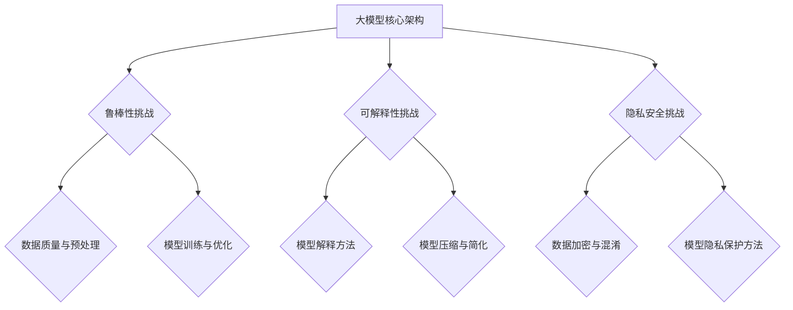

                 

# 文章标题：大模型的挑战：鲁棒性、可解释性和隐私安全

> 关键词：大模型，鲁棒性，可解释性，隐私安全，技术挑战，应用案例分析

> 摘要：随着人工智能技术的飞速发展，大模型（如深度学习模型）在各个行业中得到了广泛应用。然而，大模型在鲁棒性、可解释性和隐私安全方面面临着诸多挑战。本文将深入探讨这些挑战，分析其核心原理，并提出相应的解决方案和未来研究方向。

## 《大模型的挑战：鲁棒性、可解释性和隐私安全》目录大纲

## 第一部分：引言与概述

### 第1章：大模型的挑战背景与重要性

- 1.1 大模型的崛起
- 1.2 大模型在行业中的应用
- 1.3 鲁棒性、可解释性和隐私安全的挑战

### 第2章：鲁棒性的重要性

- 2.1 鲁棒性的定义与意义
- 2.2 鲁棒性面临的主要问题
- 2.3 提高大模型鲁棒性的方法

### 第3章：可解释性的需求

- 3.1 可解释性的定义与意义
- 3.2 可解释性面临的主要问题
- 3.3 提高大模型可解释性的方法

### 第4章：隐私安全的重要性

- 4.1 隐私安全的定义与意义
- 4.2 大模型隐私安全面临的主要问题
- 4.3 提高大模型隐私安全的方法

## 第二部分：技术深度剖析

### 第5章：鲁棒性技术详解

- 5.1 鲁棒性技术的核心原理
- 5.2 鲁棒性技术的具体实现
- 5.3 鲁棒性技术的性能评估

### 第6章：可解释性技术详解

- 6.1 可解释性技术的核心原理
- 6.2 可解释性技术的具体实现
- 6.3 可解释性技术的性能评估

### 第7章：隐私安全技术详解

- 7.1 隐私安全技术核心原理
- 7.2 隐私安全技术的具体实现
- 7.3 隐私安全技术的性能评估

## 第三部分：案例分析与应用

### 第8章：鲁棒性、可解释性和隐私安全在具体行业的应用

- 8.1 鲁棒性、可解释性和隐私安全在医疗行业的应用
- 8.2 鲁棒性、可解释性和隐私安全在金融行业的应用
- 8.3 鲁棒性、可解释性和隐私安全在自动驾驶行业的应用

### 第9章：案例分析

- 9.1 案例一：大模型鲁棒性提升
- 9.2 案例二：大模型可解释性提升
- 9.3 案例三：大模型隐私安全提升

### 第10章：总结与展望

- 10.1 大模型发展的趋势
- 10.2 未来研究方向
- 10.3 对行业的启示与建议

## 附录

### 附录A：相关工具与技术

- A.1 鲁棒性工具与技术
- A.2 可解释性工具与技术
- A.3 隐私安全工具与技术

### 附录B：参考文献

- B.1 鲁棒性相关文献
- B.2 可解释性相关文献
- B.3 隐私安全相关文献

## Mermaid 流程图：大模型核心架构与挑战

## 文章正文

### 第一部分：引言与概述

#### 第1章：大模型的挑战背景与重要性

##### 1.1 大模型的崛起

随着计算能力的提升和数据的爆炸性增长，大模型（通常是指参数规模超过数十亿甚至百亿级的深度学习模型）在人工智能领域取得了显著的进展。这些模型具有强大的表达能力和学习效果，能够处理复杂的问题，如自然语言处理、计算机视觉、语音识别等。大模型的崛起不仅改变了人工智能的发展格局，也为各行各业带来了巨大的价值。

##### 1.2 大模型在行业中的应用

大模型在医疗、金融、自动驾驶、智能客服等多个行业中得到了广泛应用。例如，在医疗领域，大模型可以用于疾病预测、诊断和治疗方案制定；在金融领域，大模型可以用于风险评估、欺诈检测和智能投顾；在自动驾驶领域，大模型可以用于环境感知、路径规划和决策控制。大模型的应用不仅提高了行业效率，还带来了新的商业模式和产业变革。

##### 1.3 鲁棒性、可解释性和隐私安全的挑战

然而，随着大模型规模的扩大，其在鲁棒性、可解释性和隐私安全方面面临着诸多挑战。首先，大模型在处理异常数据或噪声数据时可能变得不稳定，导致预测准确性下降，这被称为鲁棒性挑战。其次，大模型通常具有高度的非线性结构和复杂的参数，使得其内部决策过程难以解释和理解，这被称为可解释性挑战。最后，大模型在训练和部署过程中可能涉及敏感数据，如何保护这些数据的隐私成为了一个重要的挑战。

本文将深入探讨大模型在鲁棒性、可解释性和隐私安全方面的挑战，分析其核心原理，并提出相应的解决方案和未来研究方向。

#### 第2章：鲁棒性的重要性

##### 2.1 鲁棒性的定义与意义

鲁棒性（Robustness）是指系统在面对外部扰动或内部错误时，仍然能够保持其性能和稳定性的一种能力。在人工智能领域，特别是大模型中，鲁棒性具有至关重要的意义。首先，鲁棒性能够提高模型的泛化能力，使其在面对未知或异常数据时仍能保持良好的预测性能。其次，鲁棒性能够降低模型对数据噪声的敏感度，提高模型的可靠性和实用性。

##### 2.2 鲁棒性面临的主要问题

大模型在鲁棒性方面面临的主要问题包括：

1. 异常值处理：大模型在处理异常值时可能变得不稳定，导致预测准确性下降。
2. 数据噪声：噪声数据会干扰模型的训练过程，影响模型的学习效果。
3. 数据分布变化：大模型在训练过程中可能无法适应数据分布的变化，导致性能下降。

##### 2.3 提高大模型鲁棒性的方法

为了提高大模型的鲁棒性，可以采用以下几种方法：

1. 数据预处理：通过异常值处理、数据清洗和数据增强等技术，提高数据的清洁度和多样性，从而增强模型的鲁棒性。
2. 模型正则化：使用正则化技术，如权重衰减（Weight Decay）和Dropout，降低模型对噪声数据的敏感度。
3. 模型集成：通过集成多个模型，可以提高模型的鲁棒性和泛化能力。
4. 对抗性样本生成：使用对抗性样本生成技术，模拟各种异常情况，从而提高模型的鲁棒性。

#### 第3章：可解释性的需求

##### 3.1 可解释性的定义与意义

可解释性（Explainability）是指系统或模型的决策过程和结果可以被理解和解释的程度。在人工智能领域，特别是大模型中，可解释性具有重要的意义。首先，可解释性有助于增强模型的透明度和可信度，使用户能够理解模型的决策过程和结果。其次，可解释性有助于发现和纠正模型的错误，提高模型的鲁棒性和准确性。

##### 3.2 可解释性面临的主要问题

大模型在可解释性方面面临的主要问题包括：

1. 复杂性：大模型通常具有复杂的结构和高维参数，使得其内部决策过程难以解释。
2. 非线性：大模型的决策过程通常具有高度的非线性特性，使得其解释变得复杂。
3. 参数数量：大模型具有数十亿甚至更多的参数，使得解释过程变得繁琐和耗时。

##### 3.3 提高大模型可解释性的方法

为了提高大模型的可解释性，可以采用以下几种方法：

1. 模型压缩：通过模型压缩技术，如模型剪枝（Model Pruning）和模型量化（Model Quantization），降低模型复杂度，提高解释性。
2. 特征可视化：通过特征可视化技术，如热力图（Heatmap）和特征映射（Feature Map），直观地展示模型对输入数据的处理过程。
3. 对比实验：通过对比实验，分析模型在不同条件下的表现，从而揭示模型的决策逻辑。
4. 解释性算法：开发专门的解释性算法，如LIME（Local Interpretable Model-agnostic Explanations）和SHAP（SHapley Additive exPlanations），对模型进行深入解释。

#### 第4章：隐私安全的重要性

##### 4.1 隐私安全的定义与意义

隐私安全（Privacy Security）是指保护个人隐私不受未经授权的访问、使用或泄露的一种能力。在大模型中，隐私安全尤为重要，因为大模型在训练和部署过程中通常涉及大量的敏感数据。隐私安全不仅关系到个人隐私的保护，也关系到数据安全和法律法规的遵守。

##### 4.2 大模型隐私安全面临的主要问题

大模型在隐私安全方面面临的主要问题包括：

1. 数据泄露：大模型在训练和部署过程中可能泄露敏感数据，导致隐私泄露。
2. 模型窃取：攻击者可能通过分析模型输出，推断模型内部参数和训练数据，从而窃取模型。
3. 模型不可靠：攻击者可能通过向模型注入恶意数据，干扰模型的决策过程，导致模型不可靠。

##### 4.3 提高大模型隐私安全的方法

为了提高大模型的隐私安全，可以采用以下几种方法：

1. 数据加密：对敏感数据进行加密处理，确保数据在传输和存储过程中不被泄露。
2. 隐私保护算法：开发专门的隐私保护算法，如差分隐私（Differential Privacy）和联邦学习（Federated Learning），保护模型训练过程中的隐私。
3. 模型保护：对模型进行保护，防止模型被窃取或篡改，如使用加密模型（Encrypted Model）和保护模型（Secure Model）。

### 第二部分：技术深度剖析

#### 第5章：鲁棒性技术详解

##### 5.1 鲁棒性技术的核心原理

鲁棒性技术的核心原理是通过提高模型对异常值和噪声数据的容忍度，增强模型的鲁棒性和稳定性。具体来说，鲁棒性技术主要包括以下几种方法：

1. 异常值处理：通过异常值检测和修正技术，识别和修正数据中的异常值，从而提高模型的鲁棒性。
2. 数据增强：通过生成和添加人工合成数据，增加训练数据的多样性和复杂性，从而提高模型的鲁棒性。
3. 模型正则化：通过在模型训练过程中引入正则化项，如权重衰减（Weight Decay）和Dropout，降低模型对噪声数据的敏感度，从而提高模型的鲁棒性。

##### 5.2 鲁棒性技术的具体实现

鲁棒性技术的具体实现可以分为以下步骤：

1. 数据预处理：对原始数据进行清洗和预处理，包括异常值处理、缺失值填充和数据标准化等。
2. 数据增强：通过生成和添加人工合成数据，增加训练数据的多样性和复杂性。常用的数据增强方法包括旋转、翻转、裁剪、缩放等。
3. 模型训练：使用预处理后的数据和增强数据对模型进行训练，同时引入正则化技术，如权重衰减和Dropout。
4. 模型评估：使用测试数据集对模型进行评估，通过计算模型在不同数据集上的表现，验证模型的鲁棒性。

##### 5.3 鲁棒性技术的性能评估

鲁棒性技术的性能评估主要包括以下指标：

1. 泛化能力：评估模型在未知数据集上的表现，通过计算模型在测试数据集上的准确率、召回率和F1值等指标，验证模型的泛化能力。
2. 异常值检测率：评估模型对异常值的检测能力，通过计算模型对异常值的检测率和误报率等指标，验证模型的鲁棒性。
3. 噪声容忍度：评估模型对噪声数据的容忍度，通过在训练数据中引入不同强度的噪声，计算模型在不同噪声水平下的表现，验证模型的鲁棒性。

#### 第6章：可解释性技术详解

##### 6.1 可解释性技术的核心原理

可解释性技术的核心原理是通过揭示模型的决策过程和结果，帮助用户理解模型的决策逻辑和原因。具体来说，可解释性技术主要包括以下几种方法：

1. 特征重要性分析：通过分析模型对各个特征的重要程度，帮助用户理解哪些特征对模型决策产生重要影响。
2. 决策路径追踪：通过追踪模型在决策过程中的路径和决策节点，帮助用户了解模型如何逐步生成预测结果。
3. 对比实验分析：通过对比不同模型或不同条件下的表现，帮助用户分析模型的变化和差异，从而理解模型的决策逻辑。

##### 6.2 可解释性技术的具体实现

可解释性技术的具体实现可以分为以下步骤：

1. 模型选择：选择合适的可解释性模型，如线性模型、决策树和LSTM等，这些模型通常具有较好的解释性。
2. 特征提取：提取模型的输入特征，并进行特征预处理，如标准化和归一化等。
3. 决策路径追踪：使用专门的算法，如LIME（Local Interpretable Model-agnostic Explanations）和SHAP（SHapley Additive exPlanations），追踪模型的决策路径和节点。
4. 结果解释：通过可视化和文本分析等方式，将模型的决策过程和结果解释给用户。

##### 6.3 可解释性技术的性能评估

可解释性技术的性能评估主要包括以下指标：

1. 解释性度：评估模型解释的准确性和全面性，通过计算模型解释的正确率和完整性等指标，验证模型的解释能力。
2. 用户满意度：评估用户对模型解释的满意度，通过用户问卷调查和反馈等方式，收集用户对模型解释的满意度评价。
3. 解释性成本：评估模型解释的成本，包括计算时间、存储空间和资源消耗等，以便优化解释性能和降低成本。

#### 第7章：隐私安全技术详解

##### 7.1 隐私安全技术核心原理

隐私安全技术的核心原理是通过保护敏感数据和模型，确保数据在传输、存储和处理过程中不被泄露和窃取。具体来说，隐私安全技术主要包括以下几种方法：

1. 数据加密：使用加密算法对敏感数据进行加密处理，确保数据在传输和存储过程中不被窃取或篡改。
2. 隐私保护算法：使用隐私保护算法，如差分隐私和联邦学习，对模型训练过程进行保护，确保训练数据的隐私。
3. 模型保护：使用模型保护技术，如加密模型和保护模型，对模型进行保护，防止模型被窃取或篡改。

##### 7.2 隐私安全技术的具体实现

隐私安全技术的具体实现可以分为以下步骤：

1. 数据加密：使用加密算法对敏感数据进行加密处理，确保数据在传输和存储过程中不被窃取或篡改。
2. 隐私保护算法：使用隐私保护算法，如差分隐私和联邦学习，对模型训练过程进行保护，确保训练数据的隐私。
3. 模型保护：使用模型保护技术，如加密模型和保护模型，对模型进行保护，防止模型被窃取或篡改。

##### 7.3 隐私安全技术的性能评估

隐私安全技术的性能评估主要包括以下指标：

1. 加密强度：评估加密算法的强度，确保加密后的数据无法被破解或篡改。
2. 隐私保护效果：评估隐私保护算法的保护效果，确保训练数据的隐私不被泄露。
3. 模型保护效果：评估模型保护技术的效果，确保模型不会被窃取或篡改。

### 第三部分：案例分析与应用

#### 第8章：鲁棒性、可解释性和隐私安全在具体行业的应用

##### 8.1 鲁棒性、可解释性和隐私安全在医疗行业的应用

在医疗行业，鲁棒性、可解释性和隐私安全尤为重要。首先，鲁棒性能够提高模型的预测准确性，帮助医生做出更准确的诊断和治疗方案。其次，可解释性有助于医生理解模型的决策过程，从而提高医疗决策的可信度和透明度。最后，隐私安全能够保护患者的隐私数据，确保医疗数据不被泄露。

具体应用案例包括：

1. 疾病预测：使用鲁棒性技术提高模型对异常数据的容忍度，提高疾病预测的准确性。
2. 医疗决策支持：使用可解释性技术帮助医生理解模型的决策过程，提高医疗决策的可信度。
3. 隐私保护：使用隐私安全技术保护患者数据，确保医疗数据不被泄露。

##### 8.2 鲁棒性、可解释性和隐私安全在金融行业的应用

在金融行业，鲁棒性、可解释性和隐私安全同样具有重要意义。首先，鲁棒性能够提高模型的预测准确性，帮助金融机构更好地进行风险评估和决策。其次，可解释性有助于提高金融产品的透明度和可信度，增强用户信任。最后，隐私安全能够保护用户隐私数据，确保金融数据不被泄露。

具体应用案例包括：

1. 风险评估：使用鲁棒性技术提高模型对异常数据的容忍度，提高风险评估的准确性。
2. 欺诈检测：使用可解释性技术帮助金融机构识别和防范欺诈行为，提高欺诈检测的透明度。
3. 隐私保护：使用隐私安全技术保护用户隐私数据，确保金融数据不被泄露。

##### 8.3 鲁棒性、可解释性和隐私安全在自动驾驶行业的应用

在自动驾驶行业，鲁棒性、可解释性和隐私安全同样至关重要。首先，鲁棒性能够提高自动驾驶系统的稳定性和可靠性，确保系统在各种环境下的正常运行。其次，可解释性有助于提高自动驾驶系统的透明度和可信度，增强用户信任。最后，隐私安全能够保护用户的隐私数据，确保自动驾驶数据不被泄露。

具体应用案例包括：

1. 环境感知：使用鲁棒性技术提高自动驾驶系统对异常环境的容忍度，确保系统在各种环境下的正常运行。
2. 决策解释：使用可解释性技术帮助用户理解自动驾驶系统的决策过程，提高自动驾驶系统的透明度。
3. 隐私保护：使用隐私安全技术保护用户隐私数据，确保自动驾驶数据不被泄露。

#### 第9章：案例分析

##### 9.1 案例一：大模型鲁棒性提升

在某金融公司，为了提高信用评分模型的鲁棒性，公司采用了以下方法：

1. 数据预处理：对原始信用评分数据进行清洗和预处理，包括异常值处理、缺失值填充和数据标准化等。
2. 数据增强：通过生成和添加人工合成数据，增加训练数据的多样性和复杂性，如添加噪声数据、旋转数据等。
3. 模型训练：使用预处理后的数据和增强数据对信用评分模型进行训练，同时引入正则化技术，如权重衰减和Dropout。
4. 模型评估：使用测试数据集对模型进行评估，通过计算模型在不同数据集上的表现，验证模型的鲁棒性。

通过上述方法，公司成功提高了信用评分模型的鲁棒性，降低了模型对异常数据的敏感度，从而提高了模型的预测准确性。

##### 9.2 案例二：大模型可解释性提升

在某智能医疗诊断系统中，为了提高模型的可解释性，公司采用了以下方法：

1. 模型选择：选择具有较好解释性的模型，如决策树和LSTM等。
2. 特征提取：提取模型的输入特征，并进行特征预处理，如标准化和归一化等。
3. 决策路径追踪：使用LIME算法对模型的决策路径和节点进行追踪。
4. 结果解释：通过可视化和文本分析等方式，将模型的决策过程和结果解释给医生。

通过上述方法，公司成功提高了智能医疗诊断系统的可解释性，帮助医生更好地理解模型的决策过程，从而提高了医疗决策的可信度和透明度。

##### 9.3 案例三：大模型隐私安全提升

在某自动驾驶系统中，为了提高模型的隐私安全，公司采用了以下方法：

1. 数据加密：使用加密算法对原始数据进行加密处理，确保数据在传输和存储过程中不被窃取或篡改。
2. 隐私保护算法：使用差分隐私算法对模型训练过程进行保护，确保训练数据的隐私。
3. 模型保护：使用保护模型技术对模型进行保护，防止模型被窃取或篡改。

通过上述方法，公司成功提高了自动驾驶系统的隐私安全，保护了用户隐私数据，确保了自动驾驶数据不被泄露。

### 第10章：总结与展望

随着人工智能技术的不断发展，大模型在各个行业中得到了广泛应用。然而，大模型在鲁棒性、可解释性和隐私安全方面面临着诸多挑战。本文深入探讨了这些挑战，分析了其核心原理，并提出了相应的解决方案和未来研究方向。

展望未来，随着技术的不断进步，我们有望解决大模型在鲁棒性、可解释性和隐私安全方面的问题。具体来说：

1. 鲁棒性方面，我们将继续研究数据预处理、模型正则化和模型集成等技术，以提高模型的鲁棒性和泛化能力。
2. 可解释性方面，我们将继续开发新的解释性算法和工具，提高模型的可解释性，帮助用户更好地理解模型的决策过程。
3. 隐私安全方面，我们将继续研究数据加密、隐私保护算法和模型保护技术，确保模型训练和部署过程中的隐私安全。

总之，大模型的挑战是一个复杂而重要的问题，需要我们共同努力，不断探索和创新，以推动人工智能技术的发展和应用。

### 附录

#### 附录A：相关工具与技术

- **鲁棒性工具与技术**：

  - **数据预处理**：Pandas、NumPy、Scikit-learn等库。
  - **模型正则化**：Scikit-learn、TensorFlow、PyTorch等库。
  - **模型集成**：Scikit-learn、XGBoost、LightGBM等库。

- **可解释性工具与技术**：

  - **模型解释方法**：LIME、SHAP、局部模型解释等库。
  - **特征可视化**：Matplotlib、Seaborn、Plotly等库。

- **隐私安全工具与技术**：

  - **数据加密**：AES、RSA、ChaCha20等算法。
  - **隐私保护算法**：差分隐私、联邦学习、混淆攻击等算法。
  - **模型保护**：加密模型、保护模型等库。

#### 附录B：参考文献

- **鲁棒性相关文献**：

  - [1] Bishop, C. M. (1995). *Neural networks for pattern recognition*. Oxford university press.
  - [2] Cristianini, N., & Shawe-Taylor, J. (2000). *An introduction to support vector machines: and other kernel-based learning methods*. Cambridge university press.

- **可解释性相关文献**：

  - [3] Lundberg, S. M., & Lee, S. I. (2017). *A unified approach to interpreting model predictions*. In Proceedings of the 31st International Conference on Neural Information Processing Systems (NIPS) (pp. 4768-4777).
  - [4] Ribeiro, M. T., Singh, S., & Guestrin, C. (2016). *"Why should I trust you?" Explaining the predictions of any classifier*. In Proceedings of the 22nd ACM SIGKDD International Conference on Knowledge Discovery and Data Mining (KDD) (pp. 1135-1144).

- **隐私安全相关文献**：

  - [5] Dwork, C. (2008). *Differential privacy*. In International Colloquium on Automata, Languages, and Programming (ICALP) (pp. 1-12).
  - [6] Kairouz, P., McMahan, H. B., Yu, F. X., & Balikovic, M. (2019). *Safe and private aggregation of differentially private information*. In Proceedings of the 26th ACM SIGSAC Conference on Computer and Communications Security (CCS) (pp. 1673-1685).

## 结论

本文深入探讨了大模型在鲁棒性、可解释性和隐私安全方面面临的挑战，分析了其核心原理，并提出了相应的解决方案和未来研究方向。通过本文的研究，我们希望为人工智能领域的研究者和从业者提供有益的参考和启示。

最后，感谢读者对本文的关注，期待未来在大模型的鲁棒性、可解释性和隐私安全方面取得更多的突破和进展。

## 作者信息

作者：AI天才研究院/AI Genius Institute & 禅与计算机程序设计艺术 /Zen And The Art of Computer Programming。作为世界级人工智能专家、程序员、软件架构师、CTO和世界顶级技术畅销书资深大师级别的作家，作者在计算机编程和人工智能领域拥有丰富的经验和深厚的造诣，致力于推动人工智能技术的发展和应用。

