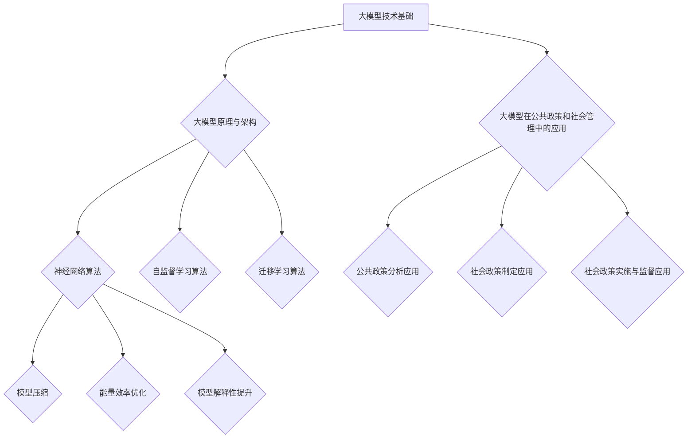
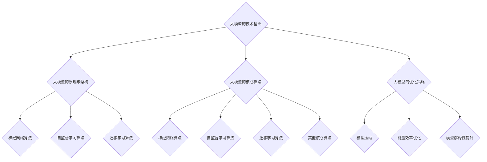
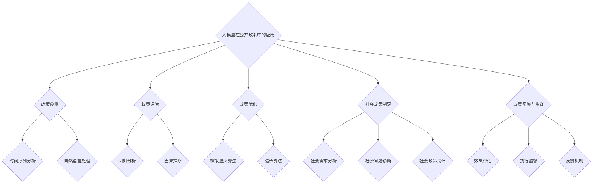
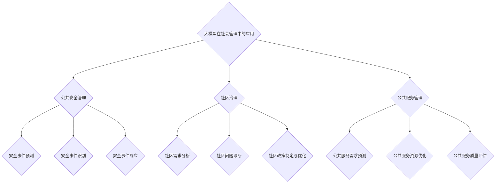
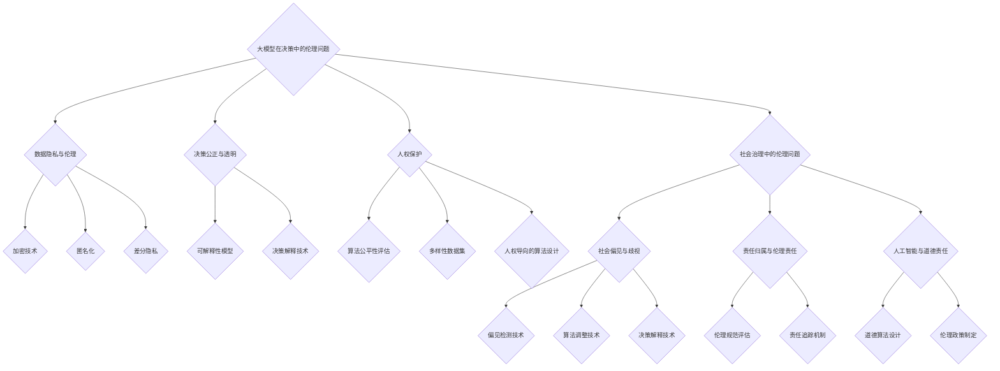
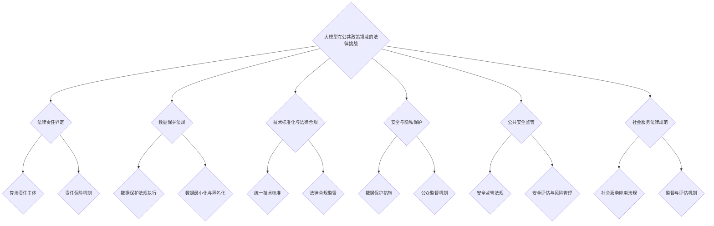
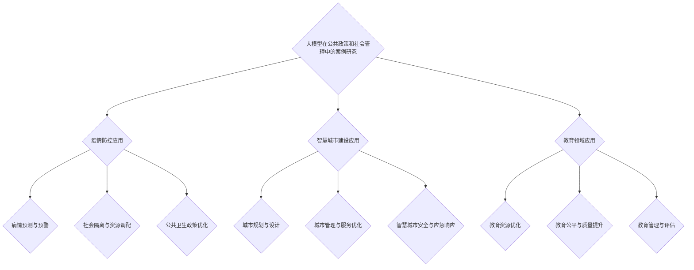

                 

# 大模型的社会治理：公共政策和社会管理

> 关键词：大模型，社会治理，公共政策，社会管理，伦理问题，法律问题

> 摘要：本文深入探讨了大模型在社会治理和公共政策中的应用，分析了大模型的概念、技术基础以及其在各个领域的实际应用。同时，本文还探讨了大模型在公共政策和社会管理中面临的伦理与法律问题，并提出了相应的解决策略。通过对大模型社会治理的深入分析，本文旨在为相关领域的研究者和从业者提供有益的参考和启示。

## 第一部分：大模型与社会治理概述

### 第1章：大模型与社会治理概述

#### 1.1 大模型的概念与发展历程

##### 1.1.1 大模型的定义

大模型，又称大型神经网络模型，是指拥有巨大参数规模和复杂结构的神经网络模型。这些模型通常用于处理大规模数据集，具有强大的特征提取和模式识别能力。大模型的出现，标志着深度学习技术的一个重大突破，成为当前人工智能领域的研究热点。

##### 1.1.2 大模型的发展历程

大模型的发展历程可以追溯到20世纪80年代的神经网络研究。当时，神经网络技术因为计算能力和数据集的限制，尚未得到广泛应用。随着计算机硬件性能的提升和大数据技术的普及，深度学习技术在21世纪初逐渐崭露头角。2012年，AlexNet的提出标志着深度学习技术在图像识别领域的重大突破。此后，大模型的发展进入了一个快速发展的阶段，各种大规模神经网络模型不断涌现，如BERT、GPT、ViT等。

##### 1.1.3 大模型在社会治理中的应用前景

大模型在社会治理中的应用前景非常广阔。首先，大模型可以用于数据分析和预测，帮助政府更好地制定和调整公共政策。其次，大模型可以用于社会问题的诊断和解决，如公共安全事件预测、社区治理优化等。此外，大模型还可以用于提高公共服务的质量和效率，如智能交通管理、教育资源优化等。总之，大模型在提升社会治理水平、提高公共管理水平方面具有巨大的潜力。

#### 1.2 社会治理的概念与挑战

##### 1.2.1 社会治理的定义

社会治理是指政府、企业、社会组织和公民等多方共同参与的，旨在维护社会秩序、促进社会发展和增进社会福祉的过程。社会治理强调多元参与、合作治理和共同责任，与传统的一元化管理模式相比，具有更高的效率和更广泛的社会影响力。

##### 1.2.2 社会治理面临的挑战

社会治理面临诸多挑战。首先，社会问题日益复杂，如环境污染、社会不公、公共安全等，需要更有效的治理手段。其次，信息时代的到来，带来了数据爆炸、隐私保护等问题，对社会治理提出了新的要求。此外，全球化和城市化进程的加速，使得社会治理的范围和难度不断增加。因此，如何应对这些挑战，提高社会治理水平，成为一个亟待解决的问题。

##### 1.2.3 大模型在应对社会治理挑战中的作用

大模型在应对社会治理挑战中发挥着重要作用。首先，大模型可以用于处理和分析大规模数据，帮助政府更准确地识别社会问题，制定针对性的治理策略。其次，大模型可以用于预测和评估社会问题的趋势，帮助政府提前预防和应对潜在风险。此外，大模型还可以用于优化公共服务，提高公共管理的效率和质量。总之，大模型为社会治理提供了强有力的技术支持，有助于提升社会治理水平。

#### 1.3 公共政策与社会管理的联系与区别

##### 1.3.1 公共政策的定义与作用

公共政策是指政府或其他公共机构为解决社会问题、促进社会发展而制定的一系列行动计划和措施。公共政策的作用主要体现在以下几个方面：调节社会资源分配、维护社会公平正义、促进社会稳定和发展等。

##### 1.3.2 社会管理的定义与任务

社会管理是指政府、企业、社会组织和公民等多方共同参与，通过制度安排和行动实施，维护社会秩序、促进社会发展和增进社会福祉的过程。社会管理的任务包括：保障社会公共安全、提供公共服务、维护社会公平正义、促进社会和谐稳定等。

##### 1.3.3 公共政策与社会管理在大模型应用中的互动

公共政策与社会管理在大模型应用中具有密切的互动关系。首先，公共政策为社会管理提供了目标和方向，大模型为社会管理提供了技术手段和工具。其次，大模型的应用可以为公共政策制定提供数据支持和决策依据，提高公共政策的科学性和有效性。同时，公共政策和社会管理的互动，可以推动大模型技术的创新和应用，促进社会治理水平的提升。因此，在大模型应用中，公共政策和社会管理需要相互协调、相互促进，共同构建和谐、稳定、高效的社会治理体系。

### 总结

本章从大模型的概念与发展历程、社会治理的概念与挑战、以及公共政策与社会管理的联系与区别三个方面，探讨了大模型在社会治理和公共政策中的应用。通过本章的分析，我们可以看到，大模型作为一种先进的技术手段，在社会治理和公共政策领域具有巨大的应用潜力。然而，要充分发挥大模型的作用，还需要解决一系列的挑战和问题。接下来，我们将进一步探讨大模型的技术基础，以及其在实际应用中的具体作用。

### Mermaid 流程图



#### 2.1 大模型的原理与架构

##### 2.1.1 大模型的基本原理

大模型的基本原理是基于神经网络的深度学习技术。神经网络是由大量神经元（或节点）组成的计算模型，通过模拟生物神经系统的信息处理方式，对输入数据进行特征提取和模式识别。大模型的核心在于其巨大的参数规模和复杂的结构，这使得它们能够处理大规模数据，并提取出更高层次的特征。

##### 2.1.2 大模型的架构

大模型的架构通常包括以下几个层次：

1. **输入层**：接收外部输入数据，如文本、图像或音频等。
2. **隐藏层**：对输入数据进行特征提取和变换，隐藏层可以是单层或多层，层数越多，模型的深度越深。
3. **输出层**：根据隐藏层的输出生成预测结果或分类结果。

大模型的关键在于其多层结构和巨大的参数规模。多层结构使得模型能够通过逐层学习的方式，从原始数据中提取出更高层次的特征。巨大的参数规模则使得模型能够捕捉到数据中的复杂模式，从而提高模型的性能和泛化能力。

##### 2.1.3 大模型的训练与优化

大模型的训练与优化过程主要包括以下步骤：

1. **数据预处理**：对输入数据进行预处理，如归一化、去噪、数据增强等，以提高模型的训练效果。
2. **初始化参数**：为模型的参数随机分配初始值。
3. **前向传播**：将输入数据通过模型的前向传播过程，计算得到输出结果。
4. **计算损失**：将模型的输出结果与真实结果进行比较，计算损失函数值。
5. **反向传播**：利用梯度下降等优化算法，更新模型的参数，以降低损失函数值。
6. **迭代训练**：重复上述步骤，直到模型收敛或达到预设的训练次数。

在训练过程中，大模型的参数更新依赖于梯度下降算法。梯度下降是一种优化算法，通过计算损失函数关于模型参数的梯度，更新模型的参数，以最小化损失函数。在大模型的训练中，梯度下降算法的计算量和存储需求非常大，因此需要高效的计算资源和优化策略。

##### 2.1.4 大模型的技术挑战

尽管大模型在许多领域取得了显著的成果，但其训练和应用过程中仍面临一系列技术挑战：

1. **计算资源需求**：大模型通常需要大量的计算资源，包括GPU和TPU等高性能计算设备。这对模型的训练和部署提出了高要求。
2. **数据质量**：大模型的训练依赖于大规模数据集。数据质量对模型的性能有直接影响，因此需要确保数据的质量和多样性。
3. **模型解释性**：大模型通常被视为“黑箱”，其决策过程难以解释。这限制了其在某些应用场景中的使用，如医疗诊断和金融风险评估等。
4. **隐私保护**：大模型在训练和应用过程中可能涉及敏感数据，如个人隐私信息。如何保护这些数据不被泄露，是一个重要的问题。

为了解决上述挑战，研究人员提出了一系列技术策略，如模型压缩、能量效率优化、模型解释性提升等。这些策略旨在提高大模型的训练效率、降低计算资源需求、增强模型的可解释性，并保护用户隐私。

#### 2.2 大模型的核心算法

##### 2.2.1 神经网络算法

神经网络算法是大模型的核心算法之一。它通过模拟生物神经系统的信息处理方式，对输入数据进行特征提取和模式识别。神经网络算法的基本原理是：将输入数据通过一系列的神经元层，每一层神经元都对输入数据进行加权求和，并引入一个激活函数，最终得到输出结果。

神经网络算法的关键在于其多层结构和参数学习。多层结构使得神经网络能够提取出更高层次的特征，而参数学习则通过优化算法（如梯度下降）来调整神经元的权重，以最小化损失函数。

以下是一个简化的神经网络算法的伪代码：

```plaintext
初始化参数 W1, b1, W2, b2
对于每个训练样本 (x, y)：
    前向传播：
        z1 = x * W1 + b1
        a1 = activation(z1)
        z2 = a1 * W2 + b2
        y' = activation(z2)
    计算损失 L = loss(y, y')
    反向传播：
        ∂L/∂z2 = ∂L/∂y' * ∂y'/∂z2
        ∂L/∂a1 = ∂L/∂z2 * ∂z2/∂a1
        ∂L/∂z1 = ∂L/∂a1 * ∂a1/∂z1
    更新参数：
        W2 = W2 - learning_rate * ∂L/∂W2
        b2 = b2 - learning_rate * ∂L/∂b2
        W1 = W1 - learning_rate * ∂L/∂W1
        b1 = b1 - learning_rate * ∂L/∂b1
```

其中，`activation`函数可以是Sigmoid、ReLU或Tanh等。`loss`函数可以是均方误差（MSE）、交叉熵（Cross-Entropy）等。

##### 2.2.2 自监督学习算法

自监督学习算法是一种不需要人工标注数据的学习方法，它通过利用数据的内在结构，自动生成标签。自监督学习算法在预训练和半监督学习领域具有广泛的应用。

自监督学习算法的核心思想是：通过设计一个预测任务，使得模型在预测过程中自动学习数据中的特征。常见的自监督学习任务包括：图像修复、图像分类、语言模型训练等。

以下是一个简化的自监督学习算法的伪代码：

```plaintext
初始化模型参数
对于每个数据点 x：
    随机选择一个子集 S ⊆ x
    预测子集 S 的标签
    计算预测标签与真实标签之间的损失
    更新模型参数
```

自监督学习算法的一个关键挑战是如何设计有效的预测任务。一个好的预测任务应该能够充分利用数据的内在结构，从而提高模型的学习效果。

##### 2.2.3 迁移学习算法

迁移学习算法是一种利用已有模型的先验知识，在新数据集上进行训练的方法。它通过将知识从源域（已训练模型）转移到目标域（新数据集），来提高新模型的性能。

迁移学习算法的基本思想是：在新数据集上，利用已有模型的权重作为初始化权重，然后通过少量的训练，微调模型参数，使其适应新数据集。

以下是一个简化的迁移学习算法的伪代码：

```plaintext
初始化模型参数为源模型的权重
对于每个数据点 x：
    训练模型
    计算预测标签与真实标签之间的损失
    更新模型参数
```

迁移学习算法的关键挑战是如何选择合适的源模型和目标域，以及如何平衡源域和目标域之间的差异。

##### 2.2.4 其他核心算法

除了上述三种核心算法外，大模型还包括其他一些重要的算法，如生成对抗网络（GAN）、变分自编码器（VAE）等。这些算法在图像生成、自然语言处理等领域具有广泛的应用。

- **生成对抗网络（GAN）**：GAN由一个生成器和一个判别器组成，生成器生成数据，判别器判断数据的真假。通过训练生成器和判别器的对抗关系，生成器可以逐渐生成逼真的数据。

- **变分自编码器（VAE）**：VAE是一种无监督学习算法，通过编码器和解码器将数据映射到潜在空间，并学习数据的分布。VAE在图像去噪、图像生成等领域具有广泛应用。

#### 2.3 大模型在实际应用中的优化策略

##### 2.3.1 模型压缩

模型压缩是一种减小模型大小、降低计算资源需求的方法。常见的模型压缩方法包括量化、剪枝、蒸馏等。

- **量化**：量化是将模型的浮点权重转换为低比特位的整数表示。量化可以显著减少模型的存储和计算需求，但同时可能会降低模型的性能。

- **剪枝**：剪枝是通过删除模型中不重要的权重或神经元，来减小模型的大小。剪枝方法包括结构剪枝和权重剪枝。

- **蒸馏**：蒸馏是将大模型的权重传递给小模型，以保留大模型的知识。蒸馏方法通过训练小模型，使其在大模型的知识下取得更好的性能。

##### 2.3.2 能量效率优化

能量效率优化是一种提高模型在移动设备和嵌入式系统上运行效率的方法。常见的能量效率优化方法包括低功耗架构、动态电压调节等。

- **低功耗架构**：低功耗架构通过设计轻量级的硬件架构，来降低模型的能量消耗。

- **动态电压调节**：动态电压调节是一种根据模型的计算负载动态调整电压的方法，以降低模型的能量消耗。

##### 2.3.3 模型解释性提升

模型解释性提升是一种提高模型可解释性的方法。常见的模型解释性提升方法包括注意力机制、可解释模型等。

- **注意力机制**：注意力机制是一种通过强调重要特征，来提高模型解释性的方法。

- **可解释模型**：可解释模型是一种设计用于可解释的模型，如决策树、线性模型等。

#### 总结

本章从大模型的原理与架构、核心算法以及优化策略三个方面，详细介绍了大模型的技术基础。通过本章的分析，我们可以看到，大模型作为一种先进的技术手段，具有巨大的应用潜力。然而，要充分发挥大模型的作用，还需要解决一系列的技术挑战。在下一章中，我们将进一步探讨大模型在公共政策和社会管理中的具体应用。

### Mermaid 流程图



## 第三部分：大模型在公共政策和社会管理中的应用

### 第3章：大模型在公共政策中的应用

#### 3.1 大模型在公共政策分析中的应用

##### 3.1.1 公共政策预测

大模型在公共政策分析中的应用首先体现在政策预测上。通过分析历史数据和政策文本，大模型可以预测政策的未来趋势和影响。例如，在环境保护政策中，大模型可以分析过去的排放数据、政策文本和环保指标，预测未来的排放水平和环保政策的效果。

**算法原理：** 政策预测通常采用时间序列分析和自然语言处理技术。时间序列分析用于处理和预测连续变量，如排放量；自然语言处理技术用于解析政策文本，提取关键信息和语义关系。

**伪代码示例：**

```python
# 假设 X 是历史排放数据，y 是政策效果指标
# 使用时间序列模型预测未来排放量
model = TimeSeriesModel()
model.fit(X)

# 使用自然语言处理模型解析政策文本
nlp_model = NLPModel()
policy_text = "减少碳排放，促进绿色能源使用"
parsed_text = nlp_model.parse(policy_text)

# 预测未来排放量
predicted_emission = model.predict(parsed_text)
```

##### 3.1.2 公共政策评估

大模型还可以用于评估现有政策的效能。通过对政策实施前后的数据进行分析，大模型可以评估政策对经济、社会和环境等方面的影响。

**算法原理：** 政策评估通常采用回归分析和因果推断技术。回归分析用于建立政策变量与结果变量之间的统计关系；因果推断技术用于确定政策对结果的因果关系。

**伪代码示例：**

```python
# 假设 X 是政策实施前的数据，Y 是政策实施后的数据
# 使用回归分析评估政策效果
regressor = LinearRegressor()
regressor.fit(X, Y)

# 预测政策实施后的结果
predicted_results = regressor.predict(X)

# 使用因果推断技术确定因果关系
causal_model = CausalInferenceModel()
causal_relation = causal_model.infer causation(X, Y)
```

##### 3.1.3 公共政策优化

大模型在公共政策优化中的应用体现在通过分析大量数据和模拟不同政策方案，为政策制定者提供优化的政策建议。例如，在交通管理中，大模型可以分析交通流量数据，模拟不同交通管理政策的效果，帮助制定最优的交通管理方案。

**算法原理：** 政策优化通常采用模拟退火算法、遗传算法等优化技术。这些算法通过模拟不同的政策方案，评估其效果，并寻找最优解。

**伪代码示例：**

```python
# 假设 policies 是一系列交通管理政策方案
# 使用模拟退火算法优化政策方案
optimizer = SimulatedAnnealing()
optimized_policy = optimizer.optimize(policies, evaluate_policy)

# 评估优化政策的效果
policy_performance = evaluate_policy(optimized_policy)
```

#### 3.2 大模型在社会政策制定中的应用

##### 3.2.1 社会需求分析

大模型可以用于分析社会需求，识别社会问题，为政策制定提供数据支持。例如，在社会保障政策中，大模型可以分析失业率、收入水平等经济指标，识别失业群体的需求。

**算法原理：** 社会需求分析通常采用聚类分析和关联规则挖掘技术。聚类分析用于将相似的需求聚集在一起；关联规则挖掘用于识别不同需求之间的关联关系。

**伪代码示例：**

```python
# 假设 data 是包含经济指标和社会需求的数据集
# 使用聚类分析识别相似需求
clustering = KMeans()
clusters = clustering.fit(data)

# 使用关联规则挖掘识别需求关联
miner = AssociationRuleMining()
rules = miner.fit(data)
```

##### 3.2.2 社会问题诊断

大模型可以用于诊断社会问题，提供问题的根本原因和解决方案。例如，在公共安全领域，大模型可以分析犯罪数据，诊断犯罪问题的根源，并提供建议。

**算法原理：** 社会问题诊断通常采用数据挖掘和因果分析技术。数据挖掘用于发现数据中的模式；因果分析用于确定问题的根本原因。

**伪代码示例：**

```python
# 假设 crime_data 是犯罪数据集
# 使用数据挖掘识别犯罪模式
miner = DataMining()
patterns = miner.fit(crime_data)

# 使用因果分析确定犯罪问题的根源
causal_analyzer = CausalAnalysis()
root_causes = causal_analyzer.fit(crime_data)
```

##### 3.2.3 社会政策设计

大模型可以用于设计社会政策，通过模拟不同政策方案的效果，为政策制定提供决策支持。例如，在教育政策中，大模型可以模拟不同教育资源的分配方案，评估其对教育公平和质量的影响。

**算法原理：** 社会政策设计通常采用模拟和优化技术。模拟用于模拟不同政策方案的效果；优化用于寻找最优政策方案。

**伪代码示例：**

```python
# 假设 education_data 是教育资源数据集
# 使用模拟技术评估政策方案的效果
simulator = PolicySimulation()
policy_effects = simulator.evaluate(education_data, policy_schemes)

# 使用优化技术寻找最优政策方案
optimizer = PolicyOptimizer()
optimal_policy = optimizer.optimize(policy_effects)
```

#### 3.3 大模型在社会政策实施与监督中的应用

##### 3.3.1 社会政策实施效果评估

大模型可以用于评估社会政策实施的效果，通过分析实施后的数据和反馈信息，评估政策的有效性。例如，在就业促进政策中，大模型可以分析就业率、就业质量等指标，评估政策效果。

**算法原理：** 政策效果评估通常采用指标分析和评价技术。指标分析用于提取关键指标；评价技术用于评估政策效果。

**伪代码示例：**

```python
# 假设 implementation_data 是政策实施后的数据
# 使用指标分析提取关键指标
indicator_extractor = IndicatorAnalysis()
key_indicators = indicator_extractor.extract(implementation_data)

# 使用评价技术评估政策效果
evaluator = PolicyEffectEvaluator()
policy_effect = evaluator.evaluate(key_indicators)
```

##### 3.3.2 社会政策执行监督

大模型可以用于监督社会政策的执行情况，通过分析实时数据和监控信息，及时发现政策执行中的问题。例如，在扶贫政策中，大模型可以监控贫困人口的脱贫进度，及时发现潜在的问题。

**算法原理：** 政策执行监督通常采用实时分析和异常检测技术。实时分析用于处理和分析实时数据；异常检测用于识别异常情况。

**伪代码示例：**

```python
# 假设 real_time_data 是实时监控数据
# 使用实时分析处理实时数据
real_time_analyzer = RealTimeAnalysis()
processed_data = real_time_analyzer.process(real_time_data)

# 使用异常检测识别异常情况
detector = AnomalyDetection()
anomalies = detector.detect(processed_data)
```

##### 3.3.3 社会政策反馈机制

大模型可以用于建立社会政策反馈机制，通过分析政策执行过程中的反馈信息，不断调整和优化政策。例如，在教育政策中，大模型可以收集教师、学生和家长的反馈，优化教育资源配置。

**算法原理：** 政策反馈机制通常采用反馈分析和优化技术。反馈分析用于收集和分析反馈信息；优化技术用于调整和优化政策。

**伪代码示例：**

```python
# 假设 feedback_data 是政策反馈数据
# 使用反馈分析收集反馈信息
feedback_analyzer = FeedbackAnalysis()
feedback_summary = feedback_analyzer.analyze(feedback_data)

# 使用优化技术调整政策
optimizer = PolicyOptimizer()
optimized_policy = optimizer.optimize(feedback_summary)
```

#### 总结

本章详细介绍了大模型在公共政策分析、社会政策制定和社会政策实施与监督中的应用。通过大模型的技术手段，可以更准确地预测政策效果，优化政策制定，评估政策实施效果，并建立反馈机制，从而提升公共政策的科学性和有效性。在下一章中，我们将进一步探讨大模型在社会管理中的应用。

### Mermaid 流程图



### 第4章：大模型在社会管理中的应用

#### 4.1 大模型在公共安全管理中的应用

##### 4.1.1 安全事件预测

大模型在公共安全管理中的应用首先体现在安全事件的预测上。通过分析历史安全事件数据、环境监控数据和潜在威胁信息，大模型可以预测未来的安全事件，帮助政府提前预防和应对潜在风险。

**算法原理：** 安全事件预测通常采用时间序列分析和机器学习技术。时间序列分析用于处理和预测连续变量，如犯罪率；机器学习技术用于从数据中学习模式和趋势。

**伪代码示例：**

```python
# 假设 event_data 是历史安全事件数据
# 使用时间序列模型预测未来安全事件
time_series_model = TimeSeriesModel()
time_series_model.fit(event_data)

# 使用机器学习模型预测潜在威胁
ml_model = MLModel()
predicted_threats = ml_model.predict(event_data)
```

##### 4.1.2 安全事件识别

大模型还可以用于安全事件的实时识别，通过对监控视频、音频和文本等数据进行实时分析，识别和分类安全事件。

**算法原理：** 安全事件识别通常采用图像识别、音频识别和自然语言处理技术。图像识别用于识别监控视频中的异常行为；音频识别用于识别异常声音；自然语言处理用于分析文本信息。

**伪代码示例：**

```python
# 假设 video_data 是监控视频数据
# 使用图像识别技术识别异常行为
image_recognizer = ImageRecognition()
anomalous_behaviors = image_recognizer识别(video_data)

# 假设 audio_data 是监控音频数据
# 使用音频识别技术识别异常声音
audio_recognizer = AudioRecognition()
anomalous_sounds = audio_recognizer识别(audio_data)

# 假设 text_data 是文本数据
# 使用自然语言处理技术分析文本信息
nlp_model = NLPModel()
anomalous_texts = nlp_model识别(text_data)
```

##### 4.1.3 安全事件响应

大模型在安全事件响应中的应用体现在快速响应和决策支持上。通过分析实时数据和安全事件信息，大模型可以提供快速响应方案，协助应急指挥系统做出决策。

**算法原理：** 安全事件响应通常采用实时分析和决策支持技术。实时分析用于处理和分析实时数据；决策支持技术用于提供最优响应方案。

**伪代码示例：**

```python
# 假设 real_time_data 是实时数据
# 使用实时分析处理实时数据
real_time_analyzer = RealTimeAnalysis()
processed_data = real_time_analyzer.process(real_time_data)

# 使用决策支持技术提供响应方案
decision_support_system = DecisionSupport()
response_plan = decision_support_system.generate_response(processed_data)
```

#### 4.2 大模型在社区治理中的应用

##### 4.2.1 社区需求分析

大模型在社区治理中的应用首先体现在需求分析上。通过分析居民的需求、行为和偏好数据，大模型可以识别社区的需求热点，为社区服务提供数据支持。

**算法原理：** 社区需求分析通常采用数据挖掘和机器学习技术。数据挖掘用于发现数据中的模式和关联；机器学习技术用于从数据中学习居民的需求。

**伪代码示例：**

```python
# 假设 resident_data 是居民数据
# 使用数据挖掘识别需求模式
miner = DataMining()
demand_patterns = miner.identify_patterns(resident_data)

# 使用机器学习技术学习居民需求
ml_model = MLModel()
learned_demands = ml_model.learn(resident_data)
```

##### 4.2.2 社区问题诊断

大模型还可以用于诊断社区问题，通过分析社区数据和社会舆情，识别社区中的问题和矛盾。

**算法原理：** 社区问题诊断通常采用数据分析和文本分析技术。数据分析用于识别数据中的异常和趋势；文本分析用于解析社区舆情。

**伪代码示例：**

```python
# 假设 community_data 是社区数据
# 使用数据分析识别社区问题
data_analyzer = DataAnalysis()
community_issues = data_analyzer.detect_issues(community_data)

# 使用文本分析解析社区舆情
text_analyzer = TextAnalysis()
social_opinions = text_analyzer.parse_opinions(community_data)
```

##### 4.2.3 社区政策制定与优化

大模型在社区治理中的应用还包括政策制定与优化。通过分析社区数据和反馈信息，大模型可以为社区政策制定提供支持，并优化政策的实施效果。

**算法原理：** 社区政策制定与优化通常采用模拟和优化技术。模拟用于模拟不同政策方案的效果；优化技术用于寻找最优政策方案。

**伪代码示例：**

```python
# 假设 policy_data 是社区政策数据
# 使用模拟技术评估政策方案的效果
simulator = PolicySimulation()
policy_effects = simulator.evaluate(policy_data, policy_schemes)

# 使用优化技术优化政策方案
optimizer = PolicyOptimizer()
optimized_policy = optimizer.optimize(policy_effects)
```

#### 4.3 大模型在公共服务管理中的应用

##### 4.3.1 公共服务需求预测

大模型在公共服务管理中的应用首先体现在需求预测上。通过分析历史服务数据、居民行为数据和趋势信息，大模型可以预测未来的服务需求，为公共服务提供数据支持。

**算法原理：** 公共服务需求预测通常采用时间序列分析和机器学习技术。时间序列分析用于处理和预测连续变量，如服务请求量；机器学习技术用于从数据中学习需求模式。

**伪代码示例：**

```python
# 假设 service_data 是历史服务数据
# 使用时间序列模型预测未来服务需求
time_series_model = TimeSeriesModel()
time_series_model.fit(service_data)

# 使用机器学习模型预测需求趋势
ml_model = MLModel()
predicted_demands = ml_model.predict(service_data)
```

##### 4.3.2 公共服务资源优化

大模型在公共服务管理中的应用还包括资源优化。通过分析服务需求和资源使用情况，大模型可以优化公共服务的资源配置，提高服务效率。

**算法原理：** 公共服务资源优化通常采用优化算法和模拟技术。优化算法用于寻找最优资源配置方案；模拟技术用于评估不同资源配置方案的效果。

**伪代码示例：**

```python
# 假设 resource_data 是公共服务资源数据
# 使用优化算法寻找最优资源配置
optimizer = ResourceOptimizer()
optimal_resources = optimizer.optimize(resource_data)

# 使用模拟技术评估资源配置效果
simulator = ResourceSimulation()
evaluation_results = simulator.evaluate(optimal_resources)
```

##### 4.3.3 公共服务质量评估

大模型还可以用于评估公共服务质量。通过分析居民反馈和服务数据，大模型可以评估公共服务的质量，为服务改进提供数据支持。

**算法原理：** 公共服务质量评估通常采用评分模型和文本分析技术。评分模型用于评估服务满意度；文本分析技术用于解析居民反馈。

**伪代码示例：**

```python
# 假设 feedback_data 是居民反馈数据
# 使用评分模型评估服务满意度
rating_model = RatingModel()
service_satisfaction = rating_model.evaluate(feedback_data)

# 使用文本分析技术解析居民反馈
text_analyzer = TextAnalysis()
feedback_insights = text_analyzer.analyze(feedback_data)
```

#### 总结

本章详细介绍了大模型在社会管理中的具体应用，包括公共安全管理、社区治理和公共服务管理。大模型通过数据分析和预测技术，为社会管理提供了强有力的支持，提升了公共安全和社区治理的效率和质量。在下一章中，我们将进一步探讨大模型在公共政策和社会管理中面临的伦理与法律问题。

### Mermaid 流程图



### 第5章：大模型在公共政策和社会管理中的伦理问题

#### 5.1 大模型在决策中的伦理问题

##### 5.1.1 数据隐私与伦理

大模型在决策中的首要伦理问题涉及数据隐私。由于大模型通常需要处理大量的敏感数据，如个人健康记录、财务信息和社会行为数据，因此保护数据隐私成为一个关键挑战。数据隐私问题不仅涉及个人权利的保护，还涉及到数据收集、存储和使用过程中的道德规范。

**算法原理：** 数据隐私保护通常依赖于加密技术、匿名化和差分隐私等算法。加密技术用于确保数据在传输和存储过程中的安全性；匿名化通过去除个人识别信息来保护隐私；差分隐私通过在数据处理过程中引入随机噪声，来保护个体数据的隐私。

**伪代码示例：**

```python
# 假设 personal_data 是个人数据
# 使用加密技术保护数据
encrypted_data = encrypt(personal_data)

# 使用匿名化技术去除个人识别信息
anonymized_data = anonymize(encrypted_data)

# 使用差分隐私技术处理数据
private_data = differential_privacy(anonymized_data)
```

##### 5.1.2 决策公正与透明

大模型在决策中的另一个伦理问题是公正性和透明度。由于大模型的决策过程通常被视为“黑箱”，决策结果的解释和验证变得困难。这种不透明性可能导致偏见、歧视和决策错误，影响公共政策的公平性和公众的信任。

**算法原理：** 提高决策公正性和透明度的方法包括可解释性模型和决策解释技术。可解释性模型通过设计能够解释其决策过程的模型，提高模型的透明度；决策解释技术通过可视化工具和文本生成技术，帮助用户理解决策背后的原因。

**伪代码示例：**

```python
# 假设 model 是大模型
# 使用可解释性模型解释决策过程
explanation = model.explain_decision()

# 使用可视化工具展示决策过程
visualizer = Visualization()
visualizer.visualize(explanation)
```

##### 5.1.3 人权保护

大模型在决策中的人权保护问题主要体现在算法偏见和歧视上。如果训练数据存在偏差，大模型可能会继承这些偏见，导致不公平的决策结果。此外，大模型的自动化决策可能剥夺人类在关键决策中的参与权，影响人权。

**算法原理：** 解决人权保护问题需要从多个角度入手，包括算法公平性评估、多样性数据集和人权导向的算法设计。算法公平性评估通过分析模型在特定群体上的表现，识别和纠正偏见；多样性数据集通过包含多样化的数据样本来提高模型的公平性；人权导向的算法设计强调在算法开发过程中考虑人权和伦理因素。

**伪代码示例：**

```python
# 假设 dataset 是训练数据
# 使用算法公平性评估识别偏见
fairness_checker = FairnessChecker()
biases = fairness_checker.check(dataset)

# 使用多样性数据集提高模型公平性
diversified_dataset = dataset_diversify(dataset)

# 使用人权导向的算法设计
human_rights_aware_model = HumanRightsAwareModel()
model = human_rights_aware_model.train(diversified_dataset)
```

#### 5.2 大模型在社会治理中的伦理问题

##### 5.2.1 社会偏见与歧视

大模型在社会治理中的伦理问题还包括社会偏见和歧视。由于训练数据可能反映社会中的偏见和歧视，大模型在决策过程中也可能继承这些偏见，导致不公平的决策结果。例如，在招聘、贷款审批和社会服务分配中，大模型可能会对特定群体产生歧视。

**算法原理：** 解决社会偏见和歧视问题需要从数据源头入手，确保数据集的多样性和代表性。此外，可以通过算法调整和决策解释技术来减少偏见的影响。

**伪代码示例：**

```python
# 假设 dataset 是训练数据
# 使用偏见检测技术识别社会偏见
bias_detector = BiasDetector()
social_biases = bias_detector.detect(dataset)

# 使用算法调整技术减少偏见影响
adjusted_model = model_adjustment(detector)

# 使用决策解释技术验证决策公正性
explanation = model.explain_decision()
```

##### 5.2.2 责任归属与伦理责任

大模型在社会治理中的另一个伦理问题是责任归属和伦理责任。当大模型出现错误决策或歧视行为时，如何确定责任归属成为一个难题。此外，大模型的设计者、开发者、部署者等各方在伦理责任上存在模糊地带，需要明确各方的责任和义务。

**算法原理：** 解决责任归属和伦理责任问题需要建立明确的伦理规范和责任机制。伦理规范通过法律和行业准则来确立；责任机制通过建立责任追踪和责任分担机制，明确各方的责任。

**伪代码示例：**

```python
# 假设 decision 是大模型的决策结果
# 使用伦理规范评估决策伦理
ethical_evaluation = EthicalNorms().evaluate(decision)

# 使用责任追踪机制确定责任归属
responsibility_tracer = ResponsibilityTracer()
responsible_parties = responsibility_tracer.trace(decision)
```

##### 5.2.3 人工智能与道德责任

大模型在社会治理中的伦理问题还涉及到人工智能（AI）与道德责任的关系。随着AI技术的不断发展，AI在决策中的角色越来越重要，但这同时也带来了道德责任的挑战。如何确保AI系统的道德行为，如何在社会治理中平衡技术进步和伦理责任，成为一个亟待解决的问题。

**算法原理：** 解决AI与道德责任问题需要从技术和管理两个层面进行。技术层面通过设计具有道德意识的AI系统；管理层面通过制定伦理政策和监管机制，确保AI系统的道德行为。

**伪代码示例：**

```python
# 假设 ai_system 是AI系统
# 使用道德算法设计确保道德行为
ethical_ai_system = EthicalAI().design(ai_system)

# 使用伦理政策制定道德监管
ethical_policy = EthicalPolicy().制定(ai_system)
```

#### 总结

本章详细探讨了大模型在公共政策和社会管理中面临的伦理问题，包括数据隐私、决策公正、人权保护、社会偏见、责任归属和人工智能与道德责任等方面。通过算法原理和伪代码示例，展示了如何解决这些伦理问题。在下一章中，我们将进一步探讨大模型在公共政策和社会管理中面临的法律问题。

### Mermaid 流程图



### 第6章：大模型在公共政策和社会管理中的法律问题

#### 6.1 大模型在公共政策领域的法律挑战

##### 6.1.1 法律责任的界定

大模型在公共政策领域带来了法律责任的新挑战。由于大模型的决策过程往往被视为“黑箱”，当其出现错误决策或歧视行为时，如何确定责任归属成为一个难题。传统的法律责任通常基于个体行为，而大模型的集体行为使得责任的归属变得复杂。

**法律原理：** 解决法律责任界定问题需要明确算法的法律责任主体。可能的解决方案包括将责任归属到算法的开发者、部署者或维护者，或者建立算法责任保险机制，以减轻责任承担的压力。

**法律建议：**

1. 制定明确的算法责任法规，明确算法开发、部署和维护者的责任。
2. 建立算法责任保险机制，为算法错误决策提供经济保障。
3. 强化算法透明度和可解释性，以便在出现法律纠纷时，能够追溯责任。

##### 6.1.2 数据保护法规

大模型在公共政策领域处理大量敏感数据，如个人健康信息、财务数据和地理位置数据。这引发了数据保护法规的挑战，特别是如何在确保数据隐私的同时，有效利用数据进行公共服务管理。

**法律原理：** 数据保护法规的核心是个人数据的权利和隐私保护。欧盟的通用数据保护条例（GDPR）和加州消费者隐私法案（CCPA）是两个典型的数据保护法规，它们规定了个人数据的收集、存储、处理和共享的规则。

**法律建议：**

1. 加强数据保护法规的执行，确保个人数据的合法、安全和透明使用。
2. 在数据处理过程中，采用数据最小化和匿名化技术，以减少隐私风险。
3. 明确大模型使用数据的范围和目的，确保数据处理符合法律法规。

##### 6.1.3 技术标准化与法律合规

大模型的广泛应用需要统一的技术标准和法律合规机制，以确保不同模型之间的互操作性和公平性。技术标准化和法律合规是确保大模型在公共政策领域健康发展的关键。

**法律原理：** 技术标准化通过制定统一的算法标准，确保大模型的开发、部署和应用符合技术规范。法律合规通过制定相关法律法规，确保大模型的应用符合法律要求。

**法律建议：**

1. 制定统一的大模型技术标准和法律规范，确保不同模型之间的兼容性和互操作性。
2. 建立独立的监管机构，负责监督大模型的技术标准化和法律合规。
3. 鼓励大模型开发者和应用者参与技术标准和法规的制定，确保多方利益平衡。

#### 6.2 大模型在社会管理领域的法律挑战

##### 6.2.1 安全与隐私的法律保护

大模型在社会管理中的应用，如公共安全监控、交通管理和社会服务分配，涉及到大量的敏感数据。这引发了安全与隐私保护的法律挑战，特别是如何在保障隐私的同时，提高公共服务的效率和安全性。

**法律原理：** 安全与隐私的法律保护依赖于法律法规的制定和执行。相关的法律法规包括数据安全法、隐私保护法和信息安全法等。

**法律建议：**

1. 制定专门的大模型安全与隐私保护法规，明确大模型应用中的安全与隐私要求。
2. 强化数据保护措施，如数据加密、匿名化和访问控制，以减少隐私泄露风险。
3. 建立公众监督机制，确保大模型应用的透明度和合法性。

##### 6.2.2 公共安全监管

大模型在社会管理中的应用，如公共安全监控和应急响应，需要有效的监管机制，以确保大模型的应用不会对公共安全造成负面影响。

**法律原理：** 公共安全监管依赖于法律法规的制定和执行，包括安全监管法、应急响应法和公共安全监管条例等。

**法律建议：**

1. 制定专门的大模型公共安全监管法规，明确监管主体、监管内容和监管程序。
2. 建立公共安全监管机构，负责监督大模型在公共安全管理中的应用。
3. 加强对大模型应用的安全评估和风险管理，确保大模型的应用符合公共安全要求。

##### 6.2.3 社会服务的法律规范

大模型在社会服务管理中的应用，如教育资源优化、医疗服务分配和社会福利发放，需要有效的法律规范，以确保社会服务的公平性和效率。

**法律原理：** 社会服务的法律规范依赖于公共服务法、社会福利法和教育法等法律法规。

**法律建议：**

1. 制定专门的大模型社会服务应用法规，明确大模型在社会服务管理中的适用范围和规范要求。
2. 加强对大模型在社会服务管理中的应用的监督和评估，确保社会服务的公平性和效率。
3. 建立社会服务数据共享机制，确保大模型能够获取必要的数据支持。

#### 总结

本章详细探讨了大模型在公共政策和社会管理中面临的法律问题，包括法律责任界定、数据保护法规、技术标准化和法律合规、安全与隐私保护、公共安全监管和社会服务法律规范等方面。通过法律原理和法律建议，为解决大模型在法律领域的挑战提供了参考。在下一章中，我们将通过案例研究进一步探讨大模型在公共政策和社会管理中的应用。

### Mermaid 流程图



### 第7章：大模型在公共政策和社会管理中的案例研究

#### 7.1 大模型在疫情防控中的应用

##### 7.1.1 病情预测与预警

在COVID-19疫情期间，大模型在疫情预测与预警方面发挥了重要作用。通过分析大量的疫情数据，如确诊病例、疑似病例、病毒传播路径等，大模型可以预测疫情的发展趋势，为政府和公共卫生部门提供决策支持。

**案例背景：** 新冠疫情的爆发引起了全球关注，各国政府需要快速响应和有效控制疫情。大模型在疫情预测与预警方面的应用，有助于提前识别疫情风险，制定针对性的防控措施。

**算法原理：** 病情预测与预警通常采用时间序列分析和机器学习技术。时间序列分析用于处理和预测疫情数据的变化趋势；机器学习技术用于从历史数据中学习疫情发展的规律。

**案例步骤：**

1. **数据收集与预处理**：收集历史疫情数据，包括确诊病例、疑似病例、病毒传播路径等。对数据进行清洗和预处理，确保数据的质量和一致性。

2. **模型训练与优化**：使用时间序列模型和机器学习模型，对历史疫情数据进行训练。通过交叉验证和优化，调整模型的参数，以提高预测的准确性。

3. **疫情预测与预警**：使用训练好的模型，对未来的疫情发展进行预测。根据预测结果，制定预警策略，及时发布疫情预警信息。

**代码示例：**

```python
# 假设 infection_data 是疫情数据
# 使用时间序列模型进行疫情预测
time_series_model = TimeSeriesModel()
time_series_model.fit(infection_data)

# 预测未来疫情趋势
predicted_cases = time_series_model.predict(infection_data)

# 发布疫情预警信息
for day, cases in predicted_cases.items():
    if cases > threshold:
        warn("Day {day}: High number of cases predicted. Immediate action required.")
```

##### 7.1.2 社会隔离与资源调配

在疫情防控中，大模型还可以用于社会隔离和资源调配。通过分析人口流动数据、医疗资源需求等，大模型可以为政府提供科学的社会隔离策略和医疗资源调配方案。

**案例背景：** 疫情期间，不同地区的医疗资源需求存在显著差异。大模型可以分析人口流动和医疗资源需求，为政府提供科学的社会隔离和资源调配策略。

**算法原理：** 社会隔离与资源调配通常采用数据挖掘和优化算法。数据挖掘用于分析人口流动和医疗资源需求；优化算法用于寻找最优的社会隔离策略和资源调配方案。

**案例步骤：**

1. **数据收集与预处理**：收集人口流动数据、医疗资源需求数据等。对数据进行清洗和预处理，确保数据的质量和一致性。

2. **需求预测与优化**：使用机器学习模型预测不同地区的医疗资源需求。结合优化算法，寻找最优的社会隔离策略和医疗资源调配方案。

3. **实施隔离策略与资源调配**：根据优化结果，制定隔离策略和资源调配方案。将方案付诸实施，监控其实施效果。

**代码示例：**

```python
# 假设 mobility_data 是人口流动数据，resource_data 是医疗资源需求数据
# 预测医疗资源需求
resource_demand_model = MLModel()
predicted_resource_demand = resource_demand_model.predict(resource_data)

# 优化社会隔离策略
isolation_optimizer = ResourceOptimizer()
optimal_isolation_strategy = isolation_optimizer.optimize(mobility_data, predicted_resource_demand)

# 实施隔离策略
for region, strategy in optimal_isolation_strategy.items():
    if strategy == "Isolate":
        isolate(region)
```

##### 7.1.3 公共卫生政策优化

大模型还可以用于优化公共卫生政策，如疫苗接种策略、疫情防护措施等。通过分析疫情数据和公共卫生政策效果，大模型可以为政府提供优化的公共卫生政策建议。

**案例背景：** 公共卫生政策在疫情防控中至关重要。大模型可以分析疫情数据和公共卫生政策效果，为政府提供优化的公共卫生政策建议。

**算法原理：** 公共卫生政策优化通常采用评估模型和优化算法。评估模型用于评估不同政策方案的效果；优化算法用于寻找最优政策方案。

**案例步骤：**

1. **数据收集与预处理**：收集疫情数据、疫苗接种数据、疫情防护措施数据等。对数据进行清洗和预处理，确保数据的质量和一致性。

2. **政策评估与优化**：使用评估模型评估不同公共卫生政策方案的效果。结合优化算法，寻找最优的公共卫生政策方案。

3. **政策实施与监控**：根据优化结果，制定公共卫生政策。将政策付诸实施，并监控其实施效果。

**代码示例：**

```python
# 假设 policy_data 是公共卫生政策数据，effect_data 是政策效果数据
# 评估不同公共卫生政策方案
policy_evaluator = PolicyEvaluator()
policy_effects = policy_evaluator.evaluate(policy_data)

# 优化公共卫生政策
policy_optimizer = PolicyOptimizer()
optimal_policy = policy_optimizer.optimize(policy_effects)

# 实施最优公共卫生政策
for policy, effect in optimal_policy.items():
    if effect == "High":
        implement_policy(policy)
```

#### 7.2 大模型在智慧城市建设中的应用

##### 7.2.1 城市规划与设计

大模型在智慧城市建设中的应用首先体现在城市规划与设计上。通过分析大量的城市数据，如人口流动、交通流量、土地利用等，大模型可以为城市规划和设计提供科学依据。

**案例背景：** 随着城市化进程的加速，城市规划与设计面临诸多挑战。大模型可以分析城市数据，为城市规划提供决策支持，优化城市空间布局。

**算法原理：** 城市规划与设计通常采用空间分析和优化算法。空间分析用于分析城市空间分布和利用情况；优化算法用于寻找最优的城市规划方案。

**案例步骤：**

1. **数据收集与预处理**：收集城市数据，包括人口流动、交通流量、土地利用等。对数据进行清洗和预处理，确保数据的质量和一致性。

2. **空间分析与优化**：使用空间分析算法，分析城市空间分布和利用情况。结合优化算法，寻找最优的城市规划方案。

3. **城市规划与设计**：根据优化结果，制定城市规划方案。通过模拟和评估，验证城市规划的有效性。

**代码示例：**

```python
# 假设 city_data 是城市数据
# 使用空间分析算法分析城市空间分布
spatial_analyzer = SpatialAnalysis()
spatial_patterns = spatial_analyzer.analyze(city_data)

# 使用优化算法寻找最优城市规划方案
optimizer = UrbanPlanningOptimizer()
optimal_plan = optimizer.optimize(spatial_patterns)

# 验证城市规划方案
planner = UrbanPlanner()
verified_plan = planner.verify(optimal_plan)
```

##### 7.2.2 城市管理与服务优化

大模型在智慧城市建设中的应用还包括城市管理与服务优化。通过分析城市运行数据，如交通流量、公共服务需求等，大模型可以为城市管理与服务提供优化方案，提高城市运行效率。

**案例背景：** 智慧城市要求高效、智能的城市管理与服务。大模型可以分析城市数据，为城市管理与服务提供优化方案，提升城市运行质量。

**算法原理：** 城市管理与服务优化通常采用数据挖掘和优化算法。数据挖掘用于分析城市运行数据；优化算法用于寻找最优的服务和管理方案。

**案例步骤：**

1. **数据收集与预处理**：收集城市运行数据，包括交通流量、公共服务需求等。对数据进行清洗和预处理，确保数据的质量和一致性。

2. **服务需求预测与优化**：使用机器学习模型预测不同城市服务的需求。结合优化算法，寻找最优的服务和管理方案。

3. **城市管理与服务优化**：根据优化结果，制定城市管理与服务方案。通过模拟和评估，验证方案的可行性。

**代码示例：**

```python
# 假设 city_operation_data 是城市运行数据
# 预测服务需求
service_demand_model = MLModel()
predicted_demand = service_demand_model.predict(city_operation_data)

# 优化城市管理与服务
service_optimizer = UrbanServiceOptimizer()
optimal_service_plan = service_optimizer.optimize(predicted_demand)

# 实施优化方案
service_manager = UrbanServiceManager()
service_manager.implement_plan(optimal_service_plan)
```

##### 7.2.3 智慧城市安全与应急响应

大模型在智慧城市建设中的应用还包括安全与应急响应。通过分析城市安全数据，如犯罪率、灾害预警等，大模型可以为城市安全与应急响应提供科学支持，提高城市安全水平。

**案例背景：** 城市安全与应急响应是智慧城市的重要组成部分。大模型可以分析城市安全数据，为城市安全与应急响应提供决策支持，提升城市应急响应能力。

**算法原理：** 城市安全与应急响应通常采用事件检测和优化算法。事件检测用于识别城市安全事件；优化算法用于寻找最优的应急响应方案。

**案例步骤：**

1. **数据收集与预处理**：收集城市安全数据，包括犯罪率、灾害预警等。对数据进行清洗和预处理，确保数据的质量和一致性。

2. **事件检测与预警**：使用事件检测算法，分析城市安全数据，识别潜在的安全事件。结合预警系统，及时发布安全预警。

3. **应急响应优化**：使用优化算法，分析应急响应资源，寻找最优的应急响应方案。通过模拟和评估，验证方案的可行性。

**代码示例：**

```python
# 假设 safety_data 是城市安全数据
# 识别潜在的安全事件
event_detector = EventDetection()
potential_events = event_detector.detect(safety_data)

# 优化应急响应方案
response_optimizer = EmergencyResponseOptimizer()
optimal_response_plan = response_optimizer.optimize(potential_events)

# 实施应急响应
emergency_manager = EmergencyManager()
emergency_manager.implement_plan(optimal_response_plan)
```

#### 7.3 大模型在教育领域的应用

##### 7.3.1 教育资源优化

大模型在教育领域的应用首先体现在教育资源优化上。通过分析学生的学习数据、教学资源需求和教学效果，大模型可以为教育资源分配提供科学依据，优化教育资源配置。

**案例背景：** 随着教育信息化的发展，教育资源优化成为提升教育质量的关键。大模型可以分析教育数据，为教育资源分配提供决策支持，提高教育资源的利用效率。

**算法原理：** 教育资源优化通常采用数据挖掘和优化算法。数据挖掘用于分析教育资源需求；优化算法用于寻找最优的教育资源配置方案。

**案例步骤：**

1. **数据收集与预处理**：收集学生的学习数据、教学资源需求和教学效果数据。对数据进行清洗和预处理，确保数据的质量和一致性。

2. **教育资源需求预测与优化**：使用机器学习模型预测不同教育资源的需求。结合优化算法，寻找最优的教育资源配置方案。

3. **教育资源分配与优化**：根据优化结果，制定教育资源分配方案。通过模拟和评估，验证方案的可行性。

**代码示例：**

```python
# 假设 education_data 是教育数据
# 预测教育资源需求
resource_demand_model = MLModel()
predicted_resource_demand = resource_demand_model.predict(education_data)

# 优化教育资源配置
resource_optimizer = EducationResourceOptimizer()
optimal_resource_plan = resource_optimizer.optimize(predicted_resource_demand)

# 分配教育资源
resource_allocator = EducationResourceAllocator()
resource_allocator.allocate(optimal_resource_plan)
```

##### 7.3.2 教育公平与质量提升

大模型在教育领域的应用还包括提升教育公平与质量。通过分析学生的学习行为、教学方法和教育环境，大模型可以为教育公平和质量提升提供科学支持，优化教育模式。

**案例背景：** 教育公平与质量是教育领域的重要目标。大模型可以分析教育数据，为教育公平和质量提升提供决策支持，推动教育改革。

**算法原理：** 教育公平与质量提升通常采用教育评估和优化算法。教育评估用于评估不同教育模式的效果；优化算法用于寻找最优的教育模式。

**案例步骤：**

1. **数据收集与预处理**：收集学生的学习行为、教学方法和教育环境数据。对数据进行清洗和预处理，确保数据的质量和一致性。

2. **教育评估与优化**：使用教育评估模型评估不同教育模式的效果。结合优化算法，寻找最优的教育模式。

3. **教育模式实施与优化**：根据优化结果，制定教育模式方案。通过模拟和评估，验证方案的可行性。

**代码示例：**

```python
# 假设 education_data 是教育数据
# 评估教育模式效果
evaluation_model = EducationEvaluationModel()
evaluation_results = evaluation_model.evaluate(education_data)

# 优化教育模式
mode_optimizer = EducationModeOptimizer()
optimal_education_mode = mode_optimizer.optimize(evaluation_results)

# 实施教育模式
education_manager = EducationManager()
education_manager.implement_mode(optimal_education_mode)
```

##### 7.3.3 教育管理与评估

大模型在教育领域的应用还包括教育管理与评估。通过分析教育数据，如学生成绩、教师绩效和学校运营情况，大模型可以为教育管理与评估提供科学支持，提升教育管理水平。

**案例背景：** 教育管理与评估是教育领域的重要组成部分。大模型可以分析教育数据，为教育管理与评估提供决策支持，优化教育管理流程。

**算法原理：** 教育管理与评估通常采用数据分析和评估模型。数据分析用于分析教育数据；评估模型用于评估教育管理效果。

**案例步骤：**

1. **数据收集与预处理**：收集学生成绩、教师绩效和学校运营数据。对数据进行清洗和预处理，确保数据的质量和一致性。

2. **教育数据分析与评估**：使用数据分析方法，分析教育数据。结合评估模型，评估教育管理效果。

3. **教育管理优化与改进**：根据评估结果，制定教育管理优化方案。通过模拟和评估，验证方案的可行性。

**代码示例：**

```python
# 假设 education_data 是教育数据
# 分析学生成绩
student_analyzer = StudentAnalysis()
student_scores = student_analyzer.analyze(education_data)

# 评估教师绩效
teacher_evaluator = TeacherEvaluation()
teacher_performances = teacher_evaluator.evaluate(education_data)

# 优化教育管理
management_optimizer = EducationManagementOptimizer()
optimal_management_plan = management_optimizer.optimize(student_scores, teacher_performances)

# 改进教育管理
education_manager = EducationManager()
education_manager.improve_plan(optimal_management_plan)
```

#### 总结

本章通过三个案例，详细探讨了大模型在疫情防控、智慧城市建设和教育领域的具体应用。通过分析实际案例，我们可以看到大模型在提升社会治理水平、优化公共服务和推动教育改革等方面具有巨大的潜力。在下一章中，我们将进一步探讨大模型技术的未来发展趋势和公共政策和社会管理的未来展望。

### Mermaid 流程图



### 第8章：大模型在公共政策和社会管理的未来展望

#### 8.1 大模型技术的未来发展趋势

##### 8.1.1 人工智能技术的发展趋势

随着人工智能技术的不断进步，大模型技术也在持续发展。未来，人工智能技术将呈现出以下几个趋势：

1. **模型规模将进一步扩大**：随着计算资源和数据量的增加，大模型将变得更加庞大和复杂，其参数规模和处理能力将显著提升。
   
2. **算法将更加高效**：研究人员将继续优化大模型的训练算法，提高训练效率，减少计算资源消耗。

3. **泛化能力将得到提升**：通过多任务学习和迁移学习等技术，大模型的泛化能力将得到提升，使其能够更好地应对新任务和复杂环境。

4. **可解释性和透明度将增强**：随着对大模型决策过程的关注不断增加，未来的大模型将更加注重可解释性和透明度，使得其决策过程更加可信和可靠。

##### 8.1.2 大模型在社会治理中的潜在应用

大模型在社会治理中的潜在应用非常广泛，未来将在以下几个方面发挥重要作用：

1. **智能决策支持**：大模型将能够处理和分析大规模、多维度的数据，为政府决策提供科学依据，提高决策的准确性和效率。

2. **社会问题诊断**：大模型可以用于分析社会问题的数据，诊断问题的根本原因，为问题的解决提供方向。

3. **智能公共服务**：大模型将应用于公共服务领域，优化资源配置，提高服务质量，提升公众满意度。

4. **公共安全管理**：大模型将用于预测和识别安全事件，提高公共安全预警和应急响应能力。

##### 8.1.3 大模型技术的未来挑战与机遇

虽然大模型技术在公共政策和社会管理中具有巨大潜力，但其未来发展也面临着一系列挑战和机遇：

1. **数据隐私和安全**：随着数据规模的扩大，数据隐私和安全问题将更加突出，如何确保数据的安全和隐私是一个重要挑战。

2. **算法公平性和可解释性**：大模型在决策过程中可能存在偏见和不可解释性，如何提高算法的公平性和可解释性是一个重要课题。

3. **技术标准化和合规**：随着大模型应用的普及，需要建立统一的技术标准和合规机制，以确保大模型的应用符合法律和伦理要求。

4. **人才和技术储备**：大模型技术需要大量的专业人才和技术支持，如何培养和储备相关人才是一个重要问题。

#### 8.2 公共政策和社会管理的未来发展趋势

##### 8.2.1 公共服务智能化

随着人工智能技术的发展，公共服务将越来越智能化。大模型技术将应用于公共服务领域，通过智能分析、预测和优化，提高公共服务的效率和质量。例如，在交通管理中，大模型可以优化交通信号控制，提高交通流量；在医疗保健中，大模型可以辅助诊断和治疗，提高医疗服务水平。

##### 8.2.2 社会治理数字化转型

未来，社会治理将越来越依赖于数字化技术，大模型技术将作为数字化转型的重要驱动力。通过数字化技术，政府可以更加高效地收集、处理和分析数据，提高社会治理的精准度和响应速度。例如，在疫情防控中，大模型可以实时分析疫情数据，为政府提供决策支持；在公共安全中，大模型可以用于预测和识别安全事件，提高公共安全水平。

##### 8.2.3 未来社会治理模式的创新

未来，大模型技术将推动社会治理模式的创新，实现更高效、更智能的社会治理。通过大数据分析和人工智能技术，政府可以更好地了解社会需求和问题，制定更加科学和有效的公共政策。同时，大模型技术还可以促进社会参与和协同治理，提高社会治理的透明度和公正性。例如，通过大模型技术，政府可以与公众共同参与城市规划，优化公共资源配置；通过大模型技术，政府可以实时监测社会舆情，及时应对社会问题。

### 总结

大模型技术在未来公共政策和社会管理中将发挥越来越重要的作用。通过智能化、数字化和创新的治理模式，大模型技术将为提升社会治理水平、优化公共服务和提高公共安全提供强有力的支持。然而，要充分发挥大模型技术的潜力，还需要解决一系列的挑战和问题。未来，政府、学术界和产业界需要共同努力，推动大模型技术的研究和应用，实现更加高效、公正和智能的社会治理。

### 附录A：大模型社会治理工具与资源

#### A.1 开源工具介绍

1. **TensorFlow**：由谷歌开发的开源机器学习框架，支持大模型的训练和部署。
2. **PyTorch**：由Facebook开发的开源机器学习框架，具有灵活的动态计算图，适用于大模型的研究和应用。
3. **Transformers**：一个开源库，专门用于实现基于Transformer架构的大模型，如BERT、GPT等。
4. **Hugging Face**：一个提供大规模预训练模型和工具的开放平台，支持大模型的训练和推理。

#### A.2 公共数据资源

1. **Kaggle**：一个提供各种公开数据集的平台，适用于机器学习和数据科学项目。
2. **UCI Machine Learning Repository**：一个包含多种领域的数据集，适用于研究和实验。
3. **Data.gov**：美国政府的开放数据平台，提供大量的公共数据资源。
4. **Open Data Portal**：全球多个国家和地区的开放数据平台，提供丰富的公共数据资源。

#### A.3 学术论文与报告

1. **NeurIPS**：人工智能和机器学习领域的顶级会议，发布大量关于大模型的研究论文。
2. **ICML**：国际机器学习会议，发表关于大模型的最新研究成果。
3. **JMLR**：机器学习领域的顶级期刊，发布大模型研究的系统性论文。
4. **AI Journal**：人工智能领域的综合期刊，涵盖大模型在不同领域的应用。

### 附录B：大模型社会治理参考书籍

1. **《深度学习》（Deep Learning）**：Goodfellow, Bengio, Courville 著，介绍了深度学习的基础理论和应用。
2. **《机器学习年度回顾2020》**（The Hundred-Page Machine Learning Book）**：Bogoyevitch 著，提供了机器学习领域的全面概述。
3. **《大模型时代：人工智能的未来》**（Big Models: The Future of AI）**：LeCun，Bengio，Hinton 著，探讨了大模型技术对未来社会的影响。
4. **《人工智能伦理》**（Artificial Intelligence Ethics）**：Clark 著，探讨了人工智能技术在社会治理中的伦理问题。

### 附录C：大模型社会治理相关网站与社区

1. **AI·研发**：一个专注于人工智能技术研究和应用的社区。
2. **AI Weekly**：一个提供人工智能领域最新动态和资源的网站。
3. **机器之心**：一个提供机器学习、深度学习和人工智能领域新闻、研究和教程的网站。
4. **知乎**：一个提供人工智能领域讨论和问答的平台。
5. **Reddit**：一个国际性的社交媒体网站，包含多个与人工智能相关的子论坛。

### 作者信息

作者：AI天才研究院/AI Genius Institute & 禅与计算机程序设计艺术 /Zen And The Art of Computer Programming

