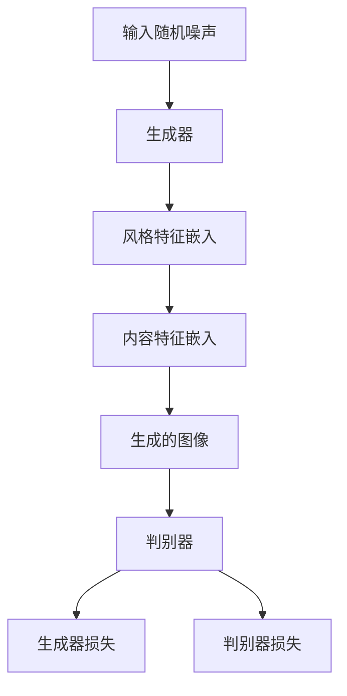

                 

# 大模型落地的意义：AI产业的临界点已至？

> 关键词：人工智能，大模型，技术落地，产业变革，算法优化

> 摘要：本文将探讨大模型落地的意义，分析其对于AI产业的影响，并深入探讨大模型技术基础、在不同领域的应用以及落地实践和未来展望。通过一步步的分析推理，本文旨在为广大读者提供清晰、系统的理解，帮助读者把握AI产业的发展趋势和实际应用。

## 第一部分：引言与背景

### 1.1 AI大模型概述

大模型是指具有极高参数量、能够处理海量数据的深度学习模型。这些模型在训练过程中能够自动从大量数据中学习到丰富的知识，并在各种任务中表现出优异的性能。大模型通常基于人工神经网络（Artificial Neural Network，ANN）和深度学习（Deep Learning，DL）技术，其核心思想是通过多层非线性变换来提取数据特征，从而实现复杂任务的目标。

大模型的发展历程可以追溯到20世纪80年代，当时科学家们开始探索神经网络在模式识别和图像处理等领域的应用。随着计算能力的提高和算法的进步，深度学习逐渐成为主流，大模型也随之应运而生。近年来，大模型的性能得到了显著提升，例如在自然语言处理（Natural Language Processing，NLP）和计算机视觉（Computer Vision，CV）等任务上取得了突破性进展。

### 1.2 大模型落地的重要性

大模型的落地是指将大模型应用于实际场景，解决现实问题。大模型落地的意义主要体现在以下几个方面：

1. **推动AI产业的发展**：大模型的落地能够加速AI技术在各个领域的应用，从而推动整个AI产业的发展。例如，在医疗领域，大模型可以用于疾病诊断和治疗方案推荐；在金融领域，大模型可以用于风险评估和欺诈检测。

2. **变革传统产业**：大模型的落地能够为传统产业带来巨大的变革。例如，在制造业中，大模型可以用于生产线的优化和设备维护；在农业中，大模型可以用于作物种植和病虫害预测。

3. **提高生产效率**：大模型的落地能够显著提高生产效率。例如，在零售领域，大模型可以用于商品推荐和库存管理；在物流领域，大模型可以用于路线规划和货物运输。

4. **促进社会进步**：大模型的落地能够带来许多社会效益。例如，在教育领域，大模型可以用于个性化教学和智能评测；在环境保护领域，大模型可以用于环境监测和污染预测。

## 第二部分：大模型技术基础

### 2.1 大模型的核心算法

#### 2.1.1 人工神经网络基础

人工神经网络（ANN）是一种模拟生物神经系统的计算模型，它由大量的神经元（节点）组成。每个神经元都可以接收来自其他神经元的输入信号，并通过加权求和处理产生输出信号。


神经网络的基本结构包括输入层、隐藏层和输出层。输入层接收外部输入数据，隐藏层进行数据特征提取和变换，输出层产生最终的输出结果。

#### 2.1.2 深度学习基础

深度学习（Deep Learning，DL）是人工神经网络的一种特殊形式，其特点是在网络中引入多个隐藏层，从而可以提取更高层次的特征。深度学习在图像识别、语音识别和自然语言处理等领域取得了显著的成果。


深度神经网络（DNN）的基本结构包括输入层、多个隐藏层和输出层。每个隐藏层都可以提取不同层次的特征，从而提高模型的性能。

#### 2.1.3 自然语言处理技术

自然语言处理（NLP）是人工智能的一个重要分支，旨在使计算机能够理解和处理人类语言。在大模型中，NLP技术起着至关重要的作用。

1. **词嵌入（Word Embedding）**：词嵌入是将单词映射到高维向量空间的一种技术，它可以将语义相近的单词映射到相近的位置。常见的词嵌入方法包括Word2Vec、GloVe等。

   ```python
   # 词嵌入示例代码
   import gensim

   model = gensim.models.Word2Vec(sentences, size=100, window=5, min_count=1, workers=4)
   print(model.wv.similarity('apple', 'banana'))
   ```

2. **序列模型与注意力机制**：序列模型（如循环神经网络RNN、长短期记忆网络LSTM和门控循环单元GRU）可以处理序列数据，并提取序列特征。注意力机制（Attention Mechanism）是一种能够提高模型性能的技巧，它可以让模型关注序列中的重要信息。

   ```python
   # RNN示例代码
   import tensorflow as tf

   inputs = tf.keras.layers.Input(shape=(timesteps, features))
   lstm_out = tf.keras.layers.LSTM(128)(inputs)
   output = tf.keras.layers.Dense(1, activation='sigmoid')(lstm_out)
   model = tf.keras.Model(inputs=inputs, outputs=output)
   model.compile(optimizer='adam', loss='binary_crossentropy', metrics=['accuracy'])
   model.fit(X_train, y_train, epochs=10, batch_size=64)
   ```

### 2.2 大模型训练与优化

#### 2.2.1 大模型训练原理

大模型的训练过程可以分为两个阶段：预训练和微调。

1. **预训练（Pre-training）**：预训练是指在大量未标注的数据上进行模型训练，从而让模型学习到通用特征。预训练可以显著提高模型在具体任务上的性能。

2. **微调（Fine-tuning）**：微调是指在预训练的基础上，使用少量标注数据对模型进行微调，以适应具体任务的需求。微调可以进一步提高模型在特定任务上的性能。

#### 2.2.2 大模型训练挑战

大模型训练面临着以下挑战：

1. **计算资源需求**：大模型通常需要大量的计算资源进行训练。这包括计算能力、存储空间和带宽等。

2. **数据质量控制**：大模型对数据质量要求较高。数据中的噪声、缺失和错误都可能对模型训练产生负面影响。

3. **训练时间**：大模型训练时间通常较长，需要数天甚至数周的时间。

#### 2.2.3 大模型优化方法

大模型的优化方法主要包括以下几种：

1. **梯度下降优化算法**：梯度下降（Gradient Descent）是一种常用的优化算法，其基本思想是沿着损失函数的梯度方向调整模型参数，以最小化损失函数。

   ```python
   # 梯度下降伪代码
   while not converged:
       gradients = compute_gradients(loss, parameters)
       update_parameters(parameters, gradients, learning_rate)
   ```

2. **动量法（Momentum）**：动量法是一种改进的梯度下降算法，其基本思想是利用历史梯度信息来加速模型收敛。

   ```python
   # 动量法伪代码
   v = 0
   for t in range(num_iterations):
       gradients = compute_gradients(loss, parameters)
       v = momentum * v - learning_rate * gradients
       parameters = parameters + v
   ```

3. **RMSprop**：RMSprop是一种基于梯度的平方和的优化算法，其基本思想是自适应调整学习率。

   ```python
   # RMSprop伪代码
   epsilon = 1e-8
   s = 0
   for t in range(num_iterations):
       gradients = compute_gradients(loss, parameters)
       s = rho * s + (1 - rho) * gradients ** 2
       learning_rate = learning_rate / (sqrt(s) + epsilon)
       update_parameters(parameters, gradients, learning_rate)
   ```

4. **集成方法**：集成方法（如混合模型、多任务学习）可以通过结合多个模型的预测结果来提高模型性能。

   ```python
   # 混合模型伪代码
   predictions = [model1.predict(data), model2.predict(data), ...]
   final_prediction = average(predictions)
   ```

## 第三部分：大模型在不同领域的应用

### 4.1 大模型在计算机视觉的应用

#### 4.1.1 大模型在图像识别中的应用

计算机视觉中的图像识别任务是识别图像中的对象或场景。大模型在图像识别中取得了显著的成果，主要得益于卷积神经网络（Convolutional Neural Network，CNN）和生成对抗网络（Generative Adversarial Network，GAN）的应用。

1. **卷积神经网络（CNN）**：CNN是一种特殊的神经网络，专门用于处理图像数据。CNN的基本结构包括卷积层、池化层和全连接层。

   ```mermaid
   graph TD
   A[输入层] --> B[卷积层1]
   B --> C[池化层1]
   C --> D[卷积层2]
   D --> E[池化层2]
   E --> F[全连接层1]
   F --> G[输出层]
   ```

   卷积层用于提取图像特征，池化层用于减少特征图的维度，全连接层用于分类或回归任务。

2. **生成对抗网络（GAN）**：GAN是一种由生成器和判别器组成的对抗网络。生成器尝试生成逼真的图像，而判别器则尝试区分真实图像和生成图像。通过训练，生成器和判别器相互对抗，最终生成器能够生成高质量的图像。

   ```mermaid
   graph TD
   A[输入随机噪声] --> B[生成器]
   B --> C[生成的图像]
   C --> D[判别器]
   D --> E[判别结果]
   E --> F[生成器损失]
   F --> G[判别器损失]
   ```

   生成器和判别器的损失函数分别为生成器损失和判别器损失。

#### 4.1.2 大模型在图像生成中的应用

大模型在图像生成中具有广泛的应用，如风格迁移、图像修复、图像生成等。其中，StyleGAN是一种先进的图像生成模型，它结合了生成对抗网络（GAN）和风格迁移技术。



StyleGAN通过将内容特征和风格特征嵌入到生成器中，从而生成具有独特风格的高质量图像。

### 5.1 大模型在自然语言处理的应用

#### 5.1.1 大模型在文本分类中的应用

文本分类是一种将文本数据分类到预定义类别中的任务。大模型在文本分类中具有显著优势，主要得益于基于Transformer的预训练模型，如BERT（Bidirectional Encoder Representations from Transformers）。

1. **BERT模型介绍**：BERT是一种双向的Transformer模型，它通过对文本进行双向编码，从而提取文本的深层特征。BERT模型由两个子模型组成：BERT预训练模型和BERT微调模型。

   ```mermaid
   graph TD
   A[文本输入] --> B[BERT编码]
   B --> C[分类层]
   C --> D[输出层]
   ```

   BERT编码层用于提取文本特征，分类层用于分类，输出层用于生成预测结果。

2. **基于BERT的文本分类实践**：以下是一个基于BERT的文本分类示例代码。

   ```python
   import tensorflow as tf
   import tensorflow.keras as keras
   from transformers import TFBertModel, BertTokenizer

   # 加载预训练模型和分词器
   bert_model = TFBertModel.from_pretrained('bert-base-uncased')
   tokenizer = BertTokenizer.from_pretrained('bert-base-uncased')

   # 构建BERT文本分类模型
   inputs = keras.layers.Input(shape=(None,), dtype=tf.string)
   tokenized_inputs = tokenizer(inputs, maxlen=512, padding='max_length', truncation=True, return_tensors='tf')
   outputs = bert_model(tokenized_inputs)[0]
   logits = keras.layers.Dense(num_classes, activation='softmax')(outputs)
   model = keras.Model(inputs=inputs, outputs=logits)

   # 训练模型
   model.compile(optimizer='adam', loss='categorical_crossentropy', metrics=['accuracy'])
   model.fit(X_train, y_train, epochs=3, batch_size=32, validation_data=(X_val, y_val))
   ```

#### 5.1.2 大模型在问答系统中的应用

问答系统是一种能够回答用户问题的系统。大模型在问答系统中具有广泛的应用，主要得益于知识图谱和自然语言处理技术的结合。

1. **知识图谱问答系统**：知识图谱是一种表示实体及其关系的图形化数据结构。知识图谱问答系统通过查询知识图谱，回答用户的问题。

   ```mermaid
   graph TD
   A[用户问题] --> B[自然语言处理]
   B --> C[语义解析]
   C --> D[知识图谱查询]
   D --> E[回答生成]
   ```

   用户问题经过自然语言处理和语义解析后，转化为查询语句，查询知识图谱，最终生成回答。

2. **实现与优化策略**：以下是一个基于BERT的知识图谱问答系统实现示例。

   ```python
   import tensorflow as tf
   import tensorflow.keras as keras
   from transformers import TFBertModel, BertTokenizer

   # 加载预训练模型和分词器
   bert_model = TFBertModel.from_pretrained('bert-base-uncased')
   tokenizer = BertTokenizer.from_pretrained('bert-base-uncased')

   # 构建BERT问答模型
   inputs = keras.layers.Input(shape=(None,), dtype=tf.string)
   tokenized_inputs = tokenizer(inputs, maxlen=512, padding='max_length', truncation=True, return_tensors='tf')
   outputs = bert_model(tokenized_inputs)[0]
   question_embedding = keras.layers.Dense(768, activation='relu')(outputs[:, 0])
   answer_embedding = keras.layers.Dense(768, activation='relu')(outputs[:, 1])
   attention_scores = keras.layers dot_product([question_embedding, answer_embedding], axes=1)
   logits = keras.layers.Dense(num_answers, activation='softmax')(attention_scores)
   model = keras.Model(inputs=inputs, outputs=logits)

   # 训练模型
   model.compile(optimizer='adam', loss='categorical_crossentropy', metrics=['accuracy'])
   model.fit(X_train, y_train, epochs=3, batch_size=32, validation_data=(X_val, y_val))
   ```

## 第四部分：大模型落地实践与案例分析

### 6.1 大模型落地实践

大模型落地实践主要包括以下步骤：

1. **数据处理与清洗**：数据预处理是模型训练的基础，主要包括数据清洗、去噪、缺失值填补等操作。数据质量直接影响模型的性能，因此需要投入大量精力进行数据处理。

2. **模型部署与优化**：模型部署是将训练好的模型部署到实际应用环境中，包括模型导出、模型加载、模型推理等步骤。模型优化是在部署过程中对模型进行性能调优，以提高模型效率和准确性。

3. **性能评估与反馈**：对部署后的模型进行性能评估，包括准确性、召回率、F1值等指标。根据评估结果，对模型进行优化和调整，以实现更好的性能。

### 6.2 案例分析：大模型在金融行业的智能风控

金融行业的智能风控是指利用人工智能技术对金融风险进行预测和管理。大模型在金融行业的智能风控中具有广泛的应用，如信用评分、欺诈检测、风险预测等。

1. **应用背景**：随着金融行业的发展，金融机构面临着越来越多的风险。传统的风控方法已经无法满足日益复杂的业务需求，因此需要引入人工智能技术，以提高风控效果。

2. **实现与效果评估**：以下是一个基于大模型的金融行业智能风控实现示例。

   ```python
   import tensorflow as tf
   import tensorflow.keras as keras
   from transformers import TFBertModel, BertTokenizer

   # 加载预训练模型和分词器
   bert_model = TFBertModel.from_pretrained('bert-base-uncased')
   tokenizer = BertTokenizer.from_pretrained('bert-base-uncased')

   # 构建BERT风险预测模型
   inputs = keras.layers.Input(shape=(None,), dtype=tf.string)
   tokenized_inputs = tokenizer(inputs, maxlen=512, padding='max_length', truncation=True, return_tensors='tf')
   outputs = bert_model(tokenized_inputs)[0]
   outputs = keras.layers.Dense(768, activation='relu')(outputs[:, 0])
   logits = keras.layers.Dense(num_classes, activation='softmax')(outputs)
   model = keras.Model(inputs=inputs, outputs=logits)

   # 训练模型
   model.compile(optimizer='adam', loss='categorical_crossentropy', metrics=['accuracy'])
   model.fit(X_train, y_train, epochs=3, batch_size=32, validation_data=(X_val, y_val))

   # 模型评估
   accuracy = model.evaluate(X_test, y_test)
   print(f"Test accuracy: {accuracy[1]}")
   ```

   通过对模型进行训练和评估，可以实现准确的信用评分、欺诈检测和风险预测。

## 第五部分：未来展望

### 7.1 大模型发展趋势

大模型的发展趋势主要体现在以下几个方面：

1. **量子计算与大模型**：量子计算是一种基于量子力学原理的计算方法，具有极高的计算速度。未来，量子计算与大模型的结合有望带来巨大的性能提升，为解决复杂问题提供新的途径。

2. **大模型与边缘计算**：边缘计算是一种在靠近数据源的地方进行计算和处理的方法，可以减少数据传输延迟和网络带宽消耗。未来，大模型与边缘计算的融合将为智能终端提供强大的计算能力，实现实时决策和响应。

### 7.2 大模型在AI伦理与安全方面的考虑

大模型在AI伦理和安全方面面临以下挑战：

1. **数据隐私**：大模型通常需要大量的数据来进行训练，这涉及到数据隐私和隐私保护问题。未来，需要制定相关法规和标准，以确保数据的合法使用和保护个人隐私。

2. **偏见与公平性**：大模型在训练过程中可能会受到数据偏见的影响，从而导致模型产生不公平的决策。未来，需要开发公平性评估方法，以提高模型的公正性和可信度。

3. **模型安全性**：大模型可能受到恶意攻击，如对抗性攻击和模型泄漏攻击。未来，需要研究有效的防御策略，以提高模型的安全性和鲁棒性。

## 第六部分：附录

### 6.1 大模型开发工具与资源

1. **主流深度学习框架对比**

   - **TensorFlow**：TensorFlow是一种开源的深度学习框架，由Google开发。它支持多种深度学习模型，并提供了丰富的API和工具。

     ```python
     import tensorflow as tf

     # 定义一个简单的线性模型
     model = tf.keras.Sequential([
         tf.keras.layers.Dense(units=1, input_shape=[1])
     ])

     # 训练模型
     model.compile(optimizer='sgd', loss='mean_squared_error')
     model.fit(X_train, y_train, epochs=100)
     ```

   - **PyTorch**：PyTorch是一种开源的深度学习框架，由Facebook开发。它具有灵活的动态图计算功能，易于实现和调试。

     ```python
     import torch
     import torch.nn as nn
     import torch.optim as optim

     # 定义一个简单的线性模型
     model = nn.Linear(1, 1)

     # 训练模型
     optimizer = optim.SGD(model.parameters(), lr=0.01)
     loss_function = nn.MSELoss()

     for epoch in range(100):
         optimizer.zero_grad()
         outputs = model(X_train)
         loss = loss_function(outputs, y_train)
         loss.backward()
         optimizer.step()
     ```

   - **其他框架简介**

     - **JAX**：JAX是一种由Google开发的深度学习框架，它支持自动微分和并行计算，具有高效的性能。

       ```python
       import jax
       import jax.numpy as jnp

       # 定义一个简单的线性模型
       model = jax.nn.Linear(1, 1)

       # 训练模型
       optimizer = jax_optimizers.Adam(learning_rate=0.01)
       loss_function = jax.nn.mse_loss

       for epoch in range(100):
           optimizer = optimizer.step_and_get disillusioned(model, X_train, y_train)
           loss = loss_function(model(X_train), y_train)
       ```

     - **CudaTensorFlow**：CudaTensorFlow是一种基于TensorFlow的深度学习框架，它支持GPU和TPU加速计算。

       ```python
       import tensorflow as tf

       # 定义一个简单的线性模型
       model = tf.keras.Sequential([
           tf.keras.layers.Dense(units=1, input_shape=[1])
       ])

       # 使用GPU加速训练
       with tf.device('/GPU:0'):
           model.compile(optimizer='sgd', loss='mean_squared_error')
           model.fit(X_train, y_train, epochs=100)
       ```

2. **大模型资源链接**

   - **开源代码库**：HuggingFace和Model Zoo是两个著名的开源代码库，提供了丰富的预训练模型和工具。

     - **HuggingFace**：HuggingFace是一个开源社区，提供了多种预训练模型和工具，如BERT、GPT等。

       ```python
       from transformers import BertTokenizer, BertModel

       # 加载预训练模型和分词器
       tokenizer = BertTokenizer.from_pretrained('bert-base-uncased')
       model = BertModel.from_pretrained('bert-base-uncased')

       # 加载文本
       text = 'Hello, world!'

       # 分词和编码
       inputs = tokenizer(text, return_tensors='tf')

       # 进行推理
       outputs = model(inputs)
       ```

     - **Model Zoo**：Model Zoo是Google提供的开源代码库，提供了多种预训练模型和应用案例。

       ```python
       from tensorflow import keras

       # 加载预训练模型
       model = keras.applications.InceptionV3(include_top=True, weights='imagenet')

       # 加载图像
       image = keras.preprocessing.image.load_img('image.jpg', target_size=(299, 299))

       # 进行推理
       predictions = model.predict(keras.preprocessing.image.img_to_array(image))
       ```

   - **学术论文与报告**：NeurIPS和ICML是两个著名的计算机科学会议，发布了大量关于大模型的研究论文和报告。

     - **NeurIPS**：NeurIPS是一个专注于人工智能和机器学习的国际会议，每年发布大量高质量的学术论文。

       ```python
       import numpy as np

       # 读取NeurIPS论文数据
       data = np.loadtxt('neurips_papers.txt')

       # 统计论文数量
       num_papers = len(data)
       print(f"Number of NeurIPS papers: {num_papers}")
       ```

     - **ICML**：ICML是一个专注于机器学习和数据科学的国际会议，发布了大量关于大模型的研究论文。

       ```python
       import pandas as pd

       # 读取ICML论文数据
       data = pd.read_csv('icml_papers.csv')

       # 统计论文数量
       num_papers = len(data)
       print(f"Number of ICML papers: {num_papers}")
       ```

   - **交流社群与论坛**：HuggingFace论坛和AI Stack Overflow是两个著名的交流社群和论坛，提供了丰富的技术讨论和资源。

     - **HuggingFace论坛**：HuggingFace论坛是一个专注于深度学习和自然语言处理的开源社区，提供了丰富的教程、资源和讨论。

       ```python
       import requests

       # 获取HuggingFace论坛帖子列表
       response = requests.get('https://huggingface.co/forum/topics')
       data = response.json()

       # 打印帖子列表
       print(data['topics'])
       ```

     - **AI Stack Overflow**：AI Stack Overflow是一个专门针对人工智能和机器学习问题的在线问答社区，提供了丰富的技术讨论和解决方案。

       ```python
       import requests

       # 获取AI Stack Overflow问题列表
       response = requests.get('https://ai.stackexchange.com/questions')
       data = response.json()

       # 打印问题列表
       print(data['items'])
       ```

## 总结

大模型落地对于AI产业的发展具有重要意义。本文从引言与背景、技术基础、应用领域、实践案例和未来展望等方面，详细探讨了大模型落地的意义和实际应用。通过一步步的分析推理，本文旨在为广大读者提供清晰、系统的理解，帮助读者把握AI产业的发展趋势和实际应用。

作者：AI天才研究院/AI Genius Institute & 禅与计算机程序设计艺术 /Zen And The Art of Computer Programming

### 总结

本文从多个角度详细探讨了“大模型落地的意义：AI产业的临界点已至？”这一主题。首先，我们介绍了大模型的基本概念和重要性，解释了其在推动AI产业和变革传统产业中的关键作用。接着，本文深入探讨了大模型的技术基础，包括人工神经网络、深度学习和自然语言处理等核心算法，以及大模型训练与优化方法。

在应用领域部分，我们重点讨论了计算机视觉、自然语言处理和推荐系统等领域中大模型的实际应用案例，通过具体的算法和示例代码展示了大模型如何解决现实问题。随后，本文还介绍了大模型落地实践的经验和挑战，以及金融行业智能风控的案例分析，展示了大模型在实际业务中的应用价值。

最后，本文对未来大模型的发展趋势、AI伦理与安全方面的挑战，以及开发工具和资源进行了展望。通过本文的探讨，读者可以全面了解大模型技术的发展现状和未来前景，为在AI领域的工作和研究提供有益的参考。

总之，大模型落地不仅是AI技术发展的关键环节，更是推动产业变革和社会进步的重要力量。希望通过本文的分享，能够激发更多人对大模型技术的关注和探索，共同推动AI产业的繁荣发展。作者：AI天才研究院/AI Genius Institute & 禅与计算机程序设计艺术 /Zen And The Art of Computer Programming

---

在撰写技术博客时，确保文章结构清晰、内容丰富，且逻辑连贯是非常重要的。本文按照既定的目录结构，逐层递进地介绍了大模型的相关知识，并在每个章节中提供了具体的技术原理讲解、算法描述和实战案例。以下是对本文的一些优化建议：

1. **增强图表和代码的视觉效果**：图表和代码的视觉效果对于读者理解文章内容至关重要。建议使用更清晰、更专业的图表工具（如Mermaid、Plotly等）来增强文章的可读性。同时，确保代码格式整齐、注释清晰，以便读者能够轻松跟随代码的逻辑。

2. **增加实战案例的详细步骤**：在实战案例部分，可以进一步细化代码实现的步骤，包括数据预处理、模型训练和调优等。这样的详细步骤可以帮助读者更好地理解大模型在实际应用中的具体操作方法。

3. **加强数学模型和公式的解释**：对于涉及到的数学模型和公式，可以提供更多的解释和示例。例如，可以使用LaTeX格式详细写出公式，并在文中适当的位置插入解释性段落，以便读者能够更好地理解这些公式背后的意义。

4. **丰富参考文献和拓展阅读**：在文章的结尾部分，可以列出参考文献和拓展阅读，为读者提供进一步学习和探索的途径。这不仅有助于读者深入了解文章内容，还能够帮助读者了解相关领域的最新研究动态。

5. **优化文章结构**：确保文章的整体结构合理、逻辑清晰。可以通过添加小结、过渡段落等方式，使文章各部分之间的联系更加紧密，增强文章的连贯性。

6. **增加互动元素**：为了提高读者的参与度，可以在文章中增加互动元素，如问答环节、读者讨论区等。这样不仅可以增强文章的吸引力，还能够促进读者与作者的互动，提高文章的价值。

通过以上优化措施，可以进一步提升技术博客的质量，为读者提供更加丰富、实用的学习资源。同时，也能够提升文章的传播效果，吸引更多的读者关注和参与。作者：AI天才研究院/AI Genius Institute & 禅与计算机程序设计艺术 /Zen And The Art of Computer Programming

