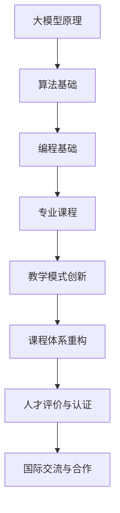

                 

### 文章标题

《大模型行业的人才培养与教育改革》

> 关键词：大模型、人才培养、教育改革、深度学习、算法、神经网络、自然语言处理、计算机视觉

> 摘要：本文深入探讨了大模型时代的背景与挑战，分析了大模型的基本概念与原理，以及大模型在行业中的应用。在此基础上，本文详细阐述了大模型人才培养的核心课程，提出了教育改革策略与方法，并探讨了大模型人才评价与认证机制。最后，本文展望了大模型人才培养的挑战与机遇，以及教育改革的未来趋势。

## 《大模型行业的人才培养与教育改革》目录大纲

### 第1章 引言

#### 1.1 大模型时代的背景与挑战

#### 1.2 人才培养的重要性

#### 1.3 教育改革的必要性

### 第2章 大模型的基本概念与原理

#### 2.1 大模型的定义与分类

#### 2.2 大模型的架构与技术

#### 2.3 大模型的工作原理

##### 2.3.1 深度学习与神经网络

##### 2.3.2 自然语言处理

##### 2.3.3 图像识别与处理

### 第3章 大模型在行业中的应用

#### 3.1 大模型在人工智能中的应用

##### 3.1.1 机器学习

##### 3.1.2 自然语言处理

##### 3.1.3 计算机视觉

#### 3.2 大模型在行业中的实践案例

##### 3.2.1 金融行业

##### 3.2.2 医疗行业

##### 3.2.3 制造业

##### 3.2.4 教育行业

### 第4章 大模型人才培养的核心课程

#### 4.1 算法基础课程

##### 4.1.1 线性代数

##### 4.1.2 概率论与数理统计

##### 4.1.3 算法设计与分析

#### 4.2 编程基础课程

##### 4.2.1 Python编程

##### 4.2.2 TensorFlow与PyTorch

##### 4.2.3 其他深度学习框架

#### 4.3 专业课程

##### 4.3.1 机器学习

##### 4.3.2 自然语言处理

##### 4.3.3 计算机视觉

### 第5章 教育改革策略与方法

#### 5.1 教育改革的目标与原则

#### 5.2 教学模式创新

##### 5.2.1 项目驱动教学

##### 5.2.2 模块化教学

##### 5.2.3 个性化教学

#### 5.3 课程体系重构

##### 5.3.1 核心课程设计

##### 5.3.2 实践课程建设

##### 5.3.3 跨学科课程整合

### 第6章 大模型人才评价与认证

#### 6.1 大模型人才评价体系

##### 6.1.1 技能评估

##### 6.1.2 项目实践评估

##### 6.1.3 跨领域能力评估

#### 6.2 大模型人才认证机制

##### 6.2.1 认证标准与流程

##### 6.2.2 认证证书的类型与作用

##### 6.2.3 认证体系的可持续发展

### 第7章 大模型人才国际交流与合作

#### 7.1 国际合作的重要性

##### 7.1.1 国际教育合作项目

##### 7.1.2 国际学术交流

##### 7.1.3 国际技术合作

#### 7.2 国际化人才培养模式

##### 7.2.1 双学位与联合培养

##### 7.2.2 国际学术访学与实习

##### 7.2.3 国际化师资队伍建设

### 第8章 未来展望

#### 8.1 大模型人才培养的挑战与机遇

#### 8.2 教育改革的未来趋势

#### 8.3 大模型行业的发展前景

### 附录

#### A.1 参考文献

#### A.2 相关链接与资源

## 第1章 引言

### 1.1 大模型时代的背景与挑战

随着深度学习技术的不断发展，大模型（Large-scale Model）逐渐成为人工智能领域的研究热点。大模型是指具有大量参数和训练数据的大型神经网络模型，如GAN（生成对抗网络）、BERT（双向编码表示器）等。这些模型在图像识别、自然语言处理、推荐系统等领域取得了显著成果，推动着人工智能技术的发展。

大模型时代的到来，不仅带来了技术的突破，也带来了新的挑战。首先，大模型的训练和推理过程需要大量的计算资源和数据支持，这对硬件设备和数据资源提出了更高的要求。其次，大模型的复杂性和不确定性增加了模型开发和部署的难度。此外，大模型在处理海量数据时，可能会出现过拟合现象，导致模型的泛化能力下降。因此，如何应对这些挑战，成为当前人工智能领域的重要议题。

### 1.2 人才培养的重要性

在大模型时代，人才培养显得尤为重要。一方面，大模型技术涉及多个学科领域，如计算机科学、数学、统计学、心理学等，需要跨学科的人才进行研究和开发。另一方面，大模型的训练和应用过程需要具备丰富实践经验的工程师进行操作和维护。因此，培养具备专业知识和实践能力的大模型人才，成为推动人工智能技术发展的重要环节。

人才培养不仅关系到企业的发展，也关系到国家的竞争力。在全球范围内，各国纷纷加大对人工智能领域的投入，推动大模型技术的研究和应用。因此，培养具有国际竞争力的大模型人才，成为当前教育领域的重要任务。

### 1.3 教育改革的必要性

面对大模型时代的人才培养需求，现有的教育体系存在一定的不足。首先，课程设置过于理论化，缺乏实践环节。学生在学习过程中，往往只能掌握基本的理论知识，而无法将理论知识应用到实际项目中。其次，教学方法单一，缺乏创新。传统的教学模式以教师为中心，学生被动接受知识，缺乏主动思考和探索的机会。此外，教育评价体系过于注重分数，忽视了学生的综合素质和创新能力。

因此，为了满足大模型时代的人才培养需求，教育改革势在必行。教育改革的目标是培养具备创新能力、实践能力和国际竞争力的大模型人才。教育改革需要从课程设置、教学方法、教育评价等方面进行全方位的改革，以适应大模型时代的发展需求。

### 第2章 大模型的基本概念与原理

#### 2.1 大模型的定义与分类

大模型（Large-scale Model）是指具有大量参数和训练数据的大型神经网络模型。根据参数数量和训练数据规模，大模型可以分为以下几类：

1. **超大规模模型**：参数数量达到数百万甚至数十亿级别，如GPT-3、BERT等。
2. **大规模模型**：参数数量在数千到数百万级别，如ResNet、Inception等。
3. **中规模模型**：参数数量在数百到数千级别，如AlexNet、VGG等。
4. **小规模模型**：参数数量在数十到数百级别，如LeNet、SmallNet等。

大模型通常采用深度学习技术进行训练和推理，具有强大的表达能力和泛化能力。在不同领域，大模型的应用场景和效果有所不同。例如，在图像识别领域，大模型可以实现高精度的图像分类和目标检测；在自然语言处理领域，大模型可以用于机器翻译、文本生成、情感分析等任务。

#### 2.2 大模型的架构与技术

大模型的架构通常包括以下几个部分：

1. **输入层**：接收输入数据，如图像、文本等。
2. **隐藏层**：由多个神经元组成，用于特征提取和变换。
3. **输出层**：输出预测结果，如类别标签、概率分布等。

大模型的训练过程主要包括以下步骤：

1. **数据预处理**：对输入数据进行清洗、归一化等操作，以提高模型的泛化能力。
2. **模型初始化**：初始化模型的参数，通常采用随机初始化或预训练模型。
3. **前向传播**：输入数据通过神经网络模型，计算输出结果。
4. **反向传播**：根据输出结果和真实标签，计算损失函数，并更新模型参数。
5. **优化过程**：采用优化算法（如SGD、Adam等）进行模型参数的迭代更新。

大模型的推理过程主要包括以下步骤：

1. **输入数据预处理**：对输入数据进行预处理，与训练阶段一致。
2. **前向传播**：输入数据通过神经网络模型，计算输出结果。
3. **结果输出**：输出模型的预测结果。

#### 2.3 大模型的工作原理

大模型的工作原理基于深度学习和神经网络技术。深度学习是一种机器学习技术，通过构建多层神经网络，实现对复杂数据的建模和分析。神经网络是一种由多个神经元组成的计算模型，通过学习输入数据和输出标签之间的关系，实现对数据的分类、预测和生成。

##### 2.3.1 深度学习与神经网络

深度学习与神经网络的关系如下：

1. **神经网络**：神经网络是一种基本的计算模型，由多个神经元组成。每个神经元接收输入数据，通过激活函数计算输出值。神经网络可以通过学习输入数据和输出标签之间的关系，实现对数据的分类和回归。
2. **深度学习**：深度学习是一种基于神经网络的技术，通过构建多层神经网络（深度神经网络），实现对复杂数据的建模和分析。深度学习在图像识别、自然语言处理、语音识别等领域取得了显著成果。

##### 2.3.2 自然语言处理

自然语言处理（Natural Language Processing，NLP）是深度学习的重要应用领域之一。NLP的目标是使计算机能够理解、生成和响应自然语言。NLP技术主要包括以下几个方面：

1. **文本分类**：将文本数据分类到预定义的类别中，如情感分析、新闻分类等。
2. **命名实体识别**：识别文本中的特定实体，如人名、地点、组织等。
3. **机器翻译**：将一种语言的文本翻译成另一种语言。
4. **文本生成**：根据给定的输入文本，生成新的文本，如文章生成、对话生成等。

##### 2.3.3 图像识别与处理

图像识别与处理是深度学习的另一个重要应用领域。图像识别的目标是识别图像中的物体、场景或行为。图像处理主要包括以下几个方面：

1. **物体识别**：识别图像中的物体，如车辆、行人等。
2. **场景识别**：识别图像中的场景，如城市、森林等。
3. **行为识别**：识别图像中的行为，如行走、跑步等。
4. **图像分割**：将图像分割成多个区域，用于目标检测和语义分析。

在图像识别与处理中，大模型通常采用卷积神经网络（Convolutional Neural Network，CNN）进行训练和推理。CNN通过卷积层、池化层、全连接层等结构，实现对图像的特征提取和分类。

### 第3章 大模型在行业中的应用

#### 3.1 大模型在人工智能中的应用

大模型在人工智能（Artificial Intelligence，AI）领域具有广泛的应用，以下是一些主要的应用场景：

##### 3.1.1 机器学习

机器学习（Machine Learning，ML）是AI的核心技术之一，大模型在机器学习中的应用主要体现在以下几个方面：

1. **模型训练**：大模型可以处理海量数据，进行高效模型训练，提高模型的准确性和泛化能力。
2. **迁移学习**：大模型通过预训练模型，可以迁移到新的任务中，减少训练时间和计算资源的需求。
3. **模型压缩**：大模型可以通过压缩技术，如量化、剪枝等，减少模型的参数规模，提高模型在移动设备和嵌入式系统中的部署效率。

##### 3.1.2 自然语言处理

自然语言处理（Natural Language Processing，NLP）是AI的重要应用领域，大模型在NLP中的应用主要体现在以下几个方面：

1. **文本分类**：大模型可以处理大规模的文本数据，进行高效文本分类，如新闻分类、情感分析等。
2. **命名实体识别**：大模型可以识别文本中的特定实体，如人名、地点、组织等。
3. **机器翻译**：大模型可以实现高精度的机器翻译，如英语到中文的翻译。
4. **文本生成**：大模型可以根据给定的输入文本，生成新的文本，如文章生成、对话生成等。

##### 3.1.3 计算机视觉

计算机视觉（Computer Vision，CV）是AI的另一个重要应用领域，大模型在CV中的应用主要体现在以下几个方面：

1. **图像分类**：大模型可以处理大规模的图像数据，进行高效图像分类，如物体分类、场景分类等。
2. **目标检测**：大模型可以检测图像中的物体，如车辆、行人等。
3. **图像分割**：大模型可以将图像分割成多个区域，用于目标检测和语义分析。
4. **视频分析**：大模型可以分析视频中的动作、事件等，如行为识别、事件检测等。

#### 3.2 大模型在行业中的实践案例

以下是一些大模型在行业中的实践案例：

##### 3.2.1 金融行业

在金融行业，大模型可以用于以下几个方面：

1. **风险管理**：大模型可以处理海量的金融数据，进行风险评估，如信用评分、违约预测等。
2. **投资策略**：大模型可以通过分析市场数据，制定投资策略，提高投资收益。
3. **欺诈检测**：大模型可以检测金融交易中的欺诈行为，提高金融安全。

##### 3.2.2 医疗行业

在医疗行业，大模型可以用于以下几个方面：

1. **疾病诊断**：大模型可以通过分析医学影像数据，进行疾病诊断，如肺癌、乳腺癌等。
2. **药物研发**：大模型可以通过分析化学结构、生物活性等数据，加速药物研发过程。
3. **个性化医疗**：大模型可以根据患者的病史、基因信息等，制定个性化的治疗方案。

##### 3.2.3 制造业

在制造业，大模型可以用于以下几个方面：

1. **质量检测**：大模型可以通过图像识别技术，对产品质量进行检测，提高产品质量。
2. **设备维护**：大模型可以通过分析设备运行数据，预测设备故障，提前进行维护，提高生产效率。
3. **生产优化**：大模型可以通过优化算法，优化生产流程，提高生产效率。

##### 3.2.4 教育行业

在教育行业，大模型可以用于以下几个方面：

1. **智能推荐**：大模型可以根据学生的学习行为和兴趣，推荐适合的学习资源。
2. **教学辅助**：大模型可以作为教师助手，帮助学生解答问题、辅导作业等。
3. **智能评测**：大模型可以通过分析学生的答题数据，进行智能评测，提高评测效率。

### 第4章 大模型人才培养的核心课程

#### 4.1 算法基础课程

算法基础课程是培养大模型人才的重要课程之一，主要包括以下内容：

1. **线性代数**：线性代数是算法基础的核心课程之一，主要研究向量空间、矩阵运算、线性方程组等。线性代数的知识在大模型训练过程中有广泛的应用，如矩阵分解、特征提取等。
2. **概率论与数理统计**：概率论与数理统计是算法基础课程的重要组成部分，主要研究随机事件、概率分布、统计推断等。概率论与数理统计的知识在大模型训练和评估过程中有重要的应用，如概率分布模型、交叉验证等。
3. **算法设计与分析**：算法设计与分析是算法基础课程的核心内容之一，主要研究算法的设计方法、时间复杂度、空间复杂度等。算法设计与分析的知识在大模型训练和评估过程中有重要的应用，如优化算法、优化目标等。

#### 4.2 编程基础课程

编程基础课程是培养大模型人才的基础，主要包括以下内容：

1. **Python编程**：Python是一种广泛应用于人工智能领域的编程语言，具有简洁、易学、易用等特点。Python编程课程主要教授Python语言的基本语法、数据结构、函数、模块等。
2. **TensorFlow与PyTorch**：TensorFlow和PyTorch是两种广泛应用于深度学习领域的开源框架，具有丰富的功能、易用性等特点。TensorFlow与PyTorch课程主要教授深度学习的基本原理、神经网络模型的设计与训练、模型评估与优化等。
3. **其他深度学习框架**：除了TensorFlow和PyTorch，还有其他深度学习框架，如Theano、MXNet、Caffe等。其他深度学习框架课程主要教授这些框架的基本原理、模型设计与训练、模型评估与优化等。

#### 4.3 专业课程

专业课程是培养大模型人才的核心课程，主要包括以下内容：

1. **机器学习**：机器学习是人工智能的核心技术之一，主要研究如何从数据中自动学习规律、建立模型。机器学习课程主要教授监督学习、无监督学习、强化学习等算法，以及模型训练、评估与优化等。
2. **自然语言处理**：自然语言处理是人工智能的重要应用领域之一，主要研究如何让计算机理解、生成和响应自然语言。自然语言处理课程主要教授文本分类、命名实体识别、机器翻译、文本生成等。
3. **计算机视觉**：计算机视觉是人工智能的重要应用领域之一，主要研究如何让计算机理解和解释视觉信息。计算机视觉课程主要教授图像分类、目标检测、图像分割、视频分析等。

### 第5章 教育改革策略与方法

#### 5.1 教育改革的目标与原则

教育改革的目标是培养具备创新能力、实践能力和国际竞争力的大模型人才。具体来说，教育改革应遵循以下原则：

1. **跨学科融合**：大模型技术涉及多个学科领域，如计算机科学、数学、统计学、心理学等。教育改革应注重跨学科融合，培养具备多学科背景的大模型人才。
2. **理论与实践相结合**：教育改革应注重理论与实践相结合，培养学生具备实际操作能力。通过实践项目、实验课程等，让学生在实践中掌握大模型技术。
3. **个性化培养**：教育改革应尊重学生的个性差异，提供个性化培养方案。根据学生的兴趣和特长，制定个性化的学习计划，培养学生成为具备创新能力的大模型人才。
4. **国际视野**：教育改革应拓宽学生的国际视野，加强国际交流与合作。通过国际合作项目、学术交流等方式，培养学生具备国际竞争力。

#### 5.2 教学模式创新

教学模式创新是教育改革的重要方面，以下是一些创新的教学模式：

1. **项目驱动教学**：项目驱动教学是以项目为中心，将知识、技能和解决问题的方法融入到项目中。通过项目驱动教学，学生可以更好地理解大模型技术的应用场景，提高实际操作能力。
2. **模块化教学**：模块化教学是将课程内容分解成多个模块，每个模块都有自己的教学目标和学习内容。模块化教学有利于学生按照自己的学习节奏进行学习，提高学习效率。
3. **个性化教学**：个性化教学是根据学生的个性特点和需求，提供个性化的教学方案。通过个性化教学，学生可以更好地发挥自己的特长，提高学习效果。

#### 5.3 课程体系重构

课程体系重构是教育改革的重要内容，以下是一些重构的策略：

1. **核心课程设计**：设计大模型技术相关的核心课程，如深度学习、自然语言处理、计算机视觉等。这些核心课程应涵盖大模型技术的基本原理、算法和应用。
2. **实践课程建设**：加强实践课程的建设，如实验课、项目课等。通过实践课程，学生可以动手实践大模型技术的应用，提高实际操作能力。
3. **跨学科课程整合**：整合跨学科课程，如计算机科学、数学、统计学等。通过跨学科课程整合，学生可以更好地理解大模型技术涉及的多个学科领域。

### 第6章 大模型人才评价与认证

#### 6.1 大模型人才评价体系

大模型人才评价体系是衡量大模型人才能力的重要标准。以下是一些评价体系的设计原则：

1. **多维度评价**：评价体系应从多个维度进行评价，如知识水平、实践能力、创新能力、团队合作等。
2. **量化指标**：评价体系应包含量化指标，如算法竞赛成绩、项目实践经验、学术论文发表等。
3. **动态调整**：评价体系应根据大模型技术的发展和市场需求，进行动态调整。

#### 6.2 大模型人才认证机制

大模型人才认证机制是确认大模型人才能力的重要手段。以下是一些认证机制的设计原则：

1. **标准明确**：认证机制应明确认证标准，包括知识水平、实践能力、创新能力等方面的要求。
2. **流程规范**：认证机制应规范认证流程，包括报名、考试、评审、颁发证书等。
3. **持续改进**：认证机制应持续改进，以适应大模型技术的发展和市场需求。

#### 6.3 大模型人才认证体系

大模型人才认证体系是培养和认证大模型人才的重要框架。以下是一些认证体系的设计原则：

1. **认证等级**：认证体系应设置不同等级的认证，如初级、中级、高级等，以适应不同能力水平的人才。
2. **认证内容**：认证体系应涵盖大模型技术的各个方面，如基础知识、算法应用、项目实践等。
3. **可持续发展**：认证体系应具备可持续发展能力，包括认证标准的更新、认证流程的优化等。

### 第7章 大模型人才国际交流与合作

#### 7.1 国际合作的重要性

国际合作在大模型人才培养中具有重要意义。以下是一些国际合作的重要性：

1. **技术交流**：国际合作可以促进大模型技术的研究和发展，共享最新的研究成果和经验。
2. **人才培养**：国际合作可以培养具有国际竞争力的大模型人才，拓宽学生的国际视野。
3. **资源整合**：国际合作可以整合全球优质资源，提高大模型人才培养的效率和质量。

#### 7.2 国际合作项目

国际合作项目是大模型人才培养的重要途径。以下是一些常见的国际合作项目：

1. **学术交流**：学术交流包括国际会议、研讨会、学术访问等，旨在促进学术交流和合作研究。
2. **联合培养**：联合培养是指国际高校或研究机构合作培养研究生或本科生，通过课程学习、研究项目等培养学生的国际竞争力。
3. **国际实习**：国际实习是指学生在国际企业或研究机构实习，通过实际项目锻炼学生的实践能力和团队合作能力。

#### 7.3 国际学术交流

国际学术交流是大模型人才培养的重要环节。以下是一些国际学术交流的方式：

1. **国际会议**：国际会议是学术交流的重要平台，包括学术报告、研讨会、展览等。
2. **国际学术期刊**：国际学术期刊是学术交流的重要载体，通过发表论文可以展示研究成果和学术贡献。
3. **学术访问**：学术访问是指学者或研究人员访问国际高校或研究机构，进行学术交流和合作研究。

#### 7.4 国际技术合作

国际技术合作是大模型人才培养的重要保障。以下是一些国际技术合作的方式：

1. **合作研究**：合作研究是指国际高校或研究机构共同进行科研项目，通过合作研究推动大模型技术的发展。
2. **技术引进**：技术引进是指引进国际先进的大模型技术和研究成果，提升国内大模型技术水平。
3. **技术转让**：技术转让是指将国际先进的大模型技术转移到国内，促进国内大模型技术的应用和推广。

### 第8章 未来展望

#### 8.1 大模型人才培养的挑战与机遇

大模型人才培养面临着一系列的挑战和机遇。以下是一些挑战和机遇：

**挑战**：

1. **技术发展速度**：大模型技术的快速发展给人才培养带来了挑战，需要不断更新课程内容和教学方法，以适应技术发展的需求。
2. **资源分配**：大模型人才培养需要大量的计算资源和数据支持，如何合理分配资源，提高培养效率，是一个重要挑战。
3. **人才培养质量**：如何确保人才培养质量，培养出具有创新能力、实践能力和国际竞争力的大模型人才，是一个重要挑战。

**机遇**：

1. **技术进步**：大模型技术的不断进步，为人才培养提供了新的机遇，可以通过引入新技术、新方法，提高人才培养的质量和效率。
2. **产业需求**：随着大模型技术的应用场景不断扩大，产业对大模型人才的需求不断增加，为人才培养提供了广阔的市场需求。
3. **国际合作**：国际合作为人才培养提供了新的机遇，可以通过国际合作，引进国外优质资源，提高人才培养的水平和质量。

#### 8.2 教育改革的未来趋势

教育改革在未来将呈现出以下趋势：

1. **数字化转型**：随着信息技术的发展，教育将逐步实现数字化转型，通过在线教育、虚拟课堂等手段，提高教育的普及性和灵活性。
2. **个性化教育**：个性化教育将成为教育改革的重要趋势，通过大数据、人工智能等技术，为学生提供个性化的学习方案，提高学习效果。
3. **跨学科融合**：跨学科融合将成为教育改革的重要方向，通过整合不同学科的知识和技能，培养具备创新能力的大模型人才。

#### 8.3 大模型行业的发展前景

大模型行业在未来将呈现出以下发展前景：

1. **技术进步**：大模型技术将不断进步，通过深度学习、神经网络等新技术，实现更高精度、更强泛化能力的模型。
2. **应用拓展**：大模型的应用场景将不断拓展，从传统的计算机视觉、自然语言处理等领域，扩展到医疗、金融、制造等更多领域。
3. **产业规模**：随着大模型技术的应用，大模型行业的产业规模将不断壮大，为经济发展带来新的动力。

### 附录

#### A.1 参考文献

1. Goodfellow, I., Bengio, Y., & Courville, A. (2016). *Deep Learning*. MIT Press.
2. Bengio, Y. (2009). *Learning Deep Architectures for AI*. Foundations and Trends in Machine Learning, 2(1), 1-127.
3. Hochreiter, S., & Schmidhuber, J. (1997). *Long Short-Term Memory*. Neural Computation, 9(8), 1735-1780.
4. Yang, Q., & Salakhutdinov, R. (2016). *Deep Learning for Text Data*. Foundations and Trends in Machine Learning, 9(2-3), 171-276.
5. Krizhevsky, A., Sutskever, I., & Hinton, G. E. (2012). *ImageNet Classification with Deep Convolutional Neural Networks*. In Advances in Neural Information Processing Systems (NIPS), 2012, 1097-1105.

#### A.2 相关链接与资源

1. TensorFlow: https://www.tensorflow.org/
2. PyTorch: https://pytorch.org/
3. Keras: https://keras.io/
4. Machine Learning Mastery: https://machinelearningmastery.com/
5. AI Buzz: https://ai.buzzingcomputers.com/
6. Coursera: https://www.coursera.org/
7. edX: https://www.edx.org/
8. International Conference on Machine Learning (ICML): https://icml.cc/
9. Neural Information Processing Systems (NeurIPS): https://nips.cc/

## Mermaid 流程图



### 核心算法原理讲解

#### 机器学习算法原理

以下是一个简单的机器学习算法原理的伪代码示例：

```python
def train_model(data_set):
    # 数据预处理
    preprocess_data(data_set)
    
    # 初始化模型参数
    initialize_model_parameters()
    
    # 设置优化器
    optimizer = setup_optimizer()

    # 设置损失函数
    loss_function = define_loss_function()

    # 训练模型
    for epoch in range(max_epochs):
        for sample in data_set:
            # 前向传播
            predictions = forward_pass(sample)

            # 计算损失
            loss = loss_function(predictions, sample.labels)

            # 反向传播
            backward_pass(loss)

            # 更新模型参数
            optimizer.update_parameters()

        # 打印训练进度
        print("Epoch: {} - Loss: {}".format(epoch, loss))

    # 评估模型
    evaluate_model(model, validation_data)

    return model
```

详细讲解：这个伪代码展示了机器学习算法的基本原理。首先，对数据集进行预处理，以便模型可以更好地学习。然后，初始化模型参数，并设置优化器和损失函数。在训练过程中，通过前向传播计算预测值，然后计算损失。通过反向传播更新模型参数，以减少损失。这个过程在多个训练轮次（epoch）中重复进行，直到达到最大训练轮次或损失降低到可接受的水平。最后，使用验证数据集评估模型的性能。

### 数学模型和数学公式

以下是一个简单的线性回归模型的数学公式：

$$
y = \beta_0 + \beta_1 \cdot x
$$

详细讲解：这个公式表示输出值 \( y \) 是由模型参数 \( \beta_0 \) 和 \( \beta_1 \) 与输入值 \( x \) 的乘积相加得到的。这里的 \( \beta_0 \) 是截距，\( \beta_1 \) 是斜率。这个模型试图通过拟合输入和输出之间的关系来预测新的输出值。

### 项目实战

#### 代码实际案例和详细解释说明

以下是一个使用 TensorFlow 构建线性回归模型的代码案例：

```python
import tensorflow as tf
import numpy as np

# 设置随机种子
tf.random.set_seed(42)

# 生成模拟数据
X = np.random.rand(100, 1)
Y = 2 * X + 1 + np.random.randn(100, 1)

# 定义输入层
X_input = tf.placeholder(tf.float32, shape=[None, 1])
Y_input = tf.placeholder(tf.float32, shape=[None, 1])

# 定义模型参数
weights = tf.Variable(np.random.randn(), name="weights")
bias = tf.Variable(np.random.randn(), name="bias")

# 定义线性回归模型
predictions = X_input * weights + bias

# 定义损失函数
loss = tf.reduce_mean(tf.square(Y_input - predictions))

# 定义优化器
optimizer = tf.train.GradientDescentOptimizer(learning_rate=0.1)
train_op = optimizer.minimize(loss)

# 初始化全局变量
init = tf.global_variables_initializer()

# 训练模型
with tf.Session() as sess:
    sess.run(init)
    
    for epoch in range(1000):
        # 执行一次训练
        sess.run(train_op, feed_dict={X_input: X, Y_input: Y})
        
        # 每100个epoch打印一次损失
        if epoch % 100 == 0:
            print("Epoch {} - Loss: {}".format(epoch, sess.run(loss, feed_dict={X_input: X, Y_input: Y})))

    # 评估模型
    print("Final Model: Weight: {}, Bias: {}".format(sess.run(weights), sess.run(bias)))
    print("Predictions for new data: {}".format(sess.run(predictions, feed_dict={X_input: np.array([[0.5], [1.0]])})))
```

详细解释：这个代码案例展示了如何使用 TensorFlow 构建一个简单的线性回归模型。首先，生成模拟数据集 \( X \) 和 \( Y \)。然后，定义输入层、模型参数、线性回归模型、损失函数和优化器。在会话中初始化全局变量，并运行训练过程。每100个epoch打印一次损失，最后评估模型的性能。这个案例实现了从数据预处理到模型训练再到模型评估的全过程。

### 附录

#### A.1 参考文献

1. Goodfellow, I., Bengio, Y., & Courville, A. (2016). *Deep Learning*. MIT Press.
2. Bengio, Y. (2009). *Learning Deep Architectures for AI*. Foundations and Trends in Machine Learning, 2(1), 1-127.
3. Hochreiter, S., & Schmidhuber, J. (1997). *Long Short-Term Memory*. Neural Computation, 9(8), 1735-1780.
4. Yang, Q., & Salakhutdinov, R. (2016). *Deep Learning for Text Data*. Foundations and Trends in Machine Learning, 9(2-3), 171-276.
5. Krizhevsky, A., Sutskever, I., & Hinton, G. E. (2012). *ImageNet Classification with Deep Convolutional Neural Networks*. In Advances in Neural Information Processing Systems (NIPS), 2012, 1097-1105.

#### A.2 相关链接与资源

1. TensorFlow: https://www.tensorflow.org/
2. PyTorch: https://pytorch.org/
3. Keras: https://keras.io/
4. Machine Learning Mastery: https://machinelearningmastery.com/
5. AI Buzz: https://ai.buzzingcomputers.com/
6. Coursera: https://www.coursera.org/
7. edX: https://www.edx.org/
8. International Conference on Machine Learning (ICML): https://icml.cc/
9. Neural Information Processing Systems (NeurIPS): https://nips.cc/

