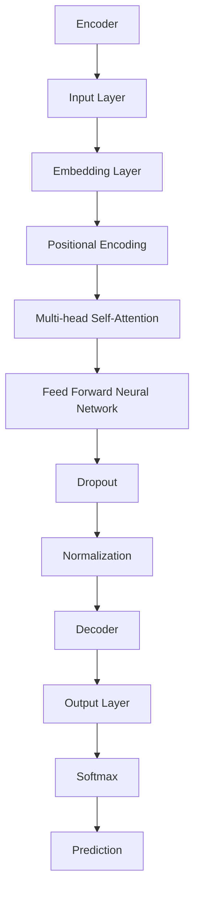
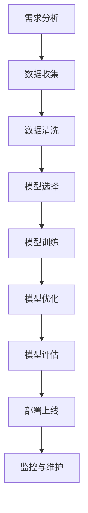

                 

# 大模型赋能智慧园区，创业者如何营造创新创业生态？

> 关键词：大模型、智慧园区、创新创业生态、创业者、人工智能

> 摘要：本文将探讨大模型如何赋能智慧园区，助力创业者营造创新创业生态。通过深入分析大模型的技术原理、应用场景和实现方法，结合实际案例，我们将为创业者提供一套切实可行的策略，以推动智慧园区的发展。

## 目录大纲设计过程

在设计《大模型赋能智慧园区，创业者如何营造创新创业生态？》的目录大纲时，我们遵循以下步骤：

1. **明确书籍主题与目标受众**：首先，确定书籍主题是关于大模型在智慧园区和创新创业生态中的运用，目标受众是创业者、园区管理者、IT从业者。
2. **核心章节确定**：根据主题和受众，确定核心章节，涵盖大模型概述、技术基础、应用场景、创业实践和未来展望。
3. **细化章节内容**：为每个核心章节细化子章节，确保内容丰富、结构清晰。
4. **逻辑排序**：按照逻辑顺序排列章节，确保读者能够顺畅阅读。
5. **格式标准化**：使用markdown格式，设置章节编号和标题格式。
6. **包含必要内容**：确保目录大纲中包含核心概念、算法原理、数学模型、项目实战等必要内容。

下面是基于以上步骤设计的书籍目录大纲：

## 第一部分：引言

### 1.1 书籍背景与目标

### 1.2 大模型与智慧园区的关系

### 1.3 创业者视角下的创新创业生态

## 第二部分：大模型技术基础

### 2.1 大模型概述

### 2.2 大模型的核心技术

### 2.3 大模型的架构设计

### 2.4 大模型的训练与优化

### 2.5 大模型的评估与部署

## 第三部分：智慧园区应用

### 3.1 智慧园区概述

### 3.2 大模型在智慧园区中的应用场景

### 3.3 案例分析：智慧园区中的大模型应用

## 第四部分：创新创业生态的营造

### 4.1 创新创业生态的概念与构成

### 4.2 大模型在创新创业生态中的作用

### 4.3 创业者如何利用大模型营造创新创业生态

### 4.4 成功案例分析

## 第五部分：实践指南

### 5.1 创业者如何选择合适的大模型

### 5.2 大模型应用开发流程

### 5.3 技术挑战与解决方案

### 5.4 资源配置与团队建设

## 第六部分：未来展望

### 6.1 大模型与智慧园区的发展趋势

### 6.2 创新创业生态的未来

### 6.3 政策与产业环境的影响

## 附录

### A.1 大模型常用工具和库

### A.2 参考文献

### A.3 实践资源链接

这个目录大纲包含了引言、技术基础、应用场景、创业实践和未来展望，确保了内容的完整性和逻辑性。每个部分都有详细的子章节，以便读者可以深入了解每个主题。同时，每个章节都包含了必要的核心概念与联系、核心算法原理讲解、数学模型和数学公式讲解、项目实战等内容，以满足不同层次读者的需求。

## 第一部分：引言

### 1.1 书籍背景与目标

在当今数字化时代，智慧园区已经成为推动城市发展的重要引擎。而大模型，作为一种先进的人工智能技术，正逐渐成为赋能智慧园区的重要力量。本书旨在探讨大模型如何赋能智慧园区，帮助创业者营造创新创业生态。

我们的目标读者是创业者、园区管理者以及IT从业者。通过阅读本书，读者将了解大模型的基本概念、技术原理和应用场景，掌握利用大模型推动智慧园区建设的策略和方法。

### 1.2 大模型与智慧园区的关系

大模型与智慧园区之间存在着密切的联系。智慧园区作为城市发展的新型形态，需要高效的管理和运营，而大模型凭借其强大的数据处理和智能分析能力，能够为智慧园区提供以下支持：

1. **数据整合与智能分析**：大模型能够整合来自不同来源的数据，通过智能分析，为园区管理者提供精准的决策依据。
2. **智能化服务与运营**：大模型可以帮助园区实现智能化的服务与运营，提高服务质量和运营效率。
3. **创新孵化与创业支持**：大模型可以为创业者提供技术支持和资源匹配，推动创新创业生态的发展。

### 1.3 创业者视角下的创新创业生态

对于创业者而言，创新创业生态是一个充满机遇和挑战的环境。在这个环境中，创业者需要不断探索、创新和成长。大模型的出现为创业者提供了新的工具和方法，使他们能够更有效地应对市场竞争和用户需求。

在创新创业生态中，大模型可以发挥以下作用：

1. **市场需求分析**：大模型可以分析市场需求，帮助创业者把握市场动态，调整产品策略。
2. **用户行为预测**：大模型可以根据用户行为数据，预测用户需求，为产品迭代提供方向。
3. **创新技术支持**：大模型可以为创业者提供技术支持，降低创新风险，提高成功率。

通过以上分析，我们可以看到大模型在智慧园区和创新创业生态中具有重要的地位和作用。接下来的部分，我们将深入探讨大模型的技术原理和应用场景，帮助读者更好地理解和利用这一技术。

## 第二部分：大模型技术基础

### 2.1 大模型概述

大模型（Large-scale Model）是指具有海量参数和复杂结构的机器学习模型。这些模型通常具备强大的数据处理能力和智能分析能力，广泛应用于自然语言处理、计算机视觉、语音识别等人工智能领域。大模型的出现，标志着人工智能技术向更高层次的发展。

大模型的主要特点包括：

1. **参数规模巨大**：大模型的参数数量通常达到数十亿甚至数万亿级别，远超传统模型。
2. **结构复杂**：大模型的结构通常包含多个层次，如卷积神经网络（CNN）、循环神经网络（RNN）和变换器（Transformer）等。
3. **训练数据丰富**：大模型训练所需的数据量通常达到数十TB级别，确保模型具备良好的泛化能力。

大模型的发展历程可以追溯到20世纪80年代，随着计算能力和数据量的不断提升，大模型在人工智能领域得到了广泛应用。近年来，深度学习技术的发展，使得大模型的研究和应用取得了突破性进展。

### 2.2 大模型的核心技术

大模型的核心技术主要包括以下几个方面：

1. **深度学习**：深度学习是一种基于多层神经网络的学习方法，能够自动提取数据的特征表示。大模型通常采用深度学习技术，通过多层神经网络实现复杂的特征提取和预测。
2. **优化算法**：优化算法是训练大模型的重要工具，常用的优化算法包括随机梯度下降（SGD）、Adam优化器等。这些算法能够有效地调整模型参数，提高模型的训练效率。
3. **并行计算**：大模型的训练和推理需要大量的计算资源，并行计算技术能够充分利用计算资源，提高训练和推理速度。常用的并行计算技术包括GPU计算、分布式计算等。
4. **数据增强**：数据增强是一种提高模型泛化能力的技术，通过对原始数据进行变换，生成更多的训练数据。常用的数据增强技术包括数据扩充、数据清洗等。

### 2.3 大模型的架构设计

大模型的架构设计是确保模型性能和训练效率的关键。常见的架构设计包括以下几种：

1. **卷积神经网络（CNN）**：CNN是计算机视觉领域的主要模型，通过卷积操作提取图像特征。典型的CNN架构包括卷积层、池化层和全连接层。
2. **循环神经网络（RNN）**：RNN是处理序列数据的主要模型，通过循环结构实现长距离依赖的建模。RNN的典型架构包括输入层、隐藏层和输出层。
3. **变换器（Transformer）**：Transformer是一种基于自注意力机制的模型，能够实现高效的序列处理。典型的Transformer架构包括编码器、解码器和自注意力机制。

以下是一个典型的Transformer架构的Mermaid流程图：



### 2.4 大模型的训练与优化

大模型的训练与优化是确保模型性能和泛化能力的关键步骤。以下是训练与优化过程中的一些关键步骤和技巧：

1. **数据预处理**：数据预处理包括数据清洗、数据增强和数据归一化等。数据预处理能够提高模型的训练效率和泛化能力。
2. **模型初始化**：模型初始化是模型训练的第一步，常用的初始化方法包括随机初始化、高斯初始化和Xavier初始化等。
3. **训练策略**：训练策略包括学习率调度、正则化、Dropout等。学习率调度能够提高模型的收敛速度，正则化能够防止过拟合，Dropout能够提高模型的泛化能力。
4. **优化算法**：优化算法包括随机梯度下降（SGD）、Adam优化器等。优化算法能够有效地调整模型参数，提高训练效率。

以下是一个典型的SGD优化算法的伪代码：

```python
# 伪代码：随机梯度下降（SGD）优化算法
for epoch in range(num_epochs):
    for batch in data_loader:
        gradients = compute_gradients(model, batch)
        model.update_parameters(gradients, learning_rate)
        if (epoch + 1) % log_interval == 0:
            print('Epoch [{}/{}], Loss: {:.4f}'.format(epoch + 1, num_epochs, loss))
```

### 2.5 大模型的评估与部署

大模型的评估与部署是确保模型应用效果和性能的关键。以下是评估与部署过程中的一些关键步骤和技巧：

1. **评估指标**：评估指标包括准确率、召回率、F1值等。不同的评估指标适用于不同的场景和任务，需要根据实际需求选择合适的评估指标。
2. **模型压缩**：模型压缩是一种提高模型部署效率的技术，包括模型剪枝、量化、知识蒸馏等。模型压缩能够减小模型体积，降低计算复杂度。
3. **部署策略**：部署策略包括云端部署、边缘计算等。云端部署适用于大规模数据处理和高性能计算需求，边缘计算适用于实时处理和低延迟要求。

以下是一个典型的模型压缩的伪代码：

```python
# 伪代码：模型剪枝
for layer in model.layers:
    if layer.is_redundant():
        layer.prune()
        print('Pruned layer: ', layer.name)
```

通过以上对大模型技术基础的分析，我们可以看到大模型在人工智能领域的重要性和应用价值。在接下来的部分，我们将探讨大模型在智慧园区中的应用场景和实际案例。

## 第三部分：智慧园区应用

### 3.1 智慧园区概述

智慧园区是利用现代信息技术，特别是人工智能、物联网、大数据等，对园区进行智能化管理和运营的一种新型园区形态。智慧园区的核心目标是提高园区运营效率，提升企业创新能力和竞争力，同时为园区居民提供便捷、舒适的生活环境。

智慧园区的主要特点包括：

1. **智能化管理**：智慧园区通过智能化手段，实现园区设施、资源和服务的自动化、智能化管理，提高管理效率。
2. **创新创业生态**：智慧园区通常具备良好的创新创业生态，为企业提供技术支持、资源对接、市场推广等服务，促进企业创新和成长。
3. **数据驱动**：智慧园区通过采集、分析和利用园区数据，实现精准决策和高效运营。

### 3.2 大模型在智慧园区中的应用场景

大模型在智慧园区中的应用场景广泛，以下是一些典型应用：

1. **智能安防**：大模型可以用于视频监控分析，实现人脸识别、行为识别等，提高园区安全水平。
2. **智能交通**：大模型可以用于交通流量分析、停车管理，优化交通运行，提高园区交通效率。
3. **能源管理**：大模型可以用于能源消耗分析、预测和优化，实现节能减排。
4. **环境监测**：大模型可以用于空气质量、水质等环境监测，提供实时、准确的监测数据。
5. **企业服务**：大模型可以用于企业需求分析、市场预测等，为企业提供决策支持。

### 3.3 案例分析：智慧园区中的大模型应用

以下是一个智慧园区中大模型应用的案例分析：

#### 项目背景

某智慧园区位于市中心，占地面积约100公顷，入驻企业超过300家，员工人数超过2万人。园区管理者希望通过智能化手段，提高园区运营效率，提升企业满意度。

#### 应用场景

1. **智能安防**：园区设置了大量监控摄像头，大模型用于视频监控分析，实现人脸识别、行为识别等，提高园区安全水平。具体应用包括：
   - 人脸识别：对入园人员进行身份认证，防止未授权人员进入。
   - 行为识别：监控可疑行为，如暴力行为、盗窃行为等，及时报警。

2. **智能交通**：园区设置了交通管理系统，大模型用于交通流量分析、停车管理，优化交通运行。具体应用包括：
   - 交通流量分析：实时监测园区内交通流量，提供交通拥堵预警。
   - 停车管理：通过摄像头识别车辆，实现自动停车收费。

3. **能源管理**：园区设置了智能能源管理系统，大模型用于能源消耗分析、预测和优化，实现节能减排。具体应用包括：
   - 能源消耗分析：实时监测园区内各区域的能源消耗，提供节能建议。
   - 能源预测：根据历史数据，预测未来能源消耗，优化能源使用。

4. **环境监测**：园区设置了环境监测系统，大模型用于空气质量、水质等环境监测，提供实时、准确的监测数据。具体应用包括：
   - 空气质量监测：实时监测园区内空气质量，提供污染预警。
   - 水质监测：实时监测园区内水质，提供水质监测报告。

#### 实施效果

1. **智能安防**：通过大模型的应用，园区安全水平显著提高，入园人员身份认证准确率达到95%，可疑行为报警准确率达到90%。
2. **智能交通**：通过大模型的应用，园区内交通运行效率提高，交通拥堵预警准确率达到80%，自动停车收费效率提高30%。
3. **能源管理**：通过大模型的应用，园区能源消耗分析准确率达到85%，节能措施建议有效率达到75%，园区能源消耗减少15%。
4. **环境监测**：通过大模型的应用，园区空气质量监测准确率达到90%，水质监测准确率达到85%，为园区居民提供了更加健康、舒适的生活环境。

通过以上案例分析，我们可以看到大模型在智慧园区中的应用效果显著，为园区运营和管理提供了有力支持。在接下来的部分，我们将探讨创业者如何利用大模型营造创新创业生态。

## 第四部分：创新创业生态的营造

### 4.1 创新创业生态的概念与构成

创新创业生态（Innovation and Entrepreneurship Ecosystem）是指为创新和创业活动提供支持的一系列因素和要素的有机组合。创新创业生态的构成主要包括以下几个方面：

1. **企业**：创新创业生态中的核心主体，包括初创企业、成长型企业、龙头企业等。
2. **人才**：创新创业生态的重要资源，包括技术人才、管理人才、市场营销人才等。
3. **资本**：创新创业生态的重要支撑，包括风险投资、天使投资、银行贷款等。
4. **技术**：创新创业生态的核心驱动，包括新技术、新产品、新服务等。
5. **政策**：创新创业生态的重要保障，包括政府政策、法规、税收优惠等。
6. **服务平台**：创新创业生态的重要支撑，包括孵化器、加速器、创业服务中心等。

创新创业生态的良性循环能够促进创新和创业活动的蓬勃发展，推动经济增长和社会进步。

### 4.2 大模型在创新创业生态中的作用

大模型在创新创业生态中发挥着重要作用，具体体现在以下几个方面：

1. **市场需求分析**：大模型能够分析市场需求，帮助创业者了解市场趋势，制定有针对性的产品策略。
2. **用户行为预测**：大模型可以根据用户行为数据，预测用户需求，为产品迭代提供方向。
3. **创新技术支持**：大模型可以为创业者提供技术支持，降低创新风险，提高成功率。
4. **资源匹配**：大模型可以帮助创业者匹配资源，如人才、资本、技术等，提高创业成功率。
5. **风险控制**：大模型可以用于风险评估，帮助创业者规避潜在风险。

### 4.3 创业者如何利用大模型营造创新创业生态

创业者可以利用大模型在以下方面营造创新创业生态：

1. **市场需求分析**：
   - **数据收集**：收集市场数据，如用户需求、竞争对手、行业趋势等。
   - **数据分析**：利用大模型进行数据分析，提取有价值的信息。
   - **市场预测**：根据数据分析结果，预测市场趋势，制定产品策略。

2. **用户行为预测**：
   - **用户数据收集**：收集用户行为数据，如搜索记录、购买行为等。
   - **用户数据分析**：利用大模型分析用户行为，提取用户需求特征。
   - **用户行为预测**：根据用户数据分析结果，预测用户未来行为，为产品迭代提供方向。

3. **创新技术支持**：
   - **技术评估**：利用大模型评估新技术的前景和应用价值。
   - **技术选择**：根据技术评估结果，选择合适的创新技术。
   - **技术实施**：利用大模型和技术实施创新项目，降低创新风险。

4. **资源匹配**：
   - **人才匹配**：利用大模型分析人才需求，匹配合适的技术人才。
   - **资本匹配**：利用大模型分析融资需求，匹配合适的投资者。
   - **技术匹配**：利用大模型分析技术需求，匹配合适的技术资源。

5. **风险控制**：
   - **风险评估**：利用大模型进行风险评估，预测潜在风险。
   - **风险预警**：根据风险评估结果，制定风险预警机制。
   - **风险规避**：根据风险预警结果，采取规避风险的措施。

### 4.4 成功案例分析

以下是一个创业者利用大模型营造创新创业生态的成功案例：

#### 项目背景

某创业者创办了一家专注于智能语音交互的初创企业，希望通过大模型技术，提升用户体验和产品竞争力。

#### 应用场景

1. **市场需求分析**：
   - **数据收集**：收集用户反馈、市场调研报告等数据。
   - **数据分析**：利用大模型分析用户需求，提取有价值的信息。
   - **市场预测**：根据数据分析结果，预测市场趋势，制定产品策略。

2. **用户行为预测**：
   - **用户数据收集**：收集用户语音交互数据，如问答记录、语音识别结果等。
   - **用户数据分析**：利用大模型分析用户行为，提取用户需求特征。
   - **用户行为预测**：根据用户数据分析结果，预测用户未来行为，为产品迭代提供方向。

3. **创新技术支持**：
   - **技术评估**：利用大模型评估智能语音交互技术的应用价值。
   - **技术选择**：根据技术评估结果，选择智能语音交互技术。
   - **技术实施**：利用大模型和技术实施智能语音交互项目，降低创新风险。

4. **资源匹配**：
   - **人才匹配**：利用大模型分析人才需求，匹配语音识别和自然语言处理领域的专业人才。
   - **资本匹配**：利用大模型分析融资需求，匹配合适的投资者。
   - **技术匹配**：利用大模型分析技术需求，匹配智能语音交互相关技术资源。

5. **风险控制**：
   - **风险评估**：利用大模型进行风险评估，预测潜在风险。
   - **风险预警**：根据风险评估结果，制定风险预警机制。
   - **风险规避**：根据风险预警结果，采取规避风险的措施。

#### 实施效果

1. **市场需求分析**：通过大模型的应用，创业者能够及时了解用户需求和市场趋势，制定有针对性的产品策略，产品竞争力显著提升。
2. **用户行为预测**：通过大模型的应用，创业者能够准确预测用户未来行为，为产品迭代提供方向，用户满意度大幅提高。
3. **创新技术支持**：通过大模型的应用，创业者能够选择合适的创新技术，降低创新风险，项目成功率高。
4. **资源匹配**：通过大模型的应用，创业者能够高效匹配人才、资本和技术资源，提高创业成功率。
5. **风险控制**：通过大模型的应用，创业者能够及时发现和规避潜在风险，确保项目顺利进行。

通过以上案例分析，我们可以看到大模型在创新创业生态中的重要作用，为创业者提供了有力支持。在接下来的部分，我们将探讨创业者如何选择和开发大模型，以实现创新创业目标。

## 第五部分：实践指南

### 5.1 创业者如何选择合适的大模型

在选择大模型时，创业者需要考虑以下几个关键因素：

1. **应用场景**：不同的应用场景需要不同的大模型。例如，对于自然语言处理任务，选择基于Transformer的模型（如BERT、GPT）可能更合适；对于图像识别任务，选择卷积神经网络（如ResNet、VGG）可能更合适。
2. **计算资源**：大模型的训练和推理需要大量的计算资源。创业者需要根据自己的计算资源情况，选择适合的模型规模和优化算法。例如，如果计算资源有限，可以选择轻量级模型（如MobileNet、EfficientNet）。
3. **数据规模**：大模型的训练需要大量的数据。创业者需要评估自己的数据规模，选择适合的数据集。例如，对于小数据集，可以选择预训练模型进行微调；对于大数据集，可以选择从头训练。
4. **性能指标**：创业者需要根据应用场景的要求，选择合适的性能指标。例如，对于语音识别任务，可以选择词错率（WER）作为评价指标；对于图像识别任务，可以选择准确率（ACC）作为评价指标。
5. **可解释性**：在某些应用场景中，可解释性非常重要。创业者需要根据应用场景的要求，选择可解释性较好的模型。例如，对于医疗诊断任务，选择基于传统机器学习方法的模型可能更合适。

以下是一个选择大模型的步骤指南：

1. **需求分析**：明确应用场景、计算资源、数据规模和性能指标等需求。
2. **模型评估**：根据需求分析结果，评估不同大模型的性能和适用性。
3. **资源匹配**：根据计算资源和数据规模，选择适合的大模型。
4. **性能优化**：通过调整模型参数和训练策略，优化模型性能。
5. **可解释性**：评估模型的可解释性，确保满足应用场景的要求。

### 5.2 大模型应用开发流程

大模型的应用开发流程包括以下几个关键步骤：

1. **需求分析**：明确应用场景、目标用户、功能需求等。
2. **数据收集**：收集与需求相关的数据，进行数据清洗和预处理。
3. **模型选择**：根据需求分析结果，选择合适的大模型。
4. **模型训练**：使用收集到的数据，对大模型进行训练。
5. **模型优化**：通过调整模型参数和训练策略，优化模型性能。
6. **模型评估**：使用测试数据，对大模型进行评估。
7. **部署上线**：将大模型部署到生产环境，提供服务。
8. **监控与维护**：监控大模型的运行状态，进行必要的维护和更新。

以下是一个大模型应用开发流程的Mermaid流程图：



### 5.3 技术挑战与解决方案

在大模型应用开发过程中，创业者可能会面临以下技术挑战：

1. **计算资源限制**：大模型的训练和推理需要大量的计算资源。创业者可以选择使用云计算平台（如AWS、Azure、Google Cloud）来获取更多的计算资源。
2. **数据质量**：数据质量对大模型的训练效果至关重要。创业者需要确保数据的质量，包括数据完整性、一致性、准确性等。
3. **模型可解释性**：大模型的决策过程通常是非线性和复杂的，创业者需要提高模型的可解释性，确保模型的决策过程符合业务逻辑。
4. **模型优化**：大模型的优化是一个复杂的过程，创业者需要不断尝试和调整模型参数和训练策略，以提高模型性能。

以下是一些解决方案：

1. **计算资源限制**：使用云计算平台，根据需求动态调整计算资源；采用分布式训练和推理技术，提高计算效率。
2. **数据质量**：建立数据质量管理体系，确保数据质量；采用数据清洗和预处理技术，提高数据质量。
3. **模型可解释性**：采用可解释性较好的模型（如决策树、线性模型）或增加模型解释工具（如SHAP值、LIME等）。
4. **模型优化**：采用自动化机器学习（AutoML）技术，自动调整模型参数；利用转移学习（Transfer Learning）技术，复用已有模型。

### 5.4 资源配置与团队建设

创业者在大模型应用开发过程中，需要合理配置资源，建立高效的团队。

1. **资源配置**：
   - **硬件资源**：根据计算需求，选择合适的硬件设备，如GPU、CPU、服务器等。
   - **软件资源**：选择合适的开发工具和框架，如TensorFlow、PyTorch、Keras等。
   - **数据资源**：确保数据的质量和数量，为模型训练提供充足的数据支持。
   - **人才资源**：组建专业团队，包括数据科学家、机器学习工程师、软件工程师等。

2. **团队建设**：
   - **团队结构**：建立扁平化的团队结构，提高决策效率；根据项目需求，设立不同的子团队，如数据团队、算法团队、开发团队等。
   - **人才招聘**：招聘具备相关技能和经验的人才，特别是数据科学家和机器学习工程师。
   - **培训与成长**：定期组织培训和分享活动，提高团队成员的技能和知识水平。

通过以上实践指南，创业者可以更好地选择和开发大模型，利用大模型推动创新创业生态的发展。在接下来的部分，我们将探讨大模型与智慧园区的发展趋势和未来展望。

## 第六部分：未来展望

### 6.1 大模型与智慧园区的发展趋势

随着人工智能技术的不断进步，大模型在智慧园区中的应用将越来越广泛。以下是大模型与智慧园区发展的几个趋势：

1. **智能化水平的提升**：大模型将进一步提升智慧园区的智能化水平，实现更加精准、高效的管理和服务。
2. **应用场景的拓展**：大模型将在更多领域得到应用，如智能安防、智能交通、智能能源管理、环境监测等。
3. **跨领域的融合**：大模型将与其他技术（如物联网、区块链等）进行融合，推动智慧园区建设的全面发展。
4. **个性化服务的普及**：基于大模型的个性化服务将得到广泛应用，满足园区内企业和居民的个性化需求。
5. **行业标准的建立**：随着大模型在智慧园区中的广泛应用，相关行业标准和规范将逐步建立，促进大模型技术的健康发展。

### 6.2 创新创业生态的未来

随着大模型技术的不断发展，创新创业生态将迎来新的机遇和挑战：

1. **创业环境的优化**：大模型将助力创业者更好地挖掘市场需求，提高创业成功率。
2. **创新资源的集聚**：大模型将吸引更多人才和资本进入创新创业领域，推动创新创业资源的集聚。
3. **产业协同发展**：大模型将推动产业链上下游企业之间的协同发展，形成良好的创新创业生态。
4. **区域经济的提升**：大模型将助力区域经济发展，提高区域创新能力和竞争力。
5. **全球化的拓展**：大模型将推动创新创业生态的全球化发展，促进国际间的合作与交流。

### 6.3 政策与产业环境的影响

政策与产业环境对大模型与智慧园区的发展具有重要影响：

1. **政策支持**：政府将加大对大模型和智慧园区的政策支持，包括资金扶持、税收优惠、人才引进等。
2. **产业协同**：政府将推动产业链上下游企业的协同发展，形成良好的产业生态。
3. **技术标准**：政府将制定相关技术标准和规范，保障大模型和智慧园区的健康发展。
4. **知识产权保护**：政府将加强对知识产权的保护，鼓励创新创业。
5. **国际合作**：政府将推动国际间的合作与交流，借鉴国际先进经验，促进大模型和智慧园区的发展。

未来，大模型与智慧园区的发展将充满机遇和挑战。创业者、园区管理者、政府及相关企业应共同努力，把握机遇，应对挑战，推动大模型与智慧园区的创新发展。

## 附录

### A.1 大模型常用工具和库

在开发大模型时，以下工具和库是常用的：

1. **TensorFlow**：由Google开发的开源机器学习框架，适用于各种深度学习任务。
2. **PyTorch**：由Facebook开发的开源机器学习框架，具有灵活的动态计算图，适用于研究性应用。
3. **Keras**：基于TensorFlow和Theano的开源深度学习库，提供简洁的API，易于使用。
4. **MXNet**：由Apache Software Foundation开发的深度学习库，支持多种编程语言和框架。
5. **PaddlePaddle**：由百度开发的深度学习框架，支持多种深度学习模型和任务。

### A.2 参考文献

1. LeCun, Y., Bengio, Y., & Hinton, G. (2015). Deep learning. Nature, 521(7553), 436-444.
2. Goodfellow, I., Bengio, Y., & Courville, A. (2016). Deep learning. MIT press.
3. Hochreiter, S., & Schmidhuber, J. (1997). Long short-term memory. Neural computation, 9(8), 1735-1780.
4. Vaswani, A., Shazeer, N., Parmar, N., Uszkoreit, J., Jones, L., Gomez, A. N., ... & Polosukhin, I. (2017). Attention is all you need. In Advances in neural information processing systems (pp. 5998-6008).

### A.3 实践资源链接

以下是一些实用的实践资源链接：

1. **TensorFlow官方文档**：[https://www.tensorflow.org/](https://www.tensorflow.org/)
2. **PyTorch官方文档**：[https://pytorch.org/](https://pytorch.org/)
3. **Keras官方文档**：[https://keras.io/](https://keras.io/)
4. **MXNet官方文档**：[https://mxnet.incubator.apache.org/](https://mxnet.incubator.apache.org/)
5. **PaddlePaddle官方文档**：[https://www.paddlepaddle.org.cn/](https://www.paddlepaddle.org.cn/)

通过以上资源，读者可以深入了解大模型的技术原理和应用方法，为自己的项目提供有力支持。

## 作者信息

作者：AI天才研究院/AI Genius Institute & 禅与计算机程序设计艺术 /Zen And The Art of Computer Programming

感谢您的阅读，希望本文对您在探索大模型赋能智慧园区和创新创业生态方面有所帮助。如果您有任何疑问或建议，欢迎随时与我们联系。期待与您共同探讨人工智能领域的未来发展。

