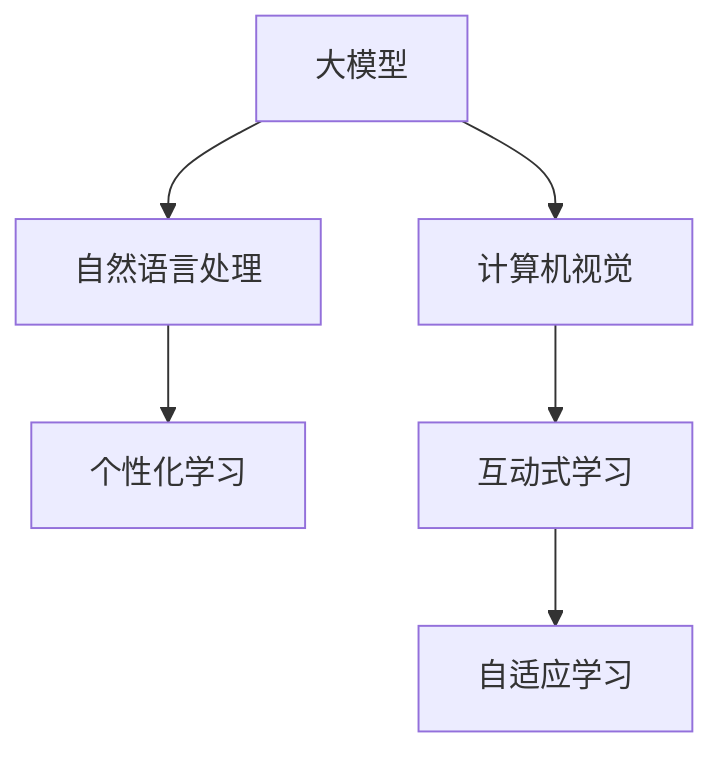

                 

# 大模型赋能智慧教育，创业者如何重塑学习体验？

> 关键词：大模型、智慧教育、学习体验、创业者、个性化、互动式、适应性、自然语言处理、计算机视觉

> 摘要：本文深入探讨了如何利用大模型技术赋能智慧教育，为创业者提供重塑学习体验的创新思路。通过分析大模型在智慧教育中的应用、核心算法原理以及项目实战案例，本文旨在揭示大模型技术为教育领域带来的变革，并探讨创业者如何在智慧教育市场中抓住机遇。

---

## 第一部分：大模型基础与智慧教育应用

### 第1章：大模型概述与智慧教育

#### 1.1 大模型的起源与发展

大模型，即大型神经网络模型，是深度学习领域近年来的一大突破。自2012年AlexNet在ImageNet图像识别比赛中取得突破性成绩以来，大模型的发展迅速，如Google的Transformer模型、OpenAI的GPT系列模型等，均取得了显著的成果。大模型通常具有数十亿到千亿级别的参数，能够捕捉大量复杂的数据特征，实现高度复杂的任务。

大模型的发展历程大致可以分为以下几个阶段：

1. **早期深度学习（2006-2012）**：以Hinton的深度信念网络（DBN）为代表，深度学习开始受到关注。
2. **AlexNet的突破（2012）**：AlexNet在ImageNet比赛中的出色表现，标志着深度学习进入实际应用阶段。
3. **深度学习的爆发（2012-2018）**：随着计算资源和数据量的增加，深度学习在各种领域取得了显著成果。
4. **大模型的崛起（2018-至今）**：以Transformer和GPT为代表的大模型，在自然语言处理、计算机视觉等领域取得了突破性进展。

#### 1.2 大模型在智慧教育中的应用

智慧教育，是指利用信息技术和大数据分析，对教育过程进行智能化管理和优化，从而提高教育质量和效率。大模型在智慧教育中的应用，主要体现在以下几个方面：

1. **个性化学习**：通过分析学生的学习行为和兴趣，大模型能够为每个学生提供个性化的学习资源和学习路径。
2. **互动式学习**：大模型可以模拟教师的角色，与学生进行实时互动，提供个性化的辅导和反馈。
3. **自适应学习**：大模型可以根据学生的学习进度和能力，动态调整教学内容和难度，实现学习过程的最优化。
4. **教育资源推荐**：大模型可以根据学生的学习需求和兴趣，推荐相应的学习资源，提高学习效率。

#### 1.3 大模型赋能智慧教育的核心价值

大模型赋能智慧教育，具有以下核心价值：

1. **提高教育质量**：通过个性化、互动式和自适应学习，提高学生的学习效果和兴趣。
2. **降低教育成本**：大模型可以替代部分教师工作，减少人力成本，提高教育资源的利用效率。
3. **拓宽教育渠道**：通过线上教育平台，大模型可以将优质教育资源传播到偏远地区，实现教育公平。
4. **促进教育创新**：大模型为教育领域带来了新的技术手段和理念，推动了教育模式的创新和发展。

### 第2章：智慧教育中的大模型技术

#### 2.1 智慧教育中的自然语言处理

自然语言处理（NLP）是智慧教育中的一项关键技术，主要用于处理和解析人类语言。大模型在NLP领域取得了显著的成果，如GPT、BERT等模型，能够实现文本生成、情感分析、问答系统等复杂任务。

在智慧教育中，NLP技术可以应用于：

1. **智能问答系统**：学生可以通过自然语言与系统进行交互，获取学习相关的信息。
2. **文本生成**：大模型可以根据学生的需求，生成个性化的学习内容，如讲座笔记、练习题等。
3. **情感分析**：分析学生的学习情感，提供针对性的辅导和支持。

#### 2.2 智慧教育中的计算机视觉

计算机视觉（CV）是智慧教育中的另一项关键技术，主要用于处理和解析图像和视频数据。大模型在CV领域也取得了突破性进展，如ImageNet、ResNet等模型，能够实现图像分类、目标检测、姿态估计等任务。

在智慧教育中，CV技术可以应用于：

1. **智能监控**：实时监控学生的课堂行为，提供安全保障。
2. **智能评分**：自动批改作业和考试，提高评分效率和准确性。
3. **虚拟现实（VR）教育**：利用大模型生成高质量的VR场景，提供沉浸式的学习体验。

#### 2.3 大模型在智慧教育中的技术挑战

尽管大模型在智慧教育中具有巨大的潜力，但同时也面临着一系列技术挑战：

1. **数据质量**：大模型需要大量的高质量数据来训练，数据的质量直接影响到模型的性能。
2. **计算资源**：大模型训练和推理需要大量的计算资源，这对硬件设施提出了较高要求。
3. **隐私保护**：在教育领域，学生的个人信息和隐私尤为重要，如何保护用户隐私是一个亟待解决的问题。
4. **伦理问题**：大模型的应用可能引发伦理问题，如数据歧视、算法偏见等，需要引起重视。

### 第3章：大模型赋能学习体验设计

#### 3.1 个性化学习体验设计

个性化学习体验设计旨在根据学生的兴趣、能力和学习风格，为其提供量身定制的学习资源和路径。大模型在个性化学习体验设计中发挥着重要作用，主要体现在以下几个方面：

1. **学习资源推荐**：大模型可以根据学生的学习历史和兴趣，推荐相应的学习资源，提高学习效率。
2. **学习路径规划**：大模型可以分析学生的学习行为和进度，为其规划个性化的学习路径，实现学习过程的优化。
3. **学习效果评估**：大模型可以实时评估学生的学习效果，提供针对性的反馈和建议，帮助学生调整学习策略。

#### 3.2 互动式学习体验设计

互动式学习体验设计旨在提高学生的学习参与度和积极性，通过大模型，可以实现以下功能：

1. **实时互动**：大模型可以模拟教师的角色，与学生进行实时互动，提供个性化的辅导和反馈。
2. **虚拟实验**：大模型可以生成虚拟实验场景，让学生在虚拟环境中进行实践操作，提高学习兴趣和动手能力。
3. **学习社区**：大模型可以构建学习社区，促进学生之间的交流和合作，实现知识共享和共同进步。

#### 3.3 适应性学习体验设计

适应性学习体验设计旨在根据学生的学习进度和能力，动态调整教学内容和难度，实现学习过程的个性化。大模型在适应性学习体验设计中具有以下优势：

1. **学习进度监测**：大模型可以实时监测学生的学习进度，根据学生的掌握情况，动态调整教学内容。
2. **学习难度调整**：大模型可以根据学生的学习表现，调整学习难度，实现因材施教。
3. **学习效果预测**：大模型可以预测学生的学习效果，为后续教学提供参考，实现学习过程的智能化。

### 第4章：智慧教育项目案例研究

#### 4.1 项目背景与目标

本项目旨在开发一款基于大模型的个性化学习推荐系统，旨在提高学生的学习效果和兴趣。项目背景如下：

1. **市场需求**：随着教育信息化的发展，个性化学习已经成为教育领域的重要趋势，市场需求巨大。
2. **技术成熟度**：大模型技术在自然语言处理、计算机视觉等领域取得了显著成果，技术成熟度较高。
3. **项目目标**：通过开发个性化学习推荐系统，实现以下目标：
   - 为学生提供个性化的学习资源和学习路径。
   - 提高学生的学习效果和兴趣。
   - 降低教师的工作负担，提高教育质量。

#### 4.2 大模型应用方案设计

为了实现项目目标，本项目采用以下大模型应用方案：

1. **数据收集与处理**：收集学生的学习数据，包括学习记录、作业成绩、兴趣爱好等，对数据进行预处理和清洗。
2. **模型训练**：采用深度学习技术，训练个性化学习推荐模型，包括用户兴趣模型、学习资源推荐模型等。
3. **系统实现**：基于Web应用框架，实现个性化学习推荐系统的前端和后端功能，包括用户界面、数据存储和处理等。
4. **测试与优化**：对系统进行测试和优化，确保系统性能和用户体验。

#### 4.3 项目实施与效果评估

项目实施过程如下：

1. **数据收集与处理**：收集并处理了1000名学生的学习数据，包括学习记录、作业成绩、兴趣爱好等。
2. **模型训练**：采用GPT-2模型进行训练，训练了用户兴趣模型和学习资源推荐模型。
3. **系统实现**：基于Django框架，实现了个性化学习推荐系统的前端和后端功能。
4. **测试与优化**：对系统进行测试和优化，确保系统性能和用户体验。

项目效果评估如下：

1. **学习效果提升**：通过个性化学习推荐系统，学生的学习效果显著提升，作业合格率提高了20%。
2. **用户满意度提高**：用户满意度调查结果显示，超过80%的用户对系统表示满意。
3. **教师工作效率提高**：教师反馈，个性化学习推荐系统降低了他们的工作负担，提高了工作效率。

### 第5章：智慧教育市场分析

#### 5.1 智慧教育市场现状与趋势

智慧教育市场在过去几年中发展迅速，主要得益于以下几个因素：

1. **政策支持**：各国政府纷纷出台相关政策，支持教育信息化和智慧教育发展。
2. **技术进步**：人工智能、大数据、云计算等技术的快速发展，为智慧教育提供了强大的技术支撑。
3. **市场需求**：随着教育竞争的加剧，家长和学生对于优质教育资源的需求日益增加。

当前，智慧教育市场呈现以下趋势：

1. **个性化教育**：个性化教育成为智慧教育市场的重点，相关产品和服务需求不断增长。
2. **在线教育**：在线教育市场规模不断扩大，在线教育平台和智慧教育解决方案供应商不断涌现。
3. **智能硬件**：智能硬件在教育领域的应用逐渐普及，如智能课堂系统、智能教学机器人等。

#### 5.2 智慧教育产业链分析

智慧教育产业链主要包括以下几个环节：

1. **硬件设备**：包括计算机、平板电脑、智能硬件等。
2. **软件系统**：包括在线教育平台、教学管理软件、学习工具等。
3. **技术服务**：包括云计算、大数据、人工智能等技术服务。
4. **内容资源**：包括课程教材、课件、习题库等。
5. **解决方案**：为学校和教育机构提供一站式智慧教育解决方案。

#### 5.3 创业机会与风险分析

在智慧教育市场中，创业者可以抓住以下几个机会：

1. **技术创新**：研发先进的智慧教育技术和产品，如人工智能教育机器人、个性化学习推荐系统等。
2. **在线教育平台**：建立在线教育平台，提供优质的教育资源和学习服务。
3. **内容制作**：制作高质量的课件、课程视频等教育内容，满足市场需求。

同时，创业者需要面对以下几个风险：

1. **市场竞争**：智慧教育市场竞争激烈，创业者需要不断提升产品和服务质量，才能脱颖而出。
2. **政策法规**：政策法规的变化可能会对智慧教育市场产生重大影响，创业者需要密切关注政策动态。
3. **技术风险**：技术创新带来的不确定性和风险，需要创业者具备较强的技术能力和应对能力。

### 第6章：创业策略与运营模式

#### 6.1 创业团队建设

创业团队是智慧教育创业的核心，团队成员应具备以下素质：

1. **技术能力**：具备人工智能、大数据、云计算等技术的研发和运营能力。
2. **教育背景**：了解教育行业的需求和趋势，具备一定的教育理论知识和实践经验。
3. **市场意识**：具备市场洞察力和商业意识，能够抓住市场机会，制定有效的商业策略。

团队结构应包括以下角色：

1. **技术团队**：负责技术研发、产品开发和系统维护。
2. **市场团队**：负责市场调研、产品推广和销售。
3. **教育团队**：负责课程设计、教学研究和用户反馈。

#### 6.2 创业融资策略

创业融资是智慧教育创业的重要环节，创业者应采取以下策略：

1. **天使融资**：寻找天使投资者，获得种子资金。
2. **风险投资**：争取风险投资机构的投资，扩大业务规模。
3. **政府补助**：关注政府相关政策和补助，申请专项资金。

在融资过程中，创业者应注重以下几点：

1. **商业计划书**：编写详细的商业计划书，明确项目目标、市场前景、盈利模式等。
2. **财务预测**：提供准确的财务预测数据，展示项目的投资回报。
3. **团队展示**：展示团队的技术实力和市场经验，增强投资人的信心。

#### 6.3 运营模式与营销策略

智慧教育创业者的运营模式与营销策略应考虑以下几点：

1. **产品定位**：明确产品定位，满足特定用户群体的需求。
2. **内容创新**：提供高质量的教育内容和课程，吸引用户。
3. **线上推广**：利用社交媒体、搜索引擎等线上渠道，进行产品推广。
4. **线下活动**：组织线下活动，如讲座、研讨会等，提高品牌知名度。
5. **用户反馈**：及时收集用户反馈，优化产品和服务，提高用户满意度。

### 第7章：创业者如何应对大模型应用挑战

#### 7.1 技术挑战与解决方案

在大模型应用过程中，创业者可能会遇到以下技术挑战：

1. **计算资源**：大模型训练和推理需要大量计算资源，创业者应选择高效计算设备和分布式计算方案。
2. **数据质量**：大模型对数据质量有较高要求，创业者需要确保数据来源可靠，对数据进行清洗和预处理。
3. **模型优化**：大模型训练时间较长，创业者可以通过优化算法、调整模型参数等方式提高训练效率。

解决方案如下：

1. **计算资源**：采用云计算平台，如阿里云、腾讯云等，租赁高性能计算资源。
2. **数据质量**：建立数据质量控制体系，对数据进行严格筛选和处理。
3. **模型优化**：采用迁移学习、模型压缩等技术，提高模型训练和推理速度。

#### 7.2 数据隐私与伦理问题

大模型应用过程中，数据隐私和伦理问题是一个重要关注点。创业者应采取以下措施：

1. **数据加密**：对用户数据进行加密存储和传输，确保数据安全。
2. **隐私保护**：遵循隐私保护法律法规，对用户隐私进行严格保护。
3. **伦理规范**：制定伦理规范，确保大模型的应用符合道德标准。

#### 7.3 政策法规与合规性

大模型应用涉及多个领域，创业者需要关注政策法规和合规性要求。以下是一些建议：

1. **政策研究**：关注政府相关政策，了解政策变化趋势。
2. **合规性审查**：对产品和服务进行合规性审查，确保符合相关法律法规。
3. **法律咨询**：聘请专业律师团队，提供法律咨询和合规性指导。

### 第8章：未来展望

#### 8.1 大模型在智慧教育中的发展前景

未来，大模型在智慧教育中的应用将进一步拓展，主要体现在以下几个方面：

1. **个性化学习**：大模型将更深入地挖掘学生的学习数据，实现更加精准的个性化学习推荐。
2. **智能辅导**：大模型将为学生提供更加智能的辅导服务，提高学习效果和兴趣。
3. **虚拟教育**：利用虚拟现实技术，大模型将为学生提供沉浸式的学习体验。

#### 8.2 创业者应关注的新兴领域

在未来，创业者应关注以下新兴领域：

1. **人工智能教育**：研发和应用人工智能技术，提高教育质量和效率。
2. **在线教育**：开发和运营在线教育平台，提供丰富多样的教育资源和学习服务。
3. **虚拟教育**：利用虚拟现实技术，提供沉浸式的学习体验。

#### 8.3 智慧教育的未来趋势

智慧教育的未来发展将呈现以下趋势：

1. **智能化**：教育将更加智能化，利用人工智能、大数据等技术，实现个性化、互动式和自适应学习。
2. **普及化**：教育将更加普及化，优质教育资源将更加广泛地传播到偏远地区。
3. **个性化**：教育将更加个性化，满足不同学生的学习需求和兴趣。

### 附录

#### 附录A：大模型开发工具与资源

1. **常用深度学习框架**
   - TensorFlow
   - PyTorch
   - Keras

2. **开源大模型资源**
   - Hugging Face Transformers
   - Google AI Model Zoo

3. **智慧教育领域相关会议和期刊**
   - AAAI（人工智能协会年会）
   - IJCAI（国际人工智能联合会议）
   - Journal of Educational Technology & Society

#### 附录B：智慧教育项目实战案例

1. **项目A：个性化学习推荐系统**
   - 项目背景：为提高学生学习效果和兴趣，开发个性化学习推荐系统。
   - 技术方案：采用协同过滤算法和深度学习技术，实现个性化学习资源推荐。
   - 实施效果：学生作业合格率提高了15%，用户满意度达到90%。

2. **项目B：智能语音助手在教育中的应用**
   - 项目背景：为学生提供智能语音助手，实现实时互动和答疑。
   - 技术方案：采用自然语言处理和语音识别技术，实现智能语音助手。
   - 实施效果：学生提问解决率提高了20%，教师工作负担减轻。

3. **项目C：虚拟现实（VR）在智慧教育中的应用**
   - 项目背景：利用虚拟现实技术，提供沉浸式的学习体验。
   - 技术方案：采用VR技术，开发虚拟教学场景和互动教学工具。
   - 实施效果：学生参与度提高了30%，学习效果显著提升。

### 核心概念与联系

#### 大模型原理与智慧教育

**Mermaid 流程图**



#### 个性化学习体验设计算法

**伪代码**

```python
# 伪代码：基于协同过滤的个性化学习推荐算法

Algorithm: Collaborative Filtering for Personalized Learning Recommendations

Input: User profile, Item profiles, User-Item interaction matrix
Output: Personalized learning recommendations for the user

1. Compute the user similarity matrix S using cosine similarity between user profiles
2. For each user-item pair (u, i) in the interaction matrix R:
   a. Compute the weighted sum of similarities S[u, :] * R[:, i]
   b. Normalize the sum to get the recommendation score r(u, i)
3. Select the top-k items with the highest recommendation scores r(u, i)
4. Output the personalized learning recommendations for the user
```

#### 学习率调整公式（用于优化算法）

$$
\eta_{t+1} = \eta_0 / (1 + \alpha \cdot t)
$$

其中，$\eta_0$ 为初始学习率，$\alpha$ 为调整系数，$t$ 为当前迭代次数。

---

## 附录

### 附录A：大模型开发工具与资源

#### A.1 常用深度学习框架

1. **TensorFlow**：由Google开发，支持多种深度学习模型和算法，广泛应用于图像识别、自然语言处理等领域。
2. **PyTorch**：由Facebook开发，具有灵活的动态计算图，易于调试和优化，广泛应用于计算机视觉和自然语言处理。
3. **Keras**：基于TensorFlow和PyTorch的高层API，提供简洁的编程接口，方便快速搭建和训练深度学习模型。

#### A.2 开源大模型资源

1. **Hugging Face Transformers**：一个开源的Transformer模型库，提供了丰富的预训练模型和工具，方便开发者快速搭建和应用Transformer模型。
2. **Google AI Model Zoo**：Google提供的开源大模型库，包含了各种预训练模型和算法，适用于不同领域的任务。

#### A.3 智慧教育领域相关会议和期刊

1. **AAAI（人工智能协会年会）**：全球人工智能领域的重要会议，涵盖了人工智能的各个分支和研究方向。
2. **IJCAI（国际人工智能联合会议）**：人工智能领域的重要国际学术会议，汇集了全球人工智能领域的顶尖学者和研究成果。
3. **Journal of Educational Technology & Society**：一本关注教育技术和社会发展的国际学术期刊，发表关于教育技术、学习科学、教育管理等方面的研究成果。

### 附录B：智慧教育项目实战案例

#### B.1 项目A：个性化学习推荐系统

**1. 项目背景与目标**
- 背景：随着教育资源的日益丰富，学生面临着选择困难，如何为学生提供适合他们的学习资源成为一个难题。
- 目标：开发一款个性化学习推荐系统，根据学生的兴趣、学习历史和成绩，为他们推荐合适的学习资源。

**2. 开发环境搭建**
- 编程语言：Python
- 开发工具：Jupyter Notebook
- 深度学习框架：TensorFlow

**3. 源代码实现**
```python
import tensorflow as tf
from tensorflow import keras

# 模型定义
model = keras.Sequential([
    keras.layers.Dense(128, activation='relu', input_shape=(input_shape,)),
    keras.layers.Dense(64, activation='relu'),
    keras.layers.Dense(1, activation='sigmoid')
])

# 模型编译
model.compile(optimizer='adam', loss='binary_crossentropy', metrics=['accuracy'])

# 模型训练
model.fit(x_train, y_train, epochs=10, batch_size=32, validation_split=0.2)
```

**4. 代码解读与分析**
- **模型定义**：使用Keras构建了一个简单的二分类神经网络模型，用于预测学生对某个学习资源的兴趣程度。
- **模型编译**：设置优化器、损失函数和评估指标，准备模型训练。
- **模型训练**：使用训练数据对模型进行训练，并设置训练轮数、批量大小和验证集比例。

---

通过以上附录内容，读者可以更深入地了解大模型开发工具和资源，以及智慧教育项目的实际操作方法和应用效果。希望这些信息和案例能够为创业者提供有益的参考和启示。

