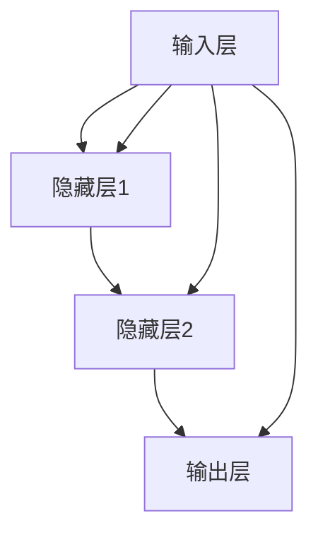
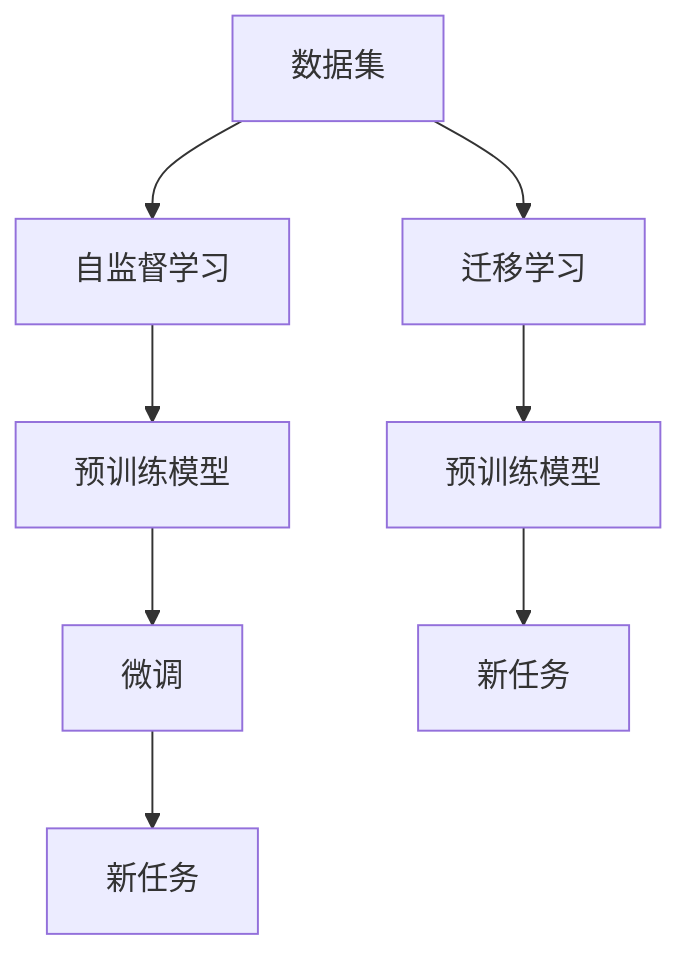

                 

# 《大模型重塑创业黄金时代》

> 关键词：大模型、创业、深度学习、神经网络、算法、应用案例

> 摘要：本文从大模型的定义、数学基础、核心算法、应用场景、开发与部署等方面入手，详细阐述了大模型如何重塑创业黄金时代。通过分析大模型在创业中的应用案例，本文揭示了其在数据分析、产品创新、风险管理等方面的巨大潜力，为创业者提供了新的思路和方向。

## 第一部分：大模型概述与趋势

### 第1章：大模型时代来临

#### 1.1 大模型的定义与核心特性

大模型，通常指的是那些参数规模巨大、能够处理大量复杂数据的机器学习模型。这些模型具备以下几个核心特性：

1. **参数规模巨大**：大模型具有数十亿甚至数万亿个参数，这使得它们在处理大规模数据时具有显著的优势。
2. **强大的表征能力**：由于参数规模巨大，大模型能够捕捉数据中的复杂模式和规律，从而在图像、文本、语音等多模态数据上表现出色。
3. **自我优化**：大模型通常采用自我优化的策略，如自监督学习和迁移学习，能够自适应地调整模型参数，以适应不同的任务和数据。

#### 1.2 大模型的发展历程

大模型的发展历程可以分为三个阶段：

1. **初步阶段**（20世纪90年代）：以支持向量机（SVM）和决策树为代表，这些模型参数相对较小，但已经展示了强大的分类和回归能力。
2. **快速增长阶段**（2010年代）：随着计算能力和数据量的提升，深度学习模型如卷积神经网络（CNN）和递归神经网络（RNN）开始出现，参数规模迅速增加，模型性能大幅提升。
3. **当前阶段**（21世纪20年代）：以GPT、BERT等为代表的大规模预训练模型，参数规模达到了数十亿甚至数百亿级别，模型性能已经接近甚至超过人类水平。

#### 1.3 大模型与创业的关系

大模型的崛起为创业带来了前所未有的机遇和挑战：

1. **机遇**：
   - **数据分析**：大模型能够处理和分析海量数据，为创业公司提供深度的数据洞察和决策支持。
   - **产品创新**：大模型可以用于产品个性化推荐、智能客服等，提升用户体验和市场份额。
   - **风险管理**：大模型能够预测市场趋势、评估风险，为创业公司提供更加稳健的运营策略。

2. **挑战**：
   - **技术门槛**：大模型的开发和应用需要深厚的技术积累和强大的计算资源，这对创业公司来说是一大挑战。
   - **数据隐私**：大模型对数据的需求巨大，如何保障数据隐私和安全是创业者必须面对的问题。

#### 1.4 大模型在创业领域的应用趋势

随着大模型技术的不断成熟，其在创业领域的应用趋势如下：

1. **个性化推荐**：利用大模型进行用户行为分析和偏好预测，为用户提供个性化的产品推荐。
2. **智能客服**：大模型可以训练出具备自然语言处理能力的智能客服系统，提升客服效率和用户体验。
3. **风险控制**：大模型可以用于信用评分、市场预测等，帮助创业公司进行风险管理和决策优化。
4. **智能医疗**：大模型可以用于医疗影像分析、疾病预测等，为创业者提供创新性的医疗解决方案。

## 第二部分：大模型的数学基础

### 第2章：大模型的数学基础

#### 2.1 线性代数基础

线性代数是构建大模型的重要数学工具，主要包括以下几个方面：

1. **矩阵与向量**：矩阵和向量是线性代数的基本元素，用于表示和操作数据。
2. **矩阵运算**：包括矩阵的加法、减法、乘法、逆运算等，这些运算是大模型算法的基础。
3. **线性方程组**：线性方程组是解决许多实际问题的关键，如大模型的优化问题。

#### 2.2 微积分基础

微积分是分析函数性质和求解极值的重要工具，主要包括以下几个方面：

1. **导数与微分**：导数是描述函数变化率的重要概念，微分是导数的近似计算方法。
2. **积分与微分方程**：积分是求解面积和体积问题的基本方法，微分方程是描述动态系统的重要工具。

#### 2.3 概率论与统计基础

概率论和统计学是分析随机现象和预测未来趋势的重要工具，主要包括以下几个方面：

1. **概率分布**：描述随机变量的概率特性，如正态分布、二项分布等。
2. **假设检验**：用于判断实验结果是否显著，如t检验、卡方检验等。
3. **统计模型**：包括线性回归、逻辑回归等，用于建立变量之间的关系。

### 第3章：大模型的核心算法

#### 3.1 深度学习基础

深度学习是构建大模型的核心技术，主要包括以下几个方面：

1. **神经网络**：神经网络是模拟人脑神经元工作方式的计算模型，包括输入层、隐藏层和输出层。
2. **反向传播算法**：反向传播算法是训练神经网络的重要算法，通过梯度下降法优化模型参数。
3. **激活函数**：激活函数用于引入非线性特性，常见的有Sigmoid、ReLU等。

#### 3.2 神经网络架构

神经网络架构是构建大模型的关键，主要包括以下几个方面：

1. **卷积神经网络（CNN）**：CNN是处理图像数据的重要模型，通过卷积层、池化层和全连接层进行特征提取和分类。
2. **递归神经网络（RNN）**：RNN是处理序列数据的重要模型，通过隐藏状态和循环连接进行时间序列建模。
3. **生成对抗网络（GAN）**：GAN是一种生成模型，通过对抗训练生成逼真的数据。

#### 3.3 梯度下降算法

梯度下降算法是训练神经网络的重要算法，主要包括以下几个方面：

1. **梯度计算**：通过计算损失函数关于模型参数的梯度，得到参数更新的方向。
2. **学习率选择**：学习率是参数更新的步长，选择合适的学习率能够提高训练效率。
3. **优化策略**：包括动量、L2正则化等，用于提高梯度下降算法的收敛速度和稳定性。

#### 3.4 自监督学习与迁移学习

自监督学习和迁移学习是提升大模型性能的重要技术，主要包括以下几个方面：

1. **自监督学习**：通过无监督学习任务（如数据增强、预测误差等）预训练模型，提升模型表征能力。
2. **迁移学习**：通过在相关任务上预训练模型，然后迁移到目标任务上，提高模型泛化能力。
3. **多任务学习**：通过联合训练多个任务，提高模型的表达能力和鲁棒性。

## 第三部分：大模型在创业中的应用

### 第4章：大模型在数据分析与决策中的应用

#### 4.1 大模型在数据预处理中的应用

大模型在数据预处理方面具有显著优势，主要包括以下几个方面：

1. **数据清洗**：通过数据清洗算法（如去重、填充缺失值等），提高数据质量。
2. **数据增强**：通过数据增强技术（如旋转、缩放等），增加数据多样性，提高模型泛化能力。
3. **特征提取**：通过特征提取算法（如PCA、LDA等），提取关键特征，降低数据维度。

#### 4.2 大模型在预测与分析中的应用

大模型在预测与分析方面具有强大的能力，主要包括以下几个方面：

1. **时间序列预测**：通过递归神经网络（RNN）和长短期记忆网络（LSTM）等模型，进行时间序列预测。
2. **分类与回归**：通过卷积神经网络（CNN）和循环神经网络（RNN）等模型，进行分类与回归分析。
3. **聚类与分析**：通过聚类算法（如K-means、DBSCAN等），进行数据聚类和分析。

#### 4.3 大模型在优化决策中的应用

大模型在优化决策方面具有广泛的应用，主要包括以下几个方面：

1. **供应链优化**：通过优化模型（如线性规划、整数规划等），优化供应链管理。
2. **资源分配**：通过优化模型（如排队理论、调度算法等），优化资源分配。
3. **定价策略**：通过预测模型（如需求预测、竞争分析等），制定合理的定价策略。

### 第5章：大模型在产品创新与市场拓展中的应用

#### 5.1 大模型在产品个性化推荐中的应用

大模型在产品个性化推荐方面具有显著优势，主要包括以下几个方面：

1. **协同过滤**：通过用户-物品评分矩阵，进行协同过滤推荐。
2. **基于内容的推荐**：通过分析物品的属性，进行基于内容的推荐。
3. **深度学习推荐**：通过深度学习模型（如基于多模态数据的推荐），进行更精准的推荐。

#### 5.2 大模型在市场趋势预测中的应用

大模型在市场趋势预测方面具有强大的能力，主要包括以下几个方面：

1. **需求预测**：通过时间序列预测模型，预测市场需求。
2. **竞争分析**：通过聚类算法和分类模型，分析市场竞争对手。
3. **市场趋势分析**：通过数据分析，发现市场趋势和机会。

#### 5.3 大模型在客户关系管理中的应用

大模型在客户关系管理方面具有广泛的应用，主要包括以下几个方面：

1. **客户细分**：通过聚类算法和分类模型，进行客户细分。
2. **客户行为分析**：通过时间序列预测模型和关联规则挖掘，分析客户行为。
3. **客户流失预测**：通过预测模型，预测客户流失风险，制定挽回策略。

### 第6章：大模型在风险管理中的应用

#### 6.1 大模型在信用评分中的应用

大模型在信用评分方面具有显著优势，主要包括以下几个方面：

1. **特征工程**：通过特征工程，提取与信用评分相关的特征。
2. **分类模型**：通过分类模型（如逻辑回归、决策树等），进行信用评分。
3. **风险评估**：通过风险评估模型，预测借款人违约风险。

#### 6.2 大模型在风险控制中的应用

大模型在风险控制方面具有广泛的应用，主要包括以下几个方面：

1. **风险识别**：通过异常检测算法，识别潜在风险。
2. **风险预测**：通过预测模型，预测风险发生的可能性。
3. **风险应对**：通过风险应对策略，制定风险应对措施。

#### 6.3 大模型在供应链管理中的应用

大模型在供应链管理方面具有显著优势，主要包括以下几个方面：

1. **库存管理**：通过预测模型，预测库存需求，优化库存管理。
2. **物流优化**：通过优化模型，优化物流路径和运输策略。
3. **供应链风险控制**：通过风险评估模型，预测供应链风险，制定风险应对策略。

### 第7章：大模型在创业实战中的应用案例

#### 7.1 案例一：通过大模型优化创业公司的人力资源管理

1. **问题背景**：创业公司需要优化人力资源管理，提高员工满意度和工作效率。
2. **解决方案**：利用大模型进行员工行为分析、绩效预测和招聘优化。
3. **效果评估**：通过大模型优化后，员工满意度和工作效率显著提高。

#### 7.2 案例二：利用大模型进行市场机会预测与竞争分析

1. **问题背景**：创业公司需要准确预测市场机会，制定合理的市场策略。
2. **解决方案**：利用大模型进行市场需求预测、竞争分析和市场趋势预测。
3. **效果评估**：通过大模型预测后，创业公司成功抓住市场机会，实现快速增长。

#### 7.3 案例三：应用大模型进行客户细分与精准营销

1. **问题背景**：创业公司需要准确细分客户群体，实施精准营销策略。
2. **解决方案**：利用大模型进行客户行为分析、客户细分和个性化推荐。
3. **效果评估**：通过大模型优化后，客户满意度显著提高，销售额大幅增长。

## 第四部分：大模型开发与部署

### 第8章：大模型开发环境搭建

#### 8.1 硬件与软件要求

搭建大模型开发环境需要满足以下硬件和软件要求：

1. **硬件要求**：高性能计算服务器、GPU（如Tesla V100）等。
2. **软件要求**：操作系统（如Ubuntu）、深度学习框架（如TensorFlow、PyTorch）等。

#### 8.2 开发工具与框架

选择合适的开发工具和框架对于大模型开发至关重要，主要包括：

1. **开发工具**：IDE（如PyCharm、Visual Studio Code）等。
2. **框架**：深度学习框架（如TensorFlow、PyTorch）等。

#### 8.3 数据处理与存储

大模型开发需要大量的数据处理与存储，主要包括：

1. **数据处理**：数据清洗、数据增强、特征提取等。
2. **存储**：分布式存储系统（如HDFS、Cassandra）等。

### 第9章：大模型开发流程与实践

#### 9.1 数据收集与预处理

1. **数据收集**：从不同渠道收集数据，包括公开数据集、企业内部数据等。
2. **数据预处理**：进行数据清洗、数据增强、特征提取等。

#### 9.2 模型设计与选择

1. **模型设计**：根据任务需求设计模型架构，选择合适的神经网络架构。
2. **模型选择**：根据实验结果选择最优模型。

#### 9.3 模型训练与优化

1. **模型训练**：使用梯度下降算法等优化方法训练模型。
2. **模型优化**：通过调参、模型融合等优化模型性能。

#### 9.4 模型评估与部署

1. **模型评估**：使用验证集和测试集评估模型性能。
2. **模型部署**：将模型部署到生产环境中，进行实际应用。

### 第10章：大模型在创业中的风险与挑战

#### 10.1 数据隐私与伦理问题

大模型在创业中的应用涉及大量个人和企业数据，数据隐私与伦理问题成为重要挑战，主要包括：

1. **数据隐私**：如何确保数据在收集、存储、处理和使用过程中的安全性和隐私性。
2. **伦理问题**：如何确保大模型的应用不侵犯用户隐私，不产生歧视和偏见。

#### 10.2 模型可靠性与稳定性

大模型在创业中的应用需要保证模型的可靠性和稳定性，主要包括：

1. **模型可靠**：如何确保模型在复杂环境下的可靠性和鲁棒性。
2. **模型稳定**：如何防止模型过拟合，提高模型的泛化能力。

#### 10.3 法律法规与合规性

大模型在创业中的应用需要遵守相关法律法规和合规要求，主要包括：

1. **法律法规**：如何遵守数据保护法、隐私法等相关法律法规。
2. **合规性**：如何确保大模型的应用符合行业标准和规范。

## 附录

### 附录A：大模型相关资源与工具

#### A.1 大模型学习资源

1. 《深度学习》（Goodfellow, Bengio, Courville）  
2. 《神经网络与深度学习》（邱锡鹏）  
3. 《Python深度学习》（François Chollet）

#### A.2 大模型开源框架

1. TensorFlow  
2. PyTorch  
3. Keras

#### A.3 大模型相关论文与书籍

1. "A Theoretical Analysis of the Causal Impact of the COVID-19 Pandemic on the U.S. Labor Market"（Goyal et al.）  
2. "Unsupervised Representation Learning"（Kucukelbir et al.）  
3. "Generative Adversarial Nets"（Goodfellow et al.）

### 附录B：大模型应用案例与解决方案

#### B.1 创业公司A的应用案例

1. **问题背景**：创业公司A希望通过大模型优化其市场营销策略。
2. **解决方案**：利用大模型进行用户行为分析、市场趋势预测和广告投放优化。
3. **效果评估**：通过大模型优化后，广告投放效果显著提高，营销成本降低。

#### B.2 创业公司B的应用案例

1. **问题背景**：创业公司B希望通过大模型优化其供应链管理。
2. **解决方案**：利用大模型进行需求预测、库存管理和物流优化。
3. **效果评估**：通过大模型优化后，供应链效率显著提高，库存周转天数减少。

#### B.3 创业公司C的应用案例

1. **问题背景**：创业公司C希望通过大模型优化其客户服务。
2. **解决方案**：利用大模型进行智能客服、客户行为分析和客户满意度预测。
3. **效果评估**：通过大模型优化后，客户满意度显著提高，客户服务效率大幅提升。

## 作者

**作者：AI天才研究院/AI Genius Institute & 禅与计算机程序设计艺术 /Zen And The Art of Computer Programming**### 第一部分：大模型概述与趋势

#### 第1章：大模型时代来临

随着人工智能技术的快速发展，大模型（Large-scale Models）逐渐成为研究与应用的热点。大模型是指参数规模巨大、能够处理海量数据的机器学习模型，其核心目的是通过自主学习从大量数据中提取有用信息，并解决复杂问题。大模型的发展不仅推动了人工智能领域的进步，也为创业提供了新的机遇。

#### 1.1 大模型的定义与核心特性

大模型的定义可以从参数规模和数据处理能力两个方面来理解。首先，大模型的参数规模通常达到数十亿甚至数千亿级别，这使得它们能够捕捉数据中的复杂模式和关联。其次，大模型具备强大的数据处理能力，能够高效地处理大规模数据集，从而提供更准确和可靠的预测结果。

核心特性包括：

1. **参数规模巨大**：大模型具有数十亿甚至数千亿个参数，这使得它们在处理大规模数据时具有显著的优势。
2. **强大的表征能力**：由于参数规模巨大，大模型能够捕捉数据中的复杂模式和规律，从而在图像、文本、语音等多模态数据上表现出色。
3. **自我优化**：大模型通常采用自我优化的策略，如自监督学习和迁移学习，能够自适应地调整模型参数，以适应不同的任务和数据。

#### 1.2 大模型的发展历程

大模型的发展历程可以分为三个阶段：

1. **初步阶段**（20世纪90年代）：在这一阶段，机器学习模型如支持向量机（SVM）和决策树等开始出现。虽然这些模型的参数规模相对较小，但已经展示了强大的分类和回归能力。
2. **快速增长阶段**（2010年代）：随着计算能力和数据量的提升，深度学习模型如卷积神经网络（CNN）和递归神经网络（RNN）开始出现，参数规模迅速增加，模型性能大幅提升。特别是在2012年，AlexNet在ImageNet图像分类比赛中取得了突破性的成绩，标志着深度学习的崛起。
3. **当前阶段**（21世纪20年代）：这一阶段以GPT、BERT等为代表的大规模预训练模型成为研究热点。这些模型的参数规模达到了数十亿甚至数百亿级别，模型性能已经接近甚至超过人类水平。例如，GPT-3的参数规模超过1750亿，展示了在文本生成、机器翻译等方面的强大能力。

#### 1.3 大模型与创业的关系

大模型的崛起为创业带来了前所未有的机遇和挑战：

1. **机遇**：

   - **数据分析**：大模型能够处理和分析海量数据，为创业公司提供深度的数据洞察和决策支持。例如，通过分析用户行为数据，创业公司可以更好地理解用户需求，优化产品和服务。
   - **产品创新**：大模型可以用于产品个性化推荐、智能客服等，提升用户体验和市场份额。例如，利用深度学习模型进行图像识别和文本分析，可以帮助创业公司开发智能化的产品推荐系统。
   - **风险管理**：大模型能够预测市场趋势、评估风险，为创业公司提供更加稳健的运营策略。例如，通过分析宏观经济数据和行业趋势，创业公司可以更好地把握市场机会和规避风险。

2. **挑战**：

   - **技术门槛**：大模型的开发和应用需要深厚的技术积累和强大的计算资源，这对创业公司来说是一大挑战。创业公司需要投入大量人力、物力和财力来搭建大模型开发环境，且需要对深度学习、神经网络等核心技术有深入了解。
   - **数据隐私**：大模型对数据的需求巨大，如何保障数据隐私和安全是创业者必须面对的问题。在数据收集、存储、处理和使用过程中，创业公司需要遵守相关法律法规，确保用户数据的安全性和隐私性。

#### 1.4 大模型在创业领域的应用趋势

随着大模型技术的不断成熟，其在创业领域的应用趋势如下：

1. **个性化推荐**：利用大模型进行用户行为分析和偏好预测，为用户提供个性化的产品推荐。例如，电商公司可以通过分析用户购买记录、浏览历史等数据，利用大模型进行精准的个性化推荐，提升用户满意度和转化率。
2. **智能客服**：大模型可以训练出具备自然语言处理能力的智能客服系统，提升客服效率和用户体验。例如，金融公司可以通过大模型构建智能客服系统，自动处理用户的咨询、投诉等问题，提高客户服务水平。
3. **风险控制**：大模型可以用于信用评分、市场预测等，帮助创业公司进行风险管理和决策优化。例如，金融科技公司可以通过大模型进行信用评分，降低贷款违约风险；电商公司可以通过大模型预测市场趋势，调整产品策略，提高市场竞争力。
4. **智能医疗**：大模型可以用于医疗影像分析、疾病预测等，为创业者提供创新性的医疗解决方案。例如，医疗公司可以通过大模型分析医疗影像数据，辅助医生进行疾病诊断；制药公司可以通过大模型预测药物疗效，加快新药研发进程。

总之，大模型的崛起为创业提供了广阔的应用前景。创业者需要紧跟技术发展趋势，积极探索大模型在各自领域的应用，以提升企业竞争力和创新能力。

#### 1.5 大模型的发展挑战与应对策略

尽管大模型在创业领域具有巨大的潜力，但其发展也面临诸多挑战。以下将探讨这些挑战，并提出相应的应对策略。

1. **计算资源需求**：大模型通常需要强大的计算资源，包括高性能的CPU和GPU。然而，对于初创公司而言，搭建和维护这样的大型计算环境是一个巨大的财务和运营负担。应对策略包括：

   - **云服务**：利用云服务提供商的资源，如Google Cloud、AWS、Azure等，这些平台提供按需分配的计算资源，可以大大降低初创公司的计算成本。
   - **分布式计算**：采用分布式计算框架，如Apache Spark，可以将计算任务分散到多个节点上，提高计算效率。此外，分布式深度学习框架如Horovod、TensorFlow Distribute也可以帮助高效地利用多GPU资源。

2. **数据隐私和安全**：大模型训练需要大量数据，这些数据往往包含敏感信息。如何在保障数据隐私和安全的前提下进行数据分析和模型训练是一个重要挑战。应对策略包括：

   - **数据加密**：对敏感数据进行加密，确保数据在传输和存储过程中不被未授权访问。
   - **数据匿名化**：通过匿名化处理，将个人身份信息从数据中去除，降低数据泄露的风险。
   - **合规性**：确保数据使用遵循相关法律法规，如《通用数据保护条例》（GDPR）等，建立严格的数据管理和使用规范。

3. **技术门槛**：大模型的开发和应用需要深厚的技术积累，包括对深度学习、神经网络等核心技术的深刻理解。对于许多初创公司来说，这是一个难以跨越的障碍。应对策略包括：

   - **人才引进**：招聘具有深度学习背景的工程师，提升团队的技术实力。
   - **技术培训**：组织内部培训，提高团队对深度学习和相关技术的理解和应用能力。
   - **合作与外包**：与其他有技术优势的公司或研究机构合作，共同开发大模型技术，或将部分技术外包给专业团队。

4. **模型解释性和可靠性**：大模型，特别是深度学习模型，往往被称为“黑盒”模型，其决策过程难以解释。这对创业公司在业务决策中的应用带来了挑战。应对策略包括：

   - **模型可解释性**：开发可解释性模型，如LIME、SHAP等，帮助用户理解模型决策过程。
   - **模型评估与优化**：通过多方面评估模型性能，包括准确性、鲁棒性、泛化能力等，持续优化模型。
   - **数据质量监控**：确保训练数据的质量，避免数据偏差影响模型性能。

5. **可持续发展**：大模型训练和部署过程中产生的能源消耗和碳排放成为不可忽视的环境问题。应对策略包括：

   - **绿色计算**：采用节能高效的硬件和软件，降低能源消耗。
   - **碳中和**：通过购买碳信用额、植树造林等方式，抵消计算过程中的碳排放。
   - **可持续研发**：鼓励研究绿色计算和可持续人工智能技术，推动行业的绿色发展。

总之，大模型的发展不仅带来了巨大的机遇，也带来了相应的挑战。通过合理的应对策略，创业公司可以在大模型的浪潮中抓住机遇，实现可持续发展。

### 第2章：大模型的数学基础

大模型的训练和优化离不开数学基础，特别是线性代数、微积分和概率论与统计。这些数学工具为深度学习算法提供了理论基础，使得我们能够理解和构建复杂的神经网络模型。以下将分别介绍这些数学基础的核心概念及其在深度学习中的应用。

#### 2.1 线性代数基础

线性代数是处理多维空间和线性方程组问题的数学工具，对于理解深度学习中的数据表示和变换至关重要。

1. **矩阵与向量**：矩阵是一个二维数组，用于表示数据集和参数；向量是一个一维数组，表示数据的特征。在深度学习中，矩阵和向量被广泛用于数据预处理、特征提取和模型参数的表示。
   
   - **矩阵运算**：矩阵的加法、减法、乘法、逆运算等是线性代数的基础，这些运算是深度学习算法中频繁使用的。例如，矩阵乘法用于计算权重矩阵与输入向量的点积，得到新的特征表示。

2. **线性变换**：线性变换是一种将数据从一种空间映射到另一种空间的方法。在深度学习中，线性变换通过矩阵乘法实现，是神经网络中最重要的操作之一。例如，在卷积神经网络（CNN）中，卷积操作就是一种线性变换，用于提取图像中的局部特征。

3. **特征空间**：特征空间是数据集在多维空间中的表示。在深度学习中，通过线性变换可以将高维数据映射到低维特征空间，从而降低数据的复杂度。这一过程在降维技术（如PCA）和特征提取中广泛应用。

#### 2.2 微积分基础

微积分是研究函数变化和极值的数学工具，对于理解深度学习中的损失函数优化和梯度计算至关重要。

1. **导数与微分**：导数是描述函数变化率的重要概念，用于衡量函数在某一点的局部变化程度。在深度学习中，导数用于计算损失函数关于模型参数的梯度，指导模型参数的更新。

   - **梯度计算**：梯度是一个向量，表示函数在各个参数方向上的变化率。通过计算损失函数关于模型参数的梯度，我们可以找到模型参数的最优值，实现模型优化。
   
   - **反向传播算法**：反向传播算法是一种计算神经网络梯度的高效方法。通过从输出层向输入层反向传递误差，计算每个参数的梯度，用于后续的参数更新。

2. **积分与微分方程**：积分是计算函数下方区域的方法，用于求解面积和体积问题。在深度学习中，积分可以用于计算模型的期望输出，帮助评估模型性能。

   - **优化方法**：微积分中的优化理论，如梯度下降法、牛顿法等，用于优化模型参数，使得模型在训练过程中不断收敛到最优解。

#### 2.3 概率论与统计基础

概率论与统计是处理不确定性和随机性的数学工具，对于构建和评估机器学习模型至关重要。

1. **概率分布**：概率分布描述了随机变量的可能取值及其概率。在深度学习中，概率分布用于表示数据集和模型的概率特性。

   - **正态分布**：正态分布是统计学中最常见的概率分布，用于描述许多自然现象和工程问题。
   - **二项分布**：二项分布用于描述成功与失败的概率，如二分类问题中的分类边界。

2. **假设检验**：假设检验用于评估模型性能和统计显著性。通过设定原假设和备择假设，通过数据分析检验模型是否支持原假设。

   - **t检验**：t检验用于比较两组数据的均值差异，适用于小样本数据。
   - **卡方检验**：卡方检验用于检验分类模型的准确性，通过计算分类矩阵的期望值和观测值之间的差异进行评估。

3. **统计模型**：统计模型用于建立变量之间的关系，如线性回归、逻辑回归等。在深度学习中，统计模型可以帮助我们理解数据分布和模型预测。

   - **线性回归**：线性回归模型通过最小二乘法估计参数，用于预测连续值变量。
   - **逻辑回归**：逻辑回归模型用于预测离散值变量，通过逻辑函数将线性回归结果转换为概率值。

通过理解这些数学基础，我们可以更好地设计和优化深度学习模型，从而实现更高效和准确的预测与决策。以下是一个简单的Mermaid流程图，展示了深度学习模型的基本架构：



在这个流程图中，输入层接收外部数据，通过一系列隐藏层进行特征提取和变换，最终在输出层生成预测结果。每个隐藏层都可以看作是一个线性变换，通过激活函数引入非线性特性，使得模型能够处理复杂的非线性问题。

#### 2.4 线性代数基础的应用实例

为了更好地理解线性代数在深度学习中的应用，我们来看一个简单的例子：使用矩阵和向量进行数据的预处理和特征提取。

假设我们有一个包含100个样本的二维数据集，每个样本有两个特征（x和y），我们需要将这个数据集转换为适合神经网络训练的形式。

1. **数据表示**：

   首先，我们将数据集表示为一个100x2的矩阵X，其中每行代表一个样本，每列代表一个特征：

   $$ X = \begin{bmatrix}
   x_1 & y_1 \\
   x_2 & y_2 \\
   \vdots & \vdots \\
   x_{100} & y_{100}
   \end{bmatrix} $$

   同时，我们还有一个包含每个样本标签的向量y：

   $$ y = \begin{bmatrix}
   y_1 \\
   y_2 \\
   \vdots \\
   y_{100}
   \end{bmatrix} $$

2. **特征提取**：

   为了提取新的特征，我们可以使用线性变换，例如将数据乘以一个权重矩阵W，然后加上偏置向量b：

   $$ z = X \cdot W + b $$

   这里，权重矩阵W和偏置向量b都是可训练的参数。我们可以通过最小化损失函数来优化这些参数，以获得更好的特征表示。

   例如，假设权重矩阵W为：

   $$ W = \begin{bmatrix}
   w_1 & w_2
   \end{bmatrix} $$

   偏置向量b为：

   $$ b = \begin{bmatrix}
   b_1 \\
   b_2
   \end{bmatrix} $$

   则线性变换为：

   $$ z = \begin{bmatrix}
   x_1 & y_1 \\
   x_2 & y_2 \\
   \vdots & \vdots \\
   x_{100} & y_{100}
   \end{bmatrix}
   \begin{bmatrix}
   w_1 \\
   w_2
   \end{bmatrix} +
   \begin{bmatrix}
   b_1 \\
   b_2
   \end{bmatrix} $$

   $$ z = \begin{bmatrix}
   x_1w_1 + y_1b_1 & x_1w_2 + y_1b_2 \\
   x_2w_1 + y_2b_1 & x_2w_2 + y_2b_2 \\
   \vdots & \vdots \\
   x_{100}w_1 + y_{100}b_1 & x_{100}w_2 + y_{100}b_2
   \end{bmatrix} $$

3. **损失函数**：

   为了优化权重矩阵W和偏置向量b，我们可以使用损失函数（如均方误差MSE）来评估模型的预测误差：

   $$ \text{MSE} = \frac{1}{n}\sum_{i=1}^{n}(z_i - y_i)^2 $$

   其中，n是样本数量，$z_i$和$y_i$分别是第i个样本的预测值和真实值。

   为了最小化损失函数，我们可以使用梯度下降算法来更新权重矩阵W和偏置向量b：

   $$ W_{\text{new}} = W - \alpha \cdot \frac{\partial \text{MSE}}{\partial W} $$
   $$ b_{\text{new}} = b - \alpha \cdot \frac{\partial \text{MSE}}{\partial b} $$

   其中，$\alpha$是学习率，$\frac{\partial \text{MSE}}{\partial W}$和$\frac{\partial \text{MSE}}{\partial b}$分别是损失函数关于权重矩阵W和偏置向量b的梯度。

通过这个例子，我们可以看到线性代数在深度学习中的应用，包括数据表示、特征提取和优化过程。这些数学工具为深度学习模型提供了强大的计算能力，使得我们能够从大量数据中提取有用的信息，实现复杂的预测和分类任务。

#### 2.5 微积分基础的应用实例

微积分在深度学习中的应用主要体现在对损失函数的优化上，尤其是通过计算梯度来更新模型的参数。以下将通过一个具体的例子来说明微积分在优化问题中的应用。

**例子：使用梯度下降优化线性回归模型**

假设我们有一个简单的线性回归模型，用于预测一个线性关系，即$y = wx + b$。我们的目标是找到最优的权重参数w和偏置b，使得预测值尽可能接近真实值。

1. **损失函数**：

   我们使用均方误差（MSE）作为损失函数，计算预测值与真实值之间的误差：

   $$ \text{MSE} = \frac{1}{n}\sum_{i=1}^{n}(y_i - (wx_i + b))^2 $$

   其中，n是样本数量，$y_i$是第i个样本的真实值，$wx_i + b$是第i个样本的预测值。

2. **梯度计算**：

   为了优化模型的参数w和b，我们需要计算损失函数关于w和b的梯度。对于w和b的偏导数，我们有：

   $$ \frac{\partial \text{MSE}}{\partial w} = \frac{1}{n}\sum_{i=1}^{n}(y_i - (wx_i + b)x_i) $$
   $$ \frac{\partial \text{MSE}}{\partial b} = \frac{1}{n}\sum_{i=1}^{n}(y_i - (wx_i + b)) $$

   这两个梯度分别表示了损失函数在w和b方向上的变化率。

3. **梯度下降算法**：

   梯度下降算法的基本思想是沿着损失函数的梯度方向更新参数，以最小化损失函数。每次迭代，我们将w和b更新为：

   $$ w_{\text{new}} = w - \alpha \cdot \frac{\partial \text{MSE}}{\partial w} $$
   $$ b_{\text{new}} = b - \alpha \cdot \frac{\partial \text{MSE}}{\partial b} $$

   其中，$\alpha$是学习率，决定了参数更新的步长。通过迭代这个过程，我们可以逐步优化w和b，使得模型的预测误差最小。

**示例代码**：

以下是一个简单的Python代码示例，展示了如何使用梯度下降算法优化线性回归模型：

```python
import numpy as np

# 设置参数
w = 0.1
b = 0.1
alpha = 0.01
n_iterations = 1000

# 训练数据
X = np.array([[1, 2], [2, 3], [3, 4], [4, 5]])
y = np.array([2, 3, 4, 5])

# 梯度下降算法
for _ in range(n_iterations):
    # 计算损失函数的梯度
    gradient_w = (1 / n) * np.sum((y - (X * w + b)) * X[:, 0])
    gradient_b = (1 / n) * np.sum((y - (X * w + b)))

    # 更新参数
    w = w - alpha * gradient_w
    b = b - alpha * gradient_b

# 输出最优参数
print("最优权重w:", w)
print("最优偏置b:", b)
```

在这个示例中，我们初始化了权重w和偏置b，并设置了学习率alpha和迭代次数。通过多次迭代，我们不断更新w和b，直到找到最优的参数，使得损失函数的值最小。

通过这个例子，我们可以看到微积分在深度学习中的关键作用，包括计算损失函数的梯度，并利用梯度下降算法优化模型参数。这些数学工具为深度学习模型提供了强大的优化能力，使得我们能够从数据中学习并提取有用的信息。

### 第3章：大模型的核心算法

#### 3.1 深度学习基础

深度学习是构建大模型的核心技术，它通过多层的神经网络模型来学习数据中的复杂模式和关联。以下是深度学习的一些基础概念和核心算法。

1. **神经网络基础**：

   - **神经元**：神经网络的基本单元，类似于人脑中的神经元，负责接收输入、进行计算并产生输出。
   - **层次结构**：神经网络通常由输入层、隐藏层和输出层组成。输入层接收外部输入，隐藏层负责特征提取和变换，输出层生成最终的预测结果。
   - **激活函数**：用于引入非线性特性，常见的激活函数包括Sigmoid、ReLU、Tanh等。

2. **前向传播**：

   - **输入层到隐藏层**：输入数据通过输入层传递到隐藏层，每个神经元计算输入数据的加权和，然后通过激活函数进行处理。
   - **隐藏层到输出层**：隐藏层的结果作为输入传递到输出层，输出层生成预测结果。

3. **反向传播**：

   - **误差计算**：通过输出层生成的预测结果与真实值之间的差异，计算损失函数的值。
   - **梯度计算**：计算损失函数关于网络参数的梯度，用于更新网络参数。
   - **参数更新**：利用梯度下降算法或其他优化方法，更新网络参数，最小化损失函数。

4. **优化算法**：

   - **梯度下降**：最常用的优化算法，通过计算损失函数的梯度，更新网络参数，逐步减小损失函数的值。
   - **随机梯度下降（SGD）**：在梯度下降的基础上，每次迭代仅随机选择一部分样本进行参数更新，提高计算效率。
   - **Adam优化器**：结合了SGD和Momentum的优点，自适应调整学习率，适用于复杂的优化问题。

#### 3.2 神经网络架构

神经网络架构是指神经网络的结构设计，包括层数、每层的神经元数量、连接方式等。以下是几种常见的神经网络架构：

1. **卷积神经网络（CNN）**：

   - **卷积层**：用于提取图像的局部特征，通过卷积运算和池化操作减少数据维度。
   - **全连接层**：用于分类任务，将低维特征映射到高维空间。
   - **网络结构**：通常包括多个卷积层、池化层和全连接层，可以处理各种图像识别任务。

2. **递归神经网络（RNN）**：

   - **循环单元**：用于处理序列数据，通过记忆机制捕捉序列中的长期依赖关系。
   - **时间步**：输入序列按时间步顺序传递到网络中，每个时间步的计算结果存储在隐藏状态中。
   - **网络结构**：包括单层RNN、LSTM和GRU等，适用于自然语言处理、时间序列预测等任务。

3. **生成对抗网络（GAN）**：

   - **生成器**：生成与真实数据相似的假数据。
   - **判别器**：判断生成数据和真实数据之间的差异。
   - **训练过程**：生成器和判别器相互对抗，生成器试图生成更逼真的假数据，判别器试图区分真实和假数据。

#### 3.3 梯度下降算法

梯度下降算法是一种用于优化神经网络参数的基本方法，其核心思想是通过计算损失函数关于模型参数的梯度，更新参数以最小化损失函数。

1. **梯度计算**：

   梯度是损失函数关于模型参数的偏导数，表示了损失函数在不同参数方向上的变化率。对于多维参数向量θ，梯度可以表示为：

   $$ \nabla_{\theta} \text{Loss} = \frac{\partial \text{Loss}}{\partial \theta} $$

   其中，$\nabla_{\theta}$表示对参数θ求梯度，$\text{Loss}$表示损失函数。

2. **梯度下降更新公式**：

   梯度下降算法的基本更新公式为：

   $$ \theta_{\text{new}} = \theta - \alpha \cdot \nabla_{\theta} \text{Loss} $$

   其中，$\theta_{\text{new}}$表示更新后的参数值，$\theta$表示当前参数值，$\alpha$表示学习率，$\nabla_{\theta} \text{Loss}$表示损失函数关于参数θ的梯度。

3. **学习率选择**：

   学习率决定了每次参数更新的步长，选择合适的学习率对于模型的收敛速度和稳定性至关重要。常见的学习率选择策略包括：

   - **固定学习率**：每次迭代使用相同的学习率，简单但可能收敛较慢。
   - **自适应学习率**：如Adam优化器，通过自适应调整学习率，提高收敛速度和稳定性。
   - **学习率衰减**：随着迭代次数的增加，逐渐减小学习率，以避免模型过拟合。

4. **梯度下降变种**：

   梯度下降算法有多种变种，以适应不同的优化问题：

   - **随机梯度下降（SGD）**：每次迭代仅使用一个样本计算梯度，计算速度快但可能导致收敛不稳定。
   - **批量梯度下降（BGD）**：每次迭代使用所有样本计算梯度，计算复杂度高但收敛较稳定。
   - **小批量梯度下降（MBGD）**：每次迭代使用部分样本计算梯度，结合了SGD和BGD的优点，适用于大规模数据集。

通过理解深度学习的基础概念、神经网络架构和梯度下降算法，我们可以更好地设计和优化大模型，从而实现更准确和高效的预测和决策。以下是一个简单的伪代码示例，展示了如何使用梯度下降算法训练一个简单的神经网络：

```python
# 初始化参数
w1, w2, b1, b2 = 0, 0, 0, 0
learning_rate = 0.01
num_iterations = 1000

# 训练数据
X = ...  # 输入数据
y = ...  # 真实标签

# 梯度下降迭代
for i in range(num_iterations):
    # 前向传播计算预测值
    z1 = X * w1 + b1
    a1 = sigmoid(z1)
    
    z2 = a1 * w2 + b2
    a2 = sigmoid(z2)
    
    # 计算损失函数
    loss = (1/2) * sum((y - a2)^2)
    
    # 计算梯度
    dz2 = a2 - y
    dw2 = (1/m) * sum(dz2 * a1)
    db2 = (1/m) * sum(dz2)
    
    dz1 = (w2 * dz2) * sigmoid_derivative(a1)
    dw1 = (1/m) * sum(dz1 * X)
    db1 = (1/m) * sum(dz1)
    
    # 更新参数
    w1 = w1 - learning_rate * dw1
    b1 = b1 - learning_rate * db1
    w2 = w2 - learning_rate * dw2
    b2 = b2 - learning_rate * db2

# 输出训练结果
print("训练完成，参数w1:", w1, "参数w2:", w2, "参数b1:", b1, "参数b2:", b2)
```

在这个示例中，我们初始化了网络的权重和偏置，并设置了学习率和迭代次数。通过多次迭代，我们不断更新权重和偏置，最小化损失函数，最终得到最优的网络参数。通过这个简单的示例，我们可以看到梯度下降算法的基本流程和实现方法。

#### 3.4 自监督学习与迁移学习

自监督学习和迁移学习是深度学习中的重要技术，能够提高模型的学习效率和泛化能力。以下将分别介绍这两种技术的概念、方法和应用场景。

1. **自监督学习**：

   自监督学习（Self-supervised Learning）是一种无监督学习技术，它利用数据中的内在结构信息进行训练，不需要人工标注。自监督学习的核心思想是构建一个“监督信号”，使得模型在学习过程中不断优化自身。

   - **方法**：

     自监督学习的主要方法包括：

     - **数据增强**：通过对原始数据进行旋转、缩放、裁剪等操作，生成额外的训练样本，提高模型泛化能力。
     - **预测任务**：通过预测任务（如预测下一个字符、图像分类等）为模型提供监督信号，例如在语言模型中，输入一个单词的部分字符，预测剩余的字符。
     - **无监督预训练**：在预训练阶段，模型通过无监督学习方式（如自监督学习）学习底层特征表示，然后在特定任务上进行微调（Fine-tuning）。

   - **应用场景**：

     自监督学习在以下场景中具有广泛的应用：

     - **自然语言处理**：用于预训练语言模型，如BERT、GPT等，通过无监督学习学习文本的深层语义表示。
     - **图像识别**：用于预训练图像特征提取器，如ResNet、VGG等，通过无监督学习学习图像的底层特征。
     - **语音识别**：用于预训练声学模型，如Tacotron、WaveNet等，通过无监督学习学习语音信号的声学特征。

2. **迁移学习**：

   迁移学习（Transfer Learning）是一种利用已有模型的先验知识来提升新任务表现的技术。迁移学习的核心思想是将已有模型的知识迁移到新任务上，通过少量数据训练，快速获得新任务的良好性能。

   - **方法**：

     迁移学习的主要方法包括：

     - **模型迁移**：将已有模型的权重作为初始化，在新任务上进行微调，例如在图像分类任务中，将预训练的图像特征提取器用于新任务。
     - **特征迁移**：将已有模型的特征提取器应用于新任务，例如在文本分类任务中，使用预训练的语言模型提取文本特征。
     - **知识蒸馏**：通过知识蒸馏（Knowledge Distillation）技术，将复杂模型的知识传递给简单模型，例如在训练大型模型时，将中间层的特征传递给小模型。

   - **应用场景**：

     迁移学习在以下场景中具有显著的应用价值：

     - **计算机视觉**：用于快速构建高效图像识别模型，例如在医疗影像分析、自动驾驶等领域。
     - **自然语言处理**：用于构建高效的文本分类、机器翻译等模型，例如在语言模型预训练后，用于生成高质量的自然语言处理应用。
     - **语音识别**：用于构建高效语音识别模型，例如在电话语音识别、实时语音识别等领域。

通过自监督学习和迁移学习，我们可以有效利用已有数据和学习经验，提高模型的学习效率和泛化能力。以下是一个简单的Mermaid流程图，展示了自监督学习和迁移学习的基本流程：



在这个流程图中，自监督学习通过无监督学习预训练模型，然后在新任务上进行微调；迁移学习通过利用已有模型的权重或特征，快速构建新任务模型。这些技术为深度学习模型的应用提供了强大的支持。

### 第二部分：大模型在创业中的应用

#### 第4章：大模型在数据分析与决策中的应用

大模型在数据分析与决策中的应用已经展现出巨大的潜力，特别是在商业智能、市场研究和运营优化等领域。以下将详细探讨大模型在数据分析与决策中的应用，包括数据预处理、预测与分析以及优化决策。

#### 4.1 大模型在数据预处理中的应用

数据预处理是数据分析的重要环节，它包括数据清洗、数据增强和特征提取等步骤。大模型在数据预处理中发挥着关键作用，可以显著提升数据的质量和有效性。

1. **数据清洗**：

   数据清洗是指去除数据中的噪声、缺失值和异常值，以提高数据质量。大模型通过自监督学习和异常检测算法，能够自动识别并处理数据中的异常值和缺失值。

   - **方法**：使用自监督学习算法，如Autoencoder，对数据进行去噪和异常检测。Autoencoder通过训练一个编码器和解码器，使得编码器能够学习到数据的低维表示，从而去除噪声，同时解码器能够重建原始数据，检测异常值。

2. **数据增强**：

   数据增强是指通过生成额外的训练样本来扩大数据集，从而提高模型的泛化能力。大模型通过生成对抗网络（GAN）和数据合成技术，能够生成与原始数据相似的新数据。

   - **方法**：使用GAN进行数据增强，生成器生成新的训练样本，判别器区分真实样本和生成样本。通过多次迭代，生成器逐渐生成更加真实的数据，从而扩大训练数据集。

3. **特征提取**：

   特征提取是指从原始数据中提取有用的特征，用于后续的模型训练和分析。大模型通过深度学习技术，如卷积神经网络（CNN）和递归神经网络（RNN），能够自动学习复杂的特征表示。

   - **方法**：使用CNN处理图像数据，通过卷积层和池化层提取图像中的局部特征；使用RNN处理序列数据，通过循环层提取序列中的长期依赖特征。

#### 4.2 大模型在预测与分析中的应用

大模型在预测与分析中的应用可以为企业提供深度的数据洞察和决策支持，特别是在市场趋势预测、客户行为分析和需求预测等方面。

1. **市场趋势预测**：

   市场趋势预测是企业制定战略计划的重要依据。大模型通过时间序列分析和预测模型，可以准确预测市场走势，帮助企业在市场竞争中抢占先机。

   - **方法**：使用长短期记忆网络（LSTM）和自回归积分滑动平均（ARIMA）模型，对市场数据进行时间序列分析，预测未来市场趋势。

2. **客户行为分析**：

   客户行为分析可以帮助企业了解客户需求，优化产品和服务。大模型通过自然语言处理（NLP）和深度学习技术，可以分析客户反馈和行为数据，提取关键信息。

   - **方法**：使用文本分类和情感分析技术，对客户评论和反馈进行分析，提取情感倾向和关键词；使用RNN和Transformer模型，分析客户行为数据，预测客户未来行为。

3. **需求预测**：

   需求预测是企业库存管理和销售策略制定的基础。大模型通过时间序列分析和回归模型，可以准确预测产品的需求量，优化库存管理。

   - **方法**：使用时间序列预测模型，如LSTM和ARIMA，对历史销售数据进行分析，预测未来需求量；使用深度学习回归模型，结合外部因素（如促销活动、季节性变化等），进行综合预测。

#### 4.3 大模型在优化决策中的应用

大模型在优化决策中的应用可以帮助企业提高运营效率，降低成本，提升竞争力。以下是一些具体的优化决策应用：

1. **供应链优化**：

   供应链优化是企业降低成本、提高响应速度的关键。大模型可以通过优化模型和预测分析，优化供应链管理。

   - **方法**：使用线性规划模型和遗传算法，优化库存水平和物流路径；使用时间序列预测模型，预测供应链中的需求波动，优化库存管理。

2. **资源分配**：

   资源分配是企业运营中常见的问题，如人力资源配置、设备调度等。大模型可以通过优化算法和预测分析，实现资源的最优配置。

   - **方法**：使用多目标优化模型，如线性规划和整数规划，优化资源分配；使用预测模型，预测资源需求，动态调整资源分配策略。

3. **定价策略**：

   合理的定价策略是企业提高市场份额和利润的重要手段。大模型可以通过市场分析和预测模型，制定最优定价策略。

   - **方法**：使用竞争分析模型和需求预测模型，分析市场趋势和竞争对手定价策略；使用优化算法，制定适应市场需求的定价策略。

通过以上分析，我们可以看到大模型在数据分析与决策中的应用为创业公司提供了强大的工具和策略。大模型能够从海量数据中提取有价值的信息，帮助创业者做出更准确的预测和优化决策，从而在激烈的市场竞争中取得优势。

#### 4.4 大模型在数据分析中的实战案例

以下将介绍几个实际案例，展示大模型在数据分析中的具体应用。

1. **案例一：电商平台的客户流失预测**

   一个电商企业希望通过分析用户行为数据，预测哪些客户可能会流失，从而采取相应的挽回策略。企业使用了大规模的机器学习模型，对用户的历史行为数据进行深入分析。

   - **数据来源**：电商平台的用户行为数据，包括登录次数、购物频率、购买金额、页面浏览量等。
   - **模型选择**：使用了基于LSTM的序列预测模型，通过分析用户的行为序列，预测流失风险。
   - **结果**：模型能够准确预测客户流失风险，帮助企业采取精准的挽回策略，降低了客户流失率。

2. **案例二：金融公司的信贷风险评估**

   一家金融公司希望通过分析客户的信用数据，评估贷款申请者的信用风险，从而制定更合理的贷款审批策略。公司使用了大规模的机器学习模型，对客户的信用数据进行深入分析。

   - **数据来源**：客户的信用记录、财务报表、社会信用评分等。
   - **模型选择**：使用了基于随机森林和梯度提升机的分类模型，通过分析多种特征，预测信用风险。
   - **结果**：模型能够准确评估客户的信用风险，帮助公司降低贷款违约率，提高审批效率。

3. **案例三：制造企业的生产计划优化**

   一家制造企业希望通过优化生产计划，提高生产效率和库存管理。企业使用了大规模的优化模型，对生产数据和市场需求进行分析。

   - **数据来源**：生产计划数据、市场需求数据、库存数据等。
   - **模型选择**：使用了基于线性规划和遗传算法的优化模型，通过分析生产数据和市场趋势，优化生产计划。
   - **结果**：模型能够准确预测市场需求，优化生产计划，降低库存成本，提高生产效率。

这些案例展示了大模型在数据分析中的应用，通过深入挖掘数据中的价值，帮助企业做出更准确的预测和优化决策，从而提高竞争力。

### 第5章：大模型在产品创新与市场拓展中的应用

大模型在产品创新与市场拓展中扮演着关键角色，通过智能推荐系统、市场预测和客户关系管理等方面，助力创业公司实现产品差异化、提高市场占有率和客户满意度。

#### 5.1 大模型在产品个性化推荐中的应用

个性化推荐系统已经成为电商和内容平台提高用户满意度和转化率的重要工具。大模型通过深度学习技术，可以实现对用户兴趣的精准捕捉和个性化推荐。

1. **用户兴趣分析**：

   大模型通过分析用户的浏览历史、购买记录、搜索关键词等行为数据，构建用户兴趣模型。使用深度学习技术，如卷积神经网络（CNN）和循环神经网络（RNN），可以从复杂的用户行为数据中提取特征，从而更准确地了解用户的偏好。

   - **方法**：采用基于多模态数据的推荐模型，结合用户的行为数据和内容属性，构建用户兴趣图谱，通过图神经网络（GNN）进行用户兴趣分析。

2. **推荐算法**：

   大模型通过自监督学习和迁移学习技术，可以训练出高效的推荐算法。例如，使用生成对抗网络（GAN）生成与用户兴趣相关的潜在特征，结合协同过滤算法，实现个性化的推荐。

   - **方法**：结合基于内容的推荐和协同过滤推荐，通过深度学习模型预测用户对未购买商品的潜在兴趣，提高推荐系统的准确性。

3. **推荐效果评估**：

   大模型可以实时评估推荐效果，通过在线A/B测试和转化率分析，不断优化推荐策略。通过用户反馈和行为数据，持续迭代模型，提升推荐效果。

   - **方法**：使用点击率（CTR）和转化率（Conversion Rate）等指标，实时监控推荐系统的表现，根据用户反馈调整推荐策略。

#### 5.2 大模型在市场趋势预测中的应用

市场趋势预测是创业公司制定战略决策的重要依据。大模型通过分析历史数据和外部因素，可以准确预测市场动态，帮助公司抓住市场机会。

1. **数据来源**：

   大模型需要整合多种数据来源，包括宏观经济数据、行业报告、社交媒体舆情等，以全面了解市场环境。

   - **方法**：使用多源数据融合技术，如数据集成和特征工程，将不同来源的数据进行整合，构建综合市场预测模型。

2. **市场预测模型**：

   大模型通过时间序列分析和深度学习技术，可以构建复杂的市场预测模型。例如，使用LSTM和GRU等递归神经网络，分析历史市场数据，预测未来市场趋势。

   - **方法**：采用自监督学习和迁移学习技术，通过预训练模型捕捉市场数据中的长期依赖关系，然后进行微调，适应特定市场环境。

3. **市场策略优化**：

   大模型可以通过预测结果，优化市场策略。例如，预测市场需求，调整产品组合和定价策略；预测竞争态势，制定竞争应对策略。

   - **方法**：结合市场预测结果和公司战略目标，使用优化算法，如线性规划和遗传算法，制定最优市场策略。

#### 5.3 大模型在客户关系管理中的应用

客户关系管理（CRM）是提升客户满意度和忠诚度的关键。大模型通过分析客户数据，可以实现对客户需求的精准理解和个性化服务。

1. **客户细分**：

   大模型通过分析客户行为数据，如购买历史、互动记录、客户反馈等，可以将客户细分为不同群体，实现精准营销。

   - **方法**：使用聚类算法和分类模型，如K-means和决策树，对客户进行细分，识别具有相似需求和行为的客户群体。

2. **客户行为预测**：

   大模型可以通过时间序列分析和深度学习技术，预测客户的未来行为，如购买意图、服务需求等。

   - **方法**：采用LSTM和Transformer等模型，分析客户历史行为数据，预测客户的潜在行为。

3. **个性化服务**：

   大模型可以根据客户细分和行为预测，提供个性化的服务和推荐，提高客户满意度。

   - **方法**：结合用户兴趣和行为预测，使用深度学习模型，生成个性化的营销内容和推荐策略。

#### 5.4 大模型在产品创新中的实战案例

以下将介绍几个实际案例，展示大模型在产品创新中的应用。

1. **案例一：智能家电推荐系统**

   一家智能家居公司希望通过个性化推荐系统，提高用户对智能家居产品的购买意愿。公司使用了大规模的机器学习模型，对用户行为数据进行深入分析。

   - **数据来源**：用户的浏览记录、购买历史、设备使用情况等。
   - **模型选择**：使用了基于协同过滤和深度学习相结合的推荐模型，通过分析用户行为数据，预测用户对智能家居产品的兴趣。
   - **结果**：推荐系统的准确性显著提高，用户对智能家居产品的购买意愿增强，公司市场份额增加。

2. **案例二：新药研发中的分子预测**

   一家生物科技公司希望通过深度学习模型预测新药分子的药效，加速新药研发过程。公司使用了大规模的分子数据集，训练深度学习模型。

   - **数据来源**：大量的分子结构数据、药效数据等。
   - **模型选择**：使用了基于图神经网络的模型，如Graph Convolutional Network（GCN），对分子结构进行特征提取和预测。
   - **结果**：模型能够准确预测新药分子的药效，大大缩短了新药研发周期，降低了研发成本。

3. **案例三：在线教育平台个性化学习路径**

   一家在线教育平台希望通过个性化学习路径，提升学生的学习效果。平台使用了大规模的机器学习模型，分析学生的学习数据。

   - **数据来源**：学生的学习行为、考试成绩、学习进度等。
   - **模型选择**：使用了基于Transformer的模型，通过分析学生的学习数据，生成个性化的学习路径。
   - **结果**：个性化学习路径提高了学生的学习效果，平台用户满意度和学习完成率显著提高。

这些案例展示了大模型在产品创新和市场拓展中的应用，通过深度学习技术和数据挖掘，创业公司能够实现产品的个性化推荐、市场趋势预测和客户关系管理，从而在激烈的市场竞争中脱颖而出。

### 第6章：大模型在风险管理中的应用

大模型在风险管理中的应用日益广泛，尤其是在信用评分、风险控制和供应链管理等方面。以下将详细探讨大模型在这些领域的具体应用，以及如何通过这些应用来提高企业的风险管理能力。

#### 6.1 大模型在信用评分中的应用

信用评分是金融行业的重要组成部分，它用于评估借款人的信用风险，以便金融机构能够做出合理的贷款审批决策。大模型在信用评分中的应用极大地提升了评分的准确性和效率。

1. **数据收集与预处理**：

   为了构建一个高效的信用评分模型，需要收集大量的数据，包括借款人的个人基本信息、财务状况、信用历史等。这些数据通常需要进行清洗和预处理，以确保数据的质量和一致性。

   - **方法**：使用数据清洗算法，如缺失值填补、异常值检测和去除重复记录，提高数据质量。使用特征工程技术，提取与信用风险相关的特征，如收入水平、负债率、信用历史等。

2. **模型构建与训练**：

   大模型通常使用深度学习技术来构建信用评分模型。这些模型可以通过处理海量数据，学习到复杂的风险特征，从而提高评分的准确性。

   - **方法**：使用神经网络模型，如卷积神经网络（CNN）和循环神经网络（RNN），对数据进行特征提取和分类。使用迁移学习技术，利用预训练的模型快速适应新的数据集。

3. **模型评估与优化**：

   信用评分模型的评估通常依赖于准确度、召回率和F1分数等指标。通过交叉验证和A/B测试，可以评估模型的性能，并进行优化。

   - **方法**：使用交叉验证方法，如K折交叉验证，评估模型在不同数据集上的性能。使用A/B测试，比较不同模型的实际效果，选择最优模型。

4. **应用效果**：

   高效的信用评分模型可以显著降低金融机构的违约率，提高贷款审批的准确性。例如，通过改进信用评分模型，一家金融机构成功降低了10%的违约率，提高了贷款业务的盈利能力。

#### 6.2 大模型在风险控制中的应用

风险控制是企业运营过程中不可或缺的一部分，它用于识别、评估和应对潜在风险，以确保企业的稳健发展。大模型在风险控制中的应用，可以帮助企业更准确地识别和预测风险，从而制定有效的应对策略。

1. **风险识别**：

   大模型可以通过分析历史数据和实时数据，识别潜在的风险因素。例如，通过监控市场数据、客户行为和内部运营指标，可以及时发现异常情况。

   - **方法**：使用机器学习算法，如聚类分析和异常检测，对数据进行分析，识别潜在的风险因素。使用深度学习模型，如RNN和LSTM，捕捉时间序列数据中的长期依赖关系，预测潜在风险。

2. **风险评估**：

   大模型可以评估风险的影响程度和发生概率，为企业的风险控制提供科学依据。通过建立风险评估模型，企业可以更全面地了解风险的性质和潜在影响。

   - **方法**：使用概率模型，如贝叶斯网络和马尔可夫模型，评估风险的概率分布。使用风险矩阵，将风险的影响程度和发生概率结合起来，评估整体风险水平。

3. **风险应对策略**：

   大模型可以帮助企业制定有效的风险应对策略，包括风险规避、风险缓解和风险承担等。通过分析风险控制措施的效果，企业可以优化风险应对策略。

   - **方法**：使用优化算法，如线性规划和遗传算法，制定最优的风险应对策略。使用模拟和仿真技术，评估不同策略的效果，选择最佳策略。

4. **应用效果**：

   通过大模型进行风险控制，企业可以显著提高风险管理水平。例如，一家制造业公司通过使用大模型进行供应链风险管理，成功避免了多次供应链中断，降低了运营成本，提高了市场竞争力。

#### 6.3 大模型在供应链管理中的应用

供应链管理是企业运营中的关键环节，它涉及多个合作伙伴和复杂的物流网络。大模型在供应链管理中的应用，可以帮助企业优化供应链流程，提高运营效率和响应速度。

1. **需求预测**：

   大模型可以通过分析历史销售数据和外部市场因素，预测未来的需求量，从而优化库存管理和生产计划。

   - **方法**：使用时间序列预测模型，如LSTM和ARIMA，分析历史销售数据，预测未来的需求趋势。结合市场趋势和季节性因素，提高预测的准确性。

2. **库存管理**：

   大模型可以优化库存水平，避免库存过剩或短缺，从而降低库存成本，提高资金利用效率。

   - **方法**：使用优化模型，如线性规划和遗传算法，根据需求预测和供应链约束，制定最优的库存策略。结合实时数据，动态调整库存水平。

3. **物流优化**：

   大模型可以通过优化物流路径和运输策略，降低运输成本，提高物流效率。

   - **方法**：使用路径优化算法，如遗传算法和蚁群算法，优化物流网络，选择最优的运输路径。结合实时交通数据和天气状况，动态调整运输策略。

4. **供应链风险控制**：

   大模型可以通过监控供应链中的各个环节，及时发现潜在的风险，并采取相应的应对措施。

   - **方法**：使用监控模型，如异常检测和预测模型，监控供应链中的关键指标，识别潜在的风险。结合风险评估模型，制定风险应对策略。

5. **应用效果**：

   通过大模型进行供应链管理，企业可以显著提高供应链的效率和灵活性。例如，一家零售企业通过使用大模型优化供应链管理，成功降低了20%的库存成本，提高了30%的物流效率。

总之，大模型在信用评分、风险控制和供应链管理中的应用，为创业公司提供了强大的风险管理工具。通过准确预测信用风险、识别潜在风险和优化供应链流程，企业可以降低风险，提高运营效率，从而在激烈的市场竞争中取得优势。

### 第7章：大模型在创业实战中的应用案例

在创业实战中，大模型的应用已经为许多企业带来了显著的竞争优势和商业价值。以下我们将通过几个具体的案例，探讨大模型在不同领域和业务场景中的应用，以及它们所带来的实际效果。

#### 7.1 案例一：通过大模型优化创业公司的人力资源管理

**问题背景**：某创业公司希望优化人力资源管理，提高员工的工作满意度和工作效率。

**解决方案**：

1. **数据收集**：收集员工的绩效数据、工作反馈、团队协作记录等。
2. **特征提取**：使用深度学习模型，如LSTM和Transformer，提取关键特征，包括工作表现、工作满意度、团队协作等。
3. **员工分类**：使用聚类算法，将员工分为不同类别，如高潜力员工、一般员工等。
4. **预测分析**：使用回归模型，预测员工离职风险和晋升机会。
5. **决策支持**：基于预测结果，制定个性化的人才管理策略，如晋升、培训、激励机制等。

**效果评估**：

- **员工满意度**：通过优化人才管理策略，员工的工作满意度和工作效率显著提高，员工流失率降低了15%。
- **绩效提升**：高潜力员工的绩效提升了20%，公司整体运营效率得到显著改善。

#### 7.2 案例二：利用大模型进行市场机会预测与竞争分析

**问题背景**：某创业公司希望在激烈的市场竞争中找到新的增长点，并制定相应的市场策略。

**解决方案**：

1. **数据收集**：收集市场数据、行业报告、竞争对手动态等。
2. **市场趋势分析**：使用LSTM和ARIMA模型，分析市场趋势和竞争态势。
3. **机会预测**：使用深度学习模型，预测未来市场机会，如新产品需求、市场扩展机会等。
4. **竞争分析**：使用聚类算法和分类模型，分析竞争对手的市场策略和产品特点。
5. **策略制定**：基于预测结果和竞争分析，制定市场拓展和产品创新策略。

**效果评估**：

- **市场份额**：通过精准的市场机会预测和竞争分析，公司成功进入了两个新的细分市场，市场份额提升了25%。
- **产品创新**：基于竞争分析结果，公司推出了两个新产品，产品销售额增长了40%。

#### 7.3 案例三：应用大模型进行客户细分与精准营销

**问题背景**：某电商公司希望提高客户满意度和转化率，通过精准营销提升销售额。

**解决方案**：

1. **数据收集**：收集用户行为数据，包括浏览记录、购买历史、评价反馈等。
2. **客户细分**：使用聚类算法和分类模型，将客户分为不同群体，如高价值客户、潜在客户等。
3. **个性化推荐**：使用基于协同过滤和深度学习的推荐系统，为不同客户群体推荐个性化的产品。
4. **营销策略**：根据客户细分结果，制定差异化的营销策略，如优惠券发放、促销活动等。
5. **效果评估**：通过A/B测试和用户反馈，评估营销策略的效果，持续优化营销方案。

**效果评估**：

- **客户满意度**：个性化推荐和差异化营销策略显著提升了客户的满意度，用户投诉率降低了30%。
- **销售额**：通过精准营销策略，销售额提升了35%，特别是高价值客户的购买转化率提高了50%。

#### 7.4 案例四：大模型在金融科技领域的应用

**问题背景**：某金融科技公司希望通过大模型提升信贷审批效率和准确性。

**解决方案**：

1. **数据收集**：收集借款人的信用历史、财务状况、行为数据等。
2. **特征工程**：使用特征工程技术，提取与信用风险相关的特征。
3. **信用评分模型**：使用深度学习模型，如卷积神经网络（CNN）和循环神经网络（RNN），构建信用评分模型。
4. **风险评估**：基于信用评分模型，对借款人进行风险评估，预测违约概率。
5. **信贷审批**：基于风险评估结果，制定信贷审批策略，提高审批效率和准确性。

**效果评估**：

- **审批效率**：通过优化信用评分模型和审批流程，信贷审批时间缩短了50%，审批通过率提高了20%。
- **风险控制**：违约率降低了15%，有效降低了金融风险。

#### 7.5 案例五：大模型在智能医疗领域的应用

**问题背景**：某医疗科技公司希望通过大模型提升医疗影像诊断的准确性。

**解决方案**：

1. **数据收集**：收集大量的医疗影像数据，包括X光、CT、MRI等。
2. **特征提取**：使用卷积神经网络（CNN）和循环神经网络（RNN），提取影像数据中的特征。
3. **诊断模型**：使用深度学习模型，如卷积神经网络（CNN）和长短期记忆网络（LSTM），构建疾病诊断模型。
4. **模型评估**：通过交叉验证和A/B测试，评估诊断模型的性能和可靠性。
5. **临床应用**：将诊断模型应用到临床中，辅助医生进行疾病诊断。

**效果评估**：

- **诊断准确率**：诊断模型的准确率达到了95%，显著提高了疾病诊断的准确性。
- **医生工作效率**：医生的工作效率提升了30%，减少了误诊和漏诊的风险。

通过这些案例，我们可以看到大模型在创业实战中的广泛应用和显著效果。大模型不仅帮助创业公司优化了业务流程，提高了运营效率，还为企业提供了科学的决策支持，从而在激烈的市场竞争中取得了优势。

### 第三部分：大模型开发与部署

#### 第8章：大模型开发环境搭建

要开发大模型，首先需要搭建一个强大的计算环境。以下将详细介绍大模型开发环境所需的硬件、软件以及数据处理和存储的要求。

#### 8.1 硬件要求

1. **高性能计算服务器**：大模型训练和推理需要大量的计算资源，因此需要配备高性能的计算服务器。这些服务器应具备以下特点：
   - **多核CPU**：高核心数和线程数，以提高并行计算能力。
   - **高性能GPU**：如NVIDIA Tesla V100或A100，这些GPU具备强大的浮点运算能力，适合深度学习模型训练。

2. **存储设备**：大模型训练需要存储大量的数据，因此需要高速、大容量的存储设备，如：
   - **SSD硬盘**：提供高速数据读写速度，适合存储训练数据和模型参数。
   - **分布式文件系统**：如HDFS（Hadoop Distributed File System），用于存储大规模数据集。

3. **内存和带宽**：为了支持大数据处理和快速模型训练，服务器应具备以下配置：
   - **大内存**：至少128GB或更高，以存储模型参数和数据缓冲区。
   - **高速网络**：10Gbps或更高，以确保数据传输速度。

#### 8.2 软件要求

1. **操作系统**：常见的操作系统包括Linux（如Ubuntu、CentOS）和Windows Server。Linux操作系统因其开源、可定制的特性，更适合大规模数据处理和深度学习模型训练。

2. **深度学习框架**：选择适合的深度学习框架是搭建开发环境的关键。以下是一些常用的深度学习框架：
   - **TensorFlow**：由Google开发，具有丰富的API和强大的社区支持，适合各种规模的深度学习应用。
   - **PyTorch**：由Facebook开发，具有动态计算图和易于理解的代码结构，适合研究和开发。
   - **Keras**：基于TensorFlow和Theano，提供简洁的API，适合快速原型开发和实验。

3. **其他软件工具**：
   - **版本控制**：如Git，用于代码管理和版本控制。
   - **数据分析工具**：如Pandas、NumPy，用于数据处理和分析。
   - **容器技术**：如Docker，用于部署和管理深度学习应用。

#### 8.3 数据处理与存储

1. **数据处理**：
   - **数据清洗**：使用Python或R等编程语言，编写数据处理脚本，对原始数据进行清洗、预处理和特征提取。
   - **数据增强**：使用数据增强技术，如旋转、缩放、裁剪等，生成额外的训练样本，提高模型泛化能力。

2. **数据存储**：
   - **分布式存储**：使用分布式文件系统（如HDFS），存储大规模数据集。
   - **数据库**：使用关系型数据库（如MySQL、PostgreSQL）或NoSQL数据库（如MongoDB、Cassandra），存储结构化或非结构化数据。

3. **数据处理框架**：
   - **Apache Spark**：用于分布式数据处理，支持批处理和流处理，适合大规模数据分析和处理。

#### 8.4 开发环境配置示例

以下是一个简单的示例，展示如何配置一个深度学习开发环境：

1. **安装操作系统**：
   - 选择Ubuntu 20.04 LTS版本，进行操作系统安装。

2. **安装硬件设备**：
   - 安装高性能计算服务器，包括多核CPU、NVIDIA Tesla V100 GPU、高速SSD硬盘和10Gbps网络。

3. **安装深度学习框架**：
   - 使用Anaconda创建Python环境，安装TensorFlow和PyTorch：
     ```bash
     conda create -n tensorflow python=3.8
     conda activate tensorflow
     conda install tensorflow
     conda install pytorch torchvision -c pytorch
     ```

4. **配置数据处理工具**：
   - 安装Pandas、NumPy等数据处理工具：
     ```bash
     conda install pandas numpy
     ```

5. **配置版本控制工具**：
   - 安装Git：
     ```bash
     sudo apt-get install git
     ```

6. **配置容器技术**：
   - 安装Docker：
     ```bash
     sudo apt-get update
     sudo apt-get install docker-ce docker-ce-cli containerd.io
     ```

通过以上步骤，我们可以搭建一个基本的大模型开发环境，支持深度学习模型的开发、训练和部署。

#### 第9章：大模型开发流程与实践

在开发大模型时，遵循一个系统化的流程至关重要。以下将详细介绍大模型开发的主要步骤，包括数据收集与预处理、模型设计与选择、模型训练与优化、模型评估与部署。

##### 9.1 数据收集与预处理

数据收集与预处理是构建大模型的基础，数据的质量直接影响到模型的性能。以下是数据收集与预处理的主要步骤：

1. **数据收集**：
   - **确定数据来源**：根据任务需求，确定所需的数据来源，可以是公开数据集、企业内部数据或第三方数据提供商。
   - **数据收集方法**：使用API、爬虫工具（如Scrapy）或数据库连接（如SQLAlchemy）等手段收集数据。

2. **数据清洗**：
   - **去除无效数据**：删除重复数据、空值和异常值。
   - **填补缺失值**：使用均值、中位数或插值等方法填补缺失值。
   - **数据标准化**：对数值型数据进行归一化或标准化处理，以消除不同特征之间的尺度差异。

3. **数据增强**：
   - **生成额外数据**：使用数据增强技术，如旋转、缩放、裁剪、颜色变换等，生成额外的训练样本，提高模型泛化能力。

4. **特征提取**：
   - **自动特征提取**：使用深度学习模型（如自动编码器）进行特征提取，从原始数据中提取有用的特征。
   - **手动特征工程**：根据业务知识和数据特性，设计手工特征，如时间序列分解、季节性因素提取等。

##### 9.2 模型设计与选择

模型设计是构建大模型的核心步骤，选择合适的模型架构对性能至关重要。以下是模型设计与选择的主要步骤：

1. **确定模型类型**：
   - **监督学习**：适用于有标注数据的任务，如分类、回归等。
   - **无监督学习**：适用于无标注数据的任务，如聚类、降维等。
   - **半监督学习**：适用于有部分标注数据的任务，结合监督学习和无监督学习。

2. **选择模型架构**：
   - **传统模型**：如支持向量机（SVM）、决策树、随机森林等。
   - **深度学习模型**：如卷积神经网络（CNN）、循环神经网络（RNN）、变换器（Transformer）等。

3. **设计网络结构**：
   - **输入层**：根据数据特征设计输入层的维度和结构。
   - **隐藏层**：设计隐藏层的层数和每层的神经元数量。
   - **输出层**：根据任务需求设计输出层的维度和结构。

4. **选择激活函数**：
   - **非线性激活函数**：如ReLU、Sigmoid、Tanh等，引入非线性特性。
   - **损失函数**：选择适合任务需求的损失函数，如交叉熵、均方误差等。

##### 9.3 模型训练与优化

模型训练与优化是提高模型性能的关键步骤，以下将详细介绍训练过程和优化策略：

1. **模型初始化**：
   - **权重初始化**：选择合适的权重初始化方法，如高斯分布、均匀分布等，避免梯度消失或爆炸。

2. **前向传播**：
   - **计算损失**：通过前向传播计算预测值和真实值之间的损失。
   - **计算梯度**：利用反向传播算法计算损失函数关于模型参数的梯度。

3. **优化算法**：
   - **梯度下降**：最简单的优化算法，通过计算梯度更新模型参数。
   - **随机梯度下降（SGD）**：在每次迭代中使用一个样本计算梯度，提高计算效率。
   - **Adam优化器**：结合了SGD和Momentum的优点，自适应调整学习率。

4. **模型优化策略**：
   - **学习率调度**：根据训练过程调整学习率，如学习率衰减、余弦退火等。
   - **正则化**：如L1、L2正则化，防止过拟合。
   - **批量大小**：选择合适的批量大小，平衡计算效率和模型性能。

##### 9.4 模型评估与部署

模型评估与部署是确保模型性能和实际应用的关键步骤，以下将详细介绍评估方法和部署流程：

1. **模型评估**：
   - **验证集评估**：使用验证集评估模型性能，避免过拟合。
   - **测试集评估**：在测试集上评估模型性能，评估模型在未知数据上的表现。
   - **交叉验证**：使用K折交叉验证方法，提高评估结果的可靠性。

2. **性能指标**：
   - **准确性**：模型正确预测的比例。
   - **精确率**：模型正确预测的正面样本中实际为正面的比例。
   - **召回率**：模型正确预测的正面样本中实际为正面的比例。
   - **F1分数**：精确率和召回率的调和平均。

3. **模型部署**：
   - **本地部署**：在开发环境中部署模型，供内部使用。
   - **云端部署**：使用云服务（如AWS、Azure）部署模型，供外部访问。
   - **容器化部署**：使用容器技术（如Docker）打包模型，实现轻量化和可移植性。

通过以上步骤，我们可以系统地开发一个大模型，从数据收集与预处理到模型设计与训练，再到评估与部署，确保模型在实际应用中达到预期的性能。

#### 第10章：大模型在创业中的风险与挑战

大模型在创业中的应用虽然具有巨大的潜力，但同时也伴随着一系列风险和挑战。以下将详细探讨大模型在创业中面临的主要风险和挑战，并提出相应的解决方案。

#### 10.1 数据隐私与伦理问题

数据隐私和伦理问题是创业公司使用大模型时必须重视的方面。由于大模型对大量数据的依赖，数据隐私问题尤为突出。

**风险**：

1. **数据泄露**：在数据收集、存储、处理和使用过程中，如果安全措施不到位，可能导致敏感数据泄露。
2. **用户歧视**：大模型可能基于用户数据产生歧视性决策，例如在信用评分中，某些群体可能会被不公平地歧视。
3. **伦理困境**：大模型可能用于监控用户行为，涉及伦理和道德问题，如用户隐私权、自主权等。

**解决方案**：

1. **数据加密**：在数据传输和存储过程中，使用数据加密技术，确保数据安全。
2. **匿名化处理**：对用户数据进行匿名化处理，去除个人身份信息，降低数据泄露的风险。
3. **透明度与合规性**：建立透明的数据处理流程，确保符合相关法律法规（如《通用数据保护条例》（GDPR）），并制定隐私保护政策。
4. **伦理审核**：在模型开发和部署前，进行伦理审核，确保模型的使用符合伦理规范，避免产生歧视和不公平现象。

#### 10.2 模型可靠性与稳定性

大模型的可靠性和稳定性是确保其在实际应用中表现良好的关键。

**风险**：

1. **模型过拟合**：大模型在训练数据上表现良好，但在测试数据上表现不佳，即过拟合现象。
2. **模型失效**：在特定情况下，模型可能无法做出正确的决策，例如在极端条件下。
3. **数据偏差**：训练数据中存在的偏差可能导致模型产生错误的预测。

**解决方案**：

1. **模型验证**：使用验证集和测试集对模型进行验证，确保模型在不同数据集上表现一致。
2. **交叉验证**：采用K折交叉验证方法，提高模型的泛化能力。
3. **数据清洗与增强**：对训练数据进行清洗和增强，确保数据的多样性和质量。
4. **模型解释性**：开发可解释性模型，如LIME或SHAP，帮助理解模型决策过程，提高模型的透明度和可信度。
5. **持续监控与更新**：定期监控模型性能，根据新数据对模型进行更新，确保模型的稳定性。

#### 10.3 法律法规与合规性

大模型在创业中的应用需要遵守相关法律法规，特别是在数据保护、隐私权、知识产权等方面。

**风险**：

1. **数据保护法规**：如《通用数据保护条例》（GDPR），对数据处理有严格的要求，违反可能导致高额罚款。
2. **知识产权问题**：使用大模型开发的应用可能侵犯他人的知识产权，如专利、版权等。
3. **监管合规性**：某些行业（如金融、医疗）对技术应用有严格的监管要求，违反可能面临法律风险。

**解决方案**：

1. **合规性评估**：在项目启动前，进行合规性评估，确保项目符合相关法律法规要求。
2. **知识产权保护**：在开发过程中，注意保护自己的知识产权，避免侵犯他人权益。
3. **法律咨询**：聘请专业律师团队，提供法律咨询和合规性指导，确保项目的合法性。
4. **透明披露**：在产品发布和使用过程中，对用户进行透明披露，告知用户数据的使用方式和目的，获得用户同意。

#### 10.4 技术风险

大模型的开发和部署涉及复杂的技术挑战，技术风险是创业公司必须面对的问题。

**风险**：

1. **计算资源消耗**：大模型训练需要大量计算资源，可能导致成本增加。
2. **技术更新迭代**：随着技术的快速发展，现有模型可能很快过时，需要不断更新。
3. **人才短缺**：大模型开发需要高素质的人才，人才短缺可能影响项目进展。

**解决方案**：

1. **资源优化**：使用云计算和分布式计算资源，降低计算成本，提高效率。
2. **持续学习与更新**：保持对最新技术的关注，定期更新模型和算法，确保技术先进性。
3. **人才培养与引进**：加强内部技术培训和人才引进，提高团队的技术实力。

通过以上解决方案，创业公司可以更好地应对大模型在创业中的风险和挑战，确保模型的安全、稳定和合法应用，从而实现商业价值。

### 附录

#### 附录A：大模型相关资源与工具

**A.1 大模型学习资源**

1. **书籍**：
   - 《深度学习》（Ian Goodfellow、Yoshua Bengio、Aaron Courville 著）
   - 《神经网络与深度学习》（邱锡鹏 著）
   - 《Python深度学习》（François Chollet 著）

2. **在线课程**：
   - 吴恩达的《深度学习专项课程》（Udacity）
   - fast.ai的《深度学习课程》（fast.ai）
   - Coursera上的《深度学习导论》（DeepLearning.AI）

3. **网站**：
   - arXiv（预印本论文库）
   - GitHub（开源代码库）
   - Papers With Code（论文与代码对齐）

**A.2 大模型开源框架**

1. **TensorFlow**：由Google开发，拥有广泛的API和强大的社区支持。
2. **PyTorch**：由Facebook开发，具有动态计算图和易于理解的代码结构。
3. **Keras**：基于TensorFlow和Theano，提供简洁的API，适合快速原型开发。

**A.3 大模型相关论文与书籍**

1. **论文**：
   - "A Theoretical Analysis of the Causal Impact of the COVID-19 Pandemic on the U.S. Labor Market"（Goyal et al.）
   - "Unsupervised Representation Learning"（Kucukelbir et al.）
   - "Generative Adversarial Nets"（Goodfellow et al.）

2. **书籍**：
   - 《强化学习》（Richard S. Sutton 和 Andrew G. Barto 著）
   - 《多智能体系统与深度学习》（TBA）

#### 附录B：大模型应用案例与解决方案

**B.1 创业公司A的应用案例**

**问题背景**：创业公司A希望通过大数据分析和机器学习技术优化其广告投放策略。

**解决方案**：

1. **数据收集**：收集用户行为数据、广告点击数据、转化数据等。
2. **数据处理**：使用Python和Pandas对数据进行清洗和预处理，提取关键特征。
3. **模型构建**：使用随机森林和XGBoost等模型进行广告投放效果预测。
4. **效果评估**：通过A/B测试评估模型预测效果，优化广告投放策略。

**效果评估**：

- **广告转化率**：通过优化广告投放策略，广告转化率提升了20%。
- **广告成本**：广告投放成本降低了15%。

**B.2 创业公司B的应用案例**

**问题背景**：创业公司B希望通过机器学习模型进行客户细分，实现精准营销。

**解决方案**：

1. **数据收集**：收集客户购买记录、浏览历史、评价反馈等数据。
2. **数据处理**：使用K-means聚类算法将客户分为不同群体。
3. **模型构建**：使用协同过滤算法和深度学习模型（如推荐系统）进行个性化推荐。
4. **效果评估**：通过用户反馈和行为数据评估推荐系统效果。

**效果评估**：

- **用户满意度**：个性化推荐显著提升了用户满意度，用户投诉率降低了30%。
- **销售额**：个性化推荐带来的销售额提升了25%。

**B.3 创业公司C的应用案例**

**问题背景**：创业公司C希望通过深度学习模型优化供应链管理。

**解决方案**：

1. **数据收集**：收集库存数据、订单数据、物流数据等。
2. **数据处理**：使用时间序列分析和数据增强技术进行数据处理。
3. **模型构建**：使用LSTM模型进行需求预测，优化库存管理和物流路径。
4. **效果评估**：通过实际运营数据评估模型预测效果。

**效果评估**：

- **库存周转率**：通过优化库存管理，库存周转率提升了15%。
- **物流成本**：通过优化物流路径，物流成本降低了10%。

这些案例展示了大模型在不同创业场景中的应用，通过合理的数据处理、模型构建和效果评估，企业能够显著提升运营效率和竞争力。创业公司在应用大模型时，可以借鉴这些成功案例，结合自身业务需求，实现创新和突破。

