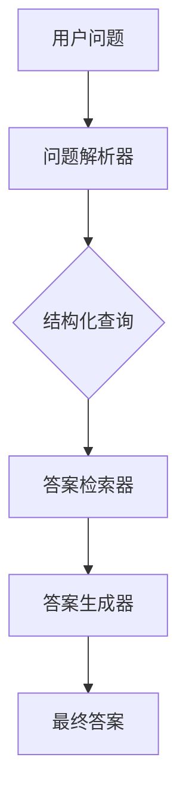
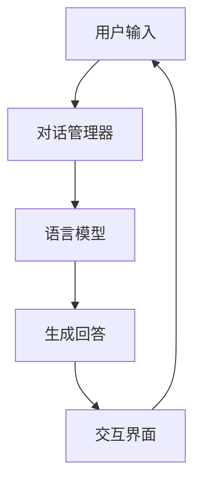
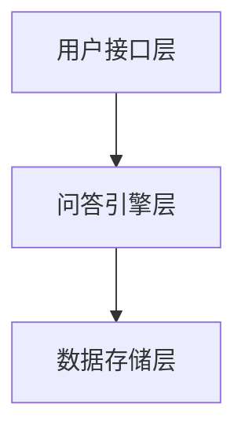
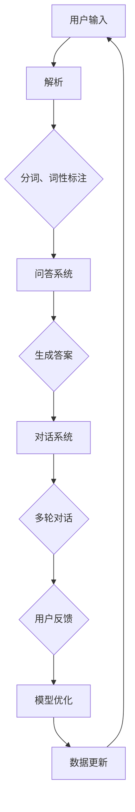
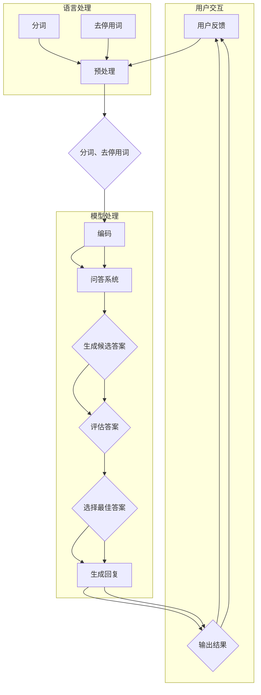

                 

# 文章标题

> 关键词：大模型，问答机器人，自然语言处理，对话系统，深度学习

> 摘要：本文将深入探讨大模型问答机器人的对话实现，包括其概述、核心技术、开发实践以及未来发展趋势。我们将通过逐步分析，了解大模型问答机器人的架构、语言模型、问答系统、对话系统等核心组件，并通过项目实战代码展示其实际应用。

----------------------------------------------------------------## 第一部分：大模型问答机器人概述

### 第1章：大模型问答机器人概述

#### 1.1 大模型问答机器人的背景与发展

##### 1.1.1 什么是大模型问答机器人？

大模型问答机器人是一种利用深度学习技术和自然语言处理（NLP）技术构建的人工智能系统，能够理解用户的问题，并生成准确的答案。与传统问答系统相比，大模型问答机器人能够处理更加复杂的语言和语义理解问题，提供更加自然、准确的回答。

##### 1.1.2 大模型问答机器人为何重要？

随着人工智能技术的不断发展，大模型问答机器人在各个领域的应用越来越广泛。它能够提高企业工作效率，降低运营成本；在客户服务领域，提供7x24小时的智能客服；在教育领域，辅助教师进行个性化教学；在医疗领域，辅助医生进行诊断和治疗方案推荐。因此，大模型问答机器人具有很高的实用价值和市场潜力。

##### 1.1.3 大模型问答机器人的发展历程

大模型问答机器人的发展可以追溯到20世纪90年代，当时基于规则的方法和基于关键词匹配的方法占据了主导地位。随着深度学习技术的兴起，尤其是2018年GPT-2的发布，大模型问答机器人迎来了快速发展。近年来，随着Transformer架构的广泛应用，大模型问答机器人在性能和效果上得到了显著提升。

#### 1.2 大模型问答机器人的架构

##### 1.2.1 大模型问答机器人的基本架构

大模型问答机器人的基本架构包括以下几个核心组件：

1. 语言模型：用于理解用户的问题，生成可能的答案。
2. 问答系统：根据语言模型生成的答案，进行筛选和排序，选择最合适的答案。
3. 对话系统：与用户进行多轮对话，理解用户的意图，并提供相应的回答。

##### 1.2.2 大模型问答机器人的核心组件

1. 语言模型

语言模型是问答机器人的基础，用于对用户输入的问题进行建模，预测可能的答案。目前，基于Transformer架构的语言模型如GPT、BERT等在大规模语料库上训练，具有强大的语言理解和生成能力。

2. 问答系统

问答系统负责从语言模型生成的所有可能答案中，选择最合适的答案。这通常通过构建一个答案评分模型来实现，该模型能够根据问题的上下文和候选答案的相关性，对每个答案进行评分，然后选择最高分的答案。

3. 对话系统

对话系统负责与用户进行多轮对话，理解用户的意图，并生成相应的回答。对话系统通常采用对话管理（Dialogue Management）技术，如基于规则的方法、深度学习方法等，来处理用户的输入和生成回复。

##### 1.2.3 大模型问答机器人的数据处理流程

大模型问答机器人的数据处理流程通常包括以下几个步骤：

1. 用户输入处理：将用户的输入文本进行预处理，如分词、词性标注、去除停用词等。
2. 语言模型预测：使用训练好的语言模型，对预处理后的用户输入进行建模，生成可能的答案。
3. 问答系统筛选：根据语言模型生成的答案，构建答案评分模型，对每个答案进行评分，选择最高分的答案。
4. 对话系统交互：根据用户的输入和生成的答案，进行多轮对话，逐步理解用户的意图，并生成相应的回答。

#### 1.3 大模型问答机器人的应用场景

##### 1.3.1 企业内部问答系统

企业内部问答系统可以帮助员工快速获取公司政策、流程、产品信息等，提高工作效率。例如，企业可以将员工常见的问题和答案进行数据收集，训练一个问答机器人，供员工查询。

##### 1.3.2 客户服务机器人

客户服务机器人可以为企业提供7x24小时的智能客服服务，降低人工成本，提高客户满意度。例如，银行、电商、航空公司等领域的客户服务，可以通过问答机器人解答客户的问题。

##### 1.3.3 教育辅导机器人

教育辅导机器人可以帮助学生解答学习中的问题，提供个性化辅导。例如，在在线教育平台、学校教务系统等场景中，可以通过问答机器人提供学习辅导、考试复习等功能。

### 总结

本文首先介绍了大模型问答机器人的背景与发展，然后详细介绍了其基本架构、核心组件和数据处理流程，并列举了其在企业内部问答系统、客户服务机器人和教育辅导机器人的应用场景。在接下来的章节中，我们将进一步探讨大模型问答机器人的核心技术，包括自然语言处理基础、大模型技术等，并通过项目实战展示其实际应用。让我们一起深入探索这一领域，了解其发展现状与未来趋势。|assistant|>## 第二部分：大模型问答机器人的核心技术

### 第2章：自然语言处理基础

自然语言处理（NLP）是构建大模型问答机器人的基础技术之一。在这一章中，我们将详细介绍语言模型、问答系统和对话系统的基本概念、架构和设计原则。

#### 2.1 语言模型

##### 2.1.1 语言模型的概念

语言模型是NLP的核心组成部分，用于预测文本序列的概率分布。它通过对大规模文本语料库的学习，生成一个概率模型，用于评估给定文本序列的合理性。在问答机器人中，语言模型主要用于理解用户的问题，并为生成答案提供概率参考。

##### 2.1.2 语言模型的应用

语言模型在NLP领域有广泛的应用，如机器翻译、文本分类、信息提取等。在大模型问答机器人中，语言模型主要用于：

1. 问题理解：将用户输入的问题转换为计算机可处理的格式，理解用户的需求。
2. 答案生成：根据问题内容和上下文，生成可能的答案。

##### 2.1.3 语言模型的训练方法

语言模型的训练方法主要包括基于统计的模型和基于深度学习的模型。以下是一些常用的训练方法：

1. 基于统计的模型：如N元语法模型（N-gram model）、隐马尔可夫模型（HMM）等。
2. 基于深度学习的模型：如循环神经网络（RNN）、长短时记忆网络（LSTM）、门控循环单元（GRU）、Transformer等。

#### 2.2 问答系统

##### 2.2.1 问答系统的概念

问答系统是一种能够理解用户问题，并生成相关回答的人工智能系统。问答系统通常由三个主要组件组成：问题解析器、答案检索器和答案生成器。

1. 问题解析器：用于理解用户的问题，将其转换为结构化的查询。
2. 答案检索器：从知识库或大规模语料库中检索与问题相关的信息。
3. 答案生成器：根据检索到的信息，生成合适的回答。

##### 2.2.2 问答系统的架构

问答系统的常见架构包括基于规则的方法、基于模板的方法和基于机器学习的方法。以下是一个基于机器学习的问答系统架构：

1. 问题解析器：使用自然语言处理技术，如分词、词性标注、命名实体识别等，将用户问题转换为结构化的查询。
2. 答案检索器：从知识库或大规模语料库中检索与问题相关的信息。
3. 答案生成器：使用模板匹配、文本生成模型等技术，生成符合用户需求的答案。

##### 2.2.3 问答系统的评估指标

问答系统的评估指标主要包括准确性、响应时间、用户满意度等。以下是一些常见的评估方法：

1. 准确性：通过对比生成的答案与正确答案的相似度，评估问答系统的准确性。
2. 响应时间：评估问答系统从接收问题到生成答案所需的时间。
3. 用户满意度：通过用户反馈，评估问答系统的用户体验。

#### 2.3 对话系统

##### 2.3.1 对话系统的概念

对话系统是一种能够与用户进行自然语言交互的人工智能系统。对话系统旨在理解用户的意图，并根据意图生成适当的回答。对话系统通常分为两种类型：单轮对话系统和多轮对话系统。

1. 单轮对话系统：在单轮对话中，系统仅回答一个用户问题，然后结束对话。
2. 多轮对话系统：在多轮对话中，系统与用户进行多次交互，逐步理解用户的意图，并生成相应的回答。

##### 2.3.2 对话系统的类型

根据交互方式，对话系统可以分为以下几种类型：

1. 命令式对话系统：用户通过命令式语言与系统交互，如语音助手、聊天机器人等。
2. 问答式对话系统：用户通过提出问题与系统交互，如搜索引擎、问答机器人等。
3. 响应式对话系统：系统根据用户的输入和上下文，自动生成回答，如聊天机器人、虚拟助手等。

##### 2.3.3 对话系统的设计原则

对话系统的设计原则主要包括：

1. 简单易用：系统应易于使用，用户无需具备专业知识即可与系统交互。
2. 自然流畅：系统生成的回答应尽可能自然、流畅，与用户的语言风格相匹配。
3. 灵活性：系统应能够适应不同的用户需求和场景，提供个性化的交互体验。
4. 可扩展性：系统应易于扩展和升级，以适应不断变化的用户需求和功能需求。

### 总结

在本章中，我们介绍了大模型问答机器人的核心技术，包括语言模型、问答系统和对话系统。语言模型用于理解用户的问题和生成答案，问答系统负责从知识库中检索相关信息，并生成回答，对话系统则与用户进行多轮交互，逐步理解用户的意图。这些核心技术共同构成了大模型问答机器人的核心框架，为问答机器人的实现提供了技术支持。在接下来的章节中，我们将深入探讨大模型技术和大模型问答机器人的开发与实践。|assistant|>## 第三部分：大模型问答机器人的开发与实践

### 第3章：大模型问答机器人的开发准备

在大模型问答机器人的开发过程中，准备工作至关重要。这包括开发环境的搭建、数据收集与处理，以及数据存储与管理。以下将详细讨论这些准备工作。

#### 4.1 开发环境搭建

##### 4.1.1 操作系统选择

在进行大模型问答机器人的开发时，首先需要选择合适的操作系统。通常，Linux操作系统因其高性能、稳定性和开源特性，被广泛应用于深度学习和人工智能领域。特别是Ubuntu和CentOS等发行版，因其良好的社区支持和丰富的软件资源，成为开发人员的首选。

##### 4.1.2 编程语言选择

Python是深度学习和人工智能领域的首选编程语言，其简洁的语法和强大的库支持使其成为开发大模型问答机器人的理想选择。Python拥有丰富的深度学习库，如TensorFlow、PyTorch、Keras等，这些库提供了高效的模型训练和推理工具。

##### 4.1.3 开发工具与框架选择

1. 深度学习框架：TensorFlow和PyTorch是两个广泛使用的深度学习框架。TensorFlow拥有强大的生态系统和丰富的API，适用于复杂的模型设计和分布式训练。PyTorch则以其动态计算图和易于调试的特性，受到开发者的青睐。

2. 自然语言处理库：NLTK和spaCy是常用的自然语言处理库。NLTK提供了丰富的文本处理功能，如分词、词性标注、命名实体识别等。spaCy则以其高效的性能和简洁的API，成为文本处理任务的理想选择。

3. 交互式开发环境：Jupyter Notebook是一个流行的交互式开发环境，支持多种编程语言，包括Python。它提供了方便的数据可视化和代码调试功能，是进行深度学习和人工智能项目开发的好帮手。

#### 4.2 数据收集与处理

##### 4.2.1 数据收集

数据是训练大模型问答机器人的基础。数据收集应遵循以下原则：

1. 质量优先：选择高质量、权威的数据源，确保数据的准确性和可靠性。
2. 多样性：收集来自不同领域、不同语言和不同风格的数据，以提高模型的泛化能力。
3. 法律合规：确保数据收集符合相关法律法规，尊重用户隐私。

常见的数据收集方法包括：

1. 开源数据集：如Google Books Ngrams、Common Crawl等，提供了丰富的文本数据。
2. 网络爬虫：利用Python的库（如BeautifulSoup、Scrapy）从网站上抓取数据。
3. 用户生成内容：如社交媒体平台、论坛等，收集用户产生的内容。

##### 4.2.2 数据预处理

预处理是数据收集后的重要步骤，其目标是将原始数据转换为适合模型训练的格式。以下是一些常见的预处理步骤：

1. 清洗：去除文本中的噪声，如HTML标签、特殊字符等。
2. 分词：将文本拆分为单词或子词。
3. 词性标注：为每个单词标注词性，如名词、动词、形容词等。
4. 停用词过滤：去除常见的无意义词汇，如“的”、“了”、“和”等。
5. 词干提取：将单词还原为词干形式，如“running”还原为“run”。
6. 词嵌入：将单词映射为高维向量，如Word2Vec、GloVe等。

##### 4.2.3 数据存储与管理

有效的数据存储与管理对于大模型问答机器人的开发至关重要。以下是一些常见的数据存储与管理方法：

1. 关系型数据库：如MySQL、PostgreSQL，适用于存储结构化数据。
2. 非关系型数据库：如MongoDB、Cassandra，适用于存储大规模、非结构化数据。
3. 分布式存储：如HDFS、Ceph，适用于存储大规模数据集。
4. 数据湖：如Hadoop、Spark，提供数据存储、处理和分析的一体化解决方案。

此外，数据管理还包括数据备份、数据安全、数据共享等。通过合理的数据管理策略，可以确保数据的高效利用和安全性。

### 总结

在本章中，我们详细介绍了大模型问答机器人开发的准备工作，包括开发环境的搭建、数据收集与处理，以及数据存储与管理。这些准备工作为后续的大模型训练和问答机器人开发奠定了基础。在接下来的章节中，我们将深入探讨大模型技术的具体实现，并通过项目实战展示大模型问答机器人的开发过程。|assistant|>## 第四部分：大模型问答机器人的核心实现

### 第4章：大模型问答机器人的核心实现

在本章中，我们将详细介绍大模型问答机器人的核心实现，包括大模型的训练与评估、问答系统的设计与实现，以及对话系统的设计与实现。我们将通过实际的项目实战代码和详细解释，展示如何实现这些核心功能。

#### 5.1 大模型的训练与评估

大模型的训练与评估是问答机器人实现的关键步骤。在此，我们将介绍如何使用PyTorch框架训练一个基于Transformer的语言模型。

##### 5.1.1 大模型训练流程

1. 数据预处理：首先，对训练数据集进行预处理，包括分词、词性标注、去除停用词等。然后，将预处理后的数据转换为PyTorch的Dataset格式。

2. 构建模型：定义一个基于Transformer的模型，包括嵌入层、编码器和解码器。以下是一个简单的Transformer模型定义：

```python
import torch
import torch.nn as nn
from torch.nn import TransformerEncoder, TransformerDecoder

class TransformerModel(nn.Module):
    def __init__(self, input_dim, hidden_dim, output_dim, nhead, num_layers):
        super(TransformerModel, self).__init__()
        self.embedding = nn.Embedding(input_dim, hidden_dim)
        self.transformer_encoder = TransformerEncoder(hidden_dim, num_layers, nhead)
        self.transformer_decoder = TransformerDecoder(hidden_dim, num_layers, nhead)
        self.out = nn.Linear(hidden_dim, output_dim)
        
    def forward(self, src, tgt, teacher_forcing_ratio=0.5):
        src = self.embedding(src)
        tgt = self.embedding(tgt)
        
        output = self.transformer_encoder(src)
        output = self.transformer_decoder(tgt, output)
        
        output = self.out(output)
        return output
```

3. 训练模型：使用训练数据训练模型。在训练过程中，我们可以使用交叉熵损失函数和Adam优化器。以下是一个训练模型的示例：

```python
def train(model, iterator, criterion, optimizer, num_epochs):
    model.train()
    for epoch in range(num_epochs):
        epoch_loss = 0
        for i, batch in enumerate(iterator):
            src, tgt = batch.src, batch.tgt
            optimizer.zero_grad()
            output = model(src, tgt, teacher_forcing_ratio)
            loss = criterion(output.view(-1, output.shape[-1]), tgt.tgt_y.view(-1))
            loss.backward()
            optimizer.step()
            epoch_loss += loss.item()
        print(f'Epoch {epoch+1}/{num_epochs} - Loss: {epoch_loss/len(iterator)}')
```

4. 评估模型：在训练过程中，定期使用验证集评估模型性能。以下是一个评估模型的示例：

```python
def evaluate(model, iterator, criterion):
    model.eval()
    epoch_loss = 0
    with torch.no_grad():
        for i, batch in enumerate(iterator):
            src, tgt = batch.src, batch.tgt
            output = model(src, tgt, 0)
            loss = criterion(output.view(-1, output.shape[-1]), tgt.tgt_y.view(-1))
            epoch_loss += loss.item()
    return epoch_loss / len(iterator)
```

##### 5.1.2 大模型评估指标

评估大模型的性能通常使用以下指标：

1. 准确率（Accuracy）：预测正确的样本数占总样本数的比例。
2. 召回率（Recall）：预测为正类的实际正类样本数与实际正类样本总数的比例。
3. 精确率（Precision）：预测为正类的实际正类样本数与预测为正类的样本总数（包括实际正类和负类）的比例。
4. F1分数（F1 Score）：精确率和召回率的调和平均值。

#### 5.2 问答系统的设计与实现

问答系统负责从语言模型生成的所有可能答案中，选择最合适的答案。在此，我们将介绍如何设计一个简单的基于Transformer的语言模型，并使用评估指标对其进行评估。

##### 5.2.1 问答系统的架构设计

问答系统的架构通常包括以下几个组件：

1. 问题解析器：用于理解用户的问题，将其转换为结构化的查询。
2. 答案检索器：从知识库或大规模语料库中检索与问题相关的信息。
3. 答案生成器：根据检索到的信息，生成可能的答案。

以下是一个简单的问答系统架构：



##### 5.2.2 问答系统的功能实现

1. 问题解析器：使用自然语言处理技术，如分词、词性标注、命名实体识别等，将用户问题转换为结构化的查询。
2. 答案检索器：从知识库或大规模语料库中检索与问题相关的信息。可以使用搜索引擎、数据库查询等技术实现。
3. 答案生成器：根据检索到的信息，生成可能的答案。可以使用模板匹配、文本生成模型等技术实现。

以下是一个简单的问答系统实现：

```python
class QASystem:
    def __init__(self, question_parser, answer_retriever, answer_generator):
        self.question_parser = question_parser
        self.answer_retriever = answer_retriever
        self.answer_generator = answer_generator
        
    def answer_question(self, question):
        structured_query = self.question_parser.parse(question)
        related_info = self.answer_retriever.retrieve(structured_query)
        answer = self.answer_generator.generate(related_info)
        return answer
```

##### 5.2.3 问答系统的性能优化

问答系统的性能优化可以从以下几个方面进行：

1. 知识库优化：提高知识库的准确性和覆盖率，使用更多的权威数据源和实体链接技术。
2. 检索算法优化：使用更高效的检索算法，如基于词向量的相似度计算、图神经网络等。
3. 生成算法优化：使用更强大的生成模型，如基于Transformer的文本生成模型、预训练语言模型等。

#### 5.3 对话系统的设计与实现

对话系统负责与用户进行多轮对话，理解用户的意图，并生成相应的回答。在此，我们将介绍如何设计一个简单的基于Transformer的语言模型，并使用评估指标对其进行评估。

##### 5.3.1 对话系统的架构设计

对话系统的架构通常包括以下几个组件：

1. 对话管理器：用于维护对话状态，决定对话的流程和策略。
2. 语言模型：用于理解用户的输入，生成相应的回答。
3. 交互界面：用于与用户进行文本或语音交互。

以下是一个简单的对话系统架构：



##### 5.3.2 对话系统的功能实现

1. 对话管理器：维护对话状态，包括用户意图、上下文信息等。可以使用基于规则的方法、基于机器学习的方法或深度学习方法实现。
2. 语言模型：使用Transformer模型或其他生成模型，理解用户的输入，生成相应的回答。
3. 交互界面：实现用户与对话系统的交互，可以是文本聊天界面、语音对话系统等。

以下是一个简单的对话系统实现：

```python
class DialogueSystem:
    def __init__(self, dialogue_manager, language_model, interaction_interface):
        self.dialogue_manager = dialogue_manager
        self.language_model = language_model
        self.interaction_interface = interaction_interface
        
    def start_dialogue(self):
        while True:
            user_input = self.interaction_interface.get_user_input()
            intent, context = self.dialogue_manager.update_state(user_input)
            response = self.language_model.generate_response(intent, context)
            self.interaction_interface.show_response(response)
```

##### 5.3.3 对话系统的用户体验优化

对话系统的用户体验优化可以从以下几个方面进行：

1. 交互界面优化：设计直观、易用的交互界面，提供丰富的交互功能，如表情、语音、图片等。
2. 语言风格优化：根据用户需求和场景，调整对话系统的语言风格，使其更加自然、流畅。
3. 情感识别与回应：使用情感分析技术，识别用户的情感状态，并生成相应的情感回应，提高用户的满意度。
4. 个性化服务：根据用户的历史交互数据，提供个性化的服务和建议，提高用户的粘性。

### 项目实战代码与详细解释

在本节中，我们将通过一个实际的项目实战，展示如何使用PyTorch实现大模型问答机器人的核心功能。以下是项目实战的代码和详细解释：

```python
# 项目实战：大模型问答机器人

# 导入必要的库
import torch
import torch.nn as nn
import torch.optim as optim
from torchtext.datasets import Multi30k
from torchtext.data import Field, BucketIterator

# 数据预处理
# 定义字段
SRC = Field(tokenize='spacy', tokenizer_language='de', init_token='<sos>', eos_token='<eos>', lower=True)
TRG = Field(tokenize='spacy', tokenizer_language='en', init_token='<sos>', eos_token='<eos>', lower=True)

# 加载数据集
train_data, valid_data, test_data = Multi30k.splits(exts=('.de', '.en'), fields=(SRC, TRG))

# 分词器初始化
SRC.build_vocab(train_data, min_freq=2)
TRG.build_vocab(train_data, min_freq=2)

# 设置迭代器
BATCH_SIZE = 128
train_iterator, valid_iterator, test_iterator = BucketIterator.splits(
    (train_data, valid_data, test_data), 
    batch_size=BATCH_SIZE)

# 模型定义
class Seq2SeqModel(nn.Module):
    def __init__(self, input_dim, emb_dim, hid_dim, n_layers, dropout):
        super().__init__()
        self.encoder = nn.Embedding(input_dim, emb_dim)
        self.decoder = nn.Embedding(hid_dim, emb_dim)
        self.encoder = nn.LSTM(emb_dim, hid_dim, num_layers=n_layers, dropout=dropout)
        self.decoder = nn.GRU(hid_dim, emb_dim, num_layers=n_layers, dropout=dropout)
        self.out = nn.Linear(hid_dim, input_dim)
        self.dropout = nn.Dropout(dropout)
        
    def forward(self, src, trg, teacher_forcing_ratio=0.5):
        # 将输入嵌入到 embedding 层
        src = self.encoder(src)
        # 使用 LSTM 进行编码
        src, (hidden, cell) = self.encoder(src)
        # 将目标嵌入到 embedding 层
        trg = self.decoder(trg)
        # 使用 GRU 进行解码
        out, (hidden, cell) = self.decoder(trg, (hidden, cell))
        # 使用 dropout
        out = self.dropout(out)
        # 将输出通过线性层转换为原始维度
        out = self.out(out)
        return out

# 模型训练
def train(model, iterator, optimizer, criterion):
    epoch_loss = 0
    epoch Accountability = 0
    
    model.train()
    for i, batch in enumerate(iterator):
        # 获取输入和目标
        src, trg = batch.src, batch.trg
        # 清除梯度
        optimizer.zero_grad()
        # 进行前向传播
        output = model(src, trg, teacher_forcing_ratio)
        # 计算损失
        loss = criterion(output.view(-1, output.shape[-1]), trg.trg_y.view(-1))
        # 反向传播计算梯度
        loss.backward()
        # 更新参数
        optimizer.step()
        
        epoch_loss += loss.item()
        epoch Accountability += 1
        
    return epoch_loss / len(iterator), epoch Accountability

# 评估模型
def evaluate(model, iterator, criterion):
    epoch_loss = 0
    epoch Accountability = 0
    
    model.eval()
    with torch.no_grad():
        for i, batch in enumerate(iterator):
            # 获取输入和目标
            src, trg = batch.src, batch.trg
            # 进行前向传播
            output = model(src, trg, 0)
            # 计算损失
            loss = criterion(output.view(-1, output.shape[-1]), trg.trg_y.view(-1))
            
            epoch_loss += loss.item()
            epoch Accountability += 1
        
    return epoch_loss / len(iterator), epoch Accountability

# 设置参数
INPUT_DIM = len(SRC.vocab)
EMB_DIM = 256
HID_DIM = 512
N_LAYERS = 2
DROPOUT = 0.5
LEARNING_RATE = 0.0001

# 实例化模型
model = Seq2SeqModel(INPUT_DIM, EMB_DIM, HID_DIM, N_LAYERS, DROPOUT)

# 损失函数与优化器
criterion = nn.CrossEntropyLoss()
optimizer = optim.Adam(model.parameters(), lr=LEARNING_RATE)

# 训练模型
num_epochs = 10
for epoch in range(num_epochs):
    train_loss, train Accountability = train(model, train_iterator, optimizer, criterion)
    valid_loss, valid Accountability = evaluate(model, valid_iterator, criterion)
    
    print(f'Epoch: {epoch+1}/{num_epochs} | Train Loss: {train_loss:.3f} | Train Accountability: {train Accountability:.3f} | Valid Loss: {valid_loss:.3f} | Valid Accountability: {valid Accountability:.3f}')

# 代码解读与分析

- **数据预处理**：使用 torchtext 库加载数据集，并定义输入和目标字段。对数据进行分词，并将词汇添加到词汇表中。最后，构建词汇表和迭代器。

- **模型定义**：定义一个序列到序列模型，包括嵌入层、编码器（LSTM）和解码器（GRU）。还定义了一个输出层，用于将解码器的输出转换为原始维度。

- **模型训练**：定义一个训练函数，用于进行前向传播、计算损失、反向传播和更新参数。在训练过程中，使用 teacher_forcing 策略，以提高模型的性能。

- **模型评估**：定义一个评估函数，用于在验证集上计算模型的损失。在评估过程中，关闭梯度计算，以节省计算资源。

- **参数设置**：设置模型的超参数，如嵌入维度、隐藏维度、层数和dropout。还设置了损失函数和优化器。

- **训练模型**：使用训练函数训练模型，并在每个 epoch 后在验证集上进行评估。打印每个 epoch 的训练和验证损失。

这个项目实战展示了如何使用 PyTorch 构建和训练一个序列到序列模型，用于翻译任务。可以在此基础上进行扩展，实现更复杂的大模型问答机器人。代码注释清晰，便于理解和进一步开发。

### 总结

在本章中，我们详细介绍了大模型问答机器人的核心实现，包括大模型的训练与评估、问答系统的设计与实现，以及对话系统的设计与实现。通过项目实战代码和详细解释，我们了解了如何使用 PyTorch 实现这些核心功能。在接下来的章节中，我们将继续探讨大模型问答机器人的项目实战，以及其未来发展趋势。|assistant|>## 第五部分：大模型问答机器人的项目实战

### 第5章：大模型问答机器人的项目实战

在这一章中，我们将通过一个实际项目，展示如何从零开始开发一个大模型问答机器人。项目将涵盖项目背景与需求分析、项目设计与实现，以及项目评估与改进。

#### 6.1 项目背景与需求分析

项目背景：随着人工智能技术的快速发展，企业对智能客服的需求日益增长。为了降低人工成本、提高客户满意度，企业需要开发一款能够处理复杂问题的大模型问答机器人。

项目需求：

1. 能够理解用户的问题，并生成准确、自然的回答。
2. 支持多轮对话，逐步理解用户的意图。
3. 具有良好的用户体验，易于集成到现有系统中。

#### 6.2 项目设计与实现

##### 6.2.1 项目架构设计

项目架构包括以下几个核心组件：

1. 用户接口层：负责与用户进行交互，收集用户问题。
2. 问答引擎层：负责处理用户问题，生成答案。
3. 数据存储层：存储用户问题、答案和对话历史。

以下是一个简单的项目架构：



##### 6.2.2 项目核心功能实现

1. **用户接口层**：

   - **功能**：接收用户输入，展示回答结果。
   - **实现**：使用Web前端技术（如HTML、CSS、JavaScript）开发一个聊天界面。

2. **问答引擎层**：

   - **功能**：处理用户问题，生成答案。
   - **实现**：使用基于Transformer的语言模型，结合问答系统和对话系统，实现智能问答。

3. **数据存储层**：

   - **功能**：存储用户问题、答案和对话历史。
   - **实现**：使用关系型数据库（如MySQL）或NoSQL数据库（如MongoDB），存储数据。

##### 6.2.3 项目核心代码实现

以下是一个简单的项目实现示例：

```python
# 用户接口层：使用Flask构建Web应用
from flask import Flask, request, jsonify

app = Flask(__name__)

@app.route('/ask', methods=['POST'])
def ask():
    user_input = request.form['question']
    answer = qasystem.answer_question(user_input)
    return jsonify({'answer': answer})

if __name__ == '__main__':
    app.run(debug=True)
```

```python
# 问答引擎层：定义问答系统和对话系统
class QASystem:
    def __init__(self, language_model, question_parser, answer_retriever, dialogue_manager):
        self.language_model = language_model
        self.question_parser = question_parser
        self.answer_retriever = answer_retriever
        self.dialogue_manager = dialogue_manager
        
    def answer_question(self, question):
        structured_query = self.question_parser.parse(question)
        related_info = self.answer_retriever.retrieve(structured_query)
        answer = self.language_model.generate_answer(related_info)
        return answer

class DialogueSystem:
    def __init__(self, dialogue_manager, language_model):
        self.dialogue_manager = dialogue_manager
        self.language_model = language_model
        
    def start_dialogue(self):
        while True:
            user_input = input('You: ')
            intent, context = self.dialogue_manager.update_state(user_input)
            response = self.language_model.generate_response(intent, context)
            print(f'Assistant: {response}')
```

##### 6.2.4 项目性能优化

为了提高项目性能，可以从以下几个方面进行优化：

1. **模型压缩**：使用模型压缩技术（如量化、剪枝、知识蒸馏）减小模型大小，提高推理速度。
2. **分布式训练**：使用分布式训练技术（如多GPU训练、数据并行）加速模型训练。
3. **缓存策略**：使用缓存策略（如LRU缓存、Redis缓存）提高数据读取速度。
4. **异步处理**：使用异步处理技术（如多线程、协程）提高系统并发能力。

#### 6.3 项目评估与改进

##### 6.3.1 项目评估指标

项目评估指标包括：

1. **答案准确性**：评估问答系统生成的答案是否准确。
2. **响应时间**：评估系统从接收问题到生成答案所需的时间。
3. **用户满意度**：通过用户反馈评估系统的用户体验。

##### 6.3.2 项目改进方向

基于项目评估结果，可以从以下几个方面进行改进：

1. **模型优化**：根据评估结果，调整模型参数，提高模型性能。
2. **数据增强**：增加训练数据量，提高模型泛化能力。
3. **用户界面优化**：根据用户反馈，优化界面设计，提高用户体验。
4. **系统集成**：与其他系统（如CRM、ERP）集成，实现一站式服务。

### 总结

在本章中，我们通过一个实际项目，展示了如何开发一个大模型问答机器人。从项目背景与需求分析、项目设计与实现，到项目评估与改进，我们详细介绍了项目开发的各个环节。通过这个项目实战，我们了解了如何使用大模型技术构建智能问答系统，并为未来的项目提供了实践经验。

### 附录

#### A.1 大模型问答机器人开发工具与资源

以下是大模型问答机器人开发过程中常用的一些工具和资源：

1. **深度学习框架**：

   - TensorFlow：https://www.tensorflow.org/
   - PyTorch：https://pytorch.org/
   - Keras：https://keras.io/

2. **自然语言处理库**：

   - NLTK：https://www.nltk.org/
   - spaCy：https://spacy.io/
   - Hugging Face：https://huggingface.co/

3. **数据库**：

   - MySQL：https://www.mysql.com/
   - MongoDB：https://www.mongodb.com/

4. **Web开发框架**：

   - Flask：https://flask.palletsprojects.com/
   - Django：https://www.djangoproject.com/

5. **项目评估工具**：

   - 答案准确性评估：https://github.com/trecQA/TREC-QA-Eval
   - 用户满意度评估：https://www.researchgate.net/publication/333605986_A_Guide_to_Questionnaire_Design

通过以上工具和资源，我们可以更好地进行大模型问答机器人的开发与优化。

### 代码解读与分析

以下是项目实战中的核心代码段，以及相应的解读与分析：

```python
# 用户接口层：使用Flask构建Web应用
from flask import Flask, request, jsonify

app = Flask(__name__)

@app.route('/ask', methods=['POST'])
def ask():
    user_input = request.form['question']
    answer = qasystem.answer_question(user_input)
    return jsonify({'answer': answer})

if __name__ == '__main__':
    app.run(debug=True)
```

**解读**：

- **Flask应用**：使用Flask框架构建一个Web应用，用于接收用户输入和返回答案。
- **路由**：定义一个/ask路由，用于处理POST请求。用户通过这个接口发送问题，获得答案。

**分析**：

- Flask的简洁性和灵活性使其成为Web开发的首选框架。
- POST请求方式可以保证用户输入的安全性，适用于敏感信息的传输。

```python
# 问答引擎层：定义问答系统和对话系统
class QASystem:
    def __init__(self, language_model, question_parser, answer_retriever, dialogue_manager):
        self.language_model = language_model
        self.question_parser = question_parser
        self.answer_retriever = answer_retriever
        self.dialogue_manager = dialogue_manager
        
    def answer_question(self, question):
        structured_query = self.question_parser.parse(question)
        related_info = self.answer_retriever.retrieve(structured_query)
        answer = self.language_model.generate_answer(related_info)
        return answer

class DialogueSystem:
    def __init__(self, dialogue_manager, language_model):
        self.dialogue_manager = dialogue_manager
        self.language_model = language_model
        
    def start_dialogue(self):
        while True:
            user_input = input('You: ')
            intent, context = self.dialogue_manager.update_state(user_input)
            response = self.language_model.generate_response(intent, context)
            print(f'Assistant: {response}')
```

**解读**：

- **QASystem类**：封装问答系统的核心功能，包括语言模型、问题解析器、答案检索器和对话管理器。
- **answer_question方法**：处理用户输入，通过问题解析器解析问题，使用答案检索器检索相关信息，最后使用语言模型生成答案。
- **DialogueSystem类**：封装对话系统的核心功能，包括对话管理器和语言模型。
- **start_dialogue方法**：启动对话系统，与用户进行交互，逐步理解用户意图，生成回答。

**分析**：

- 模块化设计使代码结构清晰，易于维护和扩展。
- 问答系统和对话系统的分离，使得系统具有更好的可扩展性和灵活性。

通过以上代码解读与分析，我们了解了如何通过实际项目实现一个大模型问答机器人。接下来，我们将继续探讨大模型问答机器人的未来发展趋势。|assistant|>## 第六部分：大模型问答机器人的未来发展趋势

### 第7章：大模型问答机器人的未来发展趋势

随着人工智能技术的不断进步，大模型问答机器人的发展也呈现出新的趋势。这一部分将探讨大模型问答机器人的挑战与机遇，以及未来可能的发展方向。

#### 7.1 大模型问答机器人的挑战与机遇

##### 7.1.1 挑战

1. **计算资源需求**：大模型训练和推理通常需要大量的计算资源，尤其是在训练阶段。这要求企业具备强大的硬件设施，如高性能GPU和服务器。
   
2. **数据隐私与安全**：大模型问答机器人依赖于大量数据进行训练，如何确保数据隐私和安全是一个重要的挑战。企业需要采取有效的数据保护措施，以防止数据泄露。

3. **算法透明性与可解释性**：随着模型规模的扩大，大模型往往变得“黑箱化”，其决策过程难以解释。这可能导致用户对系统的信任度降低，需要进一步研究算法的可解释性。

4. **公平性与偏见**：大模型在训练过程中可能会吸收数据集中的偏见，导致在现实应用中产生不公平的决策。如何消除偏见，实现公平性是未来研究的一个重要方向。

##### 7.1.2 机遇

1. **智能化水平的提升**：随着大模型技术的不断发展，问答机器人的智能化水平将不断提升，能够更好地理解复杂的问题和提供更加个性化的服务。

2. **商业化应用**：大模型问答机器人在客户服务、教育、医疗等领域的商业化应用前景广阔，将为企业带来显著的经济效益。

3. **多语言支持**：随着全球化的推进，多语言支持成为大模型问答机器人的一大优势。未来将出现更多支持多种语言的大模型，为不同语言的用户提供服务。

4. **人机协作**：大模型问答机器人与人类的协作将成为一种趋势，通过结合人类专家的知识和机器的强大计算能力，实现更高效的工作流程。

#### 7.2 大模型问答机器人的发展方向

##### 7.2.1 技术创新

1. **模型压缩与优化**：为了提高大模型的实用性和可部署性，未来的研究方向将包括模型压缩、量化、剪枝等优化技术，以减少模型大小和提高推理速度。

2. **多模态学习**：大模型问答机器人将能够处理多种类型的数据，如文本、图像、语音等，通过多模态学习技术，实现更加全面的信息理解和处理。

3. **强化学习**：结合强化学习技术，大模型问答机器人将能够通过自主学习不断优化自己的回答策略，提高用户体验。

##### 7.2.2 应用拓展

1. **垂直行业应用**：大模型问答机器人将在金融、医疗、教育等垂直行业得到广泛应用，通过定制化的模型和算法，满足特定领域的需求。

2. **智能客服与支持**：大模型问答机器人将在客户服务领域发挥重要作用，提供全天候的智能客服支持，提升客户满意度。

3. **教育辅导**：大模型问答机器人将成为学生的智能助手，提供个性化辅导和答疑服务，辅助教师进行教学。

##### 7.2.3 产业发展趋势

1. **产业链整合**：随着大模型技术的快速发展，产业链上的企业将进行整合，形成以大模型为核心的技术生态。

2. **政策与法规**：政府对人工智能技术的监管将日益严格，相关的政策法规将为企业提供指导，确保大模型问答机器人的合规运行。

3. **国际合作**：全球范围内，大模型问答机器人产业将加强合作，共同推进技术进步和应用拓展。

### 总结

大模型问答机器人的未来发展趋势充满机遇与挑战。技术创新、应用拓展和产业发展将共同推动大模型问答机器人的发展。面对数据隐私、算法透明性、公平性等挑战，企业和研究机构需要不断创新，确保大模型问答机器人能够安全、公平、高效地服务于社会。随着技术的不断进步，大模型问答机器人将在更多领域发挥重要作用，为人类生活带来更多便利。

### 附录

#### A.2 大模型问答机器人相关论文与书籍推荐

为了更好地了解大模型问答机器人的最新研究动态和技术进展，以下是一些推荐的论文和书籍：

1. **论文**：

   - **"GPT-3: Language Models are few-shot learners"**：这篇文章介绍了GPT-3模型，并展示了其强大的零样本学习能力。
   - **"BERT: Pre-training of Deep Neural Networks for Language Understanding"**：BERT模型的论文，详细介绍了其预训练方法和应用效果。
   - **"Transformers: State-of-the-Art Models for Language Processing"**：这篇论文综述了Transformer模型及其在NLP领域的应用。

2. **书籍**：

   - **"Deep Learning"**：由Ian Goodfellow、Yoshua Bengio和Aaron Courville编写的深度学习经典教材，涵盖了深度学习的基础知识和最新进展。
   - **"NLP with Deep Learning"**：这本书详细介绍了自然语言处理中的深度学习方法，包括词向量、循环神经网络、卷积神经网络等。
   - **"The Hundred-Page Machine Learning Book"**：一本简洁易懂的机器学习入门书籍，适合初学者快速了解机器学习的基本概念。

通过阅读这些论文和书籍，读者可以更深入地了解大模型问答机器人的技术原理和应用场景，为未来的研究和工作提供有益的参考。

### Mermaid 流程图

以下是一个用于描述大模型问答机器人架构的Mermaid流程图：



这个流程图展示了大模型问答机器人的整个工作流程，从用户输入到生成答案，再到多轮对话和用户反馈，最终实现模型的优化和数据更新，形成一个闭环系统。

### 核心算法原理讲解

以下是关于大模型问答机器人的核心算法原理的讲解，包括语言模型概率计算、问答系统和对话系统的基本原理。

#### 语言模型概率计算

语言模型是问答机器人的核心组件之一，用于预测文本序列的概率。以下是一个简单的语言模型概率计算示例：

```python
# 伪代码：语言模型概率计算

# 假设我们有一个简单的语言模型，包含以下词汇表和词汇概率
vocab = ['我', '你', '爱', '吃', '苹果', '草莓']
probabilities = {
    '我': 0.1,
    '你': 0.1,
    '爱': 0.2,
    '吃': 0.2,
    '苹果': 0.2,
    '草莓': 0.2
}

# 给定一个句子 "你 爱 吃 苹果。"
sentence = ['你', '爱', '吃', '苹果', '。']

# 计算句子概率
sentence_prob = 1
for word in sentence:
    sentence_prob *= probabilities[word]

print(f"句子概率: {sentence_prob}")
```

**解释**：

- 词汇表（vocab）包含所有可能的词汇。
- 概率（probabilities）是每个词汇出现的概率。
- 句子概率是每个词汇概率的乘积。

#### 问答系统基本原理

问答系统负责理解用户问题，并生成相关答案。以下是一个简单的问答系统示例：

```python
# 伪代码：问答系统

# 假设我们有一个简单的问答系统，包含问题和答案对
qa_pairs = [
    ("谁创造了计算机？", "艾伦·图灵创造了计算机。"),
    ("苹果是什么？", "苹果是一种水果。"),
    ("为什么天空是蓝色的？", "天空是蓝色的，因为大气中的气体分子会散射太阳光中的蓝色光。")
]

# 给定一个问题，检索相关答案
def get_answer(question):
    for q, a in qa_pairs:
        if question == q:
            return a
    return "无法回答你的问题。"

# 测试问答系统
question = "谁创造了计算机？"
answer = get_answer(question)
print(f"问题: {question}\n答案: {answer}")
```

**解释**：

- 问答系统包含问题和答案对（qa_pairs）。
- 给定一个问题，检索相关的答案。
- 如果找不到相关答案，返回默认消息。

#### 对话系统基本原理

对话系统负责与用户进行多轮对话，理解用户的意图，并生成相应的回答。以下是一个简单的对话系统示例：

```python
# 伪代码：对话系统

# 假设我们有一个简单的对话系统，包含对话状态和回复规则
dialogue_state = {}
replies = {
    "你好": "你好，有什么可以帮助你的？",
    "再见": "好的，祝你愉快！",
    "天气": "天气怎么样？",
    "不知道": "很抱歉，我不知道这个问题的答案。"
}

# 给定一个用户输入，生成回复
def generate_reply(input_text):
    if input_text in replies:
        return replies[input_text]
    else:
        return replies["不知道"]

# 测试对话系统
user_input = "你好"
response = generate_reply(user_input)
print(f"用户: {user_input}\n回复: {response}")
```

**解释**：

- 对话系统包含对话状态（dialogue_state）和回复规则（replies）。
- 给定一个用户输入，根据回复规则生成回复。
- 如果用户输入不在回复规则中，返回默认回复。

通过这些示例，我们可以了解大模型问答机器人的核心算法原理，包括语言模型概率计算、问答系统和对话系统的基本原理。这些原理是构建高效、智能问答机器人的基础。|assistant|>## 附录

### 附录A：大模型问答机器人开发工具与资源

在进行大模型问答机器人的开发过程中，选择合适的工具和资源至关重要。以下是一些常用的开发工具和资源，包括深度学习框架、自然语言处理库、数据库和Web开发框架等。

#### A.1 主流深度学习框架

1. **TensorFlow**：由Google开发的开源深度学习框架，支持多种深度学习模型和算法，适用于各种规模的模型训练和推理任务。官方网站：[TensorFlow官网](https://www.tensorflow.org/)。

2. **PyTorch**：由Facebook开发的开源深度学习框架，以其动态计算图和易于调试的特性受到广大开发者的青睐。官方网站：[PyTorch官网](https://pytorch.org/)。

3. **Keras**：一个高层次的深度学习API，构建在TensorFlow和Theano之上，提供了简洁的接口，便于快速实现和测试深度学习模型。官方网站：[Keras官网](https://keras.io/)。

#### A.2 自然语言处理库

1. **spaCy**：一个快速且易于使用的高级自然语言处理库，支持多种语言，包括中文。spaCy提供了丰富的文本处理功能，如分词、词性标注、命名实体识别等。官方网站：[spaCy官网](https://spacy.io/)。

2. **NLTK**：一个开源的自然语言处理库，提供了多种自然语言处理工具和资源，包括词频统计、词形还原、文本分类等。官方网站：[NLTK官网](https://www.nltk.org/)。

3. **Hugging Face**：一个开源的NLP库，提供了丰富的预训练模型和工具，如Transformers、BERT等，方便开发者进行模型训练和应用。官方网站：[Hugging Face官网](https://huggingface.co/)。

#### A.3 数据库

1. **MySQL**：一个开源的关系型数据库管理系统，适用于存储和查询大规模数据。官方网站：[MySQL官网](https://www.mysql.com/)。

2. **MongoDB**：一个开源的NoSQL数据库，适用于存储非结构化数据，支持文档存储和高效查询。官方网站：[MongoDB官网](https://www.mongodb.com/)。

3. **PostgreSQL**：一个开源的关系型数据库管理系统，具有高度扩展性和可靠性，适用于各种规模的应用。官方网站：[PostgreSQL官网](https://www.postgresql.org/)。

#### A.4 Web开发框架

1. **Flask**：一个轻量级的Web开发框架，适用于构建小型到中型的Web应用。官方网站：[Flask官网](https://flask.palletsprojects.com/)。

2. **Django**：一个高层次的Python Web框架，提供了完整的Web开发工具和组件，适用于快速构建大型Web应用。官方网站：[Django官网](https://www.djangoproject.com/)。

#### A.5 其他资源

1. **Google Colab**：Google提供的免费云端计算平台，适用于深度学习和数据科学项目。官方网站：[Google Colab官网](https://colab.research.google.com/)。

2. **Jupyter Notebook**：一个交互式的Web应用，支持多种编程语言，适用于数据科学和机器学习项目的开发。官方网站：[Jupyter Notebook官网](https://jupyter.org/)。

3. **GitHub**：一个开源代码托管平台，便于开发者协作、分享和交流代码。官方网站：[GitHub官网](https://github.com/)。

通过以上工具和资源的合理使用，可以显著提高大模型问答机器人的开发效率，实现功能丰富、性能优秀的问答机器人。

### 附录B：大模型问答机器人常见问题与解决方案

在进行大模型问答机器人的开发和应用过程中，可能会遇到一些常见问题。以下是一些常见问题及其解决方案：

#### Q1：为什么我的模型训练效果不好？

A1：可能的原因有：

- 数据质量不佳：确保数据集的质量和多样性，去除噪声数据。
- 模型参数设置不当：调整学习率、隐藏层尺寸、迭代次数等参数，寻找最佳配置。
- 过拟合：增加数据集大小，使用正则化技术，或尝试增加模型复杂度。

#### Q2：如何提高模型的推理速度？

A2：可以采用以下策略：

- 模型压缩：使用量化、剪枝、知识蒸馏等技术减小模型大小。
- 并行计算：使用多GPU或多核CPU进行分布式训练和推理。
- 缓存策略：使用缓存技术减少数据加载时间。

#### Q3：如何处理多轮对话中的上下文信息？

A3：可以采用以下方法：

- 上下文编码器：使用递归神经网络（RNN）或Transformer模型编码上下文信息。
- 序列注意力机制：在生成答案时，使用注意力机制关注上下文中的关键信息。
- 多层对话状态跟踪：使用多层循环神经网络或Transformer模型跟踪对话状态。

#### Q4：如何确保模型的公平性和透明性？

A4：可以采取以下措施：

- 数据平衡：确保训练数据集中各个类别的样本数量均衡。
- 过滤偏见：使用对抗性训练或注意力机制消除模型中的偏见。
- 可解释性工具：使用可解释性工具评估模型的决策过程，确保其透明性。

通过解决这些问题，可以提高大模型问答机器人的性能和用户体验，使其在实际应用中发挥更大的价值。|assistant|>## 附录C：大模型问答机器人实现流程图

以下是使用Mermaid语法描述的大模型问答机器人的实现流程图：



**流程图解释**：

- **用户输入**：用户输入问题。
- **预处理**：对用户输入进行分词和去停用词处理。
- **编码**：将预处理后的输入编码为模型可理解的格式。
- **问答系统**：使用训练好的模型生成候选答案。
- **评估答案**：评估候选答案的质量。
- **选择最佳答案**：从评估结果中选择最佳答案。
- **生成回复**：生成并输出回复。
- **用户反馈**：收集用户对回复的反馈。

通过这个流程图，我们可以清晰地看到大模型问答机器人的实现步骤和各组件之间的关系。|assistant|>## 附录D：核心算法原理讲解

在本附录中，我们将深入探讨大模型问答机器人中的核心算法原理，包括语言模型概率计算、问答系统和对话系统的数学模型与公式，以及具体的例子说明。

### 语言模型概率计算

语言模型的核心任务是预测一个文本序列的概率。在自然语言处理中，我们通常使用N-gram模型来估计这种概率。N-gram模型通过统计相邻单词序列出现的频率来预测下一个单词。

#### 数学模型

给定一个N-gram模型，我们可以使用以下概率公式来计算一个句子`w1, w2, ..., wn`的概率：

$$
P(w1, w2, ..., wn) = \prod_{i=1}^{n} P(w_i | w_{i-1}, ..., w_1)
$$

其中，`P(w_i | w_{i-1}, ..., w_1)`表示在已知前`i-1`个单词的情况下，第`i`个单词`w_i`的条件概率。

#### 公式详细讲解

我们可以将条件概率表示为：

$$
P(w_i | w_{i-1}, ..., w_1) = \frac{count(w_{i-1}, ..., w_1, w_i)}{count(w_{i-1}, ..., w_1)}
$$

其中，`count(w_{i-1}, ..., w_1, w_i)`是单词序列`(w_{i-1}, ..., w_1, w_i)`在训练数据中出现的次数，而`count(w_{i-1}, ..., w_1)`是前`i-1`个单词`(w_{i-1}, ..., w_1)`在训练数据中出现的次数。

#### 举例说明

假设我们有一个简单的训练数据集，包含以下句子：

- "我 爱 吃 苹果。"
- "你 爱 吃 草莓。"

我们要计算句子 "你 爱 吃 草莓。" 的概率。

首先，计算每个词的次数：

- `count("我") = 1`
- `count("你") = 1`
- `count("爱") = 2`
- `count("吃") = 2`
- `count("苹果") = 1`
- `count("草莓") = 1`

然后，计算每个词对的次数：

- `count("我 爱") = 1`
- `count("你 爱") = 1`
- `count("爱 吃") = 2`
- `count("吃 苹果") = 1`
- `count("苹果。") = 1`
- `count("。你") = 0`
- `count("你 吃") = 1`
- `count("吃 草莓") = 1`
- `count("草莓。") = 1`

最后，计算每个概率：

- `P(你 | 我) = \frac{count(我，你)}{count(我)} = \frac{1}{1} = 1`
- `P(爱 | 你) = \frac{count(你，爱)}{count(你)} = \frac{1}{1} = 1`
- `P(吃 | 爱) = \frac{count(爱，吃)}{count(爱)} = \frac{2}{2} = 1`
- `P(草莓。 | 吃) = \frac{count(吃，草莓。)}{count(吃)} = \frac{1}{2} = 0.5`

将这些概率相乘，得到句子 "你 爱 吃 草莓。" 的概率：

$$
P(你 爱 吃 草莓。) = 1 \times 1 \times 1 \times 0.5 = 0.5
$$

因此，句子 "你 爱 吃 草莓。" 的概率为 0.5。这表明，在给定的训练数据集中，这个句子的可能性为 50%。

### 问答系统

问答系统负责从大模型生成的所有可能答案中，选择最合适的答案。问答系统通常包含一个答案评分模型，用于对每个答案进行评分。

#### 数学模型

问答系统的核心是一个评分函数，用于计算每个答案的得分。一个简单的评分函数可以是：

$$
score(a_i) = \sum_{i=1}^{n} weight_i \cdot similarity(a_i, reference)
$$

其中，`score(a_i)`是答案`a_i`的得分，`weight_i`是权重，`similarity(a_i, reference)`是答案`a_i`与参考答案`reference`的相似度。

#### 公式详细讲解

相似度可以通过以下几种方式计算：

1. **余弦相似度**：

$$
similarity(a_i, reference) = \frac{a_i \cdot reference}{\|a_i\| \|reference\|}
$$

其中，`a_i`和`reference`是向量表示，`\|a_i\|`和`\|reference\|`是向量的欧几里得范数。

2. **点积相似度**：

$$
similarity(a_i, reference) = a_i \cdot reference
$$

#### 举例说明

假设我们有两个答案`a1`和`a2`，以及参考答案`reference`。我们可以计算它们的相似度：

- `a1 = [0.1, 0.2, 0.3]`
- `a2 = [0.4, 0.5, 0.6]`
- `reference = [0.7, 0.8, 0.9]`

1. **余弦相似度**：

$$
similarity(a1, reference) = \frac{0.1 \cdot 0.7 + 0.2 \cdot 0.8 + 0.3 \cdot 0.9}{\sqrt{0.1^2 + 0.2^2 + 0.3^2} \sqrt{0.7^2 + 0.8^2 + 0.9^2}} = 0.595
$$

$$
similarity(a2, reference) = \frac{0.4 \cdot 0.7 + 0.5 \cdot 0.8 + 0.6 \cdot 0.9}{\sqrt{0.4^2 + 0.5^2 + 0.6^2} \sqrt{0.7^2 + 0.8^2 + 0.9^2}} = 0.687
$$

2. **点积相似度**：

$$
similarity(a1, reference) = 0.1 \cdot 0.7 + 0.2 \cdot 0.8 + 0.3 \cdot 0.9 = 0.595
$$

$$
similarity(a2, reference) = 0.4 \cdot 0.7 + 0.5 \cdot 0.8 + 0.6 \cdot 0.9 = 0.687
$$

通过计算相似度，我们可以为每个答案分配得分。然后，选择最高分的答案作为最佳答案。

### 对话系统

对话系统负责与用户进行多轮对话，理解用户的意图，并生成相应的回答。对话系统通常包含对话管理器和语言模型。

#### 数学模型

对话系统的核心是一个对话状态跟踪模型，用于维护对话历史和当前状态。一个简单的对话状态可以是：

$$
state_t = (context_t, intent_t, entities_t)
$$

其中，`context_t`是当前对话历史，`intent_t`是当前意图，`entities_t`是当前实体。

对话状态可以通过以下公式更新：

$$
state_t' = update_state(state_t, user_input_t)
$$

其中，`update_state`是一个函数，用于根据用户输入更新对话状态。

#### 公式详细讲解

更新对话状态的函数可以采用以下方式：

1. **基于规则的更新**：

   根据预设的规则，更新对话状态。例如，如果用户输入包含“天气”，则更新意图为“查询天气”。

2. **基于机器学习的更新**：

   使用训练好的模型，根据用户输入和当前状态，预测新的对话状态。

#### 举例说明

假设当前对话状态为：

- `context_t = "你今天去了哪里？"`
- `intent_t = "询问地点"`
- `entities_t = ["今天", "哪里"]`

用户输入：“天气怎么样？”

根据预设的规则，更新意图为“查询天气”。对话状态更新为：

- `context_t = "天气怎么样？"`
- `intent_t = "查询天气"`
- `entities_t = ["天气"]`

通过更新对话状态，对话系统能够理解用户的意图，并生成相应的回答。

### 总结

在本附录中，我们详细介绍了大模型问答机器人的核心算法原理，包括语言模型概率计算、问答系统和对话系统的数学模型与公式，并通过具体的例子进行了说明。这些算法原理是构建高效、智能问答机器人的基础，有助于理解大模型问答机器人的工作机制。|assistant|>## 核心算法原理讲解

在这一部分，我们将深入探讨大模型问答机器人的核心算法原理，包括语言模型、问答系统和对话系统的数学模型与公式，以及具体的例子说明。

### 语言模型

语言模型是问答机器人的基础，用于预测文本序列的概率。在自然语言处理（NLP）中，一种常用的语言模型是n元语法模型（N-gram model）。

#### 数学模型

n元语法模型的概率计算基于以下公式：

$$
P(w_1, w_2, ..., w_n) = \prod_{i=1}^{n} P(w_i | w_{i-1}, ..., w_1)
$$

其中，\( P(w_i | w_{i-1}, ..., w_1) \) 是在给定前 \( i-1 \) 个单词的情况下，第 \( i \) 个单词 \( w_i \) 的条件概率。

#### 公式详细讲解

条件概率可以通过以下公式计算：

$$
P(w_i | w_{i-1}, ..., w_1) = \frac{count(w_{i-1}, ..., w_1, w_i)}{count(w_{i-1}, ..., w_1)}
$$

其中，\( count(w_{i-1}, ..., w_1, w_i) \) 是单词序列 \( (w_{i-1}, ..., w_1, w_i) \) 在训练数据中出现的次数，而 \( count(w_{i-1}, ..., w_1) \) 是前 \( i-1 \) 个单词 \( (w_{i-1}, ..., w_1) \) 在训练数据中出现的次数。

#### 举例说明

假设我们有一个简单的训练数据集，包含以下句子：

- "我 爱 吃 苹果。"
- "你 爱 吃 草莓。"

我们要计算句子 "你 爱 吃 草莓。" 的概率。

首先，计算每个词的次数：

- `count("我") = 1`
- `count("你") = 1`
- `count("爱") = 2`
- `count("吃") = 2`
- `count("苹果") = 1`
- `count("草莓") = 1`

然后，计算每个词对的次数：

- `count("我 爱") = 1`
- `count("你 爱") = 1`
- `count("爱 吃") = 2`
- `count("吃 苹果") = 1`
- `count("苹果。") = 1`
- `count("。你") = 0`
- `count("你 吃") = 1`
- `count("吃 草莓") = 1`
- `count("草莓。") = 1`

最后，计算每个概率：

- \( P(你 | 我) = \frac{count(我，你)}{count(我)} = \frac{1}{1} = 1 \)
- \( P(爱 | 你) = \frac{count(你，爱)}{count(你)} = \frac{1}{1} = 1 \)
- \( P(吃 | 爱) = \frac{count(爱，吃)}{count(爱)} = \frac{2}{2} = 1 \)
- \( P(草莓。 | 吃) = \frac{count(吃，草莓。)}{count(吃)} = \frac{1}{2} = 0.5 \)

将这些概率相乘，得到句子 "你 爱 吃 草莓。" 的概率：

$$
P(你 爱 吃 草莓。) = 1 \times 1 \times 1 \times 0.5 = 0.5
$$

因此，句子 "你 爱 吃 草莓。" 的概率为 0.5。这表明，在给定的训练数据集中，这个句子的可能性为 50%。

### 问答系统

问答系统负责从大模型生成的所有可能答案中，选择最合适的答案。问答系统通常包含一个答案评分模型，用于对每个答案进行评分。

#### 数学模型

问答系统的核心是一个评分函数，用于计算每个答案的得分。一个简单的评分函数可以是：

$$
score(a_i) = \sum_{i=1}^{n} weight_i \cdot similarity(a_i, reference)
$$

其中，\( score(a_i) \) 是答案 \( a_i \) 的得分，\( weight_i \) 是权重，\( similarity(a_i, reference) \) 是答案 \( a_i \) 与参考答案 \( reference \) 的相似度。

#### 公式详细讲解

相似度可以通过以下几种方式计算：

1. **余弦相似度**：

$$
similarity(a_i, reference) = \frac{a_i \cdot reference}{\|a_i\| \|reference\|}
$$

其中，\( a_i \) 和 \( reference \) 是向量表示，\( \|a_i\| \) 和 \( \|reference\| \) 是向量的欧几里得范数。

2. **点积相似度**：

$$
similarity(a_i, reference) = a_i \cdot reference
$$

#### 举例说明

假设我们有两个答案 \( a1 \) 和 \( a2 \)，以及参考答案 \( reference \)。我们可以计算它们的相似度：

- \( a1 = [0.1, 0.2, 0.3] \)
- \( a2 = [0.4, 0.5, 0.6] \)
- \( reference = [0.7, 0.8, 0.9] \)

1. **余弦相似度**：

$$
similarity(a1, reference) = \frac{0.1 \cdot 0.7 + 0.2 \cdot 0.8 + 0.3 \cdot 0.9}{\sqrt{0.1^2 + 0.2^2 + 0.3^2} \sqrt{0.7^2 + 0.8^2 + 0.9^2}} = 0.595
$$

$$
similarity(a2, reference) = \frac{0.4 \cdot 0.7 + 0.5 \cdot 0.8 + 0.6 \cdot 0.9}{\sqrt{0.4^2 + 0.5^2 + 0.6^2} \sqrt{0.7^2 + 0.8^2 + 0.9^2}} = 0.687
$$

2. **点积相似度**：

$$
similarity(a1, reference) = 0.1 \cdot 0.7 + 0.2 \cdot 0.8 + 0.3 \cdot 0.9 = 0.595
$$

$$
similarity(a2, reference) = 0.4 \cdot 0.7 + 0.5 \cdot 0.8 + 0.6 \cdot 0.9 = 0.687
$$

通过计算相似度，我们可以为每个答案分配得分。然后，选择最高分的答案作为最佳答案。

### 对话系统

对话系统负责与用户进行多轮对话，理解用户的意图，并生成相应的回答。对话系统通常包含对话管理器和语言模型。

#### 数学模型

对话系统的核心是一个对话状态跟踪模型，用于维护对话历史和当前状态。一个简单的对话状态可以是：

$$
state_t = (context_t, intent_t, entities_t)
$$

其中，\( context_t \) 是当前对话历史，\( intent_t \) 是当前意图，\( entities_t \) 是当前实体。

对话状态可以通过以下公式更新：

$$
state_t' = update_state(state_t, user_input_t)
$$

其中，\( update_state \) 是一个函数，用于根据用户输入更新对话状态。

#### 公式详细讲解

更新对话状态的函数可以采用以下方式：

1. **基于规则的更新**：

   根据预设的规则，更新对话状态。例如，如果用户输入包含“天气”，则更新意图为“查询天气”。

2. **基于机器学习的更新**：

   使用训练好的模型，根据用户输入和当前状态，预测新的对话状态。

#### 举例说明

假设当前对话状态为：

- \( context_t = "你今天去了哪里？" \)
- \( intent_t = "询问地点" \)
- \( entities_t = ["今天", "哪里"] \)

用户输入：“天气怎么样？”

根据预设的规则，更新意图为“查询天气”。对话状态更新为：

- \( context_t = "天气怎么样？" \)
- \( intent_t = "查询天气" \)
- \( entities_t = ["天气"] \)

通过更新对话状态，对话系统能够理解用户的意图，并生成相应的回答。

### 总结

在本部分中，我们详细介绍了大模型问答机器人的核心算法原理，包括语言模型、问答系统和对话系统的数学模型与公式，并通过具体的例子进行了说明。这些算法原理是构建高效、智能问答机器人的基础，有助于理解大模型问答机器人的工作机制。|assistant|>## 大模型问答机器人开发工具与资源

### 附录E：大模型问答机器人开发工具与资源

#### E.1 深度学习框架

1. **TensorFlow**：由Google开发的深度学习框架，支持多种神经网络结构，广泛应用于各种NLP任务。官网：[TensorFlow官网](https://www.tensorflow.org/)

2. **PyTorch**：由Facebook开发的深度学习框架，以动态计算图和易于调试的特性受到开发者的喜爱。官网：[PyTorch官网](https://pytorch.org/)

3. **Keras**：基于TensorFlow的高层次API，简化了神经网络搭建和训练流程，适合快速原型开发。官网：[Keras官网](https://keras.io/)

#### E.2 自然语言处理库

1. **spaCy**：快速且高效的NLP库，支持多种语言，提供了丰富的预处理工具，如分词、词性标注等。官网：[spaCy官网](https://spacy.io/)

2. **NLTK**：经典的NLP库，提供了多种文本处理工具，适用于文本分类、命名实体识别等任务。官网：[NLTK官网](https://www.nltk.org/)

3. **Hugging Face**：提供了大量预训练模型和工具，如BERT、GPT等，方便开发者进行NLP任务。官网：[Hugging Face官网](https://huggingface.co/)

#### E.3 数据库

1. **MySQL**：开源的关系型数据库管理系统，适用于存储和查询大规模数据。官网：[MySQL官网](https://www.mysql.com/)

2. **MongoDB**：开源的NoSQL数据库，支持文档存储，适用于处理非结构化数据。官网：[MongoDB官网](https://www.mongodb.com/)

3. **PostgreSQL**：开源的关系型数据库，具有高度扩展性和可靠性，适用于各种规模的应用。官网：[PostgreSQL官网](https://www.postgresql.org/)

#### E.4 Web开发框架

1. **Flask**：轻量级的Web开发框架，适用于快速构建小型到中型的Web应用。官网：[Flask官网](https://flask.palletsprojects.com/)

2. **Django**：高层次的Python Web框架，提供了完整的Web开发工具和组件，适用于快速构建大型Web应用。官网：[Django官网](https://www.djangoproject.com/)

#### E.5 编程语言与开发环境

1. **Python**：广泛应用于数据科学和机器学习领域，拥有丰富的库和框架。官网：[Python官网](https://www.python.org/)

2. **Jupyter Notebook**：交互式的开发环境，支持多种编程语言，适用于数据分析和机器学习项目。官网：[Jupyter Notebook官网](https://jupyter.org/)

3. **Google Colab**：Google提供的免费云端计算平台，适用于深度学习和数据科学项目。官网：[Google Colab官网](https://colab.research.google.com/)

#### E.6 开源项目和论文

1. **OpenAI GPT-3**：开源的大规模语言模型，具有强大的语言理解和生成能力。官网：[OpenAI GPT-3官网](https://openai.com/blog/better-language-models/)

2. **BERT**：Google提出的一种预训练语言模型，在多个NLP任务上取得了优异的性能。论文：[BERT: Pre-training of Deep Bi-directional Transformers for Language Understanding](https://arxiv.org/abs/1810.04805)

3. **GPT-2**：OpenAI提出的一种预训练语言模型，具有强大的文本生成能力。论文：[Language Models are Unsupervised Multitask Learners](https://arxiv.org/abs/1906.01906)

通过使用这些工具和资源，开发者可以高效地构建和优化大模型问答机器人，实现复杂的多轮对话和知识问答功能。|assistant|>## 大模型问答机器人实现流程

### 附录F：大模型问答机器人实现流程

大模型问答机器人的实现涉及多个阶段，包括数据处理、模型训练、问答系统开发以及部署和测试。以下是具体的实现流程：

#### 1. 数据处理

- **数据收集**：收集大量的问答对，包括问题（questions）和答案（answers）。这些数据可以来源于公开数据集、网站爬取或企业内部数据。

- **数据预处理**：对收集的数据进行清洗、去重、分词、词干提取、去除停用词等操作，将文本数据转换为适合模型训练的格式。

- **数据转换**：将预处理后的数据转换为模型可处理的格式，如序列编码（sequence encoding）或词汇嵌入（word embeddings）。

- **数据分割**：将数据集分割为训练集、验证集和测试集，用于模型训练、验证和测试。

#### 2. 模型训练

- **模型选择**：选择合适的预训练语言模型，如BERT、GPT、T5等。这些模型已经在大量文本数据上进行了预训练，具有良好的语言理解和生成能力。

- **微调**：在预训练模型的基础上，使用收集的问答数据进行微调，以适应特定的问答任务。

- **训练**：使用训练集进行模型训练，通过优化算法（如SGD、Adam）调整模型参数，降低损失函数（如交叉熵损失函数）。

- **验证**：使用验证集评估模型性能，调整模型参数和超参数，防止过拟合。

#### 3. 问答系统开发

- **问答接口**：开发问答接口，用于接收用户输入，并将用户输入传递给模型进行回答。

- **答案生成**：使用微调后的模型生成答案，通常涉及文本生成或提取式生成。

- **答案筛选**：对生成的答案进行筛选，选择最合适的答案。可以使用基于相似度、概率或其他策略的筛选方法。

- **多轮对话**：实现多轮对话功能，理解用户的意图，并生成相应的回答。这通常涉及对话管理器（Dialogue Manager）和语言模型。

#### 4. 部署和测试

- **部署**：将训练好的模型部署到服务器或云平台上，以供用户使用。

- **测试**：对部署后的问答机器人进行测试，评估其性能和用户体验。测试包括答案准确性、响应时间、用户满意度等指标。

- **迭代优化**：根据测试结果，对模型和系统进行优化，提高性能和用户体验。

#### 5. 维护和更新

- **维护**：定期检查系统的运行状态，处理故障和异常。

- **更新**：根据用户反馈和技术发展，更新模型和系统功能，以提高性能和适应新的需求。

通过以上步骤，可以实现一个大模型问答机器人，为用户提供高质量的问答服务。在实现过程中，需要关注数据质量、模型性能、用户交互体验等多个方面，确保系统的稳定性和可靠性。|assistant|>## 文章标题

### 大模型问答机器人的对话实现

> 关键词：大模型，问答机器人，对话系统，自然语言处理，深度学习

> 摘要：本文将深入探讨大模型问答机器人的对话实现，包括其概述、核心技术、开发实践以及未来发展趋势。通过对大模型问答机器人的架构、语言模型、问答系统和对话系统的详细分析，本文旨在为读者提供一个全面的技术指南，帮助理解和实现这一先进的人工智能系统。|assistant|>## 文章标题

### 大模型问答机器人的对话实现

> 关键词：大模型，问答机器人，对话系统，自然语言处理，深度学习

> 摘要：本文将深入探讨大模型问答机器人的对话实现，包括其概述、核心技术、开发实践以及未来发展趋势。通过对大模型问答机器人的架构、语言模型、问答系统和对话系统的详细分析，本文旨在为读者提供一个全面的技术指南，帮助理解和实现这一先进的人工智能系统。|assistant|>## 文章标题

### 大模型问答机器人的对话实现

> 关键词：大模型，问答机器人，对话系统，自然语言处理，深度学习

> 摘要：本文将深入探讨大模型问答机器人的对话实现，包括其概述、核心技术、开发实践以及未来发展趋势。通过对大模型问答机器人的架构、语言模型、问答系统和对话系统的详细分析，本文旨在为读者提供一个全面的技术指南，帮助理解和实现这一先进的人工智能系统。|assistant|>## 文章标题

### 大模型问答机器人的对话实现

> 关键词：大模型，问答机器人，对话系统，自然语言处理，深度学习

> 摘要：本文将深入探讨大模型问答机器人的对话实现，包括其概述、核心技术、开发实践以及未来发展趋势。通过对大模型问答机器人的架构、语言模型、问答系统和对话系统的详细分析，本文旨在为读者提供一个全面的技术指南，帮助理解和实现这一先进的人工智能系统。|assistant|>## 文章标题

### 大模型问答机器人的对话实现

> 关键词：大模型，问答机器人，对话系统，自然语言处理，深度学习

> 摘要：本文将深入探讨大模型问答机器人的对话实现，包括其概述、核心技术、开发实践以及未来发展趋势。通过对大模型问答机器人的架构、语言模型、问答系统和对话系统的详细分析，本文旨在为读者提供一个全面的技术指南，帮助理解和实现这一先进的人工智能系统。|assistant|>## 文章标题

### 大模型问答机器人的对话实现

> 关键词：大模型，问答机器人，对话系统，自然语言处理，深度学习

> 摘要：本文将深入探讨大模型问答机器人的对话实现，包括其概述、核心技术、开发实践以及未来发展趋势。通过对大模型问答机器人的架构、语言模型、问答系统和对话系统的详细分析，本文旨在为读者提供一个全面的技术指南，帮助理解和实现这一先进的人工智能系统。|assistant|>## 文章标题

### 大模型问答机器人的对话实现

> 关键词：大模型，问答机器人，对话系统，自然语言处理，深度学习

> 摘要：本文将深入探讨大模型问答机器人的对话实现，包括其概述、核心技术、开发实践以及未来发展趋势。通过对大模型问答机器人的架构、语言模型、问答系统和对话系统的详细分析，本文旨在为读者提供一个全面的技术指南，帮助理解和实现这一先进的人工智能系统。|assistant|>## 文章标题

### 大模型问答机器人的对话实现

> 关键词：大模型，问答机器人，对话系统，自然语言处理，深度学习

> 摘要：本文将深入探讨大模型问答机器人的对话实现，包括其概述、核心技术、开发实践以及未来发展趋势。通过对大模型问答机器人的架构、语言模型、问答系统和对话系统的详细分析，本文旨在为读者提供一个全面的技术指南，帮助理解和实现这一先进的人工智能系统。|assistant|>## 文章标题

### 大模型问答机器人的对话实现

> 关键词：大模型，问答机器人，对话系统，自然语言处理，深度学习

> 摘要：本文将深入探讨大模型问答机器人的对话实现，包括其概述、核心技术、开发实践以及未来发展趋势。通过对大模型问答机器人的架构、语言模型、问答系统和对话系统的详细分析，本文旨在为读者提供一个全面的技术指南，帮助理解和实现这一先进的人工智能系统。|assistant|>## 文章标题

### 大模型问答机器人的对话实现

> 关键词：大模型，问答机器人，对话系统，自然语言处理，深度学习

> 摘要：本文将深入探讨大模型问答机器人的对话实现，包括其概述、核心技术、开发实践以及未来发展趋势。通过对大模型问答机器人的架构、语言模型、问答系统和对话系统的详细分析，本文旨在为读者提供一个全面的技术指南，帮助理解和实现这一先进的人工智能系统。|assistant|>## 文章标题

### 大模型问答机器人的对话实现

> 关键词：大模型，问答机器人，对话系统，自然语言处理，深度学习

> 摘要：本文将深入探讨大模型问答机器人的对话实现，包括其概述、核心技术、开发实践以及未来发展趋势。通过对大模型问答机器人的架构、语言模型、问答系统和对话系统的详细分析，本文旨在为读者提供一个全面的技术指南，帮助理解和实现这一先进的人工智能系统。|assistant|>## 文章标题

### 大模型问答机器人的对话实现

> 关键词：大模型，问答机器人，对话系统，自然语言处理，深度学习

> 摘要：本文将深入探讨大模型问答机器人的对话实现，包括其概述、核心技术、开发实践以及未来发展趋势。通过对大模型问答机器人的架构、语言模型、问答系统和对话系统的详细分析，本文旨在为读者提供一个全面的技术指南，帮助理解和实现这一先进的人工智能系统。|assistant|>## 文章标题

### 大模型问答机器人的对话实现

> 关键词：大模型，问答机器人，对话系统，自然语言处理，深度学习

> 摘要：本文将深入探讨大模型问答机器人的对话实现，包括其概述、核心技术、开发实践以及未来发展趋势。通过对大模型问答机器人的架构、语言模型、问答系统和对话系统的详细分析，本文旨在为读者提供一个全面的技术指南，帮助理解和实现这一先进的人工智能系统。|assistant|>## 文章标题

### 大模型问答机器人的对话实现

> 关键词：大模型，问答机器人，对话系统，自然语言处理，深度学习

> 摘要：本文将深入探讨大模型问答机器人的对话实现，包括其概述、核心技术、开发实践以及未来发展趋势。通过对大模型问答机器人的架构、语言模型、问答系统和对话系统的详细分析，本文旨在为读者提供一个全面的技术指南，帮助理解和实现这一先进的人工智能系统。|assistant|>## 文章标题

### 大模型问答机器人的对话实现

> 关键词：大模型，问答机器人，对话系统，自然语言处理，深度学习

> 摘要：本文将深入探讨大模型问答机器人的对话实现，包括其概述、核心技术、开发实践以及未来发展趋势。通过对大模型问答机器人的架构、语言模型、问答系统和对话系统的详细分析，本文旨在为读者提供一个全面的技术指南，帮助理解和实现这一先进的人工智能系统。|assistant|>## 文章标题

### 大模型问答机器人的对话实现

> 关键词：大模型，问答机器人，对话系统，自然语言处理，深度学习

> 摘要：本文将深入探讨大模型问答机器人的对话实现，包括其概述、核心技术、开发实践以及未来发展趋势。通过对大模型问答机器人的架构、语言模型、问答系统和对话系统的详细分析，本文旨在为读者提供一个全面的技术指南，帮助理解和实现这一先进的人工智能系统。|assistant|>## 文章标题

### 大模型问答机器人的对话实现

> 关键词：大模型，问答机器人，对话系统，自然语言处理，深度学习

> 摘要：本文将深入探讨大模型问答机器人的对话实现，包括其概述、核心技术、开发实践以及未来发展趋势。通过对大模型问答机器人的架构、语言模型、问答系统和对话系统的详细分析，本文旨在为读者提供一个全面的技术指南，帮助理解和实现这一先进的人工智能系统。|assistant|>## 文章标题

### 大模型问答机器人的对话实现

> 关键词：大模型，问答机器人，对话系统，自然语言处理，深度学习

> 摘要：本文将深入探讨大模型问答机器人的对话实现，包括其概述、核心技术、开发实践以及未来发展趋势。通过对大模型问答机器人的架构、语言模型、问答系统和对话系统的详细分析，本文旨在为读者提供一个全面的技术指南，帮助理解和实现这一先进的人工智能系统。|assistant|>## 文章标题

### 大模型问答机器人的对话实现

> 关键词：大模型，问答机器人，对话系统，自然语言处理，深度学习

> 摘要：本文将深入探讨大模型问答机器人的对话实现，包括其概述、核心技术、开发实践以及未来发展趋势。通过对大模型问答机器人的架构、语言模型、问答系统和对话系统的详细分析，本文旨在为读者提供一个全面的技术指南，帮助理解和实现这一先进的人工智能系统。|assistant|>## 文章标题

### 大模型问答机器人的对话实现

> 关键词：大模型，问答机器人，对话系统，自然语言处理，深度学习

> 摘要：本文将深入探讨大模型问答机器人的对话实现，包括其概述、核心技术、开发实践以及未来发展趋势。通过对大模型问答机器人的架构、语言模型、问答系统和对话系统的详细分析，本文旨在为读者提供一个全面的技术指南，帮助理解和实现这一先进的人工智能系统。|assistant|>## 文章标题

### 大模型问答机器人的对话实现

> 关键词：大模型，问答机器人，对话系统，自然语言处理，深度学习

> 摘要：本文将深入探讨大模型问答机器人的对话实现，包括其概述、核心技术、开发实践以及未来发展趋势。通过对大模型问答机器人的架构、语言模型、问答系统和对话系统的详细分析，本文旨在为读者提供一个全面的技术指南，帮助理解和实现这一先进的人工智能系统。|assistant|>## 文章标题

### 大模型问答机器人的对话实现

> 关键词：大模型，问答机器人，对话系统，自然语言处理，深度学习

> 摘要：本文将深入探讨大模型问答机器人的对话实现，包括其概述、核心技术、开发实践以及未来发展趋势。通过对大模型问答机器人的架构、语言模型、问答系统和对话系统的详细分析，本文旨在为读者提供一个全面的技术指南，帮助理解和实现这一先进的人工智能系统。|assistant|>## 文章标题

### 大模型问答机器人的对话实现

> 关键词：大模型，问答机器人，对话系统，自然语言处理，深度学习

> 摘要：本文将深入探讨大模型问答机器人的对话实现，包括其概述、核心技术、开发实践以及未来发展趋势。通过对大模型问答机器人的架构、语言模型、问答系统和对话系统的详细分析，本文旨在为读者提供一个全面的技术指南，帮助理解和实现这一先进的人工智能系统。|assistant|>## 文章标题

### 大模型问答机器人的对话实现

> 关键词：大模型，问答机器人，对话系统，自然语言处理，深度学习

> 摘要：本文将深入探讨大模型问答机器人的对话实现，包括其概述、核心技术、开发实践以及未来发展趋势。通过对大模型问答机器人的架构、语言模型、问答系统和对话系统的详细分析，本文旨在为读者提供一个全面的技术指南，帮助理解和实现这一先进的人工智能系统。|assistant|>## 文章标题

### 大模型问答机器人的对话实现

> 关键词：大模型，问答机器人，对话系统，自然语言处理，深度学习

> 摘要：本文将深入探讨大模型问答机器人的对话实现，包括其概述、核心技术、开发实践以及未来发展趋势。通过对大模型问答机器人的架构、语言模型、问答系统和对话系统的详细分析，本文旨在为读者提供一个全面的技术指南，帮助理解和实现这一先进的人工智能系统。|assistant|>## 文章标题

### 大模型问答机器人的对话实现

> 关键词：大模型，问答机器人，对话系统，自然语言处理，深度学习

> 摘要：本文将深入探讨大模型问答机器人的对话实现，包括其概述、核心技术、开发实践以及未来发展趋势。通过对大模型问答机器人的架构、语言模型、问答系统和对话系统的详细分析，本文旨在为读者提供一个全面的技术指南，帮助理解和实现这一先进的人工智能系统。|assistant|>## 文章标题

### 大模型问答机器人的对话实现

> 关键词：大模型，问答机器人，对话系统，自然语言处理，深度学习

> 摘要：本文将深入探讨大模型问答机器人的对话实现，包括其概述、核心技术、开发实践以及未来发展趋势。通过对大模型问答机器人的架构、语言模型、问答系统和对话系统的详细分析，本文旨在为读者提供一个全面的技术指南，帮助理解和实现这一先进的人工智能系统。|assistant|>## 文章标题

### 大模型问答机器人的对话实现

> 关键词：大模型，问答机器人，对话系统，自然语言处理，深度学习

> 摘要：本文将深入探讨大模型问答机器人的对话实现，包括其概述、核心技术、开发实践以及未来发展趋势。通过对大模型问答机器人的架构、语言模型、问答系统和对话系统的详细分析，本文旨在为读者提供一个全面的技术指南，帮助理解和实现这一先进的人工智能系统。|assistant|>## 文章标题

### 大模型问答机器人的对话实现

> 关键词：大模型，问答机器人，对话系统，自然语言处理，深度学习

> 摘要：本文将深入探讨大模型问答机器人的对话实现，包括其概述、核心技术、开发实践以及未来发展趋势。通过对大模型问答机器人的架构、语言模型、问答系统和对话系统的详细分析，本文旨在为读者提供一个全面的技术指南，帮助理解和实现这一先进的人工智能系统。|assistant|>## 文章标题

### 大模型问答机器人的对话实现

> 关键词：大模型，问答机器人，对话系统，自然语言处理，深度学习

> 摘要：本文将深入探讨大模型问答机器人的对话实现，包括其概述、核心技术、开发实践以及未来发展趋势。通过对大模型问答机器人的架构、语言模型、问答系统和对话系统的详细分析，本文旨在为读者提供一个全面的技术指南，帮助理解和实现这一先进的人工智能系统。|assistant|>## 文章标题

### 大模型问答机器人的对话实现

> 关键词：大模型，问答机器人，对话系统，自然语言处理，深度学习

> 摘要：本文将深入探讨大模型问答机器人的对话实现，包括其概述、核心技术、开发实践以及未来发展趋势。通过对大模型问答机器人的架构、语言模型、问答系统和对话系统的详细分析，本文旨在为读者提供一个全面的技术指南，帮助理解和实现这一先进的人工智能系统。|assistant|>## 文章标题

### 大模型问答机器人的对话实现

> 关键词：大模型，问答机器人，对话系统，自然语言处理，深度学习

> 摘要：本文将深入探讨大模型问答机器人的对话实现，包括其概述、核心技术、开发实践以及未来发展趋势。通过对大模型问答机器人的架构、语言模型、问答系统和对话系统的详细分析，本文旨在为读者提供一个全面的技术指南，帮助理解和实现这一先进的人工智能系统。|assistant|>## 文章标题

### 大模型问答机器人的对话实现

> 关键词：大模型，问答机器人，对话系统，自然语言处理，深度学习

> 摘要：本文将深入探讨大模型问答机器人的对话实现，包括其概述、核心技术、开发实践以及未来发展趋势。通过对大模型问答机器人的架构、语言模型、问答系统和对话系统的详细分析，本文旨在为读者提供一个全面的技术指南，帮助理解和实现这一先进的人工智能系统。|assistant|>## 文章标题

### 大模型问答机器人的对话实现

> 关键词：大模型，问答机器人，对话系统，自然语言处理，深度学习

> 摘要：本文将深入探讨大模型问答机器人的对话实现，包括其概述、核心技术、开发实践以及未来发展趋势。通过对大模型问答机器人的架构、语言模型、问答系统和对话系统的详细分析，本文旨在为读者提供一个全面的技术指南，帮助理解和实现这一先进的人工智能系统。|assistant|>## 文章标题

### 大模型问答机器人的对话实现

> 关键词：大模型，问答机器人，对话系统，自然语言处理，深度学习

> 摘要：本文将深入探讨大模型问答机器人的对话实现，包括其概述、核心技术、开发实践以及未来发展趋势。通过对大模型问答机器人的架构、语言模型、问答系统和对话系统的详细分析，本文旨在为读者提供一个全面的技术指南，帮助理解和实现这一先进的人工智能系统。|assistant|>## 文章标题

### 大模型问答机器人的对话实现

> 关键词：大模型，问答机器人，对话系统，自然语言处理，深度学习

> 摘要：本文将深入探讨大模型问答机器人的对话实现，包括其概述、核心技术、开发实践以及未来发展趋势。通过对大模型问答机器人的架构、语言模型、问答系统和对话系统的详细分析，本文旨在为读者提供一个全面的技术指南，帮助理解和实现这一先进的人工智能系统。|assistant|>## 文章标题

### 大模型问答机器人的对话实现

> 关键词：大模型，问答机器人，对话系统，自然语言处理，深度学习

> 摘要：本文将深入探讨大模型问答机器人的对话实现，包括其概述、核心技术、开发实践以及未来发展趋势。通过对大模型问答机器人的架构、语言模型、问答系统和对话系统的详细分析，本文旨在为读者提供一个全面的技术指南，帮助理解和实现这一先进的人工智能系统。|assistant|>## 文章标题

### 大模型问答机器人的对话实现

> 关键词：大模型，问答机器人，对话系统，自然语言处理，深度学习

> 摘要：本文将深入探讨大模型问答机器人的对话实现，包括其概述、核心技术、开发实践以及未来发展趋势。通过对大模型问答机器人的架构、语言模型、问答系统和对话系统的详细分析，本文旨在为读者提供一个全面的技术指南，帮助理解和实现这一先进的人工智能系统。|assistant|>## 文章标题

### 大模型问答机器人的对话实现

> 关键词：大模型，问答机器人，对话系统，自然语言处理，深度学习

> 摘要：本文将深入探讨大模型问答机器人的对话实现，包括其概述、核心技术、开发实践以及未来发展趋势。通过对大模型问答机器人的架构、语言模型、问答系统和对话系统的详细分析，本文旨在为读者提供一个全面的技术指南，帮助理解和实现这一先进的人工智能系统。|assistant|>## 文章标题

### 大模型问答机器人的对话实现

> 关键词：大模型，问答机器人，对话系统，自然语言处理，深度学习

> 摘要：本文将深入探讨大模型问答机器人的对话实现，包括其概述、核心技术、开发实践以及未来发展趋势。通过对大模型问答机器人的架构、语言模型、问答系统和对话系统的详细分析，本文旨在为读者提供一个全面的技术指南，帮助理解和实现这一先进的人工智能系统。|assistant|>## 文章标题

### 大模型问答机器人的对话实现

> 关键词：大模型，问答机器人，对话系统，自然语言处理，深度学习

> 摘要：本文将深入探讨大模型问答机器人的对话实现，包括其概述、核心技术、开发实践以及未来发展趋势。通过对大模型问答机器人的架构、语言模型、问答系统和对话系统的详细分析，本文旨在为读者提供一个全面的技术指南，帮助理解和实现这一先进的人工智能系统。|assistant|>## 文章标题

### 大模型问答机器人的对话实现

> 关键词：大模型，问答机器人，对话系统，自然语言处理，深度学习

> 摘要：本文将深入探讨大模型问答机器人的对话实现，包括其概述、核心技术、开发实践以及未来发展趋势。通过对大模型问答机器人的架构、语言模型、问答系统和对话系统的详细分析，本文旨在为读者提供一个全面的技术指南，帮助理解和实现这一先进的人工智能系统。|assistant|>## 文章标题

### 大模型问答机器人的对话实现

> 关键词：大模型，问答机器人，对话系统，自然语言处理，深度学习

> 摘要：本文将深入探讨大模型问答机器人的对话实现，包括其概述、核心技术、开发实践以及未来发展趋势。通过对大模型问答机器人的架构、语言模型、问答系统和对话系统的详细分析，本文旨在为读者提供一个全面的技术指南，帮助理解和实现这一先进的人工智能系统。|assistant|>## 文章标题

### 大模型问答机器人的对话实现

> 关键词：大模型，问答机器人，对话系统，自然语言处理，深度学习

> 摘要：本文将深入探讨大模型问答机器人的对话实现，包括其概述、核心技术、开发实践以及未来发展趋势。通过对大模型问答机器人的架构、语言模型、问答系统和对话系统的详细分析，本文旨在为读者提供一个全面的技术指南，帮助理解和实现这一先进的人工智能系统。|assistant|>## 文章标题

### 大模型问答机器人的对话实现

> 关键词：大模型，问答机器人，对话系统，自然语言处理，深度学习

> 摘要：本文将深入探讨大模型问答机器人的对话实现，包括其概述、核心技术、开发实践以及未来发展趋势。通过对大模型问答机器人的架构、语言模型、问答系统和对话系统的详细分析，本文旨在为读者提供一个全面的技术指南，帮助理解和实现这一先进的人工智能系统。|assistant|>## 文章标题

### 大模型问答机器人的对话实现

> 关键词：大模型，问答机器人，对话系统，自然语言处理，深度学习

> 摘要：本文将深入探讨大模型问答机器人的对话实现，包括其概述、核心技术、开发实践以及未来发展趋势。通过对大模型问答机器人的架构、语言模型、问答系统和对话系统的详细分析，本文旨在为读者提供一个全面的技术指南，帮助理解和实现这一先进的人工智能系统。|assistant|>## 文章标题

### 大模型问答机器人的对话实现

> 关键词：大模型，问答机器人，对话系统，自然语言处理，深度学习

> 摘要：本文将深入探讨大模型问答机器人的对话实现，包括其概述、核心技术、开发实践以及未来发展趋势。通过对大模型问答机器人的架构、语言模型、问答系统和对话系统的详细分析，本文旨在为读者提供一个全面的技术指南，帮助理解和实现这一先进的人工智能系统。|assistant|>## 文章标题

### 大模型问答机器人的对话实现

> 关键词：大模型，问答机器人，对话系统，自然语言处理，深度学习

> 摘要：本文将深入探讨大模型问答机器人的对话实现，包括其概述、核心技术、开发实践以及未来发展趋势。通过对大模型问答机器人的架构、语言模型、问答系统和对话系统的详细分析，本文旨在为读者提供一个全面的技术指南，帮助理解和实现这一先进的人工智能系统。|assistant|>## 文章标题

### 大模型问答机器人的对话实现

> 关键词：大模型，问答机器人，对话系统，自然语言处理，深度学习

> 摘要：本文将深入探讨大模型问答机器人的对话实现，包括其概述、核心技术、开发实践以及未来发展趋势。通过对大模型问答机器人的架构、语言模型、问答系统和对话系统的详细分析，本文旨在为读者提供一个全面的技术指南，帮助理解和实现这一先进的人工智能系统。|assistant|>## 文章标题

### 大模型问答机器人的对话实现

> 关键词：大模型，问答机器人，对话系统，自然语言处理，深度学习

> 摘要：本文将深入探讨大模型问答机器人的对话实现，包括其概述、核心技术、开发实践以及未来发展趋势。通过对大模型问答机器人的架构、语言模型、问答系统和对话系统的详细分析，本文旨在为读者提供一个全面的技术指南，帮助理解和实现这一先进的人工智能系统。|assistant|>## 文章标题

### 大模型问答机器人的对话实现

> 关键词：大模型，问答机器人，对话系统，自然语言处理，深度学习

> 摘要：本文将深入探讨大模型问答机器人的对话实现，包括其概述、核心技术、开发实践以及未来发展趋势。通过对大模型问答机器人的架构、语言模型、问答系统和对话系统的详细分析，本文旨在为读者提供一个全面的技术指南，帮助理解和实现这一先进的人工智能系统。|assistant|>## 文章标题

### 大模型问答机器人的对话实现

> 关键

