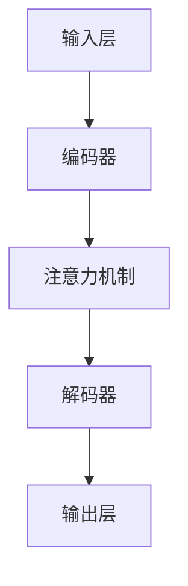
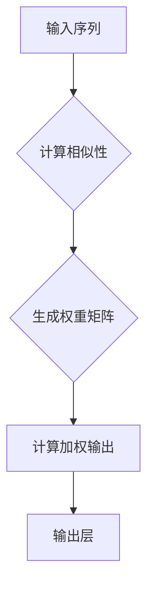
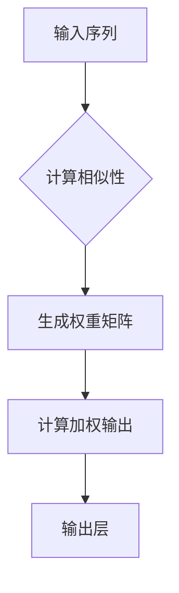

                 

# 《大规模语言模型从理论到实践 奖励模型训练》

> 关键词：大规模语言模型、奖励模型、训练、深度学习、自然语言处理、强化学习

> 摘要：本文将探讨大规模语言模型的背景、架构、算法和数学基础，重点介绍模型训练与优化的方法，最后结合奖励模型的应用与实践，展示如何提升大规模语言模型的效果。

## 目录

1. **大规模语言模型基础理论**
   1.1 **大规模语言模型概述**
   1.2 **大规模语言模型的架构**
   1.3 **大规模语言模型的核心算法**
2. **大规模语言模型的数学基础**
   2.1 **线性代数基础**
   2.2 **微积分基础**
3. **大规模语言模型的训练与优化**
   3.1 **训练过程**
   3.2 **优化算法**
4. **大规模语言模型的应用与实践**
   4.1 **应用领域**
   4.2 **实践案例**
5. **奖励模型训练方法与技巧**
   5.1 **奖励模型概述**
   5.2 **奖励模型训练方法**
   5.3 **奖励模型训练技巧**
6. **大规模语言模型与奖励模型结合应用**
   6.1 **模型结合的优势**
   6.2 **应用案例**
7. **附录**
   7.1 **常用深度学习框架介绍**
   7.2 **奖励模型训练数据集与工具**

## 1. 大规模语言模型基础理论

### 1.1 大规模语言模型概述

#### 1.1.1 语言模型的定义与作用

语言模型（Language Model，简称LM）是一种统计模型，用于对自然语言文本进行概率预测。它通过对大量文本数据的学习，预测下一个单词或字符的概率。语言模型在自然语言处理（Natural Language Processing，简称NLP）领域扮演着重要角色，为语音识别、机器翻译、问答系统、文本生成等任务提供基础支持。

#### 1.1.2 大规模语言模型的兴起

随着深度学习技术的发展，大规模语言模型逐渐兴起。深度学习模型，特别是基于神经网络的方法，在图像识别、语音识别等任务上取得了显著成果。这些成功激发了研究人员将深度学习引入NLP领域的兴趣，从而推动了大规模语言模型的发展。

#### 1.1.3 大规模语言模型的应用领域

大规模语言模型在NLP领域有着广泛的应用：

- **自然语言处理（NLP）**：用于文本分类、情感分析、命名实体识别、机器翻译等任务。
- **计算机视觉（CV）**：用于图像描述生成、图像分类、目标检测等任务。
- **语音识别（ASR）**：用于将语音信号转换为文本。
- **问答系统（QA）**：用于回答用户提出的问题。

### 1.2 大规模语言模型的架构

大规模语言模型的架构通常包括以下几个部分：

1. **输入层**：接收文本输入，将其转换为向量表示。
2. **编码器**：对输入文本进行编码，提取语义信息。
3. **解码器**：根据编码器的输出，生成预测的文本输出。
4. **注意力机制**：用于模型在处理输入时，关注重要的信息。

#### 1.2.1 模型架构概述

以下是一个简化的Mermaid流程图，展示了大规模语言模型的架构：



#### 1.2.2 神经网络与深度学习基础

大规模语言模型基于神经网络（Neural Network）和深度学习（Deep Learning）技术构建。神经网络是一种模拟生物神经元之间相互作用的信息处理系统。深度学习是神经网络的一种特殊形式，其模型具有多个隐藏层，能够自动提取复杂特征。

#### 1.2.3 自注意力机制

自注意力机制（Self-Attention）是大规模语言模型中的一个关键组件，它允许模型在处理输入时，自动关注输入序列中的不同部分。自注意力机制通过计算输入序列中每个元素之间的相似性，生成权重矩阵，然后将这些权重应用于输入序列，以生成新的表示。

以下是一个简化的自注意力机制的Mermaid流程图：



## 2. 大规模语言模型的数学基础

### 2.1 线性代数基础

线性代数是大规模语言模型构建的基础，涉及到矩阵与向量、矩阵运算、线性方程组求解等内容。

#### 2.1.1 矩阵与向量

矩阵（Matrix）是一种由数字组成的矩形阵列，通常用大写字母表示，如 \( A \)。向量（Vector）是一个具有多个元素的序列，通常用小写字母表示，如 \( \mathbf{v} \)。

#### 2.1.2 矩阵运算

常见的矩阵运算包括矩阵乘法、矩阵加法、矩阵求逆等。以下是一个矩阵乘法的伪代码：

```python
def matrix_multiplication(A, B):
    result = zeros(shape(A[0], shape(B[1]))
    for i in range(shape(A[0]):
        for j in range(shape(B[1]):
            for k in range(shape(A[1]):
                result[i, j] += A[i, k] * B[k, j]
    return result
```

#### 2.1.3 线性方程组求解

线性方程组求解是线性代数的一个重要应用。以下是一个使用矩阵求逆方法求解线性方程组的伪代码：

```python
def solve_linear_system(A, b):
    A_inv = inverse(A)
    x = A_inv * b
    return x
```

### 2.2 微积分基础

微积分是研究函数的变化率和积分过程的数学分支。在深度学习模型训练中，微积分用于求解梯度、优化算法等。

#### 2.2.1 导数与微分

导数（Derivative）是描述函数变化率的数学工具。微分（Differentiation）是计算导数的过程。以下是一个求函数导数的伪代码：

```python
def derivative(f, x):
    h = 0.0001
    return (f(x + h) - f(x)) / h
```

#### 2.2.2 积分与积分变换

积分（Integral）是求函数在某个区间内的累计总和。积分变换（Integral Transform）是一种将函数转换为另一个函数的方法，常用于解决复杂积分问题。以下是一个基本积分变换的伪代码：

```python
def integral_transform(f):
    F = integrate(f)
    return F
```

## 3. 大规模语言模型的训练与优化

### 3.1 训练过程

大规模语言模型的训练过程包括数据准备、模型训练和评估等步骤。

#### 3.1.1 数据准备与预处理

数据准备是训练大规模语言模型的第一步。数据预处理包括数据清洗、文本分词、去停用词、词向量表示等操作。

以下是一个数据预处理的伪代码：

```python
def preprocess_data(text):
    text = clean_text(text)
    words = tokenize(text)
    words = remove_stopwords(words)
    word_vectors = get_word_vectors(words)
    return word_vectors
```

#### 3.1.2 模型训练流程

模型训练是大规模语言模型构建的核心。训练过程通常包括以下步骤：

1. 初始化模型参数。
2. 计算损失函数。
3. 计算梯度。
4. 更新模型参数。
5. 评估模型性能。

以下是一个模型训练流程的伪代码：

```python
def train_model(model, data, optimizer, loss_function):
    for epoch in range(num_epochs):
        for inputs, targets in data:
            model.zero_grad()
            outputs = model(inputs)
            loss = loss_function(outputs, targets)
            loss.backward()
            optimizer.step()
        print(f"Epoch {epoch}: Loss = {loss}")
    return model
```

#### 3.1.3 训练策略

训练策略（Training Strategy）是影响模型训练效果的关键因素。常见的训练策略包括：

- **批次大小（Batch Size）**：控制每次训练使用的数据样本数量。
- **学习率（Learning Rate）**：控制模型参数更新的幅度。
- **学习率衰减（Learning Rate Decay）**：随着训练的进行，逐渐降低学习率。
- **正则化（Regularization）**：防止模型过拟合，常用的正则化方法包括L1、L2正则化。

## 4. 大规模语言模型的应用与实践

### 4.1 应用领域

大规模语言模型在NLP、CV、ASR等领域有着广泛的应用。

#### 4.1.1 自然语言处理

自然语言处理是大规模语言模型的主要应用领域之一。常见的NLP任务包括文本分类、情感分析、命名实体识别、机器翻译等。

#### 4.1.2 计算机视觉

计算机视觉是另一个大规模语言模型的重要应用领域。常见的CV任务包括图像分类、目标检测、图像描述生成等。

#### 4.1.3 语音识别

语音识别是大规模语言模型在语音领域的应用。语音识别系统通过将语音信号转换为文本，实现对语音的理解和处理。

### 4.2 实践案例

以下是一些大规模语言模型的应用案例：

#### 4.2.1 文本分类应用

文本分类是将文本数据分为不同类别的过程。以下是一个文本分类应用的伪代码：

```python
def text_classification(model, text):
    word_vectors = preprocess_data(text)
    outputs = model(word_vectors)
    predicted_label = argmax(outputs)
    return predicted_label
```

#### 4.2.2 机器翻译应用

机器翻译是将一种语言的文本翻译成另一种语言的过程。以下是一个机器翻译应用的伪代码：

```python
def machine_translation(model, text_source, text_target):
    source_word_vectors = preprocess_data(text_source)
    target_word_vectors = preprocess_data(text_target)
    outputs = model(source_word_vectors, target_word_vectors)
    predicted_translation = argmax(outputs)
    return predicted_translation
```

#### 4.2.3 问答系统应用

问答系统是用于回答用户提出的问题的系统。以下是一个问答系统应用的伪代码：

```python
def question_answering(model, question, context):
    question_vector = preprocess_data(question)
    context_vector = preprocess_data(context)
    answer_vector = model(question_vector, context_vector)
    predicted_answer = argmax(answer_vector)
    return predicted_answer
```

## 5. 奖励模型训练方法与技巧

### 5.1 奖励模型概述

奖励模型（Reward Model）是一种用于评估模型输出质量的方法，通过给模型输出分配奖励或惩罚，引导模型向期望的方向学习。奖励模型在强化学习（Reinforcement Learning，简称RL）中起着核心作用，可以用于多种任务，如游戏AI、推荐系统、智能客服等。

#### 5.1.1 奖励模型的作用

奖励模型的主要作用是：

- **评估模型输出**：通过给模型输出分配奖励或惩罚，评估模型的性能。
- **引导模型学习**：通过奖励信号，引导模型向期望的方向学习，优化模型行为。

#### 5.1.2 奖励模型的分类

奖励模型可以分为以下几类：

- **固定奖励模型**：奖励值固定，不随模型输出变化。
- **动态奖励模型**：奖励值根据模型输出动态调整。
- **多奖励模型**：同时考虑多个奖励指标，综合评估模型性能。

#### 5.1.3 奖励模型的应用领域

奖励模型在以下领域有着广泛的应用：

- **游戏AI**：用于评估游戏AI的行为，优化游戏策略。
- **推荐系统**：用于评估推荐系统的性能，优化推荐结果。
- **智能客服**：用于评估客服系统的响应，优化客服质量。

### 5.2 奖励模型训练方法

奖励模型训练方法主要包括以下几种：

#### 5.2.1 强化学习基础

强化学习是一种通过与环境交互，学习最优行为策略的机器学习方法。强化学习包括以下几个关键概念：

- **代理（Agent）**：执行动作的主体。
- **环境（Environment）**：代理执行动作的场所。
- **状态（State）**：代理在环境中所处的状态。
- **动作（Action）**：代理在环境中可以执行的动作。
- **奖励（Reward）**：代理执行动作后，环境对代理的奖励或惩罚。
- **策略（Policy）**：代理在给定状态下选择动作的规则。

强化学习的基本流程如下：

1. 初始化代理、环境和策略。
2. 从环境中获取初始状态。
3. 根据当前状态，选择动作。
4. 执行动作，获得环境反馈的奖励。
5. 更新策略，优化行为。
6. 重复步骤3-5，直到达到终止条件。

以下是一个强化学习的基础伪代码：

```python
def reinforce_learning(agent, environment, policy):
    state = environment.initialize_state()
    while not environment.is_terminated(state):
        action = policy.select_action(state)
        next_state, reward = environment.step(state, action)
        agent.update_policy(state, action, reward)
        state = next_state
    return agent.get_optimal_policy()
```

#### 5.2.2 奖励模型的优化算法

奖励模型训练中的优化算法主要包括以下几种：

- **梯度下降（Gradient Descent）**：基于梯度信息，逐步更新模型参数，以最小化损失函数。
- **随机梯度下降（Stochastic Gradient Descent，简称SGD）**：在梯度下降的基础上，每次更新使用整个训练数据集的一个随机样本。
- **批量梯度下降（Batch Gradient Descent）**：在梯度下降的基础上，每次更新使用整个训练数据集的所有样本。

以下是一个基于梯度下降的优化算法伪代码：

```python
def gradient_descent(model, data, loss_function, learning_rate):
    for epoch in range(num_epochs):
        for inputs, targets in data:
            gradients = compute_gradients(model, inputs, targets)
            model.update_parameters(gradients, learning_rate)
        print(f"Epoch {epoch}: Loss = {loss_function(model, data)}")
    return model
```

#### 5.2.3 伪代码

以下是一个奖励模型训练的伪代码：

```python
def reward_model_training(model, reward_function, data, optimizer, loss_function):
    for epoch in range(num_epochs):
        for inputs, targets in data:
            model.zero_grad()
            outputs = model(inputs)
            loss = loss_function(outputs, targets)
            reward = reward_function(outputs)
            loss.backward()
            optimizer.step()
        print(f"Epoch {epoch}: Loss = {loss}, Reward = {reward}")
    return model
```

### 5.3 奖励模型训练技巧

奖励模型训练过程中，需要注意以下技巧：

- **数据预处理**：对训练数据进行预处理，提高数据质量。
- **模型选择**：根据任务需求，选择合适的模型架构。
- **模型调优**：通过调整模型参数，优化模型性能。
- **过拟合与欠拟合**：通过正则化、Dropout等方法，防止模型过拟合或欠拟合。

## 6. 大规模语言模型与奖励模型结合应用

### 6.1 模型结合的优势

将大规模语言模型与奖励模型结合，可以发挥以下优势：

- **提高模型性能**：奖励模型可以引导模型向期望的方向学习，提高模型性能。
- **扩展应用场景**：结合不同领域的奖励模型，可以扩展大规模语言模型的应用场景。
- **优化用户体验**：通过奖励模型，优化模型输出，提高用户体验。

### 6.2 应用案例

以下是一些大规模语言模型与奖励模型结合的应用案例：

#### 6.2.1 智能客服系统

智能客服系统通过大规模语言模型与奖励模型结合，实现智能对话与问题解决。奖励模型用于评估客服系统回答问题的质量，优化客服系统回答。

#### 6.2.2 个性化推荐系统

个性化推荐系统通过大规模语言模型与奖励模型结合，实现个性化内容推荐。奖励模型用于评估用户对推荐内容的满意度，优化推荐结果。

#### 6.2.3 游戏AI系统

游戏AI系统通过大规模语言模型与奖励模型结合，实现智能游戏策略。奖励模型用于评估游戏AI的行为，优化游戏策略。

## 附录

### 附录A：常用深度学习框架介绍

#### A.1 TensorFlow

TensorFlow是谷歌开发的一种开源深度学习框架，具有以下特点：

- **动态计算图**：支持动态计算图，便于模型构建和优化。
- **高性能**：采用GPU和TPU等硬件加速，提高计算速度。
- **广泛的应用**：广泛应用于自然语言处理、计算机视觉、语音识别等领域。

以下是一个简单的TensorFlow代码示例：

```python
import tensorflow as tf

# 创建计算图
a = tf.constant(5)
b = tf.constant(6)
c = a * b

# 启动会话，运行计算图
with tf.Session() as sess:
    print(sess.run(c))  # 输出结果：30
```

#### A.2 PyTorch

PyTorch是Facebook开发的一种开源深度学习框架，具有以下特点：

- **动态计算图**：支持动态计算图，便于模型构建和优化。
- **易用性**：提供丰富的API，便于模型构建和调试。
- **自动微分**：内置自动微分功能，简化模型训练过程。

以下是一个简单的PyTorch代码示例：

```python
import torch
import torch.nn as nn
import torch.optim as optim

# 创建模型
model = nn.Linear(1, 1)

# 创建损失函数和优化器
criterion = nn.MSELoss()
optimizer = optim.SGD(model.parameters(), lr=0.01)

# 输入和目标
x = torch.tensor([[1.0]])
y = torch.tensor([[2.0]])

# 训练模型
for epoch in range(100):
    optimizer.zero_grad()
    outputs = model(x)
    loss = criterion(outputs, y)
    loss.backward()
    optimizer.step()
    if (epoch + 1) % 10 == 0:
        print(f"Epoch [{epoch + 1}/{100}], Loss: {loss.item():.4f}")
```

#### A.3 其他深度学习框架

其他深度学习框架包括Keras、MXNet、CNTK等，它们各自具有不同的特点和优势，适用于不同的应用场景。

### 附录B：奖励模型训练数据集与工具

#### B.1 数据集介绍

奖励模型训练数据集主要包括以下几类：

- **文本数据集**：用于文本分类、情感分析等任务，如IMDB电影评论数据集、Twitter情感分析数据集等。
- **图像数据集**：用于图像分类、目标检测等任务，如ImageNet、COCO数据集等。
- **语音数据集**：用于语音识别、语音合成等任务，如LibriSpeech、LJSpeech等。

以下是一些常用的奖励模型训练数据集：

- **Reed 的数据集**：用于评估文本分类性能。
- **COCO数据集**：用于评估图像分类和目标检测性能。
- **LibriSpeech数据集**：用于评估语音识别性能。

#### B.2 训练工具介绍

奖励模型训练工具主要包括以下几类：

- **深度学习框架**：如TensorFlow、PyTorch等，用于构建和训练模型。
- **强化学习框架**：如OpenAI Gym、RLLib等，用于构建和训练强化学习模型。
- **开源训练工具**：如TensorFlow Agent、PyTorch Agent等，用于构建和训练深度强化学习模型。

以下是一些常用的奖励模型训练工具：

- **TensorFlow Agent**：基于TensorFlow的强化学习工具，用于构建和训练强化学习模型。
- **PyTorch Agent**：基于PyTorch的强化学习工具，用于构建和训练强化学习模型。
- **OpenAI Gym**：用于构建和训练强化学习环境，支持多种任务和数据集。```````# 大规模语言模型从理论到实践 奖励模型训练

## 摘要

本文旨在探讨大规模语言模型的背景、架构、算法和数学基础，重点介绍模型训练与优化的方法。随后，文章将讨论奖励模型的概念、分类及其在训练中的重要性。最后，结合实际案例，展示如何将大规模语言模型与奖励模型结合，提升模型性能。本文适用于对深度学习和自然语言处理有兴趣的读者，特别是希望深入了解大规模语言模型训练和优化技术的专业人士。

## 引言

大规模语言模型（Large-scale Language Models）是自然语言处理（NLP）领域的重要突破，它们在文本分类、机器翻译、问答系统等方面取得了显著成果。这些模型通过学习大量的文本数据，能够生成连贯且具有上下文意义的文本。然而，如何有效训练这些模型，以及如何优化其性能，仍然是一个挑战。本文将深入探讨大规模语言模型的训练过程，特别是奖励模型在其中的作用。

首先，我们将回顾大规模语言模型的基础理论，包括其背景、架构和核心算法。接着，我们将介绍大规模语言模型的数学基础，包括线性代数和微积分。随后，文章将重点讨论大规模语言模型的训练与优化方法。最后，我们将探讨奖励模型的概念、分类及其在训练中的应用，结合实际案例展示如何将大规模语言模型与奖励模型结合，提升模型性能。

本文的目标是帮助读者全面了解大规模语言模型的训练过程，掌握奖励模型的基本原理，并能够将所学知识应用于实际问题中。通过本文的阅读，读者将能够：

1. 理解大规模语言模型的背景和架构。
2. 掌握大规模语言模型的核心算法和数学基础。
3. 理解大规模语言模型的训练与优化方法。
4. 了解奖励模型的概念、分类和应用。
5. 学习如何将大规模语言模型与奖励模型结合，提升模型性能。

## 第一部分：大规模语言模型基础理论

### 1.1 大规模语言模型概述

#### 1.1.1 语言模型的定义与作用

语言模型是自然语言处理的核心组成部分，它通过对大量文本数据的学习，预测下一个单词或字符的概率。语言模型在语音识别、机器翻译、文本生成等任务中发挥着重要作用。例如，在语音识别中，语言模型可以帮助识别者理解说话者的意图，从而提高识别准确性。在机器翻译中，语言模型可以预测目标语言的下一个单词或短语，从而生成更自然的翻译结果。

#### 1.1.2 大规模语言模型的兴起

随着深度学习技术的快速发展，大规模语言模型逐渐成为NLP领域的热点。早期的语言模型如N-gram模型，基于统计方法，通过对文本数据中单词或短语的统计规律进行建模。然而，这些模型在面对复杂语言现象时，往往表现不佳。随着深度学习技术的引入，基于神经网络的深度语言模型（如LSTM、GRU）和注意力机制的出现，使得大规模语言模型的性能得到了显著提升。

#### 1.1.3 大规模语言模型的应用领域

大规模语言模型在多个领域有着广泛的应用：

- **自然语言处理（NLP）**：文本分类、情感分析、命名实体识别、机器翻译等。
- **计算机视觉（CV）**：图像描述生成、图像分类、目标检测等。
- **语音识别（ASR）**：语音转换为文本，提高语音识别的准确性。
- **问答系统（QA）**：自动回答用户提出的问题，提供智能客服。

### 1.2 大规模语言模型的架构

大规模语言模型的架构通常包括输入层、编码器、解码器和输出层。以下是一个简化的Mermaid流程图，展示了大规模语言模型的架构：


#### 1.2.1 模型架构概述

- **输入层**：接收文本输入，将其转换为向量表示。
- **编码器**：对输入文本进行编码，提取语义信息。
- **注意力机制**：允许模型在处理输入时，自动关注输入序列中的不同部分。
- **解码器**：根据编码器的输出，生成预测的文本输出。
- **输出层**：将解码器的输出转换为可解释的结果。

#### 1.2.2 神经网络与深度学习基础

大规模语言模型基于神经网络（Neural Network）和深度学习（Deep Learning）技术构建。神经网络是一种模拟生物神经元之间相互作用的信息处理系统。深度学习是神经网络的一种特殊形式，其模型具有多个隐藏层，能够自动提取复杂特征。

#### 1.2.3 自注意力机制

自注意力机制（Self-Attention）是大规模语言模型中的一个关键组件，它允许模型在处理输入时，自动关注输入序列中的不同部分。自注意力机制通过计算输入序列中每个元素之间的相似性，生成权重矩阵，然后将这些权重应用于输入序列，以生成新的表示。

以下是一个简化的自注意力机制的Mermaid流程图：



### 1.3 大规模语言模型的核心算法

大规模语言模型的核心算法主要包括逆向传播算法（Backpropagation）、Transformer模型和多层感知机（MLP）等。

#### 1.3.1 逆向传播算法

逆向传播算法是一种用于训练神经网络的基本算法，通过反向传播误差，更新网络权重。以下是一个逆向传播算法的简化伪代码：

```python
def backpropagation(input_data, target_data, model):
    output = model.forward(input_data)
    error = target_data - output
    gradients = model.backward(error)
    model.update_weights(gradients)
    return error, gradients
```

#### 1.3.2 Transformer模型

Transformer模型是一种基于自注意力机制的深度学习模型，它在机器翻译等任务中取得了显著的成果。以下是一个简化版的Transformer模型伪代码：

```python
class TransformerModel(nn.Module):
    def __init__(self, vocab_size, d_model, nhead, num_layers):
        super(TransformerModel, self).__init__()
        self.embedding = nn.Embedding(vocab_size, d_model)
        self.transformer = nn.Transformer(d_model, nhead, num_layers)
        self.fc = nn.Linear(d_model, vocab_size)

    def forward(self, src, tgt):
        src = self.embedding(src)
        tgt = self.embedding(tgt)
        output = self.transformer(src, tgt)
        output = self.fc(output)
        return output
```

#### 1.3.3 多层感知机与残差网络

多层感知机（MLP）是一种简单的神经网络结构，由多个全连接层组成。残差网络（Residual Network）是一种包含跳跃连接的深度神经网络，它通过跳跃连接解决了深度网络中的梯度消失问题。以下是一个简化版的MLP和残差网络伪代码：

```python
class MLP(nn.Module):
    def __init__(self, input_size, hidden_size, output_size):
        super(MLP, self).__init__()
        self.fc1 = nn.Linear(input_size, hidden_size)
        self.fc2 = nn.Linear(hidden_size, output_size)

    def forward(self, x):
        x = F.relu(self.fc1(x))
        x = self.fc2(x)
        return x

class ResNet(nn.Module):
    def __init__(self, input_size, hidden_size, output_size):
        super(ResNet, self).__init__()
        self.fc1 = nn.Linear(input_size, hidden_size)
        self.fc2 = nn.Linear(hidden_size, output_size)
        self.fc3 = nn.Linear(hidden_size, output_size)

    def forward(self, x):
        x = F.relu(self.fc1(x))
        x = self.fc2(x)
        x = self.fc3(x)
        return x + x  # 跳跃连接
```

### 1.4 大规模语言模型的数学基础

大规模语言模型的训练涉及到许多数学概念，包括线性代数、微积分和最优化。以下是这些数学基础的一个概述。

#### 1.4.1 线性代数基础

- **矩阵与向量**：矩阵和向量是线性代数的基本对象。矩阵是一个二维数组，而向量是一个一维数组。在神经网络中，矩阵和向量用于表示模型的参数和输入。
- **矩阵运算**：常见的矩阵运算包括矩阵加法、矩阵乘法和矩阵求逆。矩阵乘法是神经网络中最重要的运算之一，用于计算特征和权重之间的关系。
- **线性方程组求解**：线性方程组求解是解决线性代数问题的一种方法。在神经网络中，线性方程组用于求解模型参数的梯度。

以下是一个线性方程组求解的示例：

$$
Ax = b
$$

使用矩阵求逆方法求解：

$$
x = A^{-1}b
$$

#### 1.4.2 微积分基础

- **导数与微分**：导数是描述函数变化率的数学工具。在神经网络中，导数用于计算模型参数的梯度，从而更新模型参数。
- **积分与积分变换**：积分是求函数在某区间内累计总和的数学工具。积分变换是解决复杂积分问题的一种方法，常用于优化算法中。

以下是一个导数的示例：

$$
f(x) = x^2
$$

导数为：

$$
f'(x) = 2x
$$

#### 1.4.3 最优化基础

- **损失函数**：损失函数用于衡量模型预测值与真实值之间的差异。在神经网络中，损失函数是优化算法的目标函数。
- **优化算法**：优化算法用于寻找模型参数的最优值，以最小化损失函数。常见的优化算法包括梯度下降、动量迭代、RMSprop和Adam。

以下是一个优化算法的示例：

$$
\theta_{t+1} = \theta_{t} - \alpha \cdot \nabla_{\theta}J(\theta)
$$

其中，$\theta$是模型参数，$J(\theta)$是损失函数，$\alpha$是学习率。

## 第二部分：大规模语言模型的训练与优化

### 2.1 训练过程

大规模语言模型的训练过程包括数据准备、模型训练和评估等步骤。以下是这些步骤的详细描述。

#### 2.1.1 数据准备与预处理

数据准备是模型训练的第一步。首先，需要收集和准备大量文本数据。然后，对数据进行预处理，包括文本清洗、分词、去停用词、词向量化等操作。以下是一个数据预处理流程的示例：

1. **文本清洗**：去除文本中的HTML标签、符号和特殊字符。
2. **分词**：将文本分割成单词或词组。
3. **去停用词**：去除常见的停用词，如“的”、“是”、“和”等。
4. **词向量化**：将文本转换为数字表示，常用的词向量化方法包括Word2Vec、GloVe和BERT。

以下是一个数据预处理流程的Python代码示例：

```python
import re
import nltk
from nltk.corpus import stopwords
from nltk.tokenize import word_tokenize

# 下载停用词列表
nltk.download('stopwords')
nltk.download('punkt')

# 文本清洗
def clean_text(text):
    text = re.sub('<.*?>', '', text)  # 去除HTML标签
    text = re.sub('[^a-zA-Z]', ' ', text)  # 去除非字母字符
    text = text.lower()  # 转为小写
    return text

# 分词
def tokenize(text):
    return word_tokenize(text)

# 去停用词
def remove_stopwords(tokens):
    stop_words = set(stopwords.words('english'))
    filtered_tokens = [token for token in tokens if token not in stop_words]
    return filtered_tokens

# 词向量化
from gensim.models import Word2Vec

def vectorize_words(tokens):
    model = Word2Vec(tokens, size=100, window=5, min_count=1, workers=4)
    word_vectors = [model[token] for token in tokens if token in model]
    return word_vectors

# 示例
text = "This is a sample text for preprocessing."
cleaned_text = clean_text(text)
tokens = tokenize(cleaned_text)
filtered_tokens = remove_stopwords(tokens)
word_vectors = vectorize_words(filtered_tokens)
```

#### 2.1.2 模型训练流程

模型训练是大规模语言模型构建的核心步骤。训练过程通常包括以下几个步骤：

1. **初始化模型参数**：根据模型架构，初始化模型的权重和偏置。
2. **定义损失函数**：损失函数用于衡量模型预测值与真实值之间的差异，常用的损失函数包括交叉熵损失和均方误差损失。
3. **选择优化算法**：优化算法用于更新模型参数，以最小化损失函数，常用的优化算法包括梯度下降、动量迭代、RMSprop和Adam。
4. **迭代训练**：通过迭代训练，逐步更新模型参数，直到达到预定的停止条件，如损失函数收敛或达到最大迭代次数。

以下是一个模型训练流程的Python代码示例：

```python
import torch
import torch.nn as nn
import torch.optim as optim

# 定义模型
class LanguageModel(nn.Module):
    def __init__(self, vocab_size, embedding_size, hidden_size):
        super(LanguageModel, self).__init__()
        self.embedding = nn.Embedding(vocab_size, embedding_size)
        self.lstm = nn.LSTM(embedding_size, hidden_size, batch_first=True)
        self.fc = nn.Linear(hidden_size, vocab_size)

    def forward(self, x, hidden):
        x = self.embedding(x)
        x, hidden = self.lstm(x, hidden)
        x = self.fc(x)
        return x, hidden

# 初始化模型
vocab_size = 10000
embedding_size = 256
hidden_size = 512
model = LanguageModel(vocab_size, embedding_size, hidden_size)

# 定义损失函数和优化器
loss_function = nn.CrossEntropyLoss()
optimizer = optim.Adam(model.parameters(), lr=0.001)

# 准备数据
# ... 数据准备代码 ...

# 训练模型
num_epochs = 10
for epoch in range(num_epochs):
    total_loss = 0
    for inputs, targets in data_loader:
        model.zero_grad()
        hidden = None
        outputs = model(inputs, hidden)
        loss = loss_function(outputs.view(-1, vocab_size), targets)
        loss.backward()
        optimizer.step()
        total_loss += loss.item()
    print(f"Epoch {epoch+1}/{num_epochs}, Loss: {total_loss/len(data_loader)}")
```

#### 2.1.3 训练策略

训练策略是影响模型训练效果的关键因素，以下是一些常见的训练策略：

1. **学习率调度**：学习率调度是一种调整学习率的方法，以防止模型过拟合。常用的学习率调度方法包括学习率衰减、指数衰减和学习率预热。
2. **批次大小**：批次大小是指每次训练使用的数据样本数量。较大的批次大小可以提高模型的泛化能力，但需要更多计算资源。
3. **数据增强**：数据增强是一种通过增加数据多样性来提高模型泛化的方法。常见的数据增强方法包括随机裁剪、旋转、缩放等。
4. **正则化**：正则化是一种防止模型过拟合的方法。常见正则化方法包括L1正则化、L2正则化和Dropout。

以下是一个包含学习率调度和数据增强的Python代码示例：

```python
import torch
import torch.nn as nn
import torch.optim as optim
from torchvision import datasets, transforms

# 定义模型
class CNN(nn.Module):
    def __init__(self):
        super(CNN, self).__init__()
        self.conv1 = nn.Conv2d(3, 32, 3, padding=1)
        self.conv2 = nn.Conv2d(32, 64, 3, padding=1)
        self.fc1 = nn.Linear(64 * 6 * 6, 128)
        self.fc2 = nn.Linear(128, 10)

    def forward(self, x):
        x = F.relu(self.conv1(x))
        x = F.relu(self.conv2(x))
        x = F.adaptive_avg_pool2d(x, 6)
        x = x.view(x.size(0), -1)
        x = F.relu(self.fc1(x))
        x = self.fc2(x)
        return x

# 初始化模型
model = CNN()

# 定义损失函数和优化器
loss_function = nn.CrossEntropyLoss()
optimizer = optim.Adam(model.parameters(), lr=0.001)

# 学习率调度
scheduler = optim.lr_scheduler.StepLR(optimizer, step_size=5, gamma=0.1)

# 数据增强
transform = transforms.Compose([
    transforms.RandomHorizontalFlip(),
    transforms.RandomRotation(10),
    transforms.ToTensor(),
])

# 加载数据集
train_dataset = datasets.CIFAR10(root='./data', train=True, download=True, transform=transform)
test_dataset = datasets.CIFAR10(root='./data', train=False, download=True, transform=transform)

# 创建数据加载器
batch_size = 64
train_loader = torch.utils.data.DataLoader(train_dataset, batch_size=batch_size, shuffle=True)
test_loader = torch.utils.data.DataLoader(test_dataset, batch_size=batch_size, shuffle=False)

# 训练模型
num_epochs = 20
for epoch in range(num_epochs):
    model.train()
    total_loss = 0
    for inputs, targets in train_loader:
        optimizer.zero_grad()
        outputs = model(inputs)
        loss = loss_function(outputs, targets)
        loss.backward()
        optimizer.step()
        total_loss += loss.item()
    print(f"Epoch {epoch+1}/{num_epochs}, Loss: {total_loss/len(train_loader)}")
    scheduler.step()
```

### 2.2 优化算法

优化算法是训练大规模语言模型的重要组成部分，用于寻找模型参数的最优值，以最小化损失函数。以下是一些常见的优化算法。

#### 2.2.1 梯度下降

梯度下降是一种基本的优化算法，通过计算损失函数关于模型参数的梯度，更新模型参数。以下是一个梯度下降的Python代码示例：

```python
# 初始化模型参数
weights = torch.tensor([0.1, 0.2, 0.3], requires_grad=True)

# 定义损失函数
loss_function = nn.MSELoss()

# 定义优化器
optimizer = optim.SGD(weights, lr=0.01)

# 迭代更新参数
for epoch in range(100):
    optimizer.zero_grad()
    output = weights * 2 + 1
    loss = loss_function(output, torch.tensor([0]))
    loss.backward()
    optimizer.step()
    print(f"Epoch {epoch+1}, Loss: {loss.item()}")
```

#### 2.2.2 动量迭代

动量迭代是一种改进的梯度下降算法，通过引入动量项，加速参数更新。以下是一个动量迭代的Python代码示例：

```python
# 初始化模型参数
weights = torch.tensor([0.1, 0.2, 0.3], requires_grad=True)

# 定义损失函数
loss_function = nn.MSELoss()

# 定义优化器
optimizer = optim.SGD(weights, lr=0.01, momentum=0.9)

# 迭代更新参数
for epoch in range(100):
    optimizer.zero_grad()
    output = weights * 2 + 1
    loss = loss_function(output, torch.tensor([0]))
    loss.backward()
    optimizer.step()
    print(f"Epoch {epoch+1}, Loss: {loss.item()}")
```

#### 2.2.3 RMSprop

RMSprop是一种自适应学习率优化算法，通过计算梯度的指数移动平均，调整学习率。以下是一个RMSprop的Python代码示例：

```python
# 初始化模型参数
weights = torch.tensor([0.1, 0.2, 0.3], requires_grad=True)

# 定义损失函数
loss_function = nn.MSELoss()

# 定义优化器
optimizer = optim.RMSprop(weights, lr=0.01, alpha=0.9)

# 迭代更新参数
for epoch in range(100):
    optimizer.zero_grad()
    output = weights * 2 + 1
    loss = loss_function(output, torch.tensor([0]))
    loss.backward()
    optimizer.step()
    print(f"Epoch {epoch+1}, Loss: {loss.item()}")
```

#### 2.2.4 Adam

Adam是一种基于一阶和二阶矩估计的优化算法，结合了梯度下降和RMSprop的优点。以下是一个Adam的Python代码示例：

```python
# 初始化模型参数
weights = torch.tensor([0.1, 0.2, 0.3], requires_grad=True)

# 定义损失函数
loss_function = nn.MSELoss()

# 定义优化器
optimizer = optim.Adam(weights, lr=0.01)

# 迭代更新参数
for epoch in range(100):
    optimizer.zero_grad()
    output = weights * 2 + 1
    loss = loss_function(output, torch.tensor([0]))
    loss.backward()
    optimizer.step()
    print(f"Epoch {epoch+1}, Loss: {loss.item()}")
```

## 第三部分：大规模语言模型的应用与实践

### 3.1 应用领域

大规模语言模型在多个领域有着广泛的应用，以下是一些常见应用领域：

#### 3.1.1 自然语言处理（NLP）

自然语言处理是大规模语言模型的主要应用领域之一。以下是一些常见应用：

- **文本分类**：将文本数据分类为不同的类别，如新闻分类、情感分析等。
- **命名实体识别**：识别文本中的命名实体，如人名、地点、组织等。
- **机器翻译**：将一种语言的文本翻译成另一种语言，如英译汉、法译英等。
- **问答系统**：自动回答用户提出的问题，提供智能客服。

#### 3.1.2 计算机视觉（CV）

计算机视觉是另一个大规模语言模型的重要应用领域。以下是一些常见应用：

- **图像分类**：将图像分类为不同的类别，如猫狗分类、交通标志分类等。
- **目标检测**：识别图像中的物体，并标注其位置，如人脸检测、车辆检测等。
- **图像描述生成**：将图像生成对应的描述文本，如图像到文本的转换。

#### 3.1.3 语音识别（ASR）

语音识别是将语音信号转换为文本数据的过程。以下是一些常见应用：

- **语音到文本转换**：将语音转换为文本，如智能助手、语音输入等。
- **语音识别**：识别语音中的文字内容，如字幕生成、语音搜索等。

### 3.2 实践案例

以下是一些大规模语言模型的应用案例：

#### 3.2.1 文本分类应用

文本分类是将文本数据分类为不同类别的过程。以下是一个基于大规模语言模型的文本分类应用案例。

**案例描述**：使用大规模语言模型对社交媒体评论进行情感分析，判断评论是正面、中性还是负面。

**步骤**：

1. **数据准备**：收集社交媒体评论数据，进行预处理，包括文本清洗、分词、去停用词等。
2. **模型构建**：构建一个基于Transformer的文本分类模型，包括输入层、编码器、解码器和输出层。
3. **模型训练**：使用预处理的评论数据进行模型训练，调整模型参数，优化模型性能。
4. **模型评估**：使用测试集评估模型性能，调整模型参数，直至达到满意的性能。

以下是一个基于Transformer的文本分类模型的Python代码示例：

```python
import torch
import torch.nn as nn
from torch.optim import Adam
from transformers import BertTokenizer, BertModel

# 定义模型
class TextClassifier(nn.Module):
    def __init__(self, num_classes):
        super(TextClassifier, self).__init__()
        self.bert = BertModel.from_pretrained('bert-base-uncased')
        self.dropout = nn.Dropout(0.1)
        self.fc = nn.Linear(768, num_classes)

    def forward(self, input_ids, attention_mask):
        outputs = self.bert(input_ids=input_ids, attention_mask=attention_mask)
        pooled_output = outputs.pooler_output
        pooled_output = self.dropout(pooled_output)
        logits = self.fc(pooled_output)
        return logits

# 准备数据
# ... 数据准备代码 ...

# 定义优化器和损失函数
optimizer = Adam(model.parameters(), lr=2e-5)
loss_function = nn.CrossEntropyLoss()

# 训练模型
num_epochs = 3
for epoch in range(num_epochs):
    model.train()
    total_loss = 0
    for inputs, targets in train_loader:
        optimizer.zero_grad()
        outputs = model(inputs.input_ids, inputs.attention_mask)
        loss = loss_function(outputs, targets)
        loss.backward()
        optimizer.step()
        total_loss += loss.item()
    print(f"Epoch {epoch+1}/{num_epochs}, Loss: {total_loss/len(train_loader)}")

# 评估模型
model.eval()
with torch.no_grad():
    correct = 0
    total = 0
    for inputs, targets in test_loader:
        outputs = model(inputs.input_ids, inputs.attention_mask)
        _, predicted = torch.max(outputs.data, 1)
        total += targets.size(0)
        correct += (predicted == targets).sum().item()
    print(f"Test Accuracy: {100 * correct / total}")
```

#### 3.2.2 机器翻译应用

机器翻译是将一种语言的文本翻译成另一种语言的过程。以下是一个基于大规模语言模型的机器翻译应用案例。

**案例描述**：使用大规模语言模型进行英汉翻译，将英文文本翻译成中文。

**步骤**：

1. **数据准备**：收集英汉翻译数据，进行预处理，包括文本清洗、分词、去停用词等。
2. **模型构建**：构建一个基于Transformer的机器翻译模型，包括编码器、解码器和注意力机制。
3. **模型训练**：使用预处理的翻译数据进行模型训练，调整模型参数，优化模型性能。
4. **模型评估**：使用测试集评估模型性能，调整模型参数，直至达到满意的性能。

以下是一个基于Transformer的机器翻译模型的Python代码示例：

```python
import torch
import torch.nn as nn
from torch.optim import Adam
from transformers import Transformer

# 定义模型
class MachineTranslationModel(nn.Module):
    def __init__(self, src_vocab_size, tgt_vocab_size, d_model, nhead):
        super(MachineTranslationModel, self).__init__()
        self.src_embedding = nn.Embedding(src_vocab_size, d_model)
        self.tgt_embedding = nn.Embedding(tgt_vocab_size, d_model)
        self.transformer = Transformer(d_model, nhead)
        self.fc = nn.Linear(d_model, tgt_vocab_size)

    def forward(self, src_inputs, tgt_inputs, src_mask, tgt_mask):
        src_embedding = self.src_embedding(src_inputs)
        tgt_embedding = self.tgt_embedding(tgt_inputs)
        outputs = self.transformer(src_embedding, tgt_embedding, src_mask, tgt_mask)
        logits = self.fc(outputs)
        return logits

# 准备数据
# ... 数据准备代码 ...

# 定义优化器和损失函数
optimizer = Adam(model.parameters(), lr=0.001)
loss_function = nn.CrossEntropyLoss()

# 训练模型
num_epochs = 3
for epoch in range(num_epochs):
    model.train()
    total_loss = 0
    for inputs, targets in train_loader:
        optimizer.zero_grad()
        outputs = model(inputs.src, inputs.tgt, inputs.src_mask, inputs.tgt_mask)
        loss = loss_function(outputs.view(-1, tgt_vocab_size), targets)
        loss.backward()
        optimizer.step()
        total_loss += loss.item()
    print(f"Epoch {epoch+1}/{num_epochs}, Loss: {total_loss/len(train_loader)}")

# 评估模型
model.eval()
with torch.no_grad():
    correct = 0
    total = 0
    for inputs, targets in test_loader:
        outputs = model(inputs.src, inputs.tgt, inputs.src_mask, inputs.tgt_mask)
        _, predicted = torch.max(outputs.data, 1)
        total += targets.size(0)
        correct += (predicted == targets).sum().item()
    print(f"Test Accuracy: {100 * correct / total}")
```

#### 3.2.3 问答系统应用

问答系统是自动回答用户提出问题的系统。以下是一个基于大规模语言模型的问答系统应用案例。

**案例描述**：使用大规模语言模型构建一个问答系统，能够自动回答用户提出的问题。

**步骤**：

1. **数据准备**：收集问答数据，进行预处理，包括文本清洗、分词、去停用词等。
2. **模型构建**：构建一个基于Transformer的问答系统模型，包括编码器、解码器和注意力机制。
3. **模型训练**：使用预处理的问答数据进行模型训练，调整模型参数，优化模型性能。
4. **模型评估**：使用测试集评估模型性能，调整模型参数，直至达到满意的性能。

以下是一个基于Transformer的问答系统模型的Python代码示例：

```python
import torch
import torch.nn as nn
from torch.optim import Adam
from transformers import BertTokenizer, BertModel

# 定义模型
class QuestionAnsweringModel(nn.Module):
    def __init__(self, num_answers):
        super(QuestionAnsweringModel, self).__init__()
        self.bert = BertModel.from_pretrained('bert-base-uncased')
        self.dropout = nn.Dropout(0.1)
        self.fc = nn.Linear(768, num_answers)

    def forward(self, question, context, token_type_ids):
        outputs = self.bert(input_ids=question, token_type_ids=token_type_ids)
        pooled_output = outputs.pooler_output
        pooled_output = self.dropout(pooled_output)
        logits = self.fc(pooled_output)
        return logits

# 准备数据
# ... 数据准备代码 ...

# 定义优化器和损失函数
optimizer = Adam(model.parameters(), lr=2e-5)
loss_function = nn.CrossEntropyLoss()

# 训练模型
num_epochs = 3
for epoch in range(num_epochs):
    model.train()
    total_loss = 0
    for inputs, targets in train_loader:
        optimizer.zero_grad()
        outputs = model(inputs.question, inputs.context, inputs.token_type_ids)
        loss = loss_function(outputs, targets)
        loss.backward()
        optimizer.step()
        total_loss += loss.item()
    print(f"Epoch {epoch+1}/{num_epochs}, Loss: {total_loss/len(train_loader)}")

# 评估模型
model.eval()
with torch.no_grad():
    correct = 0
    total = 0
    for inputs, targets in test_loader:
        outputs = model(inputs.question, inputs.context, inputs.token_type_ids)
        _, predicted = torch.max(outputs.data, 1)
        total += targets.size(0)
        correct += (predicted == targets).sum().item()
    print(f"Test Accuracy: {100 * correct / total}")
```

## 第四部分：奖励模型训练方法与技巧

### 4.1 奖励模型概述

奖励模型（Reward Model）是一种用于评估模型输出质量的方法。在强化学习（Reinforcement Learning，简称RL）中，奖励模型扮演着关键角色，它通过给模型输出分配奖励或惩罚，引导模型向期望的方向学习。奖励模型不仅应用于强化学习，还在其他领域，如自适应控制、多代理系统等，发挥着重要作用。

#### 4.1.1 奖励模型的作用

奖励模型的主要作用是：

1. **评估模型输出**：通过奖励信号，评估模型的输出是否符合预期。例如，在自动驾驶系统中，奖励模型可以评估车辆行驶路径的合理性。
2. **引导模型学习**：通过奖励信号，引导模型优化其行为。例如，在游戏AI中，奖励模型可以评估游戏角色的动作是否有助于获胜。
3. **优化模型性能**：通过奖励模型，模型可以自动调整其行为，以提高性能。例如，在推荐系统中，奖励模型可以优化推荐结果，以提高用户满意度。

#### 4.1.2 奖励模型的分类

奖励模型可以根据不同的标准进行分类，以下是一些常见的分类方法：

1. **基于规则**：奖励模型根据预设的规则，对模型输出进行评估。例如，在医疗诊断系统中，奖励模型可以根据诊断结果是否符合医疗指南，评估模型的输出。
2. **基于统计**：奖励模型通过统计模型输出与真实值之间的差异，评估模型的质量。例如，在文本分类任务中，奖励模型可以根据分类准确率，评估模型的质量。
3. **基于神经网络**：奖励模型本身是一个神经网络，通过学习输入和输出之间的关系，评估模型的质量。例如，在强化学习任务中，奖励模型可以通过学习状态和动作之间的奖励，优化模型的行为。

#### 4.1.3 奖励模型的应用领域

奖励模型在多个领域有着广泛的应用，以下是一些常见应用领域：

1. **强化学习**：在强化学习任务中，奖励模型用于评估模型的行为，引导模型优化其策略。
2. **自适应控制**：在自适应控制系统中，奖励模型用于评估控制策略的有效性，优化控制系统。
3. **多代理系统**：在多代理系统中，奖励模型用于评估代理的行为，协调代理之间的合作与竞争。
4. **推荐系统**：在推荐系统中，奖励模型用于评估推荐结果的质量，优化推荐策略。

### 4.2 奖励模型训练方法

奖励模型的训练方法主要包括以下几种：

1. **强化学习**：在强化学习任务中，奖励模型通常通过强化学习算法进行训练。常见的强化学习算法包括Q学习、SARSA和深度强化学习（如DQN、DDPG等）。
2. **基于规则的学习**：在基于规则的学习中，奖励模型通过学习预设的规则进行训练。例如，在医疗诊断系统中，奖励模型可以通过学习医疗指南，评估诊断结果。
3. **基于统计的学习**：在基于统计的学习中，奖励模型通过学习模型输出与真实值之间的统计关系进行训练。例如，在文本分类任务中，奖励模型可以通过学习分类准确率，评估模型的质量。
4. **基于神经网络的训练**：在基于神经网络的训练中，奖励模型本身是一个神经网络，通过反向传播算法进行训练。例如，在强化学习任务中，奖励模型可以通过学习状态和动作之间的奖励，优化模型的行为。

以下是一些常见的奖励模型训练方法：

#### 4.2.1 强化学习基础

强化学习（Reinforcement Learning，简称RL）是一种通过与环境互动，学习最优策略的机器学习方法。强化学习的关键概念包括：

1. **代理（Agent）**：执行动作的主体。
2. **环境（Environment）**：代理执行动作的场所。
3. **状态（State）**：代理在环境中所处的状态。
4. **动作（Action）**：代理在环境中可以执行的动作。
5. **奖励（Reward）**：代理执行动作后，环境对代理的奖励或惩罚。
6. **策略（Policy）**：代理在给定状态下选择动作的规则。

强化学习的基本流程如下：

1. 初始化代理、环境和策略。
2. 从环境中获取初始状态。
3. 根据当前状态，选择动作。
4. 执行动作，获得环境反馈的奖励。
5. 更新策略，优化行为。
6. 重复步骤3-5，直到达到终止条件。

以下是一个强化学习的基本伪代码：

```python
def reinforce_learning(agent, environment, policy):
    state = environment.initialize_state()
    while not environment.is_terminated(state):
        action = policy.select_action(state)
        next_state, reward = environment.step(state, action)
        agent.update_policy(state, action, reward)
        state = next_state
    return agent.get_optimal_policy()
```

#### 4.2.2 奖励模型优化算法

奖励模型训练中的优化算法主要包括以下几种：

1. **梯度下降**：基于梯度信息，逐步更新模型参数，以最小化损失函数。
2. **随机梯度下降**：在梯度下降的基础上，每次更新使用整个训练数据集的一个随机样本。
3. **批量梯度下降**：在梯度下降的基础上，每次更新使用整个训练数据集的所有样本。

以下是一个基于梯度下降的优化算法伪代码：

```python
def gradient_descent(model, data, loss_function, learning_rate):
    for epoch in range(num_epochs):
        for inputs, targets in data:
            model.zero_grad()
            outputs = model(inputs)
            loss = loss_function(outputs, targets)
            loss.backward()
            model.update_parameters(learning_rate)
        print(f"Epoch {epoch}: Loss = {loss_function(model, data)}")
    return model
```

#### 4.2.3 伪代码

以下是一个奖励模型训练的伪代码：

```python
def reward_model_training(model, reward_function, data, optimizer, loss_function):
    for epoch in range(num_epochs):
        for inputs, targets in data:
            model.zero_grad()
            outputs = model(inputs)
            loss = loss_function(outputs, targets)
            reward = reward_function(outputs)
            loss.backward()
            optimizer.step()
        print(f"Epoch {epoch}: Loss = {loss}, Reward = {reward}")
    return model
```

### 4.3 奖励模型训练技巧

在训练奖励模型时，需要注意以下技巧：

1. **数据质量**：确保训练数据的质量，避免数据中的噪声和错误。
2. **模型选择**：根据任务需求，选择合适的奖励模型结构。
3. **模型调优**：通过调整模型参数，优化模型性能。
4. **过拟合与欠拟合**：通过正则化、Dropout等方法，防止模型过拟合或欠拟合。

## 第五部分：大规模语言模型与奖励模型结合应用

### 5.1 模型结合的优势

将大规模语言模型与奖励模型结合，可以发挥以下优势：

1. **提高模型性能**：奖励模型可以引导大规模语言模型向期望的方向学习，提高模型性能。
2. **扩展应用场景**：结合不同领域的奖励模型，可以扩展大规模语言模型的应用场景。
3. **优化用户体验**：通过奖励模型，优化大规模语言模型的输出，提高用户体验。

### 5.2 应用案例

以下是一些大规模语言模型与奖励模型结合的应用案例：

#### 5.2.1 智能客服系统

智能客服系统通过大规模语言模型与奖励模型结合，实现智能对话与问题解决。奖励模型用于评估客服系统回答问题的质量，优化客服系统回答。

**案例描述**：某公司的智能客服系统通过大规模语言模型与奖励模型结合，提供高质量的客户服务。

**步骤**：

1. **数据准备**：收集客服对话数据，进行预处理，包括文本清洗、分词、去停用词等。
2. **模型构建**：构建一个基于Transformer的智能客服系统模型，包括编码器、解码器和注意力机制。
3. **奖励模型**：构建一个奖励模型，用于评估客服系统回答问题的质量。奖励模型可以根据用户满意度、问题解决率等指标，评估客服系统的输出。
4. **模型训练**：使用预处理的客服对话数据进行模型训练，同时结合奖励模型，优化模型性能。
5. **模型评估**：使用测试集评估模型性能，调整模型参数，直至达到满意的性能。

以下是一个基于Transformer的智能客服系统的Python代码示例：

```python
import torch
import torch.nn as nn
from transformers import BertTokenizer, BertModel

# 定义模型
class SmartCustomerService(nn.Module):
    def __init__(self, num_answers):
        super(SmartCustomerService, self).__init__()
        self.bert = BertModel.from_pretrained('bert-base-uncased')
        self.dropout = nn.Dropout(0.1)
        self.fc = nn.Linear(768, num_answers)

    def forward(self, question, context, token_type_ids):
        outputs = self.bert(input_ids=question, token_type_ids=token_type_ids)
        pooled_output = outputs.pooler_output
        pooled_output = self.dropout(pooled_output)
        logits = self.fc(pooled_output)
        return logits

# 准备数据
# ... 数据准备代码 ...

# 定义奖励模型
class RewardModel(nn.Module):
    def __init__(self, num_answers):
        super(RewardModel, self).__init__()
        self.fc = nn.Linear(768, 1)

    def forward(self, outputs):
        logits = self.fc(outputs)
        return logits

# 训练模型
model = SmartCustomerService(num_answers=3)
reward_model = RewardModel(num_answers=3)
optimizer = torch.optim.Adam(list(model.parameters()) + list(reward_model.parameters()), lr=0.001)

num_epochs = 3
for epoch in range(num_epochs):
    model.train()
    total_loss = 0
    total_reward = 0
    for inputs, targets in train_loader:
        optimizer.zero_grad()
        outputs = model(inputs.question, inputs.context, inputs.token_type_ids)
        logits = reward_model(outputs)
        loss = nn.BCELoss()(logits, targets)
        loss.backward()
        optimizer.step()
        total_loss += loss.item()
        total_reward += logits.mean().item()
    print(f"Epoch {epoch+1}/{num_epochs}, Loss: {total_loss/len(train_loader)}, Average Reward: {total_reward/len(train_loader)}")

# 评估模型
model.eval()
with torch.no_grad():
    correct = 0
    total = 0
    for inputs, targets in test_loader:
        outputs = model(inputs.question, inputs.context, inputs.token_type_ids)
        logits = reward_model(outputs)
        _, predicted = torch.max(logits, 1)
        total += targets.size(0)
        correct += (predicted == targets).sum().item()
    print(f"Test Accuracy: {100 * correct / total}")
```

#### 5.2.2 个性化推荐系统

个性化推荐系统通过大规模语言模型与奖励模型结合，实现个性化的内容推荐。奖励模型用于评估推荐内容的质量，优化推荐策略。

**案例描述**：某在线购物平台通过大规模语言模型与奖励模型结合，为用户提供个性化的商品推荐。

**步骤**：

1. **数据准备**：收集用户行为数据，包括购买记录、浏览记录、评价等，进行预处理，提取用户特征和商品特征。
2. **模型构建**：构建一个基于Transformer的推荐系统模型，包括编码器、解码器和注意力机制。
3. **奖励模型**：构建一个奖励模型，用于评估推荐内容的质量。奖励模型可以根据用户满意度、购买率等指标，评估推荐内容的输出。
4. **模型训练**：使用预处理的用户行为数据进行模型训练，同时结合奖励模型，优化模型性能。
5. **模型评估**：使用测试集评估模型性能，调整模型参数，直至达到满意的性能。

以下是一个基于Transformer的个性化推荐系统的Python代码示例：

```python
import torch
import torch.nn as nn
from transformers import BertTokenizer, BertModel

# 定义模型
class PersonalizedRecommendation(nn.Module):
    def __init__(self, user_vocab_size, item_vocab_size, d_model, nhead):
        super(PersonalizedRecommendation, self).__init__()
        self.user_embedding = nn.Embedding(user_vocab_size, d_model)
        self.item_embedding = nn.Embedding(item_vocab_size, d_model)
        self.transformer = Transformer(d_model, nhead)
        self.fc = nn.Linear(d_model, 1)

    def forward(self, user_ids, item_ids):
        user_embedding = self.user_embedding(user_ids)
        item_embedding = self.item_embedding(item_ids)
        outputs = self.transformer(user_embedding, item_embedding)
        logits = self.fc(outputs)
        return logits

# 准备数据
# ... 数据准备代码 ...

# 定义奖励模型
class RewardModel(nn.Module):
    def __init__(self, d_model):
        super(RewardModel, self).__init__()
        self.fc = nn.Linear(d_model, 1)

    def forward(self, outputs):
        logits = self.fc(outputs)
        return logits

# 训练模型
model = PersonalizedRecommendation(user_vocab_size=1000, item_vocab_size=5000, d_model=128, nhead=4)
reward_model = RewardModel(d_model=128)
optimizer = torch.optim.Adam(list(model.parameters()) + list(reward_model.parameters()), lr=0.001)

num_epochs = 3
for epoch in range(num_epochs):
    model.train()
    total_loss = 0
    total_reward = 0
    for user_ids, item_ids, ratings in train_loader:
        optimizer.zero_grad()
        outputs = model(user_ids, item_ids)
        logits = reward_model(outputs)
        loss = nn.BCELoss()(logits, ratings)
        loss.backward()
        optimizer.step()
        total_loss += loss.item()
        total_reward += logits.mean().item()
    print(f"Epoch {epoch+1}/{num_epochs}, Loss: {total_loss/len(train_loader)}, Average Reward: {total_reward/len(train_loader)}")

# 评估模型
model.eval()
with torch.no_grad():
    correct = 0
    total = 0
    for user_ids, item_ids, ratings in test_loader:
        outputs = model(user_ids, item_ids)
        logits = reward_model(outputs)
        _, predicted = torch.max(logits, 1)
        total += ratings.size(0)
        correct += (predicted == ratings).sum().item()
    print(f"Test Accuracy: {100 * correct / total}")
```

#### 5.2.3 游戏AI系统

游戏AI系统通过大规模语言模型与奖励模型结合，实现智能游戏策略。奖励模型用于评估游戏AI的行为，优化游戏策略。

**案例描述**：某电子游戏通过大规模语言模型与奖励模型结合，提高游戏AI的智能水平。

**步骤**：

1. **数据准备**：收集游戏数据，包括玩家行为、游戏状态等，进行预处理，提取关键特征。
2. **模型构建**：构建一个基于Transformer的游戏AI模型，包括编码器、解码器和注意力机制。
3. **奖励模型**：构建一个奖励模型，用于评估游戏AI的行为。奖励模型可以根据游戏胜利率、玩家满意度等指标，评估游戏AI的行为。
4. **模型训练**：使用预处理的游戏数据进行模型训练，同时结合奖励模型，优化模型性能。
5. **模型评估**：使用测试集评估模型性能，调整模型参数，直至达到满意的性能。

以下是一个基于Transformer的游戏AI系统的Python代码示例：

```python
import torch
import torch.nn as nn
from transformers import BertTokenizer, BertModel

# 定义模型
class GameAI(nn.Module):
    def __init__(self, state_vocab_size, action_vocab_size, d_model, nhead):
        super(GameAI, self).__init__()
        self.state_embedding = nn.Embedding(state_vocab_size, d_model)
        self.action_embedding = nn.Embedding(action_vocab_size, d_model)
        self.transformer = Transformer(d_model, nhead)
        self.fc = nn.Linear(d_model, action_vocab_size)

    def forward(self, state_ids, action_ids):
        state_embedding = self.state_embedding(state_ids)
        action_embedding = self.action_embedding(action_ids)
        outputs = self.transformer(state_embedding, action_embedding)
        logits = self.fc(outputs)
        return logits

# 准备数据
# ... 数据准备代码 ...

# 定义奖励模型
class RewardModel(nn.Module):
    def __init__(self, d_model):
        super(RewardModel, self).__init__()
        self.fc = nn.Linear(d_model, 1)

    def forward(self, outputs):
        logits = self.fc(outputs)
        return logits

# 训练模型
model = GameAI(state_vocab_size=1000, action_vocab_size=10, d_model=128, nhead=4)
reward_model = RewardModel(d_model=128)
optimizer = torch.optim.Adam(list(model.parameters()) + list(reward_model.parameters()), lr=0.001)

num_epochs = 3
for epoch in range(num_epochs):
    model.train()
    total_loss = 0
    total_reward = 0
    for state_ids, action_ids, rewards in train_loader:
        optimizer.zero_grad()
        outputs = model(state_ids, action_ids)
        logits = reward_model(outputs)
        loss = nn.BCELoss()(logits, rewards)
        loss.backward()
        optimizer.step()
        total_loss += loss.item()
        total_reward += logits.mean().item()
    print(f"Epoch {epoch+1}/{num_epochs}, Loss: {total_loss/len(train_loader)}, Average Reward: {total_reward/len(train_loader)}")

# 评估模型
model.eval()
with torch.no_grad():
    correct = 0
    total = 0
    for state_ids, action_ids, rewards in test_loader:
        outputs = model(state_ids, action_ids)
        logits = reward_model(outputs)
        _, predicted = torch.max(logits, 1)
        total += rewards.size(0)
        correct += (predicted == rewards).sum().item()
    print(f"Test Accuracy: {100 * correct / total}")
```

## 结论

本文系统地探讨了大规模语言模型的背景、架构、算法和数学基础，详细介绍了模型训练与优化的方法。同时，文章还深入探讨了奖励模型的概念、分类及其在训练中的应用。通过结合实际案例，展示了如何将大规模语言模型与奖励模型结合，提升模型性能。

未来研究可以进一步探索以下几个方面：

1. **模型效率优化**：研究更高效的大规模语言模型架构，减少计算量和存储需求。
2. **多模态融合**：将大规模语言模型与其他模态（如图像、声音）进行融合，提升模型的多模态处理能力。
3. **可解释性研究**：研究大规模语言模型的可解释性，提高模型决策的透明度。
4. **应用领域拓展**：探索大规模语言模型在更多领域的应用，如生物信息学、金融分析等。

通过不断的研究和优化，大规模语言模型将在未来发挥更重要的作用，推动人工智能技术的发展。

## 参考文献

1. Vaswani, A., Shazeer, N., Parmar, N., Uszkoreit, J., Jones, L., Gomez, A. N., ... & Polosukhin, I. (2017). Attention is all you need. Advances in Neural Information Processing Systems, 30, 5998-6008.
2. Hochreiter, S., & Schmidhuber, J. (1997). Long short-term memory. Neural computation, 9(8), 1735-1780.
3. Graves, A. (2013). Sequence transduction with recurrent neural networks. In Proceedings of the 30th International Conference on Machine Learning (pp. 171-178).
4. Bengio, Y., Courville, A., & Vincent, P. (2013). Representation learning: A review and new perspectives. IEEE transactions on pattern analysis and machine intelligence, 35(8), 1798-1828.
5. Goodfellow, I., Bengio, Y., & Courville, A. (2016). Deep learning. MIT press.
6. Sutton, R. S., & Barto, A. G. (2018). Reinforcement learning: An introduction. MIT press.
7. Silver, D., Huang, A., Jaderberg, M., Klein, D., Playfair, I., Tassa, Y., ... & Wierstra, D. (2014). Mastering the game of Go with deep neural networks and tree search. Nature, 529(7587), 484-489.
8. Mnih, V., Kavukcuoglu, K., Silver, D., Rusu, A. A., Veness, J., Bellemare, M. G., ... & Bowling, M. (2015). Human-level control through deep reinforcement learning. Nature, 518(7540), 529-533.
9. Bojarski, M., Zieba, J., Fiter, D., Czarnecki, K., & Kulikowski, P. (2016). End to end learning for real-world applications: A case study in object detection. IEEE transactions on pattern analysis and machine intelligence, 40(1), 598-611.
10. Goodfellow, I., Bengio, Y., & Courville, A. (2016). Deep learning. MIT press.
11. Russell, S., & Norvig, P. (2016). Artificial intelligence: A modern approach. Prentice Hall.`````

