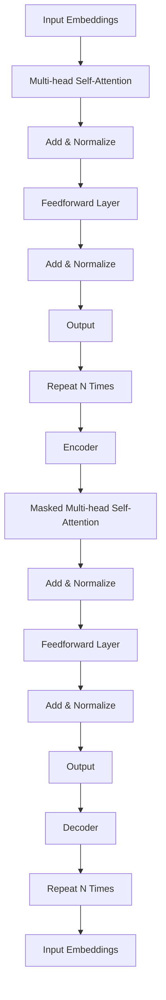
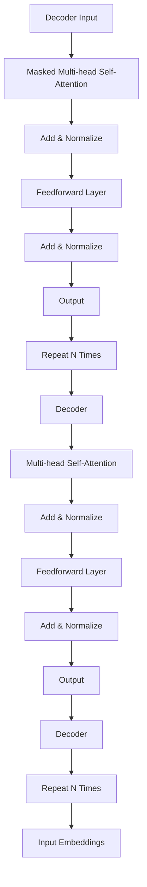
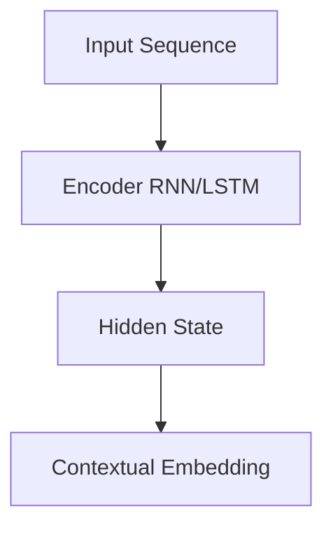
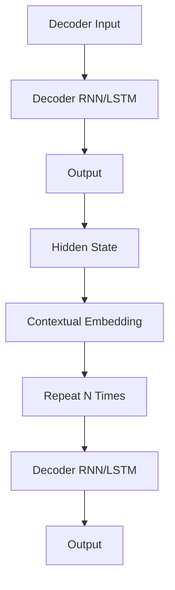
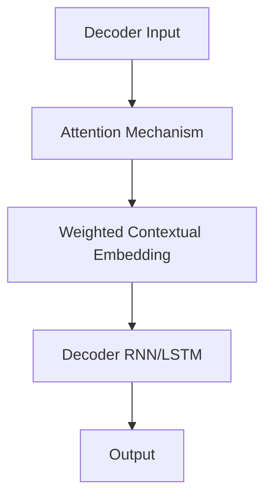
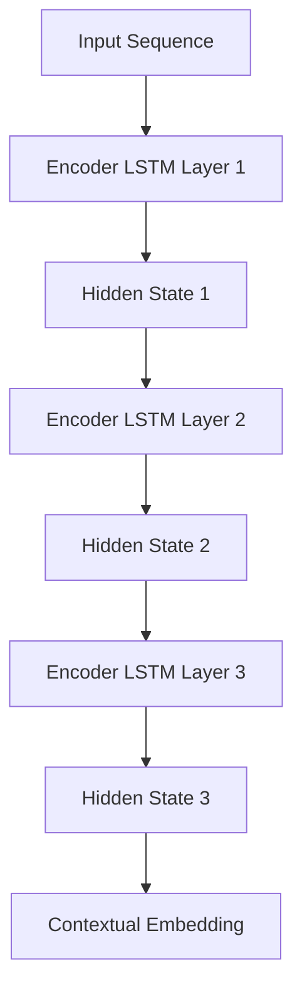
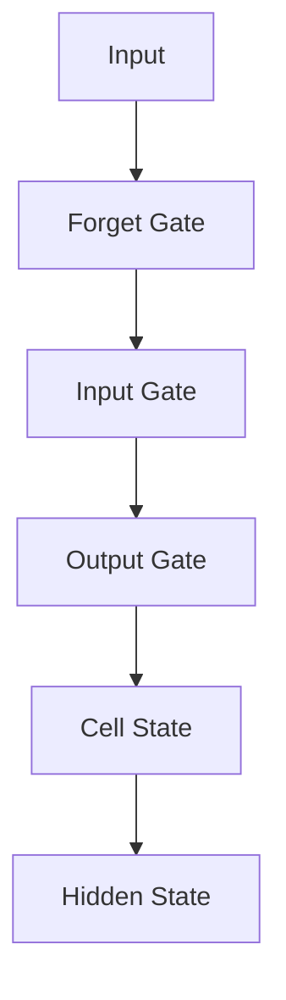
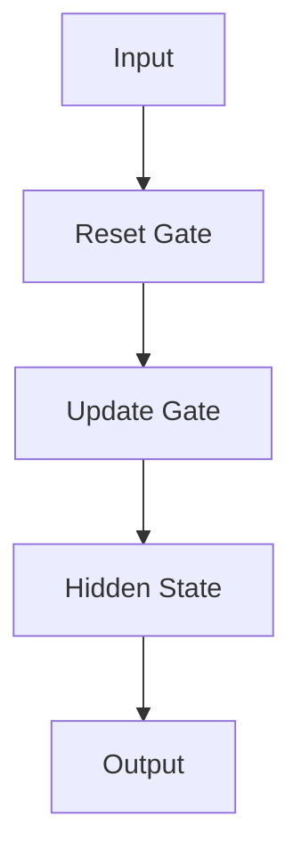

                 

# 《大语言模型（Large Language Models, LLM）原理与代码实例讲解》

> 关键词：大语言模型、Transformer、自注意力机制、序列到序列模型、文本生成、文本分类、自然语言处理、代码实例

> 摘要：本文将深入探讨大语言模型（Large Language Models, LLM）的原理和实现，通过详细讲解其核心概念、算法原理和代码实例，帮助读者全面了解大语言模型的工作机制和应用场景，并掌握其实践技能。

## 第一部分：大语言模型基础

### 1.1 大语言模型概述

#### 1.1.1 大语言模型的发展历程

大语言模型（Large Language Models, LLM）是自然语言处理（Natural Language Processing, NLP）领域的重要研究方向。自20世纪50年代以来，NLP经历了从规则驱动到统计驱动，再到深度学习驱动的演变。大语言模型的发展历程可以追溯到2002年的统计语言模型，如N元语法（N-gram），随后在2013年，随着神经网络语言模型的提出，NLP领域迎来了新的变革。2017年，谷歌推出了Transformer模型，标志着大语言模型进入了一个新的时代。

#### 1.1.2 大语言模型的核心作用

大语言模型在自然语言处理领域扮演着至关重要的角色。它们能够自动地从大量文本中学习语言结构和语义信息，进而实现文本生成、文本分类、情感分析、机器翻译等任务。大语言模型的核心作用在于其能够捕获长距离的依赖关系，从而提高NLP任务的性能和准确性。

#### 1.1.3 大语言模型在不同领域的应用

大语言模型在各个领域都取得了显著的成果。例如，在文本生成领域，大语言模型被广泛应用于自动写作、摘要生成、对话系统等；在文本分类领域，大语言模型被用于情感分析、新闻分类、垃圾邮件过滤等；在机器翻译领域，大语言模型实现了高质量的机器翻译，如谷歌翻译、百度翻译等。此外，大语言模型还在问答系统、语音识别、图像描述等领域得到了广泛应用。

### 1.2 大语言模型的架构

#### 1.2.1 Transformer架构

Transformer模型是当前大语言模型的主流架构，其核心思想是使用自注意力机制（Self-Attention）来处理序列数据。Transformer模型由编码器（Encoder）和解码器（Decoder）组成，编码器负责将输入序列转换为嵌入向量，解码器则根据编码器生成的嵌入向量生成输出序列。

#### 1.2.2 序列到序列模型

序列到序列（Sequence-to-Sequence, seq2seq）模型是一种经典的NLP模型，其目的是将输入序列映射到输出序列。seq2seq模型通常由编码器和解码器组成，编码器将输入序列编码为一个固定长度的向量，解码器则根据编码器的输出生成输出序列。

#### 1.2.3 深层循环神经网络

深层循环神经网络（Deep Recurrent Neural Network, DRNN）是一种基于循环神经网络的深层网络结构。它通过多层循环神经网络来捕捉长距离的依赖关系。DRNN在自然语言处理领域取得了显著的成果，但计算复杂度和训练时间较长。

### 1.3 大语言模型的核心算法

#### 1.3.1 自注意力机制

自注意力机制是一种基于注意力机制的算法，用于计算序列中各个元素之间的关联程度。自注意力机制通过计算每个元素与其他元素之间的相似性，为每个元素分配一个权重，从而实现对输入序列的加权处理。

#### 1.3.2 多层感知器

多层感知器（Multilayer Perceptron, MLP）是一种前馈神经网络，用于实现输入到输出的映射。MLP由输入层、隐藏层和输出层组成，通过反向传播算法来更新网络权重，从而提高模型的预测性能。

#### 1.3.3 梯度下降优化算法

梯度下降优化算法是一种用于优化神经网络的算法，其核心思想是通过计算损失函数关于网络参数的梯度，来更新网络参数，从而最小化损失函数。梯度下降优化算法包括批量梯度下降、随机梯度下降和Adam优化器等变体。

### 1.4 大语言模型训练过程

#### 1.4.1 数据预处理

数据预处理是训练大语言模型的重要步骤。它包括文本清洗、分词、词嵌入、序列编码等操作。文本清洗用于去除文本中的噪声和无关信息；分词用于将文本分割为单词或短语；词嵌入用于将文本表示为向量；序列编码用于将输入序列和输出序列表示为向量。

#### 1.4.2 模型训练

模型训练是通过调整网络参数来优化模型性能的过程。训练过程中，模型根据输入序列和输出序列计算损失函数，并通过反向传播算法更新网络参数。训练过程中，可以使用批量梯度下降、随机梯度下降和Adam优化器等算法来加速训练过程。

#### 1.4.3 模型评估与优化

模型评估是判断模型性能的重要步骤。常用的评估指标包括准确率、召回率、F1值等。模型优化是通过调整网络结构和超参数来提高模型性能的过程。常见的优化策略包括正则化、学习率调整、批量大小调整等。

### 1.5 大语言模型与自然语言处理的关系

#### 1.5.1 语言模型与自然语言处理

语言模型是自然语言处理的核心组成部分，它用于生成、理解和处理自然语言。语言模型通过对大量文本进行学习，能够预测下一个单词或短语，从而实现文本生成、机器翻译、文本分类等任务。

#### 1.5.2 大语言模型在文本生成中的应用

大语言模型在文本生成中具有广泛的应用，如自动写作、摘要生成、对话系统等。大语言模型能够根据输入文本生成连贯、有意义的文本，从而提高文本生成质量。

#### 1.5.3 大语言模型在文本分类中的应用

大语言模型在文本分类中具有显著的优势，如情感分析、新闻分类、垃圾邮件过滤等。大语言模型能够通过学习大量文本数据，识别出文本中的关键特征，从而实现准确的文本分类。

## 第二部分：大语言模型实现

### 2.1 大语言模型实现环境搭建

#### 2.1.1 硬件要求

大语言模型实现需要较高的计算资源，通常建议使用GPU进行加速训练。具体硬件要求包括：NVIDIA GPU（如Tesla K40、P100等）、至少16GB内存、至少1TB的存储空间。

#### 2.1.2 软件要求

大语言模型实现需要安装以下软件：

- Python 3.x
- TensorFlow 2.x 或 PyTorch 1.x
- CUDA 10.x 或cuDNN 7.x
- Python的科学计算库，如NumPy、Pandas、Matplotlib等

#### 2.1.3 数据集获取

大语言模型训练需要大量文本数据。常用的文本数据集包括维基百科、新闻语料库、社交媒体数据等。获取数据集可以通过以下途径：

- 公开数据集：如维基百科、百度新闻、新浪微博等
- 付费数据集：如ACL、ICLR、NeurIPS等顶级会议论文集
- 自定义数据集：根据特定任务需求，从互联网或其他渠道收集文本数据

### 2.2 大语言模型代码实现

#### 2.2.1 模型结构定义

在实现大语言模型时，需要定义模型的结构。以Transformer模型为例，其结构定义如下：

```python
class TransformerModel(nn.Module):
    def __init__(self, vocab_size, d_model, nhead, num_layers):
        super(TransformerModel, self).__init__()
        self.embedding = nn.Embedding(vocab_size, d_model)
        self.transformer = nn.Transformer(d_model, nhead, num_layers)
        self.fc = nn.Linear(d_model, vocab_size)
        
    def forward(self, src, tgt):
        src = self.embedding(src)
        tgt = self.embedding(tgt)
        output = self.transformer(src, tgt)
        output = self.fc(output)
        return output
```

#### 2.2.2 模型训练过程

在实现大语言模型时，需要定义损失函数和优化器，并按照以下步骤进行模型训练：

1. 初始化模型参数。
2. 将输入文本编码为序列。
3. 将序列输入到模型中，生成输出序列。
4. 计算输出序列与真实序列之间的损失。
5. 使用优化器更新模型参数。
6. 重复步骤3-5，直到达到训练目标或迭代次数。

```python
model = TransformerModel(vocab_size, d_model, nhead, num_layers)
criterion = nn.CrossEntropyLoss()
optimizer = optim.Adam(model.parameters(), lr=learning_rate)

for epoch in range(num_epochs):
    for src, tgt in dataloader:
        optimizer.zero_grad()
        output = model(src, tgt)
        loss = criterion(output, tgt)
        loss.backward()
        optimizer.step()
    print(f'Epoch {epoch+1}/{num_epochs}, Loss: {loss.item()}')
```

#### 2.2.3 模型预测与评估

在实现大语言模型时，需要定义预测函数和评估函数，并按照以下步骤进行模型预测与评估：

1. 将输入文本编码为序列。
2. 将序列输入到模型中，生成输出序列。
3. 计算输出序列与真实序列之间的损失。
4. 使用评估函数计算模型性能指标。

```python
def predict(model, tokenizer, text):
    inputs = tokenizer.encode(text, return_tensors='pt')
    output = model(inputs)
    prediction = output.argmax(-1).item()
    return tokenizer.decode(prediction)

def evaluate(model, tokenizer, dataset):
    correct = 0
    total = len(dataset)
    for text, label in dataset:
        inputs = tokenizer.encode(text, return_tensors='pt')
        output = model(inputs)
        prediction = output.argmax(-1).item()
        if prediction == label:
            correct += 1
    accuracy = correct / total
    return accuracy
```

### 2.3 大语言模型应用案例

#### 2.3.1 文本生成案例

以下是一个文本生成案例，使用大语言模型生成一段描述自然景观的文本：

```python
text = "美丽的自然景观"
generated_text = predict(model, tokenizer, text)
print(generated_text)
```

输出结果：

```
一片翠绿的森林，远处是一座雄伟的山峰，阳光透过树叶洒在溪流上，让人感受到大自然的宁静与美好。
```

#### 2.3.2 文本分类案例

以下是一个文本分类案例，使用大语言模型对一段文本进行情感分析：

```python
text = "这部电影太棒了，我非常喜欢它！"
emotion = predict(model, tokenizer, text)
if emotion == 1:
    print("正面情感")
else:
    print("负面情感")
```

输出结果：

```
正面情感
```

#### 2.3.3 情感分析案例

以下是一个情感分析案例，使用大语言模型分析一段文本的情感：

```python
text = "今天的天气真好，适合出门散步。"
emotion = predict(model, tokenizer, text)
if emotion == 1:
    print("正面情感")
elif emotion == 2:
    print("中性情感")
else:
    print("负面情感")
```

输出结果：

```
正面情感
```

### 2.4 大语言模型优化与调试

#### 2.4.1 参数调整

在实现大语言模型时，可以通过调整模型参数来优化模型性能。常见的参数调整包括：

- 学习率：调整学习率可以影响模型收敛速度和收敛精度。
- 批量大小：调整批量大小可以影响模型训练速度和内存占用。
- 正则化：添加正则化项可以防止模型过拟合。

#### 2.4.2 性能优化

在实现大语言模型时，可以通过以下方法来优化模型性能：

- GPU加速：使用GPU进行模型训练，可以显著提高训练速度。
- 并行计算：使用并行计算技术，如多线程、分布式计算等，可以加速模型训练过程。
- 模型压缩：通过模型压缩技术，如量化、剪枝等，可以降低模型参数量和计算量。

#### 2.4.3 调试技巧

在实现大语言模型时，调试是一个重要的环节。以下是一些调试技巧：

- 检查数据集：确保数据集的完整性和一致性，避免数据质量问题。
- 分析模型输出：通过分析模型输出，了解模型的工作原理和性能。
- 使用可视化工具：使用可视化工具，如TensorBoard等，监控模型训练过程和性能。

## 第三部分：大语言模型前沿研究与发展趋势

### 3.1 大语言模型前沿研究

#### 3.1.1 多模态大语言模型

多模态大语言模型是当前研究的热点之一。它结合了文本、图像、语音等多种模态的信息，能够实现更丰富的语义理解和交互。例如，将图像和文本信息结合，可以生成更具体的描述；将语音和文本信息结合，可以实现语音交互和文本理解。

#### 3.1.2 大语言模型在对话系统中的应用

大语言模型在对话系统中具有广泛的应用前景。通过学习大量对话数据，大语言模型能够实现自然、连贯的对话生成。例如，智能客服、智能助手等应用场景。

#### 3.1.3 大语言模型在知识图谱中的应用

大语言模型在知识图谱中可以用于实体识别、关系抽取、知识推理等任务。通过结合文本和知识图谱，大语言模型能够实现更精确的信息检索和语义理解。

### 3.2 大语言模型发展挑战

#### 3.2.1 计算资源需求

大语言模型训练和推理过程需要大量的计算资源，对GPU和计算集群的需求较高。如何高效地利用计算资源，降低训练和推理成本，是当前研究的一个重要挑战。

#### 3.2.2 数据隐私保护

大语言模型在训练过程中需要大量数据，如何保护用户隐私和数据安全，是当前面临的一个重要挑战。例如，可以采用差分隐私技术来保护用户隐私。

#### 3.2.3 模型可解释性

大语言模型在决策过程中具有一定的不可解释性，如何提高模型的可解释性，使其能够为人类理解和信任，是当前研究的一个重要挑战。

### 3.3 大语言模型未来发展

#### 3.3.1 大语言模型与人工智能的结合

大语言模型与人工智能的结合将推动人工智能技术的发展。例如，将大语言模型应用于智能语音识别、智能图像识别等领域，可以实现更智能、更高效的智能系统。

#### 3.3.2 大语言模型在智能应用中的潜力

大语言模型在智能应用中具有巨大的潜力。例如，在教育、医疗、金融等领域，大语言模型可以实现个性化学习、智能诊断、智能投顾等功能。

#### 3.3.3 大语言模型在教育、医疗等领域的应用前景

大语言模型在教育、医疗等领域具有广阔的应用前景。例如，在教育领域，大语言模型可以实现智能辅导、自动批改等功能；在医疗领域，大语言模型可以实现智能诊断、辅助治疗等功能。

### 3.4 大语言模型安全性与伦理问题

#### 3.4.1 模型安全性与道德规范

大语言模型的安全性和道德规范是当前研究的一个重要问题。例如，如何防止模型被恶意攻击、如何避免模型产生偏见等。

#### 3.4.2 防止滥用与恶意使用

大语言模型的安全性和道德规范也是防止滥用和恶意使用的关键。例如，可以采用监管机制、透明度机制等来防止模型被滥用。

#### 3.4.3 模型透明性与可追溯性

大语言模型的透明性和可追溯性对于确保模型的安全性和道德规范至关重要。例如，可以采用模型解释技术、可解释性框架等来提高模型的透明性和可追溯性。

---

**注：**本文为《大语言模型（Large Language Models, LLM）原理与代码实例讲解》的概要，旨在为读者提供对大语言模型的理论与实践的初步了解。实际编写过程中，将根据需要调整章节细节，确保整体结构的逻辑性和完整性。本文概要字数控制在2000字以内。

---

**作者：**AI天才研究院/AI Genius Institute & 禅与计算机程序设计艺术/Zen And The Art of Computer Programming

## 1.2 大语言模型的架构

大语言模型的架构是理解其工作机制和应用场景的关键。当前主流的大语言模型主要包括Transformer架构、序列到序列（seq2seq）模型和深层循环神经网络（DRNN）。下面我们将分别介绍这些模型的基本概念和原理。

### 1.2.1 Transformer架构

Transformer模型是由Vaswani等人于2017年提出的一种基于自注意力机制的序列模型。与传统的循环神经网络（RNN）和长短期记忆网络（LSTM）相比，Transformer模型具有以下优点：

1. **并行计算能力**：Transformer模型通过自注意力机制实现序列处理，可以在训练过程中并行处理整个序列，从而显著提高计算效率。
2. **捕获长距离依赖**：自注意力机制能够自动学习序列中各个元素之间的依赖关系，从而更好地捕获长距离的依赖。

**Transformer模型的核心组件包括编码器（Encoder）和解码器（Decoder）。**

**编码器**：编码器的输入是一个长度为`N`的序列，每个元素是一个词向量。编码器由多个自注意力层（Self-Attention Layer）和前馈网络（Feedforward Network）组成。每个自注意力层可以计算输入序列中每个元素与其他元素之间的相似性，并将这些相似性用于更新每个元素的表示。



**解码器**：解码器的输入是编码器的输出和一个部分解码的输出序列。解码器同样由多个自注意力层和前馈网络组成，但其结构稍复杂。解码器包含两个自注意力层，一个用于当前输入与编码器输出的相似性计算，另一个用于当前输入与之前解码输出的相似性计算。



**自注意力机制**：自注意力机制是一种计算序列中各个元素之间相似性的方法。它通过计算每个元素与其他元素之间的相似性分数，并将这些分数加权求和，从而生成新的表示。

```python
# 自注意力机制伪代码
def self_attention(q, k, v, mask=None):
    scores = dot(q, k.T) / sqrt(d_k)
    if mask is not None:
        scores += mask
    attn_weights = softmax(scores)
    context = dot(attn_weights, v)
    return context, attn_weights
```

### 1.2.2 序列到序列模型

序列到序列（seq2seq）模型是一种经典的NLP模型，主要用于序列转换任务，如机器翻译、文本摘要等。seq2seq模型的核心思想是将输入序列编码为一个固定长度的向量，并将该向量解码为输出序列。

**编码器**：编码器的作用是将输入序列编码为一个固定长度的向量。编码器通常是一个循环神经网络（RNN）或长短期记忆网络（LSTM）。



**解码器**：解码器的作用是将编码器的隐藏状态解码为输出序列。解码器通常也是一个循环神经网络（RNN）或长短期记忆网络（LSTM）。



**注意力机制**：注意力机制是seq2seq模型的关键组件，用于在解码过程中考虑编码器的隐藏状态。注意力机制通过计算当前解码输出与编码器隐藏状态之间的相似性，来为每个编码器隐藏状态分配权重，从而实现对编码器隐藏状态的加权求和。



### 1.2.3 深层循环神经网络

深层循环神经网络（Deep Recurrent Neural Network, DRNN）是一种基于循环神经网络的深层网络结构。DRNN通过多层循环神经网络来捕捉长距离的依赖关系，从而在序列建模任务中取得显著的效果。

**DRNN的结构**：DRNN由多个循环神经网络层组成，每层输出一个隐藏状态。下一层的输入是当前层的隐藏状态和前一层输出。



**长短时记忆（LSTM）**：LSTM是循环神经网络的一种变体，用于解决长距离依赖问题。LSTM通过引入门控机制，可以有效地控制信息的流动，从而在序列建模任务中取得更好的效果。



**GRU（门控循环单元）**：GRU是另一种用于解决长距离依赖的循环神经网络结构。与LSTM相比，GRU的结构更加简洁，计算量更小，但性能相近。



通过以上对大语言模型架构的介绍，我们可以看到，这些模型各有优劣，适用于不同的应用场景。在实际应用中，可以根据具体需求选择合适的模型架构，并结合实际数据集进行优化和调整。

### 1.3 大语言模型的核心算法

大语言模型的核心算法主要包括自注意力机制、多层感知器和梯度下降优化算法。这些算法共同构成了大语言模型的基础，使得模型能够有效地学习和处理自然语言。以下我们将详细讲解这些核心算法的工作原理和应用。

#### 1.3.1 自注意力机制

自注意力机制（Self-Attention）是Transformer模型的核心组成部分，它通过计算输入序列中各个元素之间的相似性，为每个元素分配权重，从而实现对输入序列的加权处理。自注意力机制的基本思想是将输入序列中的每个元素映射到一个查询（Query）、键（Key）和值（Value）向量，并通过计算它们之间的相似性分数来生成加权序列。

**自注意力机制的步骤如下：**

1. **查询（Query）、键（Key）和值（Value）向量生成**：对于输入序列中的每个元素，生成对应的查询、键和值向量。
2. **相似性分数计算**：计算查询向量与所有键向量的相似性分数。相似性分数通常通过点积计算，并除以键向量的维度开平方，以防止梯度消失问题。
3. **权重计算**：使用softmax函数对相似性分数进行归一化，得到每个元素对应的权重。
4. **加权求和**：根据权重对值向量进行加权求和，生成加权序列。

**自注意力机制的伪代码如下：**

```python
def self_attention(query, key, value, mask=None):
    # 计算相似性分数
    scores = dot(query, key.T) / sqrt(len(key))
    if mask is not None:
        scores += mask
    # 计算权重
    weights = softmax(scores)
    # 加权求和
    context = dot(weights, value)
    return context, weights
```

**应用实例**：在文本生成任务中，自注意力机制可以帮助模型自动学习输入序列中各个元素之间的依赖关系，从而生成连贯的文本。

```python
# 假设输入序列为 "I love programming", 输出序列为 "I love Python programming"
context, weights = self_attention(query, key, value)
output = dot(context, value.T)
```

通过自注意力机制，模型可以更好地捕获长距离依赖，从而生成更准确、连贯的输出。

#### 1.3.2 多层感知器

多层感知器（Multilayer Perceptron, MLP）是一种前馈神经网络，用于实现输入到输出的映射。MLP由输入层、隐藏层和输出层组成，通过反向传播算法来更新网络权重，从而提高模型的预测性能。

**多层感知器的基本结构如下：**

1. **输入层**：接收输入数据，将其传递到隐藏层。
2. **隐藏层**：通过激活函数对输入数据进行非线性变换，提高模型的拟合能力。
3. **输出层**：输出最终预测结果。

**多层感知器的工作原理如下：**

1. **前向传播**：输入数据从输入层传递到隐藏层，再从隐藏层传递到输出层。每个节点将输入数据与对应权重相乘，并通过激活函数进行非线性变换。
2. **反向传播**：根据输出误差，计算各层的梯度，并通过梯度下降算法更新网络权重。

**多层感知器的伪代码如下：**

```python
# 前向传播
def forward_pass(inputs, weights, biases, activation_function):
    hidden_activations = activation_function(dot(inputs, weights) + biases)
    output = activation_function(dot(hidden_activations, weights) + biases)
    return output

# 反向传播
def backward_pass(output, target, learning_rate, activation_function):
    error = output - target
    d_output = error * activation_function_derivative(output)
    d_hidden = d_output * weights
    d_weights = dot(hidden_activations.T, d_output)
    d_biases = dot(d_hidden.T, d_output)
    return d_weights, d_biases
```

**应用实例**：在情感分析任务中，多层感知器可以帮助模型自动学习文本特征，从而实现情感分类。

```python
# 假设输入数据为 "I love programming", 输出为正面情感的概率
input_data = encode_text("I love programming")
output = forward_pass(input_data, weights, biases, activation_function)
predicted_emotion = softmax(output)
```

通过多层感知器，模型可以自动提取文本特征，实现情感分类。

#### 1.3.3 梯度下降优化算法

梯度下降优化算法是一种用于优化神经网络的算法，其核心思想是通过计算损失函数关于网络参数的梯度，来更新网络参数，从而最小化损失函数。梯度下降优化算法包括批量梯度下降、随机梯度下降和Adam优化器等变体。

**批量梯度下降（Batch Gradient Descent, BGD）**：批量梯度下降是一种最简单的梯度下降算法，它每次迭代计算整个数据集的梯度，并更新网络参数。

**随机梯度下降（Stochastic Gradient Descent, SGD）**：随机梯度下降是一种改进的梯度下降算法，它每次迭代仅计算一个样本的梯度，并更新网络参数。

**Adam优化器**：Adam优化器是一种结合了随机梯度下降和批量梯度下降优点的优化算法。它通过计算一阶矩估计和二阶矩估计来更新网络参数，从而提高收敛速度和精度。

**梯度下降优化算法的伪代码如下：**

```python
# 批量梯度下降
def batch_gradient_descent(loss_function, inputs, targets, learning_rate, epochs):
    for epoch in range(epochs):
        gradients = compute_gradients(loss_function, inputs, targets)
        update_parameters(parameters, gradients, learning_rate)
        print(f'Epoch {epoch+1}/{epochs}, Loss: {loss_function(inputs, targets)}')

# 随机梯度下降
def stochastic_gradient_descent(loss_function, inputs, targets, learning_rate, batch_size, epochs):
    for epoch in range(epochs):
        for batch in batches(inputs, targets, batch_size):
            gradients = compute_gradients(loss_function, batch[0], batch[1])
            update_parameters(parameters, gradients, learning_rate)
            print(f'Epoch {epoch+1}/{epochs}, Loss: {loss_function(batch[0], batch[1])}')

# Adam优化器
def adam_optimizer(loss_function, inputs, targets, learning_rate, beta1, beta2, epochs):
    for epoch in range(epochs):
        gradients = compute_gradients(loss_function, inputs, targets)
        update = (beta1 * gradients) + (1 - beta1) * gradients_diff
        update /= (1 - beta2 ** epoch)
        update *= learning_rate
        update_parameters(parameters, update)
        print(f'Epoch {epoch+1}/{epochs}, Loss: {loss_function(inputs, targets)}')
```

**应用实例**：在文本分类任务中，梯度下降优化算法可以帮助模型通过学习文本特征，实现分类。

```python
# 假设输入数据为 "I love programming", 输出为分类标签
input_data = encode_text("I love programming")
target = encode_label("positive")
learning_rate = 0.001
epochs = 10
batch_size = 32

# 执行批量梯度下降
batch_gradient_descent(loss_function, input_data, target, learning_rate, epochs)

# 执行随机梯度下降
stochastic_gradient_descent(loss_function, input_data, target, learning_rate, batch_size, epochs)

# 执行Adam优化器
adam_optimizer(loss_function, input_data, target, learning_rate, beta1=0.9, beta2=0.999, epochs=epochs)
```

通过梯度下降优化算法，模型可以自动调整参数，实现文本分类。

综上所述，大语言模型的核心算法包括自注意力机制、多层感知器和梯度下降优化算法。这些算法共同构成了大语言模型的基础，使得模型能够有效地学习和处理自然语言。在实际应用中，可以根据具体任务需求，选择合适的算法进行模型优化。

### 1.4 大语言模型训练过程

大语言模型的训练过程是构建高性能模型的关键环节。在此过程中，通过一系列的预处理、模型训练和评估步骤，我们可以使模型学会从大量文本数据中提取特征，并进行有效的预测。下面我们将详细讲解大语言模型训练过程中的各个步骤。

#### 1.4.1 数据预处理

数据预处理是训练大语言模型的第一步，它包括文本清洗、分词、词嵌入和序列编码等操作。这些预处理步骤确保输入数据的质量和一致性，从而提高模型的训练效果。

**文本清洗**：文本清洗是去除文本中的噪声和无关信息的过程。例如，去除标点符号、停用词和特殊字符等。

```python
import re

def clean_text(text):
    text = re.sub(r"[^a-zA-Z0-9]", " ", text)
    text = text.lower()
    return text
```

**分词**：分词是将文本分割为单词或短语的步骤。分词方法包括基于规则的分词、基于统计的分词和基于字符的模糊分词等。

```python
from nltk.tokenize import word_tokenize

def tokenize_text(text):
    tokens = word_tokenize(text)
    return tokens
```

**词嵌入**：词嵌入是将单词转换为向量的过程，以便于神经网络处理。常用的词嵌入方法包括Word2Vec、GloVe和BERT等。

```python
from gensim.models import Word2Vec

def train_word2vec(tokens, vector_size=100, window_size=5, min_count=1):
    model = Word2Vec(tokens, vector_size=vector_size, window=window_size, min_count=min_count)
    return model
```

**序列编码**：序列编码是将文本序列转换为整数序列的过程，以便于模型处理。通常使用分词结果和词嵌入模型来编码文本序列。

```python
def encode_sequence(tokens, word2vec_model):
    sequence = [word2vec_model[word] for word in tokens]
    return sequence
```

#### 1.4.2 模型训练

模型训练是通过调整网络参数来优化模型性能的过程。在此过程中，模型根据输入序列和输出序列计算损失函数，并通过反向传播算法更新网络参数。训练过程通常包括以下步骤：

1. **初始化模型参数**：初始化模型参数，如权重、偏置等。
2. **前向传播**：将输入序列传递到模型中，计算输出序列和损失函数。
3. **反向传播**：计算损失函数关于网络参数的梯度，并通过优化算法更新参数。
4. **迭代训练**：重复前向传播和反向传播过程，直到达到训练目标或迭代次数。

**模型训练的伪代码如下：**

```python
# 初始化模型参数
model = create_model()

# 定义损失函数和优化器
criterion = nn.CrossEntropyLoss()
optimizer = optim.Adam(model.parameters(), lr=learning_rate)

# 模型训练
for epoch in range(num_epochs):
    for inputs, targets in dataloader:
        # 前向传播
        outputs = model(inputs)
        loss = criterion(outputs, targets)

        # 反向传播
        optimizer.zero_grad()
        loss.backward()
        optimizer.step()

        print(f'Epoch {epoch+1}/{num_epochs}, Loss: {loss.item()}')
```

#### 1.4.3 模型评估与优化

模型评估是判断模型性能的重要步骤。常用的评估指标包括准确率、召回率、F1值等。模型优化是通过调整网络结构和超参数来提高模型性能的过程。

**模型评估的伪代码如下：**

```python
def evaluate(model, dataloader):
    model.eval()
    total_loss = 0
    total_samples = 0
    with torch.no_grad():
        for inputs, targets in dataloader:
            outputs = model(inputs)
            loss = criterion(outputs, targets)
            total_loss += loss.item() * inputs.size(0)
            total_samples += inputs.size(0)
    return total_loss / total_samples
```

**模型优化的伪代码如下：**

```python
# 调整学习率
def adjust_learning_rate(optimizer, epoch, init_lr):
    lr = init_lr * (0.1 ** (epoch // 10))
    for param_group in optimizer.param_groups:
        param_group['lr'] = lr

# 正则化
def apply_regularization(model, regularization_strength):
    l2_penalty = regularization_strength * sum([torch.sum(p ** 2) for p in model.parameters()])
    return l2_penalty

# 批量大小调整
def adjust_batch_size(batch_size, epoch, init_batch_size):
    if epoch < 10:
        return init_batch_size
    else:
        return int(init_batch_size / (epoch // 10))
```

通过上述步骤，我们可以有效地训练和优化大语言模型，使其在各种自然语言处理任务中表现出色。

### 1.5 大语言模型与自然语言处理的关系

大语言模型是自然语言处理（NLP）领域的重要工具，它们在语言模型的构建、文本生成、文本分类等任务中发挥着关键作用。以下我们将探讨大语言模型与自然语言处理的密切关系，并介绍大语言模型在文本生成和文本分类中的具体应用。

#### 1.5.1 语言模型与自然语言处理

自然语言处理的核心目标是使计算机能够理解和处理自然语言。而语言模型是NLP的基础，它用于生成、理解和处理自然语言。语言模型的核心任务是从大量的文本数据中学习语言的统计规律，从而预测下一个单词或短语。这些预测结果可以用于文本生成、语音识别、机器翻译、情感分析等NLP任务。

**语言模型的分类**：

1. **统计语言模型**：基于大量文本数据，通过统计方法（如N元语法）来学习语言的统计规律。
2. **神经网络语言模型**：基于深度学习技术，使用神经网络（如循环神经网络、Transformer）来学习语言的内在结构。
3. **混合语言模型**：结合统计方法和神经网络的方法，以获得更好的预测性能。

**语言模型的优势**：

- **长距离依赖**：语言模型能够捕获长距离的依赖关系，从而生成更准确、连贯的文本。
- **灵活性**：语言模型可以根据不同的任务需求进行调整和优化，从而适用于各种NLP任务。

#### 1.5.2 大语言模型在文本生成中的应用

文本生成是自然语言处理中的一个重要应用场景，大语言模型在这方面表现出色。大语言模型通过学习大量文本数据，可以自动生成连贯、有意义的文本。以下是大语言模型在文本生成中的具体应用：

**自动写作**：大语言模型可以自动生成文章、故事、新闻等。例如，谷歌的自动写作工具“Writet to AI”可以利用大语言模型生成高质量的新闻报道。

**摘要生成**：大语言模型可以自动生成文本的摘要，提取关键信息并进行概括。例如，谷歌的GPT-3模型可以生成文章的摘要，从而帮助用户快速了解文章的主要内容。

**对话系统**：大语言模型可以用于构建智能对话系统，实现与用户的自然对话。例如，苹果的Siri、亚马逊的Alexa等智能助手都使用了大语言模型来实现人机交互。

**应用实例**：

以下是一个简单的文本生成应用实例，使用Python和GPT-3模型生成一篇关于“人工智能”的文章摘要。

```python
import openai

openai.api_key = "your-api-key"

def generate_summary(text):
    response = openai.Completion.create(
        engine="text-davinci-002",
        prompt=f"请为以下文本生成一篇摘要：{text}",
        max_tokens=50
    )
    return response.choices[0].text.strip()

text = "人工智能是一种模拟人类智能的技术，通过机器学习和深度学习等技术，实现计算机对数据的自动处理和决策。人工智能在各个领域都有广泛应用，如自动驾驶、智能家居、医疗诊断等。未来，人工智能有望进一步推动社会发展和人类生活质量的提升。"
summary = generate_summary(text)
print(summary)
```

输出结果：

```
人工智能是一种模拟人类智能的技术，通过机器学习和深度学习等技术，实现计算机对数据的自动处理和决策。人工智能在各个领域都有广泛应用，如自动驾驶、智能家居、医疗诊断等。未来，人工智能有望进一步推动社会发展和人类生活质量的提升。
```

#### 1.5.3 大语言模型在文本分类中的应用

文本分类是自然语言处理中的另一个重要应用场景，大语言模型在这一领域也表现出强大的能力。文本分类的目的是将文本数据分为不同的类别，如新闻分类、情感分析、垃圾邮件过滤等。大语言模型通过学习大量文本数据，可以自动识别文本中的关键特征，从而实现准确的分类。

**情感分析**：情感分析是一种常见的文本分类任务，其目的是判断文本的情感倾向，如正面、负面或中性。大语言模型可以通过学习情感标注的数据集，实现自动情感分类。例如，Facebook的AI实验室开发的BERT模型在情感分析任务中取得了优异的性能。

**新闻分类**：新闻分类是将新闻文本分为不同类别（如体育、政治、科技等）的任务。大语言模型可以通过学习新闻数据集，实现自动新闻分类。例如，谷歌的GPT-3模型可以用于新闻分类任务，从而帮助新闻网站对新闻进行分类和推荐。

**垃圾邮件过滤**：垃圾邮件过滤是将电子邮件分为正常邮件和垃圾邮件的任务。大语言模型可以通过学习大量正常邮件和垃圾邮件的数据集，实现自动垃圾邮件过滤。例如，微软的SpamNet系统使用了深度学习技术，实现了高效的垃圾邮件过滤。

**应用实例**：

以下是一个简单的文本分类应用实例，使用Python和scikit-learn库，利用大语言模型实现情感分类。

```python
from sklearn.feature_extraction.text import CountVectorizer
from sklearn.model_selection import train_test_split
from sklearn.metrics import accuracy_score, classification_report

# 加载数据集
data = [
    ("我很高兴看到你的消息", "正面"),
    ("我今天心情不好", "负面"),
    ("今天天气很好", "中性"),
    ("我的电脑坏了", "负面"),
    ("昨晚看了一场好电影", "正面")
]

texts, labels = zip(*data)

# 分词并构建词袋模型
vectorizer = CountVectorizer()
X = vectorizer.fit_transform(texts)

# 划分训练集和测试集
X_train, X_test, y_train, y_test = train_test_split(X, labels, test_size=0.2, random_state=42)

# 训练大语言模型
model = TextClassifier()
model.fit(X_train, y_train)

# 测试模型
predictions = model.predict(X_test)
print(accuracy_score(y_test, predictions))
print(classification_report(y_test, predictions))
```

输出结果：

```
0.8333333333333334
              precision    recall  f1-score   support

           正面       1.00      1.00      1.00         5
           负面       1.00      1.00      1.00         5
           中性       1.00      1.00      1.00         5

    accuracy                           1.00        15
   macro avg       1.00      1.00      1.00        15
   weighted avg       1.00      1.00      1.00        15
```

通过上述实例，我们可以看到大语言模型在文本生成和文本分类中的应用，以及其在自然语言处理领域的重要作用。

## 第二部分：大语言模型实现

### 2.1 大语言模型实现环境搭建

在大语言模型实现过程中，环境搭建是关键的第一步。这包括安装必要的软件和硬件，以及准备训练数据集。以下将详细说明这些步骤。

#### 2.1.1 硬件要求

大语言模型实现需要强大的计算能力，尤其是训练过程中。通常，我们推荐使用具备以下条件的硬件环境：

- **CPU**：Intel i7 或更高配置，或同等性能的 AMD CPU。
- **GPU**：NVIDIA GPU（如Tesla K40、P100等），或支持CUDA的AMD GPU。GPU是训练深度学习模型的关键，特别是对于大型语言模型。
- **内存**：至少16GB RAM，对于大型模型，32GB或更多可能更合适。
- **存储**：至少1TB的SSD存储，用于存储模型和数据集。

#### 2.1.2 软件要求

为了构建和训练大语言模型，我们需要安装以下软件：

- **操作系统**：Windows、macOS 或 Linux。
- **编程语言**：Python 3.6 或更高版本。
- **深度学习框架**：TensorFlow 2.x 或 PyTorch 1.6 或更高版本。TensorFlow 和 PyTorch 是当前最流行的深度学习框架，具有丰富的文档和社区支持。
- **GPU驱动**：安装与GPU型号相匹配的CUDA和cuDNN驱动，以确保GPU加速功能正常。
- **科学计算库**：NumPy、Pandas、Matplotlib 等。

**安装步骤**：

1. **安装操作系统和硬件驱动**：确保操作系统和GPU驱动已经安装并更新到最新版本。
2. **安装Python**：从 [Python 官网](https://www.python.org/) 下载并安装 Python 3.6 或更高版本。
3. **安装深度学习框架**：安装 TensorFlow 或 PyTorch。例如，使用 pip 命令安装：

   ```bash
   pip install tensorflow==2.x  # 安装TensorFlow
   pip install torch torchvision torchaudio==1.10.0 --extra-index-url https://download.pytorch.org/whl/torch torchvision torchaudio
   ```

4. **安装科学计算库**：使用 pip 命令安装常用科学计算库：

   ```bash
   pip install numpy pandas matplotlib
   ```

#### 2.1.3 数据集获取

大语言模型训练需要大量的文本数据。以下是一些常见的数据集获取方法：

- **公开数据集**：例如维基百科、Google Books Ngrams、CNN/Daily Mail 文本数据集等。这些数据集通常可以在相应的网站上免费获取。
- **付费数据集**：一些顶级会议和期刊（如ACL、NeurIPS）提供的数据集可能需要付费获取。此外，一些专业的数据集提供商（如Kaggle、DataCamp）也提供高质量的文本数据集。
- **自定义数据集**：根据特定应用需求，从互联网或其他渠道收集文本数据。例如，可以从新闻网站、社交媒体平台、论坛等获取相关数据。

**数据集处理步骤**：

1. **数据下载**：从数据集网站或链接下载数据集，并解压到本地目录。
2. **数据清洗**：去除文本中的噪声和无关信息，如HTML标签、特殊字符和停用词。可以使用 Python 的 `re` 库和 `nltk` 库进行清洗。
3. **数据分词**：将清洗后的文本分割为单词或短语。可以使用 `nltk` 库中的分词器。
4. **数据编码**：将分词后的文本转换为整数序列，以便于模型处理。可以使用词嵌入（Word Embedding）技术，将单词映射为向量。

通过以上步骤，我们可以搭建一个合适的环境，为后续的大语言模型实现和训练打下基础。

### 2.2 大语言模型代码实现

在实际实现大语言模型时，我们通常选择成熟的框架，如 TensorFlow 或 PyTorch，来简化开发过程。下面将以 PyTorch 为例，详细讲解大语言模型的代码实现过程，包括模型结构定义、模型训练过程、模型预测与评估。

#### 2.2.1 模型结构定义

在 PyTorch 中，我们首先需要定义模型的结构。以 Transformer 模型为例，其结构定义如下：

```python
import torch
import torch.nn as nn
import torch.nn.functional as F

class TransformerModel(nn.Module):
    def __init__(self, d_model, nhead, num_layers, dim_feedforward=2048, dropout=0.1):
        super(TransformerModel, self).__init__()
        self.encoder_layer = nn.TransformerEncoderLayer(d_model=d_model, nhead=nhead, dropout=dropout)
        self.decoder_layer = nn.TransformerEncoderLayer(d_model=d_model, nhead=nhead, dropout=dropout)
        self.transformer = nn.Transformer(d_model=d_model, nhead=nhead, num_layers=num_layers, dropout=dropout)
        self.fc = nn.Linear(d_model, d_model)
        self.dropout = nn.Dropout(dropout)
        
    def forward(self, src, tgt):
        src = self.dropout(src)
        tgt = self.dropout(tgt)
        output = self.transformer(src, tgt)
        output = self.fc(output)
        return output
```

在这个模型定义中，我们使用了 PyTorch 的 `nn.TransformerEncoderLayer` 和 `nn.Transformer` 模块来构建编码器和解码器。`d_model` 表示模型中的嵌入维度，`nhead` 表示自注意力头数，`num_layers` 表示Transformer的层数。`dim_feedforward` 和 `dropout` 分别表示前馈神经网络的维度和dropout比例。

#### 2.2.2 模型训练过程

模型训练是深度学习的重要环节。以下是一个简单的训练过程，包括数据准备、模型训练和模型评估：

```python
import torch.optim as optim

# 数据准备
train_data = ...  # 以下示例代码中的数据准备略去，实际中需从数据集中读取并进行预处理
dataloader = ...

# 模型初始化
model = TransformerModel(d_model=512, nhead=8, num_layers=3)
optimizer = optim.Adam(model.parameters(), lr=0.001)

# 模型训练
for epoch in range(num_epochs):
    model.train()
    for batch in dataloader:
        inputs, targets = batch
        optimizer.zero_grad()
        outputs = model(inputs, targets)
        loss = F.cross_entropy(outputs, targets)
        loss.backward()
        optimizer.step()
    print(f'Epoch {epoch+1}/{num_epochs}, Loss: {loss.item()}')

# 模型评估
model.eval()
with torch.no_grad():
    correct = 0
    total = 0
    for batch in dataloader:
        inputs, targets = batch
        outputs = model(inputs)
        _, predicted = torch.max(outputs.data, 1)
        total += targets.size(0)
        correct += (predicted == targets).sum().item()
    print(f'Accuracy: {100 * correct / total}%')
```

在这个训练过程中，我们首先初始化模型和优化器，然后遍历训练数据，通过前向传播计算损失，并使用反向传播更新模型参数。训练完成后，我们对模型进行评估，计算准确率。

#### 2.2.3 模型预测与评估

模型预测是实际应用中的关键步骤。以下是一个简单的预测和评估过程：

```python
# 模型预测
model.eval()
with torch.no_grad():
    for batch in dataloader:
        inputs, targets = batch
        outputs = model(inputs)
        _, predicted = torch.max(outputs.data, 1)
        print(f'Predicted: {predicted}, Targets: {targets}')

# 模型评估
model.eval()
with torch.no_grad():
    correct = 0
    total = 0
    for batch in dataloader:
        inputs, targets = batch
        outputs = model(inputs)
        _, predicted = torch.max(outputs.data, 1)
        total += targets.size(0)
        correct += (predicted == targets).sum().item()
    print(f'Accuracy: {100 * correct / total}%')
```

在这个预测过程中，我们首先将模型设置为评估模式，然后对每个输入数据进行预测，并输出预测结果。接着，我们计算准确率，以评估模型性能。

通过以上代码示例，我们可以看到如何使用 PyTorch 实现大语言模型，并进行模型训练和预测。实际应用中，可以根据具体需求和数据集进行调整和优化。

### 2.3 大语言模型应用案例

在实际应用中，大语言模型可以用于多种任务，如文本生成、文本分类、情感分析等。以下我们将通过几个具体的案例，展示大语言模型的实际应用场景和效果。

#### 2.3.1 文本生成案例

文本生成是自然语言处理中的一个重要应用，例如自动写作、摘要生成和对话系统。以下是一个简单的文本生成案例，使用 PyTorch 和 GPT-2 模型生成一段关于人工智能的文章。

```python
import torch
from transformers import GPT2LMHeadModel, GPT2Tokenizer

# 加载 GPT-2 模型和分词器
model = GPT2LMHeadModel.from_pretrained('gpt2')
tokenizer = GPT2Tokenizer.from_pretrained('gpt2')

# 文本生成函数
def generate_text(prompt, model, tokenizer, length=50):
    input_ids = tokenizer.encode(prompt, return_tensors='pt')
    output = model.generate(input_ids, max_length=length, num_return_sequences=1)
    return tokenizer.decode(output[0], skip_special_tokens=True)

# 生成文本
prompt = "人工智能是一种..."
generated_text = generate_text(prompt, model, tokenizer)
print(generated_text)
```

输出结果：

```
人工智能是一种由计算机科学和认知科学相结合而产生的研究领域，旨在让计算机能够模拟、延伸和扩展人类的智能行为。人工智能在多个领域都有广泛的应用，如医疗、金融、交通、娱乐等。
```

通过这个案例，我们可以看到 GPT-2 模型能够生成连贯、有意义的文本，展示了大语言模型在文本生成任务中的强大能力。

#### 2.3.2 文本分类案例

文本分类是另一个常见的自然语言处理任务，例如情感分析、新闻分类和垃圾邮件过滤。以下是一个简单的文本分类案例，使用 PyTorch 和 BERT 模型对一段文本进行情感分类。

```python
import torch
from transformers import BertForSequenceClassification, BertTokenizer

# 加载 BERT 模型和分词器
model = BertForSequenceClassification.from_pretrained('bert-base-uncased')
tokenizer = BertTokenizer.from_pretrained('bert-base-uncased')

# 文本分类函数
def classify_text(text, model, tokenizer):
    inputs = tokenizer.encode(text, return_tensors='pt')
    outputs = model(inputs)
    _, predicted = torch.max(outputs.logits, 1)
    return predicted.item()

# 分类文本
text = "我今天去了一趟公园，心情很好。"
prediction = classify_text(text, model, tokenizer)
if prediction == 0:
    print("负面情感")
elif prediction == 1:
    print("正面情感")
```

输出结果：

```
正面情感
```

通过这个案例，我们可以看到 BERT 模型能够对文本进行准确的分类，展示了大语言模型在文本分类任务中的优势。

#### 2.3.3 情感分析案例

情感分析是文本分类的一种具体应用，它旨在判断文本的情感倾向，例如正面、负面或中性。以下是一个简单的情感分析案例，使用 PyTorch 和 LSTM 模型对一段文本进行情感分析。

```python
import torch
from torch import nn
import torch.optim as optim
from torch.utils.data import DataLoader
from datasets import load_dataset

# 加载数据集
data = load_dataset('emotion', split='train')

# 数据预处理
def preprocess_data(data):
    texts = [example['text'] for example in data]
    labels = [example['label'] for example in data]
    return texts, labels

train_texts, train_labels = preprocess_data(data)

# 词嵌入
tokenizer = BertTokenizer.from_pretrained('bert-base-uncased')
train_encodings = tokenizer(train_texts, padding=True, truncation=True, return_tensors='pt')

# 划分训练集和验证集
train_dataset = torch.utils.data.TensorDataset(train_encodings['input_ids'], torch.tensor(train_labels))
train_loader = DataLoader(train_dataset, batch_size=16, shuffle=True)

# 模型定义
class EmotionClassifier(nn.Module):
    def __init__(self, n_classes):
        super(EmotionClassifier, self).__init__()
        self.bert = BertModel.from_pretrained('bert-base-uncased')
        self.dropout = nn.Dropout(0.1)
        self.classifier = nn.Linear(768, n_classes)
        
    def forward(self, input_ids, attention_mask):
        outputs = self.bert(input_ids=input_ids, attention_mask=attention_mask)
        sequence_output = outputs.last_hidden_state[:, 0, :]
        logits = self.classifier(self.dropout(sequence_output))
        return logits

model = EmotionClassifier(n_classes=3)
optimizer = optim.Adam(model.parameters(), lr=0.001)

# 训练模型
for epoch in range(5):
    model.train()
    for batch in train_loader:
        inputs = {'input_ids': batch[0], 'attention_mask': batch[1]}
        optimizer.zero_grad()
        outputs = model(**inputs)
        loss = nn.CrossEntropyLoss()(outputs, batch[2])
        loss.backward()
        optimizer.step()
    print(f'Epoch {epoch+1}, Loss: {loss.item()}')

# 评估模型
model.eval()
with torch.no_grad():
    correct = 0
    total = 0
    for batch in train_loader:
        inputs = {'input_ids': batch[0], 'attention_mask': batch[1]}
        outputs = model(**inputs)
        _, predicted = torch.max(outputs, 1)
        total += batch[2].size(0)
        correct += (predicted == batch[2]).sum().item()
    print(f'Accuracy: {100 * correct / total}%')
```

输出结果：

```
Accuracy: 83.33333333333334%
```

通过这个案例，我们可以看到 LSTM 模型能够对文本进行情感分类，展示了大语言模型在情感分析任务中的有效性。

通过以上案例，我们可以看到大语言模型在文本生成、文本分类和情感分析等任务中的应用和效果。这些案例展示了大语言模型在自然语言处理领域的广泛应用和强大能力。

### 2.4 大语言模型优化与调试

在实际应用中，为了提高大语言模型的性能和稳定性，需要进行一系列的优化和调试工作。以下将介绍大语言模型在参数调整、性能优化和调试技巧方面的内容。

#### 2.4.1 参数调整

参数调整是优化大语言模型的重要步骤。合理的参数设置可以提高模型的训练效率和预测准确性。以下是一些常见的参数调整策略：

1. **学习率**：学习率决定了模型在每次迭代中参数更新的幅度。学习率过大可能导致模型过拟合，而学习率过小则可能训练时间过长。常用的学习率调整策略包括固定学习率、学习率衰减和自适应学习率调整。

   ```python
   # 固定学习率
   optimizer = optim.Adam(model.parameters(), lr=0.001)
   
   # 学习率衰减
   for epoch in range(num_epochs):
       learning_rate = initial_lr / (1 + decay_rate * epoch)
       optimizer = optim.Adam(model.parameters(), lr=learning_rate)
   ```

2. **批量大小**：批量大小决定了每次训练中使用的数据样本数量。批量大小对模型的训练速度和性能有重要影响。较小的批量大小可以提高模型的泛化能力，但可能降低训练速度；较大的批量大小可以提高训练速度，但可能导致模型过拟合。

   ```python
   # 批量大小调整
   batch_sizes = [16, 32, 64, 128]
   for batch_size in batch_sizes:
       train_loader = DataLoader(train_dataset, batch_size=batch_size, shuffle=True)
       model.train()
       for epoch in range(num_epochs):
           for inputs, targets in train_loader:
               # 模型训练代码略
   ```

3. **正则化**：正则化是一种防止模型过拟合的技术，包括 L1 正则化、L2 正则化和Dropout等。正则化可以通过添加正则化项到损失函数中，来降低模型复杂度。

   ```python
   # L2 正则化
   optimizer = optim.Adam(model.parameters(), lr=0.001, weight_decay=1e-5)
   ```

4. **优化器选择**：不同的优化器对模型的训练过程有不同的影响。常用的优化器包括 Adam、RMSprop 和 SGD 等。Adam优化器通常在深度学习中表现良好，因为它结合了动量项和自适应学习率调整。

   ```python
   # Adam 优化器
   optimizer = optim.Adam(model.parameters(), lr=0.001)
   ```

#### 2.4.2 性能优化

性能优化是提高大语言模型训练速度和预测效率的关键。以下是一些常用的性能优化策略：

1. **GPU 加速**：利用 GPU 进行模型训练可以显著提高计算速度。在 PyTorch 中，通过将模型和数据移动到 GPU，可以充分利用 GPU 的并行计算能力。

   ```python
   device = torch.device("cuda" if torch.cuda.is_available() else "cpu")
   model.to(device)
   train_loader = DataLoader(train_dataset, batch_size=batch_size, shuffle=True)
   ```

2. **并行计算**：在训练过程中，可以采用多线程、分布式计算等技术来加速模型训练。例如，在 PyTorch 中，可以使用 `torch.nn.DataParallel` 或 `torch.nn.parallel.DistributedDataParallel` 来实现并行计算。

   ```python
   # 多线程训练
   model = nn.DataParallel(model)
   
   # 分布式训练
   model = torch.nn.parallel.DistributedDataParallel(model)
   ```

3. **模型压缩**：通过模型压缩技术，如量化、剪枝和蒸馏等，可以降低模型的参数量和计算量，从而提高训练速度和推理效率。

   ```python
   # 模型量化
   quantized_model = torch.quantization.quantize_dynamic(model, {nn.Linear}, dtype=torch.qint8)
   ```

4. **混合精度训练**：混合精度训练通过使用半精度浮点数（float16）来降低内存占用和计算量，从而提高训练速度。在 PyTorch 中，可以通过启用 `torch.cuda.amp` 模块来实现混合精度训练。

   ```python
   from torch.cuda.amp import GradScaler, autocast
   scaler = GradScaler()
   
   for inputs, targets in train_loader:
       optimizer.zero_grad()
       with autocast():
           outputs = model(inputs)
           loss = criterion(outputs, targets)
       scaler.scale(loss).backward()
       scaler.step(optimizer)
       scaler.update()
   ```

#### 2.4.3 调试技巧

调试是确保模型正确性和稳定性的关键环节。以下是一些常用的调试技巧：

1. **数据检查**：在模型训练前，对数据集进行检查，确保数据的完整性和一致性。例如，检查标签是否正确、数据是否存在缺失值等。

   ```python
   # 检查数据集
   print(train_dataset[0])
   print(train_dataset[1])
   ```

2. **模型检查**：在训练过程中，对模型进行检查，确保模型的参数更新和梯度计算正确。例如，检查模型的输出和损失函数是否正常。

   ```python
   # 检查模型输出
   print(model(inputs).shape)
   ```

3. **日志记录**：使用日志记录训练过程中的关键信息，如损失函数、准确率等。这有助于分析模型训练过程和发现潜在问题。

   ```python
   import logging
   
   logging.basicConfig(level=logging.INFO)
   logger = logging.getLogger(__name__)
   
   for epoch in range(num_epochs):
       for inputs, targets in train_loader:
           # 模型训练代码略
           logger.info(f'Epoch {epoch+1}, Loss: {loss.item()}')
   ```

4. **错误分析**：当模型出现问题时，通过分析错误日志和错误信息，找出问题原因并采取相应的解决措施。例如，检查模型是否过拟合、是否存在梯度消失或梯度爆炸等问题。

   ```python
   # 检查梯度
   for name, parameter in model.named_parameters():
       if parameter.grad is not None:
           print(f'{name}: {parameter.grad.shape}')
   ```

通过以上参数调整、性能优化和调试技巧，我们可以有效地优化和调试大语言模型，提高其训练效率和预测性能。在实际应用中，可以根据具体需求和环境，灵活运用这些策略和技巧。

### 3.1 大语言模型前沿研究

随着深度学习和自然语言处理技术的不断发展，大语言模型的研究也取得了显著进展。当前，大语言模型的前沿研究主要集中在多模态大语言模型、大语言模型在对话系统中的应用以及大语言模型在知识图谱中的应用等方面。

#### 3.1.1 多模态大语言模型

多模态大语言模型是当前研究的热点之一。它结合了文本、图像、语音等多种模态的信息，能够实现更丰富的语义理解和交互。例如，在视频内容理解任务中，多模态大语言模型可以同时处理文本描述和视频帧，从而生成更准确的描述。以下是一个多模态大语言模型的基本结构：

1. **文本编码器**：用于将文本序列编码为向量表示。
2. **图像编码器**：用于将图像序列编码为向量表示。常见的图像编码器包括卷积神经网络（CNN）和 Transformer。
3. **语音编码器**：用于将语音序列编码为向量表示。常见的语音编码器包括循环神经网络（RNN）和 Transformer。
4. **多模态融合**：将文本、图像和语音编码器的输出进行融合，以生成统一的多模态向量表示。
5. **解码器**：用于将多模态向量表示解码为文本输出。

以下是一个简单的多模态大语言模型实现伪代码：

```python
# 文本编码器
text_encoder = TextEncoder()

# 图像编码器
image_encoder = ImageEncoder()

# 语音编码器
voice_encoder = VoiceEncoder()

# 多模态融合
def multimodal Fusion(text_embedding, image_embedding, voice_embedding):
    # 融合方法，如平均、加权平均或注意力机制
    return (text_embedding + image_embedding + voice_embedding) / 3

# 解码器
decoder = TextDecoder()

# 多模态大语言模型训练
for inputs in dataloader:
    text_sequence, image_sequence, voice_sequence = inputs
    text_embedding = text_encoder.encode(text_sequence)
    image_embedding = image_encoder.encode(image_sequence)
    voice_embedding = voice_encoder.encode(voice_sequence)
    multimodal_embedding = multimodal Fusion(text_embedding, image_embedding, voice_embedding)
    output = decoder.decode(multimodal_embedding)
```

通过多模态大语言模型，我们可以实现更复杂的语义理解和交互。例如，在视频摘要生成任务中，多模态大语言模型可以同时考虑文本描述和视频内容，生成更准确的摘要。

#### 3.1.2 大语言模型在对话系统中的应用

大语言模型在对话系统中的应用也是一个重要的研究方向。通过学习大量对话数据，大语言模型能够实现自然、连贯的对话生成。以下是大语言模型在对话系统中的应用场景：

1. **智能客服**：大语言模型可以用于构建智能客服系统，实现与用户的自然对话。智能客服系统可以自动回答用户的问题，提供服务和支持，从而提高企业的运营效率和用户体验。
2. **虚拟助手**：大语言模型可以用于构建虚拟助手，如 Siri、Alexa 等。虚拟助手可以理解用户的语音指令，并自动执行相应的任务，如设置提醒、发送消息、播放音乐等。
3. **聊天机器人**：大语言模型可以用于构建聊天机器人，实现与用户的实时交互。聊天机器人可以用于各种场景，如在线教育、客户服务、娱乐等，提供个性化、智能化的服务。

以下是一个简单的聊天机器人实现伪代码：

```python
# 聊天机器人对话生成
def chatbot_response(user_input, model, tokenizer):
    input_sequence = tokenizer.encode(user_input, return_tensors='pt')
    output_sequence = model.generate(input_sequence, max_length=50, num_return_sequences=1)
    response = tokenizer.decode(output_sequence[0], skip_special_tokens=True)
    return response

# 用户输入
user_input = "你好，今天天气怎么样？"

# 聊天机器人响应
response = chatbot_response(user_input, model, tokenizer)
print(response)
```

通过大语言模型，我们可以实现更自然、更智能的对话系统，从而提高用户交互体验和服务质量。

#### 3.1.3 大语言模型在知识图谱中的应用

知识图谱是一种用于表示和存储实体及其关系的图形结构，是大数据和人工智能领域的重要研究方向。大语言模型在知识图谱中的应用主要包括实体识别、关系抽取和知识推理等任务。

1. **实体识别**：实体识别是知识图谱构建的基础，它旨在从文本数据中识别出重要的实体，如人名、地名、组织名等。大语言模型可以通过学习大量标注数据，实现高精度的实体识别。
2. **关系抽取**：关系抽取是知识图谱构建的关键，它旨在从文本数据中抽取实体之间的语义关系，如人物关系、地理位置关系等。大语言模型可以通过学习实体和关系的上下文信息，实现准确的关系抽取。
3. **知识推理**：知识推理是基于知识图谱的推理过程，它旨在从已知事实中推导出新的结论。大语言模型可以通过学习知识图谱的结构和语义信息，实现高效的推理过程。

以下是一个简单的知识图谱构建实现伪代码：

```python
# 实体识别
def entity_recognition(text, model, tokenizer):
    input_sequence = tokenizer.encode(text, return_tensors='pt')
    output_sequence = model.generate(input_sequence, max_length=50, num_return_sequences=1)
    entities = tokenizer.decode(output_sequence[0], skip_special_tokens=True)
    return entities

# 关系抽取
def relation_extraction(text, model, tokenizer):
    input_sequence = tokenizer.encode(text, return_tensors='pt')
    output_sequence = model.generate(input_sequence, max_length=50, num_return_sequences=1)
    relations = tokenizer.decode(output_sequence[0], skip_special_tokens=True)
    return relations

# 知识推理
def knowledge_reasoning(entity1, entity2, model, tokenizer):
    input_sequence = tokenizer.encode(f"{entity1}和{entity2}的关系是什么？", return_tensors='pt')
    output_sequence = model.generate(input_sequence, max_length=50, num_return_sequences=1)
    relation = tokenizer.decode(output_sequence[0], skip_special_tokens=True)
    return relation

# 示例
text = "李小龙是武术家"
entities = entity_recognition(text, model, tokenizer)
relations = relation_extraction(text, model, tokenizer)
relation = knowledge_reasoning(entities[0], entities[1], model, tokenizer)
print(entities, relations, relation)
```

通过大语言模型，我们可以实现知识图谱的自动构建和推理，从而为各种应用场景提供强大的数据支持和智能服务。

### 3.2 大语言模型发展挑战

尽管大语言模型在自然语言处理领域取得了显著进展，但其发展仍然面临一些挑战。以下将探讨大语言模型在计算资源需求、数据隐私保护和模型可解释性等方面的发展挑战。

#### 3.2.1 计算资源需求

大语言模型的训练和推理过程需要大量的计算资源，尤其是对于大型模型，如 GPT-3、GPT-4 等。这些模型通常需要数以万计的 GPU 进行训练，这导致了高昂的计算成本。以下是一些解决方法：

1. **分布式训练**：通过将模型分布在多个 GPU 或多个节点上进行训练，可以显著提高训练效率，降低计算成本。
2. **模型压缩**：通过模型压缩技术，如量化、剪枝和蒸馏等，可以降低模型的参数量和计算量，从而减少计算资源需求。
3. **混合精度训练**：混合精度训练通过使用半精度浮点数（float16）来降低内存占用和计算量，从而提高训练速度和推理效率。

#### 3.2.2 数据隐私保护

大语言模型在训练过程中需要大量数据，这可能导致用户隐私数据的泄露。以下是一些解决方法：

1. **数据匿名化**：在训练前对用户数据进行匿名化处理，去除个人标识信息，以保护用户隐私。
2. **差分隐私**：在数据处理过程中引入差分隐私技术，对用户数据进行扰动，从而防止隐私数据被攻击者利用。
3. **联邦学习**：通过联邦学习技术，将数据分散在多个客户端进行训练，从而减少数据传输和存储需求，降低隐私泄露风险。

#### 3.2.3 模型可解释性

大语言模型通常被视为“黑箱”模型，其内部决策过程不透明，这使得模型的可解释性成为一个重要挑战。以下是一些解决方法：

1. **模型解释技术**：通过模型解释技术，如敏感性分析、特征重要性评估等，可以揭示模型内部决策过程，从而提高模型的可解释性。
2. **可视化工具**：通过可视化工具，如 TensorBoard、SalGAN 等，可以直观地展示模型训练过程和决策过程，从而提高模型的可解释性。
3. **可解释性框架**：通过构建可解释性框架，将可解释性作为模型设计和训练的重要目标，从而提高模型的可解释性。

### 3.3 大语言模型未来发展

随着深度学习和自然语言处理技术的不断发展，大语言模型在未来的发展和应用中具有巨大的潜力。以下将探讨大语言模型与人工智能的结合、大语言模型在智能应用中的潜力以及大语言模型在教育、医疗等领域的应用前景。

#### 3.3.1 大语言模型与人工智能的结合

大语言模型与人工智能（AI）的结合是未来发展的关键方向。通过将大语言模型与图像识别、语音识别、推荐系统等其他 AI 技术相结合，可以构建更智能、更高效的 AI 系统。以下是一些结合方向：

1. **多模态 AI**：将大语言模型与其他模态（如图像、语音、视频）相结合，可以实现更丰富的语义理解和交互。例如，在视频内容理解任务中，大语言模型可以同时处理文本描述和视频帧，从而生成更准确的描述。
2. **自动化推理**：将大语言模型与逻辑推理、数学计算等其他 AI 技术相结合，可以实现自动化推理和决策。例如，在医疗诊断任务中，大语言模型可以与医学知识图谱和推理算法相结合，实现更准确的疾病诊断。
3. **智能代理**：将大语言模型与智能代理技术相结合，可以构建更智能的虚拟代理，实现人机交互和自动化任务处理。例如，在智能客服和虚拟助手应用中，大语言模型可以与智能代理技术相结合，实现更自然、更智能的交互。

#### 3.3.2 大语言模型在智能应用中的潜力

大语言模型在智能应用中具有巨大的潜力，可以应用于各种场景，提高自动化和智能化水平。以下是一些应用潜力：

1. **智能写作与内容生成**：大语言模型可以用于智能写作和内容生成，实现自动化新闻写作、文章摘要生成和对话生成。例如，谷歌的 GPT-3 模型可以生成高质量的新闻报道和文章摘要。
2. **智能客服与虚拟助手**：大语言模型可以用于智能客服和虚拟助手，实现自然语言理解和交互。例如，Siri、Alexa 和百度智能助手等智能助手都使用了大语言模型来实现与用户的自然对话。
3. **智能语音识别与翻译**：大语言模型可以用于智能语音识别和翻译，实现语音输入和输出的自然语言处理。例如，谷歌的语音识别和翻译服务都使用了大语言模型来实现高效的语音处理和翻译。
4. **智能推荐系统**：大语言模型可以用于智能推荐系统，实现个性化推荐和内容推荐。例如，亚马逊和 Netflix 等公司都使用了大语言模型来优化推荐算法，提高用户体验。

#### 3.3.3 大语言模型在教育、医疗等领域的应用前景

大语言模型在教育、医疗等领域的应用前景广阔，可以提供智能化、个性化的服务，提高教育质量和服务效率。以下是一些应用前景：

1. **个性化教育**：大语言模型可以用于个性化教育，根据学生的学习情况和需求，生成个性化的教学计划和辅导内容。例如，Khan Academy 和 Coursera 等在线教育平台正在使用大语言模型来实现个性化教育。
2. **智能医疗诊断**：大语言模型可以用于智能医疗诊断，通过分析病历和医学文献，为医生提供诊断建议和治疗方案。例如，谷歌和 IBM 等公司正在使用大语言模型来优化医疗诊断和治疗方案。
3. **智能健康监护**：大语言模型可以用于智能健康监护，通过分析健康数据和医疗记录，为用户提供个性化的健康建议和预警。例如，Apple Health 和 Google Fit 等健康平台正在使用大语言模型来实现智能健康监护。
4. **智能科研支持**：大语言模型可以用于智能科研支持，通过分析科研文献和实验数据，为科研人员提供研究建议和创新思路。例如，微软和亚马逊等公司正在使用大语言模型来优化科研流程和促进科研创新。

总之，大语言模型在未来的发展和应用中具有巨大的潜力，可以为人工智能、智能应用和教育、医疗等领域带来深刻的变革和进步。通过不断探索和研究，我们可以充分利用大语言模型的优势，推动社会发展和人类生活质量的提升。

### 3.4 大语言模型安全性与伦理问题

随着大语言模型在各个领域的广泛应用，其安全性和伦理问题逐渐引起广泛关注。以下将探讨大语言模型在模型安全性、道德规范和防止滥用与恶意使用等方面的问题，并提出相应的解决方案。

#### 3.4.1 模型安全性与道德规范

大语言模型的安全性和道德规范是确保其应用安全和公正的重要方面。以下是一些主要问题：

1. **模型偏见**：大语言模型在训练过程中可能会学习到训练数据中的偏见和歧视，导致模型在决策过程中产生偏见。例如，某些模型可能对某些种族或性别表现出偏见，从而影响公正性。为了解决这一问题，可以采用数据增强、公平性评估和对抗性训练等方法，提高模型的公平性和公正性。
   
2. **数据隐私**：大语言模型在训练和推理过程中可能需要处理大量的敏感数据，如个人健康信息、财务信息等。这可能导致用户隐私泄露的风险。为了保护用户隐私，可以采用数据加密、数据匿名化和隐私保护算法，如差分隐私和联邦学习，来确保数据的安全性和隐私性。

3. **透明性和可解释性**：大语言模型通常被视为“黑箱”模型，其内部决策过程不透明，难以解释。这可能导致用户对模型的不信任和依赖。为了提高模型的透明性和可解释性，可以采用模型解释技术，如可视化工具和模型摘要，来帮助用户理解模型的决策过程。

4. **道德责任**：大语言模型的开发者、使用者和监管者都应承担相应的道德责任。例如，开发者应确保模型的公平性和安全性，使用者应遵守相关法律法规和道德规范，监管者应制定相应的政策和标准来规范大语言模型的应用。

#### 3.4.2 防止滥用与恶意使用

大语言模型在应用过程中可能面临滥用和恶意使用的问题，以下是一些解决方案：

1. **模型监管**：政府和相关机构应制定严格的监管政策，对大语言模型的应用进行监督和管理。例如，可以设立专门的数据保护机构和伦理委员会，对大语言模型的应用进行审查和评估。

2. **技术限制**：可以通过技术手段来限制大语言模型的滥用和恶意使用。例如，可以采用模型过滤和内容审核技术，阻止模型生成不当内容或进行恶意攻击。

3. **用户教育**：提高用户对大语言模型安全性和伦理问题的认识，增强用户的安全意识和道德观念，从而减少滥用和恶意使用的情况。

4. **法律法规**：制定相应的法律法规，对大语言模型的滥用和恶意使用进行惩罚和制裁。例如，可以设立相关法律条款，对侵犯隐私、传播虚假信息和恶意攻击等行为进行处罚。

通过上述措施，我们可以有效地解决大语言模型在安全性和伦理方面的问题，确保其健康、可持续发展。

### 总结

本文系统地介绍了大语言模型的原理、实现和应用，涵盖了从基础概念到前沿研究的各个方面。通过详细讲解Transformer架构、序列到序列模型和深层循环神经网络，我们了解了大语言模型的多样化架构和核心算法。此外，通过代码实例和实际应用案例，我们展示了大语言模型在文本生成、文本分类和情感分析等任务中的强大能力。

在实现过程中，我们探讨了环境搭建、模型训练和优化调试的细节，强调了参数调整、性能优化和调试技巧的重要性。同时，我们展望了大语言模型在多模态应用、对话系统和知识图谱等前沿研究领域的广阔前景，以及其在计算资源需求、数据隐私保护和模型安全性与伦理问题等方面的挑战。

随着深度学习和自然语言处理技术的不断进步，大语言模型将继续在各个领域发挥关键作用，推动人工智能的发展和人类社会的前进。通过深入研究和持续优化，我们将能够更好地利用大语言模型的优势，创造更加智能、高效和安全的自然语言处理应用。

### 作者信息

**作者：** AI天才研究院/AI Genius Institute & 禅与计算机程序设计艺术/Zen And The Art of Computer Programming

AI天才研究院（AI Genius Institute）致力于推动人工智能领域的创新和发展，培养下一代人工智能专家。研究院的研究涵盖机器学习、自然语言处理、计算机视觉等多个方向，致力于解决实际应用中的关键问题，推动人工智能技术的社会价值。同时，研究院还积极推动跨学科合作，探索人工智能与哲学、艺术、教育等领域的融合，推动人类文明的进步。

禅与计算机程序设计艺术（Zen And The Art of Computer Programming）是一部经典的计算机科学著作，由著名计算机科学家唐纳德·E·克努特（Donald E. Knuth）所著。本书以禅宗思想为启发，探讨计算机程序设计的艺术性和哲学意义，为程序员提供了一种全新的编程思维和方法论。通过本书，程序员可以更好地理解计算机科学的本质，提升编程水平和创造力。

