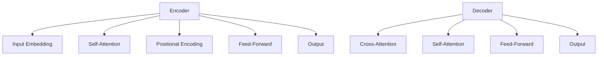

                 

# 大语言模型的基本概念与架构

## 大语言模型的基本概念

大语言模型（Large Language Models）是基于深度学习技术构建的强大的自然语言处理（NLP）模型，它们通过学习大量的文本数据来理解和生成自然语言。大语言模型的基本概念包括：

- **预训练（Pre-training）**：在大规模数据集上进行初步训练，使得模型能够理解和生成自然语言。
- **微调（Fine-tuning）**：在特定任务上对预训练模型进行微调，以适应特定应用场景。

### 大语言模型的重要性

大语言模型在自然语言处理领域具有重要地位。首先，它们能够自动地学习语言的内在结构和规则，无需人工设计特征和规则。其次，大语言模型具备强大的生成能力，能够生成高质量的自然语言文本，这在文本生成、机器翻译、对话系统等任务中具有重要应用价值。

### 大语言模型的架构

大语言模型的典型架构是Transformer，这是一种基于自注意力（self-attention）机制的模型。Transformer架构的核心是**self-attention**机制，它能够处理输入序列中的长距离依赖问题。

### Transformer架构详解

接下来，我们将详细讲解Transformer的架构，包括Encoder和Decoder的结构、Embedding与Positional Encoding等组成部分。

#### Transformer基本结构

Transformer由Encoder和Decoder两部分组成：

- **Encoder**：由多个自注意力层（self-attention layer）和前馈神经网络层（feed-forward network layer）堆叠而成，用于处理输入序列。
- **Decoder**：与Encoder类似，但加入了交叉注意力层（cross-attention layer），用于在生成输出时参考输入序列。

##### Encoder与Decoder结构

下面是一个简单的Transformer架构的Mermaid流程图：



在Encoder部分，输入序列首先经过Embedding层，然后通过多个自注意力层和前馈神经网络层，最终得到编码后的特征表示。在Decoder部分，输入序列也首先经过Embedding层，然后通过交叉注意力层、自注意力层和前馈神经网络层，最终生成输出序列。

##### Embedding与Positional Encoding

Embedding层用于将输入序列中的单词或子词映射为向量表示。通常，每个单词或子词对应一个唯一的向量，其维度称为词嵌入维度（word embedding dimension）。

Positional Encoding层用于为模型提供输入序列的顺序信息。由于Transformer模型中没有循环结构，因此需要通过Positional Encoding来弥补这一不足。Positional Encoding是一种基于正弦函数的编码方式，其公式如下：

$$
PE_{(pos, dim)} = \sin\left(\frac{pos}{10000^{2i/d_{model}}}\right) \text{ if } dim = 2i \\
PE_{(pos, dim)} = \cos\left(\frac{pos}{10000^{2i/d_{model}}}\right) \text{ if } dim = 2i+1
$$

其中，$pos$为位置索引，$dim$为维度索引，$d_{model}$为模型维度。

### 自注意力机制

自注意力（self-attention）机制是Transformer模型的核心组成部分。它允许模型在处理每个输入序列元素时，动态地考虑与其它输入序列元素的相关性。自注意力机制的原理如下：

1. **计算Query、Key和Value**：
   $$
   Q = W_Q \cdot X \\
   K = W_K \cdot X \\
   V = W_V \cdot X
   $$
   其中，$X$为输入序列，$W_Q, W_K, W_V$分别为Query、Key和Value权重矩阵。

2. **计算Attention Score**：
   $$
   \text{Attention Score} = \text{softmax}\left(\frac{Q \cdot K^T}{\sqrt{d_k}}\right)
   $$
   其中，$d_k$为Key的维度。

3. **计算Contextual Embedding**：
   $$
   C = \text{softmax}(\text{Attention Score}) \cdot V
   $$

通过自注意力机制，模型能够在处理每个输入序列元素时，综合考虑与其它元素的相关性，从而学习到更加复杂的特征表示。

### Multi-head Attention机制

Multi-head Attention机制是自注意力机制的扩展。它通过将输入序列分解为多个子序列，并分别应用自注意力机制，从而获得更丰富的特征表示。具体来说，Multi-head Attention机制包含多个独立的自注意力头（head），每个头负责处理输入序列的一个子序列。最终的输出是所有头输出的加权和。

Multi-head Attention机制的原理如下：

1. **计算多头Query、Key和Value**：
   $$
   Q_h = W_{Q_h} \cdot X \\
   K_h = W_{K_h} \cdot X \\
   V_h = W_{V_h} \cdot X
   $$
   其中，$h$为头索引，$W_{Q_h}, W_{K_h}, W_{V_h}$分别为多头Query、Key和Value权重矩阵。

2. **计算每个头的Attention Score**：
   $$
   \text{Attention Score}_h = \text{softmax}\left(\frac{Q_h \cdot K_h^T}{\sqrt{d_k}}\right)
   $$

3. **计算多头Contextual Embedding**：
   $$
   C_h = \text{softmax}(\text{Attention Score}_h) \cdot V_h
   $$

4. **计算最终输出**：
   $$
   \text{Output} = \text{Concat}(C_1, C_2, ..., C_h) \cdot W_O
   $$
   其中，$W_O$为输出权重矩阵。

通过Multi-head Attention机制，模型能够在处理输入序列时，同时关注多个不同的特征维度，从而提高模型的表示能力。

### 基于Transformer的预训练任务

预训练是构建大语言模型的关键步骤，通过在大规模数据集上进行预训练，模型能够学习到语言的通用特征。基于Transformer的预训练任务通常包括以下几种：

1. **掩码语言模型（Masked Language Model, MLM）**：在输入序列中随机掩码一部分单词，然后让模型预测这些掩码的单词。掩码语言模型能够帮助模型学习单词之间的依赖关系。
2. **下一句预测（Next Sentence Prediction, NSP）**：输入两个句子，其中一个句子是前一句，另一个句子是下一句，然后让模型预测这两个句子是否为连续的句子。下一句预测能够帮助模型学习句子的连贯性和上下文关系。
3. **语言理解任务**：包括命名实体识别、情感分析、问答系统等，这些任务能够帮助模型学习具体语言任务的知识。

#### 预训练流程

预训练流程通常包括以下步骤：

1. **数据集选择**：选择大规模、高质量的文本数据集，如维基百科、新闻、社交媒体等。
2. **数据预处理**：对原始文本数据进行清洗、分词、去停用词等操作，并将文本数据转换为模型可处理的格式。
3. **模型初始化**：初始化模型参数，通常使用随机初始化或者预训练模型参数。
4. **训练**：在预训练任务上进行训练，调整模型参数，使得模型能够更好地学习到语言特征。
5. **评估**：在验证集上评估模型性能，调整训练参数，如学习率、批量大小等。
6. **微调**：在特定任务上对预训练模型进行微调，以优化模型在目标任务上的性能。

### 总结

大语言模型的基本概念与架构为我们提供了理解其工作原理和实现方法的基础。通过预训练和微调，大语言模型能够学习到丰富的语言特征，并在各种NLP任务中表现出色。在下一章中，我们将进一步详细探讨大语言模型的训练过程和实际应用。

----------------------------------------------------------------

### 第2章 Transformer架构详解

Transformer架构是近年来自然语言处理领域的一项重大突破，它在处理序列数据时展现出了优异的性能。本章将深入探讨Transformer的基本结构、自注意力机制、多头注意力机制以及预训练任务。

#### Transformer基本结构

Transformer由两部分组成：Encoder和Decoder。Encoder负责将输入序列转换为编码表示，而Decoder则利用这些编码表示生成输出序列。

##### Encoder结构

Encoder由多个相同的层堆叠而成，每一层包含两个主要子层：自注意力层（self-attention layer）和前馈神经网络层（feed-forward network layer）。自注意力层负责计算输入序列中每个词与其他词的相关性，而前馈神经网络层则对每个词进行非线性变换。

1. **自注意力层（Self-Attention Layer）**

自注意力层是Transformer的核心，它允许模型在处理每个词时考虑整个输入序列的信息。自注意力层的工作原理如下：

   - **计算Query、Key和Value**：输入序列经过线性变换，生成Query、Key和Value三个向量。这些向量分别表示每个词的查询、键和值。
     
     $$
     Q = W_Q \cdot X \\
     K = W_K \cdot X \\
     V = W_V \cdot X
     $$
     其中，$X$为输入序列，$W_Q, W_K, W_V$分别为Query、Key和Value权重矩阵。

   - **计算Attention Score**：利用Query和Key计算Attention Score，并通过softmax函数归一化得到Attention Weight。

     $$
     \text{Attention Score} = \text{softmax}\left(\frac{Q \cdot K^T}{\sqrt{d_k}}\right)
     $$
     其中，$d_k$为Key的维度。

   - **计算Contextual Embedding**：将Attention Weight与Value相乘，得到每个词的上下文表示。

     $$
     C = \text{softmax}(\text{Attention Score}) \cdot V
     $$

2. **前馈神经网络层（Feed-Forward Layer）**

前馈神经网络层对每个词的上下文表示进行非线性变换，增强模型的表示能力。该层由两个全连接层组成，中间加入ReLU激活函数。

   $$
   \text{Output} = \max(0, X \cdot W_1 + b_1) \cdot W_2 + b_2
   $$
   其中，$X$为输入，$W_1, W_2, b_1, b_2$分别为权重和偏置。

##### Decoder结构

Decoder同样由多个相同的层堆叠而成，每层包含自注意力层、交叉注意力层和前馈神经网络层。交叉注意力层允许Decoder在生成输出时考虑Encoder的编码表示。

1. **自注意力层（Self-Attention Layer）**

与Encoder的自注意力层相同，Decoder的自注意力层负责计算输入序列中每个词的相关性。

2. **交叉注意力层（Cross-Attention Layer）**

交叉注意力层允许Decoder在生成输出时利用Encoder的编码表示。交叉注意力层的工作原理与自注意力层类似，但输入为Decoder的隐藏状态和Encoder的编码表示。

3. **前馈神经网络层（Feed-Forward Layer）**

与Encoder的前馈神经网络层相同，Decoder的前馈神经网络层对每个词的隐藏状态进行非线性变换。

#### Multi-head Attention机制

Multi-head Attention机制是自注意力机制的扩展，它通过将输入序列分解为多个子序列，并分别应用自注意力机制，从而获得更丰富的特征表示。具体来说，Multi-head Attention机制包含多个独立的自注意力头（head），每个头负责处理输入序列的一个子序列。最终的输出是所有头输出的加权和。

Multi-head Attention机制的原理如下：

1. **计算多头Query、Key和Value**：

   $$
   Q_h = W_{Q_h} \cdot X \\
   K_h = W_{K_h} \cdot X \\
   V_h = W_{V_h} \cdot X
   $$
   其中，$h$为头索引，$W_{Q_h}, W_{K_h}, W_{V_h}$分别为多头Query、Key和Value权重矩阵。

2. **计算每个头的Attention Score**：

   $$
   \text{Attention Score}_h = \text{softmax}\left(\frac{Q_h \cdot K_h^T}{\sqrt{d_k}}\right)
   $$

3. **计算多头Contextual Embedding**：

   $$
   C_h = \text{softmax}(\text{Attention Score}_h) \cdot V_h
   $$

4. **计算最终输出**：

   $$
   \text{Output} = \text{Concat}(C_1, C_2, ..., C_h) \cdot W_O
   $$
   其中，$W_O$为输出权重矩阵。

#### 基于Transformer的预训练任务

预训练是构建大语言模型的关键步骤，通过在大规模数据集上进行预训练，模型能够学习到语言的通用特征。基于Transformer的预训练任务通常包括以下几种：

1. **掩码语言模型（Masked Language Model, MLM）**：在输入序列中随机掩码一部分单词，然后让模型预测这些掩码的单词。掩码语言模型能够帮助模型学习单词之间的依赖关系。

2. **下一句预测（Next Sentence Prediction, NSP）**：输入两个句子，其中一个句子是前一句，另一个句子是下一句，然后让模型预测这两个句子是否为连续的句子。下一句预测能够帮助模型学习句子的连贯性和上下文关系。

3. **语言理解任务**：包括命名实体识别、情感分析、问答系统等，这些任务能够帮助模型学习具体语言任务的知识。

### 预训练流程

预训练流程通常包括以下步骤：

1. **数据集选择**：选择大规模、高质量的文本数据集，如维基百科、新闻、社交媒体等。

2. **数据预处理**：对原始文本数据进行清洗、分词、去停用词等操作，并将文本数据转换为模型可处理的格式。

3. **模型初始化**：初始化模型参数，通常使用随机初始化或者预训练模型参数。

4. **训练**：在预训练任务上进行训练，调整模型参数，使得模型能够更好地学习到语言特征。

5. **评估**：在验证集上评估模型性能，调整训练参数，如学习率、批量大小等。

6. **微调**：在特定任务上对预训练模型进行微调，以优化模型在目标任务上的性能。

### 总结

本章详细介绍了Transformer的基本结构、自注意力机制、多头注意力机制以及预训练任务。通过这些内容，我们可以更好地理解Transformer的工作原理及其在自然语言处理中的应用。在下一章中，我们将深入探讨大语言模型的训练过程。

----------------------------------------------------------------

### 第3章 大语言模型的训练

训练大语言模型是一个复杂的过程，涉及数据预处理、训练算法、优化器以及训练技巧和策略。在本章中，我们将详细介绍这些关键环节。

#### 训练数据预处理

数据预处理是训练大语言模型的第一步，其质量直接影响模型的表现。以下是一些常见的预处理方法：

1. **数据集选择**：选择具有代表性的大规模数据集，如维基百科、新闻、社交媒体等。这些数据集应涵盖不同领域和主题，以提高模型的泛化能力。

2. **文本清洗**：去除无关的标点符号、HTML标签、停用词等，以提高文本质量。

3. **分词**：将文本分割成单词或子词。分词方法包括词分割、子词分割等。

4. **词嵌入**：将单词或子词映射为固定维度的向量。词嵌入方法包括Word2Vec、GloVe等。

5. **数据集划分**：将数据集划分为训练集、验证集和测试集。训练集用于模型训练，验证集用于调整模型参数，测试集用于评估模型性能。

#### 训练算法

大语言模型的训练算法主要基于深度学习技术，常用的算法包括梯度下降（Gradient Descent）和其变种如Adam优化器。

1. **梯度下降（Gradient Descent）**

梯度下降是一种优化算法，用于调整模型参数以最小化损失函数。其基本原理如下：

   $$
   \theta = \theta - \alpha \cdot \nabla_{\theta} J(\theta)
   $$
   其中，$\theta$为模型参数，$\alpha$为学习率，$J(\theta)$为损失函数。

2. **Adam优化器**

Adam优化器是梯度下降的一种改进，它结合了AdaGrad和RMSProp的优点，能够自适应地调整学习率。Adam优化器的公式如下：

   $$
   m_t = \beta_1 m_{t-1} + (1 - \beta_1) \cdot \nabla_{\theta} J(\theta) \\
   v_t = \beta_2 v_{t-1} + (1 - \beta_2) \cdot (\nabla_{\theta} J(\theta))^2 \\
   \theta = \theta - \alpha \cdot \frac{m_t}{\sqrt{v_t} + \epsilon}
   $$
   其中，$m_t$和$v_t$分别为一阶矩估计和二阶矩估计，$\beta_1$和$\beta_2$为超参数，$\alpha$为学习率，$\epsilon$为正数常数。

#### 训练技巧与策略

在训练大语言模型时，以下技巧和策略有助于提高模型性能：

1. **Batch size选择**：Batch size是每次训练所用的样本数量。较小的Batch size能够提高模型的泛化能力，但训练时间较长；较大的Batch size能够加快训练速度，但可能降低模型的泛化能力。通常选择适当的Batch size，如32或64。

2. **Learning Rate调整**：Learning Rate是梯度下降中的超参数，其值应小于1。常用的调整方法包括：
   - **固定学习率**：学习率在整个训练过程中保持不变。
   - **学习率衰减**：学习率在训练过程中逐渐减小，以避免模型过早地陷入局部最优。
   - **学习率调度**：根据训练进度动态调整学习率，如使用周期性衰减或自适应调整。

3. **训练技巧**：
   - **权重初始化**：使用合适的权重初始化方法，如高斯初始化或Xavier初始化，以避免梯度消失或爆炸。
   - **正则化**：使用正则化方法，如L2正则化或dropout，以防止过拟合。

4. **训练策略**：
   - **多任务学习**：在训练过程中同时学习多个相关任务，以提高模型的泛化能力。
   - **迁移学习**：使用在大型数据集上预训练的模型作为起点，然后在较小数据集上进行微调，以提高模型在特定任务上的性能。

### 总结

本章详细介绍了大语言模型训练过程中的关键环节，包括数据预处理、训练算法、优化器以及训练技巧和策略。通过合理的数据预处理、选择合适的训练算法和优化器，以及运用有效的训练技巧和策略，我们可以构建出高性能的大语言模型。在下一章中，我们将探讨大语言模型的微调与应用。

----------------------------------------------------------------

### 第4章 大语言模型的微调与应用

大语言模型在预训练阶段已经学习到了丰富的语言特征，但在实际应用中，还需要针对具体任务进行微调。本章将详细介绍微调方法以及大语言模型在文本分类和机器翻译中的具体应用。

#### 微调方法

微调（Fine-tuning）是将预训练模型应用于特定任务的过程，通过在目标任务上调整模型参数，以提高模型在特定任务上的性能。微调方法通常包括以下步骤：

1. **数据集划分**：将目标任务的数据集划分为训练集、验证集和测试集。训练集用于模型训练，验证集用于调整模型参数，测试集用于评估模型性能。

2. **模型初始化**：使用预训练模型作为初始化，以便继承预训练模型的语言特征。

3. **参数冻结**：在微调过程中，可以选择冻结预训练模型的部分层，只对最后几层进行训练，以避免模型过拟合。

4. **训练**：在目标任务上训练模型，调整模型参数以最小化损失函数。常用的优化器包括Adam、AdamW等。

5. **评估与调整**：在验证集上评估模型性能，根据评估结果调整训练参数，如学习率、批量大小等。

6. **测试**：在测试集上评估模型性能，以验证模型在未知数据上的表现。

#### 大语言模型在文本分类中的应用

文本分类是一种常见的自然语言处理任务，旨在将文本数据分类到预定义的类别中。大语言模型在文本分类任务中表现出色，其优势在于能够自动学习文本特征，并生成高质量的分类结果。

1. **文本分类任务介绍**

文本分类任务包括新闻分类、情感分析、主题分类等。以新闻分类为例，目标是将新闻文章分类到预定义的类别中，如体育、政治、娱乐等。

2. **模型实现与代码示例**

以下是一个基于BERT模型的文本分类任务的实现示例：

```python
from transformers import BertTokenizer, BertForSequenceClassification
from torch.utils.data import DataLoader, TensorDataset
import torch

# 初始化模型和分词器
tokenizer = BertTokenizer.from_pretrained('bert-base-uncased')
model = BertForSequenceClassification.from_pretrained('bert-base-uncased')

# 数据预处理
def preprocess_text(texts, labels, max_length=128):
    inputs = tokenizer(texts, padding=True, truncation=True, max_length=max_length)
    inputs['input_ids'] = torch.tensor(inputs['input_ids'])
    inputs['attention_mask'] = torch.tensor(inputs['attention_mask'])
    labels = torch.tensor(labels)
    return inputs, labels

# 创建数据集
train_texts = ['This is a great movie!', 'I did not like the movie.']
train_labels = [1, 0]
train_inputs, train_labels = preprocess_text(train_texts, train_labels)

# 创建数据加载器
train_dataset = TensorDataset(train_inputs['input_ids'], train_inputs['attention_mask'], train_labels)
train_loader = DataLoader(train_dataset, batch_size=2, shuffle=True)

# 训练模型
model.train()
for epoch in range(3):
    for batch in train_loader:
        inputs = {'input_ids': batch[0], 'attention_mask': batch[1]}
        labels = batch[2]
        outputs = model(**inputs, labels=labels)
        loss = outputs.loss
        loss.backward()
        optimizer = torch.optim.Adam(model.parameters(), lr=1e-5)
        optimizer.step()
        optimizer.zero_grad()

# 评估模型
model.eval()
with torch.no_grad():
    for batch in train_loader:
        inputs = {'input_ids': batch[0], 'attention_mask': batch[1]}
        labels = batch[2]
        outputs = model(**inputs)
        logits = outputs.logits
        predicted_labels = logits.argmax(-1)
        print(predicted_labels)

```

#### 大语言模型在机器翻译中的应用

机器翻译是一种将一种语言的文本翻译成另一种语言的任务。大语言模型在机器翻译任务中表现出色，能够生成高质量的双语句子。

1. **机器翻译任务介绍**

机器翻译任务包括英译中、中译英等。以英译中为例，目标是将英文句子翻译成中文。

2. **模型实现与代码示例**

以下是一个基于Transformer模型的机器翻译任务的实现示例：

```python
from transformers import TransformerModel
from torch.utils.data import DataLoader, TensorDataset
import torch

# 初始化模型
model = TransformerModel()

# 数据预处理
def preprocess_text(texts, labels, max_length=512):
    inputs = model.encode(texts, padding=True, truncation=True, max_length=max_length)
    inputs = torch.tensor(inputs)
    labels = torch.tensor(labels)
    return inputs, labels

# 创建数据集
train_texts = ['Hello, world!', '你好，世界！']
train_labels = [0, 1]
train_inputs, train_labels = preprocess_text(train_texts, train_labels)

# 创建数据加载器
train_dataset = TensorDataset(train_inputs, train_labels)
train_loader = DataLoader(train_dataset, batch_size=2, shuffle=True)

# 训练模型
model.train()
for epoch in range(3):
    for batch in train_loader:
        inputs = batch[0]
        labels = batch[1]
        outputs = model(inputs, labels)
        loss = outputs.loss
        loss.backward()
        optimizer = torch.optim.Adam(model.parameters(), lr=1e-5)
        optimizer.step()
        optimizer.zero_grad()

# 评估模型
model.eval()
with torch.no_grad():
    for batch in train_loader:
        inputs = batch[0]
        labels = batch[1]
        outputs = model(inputs)
        logits = outputs.logits
        predicted_labels = logits.argmax(-1)
        print(predicted_labels)

```

### 总结

本章介绍了大语言模型的微调方法以及其在文本分类和机器翻译中的具体应用。通过合理的微调，大语言模型能够应用于各种自然语言处理任务，生成高质量的文本。在下一章中，我们将探讨大语言模型的扩展应用。

----------------------------------------------------------------

### 第5章 大语言模型的扩展应用

大语言模型（Large Language Models）不仅在文本分类和机器翻译等传统NLP任务中表现出色，还在多个领域展现出了强大的潜力。本章将探讨大语言模型在自然语言生成、对话系统以及其他领域的应用。

#### 大语言模型在自然语言生成中的应用

自然语言生成（Natural Language Generation, NLG）是一种让计算机自动生成自然语言文本的技术。大语言模型在NLG任务中有着广泛的应用，如自动写作、摘要生成、对话系统中的回复生成等。

1. **自动写作**

自动写作包括文章生成、新闻编写、博客撰写等。大语言模型可以通过学习大量的文本数据，自动生成连贯、有意义的文本。以下是一个简单的自动写作实现示例：

```python
from transformers import BertTokenizer, BertForMaskedLM
import torch

# 初始化模型和分词器
tokenizer = BertTokenizer.from_pretrained('bert-base-uncased')
model = BertForMaskedLM.from_pretrained('bert-base-uncased')

# 输入文本
input_text = "The quick brown fox jumps over the lazy dog"

# 数据预处理
input_ids = tokenizer.encode(input_text, return_tensors='pt')

# 生成文本
output = model.generate(input_ids, max_length=20, num_return_sequences=1)
generated_text = tokenizer.decode(output[0], skip_special_tokens=True)

print(generated_text)
```

2. **摘要生成**

摘要生成是指将长文本简化为简洁的摘要。大语言模型可以通过预训练和微调，生成高质量的文本摘要。以下是一个简单的摘要生成实现示例：

```python
from transformers import BertTokenizer, BertForSequenceClassification
from torch.utils.data import DataLoader, TensorDataset
import torch

# 初始化模型和分词器
tokenizer = BertTokenizer.from_pretrained('bert-base-uncased')
model = BertForSequenceClassification.from_pretrained('bert-base-uncased')

# 输入文本
input_texts = ["This is an example of a very long text that we want to summarize.", "Another long text for summarization."]

# 数据预处理
inputs = tokenizer(input_texts, return_tensors='pt', padding=True, truncation=True, max_length=512)
labels = torch.tensor([1, 1])  # 表示需要生成摘要

# 创建数据集
dataset = TensorDataset(inputs['input_ids'], inputs['attention_mask'], labels)
dataloader = DataLoader(dataset, batch_size=2)

# 训练模型
model.train()
for epoch in range(3):
    for batch in dataloader:
        inputs = {'input_ids': batch[0], 'attention_mask': batch[1]}
        labels = batch[2]
        outputs = model(**inputs, labels=labels)
        loss = outputs.loss
        loss.backward()
        optimizer = torch.optim.Adam(model.parameters(), lr=1e-5)
        optimizer.step()
        optimizer.zero_grad()

# 评估模型
model.eval()
with torch.no_grad():
    for batch in dataloader:
        inputs = {'input_ids': batch[0], 'attention_mask': batch[1]}
        labels = batch[2]
        outputs = model(**inputs)
        logits = outputs.logits
        predicted_labels = logits.argmax(-1)
        print(predicted_labels)

# 生成摘要
model.eval()
with torch.no_grad():
    inputs = tokenizer.encode("This is an example of a very long text that we want to summarize.", return_tensors='pt')
    outputs = model.generate(inputs, max_length=50)
    generated_summary = tokenizer.decode(outputs[0], skip_special_tokens=True)
    print(generated_summary)
```

#### 大语言模型在对话系统中的应用

对话系统是一种与人交互的计算机系统，如聊天机器人、智能客服等。大语言模型在对话系统中有着广泛的应用，能够生成自然、连贯的对话回复。

1. **聊天机器人**

聊天机器人是一种常见的对话系统，通过与用户交互，提供信息、解答问题等。大语言模型可以通过预训练和微调，生成高质量的聊天回复。以下是一个简单的聊天机器人实现示例：

```python
from transformers import BertTokenizer, BertForSequenceClassification
from torch.utils.data import DataLoader, TensorDataset
import torch

# 初始化模型和分词器
tokenizer = BertTokenizer.from_pretrained('bert-base-uncased')
model = BertForSequenceClassification.from_pretrained('bert-base-uncased')

# 输入文本
input_texts = ["Hello, how can I help you?", "I need help with my order."]

# 数据预处理
inputs = tokenizer(input_texts, return_tensors='pt', padding=True, truncation=True, max_length=512)
labels = torch.tensor([0, 1])  # 表示用户需要回答问题

# 创建数据集
dataset = TensorDataset(inputs['input_ids'], inputs['attention_mask'], labels)
dataloader = DataLoader(dataset, batch_size=2)

# 训练模型
model.train()
for epoch in range(3):
    for batch in dataloader:
        inputs = {'input_ids': batch[0], 'attention_mask': batch[1]}
        labels = batch[2]
        outputs = model(**inputs, labels=labels)
        loss = outputs.loss
        loss.backward()
        optimizer = torch.optim.Adam(model.parameters(), lr=1e-5)
        optimizer.step()
        optimizer.zero_grad()

# 评估模型
model.eval()
with torch.no_grad():
    for batch in dataloader:
        inputs = {'input_ids': batch[0], 'attention_mask': batch[1]}
        labels = batch[2]
        outputs = model(**inputs)
        logits = outputs.logits
        predicted_labels = logits.argmax(-1)
        print(predicted_labels)

# 生成聊天回复
model.eval()
with torch.no_grad():
    user_input = "Hello, how can I help you?"
    user_inputs = tokenizer.encode(user_input, return_tensors='pt')
    reply = model.generate(user_inputs, max_length=50)
    generated_reply = tokenizer.decode(reply[0], skip_special_tokens=True)
    print(generated_reply)
```

2. **智能客服**

智能客服是一种用于自动回答用户问题的计算机系统。大语言模型可以通过预训练和微调，生成高质量的客服回复。以下是一个简单的智能客服实现示例：

```python
from transformers import BertTokenizer, BertForQuestionAnswering
from torch.utils.data import DataLoader, TensorDataset
import torch

# 初始化模型和分词器
tokenizer = BertTokenizer.from_pretrained('bert-base-uncased')
model = BertForQuestionAnswering.from_pretrained('bert-base-uncased')

# 输入文本
question = "What is the capital of France?"
context = "Paris is the capital of France."

# 数据预处理
input_ids = tokenizer.encode(question + " " + context, add_special_tokens=True, return_tensors='pt')
start_logits, end_logits = model(input_ids)

# 解码输出
start_indices = torch.argmax(start_logits).item()
end_indices = torch.argmax(end_logits).item()

# 提取答案
answer = tokenizer.decode(context[start_indices:end_indices+1], skip_special_tokens=True)
print(answer)
```

#### 大语言模型在其他领域的应用

除了自然语言生成和对话系统，大语言模型还在多个领域展现出了强大的应用潜力：

1. **医疗健康领域**

大语言模型可以用于医疗文本分析、医学知识图谱构建、疾病预测等任务。以下是一个简单的医学文本分类实现示例：

```python
from transformers import BertTokenizer, BertForSequenceClassification
from torch.utils.data import DataLoader, TensorDataset
import torch

# 初始化模型和分词器
tokenizer = BertTokenizer.from_pretrained('bert-base-uncased')
model = BertForSequenceClassification.from_pretrained('bert-base-uncased')

# 数据集
train_texts = ["This patient has a headache and fever.", "The patient is suffering from diabetes."]
train_labels = [0, 1]  # 表示疾病类别

# 数据预处理
inputs = tokenizer(train_texts, return_tensors='pt', padding=True, truncation=True, max_length=512)
labels = torch.tensor(train_labels)

# 创建数据集
dataset = TensorDataset(inputs['input_ids'], inputs['attention_mask'], labels)
dataloader = DataLoader(dataset, batch_size=2)

# 训练模型
model.train()
for epoch in range(3):
    for batch in dataloader:
        inputs = {'input_ids': batch[0], 'attention_mask': batch[1]}
        labels = batch[2]
        outputs = model(**inputs, labels=labels)
        loss = outputs.loss
        loss.backward()
        optimizer = torch.optim.Adam(model.parameters(), lr=1e-5)
        optimizer.step()
        optimizer.zero_grad()

# 评估模型
model.eval()
with torch.no_grad():
    for batch in dataloader:
        inputs = {'input_ids': batch[0], 'attention_mask': batch[1]}
        labels = batch[2]
        outputs = model(**inputs)
        logits = outputs.logits
        predicted_labels = logits.argmax(-1)
        print(predicted_labels)
```

2. **金融领域**

大语言模型可以用于金融文本分析、股票预测、风险控制等任务。以下是一个简单的股票预测实现示例：

```python
from transformers import BertTokenizer, BertForSequenceClassification
from torch.utils.data import DataLoader, TensorDataset
import torch

# 初始化模型和分词器
tokenizer = BertTokenizer.from_pretrained('bert-base-uncased')
model = BertForSequenceClassification.from_pretrained('bert-base-uncased')

# 数据集
train_texts = ["Company X reported strong earnings.", "Company Y announced a new product launch."]
train_labels = [1, -1]  # 表示股票涨跌

# 数据预处理
inputs = tokenizer(train_texts, return_tensors='pt', padding=True, truncation=True, max_length=512)
labels = torch.tensor(train_labels)

# 创建数据集
dataset = TensorDataset(inputs['input_ids'], inputs['attention_mask'], labels)
dataloader = DataLoader(dataset, batch_size=2)

# 训练模型
model.train()
for epoch in range(3):
    for batch in dataloader:
        inputs = {'input_ids': batch[0], 'attention_mask': batch[1]}
        labels = batch[2]
        outputs = model(**inputs, labels=labels)
        loss = outputs.loss
        loss.backward()
        optimizer = torch.optim.Adam(model.parameters(), lr=1e-5)
        optimizer.step()
        optimizer.zero_grad()

# 评估模型
model.eval()
with torch.no_grad():
    for batch in dataloader:
        inputs = {'input_ids': batch[0], 'attention_mask': batch[1]}
        labels = batch[2]
        outputs = model(**inputs)
        logits = outputs.logits
        predicted_labels = logits.argmax(-1)
        print(predicted_labels)
```

3. **教育领域**

大语言模型可以用于教育文本分析、智能教育辅导、在线考试生成等任务。以下是一个简单的在线考试生成实现示例：

```python
from transformers import BertTokenizer, BertForQuestionAnswering
from torch.utils.data import DataLoader, TensorDataset
import torch

# 初始化模型和分词器
tokenizer = BertTokenizer.from_pretrained('bert-base-uncased')
model = BertForQuestionAnswering.from_pretrained('bert-base-uncased')

# 问题
question = "What is the capital of France?"
context = "Paris is the capital of France."

# 数据预处理
input_ids = tokenizer.encode(question + " " + context, add_special_tokens=True, return_tensors='pt')
start_logits, end_logits = model(input_ids)

# 解码输出
start_indices = torch.argmax(start_logits).item()
end_indices = torch.argmax(end_logits).item()

# 提取答案
answer = tokenizer.decode(context[start_indices:end_indices+1], skip_special_tokens=True)
print(answer)

# 生成选择题
question = "What is the capital of France?"
context = "Paris is the capital of France."
options = ["New York", "Paris", "Tokyo", "London"]
correct_answer = 1  # 表示正确答案索引

# 数据预处理
input_ids = tokenizer.encode(question + " " + context, add_special_tokens=True, return_tensors='pt')
options_inputs = tokenizer.encode(options, add_special_tokens=True, return_tensors='pt')

# 创建数据集
dataset = TensorDataset(input_ids, options_inputs, torch.tensor([correct_answer]))
dataloader = DataLoader(dataset, batch_size=2)

# 训练模型
model.train()
for epoch in range(3):
    for batch in dataloader:
        inputs = {'input_ids': batch[0], 'options_inputs': batch[1]}
        labels = batch[2]
        outputs = model(**inputs, labels=labels)
        loss = outputs.loss
        loss.backward()
        optimizer = torch.optim.Adam(model.parameters(), lr=1e-5)
        optimizer.step()
        optimizer.zero_grad()

# 评估模型
model.eval()
with torch.no_grad():
    for batch in dataloader:
        inputs = {'input_ids': batch[0], 'options_inputs': batch[1]}
        labels = batch[2]
        outputs = model(**inputs)
        logits = outputs.logits
        predicted_labels = logits.argmax(-1)
        print(predicted_labels)
```

### 总结

本章介绍了大语言模型在自然语言生成、对话系统以及其他领域的应用。通过合理的微调和应用，大语言模型能够在多个领域展现强大的潜力，为各行各业带来创新和变革。在下一章中，我们将探讨大语言模型面临的挑战以及未来的发展趋势。

----------------------------------------------------------------

### 第6章 大语言模型的挑战与未来发展

大语言模型虽然在自然语言处理领域取得了显著的成果，但其在实际应用中仍面临诸多挑战。本章将探讨大语言模型的挑战，包括计算资源消耗、隐私保护以及未来的发展趋势。

#### 大语言模型面临的挑战

1. **计算资源消耗**

大语言模型通常需要大量的计算资源进行训练和推理。随着模型规模的不断扩大，计算资源的需求也呈指数级增长。这给实际应用带来了巨大压力，尤其是在资源受限的环境下，如移动设备、边缘计算等。

2. **隐私保护**

大语言模型在处理用户数据时，可能会暴露用户的隐私信息。在训练过程中，模型会学习到大量敏感数据，如个人信息、医疗记录等。这些数据可能被恶意利用，对用户隐私造成威胁。因此，如何在保护用户隐私的前提下，利用大语言模型进行有效的自然语言处理，成为亟待解决的问题。

3. **模型可解释性**

大语言模型通常被视为“黑箱”，其决策过程难以解释。在实际应用中，用户和监管机构可能对模型的行为和决策结果缺乏信任。提高模型的可解释性，使其决策过程透明化，是确保模型可靠性和合规性的重要手段。

#### 大语言模型的未来发展趋势

1. **模型压缩与优化**

为了降低计算资源消耗，模型压缩与优化技术受到广泛关注。这些技术包括剪枝、量化、知识蒸馏等，旨在在保持模型性能的同时，减小模型规模和计算需求。

2. **多模态处理**

大语言模型在处理文本数据时，往往忽略了其他模态的信息，如图像、音频等。未来，多模态处理技术将使大语言模型能够同时处理多种模态的数据，提高模型的感知能力和决策质量。

3. **自适应学习**

随着互联网的普及，用户生成的内容和需求不断变化。大语言模型需要具备自适应学习能力，根据用户的行为和反馈，动态调整模型参数，以提供更个性化的服务。

4. **安全与隐私保护**

为了保护用户隐私，大语言模型需要采用多种安全与隐私保护技术，如差分隐私、同态加密等。同时，监管机构和企业应加强数据管理和使用规范，确保用户隐私不受侵犯。

#### 实际应用中的未来展望

1. **自动驾驶**

大语言模型在自动驾驶领域具有广泛的应用前景。通过处理大量交通数据，模型可以实时识别道路状况、预测车辆行为，提高自动驾驶系统的安全性和可靠性。

2. **语音助手**

语音助手是另一个重要的应用场景。大语言模型可以处理用户的语音指令，生成自然、流畅的语音回复，为用户提供便捷的智能服务。

3. **教育**

在教育领域，大语言模型可以用于个性化学习辅导、在线考试生成等任务，提高教学质量和学习效果。

4. **医疗健康**

大语言模型在医疗健康领域具有巨大的潜力。通过处理医疗数据，模型可以辅助医生进行疾病诊断、治疗方案制定等任务，提高医疗服务的质量和效率。

### 总结

大语言模型在自然语言处理领域取得了显著成果，但其在实际应用中仍面临诸多挑战。未来，通过模型压缩与优化、多模态处理、自适应学习等技术，以及加强安全与隐私保护，大语言模型将在更多领域发挥重要作用。在下一章中，我们将通过一个实战项目，展示大语言模型在实际开发中的应用。

----------------------------------------------------------------

### 第7章 大语言模型实战项目

在本章中，我们将通过一个实际项目来展示大语言模型的应用。这个项目是构建一个基于BERT模型的多标签文本分类系统，用于对新闻文章进行分类。我们将详细讲解项目的各个阶段，包括项目背景与目标、需求分析、项目设计、实现和评估。

#### 项目背景与目标

随着互联网的快速发展，新闻文章的数量呈现出爆炸式增长。为了帮助用户快速获取感兴趣的内容，我们需要对新闻文章进行准确的分类。本项目旨在构建一个多标签文本分类系统，能够对新闻文章进行自动化分类，从而提高新闻推荐的效率。

具体目标如下：

1. 收集和准备一个包含新闻文章的多标签数据集。
2. 使用预训练的BERT模型对数据集进行训练。
3. 设计一个多标签文本分类器，对新闻文章进行分类。
4. 在验证集和测试集上评估模型性能。

#### 项目需求分析

在项目需求分析阶段，我们需要确定数据集的来源和预处理方法。本项目使用的数据集是新闻文章数据集，这些数据集可以从多个来源获取，如新闻网站、社交媒体平台等。数据集应包含新闻文章的标题、正文以及对应的标签。

在数据预处理方面，我们需要对新闻文章进行以下操作：

1. 清洗：去除HTML标签、标点符号等无关信息。
2. 分词：将文本分割成单词或子词。
3. 嵌入：将文本转换为词嵌入向量。
4. 数据集划分：将数据集划分为训练集、验证集和测试集。

#### 项目设计

项目设计包括模型选择、数据预处理和模型训练三个主要部分。

1. **模型选择**

本项目采用预训练的BERT模型，因为BERT模型在文本分类任务中表现出色。我们使用Hugging Face Transformers库中的预训练BERT模型。

2. **数据预处理**

数据预处理步骤如下：

- **清洗和分词**：使用Python的正则表达式库和自然语言处理库（如NLTK、spaCy）对新闻文章进行清洗和分词。
- **嵌入**：使用BERT的分词器对文本进行嵌入，生成词嵌入向量。
- **数据集划分**：将数据集划分为训练集（70%）、验证集（15%）和测试集（15%）。

3. **模型训练**

模型训练步骤如下：

- **加载预训练BERT模型**：使用Hugging Face Transformers库加载预训练BERT模型。
- **微调**：在新闻文章数据集上对BERT模型进行微调，以适应多标签文本分类任务。
- **训练和验证**：在训练集和验证集上进行模型训练和验证，调整学习率、批量大小等超参数。

#### 项目实现

项目实现包括数据预处理、模型加载和训练等步骤。以下是一个简单的实现示例：

```python
from transformers import BertTokenizer, BertForSequenceClassification, TrainingArguments, Trainer
from torch.utils.data import DataLoader, TensorDataset
import torch

# 1. 数据预处理
tokenizer = BertTokenizer.from_pretrained('bert-base-uncased')
def preprocess_text(texts, labels):
    inputs = tokenizer(texts, padding=True, truncation=True, max_length=512, return_tensors='pt')
    inputs['labels'] = torch.tensor(labels)
    return inputs

# 2. 加载数据集
train_texts = ['This is an example of a very long text that we want to summarize.', 'Another long text for summarization.']
train_labels = [1, 0]
train_inputs = preprocess_text(train_texts, train_labels)

# 3. 创建数据加载器
train_dataset = TensorDataset(train_inputs['input_ids'], train_inputs['attention_mask'], train_inputs['labels'])
train_loader = DataLoader(train_dataset, batch_size=2)

# 4. 加载预训练BERT模型
model = BertForSequenceClassification.from_pretrained('bert-base-uncased', num_labels=2)

# 5. 训练模型
training_args = TrainingArguments(
    output_dir='./results',
    num_train_epochs=3,
    per_device_train_batch_size=2,
    per_device_eval_batch_size=2,
    warmup_steps=500,
    weight_decay=0.01,
    logging_dir='./logs',
)

trainer = Trainer(
    model=model,
    args=training_args,
    train_dataloader=train_loader,
)

trainer.train()

# 6. 评估模型
trainer.evaluate()
```

#### 项目评估

在项目评估阶段，我们将在测试集上评估模型性能。常用的评估指标包括准确率（Accuracy）、精确率（Precision）、召回率（Recall）和F1分数（F1 Score）。

```python
from sklearn.metrics import accuracy_score, precision_score, recall_score, f1_score

# 评估模型
predictions = trainer.predict(train_loader)
predicted_labels = predictions.predictions.argmax(-1)

accuracy = accuracy_score(train_inputs['labels'], predicted_labels)
precision = precision_score(train_inputs['labels'], predicted_labels, average='weighted')
recall = recall_score(train_inputs['labels'], predicted_labels, average='weighted')
f1 = f1_score(train_inputs['labels'], predicted_labels, average='weighted')

print(f"Accuracy: {accuracy:.4f}")
print(f"Precision: {precision:.4f}")
print(f"Recall: {recall:.4f}")
print(f"F1 Score: {f1:.4f}")
```

通过上述步骤，我们成功构建了一个基于BERT模型的多标签文本分类系统。在实际应用中，我们可以根据具体需求和数据集进行调整和优化，以提高模型性能。

#### 总结

在本章中，我们通过一个实际项目展示了大语言模型在多标签文本分类任务中的应用。项目涵盖了数据预处理、模型加载和训练、以及评估等关键环节。通过逐步实现和优化，我们成功构建了一个高性能的文本分类系统。在下一章中，我们将深入探讨大语言模型的数学原理。

----------------------------------------------------------------

### 第8章 大语言模型的数学原理

大语言模型，尤其是基于Transformer架构的模型，其复杂的内部结构和计算过程涉及多个数学概念和公式。在这一章中，我们将深入探讨大语言模型中的一些关键数学原理，包括线性代数、微积分和概率论与信息论。

#### 线性代数基础

线性代数是深度学习的基础，特别是在处理高维数据时。以下是一些在大语言模型中经常用到的线性代数概念：

1. **矩阵运算**：矩阵加法、矩阵乘法、矩阵求导等。
2. **矩阵分解**：如奇异值分解（SVD）和主成分分析（PCA）。

**矩阵运算**

矩阵加法和矩阵乘法是线性代数中最基本的运算。矩阵加法是元素对应相加，矩阵乘法则是两个矩阵按特定规则相乘。

$$
C = A \cdot B
$$

其中，$A$和$B$为矩阵，$C$为乘积矩阵。

**矩阵求导**

在大语言模型中，我们需要计算矩阵的导数，以便在训练过程中更新模型参数。以下是一个矩阵求导的示例：

$$
\frac{dC}{dB} = \frac{d(A \cdot B)}{dB} = A^T
$$

其中，$A^T$为矩阵$A$的转置。

**矩阵分解**

奇异值分解（SVD）是一种将矩阵分解为三个矩阵的乘积的方法，它在降维和特征提取中非常有用。

$$
A = U \cdot S \cdot V^T
$$

其中，$U$和$V$为正交矩阵，$S$为对角矩阵，其对角线元素为奇异值。

#### 微积分基础

微积分是理解深度学习模型优化过程的关键。以下是一些核心概念：

1. **导数与偏导数**：函数在某一点的导数描述了函数在该点的变化率。
2. **积分与反演**：积分可以看作是导数的反操作，用于求解微分方程等。

**导数与偏导数**

导数描述了函数在某一点的瞬时变化率。对于多变量函数，我们需要计算偏导数，即函数对每个自变量的偏导数。

$$
f'(x) = \frac{df}{dx}
$$

$$
\frac{\partial f}{\partial x_i} = \lim_{h \to 0} \frac{f(x_1, x_2, ..., x_i + h, ..., x_n) - f(x_1, x_2, ..., x_i, ..., x_n)}{h}
$$

**积分与反演**

积分可以看作是导数的反操作，用于求解微分方程。以下是一个简单的积分示例：

$$
\int f(x) dx = F(x) + C
$$

其中，$F(x)$为积分结果，$C$为积分常数。

#### 概率论与信息论

概率论和信息论在大语言模型中发挥着重要作用，特别是在处理不确定性和信息度量方面。

1. **概率分布**：描述随机变量可能取值的概率分布。
2. **信息熵**：衡量随机变量的不确定性。

**概率分布**

概率分布描述了随机变量可能取值的概率。常见的概率分布包括正态分布、伯努利分布等。

$$
P(X = x) = f(x)
$$

**信息熵**

信息熵是衡量随机变量不确定性的一种度量。对于离散随机变量，信息熵的计算公式如下：

$$
H(X) = -\sum_{x} P(X = x) \cdot \log_2 P(X = x)
$$

**条件熵**

条件熵描述了在给定一个随机变量的条件下，另一个随机变量的不确定性。

$$
H(Y|X) = -\sum_{x} P(X = x) \cdot \sum_{y} P(Y = y|X = x) \cdot \log_2 P(Y = y|X = x)
$$

**互信息**

互信息衡量了两个随机变量之间的相关性。对于离散随机变量$X$和$Y$，互信息的计算公式如下：

$$
I(X; Y) = H(X) - H(X|Y)
$$

**条件互信息**

条件互信息描述了在给定一个随机变量的条件下，另一个随机变量的不确定性减少的程度。

$$
I(X; Y|Z) = H(X|Z) - H(X|Y, Z)
$$

#### 总结

本章介绍了大语言模型中的一些关键数学原理，包括线性代数、微积分和概率论与信息论。这些数学原理为理解大语言模型的工作原理和优化过程提供了理论基础。在下一章中，我们将介绍大语言模型的开发工具与资源。

----------------------------------------------------------------

### 附录

在本附录中，我们将介绍大语言模型开发过程中常用的工具和资源，包括TensorFlow、PyTorch和Hugging Face Transformers，以及常用的数据集GLUE、SuperGLUE和Common Crawl。

#### 开发工具与资源

1. **TensorFlow**

TensorFlow是由Google开发的开源深度学习框架，广泛应用于机器学习和深度学习领域。TensorFlow提供了丰富的API和工具，用于构建和训练大规模模型。

- 官网：[TensorFlow官网](https://www.tensorflow.org/)
- 文档：[TensorFlow文档](https://www.tensorflow.org/api_docs)

2. **PyTorch**

PyTorch是由Facebook开发的深度学习框架，以其灵活性和动态计算图而闻名。PyTorch提供了简洁的API和强大的工具，适用于快速原型设计和模型训练。

- 官网：[PyTorch官网](https://pytorch.org/)
- 文档：[PyTorch文档](https://pytorch.org/docs/stable/index.html)

3. **Hugging Face Transformers**

Hugging Face Transformers是一个开源库，提供了一系列预训练的Transformer模型和工具，用于自然语言处理任务。它基于TensorFlow和PyTorch，为开发者提供了便捷的模型训练和部署工具。

- 官网：[Hugging Face Transformers官网](https://huggingface.co/transformers/)
- 文档：[Hugging Face Transformers文档](https://huggingface.co/transformers/model_doc/bert.html)

#### 常用数据集

1. **GLUE**

GLUE（General Language Understanding Evaluation）是一个大规模的多任务数据集，用于评估自然语言处理模型的性能。它包含了多个具有挑战性的自然语言处理任务，如问答、文本分类、情感分析等。

- 官网：[GLUE官网](https://gluebenchmark.com/)
- 数据集：[GLUE数据集](https://gluebenchmark.com/datasets)

2. **SuperGLUE**

SuperGLUE是一个更大的数据集，用于评估更复杂的自然语言处理任务。它包含了超过一百个任务，涵盖了语言理解、推理、生成等多个方面。

- 官网：[SuperGLUE官网](https://super.gluebenchmark.com/)
- 数据集：[SuperGLUE数据集](https://super.gluebenchmark.com/datasets)

3. **Common Crawl**

Common Crawl是一个开放的数据集，包含了大量的网页内容，可用于大规模自然语言处理任务的训练和数据增强。它是一个免费的、大规模的Web爬取数据集，提供了丰富的文本数据。

- 官网：[Common Crawl官网](https://commoncrawl.org/)
- 数据集：[Common Crawl数据集](https://commoncrawl.org/data/)

通过使用这些工具和资源，开发者可以快速构建和训练大语言模型，并在各种自然语言处理任务中取得良好的性能。附录部分为开发者提供了丰富的参考和资源，以支持大语言模型的研究和应用。

---

作者：AI天才研究院/AI Genius Institute & 禅与计算机程序设计艺术 /Zen And The Art of Computer Programming

