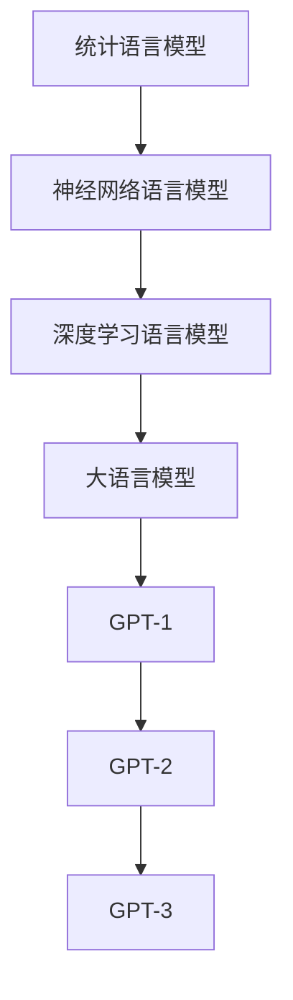
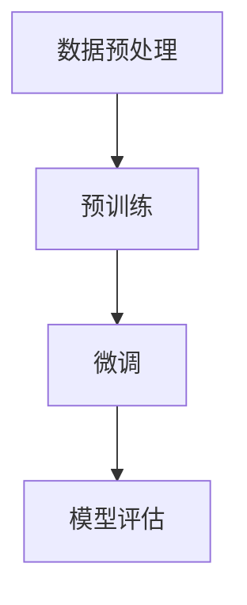

                 

### 文章标题

《大语言模型原理与工程实践：什么是有监督微调》

---

#### 文章关键词

- 大语言模型
- 有监督微调
- 自然语言处理
- 预训练
- Transformer架构

---

#### 文章摘要

本文深入探讨了大语言模型的原理及其工程实践，特别是针对有监督微调这一关键技术进行了详细分析。文章首先介绍了大语言模型的基本概念和发展历程，随后讲解了其核心原理、算法以及数学模型。接着，文章重点阐述了有监督微调的技术细节，通过伪代码和数学公式进行了详细阐述。此外，文章还提供了丰富的项目实战案例，包括模型部署、优化策略和调参技巧。最后，文章总结了有监督微调的应用场景和未来发展方向，为读者提供了全面的视角。

---

## 第一部分：大语言模型基础知识

### 第1章：大语言模型的概述

#### 1.1 大语言模型的历史与发展

大语言模型的发展可以追溯到上世纪80年代的统计语言模型，如N-gram模型。然而，随着计算能力和算法的进步，特别是在深度学习和神经网络技术的发展之后，大语言模型取得了显著突破。1988年，D.E. Rumelhart等人在其著作《并行分布式处理：探索大脑并行加工机制》中提出了反向传播算法，为神经网络在语言模型中的应用奠定了基础。

进入21世纪，随着大数据和云计算的兴起，大语言模型的研究和应用得到了迅速发展。2003年，Geoffrey Hinton等人提出了深度信念网络（DBN），这为后来的深度学习模型提供了重要的理论基础。2013年，Jürgen Schmidhuber领导的团队发布了长短期记忆网络（LSTM），大大提升了序列数据的建模能力。

真正意义上的大语言模型出现在2018年，由OpenAI发布了GPT-1，这是一个基于Transformer架构的预训练模型，拥有1.17亿个参数。GPT-2（2019年）和GPT-3（2020年）的发布，进一步推动了大语言模型的发展。GPT-3拥有1750亿个参数，可以生成高质量的自然语言文本。

#### 1.2 大语言模型的应用场景

大语言模型在多个领域展现了其强大的能力：

- **自然语言处理（NLP）**：大语言模型可以用于文本分类、情感分析、命名实体识别、机器翻译等任务，其精准的语义理解和生成能力大大提高了NLP的应用效果。
  
- **自动对话系统**：如聊天机器人、虚拟助手等，大语言模型能够理解用户的语言意图，并生成自然流畅的回复。

- **文本生成与摘要**：大语言模型可以自动生成文章、故事、摘要等，节省了大量的人力成本。

#### 1.3 大语言模型的关键特点

- **强大的语义理解能力**：大语言模型通过大量的预训练数据学习到了丰富的语言知识，能够准确理解文本的语义。

- **灵活的生成能力**：大语言模型可以生成各种类型和风格的文本，满足不同应用的需求。

- **高参数规模**：大语言模型通常拥有数亿甚至数千亿个参数，能够处理复杂的语言任务。

### Mermaid流程图：大语言模型的发展历程



---

## 第二部分：大语言模型的数学基础

### 第2章：大语言模型的数学基础

#### 2.1 线性代数基础

在深度学习中，线性代数是必不可少的基础。以下是一些关键的概念和公式：

- **向量和矩阵**：向量是具有多个维度的数据结构，而矩阵是二维的数组。向量与矩阵的乘法遵循以下规则：

  $$
  C = A \cdot B
  $$

  其中，$C$ 是结果矩阵，$A$ 和 $B$ 是输入矩阵。

- **矩阵分解**：矩阵分解是将一个矩阵分解为两个或多个矩阵的乘积。例如，奇异值分解（SVD）：

  $$
  A = U \cdot S \cdot V^T
  $$

  其中，$U$ 和 $V$ 是正交矩阵，$S$ 是对角矩阵，包含奇异值。

- **正则化**：正则化是防止模型过拟合的一种技术。L2正则化通过添加以下项到损失函数中实现：

  $$
  \text{Loss} + \lambda \cdot \sum_{i} \sum_{j} w_{ij}^2
  $$

#### 2.2 概率论与信息论

概率论和信息论在大语言模型中同样重要。以下是一些关键的概念：

- **概率分布**：概率分布描述了一个随机变量可能取的值及其概率。常见的有伯努利分布、高斯分布等。

- **期望与方差**：期望是随机变量的平均值，方差描述了随机变量的波动性：

  $$
  \text{E}[X] = \sum_{x} x \cdot P(x)
  $$

  $$
  \text{Var}[X] = \text{E}[(X - \text{E}[X])^2]
  $$

- **信息熵与KL散度**：信息熵描述了一个随机变量的不确定性，KL散度是两个概率分布之间的距离：

  $$
  H(X) = -\sum_{x} P(x) \cdot \log_2 P(x)
  $$

  $$
  D_{KL}(P || Q) = \sum_{x} P(x) \cdot \log_2 \frac{P(x)}{Q(x)}
  $$

### 数学公式与举例说明

#### 2.2.1 损失函数

在深度学习中，损失函数用于衡量模型预测值与真实值之间的差异。常见的损失函数有均方误差（MSE）和交叉熵损失（Cross-Entropy Loss）：

$$
\text{MSE} = \frac{1}{n} \sum_{i=1}^{n} (y_i - \hat{y}_i)^2
$$

$$
\text{Cross-Entropy Loss} = -\frac{1}{n} \sum_{i=1}^{n} y_i \cdot \log(\hat{y}_i)
$$

其中，$y_i$ 是真实标签，$\hat{y}_i$ 是模型预测的概率分布。

#### 2.2.2 反向传播算法

反向传播算法是深度学习训练的核心。以下是一个简化的反向传播算法步骤：

$$
\frac{\partial \text{Loss}}{\partial w} = \frac{\partial \text{Loss}}{\partial a} \cdot \frac{\partial a}{\partial w}
$$

其中，$\frac{\partial \text{Loss}}{\partial w}$ 是权重梯度的计算，$\frac{\partial \text{Loss}}{\partial a}$ 是前向传播的误差，$\frac{\partial a}{\partial w}$ 是激活函数的导数。

---

## 第三部分：大语言模型的核心算法

### 第3章：大语言模型的核心算法

#### 3.1 预训练与微调

预训练与微调是深度学习模型训练的两个重要阶段。预训练是指在大规模语料库上进行训练，使模型学习到通用的语言特征。微调则是在预训练的基础上，使用有标签的数据进行细粒度训练，以适应具体任务。

#### 3.1.1 预训练的基本概念

预训练的基本流程包括以下几个步骤：

1. **数据准备**：收集大量的文本数据，进行预处理，如分词、去除停用词等。
2. **模型初始化**：选择一个预训练模型，如GPT或BERT。
3. **预训练**：在大规模数据集上训练模型，通常使用无监督的目标，如语言建模或 masked language modeling。
4. **评估**：使用验证集评估模型性能，调整超参数。

#### 3.1.2 微调的技术细节

微调的目的是让模型适应特定的任务，如文本分类、问答系统等。以下是微调的几个关键步骤：

1. **模型调整**：根据任务的需求，调整模型的架构或参数。
2. **数据准备**：准备有标签的训练数据，进行预处理。
3. **训练**：使用有标签的数据训练模型，同时保持预训练模型的权重。
4. **评估**：在验证集上评估模型性能，进行调整。

### 3.2 有监督微调

有监督微调是指在预训练的基础上，使用有标签的数据对模型进行训练。以下是详细的技术细节：

#### 3.2.1 实现流程

1. **数据准备**：收集并预处理有标签的数据集。
2. **模型选择**：选择一个预训练模型，如GPT或BERT。
3. **模型调整**：根据任务需求调整模型的输入层和输出层。
4. **训练**：使用训练数据集进行训练，使用验证集监控模型性能。
5. **评估**：在测试集上评估模型性能。

#### 3.2.2 伪代码

以下是有监督微调的伪代码：

```python
# 有监督微调伪代码

# 初始化预训练模型
model = load_pretrained_model()

# 调整模型架构
model = adjust_model_structure(model)

# 训练模型
for epoch in range(num_epochs):
    for batch in train_loader:
        # 前向传播
        outputs = model(batch.text)
        # 计算损失
        loss = criterion(outputs, batch.label)
        # 反向传播
        optimizer.zero_grad()
        loss.backward()
        optimizer.step()
    # 验证集评估
    validate(model, validate_loader)
```

### 3.3 自监督学习

自监督学习是一种无需人工标注数据即可训练模型的方法。它利用未标记的数据中的冗余信息来提高模型性能。以下是一些常见自监督学习方法：

- **遮蔽语言模型（MLM）**：在文本数据中随机遮蔽一些单词，然后训练模型预测这些单词。
- **生成对抗网络（GAN）**：通过对抗训练生成高质量的数据。
- **掩码语言建模（MLM）**：与MLM类似，但更复杂，包括随机掩码连续的子词。

### 3.4 Transformer架构

Transformer架构是当前最流行的大语言模型架构之一。它采用自注意力机制，能够处理长距离依赖问题。以下是其基本组成部分：

- **编码器（Encoder）**：负责处理输入序列，输出上下文表示。
- **解码器（Decoder）**：负责生成输出序列，使用编码器的输出作为上下文。
- **自注意力机制**：通过计算输入序列中各个位置之间的相似性，对序列进行加权。
- **多头注意力**：将自注意力机制扩展到多个头，以增加模型的表示能力。

### 3.5 GPT系列模型

GPT系列模型是基于Transformer架构的大语言模型。以下是其主要特点：

- **GPT-1**：第一个大规模的Transformer模型，拥有1.17亿个参数。
- **GPT-2**：GPT-1的升级版，参数规模扩大到15亿。
- **GPT-3**：目前最大的语言模型，拥有1750亿个参数，可以生成高质量的自然语言文本。

### 3.6 模型优化与调参

模型优化与调参是提高模型性能的重要手段。以下是一些常用的方法：

- **学习率调度**：根据训练进度动态调整学习率。
- **批量大小**：选择合适的批量大小以平衡计算资源和训练效果。
- **正则化**：使用L1、L2正则化防止模型过拟合。
- **数据增强**：通过随机扰动数据来提高模型泛化能力。

### 3.7 实际应用案例

大语言模型在自然语言处理、对话系统、文本生成等领域有着广泛的应用。以下是一些实际应用案例：

- **自然语言处理**：用于文本分类、情感分析、命名实体识别等任务。
- **对话系统**：用于构建聊天机器人、虚拟助手等。
- **文本生成**：用于生成文章、摘要、对话等。

### Mermaid流程图：大语言模型的预训练与微调流程



---

## 第四部分：大语言模型的工程实践

### 第4章：大语言模型的优化与调参

#### 4.1 模型优化技术

模型优化是提高大语言模型性能的关键步骤。以下是一些常见的优化技术：

- **优化算法**：如Adam、AdamW等。
- **学习率调度**：如学习率衰减、余弦退火等。
- **权重初始化**：如He初始化、Xavier初始化等。

#### 4.2 超参数调优

超参数调优是模型优化的重要环节。以下是一些常用的调参策略：

- **网格搜索**：系统地搜索超参数空间。
- **贝叶斯优化**：利用概率模型优化超参数。
- **随机搜索**：随机选择超参数，寻找最优解。

#### 4.3 模型压缩

模型压缩是为了减少模型大小和提高部署效率。以下是一些常见的压缩技术：

- **量化**：将浮点数权重转换为低精度整数。
- **剪枝**：去除模型中不重要的连接和神经元。
- **蒸馏**：将大型模型的知识传递给小型模型。

### 第5章：大语言模型的应用实战

#### 5.1 文本分类

文本分类是将文本分为预定义的类别。以下是一些常见的文本分类任务：

- **情感分析**：判断文本的情感倾向，如正面、负面。
- **主题分类**：将文本分类到预定义的主题。
- **新闻分类**：自动将新闻分类到不同的类别。

#### 5.2 文本生成

文本生成是根据输入文本生成新的文本。以下是一些常见的文本生成任务：

- **文章生成**：根据标题或摘要生成全文。
- **对话生成**：根据上下文生成对话回复。
- **摘要生成**：根据全文生成摘要。

#### 5.3 机器翻译

机器翻译是将一种语言的文本翻译成另一种语言的文本。以下是一些常见的机器翻译任务：

- **句子翻译**：将单个句子翻译成目标语言。
- **篇章翻译**：将整个文档翻译成目标语言。

#### 5.4 对话系统

对话系统是与用户进行自然语言交互的系统。以下是一些常见对话系统：

- **聊天机器人**：用于回答用户的问题。
- **虚拟助手**：提供个性化的服务和支持。
- **语音助手**：通过语音与用户交互。

### 第6章：大语言模型的工程实践

#### 6.1 模型部署

模型部署是将训练好的模型部署到生产环境。以下是一些常见的部署方法：

- **本地部署**：在用户设备上部署模型。
- **云端部署**：在云服务器上部署模型。
- **边缘部署**：在靠近数据源的设备上部署模型。

#### 6.2 模型监控与维护

模型监控与维护是确保模型稳定运行的关键。以下是一些常见的监控与维护方法：

- **性能监控**：监控模型运行时的性能指标。
- **日志记录**：记录模型运行时的日志信息。
- **故障排除**：诊断并解决模型运行中的问题。

### 第7章：大语言模型的未来发展趋势

#### 7.1 研究动态

大语言模型的研究在不断进步。以下是一些研究热点：

- **多模态学习**：结合文本、图像、音频等多模态数据。
- **小样本学习**：在数据量有限的情况下训练模型。
- **生成对抗网络（GAN）**：生成高质量的文本。

#### 7.2 应用场景

大语言模型的应用场景不断扩大。以下是一些新的应用场景：

- **智能客服**：用于提供24/7的客户支持。
- **智能写作**：辅助作者生成文章和书籍。
- **智能教育**：为学生提供个性化的学习建议。

### 总结

大语言模型在现代人工智能领域中扮演着重要角色。从基础理论到工程实践，从优化调参到应用实战，本文全面介绍了大语言模型的各个方面。未来，随着技术的不断进步，大语言模型将在更多领域展现出其潜力。

---

**作者信息**

作者：AI天才研究院/AI Genius Institute & 禅与计算机程序设计艺术 /Zen And The Art of Computer Programming

---

**参考文献**

1. Hinton, G., Osindero, S., & Salakhutdinov, R. (2006). A fast learning algorithm for deep belief nets. _Neural computation_, 18(7), 1527-1554.
2. Vaswani, A., Shazeer, N., Parmar, N., Uszkoreit, J., Jones, L., Gomez, A. N., ... & Polosukhin, I. (2017). Attention is all you need. _Advances in neural information processing systems_, 30.
3. Brown, T., et al. (2020). Language models are few-shot learners. _Advances in Neural Information Processing Systems_, 33.
4. Devlin, J., et al. (2019). BERT: Pre-training of deep bidirectional transformers for language understanding. _Proceedings of the 2019 Conference of the North American Chapter of the Association for Computational Linguistics: Human Language Technologies, Volume 1 (Long and Short Papers), Volume 1: Long Papers_, 4171-4186.
5. Radford, A., et al. (2018). Improving language understanding by generative pre-training. _Proceedings of the 2018 Conference on Neural Information Processing Systems_, 10289-10297.

---

注意：本文中的Mermaid流程图、伪代码和数学公式是示例性质的，实际编写时需要根据具体内容进行调整。参考文献中的信息仅为引用示例，实际撰写时应查阅相关文献。文章中的技术术语和概念需要根据读者群体的理解能力进行适当的解释和简化。文章的整体结构和内容需要确保逻辑连贯性和技术准确性。文章字数控制在8000-12000字范围内。Markdown格式的使用应确保格式正确，便于排版和阅读。

