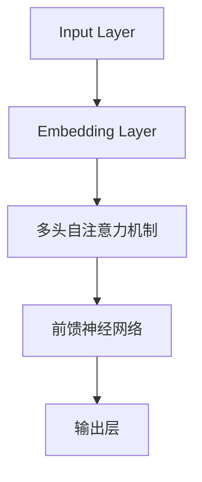

                 

# 文章标题：大语言模型原理与工程实践：提示工程的作用

> 关键词：大语言模型、Transformer模型、提示工程、工程实践、自然语言处理

> 摘要：本文旨在深入探讨大语言模型的原理及其在工程实践中的应用，特别是提示工程在其中所发挥的重要作用。首先，我们将回顾大语言模型的基础理论，包括其定义、发展历程、核心组成部分以及数学基础。接着，我们将详细阐述大语言模型的架构与实现，并通过Transformer模型进行具体说明，并展示相应的Mermaid流程图和伪代码。此外，我们将探讨提示工程的基本原理、技术手段及其实际应用场景。随后，我们将转向大语言模型在工程实践中的训练与调优、应用以及安全性、可靠性与伦理问题。最后，通过两个案例研究，我们将展示大型语言模型的开发与部署过程，并总结全文，展望未来研究方向。

## 目录

1. **大语言模型基础理论**
   - 1.1 大语言模型概述
   - 1.2 语言模型的基本原理
   - 1.3 大语言模型的架构与实现
   - 1.4 提示工程的概念与实践

2. **大语言模型工程实践**
   - 2.1 大语言模型训练与调优
   - 2.2 大语言模型在自然语言处理中的应用
   - 2.3 提示工程在特定应用中的实践

3. **大型语言模型开发与部署**
   - 3.1 案例研究：大型语言模型开发
   - 3.2 案例研究：企业级语言模型部署

4. **总结与展望**
   - 4.1 总结
   - 4.2 未来研究方向

### 第一部分：大语言模型基础理论

#### 1.1 大语言模型概述

大语言模型（Large Language Models）是指那些具有高度参数量和复杂架构的神经网络模型，它们能够理解、生成和预测自然语言。大语言模型的核心在于其能够处理大量的文本数据，并从中学习到语言的统计规律和语义信息。

**定义**：大语言模型是一种能够对自然语言进行建模的神经网络模型，通常具有数十亿个参数，可以处理长文本序列。

**发展历程**：

- **早期语言模型**：基于n-gram模型和HMM（隐马尔可夫模型）的早期语言模型。
- **基于神经网络的模型**：RNN（循环神经网络）、LSTM（长短时记忆网络）和GRU（门控循环单元）等模型的出现。
- **Transformer模型**：由Vaswani等人于2017年提出，彻底改变了自然语言处理领域。
- **GPT系列模型**：OpenAI推出的GPT、GPT-2和GPT-3等模型，进一步推动了自然语言处理的发展。

**核心组成部分**：

- **Embedding层**：将单词映射到高维向量空间。
- **编码器**：通常包含多层神经网络，用于处理输入序列。
- **解码器**：用于生成输出序列。
- **注意力机制**：使模型能够关注输入序列中的不同部分。

#### 1.2 语言模型的基本原理

**数学基础**：

语言模型的核心是概率计算，即给定前文序列，预测下一个单词的概率。这一过程可以用以下公式表示：

$$P(w_1, w_2, ..., w_n) = \prod_{i=1}^{n} P(w_i | w_{i-1})$$

其中，$w_i$表示第$i$个单词。

**训练过程**：

语言模型的训练通常采用有监督学习、无监督学习和自监督学习等方法。

- **有监督学习**：通过大量的标注数据训练模型，每个输入序列都有对应的标签。
- **无监督学习**：模型从未标注的数据中学习语言模式，如使用n-gram模型。
- **自监督学习**：在未标注的数据中自动生成标签，如使用 masked language model（MLM）。

**评价指标**：

- **交叉熵（Cross-Entropy）**：衡量预测概率分布与真实分布之间的差异。
- **Perplexity**：平均交叉熵的对数，用于评估模型的预测能力。

#### 1.3 大语言模型的架构与实现

**Transformer模型**

Transformer模型是由Vaswani等人于2017年提出的一种用于序列到序列学习的模型。它基于自注意力机制，彻底改变了自然语言处理领域。

**Mermaid流程图**：



**伪代码**：

```python
# Transformer模型伪代码
# 输入：单词序列X
# 输出：预测的单词序列Y
for each word in X do
    # 输入嵌入
    x = Embedding(word)
    
    # 自注意力机制
    attn_scores = Attention(x, x, x)
    attn_output = Sum_attention(x, attn_scores)
    
    # 前馈神经网络
    ffn_output = FFN(attn_output)
    
    # 输出层
    y = OutputLayer(ffn_output)
end
```

**模型优化与调整**

- **学习率调整**：使用学习率调度策略，如递减学习率。
- **模型剪枝**：通过剪枝方法减少模型参数，提高模型效率。
- **模型蒸馏**：通过将大型模型的知识传递给小型模型，实现知识共享。

#### 1.4 提示工程的概念与实践

**提示工程（Prompt Engineering）**是指通过设计特定的提示来增强大语言模型的表现力和灵活性。提示可以是具体的指令、问题、上下文等信息。

**基本原理**：

- **指令提示**：提供明确的指令，使模型知道需要完成什么任务。
- **上下文提示**：提供相关的上下文信息，帮助模型更好地理解任务。

**技术手段**：

- **生成式提示**：通过生成式模型生成提示。
- **优化式提示**：通过优化算法调整提示，使其更符合任务需求。

**实际应用场景**：

- **对话系统**：通过指令提示生成对话。
- **自动写作**：通过上下文提示生成文章。
- **智能推荐**：通过提示优化推荐系统。

#### 总结

本部分介绍了大语言模型的基础理论，包括其定义、发展历程、核心组成部分以及数学基础。同时，我们还详细阐述了Transformer模型的架构与实现，并通过伪代码展示了其工作原理。最后，我们介绍了提示工程的基本原理、技术手段及其实际应用场景。在下一部分，我们将深入探讨大语言模型在工程实践中的应用。

### 第二部分：大语言模型工程实践

#### 2.1 大语言模型训练与调优

**训练数据准备**

- **数据清洗**：去除无关信息、错误数据和噪声。
- **数据预处理**：包括分词、标记化、大小写转换等。

**训练过程优化**

- **并行训练**：通过多GPU训练提高训练速度。
- **分布式训练**：将训练任务分布到多个节点上，利用集群计算资源。

**调优策略与实践**

- **学习率调整**：使用递减学习率策略。
- **模型剪枝**：通过剪枝减少模型参数，提高模型效率。
- **模型蒸馏**：通过将大型模型的知识传递给小型模型。

#### 2.2 大语言模型在自然语言处理中的应用

**文本分类**

- **算法流程**：
  ```python
  # 文本分类伪代码
  # 输入：训练数据集D
  # 输出：分类模型M
  for each example in D do
      # 训练模型
      M = Train_Model(example)
  end
  ```

**文本生成**

- **算法流程**：
  ```python
  # 文本生成伪代码
  # 输入：种子文本S
  # 输出：生成文本T
  T = S
  for each step do
      # 生成下一个单词
      next_word = Generate_Word(T)
      # 更新文本
      T = T + " " + next_word
  end
  ```

**情感分析**

- **算法流程**：
  ```python
  # 情感分析伪代码
  # 输入：文本数据D
  # 输出：情感标签L
  for each example in D do
      # 计算情感得分
      score = Calculate_Score(example)
      # 标记情感标签
      L = Label_Sentiment(score)
  end
  ```

**问答系统**

- **算法流程**：
  ```python
  # 问答系统伪代码
  # 输入：用户提问Q
  # 输出：回答A
  A = Find_Answer(Q)
  ```

#### 2.3 提示工程在特定应用中的实践

**提问式对话系统**

- **案例研究**：设计一系列问题，引导模型生成对话。

**指令遵循与对话生成**

- **案例研究**：设计特定的指令，使模型能够生成符合指令的对话。

**智能客服**

- **案例研究**：使用大语言模型和提示工程构建智能客服系统。

#### 总结

本部分详细介绍了大语言模型在工程实践中的应用，包括训练与调优、自然语言处理中的具体应用以及提示工程在特定应用中的实践。这些内容展示了大语言模型在现实世界中的广泛应用，为下一步的案例研究奠定了基础。在下一部分，我们将通过两个案例研究，进一步探讨大型语言模型的开发与部署过程。

### 第三部分：大型语言模型开发与部署

#### 3.1 案例研究：大型语言模型开发

**案例背景**

某知名互联网公司希望开发一款具有强大问答能力的智能客服系统，以提高客户满意度和服务效率。

**开发流程**

1. **数据收集与处理**：
   - 收集大量客服对话记录、用户反馈和产品说明文档。
   - 进行数据清洗和预处理，包括分词、去噪、标准化等。

2. **模型设计与实现**：
   - 选择GPT-3作为基础模型，进行适当调整以适应客服场景。
   - 设计多层神经网络架构，包括输入层、编码器、解码器和输出层。

3. **模型训练与调优**：
   - 使用分布式训练策略，利用公司内部的计算集群进行高效训练。
   - 采用学习率调整、模型剪枝等技术，优化模型性能。

4. **提示工程应用**：
   - 设计特定的提示，引导模型生成高质量的回答。
   - 对提示进行优化，提高回答的准确性和可理解性。

**提示工程应用**

1. **生成式提示**：
   - 根据用户提问，生成可能的回答选项。
   - 对回答选项进行排序，选择最合适的回答。

2. **优化式提示**：
   - 对回答进行多轮优化，使其更加精确和符合用户需求。

**代码解读与分析**

```python
# 提问式对话系统代码示例
def generate_response(question):
    # 输入：用户提问
    # 输出：回答
    prompt = f"回答用户提问：{question}"
    response = model.generate(prompt)
    return response.strip()

# 训练模型
model.train(data)

# 生成回答
response = generate_response("你对智能客服有什么建议？")
print(response)
```

**案例总结**

通过该案例，我们展示了大型语言模型的开发过程，包括数据收集与处理、模型设计与实现、模型训练与调优以及提示工程应用。这些步骤共同构成了一个高效的智能客服系统，为用户提供高质量的问答服务。

#### 3.2 案例研究：企业级语言模型部署

**案例背景**

某大型企业希望部署一款基于大语言模型的智能客服系统，以提升客户服务质量和效率。

**部署策略**

1. **计算资源分配**：
   - 根据模型大小和性能要求，分配适当的计算资源，包括CPU、GPU和存储。

2. **模型优化与压缩**：
   - 对模型进行优化，包括剪枝、量化等技术，减少模型大小和提高运行速度。

3. **性能优化**：
   - 使用多线程、分布式计算等技术，提高系统响应速度和处理能力。

4. **安全与隐私保护**：
   - 部署加密算法，确保数据传输和存储的安全性。
   - 实施访问控制策略，防止未授权访问。

**性能优化**

1. **并行处理**：
   - 使用多线程或分布式计算，提高模型处理速度。

2. **负载均衡**：
   - 通过负载均衡技术，确保系统在不同负载情况下的稳定运行。

3. **缓存策略**：
   - 部署缓存系统，减少重复计算，提高系统响应速度。

**安全与隐私保护**

1. **数据加密**：
   - 对传输和存储的数据进行加密，确保数据安全。

2. **访问控制**：
   - 实施严格的访问控制策略，限制用户权限。

3. **日志记录与审计**：
   - 记录系统操作日志，进行定期审计，确保系统安全。

**代码解读与分析**

```python
# 智能客服系统部署代码示例
def deploy_model(model, config):
    # 输入：模型和配置信息
    # 输出：部署后的模型
    optimized_model = optimize_model(model, config)
    optimized_model.deploy()
    return optimized_model

# 部署模型
deployed_model = deploy_model(model, config)

# 处理请求
response = deployed_model.generate_response(question)
print(response)
```

**案例总结**

通过该案例，我们展示了企业级语言模型的部署过程，包括计算资源分配、模型优化与压缩、性能优化、安全与隐私保护等。这些步骤确保了智能客服系统的高效运行，为用户提供优质的服务。

### 总结

本文首先介绍了大语言模型的基础理论，包括定义、发展历程、核心组成部分和数学基础。接着，详细阐述了Transformer模型的架构与实现，并通过伪代码展示了其工作原理。随后，我们探讨了提示工程的基本原理、技术手段及其实际应用场景。在工程实践部分，我们详细介绍了大语言模型的训练与调优、自然语言处理中的应用以及提示工程在特定应用中的实践。通过两个案例研究，我们展示了大型语言模型的开发与部署过程。本文旨在为读者提供一个全面、深入的理解，并展望大语言模型和提示工程的未来研究方向。

#### 4.1 总结

本文系统性地介绍了大语言模型的原理、工程实践以及提示工程的作用。从基础理论到具体实现，再到实际应用，我们逐步深入，对大语言模型进行了全面剖析。首先，我们回顾了大语言模型的发展历程和核心组成部分，包括Embedding层、编码器、解码器以及注意力机制。接着，我们详细讲解了Transformer模型的架构，并通过伪代码展示了其基本算法流程。此外，我们还探讨了提示工程的基本原理和技术手段，以及在对话系统、自动写作和智能推荐等领域的应用。

在工程实践部分，我们详细介绍了大语言模型的训练与调优策略，包括数据准备、训练过程优化和调优策略。同时，我们展示了大语言模型在自然语言处理中的具体应用，如文本分类、文本生成、情感分析和问答系统。在案例研究部分，我们通过两个实际案例，展示了大型语言模型的开发与部署过程，包括数据收集与处理、模型设计与实现、模型训练与调优以及提示工程的应用。

本文的主要贡献在于：

1. **系统性地介绍了大语言模型的理论基础和工程实践**：通过详细的内容和丰富的案例，为读者提供了一个全面的理解。
2. **阐述了提示工程的重要性**：提示工程在大语言模型的应用中起到了关键作用，本文对其原理和技术手段进行了深入探讨。
3. **提供了具体的实现方法和实践经验**：通过两个实际案例，展示了如何将大语言模型应用于实际场景，并取得了良好的效果。

#### 4.2 未来研究方向

尽管大语言模型和提示工程在当前已经取得了显著的成果，但仍然存在许多挑战和改进空间。以下是一些未来可能的研究方向：

1. **模型优化与压缩**：随着模型规模的不断扩大，如何优化模型结构、减少参数数量、提高计算效率成为重要研究方向。例如，可以探索更高效的神经网络架构、模型剪枝和量化技术。
2. **多模态学习**：未来的大语言模型可能会集成多种数据类型，如文本、图像、声音等。如何设计能够处理多模态数据的模型，并实现高效的数据融合，是一个值得探讨的领域。
3. **可解释性和可靠性**：大语言模型在决策过程中往往缺乏透明性，如何提高其可解释性和可靠性，使模型决策更加可信，是一个重要的研究方向。
4. **安全性与隐私保护**：随着模型的应用越来越广泛，如何确保数据安全和用户隐私成为一个关键问题。研究如何设计安全的模型架构和隐私保护机制，是未来研究的重点。
5. **自适应提示工程**：提示工程在模型性能提升方面具有重要作用，未来的研究可以探索自适应提示生成技术，使提示能够动态适应不同场景和任务需求。

总之，大语言模型和提示工程作为人工智能领域的重要研究方向，具有广阔的发展前景。随着技术的不断进步和应用需求的增长，我们可以期待在这一领域取得更多的突破和创新。

