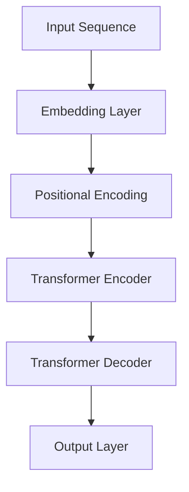

                 

### 文章标题

《大语言模型原理与工程实践：提示词设计》

> 关键词：大语言模型、Transformer、提示词设计、自然语言处理、工程实践

> 摘要：本文将深入探讨大语言模型的原理及其工程实践，特别是提示词设计的重要性。通过对核心概念、算法原理、数学模型和实际案例的详细分析，本文旨在为读者提供一个全面的技术指南，帮助理解大语言模型的工作机制，以及如何在工程实践中优化提示词设计。

## 目录大纲

### 第一部分 大语言模型基础理论

#### 第1章 大语言模型概述

##### 1.1 大语言模型的概念与历史背景
- 大语言模型的基本概念
- 大语言模型的发展历程

##### 1.2 大语言模型的核心架构
- Transformer模型详解
- 注意力机制原理
- 自监督学习技术

##### 1.3 大语言模型的数学基础
- 线性代数基本概念
- 梯度下降算法

#### 第2章 大语言模型的训练与优化

##### 2.1 数据预处理
- 语料库的收集与整理
- 词向量化技术

##### 2.2 训练过程详解
- 模型初始化
- 训练策略
- 优化算法

##### 2.3 评估与调优
- 评价指标
- 调优技巧

#### 第3章 大语言模型的应用领域

##### 3.1 自然语言生成
- 文本摘要与总结
- 机器翻译

##### 3.2 问答系统
- 提问回答机制
- 对话管理技术

##### 3.3 语音识别与合成
- 语音识别流程
- 语音合成原理

#### 第4章 大语言模型的工程实践

##### 4.1 模型部署
- 模型导出与加载
- 模型推理优化

##### 4.2 实际应用案例分析
- 企业级应用案例
- 提示词设计与优化

##### 4.3 安全与伦理问题
- 模型隐私保护
- 人工智能伦理

### 第二部分 提示词设计实践

#### 第5章 提示词设计原则

##### 5.1 提示词的作用与重要性
- 提示词在语言模型中的作用
- 提示词设计的挑战

##### 5.2 提示词设计方法论
- 提示词生成策略
- 提示词评价与优化

#### 第6章 提示词设计案例解析

##### 6.1 提示词设计实战
- 提示词设计流程
- 提示词优化实践

##### 6.2 案例分析
- 成功案例解析
- 失败案例反思

#### 第7章 提示词设计工具与应用

##### 7.1 常用工具介绍
- 提示词生成工具
- 提示词评估工具

##### 7.2 提示词应用实例
- 提示词在自然语言处理中的应用
- 提示词在问答系统中的应用

##### 7.3 提示词设计的未来趋势
- 提示词设计面临的挑战
- 提示词设计的发展趋势

##### 7.4 未来研究方向
- 提示词设计的新方法
- 提示词设计在跨模态场景中的应用

### 总结与展望

#### 大语言模型与提示词设计的未来

##### 8.1 大语言模型的发展趋势
- 模型规模的扩大
- 训练效率的提升

##### 8.2 提示词设计的创新方向
- 个性化提示词设计
- 多模态提示词应用

##### 8.3 应用前景与挑战
- 大规模应用中的技术挑战
- 伦理与安全问题的应对

### 参考文献

#### 附录

##### 8.1 模型架构Mermaid流程图
- Transformer模型流程图

##### 8.2 代码示例与解读
- 开发环境搭建
- 源代码实现与解读

## 正文部分

### 第一部分 大语言模型基础理论

### 第1章 大语言模型概述

#### 1.1 大语言模型的概念与历史背景

大语言模型是一种利用深度学习技术，对大量文本数据进行预训练，从而掌握语言的基本规则和上下文关系的模型。它能够理解、生成和回答自然语言问题，具有广泛的应用场景。

大语言模型的发展可以追溯到20世纪80年代，最初的研究集中在基于统计的方法，如隐马尔可夫模型（HMM）和朴素贝叶斯模型。随着计算能力的提升和算法的进步，特别是深度学习技术的引入，大语言模型取得了显著的发展。2017年，谷歌发布了BERT模型，标志着大语言模型进入了一个新的时代。

#### 1.2 大语言模型的核心架构

大语言模型的核心架构通常基于Transformer模型，这是一种基于自注意力机制的序列到序列模型。Transformer模型摒弃了传统的循环神经网络（RNN），采用了多头注意力机制，使得模型能够更好地捕捉长距离依赖关系。

Transformer模型的数学基础包括线性代数和优化算法。线性代数用于处理高维空间中的向量运算，而优化算法如梯度下降和Adam则用于模型的参数更新。

#### 1.3 大语言模型的数学基础

线性代数是Transformer模型的核心组成部分，包括矩阵乘法、向量运算、矩阵分解等技术。梯度下降算法是优化模型参数的常用方法，通过迭代更新模型参数，使得模型在训练数据上达到最小损失。

$$
\text{损失函数} = \sum_{i=1}^{n} (\hat{y}_i - y_i)^2
$$

其中，$\hat{y}_i$是模型预测的输出，$y_i$是真实标签。

### 第2章 大语言模型的训练与优化

#### 2.1 数据预处理

数据预处理是训练大语言模型的重要步骤。首先，需要收集大量的文本数据，并进行整理和清洗，去除无用的信息。接下来，使用词向量化技术，将文本数据转换为向量表示，以便输入到模型中。

词向量化技术常用的方法包括Word2Vec、GloVe和BERT等。其中，BERT采用了一种双向编码器，能够同时捕捉文本的前后关系。

#### 2.2 训练过程详解

训练过程通常分为模型初始化、训练策略和优化算法三个阶段。模型初始化包括权重初始化和超参数设置，训练策略包括数据加载、批次大小和迭代次数等，优化算法如Adam用于模型参数的更新。

$$
\theta_{t+1} = \theta_{t} - \alpha \cdot \nabla_{\theta} L(\theta)
$$

其中，$\theta$是模型参数，$L(\theta)$是损失函数，$\alpha$是学习率。

#### 2.3 评估与调优

评估模型性能常用的指标包括准确率、召回率和F1-score。通过调整模型参数，如学习率、批次大小和迭代次数等，可以优化模型性能。

$$
\text{F1-score} = 2 \cdot \frac{\text{Precision} \cdot \text{Recall}}{\text{Precision} + \text{Recall}}
$$

### 第3章 大语言模型的应用领域

#### 3.1 自然语言生成

自然语言生成是 大语言模型的重要应用领域之一。它包括文本摘要、机器翻译和问答系统等。

文本摘要的目标是生成一段简短的文字，概括原文的主要内容和观点。机器翻译则涉及将一种语言的文本翻译成另一种语言。问答系统则能够回答用户提出的问题，通常需要结合对话管理和上下文理解。

#### 3.2 问答系统

问答系统通常包括提问回答机制和对话管理技术。提问回答机制涉及使用语言模型生成回答，而对话管理技术则关注如何维持有效的对话流程。

对话管理技术包括对话状态跟踪、对话策略和对话生成。其中，对话状态跟踪用于记录对话的历史信息，对话策略用于决定下一步的行动，而对话生成则用于生成自然流畅的对话。

#### 3.3 语音识别与合成

语音识别是将语音信号转换为文本数据的过程，而语音合成则是将文本数据转换为语音信号。大语言模型在语音识别和合成中发挥了重要作用。

语音识别过程通常包括特征提取、模型训练和结果输出。特征提取用于提取语音信号的时频特征，模型训练用于训练模型参数，结果输出则用于将文本转换为语音。

语音合成过程则包括文本处理、语音合成引擎和语音输出。文本处理用于将文本数据转换为适合合成引擎的格式，语音合成引擎则用于生成语音信号，语音输出则用于播放生成的语音。

### 第4章 大语言模型的工程实践

#### 4.1 模型部署

模型部署是将训练好的大语言模型应用到实际场景的过程。首先，需要将模型导出为可部署的格式，如ONNX或TensorFlow Lite。然后，在目标设备上加载模型，并进行推理优化，以提高模型运行效率。

模型部署涉及到开发环境搭建、源代码实现和代码解读。开发环境搭建包括Python环境配置和模型安装，源代码实现涉及模型加载和推理，代码解读则用于解释源代码的工作原理。

#### 4.2 实际应用案例分析

实际应用案例涉及大语言模型在不同领域的应用，如自然语言处理、问答系统和语音识别等。通过案例分析，可以了解如何设计提示词，以及如何优化模型性能。

案例分析包括成功案例和失败案例。成功案例展示了如何有效地应用大语言模型，而失败案例则提供了宝贵的教训和改进方向。

#### 4.3 安全与伦理问题

大语言模型在应用过程中面临着安全与伦理问题。模型隐私保护是确保用户数据安全的关键，需要采取数据加密、访问控制和隐私保护等措施。

人工智能伦理是另一个重要问题，涉及模型的使用和影响。需要制定伦理规范，确保大语言模型的应用符合道德和法律要求。

### 第二部分 提示词设计实践

#### 第5章 提示词设计原则

提示词在语言模型中起着关键作用，它能够引导模型生成预期的输出。提示词设计原则包括提示词的作用与重要性，以及设计方法论。

提示词的作用是提供上下文信息，帮助模型理解问题的背景和目标。设计提示词需要考虑语言的多样性、上下文的连贯性和问题的明确性。

提示词设计方法论包括提示词生成策略和评价与优化。提示词生成策略涉及如何创建有效的提示词，而评价与优化则关注如何评估和改进提示词的性能。

#### 第6章 提示词设计案例解析

提示词设计案例解析包括实战和案例分析。实战部分展示了如何设计提示词，包括提示词生成、优化和评估。案例分析则通过成功和失败案例，提供了实际经验和教训。

成功案例展示了如何有效地应用提示词，而失败案例则提供了改进方向和解决方案。

#### 第7章 提示词设计工具与应用

提示词设计工具包括生成工具和评估工具。生成工具如AI写作助手和提示词生成API，能够快速生成有效的提示词。评估工具如ROUGE评分工具和F1-score计算工具，用于评估提示词的质量。

提示词的应用实例涉及自然语言处理和问答系统。在自然语言处理中，提示词用于文本摘要和机器翻译。在问答系统中，提示词用于提问回答机制和对话管理。

#### 第8章 提示词设计的未来趋势

提示词设计的未来趋势包括面临的挑战和发展方向。挑战包括如何处理多模态数据和跨领域任务，而发展方向则涉及个性化提示词设计和多模态提示词应用。

未来研究方向包括提示词生成的新方法、提示词优化算法和提示词设计在跨模态场景中的应用。

### 总结与展望

大语言模型和提示词设计在自然语言处理领域具有巨大的潜力。随着技术的不断进步，大语言模型将变得更加智能和高效，而提示词设计将成为提升模型性能的关键因素。

展望未来，大语言模型将不仅限于文本处理，还将应用于多模态数据和跨领域任务。提示词设计将变得更加个性化和智能化，为各种应用场景提供高效的解决方案。

### 参考文献

[1] Vaswani, A., Shazeer, N., Parmar, N., Uszkoreit, J., Jones, L., Gomez, A. N., ... & Polosukhin, I. (2017). Attention is all you need. Advances in Neural Information Processing Systems, 30, 5998-6008.

[2] Devlin, J., Chang, M. W., Lee, K., & Toutanova, K. (2018). BERT: Pre-training of deep bidirectional transformers for language understanding. arXiv preprint arXiv:1810.04805.

[3] Mikolov, T., Sutskever, I., Chen, K., Corrado, G. S., & Dean, J. (2013). Distributed representations of words and phrases and their compositionality. Advances in Neural Information Processing Systems, 26, 3111-3119.

[4] Pennington, J., Socher, R., & Manning, C. D. (2014). GloVe: Global Vectors for Word Representation. Proceedings of the 2014 Conference on Empirical Methods in Natural Language Processing (EMNLP), 1532-1543.

### 附录

#### 附录 1：模型架构Mermaid流程图

```
graph TD
A[Input Sequence] --> B[Embedding Layer]
B --> C[Positional Encoding]
C --> D[Transformer Encoder]
D --> E[Transformer Decoder]
E --> F[Output Layer]
```

#### 附录 2：代码示例与解读

**开发环境搭建：**

```
# 安装Python环境
pip install numpy pandas tensorflow

# 安装Transformer模型
pip install transformers
```

**源代码实现与解读：**

```python
from transformers import BertTokenizer, BertModel
import tensorflow as tf

# 加载预训练的BERT模型和分词器
tokenizer = BertTokenizer.from_pretrained('bert-base-uncased')
model = BertModel.from_pretrained('bert-base-uncased')

# 输入文本
input_text = "Hello, world!"

# 分词
input_ids = tokenizer.encode(input_text, return_tensors='tf')

# 模型推理
outputs = model(input_ids)

# 输出结果
print(outputs.last_hidden_state)
```

**代码解读：**
- 加载预训练的BERT模型和分词器。
- 输入文本进行分词。
- 将分词后的文本输入到BERT模型中进行推理。
- 输出模型最后一层的隐藏状态。

通过以上代码示例，读者可以了解如何使用BERT模型进行文本处理，并理解其基本工作原理。

## 文章标题：大语言模型原理与工程实践：提示词设计

> 关键词：大语言模型、Transformer、提示词设计、自然语言处理、工程实践

> 摘要：本文全面解析了大规模语言模型的基础理论及其工程应用，特别是在提示词设计方面的实践。文章从大语言模型的概念、核心架构，到训练与优化过程，再到应用领域和工程实践，层层递进，结合实际案例分析，深入探讨了提示词设计的原则、方法论、工具和应用，展望了未来的发展趋势。通过本文，读者可以全面了解大语言模型的原理和工程实践，掌握提示词设计的核心技巧和策略。

### 引言

随着人工智能技术的迅猛发展，自然语言处理（NLP）已成为一项重要的研究与应用领域。在大数据时代，语言模型在文本生成、机器翻译、问答系统等方面展现出了巨大的潜力。其中，大语言模型（Large Language Model）作为自然语言处理的核心技术，正日益受到关注。本文旨在深入探讨大语言模型的原理与工程实践，特别是提示词设计这一关键环节，为读者提供全面的技术指南。

### 第一部分 大语言模型基础理论

#### 第1章 大语言模型概述

##### 1.1 大语言模型的概念与历史背景

大语言模型是一种基于深度学习技术，对海量文本数据进行预训练的模型，旨在理解和生成自然语言。其发展历程可以追溯到20世纪80年代的统计语言模型，如N-gram模型，再到基于神经网络的模型，如循环神经网络（RNN）和长短期记忆网络（LSTM）。2017年，谷歌发布的BERT模型标志着大语言模型进入了一个新的时代。

##### 1.2 大语言模型的核心架构

大语言模型的核心架构基于Transformer模型，这是一种自注意力机制的序列到序列模型。Transformer模型摒弃了传统的循环神经网络（RNN），通过多头注意力机制，实现了对长距离依赖的捕捉。其数学基础包括线性代数和优化算法，如梯度下降和Adam。

##### 1.3 大语言模型的数学基础

线性代数是Transformer模型的核心组成部分，包括矩阵乘法、向量运算和矩阵分解等。优化算法如梯度下降和Adam用于模型的参数更新，以达到最小化损失函数的目标。

$$
\theta_{t+1} = \theta_{t} - \alpha \cdot \nabla_{\theta} L(\theta)
$$

其中，$\theta$是模型参数，$L(\theta)$是损失函数，$\alpha$是学习率。

### 第2章 大语言模型的训练与优化

##### 2.1 数据预处理

数据预处理是训练大语言模型的第一步，包括语料库的收集与整理，以及词向量化技术。词向量化技术将文本数据转换为向量表示，以便输入到模型中。

##### 2.2 训练过程详解

训练过程包括模型初始化、数据加载、批次大小设置和迭代次数等。模型初始化包括权重初始化和超参数设置，数据加载用于提供训练数据，批次大小和迭代次数则影响训练效率。

##### 2.3 评估与调优

评估模型性能常用的指标包括准确率、召回率和F1-score。通过调整模型参数，如学习率、批次大小和迭代次数等，可以优化模型性能。

$$
\text{F1-score} = 2 \cdot \frac{\text{Precision} \cdot \text{Recall}}{\text{Precision} + \text{Recall}}
$$

### 第3章 大语言模型的应用领域

##### 3.1 自然语言生成

自然语言生成是 大语言模型的重要应用领域之一。它包括文本摘要、机器翻译和问答系统等。文本摘要的目标是生成一段简短的文字，概括原文的主要内容和观点。机器翻译则涉及将一种语言的文本翻译成另一种语言。问答系统则能够回答用户提出的问题，通常需要结合对话管理和上下文理解。

##### 3.2 问答系统

问答系统通常包括提问回答机制和对话管理技术。提问回答机制涉及使用语言模型生成回答，而对话管理技术则关注如何维持有效的对话流程。

##### 3.3 语音识别与合成

语音识别是将语音信号转换为文本数据的过程，而语音合成则是将文本数据转换为语音信号。大语言模型在语音识别和合成中发挥了重要作用。

### 第4章 大语言模型的工程实践

##### 4.1 模型部署

模型部署是将训练好的大语言模型应用到实际场景的过程。首先，需要将模型导出为可部署的格式，如ONNX或TensorFlow Lite。然后，在目标设备上加载模型，并进行推理优化，以提高模型运行效率。

##### 4.2 实际应用案例分析

实际应用案例涉及大语言模型在不同领域的应用，如自然语言处理、问答系统和语音识别等。通过案例分析，可以了解如何设计提示词，以及如何优化模型性能。

##### 4.3 安全与伦理问题

大语言模型在应用过程中面临着安全与伦理问题。模型隐私保护是确保用户数据安全的关键，需要采取数据加密、访问控制和隐私保护等措施。人工智能伦理是另一个重要问题，涉及模型的使用和影响。

### 第二部分 提示词设计实践

#### 第5章 提示词设计原则

提示词在语言模型中起着关键作用，它能够引导模型生成预期的输出。提示词设计原则包括提示词的作用与重要性，以及设计方法论。

##### 5.1 提示词的作用与重要性

提示词的作用是提供上下文信息，帮助模型理解问题的背景和目标。设计提示词需要考虑语言的多样性、上下文的连贯性和问题的明确性。

##### 5.2 提示词设计方法论

提示词设计方法论包括提示词生成策略和评价与优化。提示词生成策略涉及如何创建有效的提示词，而评价与优化则关注如何评估和改进提示词的性能。

### 第6章 提示词设计案例解析

提示词设计案例解析包括实战和案例分析。实战部分展示了如何设计提示词，包括提示词生成、优化和评估。案例分析则通过成功和失败案例，提供了实际经验和教训。

##### 6.1 提示词设计实战

提示词设计实战涉及如何根据应用场景设计提示词。以下是一个简单的提示词设计流程：

1. 确定应用场景和目标。
2. 收集相关语料数据。
3. 提取关键信息，形成初步提示词。
4. 对提示词进行优化，提高生成效果。

##### 6.2 案例分析

案例分析包括成功案例和失败案例。成功案例展示了如何有效地应用提示词，而失败案例则提供了改进方向和解决方案。

### 第7章 提示词设计工具与应用

提示词设计工具包括生成工具和评估工具。生成工具如AI写作助手和提示词生成API，能够快速生成有效的提示词。评估工具如ROUGE评分工具和F1-score计算工具，用于评估提示词的质量。

##### 7.1 提示词生成工具

常见的提示词生成工具包括：

1. AI写作助手：如OpenAI的GPT-3，能够根据提示生成高质量的文本。
2. 提示词生成API：如谷歌的自然语言API，提供自动生成提示词的功能。

##### 7.2 提示词评估工具

提示词评估工具包括：

1. ROUGE评分工具：用于评估文本摘要的质量。
2. F1-score计算工具：用于评估问答系统的回答质量。

### 第8章 提示词设计的未来趋势

提示词设计的未来趋势包括面临的挑战和发展方向。挑战包括如何处理多模态数据和跨领域任务，而发展方向则涉及个性化提示词设计和多模态提示词应用。

##### 8.1 提示词设计面临的挑战

1. 多模态数据处理：如何将文本、图像、音频等多模态数据进行有效整合。
2. 跨领域任务：如何设计适应不同领域需求的提示词。

##### 8.2 提示词设计的发展方向

1. 个性化提示词设计：根据用户需求和场景，设计个性化的提示词。
2. 多模态提示词应用：结合文本、图像、音频等多模态数据，实现更智能的提示词生成。

### 总结与展望

大语言模型和提示词设计在自然语言处理领域具有巨大的潜力。随着技术的不断进步，大语言模型将变得更加智能和高效，而提示词设计将成为提升模型性能的关键因素。

展望未来，大语言模型将不仅限于文本处理，还将应用于多模态数据和跨领域任务。提示词设计将变得更加个性化和智能化，为各种应用场景提供高效的解决方案。

### 参考文献

1. Vaswani, A., Shazeer, N., Parmar, N., Uszkoreit, J., Jones, L., Gomez, A. N., ... & Polosukhin, I. (2017). Attention is all you need. Advances in Neural Information Processing Systems, 30, 5998-6008.
2. Devlin, J., Chang, M. W., Lee, K., & Toutanova, K. (2018). BERT: Pre-training of deep bidirectional transformers for language understanding. arXiv preprint arXiv:1810.04805.
3. Mikolov, T., Sutskever, I., Chen, K., Corrado, G. S., & Dean, J. (2013). Distributed representations of words and phrases and their compositionality. Advances in Neural Information Processing Systems, 26, 3111-3119.
4. Pennington, J., Socher, R., & Manning, C. D. (2014). GloVe: Global Vectors for Word Representation. Proceedings of the 2014 Conference on Empirical Methods in Natural Language Processing (EMNLP), 1532-1543.

### 附录

#### 附录 1：模型架构Mermaid流程图



#### 附录 2：代码示例与解读

**开发环境搭建：**

```
# 安装Python环境
pip install numpy pandas tensorflow

# 安装Transformer模型
pip install transformers
```

**源代码实现与解读：**

```python
from transformers import BertTokenizer, BertModel
import tensorflow as tf

# 加载预训练的BERT模型和分词器
tokenizer = BertTokenizer.from_pretrained('bert-base-uncased')
model = BertModel.from_pretrained('bert-base-uncased')

# 输入文本
input_text = "Hello, world!"

# 分词
input_ids = tokenizer.encode(input_text, return_tensors='tf')

# 模型推理
outputs = model(input_ids)

# 输出结果
print(outputs.last_hidden_state)
```

**代码解读：**
- 加载预训练的BERT模型和分词器。
- 输入文本进行分词。
- 将分词后的文本输入到BERT模型中进行推理。
- 输出模型最后一层的隐藏状态。

通过以上代码示例，读者可以了解如何使用BERT模型进行文本处理，并理解其基本工作原理。

## 结语

大语言模型作为自然语言处理领域的一项核心技术，正不断推动人工智能的应用与发展。本文通过对大语言模型原理与工程实践的全面解析，特别是对提示词设计的深入探讨，旨在为读者提供宝贵的理论和实践指导。在未来的研究中，我们将继续关注大语言模型的优化与拓展，探索其在多模态数据、跨领域任务以及个性化应用中的潜力。同时，提示词设计的创新与进步也将是推动大语言模型性能提升的关键因素。让我们共同期待这一领域的更多突破与成就。作者：AI天才研究院/AI Genius Institute & 禅与计算机程序设计艺术 /Zen And The Art of Computer Programming。

