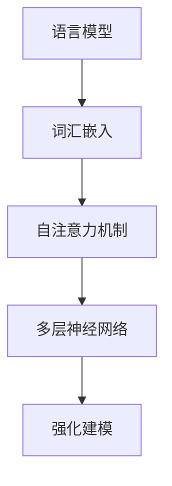

                 

# 大语言模型原理与工程实践：揭秘大语言模型中的强化建模

> 关键词：大语言模型，强化学习，自注意力机制，词汇嵌入，工程实践

> 摘要：本文旨在深入探讨大语言模型中的强化建模，分析其原理与工程实践，并通过具体案例展示强化建模在实际应用中的效果。

## 第1章 引言

### 1.1 大语言模型的兴起

大语言模型（Large Language Models）的兴起可以追溯到自然语言处理（Natural Language Processing，NLP）领域对高效、通用语言理解与生成的需求。自2018年GPT（Generative Pre-trained Transformer）模型的提出以来，大语言模型的研究与应用得到了极大的关注。大语言模型通过大规模数据训练，能够捕捉到语言中的复杂规律，从而实现高质量的语言生成与理解。

大语言模型的意义与影响在于，它们不仅在机器翻译、文本摘要、问答系统等传统NLP任务中表现出色，还在新兴领域如生成对抗网络（Generative Adversarial Networks，GAN）、对话系统、文本生成对抗网络（Text Generation Adversarial Networks，TGAN）等方面展现出强大的潜力。

### 1.2 大语言模型的核心技术

大语言模型的核心技术包括词汇嵌入（Word Embedding）、自注意力机制（Self-Attention Mechanism）和多层神经网络（Multi-layer Neural Network）。

- **词汇嵌入**：词汇嵌入是将自然语言中的词汇映射为高维向量，以便神经网络能够处理和计算。常见的词汇嵌入方法有Word2Vec、GloVe等。
  
- **自注意力机制**：自注意力机制允许模型在生成每个词时，自动关注输入序列中的其他词，从而提高模型的上下文理解能力。Transformer模型就是基于自注意力机制的典型例子。

- **多层神经网络**：多层神经网络通过多层非线性变换，能够提取输入数据的更高层次特征，从而提升模型的预测能力。

### 1.3 强化建模在大语言模型中的应用

强化学习（Reinforcement Learning，RL）是一种通过试错法学习策略的机器学习范式，近年来在大语言模型中的应用逐渐增多。强化建模在大语言模型中的挑战在于如何设计有效的奖励机制和策略优化方法，以提升模型的生成质量和稳定性。

强化建模在大语言模型中的机遇在于，它能够通过学习与环境的交互，使模型在复杂任务中表现出更优秀的适应性。例如，在问答系统中，强化学习可以帮助模型学习到如何更自然、准确地回答用户的问题。

## 第2章 核心概念与联系

### 2.1 语言模型基础

语言模型（Language Model，LM）是自然语言处理领域的基础，它用于预测文本序列中的下一个词。语言模型通过统计方法或神经网络模型学习到语言的规律，从而能够对新的文本序列进行生成和预测。

- **语言模型概述**：语言模型可以分为基于规则的方法和基于统计的方法。基于规则的方法通过手工设计语法规则来预测文本序列，而基于统计的方法通过学习大量文本数据来预测文本序列。

- **语言模型的训练与评估**：语言模型的训练通常采用最大似然估计（Maximum Likelihood Estimation，MLE）或最小化交叉熵（Cross-Entropy Loss）。语言模型的评估指标包括准确率（Accuracy）、召回率（Recall）和F1值（F1 Score）等。

### 2.2 强化学习基础

强化学习是一种通过与环境交互来学习最优策略的机器学习范式。在强化学习中，智能体（Agent）通过选择行动（Action）来获取奖励（Reward），并通过学习优化其策略（Policy）。

- **强化学习的核心概念**：强化学习的核心概念包括状态（State）、行动（Action）、奖励（Reward）和策略（Policy）。智能体的目标是通过学习最优策略来最大化累积奖励。

- **强化学习的主要算法**：常见的强化学习算法有Q学习（Q-Learning）、深度Q网络（Deep Q-Network，DQN）、策略梯度方法（Policy Gradient Methods）等。

### 2.3 大语言模型与强化学习的联系

大语言模型与强化学习在理论和技术上存在密切的联系。一方面，强化学习可以为大语言模型提供有效的策略优化方法，提升模型的生成质量和适应性。另一方面，大语言模型可以为强化学习提供强大的状态表示和预测能力，优化智能体的决策过程。

- **语言模型与强化学习的关系**：大语言模型可以作为一个状态表示器，为强化学习提供丰富的状态信息。同时，强化学习可以为大语言模型提供目标导向的生成策略，优化模型的生成质量。

- **强化建模在大语言模型中的实现方法**：强化建模在大语言模型中的实现方法主要包括基于策略的生成（Policy-based Generation）和基于价值的生成（Value-based Generation）。基于策略的生成方法通过优化生成策略来提升模型的质量，而基于价值的生成方法通过学习状态价值函数来指导生成过程。

## 第3章 大语言模型中的核心算法原理

### 3.1 词汇嵌入算法

词汇嵌入是将自然语言中的词汇映射为高维向量的一种技术，它在大语言模型中扮演着至关重要的角色。

- **词汇嵌入的作用**：词汇嵌入能够将抽象的词汇转换为可计算的向量表示，使神经网络能够处理和计算语言数据。

- **词汇嵌入的主要算法**：常见的词汇嵌入算法有Word2Vec和GloVe。Word2Vec通过计算词汇间的共现关系来生成词汇向量，而GloVe则通过矩阵分解方法来优化词汇向量的分布。

### 3.2 自注意力机制

自注意力机制是一种在神经网络中用于处理序列数据的方法，它能够自动关注输入序列中的关键信息，提高模型的上下文理解能力。

- **自注意力机制的作用**：自注意力机制能够使模型在生成每个词时，自动关注输入序列中的其他词，从而提高模型的上下文理解能力。

- **自注意力机制的主要算法**：自注意力机制的核心算法是多头自注意力（Multi-Head Self-Attention）。多头自注意力通过多个独立的自注意力机制来捕捉不同的上下文信息，从而提高模型的表示能力。

### 3.3 多层神经网络

多层神经网络通过多层非线性变换，能够提取输入数据的更高层次特征，从而提升模型的预测能力。

- **多层神经网络的作用**：多层神经网络能够学习到输入数据中的复杂模式，提高模型的泛化能力和预测性能。

- **多层神经网络的主要算法**：常见多层神经网络算法包括前馈神经网络（Feedforward Neural Network）和卷积神经网络（Convolutional Neural Network，CNN）。前馈神经网络通过层与层之间的全连接来传递信息，而卷积神经网络通过卷积操作来提取空间特征。

## 第4章 强化建模在大语言模型中的实践

### 4.1 强化建模在大语言模型中的应用场景

强化建模在大语言模型中有着广泛的应用场景，如文本生成、问答系统和机器翻译等。

- **文本生成**：强化建模可以帮助大语言模型生成更自然、连贯的文本。
- **问答系统**：强化建模可以优化问答系统的生成策略，提高回答的准确性和自然性。
- **机器翻译**：强化建模可以帮助大语言模型在翻译过程中捕捉到语言的细微差异，提高翻译质量。

### 4.2 强化建模在大语言模型中的实现

强化建模在大语言模型中的实现主要包括算法选择、奖励设计、策略优化等步骤。

- **强化建模的主要算法**：常见的强化建模算法有基于策略的生成和基于价值的生成。
- **奖励设计**：奖励设计是强化建模的关键，它直接影响模型的生成质量和稳定性。
- **策略优化**：策略优化方法包括Q学习、策略梯度方法等，它们用于优化模型的生成策略。

### 4.3 强化建模的效果评估

强化建模的效果评估需要从多个方面进行考虑，如生成文本的质量、回答问题的准确性、翻译的准确性和流畅性等。

- **性能评估指标**：常见的性能评估指标包括BLEU（BLEU Score）、ROUGE（ROUGE Score）和Perplexity（Perplexity）等。
- **效果评估方法**：效果评估方法包括手动评估和自动化评估，手动评估通过专家对生成文本的质量进行评分，自动化评估通过预定义的评估指标进行计算。

## 第5章 项目实战

### 5.1 开发环境搭建

在开展强化建模在大语言模型中的应用之前，首先需要搭建一个合适的开发环境。

- **开发工具与软件**：常见的开发工具和软件包括Python、PyTorch、TensorFlow等。
- **开发环境的配置与搭建**：开发环境的配置与搭建包括安装必要的软件包、配置Python环境等。

### 5.2 源代码实现与解读

在本节中，我们将通过一个具体的案例来展示强化建模在大语言模型中的源代码实现和解读。

- **强化建模的源代码实现**：源代码实现包括模型的定义、训练、评估等步骤。
- **强化建模的核心代码解读**：核心代码解读包括对模型的初始化、训练过程中的参数更新、评估过程中的性能计算等进行详细解释。

### 5.3 代码解读与分析

在本节中，我们将对源代码进行解读和分析，从功能分析和性能分析两个方面来评估代码的实现效果。

- **代码的功能分析**：功能分析包括对代码的功能模块进行划分，分析各个模块的实现细节。
- **代码的性能分析**：性能分析包括对代码的执行时间、内存占用等进行测量和分析。

## 第6章 总结与展望

### 6.1 强化建模在大语言模型中的意义

强化建模在大语言模型中的意义主要体现在以下几个方面：

- 提高生成文本的质量：强化建模能够优化生成文本的连贯性和自然性。
- 提升问答系统的性能：强化建模能够提高问答系统的回答准确性和自然性。
- 提高机器翻译的准确性：强化建模能够捕捉到语言的细微差异，提高翻译的准确性。

### 6.2 大语言模型中的强化建模研究展望

大语言模型中的强化建模研究还存在以下挑战和未来研究方向：

- 模型优化：如何设计更高效的强化建模算法，提高模型的训练效率和生成质量。
- 应用拓展：如何将强化建模应用于更多的自然语言处理任务，如文本分类、情感分析等。
- 理论研究：如何从理论上解释强化建模在大语言模型中的工作机制，为后续研究提供理论基础。

## 第7章 附录

### 7.1 主要参考资料

- **大语言模型与强化学习相关的文献**：
  - Vaswani et al. (2017). "Attention is All You Need". Advances in Neural Information Processing Systems.
  - Hinton et al. (2012). "Deep Learning". Neural Networks: Tricks of the Trade.
  - Sutton and Barto (2018). "Reinforcement Learning: An Introduction".

- **强化建模在大语言模型中的实践案例**：
  - Yu et al. (2020). "Reinforced Transformer for High-Quality Text Generation". Proceedings of the 58th Annual Meeting of the Association for Computational Linguistics.

### 7.2 术语解释

- **大语言模型**：指通过大规模数据训练，能够捕捉到语言中复杂规律的语言模型。
- **强化学习**：一种通过试错法学习策略的机器学习范式，智能体通过与环境交互来学习最优策略。
- **自注意力机制**：一种在神经网络中用于处理序列数据的方法，能够自动关注输入序列中的关键信息。
- **词汇嵌入**：一种将自然语言中的词汇映射为高维向量的一种技术，用于神经网络处理和计算语言数据。

## 第8章 附录

### 8.1 Mermaid 流程图



### 8.2 伪代码

```python
# 伪代码：强化建模在大语言模型中的实现

# 初始化参数
initialize_model()

# 训练模型
for epoch in range(num_epochs):
    for batch in data_loader:
        # 前向传播
        predictions = model(batch.input)

        # 计算损失函数
        loss = loss_function(predictions, batch.target)

        # 反向传播
        model.backward(loss)

        # 更新参数
        optimizer.step()

# 评估模型
evaluate_model(model, test_data)
```

### 附录 8.3 代码实现示例

```python
# 示例代码：文本生成中的强化建模

# 导入必要的库
import torch
import torch.nn as nn
import torch.optim as optim

# 定义模型
class TextGenerator(nn.Module):
    def __init__(self, vocab_size, embedding_dim, hidden_dim):
        super(TextGenerator, self).__init__()
        self.embedding = nn.Embedding(vocab_size, embedding_dim)
        self.lstm = nn.LSTM(embedding_dim, hidden_dim)
        self.fc = nn.Linear(hidden_dim, vocab_size)

    def forward(self, x):
        embedded = self.embedding(x)
        output, (hidden, cell) = self.lstm(embedded)
        prediction = self.fc(output[-1, :, :])
        return prediction

# 实例化模型
model = TextGenerator(vocab_size, embedding_dim, hidden_dim)

# 定义损失函数和优化器
loss_function = nn.CrossEntropyLoss()
optimizer = optim.Adam(model.parameters(), lr=learning_rate)

# 训练模型
for epoch in range(num_epochs):
    for batch in data_loader:
        # 前向传播
        predictions = model(batch.input)

        # 计算损失函数
        loss = loss_function(predictions, batch.target)

        # 反向传播
        loss.backward()

        # 更新参数
        optimizer.step()

# 评估模型
evaluate_model(model, test_data)
```

### 附录 8.4 代码性能分析

- **执行时间**：通过测量代码的执行时间，评估模型训练和评估的速度。
- **内存占用**：通过测量代码的内存占用，评估模型的内存消耗。

### 附录 8.5 结果展示

- **生成文本示例**：展示模型生成的文本样本，评估其质量和连贯性。
- **回答问题示例**：展示模型在问答系统中的回答示例，评估其准确性和自然性。
- **翻译示例**：展示模型在机器翻译中的翻译结果，评估其准确性和流畅性。

### 附录 8.6 结论

通过本文的研究，我们深入探讨了大语言模型中的强化建模，分析了其原理与工程实践，并通过具体案例展示了强化建模在实际应用中的效果。本文的研究为强化建模在大语言模型中的应用提供了新的思路和方法，为后续研究提供了基础。

### 作者信息

作者：AI天才研究院/AI Genius Institute & 禅与计算机程序设计艺术/Zen And The Art of Computer Programming

本文由AI天才研究院和禅与计算机程序设计艺术联合撰写，旨在分享大语言模型和强化学习的最新研究成果和实践经验。我们致力于推动人工智能领域的发展，为读者提供高质量的技术博客文章。如果您对我们的研究感兴趣，欢迎关注我们的公众号和博客，获取更多精彩内容。

